# Opinion Poll by Ipsos, 6 April 2017

<a href="#voting-intentions">Voting Intentions</a> | <a href="#seats">Seats</a> | <a href="#coalitions">Coalitions</a> | <a href="#technical-information">Technical Information</a>

## Voting Intentions

### Confidence Intervals

| Party | Last Result | Poll Result | 80% Confidence Interval | 90% Confidence Interval | 95% Confidence Interval | 99% Confidence Interval |
|:-----:|:-----------:|:-----------:|:-----------------------:|:-----------------------:|:-----------------------:|:-----------------------:|
| Volkspartij voor Vrijheid en Democratie | 21.3% | 22.0% | 20.4–23.7% |19.9–24.2% |19.5–24.7% |18.8–25.5% |
| Partij voor de Vrijheid | 13.1% | 13.1% | 11.8–14.6% |11.4–15.0% |11.1–15.3% |10.6–16.1% |
| Democraten 66 | 12.2% | 13.1% | 11.8–14.6% |11.4–15.0% |11.1–15.3% |10.6–16.1% |
| Christen-Democratisch Appèl | 12.4% | 11.9% | 10.7–13.3% |10.3–13.7% |10.0–14.1% |9.5–14.8% |
| GroenLinks | 9.1% | 9.4% | 8.3–10.7% |8.0–11.1% |7.7–11.4% |7.2–12.0% |
| Socialistische Partij | 9.1% | 7.5% | 6.5–8.7% |6.2–9.0% |6.0–9.3% |5.6–9.9% |
| Partij van de Arbeid | 5.7% | 5.1% | 4.3–6.1% |4.1–6.4% |3.9–6.6% |3.6–7.2% |
| ChristenUnie | 3.4% | 3.6% | 2.9–4.5% |2.8–4.7% |2.6–5.0% |2.3–5.4% |
| Partij voor de Dieren | 3.2% | 3.6% | 2.9–4.5% |2.8–4.7% |2.6–5.0% |2.3–5.4% |
| 50Plus | 3.1% | 2.9% | 2.3–3.7% |2.2–3.9% |2.0–4.1% |1.8–4.6% |
| Staatkundig Gereformeerde Partij | 2.1% | 2.3% | 1.8–3.0% |1.6–3.2% |1.5–3.4% |1.3–3.8% |
| DENK | 2.1% | 2.2% | 1.7–2.9% |1.6–3.1% |1.4–3.3% |1.2–3.7% |
| Forum voor Democratie | 1.8% | 2.2% | 1.7–2.9% |1.6–3.1% |1.4–3.3% |1.2–3.7% |

*Note:* The poll result column reflects the actual value used in the calculations. Published results may vary slightly, and in addition be rounded to fewer digits.

## Seats

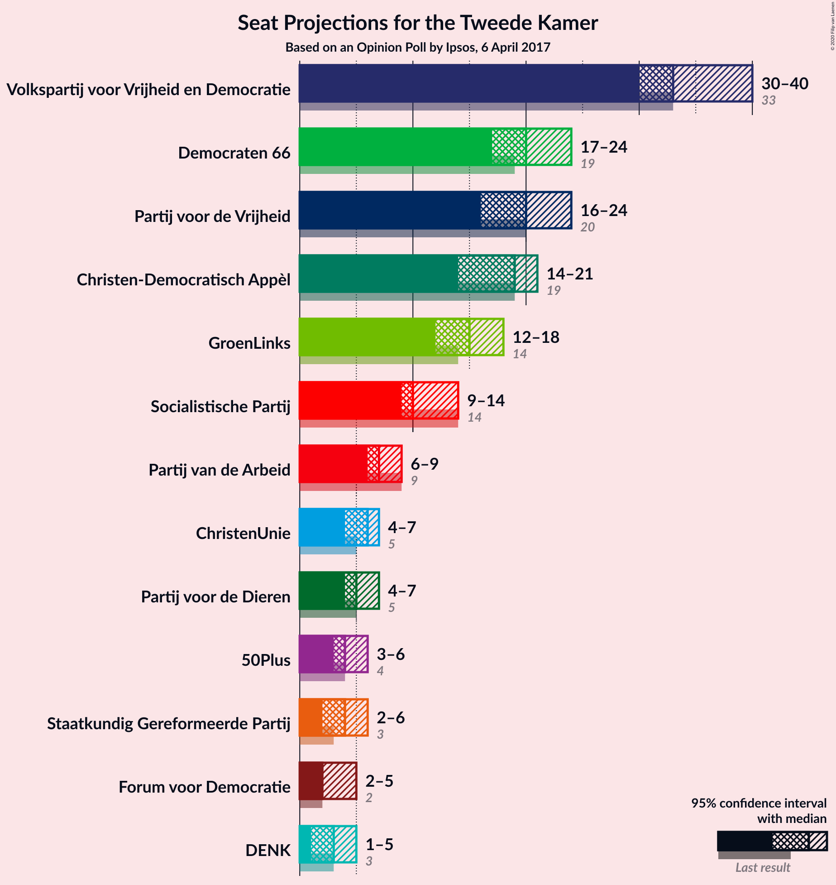

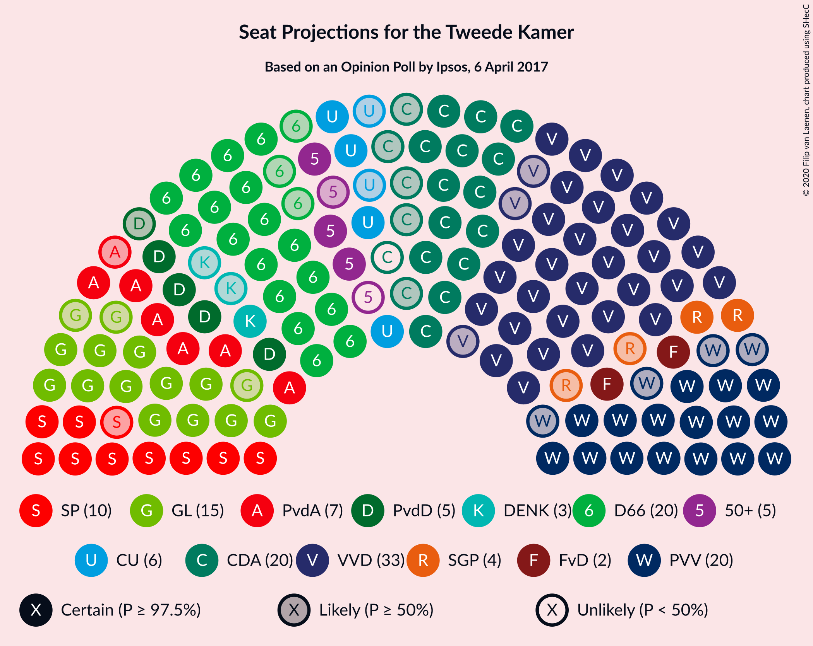

### Confidence Intervals

| Party | Last Result | Median | 80% Confidence Interval | 90% Confidence Interval | 95% Confidence Interval | 99% Confidence Interval |
|:-----:|:-----------:|:------:|:-----------------------:|:-----------------------:|:-----------------------:|:-----------------------:|
| <a href="#volkspartij-voor-vrijheid-en-democratie">Volkspartij voor Vrijheid en Democratie</a> | 33 | 33 | 29–38 |29–38 |29–38 |29–38 |
| <a href="#partij-voor-de-vrijheid">Partij voor de Vrijheid</a> | 20 | 22 | 18–22 |18–23 |18–24 |17–24 |
| <a href="#democraten-66">Democraten 66</a> | 19 | 19 | 18–21 |17–23 |17–24 |16–26 |
| <a href="#christen-democratisch-appèl">Christen-Democratisch Appèl</a> | 19 | 19 | 14–22 |14–23 |14–23 |14–23 |
| <a href="#groenlinks">GroenLinks</a> | 14 | 14 | 12–16 |11–16 |11–16 |10–17 |
| <a href="#socialistische-partij">Socialistische Partij</a> | 14 | 11 | 10–14 |9–14 |8–14 |8–14 |
| <a href="#partij-van-de-arbeid">Partij van de Arbeid</a> | 9 | 7 | 6–8 |6–9 |5–9 |5–10 |
| <a href="#christenunie">ChristenUnie</a> | 5 | 5 | 4–7 |4–7 |3–7 |3–7 |
| <a href="#partij-voor-de-dieren">Partij voor de Dieren</a> | 5 | 6 | 4–6 |4–7 |4–7 |3–8 |
| <a href="#50plus">50Plus</a> | 4 | 4 | 3–6 |3–6 |3–6 |2–6 |
| <a href="#staatkundig-gereformeerde-partij">Staatkundig Gereformeerde Partij</a> | 3 | 3 | 3–4 |3–4 |2–4 |2–5 |
| <a href="#denk">DENK</a> | 3 | 3 | 2–5 |2–5 |2–5 |1–5 |
| <a href="#forum-voor-democratie">Forum voor Democratie</a> | 2 | 3 | 2–4 |2–4 |2–4 |1–5 |

### Volkspartij voor Vrijheid en Democratie

*For a full overview of the results for this party, see the [Volkspartij voor Vrijheid en Democratie](party-volkspartijvoorvrijheidendemocratie.html) page.*

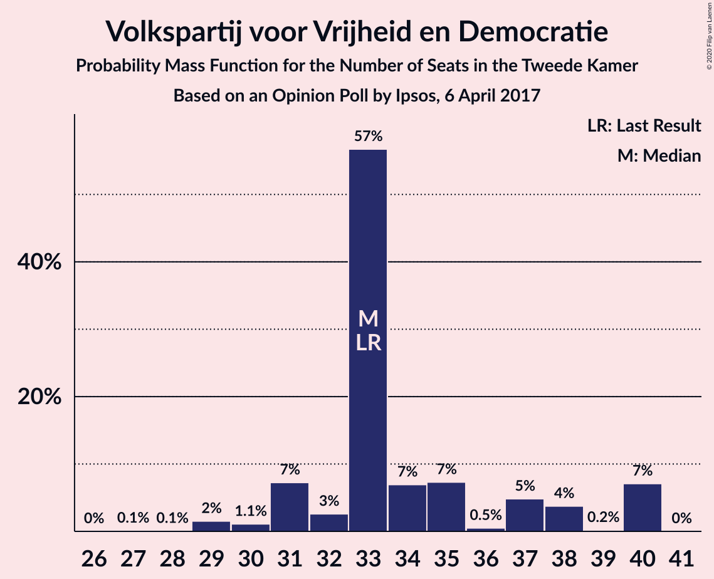

| Number of Seats | Probability | Accumulated | Special Marks |
|:---------------:|:-----------:|:-----------:|:-------------:|
| 28 | 0.2% | 100% |  |
| 29 | 17% | 99.8% |  |
| 30 | 0.4% | 83% |  |
| 31 | 23% | 82% |  |
| 32 | 4% | 60% |  |
| 33 | 13% | 56% | Last Result, Median |
| 34 | 6% | 43% |  |
| 35 | 7% | 36% |  |
| 36 | 2% | 29% |  |
| 37 | 0.7% | 28% |  |
| 38 | 27% | 27% |  |
| 39 | 0% | 0% |  |

### Partij voor de Vrijheid

*For a full overview of the results for this party, see the [Partij voor de Vrijheid](party-partijvoordevrijheid.html) page.*

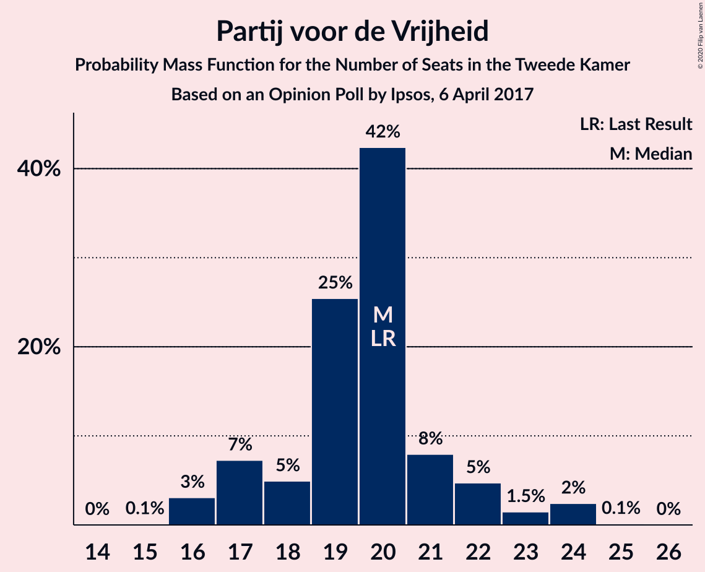

| Number of Seats | Probability | Accumulated | Special Marks |
|:---------------:|:-----------:|:-----------:|:-------------:|
| 15 | 0.3% | 100% |  |
| 16 | 0.1% | 99.7% |  |
| 17 | 0.7% | 99.6% |  |
| 18 | 11% | 98.9% |  |
| 19 | 11% | 88% |  |
| 20 | 4% | 77% | Last Result |
| 21 | 17% | 72% |  |
| 22 | 50% | 55% | Median |
| 23 | 2% | 5% |  |
| 24 | 3% | 3% |  |
| 25 | 0.2% | 0.3% |  |
| 26 | 0.1% | 0.1% |  |
| 27 | 0% | 0% |  |

### Democraten 66

*For a full overview of the results for this party, see the [Democraten 66](party-democraten66.html) page.*

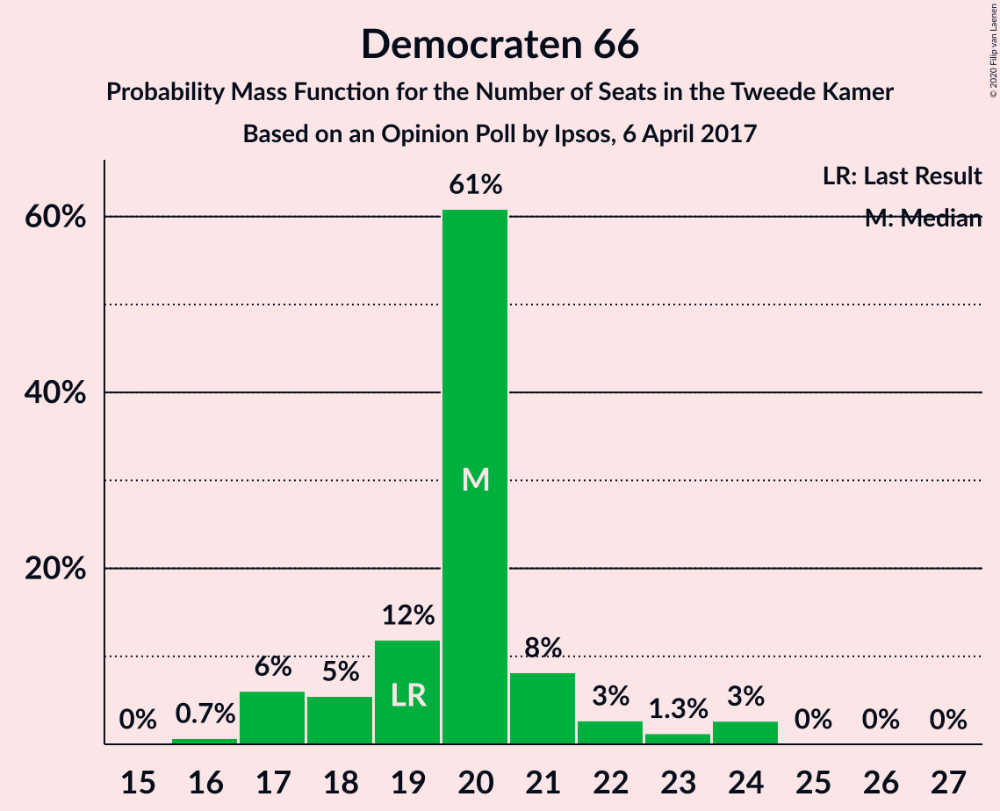

| Number of Seats | Probability | Accumulated | Special Marks |
|:---------------:|:-----------:|:-----------:|:-------------:|
| 15 | 0.1% | 100% |  |
| 16 | 0.7% | 99.9% |  |
| 17 | 7% | 99.2% |  |
| 18 | 7% | 92% |  |
| 19 | 37% | 84% | Last Result, Median |
| 20 | 20% | 48% |  |
| 21 | 22% | 28% |  |
| 22 | 0.3% | 5% |  |
| 23 | 0.4% | 5% |  |
| 24 | 4% | 5% |  |
| 25 | 0% | 0.6% |  |
| 26 | 0.6% | 0.6% |  |
| 27 | 0% | 0% |  |

### Christen-Democratisch Appèl

*For a full overview of the results for this party, see the [Christen-Democratisch Appèl](party-christen-democratischappèl.html) page.*

| Number of Seats | Probability | Accumulated | Special Marks |
|:---------------:|:-----------:|:-----------:|:-------------:|
| 12 | 0.2% | 100% |  |
| 13 | 0.2% | 99.8% |  |
| 14 | 31% | 99.6% |  |
| 15 | 2% | 68% |  |
| 16 | 0.5% | 66% |  |
| 17 | 8% | 65% |  |
| 18 | 6% | 57% |  |
| 19 | 11% | 51% | Last Result, Median |
| 20 | 29% | 40% |  |
| 21 | 1.0% | 11% |  |
| 22 | 4% | 10% |  |
| 23 | 6% | 6% |  |
| 24 | 0% | 0% |  |

### GroenLinks

*For a full overview of the results for this party, see the [GroenLinks](party-groenlinks.html) page.*

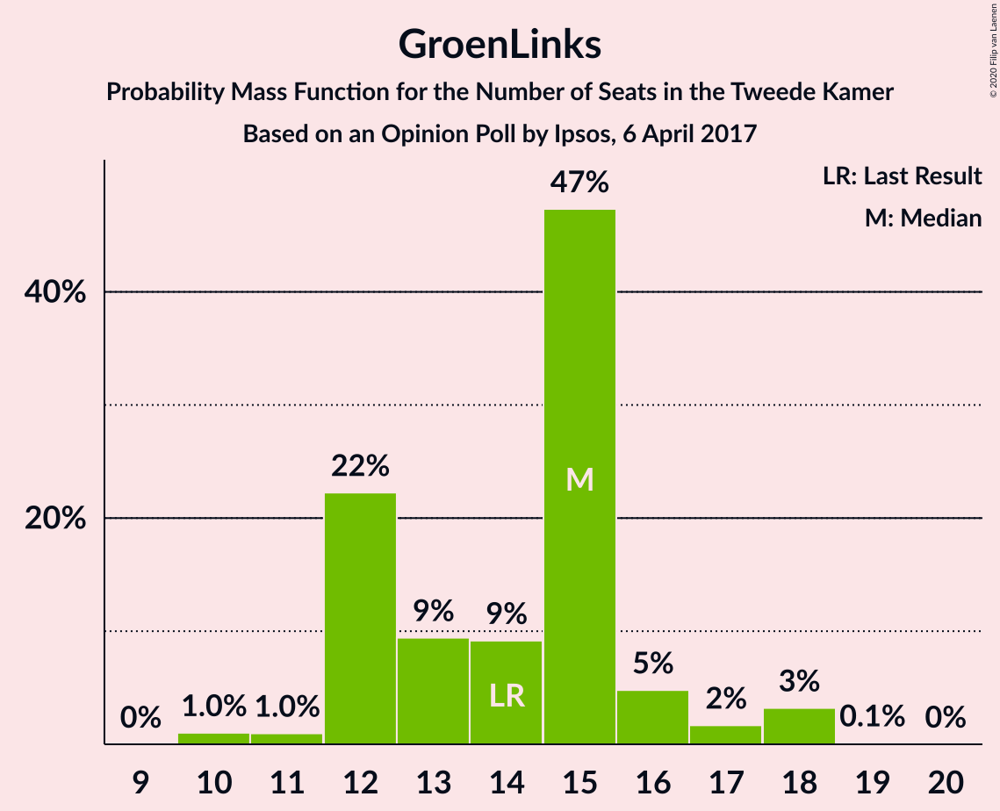

| Number of Seats | Probability | Accumulated | Special Marks |
|:---------------:|:-----------:|:-----------:|:-------------:|
| 10 | 1.3% | 100% |  |
| 11 | 7% | 98.7% |  |
| 12 | 13% | 92% |  |
| 13 | 17% | 79% |  |
| 14 | 15% | 61% | Last Result, Median |
| 15 | 8% | 47% |  |
| 16 | 37% | 38% |  |
| 17 | 0.8% | 1.1% |  |
| 18 | 0.3% | 0.3% |  |
| 19 | 0% | 0% |  |

### Socialistische Partij

*For a full overview of the results for this party, see the [Socialistische Partij](party-socialistischepartij.html) page.*

| Number of Seats | Probability | Accumulated | Special Marks |
|:---------------:|:-----------:|:-----------:|:-------------:|
| 7 | 0.1% | 100% |  |
| 8 | 5% | 99.9% |  |
| 9 | 2% | 95% |  |
| 10 | 30% | 94% |  |
| 11 | 19% | 63% | Median |
| 12 | 18% | 44% |  |
| 13 | 12% | 26% |  |
| 14 | 14% | 14% | Last Result |
| 15 | 0.1% | 0.4% |  |
| 16 | 0.3% | 0.3% |  |
| 17 | 0% | 0% |  |

### Partij van de Arbeid

*For a full overview of the results for this party, see the [Partij van de Arbeid](party-partijvandearbeid.html) page.*

| Number of Seats | Probability | Accumulated | Special Marks |
|:---------------:|:-----------:|:-----------:|:-------------:|
| 4 | 0.1% | 100% |  |
| 5 | 4% | 99.9% |  |
| 6 | 28% | 96% |  |
| 7 | 46% | 68% | Median |
| 8 | 16% | 23% |  |
| 9 | 5% | 7% | Last Result |
| 10 | 0.9% | 1.4% |  |
| 11 | 0.4% | 0.5% |  |
| 12 | 0% | 0% |  |

### ChristenUnie

*For a full overview of the results for this party, see the [ChristenUnie](party-christenunie.html) page.*

| Number of Seats | Probability | Accumulated | Special Marks |
|:---------------:|:-----------:|:-----------:|:-------------:|
| 3 | 4% | 100% |  |
| 4 | 10% | 96% |  |
| 5 | 45% | 86% | Last Result, Median |
| 6 | 29% | 41% |  |
| 7 | 12% | 12% |  |
| 8 | 0.1% | 0.2% |  |
| 9 | 0% | 0% |  |

### Partij voor de Dieren

*For a full overview of the results for this party, see the [Partij voor de Dieren](party-partijvoordedieren.html) page.*

| Number of Seats | Probability | Accumulated | Special Marks |
|:---------------:|:-----------:|:-----------:|:-------------:|
| 2 | 0.2% | 100% |  |
| 3 | 0.8% | 99.8% |  |
| 4 | 23% | 99.0% |  |
| 5 | 13% | 76% | Last Result |
| 6 | 55% | 62% | Median |
| 7 | 6% | 8% |  |
| 8 | 1.5% | 2% |  |
| 9 | 0% | 0% |  |

### 50Plus

*For a full overview of the results for this party, see the [50Plus](party-50plus.html) page.*

| Number of Seats | Probability | Accumulated | Special Marks |
|:---------------:|:-----------:|:-----------:|:-------------:|
| 2 | 2% | 100% |  |
| 3 | 9% | 98% |  |
| 4 | 54% | 89% | Last Result, Median |
| 5 | 22% | 35% |  |
| 6 | 13% | 13% |  |
| 7 | 0.4% | 0.4% |  |
| 8 | 0% | 0% |  |

### Staatkundig Gereformeerde Partij

*For a full overview of the results for this party, see the [Staatkundig Gereformeerde Partij](party-staatkundiggereformeerdepartij.html) page.*

| Number of Seats | Probability | Accumulated | Special Marks |
|:---------------:|:-----------:|:-----------:|:-------------:|
| 1 | 0.1% | 100% |  |
| 2 | 5% | 99.9% |  |
| 3 | 49% | 95% | Last Result, Median |
| 4 | 44% | 46% |  |
| 5 | 2% | 2% |  |
| 6 | 0.2% | 0.2% |  |
| 7 | 0.1% | 0.1% |  |
| 8 | 0% | 0% |  |

### DENK

*For a full overview of the results for this party, see the [DENK](party-denk.html) page.*

| Number of Seats | Probability | Accumulated | Special Marks |
|:---------------:|:-----------:|:-----------:|:-------------:|
| 1 | 2% | 100% |  |
| 2 | 43% | 98% |  |
| 3 | 17% | 56% | Last Result, Median |
| 4 | 25% | 39% |  |
| 5 | 14% | 14% |  |
| 6 | 0% | 0% |  |

### Forum voor Democratie

*For a full overview of the results for this party, see the [Forum voor Democratie](party-forumvoordemocratie.html) page.*

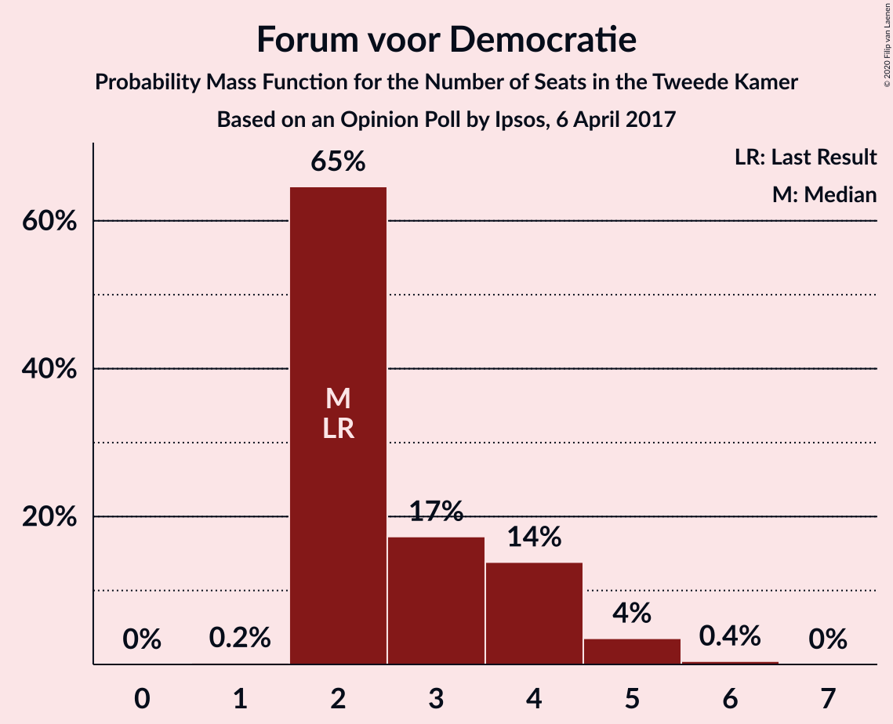

| Number of Seats | Probability | Accumulated | Special Marks |
|:---------------:|:-----------:|:-----------:|:-------------:|
| 1 | 1.4% | 100% |  |
| 2 | 31% | 98.6% | Last Result |
| 3 | 26% | 68% | Median |
| 4 | 41% | 42% |  |
| 5 | 1.2% | 1.2% |  |
| 6 | 0.1% | 0.1% |  |
| 7 | 0% | 0% |  |

## Coalitions

### Confidence Intervals

| Coalition | Last Result | Median | Majority? | 80% Confidence Interval | 90% Confidence Interval | 95% Confidence Interval | 99% Confidence Interval |
|:---------:|:-----------:|:------:|:---------:|:-----------------------:|:-----------------------:|:-----------------------:|:-----------------------:|
| Volkspartij voor Vrijheid en Democratie – Democraten 66 – Christen-Democratisch Appèl – GroenLinks – ChristenUnie | 90 | 90 | 100% | 87–92 | 87–94 | 87–94 | 85–97 |
| Volkspartij voor Vrijheid en Democratie – Democraten 66 – Christen-Democratisch Appèl – Partij van de Arbeid – ChristenUnie | 85 | 83 | 100% | 82–86 | 78–87 | 78–88 | 78–89 |
| Volkspartij voor Vrijheid en Democratie – Partij voor de Vrijheid – Christen-Democratisch Appèl – Staatkundig Gereformeerde Partij – Forum voor Democratie | 77 | 79 | 88% | 72–81 | 71–81 | 71–84 | 71–86 |
| Democraten 66 – Christen-Democratisch Appèl – GroenLinks – Socialistische Partij – Partij van de Arbeid – ChristenUnie | 80 | 77 | 54% | 70–80 | 70–81 | 70–81 | 69–81 |
| Volkspartij voor Vrijheid en Democratie – Democraten 66 – Christen-Democratisch Appèl – ChristenUnie | 76 | 76 | 79% | 74–78 | 71–79 | 71–80 | 71–81 |
| Volkspartij voor Vrijheid en Democratie – Partij voor de Vrijheid – Christen-Democratisch Appèl – Forum voor Democratie | 74 | 75 | 49% | 69–78 | 68–78 | 68–80 | 68–83 |
| Volkspartij voor Vrijheid en Democratie – Partij voor de Vrijheid – Christen-Democratisch Appèl | 72 | 73 | 4% | 66–75 | 66–75 | 66–76 | 66–80 |
| Volkspartij voor Vrijheid en Democratie – Democraten 66 – Christen-Democratisch Appèl | 71 | 71 | 0.5% | 69–73 | 67–74 | 67–75 | 66–75 |
| Democraten 66 – Christen-Democratisch Appèl – GroenLinks – Partij van de Arbeid – ChristenUnie | 66 | 65 | 0% | 60–67 | 60–67 | 60–67 | 59–73 |
| Volkspartij voor Vrijheid en Democratie – Christen-Democratisch Appèl – 50Plus – Staatkundig Gereformeerde Partij – Forum voor Democratie | 61 | 62 | 0% | 58–66 | 58–66 | 57–67 | 56–67 |
| Volkspartij voor Vrijheid en Democratie – Democraten 66 – Partij van de Arbeid | 61 | 58 | 0% | 57–64 | 57–65 | 57–66 | 57–66 |
| Volkspartij voor Vrijheid en Democratie – Christen-Democratisch Appèl – Partij van de Arbeid | 61 | 58 | 0% | 56–62 | 55–62 | 55–63 | 54–65 |
| Volkspartij voor Vrijheid en Democratie – Christen-Democratisch Appèl – 50Plus – Forum voor Democratie | 58 | 59 | 0% | 55–63 | 55–63 | 53–63 | 53–63 |
| Volkspartij voor Vrijheid en Democratie – Christen-Democratisch Appèl – Staatkundig Gereformeerde Partij – Forum voor Democratie | 57 | 58 | 0% | 53–60 | 53–61 | 53–61 | 53–62 |
| Volkspartij voor Vrijheid en Democratie – Christen-Democratisch Appèl – Forum voor Democratie | 54 | 55 | 0% | 50–57 | 50–57 | 49–58 | 49–59 |
| Volkspartij voor Vrijheid en Democratie – Christen-Democratisch Appèl | 52 | 52 | 0% | 48–54 | 47–54 | 47–55 | 47–56 |
| Democraten 66 – Christen-Democratisch Appèl – Partij van de Arbeid | 47 | 47 | 0% | 39–48 | 39–50 | 39–50 | 39–52 |
| Volkspartij voor Vrijheid en Democratie – Partij van de Arbeid | 42 | 40 | 0% | 36–44 | 36–44 | 36–44 | 36–46 |
| Democraten 66 – Christen-Democratisch Appèl | 38 | 39 | 0% | 33–41 | 33–42 | 33–42 | 33–44 |
| Christen-Democratisch Appèl – Partij van de Arbeid – ChristenUnie | 33 | 31 | 0% | 25–34 | 25–36 | 25–36 | 25–36 |
| Christen-Democratisch Appèl – Partij van de Arbeid | 28 | 26 | 0% | 20–29 | 20–31 | 20–31 | 20–31 |

### Volkspartij voor Vrijheid en Democratie – Democraten 66 – Christen-Democratisch Appèl – GroenLinks – ChristenUnie

| Number of Seats | Probability | Accumulated | Special Marks |
|:---------------:|:-----------:|:-----------:|:-------------:|
| 83 | 0.1% | 100% |  |
| 84 | 0.2% | 99.9% |  |
| 85 | 0.3% | 99.7% |  |
| 86 | 1.1% | 99.4% |  |
| 87 | 9% | 98% |  |
| 88 | 0.4% | 89% |  |
| 89 | 27% | 89% |  |
| 90 | 23% | 62% | Last Result, Median |
| 91 | 2% | 39% |  |
| 92 | 27% | 37% |  |
| 93 | 0.7% | 10% |  |
| 94 | 8% | 9% |  |
| 95 | 0% | 1.4% |  |
| 96 | 0.7% | 1.3% |  |
| 97 | 0.5% | 0.6% |  |
| 98 | 0% | 0.1% |  |
| 99 | 0% | 0.1% |  |
| 100 | 0% | 0% |  |

### Volkspartij voor Vrijheid en Democratie – Democraten 66 – Christen-Democratisch Appèl – Partij van de Arbeid – ChristenUnie

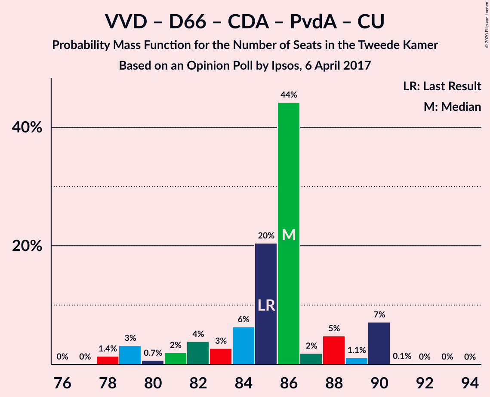

| Number of Seats | Probability | Accumulated | Special Marks |
|:---------------:|:-----------:|:-----------:|:-------------:|
| 76 | 0.1% | 100% | Majority |
| 77 | 0% | 99.9% |  |
| 78 | 7% | 99.8% |  |
| 79 | 0.3% | 93% |  |
| 80 | 0.4% | 93% |  |
| 81 | 2% | 92% |  |
| 82 | 36% | 90% |  |
| 83 | 8% | 54% | Median |
| 84 | 27% | 46% |  |
| 85 | 6% | 19% | Last Result |
| 86 | 6% | 14% |  |
| 87 | 4% | 8% |  |
| 88 | 2% | 3% |  |
| 89 | 1.3% | 2% |  |
| 90 | 0% | 0.4% |  |
| 91 | 0.3% | 0.3% |  |
| 92 | 0% | 0.1% |  |
| 93 | 0% | 0% |  |

### Volkspartij voor Vrijheid en Democratie – Partij voor de Vrijheid – Christen-Democratisch Appèl – Staatkundig Gereformeerde Partij – Forum voor Democratie

| Number of Seats | Probability | Accumulated | Special Marks |
|:---------------:|:-----------:|:-----------:|:-------------:|
| 71 | 6% | 100% |  |
| 72 | 4% | 94% |  |
| 73 | 0.6% | 90% |  |
| 74 | 0.8% | 89% |  |
| 75 | 0.8% | 89% |  |
| 76 | 0.6% | 88% | Majority |
| 77 | 13% | 87% | Last Result |
| 78 | 9% | 74% |  |
| 79 | 21% | 66% |  |
| 80 | 8% | 45% | Median |
| 81 | 33% | 36% |  |
| 82 | 0.2% | 3% |  |
| 83 | 0.3% | 3% |  |
| 84 | 0.6% | 3% |  |
| 85 | 1.3% | 2% |  |
| 86 | 1.1% | 1.1% |  |
| 87 | 0% | 0% |  |

### Democraten 66 – Christen-Democratisch Appèl – GroenLinks – Socialistische Partij – Partij van de Arbeid – ChristenUnie

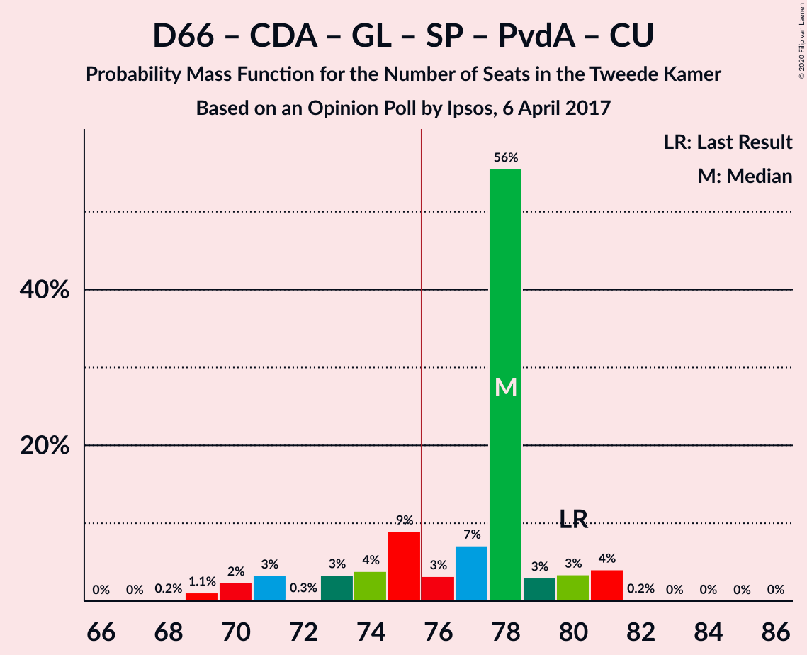

| Number of Seats | Probability | Accumulated | Special Marks |
|:---------------:|:-----------:|:-----------:|:-------------:|
| 67 | 0.1% | 100% |  |
| 68 | 0% | 99.9% |  |
| 69 | 0.7% | 99.9% |  |
| 70 | 27% | 99.2% |  |
| 71 | 0.7% | 72% |  |
| 72 | 2% | 72% |  |
| 73 | 9% | 70% |  |
| 74 | 0.3% | 61% |  |
| 75 | 7% | 60% | Median |
| 76 | 2% | 54% | Majority |
| 77 | 16% | 52% |  |
| 78 | 13% | 36% |  |
| 79 | 4% | 23% |  |
| 80 | 11% | 18% | Last Result |
| 81 | 7% | 8% |  |
| 82 | 0.3% | 0.3% |  |
| 83 | 0% | 0% |  |

### Volkspartij voor Vrijheid en Democratie – Democraten 66 – Christen-Democratisch Appèl – ChristenUnie

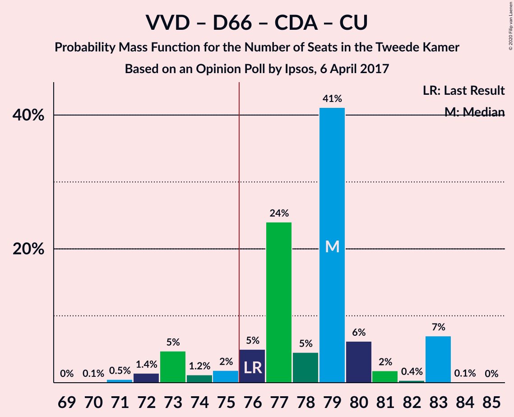

| Number of Seats | Probability | Accumulated | Special Marks |
|:---------------:|:-----------:|:-----------:|:-------------:|
| 69 | 0% | 100% |  |
| 70 | 0.2% | 99.9% |  |
| 71 | 7% | 99.7% |  |
| 72 | 0.6% | 93% |  |
| 73 | 0.9% | 92% |  |
| 74 | 2% | 91% |  |
| 75 | 11% | 89% |  |
| 76 | 33% | 79% | Last Result, Median, Majority |
| 77 | 28% | 46% |  |
| 78 | 10% | 18% |  |
| 79 | 4% | 7% |  |
| 80 | 2% | 3% |  |
| 81 | 0.7% | 0.9% |  |
| 82 | 0.1% | 0.2% |  |
| 83 | 0.1% | 0.1% |  |
| 84 | 0% | 0.1% |  |
| 85 | 0% | 0.1% |  |
| 86 | 0% | 0% |  |

### Volkspartij voor Vrijheid en Democratie – Partij voor de Vrijheid – Christen-Democratisch Appèl – Forum voor Democratie

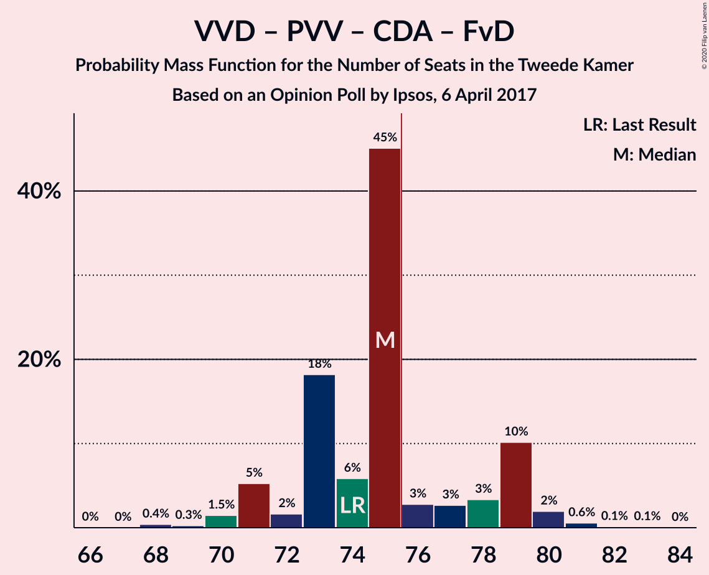

| Number of Seats | Probability | Accumulated | Special Marks |
|:---------------:|:-----------:|:-----------:|:-------------:|
| 68 | 10% | 100% |  |
| 69 | 0.3% | 90% |  |
| 70 | 0.7% | 90% |  |
| 71 | 1.0% | 89% |  |
| 72 | 0.7% | 88% |  |
| 73 | 12% | 87% |  |
| 74 | 2% | 75% | Last Result |
| 75 | 24% | 73% |  |
| 76 | 11% | 49% | Majority |
| 77 | 2% | 38% | Median |
| 78 | 33% | 36% |  |
| 79 | 0.8% | 3% |  |
| 80 | 0.2% | 3% |  |
| 81 | 0% | 2% |  |
| 82 | 1.3% | 2% |  |
| 83 | 1.1% | 1.1% |  |
| 84 | 0% | 0% |  |

### Volkspartij voor Vrijheid en Democratie – Partij voor de Vrijheid – Christen-Democratisch Appèl

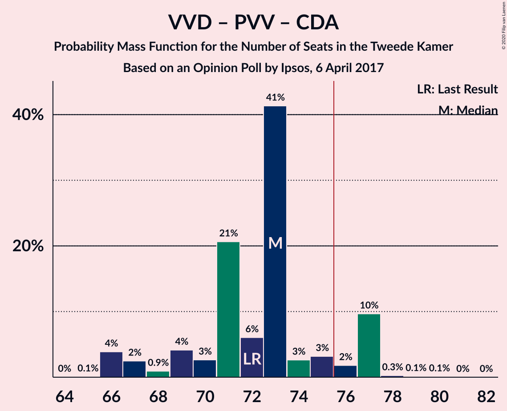

| Number of Seats | Probability | Accumulated | Special Marks |
|:---------------:|:-----------:|:-----------:|:-------------:|
| 66 | 10% | 100% |  |
| 67 | 0.5% | 89% |  |
| 68 | 0.9% | 89% |  |
| 69 | 2% | 88% |  |
| 70 | 11% | 86% |  |
| 71 | 6% | 74% |  |
| 72 | 7% | 69% | Last Result |
| 73 | 24% | 62% |  |
| 74 | 27% | 38% | Median |
| 75 | 7% | 10% |  |
| 76 | 1.3% | 4% | Majority |
| 77 | 0.1% | 2% |  |
| 78 | 0% | 2% |  |
| 79 | 1.3% | 2% |  |
| 80 | 1.1% | 1.1% |  |
| 81 | 0% | 0% |  |

### Volkspartij voor Vrijheid en Democratie – Democraten 66 – Christen-Democratisch Appèl

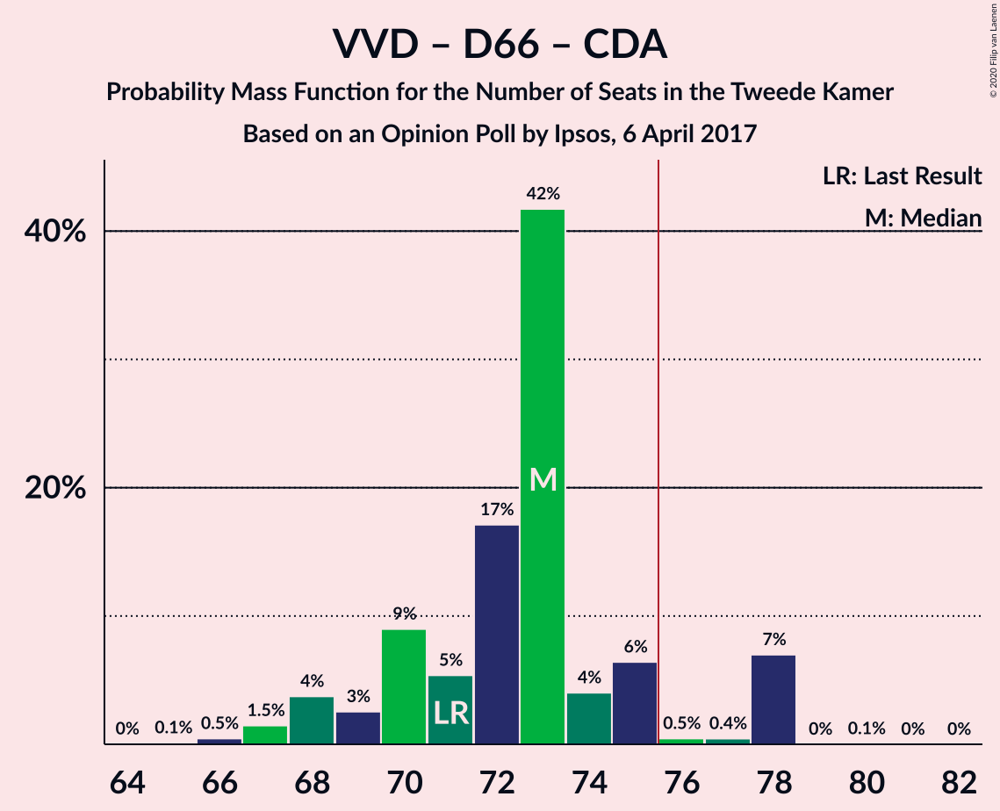

| Number of Seats | Probability | Accumulated | Special Marks |
|:---------------:|:-----------:|:-----------:|:-------------:|
| 64 | 0.1% | 100% |  |
| 65 | 0.2% | 99.9% |  |
| 66 | 0.4% | 99.7% |  |
| 67 | 7% | 99.4% |  |
| 68 | 2% | 92% |  |
| 69 | 6% | 90% |  |
| 70 | 13% | 84% |  |
| 71 | 48% | 71% | Last Result, Median |
| 72 | 8% | 23% |  |
| 73 | 6% | 15% |  |
| 74 | 5% | 8% |  |
| 75 | 3% | 3% |  |
| 76 | 0.3% | 0.5% | Majority |
| 77 | 0% | 0.2% |  |
| 78 | 0.1% | 0.1% |  |
| 79 | 0.1% | 0.1% |  |
| 80 | 0% | 0% |  |

### Democraten 66 – Christen-Democratisch Appèl – GroenLinks – Partij van de Arbeid – ChristenUnie

| Number of Seats | Probability | Accumulated | Special Marks |
|:---------------:|:-----------:|:-----------:|:-------------:|
| 57 | 0.3% | 100% |  |
| 58 | 0.1% | 99.7% |  |
| 59 | 0.8% | 99.6% |  |
| 60 | 27% | 98.9% |  |
| 61 | 8% | 72% |  |
| 62 | 2% | 64% |  |
| 63 | 4% | 62% |  |
| 64 | 4% | 58% | Median |
| 65 | 6% | 54% |  |
| 66 | 26% | 48% | Last Result |
| 67 | 21% | 23% |  |
| 68 | 0.4% | 2% |  |
| 69 | 0.1% | 1.4% |  |
| 70 | 0.1% | 1.3% |  |
| 71 | 0% | 1.2% |  |
| 72 | 0.5% | 1.1% |  |
| 73 | 0.6% | 0.6% |  |
| 74 | 0% | 0% |  |

### Volkspartij voor Vrijheid en Democratie – Christen-Democratisch Appèl – 50Plus – Staatkundig Gereformeerde Partij – Forum voor Democratie

| Number of Seats | Probability | Accumulated | Special Marks |
|:---------------:|:-----------:|:-----------:|:-------------:|
| 55 | 0.3% | 100% |  |
| 56 | 0.4% | 99.7% |  |
| 57 | 4% | 99.3% |  |
| 58 | 7% | 95% |  |
| 59 | 0.5% | 88% |  |
| 60 | 0.5% | 88% |  |
| 61 | 34% | 87% | Last Result |
| 62 | 6% | 53% | Median |
| 63 | 28% | 47% |  |
| 64 | 6% | 19% |  |
| 65 | 0.8% | 13% |  |
| 66 | 8% | 12% |  |
| 67 | 4% | 4% |  |
| 68 | 0.1% | 0.3% |  |
| 69 | 0.1% | 0.1% |  |
| 70 | 0.1% | 0.1% |  |
| 71 | 0% | 0% |  |

### Volkspartij voor Vrijheid en Democratie – Democraten 66 – Partij van de Arbeid

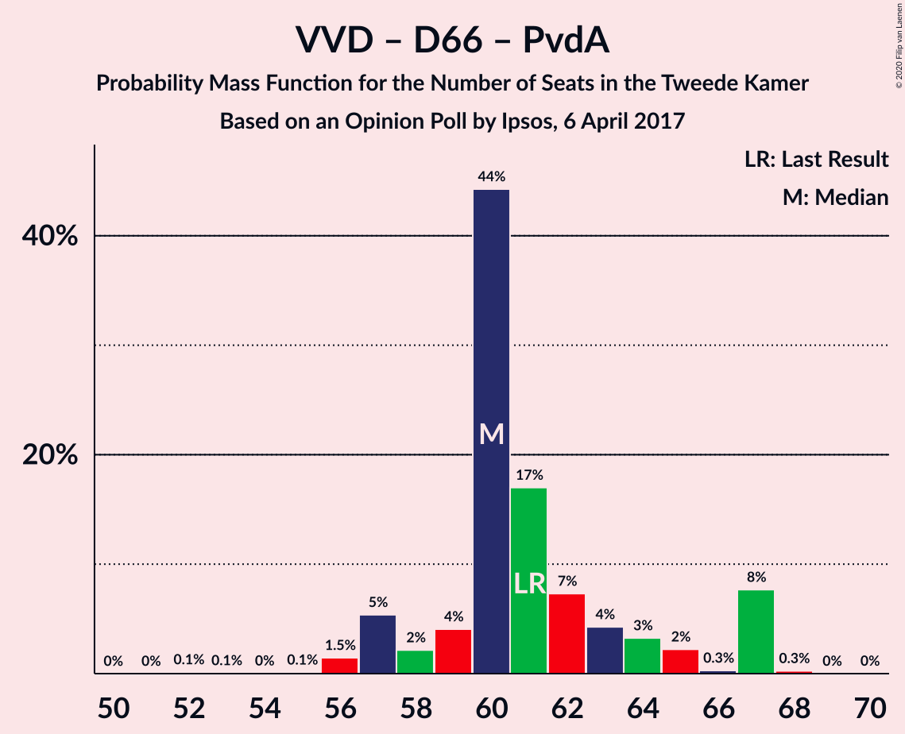

| Number of Seats | Probability | Accumulated | Special Marks |
|:---------------:|:-----------:|:-----------:|:-------------:|
| 53 | 0.1% | 100% |  |
| 54 | 0.1% | 99.9% |  |
| 55 | 0% | 99.8% |  |
| 56 | 0% | 99.7% |  |
| 57 | 27% | 99.7% |  |
| 58 | 27% | 73% |  |
| 59 | 1.4% | 46% | Median |
| 60 | 2% | 44% |  |
| 61 | 0.8% | 42% | Last Result |
| 62 | 2% | 41% |  |
| 63 | 28% | 39% |  |
| 64 | 6% | 11% |  |
| 65 | 1.2% | 5% |  |
| 66 | 4% | 4% |  |
| 67 | 0.2% | 0.5% |  |
| 68 | 0% | 0.3% |  |
| 69 | 0% | 0.3% |  |
| 70 | 0.2% | 0.2% |  |
| 71 | 0% | 0% |  |

### Volkspartij voor Vrijheid en Democratie – Christen-Democratisch Appèl – Partij van de Arbeid

| Number of Seats | Probability | Accumulated | Special Marks |
|:---------------:|:-----------:|:-----------:|:-------------:|
| 53 | 0.1% | 100% |  |
| 54 | 0.6% | 99.9% |  |
| 55 | 7% | 99.2% |  |
| 56 | 15% | 92% |  |
| 57 | 9% | 77% |  |
| 58 | 47% | 68% |  |
| 59 | 2% | 21% | Median |
| 60 | 0.4% | 19% |  |
| 61 | 9% | 19% | Last Result |
| 62 | 7% | 10% |  |
| 63 | 1.3% | 4% |  |
| 64 | 2% | 2% |  |
| 65 | 0.4% | 0.6% |  |
| 66 | 0.2% | 0.2% |  |
| 67 | 0% | 0.1% |  |
| 68 | 0% | 0% |  |

### Volkspartij voor Vrijheid en Democratie – Christen-Democratisch Appèl – 50Plus – Forum voor Democratie

| Number of Seats | Probability | Accumulated | Special Marks |
|:---------------:|:-----------:|:-----------:|:-------------:|
| 52 | 0.1% | 100% |  |
| 53 | 4% | 99.8% |  |
| 54 | 0.5% | 96% |  |
| 55 | 7% | 95% |  |
| 56 | 0.3% | 88% |  |
| 57 | 34% | 88% |  |
| 58 | 1.0% | 54% | Last Result |
| 59 | 7% | 53% | Median |
| 60 | 29% | 47% |  |
| 61 | 3% | 17% |  |
| 62 | 3% | 14% |  |
| 63 | 11% | 11% |  |
| 64 | 0.2% | 0.3% |  |
| 65 | 0.1% | 0.1% |  |
| 66 | 0% | 0% |  |

### Volkspartij voor Vrijheid en Democratie – Christen-Democratisch Appèl – Staatkundig Gereformeerde Partij – Forum voor Democratie

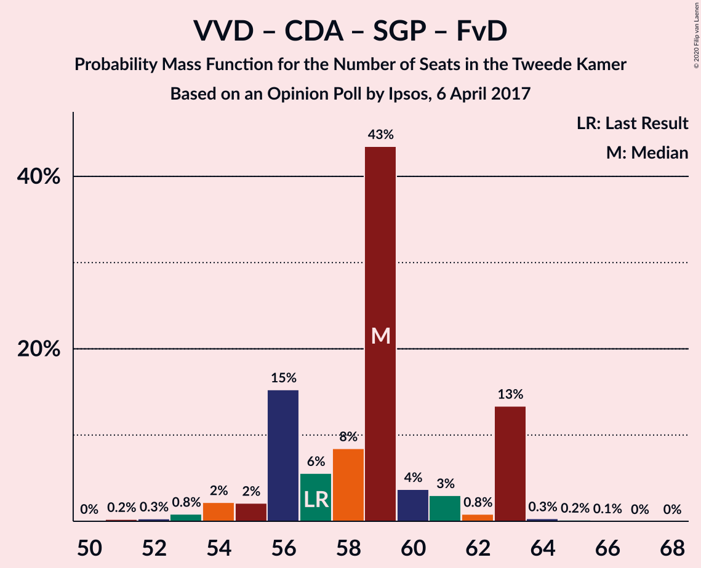

| Number of Seats | Probability | Accumulated | Special Marks |
|:---------------:|:-----------:|:-----------:|:-------------:|
| 51 | 0.2% | 100% |  |
| 52 | 0.1% | 99.8% |  |
| 53 | 10% | 99.7% |  |
| 54 | 0.8% | 90% |  |
| 55 | 2% | 89% |  |
| 56 | 12% | 87% |  |
| 57 | 17% | 76% | Last Result |
| 58 | 12% | 58% | Median |
| 59 | 31% | 46% |  |
| 60 | 7% | 15% |  |
| 61 | 6% | 8% |  |
| 62 | 2% | 2% |  |
| 63 | 0.3% | 0.5% |  |
| 64 | 0.1% | 0.2% |  |
| 65 | 0% | 0% |  |

### Volkspartij voor Vrijheid en Democratie – Christen-Democratisch Appèl – Forum voor Democratie

| Number of Seats | Probability | Accumulated | Special Marks |
|:---------------:|:-----------:|:-----------:|:-------------:|
| 48 | 0.1% | 100% |  |
| 49 | 4% | 99.9% |  |
| 50 | 6% | 96% |  |
| 51 | 0.8% | 89% |  |
| 52 | 13% | 89% |  |
| 53 | 16% | 76% |  |
| 54 | 9% | 60% | Last Result |
| 55 | 5% | 50% | Median |
| 56 | 27% | 45% |  |
| 57 | 14% | 18% |  |
| 58 | 2% | 4% |  |
| 59 | 1.2% | 1.5% |  |
| 60 | 0.1% | 0.2% |  |
| 61 | 0.1% | 0.1% |  |
| 62 | 0% | 0% |  |

### Volkspartij voor Vrijheid en Democratie – Christen-Democratisch Appèl

| Number of Seats | Probability | Accumulated | Special Marks |
|:---------------:|:-----------:|:-----------:|:-------------:|
| 45 | 0% | 100% |  |
| 46 | 0.3% | 99.9% |  |
| 47 | 5% | 99.6% |  |
| 48 | 7% | 95% |  |
| 49 | 12% | 88% |  |
| 50 | 8% | 76% |  |
| 51 | 17% | 67% |  |
| 52 | 28% | 51% | Last Result, Median |
| 53 | 9% | 23% |  |
| 54 | 10% | 14% |  |
| 55 | 3% | 4% |  |
| 56 | 1.3% | 1.4% |  |
| 57 | 0.1% | 0.1% |  |
| 58 | 0% | 0% |  |

### Democraten 66 – Christen-Democratisch Appèl – Partij van de Arbeid

| Number of Seats | Probability | Accumulated | Special Marks |
|:---------------:|:-----------:|:-----------:|:-------------:|
| 38 | 0.2% | 100% |  |
| 39 | 27% | 99.8% |  |
| 40 | 0.1% | 73% |  |
| 41 | 7% | 73% |  |
| 42 | 3% | 66% |  |
| 43 | 5% | 63% |  |
| 44 | 0.8% | 58% |  |
| 45 | 0.7% | 57% | Median |
| 46 | 2% | 56% |  |
| 47 | 34% | 55% | Last Result |
| 48 | 13% | 20% |  |
| 49 | 0.2% | 7% |  |
| 50 | 6% | 7% |  |
| 51 | 0% | 0.7% |  |
| 52 | 0.6% | 0.7% |  |
| 53 | 0% | 0.1% |  |
| 54 | 0% | 0% |  |

### Volkspartij voor Vrijheid en Democratie – Partij van de Arbeid

| Number of Seats | Probability | Accumulated | Special Marks |
|:---------------:|:-----------:|:-----------:|:-------------:|
| 35 | 0.1% | 100% |  |
| 36 | 17% | 99.9% |  |
| 37 | 0.7% | 83% |  |
| 38 | 16% | 82% |  |
| 39 | 13% | 66% |  |
| 40 | 7% | 53% | Median |
| 41 | 3% | 45% |  |
| 42 | 8% | 42% | Last Result |
| 43 | 5% | 35% |  |
| 44 | 29% | 30% |  |
| 45 | 0.2% | 0.8% |  |
| 46 | 0.1% | 0.6% |  |
| 47 | 0.1% | 0.5% |  |
| 48 | 0.1% | 0.4% |  |
| 49 | 0.2% | 0.2% |  |
| 50 | 0% | 0% |  |

### Democraten 66 – Christen-Democratisch Appèl

| Number of Seats | Probability | Accumulated | Special Marks |
|:---------------:|:-----------:|:-----------:|:-------------:|
| 31 | 0.2% | 100% |  |
| 32 | 0.1% | 99.8% |  |
| 33 | 27% | 99.7% |  |
| 34 | 7% | 73% |  |
| 35 | 3% | 65% |  |
| 36 | 1.4% | 62% |  |
| 37 | 0.6% | 60% |  |
| 38 | 9% | 60% | Last Result, Median |
| 39 | 5% | 50% |  |
| 40 | 27% | 45% |  |
| 41 | 11% | 18% |  |
| 42 | 6% | 7% |  |
| 43 | 0% | 0.7% |  |
| 44 | 0.6% | 0.7% |  |
| 45 | 0% | 0.1% |  |
| 46 | 0% | 0.1% |  |
| 47 | 0% | 0% |  |

### Christen-Democratisch Appèl – Partij van de Arbeid – ChristenUnie

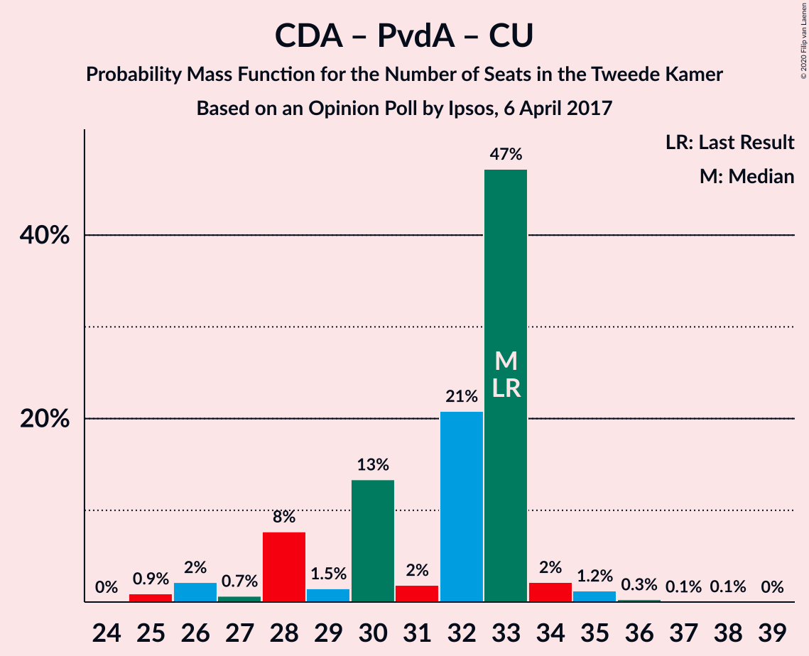

| Number of Seats | Probability | Accumulated | Special Marks |
|:---------------:|:-----------:|:-----------:|:-------------:|
| 25 | 27% | 100% |  |
| 26 | 0.1% | 73% |  |
| 27 | 0.7% | 73% |  |
| 28 | 13% | 72% |  |
| 29 | 0.3% | 59% |  |
| 30 | 5% | 59% |  |
| 31 | 5% | 54% | Median |
| 32 | 13% | 49% |  |
| 33 | 17% | 36% | Last Result |
| 34 | 12% | 18% |  |
| 35 | 0.8% | 7% |  |
| 36 | 6% | 6% |  |
| 37 | 0% | 0.1% |  |
| 38 | 0% | 0.1% |  |
| 39 | 0% | 0.1% |  |
| 40 | 0% | 0% |  |

### Christen-Democratisch Appèl – Partij van de Arbeid

| Number of Seats | Probability | Accumulated | Special Marks |
|:---------------:|:-----------:|:-----------:|:-------------:|
| 19 | 0.2% | 100% |  |
| 20 | 27% | 99.8% |  |
| 21 | 0% | 73% |  |
| 22 | 2% | 73% |  |
| 23 | 4% | 71% |  |
| 24 | 12% | 67% |  |
| 25 | 0.9% | 54% |  |
| 26 | 12% | 53% | Median |
| 27 | 29% | 42% |  |
| 28 | 1.3% | 13% | Last Result |
| 29 | 4% | 11% |  |
| 30 | 2% | 8% |  |
| 31 | 6% | 6% |  |
| 32 | 0% | 0% |  |

## Technical Information

### Opinion Poll

+ **Polling firm:** Ipsos
+ **Commissioner(s):** —
+ **Fieldwork period:** 6 April 2017

### Calculations

+ **Sample size:** 1000
+ **Simulations done:** 131,072
+ **Error estimate:** 2.97%

