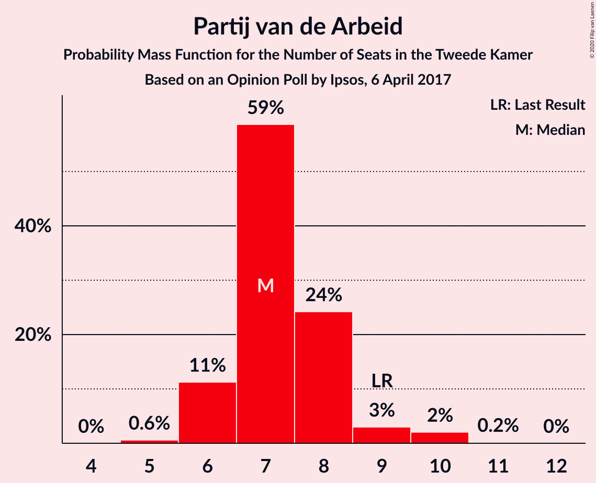
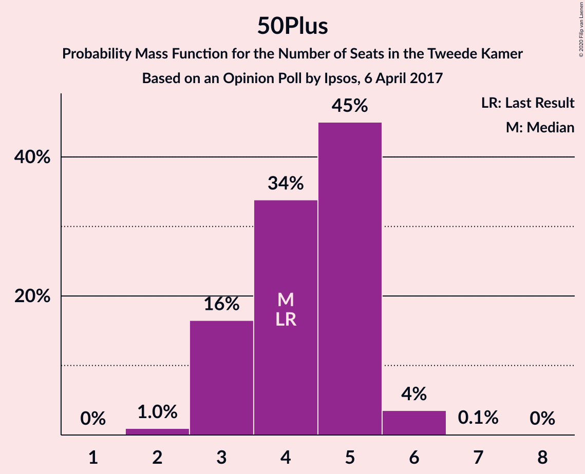
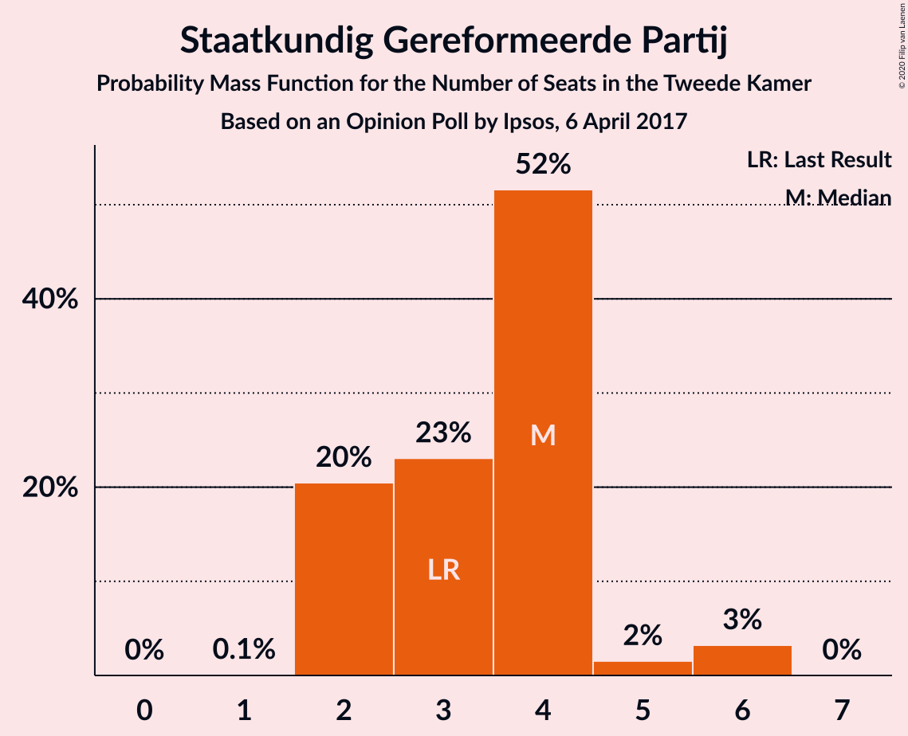
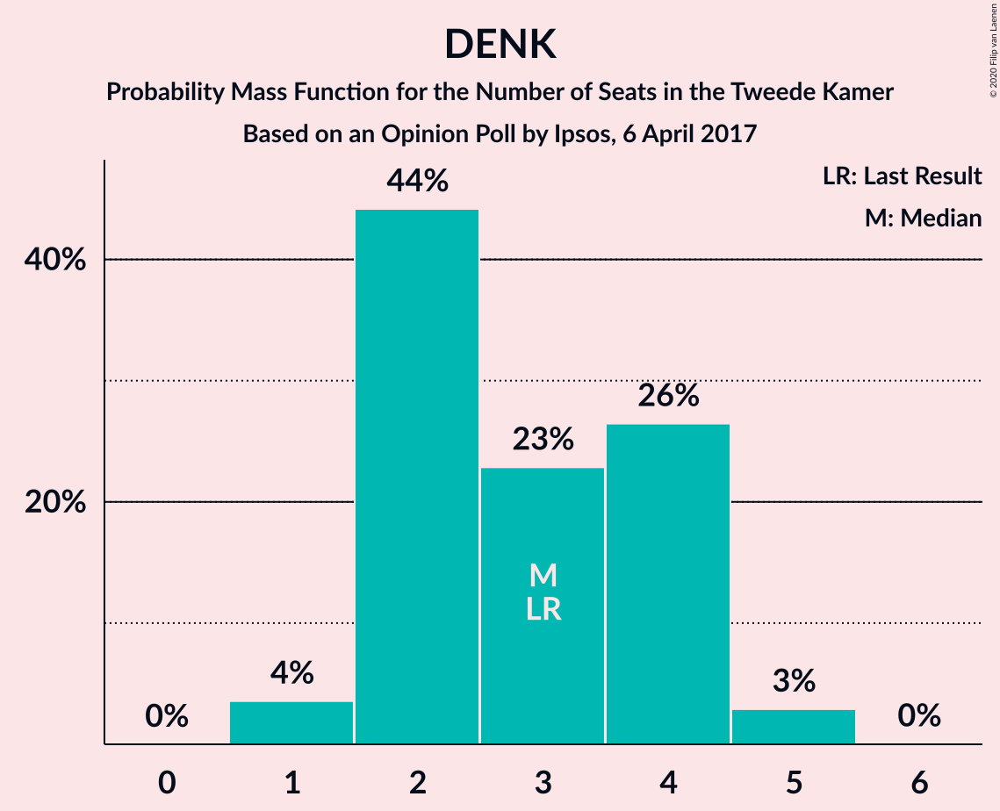
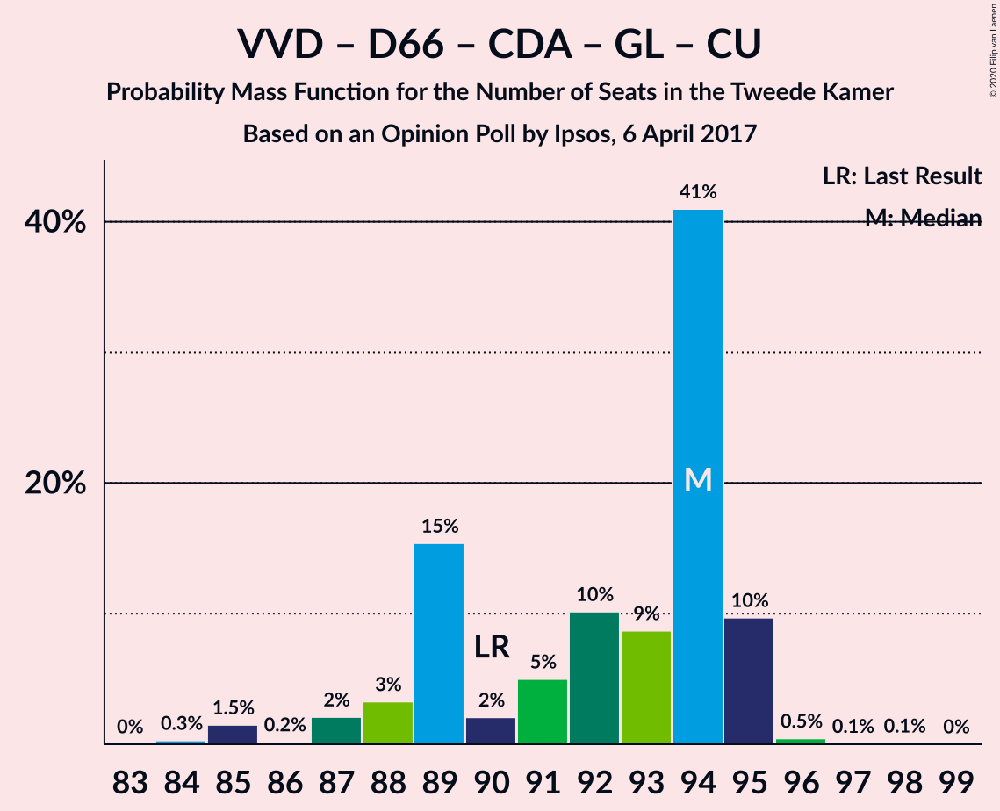
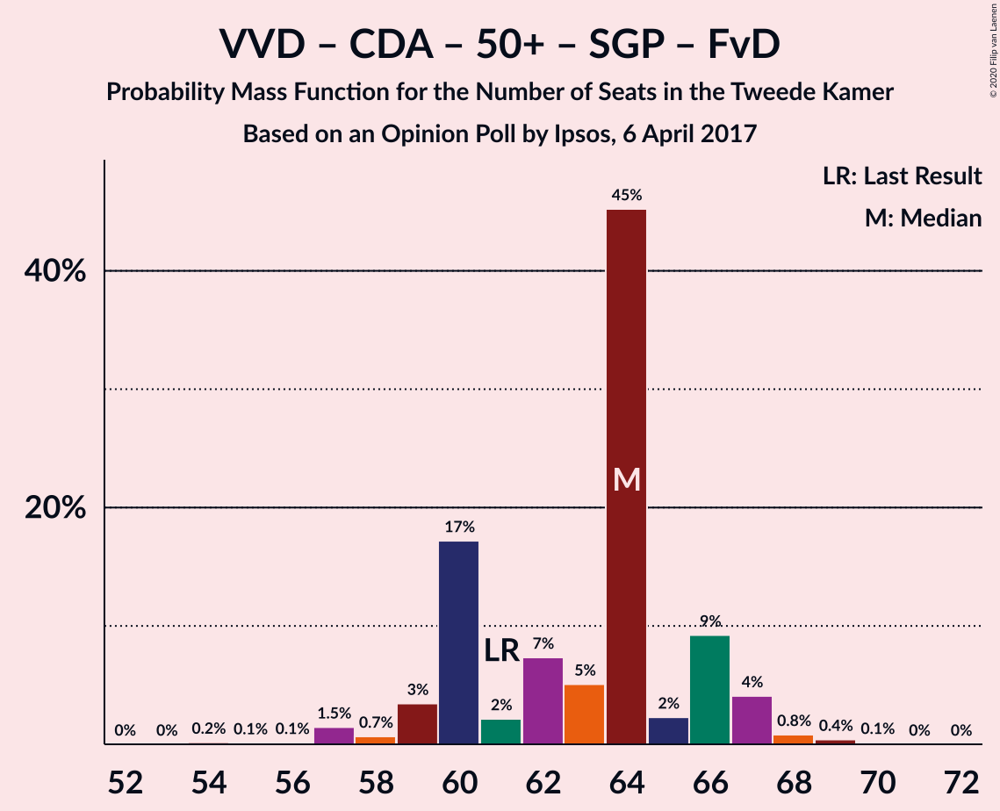
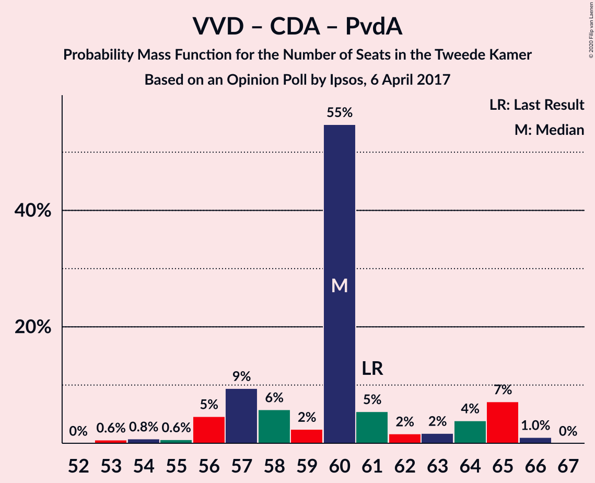
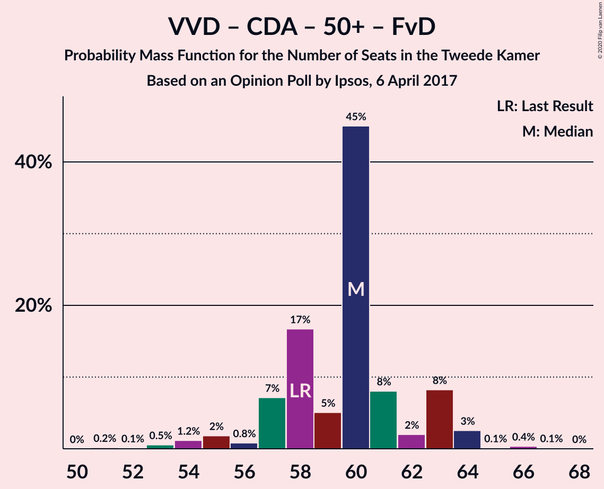
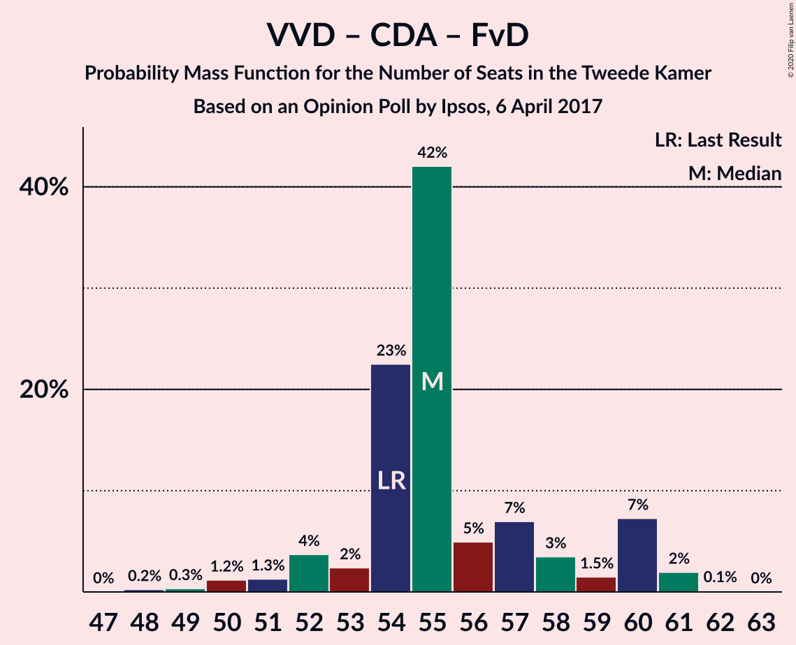

# Opinion Poll by Ipsos, 6 April 2017

<a href="#voting-intentions">Voting Intentions</a> | <a href="#seats">Seats</a> | <a href="#coalitions">Coalitions</a> | <a href="#technical-information">Technical Information</a>

## Voting Intentions

### Confidence Intervals

| Party | Last Result | Poll Result | 80% Confidence Interval | 90% Confidence Interval | 95% Confidence Interval | 99% Confidence Interval |
|:-----:|:-----------:|:-----------:|:-----------------------:|:-----------------------:|:-----------------------:|:-----------------------:|
| Volkspartij voor Vrijheid en Democratie | 21.3% | 22.0% | 20.4–23.7% |19.9–24.2% |19.5–24.7% |18.8–25.5% |
| Partij voor de Vrijheid | 13.1% | 13.1% | 11.8–14.6% |11.4–15.0% |11.1–15.3% |10.6–16.1% |
| Democraten 66 | 12.2% | 13.1% | 11.8–14.6% |11.4–15.0% |11.1–15.3% |10.6–16.1% |
| Christen-Democratisch Appèl | 12.4% | 11.9% | 10.7–13.3% |10.3–13.7% |10.0–14.1% |9.5–14.8% |
| GroenLinks | 9.1% | 9.4% | 8.3–10.7% |8.0–11.1% |7.7–11.4% |7.2–12.0% |
| Socialistische Partij | 9.1% | 7.5% | 6.5–8.7% |6.2–9.0% |6.0–9.3% |5.6–9.9% |
| Partij van de Arbeid | 5.7% | 5.1% | 4.3–6.1% |4.1–6.4% |3.9–6.6% |3.6–7.2% |
| ChristenUnie | 3.4% | 3.6% | 2.9–4.5% |2.8–4.7% |2.6–5.0% |2.3–5.4% |
| Partij voor de Dieren | 3.2% | 3.6% | 2.9–4.5% |2.8–4.7% |2.6–5.0% |2.3–5.4% |
| 50Plus | 3.1% | 2.9% | 2.3–3.7% |2.2–3.9% |2.0–4.1% |1.8–4.6% |
| Staatkundig Gereformeerde Partij | 2.1% | 2.3% | 1.8–3.0% |1.6–3.2% |1.5–3.4% |1.3–3.8% |
| DENK | 2.1% | 2.2% | 1.7–2.9% |1.6–3.1% |1.4–3.3% |1.2–3.7% |
| Forum voor Democratie | 1.8% | 2.2% | 1.7–2.9% |1.6–3.1% |1.4–3.3% |1.2–3.7% |

*Note:* The poll result column reflects the actual value used in the calculations. Published results may vary slightly, and in addition be rounded to fewer digits.

## Seats

### Confidence Intervals

| Party | Last Result | Median | 80% Confidence Interval | 90% Confidence Interval | 95% Confidence Interval | 99% Confidence Interval |
|:-----:|:-----------:|:------:|:-----------------------:|:-----------------------:|:-----------------------:|:-----------------------:|
| <a href="#volkspartij-voor-vrijheid-en-democratie">Volkspartij voor Vrijheid en Democratie</a> | 33 | 33 | 31–38 |31–40 |30–40 |29–40 |
| <a href="#partij-voor-de-vrijheid">Partij voor de Vrijheid</a> | 20 | 20 | 17–21 |17–22 |16–24 |16–24 |
| <a href="#democraten-66">Democraten 66</a> | 19 | 20 | 18–21 |17–22 |17–24 |16–24 |
| <a href="#christen-democratisch-appèl">Christen-Democratisch Appèl</a> | 19 | 19 | 17–20 |16–21 |14–21 |14–22 |
| <a href="#groenlinks">GroenLinks</a> | 14 | 15 | 12–15 |12–17 |12–18 |10–18 |
| <a href="#socialistische-partij">Socialistische Partij</a> | 14 | 10 | 10–14 |10–14 |9–14 |8–14 |
| <a href="#partij-van-de-arbeid">Partij van de Arbeid</a> | 9 | 7 | 6–8 |6–9 |6–9 |5–10 |
| <a href="#christenunie">ChristenUnie</a> | 5 | 6 | 5–6 |4–7 |4–7 |3–8 |
| <a href="#partij-voor-de-dieren">Partij voor de Dieren</a> | 5 | 5 | 4–7 |4–7 |4–7 |3–8 |
| <a href="#50plus">50Plus</a> | 4 | 4 | 3–5 |3–5 |3–6 |2–6 |
| <a href="#staatkundig-gereformeerde-partij">Staatkundig Gereformeerde Partij</a> | 3 | 4 | 2–4 |2–4 |2–6 |2–6 |
| <a href="#denk">DENK</a> | 3 | 3 | 2–4 |2–4 |1–5 |1–5 |
| <a href="#forum-voor-democratie">Forum voor Democratie</a> | 2 | 2 | 2–4 |2–4 |2–5 |2–5 |

### Volkspartij voor Vrijheid en Democratie

*For a full overview of the results for this party, see the [Volkspartij voor Vrijheid en Democratie](party-volkspartijvoorvrijheidendemocratie.html) page.*

| Number of Seats | Probability | Accumulated | Special Marks |
|:---------------:|:-----------:|:-----------:|:-------------:|
| 27 | 0.1% | 100% |  |
| 28 | 0.1% | 99.9% |  |
| 29 | 2% | 99.8% |  |
| 30 | 1.1% | 98% |  |
| 31 | 7% | 97% |  |
| 32 | 3% | 90% |  |
| 33 | 57% | 87% | Last Result, Median |
| 34 | 7% | 31% |  |
| 35 | 7% | 24% |  |
| 36 | 0.5% | 16% |  |
| 37 | 5% | 16% |  |
| 38 | 4% | 11% |  |
| 39 | 0.2% | 7% |  |
| 40 | 7% | 7% |  |
| 41 | 0% | 0% |  |

### Partij voor de Vrijheid

*For a full overview of the results for this party, see the [Partij voor de Vrijheid](party-partijvoordevrijheid.html) page.*

| Number of Seats | Probability | Accumulated | Special Marks |
|:---------------:|:-----------:|:-----------:|:-------------:|
| 15 | 0.1% | 100% |  |
| 16 | 3% | 99.9% |  |
| 17 | 7% | 97% |  |
| 18 | 5% | 90% |  |
| 19 | 25% | 85% |  |
| 20 | 42% | 59% | Last Result, Median |
| 21 | 8% | 17% |  |
| 22 | 5% | 9% |  |
| 23 | 1.5% | 4% |  |
| 24 | 2% | 3% |  |
| 25 | 0.1% | 0.2% |  |
| 26 | 0% | 0% |  |

### Democraten 66

*For a full overview of the results for this party, see the [Democraten 66](party-democraten66.html) page.*

| Number of Seats | Probability | Accumulated | Special Marks |
|:---------------:|:-----------:|:-----------:|:-------------:|
| 16 | 0.7% | 100% |  |
| 17 | 6% | 99.2% |  |
| 18 | 5% | 93% |  |
| 19 | 12% | 88% | Last Result |
| 20 | 61% | 76% | Median |
| 21 | 8% | 15% |  |
| 22 | 3% | 7% |  |
| 23 | 1.3% | 4% |  |
| 24 | 3% | 3% |  |
| 25 | 0% | 0.1% |  |
| 26 | 0% | 0.1% |  |
| 27 | 0% | 0% |  |

### Christen-Democratisch Appèl

*For a full overview of the results for this party, see the [Christen-Democratisch Appèl](party-christen-democratischappèl.html) page.*

| Number of Seats | Probability | Accumulated | Special Marks |
|:---------------:|:-----------:|:-----------:|:-------------:|
| 14 | 3% | 100% |  |
| 15 | 1.0% | 97% |  |
| 16 | 1.4% | 96% |  |
| 17 | 12% | 94% |  |
| 18 | 17% | 82% |  |
| 19 | 17% | 65% | Last Result, Median |
| 20 | 42% | 48% |  |
| 21 | 5% | 6% |  |
| 22 | 1.0% | 1.3% |  |
| 23 | 0.3% | 0.3% |  |
| 24 | 0% | 0% |  |

### GroenLinks

*For a full overview of the results for this party, see the [GroenLinks](party-groenlinks.html) page.*

| Number of Seats | Probability | Accumulated | Special Marks |
|:---------------:|:-----------:|:-----------:|:-------------:|
| 10 | 1.0% | 100% |  |
| 11 | 1.0% | 99.0% |  |
| 12 | 22% | 98% |  |
| 13 | 9% | 76% |  |
| 14 | 9% | 66% | Last Result |
| 15 | 47% | 57% | Median |
| 16 | 5% | 10% |  |
| 17 | 2% | 5% |  |
| 18 | 3% | 3% |  |
| 19 | 0.1% | 0.1% |  |
| 20 | 0% | 0% |  |

### Socialistische Partij

*For a full overview of the results for this party, see the [Socialistische Partij](party-socialistischepartij.html) page.*

| Number of Seats | Probability | Accumulated | Special Marks |
|:---------------:|:-----------:|:-----------:|:-------------:|
| 8 | 1.2% | 100% |  |
| 9 | 1.5% | 98.8% |  |
| 10 | 48% | 97% | Median |
| 11 | 8% | 49% |  |
| 12 | 16% | 41% |  |
| 13 | 11% | 25% |  |
| 14 | 14% | 14% | Last Result |
| 15 | 0.1% | 0.1% |  |
| 16 | 0% | 0% |  |

### Partij van de Arbeid

*For a full overview of the results for this party, see the [Partij van de Arbeid](party-partijvandearbeid.html) page.*

| Number of Seats | Probability | Accumulated | Special Marks |
|:---------------:|:-----------:|:-----------:|:-------------:|
| 5 | 0.6% | 100% |  |
| 6 | 11% | 99.4% |  |
| 7 | 59% | 88% | Median |
| 8 | 24% | 29% |  |
| 9 | 3% | 5% | Last Result |
| 10 | 2% | 2% |  |
| 11 | 0.2% | 0.2% |  |
| 12 | 0% | 0% |  |

### ChristenUnie

*For a full overview of the results for this party, see the [ChristenUnie](party-christenunie.html) page.*

| Number of Seats | Probability | Accumulated | Special Marks |
|:---------------:|:-----------:|:-----------:|:-------------:|
| 3 | 1.1% | 100% |  |
| 4 | 6% | 98.9% |  |
| 5 | 38% | 93% | Last Result |
| 6 | 47% | 55% | Median |
| 7 | 7% | 9% |  |
| 8 | 1.1% | 1.2% |  |
| 9 | 0% | 0% |  |

### Partij voor de Dieren

*For a full overview of the results for this party, see the [Partij voor de Dieren](party-partijvoordedieren.html) page.*

| Number of Seats | Probability | Accumulated | Special Marks |
|:---------------:|:-----------:|:-----------:|:-------------:|
| 3 | 2% | 100% |  |
| 4 | 16% | 98% |  |
| 5 | 55% | 83% | Last Result, Median |
| 6 | 13% | 27% |  |
| 7 | 13% | 14% |  |
| 8 | 0.9% | 0.9% |  |
| 9 | 0.1% | 0.1% |  |
| 10 | 0% | 0% |  |

### 50Plus

*For a full overview of the results for this party, see the [50Plus](party-50plus.html) page.*

| Number of Seats | Probability | Accumulated | Special Marks |
|:---------------:|:-----------:|:-----------:|:-------------:|
| 2 | 1.0% | 100% |  |
| 3 | 16% | 99.0% |  |
| 4 | 34% | 83% | Last Result, Median |
| 5 | 45% | 49% |  |
| 6 | 4% | 4% |  |
| 7 | 0.1% | 0.2% |  |
| 8 | 0% | 0% |  |

### Staatkundig Gereformeerde Partij

*For a full overview of the results for this party, see the [Staatkundig Gereformeerde Partij](party-staatkundiggereformeerdepartij.html) page.*

| Number of Seats | Probability | Accumulated | Special Marks |
|:---------------:|:-----------:|:-----------:|:-------------:|
| 1 | 0.1% | 100% |  |
| 2 | 20% | 99.9% |  |
| 3 | 23% | 79% | Last Result |
| 4 | 52% | 56% | Median |
| 5 | 2% | 5% |  |
| 6 | 3% | 3% |  |
| 7 | 0% | 0% |  |

### DENK

*For a full overview of the results for this party, see the [DENK](party-denk.html) page.*

| Number of Seats | Probability | Accumulated | Special Marks |
|:---------------:|:-----------:|:-----------:|:-------------:|
| 1 | 4% | 100% |  |
| 2 | 44% | 96% |  |
| 3 | 23% | 52% | Last Result, Median |
| 4 | 26% | 29% |  |
| 5 | 3% | 3% |  |
| 6 | 0% | 0% |  |

### Forum voor Democratie

*For a full overview of the results for this party, see the [Forum voor Democratie](party-forumvoordemocratie.html) page.*

| Number of Seats | Probability | Accumulated | Special Marks |
|:---------------:|:-----------:|:-----------:|:-------------:|
| 1 | 0.2% | 100% |  |
| 2 | 65% | 99.8% | Last Result, Median |
| 3 | 17% | 35% |  |
| 4 | 14% | 18% |  |
| 5 | 4% | 4% |  |
| 6 | 0.4% | 0.5% |  |
| 7 | 0% | 0% |  |

## Coalitions

### Confidence Intervals

| Coalition | Last Result | Median | Majority? | 80% Confidence Interval | 90% Confidence Interval | 95% Confidence Interval | 99% Confidence Interval |
|:---------:|:-----------:|:------:|:---------:|:-----------------------:|:-----------------------:|:-----------------------:|:-----------------------:|
| Volkspartij voor Vrijheid en Democratie – Democraten 66 – Christen-Democratisch Appèl – GroenLinks – ChristenUnie | 90 | 94 | 100% | 89–95 | 88–95 | 87–95 | 85–96 |
| Volkspartij voor Vrijheid en Democratie – Democraten 66 – Christen-Democratisch Appèl – Partij van de Arbeid – ChristenUnie | 85 | 86 | 100% | 82–88 | 80–90 | 79–90 | 78–90 |
| Volkspartij voor Vrijheid en Democratie – Democraten 66 – Christen-Democratisch Appèl – ChristenUnie | 76 | 79 | 90% | 76–80 | 73–83 | 73–83 | 71–83 |
| Volkspartij voor Vrijheid en Democratie – Partij voor de Vrijheid – Christen-Democratisch Appèl – Staatkundig Gereformeerde Partij – Forum voor Democratie | 77 | 79 | 79% | 75–82 | 74–82 | 73–83 | 72–84 |
| Democraten 66 – Christen-Democratisch Appèl – GroenLinks – Socialistische Partij – Partij van de Arbeid – ChristenUnie | 80 | 78 | 77% | 73–79 | 71–80 | 70–81 | 69–81 |
| Volkspartij voor Vrijheid en Democratie – Partij voor de Vrijheid – Christen-Democratisch Appèl – Forum voor Democratie | 74 | 75 | 22% | 73–79 | 71–79 | 71–80 | 69–81 |
| Volkspartij voor Vrijheid en Democratie – Democraten 66 – Christen-Democratisch Appèl | 71 | 73 | 8% | 70–75 | 68–78 | 68–78 | 66–78 |
| Volkspartij voor Vrijheid en Democratie – Partij voor de Vrijheid – Christen-Democratisch Appèl | 72 | 73 | 12% | 69–77 | 67–77 | 66–77 | 66–77 |
| Democraten 66 – Christen-Democratisch Appèl – GroenLinks – Partij van de Arbeid – ChristenUnie | 66 | 67 | 0% | 62–68 | 60–69 | 58–70 | 58–70 |
| Volkspartij voor Vrijheid en Democratie – Christen-Democratisch Appèl – 50Plus – Staatkundig Gereformeerde Partij – Forum voor Democratie | 61 | 64 | 0% | 60–66 | 59–67 | 58–67 | 57–69 |
| Volkspartij voor Vrijheid en Democratie – Democraten 66 – Partij van de Arbeid | 61 | 60 | 0% | 59–65 | 57–67 | 57–67 | 56–67 |
| Volkspartij voor Vrijheid en Democratie – Christen-Democratisch Appèl – Partij van de Arbeid | 61 | 60 | 0% | 57–64 | 56–65 | 56–65 | 53–66 |
| Volkspartij voor Vrijheid en Democratie – Christen-Democratisch Appèl – 50Plus – Forum voor Democratie | 58 | 60 | 0% | 57–63 | 57–63 | 55–64 | 53–65 |
| Volkspartij voor Vrijheid en Democratie – Christen-Democratisch Appèl – Staatkundig Gereformeerde Partij – Forum voor Democratie | 57 | 59 | 0% | 56–63 | 55–63 | 54–63 | 52–64 |
| Volkspartij voor Vrijheid en Democratie – Christen-Democratisch Appèl – Forum voor Democratie | 54 | 55 | 0% | 54–59 | 52–60 | 51–60 | 49–61 |
| Volkspartij voor Vrijheid en Democratie – Christen-Democratisch Appèl | 52 | 53 | 0% | 50–56 | 49–58 | 48–58 | 47–58 |
| Democraten 66 – Christen-Democratisch Appèl – Partij van de Arbeid | 47 | 47 | 0% | 43–47 | 40–48 | 39–48 | 39–50 |
| Volkspartij voor Vrijheid en Democratie – Partij van de Arbeid | 42 | 40 | 0% | 39–45 | 39–47 | 37–47 | 36–48 |
| Democraten 66 – Christen-Democratisch Appèl | 38 | 39 | 0% | 35–40 | 34–41 | 33–41 | 32–42 |
| Christen-Democratisch Appèl – Partij van de Arbeid – ChristenUnie | 33 | 33 | 0% | 28–33 | 28–33 | 26–34 | 25–35 |
| Christen-Democratisch Appèl – Partij van de Arbeid | 28 | 27 | 0% | 24–27 | 23–28 | 21–28 | 20–30 |

### Volkspartij voor Vrijheid en Democratie – Democraten 66 – Christen-Democratisch Appèl – GroenLinks – ChristenUnie

| Number of Seats | Probability | Accumulated | Special Marks |
|:---------------:|:-----------:|:-----------:|:-------------:|
| 84 | 0.3% | 100% |  |
| 85 | 1.5% | 99.7% |  |
| 86 | 0.2% | 98% |  |
| 87 | 2% | 98% |  |
| 88 | 3% | 96% |  |
| 89 | 15% | 93% |  |
| 90 | 2% | 77% | Last Result |
| 91 | 5% | 75% |  |
| 92 | 10% | 70% |  |
| 93 | 9% | 60% | Median |
| 94 | 41% | 51% |  |
| 95 | 10% | 10% |  |
| 96 | 0.5% | 0.6% |  |
| 97 | 0.1% | 0.2% |  |
| 98 | 0.1% | 0.1% |  |
| 99 | 0% | 0% |  |

### Volkspartij voor Vrijheid en Democratie – Democraten 66 – Christen-Democratisch Appèl – Partij van de Arbeid – ChristenUnie

| Number of Seats | Probability | Accumulated | Special Marks |
|:---------------:|:-----------:|:-----------:|:-------------:|
| 76 | 0% | 100% | Majority |
| 77 | 0% | 99.9% |  |
| 78 | 1.4% | 99.9% |  |
| 79 | 3% | 98.5% |  |
| 80 | 0.7% | 95% |  |
| 81 | 2% | 95% |  |
| 82 | 4% | 93% |  |
| 83 | 3% | 89% |  |
| 84 | 6% | 86% |  |
| 85 | 20% | 80% | Last Result, Median |
| 86 | 44% | 59% |  |
| 87 | 2% | 15% |  |
| 88 | 5% | 13% |  |
| 89 | 1.1% | 8% |  |
| 90 | 7% | 7% |  |
| 91 | 0.1% | 0.2% |  |
| 92 | 0% | 0.1% |  |
| 93 | 0% | 0% |  |

### Volkspartij voor Vrijheid en Democratie – Democraten 66 – Christen-Democratisch Appèl – ChristenUnie

| Number of Seats | Probability | Accumulated | Special Marks |
|:---------------:|:-----------:|:-----------:|:-------------:|
| 69 | 0% | 100% |  |
| 70 | 0.1% | 99.9% |  |
| 71 | 0.5% | 99.9% |  |
| 72 | 1.4% | 99.4% |  |
| 73 | 5% | 98% |  |
| 74 | 1.2% | 93% |  |
| 75 | 2% | 92% |  |
| 76 | 5% | 90% | Last Result, Majority |
| 77 | 24% | 85% |  |
| 78 | 5% | 61% | Median |
| 79 | 41% | 57% |  |
| 80 | 6% | 15% |  |
| 81 | 2% | 9% |  |
| 82 | 0.4% | 7% |  |
| 83 | 7% | 7% |  |
| 84 | 0.1% | 0.1% |  |
| 85 | 0% | 0% |  |

### Volkspartij voor Vrijheid en Democratie – Partij voor de Vrijheid – Christen-Democratisch Appèl – Staatkundig Gereformeerde Partij – Forum voor Democratie

| Number of Seats | Probability | Accumulated | Special Marks |
|:---------------:|:-----------:|:-----------:|:-------------:|
| 70 | 0% | 100% |  |
| 71 | 0.3% | 99.9% |  |
| 72 | 0.4% | 99.7% |  |
| 73 | 2% | 99.3% |  |
| 74 | 5% | 97% |  |
| 75 | 13% | 92% |  |
| 76 | 4% | 79% | Majority |
| 77 | 3% | 75% | Last Result |
| 78 | 5% | 72% | Median |
| 79 | 43% | 66% |  |
| 80 | 7% | 23% |  |
| 81 | 3% | 16% |  |
| 82 | 10% | 13% |  |
| 83 | 2% | 3% |  |
| 84 | 0.7% | 1.0% |  |
| 85 | 0.3% | 0.3% |  |
| 86 | 0% | 0% |  |

### Democraten 66 – Christen-Democratisch Appèl – GroenLinks – Socialistische Partij – Partij van de Arbeid – ChristenUnie

| Number of Seats | Probability | Accumulated | Special Marks |
|:---------------:|:-----------:|:-----------:|:-------------:|
| 68 | 0.2% | 100% |  |
| 69 | 1.1% | 99.8% |  |
| 70 | 2% | 98.7% |  |
| 71 | 3% | 96% |  |
| 72 | 0.3% | 93% |  |
| 73 | 3% | 93% |  |
| 74 | 4% | 89% |  |
| 75 | 9% | 86% |  |
| 76 | 3% | 77% | Majority |
| 77 | 7% | 73% | Median |
| 78 | 56% | 66% |  |
| 79 | 3% | 11% |  |
| 80 | 3% | 8% | Last Result |
| 81 | 4% | 4% |  |
| 82 | 0.2% | 0.3% |  |
| 83 | 0% | 0.1% |  |
| 84 | 0% | 0.1% |  |
| 85 | 0% | 0.1% |  |
| 86 | 0% | 0% |  |

### Volkspartij voor Vrijheid en Democratie – Partij voor de Vrijheid – Christen-Democratisch Appèl – Forum voor Democratie

| Number of Seats | Probability | Accumulated | Special Marks |
|:---------------:|:-----------:|:-----------:|:-------------:|
| 67 | 0% | 100% |  |
| 68 | 0.4% | 99.9% |  |
| 69 | 0.3% | 99.5% |  |
| 70 | 1.5% | 99.3% |  |
| 71 | 5% | 98% |  |
| 72 | 2% | 93% |  |
| 73 | 18% | 91% |  |
| 74 | 6% | 73% | Last Result, Median |
| 75 | 45% | 67% |  |
| 76 | 3% | 22% | Majority |
| 77 | 3% | 19% |  |
| 78 | 3% | 16% |  |
| 79 | 10% | 13% |  |
| 80 | 2% | 3% |  |
| 81 | 0.6% | 0.8% |  |
| 82 | 0.1% | 0.2% |  |
| 83 | 0.1% | 0.1% |  |
| 84 | 0% | 0% |  |

### Volkspartij voor Vrijheid en Democratie – Democraten 66 – Christen-Democratisch Appèl

| Number of Seats | Probability | Accumulated | Special Marks |
|:---------------:|:-----------:|:-----------:|:-------------:|
| 64 | 0% | 100% |  |
| 65 | 0.1% | 99.9% |  |
| 66 | 0.5% | 99.8% |  |
| 67 | 1.5% | 99.4% |  |
| 68 | 4% | 98% |  |
| 69 | 3% | 94% |  |
| 70 | 9% | 92% |  |
| 71 | 5% | 83% | Last Result |
| 72 | 17% | 77% | Median |
| 73 | 42% | 60% |  |
| 74 | 4% | 18% |  |
| 75 | 6% | 14% |  |
| 76 | 0.5% | 8% | Majority |
| 77 | 0.4% | 7% |  |
| 78 | 7% | 7% |  |
| 79 | 0% | 0.1% |  |
| 80 | 0.1% | 0.1% |  |
| 81 | 0% | 0% |  |

### Volkspartij voor Vrijheid en Democratie – Partij voor de Vrijheid – Christen-Democratisch Appèl

| Number of Seats | Probability | Accumulated | Special Marks |
|:---------------:|:-----------:|:-----------:|:-------------:|
| 64 | 0% | 100% |  |
| 65 | 0.1% | 99.9% |  |
| 66 | 4% | 99.8% |  |
| 67 | 2% | 96% |  |
| 68 | 0.9% | 93% |  |
| 69 | 4% | 93% |  |
| 70 | 3% | 88% |  |
| 71 | 21% | 86% |  |
| 72 | 6% | 65% | Last Result, Median |
| 73 | 41% | 59% |  |
| 74 | 3% | 18% |  |
| 75 | 3% | 15% |  |
| 76 | 2% | 12% | Majority |
| 77 | 10% | 10% |  |
| 78 | 0.3% | 0.5% |  |
| 79 | 0.1% | 0.2% |  |
| 80 | 0.1% | 0.1% |  |
| 81 | 0% | 0% |  |

### Democraten 66 – Christen-Democratisch Appèl – GroenLinks – Partij van de Arbeid – ChristenUnie

| Number of Seats | Probability | Accumulated | Special Marks |
|:---------------:|:-----------:|:-----------:|:-------------:|
| 57 | 0.2% | 100% |  |
| 58 | 3% | 99.7% |  |
| 59 | 0.2% | 97% |  |
| 60 | 5% | 97% |  |
| 61 | 1.4% | 92% |  |
| 62 | 9% | 91% |  |
| 63 | 1.3% | 82% |  |
| 64 | 15% | 80% |  |
| 65 | 9% | 65% |  |
| 66 | 4% | 56% | Last Result |
| 67 | 6% | 53% | Median |
| 68 | 39% | 47% |  |
| 69 | 5% | 7% |  |
| 70 | 2% | 3% |  |
| 71 | 0.1% | 0.3% |  |
| 72 | 0.1% | 0.2% |  |
| 73 | 0.1% | 0.1% |  |
| 74 | 0% | 0.1% |  |
| 75 | 0% | 0% |  |

### Volkspartij voor Vrijheid en Democratie – Christen-Democratisch Appèl – 50Plus – Staatkundig Gereformeerde Partij – Forum voor Democratie

| Number of Seats | Probability | Accumulated | Special Marks |
|:---------------:|:-----------:|:-----------:|:-------------:|
| 54 | 0.2% | 100% |  |
| 55 | 0.1% | 99.8% |  |
| 56 | 0.1% | 99.7% |  |
| 57 | 1.5% | 99.6% |  |
| 58 | 0.7% | 98% |  |
| 59 | 3% | 97% |  |
| 60 | 17% | 94% |  |
| 61 | 2% | 77% | Last Result |
| 62 | 7% | 75% | Median |
| 63 | 5% | 67% |  |
| 64 | 45% | 62% |  |
| 65 | 2% | 17% |  |
| 66 | 9% | 15% |  |
| 67 | 4% | 5% |  |
| 68 | 0.8% | 1.4% |  |
| 69 | 0.4% | 0.6% |  |
| 70 | 0.1% | 0.2% |  |
| 71 | 0% | 0% |  |

### Volkspartij voor Vrijheid en Democratie – Democraten 66 – Partij van de Arbeid

| Number of Seats | Probability | Accumulated | Special Marks |
|:---------------:|:-----------:|:-----------:|:-------------:|
| 52 | 0.1% | 100% |  |
| 53 | 0.1% | 99.9% |  |
| 54 | 0% | 99.8% |  |
| 55 | 0.1% | 99.8% |  |
| 56 | 1.5% | 99.6% |  |
| 57 | 5% | 98% |  |
| 58 | 2% | 93% |  |
| 59 | 4% | 91% |  |
| 60 | 44% | 87% | Median |
| 61 | 17% | 42% | Last Result |
| 62 | 7% | 25% |  |
| 63 | 4% | 18% |  |
| 64 | 3% | 14% |  |
| 65 | 2% | 10% |  |
| 66 | 0.3% | 8% |  |
| 67 | 8% | 8% |  |
| 68 | 0.3% | 0.3% |  |
| 69 | 0% | 0% |  |

### Volkspartij voor Vrijheid en Democratie – Christen-Democratisch Appèl – Partij van de Arbeid

| Number of Seats | Probability | Accumulated | Special Marks |
|:---------------:|:-----------:|:-----------:|:-------------:|
| 52 | 0% | 100% |  |
| 53 | 0.6% | 99.9% |  |
| 54 | 0.8% | 99.4% |  |
| 55 | 0.6% | 98.6% |  |
| 56 | 5% | 98% |  |
| 57 | 9% | 93% |  |
| 58 | 6% | 84% |  |
| 59 | 2% | 78% | Median |
| 60 | 55% | 76% |  |
| 61 | 5% | 21% | Last Result |
| 62 | 2% | 15% |  |
| 63 | 2% | 14% |  |
| 64 | 4% | 12% |  |
| 65 | 7% | 8% |  |
| 66 | 1.0% | 1.1% |  |
| 67 | 0% | 0% |  |

### Volkspartij voor Vrijheid en Democratie – Christen-Democratisch Appèl – 50Plus – Forum voor Democratie

| Number of Seats | Probability | Accumulated | Special Marks |
|:---------------:|:-----------:|:-----------:|:-------------:|
| 51 | 0.2% | 100% |  |
| 52 | 0.1% | 99.8% |  |
| 53 | 0.5% | 99.7% |  |
| 54 | 1.2% | 99.2% |  |
| 55 | 2% | 98% |  |
| 56 | 0.8% | 96% |  |
| 57 | 7% | 95% |  |
| 58 | 17% | 88% | Last Result, Median |
| 59 | 5% | 72% |  |
| 60 | 45% | 66% |  |
| 61 | 8% | 21% |  |
| 62 | 2% | 13% |  |
| 63 | 8% | 11% |  |
| 64 | 3% | 3% |  |
| 65 | 0.1% | 0.6% |  |
| 66 | 0.4% | 0.5% |  |
| 67 | 0.1% | 0.1% |  |
| 68 | 0% | 0% |  |

### Volkspartij voor Vrijheid en Democratie – Christen-Democratisch Appèl – Staatkundig Gereformeerde Partij – Forum voor Democratie

| Number of Seats | Probability | Accumulated | Special Marks |
|:---------------:|:-----------:|:-----------:|:-------------:|
| 51 | 0.2% | 100% |  |
| 52 | 0.3% | 99.7% |  |
| 53 | 0.8% | 99.4% |  |
| 54 | 2% | 98.6% |  |
| 55 | 2% | 96% |  |
| 56 | 15% | 94% |  |
| 57 | 6% | 79% | Last Result |
| 58 | 8% | 73% | Median |
| 59 | 43% | 65% |  |
| 60 | 4% | 21% |  |
| 61 | 3% | 18% |  |
| 62 | 0.8% | 15% |  |
| 63 | 13% | 14% |  |
| 64 | 0.3% | 0.6% |  |
| 65 | 0.2% | 0.3% |  |
| 66 | 0.1% | 0.1% |  |
| 67 | 0% | 0% |  |

### Volkspartij voor Vrijheid en Democratie – Christen-Democratisch Appèl – Forum voor Democratie

| Number of Seats | Probability | Accumulated | Special Marks |
|:---------------:|:-----------:|:-----------:|:-------------:|
| 48 | 0.2% | 100% |  |
| 49 | 0.3% | 99.7% |  |
| 50 | 1.2% | 99.4% |  |
| 51 | 1.3% | 98% |  |
| 52 | 4% | 97% |  |
| 53 | 2% | 93% |  |
| 54 | 23% | 91% | Last Result, Median |
| 55 | 42% | 68% |  |
| 56 | 5% | 26% |  |
| 57 | 7% | 21% |  |
| 58 | 3% | 14% |  |
| 59 | 1.5% | 11% |  |
| 60 | 7% | 9% |  |
| 61 | 2% | 2% |  |
| 62 | 0.1% | 0.2% |  |
| 63 | 0% | 0% |  |

### Volkspartij voor Vrijheid en Democratie – Christen-Democratisch Appèl

| Number of Seats | Probability | Accumulated | Special Marks |
|:---------------:|:-----------:|:-----------:|:-------------:|
| 45 | 0.2% | 100% |  |
| 46 | 0.2% | 99.7% |  |
| 47 | 2% | 99.6% |  |
| 48 | 3% | 98% |  |
| 49 | 5% | 95% |  |
| 50 | 2% | 90% |  |
| 51 | 10% | 88% |  |
| 52 | 15% | 78% | Last Result, Median |
| 53 | 43% | 63% |  |
| 54 | 6% | 20% |  |
| 55 | 2% | 14% |  |
| 56 | 3% | 12% |  |
| 57 | 2% | 9% |  |
| 58 | 7% | 7% |  |
| 59 | 0.3% | 0.3% |  |
| 60 | 0% | 0% |  |

### Democraten 66 – Christen-Democratisch Appèl – Partij van de Arbeid

| Number of Seats | Probability | Accumulated | Special Marks |
|:---------------:|:-----------:|:-----------:|:-------------:|
| 39 | 3% | 100% |  |
| 40 | 4% | 97% |  |
| 41 | 0.7% | 93% |  |
| 42 | 1.2% | 93% |  |
| 43 | 2% | 91% |  |
| 44 | 5% | 89% |  |
| 45 | 10% | 84% |  |
| 46 | 5% | 74% | Median |
| 47 | 63% | 69% | Last Result |
| 48 | 3% | 5% |  |
| 49 | 1.3% | 2% |  |
| 50 | 0.5% | 0.8% |  |
| 51 | 0.1% | 0.3% |  |
| 52 | 0.1% | 0.2% |  |
| 53 | 0.1% | 0.1% |  |
| 54 | 0% | 0% |  |

### Volkspartij voor Vrijheid en Democratie – Partij van de Arbeid

| Number of Seats | Probability | Accumulated | Special Marks |
|:---------------:|:-----------:|:-----------:|:-------------:|
| 35 | 0.3% | 100% |  |
| 36 | 1.4% | 99.7% |  |
| 37 | 2% | 98% |  |
| 38 | 1.0% | 96% |  |
| 39 | 7% | 95% |  |
| 40 | 45% | 88% | Median |
| 41 | 19% | 43% |  |
| 42 | 4% | 24% | Last Result |
| 43 | 4% | 20% |  |
| 44 | 3% | 16% |  |
| 45 | 5% | 13% |  |
| 46 | 0.2% | 8% |  |
| 47 | 7% | 8% |  |
| 48 | 0.9% | 0.9% |  |
| 49 | 0% | 0% |  |

### Democraten 66 – Christen-Democratisch Appèl

| Number of Seats | Probability | Accumulated | Special Marks |
|:---------------:|:-----------:|:-----------:|:-------------:|
| 31 | 0.1% | 100% |  |
| 32 | 0.6% | 99.9% |  |
| 33 | 3% | 99.4% |  |
| 34 | 5% | 97% |  |
| 35 | 2% | 91% |  |
| 36 | 2% | 90% |  |
| 37 | 5% | 88% |  |
| 38 | 13% | 83% | Last Result |
| 39 | 21% | 70% | Median |
| 40 | 44% | 49% |  |
| 41 | 4% | 5% |  |
| 42 | 0.5% | 0.9% |  |
| 43 | 0.1% | 0.4% |  |
| 44 | 0.1% | 0.2% |  |
| 45 | 0.1% | 0.1% |  |
| 46 | 0% | 0% |  |

### Christen-Democratisch Appèl – Partij van de Arbeid – ChristenUnie

| Number of Seats | Probability | Accumulated | Special Marks |
|:---------------:|:-----------:|:-----------:|:-------------:|
| 25 | 0.9% | 100% |  |
| 26 | 2% | 99.1% |  |
| 27 | 0.7% | 97% |  |
| 28 | 8% | 96% |  |
| 29 | 1.5% | 89% |  |
| 30 | 13% | 87% |  |
| 31 | 2% | 74% |  |
| 32 | 21% | 72% | Median |
| 33 | 47% | 51% | Last Result |
| 34 | 2% | 4% |  |
| 35 | 1.2% | 2% |  |
| 36 | 0.3% | 0.4% |  |
| 37 | 0.1% | 0.1% |  |
| 38 | 0.1% | 0.1% |  |
| 39 | 0% | 0% |  |

### Christen-Democratisch Appèl – Partij van de Arbeid

| Number of Seats | Probability | Accumulated | Special Marks |
|:---------------:|:-----------:|:-----------:|:-------------:|
| 20 | 2% | 100% |  |
| 21 | 0.6% | 98% |  |
| 22 | 0.5% | 97% |  |
| 23 | 6% | 97% |  |
| 24 | 5% | 91% |  |
| 25 | 15% | 86% |  |
| 26 | 8% | 71% | Median |
| 27 | 54% | 62% |  |
| 28 | 6% | 8% | Last Result |
| 29 | 0.5% | 2% |  |
| 30 | 1.4% | 2% |  |
| 31 | 0.2% | 0.3% |  |
| 32 | 0.1% | 0.1% |  |
| 33 | 0% | 0% |  |

## Technical Information

### Opinion Poll

+ **Polling firm:** Ipsos
+ **Commissioner(s):** —
+ **Fieldwork period:** 6 April 2017

### Calculations

+ **Sample size:** 1000
+ **Simulations done:** 1,048,576
+ **Error estimate:** 4.02%

