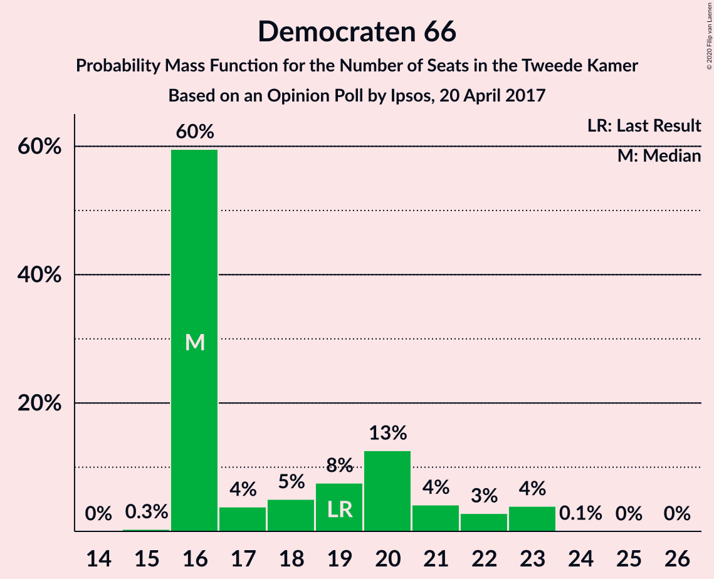
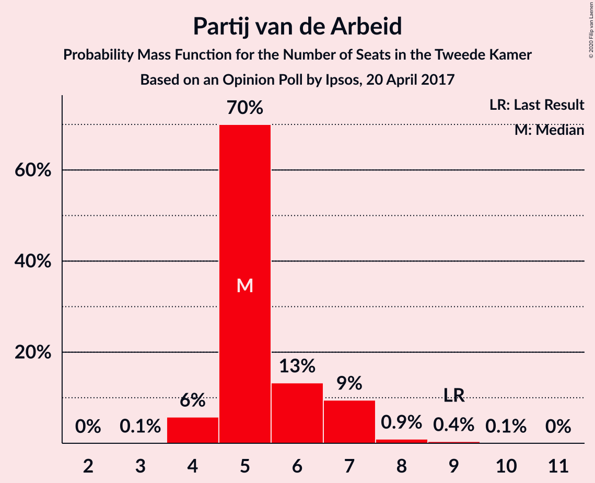
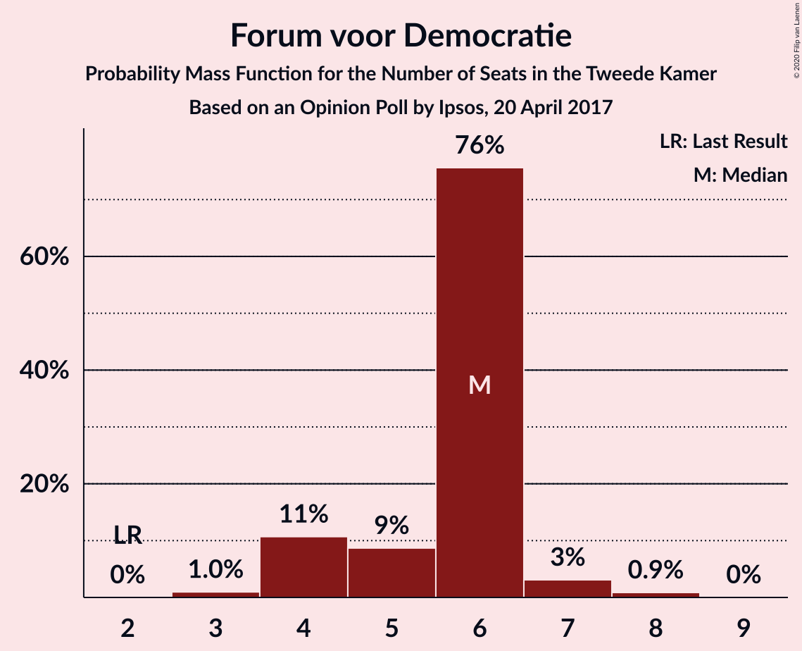
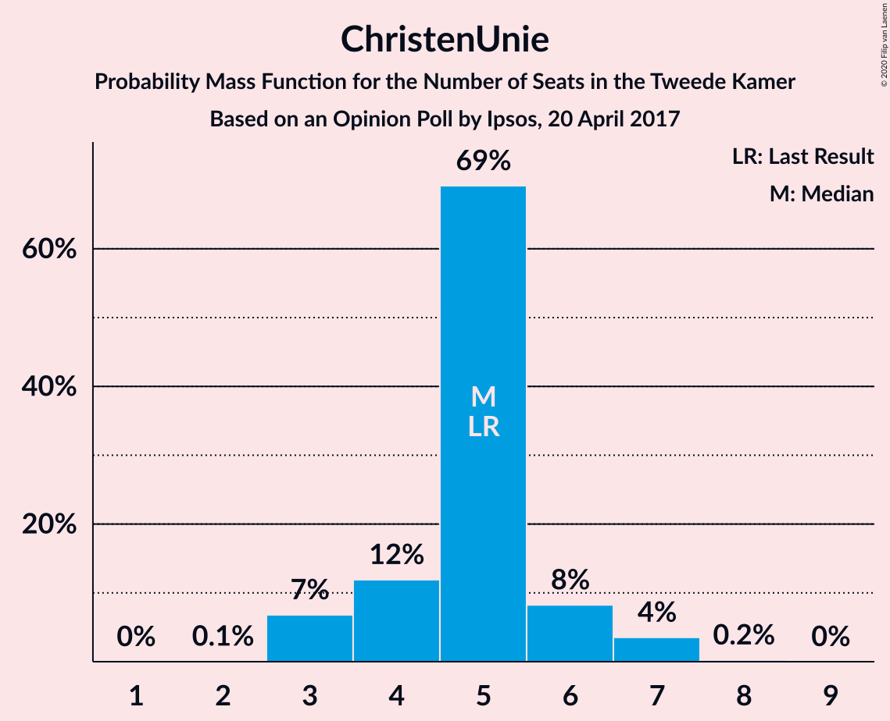
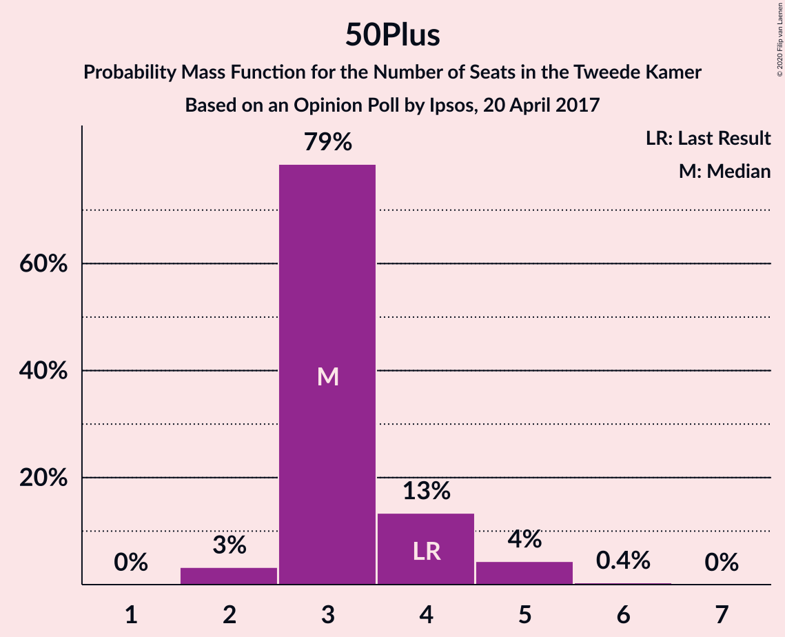
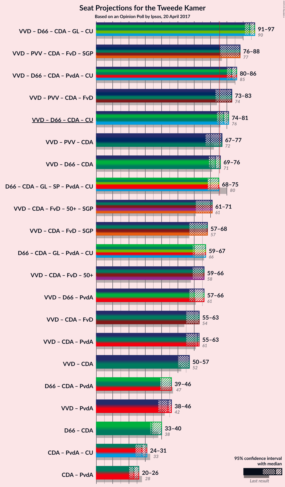
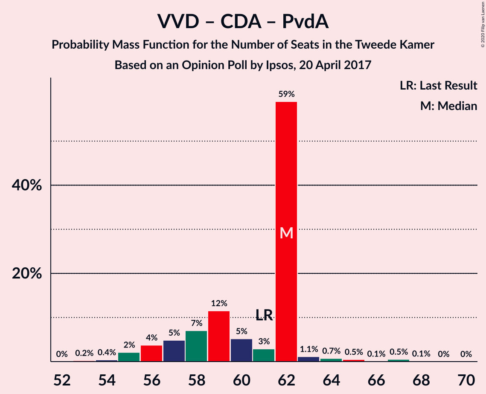
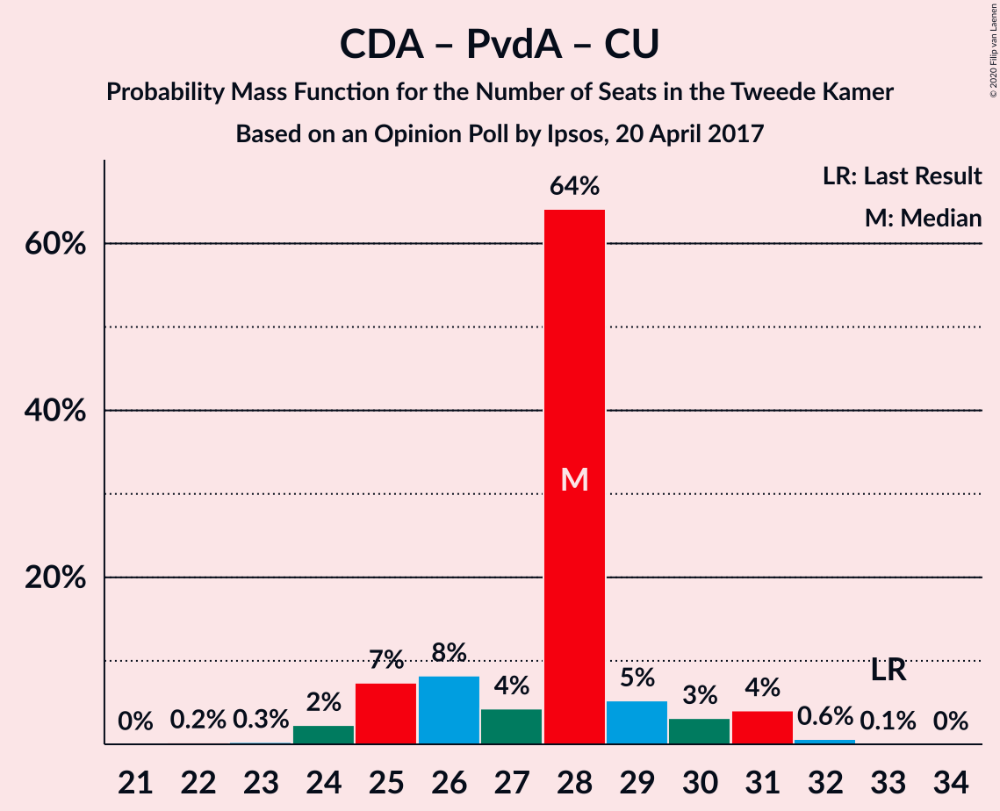

# Opinion Poll by Ipsos, 20 April 2017

<a href="#voting-intentions">Voting Intentions</a> | <a href="#seats">Seats</a> | <a href="#coalitions">Coalitions</a> | <a href="#technical-information">Technical Information</a>

## Voting Intentions

### Confidence Intervals

| Party | Last Result | Poll Result | 80% Confidence Interval | 90% Confidence Interval | 95% Confidence Interval | 99% Confidence Interval |
|:-----:|:-----------:|:-----------:|:-----------------------:|:-----------------------:|:-----------------------:|:-----------------------:|
| Volkspartij voor Vrijheid en Democratie | 21.3% | 24.3% | 22.6–26.1% |22.1–26.6% |21.7–27.1% |21.0–27.9% |
| Democraten 66 | 12.2% | 12.6% | 11.3–14.0% |11.0–14.4% |10.7–14.8% |10.1–15.5% |
| Partij voor de Vrijheid | 13.1% | 12.4% | 11.1–13.8% |10.8–14.2% |10.5–14.6% |9.9–15.3% |
| Christen-Democratisch Appèl | 12.4% | 11.2% | 10.0–12.6% |9.7–13.0% |9.4–13.3% |8.8–14.0% |
| GroenLinks | 9.1% | 10.6% | 9.4–11.9% |9.1–12.3% |8.8–12.7% |8.3–13.3% |
| Socialistische Partij | 9.1% | 5.8% | 5.0–6.9% |4.7–7.2% |4.5–7.4% |4.1–8.0% |
| Partij van de Arbeid | 5.7% | 4.1% | 3.4–5.0% |3.2–5.3% |3.0–5.5% |2.7–6.0% |
| Partij voor de Dieren | 3.2% | 4.1% | 3.4–5.0% |3.2–5.3% |3.0–5.5% |2.7–6.0% |
| Forum voor Democratie | 1.8% | 3.5% | 2.9–4.4% |2.7–4.6% |2.5–4.8% |2.2–5.3% |
| ChristenUnie | 3.4% | 3.3% | 2.7–4.1% |2.5–4.4% |2.4–4.6% |2.1–5.0% |
| 50Plus | 3.1% | 2.4% | 1.9–3.2% |1.7–3.4% |1.6–3.6% |1.4–3.9% |
| Staatkundig Gereformeerde Partij | 2.1% | 2.3% | 1.8–3.0% |1.6–3.2% |1.5–3.4% |1.3–3.8% |
| DENK | 2.1% | 2.2% | 1.7–2.9% |1.6–3.1% |1.4–3.3% |1.2–3.7% |

*Note:* The poll result column reflects the actual value used in the calculations. Published results may vary slightly, and in addition be rounded to fewer digits.

## Seats

### Confidence Intervals

| Party | Last Result | Median | 80% Confidence Interval | 90% Confidence Interval | 95% Confidence Interval | 99% Confidence Interval |
|:-----:|:-----------:|:------:|:-----------------------:|:-----------------------:|:-----------------------:|:-----------------------:|
| <a href="#volkspartij-voor-vrijheid-en-democratie">Volkspartij voor Vrijheid en Democratie</a> | 33 | 36 | 34–39 |33–40 |33–42 |33–45 |
| <a href="#democraten-66">Democraten 66</a> | 19 | 19 | 16–23 |16–23 |15–23 |15–23 |
| <a href="#partij-voor-de-vrijheid">Partij voor de Vrijheid</a> | 20 | 18 | 16–21 |16–22 |15–22 |14–23 |
| <a href="#christen-democratisch-appèl">Christen-Democratisch Appèl</a> | 19 | 18 | 16–19 |15–20 |13–20 |12–20 |
| <a href="#groenlinks">GroenLinks</a> | 14 | 16 | 14–18 |13–18 |13–18 |13–20 |
| <a href="#socialistische-partij">Socialistische Partij</a> | 14 | 9 | 6–10 |6–11 |6–11 |6–11 |
| <a href="#partij-van-de-arbeid">Partij van de Arbeid</a> | 9 | 5 | 4–7 |4–8 |4–9 |4–9 |
| <a href="#partij-voor-de-dieren">Partij voor de Dieren</a> | 5 | 7 | 5–8 |4–9 |4–10 |4–10 |
| <a href="#forum-voor-democratie">Forum voor Democratie</a> | 2 | 5 | 4–7 |4–8 |4–8 |3–8 |
| <a href="#christenunie">ChristenUnie</a> | 5 | 5 | 4–6 |4–7 |3–7 |3–8 |
| <a href="#50plus">50Plus</a> | 4 | 4 | 3–5 |3–5 |2–6 |2–6 |
| <a href="#staatkundig-gereformeerde-partij">Staatkundig Gereformeerde Partij</a> | 3 | 3 | 2–4 |2–4 |2–5 |1–6 |
| <a href="#denk">DENK</a> | 3 | 3 | 2–4 |2–5 |2–5 |2–5 |

### Volkspartij voor Vrijheid en Democratie

*For a full overview of the results for this party, see the [Volkspartij voor Vrijheid en Democratie](party-volkspartijvoorvrijheidendemocratie.html) page.*

| Number of Seats | Probability | Accumulated | Special Marks |
|:---------------:|:-----------:|:-----------:|:-------------:|
| 31 | 0.1% | 100% |  |
| 32 | 0.1% | 99.8% |  |
| 33 | 6% | 99.7% | Last Result |
| 34 | 7% | 94% |  |
| 35 | 13% | 87% |  |
| 36 | 32% | 74% | Median |
| 37 | 15% | 42% |  |
| 38 | 4% | 27% |  |
| 39 | 15% | 23% |  |
| 40 | 3% | 8% |  |
| 41 | 2% | 5% |  |
| 42 | 2% | 3% |  |
| 43 | 0.1% | 0.8% |  |
| 44 | 0% | 0.7% |  |
| 45 | 0.5% | 0.7% |  |
| 46 | 0.2% | 0.2% |  |
| 47 | 0% | 0% |  |

### Democraten 66

*For a full overview of the results for this party, see the [Democraten 66](party-democraten66.html) page.*

| Number of Seats | Probability | Accumulated | Special Marks |
|:---------------:|:-----------:|:-----------:|:-------------:|
| 14 | 0.1% | 100% |  |
| 15 | 3% | 99.9% |  |
| 16 | 16% | 97% |  |
| 17 | 15% | 82% |  |
| 18 | 11% | 67% |  |
| 19 | 17% | 56% | Last Result, Median |
| 20 | 15% | 39% |  |
| 21 | 12% | 24% |  |
| 22 | 1.2% | 11% |  |
| 23 | 10% | 10% |  |
| 24 | 0.1% | 0.2% |  |
| 25 | 0.1% | 0.1% |  |
| 26 | 0% | 0% |  |

### Partij voor de Vrijheid

*For a full overview of the results for this party, see the [Partij voor de Vrijheid](party-partijvoordevrijheid.html) page.*

| Number of Seats | Probability | Accumulated | Special Marks |
|:---------------:|:-----------:|:-----------:|:-------------:|
| 14 | 0.6% | 100% |  |
| 15 | 2% | 99.4% |  |
| 16 | 8% | 97% |  |
| 17 | 16% | 89% |  |
| 18 | 24% | 73% | Median |
| 19 | 18% | 50% |  |
| 20 | 10% | 31% | Last Result |
| 21 | 16% | 21% |  |
| 22 | 3% | 5% |  |
| 23 | 2% | 2% |  |
| 24 | 0% | 0.1% |  |
| 25 | 0% | 0% |  |

### Christen-Democratisch Appèl

*For a full overview of the results for this party, see the [Christen-Democratisch Appèl](party-christen-democratischappèl.html) page.*

| Number of Seats | Probability | Accumulated | Special Marks |
|:---------------:|:-----------:|:-----------:|:-------------:|
| 12 | 2% | 100% |  |
| 13 | 0.6% | 98% |  |
| 14 | 2% | 97% |  |
| 15 | 4% | 95% |  |
| 16 | 8% | 91% |  |
| 17 | 30% | 83% |  |
| 18 | 9% | 52% | Median |
| 19 | 38% | 43% | Last Result |
| 20 | 5% | 5% |  |
| 21 | 0.1% | 0.2% |  |
| 22 | 0% | 0.1% |  |
| 23 | 0.1% | 0.1% |  |
| 24 | 0% | 0% |  |

### GroenLinks

*For a full overview of the results for this party, see the [GroenLinks](party-groenlinks.html) page.*

| Number of Seats | Probability | Accumulated | Special Marks |
|:---------------:|:-----------:|:-----------:|:-------------:|
| 12 | 0.2% | 100% |  |
| 13 | 10% | 99.8% |  |
| 14 | 14% | 90% | Last Result |
| 15 | 19% | 77% |  |
| 16 | 16% | 57% | Median |
| 17 | 25% | 41% |  |
| 18 | 13% | 16% |  |
| 19 | 2% | 2% |  |
| 20 | 0.5% | 0.6% |  |
| 21 | 0.1% | 0.1% |  |
| 22 | 0% | 0% |  |

### Socialistische Partij

*For a full overview of the results for this party, see the [Socialistische Partij](party-socialistischepartij.html) page.*

| Number of Seats | Probability | Accumulated | Special Marks |
|:---------------:|:-----------:|:-----------:|:-------------:|
| 6 | 11% | 100% |  |
| 7 | 15% | 89% |  |
| 8 | 9% | 74% |  |
| 9 | 50% | 65% | Median |
| 10 | 10% | 15% |  |
| 11 | 5% | 5% |  |
| 12 | 0.4% | 0.4% |  |
| 13 | 0% | 0% |  |
| 14 | 0% | 0% | Last Result |

### Partij van de Arbeid

*For a full overview of the results for this party, see the [Partij van de Arbeid](party-partijvandearbeid.html) page.*

| Number of Seats | Probability | Accumulated | Special Marks |
|:---------------:|:-----------:|:-----------:|:-------------:|
| 3 | 0.1% | 100% |  |
| 4 | 10% | 99.9% |  |
| 5 | 51% | 90% | Median |
| 6 | 7% | 38% |  |
| 7 | 24% | 31% |  |
| 8 | 3% | 7% |  |
| 9 | 4% | 4% | Last Result |
| 10 | 0.1% | 0.1% |  |
| 11 | 0% | 0% |  |

### Partij voor de Dieren

*For a full overview of the results for this party, see the [Partij voor de Dieren](party-partijvoordedieren.html) page.*

| Number of Seats | Probability | Accumulated | Special Marks |
|:---------------:|:-----------:|:-----------:|:-------------:|
| 4 | 9% | 100% |  |
| 5 | 7% | 91% | Last Result |
| 6 | 31% | 85% |  |
| 7 | 37% | 54% | Median |
| 8 | 11% | 17% |  |
| 9 | 3% | 6% |  |
| 10 | 4% | 4% |  |
| 11 | 0% | 0% |  |

### Forum voor Democratie

*For a full overview of the results for this party, see the [Forum voor Democratie](party-forumvoordemocratie.html) page.*

| Number of Seats | Probability | Accumulated | Special Marks |
|:---------------:|:-----------:|:-----------:|:-------------:|
| 2 | 0% | 100% | Last Result |
| 3 | 1.3% | 100% |  |
| 4 | 37% | 98.7% |  |
| 5 | 30% | 61% | Median |
| 6 | 11% | 31% |  |
| 7 | 13% | 20% |  |
| 8 | 7% | 7% |  |
| 9 | 0% | 0% |  |

### ChristenUnie

*For a full overview of the results for this party, see the [ChristenUnie](party-christenunie.html) page.*

| Number of Seats | Probability | Accumulated | Special Marks |
|:---------------:|:-----------:|:-----------:|:-------------:|
| 3 | 5% | 100% |  |
| 4 | 32% | 95% |  |
| 5 | 46% | 63% | Last Result, Median |
| 6 | 11% | 17% |  |
| 7 | 4% | 7% |  |
| 8 | 2% | 2% |  |
| 9 | 0% | 0% |  |

### 50Plus

*For a full overview of the results for this party, see the [50Plus](party-50plus.html) page.*

| Number of Seats | Probability | Accumulated | Special Marks |
|:---------------:|:-----------:|:-----------:|:-------------:|
| 2 | 3% | 100% |  |
| 3 | 35% | 97% |  |
| 4 | 46% | 62% | Last Result, Median |
| 5 | 13% | 17% |  |
| 6 | 3% | 3% |  |
| 7 | 0% | 0% |  |

### Staatkundig Gereformeerde Partij

*For a full overview of the results for this party, see the [Staatkundig Gereformeerde Partij](party-staatkundiggereformeerdepartij.html) page.*

| Number of Seats | Probability | Accumulated | Special Marks |
|:---------------:|:-----------:|:-----------:|:-------------:|
| 1 | 0.6% | 100% |  |
| 2 | 35% | 99.4% |  |
| 3 | 51% | 64% | Last Result, Median |
| 4 | 11% | 13% |  |
| 5 | 0.6% | 3% |  |
| 6 | 2% | 2% |  |
| 7 | 0% | 0% |  |

### DENK

*For a full overview of the results for this party, see the [DENK](party-denk.html) page.*

| Number of Seats | Probability | Accumulated | Special Marks |
|:---------------:|:-----------:|:-----------:|:-------------:|
| 1 | 0.1% | 100% |  |
| 2 | 22% | 99.9% |  |
| 3 | 65% | 77% | Last Result, Median |
| 4 | 6% | 12% |  |
| 5 | 6% | 6% |  |
| 6 | 0.2% | 0.2% |  |
| 7 | 0% | 0% |  |

## Coalitions

### Confidence Intervals

| Coalition | Last Result | Median | Majority? | 80% Confidence Interval | 90% Confidence Interval | 95% Confidence Interval | 99% Confidence Interval |
|:---------:|:-----------:|:------:|:---------:|:-----------------------:|:-----------------------:|:-----------------------:|:-----------------------:|
| Volkspartij voor Vrijheid en Democratie – Democraten 66 – Christen-Democratisch Appèl – GroenLinks – ChristenUnie | 90 | 94 | 100% | 91–97 | 91–97 | 91–98 | 89–99 |
| Volkspartij voor Vrijheid en Democratie – Democraten 66 – Christen-Democratisch Appèl – Partij van de Arbeid – ChristenUnie | 85 | 84 | 100% | 79–86 | 79–88 | 79–88 | 79–92 |
| Volkspartij voor Vrijheid en Democratie – Partij voor de Vrijheid – Christen-Democratisch Appèl – Forum voor Democratie – Staatkundig Gereformeerde Partij | 77 | 81 | 95% | 78–84 | 76–84 | 75–85 | 74–88 |
| Volkspartij voor Vrijheid en Democratie – Democraten 66 – Christen-Democratisch Appèl – ChristenUnie | 76 | 79 | 76% | 74–81 | 74–81 | 74–83 | 73–86 |
| Volkspartij voor Vrijheid en Democratie – Partij voor de Vrijheid – Christen-Democratisch Appèl – Forum voor Democratie | 74 | 78 | 87% | 75–81 | 73–81 | 73–82 | 71–87 |
| Volkspartij voor Vrijheid en Democratie – Democraten 66 – Christen-Democratisch Appèl | 71 | 74 | 19% | 69–77 | 69–77 | 68–77 | 68–79 |
| Democraten 66 – Christen-Democratisch Appèl – GroenLinks – Socialistische Partij – Partij van de Arbeid – ChristenUnie | 80 | 72 | 6% | 68–74 | 68–76 | 68–76 | 63–78 |
| Volkspartij voor Vrijheid en Democratie – Partij voor de Vrijheid – Christen-Democratisch Appèl | 72 | 74 | 3% | 69–75 | 67–75 | 67–76 | 65–83 |
| Volkspartij voor Vrijheid en Democratie – Christen-Democratisch Appèl – Forum voor Democratie – 50Plus – Staatkundig Gereformeerde Partij | 61 | 65 | 0% | 64–70 | 61–72 | 60–72 | 58–72 |
| Democraten 66 – Christen-Democratisch Appèl – GroenLinks – Partij van de Arbeid – ChristenUnie | 66 | 64 | 0% | 60–66 | 60–69 | 59–69 | 57–69 |
| Volkspartij voor Vrijheid en Democratie – Christen-Democratisch Appèl – Forum voor Democratie – 50Plus | 58 | 62 | 0% | 61–68 | 58–68 | 58–68 | 55–69 |
| Volkspartij voor Vrijheid en Democratie – Democraten 66 – Partij van de Arbeid | 61 | 61 | 0% | 57–65 | 57–66 | 57–67 | 57–68 |
| Volkspartij voor Vrijheid en Democratie – Christen-Democratisch Appèl – Forum voor Democratie – Staatkundig Gereformeerde Partij | 57 | 61 | 0% | 60–67 | 58–67 | 56–67 | 56–69 |
| Volkspartij voor Vrijheid en Democratie – Christen-Democratisch Appèl – Partij van de Arbeid | 61 | 60 | 0% | 58–64 | 56–65 | 55–65 | 55–67 |
| Volkspartij voor Vrijheid en Democratie – Christen-Democratisch Appèl – Forum voor Democratie | 54 | 59 | 0% | 57–63 | 54–63 | 54–63 | 53–66 |
| Volkspartij voor Vrijheid en Democratie – Christen-Democratisch Appèl | 52 | 54 | 0% | 52–58 | 50–58 | 50–58 | 48–61 |
| Volkspartij voor Vrijheid en Democratie – Partij van de Arbeid | 42 | 42 | 0% | 39–46 | 39–46 | 39–47 | 39–51 |
| Democraten 66 – Christen-Democratisch Appèl – Partij van de Arbeid | 47 | 43 | 0% | 38–45 | 38–47 | 37–47 | 37–48 |
| Democraten 66 – Christen-Democratisch Appèl | 38 | 37 | 0% | 33–40 | 32–40 | 30–40 | 30–42 |
| Christen-Democratisch Appèl – Partij van de Arbeid – ChristenUnie | 33 | 28 | 0% | 26–32 | 24–32 | 24–32 | 22–32 |
| Christen-Democratisch Appèl – Partij van de Arbeid | 28 | 23 | 0% | 21–26 | 20–27 | 19–27 | 18–28 |

### Volkspartij voor Vrijheid en Democratie – Democraten 66 – Christen-Democratisch Appèl – GroenLinks – ChristenUnie

| Number of Seats | Probability | Accumulated | Special Marks |
|:---------------:|:-----------:|:-----------:|:-------------:|
| 85 | 0.2% | 100% |  |
| 86 | 0% | 99.8% |  |
| 87 | 0.1% | 99.8% |  |
| 88 | 0.2% | 99.7% |  |
| 89 | 1.4% | 99.5% |  |
| 90 | 0.6% | 98% | Last Result |
| 91 | 18% | 98% |  |
| 92 | 14% | 79% |  |
| 93 | 13% | 65% |  |
| 94 | 7% | 53% | Median |
| 95 | 20% | 46% |  |
| 96 | 9% | 26% |  |
| 97 | 13% | 17% |  |
| 98 | 3% | 3% |  |
| 99 | 0.6% | 0.7% |  |
| 100 | 0% | 0.1% |  |
| 101 | 0.1% | 0.1% |  |
| 102 | 0% | 0% |  |

### Volkspartij voor Vrijheid en Democratie – Democraten 66 – Christen-Democratisch Appèl – Partij van de Arbeid – ChristenUnie

| Number of Seats | Probability | Accumulated | Special Marks |
|:---------------:|:-----------:|:-----------:|:-------------:|
| 77 | 0% | 100% |  |
| 78 | 0.2% | 99.9% |  |
| 79 | 19% | 99.7% |  |
| 80 | 0.3% | 81% |  |
| 81 | 6% | 80% |  |
| 82 | 2% | 74% |  |
| 83 | 0.2% | 72% | Median |
| 84 | 31% | 72% |  |
| 85 | 6% | 41% | Last Result |
| 86 | 29% | 35% |  |
| 87 | 0.4% | 6% |  |
| 88 | 4% | 5% |  |
| 89 | 0.6% | 1.3% |  |
| 90 | 0.3% | 0.8% |  |
| 91 | 0% | 0.5% |  |
| 92 | 0% | 0.5% |  |
| 93 | 0.4% | 0.5% |  |
| 94 | 0% | 0% |  |

### Volkspartij voor Vrijheid en Democratie – Partij voor de Vrijheid – Christen-Democratisch Appèl – Forum voor Democratie – Staatkundig Gereformeerde Partij

| Number of Seats | Probability | Accumulated | Special Marks |
|:---------------:|:-----------:|:-----------:|:-------------:|
| 73 | 0.5% | 100% |  |
| 74 | 0% | 99.5% |  |
| 75 | 4% | 99.5% |  |
| 76 | 4% | 95% | Majority |
| 77 | 0.2% | 91% | Last Result |
| 78 | 3% | 91% |  |
| 79 | 13% | 88% |  |
| 80 | 17% | 75% | Median |
| 81 | 18% | 58% |  |
| 82 | 2% | 40% |  |
| 83 | 19% | 37% |  |
| 84 | 16% | 19% |  |
| 85 | 0.8% | 3% |  |
| 86 | 1.4% | 2% |  |
| 87 | 0% | 0.7% |  |
| 88 | 0.6% | 0.6% |  |
| 89 | 0% | 0.1% |  |
| 90 | 0% | 0% |  |

### Volkspartij voor Vrijheid en Democratie – Democraten 66 – Christen-Democratisch Appèl – ChristenUnie

| Number of Seats | Probability | Accumulated | Special Marks |
|:---------------:|:-----------:|:-----------:|:-------------:|
| 71 | 0.2% | 100% |  |
| 72 | 0.1% | 99.8% |  |
| 73 | 0.3% | 99.7% |  |
| 74 | 22% | 99.4% |  |
| 75 | 1.0% | 77% |  |
| 76 | 7% | 76% | Last Result, Majority |
| 77 | 8% | 69% |  |
| 78 | 7% | 61% | Median |
| 79 | 22% | 55% |  |
| 80 | 10% | 32% |  |
| 81 | 18% | 22% |  |
| 82 | 0.8% | 4% |  |
| 83 | 3% | 3% |  |
| 84 | 0.2% | 0.7% |  |
| 85 | 0% | 0.5% |  |
| 86 | 0.4% | 0.5% |  |
| 87 | 0.1% | 0.1% |  |
| 88 | 0% | 0% |  |

### Volkspartij voor Vrijheid en Democratie – Partij voor de Vrijheid – Christen-Democratisch Appèl – Forum voor Democratie

| Number of Seats | Probability | Accumulated | Special Marks |
|:---------------:|:-----------:|:-----------:|:-------------:|
| 70 | 0.4% | 100% |  |
| 71 | 0% | 99.5% |  |
| 72 | 1.0% | 99.5% |  |
| 73 | 7% | 98% |  |
| 74 | 0.7% | 91% | Last Result |
| 75 | 3% | 90% |  |
| 76 | 4% | 87% | Majority |
| 77 | 13% | 83% | Median |
| 78 | 31% | 71% |  |
| 79 | 2% | 39% |  |
| 80 | 26% | 37% |  |
| 81 | 8% | 11% |  |
| 82 | 1.1% | 3% |  |
| 83 | 0.2% | 2% |  |
| 84 | 1.3% | 2% |  |
| 85 | 0% | 0.6% |  |
| 86 | 0% | 0.6% |  |
| 87 | 0.5% | 0.5% |  |
| 88 | 0% | 0% |  |

### Volkspartij voor Vrijheid en Democratie – Democraten 66 – Christen-Democratisch Appèl

| Number of Seats | Probability | Accumulated | Special Marks |
|:---------------:|:-----------:|:-----------:|:-------------:|
| 66 | 0% | 100% |  |
| 67 | 0.2% | 99.9% |  |
| 68 | 3% | 99.7% |  |
| 69 | 16% | 97% |  |
| 70 | 7% | 81% |  |
| 71 | 5% | 74% | Last Result |
| 72 | 6% | 69% |  |
| 73 | 8% | 63% | Median |
| 74 | 13% | 55% |  |
| 75 | 23% | 42% |  |
| 76 | 6% | 19% | Majority |
| 77 | 11% | 13% |  |
| 78 | 2% | 2% |  |
| 79 | 0.4% | 0.8% |  |
| 80 | 0% | 0.3% |  |
| 81 | 0.3% | 0.3% |  |
| 82 | 0% | 0% |  |

### Democraten 66 – Christen-Democratisch Appèl – GroenLinks – Socialistische Partij – Partij van de Arbeid – ChristenUnie

| Number of Seats | Probability | Accumulated | Special Marks |
|:---------------:|:-----------:|:-----------:|:-------------:|
| 62 | 0% | 100% |  |
| 63 | 0.5% | 99.9% |  |
| 64 | 0.2% | 99.5% |  |
| 65 | 0.9% | 99.3% |  |
| 66 | 0% | 98% |  |
| 67 | 0.6% | 98% |  |
| 68 | 8% | 98% |  |
| 69 | 28% | 90% |  |
| 70 | 3% | 61% |  |
| 71 | 2% | 58% |  |
| 72 | 14% | 56% | Median |
| 73 | 21% | 42% |  |
| 74 | 15% | 21% |  |
| 75 | 0.5% | 6% |  |
| 76 | 4% | 6% | Majority |
| 77 | 2% | 2% |  |
| 78 | 0.5% | 0.6% |  |
| 79 | 0% | 0.1% |  |
| 80 | 0.1% | 0.1% | Last Result |
| 81 | 0% | 0% |  |

### Volkspartij voor Vrijheid en Democratie – Partij voor de Vrijheid – Christen-Democratisch Appèl

| Number of Seats | Probability | Accumulated | Special Marks |
|:---------------:|:-----------:|:-----------:|:-------------:|
| 65 | 0.5% | 100% |  |
| 66 | 0.1% | 99.5% |  |
| 67 | 5% | 99.4% |  |
| 68 | 0.4% | 95% |  |
| 69 | 5% | 94% |  |
| 70 | 3% | 90% |  |
| 71 | 7% | 86% |  |
| 72 | 11% | 79% | Last Result, Median |
| 73 | 15% | 69% |  |
| 74 | 32% | 53% |  |
| 75 | 18% | 21% |  |
| 76 | 0.8% | 3% | Majority |
| 77 | 0.2% | 2% |  |
| 78 | 0.1% | 2% |  |
| 79 | 0.2% | 2% |  |
| 80 | 1.3% | 2% |  |
| 81 | 0% | 0.5% |  |
| 82 | 0% | 0.5% |  |
| 83 | 0.5% | 0.5% |  |
| 84 | 0% | 0% |  |

### Volkspartij voor Vrijheid en Democratie – Christen-Democratisch Appèl – Forum voor Democratie – 50Plus – Staatkundig Gereformeerde Partij

| Number of Seats | Probability | Accumulated | Special Marks |
|:---------------:|:-----------:|:-----------:|:-------------:|
| 58 | 0.9% | 100% |  |
| 59 | 0% | 99.1% |  |
| 60 | 4% | 99.1% |  |
| 61 | 0.6% | 96% | Last Result |
| 62 | 0.4% | 95% |  |
| 63 | 4% | 95% |  |
| 64 | 30% | 91% |  |
| 65 | 19% | 60% |  |
| 66 | 2% | 41% | Median |
| 67 | 1.1% | 40% |  |
| 68 | 16% | 39% |  |
| 69 | 10% | 22% |  |
| 70 | 2% | 12% |  |
| 71 | 0.1% | 10% |  |
| 72 | 9% | 10% |  |
| 73 | 0.2% | 0.4% |  |
| 74 | 0.2% | 0.2% |  |
| 75 | 0% | 0% |  |

### Democraten 66 – Christen-Democratisch Appèl – GroenLinks – Partij van de Arbeid – ChristenUnie

| Number of Seats | Probability | Accumulated | Special Marks |
|:---------------:|:-----------:|:-----------:|:-------------:|
| 54 | 0% | 100% |  |
| 55 | 0.2% | 99.9% |  |
| 56 | 0.2% | 99.8% |  |
| 57 | 1.1% | 99.6% |  |
| 58 | 0.3% | 98% |  |
| 59 | 2% | 98% |  |
| 60 | 29% | 97% |  |
| 61 | 8% | 67% |  |
| 62 | 2% | 60% |  |
| 63 | 5% | 58% | Median |
| 64 | 27% | 53% |  |
| 65 | 10% | 26% |  |
| 66 | 10% | 16% | Last Result |
| 67 | 0.2% | 6% |  |
| 68 | 0.2% | 6% |  |
| 69 | 6% | 6% |  |
| 70 | 0% | 0.1% |  |
| 71 | 0% | 0% |  |

### Volkspartij voor Vrijheid en Democratie – Christen-Democratisch Appèl – Forum voor Democratie – 50Plus

| Number of Seats | Probability | Accumulated | Special Marks |
|:---------------:|:-----------:|:-----------:|:-------------:|
| 55 | 0.9% | 100% |  |
| 56 | 0% | 99.1% |  |
| 57 | 0% | 99.1% |  |
| 58 | 4% | 99.0% | Last Result |
| 59 | 1.3% | 95% |  |
| 60 | 1.1% | 94% |  |
| 61 | 19% | 93% |  |
| 62 | 24% | 74% |  |
| 63 | 9% | 49% | Median |
| 64 | 2% | 40% |  |
| 65 | 16% | 38% |  |
| 66 | 9% | 22% |  |
| 67 | 0.1% | 12% |  |
| 68 | 11% | 12% |  |
| 69 | 0.7% | 0.9% |  |
| 70 | 0.2% | 0.2% |  |
| 71 | 0% | 0% |  |

### Volkspartij voor Vrijheid en Democratie – Democraten 66 – Partij van de Arbeid

| Number of Seats | Probability | Accumulated | Special Marks |
|:---------------:|:-----------:|:-----------:|:-------------:|
| 54 | 0.1% | 100% |  |
| 55 | 0% | 99.9% |  |
| 56 | 0% | 99.9% |  |
| 57 | 19% | 99.9% |  |
| 58 | 0.4% | 81% |  |
| 59 | 5% | 81% |  |
| 60 | 23% | 76% | Median |
| 61 | 12% | 53% | Last Result |
| 62 | 5% | 41% |  |
| 63 | 12% | 36% |  |
| 64 | 8% | 24% |  |
| 65 | 9% | 16% |  |
| 66 | 4% | 7% |  |
| 67 | 0.5% | 3% |  |
| 68 | 2% | 2% |  |
| 69 | 0.1% | 0.3% |  |
| 70 | 0.2% | 0.3% |  |
| 71 | 0.1% | 0.1% |  |
| 72 | 0% | 0% |  |

### Volkspartij voor Vrijheid en Democratie – Christen-Democratisch Appèl – Forum voor Democratie – Staatkundig Gereformeerde Partij

| Number of Seats | Probability | Accumulated | Special Marks |
|:---------------:|:-----------:|:-----------:|:-------------:|
| 55 | 0% | 100% |  |
| 56 | 5% | 99.9% |  |
| 57 | 0% | 95% | Last Result |
| 58 | 0.3% | 95% |  |
| 59 | 0.9% | 95% |  |
| 60 | 31% | 94% |  |
| 61 | 14% | 63% |  |
| 62 | 7% | 49% | Median |
| 63 | 4% | 42% |  |
| 64 | 9% | 38% |  |
| 65 | 12% | 29% |  |
| 66 | 7% | 17% |  |
| 67 | 9% | 10% |  |
| 68 | 0% | 1.0% |  |
| 69 | 0.8% | 1.0% |  |
| 70 | 0.1% | 0.2% |  |
| 71 | 0% | 0% |  |

### Volkspartij voor Vrijheid en Democratie – Christen-Democratisch Appèl – Partij van de Arbeid

| Number of Seats | Probability | Accumulated | Special Marks |
|:---------------:|:-----------:|:-----------:|:-------------:|
| 52 | 0.1% | 100% |  |
| 53 | 0% | 99.9% |  |
| 54 | 0.1% | 99.9% |  |
| 55 | 4% | 99.8% |  |
| 56 | 1.4% | 95% |  |
| 57 | 2% | 94% |  |
| 58 | 27% | 92% |  |
| 59 | 11% | 65% | Median |
| 60 | 18% | 54% |  |
| 61 | 10% | 36% | Last Result |
| 62 | 13% | 26% |  |
| 63 | 0.1% | 13% |  |
| 64 | 3% | 13% |  |
| 65 | 9% | 10% |  |
| 66 | 0.4% | 1.2% |  |
| 67 | 0.6% | 0.8% |  |
| 68 | 0.1% | 0.2% |  |
| 69 | 0.2% | 0.2% |  |
| 70 | 0% | 0% |  |

### Volkspartij voor Vrijheid en Democratie – Christen-Democratisch Appèl – Forum voor Democratie

| Number of Seats | Probability | Accumulated | Special Marks |
|:---------------:|:-----------:|:-----------:|:-------------:|
| 52 | 0.1% | 100% |  |
| 53 | 1.3% | 99.9% |  |
| 54 | 4% | 98.6% | Last Result |
| 55 | 0.1% | 95% |  |
| 56 | 2% | 95% |  |
| 57 | 20% | 93% |  |
| 58 | 12% | 73% |  |
| 59 | 20% | 61% | Median |
| 60 | 3% | 41% |  |
| 61 | 7% | 38% |  |
| 62 | 15% | 31% |  |
| 63 | 14% | 16% |  |
| 64 | 0.3% | 2% |  |
| 65 | 0.9% | 2% |  |
| 66 | 0.5% | 0.7% |  |
| 67 | 0.2% | 0.2% |  |
| 68 | 0% | 0% |  |

### Volkspartij voor Vrijheid en Democratie – Christen-Democratisch Appèl

| Number of Seats | Probability | Accumulated | Special Marks |
|:---------------:|:-----------:|:-----------:|:-------------:|
| 48 | 2% | 100% |  |
| 49 | 0.7% | 98% |  |
| 50 | 4% | 98% |  |
| 51 | 4% | 94% |  |
| 52 | 6% | 90% | Last Result |
| 53 | 20% | 84% |  |
| 54 | 18% | 65% | Median |
| 55 | 23% | 47% |  |
| 56 | 9% | 24% |  |
| 57 | 3% | 15% |  |
| 58 | 10% | 12% |  |
| 59 | 0.6% | 1.4% |  |
| 60 | 0% | 0.8% |  |
| 61 | 0.5% | 0.7% |  |
| 62 | 0.1% | 0.2% |  |
| 63 | 0.1% | 0.2% |  |
| 64 | 0% | 0% |  |

### Volkspartij voor Vrijheid en Democratie – Partij van de Arbeid

| Number of Seats | Probability | Accumulated | Special Marks |
|:---------------:|:-----------:|:-----------:|:-------------:|
| 37 | 0.2% | 100% |  |
| 38 | 0.3% | 99.8% |  |
| 39 | 15% | 99.5% |  |
| 40 | 2% | 85% |  |
| 41 | 28% | 83% | Median |
| 42 | 17% | 55% | Last Result |
| 43 | 6% | 37% |  |
| 44 | 10% | 31% |  |
| 45 | 5% | 22% |  |
| 46 | 13% | 16% |  |
| 47 | 1.0% | 3% |  |
| 48 | 0.9% | 2% |  |
| 49 | 0.2% | 1.0% |  |
| 50 | 0% | 0.8% |  |
| 51 | 0.6% | 0.7% |  |
| 52 | 0.2% | 0.2% |  |
| 53 | 0% | 0% |  |

### Democraten 66 – Christen-Democratisch Appèl – Partij van de Arbeid

| Number of Seats | Probability | Accumulated | Special Marks |
|:---------------:|:-----------:|:-----------:|:-------------:|
| 35 | 0.1% | 100% |  |
| 36 | 0.3% | 99.9% |  |
| 37 | 2% | 99.6% |  |
| 38 | 18% | 97% |  |
| 39 | 3% | 79% |  |
| 40 | 2% | 77% |  |
| 41 | 9% | 74% |  |
| 42 | 9% | 66% | Median |
| 43 | 20% | 57% |  |
| 44 | 16% | 36% |  |
| 45 | 13% | 20% |  |
| 46 | 1.1% | 7% |  |
| 47 | 4% | 6% | Last Result |
| 48 | 2% | 2% |  |
| 49 | 0.1% | 0.1% |  |
| 50 | 0% | 0% |  |

### Democraten 66 – Christen-Democratisch Appèl

| Number of Seats | Probability | Accumulated | Special Marks |
|:---------------:|:-----------:|:-----------:|:-------------:|
| 29 | 0.2% | 100% |  |
| 30 | 2% | 99.8% |  |
| 31 | 0.2% | 97% |  |
| 32 | 2% | 97% |  |
| 33 | 17% | 95% |  |
| 34 | 2% | 78% |  |
| 35 | 5% | 76% |  |
| 36 | 16% | 70% |  |
| 37 | 16% | 55% | Median |
| 38 | 17% | 39% | Last Result |
| 39 | 3% | 22% |  |
| 40 | 18% | 20% |  |
| 41 | 0.1% | 1.0% |  |
| 42 | 0.9% | 1.0% |  |
| 43 | 0% | 0.1% |  |
| 44 | 0.1% | 0.1% |  |
| 45 | 0% | 0% |  |

### Christen-Democratisch Appèl – Partij van de Arbeid – ChristenUnie

| Number of Seats | Probability | Accumulated | Special Marks |
|:---------------:|:-----------:|:-----------:|:-------------:|
| 22 | 0.6% | 100% |  |
| 23 | 1.2% | 99.3% |  |
| 24 | 3% | 98% |  |
| 25 | 4% | 95% |  |
| 26 | 10% | 91% |  |
| 27 | 25% | 81% |  |
| 28 | 12% | 56% | Median |
| 29 | 13% | 44% |  |
| 30 | 20% | 31% |  |
| 31 | 1.4% | 11% |  |
| 32 | 10% | 10% |  |
| 33 | 0.2% | 0.3% | Last Result |
| 34 | 0% | 0.1% |  |
| 35 | 0% | 0% |  |

### Christen-Democratisch Appèl – Partij van de Arbeid

| Number of Seats | Probability | Accumulated | Special Marks |
|:---------------:|:-----------:|:-----------:|:-------------:|
| 17 | 0.2% | 100% |  |
| 18 | 2% | 99.8% |  |
| 19 | 0.9% | 98% |  |
| 20 | 2% | 97% |  |
| 21 | 7% | 95% |  |
| 22 | 34% | 88% |  |
| 23 | 11% | 54% | Median |
| 24 | 15% | 43% |  |
| 25 | 4% | 28% |  |
| 26 | 17% | 24% |  |
| 27 | 6% | 7% |  |
| 28 | 0.9% | 0.9% | Last Result |
| 29 | 0% | 0% |  |

## Technical Information

### Opinion Poll

+ **Polling firm:** Ipsos
+ **Commissioner(s):** —
+ **Fieldwork period:** 20 April 2017

### Calculations

+ **Sample size:** 1000
+ **Simulations done:** 131,072
+ **Error estimate:** 2.01%

