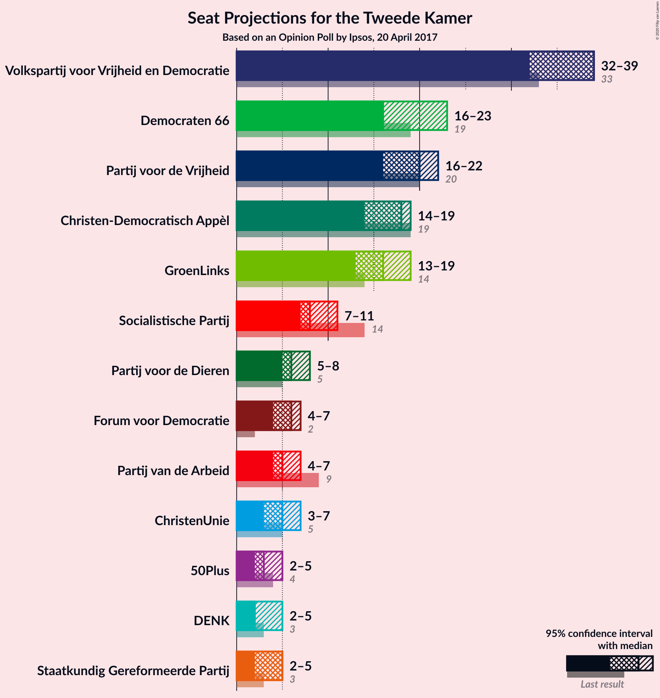
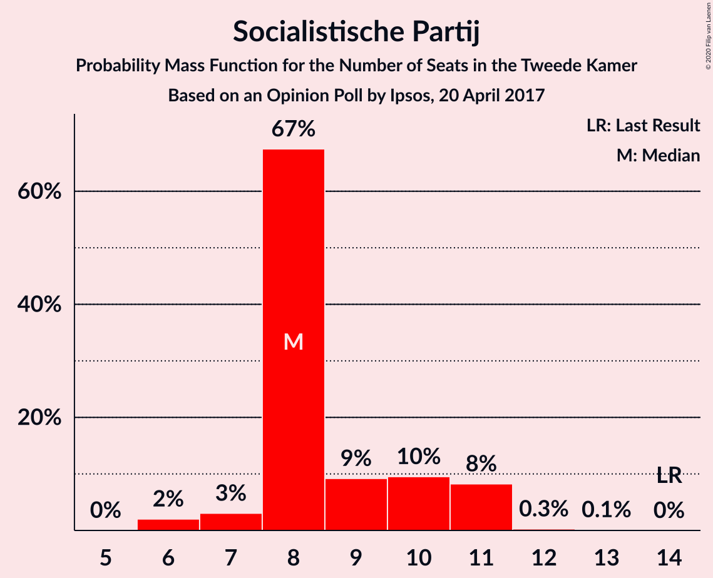
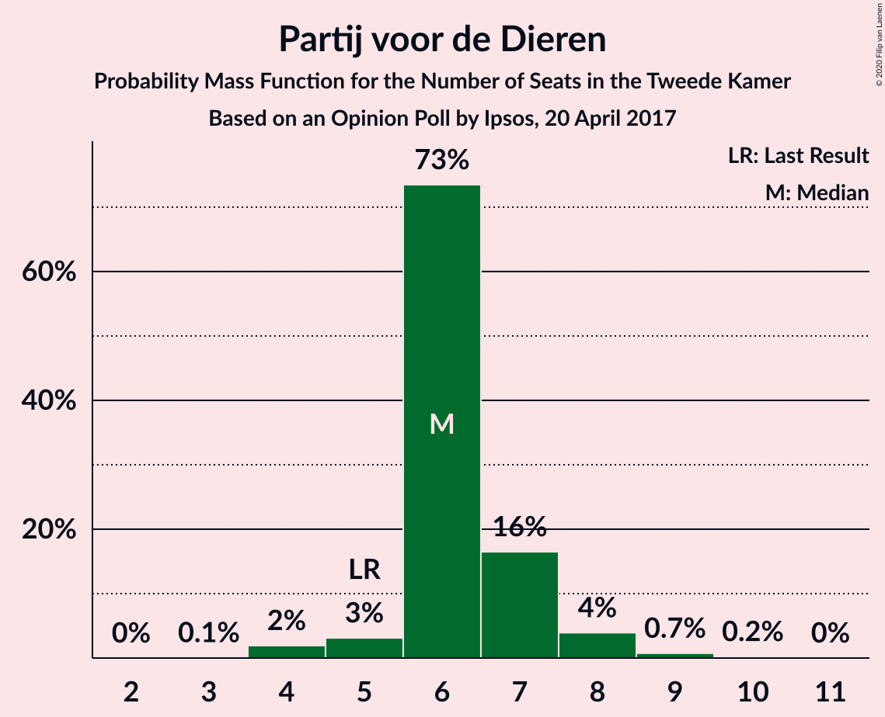
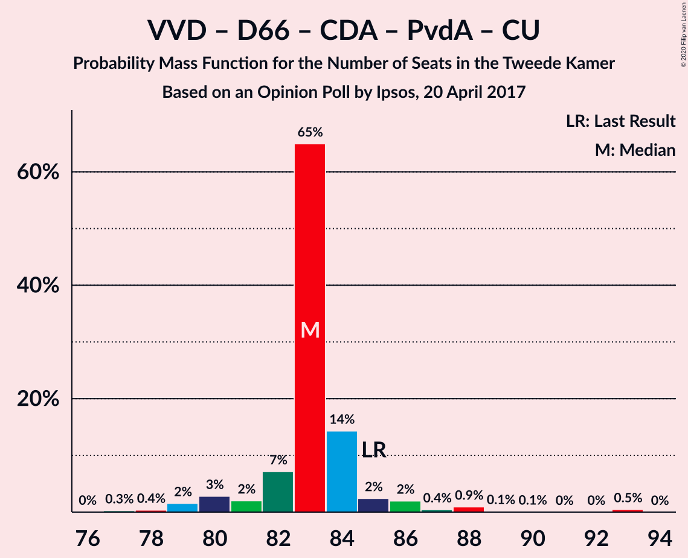
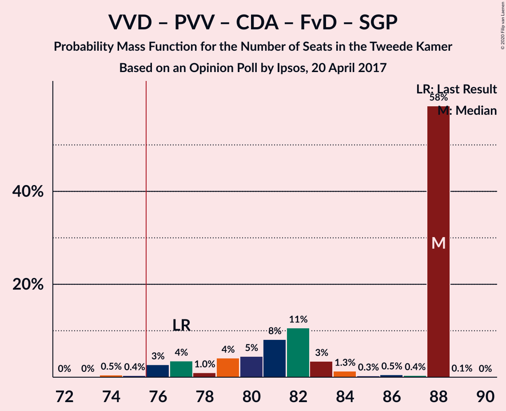
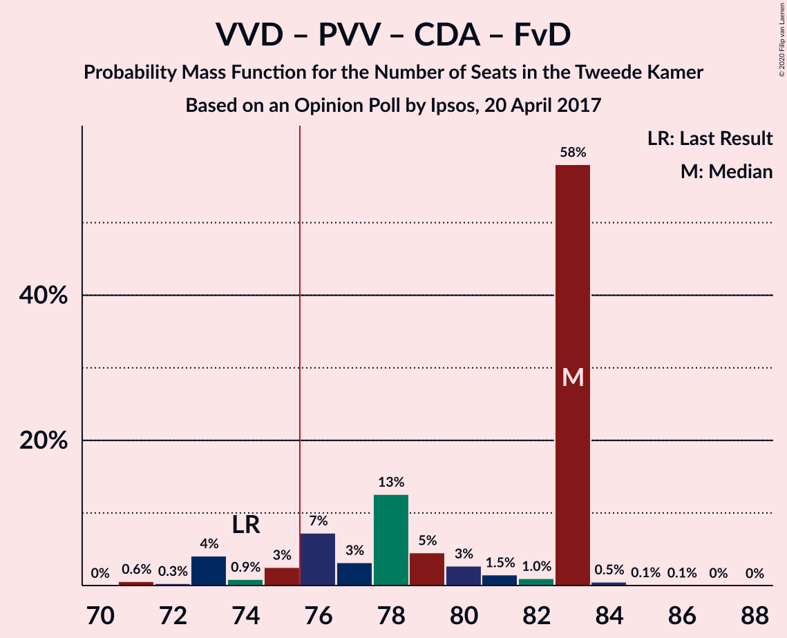
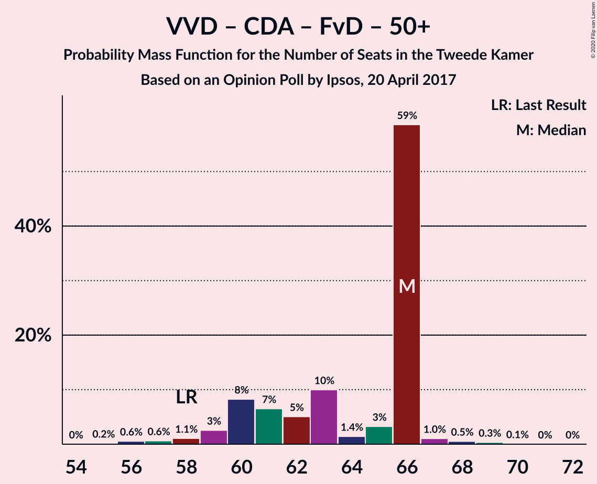
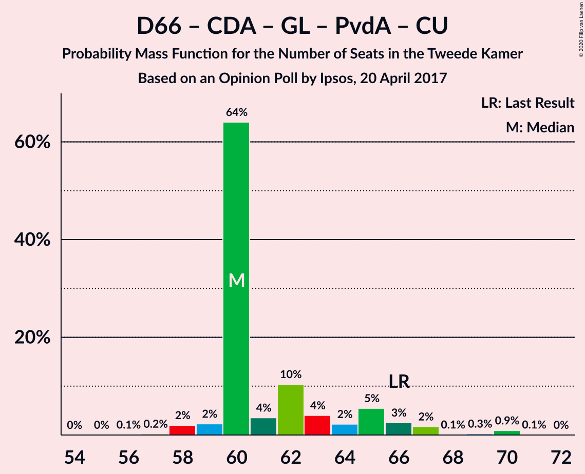
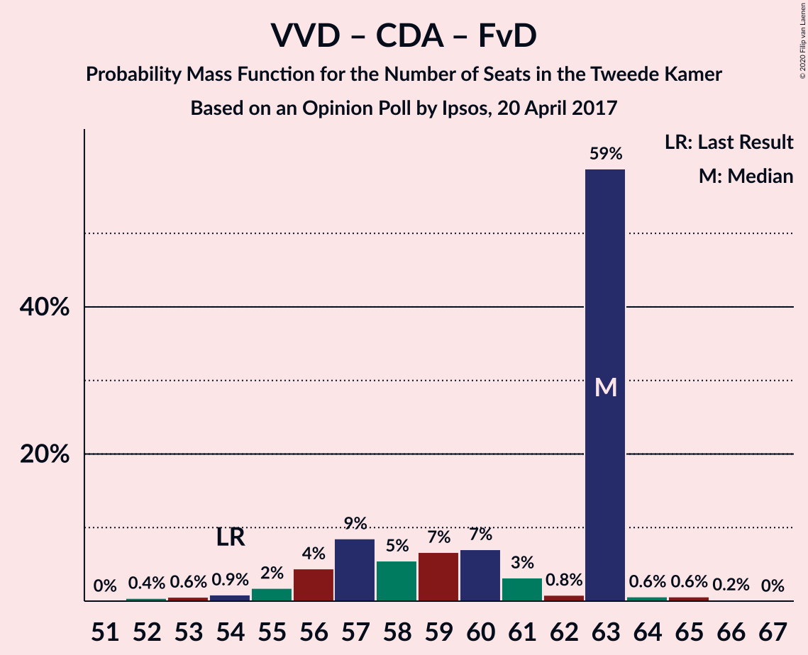

# Opinion Poll by Ipsos, 20 April 2017

<a href="#voting-intentions">Voting Intentions</a> | <a href="#seats">Seats</a> | <a href="#coalitions">Coalitions</a> | <a href="#technical-information">Technical Information</a>

## Voting Intentions

### Confidence Intervals

| Party | Last Result | Poll Result | 80% Confidence Interval | 90% Confidence Interval | 95% Confidence Interval | 99% Confidence Interval |
|:-----:|:-----------:|:-----------:|:-----------------------:|:-----------------------:|:-----------------------:|:-----------------------:|
| Volkspartij voor Vrijheid en Democratie | 21.3% | 24.3% | 22.6–26.1% |22.1–26.6% |21.7–27.1% |21.0–27.9% |
| Democraten 66 | 12.2% | 12.6% | 11.3–14.0% |11.0–14.4% |10.7–14.8% |10.1–15.5% |
| Partij voor de Vrijheid | 13.1% | 12.4% | 11.1–13.8% |10.8–14.2% |10.5–14.6% |9.9–15.3% |
| Christen-Democratisch Appèl | 12.4% | 11.2% | 10.0–12.6% |9.7–13.0% |9.4–13.3% |8.8–14.0% |
| GroenLinks | 9.1% | 10.6% | 9.4–11.9% |9.1–12.3% |8.8–12.7% |8.3–13.3% |
| Socialistische Partij | 9.1% | 5.8% | 5.0–6.9% |4.7–7.2% |4.5–7.4% |4.1–8.0% |
| Partij van de Arbeid | 5.7% | 4.1% | 3.4–5.0% |3.2–5.3% |3.0–5.5% |2.7–6.0% |
| Partij voor de Dieren | 3.2% | 4.1% | 3.4–5.0% |3.2–5.3% |3.0–5.5% |2.7–6.0% |
| Forum voor Democratie | 1.8% | 3.5% | 2.9–4.4% |2.7–4.6% |2.5–4.8% |2.2–5.3% |
| ChristenUnie | 3.4% | 3.3% | 2.7–4.1% |2.5–4.4% |2.4–4.6% |2.1–5.0% |
| 50Plus | 3.1% | 2.4% | 1.9–3.2% |1.7–3.4% |1.6–3.6% |1.4–3.9% |
| Staatkundig Gereformeerde Partij | 2.1% | 2.3% | 1.8–3.0% |1.6–3.2% |1.5–3.4% |1.3–3.8% |
| DENK | 2.1% | 2.2% | 1.7–2.9% |1.6–3.1% |1.4–3.3% |1.2–3.7% |

*Note:* The poll result column reflects the actual value used in the calculations. Published results may vary slightly, and in addition be rounded to fewer digits.

## Seats

### Confidence Intervals

| Party | Last Result | Median | 80% Confidence Interval | 90% Confidence Interval | 95% Confidence Interval | 99% Confidence Interval |
|:-----:|:-----------:|:------:|:-----------------------:|:-----------------------:|:-----------------------:|:-----------------------:|
| <a href="#volkspartij-voor-vrijheid-en-democratie">Volkspartij voor Vrijheid en Democratie</a> | 33 | 36 | 33–39 |33–40 |33–43 |33–44 |
| <a href="#democraten-66">Democraten 66</a> | 19 | 20 | 17–23 |16–23 |16–23 |15–23 |
| <a href="#partij-voor-de-vrijheid">Partij voor de Vrijheid</a> | 20 | 19 | 16–21 |16–22 |16–22 |15–23 |
| <a href="#christen-democratisch-appèl">Christen-Democratisch Appèl</a> | 19 | 17 | 14–19 |14–19 |13–20 |12–20 |
| <a href="#groenlinks">GroenLinks</a> | 14 | 15 | 14–17 |13–18 |13–19 |13–21 |
| <a href="#socialistische-partij">Socialistische Partij</a> | 14 | 9 | 7–10 |7–10 |6–11 |6–12 |
| <a href="#partij-van-de-arbeid">Partij van de Arbeid</a> | 9 | 6 | 5–7 |4–7 |4–8 |4–9 |
| <a href="#partij-voor-de-dieren">Partij voor de Dieren</a> | 5 | 7 | 5–7 |4–8 |4–9 |4–10 |
| <a href="#forum-voor-democratie">Forum voor Democratie</a> | 2 | 5 | 4–7 |4–7 |3–8 |3–8 |
| <a href="#christenunie">ChristenUnie</a> | 5 | 5 | 4–6 |4–7 |3–7 |3–8 |
| <a href="#50plus">50Plus</a> | 4 | 3 | 3–5 |2–5 |2–5 |2–6 |
| <a href="#staatkundig-gereformeerde-partij">Staatkundig Gereformeerde Partij</a> | 3 | 3 | 2–5 |2–5 |2–5 |2–6 |
| <a href="#denk">DENK</a> | 3 | 3 | 2–5 |2–5 |2–5 |1–5 |

### Volkspartij voor Vrijheid en Democratie

*For a full overview of the results for this party, see the [Volkspartij voor Vrijheid en Democratie](party-volkspartijvoorvrijheidendemocratie.html) page.*

| Number of Seats | Probability | Accumulated | Special Marks |
|:---------------:|:-----------:|:-----------:|:-------------:|
| 31 | 0.1% | 100% |  |
| 32 | 0.2% | 99.9% |  |
| 33 | 10% | 99.7% | Last Result |
| 34 | 15% | 90% |  |
| 35 | 7% | 74% |  |
| 36 | 18% | 67% | Median |
| 37 | 15% | 49% |  |
| 38 | 4% | 34% |  |
| 39 | 24% | 30% |  |
| 40 | 1.0% | 6% |  |
| 41 | 0.7% | 5% |  |
| 42 | 1.4% | 4% |  |
| 43 | 2% | 3% |  |
| 44 | 0.5% | 0.6% |  |
| 45 | 0.1% | 0.1% |  |
| 46 | 0% | 0% |  |

### Democraten 66

*For a full overview of the results for this party, see the [Democraten 66](party-democraten66.html) page.*

| Number of Seats | Probability | Accumulated | Special Marks |
|:---------------:|:-----------:|:-----------:|:-------------:|
| 14 | 0.1% | 100% |  |
| 15 | 1.3% | 99.9% |  |
| 16 | 5% | 98.6% |  |
| 17 | 8% | 93% |  |
| 18 | 9% | 85% |  |
| 19 | 21% | 76% | Last Result |
| 20 | 22% | 56% | Median |
| 21 | 15% | 33% |  |
| 22 | 2% | 18% |  |
| 23 | 16% | 16% |  |
| 24 | 0.2% | 0.3% |  |
| 25 | 0.1% | 0.1% |  |
| 26 | 0% | 0% |  |

### Partij voor de Vrijheid

*For a full overview of the results for this party, see the [Partij voor de Vrijheid](party-partijvoordevrijheid.html) page.*

| Number of Seats | Probability | Accumulated | Special Marks |
|:---------------:|:-----------:|:-----------:|:-------------:|
| 14 | 0.2% | 100% |  |
| 15 | 0.9% | 99.8% |  |
| 16 | 9% | 98.9% |  |
| 17 | 10% | 90% |  |
| 18 | 12% | 80% |  |
| 19 | 30% | 68% | Median |
| 20 | 16% | 38% | Last Result |
| 21 | 13% | 21% |  |
| 22 | 7% | 8% |  |
| 23 | 0.8% | 1.1% |  |
| 24 | 0.1% | 0.3% |  |
| 25 | 0.2% | 0.2% |  |
| 26 | 0% | 0% |  |

### Christen-Democratisch Appèl

*For a full overview of the results for this party, see the [Christen-Democratisch Appèl](party-christen-democratischappèl.html) page.*

| Number of Seats | Probability | Accumulated | Special Marks |
|:---------------:|:-----------:|:-----------:|:-------------:|
| 12 | 0.8% | 100% |  |
| 13 | 2% | 99.2% |  |
| 14 | 27% | 97% |  |
| 15 | 2% | 71% |  |
| 16 | 11% | 68% |  |
| 17 | 27% | 58% | Median |
| 18 | 14% | 30% |  |
| 19 | 12% | 17% | Last Result |
| 20 | 4% | 4% |  |
| 21 | 0.2% | 0.3% |  |
| 22 | 0% | 0.1% |  |
| 23 | 0% | 0% |  |

### GroenLinks

*For a full overview of the results for this party, see the [GroenLinks](party-groenlinks.html) page.*

| Number of Seats | Probability | Accumulated | Special Marks |
|:---------------:|:-----------:|:-----------:|:-------------:|
| 12 | 0.5% | 100% |  |
| 13 | 5% | 99.5% |  |
| 14 | 21% | 95% | Last Result |
| 15 | 25% | 73% | Median |
| 16 | 25% | 48% |  |
| 17 | 14% | 23% |  |
| 18 | 5% | 9% |  |
| 19 | 4% | 5% |  |
| 20 | 0.2% | 0.8% |  |
| 21 | 0.1% | 0.6% |  |
| 22 | 0.1% | 0.5% |  |
| 23 | 0.4% | 0.4% |  |
| 24 | 0% | 0% |  |

### Socialistische Partij

*For a full overview of the results for this party, see the [Socialistische Partij](party-socialistischepartij.html) page.*

| Number of Seats | Probability | Accumulated | Special Marks |
|:---------------:|:-----------:|:-----------:|:-------------:|
| 6 | 4% | 100% |  |
| 7 | 11% | 96% |  |
| 8 | 20% | 85% |  |
| 9 | 28% | 65% | Median |
| 10 | 35% | 37% |  |
| 11 | 2% | 3% |  |
| 12 | 0.7% | 1.0% |  |
| 13 | 0.2% | 0.2% |  |
| 14 | 0% | 0% | Last Result |

### Partij van de Arbeid

*For a full overview of the results for this party, see the [Partij van de Arbeid](party-partijvandearbeid.html) page.*

| Number of Seats | Probability | Accumulated | Special Marks |
|:---------------:|:-----------:|:-----------:|:-------------:|
| 3 | 0.1% | 100% |  |
| 4 | 8% | 99.9% |  |
| 5 | 28% | 92% |  |
| 6 | 28% | 64% | Median |
| 7 | 33% | 36% |  |
| 8 | 1.1% | 3% |  |
| 9 | 1.1% | 1.4% | Last Result |
| 10 | 0.3% | 0.3% |  |
| 11 | 0% | 0% |  |

### Partij voor de Dieren

*For a full overview of the results for this party, see the [Partij voor de Dieren](party-partijvoordedieren.html) page.*

| Number of Seats | Probability | Accumulated | Special Marks |
|:---------------:|:-----------:|:-----------:|:-------------:|
| 3 | 0.1% | 100% |  |
| 4 | 7% | 99.9% |  |
| 5 | 6% | 93% | Last Result |
| 6 | 37% | 87% |  |
| 7 | 43% | 51% | Median |
| 8 | 4% | 8% |  |
| 9 | 3% | 4% |  |
| 10 | 1.0% | 1.0% |  |
| 11 | 0% | 0% |  |

### Forum voor Democratie

*For a full overview of the results for this party, see the [Forum voor Democratie](party-forumvoordemocratie.html) page.*

| Number of Seats | Probability | Accumulated | Special Marks |
|:---------------:|:-----------:|:-----------:|:-------------:|
| 2 | 0.1% | 100% | Last Result |
| 3 | 4% | 99.9% |  |
| 4 | 38% | 96% |  |
| 5 | 31% | 57% | Median |
| 6 | 11% | 27% |  |
| 7 | 12% | 16% |  |
| 8 | 4% | 4% |  |
| 9 | 0.1% | 0.1% |  |
| 10 | 0% | 0% |  |

### ChristenUnie

*For a full overview of the results for this party, see the [ChristenUnie](party-christenunie.html) page.*

| Number of Seats | Probability | Accumulated | Special Marks |
|:---------------:|:-----------:|:-----------:|:-------------:|
| 2 | 0.1% | 100% |  |
| 3 | 3% | 99.9% |  |
| 4 | 42% | 97% |  |
| 5 | 31% | 55% | Last Result, Median |
| 6 | 18% | 23% |  |
| 7 | 5% | 5% |  |
| 8 | 0.6% | 0.6% |  |
| 9 | 0% | 0% |  |

### 50Plus

*For a full overview of the results for this party, see the [50Plus](party-50plus.html) page.*

| Number of Seats | Probability | Accumulated | Special Marks |
|:---------------:|:-----------:|:-----------:|:-------------:|
| 2 | 9% | 100% |  |
| 3 | 49% | 91% | Median |
| 4 | 27% | 42% | Last Result |
| 5 | 14% | 15% |  |
| 6 | 0.9% | 0.9% |  |
| 7 | 0% | 0% |  |

### Staatkundig Gereformeerde Partij

*For a full overview of the results for this party, see the [Staatkundig Gereformeerde Partij](party-staatkundiggereformeerdepartij.html) page.*

| Number of Seats | Probability | Accumulated | Special Marks |
|:---------------:|:-----------:|:-----------:|:-------------:|
| 1 | 0.2% | 100% |  |
| 2 | 25% | 99.8% |  |
| 3 | 38% | 75% | Last Result, Median |
| 4 | 17% | 37% |  |
| 5 | 19% | 20% |  |
| 6 | 0.5% | 0.5% |  |
| 7 | 0% | 0% |  |

### DENK

*For a full overview of the results for this party, see the [DENK](party-denk.html) page.*

| Number of Seats | Probability | Accumulated | Special Marks |
|:---------------:|:-----------:|:-----------:|:-------------:|
| 1 | 1.2% | 100% |  |
| 2 | 27% | 98.8% |  |
| 3 | 51% | 71% | Last Result, Median |
| 4 | 7% | 20% |  |
| 5 | 13% | 13% |  |
| 6 | 0.1% | 0.1% |  |
| 7 | 0% | 0% |  |

## Coalitions

### Confidence Intervals

| Coalition | Last Result | Median | Majority? | 80% Confidence Interval | 90% Confidence Interval | 95% Confidence Interval | 99% Confidence Interval |
|:---------:|:-----------:|:------:|:---------:|:-----------------------:|:-----------------------:|:-----------------------:|:-----------------------:|
| Volkspartij voor Vrijheid en Democratie – Democraten 66 – Christen-Democratisch Appèl – GroenLinks – ChristenUnie | 90 | 92 | 100% | 92–96 | 91–97 | 89–99 | 87–99 |
| Volkspartij voor Vrijheid en Democratie – Democraten 66 – Christen-Democratisch Appèl – Partij van de Arbeid – ChristenUnie | 85 | 84 | 100% | 80–86 | 79–87 | 79–90 | 77–93 |
| Volkspartij voor Vrijheid en Democratie – Partij voor de Vrijheid – Christen-Democratisch Appèl – Forum voor Democratie – Staatkundig Gereformeerde Partij | 77 | 81 | 98.9% | 77–83 | 77–84 | 76–85 | 75–88 |
| Volkspartij voor Vrijheid en Democratie – Democraten 66 – Christen-Democratisch Appèl – ChristenUnie | 76 | 78 | 86% | 75–80 | 74–81 | 73–85 | 71–86 |
| Volkspartij voor Vrijheid en Democratie – Partij voor de Vrijheid – Christen-Democratisch Appèl – Forum voor Democratie | 74 | 77 | 79% | 73–80 | 73–82 | 73–82 | 72–85 |
| Volkspartij voor Vrijheid en Democratie – Democraten 66 – Christen-Democratisch Appèl | 71 | 73 | 9% | 70–75 | 69–77 | 68–79 | 67–81 |
| Volkspartij voor Vrijheid en Democratie – Partij voor de Vrijheid – Christen-Democratisch Appèl | 72 | 72 | 6% | 69–75 | 68–76 | 68–77 | 67–80 |
| Democraten 66 – Christen-Democratisch Appèl – GroenLinks – Socialistische Partij – Partij van de Arbeid – ChristenUnie | 80 | 70 | 6% | 69–75 | 68–76 | 67–77 | 65–77 |
| Volkspartij voor Vrijheid en Democratie – Christen-Democratisch Appèl – Forum voor Democratie – 50Plus – Staatkundig Gereformeerde Partij | 61 | 64 | 0% | 62–68 | 61–69 | 60–71 | 58–72 |
| Volkspartij voor Vrijheid en Democratie – Christen-Democratisch Appèl – Forum voor Democratie – 50Plus | 58 | 61 | 0% | 59–65 | 59–67 | 58–68 | 55–69 |
| Volkspartij voor Vrijheid en Democratie – Democraten 66 – Partij van de Arbeid | 61 | 61 | 0% | 59–66 | 57–66 | 56–68 | 56–71 |
| Democraten 66 – Christen-Democratisch Appèl – GroenLinks – Partij van de Arbeid – ChristenUnie | 66 | 62 | 0% | 60–66 | 60–67 | 58–67 | 57–69 |
| Volkspartij voor Vrijheid en Democratie – Christen-Democratisch Appèl – Forum voor Democratie – Staatkundig Gereformeerde Partij | 57 | 61 | 0% | 59–65 | 57–67 | 57–67 | 56–68 |
| Volkspartij voor Vrijheid en Democratie – Christen-Democratisch Appèl – Partij van de Arbeid | 61 | 59 | 0% | 56–63 | 55–64 | 55–67 | 53–68 |
| Volkspartij voor Vrijheid en Democratie – Christen-Democratisch Appèl – Forum voor Democratie | 54 | 57 | 0% | 56–62 | 55–63 | 54–65 | 53–66 |
| Volkspartij voor Vrijheid en Democratie – Christen-Democratisch Appèl | 52 | 53 | 0% | 51–56 | 50–58 | 50–60 | 48–61 |
| Volkspartij voor Vrijheid en Democratie – Partij van de Arbeid | 42 | 42 | 0% | 39–46 | 38–46 | 38–50 | 38–51 |
| Democraten 66 – Christen-Democratisch Appèl – Partij van de Arbeid | 47 | 42 | 0% | 39–45 | 38–45 | 38–46 | 36–47 |
| Democraten 66 – Christen-Democratisch Appèl | 38 | 36 | 0% | 34–40 | 33–40 | 32–40 | 30–42 |
| Christen-Democratisch Appèl – Partij van de Arbeid – ChristenUnie | 33 | 27 | 0% | 24–31 | 24–31 | 24–32 | 22–32 |
| Christen-Democratisch Appèl – Partij van de Arbeid | 28 | 22 | 0% | 20–25 | 20–26 | 20–26 | 18–27 |

### Volkspartij voor Vrijheid en Democratie – Democraten 66 – Christen-Democratisch Appèl – GroenLinks – ChristenUnie

| Number of Seats | Probability | Accumulated | Special Marks |
|:---------------:|:-----------:|:-----------:|:-------------:|
| 86 | 0.3% | 100% |  |
| 87 | 0.3% | 99.7% |  |
| 88 | 1.1% | 99.4% |  |
| 89 | 0.9% | 98% |  |
| 90 | 1.0% | 97% | Last Result |
| 91 | 5% | 96% |  |
| 92 | 42% | 91% |  |
| 93 | 12% | 49% | Median |
| 94 | 14% | 38% |  |
| 95 | 9% | 23% |  |
| 96 | 8% | 15% |  |
| 97 | 3% | 7% |  |
| 98 | 1.3% | 4% |  |
| 99 | 3% | 3% |  |
| 100 | 0% | 0.1% |  |
| 101 | 0.1% | 0.1% |  |
| 102 | 0% | 0% |  |

### Volkspartij voor Vrijheid en Democratie – Democraten 66 – Christen-Democratisch Appèl – Partij van de Arbeid – ChristenUnie

| Number of Seats | Probability | Accumulated | Special Marks |
|:---------------:|:-----------:|:-----------:|:-------------:|
| 76 | 0.1% | 100% | Majority |
| 77 | 0.7% | 99.9% |  |
| 78 | 2% | 99.2% |  |
| 79 | 5% | 98% |  |
| 80 | 6% | 93% |  |
| 81 | 7% | 87% |  |
| 82 | 5% | 80% |  |
| 83 | 5% | 76% |  |
| 84 | 49% | 71% | Median |
| 85 | 9% | 22% | Last Result |
| 86 | 7% | 13% |  |
| 87 | 1.5% | 6% |  |
| 88 | 1.4% | 4% |  |
| 89 | 0.2% | 3% |  |
| 90 | 0.3% | 3% |  |
| 91 | 0% | 2% |  |
| 92 | 0% | 2% |  |
| 93 | 2% | 2% |  |
| 94 | 0% | 0% |  |

### Volkspartij voor Vrijheid en Democratie – Partij voor de Vrijheid – Christen-Democratisch Appèl – Forum voor Democratie – Staatkundig Gereformeerde Partij

| Number of Seats | Probability | Accumulated | Special Marks |
|:---------------:|:-----------:|:-----------:|:-------------:|
| 73 | 0.1% | 100% |  |
| 74 | 0.1% | 99.9% |  |
| 75 | 0.9% | 99.8% |  |
| 76 | 2% | 98.9% | Majority |
| 77 | 16% | 97% | Last Result |
| 78 | 2% | 81% |  |
| 79 | 12% | 79% |  |
| 80 | 9% | 67% | Median |
| 81 | 27% | 58% |  |
| 82 | 15% | 31% |  |
| 83 | 7% | 16% |  |
| 84 | 6% | 9% |  |
| 85 | 0.7% | 3% |  |
| 86 | 0.7% | 2% |  |
| 87 | 1.1% | 2% |  |
| 88 | 0.1% | 0.5% |  |
| 89 | 0.4% | 0.4% |  |
| 90 | 0% | 0.1% |  |
| 91 | 0% | 0% |  |

### Volkspartij voor Vrijheid en Democratie – Democraten 66 – Christen-Democratisch Appèl – ChristenUnie

| Number of Seats | Probability | Accumulated | Special Marks |
|:---------------:|:-----------:|:-----------:|:-------------:|
| 70 | 0.2% | 100% |  |
| 71 | 0.7% | 99.8% |  |
| 72 | 0.7% | 99.1% |  |
| 73 | 2% | 98% |  |
| 74 | 6% | 97% |  |
| 75 | 5% | 91% |  |
| 76 | 10% | 86% | Last Result, Majority |
| 77 | 22% | 76% |  |
| 78 | 28% | 55% | Median |
| 79 | 13% | 27% |  |
| 80 | 5% | 14% |  |
| 81 | 5% | 9% |  |
| 82 | 0.4% | 4% |  |
| 83 | 0.6% | 3% |  |
| 84 | 0.1% | 3% |  |
| 85 | 0.2% | 3% |  |
| 86 | 2% | 2% |  |
| 87 | 0% | 0.1% |  |
| 88 | 0% | 0% |  |

### Volkspartij voor Vrijheid en Democratie – Partij voor de Vrijheid – Christen-Democratisch Appèl – Forum voor Democratie

| Number of Seats | Probability | Accumulated | Special Marks |
|:---------------:|:-----------:|:-----------:|:-------------:|
| 70 | 0.1% | 100% |  |
| 71 | 0.1% | 99.9% |  |
| 72 | 1.0% | 99.8% |  |
| 73 | 9% | 98.8% |  |
| 74 | 3% | 90% | Last Result |
| 75 | 8% | 87% |  |
| 76 | 26% | 79% | Majority |
| 77 | 11% | 52% | Median |
| 78 | 11% | 41% |  |
| 79 | 15% | 30% |  |
| 80 | 6% | 15% |  |
| 81 | 5% | 10% |  |
| 82 | 4% | 5% |  |
| 83 | 0.3% | 1.5% |  |
| 84 | 0.3% | 1.2% |  |
| 85 | 0.4% | 0.9% |  |
| 86 | 0.3% | 0.5% |  |
| 87 | 0.1% | 0.2% |  |
| 88 | 0% | 0% |  |

### Volkspartij voor Vrijheid en Democratie – Democraten 66 – Christen-Democratisch Appèl

| Number of Seats | Probability | Accumulated | Special Marks |
|:---------------:|:-----------:|:-----------:|:-------------:|
| 65 | 0.1% | 100% |  |
| 66 | 0.3% | 99.9% |  |
| 67 | 0.9% | 99.6% |  |
| 68 | 3% | 98.8% |  |
| 69 | 5% | 96% |  |
| 70 | 4% | 92% |  |
| 71 | 13% | 87% | Last Result |
| 72 | 9% | 74% |  |
| 73 | 33% | 65% | Median |
| 74 | 17% | 32% |  |
| 75 | 6% | 15% |  |
| 76 | 3% | 9% | Majority |
| 77 | 3% | 6% |  |
| 78 | 0.9% | 4% |  |
| 79 | 0.3% | 3% |  |
| 80 | 0% | 2% |  |
| 81 | 2% | 2% |  |
| 82 | 0% | 0% |  |

### Volkspartij voor Vrijheid en Democratie – Partij voor de Vrijheid – Christen-Democratisch Appèl

| Number of Seats | Probability | Accumulated | Special Marks |
|:---------------:|:-----------:|:-----------:|:-------------:|
| 65 | 0.1% | 100% |  |
| 66 | 0.1% | 99.9% |  |
| 67 | 2% | 99.7% |  |
| 68 | 7% | 98% |  |
| 69 | 2% | 90% |  |
| 70 | 10% | 89% |  |
| 71 | 11% | 79% |  |
| 72 | 35% | 68% | Last Result, Median |
| 73 | 7% | 33% |  |
| 74 | 10% | 26% |  |
| 75 | 10% | 16% |  |
| 76 | 1.1% | 6% | Majority |
| 77 | 3% | 5% |  |
| 78 | 0.7% | 2% |  |
| 79 | 0.1% | 1.3% |  |
| 80 | 1.1% | 1.2% |  |
| 81 | 0% | 0.1% |  |
| 82 | 0% | 0.1% |  |
| 83 | 0.1% | 0.1% |  |
| 84 | 0% | 0% |  |

### Democraten 66 – Christen-Democratisch Appèl – GroenLinks – Socialistische Partij – Partij van de Arbeid – ChristenUnie

| Number of Seats | Probability | Accumulated | Special Marks |
|:---------------:|:-----------:|:-----------:|:-------------:|
| 63 | 0.2% | 100% |  |
| 64 | 0.2% | 99.8% |  |
| 65 | 0.9% | 99.6% |  |
| 66 | 0.8% | 98.7% |  |
| 67 | 0.7% | 98% |  |
| 68 | 4% | 97% |  |
| 69 | 23% | 93% |  |
| 70 | 24% | 70% |  |
| 71 | 3% | 46% |  |
| 72 | 8% | 43% | Median |
| 73 | 5% | 34% |  |
| 74 | 8% | 29% |  |
| 75 | 16% | 22% |  |
| 76 | 1.1% | 6% | Majority |
| 77 | 4% | 5% |  |
| 78 | 0.1% | 0.3% |  |
| 79 | 0% | 0.2% |  |
| 80 | 0.1% | 0.1% | Last Result |
| 81 | 0.1% | 0.1% |  |
| 82 | 0% | 0% |  |

### Volkspartij voor Vrijheid en Democratie – Christen-Democratisch Appèl – Forum voor Democratie – 50Plus – Staatkundig Gereformeerde Partij

| Number of Seats | Probability | Accumulated | Special Marks |
|:---------------:|:-----------:|:-----------:|:-------------:|
| 58 | 0.5% | 100% |  |
| 59 | 0.6% | 99.5% |  |
| 60 | 1.5% | 98.9% |  |
| 61 | 6% | 97% | Last Result |
| 62 | 3% | 91% |  |
| 63 | 7% | 88% |  |
| 64 | 33% | 81% | Median |
| 65 | 22% | 48% |  |
| 66 | 3% | 26% |  |
| 67 | 7% | 23% |  |
| 68 | 7% | 16% |  |
| 69 | 5% | 9% |  |
| 70 | 1.0% | 4% |  |
| 71 | 0.7% | 3% |  |
| 72 | 2% | 2% |  |
| 73 | 0.1% | 0.1% |  |
| 74 | 0.1% | 0.1% |  |
| 75 | 0% | 0% |  |

### Volkspartij voor Vrijheid en Democratie – Christen-Democratisch Appèl – Forum voor Democratie – 50Plus

| Number of Seats | Probability | Accumulated | Special Marks |
|:---------------:|:-----------:|:-----------:|:-------------:|
| 55 | 0.5% | 100% |  |
| 56 | 0.7% | 99.5% |  |
| 57 | 0.6% | 98.8% |  |
| 58 | 1.1% | 98% | Last Result |
| 59 | 9% | 97% |  |
| 60 | 27% | 88% |  |
| 61 | 27% | 61% | Median |
| 62 | 7% | 34% |  |
| 63 | 7% | 26% |  |
| 64 | 4% | 19% |  |
| 65 | 7% | 15% |  |
| 66 | 2% | 8% |  |
| 67 | 3% | 6% |  |
| 68 | 2% | 3% |  |
| 69 | 1.0% | 1.1% |  |
| 70 | 0.1% | 0.1% |  |
| 71 | 0% | 0% |  |

### Volkspartij voor Vrijheid en Democratie – Democraten 66 – Partij van de Arbeid

| Number of Seats | Probability | Accumulated | Special Marks |
|:---------------:|:-----------:|:-----------:|:-------------:|
| 55 | 0.3% | 100% |  |
| 56 | 3% | 99.6% |  |
| 57 | 5% | 97% |  |
| 58 | 0.5% | 92% |  |
| 59 | 18% | 92% |  |
| 60 | 6% | 74% |  |
| 61 | 19% | 68% | Last Result |
| 62 | 4% | 49% | Median |
| 63 | 4% | 45% |  |
| 64 | 7% | 41% |  |
| 65 | 4% | 34% |  |
| 66 | 26% | 30% |  |
| 67 | 0.7% | 4% |  |
| 68 | 0.6% | 3% |  |
| 69 | 0% | 2% |  |
| 70 | 0% | 2% |  |
| 71 | 2% | 2% |  |
| 72 | 0% | 0% |  |

### Democraten 66 – Christen-Democratisch Appèl – GroenLinks – Partij van de Arbeid – ChristenUnie

| Number of Seats | Probability | Accumulated | Special Marks |
|:---------------:|:-----------:|:-----------:|:-------------:|
| 55 | 0.1% | 100% |  |
| 56 | 0.2% | 99.9% |  |
| 57 | 0.7% | 99.7% |  |
| 58 | 2% | 99.0% |  |
| 59 | 1.2% | 97% |  |
| 60 | 28% | 96% |  |
| 61 | 16% | 68% |  |
| 62 | 8% | 52% |  |
| 63 | 7% | 44% | Median |
| 64 | 6% | 38% |  |
| 65 | 13% | 32% |  |
| 66 | 11% | 18% | Last Result |
| 67 | 6% | 7% |  |
| 68 | 0.1% | 1.4% |  |
| 69 | 1.2% | 1.3% |  |
| 70 | 0% | 0.1% |  |
| 71 | 0% | 0% |  |

### Volkspartij voor Vrijheid en Democratie – Christen-Democratisch Appèl – Forum voor Democratie – Staatkundig Gereformeerde Partij

| Number of Seats | Probability | Accumulated | Special Marks |
|:---------------:|:-----------:|:-----------:|:-------------:|
| 55 | 0.4% | 100% |  |
| 56 | 1.4% | 99.5% |  |
| 57 | 7% | 98% | Last Result |
| 58 | 1.2% | 91% |  |
| 59 | 8% | 90% |  |
| 60 | 15% | 82% |  |
| 61 | 22% | 67% | Median |
| 62 | 20% | 45% |  |
| 63 | 11% | 25% |  |
| 64 | 4% | 15% |  |
| 65 | 3% | 11% |  |
| 66 | 2% | 8% |  |
| 67 | 4% | 5% |  |
| 68 | 0.8% | 1.2% |  |
| 69 | 0.3% | 0.3% |  |
| 70 | 0% | 0.1% |  |
| 71 | 0% | 0% |  |

### Volkspartij voor Vrijheid en Democratie – Christen-Democratisch Appèl – Partij van de Arbeid

| Number of Seats | Probability | Accumulated | Special Marks |
|:---------------:|:-----------:|:-----------:|:-------------:|
| 53 | 1.0% | 100% |  |
| 54 | 0.2% | 98.9% |  |
| 55 | 7% | 98.8% |  |
| 56 | 7% | 91% |  |
| 57 | 12% | 84% |  |
| 58 | 17% | 72% |  |
| 59 | 14% | 55% | Median |
| 60 | 23% | 41% |  |
| 61 | 4% | 18% | Last Result |
| 62 | 4% | 15% |  |
| 63 | 4% | 11% |  |
| 64 | 2% | 7% |  |
| 65 | 2% | 5% |  |
| 66 | 0.2% | 3% |  |
| 67 | 2% | 3% |  |
| 68 | 0.4% | 0.5% |  |
| 69 | 0% | 0.1% |  |
| 70 | 0% | 0% |  |

### Volkspartij voor Vrijheid en Democratie – Christen-Democratisch Appèl – Forum voor Democratie

| Number of Seats | Probability | Accumulated | Special Marks |
|:---------------:|:-----------:|:-----------:|:-------------:|
| 52 | 0.3% | 100% |  |
| 53 | 1.1% | 99.6% |  |
| 54 | 1.2% | 98.5% | Last Result |
| 55 | 7% | 97% |  |
| 56 | 9% | 91% |  |
| 57 | 36% | 82% |  |
| 58 | 13% | 46% | Median |
| 59 | 14% | 33% |  |
| 60 | 4% | 19% |  |
| 61 | 5% | 15% |  |
| 62 | 4% | 10% |  |
| 63 | 3% | 7% |  |
| 64 | 0.1% | 4% |  |
| 65 | 3% | 4% |  |
| 66 | 0.6% | 0.7% |  |
| 67 | 0% | 0.1% |  |
| 68 | 0% | 0% |  |

### Volkspartij voor Vrijheid en Democratie – Christen-Democratisch Appèl

| Number of Seats | Probability | Accumulated | Special Marks |
|:---------------:|:-----------:|:-----------:|:-------------:|
| 47 | 0.3% | 100% |  |
| 48 | 1.1% | 99.6% |  |
| 49 | 0.8% | 98.5% |  |
| 50 | 8% | 98% |  |
| 51 | 10% | 90% |  |
| 52 | 20% | 80% | Last Result |
| 53 | 32% | 60% | Median |
| 54 | 10% | 29% |  |
| 55 | 5% | 19% |  |
| 56 | 7% | 14% |  |
| 57 | 1.4% | 7% |  |
| 58 | 2% | 6% |  |
| 59 | 0.7% | 4% |  |
| 60 | 2% | 3% |  |
| 61 | 0.5% | 0.6% |  |
| 62 | 0% | 0.1% |  |
| 63 | 0% | 0% |  |

### Volkspartij voor Vrijheid en Democratie – Partij van de Arbeid

| Number of Seats | Probability | Accumulated | Special Marks |
|:---------------:|:-----------:|:-----------:|:-------------:|
| 37 | 0.1% | 100% |  |
| 38 | 7% | 99.8% |  |
| 39 | 6% | 93% |  |
| 40 | 22% | 87% |  |
| 41 | 11% | 65% |  |
| 42 | 8% | 54% | Last Result, Median |
| 43 | 11% | 47% |  |
| 44 | 4% | 36% |  |
| 45 | 4% | 32% |  |
| 46 | 23% | 28% |  |
| 47 | 0.3% | 4% |  |
| 48 | 0.3% | 4% |  |
| 49 | 1.0% | 4% |  |
| 50 | 2% | 3% |  |
| 51 | 0.5% | 0.6% |  |
| 52 | 0.1% | 0.1% |  |
| 53 | 0% | 0% |  |

### Democraten 66 – Christen-Democratisch Appèl – Partij van de Arbeid

| Number of Seats | Probability | Accumulated | Special Marks |
|:---------------:|:-----------:|:-----------:|:-------------:|
| 35 | 0.1% | 100% |  |
| 36 | 0.6% | 99.9% |  |
| 37 | 0.6% | 99.3% |  |
| 38 | 5% | 98.6% |  |
| 39 | 8% | 94% |  |
| 40 | 6% | 86% |  |
| 41 | 26% | 80% |  |
| 42 | 7% | 54% |  |
| 43 | 18% | 48% | Median |
| 44 | 8% | 30% |  |
| 45 | 18% | 22% |  |
| 46 | 2% | 4% |  |
| 47 | 1.4% | 2% | Last Result |
| 48 | 0.3% | 0.4% |  |
| 49 | 0.1% | 0.1% |  |
| 50 | 0% | 0% |  |

### Democraten 66 – Christen-Democratisch Appèl

| Number of Seats | Probability | Accumulated | Special Marks |
|:---------------:|:-----------:|:-----------:|:-------------:|
| 28 | 0.1% | 100% |  |
| 29 | 0.1% | 99.9% |  |
| 30 | 0.8% | 99.8% |  |
| 31 | 1.3% | 99.0% |  |
| 32 | 1.2% | 98% |  |
| 33 | 6% | 96% |  |
| 34 | 20% | 90% |  |
| 35 | 14% | 71% |  |
| 36 | 9% | 56% |  |
| 37 | 15% | 47% | Median |
| 38 | 13% | 33% | Last Result |
| 39 | 9% | 20% |  |
| 40 | 10% | 11% |  |
| 41 | 0.2% | 0.8% |  |
| 42 | 0.6% | 0.6% |  |
| 43 | 0% | 0% |  |

### Christen-Democratisch Appèl – Partij van de Arbeid – ChristenUnie

| Number of Seats | Probability | Accumulated | Special Marks |
|:---------------:|:-----------:|:-----------:|:-------------:|
| 22 | 0.9% | 100% |  |
| 23 | 1.1% | 99.1% |  |
| 24 | 9% | 98% |  |
| 25 | 25% | 89% |  |
| 26 | 5% | 64% |  |
| 27 | 10% | 59% |  |
| 28 | 16% | 49% | Median |
| 29 | 16% | 33% |  |
| 30 | 6% | 16% |  |
| 31 | 8% | 11% |  |
| 32 | 3% | 3% |  |
| 33 | 0.1% | 0.2% | Last Result |
| 34 | 0% | 0.1% |  |
| 35 | 0% | 0% |  |

### Christen-Democratisch Appèl – Partij van de Arbeid

| Number of Seats | Probability | Accumulated | Special Marks |
|:---------------:|:-----------:|:-----------:|:-------------:|
| 18 | 1.5% | 100% |  |
| 19 | 0.8% | 98% |  |
| 20 | 14% | 98% |  |
| 21 | 22% | 83% |  |
| 22 | 21% | 61% |  |
| 23 | 6% | 40% | Median |
| 24 | 20% | 34% |  |
| 25 | 7% | 15% |  |
| 26 | 7% | 8% |  |
| 27 | 1.4% | 2% |  |
| 28 | 0.2% | 0.3% | Last Result |
| 29 | 0.1% | 0.1% |  |
| 30 | 0% | 0% |  |

## Technical Information

### Opinion Poll

+ **Polling firm:** Ipsos
+ **Commissioner(s):** —
+ **Fieldwork period:** 20 April 2017

### Calculations

+ **Sample size:** 1000
+ **Simulations done:** 524,288
+ **Error estimate:** 2.03%

