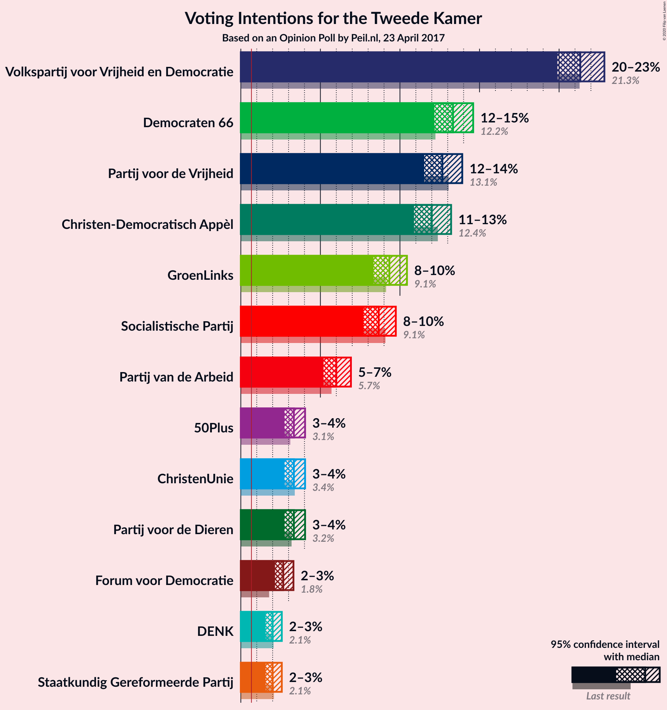
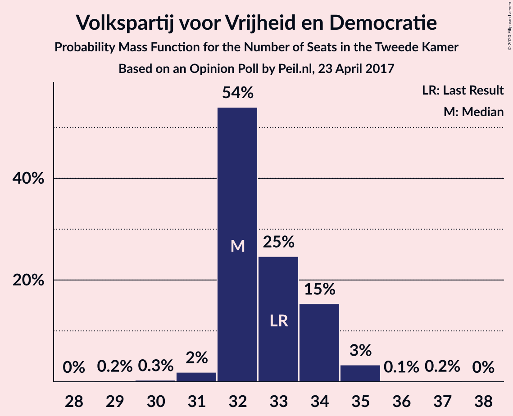
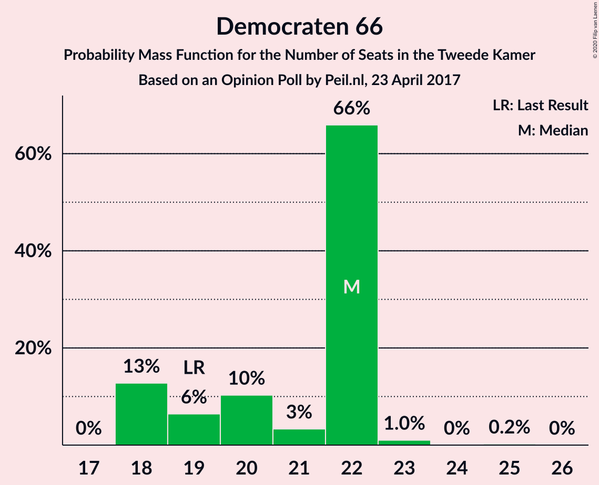
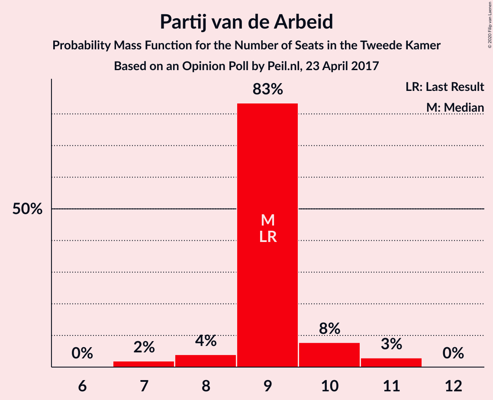
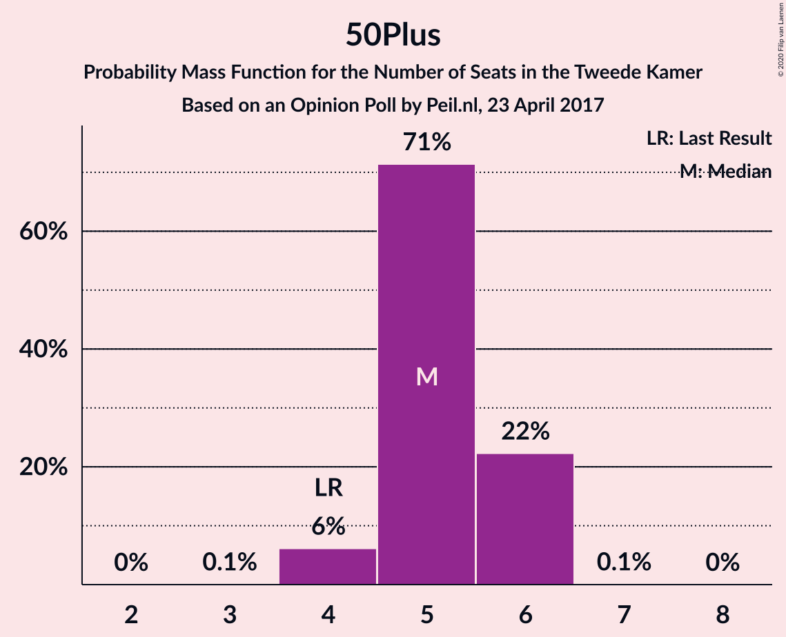
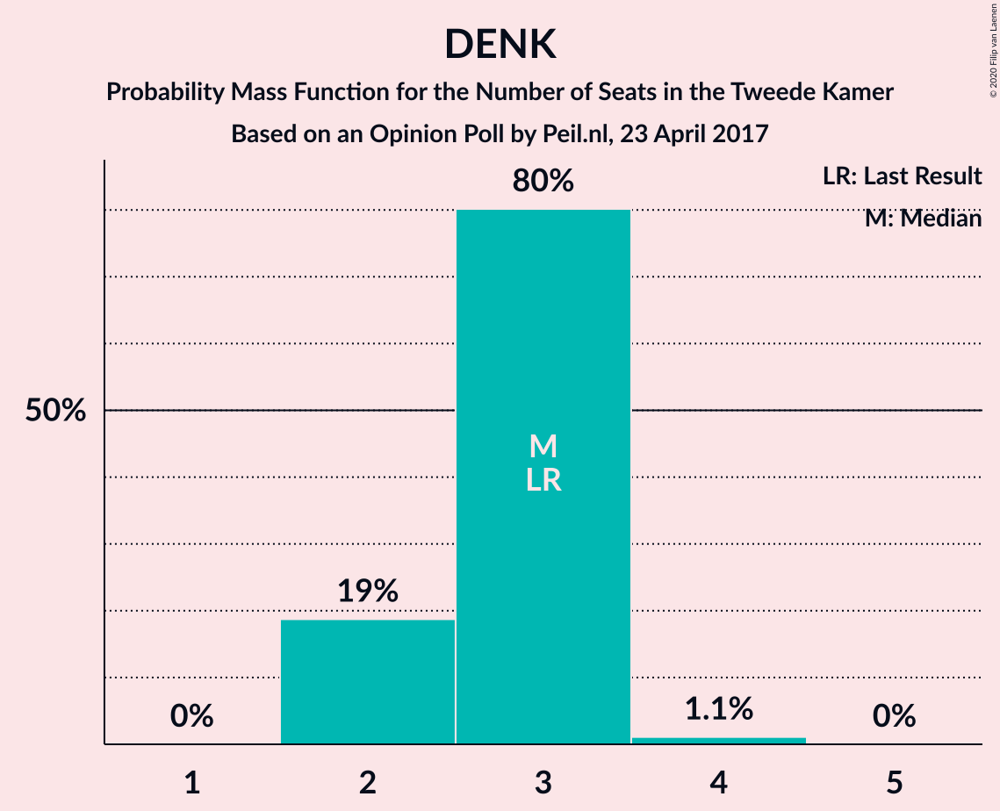
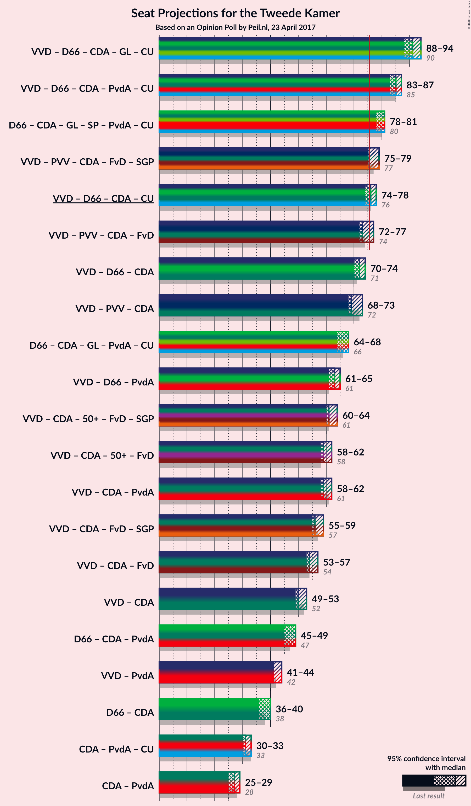
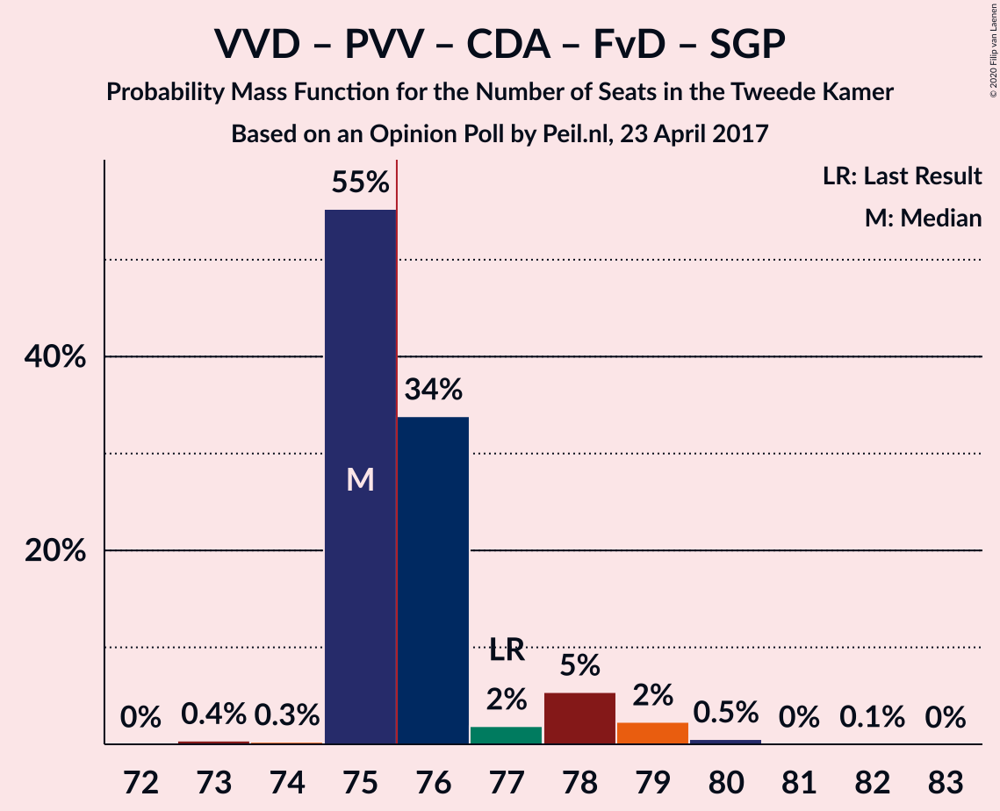
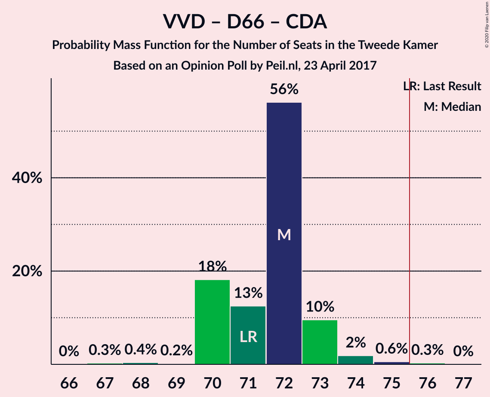
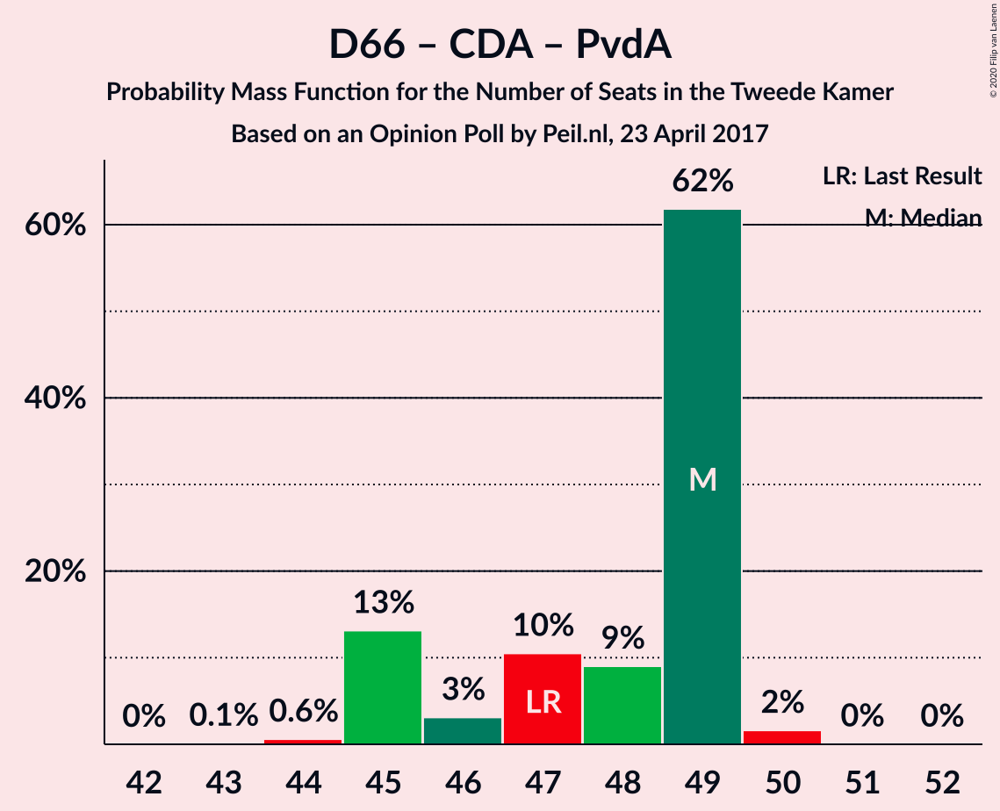

# Opinion Poll by Peil.nl, 23 April 2017

<a href="#voting-intentions">Voting Intentions</a> | <a href="#seats">Seats</a> | <a href="#coalitions">Coalitions</a> | <a href="#technical-information">Technical Information</a>

## Voting Intentions

### Confidence Intervals

| Party | Last Result | Poll Result | 80% Confidence Interval | 90% Confidence Interval | 95% Confidence Interval | 99% Confidence Interval |
|:-----:|:-----------:|:-----------:|:-----------------------:|:-----------------------:|:-----------------------:|:-----------------------:|
| Volkspartij voor Vrijheid en Democratie | 21.3% | 21.3% | 20.4–22.3% |20.1–22.6% |19.9–22.8% |19.4–23.3% |
| Democraten 66 | 12.2% | 13.3% | 12.6–14.2% |12.3–14.4% |12.2–14.6% |11.8–15.0% |
| Partij voor de Vrijheid | 13.1% | 12.7% | 11.9–13.5% |11.7–13.7% |11.5–13.9% |11.2–14.3% |
| Christen-Democratisch Appèl | 12.4% | 12.0% | 11.3–12.8% |11.1–13.0% |10.9–13.2% |10.5–13.6% |
| GroenLinks | 9.1% | 9.3% | 8.7–10.1% |8.5–10.3% |8.3–10.4% |8.0–10.8% |
| Socialistische Partij | 9.1% | 8.7% | 8.0–9.4% |7.8–9.6% |7.7–9.7% |7.4–10.1% |
| Partij van de Arbeid | 5.7% | 6.0% | 5.5–6.6% |5.3–6.8% |5.2–6.9% |5.0–7.2% |
| ChristenUnie | 3.4% | 3.3% | 2.9–3.8% |2.8–3.9% |2.7–4.0% |2.6–4.3% |
| Partij voor de Dieren | 3.2% | 3.3% | 2.9–3.8% |2.8–3.9% |2.7–4.0% |2.6–4.3% |
| 50Plus | 3.1% | 3.3% | 2.9–3.8% |2.8–3.9% |2.7–4.0% |2.6–4.3% |
| Forum voor Democratie | 1.8% | 2.7% | 2.3–3.1% |2.2–3.2% |2.1–3.3% |2.0–3.5% |
| Staatkundig Gereformeerde Partij | 2.1% | 2.0% | 1.7–2.4% |1.6–2.5% |1.6–2.6% |1.4–2.8% |
| DENK | 2.1% | 2.0% | 1.7–2.4% |1.6–2.5% |1.6–2.6% |1.4–2.8% |

*Note:* The poll result column reflects the actual value used in the calculations. Published results may vary slightly, and in addition be rounded to fewer digits.

## Seats

### Confidence Intervals

| Party | Last Result | Median | 80% Confidence Interval | 90% Confidence Interval | 95% Confidence Interval | 99% Confidence Interval |
|:-----:|:-----------:|:------:|:-----------------------:|:-----------------------:|:-----------------------:|:-----------------------:|
| <a href="#volkspartij-voor-vrijheid-en-democratie">Volkspartij voor Vrijheid en Democratie</a> | 33 | 34 | 32–34 |32–34 |31–34 |31–35 |
| <a href="#democraten-66">Democraten 66</a> | 19 | 23 | 18–23 |18–23 |18–23 |18–23 |
| <a href="#partij-voor-de-vrijheid">Partij voor de Vrijheid</a> | 20 | 17 | 17–22 |17–22 |17–23 |16–23 |
| <a href="#christen-democratisch-appèl">Christen-Democratisch Appèl</a> | 19 | 18 | 16–18 |16–19 |16–19 |16–19 |
| <a href="#groenlinks">GroenLinks</a> | 14 | 15 | 14–15 |13–15 |13–15 |12–17 |
| <a href="#socialistische-partij">Socialistische Partij</a> | 14 | 14 | 12–14 |12–14 |12–14 |12–14 |
| <a href="#partij-van-de-arbeid">Partij van de Arbeid</a> | 9 | 9 | 8–9 |8–10 |8–10 |7–10 |
| <a href="#christenunie">ChristenUnie</a> | 5 | 4 | 4–6 |4–6 |4–6 |4–6 |
| <a href="#partij-voor-de-dieren">Partij voor de Dieren</a> | 5 | 4 | 4–6 |4–6 |4–6 |3–7 |
| <a href="#50plus">50Plus</a> | 4 | 4 | 4–5 |4–5 |4–6 |4–6 |
| <a href="#forum-voor-democratie">Forum voor Democratie</a> | 2 | 4 | 3–4 |3–4 |2–5 |2–5 |
| <a href="#staatkundig-gereformeerde-partij">Staatkundig Gereformeerde Partij</a> | 3 | 2 | 2–3 |2–3 |2–3 |2–3 |
| <a href="#denk">DENK</a> | 3 | 2 | 2–3 |2–3 |2–3 |2–3 |

### Volkspartij voor Vrijheid en Democratie

*For a full overview of the results for this party, see the [Volkspartij voor Vrijheid en Democratie](party-volkspartijvoorvrijheidendemocratie.html) page.*

| Number of Seats | Probability | Accumulated | Special Marks |
|:---------------:|:-----------:|:-----------:|:-------------:|
| 29 | 0.1% | 100% |  |
| 30 | 0.2% | 99.9% |  |
| 31 | 4% | 99.7% |  |
| 32 | 13% | 96% |  |
| 33 | 0.3% | 83% | Last Result |
| 34 | 82% | 83% | Median |
| 35 | 1.0% | 1.2% |  |
| 36 | 0.2% | 0.2% |  |
| 37 | 0% | 0% |  |

### Democraten 66

*For a full overview of the results for this party, see the [Democraten 66](party-democraten66.html) page.*

| Number of Seats | Probability | Accumulated | Special Marks |
|:---------------:|:-----------:|:-----------:|:-------------:|
| 17 | 0.1% | 100% |  |
| 18 | 15% | 99.9% |  |
| 19 | 6% | 85% | Last Result |
| 20 | 17% | 79% |  |
| 21 | 4% | 61% |  |
| 22 | 2% | 57% |  |
| 23 | 56% | 56% | Median |
| 24 | 0% | 0.1% |  |
| 25 | 0.1% | 0.1% |  |
| 26 | 0% | 0% |  |

### Partij voor de Vrijheid

*For a full overview of the results for this party, see the [Partij voor de Vrijheid](party-partijvoordevrijheid.html) page.*

| Number of Seats | Probability | Accumulated | Special Marks |
|:---------------:|:-----------:|:-----------:|:-------------:|
| 16 | 1.5% | 100% |  |
| 17 | 56% | 98.5% | Median |
| 18 | 0.3% | 42% |  |
| 19 | 0.8% | 42% |  |
| 20 | 11% | 41% | Last Result |
| 21 | 11% | 30% |  |
| 22 | 15% | 19% |  |
| 23 | 4% | 4% |  |
| 24 | 0% | 0% |  |

### Christen-Democratisch Appèl

*For a full overview of the results for this party, see the [Christen-Democratisch Appèl](party-christen-democratischappèl.html) page.*

| Number of Seats | Probability | Accumulated | Special Marks |
|:---------------:|:-----------:|:-----------:|:-------------:|
| 16 | 14% | 100% |  |
| 17 | 3% | 86% |  |
| 18 | 75% | 83% | Median |
| 19 | 8% | 8% | Last Result |
| 20 | 0.3% | 0.5% |  |
| 21 | 0.1% | 0.1% |  |
| 22 | 0% | 0% |  |

### GroenLinks

*For a full overview of the results for this party, see the [GroenLinks](party-groenlinks.html) page.*

| Number of Seats | Probability | Accumulated | Special Marks |
|:---------------:|:-----------:|:-----------:|:-------------:|
| 11 | 0.1% | 100% |  |
| 12 | 0.5% | 99.9% |  |
| 13 | 6% | 99.4% |  |
| 14 | 10% | 94% | Last Result |
| 15 | 81% | 83% | Median |
| 16 | 0.1% | 2% |  |
| 17 | 2% | 2% |  |
| 18 | 0% | 0% |  |

### Socialistische Partij

*For a full overview of the results for this party, see the [Socialistische Partij](party-socialistischepartij.html) page.*

| Number of Seats | Probability | Accumulated | Special Marks |
|:---------------:|:-----------:|:-----------:|:-------------:|
| 11 | 0.3% | 100% |  |
| 12 | 22% | 99.7% |  |
| 13 | 16% | 78% |  |
| 14 | 62% | 62% | Last Result, Median |
| 15 | 0.2% | 0.2% |  |
| 16 | 0% | 0% |  |

### Partij van de Arbeid

*For a full overview of the results for this party, see the [Partij van de Arbeid](party-partijvandearbeid.html) page.*

| Number of Seats | Probability | Accumulated | Special Marks |
|:---------------:|:-----------:|:-----------:|:-------------:|
| 7 | 1.5% | 100% |  |
| 8 | 14% | 98% |  |
| 9 | 75% | 85% | Last Result, Median |
| 10 | 9% | 9% |  |
| 11 | 0.1% | 0.4% |  |
| 12 | 0.3% | 0.3% |  |
| 13 | 0% | 0% |  |

### ChristenUnie

*For a full overview of the results for this party, see the [ChristenUnie](party-christenunie.html) page.*

| Number of Seats | Probability | Accumulated | Special Marks |
|:---------------:|:-----------:|:-----------:|:-------------:|
| 3 | 0.2% | 100% |  |
| 4 | 57% | 99.8% | Median |
| 5 | 28% | 43% | Last Result |
| 6 | 15% | 15% |  |
| 7 | 0% | 0% |  |

### Partij voor de Dieren

*For a full overview of the results for this party, see the [Partij voor de Dieren](party-partijvoordedieren.html) page.*

| Number of Seats | Probability | Accumulated | Special Marks |
|:---------------:|:-----------:|:-----------:|:-------------:|
| 3 | 2% | 100% |  |
| 4 | 84% | 98% | Median |
| 5 | 3% | 13% | Last Result |
| 6 | 10% | 10% |  |
| 7 | 0.9% | 0.9% |  |
| 8 | 0% | 0% |  |

### 50Plus

*For a full overview of the results for this party, see the [50Plus](party-50plus.html) page.*

| Number of Seats | Probability | Accumulated | Special Marks |
|:---------------:|:-----------:|:-----------:|:-------------:|
| 4 | 83% | 100% | Last Result, Median |
| 5 | 13% | 17% |  |
| 6 | 3% | 3% |  |
| 7 | 0.1% | 0.1% |  |
| 8 | 0% | 0% |  |

### Forum voor Democratie

*For a full overview of the results for this party, see the [Forum voor Democratie](party-forumvoordemocratie.html) page.*

| Number of Seats | Probability | Accumulated | Special Marks |
|:---------------:|:-----------:|:-----------:|:-------------:|
| 2 | 4% | 100% | Last Result |
| 3 | 8% | 96% |  |
| 4 | 84% | 88% | Median |
| 5 | 4% | 4% |  |
| 6 | 0% | 0% |  |

### Staatkundig Gereformeerde Partij

*For a full overview of the results for this party, see the [Staatkundig Gereformeerde Partij](party-staatkundiggereformeerdepartij.html) page.*

| Number of Seats | Probability | Accumulated | Special Marks |
|:---------------:|:-----------:|:-----------:|:-------------:|
| 2 | 83% | 100% | Median |
| 3 | 17% | 17% | Last Result |
| 4 | 0.2% | 0.3% |  |
| 5 | 0.1% | 0.1% |  |
| 6 | 0% | 0% |  |

### DENK

*For a full overview of the results for this party, see the [DENK](party-denk.html) page.*

| Number of Seats | Probability | Accumulated | Special Marks |
|:---------------:|:-----------:|:-----------:|:-------------:|
| 2 | 76% | 100% | Median |
| 3 | 23% | 24% | Last Result |
| 4 | 0.2% | 0.2% |  |
| 5 | 0% | 0% |  |

## Coalitions

### Confidence Intervals

| Coalition | Last Result | Median | Majority? | 80% Confidence Interval | 90% Confidence Interval | 95% Confidence Interval | 99% Confidence Interval |
|:---------:|:-----------:|:------:|:---------:|:-----------------------:|:-----------------------:|:-----------------------:|:-----------------------:|
| Volkspartij voor Vrijheid en Democratie – Democraten 66 – Christen-Democratisch Appèl – GroenLinks – ChristenUnie | 90 | 94 | 100% | 88–94 | 87–94 | 87–94 | 86–94 |
| Volkspartij voor Vrijheid en Democratie – Democraten 66 – Christen-Democratisch Appèl – Partij van de Arbeid – ChristenUnie | 85 | 88 | 100% | 83–88 | 83–88 | 83–88 | 81–88 |
| Democraten 66 – Christen-Democratisch Appèl – GroenLinks – Socialistische Partij – Partij van de Arbeid – ChristenUnie | 80 | 83 | 98% | 77–83 | 77–83 | 77–83 | 75–83 |
| Volkspartij voor Vrijheid en Democratie – Partij voor de Vrijheid – Christen-Democratisch Appèl – Forum voor Democratie – Staatkundig Gereformeerde Partij | 77 | 75 | 39% | 75–80 | 75–80 | 75–80 | 72–80 |
| Volkspartij voor Vrijheid en Democratie – Democraten 66 – Christen-Democratisch Appèl – ChristenUnie | 76 | 79 | 79% | 74–79 | 74–79 | 73–79 | 73–79 |
| Volkspartij voor Vrijheid en Democratie – Partij voor de Vrijheid – Christen-Democratisch Appèl – Forum voor Democratie | 74 | 73 | 17% | 73–78 | 72–78 | 72–78 | 70–78 |
| Volkspartij voor Vrijheid en Democratie – Democraten 66 – Christen-Democratisch Appèl | 71 | 75 | 0.1% | 69–75 | 69–75 | 68–75 | 68–75 |
| Volkspartij voor Vrijheid en Democratie – Partij voor de Vrijheid – Christen-Democratisch Appèl | 72 | 69 | 0% | 69–74 | 69–74 | 69–74 | 67–74 |
| Democraten 66 – Christen-Democratisch Appèl – GroenLinks – Partij van de Arbeid – ChristenUnie | 66 | 69 | 0% | 64–69 | 64–69 | 64–69 | 62–69 |
| Volkspartij voor Vrijheid en Democratie – Democraten 66 – Partij van de Arbeid | 61 | 66 | 0% | 61–66 | 60–66 | 60–66 | 59–66 |
| Volkspartij voor Vrijheid en Democratie – Christen-Democratisch Appèl – 50Plus – Forum voor Democratie – Staatkundig Gereformeerde Partij | 61 | 62 | 0% | 61–62 | 60–62 | 58–62 | 58–65 |
| Volkspartij voor Vrijheid en Democratie – Christen-Democratisch Appèl – Partij van de Arbeid | 61 | 61 | 0% | 58–61 | 58–61 | 58–62 | 56–62 |
| Volkspartij voor Vrijheid en Democratie – Christen-Democratisch Appèl – 50Plus – Forum voor Democratie | 58 | 60 | 0% | 58–60 | 57–60 | 56–60 | 56–62 |
| Volkspartij voor Vrijheid en Democratie – Christen-Democratisch Appèl – Forum voor Democratie – Staatkundig Gereformeerde Partij | 57 | 58 | 0% | 56–58 | 55–58 | 53–58 | 53–59 |
| Volkspartij voor Vrijheid en Democratie – Christen-Democratisch Appèl – Forum voor Democratie | 54 | 56 | 0% | 53–56 | 52–56 | 51–56 | 51–57 |
| Volkspartij voor Vrijheid en Democratie – Christen-Democratisch Appèl | 52 | 52 | 0% | 50–52 | 49–52 | 48–53 | 48–53 |
| Democraten 66 – Christen-Democratisch Appèl – Partij van de Arbeid | 47 | 50 | 0% | 44–50 | 44–50 | 44–50 | 44–50 |
| Volkspartij voor Vrijheid en Democratie – Partij van de Arbeid | 42 | 43 | 0% | 41–43 | 40–43 | 40–43 | 39–44 |
| Democraten 66 – Christen-Democratisch Appèl | 38 | 41 | 0% | 36–41 | 36–41 | 36–41 | 36–41 |
| Christen-Democratisch Appèl – Partij van de Arbeid – ChristenUnie | 33 | 31 | 0% | 29–33 | 29–33 | 29–34 | 29–35 |
| Christen-Democratisch Appèl – Partij van de Arbeid | 28 | 27 | 0% | 24–27 | 24–28 | 24–29 | 24–30 |

### Volkspartij voor Vrijheid en Democratie – Democraten 66 – Christen-Democratisch Appèl – GroenLinks – ChristenUnie

| Number of Seats | Probability | Accumulated | Special Marks |
|:---------------:|:-----------:|:-----------:|:-------------:|
| 85 | 0.1% | 100% |  |
| 86 | 0.4% | 99.9% |  |
| 87 | 6% | 99.4% |  |
| 88 | 4% | 94% |  |
| 89 | 5% | 90% |  |
| 90 | 10% | 85% | Last Result |
| 91 | 16% | 75% |  |
| 92 | 1.5% | 59% |  |
| 93 | 0.1% | 58% |  |
| 94 | 58% | 58% | Median |
| 95 | 0% | 0.1% |  |
| 96 | 0% | 0.1% |  |
| 97 | 0.1% | 0.1% |  |
| 98 | 0% | 0% |  |

### Volkspartij voor Vrijheid en Democratie – Democraten 66 – Christen-Democratisch Appèl – Partij van de Arbeid – ChristenUnie

| Number of Seats | Probability | Accumulated | Special Marks |
|:---------------:|:-----------:|:-----------:|:-------------:|
| 80 | 0.1% | 100% |  |
| 81 | 2% | 99.9% |  |
| 82 | 0.1% | 98% |  |
| 83 | 14% | 98% |  |
| 84 | 9% | 84% |  |
| 85 | 15% | 76% | Last Result |
| 86 | 3% | 61% |  |
| 87 | 2% | 57% |  |
| 88 | 55% | 56% | Median |
| 89 | 0.3% | 0.3% |  |
| 90 | 0% | 0.1% |  |
| 91 | 0% | 0.1% |  |
| 92 | 0.1% | 0.1% |  |
| 93 | 0% | 0% |  |

### Democraten 66 – Christen-Democratisch Appèl – GroenLinks – Socialistische Partij – Partij van de Arbeid – ChristenUnie

| Number of Seats | Probability | Accumulated | Special Marks |
|:---------------:|:-----------:|:-----------:|:-------------:|
| 75 | 2% | 100% |  |
| 76 | 0% | 98% | Majority |
| 77 | 14% | 98% |  |
| 78 | 19% | 85% |  |
| 79 | 3% | 66% |  |
| 80 | 0.1% | 63% | Last Result |
| 81 | 6% | 63% |  |
| 82 | 0.1% | 57% |  |
| 83 | 57% | 57% | Median |
| 84 | 0.2% | 0.2% |  |
| 85 | 0% | 0% |  |

### Volkspartij voor Vrijheid en Democratie – Partij voor de Vrijheid – Christen-Democratisch Appèl – Forum voor Democratie – Staatkundig Gereformeerde Partij

| Number of Seats | Probability | Accumulated | Special Marks |
|:---------------:|:-----------:|:-----------:|:-------------:|
| 72 | 1.4% | 100% |  |
| 73 | 0.1% | 98.6% |  |
| 74 | 0.1% | 98.5% |  |
| 75 | 59% | 98% | Median |
| 76 | 7% | 39% | Majority |
| 77 | 6% | 33% | Last Result |
| 78 | 12% | 27% |  |
| 79 | 0.1% | 15% |  |
| 80 | 15% | 15% |  |
| 81 | 0.1% | 0.1% |  |
| 82 | 0% | 0% |  |

### Volkspartij voor Vrijheid en Democratie – Democraten 66 – Christen-Democratisch Appèl – ChristenUnie

| Number of Seats | Probability | Accumulated | Special Marks |
|:---------------:|:-----------:|:-----------:|:-------------:|
| 71 | 0.1% | 100% |  |
| 72 | 0.1% | 99.9% |  |
| 73 | 4% | 99.7% |  |
| 74 | 7% | 95% |  |
| 75 | 10% | 89% |  |
| 76 | 19% | 79% | Last Result, Majority |
| 77 | 3% | 60% |  |
| 78 | 1.4% | 57% |  |
| 79 | 56% | 56% | Median |
| 80 | 0.1% | 0.2% |  |
| 81 | 0% | 0.1% |  |
| 82 | 0% | 0.1% |  |
| 83 | 0% | 0.1% |  |
| 84 | 0.1% | 0.1% |  |
| 85 | 0% | 0% |  |

### Volkspartij voor Vrijheid en Democratie – Partij voor de Vrijheid – Christen-Democratisch Appèl – Forum voor Democratie

| Number of Seats | Probability | Accumulated | Special Marks |
|:---------------:|:-----------:|:-----------:|:-------------:|
| 70 | 1.4% | 100% |  |
| 71 | 0.3% | 98.6% |  |
| 72 | 4% | 98% |  |
| 73 | 57% | 94% | Median |
| 74 | 7% | 38% | Last Result |
| 75 | 14% | 31% |  |
| 76 | 2% | 17% | Majority |
| 77 | 0% | 15% |  |
| 78 | 15% | 15% |  |
| 79 | 0% | 0% |  |

### Volkspartij voor Vrijheid en Democratie – Democraten 66 – Christen-Democratisch Appèl

| Number of Seats | Probability | Accumulated | Special Marks |
|:---------------:|:-----------:|:-----------:|:-------------:|
| 67 | 0.1% | 100% |  |
| 68 | 4% | 99.9% |  |
| 69 | 6% | 95% |  |
| 70 | 24% | 89% |  |
| 71 | 4% | 65% | Last Result |
| 72 | 2% | 61% |  |
| 73 | 2% | 58% |  |
| 74 | 0.3% | 56% |  |
| 75 | 55% | 56% | Median |
| 76 | 0% | 0.1% | Majority |
| 77 | 0% | 0.1% |  |
| 78 | 0% | 0.1% |  |
| 79 | 0.1% | 0.1% |  |
| 80 | 0% | 0% |  |

### Volkspartij voor Vrijheid en Democratie – Partij voor de Vrijheid – Christen-Democratisch Appèl

| Number of Seats | Probability | Accumulated | Special Marks |
|:---------------:|:-----------:|:-----------:|:-------------:|
| 66 | 0% | 100% |  |
| 67 | 2% | 99.9% |  |
| 68 | 0.3% | 98% |  |
| 69 | 57% | 98% | Median |
| 70 | 10% | 41% |  |
| 71 | 14% | 31% |  |
| 72 | 0.3% | 17% | Last Result |
| 73 | 2% | 17% |  |
| 74 | 15% | 15% |  |
| 75 | 0.1% | 0.1% |  |
| 76 | 0% | 0% | Majority |

### Democraten 66 – Christen-Democratisch Appèl – GroenLinks – Partij van de Arbeid – ChristenUnie

| Number of Seats | Probability | Accumulated | Special Marks |
|:---------------:|:-----------:|:-----------:|:-------------:|
| 62 | 2% | 100% |  |
| 63 | 0.1% | 98% |  |
| 64 | 10% | 98% |  |
| 65 | 9% | 89% |  |
| 66 | 15% | 79% | Last Result |
| 67 | 5% | 64% |  |
| 68 | 0.4% | 60% |  |
| 69 | 59% | 59% | Median |
| 70 | 0.2% | 0.2% |  |
| 71 | 0% | 0% |  |

### Volkspartij voor Vrijheid en Democratie – Democraten 66 – Partij van de Arbeid

| Number of Seats | Probability | Accumulated | Special Marks |
|:---------------:|:-----------:|:-----------:|:-------------:|
| 57 | 0.1% | 100% |  |
| 58 | 0% | 99.9% |  |
| 59 | 2% | 99.9% |  |
| 60 | 4% | 98% |  |
| 61 | 19% | 94% | Last Result |
| 62 | 17% | 76% |  |
| 63 | 2% | 59% |  |
| 64 | 1.0% | 57% |  |
| 65 | 0.1% | 56% |  |
| 66 | 55% | 55% | Median |
| 67 | 0% | 0.1% |  |
| 68 | 0% | 0.1% |  |
| 69 | 0.1% | 0.1% |  |
| 70 | 0% | 0% |  |

### Volkspartij voor Vrijheid en Democratie – Christen-Democratisch Appèl – 50Plus – Forum voor Democratie – Staatkundig Gereformeerde Partij

| Number of Seats | Probability | Accumulated | Special Marks |
|:---------------:|:-----------:|:-----------:|:-------------:|
| 58 | 4% | 100% |  |
| 59 | 0.1% | 96% |  |
| 60 | 4% | 96% |  |
| 61 | 11% | 92% | Last Result |
| 62 | 79% | 81% | Median |
| 63 | 1.0% | 2% |  |
| 64 | 0.2% | 0.7% |  |
| 65 | 0.5% | 0.5% |  |
| 66 | 0% | 0.1% |  |
| 67 | 0% | 0% |  |

### Volkspartij voor Vrijheid en Democratie – Christen-Democratisch Appèl – Partij van de Arbeid

| Number of Seats | Probability | Accumulated | Special Marks |
|:---------------:|:-----------:|:-----------:|:-------------:|
| 55 | 0% | 100% |  |
| 56 | 1.4% | 99.9% |  |
| 57 | 0.1% | 98.5% |  |
| 58 | 18% | 98% |  |
| 59 | 2% | 80% |  |
| 60 | 5% | 79% |  |
| 61 | 70% | 74% | Last Result, Median |
| 62 | 4% | 4% |  |
| 63 | 0.1% | 0.2% |  |
| 64 | 0% | 0.1% |  |
| 65 | 0% | 0.1% |  |
| 66 | 0.1% | 0.1% |  |
| 67 | 0% | 0% |  |

### Volkspartij voor Vrijheid en Democratie – Christen-Democratisch Appèl – 50Plus – Forum voor Democratie

| Number of Seats | Probability | Accumulated | Special Marks |
|:---------------:|:-----------:|:-----------:|:-------------:|
| 56 | 4% | 100% |  |
| 57 | 4% | 96% |  |
| 58 | 11% | 92% | Last Result |
| 59 | 2% | 81% |  |
| 60 | 77% | 79% | Median |
| 61 | 1.0% | 2% |  |
| 62 | 0.3% | 0.6% |  |
| 63 | 0.2% | 0.2% |  |
| 64 | 0% | 0% |  |

### Volkspartij voor Vrijheid en Democratie – Christen-Democratisch Appèl – Forum voor Democratie – Staatkundig Gereformeerde Partij

| Number of Seats | Probability | Accumulated | Special Marks |
|:---------------:|:-----------:|:-----------:|:-------------:|
| 53 | 4% | 100% |  |
| 54 | 0.1% | 96% |  |
| 55 | 4% | 96% |  |
| 56 | 4% | 92% |  |
| 57 | 14% | 88% | Last Result |
| 58 | 72% | 74% | Median |
| 59 | 1.1% | 2% |  |
| 60 | 0.2% | 0.4% |  |
| 61 | 0.1% | 0.2% |  |
| 62 | 0% | 0% |  |

### Volkspartij voor Vrijheid en Democratie – Christen-Democratisch Appèl – Forum voor Democratie

| Number of Seats | Probability | Accumulated | Special Marks |
|:---------------:|:-----------:|:-----------:|:-------------:|
| 51 | 4% | 100% |  |
| 52 | 4% | 96% |  |
| 53 | 3% | 92% |  |
| 54 | 12% | 89% | Last Result |
| 55 | 4% | 78% |  |
| 56 | 72% | 73% | Median |
| 57 | 1.0% | 1.2% |  |
| 58 | 0.1% | 0.2% |  |
| 59 | 0.1% | 0.1% |  |
| 60 | 0% | 0% |  |

### Volkspartij voor Vrijheid en Democratie – Christen-Democratisch Appèl

| Number of Seats | Probability | Accumulated | Special Marks |
|:---------------:|:-----------:|:-----------:|:-------------:|
| 47 | 0% | 100% |  |
| 48 | 4% | 99.9% |  |
| 49 | 3% | 96% |  |
| 50 | 18% | 93% |  |
| 51 | 2% | 75% |  |
| 52 | 70% | 73% | Last Result, Median |
| 53 | 3% | 3% |  |
| 54 | 0.1% | 0.2% |  |
| 55 | 0% | 0.1% |  |
| 56 | 0.1% | 0.1% |  |
| 57 | 0% | 0% |  |

### Democraten 66 – Christen-Democratisch Appèl – Partij van de Arbeid

| Number of Seats | Probability | Accumulated | Special Marks |
|:---------------:|:-----------:|:-----------:|:-------------:|
| 44 | 11% | 100% |  |
| 45 | 15% | 89% |  |
| 46 | 4% | 74% |  |
| 47 | 8% | 70% | Last Result |
| 48 | 4% | 62% |  |
| 49 | 0.4% | 58% |  |
| 50 | 57% | 57% | Median |
| 51 | 0.2% | 0.3% |  |
| 52 | 0.1% | 0.1% |  |
| 53 | 0% | 0% |  |

### Volkspartij voor Vrijheid en Democratie – Partij van de Arbeid

| Number of Seats | Probability | Accumulated | Special Marks |
|:---------------:|:-----------:|:-----------:|:-------------:|
| 38 | 0% | 100% |  |
| 39 | 2% | 99.9% |  |
| 40 | 4% | 98% |  |
| 41 | 5% | 94% |  |
| 42 | 15% | 89% | Last Result |
| 43 | 72% | 74% | Median |
| 44 | 1.3% | 1.5% |  |
| 45 | 0% | 0.2% |  |
| 46 | 0.1% | 0.1% |  |
| 47 | 0% | 0% |  |

### Democraten 66 – Christen-Democratisch Appèl

| Number of Seats | Probability | Accumulated | Special Marks |
|:---------------:|:-----------:|:-----------:|:-------------:|
| 35 | 0.1% | 100% |  |
| 36 | 29% | 99.9% |  |
| 37 | 3% | 71% |  |
| 38 | 7% | 68% | Last Result |
| 39 | 4% | 62% |  |
| 40 | 0.1% | 57% |  |
| 41 | 57% | 57% | Median |
| 42 | 0.2% | 0.4% |  |
| 43 | 0.2% | 0.2% |  |
| 44 | 0% | 0% |  |

### Christen-Democratisch Appèl – Partij van de Arbeid – ChristenUnie

| Number of Seats | Probability | Accumulated | Special Marks |
|:---------------:|:-----------:|:-----------:|:-------------:|
| 29 | 11% | 100% |  |
| 30 | 0.3% | 89% |  |
| 31 | 65% | 89% | Median |
| 32 | 1.4% | 24% |  |
| 33 | 18% | 23% | Last Result |
| 34 | 4% | 4% |  |
| 35 | 0.6% | 0.6% |  |
| 36 | 0% | 0% |  |

### Christen-Democratisch Appèl – Partij van de Arbeid

| Number of Seats | Probability | Accumulated | Special Marks |
|:---------------:|:-----------:|:-----------:|:-------------:|
| 24 | 11% | 100% |  |
| 25 | 0.1% | 89% |  |
| 26 | 8% | 89% |  |
| 27 | 72% | 80% | Median |
| 28 | 4% | 8% | Last Result |
| 29 | 4% | 4% |  |
| 30 | 0.6% | 0.6% |  |
| 31 | 0% | 0% |  |

## Technical Information

### Opinion Poll

+ **Polling firm:** Peil.nl
+ **Commissioner(s):** —
+ **Fieldwork period:** 23 April 2017

### Calculations

+ **Sample size:** 3000
+ **Simulations done:** 131,072
+ **Error estimate:** 3.26%

