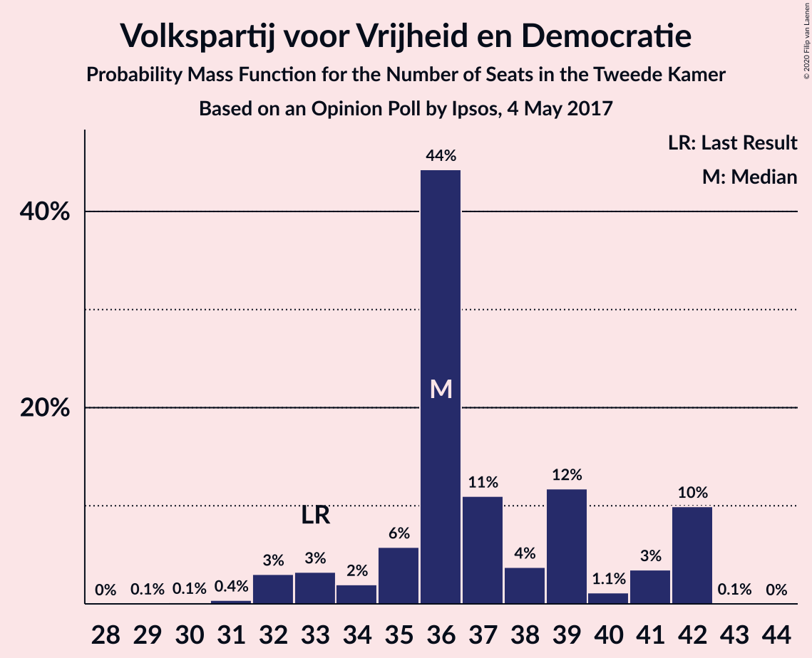
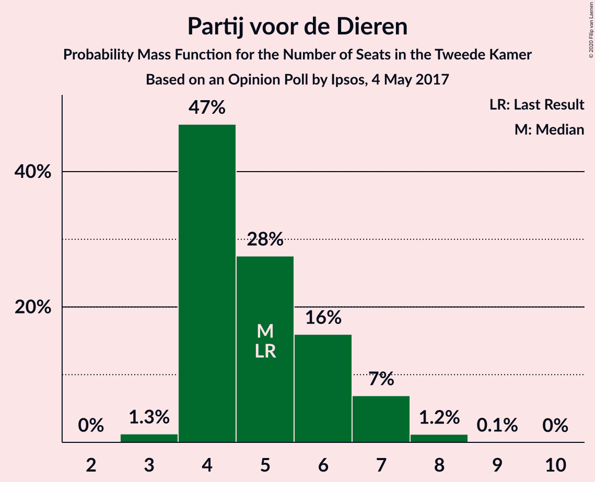
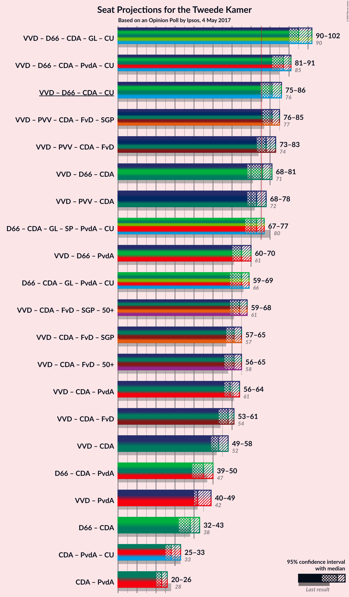
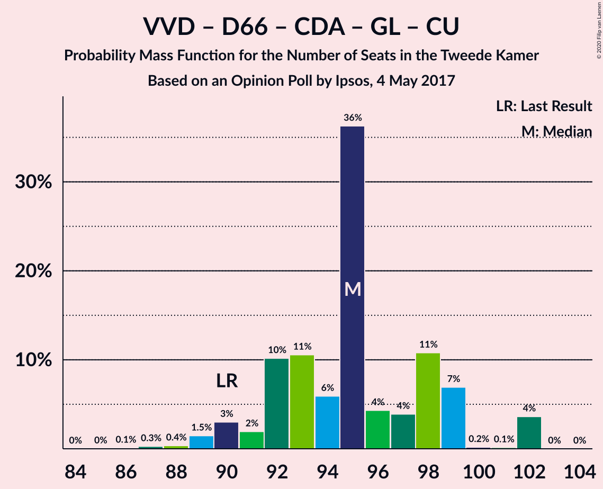
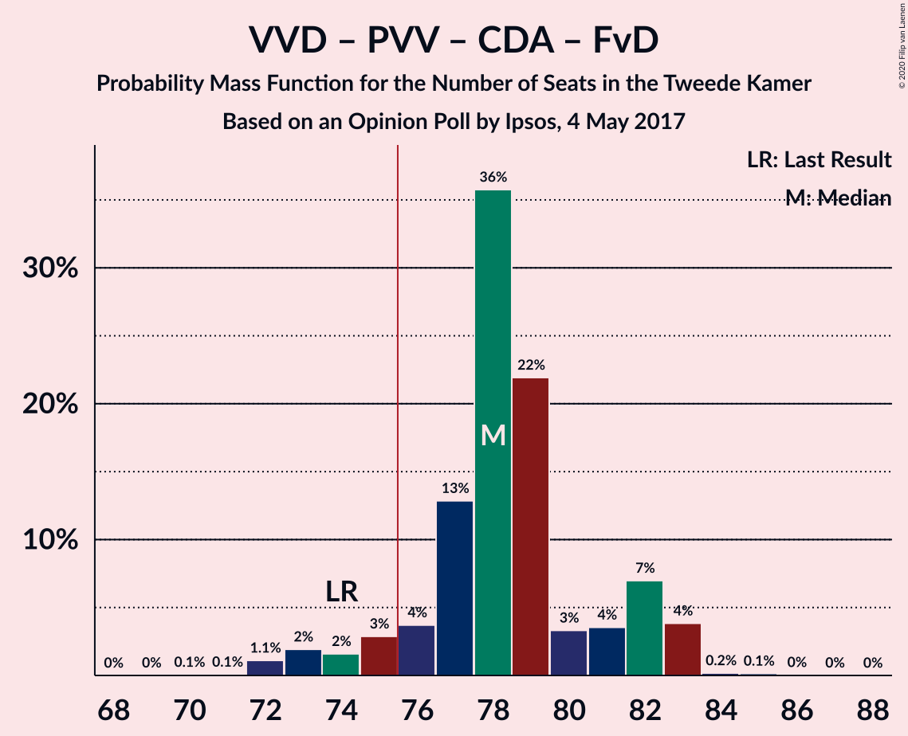
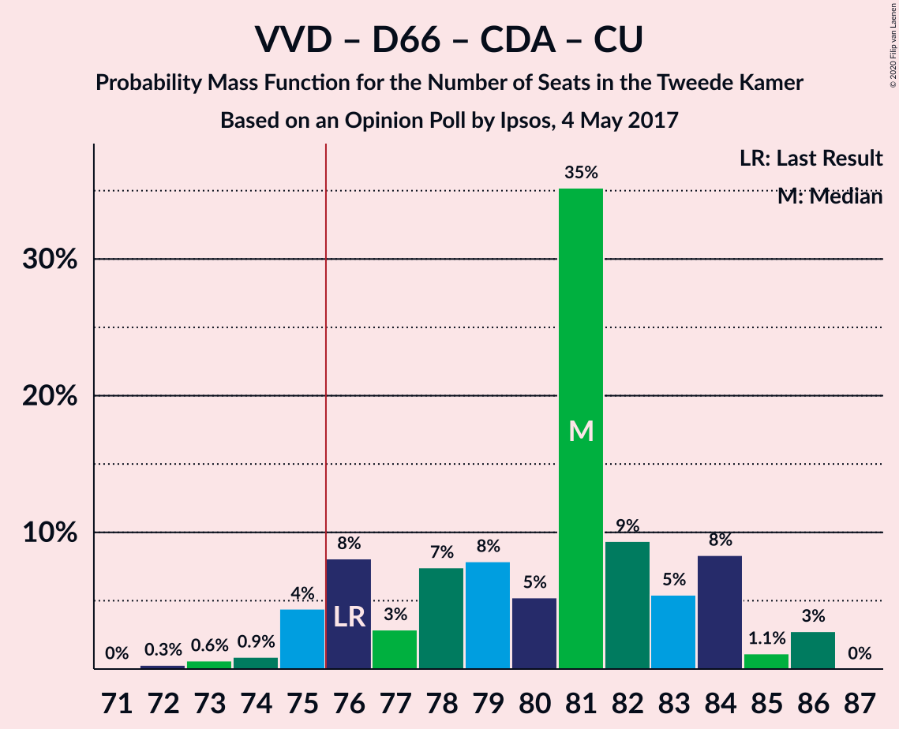
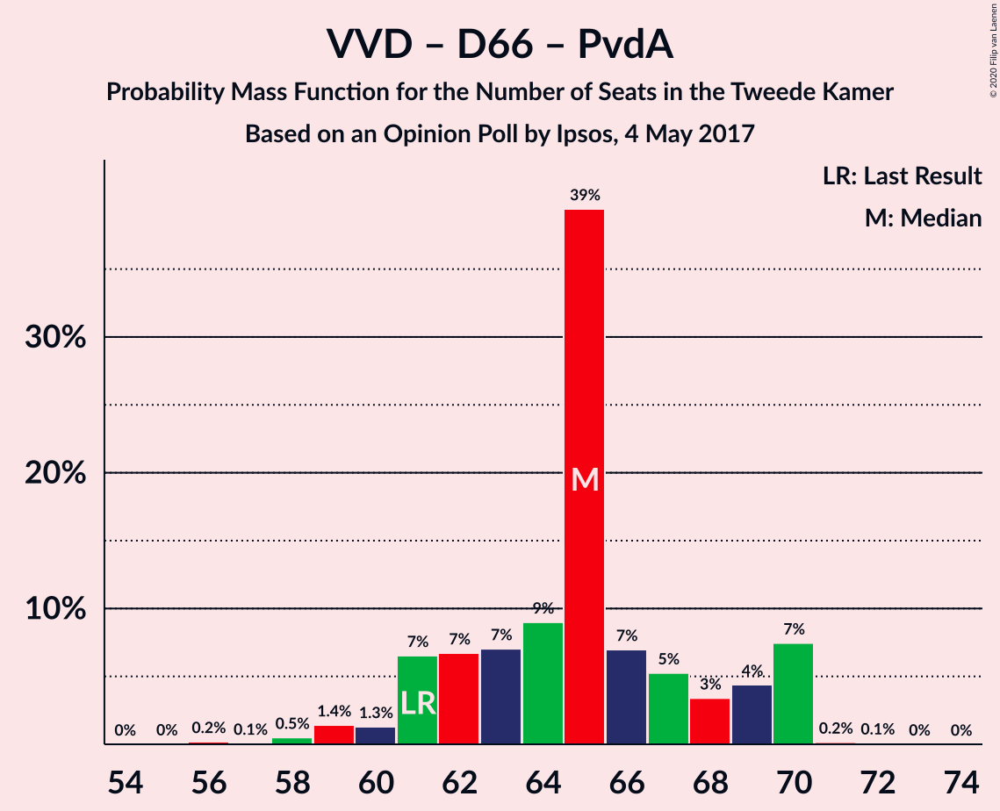
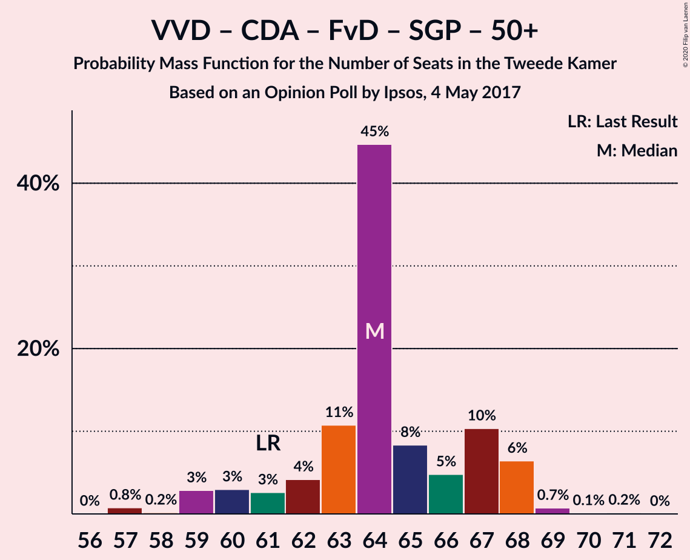
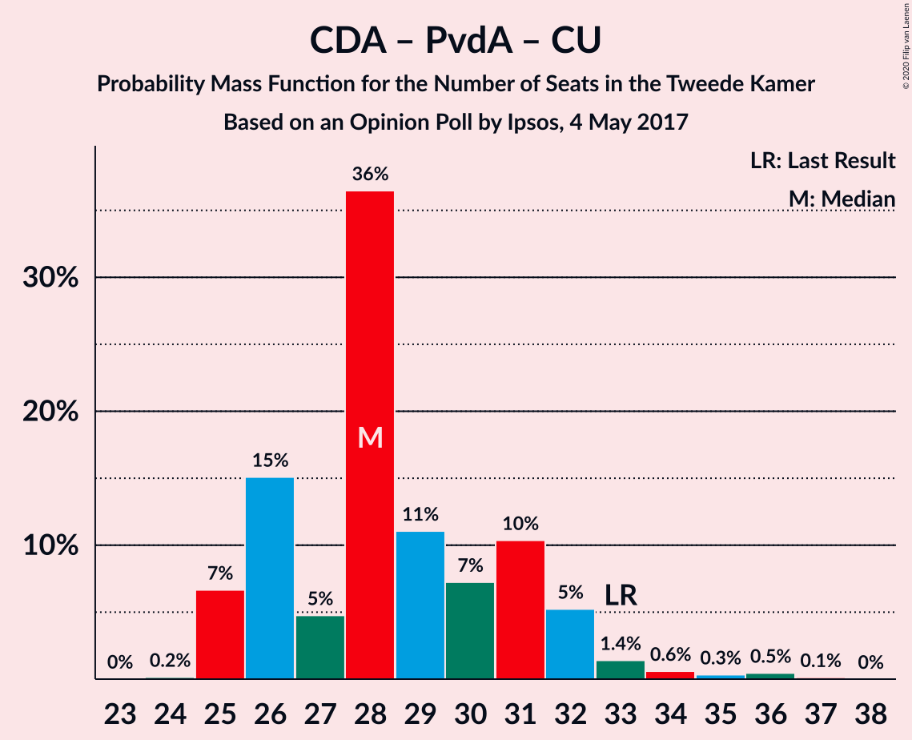

# Opinion Poll by Ipsos, 4 May 2017

<a href="#voting-intentions">Voting Intentions</a> | <a href="#seats">Seats</a> | <a href="#coalitions">Coalitions</a> | <a href="#technical-information">Technical Information</a>

## Voting Intentions

### Confidence Intervals

| Party | Last Result | Poll Result | 80% Confidence Interval | 90% Confidence Interval | 95% Confidence Interval | 99% Confidence Interval |
|:-----:|:-----------:|:-----------:|:-----------------------:|:-----------------------:|:-----------------------:|:-----------------------:|
| Volkspartij voor Vrijheid en Democratie | 21.3% | 23.9% | 22.2–25.7% |21.8–26.2% |21.4–26.6% |20.6–27.5% |
| Partij voor de Vrijheid | 13.1% | 13.5% | 12.2–15.0% |11.8–15.4% |11.5–15.8% |10.9–16.5% |
| Democraten 66 | 12.2% | 13.3% | 12.0–14.8% |11.6–15.2% |11.3–15.6% |10.7–16.3% |
| Christen-Democratisch Appèl | 12.4% | 10.9% | 9.7–12.3% |9.4–12.7% |9.1–13.0% |8.6–13.7% |
| GroenLinks | 9.1% | 9.8% | 8.7–11.1% |8.4–11.5% |8.1–11.8% |7.6–12.5% |
| Socialistische Partij | 9.1% | 5.5% | 4.7–6.5% |4.4–6.8% |4.3–7.1% |3.9–7.6% |
| Partij van de Arbeid | 5.7% | 4.7% | 3.9–5.7% |3.7–6.0% |3.6–6.2% |3.2–6.7% |
| ChristenUnie | 3.4% | 4.1% | 3.4–5.0% |3.2–5.3% |3.0–5.5% |2.7–6.0% |
| Partij voor de Dieren | 3.2% | 3.6% | 2.9–4.5% |2.8–4.7% |2.6–5.0% |2.3–5.4% |
| Forum voor Democratie | 1.8% | 3.1% | 2.5–3.9% |2.3–4.2% |2.2–4.4% |1.9–4.8% |
| Staatkundig Gereformeerde Partij | 2.1% | 2.3% | 1.8–3.0% |1.6–3.2% |1.5–3.4% |1.3–3.8% |
| 50Plus | 3.1% | 2.2% | 1.7–2.9% |1.6–3.1% |1.4–3.3% |1.2–3.7% |
| DENK | 2.1% | 1.9% | 1.4–2.6% |1.3–2.8% |1.2–3.0% |1.0–3.3% |

*Note:* The poll result column reflects the actual value used in the calculations. Published results may vary slightly, and in addition be rounded to fewer digits.

## Seats

### Confidence Intervals

| Party | Last Result | Median | 80% Confidence Interval | 90% Confidence Interval | 95% Confidence Interval | 99% Confidence Interval |
|:-----:|:-----------:|:------:|:-----------------------:|:-----------------------:|:-----------------------:|:-----------------------:|
| <a href="#volkspartij-voor-vrijheid-en-democratie">Volkspartij voor Vrijheid en Democratie</a> | 33 | 35 | 33–40 |33–41 |33–41 |29–41 |
| <a href="#partij-voor-de-vrijheid">Partij voor de Vrijheid</a> | 20 | 22 | 18–24 |18–26 |17–26 |16–26 |
| <a href="#democraten-66">Democraten 66</a> | 19 | 21 | 17–23 |17–24 |16–24 |16–25 |
| <a href="#christen-democratisch-appèl">Christen-Democratisch Appèl</a> | 19 | 15 | 13–18 |13–18 |13–19 |13–20 |
| <a href="#groenlinks">GroenLinks</a> | 14 | 15 | 11–16 |11–17 |11–18 |10–19 |
| <a href="#socialistische-partij">Socialistische Partij</a> | 14 | 9 | 6–10 |6–10 |6–10 |6–12 |
| <a href="#partij-van-de-arbeid">Partij van de Arbeid</a> | 9 | 8 | 6–9 |5–10 |5–10 |5–10 |
| <a href="#christenunie">ChristenUnie</a> | 5 | 6 | 4–7 |4–7 |4–7 |4–7 |
| <a href="#partij-voor-de-dieren">Partij voor de Dieren</a> | 5 | 6 | 4–7 |3–7 |3–7 |3–8 |
| <a href="#forum-voor-democratie">Forum voor Democratie</a> | 2 | 5 | 2–6 |2–6 |2–6 |2–6 |
| <a href="#staatkundig-gereformeerde-partij">Staatkundig Gereformeerde Partij</a> | 3 | 3 | 2–4 |2–5 |2–5 |2–5 |
| <a href="#50plus">50Plus</a> | 4 | 3 | 2–4 |2–4 |2–4 |2–6 |
| <a href="#denk">DENK</a> | 3 | 3 | 1–3 |0–4 |0–4 |0–5 |

### Volkspartij voor Vrijheid en Democratie

*For a full overview of the results for this party, see the [Volkspartij voor Vrijheid en Democratie](party-volkspartijvoorvrijheidendemocratie.html) page.*

| Number of Seats | Probability | Accumulated | Special Marks |
|:---------------:|:-----------:|:-----------:|:-------------:|
| 29 | 1.2% | 100% |  |
| 30 | 0% | 98.8% |  |
| 31 | 0.6% | 98.7% |  |
| 32 | 0.2% | 98% |  |
| 33 | 39% | 98% | Last Result |
| 34 | 6% | 59% |  |
| 35 | 10% | 53% | Median |
| 36 | 18% | 43% |  |
| 37 | 13% | 25% |  |
| 38 | 1.0% | 12% |  |
| 39 | 0.2% | 11% |  |
| 40 | 6% | 11% |  |
| 41 | 5% | 5% |  |
| 42 | 0.1% | 0.3% |  |
| 43 | 0% | 0.3% |  |
| 44 | 0.3% | 0.3% |  |
| 45 | 0% | 0% |  |

### Partij voor de Vrijheid

*For a full overview of the results for this party, see the [Partij voor de Vrijheid](party-partijvoordevrijheid.html) page.*

| Number of Seats | Probability | Accumulated | Special Marks |
|:---------------:|:-----------:|:-----------:|:-------------:|
| 16 | 0.7% | 100% |  |
| 17 | 3% | 99.3% |  |
| 18 | 8% | 97% |  |
| 19 | 6% | 89% |  |
| 20 | 3% | 83% | Last Result |
| 21 | 11% | 80% |  |
| 22 | 30% | 69% | Median |
| 23 | 16% | 39% |  |
| 24 | 16% | 23% |  |
| 25 | 0% | 7% |  |
| 26 | 7% | 7% |  |
| 27 | 0.1% | 0.1% |  |
| 28 | 0% | 0% |  |

### Democraten 66

*For a full overview of the results for this party, see the [Democraten 66](party-democraten66.html) page.*

| Number of Seats | Probability | Accumulated | Special Marks |
|:---------------:|:-----------:|:-----------:|:-------------:|
| 15 | 0% | 100% |  |
| 16 | 5% | 99.9% |  |
| 17 | 5% | 95% |  |
| 18 | 0.4% | 90% |  |
| 19 | 2% | 89% | Last Result |
| 20 | 18% | 88% |  |
| 21 | 29% | 70% | Median |
| 22 | 30% | 41% |  |
| 23 | 1.0% | 11% |  |
| 24 | 9% | 10% |  |
| 25 | 0.6% | 0.6% |  |
| 26 | 0% | 0% |  |

### Christen-Democratisch Appèl

*For a full overview of the results for this party, see the [Christen-Democratisch Appèl](party-christen-democratischappèl.html) page.*

| Number of Seats | Probability | Accumulated | Special Marks |
|:---------------:|:-----------:|:-----------:|:-------------:|
| 12 | 0.5% | 100% |  |
| 13 | 13% | 99.5% |  |
| 14 | 34% | 86% |  |
| 15 | 2% | 52% | Median |
| 16 | 15% | 50% |  |
| 17 | 16% | 35% |  |
| 18 | 14% | 19% |  |
| 19 | 4% | 5% | Last Result |
| 20 | 0.7% | 0.9% |  |
| 21 | 0.1% | 0.1% |  |
| 22 | 0% | 0% |  |

### GroenLinks

*For a full overview of the results for this party, see the [GroenLinks](party-groenlinks.html) page.*

| Number of Seats | Probability | Accumulated | Special Marks |
|:---------------:|:-----------:|:-----------:|:-------------:|
| 10 | 1.3% | 100% |  |
| 11 | 12% | 98.7% |  |
| 12 | 0.7% | 87% |  |
| 13 | 7% | 86% |  |
| 14 | 22% | 80% | Last Result |
| 15 | 41% | 58% | Median |
| 16 | 11% | 17% |  |
| 17 | 2% | 5% |  |
| 18 | 3% | 3% |  |
| 19 | 0.1% | 0.6% |  |
| 20 | 0.5% | 0.5% |  |
| 21 | 0% | 0% |  |

### Socialistische Partij

*For a full overview of the results for this party, see the [Socialistische Partij](party-socialistischepartij.html) page.*

| Number of Seats | Probability | Accumulated | Special Marks |
|:---------------:|:-----------:|:-----------:|:-------------:|
| 5 | 0.2% | 100% |  |
| 6 | 17% | 99.8% |  |
| 7 | 12% | 82% |  |
| 8 | 15% | 71% |  |
| 9 | 45% | 56% | Median |
| 10 | 9% | 10% |  |
| 11 | 0.1% | 1.1% |  |
| 12 | 1.0% | 1.1% |  |
| 13 | 0% | 0% |  |
| 14 | 0% | 0% | Last Result |

### Partij van de Arbeid

*For a full overview of the results for this party, see the [Partij van de Arbeid](party-partijvandearbeid.html) page.*

| Number of Seats | Probability | Accumulated | Special Marks |
|:---------------:|:-----------:|:-----------:|:-------------:|
| 4 | 0.1% | 100% |  |
| 5 | 8% | 99.9% |  |
| 6 | 4% | 92% |  |
| 7 | 16% | 87% |  |
| 8 | 26% | 71% | Median |
| 9 | 39% | 45% | Last Result |
| 10 | 5% | 5% |  |
| 11 | 0% | 0% |  |

### ChristenUnie

*For a full overview of the results for this party, see the [ChristenUnie](party-christenunie.html) page.*

| Number of Seats | Probability | Accumulated | Special Marks |
|:---------------:|:-----------:|:-----------:|:-------------:|
| 3 | 0.1% | 100% |  |
| 4 | 13% | 99.9% |  |
| 5 | 31% | 87% | Last Result |
| 6 | 31% | 56% | Median |
| 7 | 24% | 25% |  |
| 8 | 0.4% | 0.4% |  |
| 9 | 0% | 0% |  |

### Partij voor de Dieren

*For a full overview of the results for this party, see the [Partij voor de Dieren](party-partijvoordedieren.html) page.*

| Number of Seats | Probability | Accumulated | Special Marks |
|:---------------:|:-----------:|:-----------:|:-------------:|
| 3 | 6% | 100% |  |
| 4 | 17% | 94% |  |
| 5 | 17% | 78% | Last Result |
| 6 | 31% | 61% | Median |
| 7 | 30% | 31% |  |
| 8 | 0.4% | 0.8% |  |
| 9 | 0.5% | 0.5% |  |
| 10 | 0% | 0% |  |

### Forum voor Democratie

*For a full overview of the results for this party, see the [Forum voor Democratie](party-forumvoordemocratie.html) page.*

| Number of Seats | Probability | Accumulated | Special Marks |
|:---------------:|:-----------:|:-----------:|:-------------:|
| 2 | 13% | 100% | Last Result |
| 3 | 7% | 87% |  |
| 4 | 21% | 80% |  |
| 5 | 46% | 59% | Median |
| 6 | 12% | 13% |  |
| 7 | 0.1% | 0.1% |  |
| 8 | 0% | 0% |  |

### Staatkundig Gereformeerde Partij

*For a full overview of the results for this party, see the [Staatkundig Gereformeerde Partij](party-staatkundiggereformeerdepartij.html) page.*

| Number of Seats | Probability | Accumulated | Special Marks |
|:---------------:|:-----------:|:-----------:|:-------------:|
| 2 | 31% | 100% |  |
| 3 | 26% | 69% | Last Result, Median |
| 4 | 36% | 43% |  |
| 5 | 7% | 7% |  |
| 6 | 0.4% | 0.4% |  |
| 7 | 0% | 0% |  |

### 50Plus

*For a full overview of the results for this party, see the [50Plus](party-50plus.html) page.*

| Number of Seats | Probability | Accumulated | Special Marks |
|:---------------:|:-----------:|:-----------:|:-------------:|
| 1 | 0.2% | 100% |  |
| 2 | 14% | 99.8% |  |
| 3 | 75% | 86% | Median |
| 4 | 10% | 11% | Last Result |
| 5 | 0.5% | 1.1% |  |
| 6 | 0.5% | 0.5% |  |
| 7 | 0% | 0% |  |

### DENK

*For a full overview of the results for this party, see the [DENK](party-denk.html) page.*

| Number of Seats | Probability | Accumulated | Special Marks |
|:---------------:|:-----------:|:-----------:|:-------------:|
| 0 | 6% | 100% |  |
| 1 | 4% | 94% |  |
| 2 | 20% | 90% |  |
| 3 | 61% | 70% | Last Result, Median |
| 4 | 8% | 9% |  |
| 5 | 0.7% | 0.7% |  |
| 6 | 0% | 0% |  |

## Coalitions

### Confidence Intervals

| Coalition | Last Result | Median | Majority? | 80% Confidence Interval | 90% Confidence Interval | 95% Confidence Interval | 99% Confidence Interval |
|:---------:|:-----------:|:------:|:---------:|:-----------------------:|:-----------------------:|:-----------------------:|:-----------------------:|
| Volkspartij voor Vrijheid en Democratie – Democraten 66 – Christen-Democratisch Appèl – GroenLinks – ChristenUnie | 90 | 92 | 100% | 87–95 | 87–97 | 87–97 | 87–99 |
| Volkspartij voor Vrijheid en Democratie – Democraten 66 – Christen-Democratisch Appèl – Partij van de Arbeid – ChristenUnie | 85 | 84 | 100% | 83–88 | 81–92 | 81–92 | 80–92 |
| Volkspartij voor Vrijheid en Democratie – Partij voor de Vrijheid – Christen-Democratisch Appèl – Forum voor Democratie – Staatkundig Gereformeerde Partij | 77 | 81 | 99.0% | 76–85 | 76–87 | 76–87 | 74–87 |
| Volkspartij voor Vrijheid en Democratie – Partij voor de Vrijheid – Christen-Democratisch Appèl – Forum voor Democratie | 74 | 78 | 54% | 74–81 | 74–82 | 74–83 | 71–83 |
| Volkspartij voor Vrijheid en Democratie – Democraten 66 – Christen-Democratisch Appèl – ChristenUnie | 76 | 77 | 64% | 74–81 | 74–82 | 74–82 | 73–83 |
| Volkspartij voor Vrijheid en Democratie – Partij voor de Vrijheid – Christen-Democratisch Appèl | 72 | 72 | 25% | 69–77 | 69–78 | 69–78 | 67–78 |
| Democraten 66 – Christen-Democratisch Appèl – GroenLinks – Socialistische Partij – Partij van de Arbeid – ChristenUnie | 80 | 74 | 13% | 67–76 | 67–77 | 67–77 | 66–78 |
| Volkspartij voor Vrijheid en Democratie – Democraten 66 – Christen-Democratisch Appèl | 71 | 70 | 11% | 69–76 | 67–77 | 67–77 | 67–77 |
| Volkspartij voor Vrijheid en Democratie – Democraten 66 – Partij van de Arbeid | 61 | 64 | 0% | 59–67 | 58–71 | 58–71 | 58–71 |
| Volkspartij voor Vrijheid en Democratie – Christen-Democratisch Appèl – Forum voor Democratie – Staatkundig Gereformeerde Partij – 50Plus | 61 | 61 | 0% | 57–64 | 57–70 | 57–71 | 57–71 |
| Democraten 66 – Christen-Democratisch Appèl – GroenLinks – Partij van de Arbeid – ChristenUnie | 66 | 65 | 0% | 59–67 | 59–68 | 59–68 | 59–72 |
| Volkspartij voor Vrijheid en Democratie – Christen-Democratisch Appèl – Forum voor Democratie – Staatkundig Gereformeerde Partij | 57 | 59 | 0% | 54–61 | 54–67 | 54–68 | 54–68 |
| Volkspartij voor Vrijheid en Democratie – Christen-Democratisch Appèl – Partij van de Arbeid | 61 | 58 | 0% | 56–64 | 56–65 | 56–67 | 55–67 |
| Volkspartij voor Vrijheid en Democratie – Christen-Democratisch Appèl – Forum voor Democratie – 50Plus | 58 | 58 | 0% | 55–60 | 55–66 | 55–67 | 55–67 |
| Volkspartij voor Vrijheid en Democratie – Christen-Democratisch Appèl – Forum voor Democratie | 54 | 55 | 0% | 52–57 | 52–63 | 52–64 | 51–64 |
| Volkspartij voor Vrijheid en Democratie – Christen-Democratisch Appèl | 52 | 50 | 0% | 47–54 | 47–58 | 47–59 | 47–59 |
| Volkspartij voor Vrijheid en Democratie – Partij van de Arbeid | 42 | 42 | 0% | 40–49 | 39–50 | 39–50 | 37–50 |
| Democraten 66 – Christen-Democratisch Appèl – Partij van de Arbeid | 47 | 45 | 0% | 42–47 | 40–47 | 40–48 | 39–49 |
| Democraten 66 – Christen-Democratisch Appèl | 38 | 36 | 0% | 34–40 | 33–42 | 33–42 | 32–42 |
| Christen-Democratisch Appèl – Partij van de Arbeid – ChristenUnie | 33 | 28 | 0% | 27–32 | 27–33 | 27–33 | 25–33 |
| Christen-Democratisch Appèl – Partij van de Arbeid | 28 | 23 | 0% | 21–26 | 21–26 | 21–26 | 20–27 |

### Volkspartij voor Vrijheid en Democratie – Democraten 66 – Christen-Democratisch Appèl – GroenLinks – ChristenUnie

| Number of Seats | Probability | Accumulated | Special Marks |
|:---------------:|:-----------:|:-----------:|:-------------:|
| 84 | 0.1% | 100% |  |
| 85 | 0% | 99.9% |  |
| 86 | 0% | 99.9% |  |
| 87 | 11% | 99.9% |  |
| 88 | 6% | 89% |  |
| 89 | 29% | 83% |  |
| 90 | 0.5% | 54% | Last Result |
| 91 | 0.5% | 53% |  |
| 92 | 9% | 53% | Median |
| 93 | 2% | 44% |  |
| 94 | 25% | 43% |  |
| 95 | 9% | 18% |  |
| 96 | 0.6% | 9% |  |
| 97 | 8% | 8% |  |
| 98 | 0.2% | 0.7% |  |
| 99 | 0.4% | 0.5% |  |
| 100 | 0% | 0.1% |  |
| 101 | 0.1% | 0.1% |  |
| 102 | 0% | 0% |  |

### Volkspartij voor Vrijheid en Democratie – Democraten 66 – Christen-Democratisch Appèl – Partij van de Arbeid – ChristenUnie

| Number of Seats | Probability | Accumulated | Special Marks |
|:---------------:|:-----------:|:-----------:|:-------------:|
| 77 | 0.3% | 100% |  |
| 78 | 0.1% | 99.7% |  |
| 79 | 0.1% | 99.6% |  |
| 80 | 0.1% | 99.5% |  |
| 81 | 5% | 99.5% |  |
| 82 | 1.5% | 94% |  |
| 83 | 29% | 93% |  |
| 84 | 15% | 64% |  |
| 85 | 2% | 49% | Last Result, Median |
| 86 | 17% | 47% |  |
| 87 | 14% | 30% |  |
| 88 | 7% | 16% |  |
| 89 | 0.9% | 9% |  |
| 90 | 1.5% | 8% |  |
| 91 | 1.0% | 6% |  |
| 92 | 5% | 5% |  |
| 93 | 0.2% | 0.3% |  |
| 94 | 0.1% | 0.1% |  |
| 95 | 0% | 0% |  |

### Volkspartij voor Vrijheid en Democratie – Partij voor de Vrijheid – Christen-Democratisch Appèl – Forum voor Democratie – Staatkundig Gereformeerde Partij

| Number of Seats | Probability | Accumulated | Special Marks |
|:---------------:|:-----------:|:-----------:|:-------------:|
| 74 | 0.9% | 100% |  |
| 75 | 0.1% | 99.0% |  |
| 76 | 31% | 99.0% | Majority |
| 77 | 3% | 68% | Last Result |
| 78 | 0.2% | 65% |  |
| 79 | 11% | 65% |  |
| 80 | 2% | 54% | Median |
| 81 | 7% | 52% |  |
| 82 | 21% | 45% |  |
| 83 | 13% | 24% |  |
| 84 | 0.6% | 11% |  |
| 85 | 0.8% | 11% |  |
| 86 | 5% | 10% |  |
| 87 | 5% | 5% |  |
| 88 | 0.1% | 0.3% |  |
| 89 | 0% | 0.2% |  |
| 90 | 0.2% | 0.2% |  |
| 91 | 0% | 0% |  |

### Volkspartij voor Vrijheid en Democratie – Partij voor de Vrijheid – Christen-Democratisch Appèl – Forum voor Democratie

| Number of Seats | Probability | Accumulated | Special Marks |
|:---------------:|:-----------:|:-----------:|:-------------:|
| 71 | 1.0% | 100% |  |
| 72 | 0.3% | 99.0% |  |
| 73 | 0.9% | 98.8% |  |
| 74 | 33% | 98% | Last Result |
| 75 | 11% | 65% |  |
| 76 | 0.3% | 54% | Majority |
| 77 | 2% | 54% | Median |
| 78 | 19% | 52% |  |
| 79 | 16% | 32% |  |
| 80 | 5% | 16% |  |
| 81 | 6% | 11% |  |
| 82 | 0.1% | 5% |  |
| 83 | 5% | 5% |  |
| 84 | 0% | 0.3% |  |
| 85 | 0% | 0.2% |  |
| 86 | 0% | 0.2% |  |
| 87 | 0.2% | 0.2% |  |
| 88 | 0% | 0% |  |

### Volkspartij voor Vrijheid en Democratie – Democraten 66 – Christen-Democratisch Appèl – ChristenUnie

| Number of Seats | Probability | Accumulated | Special Marks |
|:---------------:|:-----------:|:-----------:|:-------------:|
| 69 | 0.1% | 100% |  |
| 70 | 0% | 99.9% |  |
| 71 | 0.3% | 99.9% |  |
| 72 | 0.1% | 99.7% |  |
| 73 | 0.1% | 99.5% |  |
| 74 | 35% | 99.5% |  |
| 75 | 0.3% | 65% |  |
| 76 | 11% | 64% | Last Result, Majority |
| 77 | 10% | 53% | Median |
| 78 | 5% | 43% |  |
| 79 | 6% | 38% |  |
| 80 | 16% | 32% |  |
| 81 | 8% | 16% |  |
| 82 | 8% | 8% |  |
| 83 | 0.4% | 0.8% |  |
| 84 | 0.3% | 0.4% |  |
| 85 | 0% | 0.1% |  |
| 86 | 0% | 0.1% |  |
| 87 | 0% | 0% |  |

### Volkspartij voor Vrijheid en Democratie – Partij voor de Vrijheid – Christen-Democratisch Appèl

| Number of Seats | Probability | Accumulated | Special Marks |
|:---------------:|:-----------:|:-----------:|:-------------:|
| 65 | 0.1% | 100% |  |
| 66 | 0% | 99.9% |  |
| 67 | 0.7% | 99.9% |  |
| 68 | 0.8% | 99.2% |  |
| 69 | 30% | 98% |  |
| 70 | 3% | 69% |  |
| 71 | 8% | 66% |  |
| 72 | 11% | 57% | Last Result, Median |
| 73 | 6% | 47% |  |
| 74 | 15% | 41% |  |
| 75 | 0.3% | 25% |  |
| 76 | 5% | 25% | Majority |
| 77 | 15% | 20% |  |
| 78 | 5% | 5% |  |
| 79 | 0% | 0.3% |  |
| 80 | 0% | 0.2% |  |
| 81 | 0% | 0.2% |  |
| 82 | 0.2% | 0.2% |  |
| 83 | 0% | 0% |  |

### Democraten 66 – Christen-Democratisch Appèl – GroenLinks – Socialistische Partij – Partij van de Arbeid – ChristenUnie

| Number of Seats | Probability | Accumulated | Special Marks |
|:---------------:|:-----------:|:-----------:|:-------------:|
| 64 | 0.3% | 100% |  |
| 65 | 0% | 99.7% |  |
| 66 | 0.4% | 99.7% |  |
| 67 | 11% | 99.3% |  |
| 68 | 5% | 89% |  |
| 69 | 0.3% | 84% |  |
| 70 | 10% | 83% |  |
| 71 | 5% | 74% |  |
| 72 | 6% | 69% |  |
| 73 | 0.6% | 63% |  |
| 74 | 39% | 62% | Median |
| 75 | 11% | 24% |  |
| 76 | 7% | 13% | Majority |
| 77 | 5% | 6% |  |
| 78 | 0.7% | 0.9% |  |
| 79 | 0% | 0.2% |  |
| 80 | 0.1% | 0.2% | Last Result |
| 81 | 0.1% | 0.1% |  |
| 82 | 0% | 0% |  |

### Volkspartij voor Vrijheid en Democratie – Democraten 66 – Christen-Democratisch Appèl

| Number of Seats | Probability | Accumulated | Special Marks |
|:---------------:|:-----------:|:-----------:|:-------------:|
| 64 | 0.1% | 100% |  |
| 65 | 0.3% | 99.9% |  |
| 66 | 0.1% | 99.7% |  |
| 67 | 5% | 99.6% |  |
| 68 | 0.2% | 95% |  |
| 69 | 30% | 94% |  |
| 70 | 18% | 65% |  |
| 71 | 3% | 46% | Last Result, Median |
| 72 | 5% | 43% |  |
| 73 | 7% | 38% |  |
| 74 | 10% | 31% |  |
| 75 | 10% | 21% |  |
| 76 | 2% | 11% | Majority |
| 77 | 8% | 8% |  |
| 78 | 0.4% | 0.5% |  |
| 79 | 0% | 0.1% |  |
| 80 | 0% | 0% |  |

### Volkspartij voor Vrijheid en Democratie – Democraten 66 – Partij van de Arbeid

| Number of Seats | Probability | Accumulated | Special Marks |
|:---------------:|:-----------:|:-----------:|:-------------:|
| 56 | 0% | 100% |  |
| 57 | 0.2% | 99.9% |  |
| 58 | 5% | 99.7% |  |
| 59 | 5% | 95% |  |
| 60 | 0.5% | 90% |  |
| 61 | 1.5% | 89% | Last Result |
| 62 | 7% | 88% |  |
| 63 | 1.3% | 80% |  |
| 64 | 43% | 79% | Median |
| 65 | 24% | 36% |  |
| 66 | 0% | 12% |  |
| 67 | 5% | 12% |  |
| 68 | 0.3% | 7% |  |
| 69 | 0.3% | 6% |  |
| 70 | 0.3% | 6% |  |
| 71 | 6% | 6% |  |
| 72 | 0% | 0% |  |

### Volkspartij voor Vrijheid en Democratie – Christen-Democratisch Appèl – Forum voor Democratie – Staatkundig Gereformeerde Partij – 50Plus

| Number of Seats | Probability | Accumulated | Special Marks |
|:---------------:|:-----------:|:-----------:|:-------------:|
| 57 | 28% | 100% |  |
| 58 | 1.4% | 72% |  |
| 59 | 0.1% | 70% |  |
| 60 | 4% | 70% |  |
| 61 | 16% | 66% | Last Result, Median |
| 62 | 20% | 50% |  |
| 63 | 13% | 29% |  |
| 64 | 9% | 17% |  |
| 65 | 1.0% | 8% |  |
| 66 | 0.4% | 7% |  |
| 67 | 0.8% | 6% |  |
| 68 | 0.1% | 5% |  |
| 69 | 0.2% | 5% |  |
| 70 | 0.3% | 5% |  |
| 71 | 5% | 5% |  |
| 72 | 0% | 0.1% |  |
| 73 | 0% | 0% |  |

### Democraten 66 – Christen-Democratisch Appèl – GroenLinks – Partij van de Arbeid – ChristenUnie

| Number of Seats | Probability | Accumulated | Special Marks |
|:---------------:|:-----------:|:-----------:|:-------------:|
| 58 | 0.3% | 100% |  |
| 59 | 11% | 99.7% |  |
| 60 | 0.5% | 89% |  |
| 61 | 10% | 88% |  |
| 62 | 0.3% | 78% |  |
| 63 | 0.4% | 78% |  |
| 64 | 10% | 77% |  |
| 65 | 36% | 67% | Median |
| 66 | 7% | 31% | Last Result |
| 67 | 15% | 24% |  |
| 68 | 7% | 9% |  |
| 69 | 0.6% | 2% |  |
| 70 | 0.6% | 1.2% |  |
| 71 | 0.1% | 0.6% |  |
| 72 | 0.5% | 0.5% |  |
| 73 | 0% | 0.1% |  |
| 74 | 0% | 0% |  |

### Volkspartij voor Vrijheid en Democratie – Christen-Democratisch Appèl – Forum voor Democratie – Staatkundig Gereformeerde Partij

| Number of Seats | Probability | Accumulated | Special Marks |
|:---------------:|:-----------:|:-----------:|:-------------:|
| 54 | 29% | 100% |  |
| 55 | 0% | 71% |  |
| 56 | 3% | 71% |  |
| 57 | 2% | 68% | Last Result |
| 58 | 13% | 66% | Median |
| 59 | 19% | 53% |  |
| 60 | 19% | 34% |  |
| 61 | 8% | 15% |  |
| 62 | 0.4% | 7% |  |
| 63 | 0.7% | 6% |  |
| 64 | 0.4% | 6% |  |
| 65 | 0.1% | 5% |  |
| 66 | 0.3% | 5% |  |
| 67 | 0.2% | 5% |  |
| 68 | 5% | 5% |  |
| 69 | 0% | 0.1% |  |
| 70 | 0% | 0% |  |

### Volkspartij voor Vrijheid en Democratie – Christen-Democratisch Appèl – Partij van de Arbeid

| Number of Seats | Probability | Accumulated | Special Marks |
|:---------------:|:-----------:|:-----------:|:-------------:|
| 53 | 0.1% | 100% |  |
| 54 | 0.2% | 99.9% |  |
| 55 | 2% | 99.8% |  |
| 56 | 28% | 98% |  |
| 57 | 16% | 70% |  |
| 58 | 12% | 54% | Median |
| 59 | 12% | 42% |  |
| 60 | 11% | 30% |  |
| 61 | 8% | 19% | Last Result |
| 62 | 0.9% | 11% |  |
| 63 | 0% | 10% |  |
| 64 | 5% | 10% |  |
| 65 | 0% | 5% |  |
| 66 | 0% | 5% |  |
| 67 | 5% | 5% |  |
| 68 | 0% | 0.1% |  |
| 69 | 0% | 0% |  |

### Volkspartij voor Vrijheid en Democratie – Christen-Democratisch Appèl – Forum voor Democratie – 50Plus

| Number of Seats | Probability | Accumulated | Special Marks |
|:---------------:|:-----------:|:-----------:|:-------------:|
| 54 | 0.1% | 100% |  |
| 55 | 30% | 99.9% |  |
| 56 | 0% | 70% |  |
| 57 | 9% | 70% |  |
| 58 | 31% | 62% | Last Result, Median |
| 59 | 6% | 30% |  |
| 60 | 17% | 24% |  |
| 61 | 1.0% | 7% |  |
| 62 | 0.8% | 6% |  |
| 63 | 0.1% | 5% |  |
| 64 | 0.3% | 5% |  |
| 65 | 0.1% | 5% |  |
| 66 | 0.3% | 5% |  |
| 67 | 5% | 5% |  |
| 68 | 0% | 0.1% |  |
| 69 | 0% | 0.1% |  |
| 70 | 0% | 0% |  |

### Volkspartij voor Vrijheid en Democratie – Christen-Democratisch Appèl – Forum voor Democratie

| Number of Seats | Probability | Accumulated | Special Marks |
|:---------------:|:-----------:|:-----------:|:-------------:|
| 51 | 1.3% | 100% |  |
| 52 | 28% | 98.7% |  |
| 53 | 0.2% | 70% |  |
| 54 | 8% | 70% | Last Result |
| 55 | 33% | 62% | Median |
| 56 | 2% | 30% |  |
| 57 | 21% | 28% |  |
| 58 | 0.9% | 7% |  |
| 59 | 0.4% | 6% |  |
| 60 | 0.3% | 5% |  |
| 61 | 0.1% | 5% |  |
| 62 | 0% | 5% |  |
| 63 | 0% | 5% |  |
| 64 | 5% | 5% |  |
| 65 | 0% | 0.1% |  |
| 66 | 0.1% | 0.1% |  |
| 67 | 0% | 0% |  |

### Volkspartij voor Vrijheid en Democratie – Christen-Democratisch Appèl

| Number of Seats | Probability | Accumulated | Special Marks |
|:---------------:|:-----------:|:-----------:|:-------------:|
| 45 | 0.1% | 100% |  |
| 46 | 0.1% | 99.9% |  |
| 47 | 29% | 99.9% |  |
| 48 | 0.6% | 71% |  |
| 49 | 11% | 70% |  |
| 50 | 15% | 59% | Median |
| 51 | 2% | 44% |  |
| 52 | 8% | 42% | Last Result |
| 53 | 23% | 35% |  |
| 54 | 6% | 12% |  |
| 55 | 0.7% | 6% |  |
| 56 | 0.3% | 5% |  |
| 57 | 0% | 5% |  |
| 58 | 0% | 5% |  |
| 59 | 5% | 5% |  |
| 60 | 0% | 0.1% |  |
| 61 | 0.1% | 0.1% |  |
| 62 | 0% | 0% |  |

### Volkspartij voor Vrijheid en Democratie – Partij van de Arbeid

| Number of Seats | Probability | Accumulated | Special Marks |
|:---------------:|:-----------:|:-----------:|:-------------:|
| 37 | 1.3% | 100% |  |
| 38 | 0.4% | 98.7% |  |
| 39 | 4% | 98% |  |
| 40 | 8% | 95% |  |
| 41 | 6% | 86% |  |
| 42 | 36% | 81% | Last Result |
| 43 | 1.5% | 44% | Median |
| 44 | 28% | 43% |  |
| 45 | 0.3% | 14% |  |
| 46 | 3% | 14% |  |
| 47 | 1.1% | 11% |  |
| 48 | 0.4% | 10% |  |
| 49 | 5% | 10% |  |
| 50 | 5% | 5% |  |
| 51 | 0% | 0.3% |  |
| 52 | 0.2% | 0.3% |  |
| 53 | 0% | 0% |  |

### Democraten 66 – Christen-Democratisch Appèl – Partij van de Arbeid

| Number of Seats | Probability | Accumulated | Special Marks |
|:---------------:|:-----------:|:-----------:|:-------------:|
| 36 | 0.2% | 100% |  |
| 37 | 0.1% | 99.8% |  |
| 38 | 0% | 99.7% |  |
| 39 | 0.1% | 99.6% |  |
| 40 | 6% | 99.5% |  |
| 41 | 0.4% | 94% |  |
| 42 | 17% | 94% |  |
| 43 | 3% | 76% |  |
| 44 | 9% | 74% | Median |
| 45 | 44% | 64% |  |
| 46 | 7% | 21% |  |
| 47 | 9% | 13% | Last Result |
| 48 | 2% | 4% |  |
| 49 | 2% | 2% |  |
| 50 | 0% | 0.2% |  |
| 51 | 0.1% | 0.2% |  |
| 52 | 0.1% | 0.1% |  |
| 53 | 0% | 0% |  |

### Democraten 66 – Christen-Democratisch Appèl

| Number of Seats | Probability | Accumulated | Special Marks |
|:---------------:|:-----------:|:-----------:|:-------------:|
| 30 | 0.2% | 100% |  |
| 31 | 0.2% | 99.7% |  |
| 32 | 0.3% | 99.6% |  |
| 33 | 5% | 99.2% |  |
| 34 | 19% | 94% |  |
| 35 | 7% | 75% |  |
| 36 | 28% | 69% | Median |
| 37 | 22% | 40% |  |
| 38 | 1.5% | 18% | Last Result |
| 39 | 5% | 16% |  |
| 40 | 2% | 12% |  |
| 41 | 2% | 10% |  |
| 42 | 8% | 8% |  |
| 43 | 0% | 0% |  |

### Christen-Democratisch Appèl – Partij van de Arbeid – ChristenUnie

| Number of Seats | Probability | Accumulated | Special Marks |
|:---------------:|:-----------:|:-----------:|:-------------:|
| 23 | 0.2% | 100% |  |
| 24 | 0.1% | 99.8% |  |
| 25 | 0.3% | 99.8% |  |
| 26 | 0.6% | 99.5% |  |
| 27 | 18% | 98.9% |  |
| 28 | 32% | 81% |  |
| 29 | 10% | 48% | Median |
| 30 | 11% | 38% |  |
| 31 | 12% | 27% |  |
| 32 | 7% | 15% |  |
| 33 | 7% | 8% | Last Result |
| 34 | 0.4% | 0.5% |  |
| 35 | 0.1% | 0.1% |  |
| 36 | 0% | 0% |  |

### Christen-Democratisch Appèl – Partij van de Arbeid

| Number of Seats | Probability | Accumulated | Special Marks |
|:---------------:|:-----------:|:-----------:|:-------------:|
| 18 | 0.2% | 100% |  |
| 19 | 0.1% | 99.8% |  |
| 20 | 0.7% | 99.8% |  |
| 21 | 11% | 99.0% |  |
| 22 | 4% | 88% |  |
| 23 | 51% | 85% | Median |
| 24 | 6% | 34% |  |
| 25 | 13% | 27% |  |
| 26 | 14% | 15% |  |
| 27 | 0.4% | 0.6% |  |
| 28 | 0.2% | 0.2% | Last Result |
| 29 | 0% | 0% |  |

## Technical Information

### Opinion Poll

+ **Polling firm:** Ipsos
+ **Commissioner(s):** —
+ **Fieldwork period:** 4 May 2017

### Calculations

+ **Sample size:** 1000
+ **Simulations done:** 65,536
+ **Error estimate:** 2.65%

