# Opinion Poll by Peil.nl, 14 May 2017

<a href="#voting-intentions">Voting Intentions</a> | <a href="#seats">Seats</a> | <a href="#coalitions">Coalitions</a> | <a href="#technical-information">Technical Information</a>

## Voting Intentions

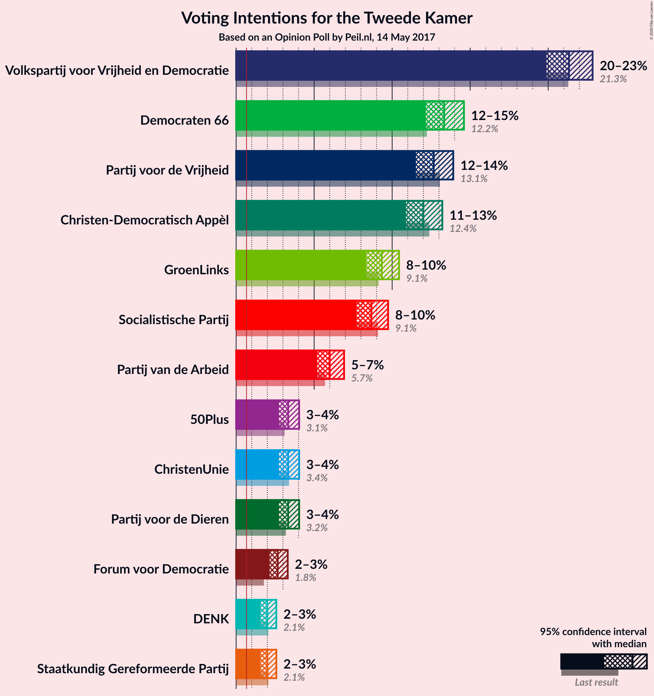

### Confidence Intervals

| Party | Last Result | Poll Result | 80% Confidence Interval | 90% Confidence Interval | 95% Confidence Interval | 99% Confidence Interval |
|:-----:|:-----------:|:-----------:|:-----------------------:|:-----------------------:|:-----------------------:|:-----------------------:|
| Volkspartij voor Vrijheid en Democratie | 21.3% | 21.3% | 20.4–22.3% |20.1–22.6% |19.9–22.8% |19.4–23.3% |
| Democraten 66 | 12.2% | 13.3% | 12.6–14.2% |12.3–14.4% |12.2–14.6% |11.8–15.0% |
| Partij voor de Vrijheid | 13.1% | 12.7% | 11.9–13.5% |11.7–13.7% |11.5–13.9% |11.2–14.3% |
| Christen-Democratisch Appèl | 12.4% | 12.0% | 11.3–12.8% |11.1–13.0% |10.9–13.2% |10.5–13.6% |
| GroenLinks | 9.1% | 9.3% | 8.7–10.1% |8.5–10.3% |8.3–10.4% |8.0–10.8% |
| Socialistische Partij | 9.1% | 8.7% | 8.0–9.4% |7.8–9.6% |7.7–9.7% |7.4–10.1% |
| Partij van de Arbeid | 5.7% | 6.0% | 5.5–6.6% |5.3–6.8% |5.2–6.9% |5.0–7.2% |
| ChristenUnie | 3.4% | 3.3% | 2.9–3.8% |2.8–3.9% |2.7–4.0% |2.6–4.3% |
| Partij voor de Dieren | 3.2% | 3.3% | 2.9–3.8% |2.8–3.9% |2.7–4.0% |2.6–4.3% |
| 50Plus | 3.1% | 3.3% | 2.9–3.8% |2.8–3.9% |2.7–4.0% |2.6–4.3% |
| Forum voor Democratie | 1.8% | 2.7% | 2.3–3.1% |2.2–3.2% |2.1–3.3% |2.0–3.5% |
| Staatkundig Gereformeerde Partij | 2.1% | 2.0% | 1.7–2.4% |1.6–2.5% |1.6–2.6% |1.4–2.8% |
| DENK | 2.1% | 2.0% | 1.7–2.4% |1.6–2.5% |1.6–2.6% |1.4–2.8% |

*Note:* The poll result column reflects the actual value used in the calculations. Published results may vary slightly, and in addition be rounded to fewer digits.

## Seats

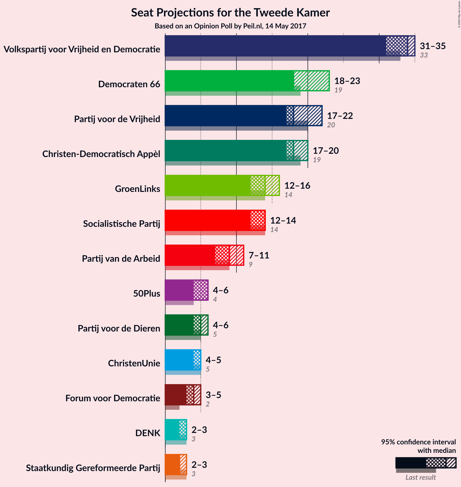

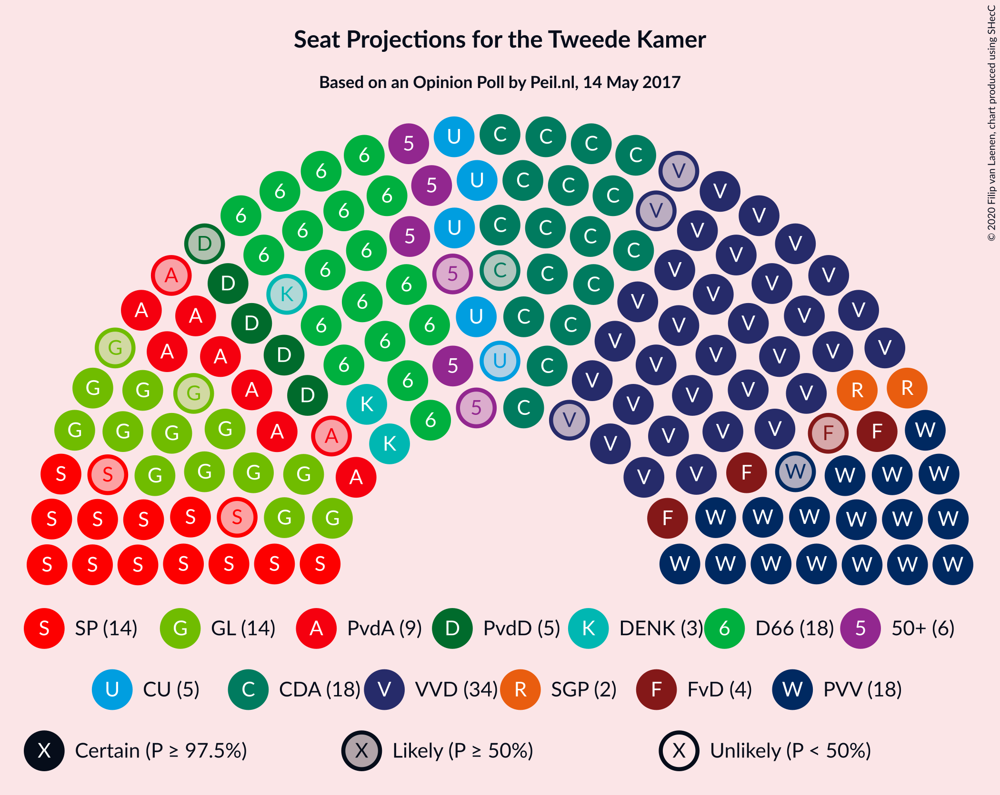

### Confidence Intervals

| Party | Last Result | Median | 80% Confidence Interval | 90% Confidence Interval | 95% Confidence Interval | 99% Confidence Interval |
|:-----:|:-----------:|:------:|:-----------------------:|:-----------------------:|:-----------------------:|:-----------------------:|
| <a href="#volkspartij-voor-vrijheid-en-democratie">Volkspartij voor Vrijheid en Democratie</a> | 33 | 34 | 31–35 |31–35 |31–35 |29–37 |
| <a href="#democraten-66">Democraten 66</a> | 19 | 18 | 18–21 |18–23 |18–23 |18–25 |
| <a href="#partij-voor-de-vrijheid">Partij voor de Vrijheid</a> | 20 | 18 | 18–20 |17–22 |17–22 |17–22 |
| <a href="#christen-democratisch-appèl">Christen-Democratisch Appèl</a> | 19 | 18 | 18 |17–19 |17–20 |16–20 |
| <a href="#groenlinks">GroenLinks</a> | 14 | 14 | 14–15 |13–16 |12–16 |12–16 |
| <a href="#socialistische-partij">Socialistische Partij</a> | 14 | 14 | 12–14 |12–14 |12–14 |11–14 |
| <a href="#partij-van-de-arbeid">Partij van de Arbeid</a> | 9 | 9 | 8–11 |7–11 |7–11 |7–11 |
| <a href="#christenunie">ChristenUnie</a> | 5 | 5 | 4–5 |4–5 |4–5 |4–6 |
| <a href="#partij-voor-de-dieren">Partij voor de Dieren</a> | 5 | 5 | 4–5 |4–5 |4–6 |3–6 |
| <a href="#50plus">50Plus</a> | 4 | 6 | 4–6 |4–6 |4–6 |4–6 |
| <a href="#forum-voor-democratie">Forum voor Democratie</a> | 2 | 4 | 4 |4 |3–5 |3–5 |
| <a href="#staatkundig-gereformeerde-partij">Staatkundig Gereformeerde Partij</a> | 3 | 2 | 2–3 |2–3 |2–3 |2–4 |
| <a href="#denk">DENK</a> | 3 | 3 | 2–3 |2–3 |2–3 |2–4 |

### Volkspartij voor Vrijheid en Democratie

*For a full overview of the results for this party, see the [Volkspartij voor Vrijheid en Democratie](party-volkspartijvoorvrijheidendemocratie.html) page.*

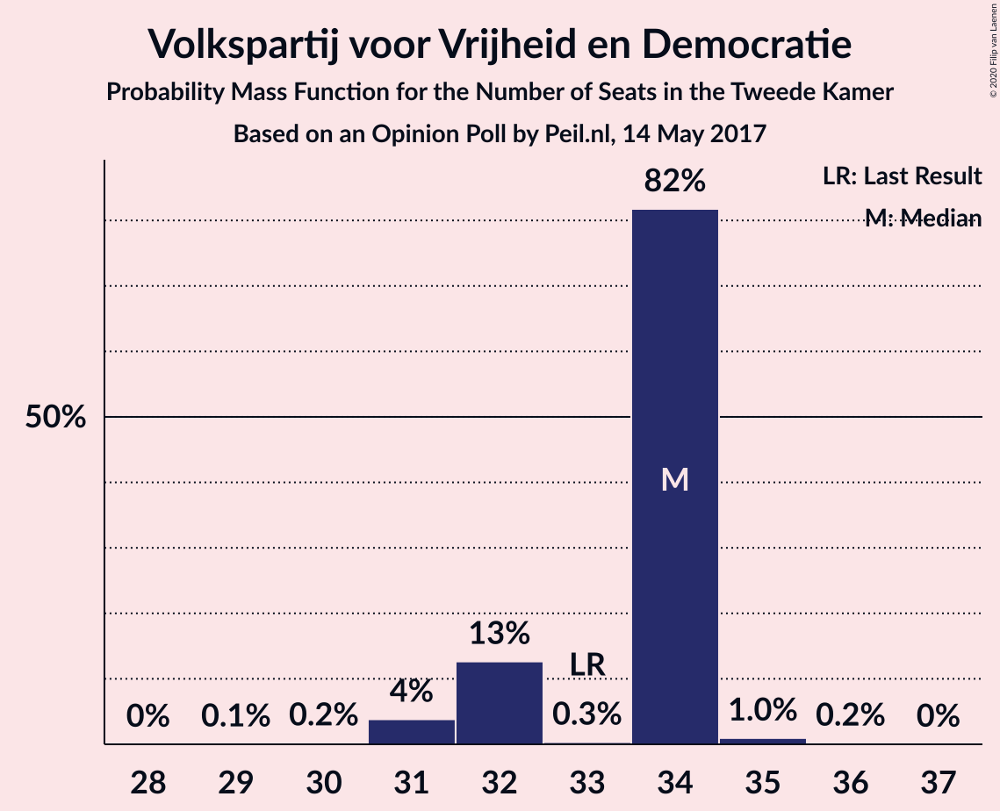

| Number of Seats | Probability | Accumulated | Special Marks |
|:---------------:|:-----------:|:-----------:|:-------------:|
| 29 | 1.0% | 100% |  |
| 30 | 0.1% | 99.0% |  |
| 31 | 9% | 98.8% |  |
| 32 | 6% | 90% |  |
| 33 | 2% | 84% | Last Result |
| 34 | 66% | 82% | Median |
| 35 | 14% | 15% |  |
| 36 | 0.2% | 1.2% |  |
| 37 | 1.0% | 1.0% |  |
| 38 | 0% | 0% |  |

### Democraten 66

*For a full overview of the results for this party, see the [Democraten 66](party-democraten66.html) page.*

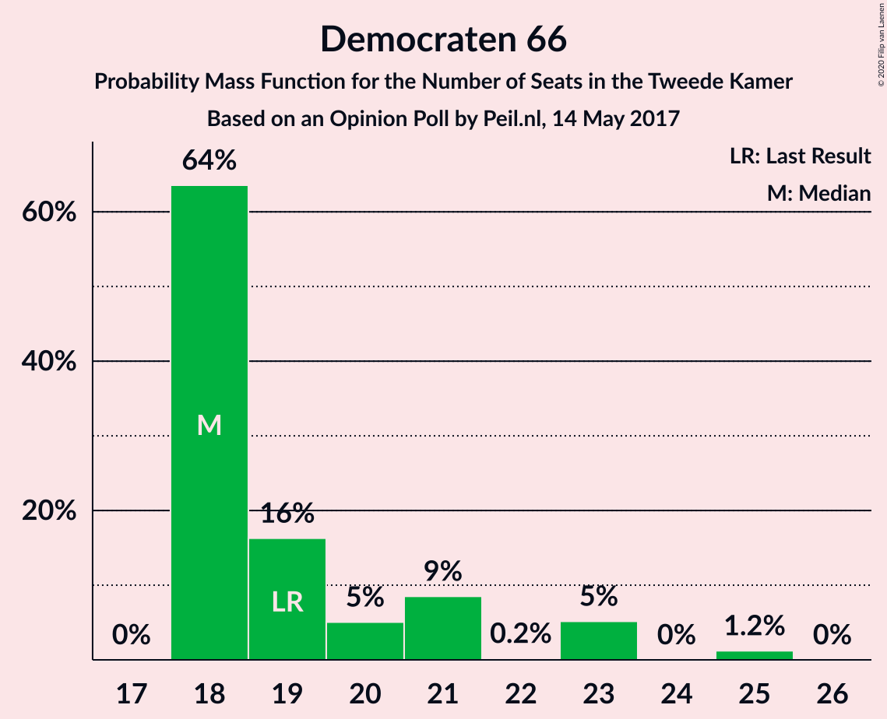

| Number of Seats | Probability | Accumulated | Special Marks |
|:---------------:|:-----------:|:-----------:|:-------------:|
| 18 | 64% | 100% | Median |
| 19 | 16% | 36% | Last Result |
| 20 | 5% | 20% |  |
| 21 | 9% | 15% |  |
| 22 | 0.2% | 7% |  |
| 23 | 5% | 6% |  |
| 24 | 0% | 1.2% |  |
| 25 | 1.2% | 1.2% |  |
| 26 | 0% | 0% |  |

### Partij voor de Vrijheid

*For a full overview of the results for this party, see the [Partij voor de Vrijheid](party-partijvoordevrijheid.html) page.*

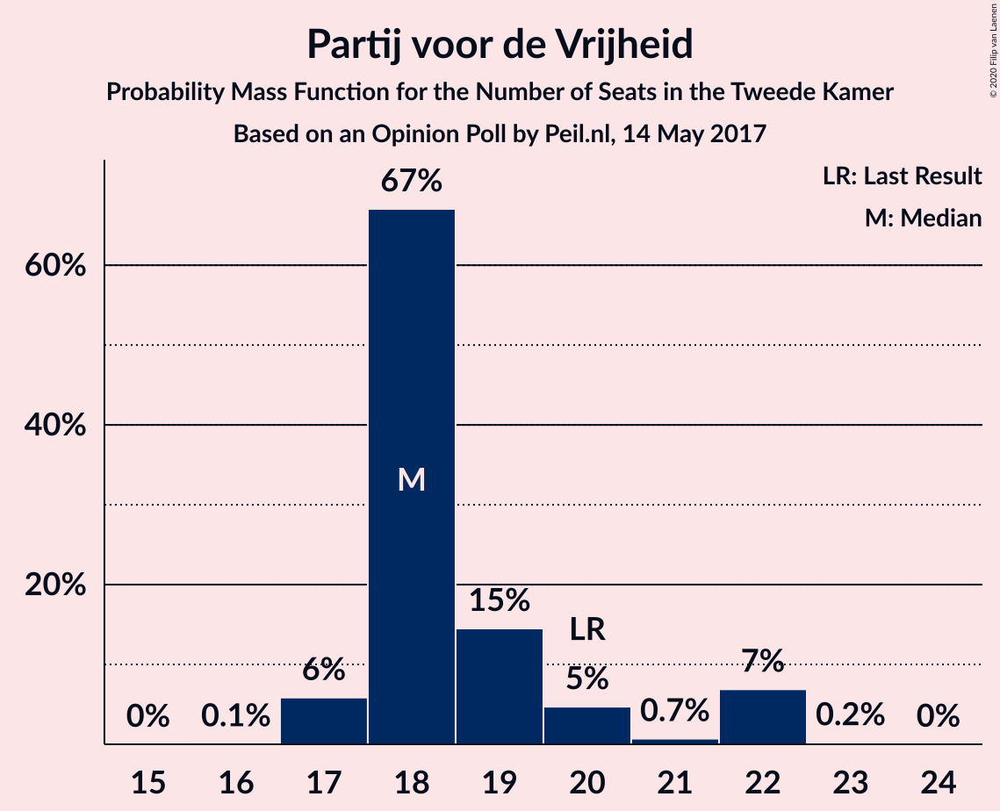

| Number of Seats | Probability | Accumulated | Special Marks |
|:---------------:|:-----------:|:-----------:|:-------------:|
| 16 | 0.1% | 100% |  |
| 17 | 6% | 99.9% |  |
| 18 | 67% | 94% | Median |
| 19 | 15% | 27% |  |
| 20 | 5% | 13% | Last Result |
| 21 | 0.7% | 8% |  |
| 22 | 7% | 7% |  |
| 23 | 0.2% | 0.2% |  |
| 24 | 0% | 0% |  |

### Christen-Democratisch Appèl

*For a full overview of the results for this party, see the [Christen-Democratisch Appèl](party-christen-democratischappèl.html) page.*

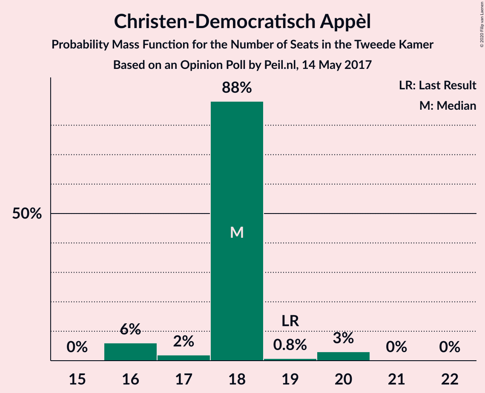

| Number of Seats | Probability | Accumulated | Special Marks |
|:---------------:|:-----------:|:-----------:|:-------------:|
| 16 | 2% | 100% |  |
| 17 | 4% | 98% |  |
| 18 | 88% | 94% | Median |
| 19 | 2% | 6% | Last Result |
| 20 | 5% | 5% |  |
| 21 | 0.2% | 0.2% |  |
| 22 | 0% | 0% |  |

### GroenLinks

*For a full overview of the results for this party, see the [GroenLinks](party-groenlinks.html) page.*

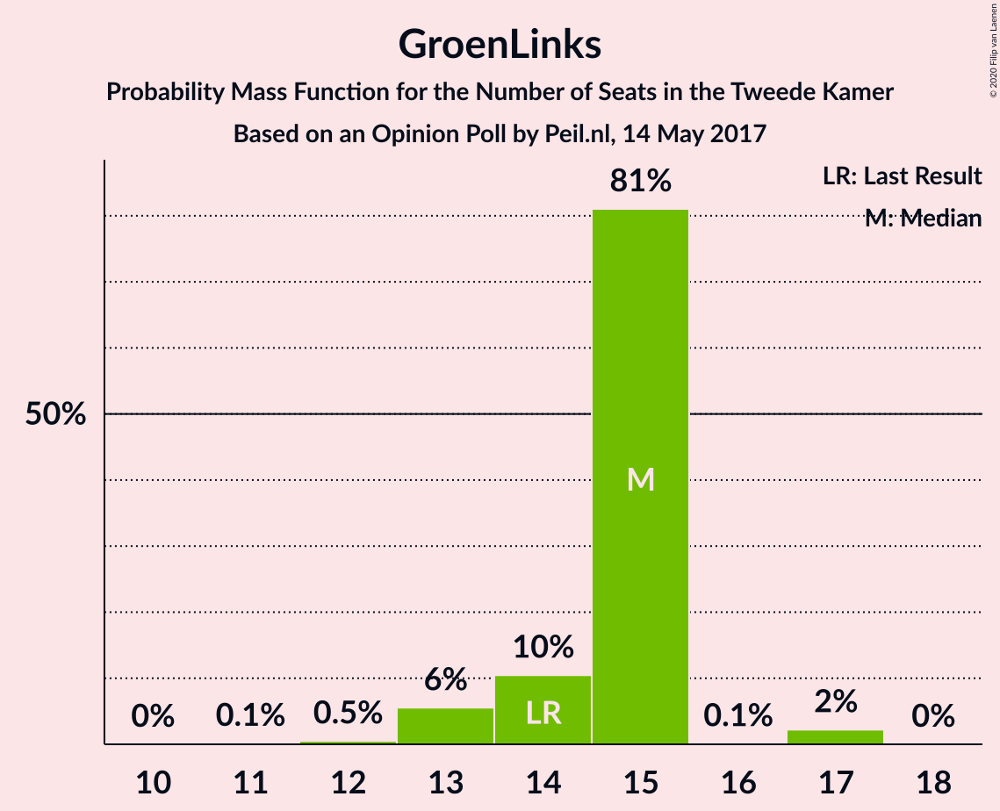

| Number of Seats | Probability | Accumulated | Special Marks |
|:---------------:|:-----------:|:-----------:|:-------------:|
| 12 | 3% | 100% |  |
| 13 | 7% | 97% |  |
| 14 | 69% | 91% | Last Result, Median |
| 15 | 16% | 22% |  |
| 16 | 6% | 6% |  |
| 17 | 0.2% | 0.2% |  |
| 18 | 0% | 0% |  |

### Socialistische Partij

*For a full overview of the results for this party, see the [Socialistische Partij](party-socialistischepartij.html) page.*

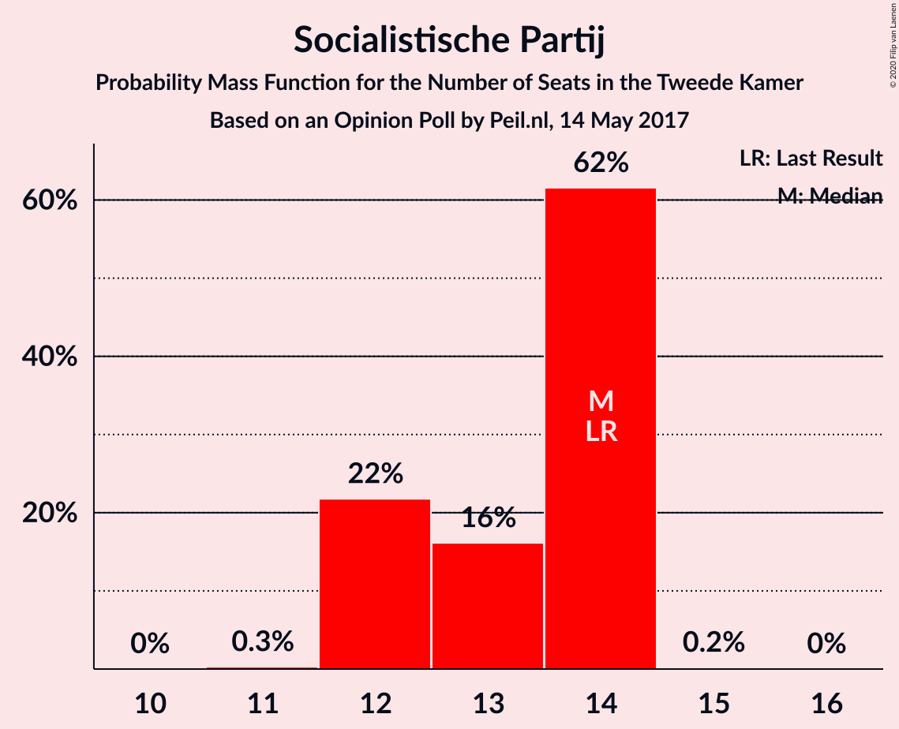

| Number of Seats | Probability | Accumulated | Special Marks |
|:---------------:|:-----------:|:-----------:|:-------------:|
| 11 | 0.7% | 100% |  |
| 12 | 13% | 99.3% |  |
| 13 | 16% | 87% |  |
| 14 | 70% | 70% | Last Result, Median |
| 15 | 0.4% | 0.4% |  |
| 16 | 0% | 0% |  |

### Partij van de Arbeid

*For a full overview of the results for this party, see the [Partij van de Arbeid](party-partijvandearbeid.html) page.*

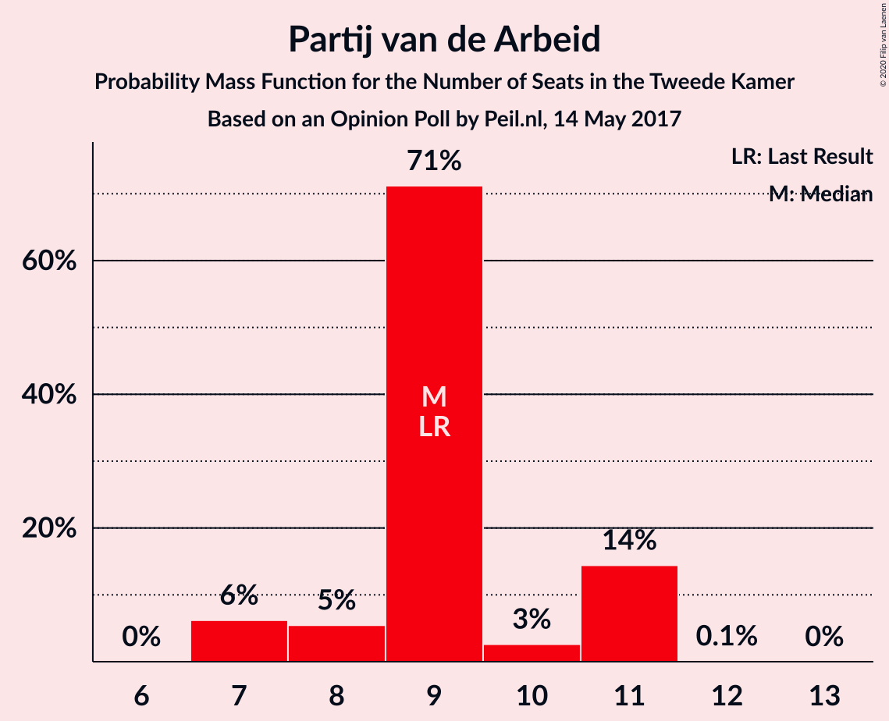

| Number of Seats | Probability | Accumulated | Special Marks |
|:---------------:|:-----------:|:-----------:|:-------------:|
| 7 | 6% | 100% |  |
| 8 | 5% | 94% |  |
| 9 | 71% | 88% | Last Result, Median |
| 10 | 3% | 17% |  |
| 11 | 14% | 15% |  |
| 12 | 0.1% | 0.1% |  |
| 13 | 0% | 0% |  |

### ChristenUnie

*For a full overview of the results for this party, see the [ChristenUnie](party-christenunie.html) page.*

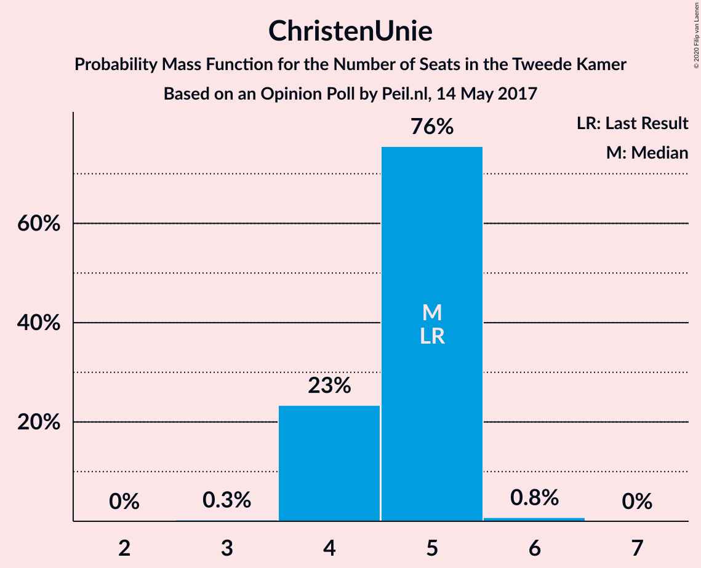

| Number of Seats | Probability | Accumulated | Special Marks |
|:---------------:|:-----------:|:-----------:|:-------------:|
| 3 | 0.3% | 100% |  |
| 4 | 23% | 99.7% |  |
| 5 | 76% | 76% | Last Result, Median |
| 6 | 0.8% | 0.8% |  |
| 7 | 0% | 0% |  |

### Partij voor de Dieren

*For a full overview of the results for this party, see the [Partij voor de Dieren](party-partijvoordedieren.html) page.*

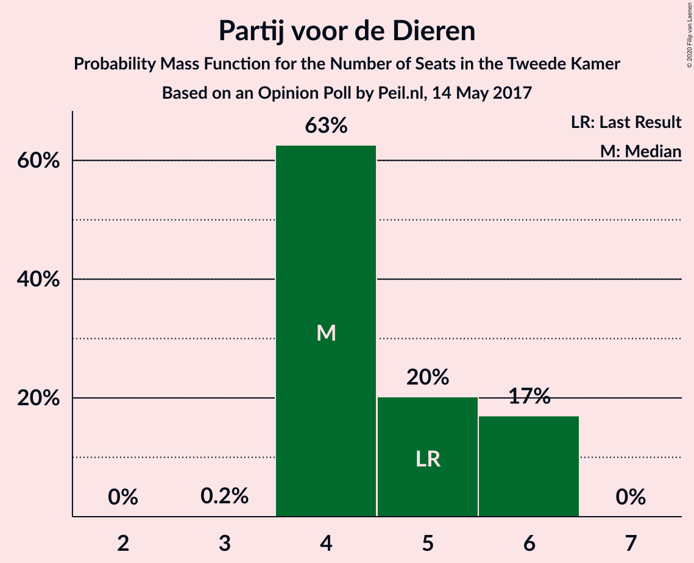

| Number of Seats | Probability | Accumulated | Special Marks |
|:---------------:|:-----------:|:-----------:|:-------------:|
| 3 | 0.7% | 100% |  |
| 4 | 25% | 99.3% |  |
| 5 | 70% | 74% | Last Result, Median |
| 6 | 4% | 4% |  |
| 7 | 0% | 0% |  |

### 50Plus

*For a full overview of the results for this party, see the [50Plus](party-50plus.html) page.*

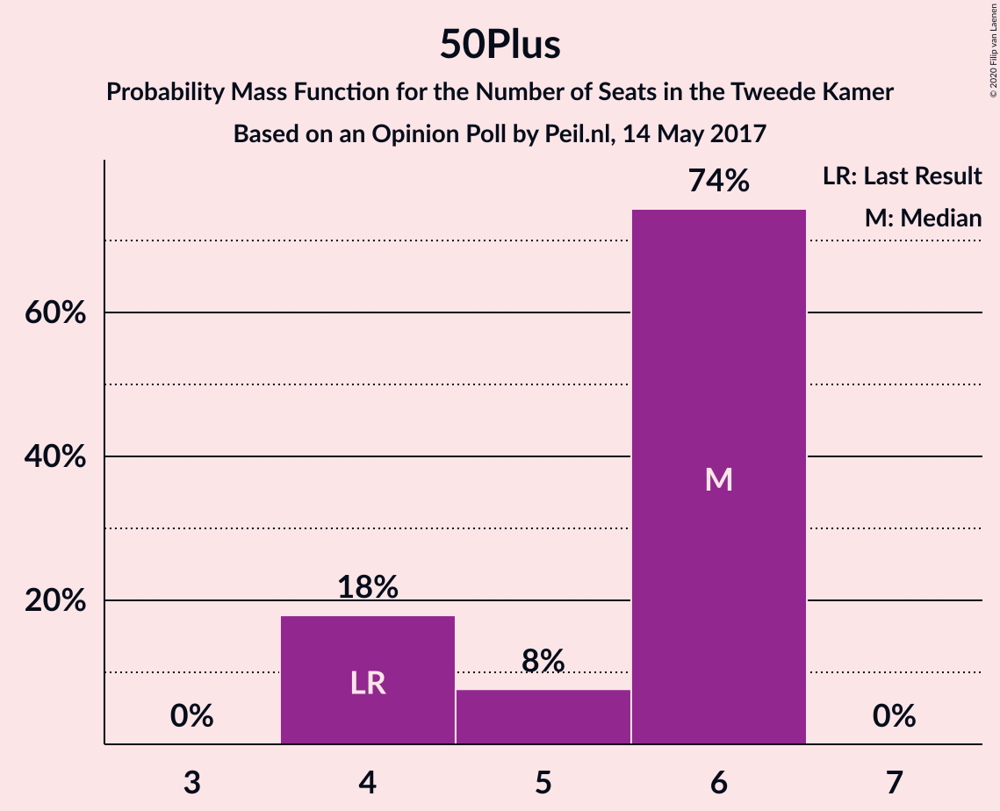

| Number of Seats | Probability | Accumulated | Special Marks |
|:---------------:|:-----------:|:-----------:|:-------------:|
| 4 | 18% | 100% | Last Result |
| 5 | 8% | 82% |  |
| 6 | 74% | 74% | Median |
| 7 | 0% | 0% |  |

### Forum voor Democratie

*For a full overview of the results for this party, see the [Forum voor Democratie](party-forumvoordemocratie.html) page.*

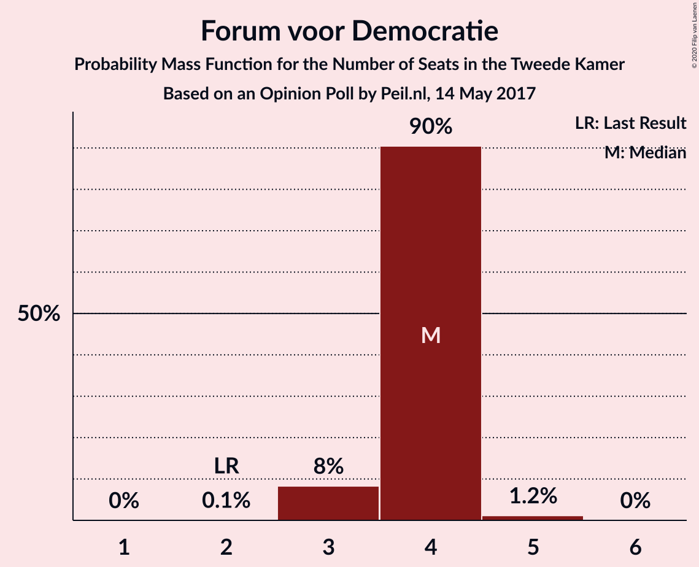

| Number of Seats | Probability | Accumulated | Special Marks |
|:---------------:|:-----------:|:-----------:|:-------------:|
| 2 | 0.2% | 100% | Last Result |
| 3 | 2% | 99.8% |  |
| 4 | 93% | 97% | Median |
| 5 | 4% | 4% |  |
| 6 | 0% | 0% |  |

### Staatkundig Gereformeerde Partij

*For a full overview of the results for this party, see the [Staatkundig Gereformeerde Partij](party-staatkundiggereformeerdepartij.html) page.*

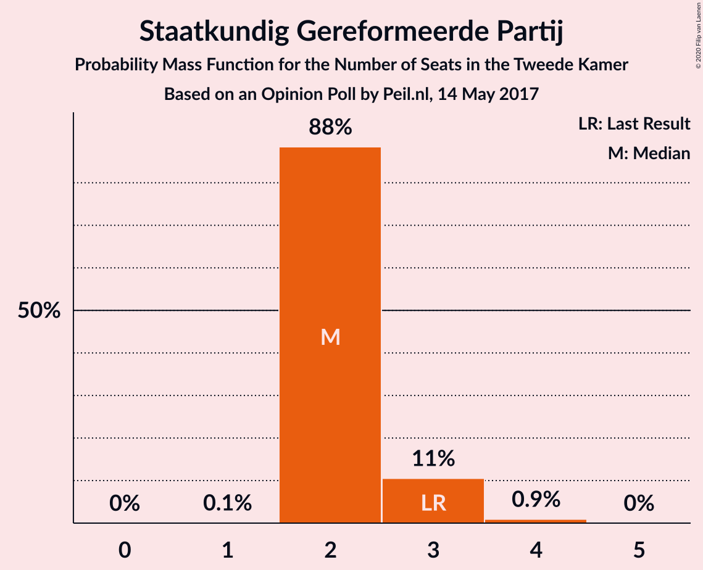

| Number of Seats | Probability | Accumulated | Special Marks |
|:---------------:|:-----------:|:-----------:|:-------------:|
| 1 | 0.1% | 100% |  |
| 2 | 88% | 99.9% | Median |
| 3 | 11% | 11% | Last Result |
| 4 | 0.9% | 0.9% |  |
| 5 | 0% | 0% |  |

### DENK

*For a full overview of the results for this party, see the [DENK](party-denk.html) page.*

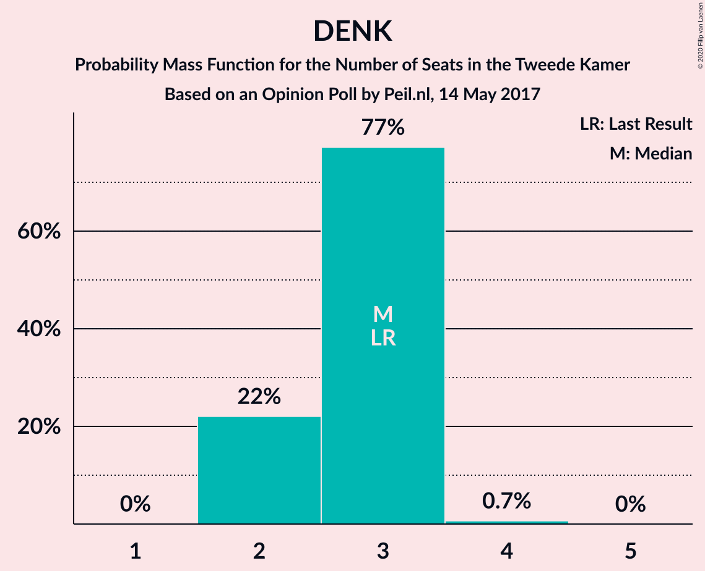

| Number of Seats | Probability | Accumulated | Special Marks |
|:---------------:|:-----------:|:-----------:|:-------------:|
| 2 | 22% | 100% |  |
| 3 | 77% | 78% | Last Result, Median |
| 4 | 0.7% | 0.7% |  |
| 5 | 0% | 0% |  |

## Coalitions

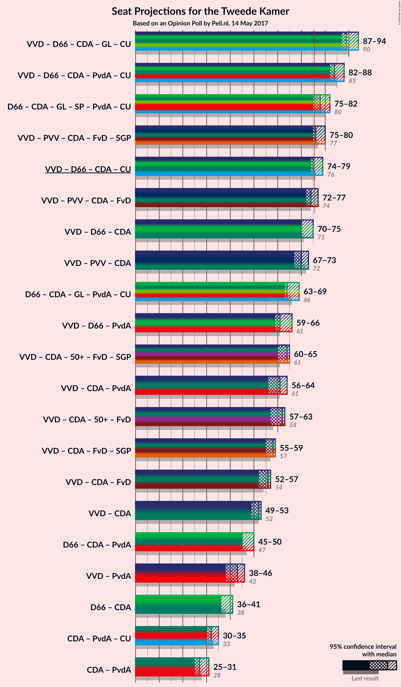

### Confidence Intervals

| Coalition | Last Result | Median | Majority? | 80% Confidence Interval | 90% Confidence Interval | 95% Confidence Interval | 99% Confidence Interval |
|:---------:|:-----------:|:------:|:---------:|:-----------------------:|:-----------------------:|:-----------------------:|:-----------------------:|
| Volkspartij voor Vrijheid en Democratie – Democraten 66 – Christen-Democratisch Appèl – GroenLinks – ChristenUnie | 90 | 89 | 100% | 89–91 | 88–91 | 87–94 | 87–95 |
| Volkspartij voor Vrijheid en Democratie – Democraten 66 – Christen-Democratisch Appèl – Partij van de Arbeid – ChristenUnie | 85 | 84 | 100% | 84–87 | 82–87 | 82–88 | 80–88 |
| Democraten 66 – Christen-Democratisch Appèl – GroenLinks – Socialistische Partij – Partij van de Arbeid – ChristenUnie | 80 | 78 | 97% | 78–80 | 77–81 | 75–82 | 75–83 |
| Volkspartij voor Vrijheid en Democratie – Partij voor de Vrijheid – Christen-Democratisch Appèl – Forum voor Democratie – Staatkundig Gereformeerde Partij | 77 | 76 | 89% | 75–78 | 75–79 | 75–80 | 73–80 |
| Volkspartij voor Vrijheid en Democratie – Democraten 66 – Christen-Democratisch Appèl – ChristenUnie | 76 | 75 | 24% | 75–76 | 74–78 | 74–79 | 71–81 |
| Volkspartij voor Vrijheid en Democratie – Partij voor de Vrijheid – Christen-Democratisch Appèl – Forum voor Democratie | 74 | 74 | 17% | 73–76 | 72–77 | 72–77 | 71–78 |
| Volkspartij voor Vrijheid en Democratie – Democraten 66 – Christen-Democratisch Appèl | 71 | 70 | 2% | 70–72 | 70–73 | 70–75 | 67–76 |
| Volkspartij voor Vrijheid en Democratie – Partij voor de Vrijheid – Christen-Democratisch Appèl | 72 | 70 | 0% | 69–72 | 68–73 | 67–73 | 67–74 |
| Democraten 66 – Christen-Democratisch Appèl – GroenLinks – Partij van de Arbeid – ChristenUnie | 66 | 64 | 0% | 64–67 | 64–67 | 63–69 | 63–69 |
| Volkspartij voor Vrijheid en Democratie – Democraten 66 – Partij van de Arbeid | 61 | 61 | 0% | 61–65 | 59–65 | 59–66 | 58–66 |
| Volkspartij voor Vrijheid en Democratie – Christen-Democratisch Appèl – 50Plus – Forum voor Democratie – Staatkundig Gereformeerde Partij | 61 | 64 | 0% | 62–64 | 60–64 | 60–65 | 59–66 |
| Volkspartij voor Vrijheid en Democratie – Christen-Democratisch Appèl – Partij van de Arbeid | 61 | 61 | 0% | 58–64 | 56–64 | 56–64 | 56–64 |
| Volkspartij voor Vrijheid en Democratie – Christen-Democratisch Appèl – 50Plus – Forum voor Democratie | 58 | 62 | 0% | 59–62 | 58–62 | 57–63 | 56–64 |
| Volkspartij voor Vrijheid en Democratie – Christen-Democratisch Appèl – Forum voor Democratie – Staatkundig Gereformeerde Partij | 57 | 58 | 0% | 57–59 | 55–59 | 55–59 | 54–62 |
| Volkspartij voor Vrijheid en Democratie – Christen-Democratisch Appèl – Forum voor Democratie | 54 | 56 | 0% | 54–57 | 53–57 | 52–57 | 52–59 |
| Volkspartij voor Vrijheid en Democratie – Christen-Democratisch Appèl | 52 | 52 | 0% | 49–53 | 49–53 | 49–53 | 47–55 |
| Democraten 66 – Christen-Democratisch Appèl – Partij van de Arbeid | 47 | 45 | 0% | 45–49 | 45–50 | 45–50 | 44–50 |
| Volkspartij voor Vrijheid en Democratie – Partij van de Arbeid | 42 | 43 | 0% | 41–46 | 38–46 | 38–46 | 38–46 |
| Democraten 66 – Christen-Democratisch Appèl | 38 | 36 | 0% | 36–39 | 36–41 | 36–41 | 36–41 |
| Christen-Democratisch Appèl – Partij van de Arbeid – ChristenUnie | 33 | 32 | 0% | 30–33 | 30–34 | 30–35 | 29–35 |
| Christen-Democratisch Appèl – Partij van de Arbeid | 28 | 27 | 0% | 26–29 | 25–29 | 25–31 | 24–31 |

### Volkspartij voor Vrijheid en Democratie – Democraten 66 – Christen-Democratisch Appèl – GroenLinks – ChristenUnie

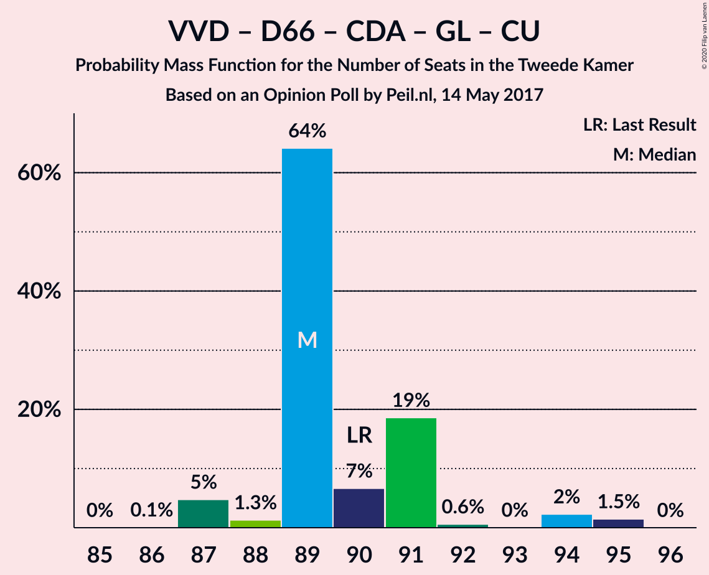

| Number of Seats | Probability | Accumulated | Special Marks |
|:---------------:|:-----------:|:-----------:|:-------------:|
| 86 | 0.1% | 100% |  |
| 87 | 5% | 99.9% |  |
| 88 | 1.3% | 95% |  |
| 89 | 64% | 94% | Median |
| 90 | 7% | 30% | Last Result |
| 91 | 19% | 23% |  |
| 92 | 0.6% | 4% |  |
| 93 | 0% | 4% |  |
| 94 | 2% | 4% |  |
| 95 | 1.5% | 1.5% |  |
| 96 | 0% | 0% |  |

### Volkspartij voor Vrijheid en Democratie – Democraten 66 – Christen-Democratisch Appèl – Partij van de Arbeid – ChristenUnie

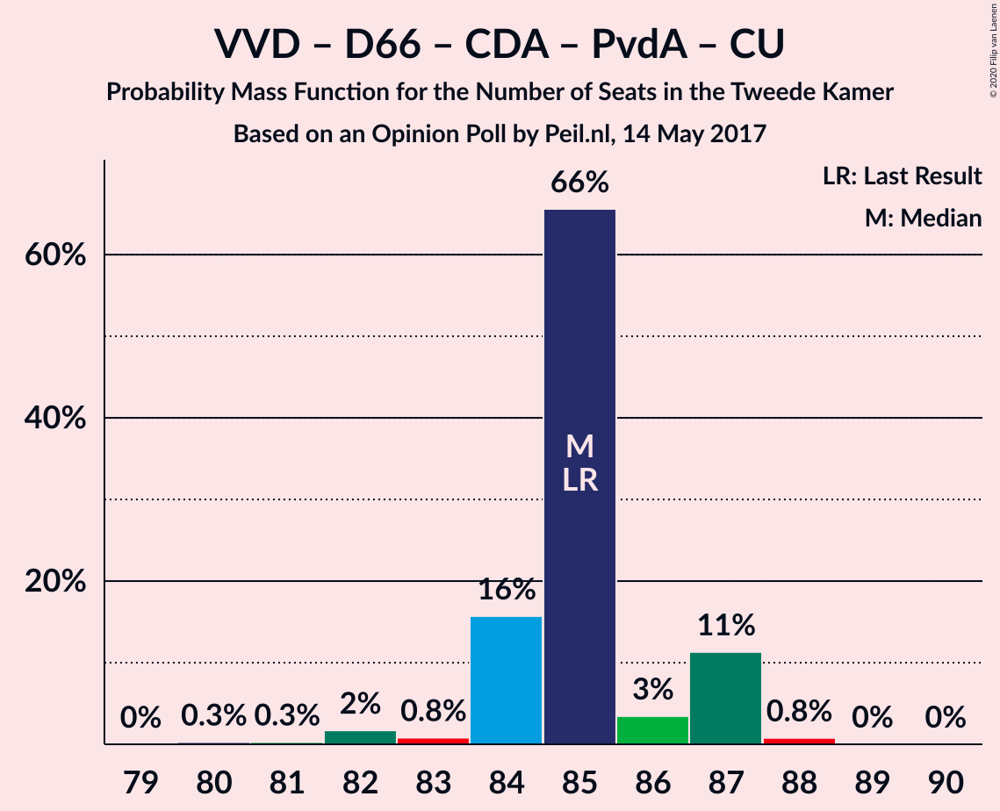

| Number of Seats | Probability | Accumulated | Special Marks |
|:---------------:|:-----------:|:-----------:|:-------------:|
| 80 | 1.0% | 100% |  |
| 81 | 0.1% | 99.0% |  |
| 82 | 6% | 98.9% |  |
| 83 | 0.8% | 93% |  |
| 84 | 63% | 93% | Median |
| 85 | 9% | 29% | Last Result |
| 86 | 5% | 20% |  |
| 87 | 11% | 15% |  |
| 88 | 4% | 4% |  |
| 89 | 0% | 0.1% |  |
| 90 | 0.1% | 0.1% |  |
| 91 | 0% | 0% |  |

### Democraten 66 – Christen-Democratisch Appèl – GroenLinks – Socialistische Partij – Partij van de Arbeid – ChristenUnie

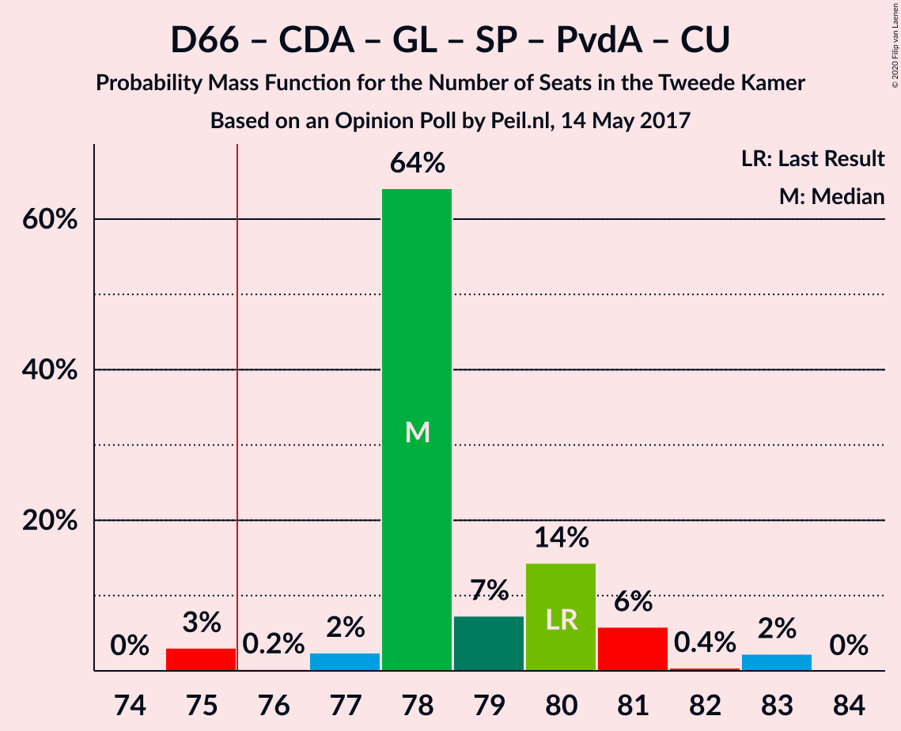

| Number of Seats | Probability | Accumulated | Special Marks |
|:---------------:|:-----------:|:-----------:|:-------------:|
| 75 | 3% | 100% |  |
| 76 | 0.2% | 97% | Majority |
| 77 | 2% | 97% |  |
| 78 | 64% | 94% | Median |
| 79 | 7% | 30% |  |
| 80 | 14% | 23% | Last Result |
| 81 | 6% | 9% |  |
| 82 | 0.4% | 3% |  |
| 83 | 2% | 2% |  |
| 84 | 0% | 0% |  |

### Volkspartij voor Vrijheid en Democratie – Partij voor de Vrijheid – Christen-Democratisch Appèl – Forum voor Democratie – Staatkundig Gereformeerde Partij

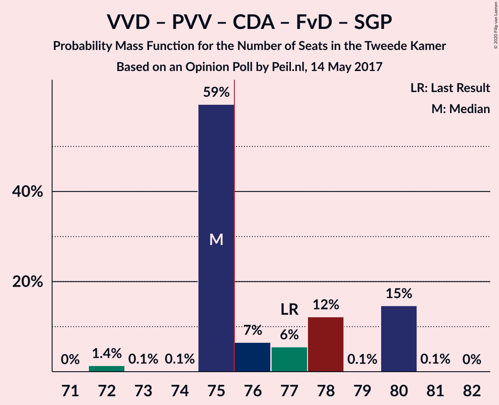

| Number of Seats | Probability | Accumulated | Special Marks |
|:---------------:|:-----------:|:-----------:|:-------------:|
| 72 | 0.1% | 100% |  |
| 73 | 1.4% | 99.9% |  |
| 74 | 0.8% | 98.6% |  |
| 75 | 8% | 98% |  |
| 76 | 65% | 89% | Median, Majority |
| 77 | 6% | 24% | Last Result |
| 78 | 12% | 18% |  |
| 79 | 3% | 6% |  |
| 80 | 3% | 3% |  |
| 81 | 0.1% | 0.4% |  |
| 82 | 0.3% | 0.3% |  |
| 83 | 0% | 0% |  |

### Volkspartij voor Vrijheid en Democratie – Democraten 66 – Christen-Democratisch Appèl – ChristenUnie

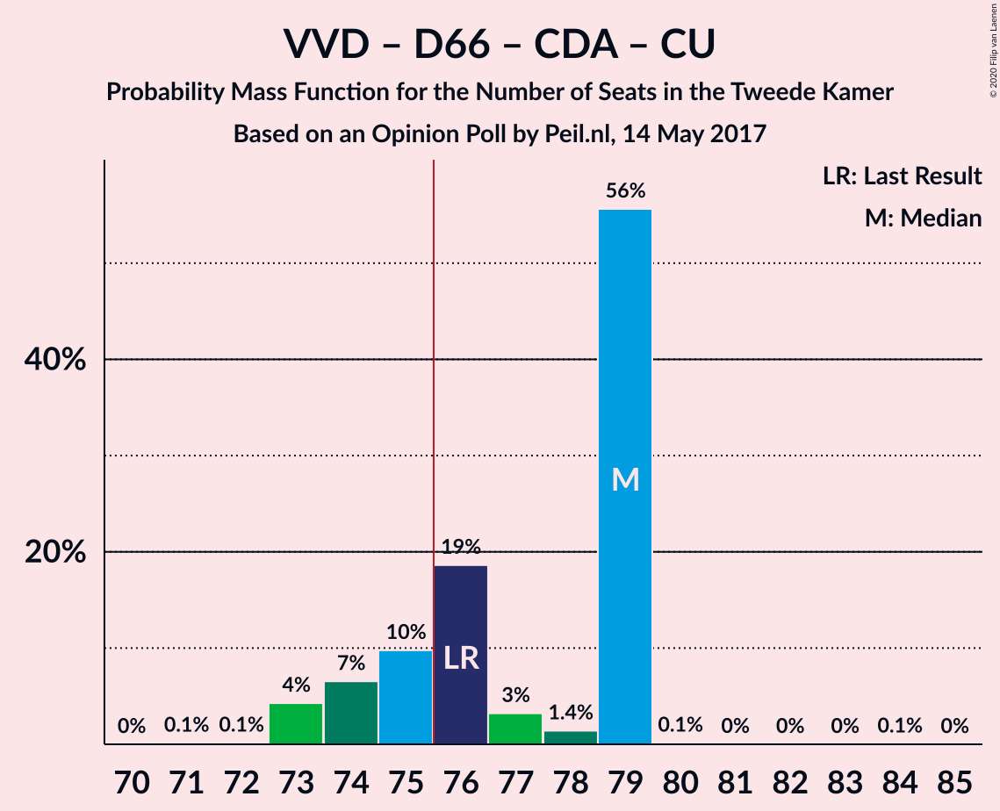

| Number of Seats | Probability | Accumulated | Special Marks |
|:---------------:|:-----------:|:-----------:|:-------------:|
| 71 | 0.8% | 100% |  |
| 72 | 0.4% | 99.2% |  |
| 73 | 0.3% | 98.8% |  |
| 74 | 4% | 98.5% |  |
| 75 | 70% | 94% | Median |
| 76 | 15% | 24% | Last Result, Majority |
| 77 | 3% | 10% |  |
| 78 | 3% | 7% |  |
| 79 | 3% | 4% |  |
| 80 | 0.6% | 2% |  |
| 81 | 0.9% | 0.9% |  |
| 82 | 0% | 0% |  |

### Volkspartij voor Vrijheid en Democratie – Partij voor de Vrijheid – Christen-Democratisch Appèl – Forum voor Democratie

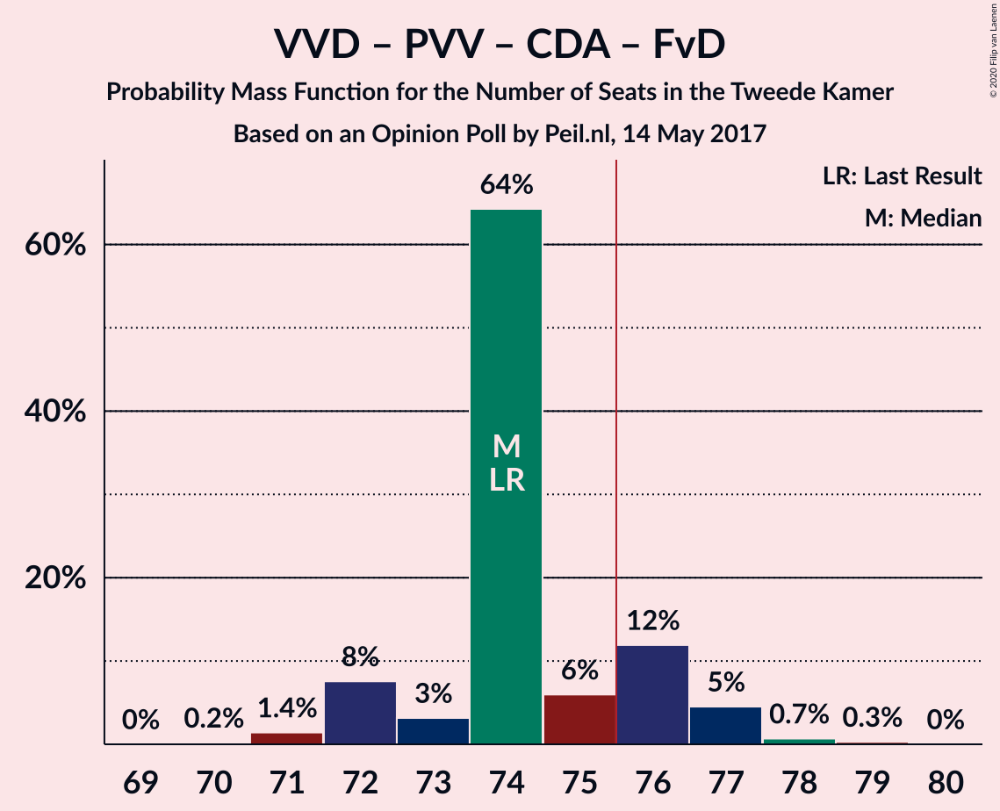

| Number of Seats | Probability | Accumulated | Special Marks |
|:---------------:|:-----------:|:-----------:|:-------------:|
| 70 | 0.2% | 100% |  |
| 71 | 1.4% | 99.8% |  |
| 72 | 8% | 98% |  |
| 73 | 3% | 91% |  |
| 74 | 64% | 88% | Last Result, Median |
| 75 | 6% | 23% |  |
| 76 | 12% | 17% | Majority |
| 77 | 5% | 6% |  |
| 78 | 0.7% | 1.0% |  |
| 79 | 0.3% | 0.3% |  |
| 80 | 0% | 0% |  |

### Volkspartij voor Vrijheid en Democratie – Democraten 66 – Christen-Democratisch Appèl

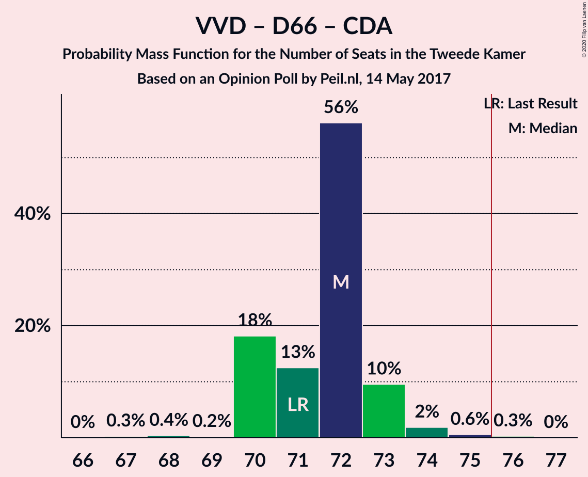

| Number of Seats | Probability | Accumulated | Special Marks |
|:---------------:|:-----------:|:-----------:|:-------------:|
| 67 | 0.9% | 100% |  |
| 68 | 0.4% | 99.1% |  |
| 69 | 0.6% | 98.7% |  |
| 70 | 74% | 98% | Median |
| 71 | 0.6% | 24% | Last Result |
| 72 | 15% | 23% |  |
| 73 | 4% | 9% |  |
| 74 | 0.6% | 4% |  |
| 75 | 2% | 4% |  |
| 76 | 1.5% | 2% | Majority |
| 77 | 0% | 0% |  |

### Volkspartij voor Vrijheid en Democratie – Partij voor de Vrijheid – Christen-Democratisch Appèl

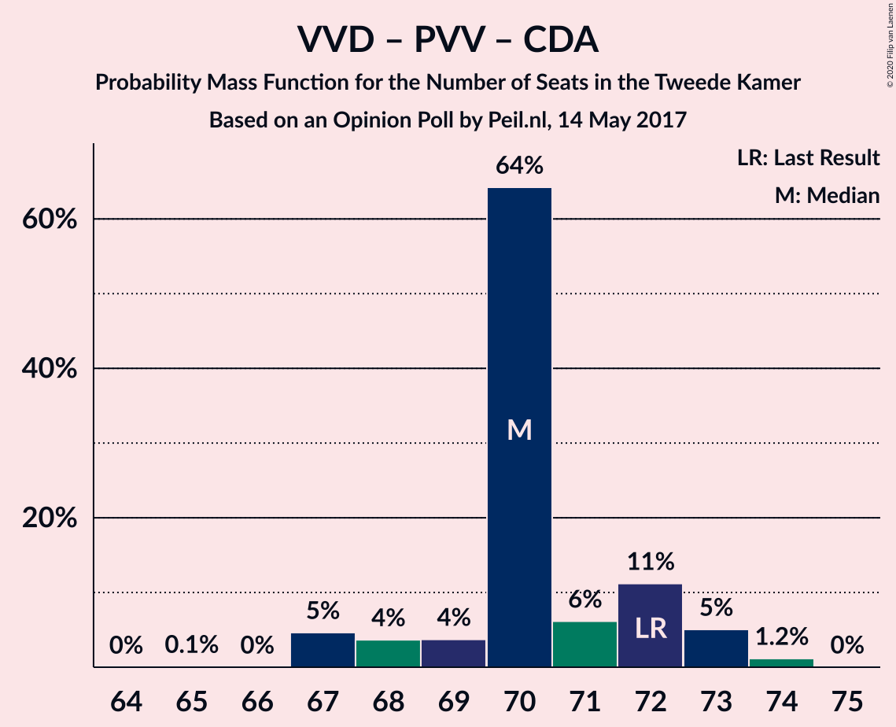

| Number of Seats | Probability | Accumulated | Special Marks |
|:---------------:|:-----------:|:-----------:|:-------------:|
| 65 | 0.1% | 100% |  |
| 66 | 0% | 99.9% |  |
| 67 | 5% | 99.9% |  |
| 68 | 4% | 95% |  |
| 69 | 4% | 92% |  |
| 70 | 64% | 88% | Median |
| 71 | 6% | 24% |  |
| 72 | 11% | 17% | Last Result |
| 73 | 5% | 6% |  |
| 74 | 1.2% | 1.2% |  |
| 75 | 0% | 0% |  |

### Democraten 66 – Christen-Democratisch Appèl – GroenLinks – Partij van de Arbeid – ChristenUnie

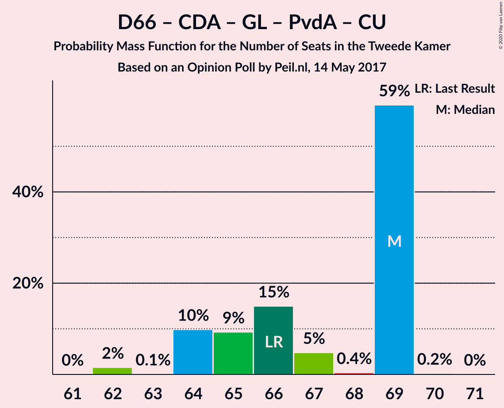

| Number of Seats | Probability | Accumulated | Special Marks |
|:---------------:|:-----------:|:-----------:|:-------------:|
| 61 | 0.2% | 100% |  |
| 62 | 0.1% | 99.8% |  |
| 63 | 3% | 99.7% |  |
| 64 | 63% | 97% | Median |
| 65 | 2% | 34% |  |
| 66 | 3% | 32% | Last Result |
| 67 | 24% | 29% |  |
| 68 | 2% | 5% |  |
| 69 | 2% | 3% |  |
| 70 | 0.4% | 0.4% |  |
| 71 | 0% | 0% |  |

### Volkspartij voor Vrijheid en Democratie – Democraten 66 – Partij van de Arbeid

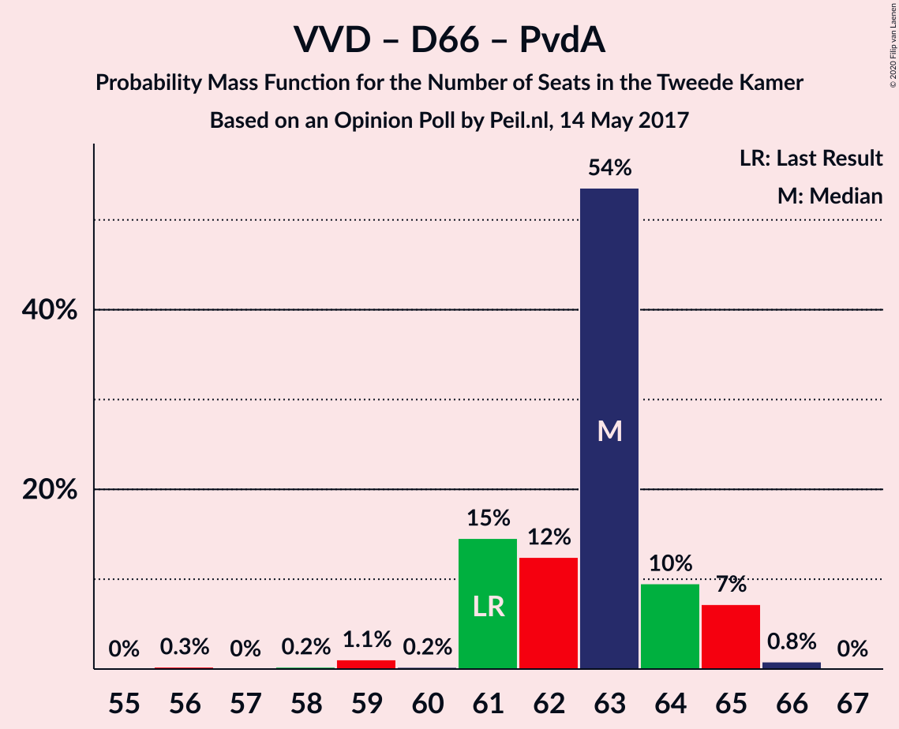

| Number of Seats | Probability | Accumulated | Special Marks |
|:---------------:|:-----------:|:-----------:|:-------------:|
| 57 | 0.1% | 100% |  |
| 58 | 0.8% | 99.9% |  |
| 59 | 5% | 99.1% |  |
| 60 | 0.4% | 94% |  |
| 61 | 68% | 93% | Last Result, Median |
| 62 | 2% | 25% |  |
| 63 | 4% | 23% |  |
| 64 | 3% | 19% |  |
| 65 | 11% | 15% |  |
| 66 | 4% | 4% |  |
| 67 | 0% | 0% |  |

### Volkspartij voor Vrijheid en Democratie – Christen-Democratisch Appèl – 50Plus – Forum voor Democratie – Staatkundig Gereformeerde Partij

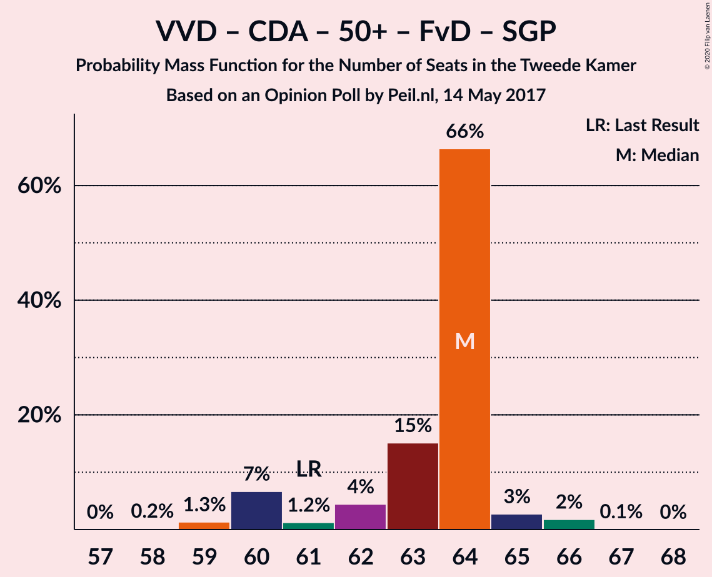

| Number of Seats | Probability | Accumulated | Special Marks |
|:---------------:|:-----------:|:-----------:|:-------------:|
| 58 | 0.2% | 100% |  |
| 59 | 1.3% | 99.8% |  |
| 60 | 7% | 98% |  |
| 61 | 1.2% | 92% | Last Result |
| 62 | 4% | 91% |  |
| 63 | 15% | 86% |  |
| 64 | 66% | 71% | Median |
| 65 | 3% | 5% |  |
| 66 | 2% | 2% |  |
| 67 | 0.1% | 0.1% |  |
| 68 | 0% | 0% |  |

### Volkspartij voor Vrijheid en Democratie – Christen-Democratisch Appèl – Partij van de Arbeid

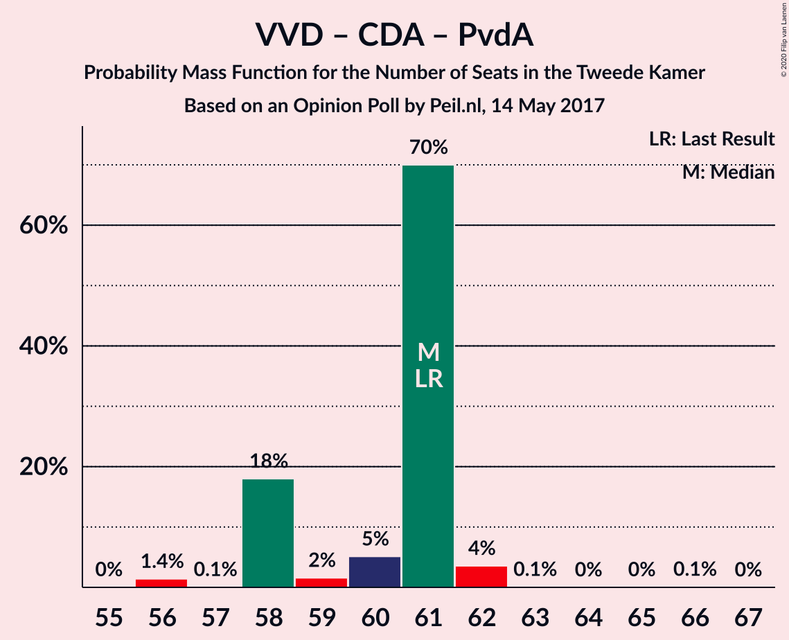

| Number of Seats | Probability | Accumulated | Special Marks |
|:---------------:|:-----------:|:-----------:|:-------------:|
| 56 | 6% | 100% |  |
| 57 | 1.4% | 94% |  |
| 58 | 4% | 92% |  |
| 59 | 2% | 89% |  |
| 60 | 0.9% | 87% |  |
| 61 | 69% | 86% | Last Result, Median |
| 62 | 5% | 17% |  |
| 63 | 0.6% | 12% |  |
| 64 | 11% | 11% |  |
| 65 | 0.1% | 0.1% |  |
| 66 | 0% | 0% |  |

### Volkspartij voor Vrijheid en Democratie – Christen-Democratisch Appèl – 50Plus – Forum voor Democratie

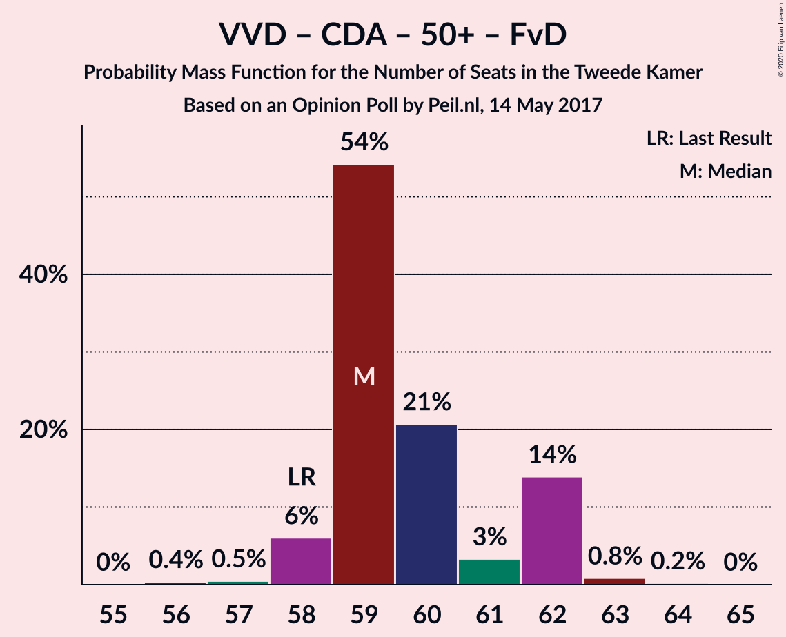

| Number of Seats | Probability | Accumulated | Special Marks |
|:---------------:|:-----------:|:-----------:|:-------------:|
| 56 | 1.0% | 100% |  |
| 57 | 2% | 99.0% |  |
| 58 | 6% | 97% | Last Result |
| 59 | 2% | 91% |  |
| 60 | 6% | 89% |  |
| 61 | 16% | 83% |  |
| 62 | 63% | 67% | Median |
| 63 | 4% | 4% |  |
| 64 | 0.9% | 0.9% |  |
| 65 | 0% | 0% |  |

### Volkspartij voor Vrijheid en Democratie – Christen-Democratisch Appèl – Forum voor Democratie – Staatkundig Gereformeerde Partij

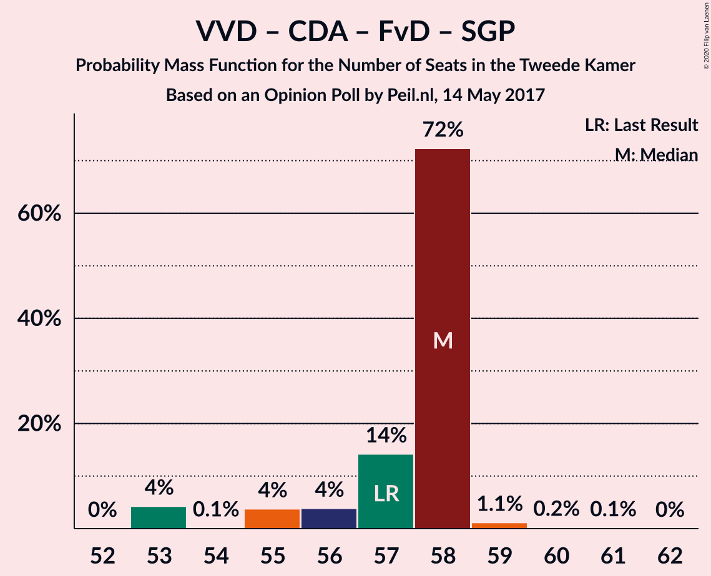

| Number of Seats | Probability | Accumulated | Special Marks |
|:---------------:|:-----------:|:-----------:|:-------------:|
| 53 | 0.2% | 100% |  |
| 54 | 1.3% | 99.8% |  |
| 55 | 6% | 98% |  |
| 56 | 1.4% | 92% |  |
| 57 | 5% | 91% | Last Result |
| 58 | 70% | 86% | Median |
| 59 | 14% | 16% |  |
| 60 | 1.2% | 2% |  |
| 61 | 0.1% | 1.1% |  |
| 62 | 0.9% | 1.0% |  |
| 63 | 0.1% | 0.1% |  |
| 64 | 0% | 0% |  |

### Volkspartij voor Vrijheid en Democratie – Christen-Democratisch Appèl – Forum voor Democratie

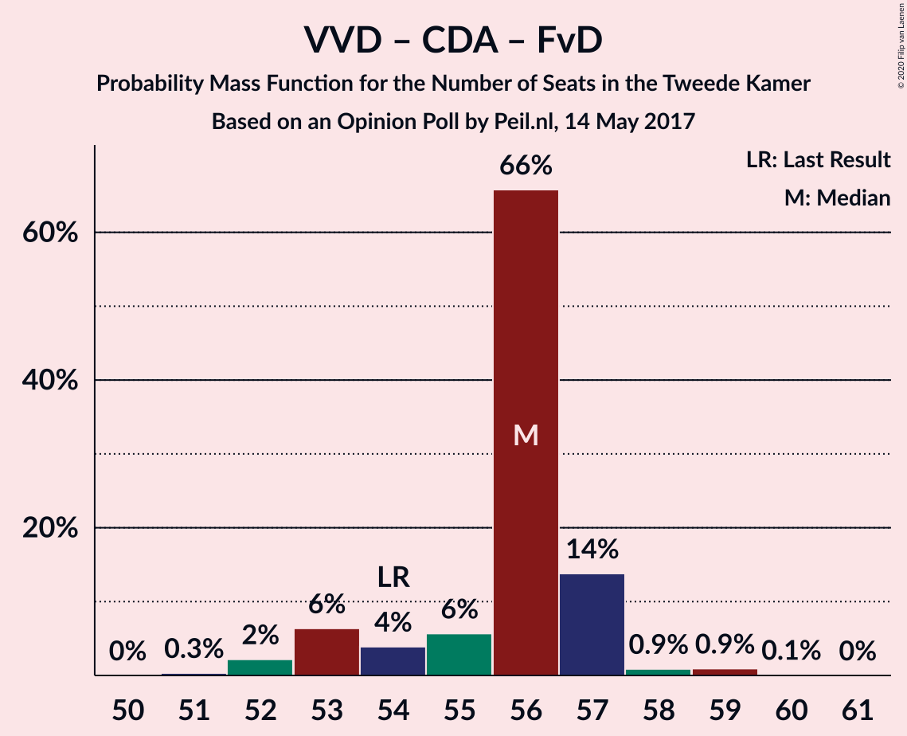

| Number of Seats | Probability | Accumulated | Special Marks |
|:---------------:|:-----------:|:-----------:|:-------------:|
| 51 | 0.3% | 100% |  |
| 52 | 2% | 99.7% |  |
| 53 | 6% | 97% |  |
| 54 | 4% | 91% | Last Result |
| 55 | 6% | 87% |  |
| 56 | 66% | 82% | Median |
| 57 | 14% | 16% |  |
| 58 | 0.9% | 2% |  |
| 59 | 0.9% | 1.0% |  |
| 60 | 0.1% | 0.1% |  |
| 61 | 0% | 0% |  |

### Volkspartij voor Vrijheid en Democratie – Christen-Democratisch Appèl

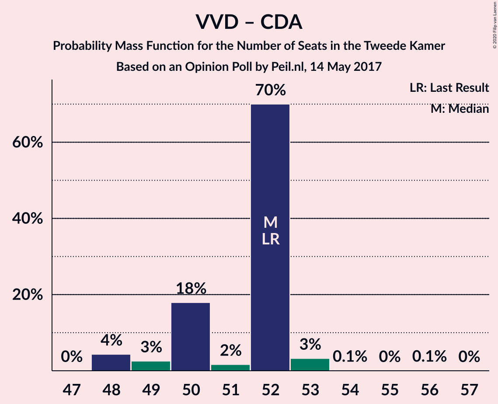

| Number of Seats | Probability | Accumulated | Special Marks |
|:---------------:|:-----------:|:-----------:|:-------------:|
| 47 | 0.9% | 100% |  |
| 48 | 2% | 99.1% |  |
| 49 | 8% | 98% |  |
| 50 | 2% | 89% |  |
| 51 | 6% | 87% |  |
| 52 | 66% | 82% | Last Result, Median |
| 53 | 14% | 16% |  |
| 54 | 0.5% | 2% |  |
| 55 | 1.5% | 2% |  |
| 56 | 0.1% | 0.1% |  |
| 57 | 0% | 0% |  |

### Democraten 66 – Christen-Democratisch Appèl – Partij van de Arbeid

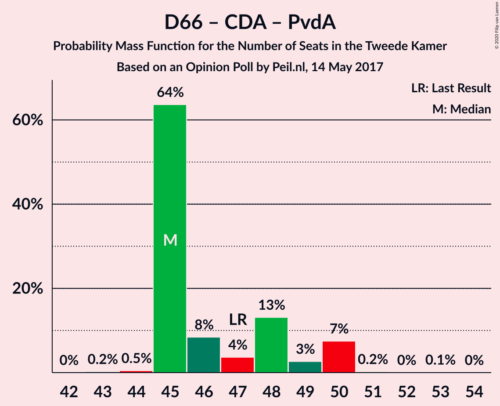

| Number of Seats | Probability | Accumulated | Special Marks |
|:---------------:|:-----------:|:-----------:|:-------------:|
| 43 | 0.2% | 100% |  |
| 44 | 0.5% | 99.8% |  |
| 45 | 64% | 99.3% | Median |
| 46 | 8% | 36% |  |
| 47 | 4% | 27% | Last Result |
| 48 | 13% | 24% |  |
| 49 | 3% | 10% |  |
| 50 | 7% | 8% |  |
| 51 | 0.2% | 0.3% |  |
| 52 | 0% | 0.1% |  |
| 53 | 0.1% | 0.1% |  |
| 54 | 0% | 0% |  |

### Volkspartij voor Vrijheid en Democratie – Partij van de Arbeid

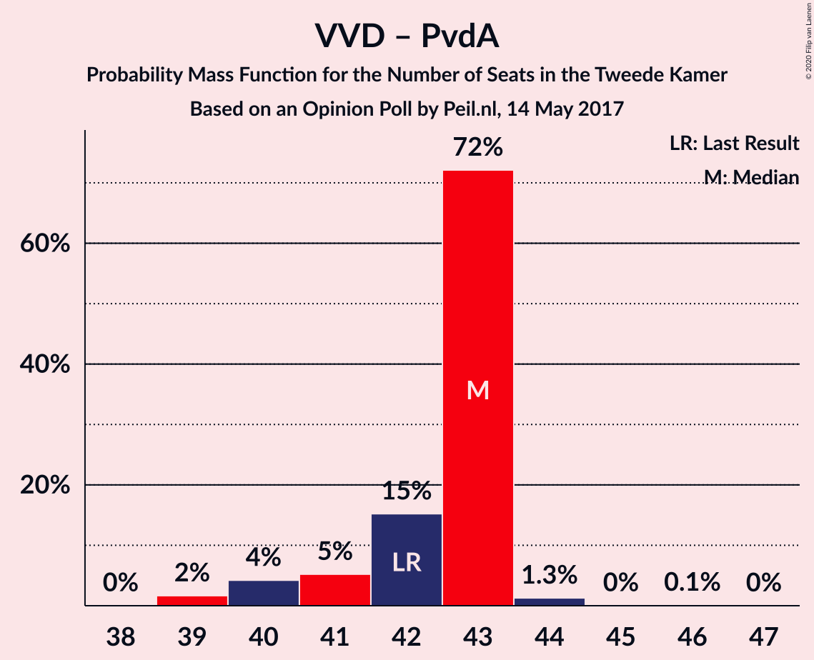

| Number of Seats | Probability | Accumulated | Special Marks |
|:---------------:|:-----------:|:-----------:|:-------------:|
| 38 | 6% | 100% |  |
| 39 | 0.3% | 94% |  |
| 40 | 0.4% | 94% |  |
| 41 | 6% | 93% |  |
| 42 | 6% | 88% | Last Result |
| 43 | 69% | 81% | Median |
| 44 | 0.1% | 12% |  |
| 45 | 1.1% | 12% |  |
| 46 | 11% | 11% |  |
| 47 | 0% | 0% |  |

### Democraten 66 – Christen-Democratisch Appèl

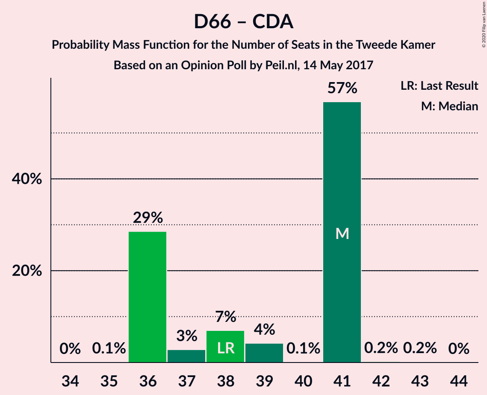

| Number of Seats | Probability | Accumulated | Special Marks |
|:---------------:|:-----------:|:-----------:|:-------------:|
| 35 | 0.3% | 100% |  |
| 36 | 64% | 99.7% | Median |
| 37 | 12% | 36% |  |
| 38 | 5% | 23% | Last Result |
| 39 | 11% | 19% |  |
| 40 | 3% | 8% |  |
| 41 | 5% | 5% |  |
| 42 | 0.1% | 0.1% |  |
| 43 | 0% | 0% |  |

### Christen-Democratisch Appèl – Partij van de Arbeid – ChristenUnie

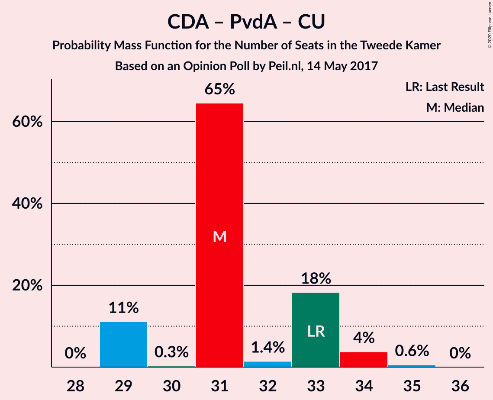

| Number of Seats | Probability | Accumulated | Special Marks |
|:---------------:|:-----------:|:-----------:|:-------------:|
| 27 | 0.2% | 100% |  |
| 28 | 0% | 99.8% |  |
| 29 | 2% | 99.8% |  |
| 30 | 9% | 98% |  |
| 31 | 8% | 89% |  |
| 32 | 65% | 81% | Median |
| 33 | 12% | 17% | Last Result |
| 34 | 1.3% | 5% |  |
| 35 | 4% | 4% |  |
| 36 | 0.1% | 0.1% |  |
| 37 | 0% | 0% |  |

### Christen-Democratisch Appèl – Partij van de Arbeid

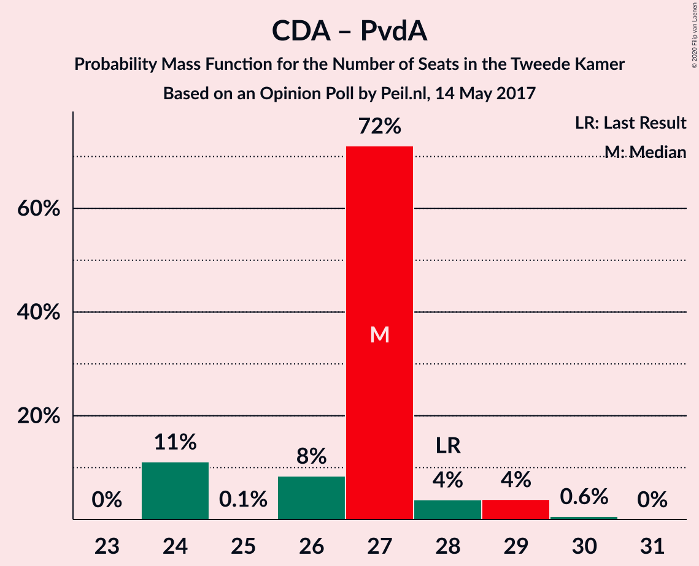

| Number of Seats | Probability | Accumulated | Special Marks |
|:---------------:|:-----------:|:-----------:|:-------------:|
| 24 | 0.7% | 100% |  |
| 25 | 7% | 99.3% |  |
| 26 | 7% | 92% |  |
| 27 | 69% | 85% | Median |
| 28 | 0.7% | 17% | Last Result |
| 29 | 12% | 16% |  |
| 30 | 0.2% | 4% |  |
| 31 | 4% | 4% |  |
| 32 | 0.1% | 0.1% |  |
| 33 | 0% | 0% |  |

## Technical Information

### Opinion Poll

+ **Polling firm:** Peil.nl
+ **Commissioner(s):** —
+ **Fieldwork period:** 14 May 2017

### Calculations

+ **Sample size:** 3000
+ **Simulations done:** 524,288
+ **Error estimate:** 1.05%

