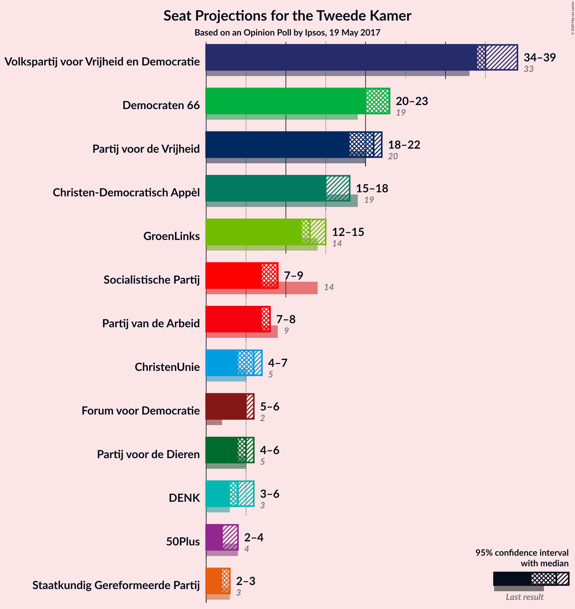
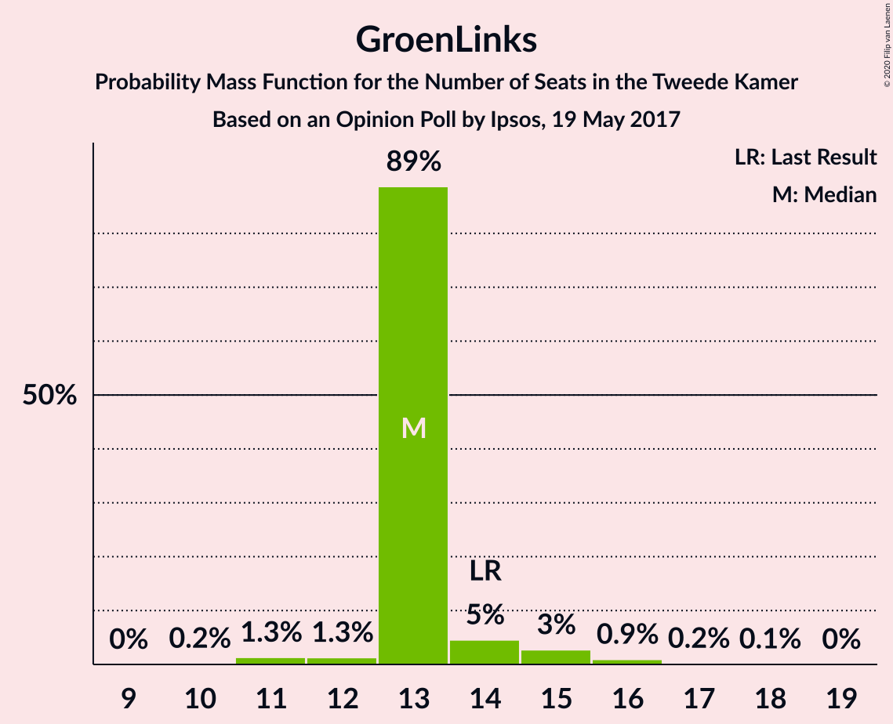
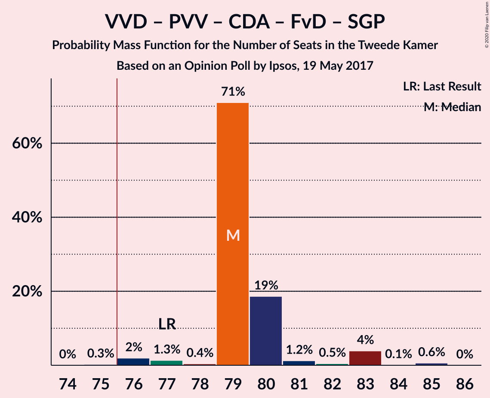
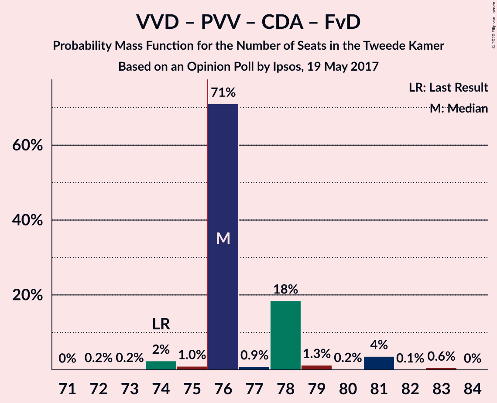
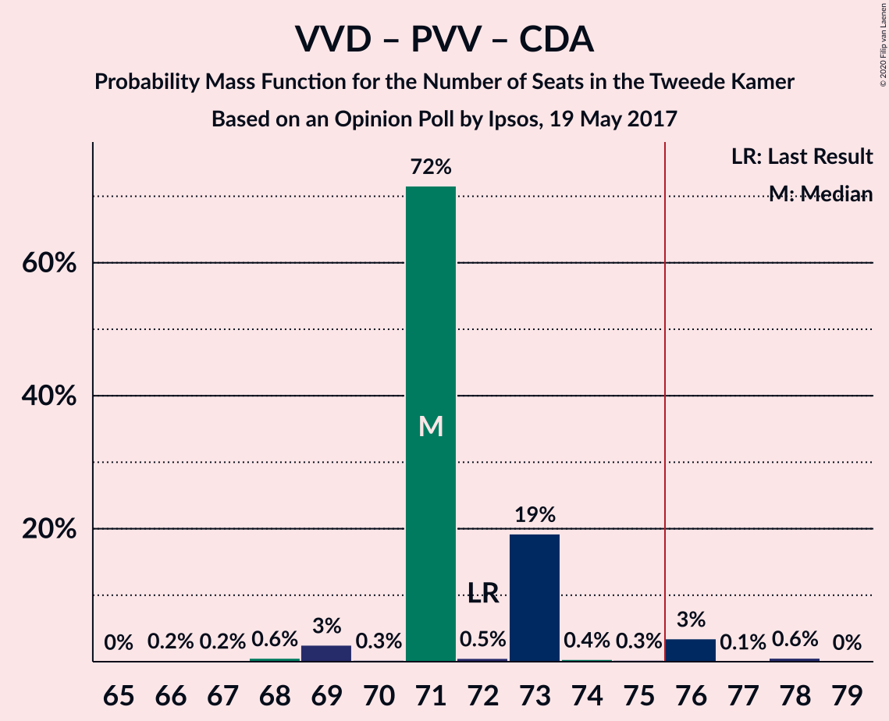
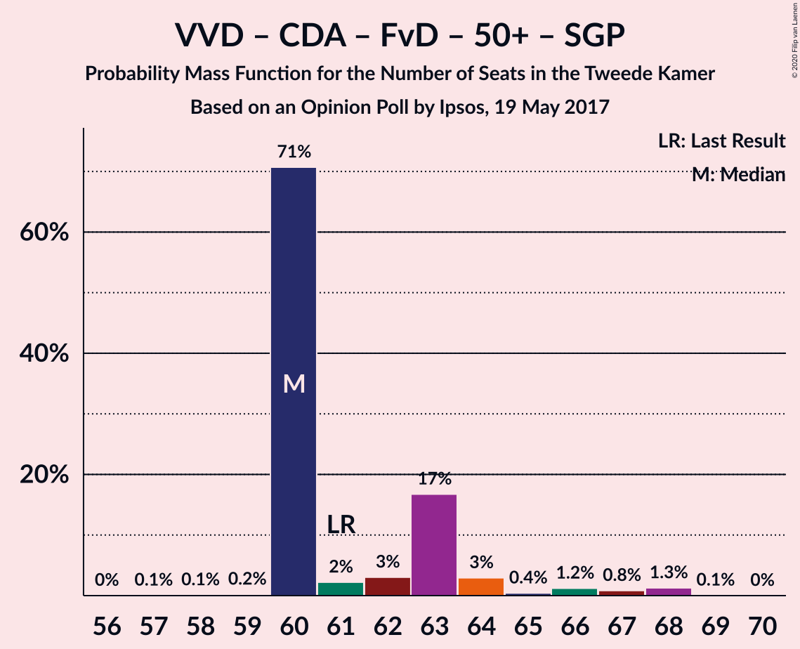

# Opinion Poll by Ipsos, 19 May 2017

<a href="#voting-intentions">Voting Intentions</a> | <a href="#seats">Seats</a> | <a href="#coalitions">Coalitions</a> | <a href="#technical-information">Technical Information</a>

## Voting Intentions

### Confidence Intervals

| Party | Last Result | Poll Result | 80% Confidence Interval | 90% Confidence Interval | 95% Confidence Interval | 99% Confidence Interval |
|:-----:|:-----------:|:-----------:|:-----------------------:|:-----------------------:|:-----------------------:|:-----------------------:|
| Volkspartij voor Vrijheid en Democratie | 21.3% | 23.6% | 21.9–25.4% |21.5–25.9% |21.1–26.3% |20.3–27.2% |
| Democraten 66 | 12.2% | 13.9% | 12.6–15.4% |12.2–15.8% |11.9–16.2% |11.3–16.9% |
| Partij voor de Vrijheid | 13.1% | 12.9% | 11.6–14.4% |11.3–14.8% |11.0–15.1% |10.4–15.9% |
| Christen-Democratisch Appèl | 12.4% | 10.7% | 9.5–12.1% |9.2–12.4% |8.9–12.8% |8.4–13.5% |
| GroenLinks | 9.1% | 9.2% | 8.1–10.5% |7.8–10.8% |7.6–11.2% |7.1–11.8% |
| Socialistische Partij | 9.1% | 5.7% | 4.9–6.8% |4.6–7.1% |4.4–7.3% |4.1–7.9% |
| Partij van de Arbeid | 5.7% | 4.9% | 4.1–5.9% |3.9–6.2% |3.7–6.4% |3.4–6.9% |
| ChristenUnie | 3.4% | 3.9% | 3.2–4.8% |3.0–5.1% |2.9–5.3% |2.6–5.8% |
| Forum voor Democratie | 1.8% | 3.7% | 3.0–4.6% |2.9–4.8% |2.7–5.1% |2.4–5.5% |
| Partij voor de Dieren | 3.2% | 3.3% | 2.7–4.1% |2.5–4.4% |2.4–4.6% |2.1–5.0% |
| DENK | 2.1% | 3.0% | 2.4–3.8% |2.2–4.1% |2.1–4.3% |1.9–4.7% |
| 50Plus | 3.1% | 2.1% | 1.6–2.8% |1.5–3.0% |1.4–3.2% |1.2–3.6% |
| Staatkundig Gereformeerde Partij | 2.1% | 1.9% | 1.4–2.6% |1.3–2.8% |1.2–3.0% |1.0–3.3% |

*Note:* The poll result column reflects the actual value used in the calculations. Published results may vary slightly, and in addition be rounded to fewer digits.

## Seats

### Confidence Intervals

| Party | Last Result | Median | 80% Confidence Interval | 90% Confidence Interval | 95% Confidence Interval | 99% Confidence Interval |
|:-----:|:-----------:|:------:|:-----------------------:|:-----------------------:|:-----------------------:|:-----------------------:|
| <a href="#volkspartij-voor-vrijheid-en-democratie">Volkspartij voor Vrijheid en Democratie</a> | 33 | 36 | 34–39 |32–39 |31–40 |31–41 |
| <a href="#democraten-66">Democraten 66</a> | 19 | 23 | 19–24 |18–25 |17–25 |16–26 |
| <a href="#partij-voor-de-vrijheid">Partij voor de Vrijheid</a> | 20 | 18 | 17–21 |17–23 |17–23 |16–24 |
| <a href="#christen-democratisch-appèl">Christen-Democratisch Appèl</a> | 19 | 15 | 13–18 |13–19 |13–19 |13–20 |
| <a href="#groenlinks">GroenLinks</a> | 14 | 16 | 11–16 |11–18 |11–18 |10–18 |
| <a href="#socialistische-partij">Socialistische Partij</a> | 14 | 8 | 6–9 |6–10 |6–12 |5–12 |
| <a href="#partij-van-de-arbeid">Partij van de Arbeid</a> | 9 | 7 | 6–9 |5–9 |5–10 |5–10 |
| <a href="#christenunie">ChristenUnie</a> | 5 | 5 | 5–7 |4–7 |3–9 |3–9 |
| <a href="#forum-voor-democratie">Forum voor Democratie</a> | 2 | 6 | 5–6 |4–7 |4–8 |3–9 |
| <a href="#partij-voor-de-dieren">Partij voor de Dieren</a> | 5 | 4 | 3–6 |3–6 |3–7 |2–7 |
| <a href="#denk">DENK</a> | 3 | 5 | 3–6 |3–6 |2–6 |2–6 |
| <a href="#50plus">50Plus</a> | 4 | 2 | 2–3 |2–4 |1–4 |1–5 |
| <a href="#staatkundig-gereformeerde-partij">Staatkundig Gereformeerde Partij</a> | 3 | 2 | 1–4 |1–4 |1–4 |1–5 |

### Volkspartij voor Vrijheid en Democratie

*For a full overview of the results for this party, see the [Volkspartij voor Vrijheid en Democratie](party-volkspartijvoorvrijheidendemocratie.html) page.*

| Number of Seats | Probability | Accumulated | Special Marks |
|:---------------:|:-----------:|:-----------:|:-------------:|
| 29 | 0.4% | 100% |  |
| 30 | 0.1% | 99.6% |  |
| 31 | 3% | 99.6% |  |
| 32 | 4% | 97% |  |
| 33 | 1.5% | 93% | Last Result |
| 34 | 7% | 91% |  |
| 35 | 12% | 85% |  |
| 36 | 42% | 73% | Median |
| 37 | 4% | 32% |  |
| 38 | 10% | 27% |  |
| 39 | 12% | 17% |  |
| 40 | 4% | 5% |  |
| 41 | 1.1% | 1.3% |  |
| 42 | 0.1% | 0.2% |  |
| 43 | 0.1% | 0.1% |  |
| 44 | 0% | 0% |  |

### Democraten 66

*For a full overview of the results for this party, see the [Democraten 66](party-democraten66.html) page.*

| Number of Seats | Probability | Accumulated | Special Marks |
|:---------------:|:-----------:|:-----------:|:-------------:|
| 15 | 0.3% | 100% |  |
| 16 | 1.4% | 99.7% |  |
| 17 | 3% | 98% |  |
| 18 | 2% | 95% |  |
| 19 | 3% | 93% | Last Result |
| 20 | 1.0% | 90% |  |
| 21 | 7% | 89% |  |
| 22 | 26% | 82% |  |
| 23 | 44% | 56% | Median |
| 24 | 5% | 13% |  |
| 25 | 7% | 8% |  |
| 26 | 0.5% | 0.5% |  |
| 27 | 0% | 0% |  |

### Partij voor de Vrijheid

*For a full overview of the results for this party, see the [Partij voor de Vrijheid](party-partijvoordevrijheid.html) page.*

| Number of Seats | Probability | Accumulated | Special Marks |
|:---------------:|:-----------:|:-----------:|:-------------:|
| 15 | 0.1% | 100% |  |
| 16 | 2% | 99.9% |  |
| 17 | 11% | 98% |  |
| 18 | 48% | 87% | Median |
| 19 | 7% | 39% |  |
| 20 | 12% | 32% | Last Result |
| 21 | 12% | 20% |  |
| 22 | 2% | 8% |  |
| 23 | 4% | 5% |  |
| 24 | 1.0% | 1.0% |  |
| 25 | 0% | 0.1% |  |
| 26 | 0% | 0% |  |

### Christen-Democratisch Appèl

*For a full overview of the results for this party, see the [Christen-Democratisch Appèl](party-christen-democratischappèl.html) page.*

| Number of Seats | Probability | Accumulated | Special Marks |
|:---------------:|:-----------:|:-----------:|:-------------:|
| 12 | 0.5% | 100% |  |
| 13 | 11% | 99.5% |  |
| 14 | 9% | 89% |  |
| 15 | 44% | 79% | Median |
| 16 | 4% | 35% |  |
| 17 | 13% | 31% |  |
| 18 | 9% | 18% |  |
| 19 | 8% | 9% | Last Result |
| 20 | 1.1% | 1.2% |  |
| 21 | 0.1% | 0.1% |  |
| 22 | 0% | 0% |  |

### GroenLinks

*For a full overview of the results for this party, see the [GroenLinks](party-groenlinks.html) page.*

| Number of Seats | Probability | Accumulated | Special Marks |
|:---------------:|:-----------:|:-----------:|:-------------:|
| 10 | 1.1% | 100% |  |
| 11 | 10% | 98.8% |  |
| 12 | 4% | 89% |  |
| 13 | 8% | 85% |  |
| 14 | 17% | 77% | Last Result |
| 15 | 6% | 61% |  |
| 16 | 48% | 55% | Median |
| 17 | 0.7% | 7% |  |
| 18 | 7% | 7% |  |
| 19 | 0.1% | 0.1% |  |
| 20 | 0% | 0% |  |

### Socialistische Partij

*For a full overview of the results for this party, see the [Socialistische Partij](party-socialistischepartij.html) page.*

| Number of Seats | Probability | Accumulated | Special Marks |
|:---------------:|:-----------:|:-----------:|:-------------:|
| 5 | 2% | 100% |  |
| 6 | 9% | 98% |  |
| 7 | 19% | 89% |  |
| 8 | 56% | 70% | Median |
| 9 | 6% | 14% |  |
| 10 | 4% | 8% |  |
| 11 | 0.7% | 3% |  |
| 12 | 2% | 3% |  |
| 13 | 0.2% | 0.2% |  |
| 14 | 0% | 0% | Last Result |

### Partij van de Arbeid

*For a full overview of the results for this party, see the [Partij van de Arbeid](party-partijvandearbeid.html) page.*

| Number of Seats | Probability | Accumulated | Special Marks |
|:---------------:|:-----------:|:-----------:|:-------------:|
| 4 | 0.4% | 100% |  |
| 5 | 5% | 99.6% |  |
| 6 | 16% | 95% |  |
| 7 | 48% | 79% | Median |
| 8 | 21% | 31% |  |
| 9 | 7% | 10% | Last Result |
| 10 | 2% | 3% |  |
| 11 | 0.3% | 0.3% |  |
| 12 | 0% | 0% |  |

### ChristenUnie

*For a full overview of the results for this party, see the [ChristenUnie](party-christenunie.html) page.*

| Number of Seats | Probability | Accumulated | Special Marks |
|:---------------:|:-----------:|:-----------:|:-------------:|
| 3 | 5% | 100% |  |
| 4 | 5% | 95% |  |
| 5 | 57% | 90% | Last Result, Median |
| 6 | 21% | 34% |  |
| 7 | 8% | 12% |  |
| 8 | 0.8% | 4% |  |
| 9 | 3% | 3% |  |
| 10 | 0% | 0% |  |

### Forum voor Democratie

*For a full overview of the results for this party, see the [Forum voor Democratie](party-forumvoordemocratie.html) page.*

| Number of Seats | Probability | Accumulated | Special Marks |
|:---------------:|:-----------:|:-----------:|:-------------:|
| 2 | 0% | 100% | Last Result |
| 3 | 2% | 100% |  |
| 4 | 3% | 98% |  |
| 5 | 12% | 95% |  |
| 6 | 74% | 82% | Median |
| 7 | 3% | 8% |  |
| 8 | 3% | 5% |  |
| 9 | 2% | 2% |  |
| 10 | 0% | 0% |  |

### Partij voor de Dieren

*For a full overview of the results for this party, see the [Partij voor de Dieren](party-partijvoordedieren.html) page.*

| Number of Seats | Probability | Accumulated | Special Marks |
|:---------------:|:-----------:|:-----------:|:-------------:|
| 2 | 0.9% | 100% |  |
| 3 | 15% | 99.1% |  |
| 4 | 51% | 84% | Median |
| 5 | 15% | 34% | Last Result |
| 6 | 14% | 19% |  |
| 7 | 5% | 5% |  |
| 8 | 0.1% | 0.1% |  |
| 9 | 0% | 0% |  |

### DENK

*For a full overview of the results for this party, see the [DENK](party-denk.html) page.*

| Number of Seats | Probability | Accumulated | Special Marks |
|:---------------:|:-----------:|:-----------:|:-------------:|
| 2 | 4% | 100% |  |
| 3 | 13% | 96% | Last Result |
| 4 | 9% | 82% |  |
| 5 | 26% | 73% | Median |
| 6 | 47% | 47% |  |
| 7 | 0.4% | 0.4% |  |
| 8 | 0% | 0% |  |

### 50Plus

*For a full overview of the results for this party, see the [50Plus](party-50plus.html) page.*

| Number of Seats | Probability | Accumulated | Special Marks |
|:---------------:|:-----------:|:-----------:|:-------------:|
| 1 | 3% | 100% |  |
| 2 | 62% | 97% | Median |
| 3 | 27% | 35% |  |
| 4 | 6% | 8% | Last Result |
| 5 | 2% | 2% |  |
| 6 | 0.1% | 0.1% |  |
| 7 | 0% | 0% |  |

### Staatkundig Gereformeerde Partij

*For a full overview of the results for this party, see the [Staatkundig Gereformeerde Partij](party-staatkundiggereformeerdepartij.html) page.*

| Number of Seats | Probability | Accumulated | Special Marks |
|:---------------:|:-----------:|:-----------:|:-------------:|
| 1 | 11% | 100% |  |
| 2 | 61% | 89% | Median |
| 3 | 17% | 28% | Last Result |
| 4 | 9% | 10% |  |
| 5 | 1.0% | 1.1% |  |
| 6 | 0.1% | 0.1% |  |
| 7 | 0% | 0% |  |

## Coalitions

### Confidence Intervals

| Coalition | Last Result | Median | Majority? | 80% Confidence Interval | 90% Confidence Interval | 95% Confidence Interval | 99% Confidence Interval |
|:---------:|:-----------:|:------:|:---------:|:-----------------------:|:-----------------------:|:-----------------------:|:-----------------------:|
| Volkspartij voor Vrijheid en Democratie – Democraten 66 – Christen-Democratisch Appèl – GroenLinks – ChristenUnie | 90 | 95 | 100% | 90–97 | 89–99 | 89–100 | 87–100 |
| Volkspartij voor Vrijheid en Democratie – Democraten 66 – Christen-Democratisch Appèl – Partij van de Arbeid – ChristenUnie | 85 | 86 | 100% | 84–91 | 82–91 | 80–92 | 80–92 |
| Volkspartij voor Vrijheid en Democratie – Democraten 66 – Christen-Democratisch Appèl – ChristenUnie | 76 | 79 | 93% | 76–83 | 75–85 | 74–86 | 73–86 |
| Volkspartij voor Vrijheid en Democratie – Partij voor de Vrijheid – Christen-Democratisch Appèl – Forum voor Democratie – Staatkundig Gereformeerde Partij | 77 | 77 | 97% | 77–83 | 76–83 | 75–85 | 75–87 |
| Volkspartij voor Vrijheid en Democratie – Partij voor de Vrijheid – Christen-Democratisch Appèl – Forum voor Democratie | 74 | 75 | 46% | 75–80 | 74–81 | 73–82 | 72–85 |
| Volkspartij voor Vrijheid en Democratie – Democraten 66 – Christen-Democratisch Appèl | 71 | 74 | 24% | 71–78 | 69–79 | 68–80 | 66–80 |
| Democraten 66 – Christen-Democratisch Appèl – GroenLinks – Socialistische Partij – Partij van de Arbeid – ChristenUnie | 80 | 74 | 6% | 70–75 | 67–76 | 67–78 | 66–81 |
| Volkspartij voor Vrijheid en Democratie – Partij voor de Vrijheid – Christen-Democratisch Appèl | 72 | 69 | 3% | 69–74 | 67–75 | 67–76 | 66–79 |
| Volkspartij voor Vrijheid en Democratie – Democraten 66 – Partij van de Arbeid | 61 | 66 | 0% | 62–68 | 60–69 | 58–70 | 58–71 |
| Democraten 66 – Christen-Democratisch Appèl – GroenLinks – Partij van de Arbeid – ChristenUnie | 66 | 66 | 0% | 61–67 | 61–68 | 60–69 | 58–72 |
| Volkspartij voor Vrijheid en Democratie – Christen-Democratisch Appèl – Forum voor Democratie – 50Plus – Staatkundig Gereformeerde Partij | 61 | 61 | 0% | 59–67 | 58–68 | 56–68 | 56–68 |
| Volkspartij voor Vrijheid en Democratie – Christen-Democratisch Appèl – Forum voor Democratie – 50Plus | 58 | 59 | 0% | 57–64 | 56–66 | 54–67 | 54–67 |
| Volkspartij voor Vrijheid en Democratie – Christen-Democratisch Appèl – Forum voor Democratie – Staatkundig Gereformeerde Partij | 57 | 59 | 0% | 56–65 | 56–65 | 54–66 | 53–66 |
| Volkspartij voor Vrijheid en Democratie – Christen-Democratisch Appèl – Partij van de Arbeid | 61 | 58 | 0% | 57–64 | 54–65 | 53–65 | 52–65 |
| Volkspartij voor Vrijheid en Democratie – Christen-Democratisch Appèl – Forum voor Democratie | 54 | 57 | 0% | 55–62 | 53–63 | 52–64 | 51–64 |
| Volkspartij voor Vrijheid en Democratie – Christen-Democratisch Appèl | 52 | 51 | 0% | 49–56 | 48–57 | 46–58 | 46–58 |
| Democraten 66 – Christen-Democratisch Appèl – Partij van de Arbeid | 47 | 45 | 0% | 42–48 | 41–49 | 40–50 | 38–50 |
| Volkspartij voor Vrijheid en Democratie – Partij van de Arbeid | 42 | 43 | 0% | 40–46 | 40–48 | 38–48 | 37–50 |
| Democraten 66 – Christen-Democratisch Appèl | 38 | 38 | 0% | 35–41 | 34–41 | 33–42 | 32–44 |
| Christen-Democratisch Appèl – Partij van de Arbeid – ChristenUnie | 33 | 27 | 0% | 26–31 | 26–32 | 26–33 | 24–35 |
| Christen-Democratisch Appèl – Partij van de Arbeid | 28 | 22 | 0% | 21–26 | 20–27 | 19–27 | 18–29 |

### Volkspartij voor Vrijheid en Democratie – Democraten 66 – Christen-Democratisch Appèl – GroenLinks – ChristenUnie

| Number of Seats | Probability | Accumulated | Special Marks |
|:---------------:|:-----------:|:-----------:|:-------------:|
| 85 | 0% | 100% |  |
| 86 | 0.3% | 99.9% |  |
| 87 | 1.0% | 99.7% |  |
| 88 | 0.4% | 98.7% |  |
| 89 | 5% | 98% |  |
| 90 | 9% | 93% | Last Result |
| 91 | 1.2% | 85% |  |
| 92 | 7% | 83% |  |
| 93 | 9% | 77% |  |
| 94 | 7% | 68% |  |
| 95 | 37% | 60% | Median |
| 96 | 2% | 23% |  |
| 97 | 12% | 21% |  |
| 98 | 0.3% | 9% |  |
| 99 | 5% | 8% |  |
| 100 | 3% | 3% |  |
| 101 | 0.1% | 0.1% |  |
| 102 | 0% | 0% |  |

### Volkspartij voor Vrijheid en Democratie – Democraten 66 – Christen-Democratisch Appèl – Partij van de Arbeid – ChristenUnie

| Number of Seats | Probability | Accumulated | Special Marks |
|:---------------:|:-----------:|:-----------:|:-------------:|
| 77 | 0.1% | 100% |  |
| 78 | 0.1% | 99.9% |  |
| 79 | 0.2% | 99.8% |  |
| 80 | 3% | 99.6% |  |
| 81 | 0.6% | 97% |  |
| 82 | 3% | 96% |  |
| 83 | 0.8% | 93% |  |
| 84 | 7% | 92% |  |
| 85 | 4% | 85% | Last Result |
| 86 | 43% | 81% | Median |
| 87 | 13% | 37% |  |
| 88 | 1.3% | 24% |  |
| 89 | 4% | 23% |  |
| 90 | 6% | 19% |  |
| 91 | 9% | 13% |  |
| 92 | 3% | 3% |  |
| 93 | 0.3% | 0.4% |  |
| 94 | 0% | 0.1% |  |
| 95 | 0% | 0% |  |

### Volkspartij voor Vrijheid en Democratie – Democraten 66 – Christen-Democratisch Appèl – ChristenUnie

| Number of Seats | Probability | Accumulated | Special Marks |
|:---------------:|:-----------:|:-----------:|:-------------:|
| 69 | 0.1% | 100% |  |
| 70 | 0.1% | 99.9% |  |
| 71 | 0% | 99.8% |  |
| 72 | 0.2% | 99.8% |  |
| 73 | 2% | 99.6% |  |
| 74 | 3% | 98% |  |
| 75 | 3% | 95% |  |
| 76 | 5% | 93% | Last Result, Majority |
| 77 | 4% | 88% |  |
| 78 | 6% | 84% |  |
| 79 | 44% | 78% | Median |
| 80 | 5% | 34% |  |
| 81 | 11% | 29% |  |
| 82 | 5% | 18% |  |
| 83 | 4% | 13% |  |
| 84 | 1.0% | 8% |  |
| 85 | 5% | 7% |  |
| 86 | 2% | 3% |  |
| 87 | 0.1% | 0.1% |  |
| 88 | 0% | 0% |  |

### Volkspartij voor Vrijheid en Democratie – Partij voor de Vrijheid – Christen-Democratisch Appèl – Forum voor Democratie – Staatkundig Gereformeerde Partij

| Number of Seats | Probability | Accumulated | Special Marks |
|:---------------:|:-----------:|:-----------:|:-------------:|
| 73 | 0.3% | 100% |  |
| 74 | 0.2% | 99.7% |  |
| 75 | 2% | 99.6% |  |
| 76 | 5% | 97% | Majority |
| 77 | 46% | 92% | Last Result, Median |
| 78 | 4% | 47% |  |
| 79 | 3% | 42% |  |
| 80 | 9% | 39% |  |
| 81 | 9% | 30% |  |
| 82 | 8% | 21% |  |
| 83 | 9% | 13% |  |
| 84 | 1.1% | 4% |  |
| 85 | 1.0% | 3% |  |
| 86 | 0.9% | 2% |  |
| 87 | 0.9% | 1.0% |  |
| 88 | 0.1% | 0.1% |  |
| 89 | 0% | 0% |  |

### Volkspartij voor Vrijheid en Democratie – Partij voor de Vrijheid – Christen-Democratisch Appèl – Forum voor Democratie

| Number of Seats | Probability | Accumulated | Special Marks |
|:---------------:|:-----------:|:-----------:|:-------------:|
| 70 | 0% | 100% |  |
| 71 | 0.3% | 99.9% |  |
| 72 | 0.2% | 99.6% |  |
| 73 | 2% | 99.4% |  |
| 74 | 3% | 97% | Last Result |
| 75 | 49% | 94% | Median |
| 76 | 6% | 46% | Majority |
| 77 | 6% | 40% |  |
| 78 | 8% | 33% |  |
| 79 | 12% | 25% |  |
| 80 | 5% | 13% |  |
| 81 | 6% | 9% |  |
| 82 | 0.6% | 3% |  |
| 83 | 0.4% | 2% |  |
| 84 | 0.8% | 2% |  |
| 85 | 1.0% | 1.0% |  |
| 86 | 0% | 0% |  |

### Volkspartij voor Vrijheid en Democratie – Democraten 66 – Christen-Democratisch Appèl

| Number of Seats | Probability | Accumulated | Special Marks |
|:---------------:|:-----------:|:-----------:|:-------------:|
| 64 | 0.1% | 100% |  |
| 65 | 0.1% | 99.9% |  |
| 66 | 0.4% | 99.8% |  |
| 67 | 0.1% | 99.4% |  |
| 68 | 2% | 99.3% |  |
| 69 | 4% | 97% |  |
| 70 | 3% | 94% |  |
| 71 | 7% | 90% | Last Result |
| 72 | 4% | 83% |  |
| 73 | 7% | 80% |  |
| 74 | 46% | 72% | Median |
| 75 | 2% | 26% |  |
| 76 | 7% | 24% | Majority |
| 77 | 5% | 17% |  |
| 78 | 4% | 12% |  |
| 79 | 3% | 8% |  |
| 80 | 4% | 5% |  |
| 81 | 0% | 0.2% |  |
| 82 | 0% | 0.1% |  |
| 83 | 0.1% | 0.1% |  |
| 84 | 0% | 0% |  |

### Democraten 66 – Christen-Democratisch Appèl – GroenLinks – Socialistische Partij – Partij van de Arbeid – ChristenUnie

| Number of Seats | Probability | Accumulated | Special Marks |
|:---------------:|:-----------:|:-----------:|:-------------:|
| 64 | 0.1% | 100% |  |
| 65 | 0.3% | 99.9% |  |
| 66 | 1.0% | 99.6% |  |
| 67 | 5% | 98.7% |  |
| 68 | 2% | 94% |  |
| 69 | 0.9% | 92% |  |
| 70 | 5% | 91% |  |
| 71 | 4% | 86% |  |
| 72 | 8% | 82% |  |
| 73 | 10% | 74% |  |
| 74 | 51% | 63% | Median |
| 75 | 6% | 13% |  |
| 76 | 3% | 6% | Majority |
| 77 | 0.6% | 3% |  |
| 78 | 1.4% | 3% |  |
| 79 | 0.1% | 1.3% |  |
| 80 | 0.6% | 1.1% | Last Result |
| 81 | 0.5% | 0.6% |  |
| 82 | 0% | 0% |  |

### Volkspartij voor Vrijheid en Democratie – Partij voor de Vrijheid – Christen-Democratisch Appèl

| Number of Seats | Probability | Accumulated | Special Marks |
|:---------------:|:-----------:|:-----------:|:-------------:|
| 64 | 0% | 100% |  |
| 65 | 0.1% | 99.9% |  |
| 66 | 0.4% | 99.8% |  |
| 67 | 4% | 99.5% |  |
| 68 | 2% | 95% |  |
| 69 | 50% | 93% | Median |
| 70 | 4% | 44% |  |
| 71 | 3% | 40% |  |
| 72 | 9% | 37% | Last Result |
| 73 | 8% | 28% |  |
| 74 | 12% | 20% |  |
| 75 | 6% | 9% |  |
| 76 | 0.3% | 3% | Majority |
| 77 | 0.4% | 2% |  |
| 78 | 1.1% | 2% |  |
| 79 | 0.8% | 0.9% |  |
| 80 | 0.1% | 0.1% |  |
| 81 | 0.1% | 0.1% |  |
| 82 | 0% | 0% |  |

### Volkspartij voor Vrijheid en Democratie – Democraten 66 – Partij van de Arbeid

| Number of Seats | Probability | Accumulated | Special Marks |
|:---------------:|:-----------:|:-----------:|:-------------:|
| 56 | 0.2% | 100% |  |
| 57 | 0.2% | 99.8% |  |
| 58 | 3% | 99.6% |  |
| 59 | 0.9% | 96% |  |
| 60 | 0.6% | 95% |  |
| 61 | 2% | 95% | Last Result |
| 62 | 5% | 93% |  |
| 63 | 4% | 87% |  |
| 64 | 2% | 84% |  |
| 65 | 13% | 81% |  |
| 66 | 41% | 68% | Median |
| 67 | 6% | 27% |  |
| 68 | 11% | 21% |  |
| 69 | 6% | 10% |  |
| 70 | 4% | 4% |  |
| 71 | 0.7% | 0.9% |  |
| 72 | 0% | 0.1% |  |
| 73 | 0% | 0.1% |  |
| 74 | 0.1% | 0.1% |  |
| 75 | 0% | 0% |  |

### Democraten 66 – Christen-Democratisch Appèl – GroenLinks – Partij van de Arbeid – ChristenUnie

| Number of Seats | Probability | Accumulated | Special Marks |
|:---------------:|:-----------:|:-----------:|:-------------:|
| 54 | 0.1% | 100% |  |
| 55 | 0% | 99.9% |  |
| 56 | 0% | 99.9% |  |
| 57 | 0.1% | 99.9% |  |
| 58 | 2% | 99.8% |  |
| 59 | 0.5% | 98% |  |
| 60 | 0.6% | 98% |  |
| 61 | 7% | 97% |  |
| 62 | 7% | 90% |  |
| 63 | 5% | 83% |  |
| 64 | 6% | 78% |  |
| 65 | 2% | 72% |  |
| 66 | 50% | 71% | Last Result, Median |
| 67 | 14% | 21% |  |
| 68 | 2% | 7% |  |
| 69 | 3% | 5% |  |
| 70 | 0.7% | 2% |  |
| 71 | 1.0% | 2% |  |
| 72 | 0.3% | 0.6% |  |
| 73 | 0.3% | 0.3% |  |
| 74 | 0% | 0% |  |

### Volkspartij voor Vrijheid en Democratie – Christen-Democratisch Appèl – Forum voor Democratie – 50Plus – Staatkundig Gereformeerde Partij

| Number of Seats | Probability | Accumulated | Special Marks |
|:---------------:|:-----------:|:-----------:|:-------------:|
| 55 | 0.4% | 100% |  |
| 56 | 3% | 99.6% |  |
| 57 | 0.5% | 97% |  |
| 58 | 4% | 96% |  |
| 59 | 3% | 92% |  |
| 60 | 1.1% | 89% |  |
| 61 | 39% | 88% | Last Result, Median |
| 62 | 13% | 49% |  |
| 63 | 4% | 36% |  |
| 64 | 9% | 32% |  |
| 65 | 4% | 24% |  |
| 66 | 6% | 20% |  |
| 67 | 5% | 14% |  |
| 68 | 9% | 9% |  |
| 69 | 0.2% | 0.4% |  |
| 70 | 0.1% | 0.2% |  |
| 71 | 0.1% | 0.1% |  |
| 72 | 0% | 0% |  |

### Volkspartij voor Vrijheid en Democratie – Christen-Democratisch Appèl – Forum voor Democratie – 50Plus

| Number of Seats | Probability | Accumulated | Special Marks |
|:---------------:|:-----------:|:-----------:|:-------------:|
| 53 | 0.5% | 100% |  |
| 54 | 3% | 99.5% |  |
| 55 | 1.2% | 97% |  |
| 56 | 2% | 96% |  |
| 57 | 4% | 93% |  |
| 58 | 2% | 89% | Last Result |
| 59 | 39% | 87% | Median |
| 60 | 15% | 48% |  |
| 61 | 9% | 33% |  |
| 62 | 8% | 25% |  |
| 63 | 4% | 17% |  |
| 64 | 4% | 13% |  |
| 65 | 4% | 9% |  |
| 66 | 1.2% | 6% |  |
| 67 | 4% | 5% |  |
| 68 | 0.1% | 0.1% |  |
| 69 | 0% | 0% |  |

### Volkspartij voor Vrijheid en Democratie – Christen-Democratisch Appèl – Forum voor Democratie – Staatkundig Gereformeerde Partij

| Number of Seats | Probability | Accumulated | Special Marks |
|:---------------:|:-----------:|:-----------:|:-------------:|
| 52 | 0.4% | 100% |  |
| 53 | 1.2% | 99.6% |  |
| 54 | 2% | 98% |  |
| 55 | 0.3% | 97% |  |
| 56 | 6% | 96% |  |
| 57 | 4% | 90% | Last Result |
| 58 | 1.2% | 86% |  |
| 59 | 45% | 85% | Median |
| 60 | 8% | 39% |  |
| 61 | 5% | 32% |  |
| 62 | 7% | 27% |  |
| 63 | 3% | 20% |  |
| 64 | 5% | 17% |  |
| 65 | 8% | 12% |  |
| 66 | 3% | 4% |  |
| 67 | 0.1% | 0.2% |  |
| 68 | 0% | 0.1% |  |
| 69 | 0% | 0% |  |

### Volkspartij voor Vrijheid en Democratie – Christen-Democratisch Appèl – Partij van de Arbeid

| Number of Seats | Probability | Accumulated | Special Marks |
|:---------------:|:-----------:|:-----------:|:-------------:|
| 52 | 2% | 100% |  |
| 53 | 1.2% | 98% |  |
| 54 | 5% | 97% |  |
| 55 | 1.1% | 92% |  |
| 56 | 0.3% | 90% |  |
| 57 | 5% | 90% |  |
| 58 | 44% | 86% | Median |
| 59 | 16% | 42% |  |
| 60 | 0.9% | 26% |  |
| 61 | 5% | 25% | Last Result |
| 62 | 5% | 20% |  |
| 63 | 0.4% | 15% |  |
| 64 | 9% | 15% |  |
| 65 | 6% | 6% |  |
| 66 | 0.1% | 0.2% |  |
| 67 | 0.1% | 0.2% |  |
| 68 | 0.1% | 0.1% |  |
| 69 | 0% | 0% |  |

### Volkspartij voor Vrijheid en Democratie – Christen-Democratisch Appèl – Forum voor Democratie

| Number of Seats | Probability | Accumulated | Special Marks |
|:---------------:|:-----------:|:-----------:|:-------------:|
| 50 | 0.4% | 100% |  |
| 51 | 0.5% | 99.6% |  |
| 52 | 3% | 99.1% |  |
| 53 | 1.3% | 96% |  |
| 54 | 2% | 95% | Last Result |
| 55 | 8% | 93% |  |
| 56 | 1.3% | 85% |  |
| 57 | 45% | 84% | Median |
| 58 | 14% | 39% |  |
| 59 | 4% | 25% |  |
| 60 | 7% | 21% |  |
| 61 | 2% | 14% |  |
| 62 | 3% | 12% |  |
| 63 | 4% | 9% |  |
| 64 | 4% | 5% |  |
| 65 | 0.1% | 0.1% |  |
| 66 | 0% | 0% |  |

### Volkspartij voor Vrijheid en Democratie – Christen-Democratisch Appèl

| Number of Seats | Probability | Accumulated | Special Marks |
|:---------------:|:-----------:|:-----------:|:-------------:|
| 45 | 0.5% | 100% |  |
| 46 | 3% | 99.5% |  |
| 47 | 2% | 97% |  |
| 48 | 1.3% | 95% |  |
| 49 | 9% | 94% |  |
| 50 | 2% | 85% |  |
| 51 | 46% | 83% | Median |
| 52 | 12% | 37% | Last Result |
| 53 | 3% | 24% |  |
| 54 | 1.5% | 22% |  |
| 55 | 7% | 20% |  |
| 56 | 4% | 13% |  |
| 57 | 4% | 9% |  |
| 58 | 5% | 5% |  |
| 59 | 0.1% | 0.1% |  |
| 60 | 0% | 0% |  |

### Democraten 66 – Christen-Democratisch Appèl – Partij van de Arbeid

| Number of Seats | Probability | Accumulated | Special Marks |
|:---------------:|:-----------:|:-----------:|:-------------:|
| 36 | 0.1% | 100% |  |
| 37 | 0% | 99.9% |  |
| 38 | 0.6% | 99.9% |  |
| 39 | 0.2% | 99.3% |  |
| 40 | 3% | 99.1% |  |
| 41 | 1.4% | 96% |  |
| 42 | 5% | 95% |  |
| 43 | 10% | 89% |  |
| 44 | 12% | 80% |  |
| 45 | 39% | 68% | Median |
| 46 | 5% | 29% |  |
| 47 | 10% | 24% | Last Result |
| 48 | 6% | 14% |  |
| 49 | 3% | 8% |  |
| 50 | 4% | 4% |  |
| 51 | 0.1% | 0.3% |  |
| 52 | 0.1% | 0.2% |  |
| 53 | 0.1% | 0.1% |  |
| 54 | 0% | 0% |  |

### Volkspartij voor Vrijheid en Democratie – Partij van de Arbeid

| Number of Seats | Probability | Accumulated | Special Marks |
|:---------------:|:-----------:|:-----------:|:-------------:|
| 36 | 0.3% | 100% |  |
| 37 | 2% | 99.7% |  |
| 38 | 1.3% | 98% |  |
| 39 | 1.1% | 96% |  |
| 40 | 8% | 95% |  |
| 41 | 7% | 88% |  |
| 42 | 3% | 81% | Last Result |
| 43 | 45% | 78% | Median |
| 44 | 3% | 33% |  |
| 45 | 7% | 30% |  |
| 46 | 15% | 23% |  |
| 47 | 2% | 8% |  |
| 48 | 5% | 6% |  |
| 49 | 0.3% | 1.0% |  |
| 50 | 0.7% | 0.7% |  |
| 51 | 0% | 0% |  |

### Democraten 66 – Christen-Democratisch Appèl

| Number of Seats | Probability | Accumulated | Special Marks |
|:---------------:|:-----------:|:-----------:|:-------------:|
| 30 | 0.1% | 100% |  |
| 31 | 0.3% | 99.9% |  |
| 32 | 0.7% | 99.6% |  |
| 33 | 2% | 98.8% |  |
| 34 | 5% | 97% |  |
| 35 | 11% | 92% |  |
| 36 | 6% | 81% |  |
| 37 | 1.3% | 75% |  |
| 38 | 43% | 74% | Last Result, Median |
| 39 | 11% | 31% |  |
| 40 | 6% | 20% |  |
| 41 | 9% | 14% |  |
| 42 | 4% | 5% |  |
| 43 | 0.3% | 0.9% |  |
| 44 | 0.5% | 0.6% |  |
| 45 | 0.1% | 0.1% |  |
| 46 | 0% | 0% |  |

### Christen-Democratisch Appèl – Partij van de Arbeid – ChristenUnie

| Number of Seats | Probability | Accumulated | Special Marks |
|:---------------:|:-----------:|:-----------:|:-------------:|
| 22 | 0.1% | 100% |  |
| 23 | 0.2% | 99.9% |  |
| 24 | 0.4% | 99.7% |  |
| 25 | 0.5% | 99.3% |  |
| 26 | 9% | 98.8% |  |
| 27 | 50% | 90% | Median |
| 28 | 6% | 40% |  |
| 29 | 8% | 34% |  |
| 30 | 11% | 26% |  |
| 31 | 5% | 15% |  |
| 32 | 7% | 10% |  |
| 33 | 0.8% | 3% | Last Result |
| 34 | 2% | 2% |  |
| 35 | 0.1% | 0.6% |  |
| 36 | 0.4% | 0.4% |  |
| 37 | 0% | 0% |  |

### Christen-Democratisch Appèl – Partij van de Arbeid

| Number of Seats | Probability | Accumulated | Special Marks |
|:---------------:|:-----------:|:-----------:|:-------------:|
| 17 | 0.1% | 100% |  |
| 18 | 0.4% | 99.9% |  |
| 19 | 4% | 99.5% |  |
| 20 | 5% | 95% |  |
| 21 | 10% | 91% |  |
| 22 | 41% | 80% | Median |
| 23 | 8% | 39% |  |
| 24 | 6% | 31% |  |
| 25 | 14% | 25% |  |
| 26 | 4% | 11% |  |
| 27 | 5% | 6% |  |
| 28 | 0.8% | 1.5% | Last Result |
| 29 | 0.2% | 0.6% |  |
| 30 | 0.4% | 0.4% |  |
| 31 | 0% | 0% |  |

## Technical Information

### Opinion Poll

+ **Polling firm:** Ipsos
+ **Commissioner(s):** —
+ **Fieldwork period:** 19 May 2017

### Calculations

+ **Sample size:** 1000
+ **Simulations done:** 262,144
+ **Error estimate:** 0.98%

