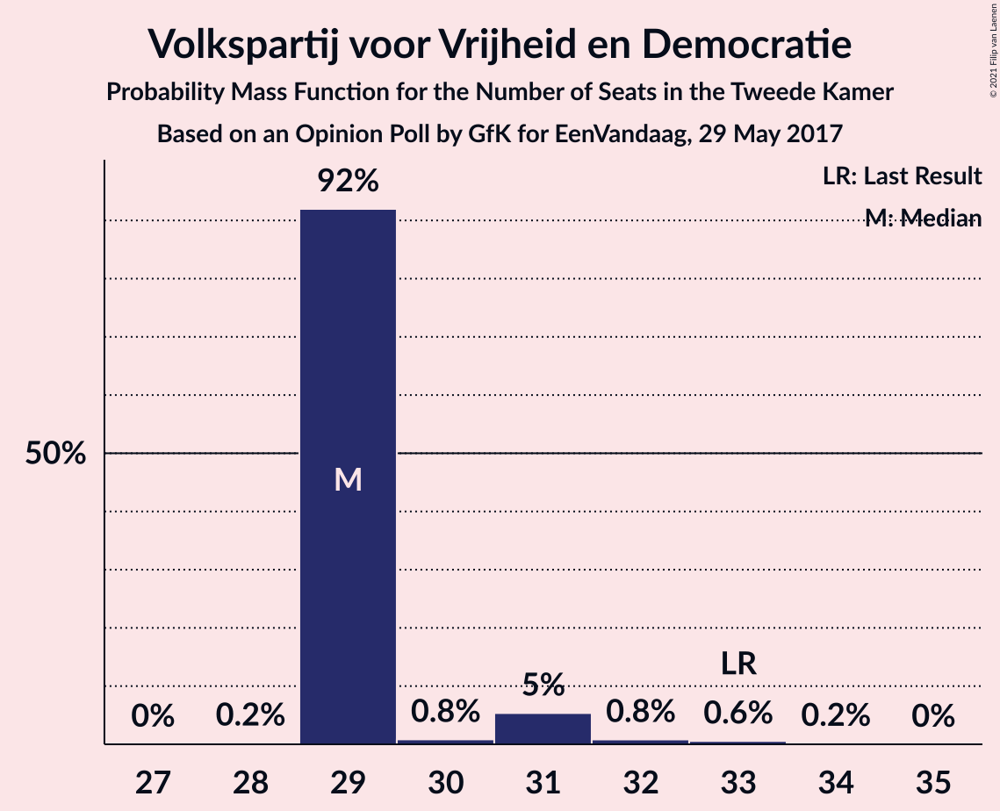
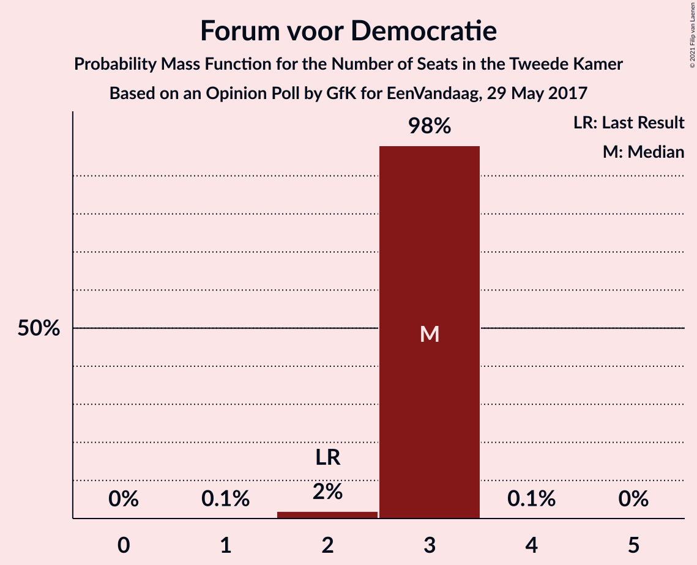
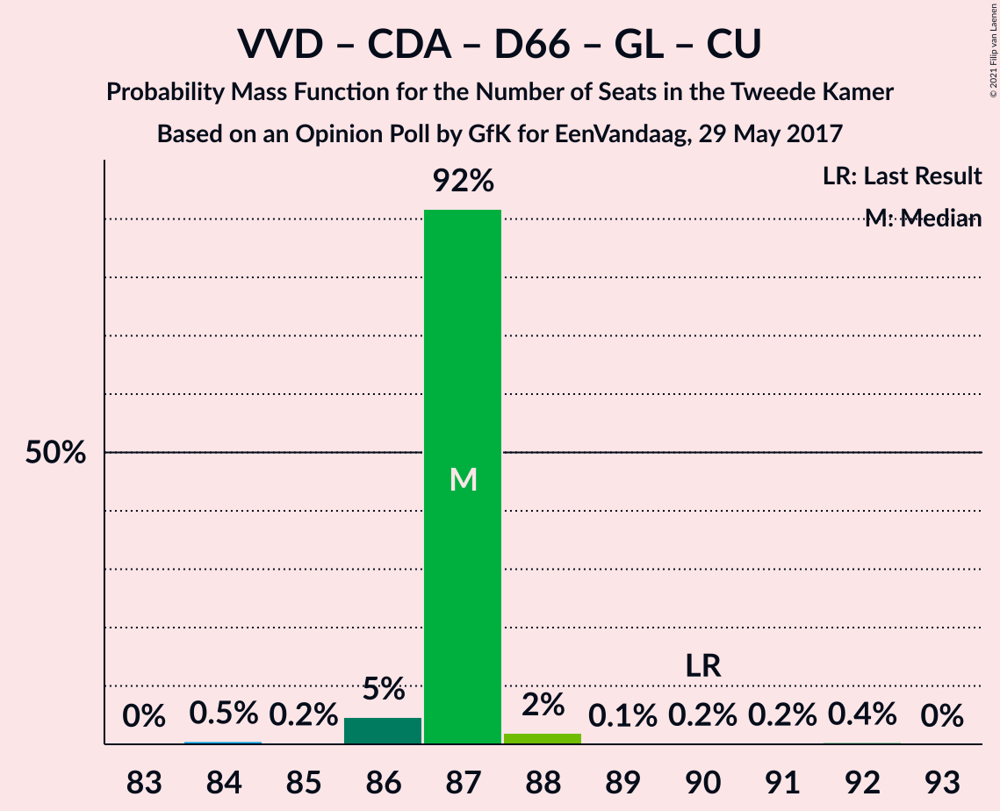
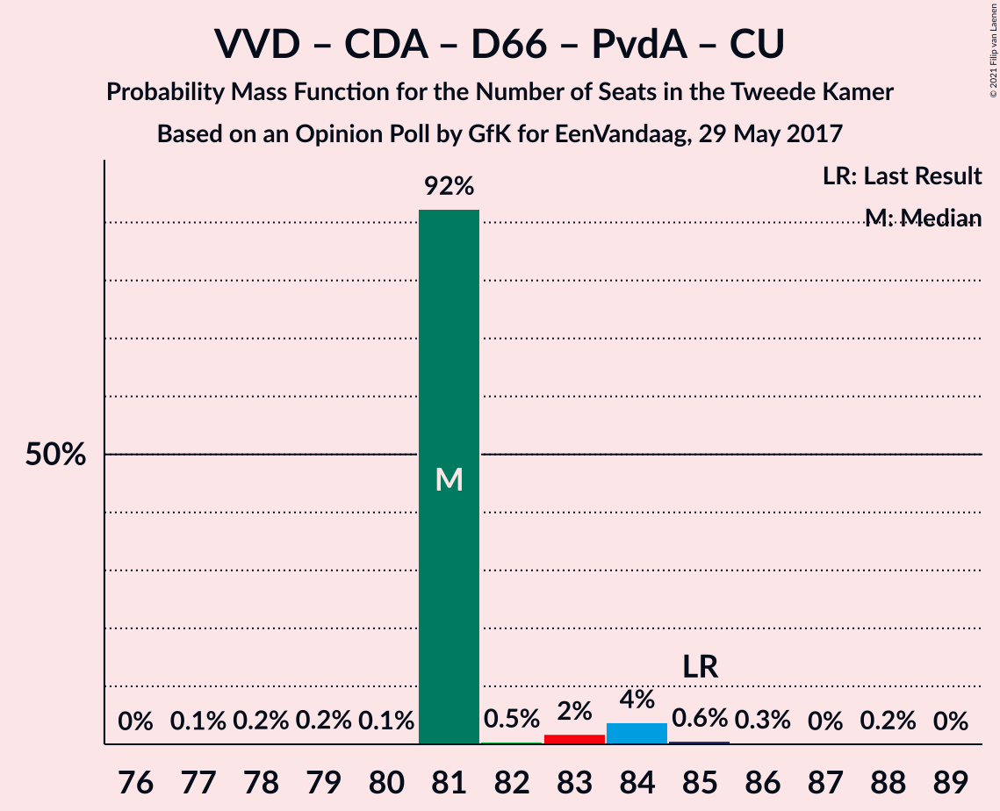
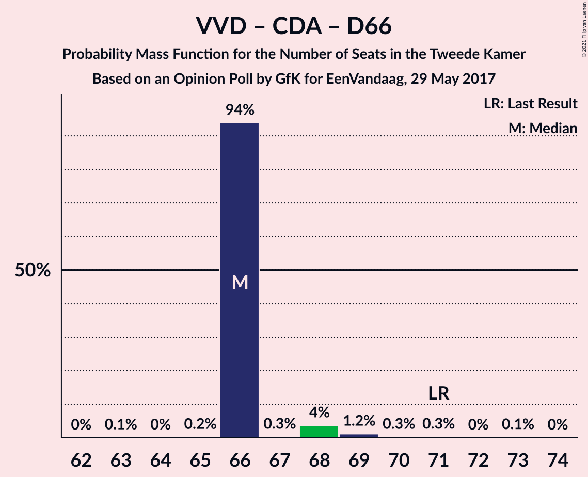

# Opinion Poll by GfK for EenVandaag, 29 May 2017

<a href="#voting-intentions">Voting Intentions</a> | <a href="#seats">Seats</a> | <a href="#coalitions">Coalitions</a> | <a href="#technical-information">Technical Information</a>

## Voting Intentions

### Confidence Intervals

| Party | Last Result | Poll Result | 80% Confidence Interval | 90% Confidence Interval | 95% Confidence Interval | 99% Confidence Interval |
|:-----:|:-----------:|:-----------:|:-----------------------:|:-----------------------:|:-----------------------:|:-----------------------:|
| Volkspartij voor Vrijheid en Democratie | 21.3% | 20.0% | 18.9–21.2% |18.5–21.5% |18.3–21.8% |17.8–22.4% |
| Partij voor de Vrijheid | 13.1% | 15.4% | 14.4–16.4% |14.1–16.8% |13.8–17.0% |13.4–17.5% |
| Christen-Democratisch Appèl | 12.4% | 12.0% | 11.1–13.0% |10.8–13.2% |10.6–13.5% |10.2–14.0% |
| Democraten 66 | 12.2% | 12.0% | 11.1–13.0% |10.8–13.2% |10.6–13.5% |10.2–14.0% |
| GroenLinks | 9.1% | 10.0% | 9.2–10.9% |9.0–11.2% |8.8–11.4% |8.4–11.9% |
| Socialistische Partij | 9.1% | 8.7% | 7.9–9.5% |7.7–9.8% |7.5–10.0% |7.1–10.4% |
| Partij van de Arbeid | 5.7% | 6.6% | 6.0–7.4% |5.8–7.6% |5.6–7.8% |5.3–8.2% |
| ChristenUnie | 3.4% | 3.3% | 2.9–3.9% |2.7–4.1% |2.6–4.2% |2.4–4.5% |
| Partij voor de Dieren | 3.2% | 3.3% | 2.9–3.9% |2.7–4.1% |2.6–4.2% |2.4–4.5% |
| 50Plus | 3.1% | 2.7% | 2.3–3.2% |2.1–3.4% |2.0–3.5% |1.9–3.7% |
| Staatkundig Gereformeerde Partij | 2.1% | 2.0% | 1.7–2.5% |1.6–2.6% |1.5–2.7% |1.3–3.0% |
| Forum voor Democratie | 1.8% | 2.0% | 1.7–2.5% |1.6–2.6% |1.5–2.7% |1.3–3.0% |
| DENK | 2.1% | 1.3% | 1.0–1.7% |1.0–1.8% |0.9–1.9% |0.8–2.1% |
| Piratenpartij | 0.3% | 0.7% | 0.5–1.0% |0.4–1.1% |0.4–1.1% |0.3–1.3% |

*Note:* The poll result column reflects the actual value used in the calculations. Published results may vary slightly, and in addition be rounded to fewer digits.

## Seats

### Confidence Intervals

| Party | Last Result | Median | 80% Confidence Interval | 90% Confidence Interval | 95% Confidence Interval | 99% Confidence Interval |
|:-----:|:-----------:|:------:|:-----------------------:|:-----------------------:|:-----------------------:|:-----------------------:|
| <a href="#volkspartij-voor-vrijheid-en-democratie">Volkspartij voor Vrijheid en Democratie</a> | 33 | 29 | 29 |29 |29–31 |29–31 |
| <a href="#partij-voor-de-vrijheid">Partij voor de Vrijheid</a> | 20 | 25 | 25 |25 |21–25 |21–25 |
| <a href="#christen-democratisch-appèl">Christen-Democratisch Appèl</a> | 19 | 17 | 17 |17 |17–18 |17–20 |
| <a href="#democraten-66">Democraten 66</a> | 19 | 20 | 20 |20 |19–20 |18–20 |
| <a href="#groenlinks">GroenLinks</a> | 14 | 16 | 16 |16 |14–16 |14–16 |
| <a href="#socialistische-partij">Socialistische Partij</a> | 14 | 13 | 13 |13 |13 |12–13 |
| <a href="#partij-van-de-arbeid">Partij van de Arbeid</a> | 9 | 10 | 10 |10 |10–12 |9–12 |
| <a href="#christenunie">ChristenUnie</a> | 5 | 5 | 5 |5 |4–5 |4–5 |
| <a href="#partij-voor-de-dieren">Partij voor de Dieren</a> | 5 | 4 | 4 |4 |4–6 |4–6 |
| <a href="#50plus">50Plus</a> | 4 | 3 | 3 |3 |3 |3–4 |
| <a href="#staatkundig-gereformeerde-partij">Staatkundig Gereformeerde Partij</a> | 3 | 3 | 3 |3 |3–4 |3–4 |
| <a href="#forum-voor-democratie">Forum voor Democratie</a> | 2 | 3 | 3 |3 |3 |3 |
| <a href="#denk">DENK</a> | 3 | 2 | 2 |2 |2 |1–2 |
| <a href="#piratenpartij">Piratenpartij</a> | 0 | 0 | 0 |0 |0 |0 |

### Volkspartij voor Vrijheid en Democratie

*For a full overview of the results for this party, see the [Volkspartij voor Vrijheid en Democratie](party-volkspartijvoorvrijheidendemocratie.html) page.*

| Number of Seats | Probability | Accumulated | Special Marks |
|:---------------:|:-----------:|:-----------:|:-------------:|
| 28 | 0.2% | 100% |  |
| 29 | 96% | 99.8% | Median |
| 30 | 0.3% | 4% |  |
| 31 | 4% | 4% |  |
| 32 | 0.1% | 0.3% |  |
| 33 | 0.2% | 0.2% | Last Result |
| 34 | 0% | 0% |  |

### Partij voor de Vrijheid

*For a full overview of the results for this party, see the [Partij voor de Vrijheid](party-partijvoordevrijheid.html) page.*

| Number of Seats | Probability | Accumulated | Special Marks |
|:---------------:|:-----------:|:-----------:|:-------------:|
| 20 | 0% | 100% | Last Result |
| 21 | 3% | 100% |  |
| 22 | 0.1% | 97% |  |
| 23 | 0.3% | 96% |  |
| 24 | 0.2% | 96% |  |
| 25 | 96% | 96% | Median |
| 26 | 0.1% | 0.2% |  |
| 27 | 0.1% | 0.1% |  |
| 28 | 0% | 0% |  |

### Christen-Democratisch Appèl

*For a full overview of the results for this party, see the [Christen-Democratisch Appèl](party-christen-democratischappèl.html) page.*

| Number of Seats | Probability | Accumulated | Special Marks |
|:---------------:|:-----------:|:-----------:|:-------------:|
| 17 | 96% | 100% | Median |
| 18 | 4% | 4% |  |
| 19 | 0.2% | 0.8% | Last Result |
| 20 | 0.5% | 0.6% |  |
| 21 | 0% | 0.1% |  |
| 22 | 0.1% | 0.1% |  |
| 23 | 0% | 0% |  |

### Democraten 66

*For a full overview of the results for this party, see the [Democraten 66](party-democraten66.html) page.*

| Number of Seats | Probability | Accumulated | Special Marks |
|:---------------:|:-----------:|:-----------:|:-------------:|
| 16 | 0.1% | 100% |  |
| 17 | 0.3% | 99.9% |  |
| 18 | 0.4% | 99.6% |  |
| 19 | 3% | 99.2% | Last Result |
| 20 | 96% | 96% | Median |
| 21 | 0.1% | 0.1% |  |
| 22 | 0% | 0% |  |

### GroenLinks

*For a full overview of the results for this party, see the [GroenLinks](party-groenlinks.html) page.*

| Number of Seats | Probability | Accumulated | Special Marks |
|:---------------:|:-----------:|:-----------:|:-------------:|
| 13 | 0.3% | 100% |  |
| 14 | 4% | 99.7% | Last Result |
| 15 | 0.3% | 96% |  |
| 16 | 96% | 96% | Median |
| 17 | 0.1% | 0.2% |  |
| 18 | 0.1% | 0.1% |  |
| 19 | 0% | 0% |  |

### Socialistische Partij

*For a full overview of the results for this party, see the [Socialistische Partij](party-socialistischepartij.html) page.*

| Number of Seats | Probability | Accumulated | Special Marks |
|:---------------:|:-----------:|:-----------:|:-------------:|
| 11 | 0% | 100% |  |
| 12 | 0.6% | 99.9% |  |
| 13 | 99.2% | 99.4% | Median |
| 14 | 0.1% | 0.2% | Last Result |
| 15 | 0% | 0.1% |  |
| 16 | 0% | 0% |  |

### Partij van de Arbeid

*For a full overview of the results for this party, see the [Partij van de Arbeid](party-partijvandearbeid.html) page.*

| Number of Seats | Probability | Accumulated | Special Marks |
|:---------------:|:-----------:|:-----------:|:-------------:|
| 8 | 0.3% | 100% |  |
| 9 | 0.4% | 99.7% | Last Result |
| 10 | 96% | 99.2% | Median |
| 11 | 0.1% | 4% |  |
| 12 | 3% | 3% |  |
| 13 | 0% | 0% |  |

### ChristenUnie

*For a full overview of the results for this party, see the [ChristenUnie](party-christenunie.html) page.*

| Number of Seats | Probability | Accumulated | Special Marks |
|:---------------:|:-----------:|:-----------:|:-------------:|
| 4 | 4% | 100% |  |
| 5 | 96% | 96% | Last Result, Median |
| 6 | 0.2% | 0.3% |  |
| 7 | 0.1% | 0.1% |  |
| 8 | 0% | 0% |  |

### Partij voor de Dieren

*For a full overview of the results for this party, see the [Partij voor de Dieren](party-partijvoordedieren.html) page.*

| Number of Seats | Probability | Accumulated | Special Marks |
|:---------------:|:-----------:|:-----------:|:-------------:|
| 3 | 0.1% | 100% |  |
| 4 | 96% | 99.9% | Median |
| 5 | 0.2% | 4% | Last Result |
| 6 | 4% | 4% |  |
| 7 | 0.3% | 0.3% |  |
| 8 | 0% | 0% |  |

### 50Plus

*For a full overview of the results for this party, see the [50Plus](party-50plus.html) page.*

| Number of Seats | Probability | Accumulated | Special Marks |
|:---------------:|:-----------:|:-----------:|:-------------:|
| 3 | 99.2% | 100% | Median |
| 4 | 0.7% | 0.8% | Last Result |
| 5 | 0.1% | 0.1% |  |
| 6 | 0% | 0% |  |

### Staatkundig Gereformeerde Partij

*For a full overview of the results for this party, see the [Staatkundig Gereformeerde Partij](party-staatkundiggereformeerdepartij.html) page.*

| Number of Seats | Probability | Accumulated | Special Marks |
|:---------------:|:-----------:|:-----------:|:-------------:|
| 2 | 0.3% | 100% |  |
| 3 | 96% | 99.7% | Last Result, Median |
| 4 | 4% | 4% |  |
| 5 | 0% | 0% |  |

### Forum voor Democratie

*For a full overview of the results for this party, see the [Forum voor Democratie](party-forumvoordemocratie.html) page.*

| Number of Seats | Probability | Accumulated | Special Marks |
|:---------------:|:-----------:|:-----------:|:-------------:|
| 2 | 0.1% | 100% | Last Result |
| 3 | 99.8% | 99.8% | Median |
| 4 | 0.1% | 0.1% |  |
| 5 | 0% | 0% |  |

### DENK

*For a full overview of the results for this party, see the [DENK](party-denk.html) page.*

| Number of Seats | Probability | Accumulated | Special Marks |
|:---------------:|:-----------:|:-----------:|:-------------:|
| 1 | 0.6% | 100% |  |
| 2 | 99.3% | 99.4% | Median |
| 3 | 0% | 0% | Last Result |

### Piratenpartij

*For a full overview of the results for this party, see the [Piratenpartij](party-piratenpartij.html) page.*

| Number of Seats | Probability | Accumulated | Special Marks |
|:---------------:|:-----------:|:-----------:|:-------------:|
| 0 | 99.7% | 100% | Last Result, Median |
| 1 | 0.3% | 0.3% |  |
| 2 | 0% | 0% |  |

## Coalitions

### Confidence Intervals

| Coalition | Last Result | Median | Majority? | 80% Confidence Interval | 90% Confidence Interval | 95% Confidence Interval | 99% Confidence Interval |
|:---------:|:-----------:|:------:|:---------:|:-----------------------:|:-----------------------:|:-----------------------:|:-----------------------:|
| Volkspartij voor Vrijheid en Democratie – Christen-Democratisch Appèl – Democraten 66 – GroenLinks – ChristenUnie | 90 | 87 | 100% | 87 | 87 | 86–87 | 86–87 |
| Volkspartij voor Vrijheid en Democratie – Christen-Democratisch Appèl – Democraten 66 – Partij van de Arbeid – ChristenUnie | 85 | 81 | 100% | 81 | 81 | 81–84 | 81–84 |
| Christen-Democratisch Appèl – Democraten 66 – GroenLinks – Socialistische Partij – Partij van de Arbeid – ChristenUnie | 80 | 81 | 100% | 81 | 81 | 80–81 | 78–81 |
| Volkspartij voor Vrijheid en Democratie – Partij voor de Vrijheid – Christen-Democratisch Appèl – Forum voor Democratie – Staatkundig Gereformeerde Partij | 77 | 77 | 99.9% | 77 | 77 | 77 | 77–81 |
| Volkspartij voor Vrijheid en Democratie – Partij voor de Vrijheid – Christen-Democratisch Appèl – Forum voor Democratie | 74 | 74 | 0.8% | 74 | 74 | 73–74 | 73–78 |
| Volkspartij voor Vrijheid en Democratie – Christen-Democratisch Appèl – Democraten 66 – ChristenUnie | 76 | 71 | 0.1% | 71 | 71 | 71–72 | 71–72 |
| Volkspartij voor Vrijheid en Democratie – Partij voor de Vrijheid – Christen-Democratisch Appèl | 72 | 71 | 0.1% | 71 | 71 | 70–71 | 70–75 |
| Christen-Democratisch Appèl – Democraten 66 – GroenLinks – Partij van de Arbeid – ChristenUnie | 66 | 68 | 0% | 68 | 68 | 67–68 | 66–68 |
| Volkspartij voor Vrijheid en Democratie – Christen-Democratisch Appèl – Democraten 66 | 71 | 66 | 0% | 66 | 66 | 66–68 | 66–68 |
| Volkspartij voor Vrijheid en Democratie – Democraten 66 – Partij van de Arbeid | 61 | 59 | 0% | 59 | 59 | 59–62 | 56–62 |
| Volkspartij voor Vrijheid en Democratie – Christen-Democratisch Appèl – Partij van de Arbeid | 61 | 56 | 0% | 56 | 56 | 56–61 | 56–61 |
| Volkspartij voor Vrijheid en Democratie – Christen-Democratisch Appèl – 50Plus – Forum voor Democratie – Staatkundig Gereformeerde Partij | 61 | 55 | 0% | 55 | 55 | 55–59 | 55–59 |
| Volkspartij voor Vrijheid en Democratie – Christen-Democratisch Appèl – Forum voor Democratie – Staatkundig Gereformeerde Partij | 57 | 52 | 0% | 52 | 52 | 52–56 | 52–56 |
| Volkspartij voor Vrijheid en Democratie – Christen-Democratisch Appèl – 50Plus – Forum voor Democratie | 58 | 52 | 0% | 52 | 52 | 52–55 | 52–57 |
| Volkspartij voor Vrijheid en Democratie – Christen-Democratisch Appèl – Forum voor Democratie | 54 | 49 | 0% | 49 | 49 | 49–52 | 49–53 |
| Christen-Democratisch Appèl – Democraten 66 – Partij van de Arbeid | 47 | 47 | 0% | 47 | 47 | 47–49 | 46–49 |
| Volkspartij voor Vrijheid en Democratie – Christen-Democratisch Appèl | 52 | 46 | 0% | 46 | 46 | 46–49 | 46–50 |
| Volkspartij voor Vrijheid en Democratie – Partij van de Arbeid | 42 | 39 | 0% | 39 | 39 | 39–43 | 39–43 |
| Christen-Democratisch Appèl – Democraten 66 | 38 | 37 | 0% | 37 | 37 | 37 | 37 |
| Christen-Democratisch Appèl – Partij van de Arbeid – ChristenUnie | 33 | 32 | 0% | 32 | 32 | 32–34 | 32–34 |
| Christen-Democratisch Appèl – Partij van de Arbeid | 28 | 27 | 0% | 27 | 27 | 27–30 | 27–30 |

### Volkspartij voor Vrijheid en Democratie – Christen-Democratisch Appèl – Democraten 66 – GroenLinks – ChristenUnie

| Number of Seats | Probability | Accumulated | Special Marks |
|:---------------:|:-----------:|:-----------:|:-------------:|
| 85 | 0.1% | 100% |  |
| 86 | 4% | 99.9% |  |
| 87 | 96% | 96% | Median |
| 88 | 0.2% | 0.5% |  |
| 89 | 0% | 0.2% |  |
| 90 | 0.2% | 0.2% | Last Result |
| 91 | 0% | 0.1% |  |
| 92 | 0% | 0% |  |

### Volkspartij voor Vrijheid en Democratie – Christen-Democratisch Appèl – Democraten 66 – Partij van de Arbeid – ChristenUnie

| Number of Seats | Probability | Accumulated | Special Marks |
|:---------------:|:-----------:|:-----------:|:-------------:|
| 77 | 0.1% | 100% |  |
| 78 | 0% | 99.9% |  |
| 79 | 0.2% | 99.9% |  |
| 80 | 0.1% | 99.7% |  |
| 81 | 96% | 99.6% | Median |
| 82 | 0% | 4% |  |
| 83 | 0.1% | 4% |  |
| 84 | 4% | 4% |  |
| 85 | 0% | 0.1% | Last Result |
| 86 | 0% | 0% |  |

### Christen-Democratisch Appèl – Democraten 66 – GroenLinks – Socialistische Partij – Partij van de Arbeid – ChristenUnie

| Number of Seats | Probability | Accumulated | Special Marks |
|:---------------:|:-----------:|:-----------:|:-------------:|
| 76 | 0.2% | 100% | Majority |
| 77 | 0.2% | 99.8% |  |
| 78 | 0.1% | 99.5% |  |
| 79 | 0.2% | 99.4% |  |
| 80 | 3% | 99.2% | Last Result |
| 81 | 96% | 96% | Median |
| 82 | 0.1% | 0.3% |  |
| 83 | 0.1% | 0.2% |  |
| 84 | 0.1% | 0.1% |  |
| 85 | 0% | 0% |  |

### Volkspartij voor Vrijheid en Democratie – Partij voor de Vrijheid – Christen-Democratisch Appèl – Forum voor Democratie – Staatkundig Gereformeerde Partij

| Number of Seats | Probability | Accumulated | Special Marks |
|:---------------:|:-----------:|:-----------:|:-------------:|
| 74 | 0% | 100% |  |
| 75 | 0% | 99.9% |  |
| 76 | 0% | 99.9% | Majority |
| 77 | 99.1% | 99.9% | Last Result, Median |
| 78 | 0.2% | 0.8% |  |
| 79 | 0% | 0.7% |  |
| 80 | 0.1% | 0.6% |  |
| 81 | 0.3% | 0.5% |  |
| 82 | 0.2% | 0.2% |  |
| 83 | 0% | 0% |  |

### Volkspartij voor Vrijheid en Democratie – Partij voor de Vrijheid – Christen-Democratisch Appèl – Forum voor Democratie

| Number of Seats | Probability | Accumulated | Special Marks |
|:---------------:|:-----------:|:-----------:|:-------------:|
| 72 | 0% | 100% |  |
| 73 | 3% | 99.9% |  |
| 74 | 96% | 97% | Last Result, Median |
| 75 | 0% | 0.8% |  |
| 76 | 0.1% | 0.8% | Majority |
| 77 | 0.1% | 0.7% |  |
| 78 | 0.6% | 0.6% |  |
| 79 | 0% | 0.1% |  |
| 80 | 0% | 0% |  |

### Volkspartij voor Vrijheid en Democratie – Christen-Democratisch Appèl – Democraten 66 – ChristenUnie

| Number of Seats | Probability | Accumulated | Special Marks |
|:---------------:|:-----------:|:-----------:|:-------------:|
| 68 | 0.1% | 100% |  |
| 69 | 0.1% | 99.9% |  |
| 70 | 0% | 99.9% |  |
| 71 | 96% | 99.8% | Median |
| 72 | 4% | 4% |  |
| 73 | 0% | 0.4% |  |
| 74 | 0.1% | 0.4% |  |
| 75 | 0.2% | 0.3% |  |
| 76 | 0.1% | 0.1% | Last Result, Majority |
| 77 | 0% | 0% |  |

### Volkspartij voor Vrijheid en Democratie – Partij voor de Vrijheid – Christen-Democratisch Appèl

| Number of Seats | Probability | Accumulated | Special Marks |
|:---------------:|:-----------:|:-----------:|:-------------:|
| 70 | 3% | 100% |  |
| 71 | 96% | 97% | Median |
| 72 | 0.1% | 0.9% | Last Result |
| 73 | 0.1% | 0.8% |  |
| 74 | 0% | 0.7% |  |
| 75 | 0.6% | 0.7% |  |
| 76 | 0% | 0.1% | Majority |
| 77 | 0% | 0% |  |

### Christen-Democratisch Appèl – Democraten 66 – GroenLinks – Partij van de Arbeid – ChristenUnie

| Number of Seats | Probability | Accumulated | Special Marks |
|:---------------:|:-----------:|:-----------:|:-------------:|
| 64 | 0.4% | 100% |  |
| 65 | 0% | 99.5% |  |
| 66 | 0.1% | 99.5% | Last Result |
| 67 | 4% | 99.4% |  |
| 68 | 96% | 96% | Median |
| 69 | 0% | 0.1% |  |
| 70 | 0% | 0.1% |  |
| 71 | 0.1% | 0.1% |  |
| 72 | 0% | 0% |  |

### Volkspartij voor Vrijheid en Democratie – Christen-Democratisch Appèl – Democraten 66

| Number of Seats | Probability | Accumulated | Special Marks |
|:---------------:|:-----------:|:-----------:|:-------------:|
| 63 | 0.1% | 100% |  |
| 64 | 0% | 99.9% |  |
| 65 | 0.1% | 99.9% |  |
| 66 | 96% | 99.8% | Median |
| 67 | 0.3% | 4% |  |
| 68 | 3% | 4% |  |
| 69 | 0.2% | 0.4% |  |
| 70 | 0.3% | 0.3% |  |
| 71 | 0% | 0% | Last Result |

### Volkspartij voor Vrijheid en Democratie – Democraten 66 – Partij van de Arbeid

| Number of Seats | Probability | Accumulated | Special Marks |
|:---------------:|:-----------:|:-----------:|:-------------:|
| 54 | 0.1% | 100% |  |
| 55 | 0.4% | 99.9% |  |
| 56 | 0.1% | 99.5% |  |
| 57 | 0% | 99.5% |  |
| 58 | 0% | 99.5% |  |
| 59 | 96% | 99.4% | Median |
| 60 | 0.3% | 4% |  |
| 61 | 0.1% | 4% | Last Result |
| 62 | 3% | 3% |  |
| 63 | 0% | 0% |  |

### Volkspartij voor Vrijheid en Democratie – Christen-Democratisch Appèl – Partij van de Arbeid

| Number of Seats | Probability | Accumulated | Special Marks |
|:---------------:|:-----------:|:-----------:|:-------------:|
| 56 | 96% | 100% | Median |
| 57 | 0.2% | 4% |  |
| 58 | 0.3% | 4% |  |
| 59 | 0.2% | 4% |  |
| 60 | 0.1% | 4% |  |
| 61 | 4% | 4% | Last Result |
| 62 | 0% | 0% |  |

### Volkspartij voor Vrijheid en Democratie – Christen-Democratisch Appèl – 50Plus – Forum voor Democratie – Staatkundig Gereformeerde Partij

| Number of Seats | Probability | Accumulated | Special Marks |
|:---------------:|:-----------:|:-----------:|:-------------:|
| 55 | 96% | 100% | Median |
| 56 | 0% | 4% |  |
| 57 | 0.3% | 4% |  |
| 58 | 0.1% | 4% |  |
| 59 | 4% | 4% |  |
| 60 | 0.3% | 0.5% |  |
| 61 | 0% | 0.2% | Last Result |
| 62 | 0% | 0.2% |  |
| 63 | 0.2% | 0.2% |  |
| 64 | 0% | 0% |  |

### Volkspartij voor Vrijheid en Democratie – Christen-Democratisch Appèl – Forum voor Democratie – Staatkundig Gereformeerde Partij

| Number of Seats | Probability | Accumulated | Special Marks |
|:---------------:|:-----------:|:-----------:|:-------------:|
| 52 | 96% | 100% | Median |
| 53 | 0.1% | 4% |  |
| 54 | 0.3% | 4% |  |
| 55 | 0.2% | 4% |  |
| 56 | 4% | 4% |  |
| 57 | 0% | 0.2% | Last Result |
| 58 | 0% | 0.2% |  |
| 59 | 0.2% | 0.2% |  |
| 60 | 0% | 0% |  |

### Volkspartij voor Vrijheid en Democratie – Christen-Democratisch Appèl – 50Plus – Forum voor Democratie

| Number of Seats | Probability | Accumulated | Special Marks |
|:---------------:|:-----------:|:-----------:|:-------------:|
| 52 | 96% | 100% | Median |
| 53 | 0% | 4% |  |
| 54 | 0.2% | 4% |  |
| 55 | 4% | 4% |  |
| 56 | 0.1% | 0.7% |  |
| 57 | 0.3% | 0.6% |  |
| 58 | 0% | 0.2% | Last Result |
| 59 | 0.2% | 0.2% |  |
| 60 | 0% | 0% |  |

### Volkspartij voor Vrijheid en Democratie – Christen-Democratisch Appèl – Forum voor Democratie

| Number of Seats | Probability | Accumulated | Special Marks |
|:---------------:|:-----------:|:-----------:|:-------------:|
| 49 | 96% | 100% | Median |
| 50 | 0.1% | 4% |  |
| 51 | 0.2% | 4% |  |
| 52 | 4% | 4% |  |
| 53 | 0.3% | 0.5% |  |
| 54 | 0% | 0.2% | Last Result |
| 55 | 0.2% | 0.2% |  |
| 56 | 0% | 0% |  |

### Christen-Democratisch Appèl – Democraten 66 – Partij van de Arbeid

| Number of Seats | Probability | Accumulated | Special Marks |
|:---------------:|:-----------:|:-----------:|:-------------:|
| 43 | 0.1% | 100% |  |
| 44 | 0% | 99.9% |  |
| 45 | 0.3% | 99.9% |  |
| 46 | 0.3% | 99.6% |  |
| 47 | 96% | 99.4% | Last Result, Median |
| 48 | 0.1% | 4% |  |
| 49 | 3% | 4% |  |
| 50 | 0% | 0.1% |  |
| 51 | 0.1% | 0.1% |  |
| 52 | 0% | 0% |  |

### Volkspartij voor Vrijheid en Democratie – Christen-Democratisch Appèl

| Number of Seats | Probability | Accumulated | Special Marks |
|:---------------:|:-----------:|:-----------:|:-------------:|
| 46 | 96% | 100% | Median |
| 47 | 0.1% | 4% |  |
| 48 | 0.2% | 4% |  |
| 49 | 4% | 4% |  |
| 50 | 0.3% | 0.6% |  |
| 51 | 0% | 0.2% |  |
| 52 | 0.2% | 0.2% | Last Result |
| 53 | 0% | 0% |  |

### Volkspartij voor Vrijheid en Democratie – Partij van de Arbeid

| Number of Seats | Probability | Accumulated | Special Marks |
|:---------------:|:-----------:|:-----------:|:-------------:|
| 37 | 0.2% | 100% |  |
| 38 | 0.3% | 99.8% |  |
| 39 | 96% | 99.5% | Median |
| 40 | 0% | 4% |  |
| 41 | 0.1% | 4% |  |
| 42 | 0.2% | 4% | Last Result |
| 43 | 3% | 3% |  |
| 44 | 0% | 0% |  |

### Christen-Democratisch Appèl – Democraten 66

| Number of Seats | Probability | Accumulated | Special Marks |
|:---------------:|:-----------:|:-----------:|:-------------:|
| 34 | 0.1% | 100% |  |
| 35 | 0% | 99.9% |  |
| 36 | 0% | 99.9% |  |
| 37 | 99.4% | 99.8% | Median |
| 38 | 0.3% | 0.4% | Last Result |
| 39 | 0% | 0.1% |  |
| 40 | 0.1% | 0.1% |  |
| 41 | 0.1% | 0.1% |  |
| 42 | 0% | 0% |  |

### Christen-Democratisch Appèl – Partij van de Arbeid – ChristenUnie

| Number of Seats | Probability | Accumulated | Special Marks |
|:---------------:|:-----------:|:-----------:|:-------------:|
| 32 | 96% | 100% | Median |
| 33 | 0.3% | 4% | Last Result |
| 34 | 4% | 4% |  |
| 35 | 0.2% | 0.3% |  |
| 36 | 0% | 0% |  |

### Christen-Democratisch Appèl – Partij van de Arbeid

| Number of Seats | Probability | Accumulated | Special Marks |
|:---------------:|:-----------:|:-----------:|:-------------:|
| 26 | 0.1% | 100% |  |
| 27 | 96% | 99.9% | Median |
| 28 | 0.5% | 4% | Last Result |
| 29 | 0.2% | 4% |  |
| 30 | 3% | 4% |  |
| 31 | 0.1% | 0.1% |  |
| 32 | 0% | 0% |  |

## Technical Information

### Opinion Poll

+ **Polling firm:** GfK
+ **Commissioner(s):** EenVandaag
+ **Fieldwork period:** 29 May 2017

### Calculations

+ **Sample size:** 1986
+ **Simulations done:** 524,288
+ **Error estimate:** 1.78%

