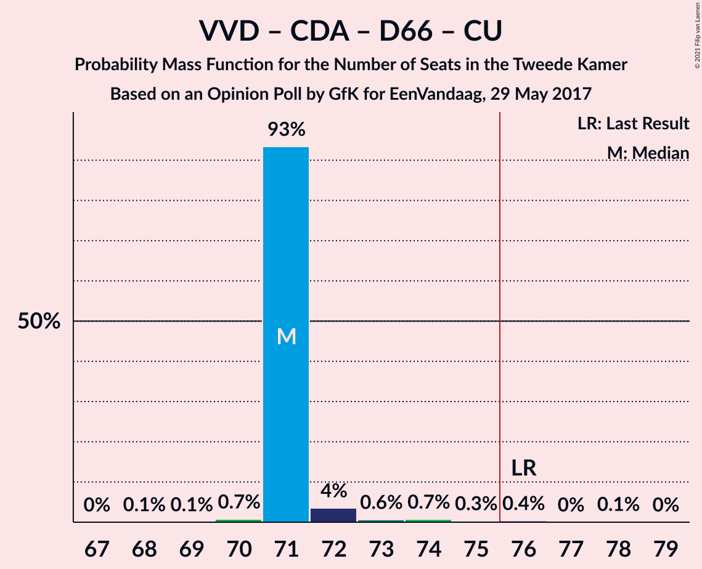
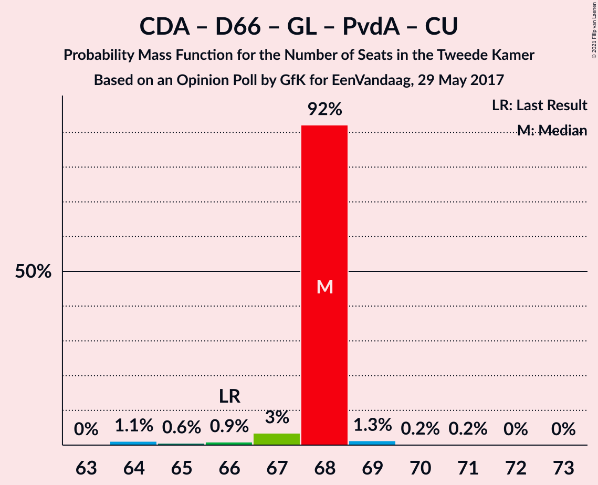
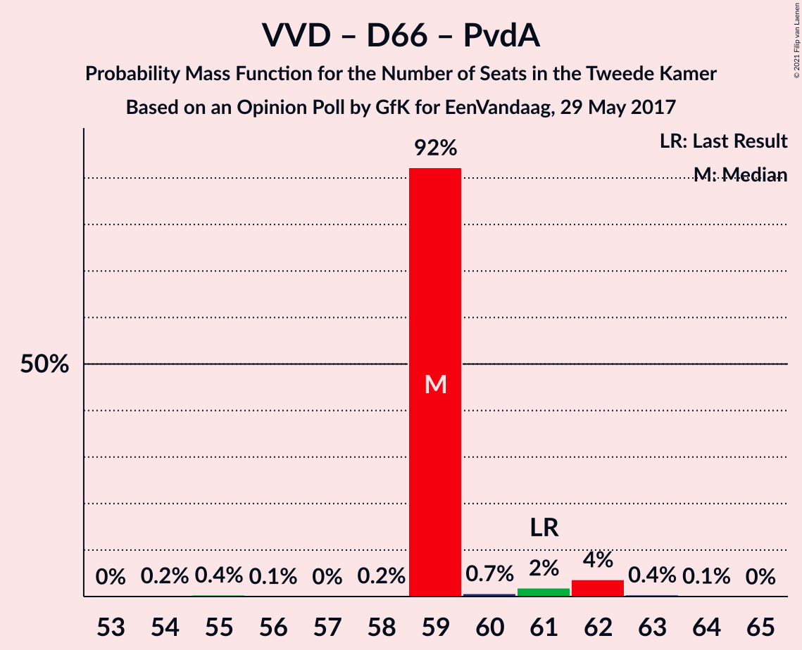
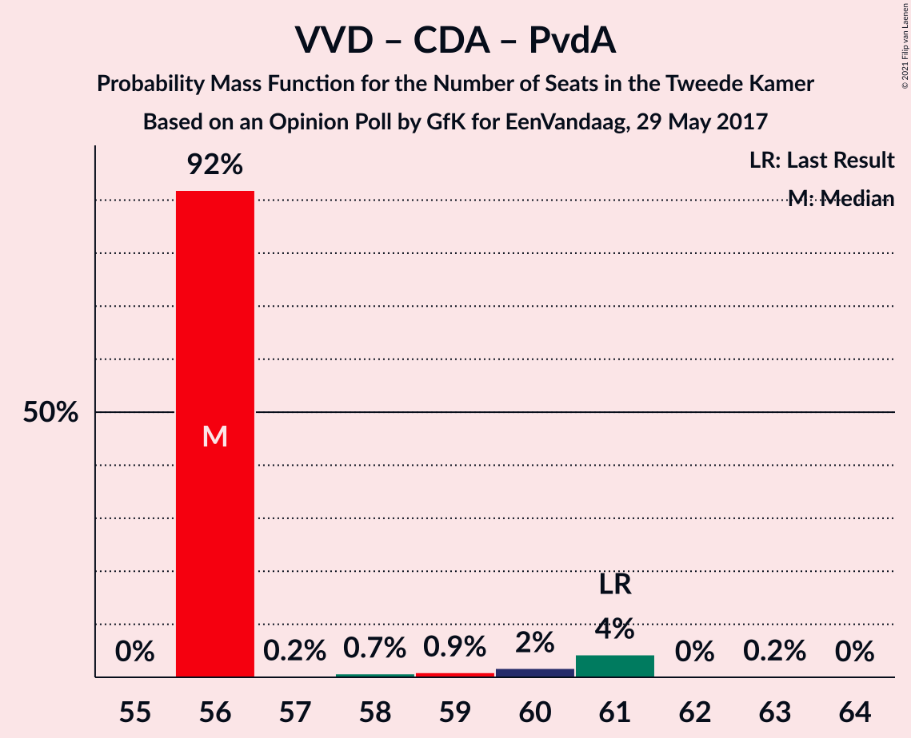

# Opinion Poll by GfK for EenVandaag, 29 May 2017

<a href="#voting-intentions">Voting Intentions</a> | <a href="#seats">Seats</a> | <a href="#coalitions">Coalitions</a> | <a href="#technical-information">Technical Information</a>

## Voting Intentions

### Confidence Intervals

| Party | Last Result | Poll Result | 80% Confidence Interval | 90% Confidence Interval | 95% Confidence Interval | 99% Confidence Interval |
|:-----:|:-----------:|:-----------:|:-----------------------:|:-----------------------:|:-----------------------:|:-----------------------:|
| Volkspartij voor Vrijheid en Democratie | 21.3% | 20.0% | 18.9–21.2% |18.5–21.5% |18.3–21.8% |17.8–22.4% |
| Partij voor de Vrijheid | 13.1% | 15.4% | 14.4–16.4% |14.1–16.8% |13.8–17.0% |13.4–17.5% |
| Christen-Democratisch Appèl | 12.4% | 12.0% | 11.1–13.0% |10.8–13.2% |10.6–13.5% |10.2–14.0% |
| Democraten 66 | 12.2% | 12.0% | 11.1–13.0% |10.8–13.2% |10.6–13.5% |10.2–14.0% |
| GroenLinks | 9.1% | 10.0% | 9.2–10.9% |9.0–11.2% |8.8–11.4% |8.4–11.9% |
| Socialistische Partij | 9.1% | 8.7% | 7.9–9.5% |7.7–9.8% |7.5–10.0% |7.1–10.4% |
| Partij van de Arbeid | 5.7% | 6.6% | 6.0–7.4% |5.8–7.6% |5.6–7.8% |5.3–8.2% |
| ChristenUnie | 3.4% | 3.3% | 2.9–3.9% |2.7–4.1% |2.6–4.2% |2.4–4.5% |
| Partij voor de Dieren | 3.2% | 3.3% | 2.9–3.9% |2.7–4.1% |2.6–4.2% |2.4–4.5% |
| 50Plus | 3.1% | 2.7% | 2.3–3.2% |2.1–3.4% |2.0–3.5% |1.9–3.7% |
| Staatkundig Gereformeerde Partij | 2.1% | 2.0% | 1.7–2.5% |1.6–2.6% |1.5–2.7% |1.3–3.0% |
| Forum voor Democratie | 1.8% | 2.0% | 1.7–2.5% |1.6–2.6% |1.5–2.7% |1.3–3.0% |
| DENK | 2.1% | 1.3% | 1.0–1.7% |1.0–1.8% |0.9–1.9% |0.8–2.1% |

*Note:* The poll result column reflects the actual value used in the calculations. Published results may vary slightly, and in addition be rounded to fewer digits.

## Seats

### Confidence Intervals

| Party | Last Result | Median | 80% Confidence Interval | 90% Confidence Interval | 95% Confidence Interval | 99% Confidence Interval |
|:-----:|:-----------:|:------:|:-----------------------:|:-----------------------:|:-----------------------:|:-----------------------:|
| <a href="#volkspartij-voor-vrijheid-en-democratie">Volkspartij voor Vrijheid en Democratie</a> | 33 | 29 | 29–32 |29–32 |29–32 |27–33 |
| <a href="#partij-voor-de-vrijheid">Partij voor de Vrijheid</a> | 20 | 24 | 23–26 |23–26 |23–27 |21–27 |
| <a href="#christen-democratisch-appèl">Christen-Democratisch Appèl</a> | 19 | 20 | 16–21 |16–21 |16–21 |15–21 |
| <a href="#democraten-66">Democraten 66</a> | 19 | 20 | 17–21 |17–21 |17–21 |16–21 |
| <a href="#groenlinks">GroenLinks</a> | 14 | 14 | 14–16 |14–16 |14–16 |12–18 |
| <a href="#socialistische-partij">Socialistische Partij</a> | 14 | 13 | 11–13 |11–13 |11–13 |11–14 |
| <a href="#partij-van-de-arbeid">Partij van de Arbeid</a> | 9 | 10 | 8–12 |8–12 |8–12 |7–12 |
| <a href="#christenunie">ChristenUnie</a> | 5 | 5 | 4–5 |4–5 |4–5 |4–6 |
| <a href="#partij-voor-de-dieren">Partij voor de Dieren</a> | 5 | 5 | 4–5 |4–5 |4–5 |4–7 |
| <a href="#50plus">50Plus</a> | 4 | 3 | 3–5 |3–5 |2–5 |2–5 |
| <a href="#staatkundig-gereformeerde-partij">Staatkundig Gereformeerde Partij</a> | 3 | 3 | 3–4 |3–4 |3–4 |2–4 |
| <a href="#forum-voor-democratie">Forum voor Democratie</a> | 2 | 2 | 2–3 |2–3 |2–3 |2–4 |
| <a href="#denk">DENK</a> | 3 | 2 | 1–2 |1–2 |1–2 |1–2 |

### Volkspartij voor Vrijheid en Democratie

*For a full overview of the results for this party, see the [Volkspartij voor Vrijheid en Democratie](party-volkspartijvoorvrijheidendemocratie.html) page.*

| Number of Seats | Probability | Accumulated | Special Marks |
|:---------------:|:-----------:|:-----------:|:-------------:|
| 27 | 0.6% | 100% |  |
| 28 | 0.4% | 99.4% |  |
| 29 | 55% | 99.0% | Median |
| 30 | 2% | 44% |  |
| 31 | 21% | 42% |  |
| 32 | 19% | 21% |  |
| 33 | 1.0% | 1.5% | Last Result |
| 34 | 0.4% | 0.5% |  |
| 35 | 0% | 0.1% |  |
| 36 | 0.1% | 0.1% |  |
| 37 | 0% | 0% |  |

### Partij voor de Vrijheid

*For a full overview of the results for this party, see the [Partij voor de Vrijheid](party-partijvoordevrijheid.html) page.*

| Number of Seats | Probability | Accumulated | Special Marks |
|:---------------:|:-----------:|:-----------:|:-------------:|
| 19 | 0.1% | 100% |  |
| 20 | 0.2% | 99.9% | Last Result |
| 21 | 0.9% | 99.7% |  |
| 22 | 0.5% | 98.8% |  |
| 23 | 20% | 98% |  |
| 24 | 54% | 78% | Median |
| 25 | 0.2% | 25% |  |
| 26 | 22% | 24% |  |
| 27 | 2% | 3% |  |
| 28 | 0.1% | 0.1% |  |
| 29 | 0% | 0% |  |

### Christen-Democratisch Appèl

*For a full overview of the results for this party, see the [Christen-Democratisch Appèl](party-christen-democratischappèl.html) page.*

| Number of Seats | Probability | Accumulated | Special Marks |
|:---------------:|:-----------:|:-----------:|:-------------:|
| 15 | 0.7% | 100% |  |
| 16 | 18% | 99.3% |  |
| 17 | 0.6% | 81% |  |
| 18 | 24% | 81% |  |
| 19 | 4% | 56% | Last Result |
| 20 | 17% | 53% | Median |
| 21 | 35% | 36% |  |
| 22 | 0.3% | 0.3% |  |
| 23 | 0% | 0% |  |

### Democraten 66

*For a full overview of the results for this party, see the [Democraten 66](party-democraten66.html) page.*

| Number of Seats | Probability | Accumulated | Special Marks |
|:---------------:|:-----------:|:-----------:|:-------------:|
| 15 | 0.1% | 100% |  |
| 16 | 0.9% | 99.9% |  |
| 17 | 34% | 99.0% |  |
| 18 | 5% | 65% |  |
| 19 | 4% | 60% | Last Result |
| 20 | 20% | 56% | Median |
| 21 | 35% | 35% |  |
| 22 | 0.1% | 0.1% |  |
| 23 | 0% | 0% |  |

### GroenLinks

*For a full overview of the results for this party, see the [GroenLinks](party-groenlinks.html) page.*

| Number of Seats | Probability | Accumulated | Special Marks |
|:---------------:|:-----------:|:-----------:|:-------------:|
| 11 | 0.5% | 100% |  |
| 12 | 0.1% | 99.5% |  |
| 13 | 0.8% | 99.5% |  |
| 14 | 52% | 98.7% | Last Result, Median |
| 15 | 22% | 46% |  |
| 16 | 22% | 24% |  |
| 17 | 1.0% | 2% |  |
| 18 | 0.9% | 0.9% |  |
| 19 | 0% | 0% |  |

### Socialistische Partij

*For a full overview of the results for this party, see the [Socialistische Partij](party-socialistischepartij.html) page.*

| Number of Seats | Probability | Accumulated | Special Marks |
|:---------------:|:-----------:|:-----------:|:-------------:|
| 10 | 0.1% | 100% |  |
| 11 | 38% | 99.9% |  |
| 12 | 4% | 62% |  |
| 13 | 56% | 58% | Median |
| 14 | 1.1% | 2% | Last Result |
| 15 | 0.3% | 0.4% |  |
| 16 | 0.1% | 0.2% |  |
| 17 | 0.1% | 0.1% |  |
| 18 | 0% | 0% |  |

### Partij van de Arbeid

*For a full overview of the results for this party, see the [Partij van de Arbeid](party-partijvandearbeid.html) page.*

| Number of Seats | Probability | Accumulated | Special Marks |
|:---------------:|:-----------:|:-----------:|:-------------:|
| 7 | 0.7% | 100% |  |
| 8 | 21% | 99.3% |  |
| 9 | 4% | 78% | Last Result |
| 10 | 53% | 75% | Median |
| 11 | 3% | 21% |  |
| 12 | 18% | 18% |  |
| 13 | 0% | 0% |  |

### ChristenUnie

*For a full overview of the results for this party, see the [ChristenUnie](party-christenunie.html) page.*

| Number of Seats | Probability | Accumulated | Special Marks |
|:---------------:|:-----------:|:-----------:|:-------------:|
| 3 | 0.3% | 100% |  |
| 4 | 40% | 99.7% |  |
| 5 | 59% | 60% | Last Result, Median |
| 6 | 0.6% | 0.8% |  |
| 7 | 0.2% | 0.2% |  |
| 8 | 0% | 0% |  |

### Partij voor de Dieren

*For a full overview of the results for this party, see the [Partij voor de Dieren](party-partijvoordedieren.html) page.*

| Number of Seats | Probability | Accumulated | Special Marks |
|:---------------:|:-----------:|:-----------:|:-------------:|
| 3 | 0.1% | 100% |  |
| 4 | 40% | 99.9% |  |
| 5 | 58% | 60% | Last Result, Median |
| 6 | 0.7% | 1.3% |  |
| 7 | 0.6% | 0.6% |  |
| 8 | 0% | 0% |  |

### 50Plus

*For a full overview of the results for this party, see the [50Plus](party-50plus.html) page.*

| Number of Seats | Probability | Accumulated | Special Marks |
|:---------------:|:-----------:|:-----------:|:-------------:|
| 2 | 3% | 100% |  |
| 3 | 55% | 97% | Median |
| 4 | 23% | 42% | Last Result |
| 5 | 19% | 19% |  |
| 6 | 0% | 0% |  |

### Staatkundig Gereformeerde Partij

*For a full overview of the results for this party, see the [Staatkundig Gereformeerde Partij](party-staatkundiggereformeerdepartij.html) page.*

| Number of Seats | Probability | Accumulated | Special Marks |
|:---------------:|:-----------:|:-----------:|:-------------:|
| 1 | 0.1% | 100% |  |
| 2 | 1.5% | 99.9% |  |
| 3 | 80% | 98% | Last Result, Median |
| 4 | 18% | 18% |  |
| 5 | 0% | 0% |  |

### Forum voor Democratie

*For a full overview of the results for this party, see the [Forum voor Democratie](party-forumvoordemocratie.html) page.*

| Number of Seats | Probability | Accumulated | Special Marks |
|:---------------:|:-----------:|:-----------:|:-------------:|
| 2 | 56% | 100% | Last Result, Median |
| 3 | 42% | 44% |  |
| 4 | 2% | 2% |  |
| 5 | 0.1% | 0.1% |  |
| 6 | 0% | 0% |  |

### DENK

*For a full overview of the results for this party, see the [DENK](party-denk.html) page.*

| Number of Seats | Probability | Accumulated | Special Marks |
|:---------------:|:-----------:|:-----------:|:-------------:|
| 0 | 0.2% | 100% |  |
| 1 | 22% | 99.8% |  |
| 2 | 77% | 77% | Median |
| 3 | 0.4% | 0.4% | Last Result |
| 4 | 0% | 0% |  |

## Coalitions

### Confidence Intervals

| Coalition | Last Result | Median | Majority? | 80% Confidence Interval | 90% Confidence Interval | 95% Confidence Interval | 99% Confidence Interval |
|:---------:|:-----------:|:------:|:---------:|:-----------------------:|:-----------------------:|:-----------------------:|:-----------------------:|
| Volkspartij voor Vrijheid en Democratie – Christen-Democratisch Appèl – Democraten 66 – GroenLinks – ChristenUnie | 90 | 89 | 100% | 82–91 | 82–91 | 82–91 | 82–91 |
| Volkspartij voor Vrijheid en Democratie – Christen-Democratisch Appèl – Democraten 66 – Partij van de Arbeid – ChristenUnie | 85 | 83 | 99.9% | 79–85 | 79–85 | 79–85 | 78–85 |
| Volkspartij voor Vrijheid en Democratie – Partij voor de Vrijheid – Christen-Democratisch Appèl – Forum voor Democratie – Staatkundig Gereformeerde Partij | 77 | 79 | 98.7% | 78–80 | 78–81 | 78–81 | 74–82 |
| Christen-Democratisch Appèl – Democraten 66 – GroenLinks – Socialistische Partij – Partij van de Arbeid – ChristenUnie | 80 | 80 | 99.9% | 78–81 | 78–81 | 77–81 | 76–82 |
| Volkspartij voor Vrijheid en Democratie – Partij voor de Vrijheid – Christen-Democratisch Appèl – Forum voor Democratie | 74 | 76 | 80% | 74–77 | 74–78 | 74–78 | 72–79 |
| Volkspartij voor Vrijheid en Democratie – Partij voor de Vrijheid – Christen-Democratisch Appèl | 72 | 74 | 1.0% | 71–75 | 71–75 | 71–75 | 69–76 |
| Volkspartij voor Vrijheid en Democratie – Christen-Democratisch Appèl – Democraten 66 – ChristenUnie | 76 | 75 | 0.5% | 67–75 | 67–75 | 67–75 | 67–75 |
| Volkspartij voor Vrijheid en Democratie – Christen-Democratisch Appèl – Democraten 66 | 71 | 70 | 0% | 62–71 | 62–71 | 62–71 | 62–71 |
| Christen-Democratisch Appèl – Democraten 66 – GroenLinks – Partij van de Arbeid – ChristenUnie | 66 | 67 | 0% | 65–70 | 65–70 | 65–70 | 63–70 |
| Volkspartij voor Vrijheid en Democratie – Democraten 66 – Partij van de Arbeid | 61 | 60 | 0% | 58–60 | 58–60 | 57–61 | 54–62 |
| Volkspartij voor Vrijheid en Democratie – Christen-Democratisch Appèl – 50Plus – Forum voor Democratie – Staatkundig Gereformeerde Partij | 61 | 58 | 0% | 56–61 | 56–61 | 56–61 | 55–62 |
| Volkspartij voor Vrijheid en Democratie – Christen-Democratisch Appèl – Partij van de Arbeid | 61 | 60 | 0% | 57–61 | 57–61 | 56–61 | 55–62 |
| Volkspartij voor Vrijheid en Democratie – Christen-Democratisch Appèl – 50Plus – Forum voor Democratie | 58 | 55 | 0% | 52–58 | 52–58 | 52–58 | 52–59 |
| Volkspartij voor Vrijheid en Democratie – Christen-Democratisch Appèl – Forum voor Democratie – Staatkundig Gereformeerde Partij | 57 | 55 | 0% | 52–56 | 52–56 | 52–56 | 50–58 |
| Volkspartij voor Vrijheid en Democratie – Christen-Democratisch Appèl – Forum voor Democratie | 54 | 52 | 0% | 48–53 | 48–53 | 48–53 | 48–55 |
| Christen-Democratisch Appèl – Democraten 66 – Partij van de Arbeid | 47 | 47 | 0% | 45–52 | 45–52 | 45–52 | 44–52 |
| Volkspartij voor Vrijheid en Democratie – Christen-Democratisch Appèl | 52 | 50 | 0% | 45–51 | 45–51 | 45–51 | 45–53 |
| Volkspartij voor Vrijheid en Democratie – Partij van de Arbeid | 42 | 40 | 0% | 39–41 | 39–41 | 39–42 | 37–43 |
| Christen-Democratisch Appèl – Democraten 66 | 38 | 38 | 0% | 33–42 | 33–42 | 33–42 | 33–42 |
| Christen-Democratisch Appèl – Partij van de Arbeid – ChristenUnie | 33 | 35 | 0% | 31–35 | 31–35 | 31–35 | 29–36 |
| Christen-Democratisch Appèl – Partij van de Arbeid | 28 | 30 | 0% | 26–31 | 26–31 | 26–31 | 25–31 |

### Volkspartij voor Vrijheid en Democratie – Christen-Democratisch Appèl – Democraten 66 – GroenLinks – ChristenUnie

| Number of Seats | Probability | Accumulated | Special Marks |
|:---------------:|:-----------:|:-----------:|:-------------:|
| 81 | 0.1% | 100% |  |
| 82 | 17% | 99.9% |  |
| 83 | 0.1% | 82% |  |
| 84 | 0.6% | 82% |  |
| 85 | 1.1% | 82% |  |
| 86 | 4% | 81% |  |
| 87 | 17% | 77% |  |
| 88 | 4% | 60% | Median |
| 89 | 35% | 56% |  |
| 90 | 0.2% | 20% | Last Result |
| 91 | 20% | 20% |  |
| 92 | 0% | 0.1% |  |
| 93 | 0% | 0% |  |

### Volkspartij voor Vrijheid en Democratie – Christen-Democratisch Appèl – Democraten 66 – Partij van de Arbeid – ChristenUnie

| Number of Seats | Probability | Accumulated | Special Marks |
|:---------------:|:-----------:|:-----------:|:-------------:|
| 75 | 0.1% | 100% |  |
| 76 | 0.1% | 99.9% | Majority |
| 77 | 0% | 99.8% |  |
| 78 | 0.5% | 99.8% |  |
| 79 | 21% | 99.2% |  |
| 80 | 1.0% | 78% |  |
| 81 | 1.2% | 77% |  |
| 82 | 0.9% | 76% |  |
| 83 | 36% | 75% |  |
| 84 | 3% | 39% | Median |
| 85 | 35% | 36% | Last Result |
| 86 | 0% | 0.2% |  |
| 87 | 0% | 0.2% |  |
| 88 | 0.2% | 0.2% |  |
| 89 | 0% | 0% |  |

### Volkspartij voor Vrijheid en Democratie – Partij voor de Vrijheid – Christen-Democratisch Appèl – Forum voor Democratie – Staatkundig Gereformeerde Partij

| Number of Seats | Probability | Accumulated | Special Marks |
|:---------------:|:-----------:|:-----------:|:-------------:|
| 72 | 0.1% | 100% |  |
| 73 | 0.2% | 99.9% |  |
| 74 | 0.8% | 99.7% |  |
| 75 | 0.1% | 98.9% |  |
| 76 | 0.2% | 98.7% | Majority |
| 77 | 1.0% | 98.6% | Last Result |
| 78 | 18% | 98% | Median |
| 79 | 56% | 80% |  |
| 80 | 19% | 24% |  |
| 81 | 5% | 5% |  |
| 82 | 0.3% | 0.7% |  |
| 83 | 0.5% | 0.5% |  |
| 84 | 0% | 0% |  |

### Christen-Democratisch Appèl – Democraten 66 – GroenLinks – Socialistische Partij – Partij van de Arbeid – ChristenUnie

| Number of Seats | Probability | Accumulated | Special Marks |
|:---------------:|:-----------:|:-----------:|:-------------:|
| 74 | 0.1% | 100% |  |
| 75 | 0% | 99.9% |  |
| 76 | 0.8% | 99.9% | Majority |
| 77 | 3% | 99.1% |  |
| 78 | 20% | 96% |  |
| 79 | 20% | 76% |  |
| 80 | 19% | 56% | Last Result |
| 81 | 36% | 37% |  |
| 82 | 0.5% | 0.7% | Median |
| 83 | 0.2% | 0.3% |  |
| 84 | 0% | 0.1% |  |
| 85 | 0% | 0% |  |

### Volkspartij voor Vrijheid en Democratie – Partij voor de Vrijheid – Christen-Democratisch Appèl – Forum voor Democratie

| Number of Seats | Probability | Accumulated | Special Marks |
|:---------------:|:-----------:|:-----------:|:-------------:|
| 69 | 0.1% | 100% |  |
| 70 | 0.2% | 99.9% |  |
| 71 | 0.1% | 99.6% |  |
| 72 | 0.8% | 99.6% |  |
| 73 | 0.1% | 98.7% |  |
| 74 | 18% | 98.6% | Last Result |
| 75 | 0.4% | 80% | Median |
| 76 | 55% | 80% | Majority |
| 77 | 19% | 24% |  |
| 78 | 5% | 5% |  |
| 79 | 0% | 0.5% |  |
| 80 | 0.4% | 0.5% |  |
| 81 | 0% | 0% |  |

### Volkspartij voor Vrijheid en Democratie – Partij voor de Vrijheid – Christen-Democratisch Appèl

| Number of Seats | Probability | Accumulated | Special Marks |
|:---------------:|:-----------:|:-----------:|:-------------:|
| 66 | 0.1% | 100% |  |
| 67 | 0.2% | 99.9% |  |
| 68 | 0.1% | 99.7% |  |
| 69 | 0.1% | 99.6% |  |
| 70 | 0.9% | 99.5% |  |
| 71 | 18% | 98.5% |  |
| 72 | 0.9% | 81% | Last Result |
| 73 | 20% | 80% | Median |
| 74 | 37% | 59% |  |
| 75 | 22% | 23% |  |
| 76 | 0.6% | 1.0% | Majority |
| 77 | 0.4% | 0.5% |  |
| 78 | 0% | 0% |  |

### Volkspartij voor Vrijheid en Democratie – Christen-Democratisch Appèl – Democraten 66 – ChristenUnie

| Number of Seats | Probability | Accumulated | Special Marks |
|:---------------:|:-----------:|:-----------:|:-------------:|
| 66 | 0.1% | 100% |  |
| 67 | 18% | 99.9% |  |
| 68 | 0.2% | 82% |  |
| 69 | 0.1% | 82% |  |
| 70 | 4% | 82% |  |
| 71 | 2% | 78% |  |
| 72 | 0.6% | 77% |  |
| 73 | 20% | 76% |  |
| 74 | 2% | 56% | Median |
| 75 | 54% | 55% |  |
| 76 | 0.3% | 0.5% | Last Result, Majority |
| 77 | 0.2% | 0.2% |  |
| 78 | 0% | 0% |  |

### Volkspartij voor Vrijheid en Democratie – Christen-Democratisch Appèl – Democraten 66

| Number of Seats | Probability | Accumulated | Special Marks |
|:---------------:|:-----------:|:-----------:|:-------------:|
| 62 | 17% | 100% |  |
| 63 | 0.3% | 82% |  |
| 64 | 0.3% | 82% |  |
| 65 | 0.5% | 82% |  |
| 66 | 5% | 81% |  |
| 67 | 0.2% | 77% |  |
| 68 | 20% | 76% |  |
| 69 | 1.4% | 57% | Median |
| 70 | 20% | 55% |  |
| 71 | 35% | 35% | Last Result |
| 72 | 0% | 0.1% |  |
| 73 | 0% | 0% |  |

### Christen-Democratisch Appèl – Democraten 66 – GroenLinks – Partij van de Arbeid – ChristenUnie

| Number of Seats | Probability | Accumulated | Special Marks |
|:---------------:|:-----------:|:-----------:|:-------------:|
| 62 | 0.1% | 100% |  |
| 63 | 0.9% | 99.8% |  |
| 64 | 0.6% | 98.9% |  |
| 65 | 22% | 98% |  |
| 66 | 17% | 76% | Last Result |
| 67 | 20% | 59% |  |
| 68 | 3% | 39% |  |
| 69 | 0.4% | 36% | Median |
| 70 | 35% | 36% |  |
| 71 | 0.2% | 0.3% |  |
| 72 | 0% | 0.1% |  |
| 73 | 0% | 0.1% |  |
| 74 | 0% | 0% |  |

### Volkspartij voor Vrijheid en Democratie – Democraten 66 – Partij van de Arbeid

| Number of Seats | Probability | Accumulated | Special Marks |
|:---------------:|:-----------:|:-----------:|:-------------:|
| 53 | 0.3% | 100% |  |
| 54 | 0.3% | 99.7% |  |
| 55 | 2% | 99.4% |  |
| 56 | 0.2% | 98% |  |
| 57 | 2% | 98% |  |
| 58 | 35% | 95% |  |
| 59 | 1.5% | 60% | Median |
| 60 | 55% | 59% |  |
| 61 | 3% | 4% | Last Result |
| 62 | 0.4% | 0.6% |  |
| 63 | 0.1% | 0.2% |  |
| 64 | 0.1% | 0.1% |  |
| 65 | 0% | 0% |  |

### Volkspartij voor Vrijheid en Democratie – Christen-Democratisch Appèl – 50Plus – Forum voor Democratie – Staatkundig Gereformeerde Partij

| Number of Seats | Probability | Accumulated | Special Marks |
|:---------------:|:-----------:|:-----------:|:-------------:|
| 53 | 0.1% | 100% |  |
| 54 | 0% | 99.9% |  |
| 55 | 1.0% | 99.9% |  |
| 56 | 18% | 98.9% |  |
| 57 | 5% | 81% | Median |
| 58 | 36% | 76% |  |
| 59 | 21% | 40% |  |
| 60 | 0.3% | 19% |  |
| 61 | 17% | 18% | Last Result |
| 62 | 0.8% | 0.9% |  |
| 63 | 0.1% | 0.1% |  |
| 64 | 0% | 0% |  |

### Volkspartij voor Vrijheid en Democratie – Christen-Democratisch Appèl – Partij van de Arbeid

| Number of Seats | Probability | Accumulated | Special Marks |
|:---------------:|:-----------:|:-----------:|:-------------:|
| 54 | 0.3% | 100% |  |
| 55 | 0.4% | 99.7% |  |
| 56 | 2% | 99.3% |  |
| 57 | 20% | 97% |  |
| 58 | 20% | 77% |  |
| 59 | 2% | 58% | Median |
| 60 | 38% | 56% |  |
| 61 | 17% | 18% | Last Result |
| 62 | 0.4% | 0.8% |  |
| 63 | 0.3% | 0.3% |  |
| 64 | 0% | 0.1% |  |
| 65 | 0% | 0% |  |

### Volkspartij voor Vrijheid en Democratie – Christen-Democratisch Appèl – 50Plus – Forum voor Democratie

| Number of Seats | Probability | Accumulated | Special Marks |
|:---------------:|:-----------:|:-----------:|:-------------:|
| 51 | 0.1% | 100% |  |
| 52 | 18% | 99.9% |  |
| 53 | 1.1% | 82% |  |
| 54 | 5% | 81% | Median |
| 55 | 36% | 76% |  |
| 56 | 21% | 40% |  |
| 57 | 0.4% | 19% |  |
| 58 | 17% | 18% | Last Result |
| 59 | 0.9% | 1.0% |  |
| 60 | 0.1% | 0.1% |  |
| 61 | 0% | 0% |  |

### Volkspartij voor Vrijheid en Democratie – Christen-Democratisch Appèl – Forum voor Democratie – Staatkundig Gereformeerde Partij

| Number of Seats | Probability | Accumulated | Special Marks |
|:---------------:|:-----------:|:-----------:|:-------------:|
| 49 | 0.1% | 100% |  |
| 50 | 0.7% | 99.9% |  |
| 51 | 0.3% | 99.2% |  |
| 52 | 18% | 99.0% |  |
| 53 | 3% | 81% |  |
| 54 | 0.2% | 78% | Median |
| 55 | 41% | 78% |  |
| 56 | 36% | 38% |  |
| 57 | 0.2% | 2% | Last Result |
| 58 | 0.8% | 1.3% |  |
| 59 | 0.5% | 0.5% |  |
| 60 | 0% | 0% |  |

### Volkspartij voor Vrijheid en Democratie – Christen-Democratisch Appèl – Forum voor Democratie

| Number of Seats | Probability | Accumulated | Special Marks |
|:---------------:|:-----------:|:-----------:|:-------------:|
| 47 | 0.1% | 100% |  |
| 48 | 19% | 99.9% |  |
| 49 | 0.2% | 81% |  |
| 50 | 3% | 81% |  |
| 51 | 0.9% | 79% | Median |
| 52 | 40% | 78% |  |
| 53 | 36% | 38% |  |
| 54 | 0.5% | 2% | Last Result |
| 55 | 0.8% | 1.3% |  |
| 56 | 0.5% | 0.5% |  |
| 57 | 0% | 0% |  |

### Christen-Democratisch Appèl – Democraten 66 – Partij van de Arbeid

| Number of Seats | Probability | Accumulated | Special Marks |
|:---------------:|:-----------:|:-----------:|:-------------:|
| 41 | 0% | 100% |  |
| 42 | 0.1% | 99.9% |  |
| 43 | 0.2% | 99.9% |  |
| 44 | 2% | 99.7% |  |
| 45 | 22% | 98% |  |
| 46 | 20% | 77% |  |
| 47 | 18% | 57% | Last Result |
| 48 | 3% | 39% |  |
| 49 | 0.4% | 36% |  |
| 50 | 0% | 35% | Median |
| 51 | 0% | 35% |  |
| 52 | 35% | 35% |  |
| 53 | 0% | 0% |  |

### Volkspartij voor Vrijheid en Democratie – Christen-Democratisch Appèl

| Number of Seats | Probability | Accumulated | Special Marks |
|:---------------:|:-----------:|:-----------:|:-------------:|
| 44 | 0.1% | 100% |  |
| 45 | 18% | 99.9% |  |
| 46 | 1.0% | 82% |  |
| 47 | 0.4% | 81% |  |
| 48 | 4% | 81% |  |
| 49 | 3% | 77% | Median |
| 50 | 55% | 73% |  |
| 51 | 17% | 18% |  |
| 52 | 1.1% | 2% | Last Result |
| 53 | 0.5% | 0.5% |  |
| 54 | 0% | 0% |  |

### Volkspartij voor Vrijheid en Democratie – Partij van de Arbeid

| Number of Seats | Probability | Accumulated | Special Marks |
|:---------------:|:-----------:|:-----------:|:-------------:|
| 35 | 0.2% | 100% |  |
| 36 | 0.1% | 99.8% |  |
| 37 | 2% | 99.7% |  |
| 38 | 0.2% | 98% |  |
| 39 | 38% | 98% | Median |
| 40 | 21% | 60% |  |
| 41 | 35% | 39% |  |
| 42 | 3% | 4% | Last Result |
| 43 | 0.7% | 1.0% |  |
| 44 | 0.2% | 0.3% |  |
| 45 | 0% | 0.1% |  |
| 46 | 0.1% | 0.1% |  |
| 47 | 0% | 0% |  |

### Christen-Democratisch Appèl – Democraten 66

| Number of Seats | Probability | Accumulated | Special Marks |
|:---------------:|:-----------:|:-----------:|:-------------:|
| 32 | 0% | 100% |  |
| 33 | 18% | 99.9% |  |
| 34 | 0.4% | 82% |  |
| 35 | 2% | 82% |  |
| 36 | 2% | 80% |  |
| 37 | 22% | 78% |  |
| 38 | 20% | 56% | Last Result |
| 39 | 0.3% | 36% |  |
| 40 | 0.4% | 36% | Median |
| 41 | 0% | 35% |  |
| 42 | 35% | 35% |  |
| 43 | 0% | 0% |  |

### Christen-Democratisch Appèl – Partij van de Arbeid – ChristenUnie

| Number of Seats | Probability | Accumulated | Special Marks |
|:---------------:|:-----------:|:-----------:|:-------------:|
| 28 | 0.1% | 100% |  |
| 29 | 0.8% | 99.9% |  |
| 30 | 1.0% | 99.1% |  |
| 31 | 22% | 98% |  |
| 32 | 2% | 77% |  |
| 33 | 18% | 74% | Last Result |
| 34 | 3% | 56% |  |
| 35 | 52% | 53% | Median |
| 36 | 0.2% | 0.7% |  |
| 37 | 0.3% | 0.5% |  |
| 38 | 0.2% | 0.2% |  |
| 39 | 0% | 0% |  |

### Christen-Democratisch Appèl – Partij van de Arbeid

| Number of Seats | Probability | Accumulated | Special Marks |
|:---------------:|:-----------:|:-----------:|:-------------:|
| 24 | 0.1% | 100% |  |
| 25 | 0.8% | 99.9% |  |
| 26 | 20% | 99.1% |  |
| 27 | 4% | 79% |  |
| 28 | 19% | 75% | Last Result |
| 29 | 3% | 56% |  |
| 30 | 17% | 53% | Median |
| 31 | 35% | 36% |  |
| 32 | 0.3% | 0.4% |  |
| 33 | 0% | 0% |  |

## Technical Information

### Opinion Poll

+ **Polling firm:** GfK
+ **Commissioner(s):** EenVandaag
+ **Fieldwork period:** 29 May 2017

### Calculations

+ **Sample size:** 1986
+ **Simulations done:** 131,072
+ **Error estimate:** 2.90%

