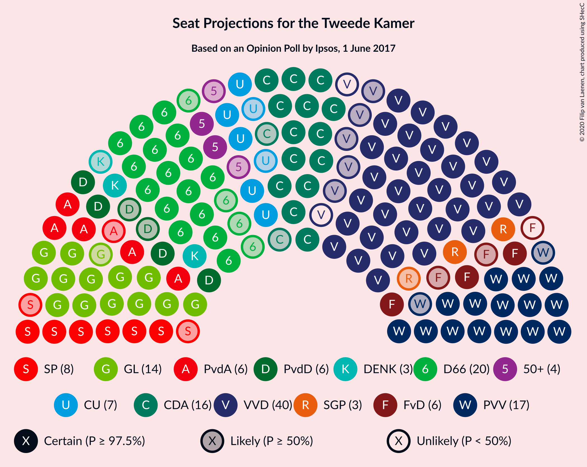
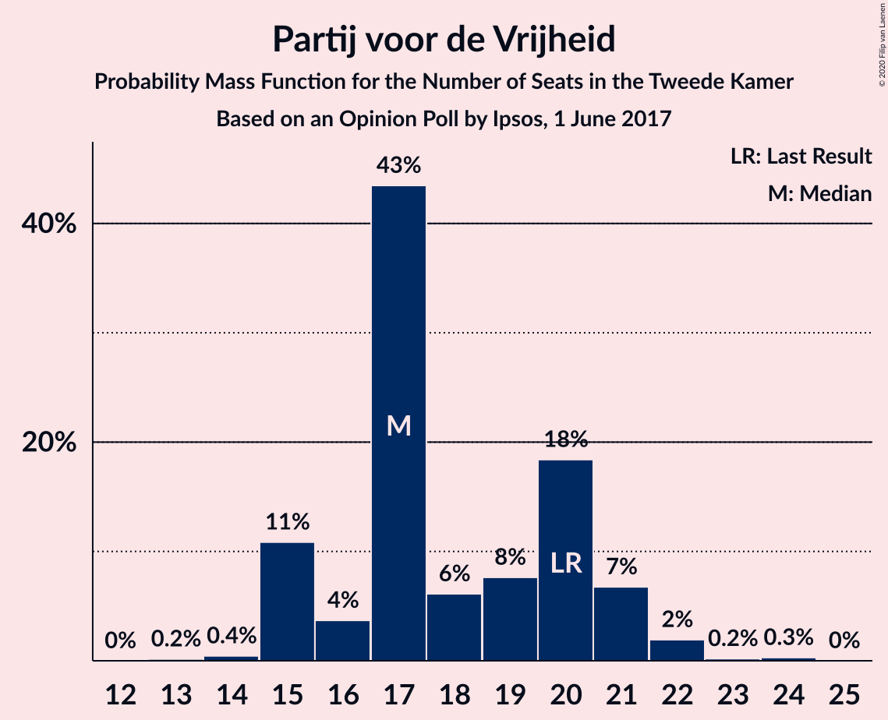
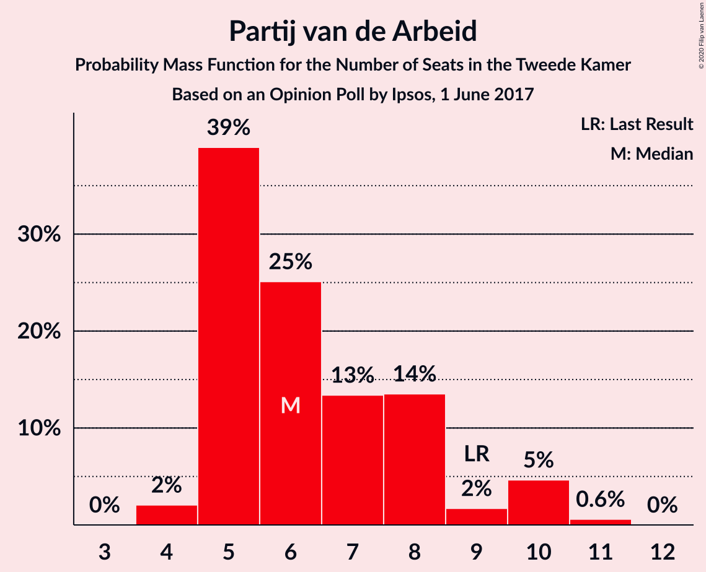
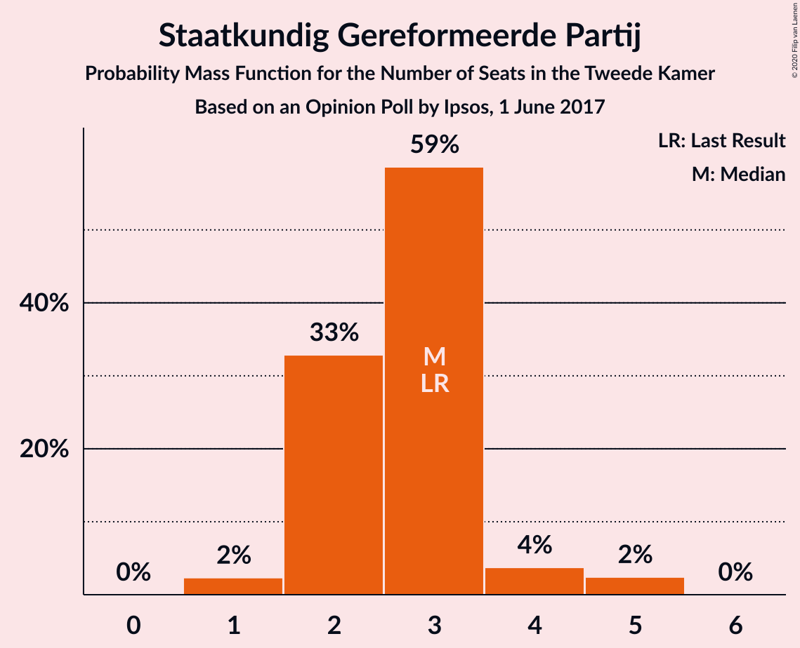
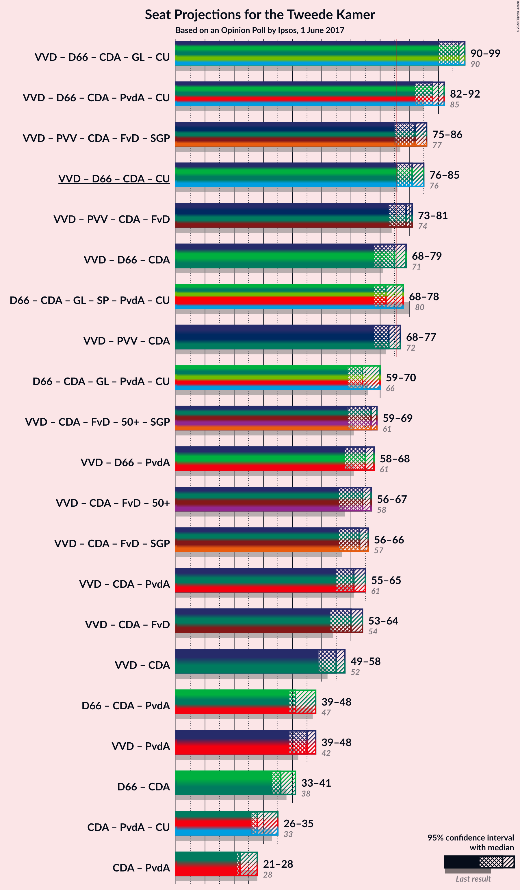
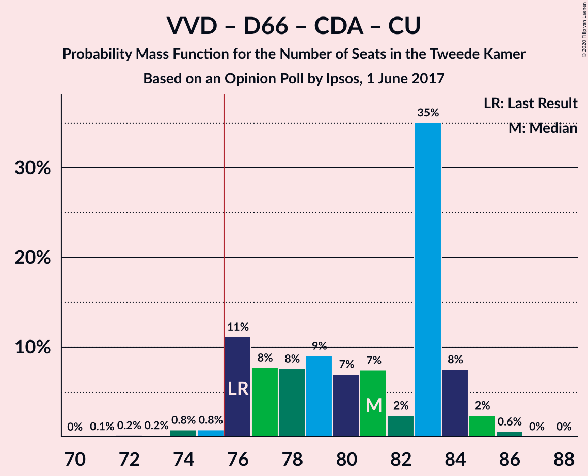
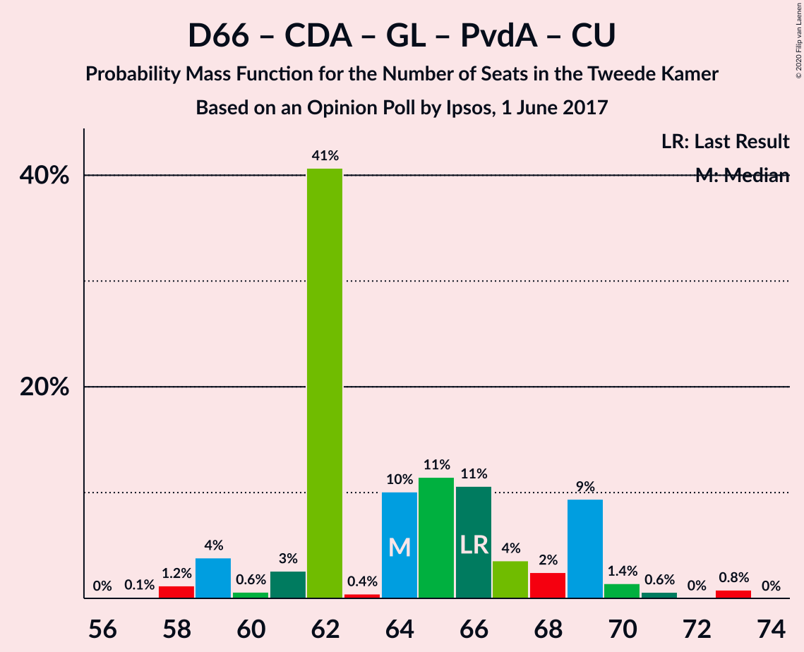
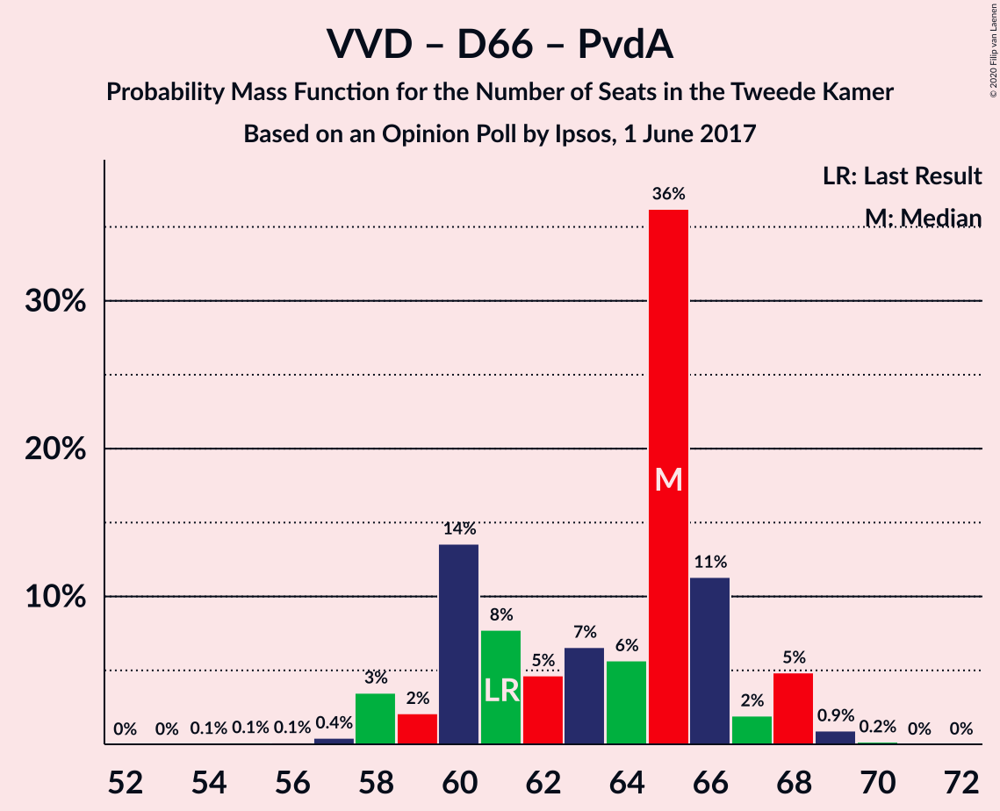
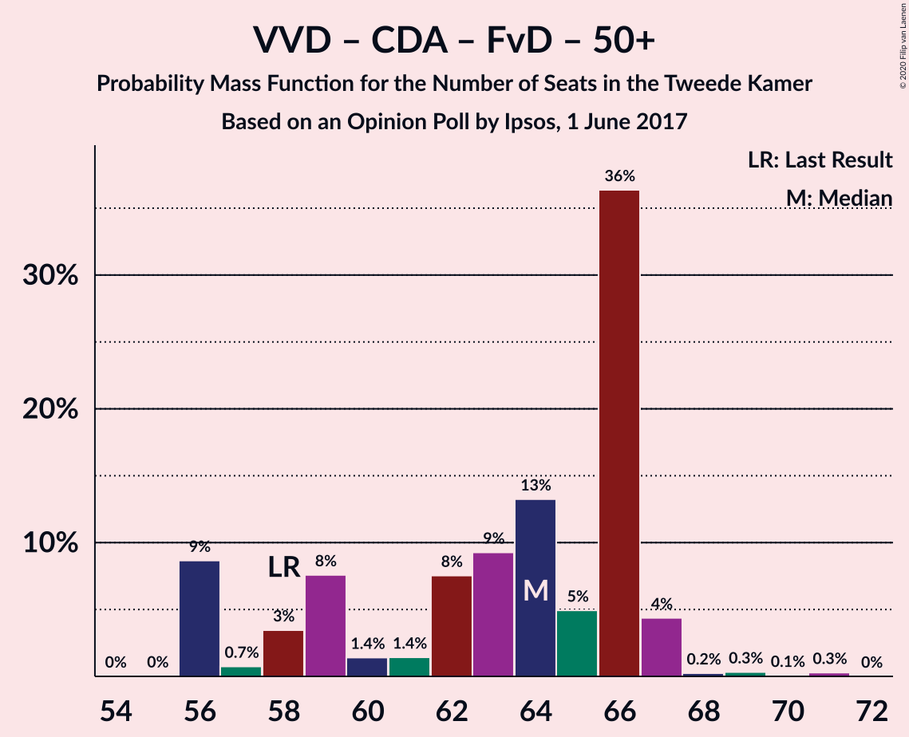

# Opinion Poll by Ipsos, 1 June 2017

<a href="#voting-intentions">Voting Intentions</a> | <a href="#seats">Seats</a> | <a href="#coalitions">Coalitions</a> | <a href="#technical-information">Technical Information</a>

## Voting Intentions

### Confidence Intervals

| Party | Last Result | Poll Result | 80% Confidence Interval | 90% Confidence Interval | 95% Confidence Interval | 99% Confidence Interval |
|:-----:|:-----------:|:-----------:|:-----------------------:|:-----------------------:|:-----------------------:|:-----------------------:|
| Volkspartij voor Vrijheid en Democratie | 21.3% | 24.0% | 22.3–25.8% |21.9–26.3% |21.4–26.7% |20.7–27.6% |
| Democraten 66 | 12.2% | 12.8% | 11.5–14.3% |11.2–14.7% |10.9–15.0% |10.3–15.7% |
| Partij voor de Vrijheid | 13.1% | 12.1% | 10.9–13.5% |10.5–13.9% |10.2–14.3% |9.6–15.0% |
| Christen-Democratisch Appèl | 12.4% | 11.4% | 10.2–12.8% |9.9–13.2% |9.6–13.5% |9.0–14.2% |
| GroenLinks | 9.1% | 10.1% | 9.0–11.4% |8.6–11.8% |8.4–12.1% |7.9–12.8% |
| Socialistische Partij | 9.1% | 5.7% | 4.9–6.8% |4.6–7.1% |4.4–7.3% |4.1–7.9% |
| Partij van de Arbeid | 5.7% | 4.5% | 3.8–5.5% |3.6–5.7% |3.4–6.0% |3.0–6.5% |
| ChristenUnie | 3.4% | 4.3% | 3.6–5.2% |3.4–5.5% |3.2–5.7% |2.9–6.2% |
| Partij voor de Dieren | 3.2% | 3.7% | 3.0–4.6% |2.9–4.8% |2.7–5.1% |2.4–5.5% |
| Forum voor Democratie | 1.8% | 3.4% | 2.8–4.3% |2.6–4.5% |2.4–4.7% |2.2–5.2% |
| 50Plus | 3.1% | 2.6% | 2.1–3.4% |1.9–3.6% |1.8–3.8% |1.6–4.2% |
| DENK | 2.1% | 2.5% | 2.0–3.3% |1.8–3.5% |1.7–3.7% |1.5–4.1% |
| Staatkundig Gereformeerde Partij | 2.1% | 1.8% | 1.4–2.5% |1.2–2.7% |1.1–2.8% |1.0–3.2% |

*Note:* The poll result column reflects the actual value used in the calculations. Published results may vary slightly, and in addition be rounded to fewer digits.

## Seats

### Confidence Intervals

| Party | Last Result | Median | 80% Confidence Interval | 90% Confidence Interval | 95% Confidence Interval | 99% Confidence Interval |
|:-----:|:-----------:|:------:|:-----------------------:|:-----------------------:|:-----------------------:|:-----------------------:|
| <a href="#volkspartij-voor-vrijheid-en-democratie">Volkspartij voor Vrijheid en Democratie</a> | 33 | 33 | 33–39 |33–41 |33–41 |31–41 |
| <a href="#democraten-66">Democraten 66</a> | 19 | 21 | 17–21 |17–21 |17–21 |17–24 |
| <a href="#partij-voor-de-vrijheid">Partij voor de Vrijheid</a> | 20 | 20 | 18–21 |18–21 |17–22 |16–23 |
| <a href="#christen-democratisch-appèl">Christen-Democratisch Appèl</a> | 19 | 16 | 16–18 |16–19 |16–21 |14–21 |
| <a href="#groenlinks">GroenLinks</a> | 14 | 16 | 14–17 |14–18 |14–18 |13–19 |
| <a href="#socialistische-partij">Socialistische Partij</a> | 14 | 10 | 7–10 |7–10 |6–10 |6–11 |
| <a href="#partij-van-de-arbeid">Partij van de Arbeid</a> | 9 | 6 | 6–8 |6–8 |5–9 |5–9 |
| <a href="#christenunie">ChristenUnie</a> | 5 | 6 | 5–6 |5–6 |5–7 |5–8 |
| <a href="#partij-voor-de-dieren">Partij voor de Dieren</a> | 5 | 5 | 5–6 |4–7 |4–7 |4–7 |
| <a href="#forum-voor-democratie">Forum voor Democratie</a> | 2 | 4 | 3–4 |3–5 |3–5 |3–6 |
| <a href="#50plus">50Plus</a> | 4 | 3 | 3–5 |2–5 |2–5 |2–5 |
| <a href="#denk">DENK</a> | 3 | 4 | 4–5 |2–5 |2–5 |2–5 |
| <a href="#staatkundig-gereformeerde-partij">Staatkundig Gereformeerde Partij</a> | 3 | 3 | 2–4 |2–4 |2–4 |1–4 |

### Volkspartij voor Vrijheid en Democratie

*For a full overview of the results for this party, see the [Volkspartij voor Vrijheid en Democratie](party-volkspartijvoorvrijheidendemocratie.html) page.*

| Number of Seats | Probability | Accumulated | Special Marks |
|:---------------:|:-----------:|:-----------:|:-------------:|
| 31 | 1.4% | 100% |  |
| 32 | 0.1% | 98.6% |  |
| 33 | 56% | 98.5% | Last Result, Median |
| 34 | 0.9% | 43% |  |
| 35 | 4% | 42% |  |
| 36 | 0.2% | 38% |  |
| 37 | 9% | 38% |  |
| 38 | 0.8% | 28% |  |
| 39 | 22% | 28% |  |
| 40 | 0.4% | 5% |  |
| 41 | 5% | 5% |  |
| 42 | 0% | 0% |  |

### Democraten 66

*For a full overview of the results for this party, see the [Democraten 66](party-democraten66.html) page.*

| Number of Seats | Probability | Accumulated | Special Marks |
|:---------------:|:-----------:|:-----------:|:-------------:|
| 15 | 0.2% | 100% |  |
| 16 | 0.1% | 99.8% |  |
| 17 | 17% | 99.7% |  |
| 18 | 14% | 83% |  |
| 19 | 9% | 69% | Last Result |
| 20 | 1.2% | 60% |  |
| 21 | 56% | 59% | Median |
| 22 | 1.2% | 2% |  |
| 23 | 0.2% | 1.2% |  |
| 24 | 1.0% | 1.1% |  |
| 25 | 0% | 0% |  |

### Partij voor de Vrijheid

*For a full overview of the results for this party, see the [Partij voor de Vrijheid](party-partijvoordevrijheid.html) page.*

| Number of Seats | Probability | Accumulated | Special Marks |
|:---------------:|:-----------:|:-----------:|:-------------:|
| 14 | 0.3% | 100% |  |
| 15 | 0.1% | 99.7% |  |
| 16 | 1.2% | 99.6% |  |
| 17 | 1.4% | 98% |  |
| 18 | 8% | 97% |  |
| 19 | 9% | 89% |  |
| 20 | 64% | 80% | Last Result, Median |
| 21 | 13% | 16% |  |
| 22 | 3% | 3% |  |
| 23 | 0.5% | 0.7% |  |
| 24 | 0.1% | 0.1% |  |
| 25 | 0% | 0% |  |

### Christen-Democratisch Appèl

*For a full overview of the results for this party, see the [Christen-Democratisch Appèl](party-christen-democratischappèl.html) page.*

| Number of Seats | Probability | Accumulated | Special Marks |
|:---------------:|:-----------:|:-----------:|:-------------:|
| 12 | 0.3% | 100% |  |
| 13 | 0% | 99.7% |  |
| 14 | 0.6% | 99.7% |  |
| 15 | 0.4% | 99.1% |  |
| 16 | 57% | 98.7% | Median |
| 17 | 18% | 41% |  |
| 18 | 14% | 24% |  |
| 19 | 5% | 10% | Last Result |
| 20 | 1.2% | 4% |  |
| 21 | 3% | 3% |  |
| 22 | 0% | 0% |  |

### GroenLinks

*For a full overview of the results for this party, see the [GroenLinks](party-groenlinks.html) page.*

| Number of Seats | Probability | Accumulated | Special Marks |
|:---------------:|:-----------:|:-----------:|:-------------:|
| 12 | 0.1% | 100% |  |
| 13 | 0.5% | 99.9% |  |
| 14 | 19% | 99.3% | Last Result |
| 15 | 6% | 80% |  |
| 16 | 56% | 75% | Median |
| 17 | 12% | 19% |  |
| 18 | 5% | 6% |  |
| 19 | 0.9% | 1.0% |  |
| 20 | 0.1% | 0.1% |  |
| 21 | 0% | 0% |  |

### Socialistische Partij

*For a full overview of the results for this party, see the [Socialistische Partij](party-socialistischepartij.html) page.*

| Number of Seats | Probability | Accumulated | Special Marks |
|:---------------:|:-----------:|:-----------:|:-------------:|
| 5 | 0.2% | 100% |  |
| 6 | 3% | 99.8% |  |
| 7 | 20% | 97% |  |
| 8 | 12% | 77% |  |
| 9 | 7% | 65% |  |
| 10 | 57% | 58% | Median |
| 11 | 0.6% | 0.7% |  |
| 12 | 0.1% | 0.1% |  |
| 13 | 0% | 0% |  |
| 14 | 0% | 0% | Last Result |

### Partij van de Arbeid

*For a full overview of the results for this party, see the [Partij van de Arbeid](party-partijvandearbeid.html) page.*

| Number of Seats | Probability | Accumulated | Special Marks |
|:---------------:|:-----------:|:-----------:|:-------------:|
| 4 | 0.1% | 100% |  |
| 5 | 3% | 99.9% |  |
| 6 | 82% | 97% | Median |
| 7 | 3% | 15% |  |
| 8 | 9% | 12% |  |
| 9 | 3% | 3% | Last Result |
| 10 | 0.1% | 0.2% |  |
| 11 | 0% | 0% |  |

### ChristenUnie

*For a full overview of the results for this party, see the [ChristenUnie](party-christenunie.html) page.*

| Number of Seats | Probability | Accumulated | Special Marks |
|:---------------:|:-----------:|:-----------:|:-------------:|
| 4 | 0.2% | 100% |  |
| 5 | 24% | 99.8% | Last Result |
| 6 | 74% | 76% | Median |
| 7 | 2% | 3% |  |
| 8 | 0.3% | 0.7% |  |
| 9 | 0.2% | 0.4% |  |
| 10 | 0.2% | 0.2% |  |
| 11 | 0% | 0% |  |

### Partij voor de Dieren

*For a full overview of the results for this party, see the [Partij voor de Dieren](party-partijvoordedieren.html) page.*

| Number of Seats | Probability | Accumulated | Special Marks |
|:---------------:|:-----------:|:-----------:|:-------------:|
| 3 | 0.3% | 100% |  |
| 4 | 7% | 99.7% |  |
| 5 | 77% | 93% | Last Result, Median |
| 6 | 8% | 17% |  |
| 7 | 8% | 8% |  |
| 8 | 0.2% | 0.3% |  |
| 9 | 0.1% | 0.1% |  |
| 10 | 0% | 0% |  |

### Forum voor Democratie

*For a full overview of the results for this party, see the [Forum voor Democratie](party-forumvoordemocratie.html) page.*

| Number of Seats | Probability | Accumulated | Special Marks |
|:---------------:|:-----------:|:-----------:|:-------------:|
| 2 | 0.5% | 100% | Last Result |
| 3 | 23% | 99.5% |  |
| 4 | 70% | 76% | Median |
| 5 | 4% | 6% |  |
| 6 | 2% | 2% |  |
| 7 | 0.2% | 0.2% |  |
| 8 | 0% | 0% |  |

### 50Plus

*For a full overview of the results for this party, see the [50Plus](party-50plus.html) page.*

| Number of Seats | Probability | Accumulated | Special Marks |
|:---------------:|:-----------:|:-----------:|:-------------:|
| 1 | 0.1% | 100% |  |
| 2 | 9% | 99.9% |  |
| 3 | 69% | 91% | Median |
| 4 | 9% | 22% | Last Result |
| 5 | 12% | 12% |  |
| 6 | 0.3% | 0.3% |  |
| 7 | 0% | 0% |  |

### DENK

*For a full overview of the results for this party, see the [DENK](party-denk.html) page.*

| Number of Seats | Probability | Accumulated | Special Marks |
|:---------------:|:-----------:|:-----------:|:-------------:|
| 2 | 6% | 100% |  |
| 3 | 2% | 94% | Last Result |
| 4 | 72% | 92% | Median |
| 5 | 20% | 20% |  |
| 6 | 0.1% | 0.1% |  |
| 7 | 0% | 0% |  |

### Staatkundig Gereformeerde Partij

*For a full overview of the results for this party, see the [Staatkundig Gereformeerde Partij](party-staatkundiggereformeerdepartij.html) page.*

| Number of Seats | Probability | Accumulated | Special Marks |
|:---------------:|:-----------:|:-----------:|:-------------:|
| 1 | 1.2% | 100% |  |
| 2 | 18% | 98.8% |  |
| 3 | 66% | 81% | Last Result, Median |
| 4 | 15% | 15% |  |
| 5 | 0% | 0.1% |  |
| 6 | 0% | 0% |  |

## Coalitions

### Confidence Intervals

| Coalition | Last Result | Median | Majority? | 80% Confidence Interval | 90% Confidence Interval | 95% Confidence Interval | 99% Confidence Interval |
|:---------:|:-----------:|:------:|:---------:|:-----------------------:|:-----------------------:|:-----------------------:|:-----------------------:|
| Volkspartij voor Vrijheid en Democratie – Democraten 66 – Christen-Democratisch Appèl – GroenLinks – ChristenUnie | 90 | 92 | 100% | 92–96 | 92–97 | 92–101 | 90–101 |
| Volkspartij voor Vrijheid en Democratie – Democraten 66 – Christen-Democratisch Appèl – Partij van de Arbeid – ChristenUnie | 85 | 82 | 100% | 82–89 | 82–89 | 82–89 | 80–92 |
| Volkspartij voor Vrijheid en Democratie – Partij voor de Vrijheid – Christen-Democratisch Appèl – Forum voor Democratie – Staatkundig Gereformeerde Partij | 77 | 76 | 99.1% | 76–85 | 76–85 | 76–86 | 75–86 |
| Volkspartij voor Vrijheid en Democratie – Democraten 66 – Christen-Democratisch Appèl – ChristenUnie | 76 | 76 | 99.2% | 76–81 | 76–81 | 76–83 | 74–85 |
| Volkspartij voor Vrijheid en Democratie – Partij voor de Vrijheid – Christen-Democratisch Appèl – Forum voor Democratie | 74 | 73 | 41% | 73–81 | 73–81 | 73–83 | 72–83 |
| Volkspartij voor Vrijheid en Democratie – Partij voor de Vrijheid – Christen-Democratisch Appèl | 72 | 69 | 30% | 69–77 | 69–77 | 69–78 | 68–78 |
| Volkspartij voor Vrijheid en Democratie – Democraten 66 – Christen-Democratisch Appèl | 71 | 70 | 4% | 70–75 | 70–75 | 70–77 | 69–79 |
| Democraten 66 – Christen-Democratisch Appèl – GroenLinks – Socialistische Partij – Partij van de Arbeid – ChristenUnie | 80 | 75 | 7% | 69–75 | 69–76 | 69–77 | 69–80 |
| Democraten 66 – Christen-Democratisch Appèl – GroenLinks – Partij van de Arbeid – ChristenUnie | 66 | 65 | 0% | 62–65 | 61–67 | 61–69 | 60–71 |
| Volkspartij voor Vrijheid en Democratie – Christen-Democratisch Appèl – Forum voor Democratie – 50Plus – Staatkundig Gereformeerde Partij | 61 | 59 | 0% | 59–67 | 59–67 | 59–68 | 59–68 |
| Volkspartij voor Vrijheid en Democratie – Democraten 66 – Partij van de Arbeid | 61 | 60 | 0% | 60–65 | 60–65 | 59–65 | 58–67 |
| Volkspartij voor Vrijheid en Democratie – Christen-Democratisch Appèl – Forum voor Democratie – 50Plus | 58 | 56 | 0% | 56–64 | 56–65 | 56–65 | 56–65 |
| Volkspartij voor Vrijheid en Democratie – Christen-Democratisch Appèl – Forum voor Democratie – Staatkundig Gereformeerde Partij | 57 | 56 | 0% | 56–65 | 56–65 | 56–65 | 56–65 |
| Volkspartij voor Vrijheid en Democratie – Christen-Democratisch Appèl – Partij van de Arbeid | 61 | 55 | 0% | 55–65 | 55–65 | 55–65 | 54–65 |
| Volkspartij voor Vrijheid en Democratie – Christen-Democratisch Appèl – Forum voor Democratie | 54 | 53 | 0% | 53–61 | 53–62 | 53–62 | 53–62 |
| Volkspartij voor Vrijheid en Democratie – Christen-Democratisch Appèl | 52 | 49 | 0% | 49–57 | 49–58 | 49–58 | 47–58 |
| Volkspartij voor Vrijheid en Democratie – Partij van de Arbeid | 42 | 39 | 0% | 39–47 | 39–47 | 39–47 | 38–48 |
| Democraten 66 – Christen-Democratisch Appèl – Partij van de Arbeid | 47 | 43 | 0% | 40–44 | 40–45 | 40–46 | 40–51 |
| Democraten 66 – Christen-Democratisch Appèl | 38 | 37 | 0% | 34–37 | 34–38 | 34–39 | 33–44 |
| Christen-Democratisch Appèl – Partij van de Arbeid – ChristenUnie | 33 | 28 | 0% | 28–32 | 28–32 | 28–33 | 27–34 |
| Christen-Democratisch Appèl – Partij van de Arbeid | 28 | 22 | 0% | 22–26 | 22–27 | 22–28 | 21–28 |

### Volkspartij voor Vrijheid en Democratie – Democraten 66 – Christen-Democratisch Appèl – GroenLinks – ChristenUnie

| Number of Seats | Probability | Accumulated | Special Marks |
|:---------------:|:-----------:|:-----------:|:-------------:|
| 87 | 0% | 100% |  |
| 88 | 0% | 99.9% |  |
| 89 | 0% | 99.9% |  |
| 90 | 1.4% | 99.9% | Last Result |
| 91 | 0.1% | 98.6% |  |
| 92 | 56% | 98% | Median |
| 93 | 9% | 42% |  |
| 94 | 0.9% | 33% |  |
| 95 | 20% | 32% |  |
| 96 | 6% | 12% |  |
| 97 | 3% | 7% |  |
| 98 | 0.2% | 4% |  |
| 99 | 1.1% | 4% |  |
| 100 | 0.1% | 3% |  |
| 101 | 2% | 3% |  |
| 102 | 0.1% | 0.4% |  |
| 103 | 0.3% | 0.3% |  |
| 104 | 0% | 0% |  |

### Volkspartij voor Vrijheid en Democratie – Democraten 66 – Christen-Democratisch Appèl – Partij van de Arbeid – ChristenUnie

| Number of Seats | Probability | Accumulated | Special Marks |
|:---------------:|:-----------:|:-----------:|:-------------:|
| 79 | 0.1% | 100% |  |
| 80 | 0.6% | 99.9% |  |
| 81 | 0.1% | 99.3% |  |
| 82 | 56% | 99.2% | Median |
| 83 | 1.4% | 43% |  |
| 84 | 12% | 42% |  |
| 85 | 9% | 30% | Last Result |
| 86 | 0.8% | 22% |  |
| 87 | 5% | 21% |  |
| 88 | 5% | 15% |  |
| 89 | 8% | 10% |  |
| 90 | 0.2% | 2% |  |
| 91 | 0.3% | 1.5% |  |
| 92 | 1.1% | 1.2% |  |
| 93 | 0.1% | 0.1% |  |
| 94 | 0% | 0% |  |

### Volkspartij voor Vrijheid en Democratie – Partij voor de Vrijheid – Christen-Democratisch Appèl – Forum voor Democratie – Staatkundig Gereformeerde Partij

| Number of Seats | Probability | Accumulated | Special Marks |
|:---------------:|:-----------:|:-----------:|:-------------:|
| 73 | 0.1% | 100% |  |
| 74 | 0.2% | 99.9% |  |
| 75 | 0.6% | 99.7% |  |
| 76 | 56% | 99.1% | Median, Majority |
| 77 | 2% | 43% | Last Result |
| 78 | 1.1% | 41% |  |
| 79 | 3% | 40% |  |
| 80 | 0.3% | 36% |  |
| 81 | 6% | 36% |  |
| 82 | 14% | 30% |  |
| 83 | 5% | 16% |  |
| 84 | 0% | 11% |  |
| 85 | 9% | 11% |  |
| 86 | 3% | 3% |  |
| 87 | 0% | 0% |  |

### Volkspartij voor Vrijheid en Democratie – Democraten 66 – Christen-Democratisch Appèl – ChristenUnie

| Number of Seats | Probability | Accumulated | Special Marks |
|:---------------:|:-----------:|:-----------:|:-------------:|
| 72 | 0% | 100% |  |
| 73 | 0.1% | 99.9% |  |
| 74 | 0.6% | 99.9% |  |
| 75 | 0.1% | 99.3% |  |
| 76 | 57% | 99.2% | Last Result, Median, Majority |
| 77 | 0.3% | 42% |  |
| 78 | 12% | 42% |  |
| 79 | 12% | 30% |  |
| 80 | 0.4% | 18% |  |
| 81 | 13% | 17% |  |
| 82 | 0.2% | 4% |  |
| 83 | 2% | 4% |  |
| 84 | 0.3% | 2% |  |
| 85 | 1.1% | 1.2% |  |
| 86 | 0% | 0.1% |  |
| 87 | 0.1% | 0.1% |  |
| 88 | 0% | 0% |  |

### Volkspartij voor Vrijheid en Democratie – Partij voor de Vrijheid – Christen-Democratisch Appèl – Forum voor Democratie

| Number of Seats | Probability | Accumulated | Special Marks |
|:---------------:|:-----------:|:-----------:|:-------------:|
| 71 | 0.1% | 100% |  |
| 72 | 0.6% | 99.9% |  |
| 73 | 56% | 99.2% | Median |
| 74 | 2% | 43% | Last Result |
| 75 | 0.3% | 41% |  |
| 76 | 2% | 41% | Majority |
| 77 | 9% | 39% |  |
| 78 | 0.3% | 30% |  |
| 79 | 0.1% | 30% |  |
| 80 | 19% | 30% |  |
| 81 | 8% | 11% |  |
| 82 | 0.3% | 3% |  |
| 83 | 3% | 3% |  |
| 84 | 0.2% | 0.2% |  |
| 85 | 0% | 0% |  |

### Volkspartij voor Vrijheid en Democratie – Partij voor de Vrijheid – Christen-Democratisch Appèl

| Number of Seats | Probability | Accumulated | Special Marks |
|:---------------:|:-----------:|:-----------:|:-------------:|
| 66 | 0.1% | 100% |  |
| 67 | 0.1% | 99.9% |  |
| 68 | 2% | 99.8% |  |
| 69 | 56% | 98% | Median |
| 70 | 0.2% | 42% |  |
| 71 | 2% | 42% |  |
| 72 | 0.6% | 40% | Last Result |
| 73 | 0.4% | 39% |  |
| 74 | 9% | 39% |  |
| 75 | 0.4% | 30% |  |
| 76 | 5% | 30% | Majority |
| 77 | 22% | 25% |  |
| 78 | 3% | 3% |  |
| 79 | 0% | 0.2% |  |
| 80 | 0.2% | 0.2% |  |
| 81 | 0% | 0% |  |

### Volkspartij voor Vrijheid en Democratie – Democraten 66 – Christen-Democratisch Appèl

| Number of Seats | Probability | Accumulated | Special Marks |
|:---------------:|:-----------:|:-----------:|:-------------:|
| 66 | 0% | 100% |  |
| 67 | 0.1% | 99.9% |  |
| 68 | 0% | 99.9% |  |
| 69 | 2% | 99.9% |  |
| 70 | 56% | 98% | Median |
| 71 | 0.2% | 42% | Last Result |
| 72 | 1.0% | 42% |  |
| 73 | 12% | 41% |  |
| 74 | 11% | 28% |  |
| 75 | 13% | 17% |  |
| 76 | 0.1% | 4% | Majority |
| 77 | 2% | 4% |  |
| 78 | 0.4% | 1.5% |  |
| 79 | 1.1% | 1.1% |  |
| 80 | 0% | 0% |  |

### Democraten 66 – Christen-Democratisch Appèl – GroenLinks – Socialistische Partij – Partij van de Arbeid – ChristenUnie

| Number of Seats | Probability | Accumulated | Special Marks |
|:---------------:|:-----------:|:-----------:|:-------------:|
| 67 | 0.2% | 100% |  |
| 68 | 0.2% | 99.8% |  |
| 69 | 12% | 99.6% |  |
| 70 | 11% | 88% |  |
| 71 | 9% | 77% |  |
| 72 | 3% | 68% |  |
| 73 | 3% | 66% |  |
| 74 | 0.2% | 63% |  |
| 75 | 56% | 63% | Median |
| 76 | 2% | 7% | Majority |
| 77 | 3% | 5% |  |
| 78 | 0.2% | 2% |  |
| 79 | 0% | 1.4% |  |
| 80 | 1.0% | 1.3% | Last Result |
| 81 | 0.3% | 0.3% |  |
| 82 | 0% | 0% |  |

### Democraten 66 – Christen-Democratisch Appèl – GroenLinks – Partij van de Arbeid – ChristenUnie

| Number of Seats | Probability | Accumulated | Special Marks |
|:---------------:|:-----------:|:-----------:|:-------------:|
| 59 | 0% | 100% |  |
| 60 | 0.5% | 99.9% |  |
| 61 | 5% | 99.4% |  |
| 62 | 18% | 95% |  |
| 63 | 0% | 77% |  |
| 64 | 11% | 77% |  |
| 65 | 57% | 66% | Median |
| 66 | 1.3% | 9% | Last Result |
| 67 | 2% | 7% |  |
| 68 | 0.5% | 5% |  |
| 69 | 3% | 4% |  |
| 70 | 0.1% | 2% |  |
| 71 | 1.1% | 1.4% |  |
| 72 | 0.1% | 0.4% |  |
| 73 | 0.3% | 0.3% |  |
| 74 | 0% | 0% |  |

### Volkspartij voor Vrijheid en Democratie – Christen-Democratisch Appèl – Forum voor Democratie – 50Plus – Staatkundig Gereformeerde Partij

| Number of Seats | Probability | Accumulated | Special Marks |
|:---------------:|:-----------:|:-----------:|:-------------:|
| 58 | 0.1% | 100% |  |
| 59 | 57% | 99.9% | Median |
| 60 | 0.1% | 43% |  |
| 61 | 1.3% | 43% | Last Result |
| 62 | 0% | 41% |  |
| 63 | 0.2% | 41% |  |
| 64 | 2% | 41% |  |
| 65 | 3% | 39% |  |
| 66 | 20% | 36% |  |
| 67 | 11% | 16% |  |
| 68 | 5% | 5% |  |
| 69 | 0.1% | 0.1% |  |
| 70 | 0% | 0.1% |  |
| 71 | 0% | 0% |  |

### Volkspartij voor Vrijheid en Democratie – Democraten 66 – Partij van de Arbeid

| Number of Seats | Probability | Accumulated | Special Marks |
|:---------------:|:-----------:|:-----------:|:-------------:|
| 57 | 0.3% | 100% |  |
| 58 | 0.6% | 99.6% |  |
| 59 | 3% | 99.0% |  |
| 60 | 57% | 96% | Median |
| 61 | 0.3% | 39% | Last Result |
| 62 | 18% | 39% |  |
| 63 | 3% | 21% |  |
| 64 | 8% | 19% |  |
| 65 | 9% | 11% |  |
| 66 | 1.3% | 2% |  |
| 67 | 0.4% | 0.8% |  |
| 68 | 0.3% | 0.4% |  |
| 69 | 0.1% | 0.1% |  |
| 70 | 0% | 0% |  |

### Volkspartij voor Vrijheid en Democratie – Christen-Democratisch Appèl – Forum voor Democratie – 50Plus

| Number of Seats | Probability | Accumulated | Special Marks |
|:---------------:|:-----------:|:-----------:|:-------------:|
| 56 | 57% | 100% | Median |
| 57 | 0.6% | 43% |  |
| 58 | 0.7% | 42% | Last Result |
| 59 | 0.3% | 42% |  |
| 60 | 0.4% | 41% |  |
| 61 | 0.1% | 41% |  |
| 62 | 7% | 41% |  |
| 63 | 12% | 34% |  |
| 64 | 17% | 22% |  |
| 65 | 5% | 5% |  |
| 66 | 0.1% | 0.1% |  |
| 67 | 0% | 0.1% |  |
| 68 | 0% | 0.1% |  |
| 69 | 0% | 0% |  |

### Volkspartij voor Vrijheid en Democratie – Christen-Democratisch Appèl – Forum voor Democratie – Staatkundig Gereformeerde Partij

| Number of Seats | Probability | Accumulated | Special Marks |
|:---------------:|:-----------:|:-----------:|:-------------:|
| 54 | 0% | 100% |  |
| 55 | 0.2% | 99.9% |  |
| 56 | 57% | 99.8% | Median |
| 57 | 0% | 43% | Last Result |
| 58 | 0.9% | 43% |  |
| 59 | 0.7% | 42% |  |
| 60 | 0.2% | 41% |  |
| 61 | 16% | 41% |  |
| 62 | 7% | 25% |  |
| 63 | 3% | 18% |  |
| 64 | 3% | 16% |  |
| 65 | 13% | 13% |  |
| 66 | 0% | 0.1% |  |
| 67 | 0% | 0.1% |  |
| 68 | 0% | 0% |  |

### Volkspartij voor Vrijheid en Democratie – Christen-Democratisch Appèl – Partij van de Arbeid

| Number of Seats | Probability | Accumulated | Special Marks |
|:---------------:|:-----------:|:-----------:|:-------------:|
| 53 | 0% | 100% |  |
| 54 | 1.1% | 99.9% |  |
| 55 | 56% | 98.9% | Median |
| 56 | 0.5% | 43% |  |
| 57 | 0.8% | 43% |  |
| 58 | 0.4% | 42% |  |
| 59 | 0.1% | 41% |  |
| 60 | 0.7% | 41% |  |
| 61 | 6% | 41% | Last Result |
| 62 | 15% | 34% |  |
| 63 | 3% | 19% |  |
| 64 | 5% | 16% |  |
| 65 | 11% | 11% |  |
| 66 | 0.2% | 0.2% |  |
| 67 | 0% | 0% |  |

### Volkspartij voor Vrijheid en Democratie – Christen-Democratisch Appèl – Forum voor Democratie

| Number of Seats | Probability | Accumulated | Special Marks |
|:---------------:|:-----------:|:-----------:|:-------------:|
| 51 | 0% | 100% |  |
| 52 | 0% | 99.9% |  |
| 53 | 57% | 99.9% | Median |
| 54 | 0.1% | 43% | Last Result |
| 55 | 1.0% | 43% |  |
| 56 | 0.3% | 42% |  |
| 57 | 0.4% | 41% |  |
| 58 | 6% | 41% |  |
| 59 | 15% | 34% |  |
| 60 | 2% | 20% |  |
| 61 | 13% | 18% |  |
| 62 | 5% | 5% |  |
| 63 | 0% | 0.1% |  |
| 64 | 0% | 0% |  |

### Volkspartij voor Vrijheid en Democratie – Christen-Democratisch Appèl

| Number of Seats | Probability | Accumulated | Special Marks |
|:---------------:|:-----------:|:-----------:|:-------------:|
| 47 | 1.1% | 100% |  |
| 48 | 0.1% | 98.9% |  |
| 49 | 56% | 98.8% | Median |
| 50 | 0.5% | 43% |  |
| 51 | 0.8% | 43% |  |
| 52 | 0.9% | 42% | Last Result |
| 53 | 0.3% | 41% |  |
| 54 | 0.5% | 41% |  |
| 55 | 7% | 40% |  |
| 56 | 17% | 33% |  |
| 57 | 8% | 16% |  |
| 58 | 8% | 8% |  |
| 59 | 0% | 0% |  |

### Volkspartij voor Vrijheid en Democratie – Partij van de Arbeid

| Number of Seats | Probability | Accumulated | Special Marks |
|:---------------:|:-----------:|:-----------:|:-------------:|
| 37 | 0.4% | 100% |  |
| 38 | 1.1% | 99.6% |  |
| 39 | 56% | 98.5% | Median |
| 40 | 0.6% | 43% |  |
| 41 | 3% | 42% |  |
| 42 | 1.3% | 39% | Last Result |
| 43 | 6% | 38% |  |
| 44 | 3% | 32% |  |
| 45 | 12% | 29% |  |
| 46 | 3% | 17% |  |
| 47 | 13% | 14% |  |
| 48 | 0.4% | 0.6% |  |
| 49 | 0.2% | 0.2% |  |
| 50 | 0% | 0% |  |

### Democraten 66 – Christen-Democratisch Appèl – Partij van de Arbeid

| Number of Seats | Probability | Accumulated | Special Marks |
|:---------------:|:-----------:|:-----------:|:-------------:|
| 37 | 0.1% | 100% |  |
| 38 | 0.1% | 99.9% |  |
| 39 | 0.2% | 99.8% |  |
| 40 | 17% | 99.7% |  |
| 41 | 0.8% | 83% |  |
| 42 | 0.6% | 82% |  |
| 43 | 65% | 82% | Median |
| 44 | 9% | 17% |  |
| 45 | 4% | 8% |  |
| 46 | 3% | 4% |  |
| 47 | 0.1% | 2% | Last Result |
| 48 | 0.6% | 2% |  |
| 49 | 0.1% | 1.1% |  |
| 50 | 0% | 1.0% |  |
| 51 | 1.0% | 1.0% |  |
| 52 | 0% | 0% |  |

### Democraten 66 – Christen-Democratisch Appèl

| Number of Seats | Probability | Accumulated | Special Marks |
|:---------------:|:-----------:|:-----------:|:-------------:|
| 31 | 0.1% | 100% |  |
| 32 | 0.3% | 99.9% |  |
| 33 | 0.3% | 99.6% |  |
| 34 | 17% | 99.3% |  |
| 35 | 2% | 82% |  |
| 36 | 8% | 81% |  |
| 37 | 64% | 73% | Median |
| 38 | 4% | 8% | Last Result |
| 39 | 3% | 5% |  |
| 40 | 0.3% | 2% |  |
| 41 | 0.4% | 1.5% |  |
| 42 | 0.1% | 1.1% |  |
| 43 | 0% | 1.1% |  |
| 44 | 1.0% | 1.0% |  |
| 45 | 0% | 0% |  |

### Christen-Democratisch Appèl – Partij van de Arbeid – ChristenUnie

| Number of Seats | Probability | Accumulated | Special Marks |
|:---------------:|:-----------:|:-----------:|:-------------:|
| 23 | 0% | 100% |  |
| 24 | 0% | 99.9% |  |
| 25 | 0.1% | 99.9% |  |
| 26 | 0.2% | 99.9% |  |
| 27 | 0.4% | 99.6% |  |
| 28 | 68% | 99.2% | Median |
| 29 | 11% | 31% |  |
| 30 | 4% | 20% |  |
| 31 | 0.5% | 16% |  |
| 32 | 11% | 16% |  |
| 33 | 4% | 5% | Last Result |
| 34 | 0.6% | 0.8% |  |
| 35 | 0% | 0.1% |  |
| 36 | 0.1% | 0.1% |  |
| 37 | 0% | 0% |  |

### Christen-Democratisch Appèl – Partij van de Arbeid

| Number of Seats | Probability | Accumulated | Special Marks |
|:---------------:|:-----------:|:-----------:|:-------------:|
| 18 | 0.1% | 100% |  |
| 19 | 0.1% | 99.9% |  |
| 20 | 0.3% | 99.9% |  |
| 21 | 0.4% | 99.5% |  |
| 22 | 56% | 99.2% | Median |
| 23 | 18% | 43% |  |
| 24 | 9% | 25% |  |
| 25 | 0.7% | 16% |  |
| 26 | 9% | 15% |  |
| 27 | 4% | 7% |  |
| 28 | 3% | 3% | Last Result |
| 29 | 0.1% | 0.1% |  |
| 30 | 0% | 0% |  |

## Technical Information

### Opinion Poll

+ **Polling firm:** Ipsos
+ **Commissioner(s):** —
+ **Fieldwork period:** 1 June 2017

### Calculations

+ **Sample size:** 1000
+ **Simulations done:** 131,072
+ **Error estimate:** 3.81%

