# Opinion Poll by Peil.nl, 4 June 2017

<a href="#voting-intentions">Voting Intentions</a> | <a href="#seats">Seats</a> | <a href="#coalitions">Coalitions</a> | <a href="#technical-information">Technical Information</a>

## Voting Intentions

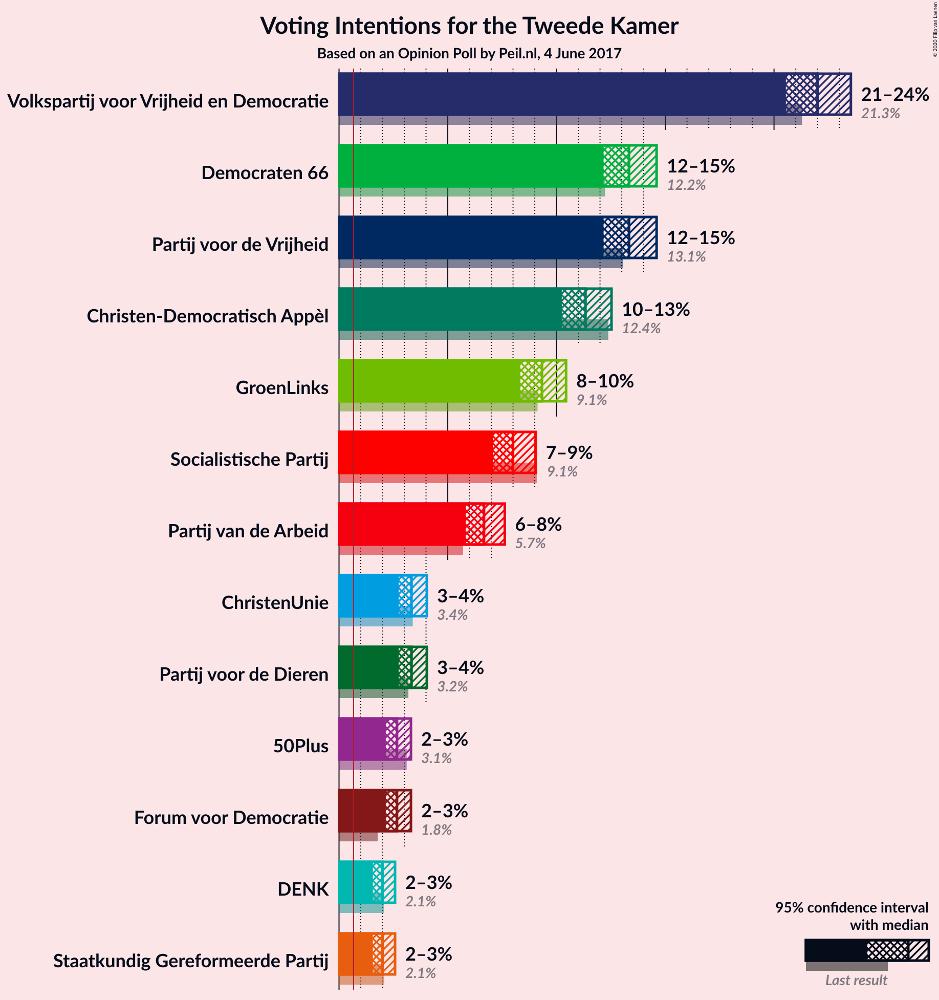

### Confidence Intervals

| Party | Last Result | Poll Result | 80% Confidence Interval | 90% Confidence Interval | 95% Confidence Interval | 99% Confidence Interval |
|:-----:|:-----------:|:-----------:|:-----------------------:|:-----------------------:|:-----------------------:|:-----------------------:|
| Volkspartij voor Vrijheid en Democratie | 21.3% | 22.0% | 21.0–23.0% |20.8–23.3% |20.5–23.5% |20.1–24.0% |
| Partij voor de Vrijheid | 13.1% | 13.3% | 12.6–14.2% |12.3–14.4% |12.2–14.6% |11.8–15.0% |
| Democraten 66 | 12.2% | 13.3% | 12.6–14.2% |12.3–14.4% |12.2–14.6% |11.8–15.0% |
| Christen-Democratisch Appèl | 12.4% | 11.3% | 10.6–12.1% |10.4–12.3% |10.2–12.5% |9.9–12.9% |
| GroenLinks | 9.1% | 9.3% | 8.7–10.1% |8.5–10.3% |8.3–10.4% |8.0–10.8% |
| Socialistische Partij | 9.1% | 8.0% | 7.4–8.7% |7.2–8.9% |7.1–9.0% |6.8–9.4% |
| Partij van de Arbeid | 5.7% | 6.7% | 6.1–7.3% |6.0–7.5% |5.8–7.6% |5.6–7.9% |
| ChristenUnie | 3.4% | 3.3% | 2.9–3.8% |2.8–3.9% |2.7–4.0% |2.6–4.3% |
| Partij voor de Dieren | 3.2% | 3.3% | 2.9–3.8% |2.8–3.9% |2.7–4.0% |2.6–4.3% |
| 50Plus | 3.1% | 2.7% | 2.3–3.1% |2.2–3.2% |2.1–3.3% |2.0–3.5% |
| Forum voor Democratie | 1.8% | 2.7% | 2.3–3.1% |2.2–3.2% |2.1–3.3% |2.0–3.5% |
| Staatkundig Gereformeerde Partij | 2.1% | 2.0% | 1.7–2.4% |1.6–2.5% |1.6–2.6% |1.4–2.8% |
| DENK | 2.1% | 2.0% | 1.7–2.4% |1.6–2.5% |1.6–2.6% |1.4–2.8% |

*Note:* The poll result column reflects the actual value used in the calculations. Published results may vary slightly, and in addition be rounded to fewer digits.

## Seats

### Confidence Intervals

| Party | Last Result | Median | 80% Confidence Interval | 90% Confidence Interval | 95% Confidence Interval | 99% Confidence Interval |
|:-----:|:-----------:|:------:|:-----------------------:|:-----------------------:|:-----------------------:|:-----------------------:|
| <a href="#volkspartij-voor-vrijheid-en-democratie">Volkspartij voor Vrijheid en Democratie</a> | 33 | 33 | 33–35 |32–35 |30–37 |30–38 |
| <a href="#partij-voor-de-vrijheid">Partij voor de Vrijheid</a> | 20 | 20 | 19–22 |19–22 |19–22 |17–22 |
| <a href="#democraten-66">Democraten 66</a> | 19 | 20 | 19–22 |19–22 |19–24 |18–24 |
| <a href="#christen-democratisch-appèl">Christen-Democratisch Appèl</a> | 19 | 18 | 15–19 |15–19 |15–20 |15–20 |
| <a href="#groenlinks">GroenLinks</a> | 14 | 15 | 13–16 |13–16 |13–16 |12–17 |
| <a href="#socialistische-partij">Socialistische Partij</a> | 14 | 12 | 11–14 |11–14 |10–14 |10–15 |
| <a href="#partij-van-de-arbeid">Partij van de Arbeid</a> | 9 | 10 | 9–10 |8–11 |8–11 |8–11 |
| <a href="#christenunie">ChristenUnie</a> | 5 | 5 | 4–6 |4–6 |4–6 |3–6 |
| <a href="#partij-voor-de-dieren">Partij voor de Dieren</a> | 5 | 4 | 4–5 |4–5 |4–6 |4–6 |
| <a href="#50plus">50Plus</a> | 4 | 4 | 3–4 |3–4 |3–4 |2–5 |
| <a href="#forum-voor-democratie">Forum voor Democratie</a> | 2 | 4 | 4–5 |3–5 |3–5 |3–5 |
| <a href="#staatkundig-gereformeerde-partij">Staatkundig Gereformeerde Partij</a> | 3 | 2 | 2–3 |2–3 |2–4 |2–4 |
| <a href="#denk">DENK</a> | 3 | 2 | 2–3 |2–3 |2–3 |2–4 |

### Volkspartij voor Vrijheid en Democratie

*For a full overview of the results for this party, see the [Volkspartij voor Vrijheid en Democratie](party-volkspartijvoorvrijheidendemocratie.html) page.*

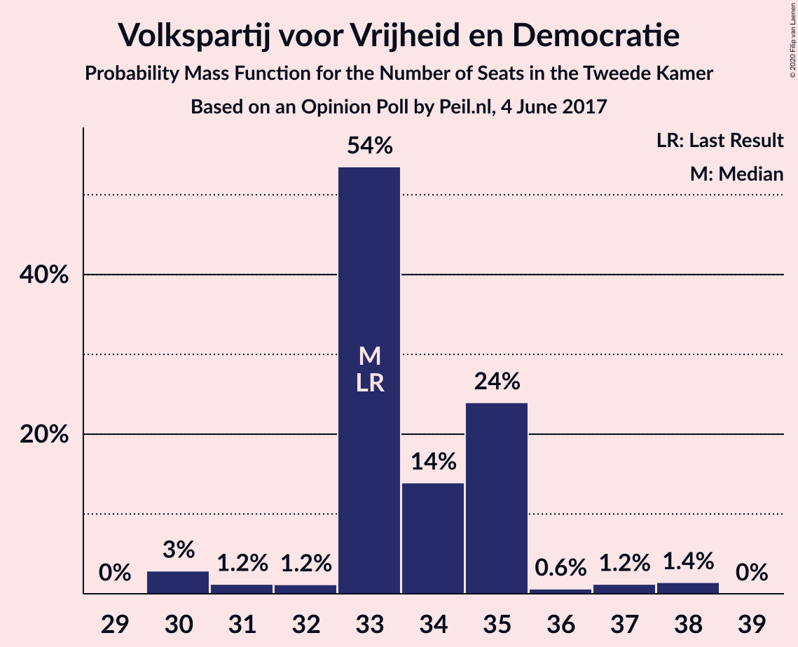

| Number of Seats | Probability | Accumulated | Special Marks |
|:---------------:|:-----------:|:-----------:|:-------------:|
| 30 | 3% | 100% |  |
| 31 | 1.2% | 97% |  |
| 32 | 1.2% | 96% |  |
| 33 | 54% | 95% | Last Result, Median |
| 34 | 14% | 41% |  |
| 35 | 24% | 27% |  |
| 36 | 0.6% | 3% |  |
| 37 | 1.2% | 3% |  |
| 38 | 1.4% | 1.5% |  |
| 39 | 0% | 0% |  |

### Partij voor de Vrijheid

*For a full overview of the results for this party, see the [Partij voor de Vrijheid](party-partijvoordevrijheid.html) page.*

| Number of Seats | Probability | Accumulated | Special Marks |
|:---------------:|:-----------:|:-----------:|:-------------:|
| 17 | 0.9% | 100% |  |
| 18 | 0.6% | 99.1% |  |
| 19 | 48% | 98.5% |  |
| 20 | 14% | 51% | Last Result, Median |
| 21 | 24% | 37% |  |
| 22 | 12% | 13% |  |
| 23 | 0.2% | 0.2% |  |
| 24 | 0% | 0% |  |

### Democraten 66

*For a full overview of the results for this party, see the [Democraten 66](party-democraten66.html) page.*

| Number of Seats | Probability | Accumulated | Special Marks |
|:---------------:|:-----------:|:-----------:|:-------------:|
| 17 | 0.2% | 100% |  |
| 18 | 1.1% | 99.8% |  |
| 19 | 45% | 98.7% | Last Result |
| 20 | 34% | 54% | Median |
| 21 | 6% | 20% |  |
| 22 | 9% | 14% |  |
| 23 | 2% | 5% |  |
| 24 | 3% | 3% |  |
| 25 | 0% | 0% |  |

### Christen-Democratisch Appèl

*For a full overview of the results for this party, see the [Christen-Democratisch Appèl](party-christen-democratischappèl.html) page.*

| Number of Seats | Probability | Accumulated | Special Marks |
|:---------------:|:-----------:|:-----------:|:-------------:|
| 14 | 0.1% | 100% |  |
| 15 | 10% | 99.9% |  |
| 16 | 5% | 90% |  |
| 17 | 3% | 85% |  |
| 18 | 51% | 81% | Median |
| 19 | 27% | 30% | Last Result |
| 20 | 3% | 3% |  |
| 21 | 0% | 0% |  |

### GroenLinks

*For a full overview of the results for this party, see the [GroenLinks](party-groenlinks.html) page.*

| Number of Seats | Probability | Accumulated | Special Marks |
|:---------------:|:-----------:|:-----------:|:-------------:|
| 12 | 2% | 100% |  |
| 13 | 13% | 98% |  |
| 14 | 25% | 85% | Last Result |
| 15 | 24% | 60% | Median |
| 16 | 35% | 36% |  |
| 17 | 0.7% | 0.7% |  |
| 18 | 0% | 0% |  |

### Socialistische Partij

*For a full overview of the results for this party, see the [Socialistische Partij](party-socialistischepartij.html) page.*

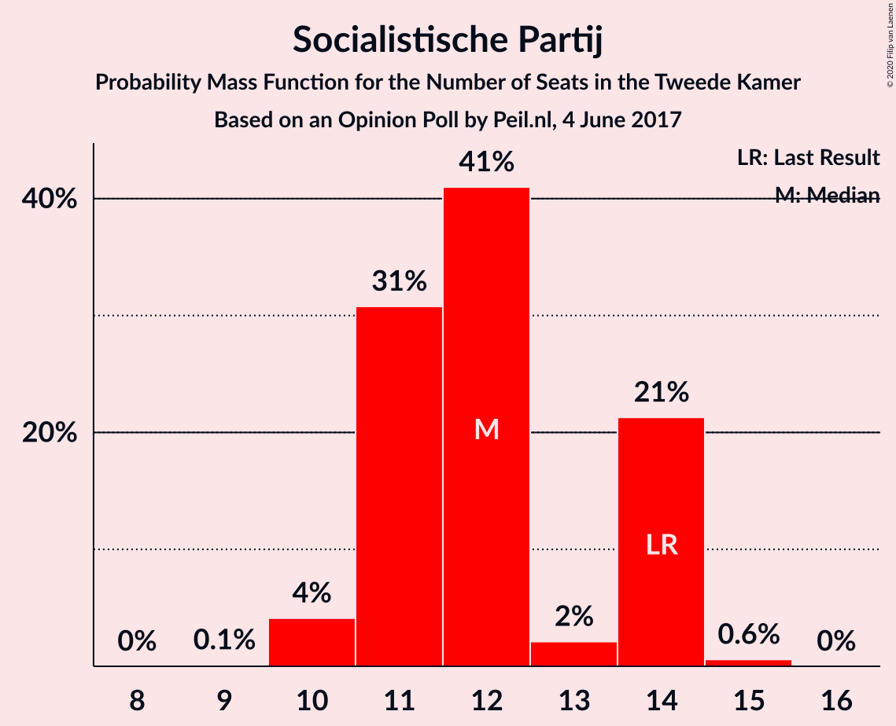

| Number of Seats | Probability | Accumulated | Special Marks |
|:---------------:|:-----------:|:-----------:|:-------------:|
| 9 | 0.1% | 100% |  |
| 10 | 4% | 99.9% |  |
| 11 | 31% | 96% |  |
| 12 | 41% | 65% | Median |
| 13 | 2% | 24% |  |
| 14 | 21% | 22% | Last Result |
| 15 | 0.6% | 0.6% |  |
| 16 | 0% | 0% |  |

### Partij van de Arbeid

*For a full overview of the results for this party, see the [Partij van de Arbeid](party-partijvandearbeid.html) page.*

| Number of Seats | Probability | Accumulated | Special Marks |
|:---------------:|:-----------:|:-----------:|:-------------:|
| 8 | 8% | 100% |  |
| 9 | 39% | 92% | Last Result |
| 10 | 46% | 53% | Median |
| 11 | 6% | 7% |  |
| 12 | 0.3% | 0.4% |  |
| 13 | 0.1% | 0.1% |  |
| 14 | 0% | 0% |  |

### ChristenUnie

*For a full overview of the results for this party, see the [ChristenUnie](party-christenunie.html) page.*

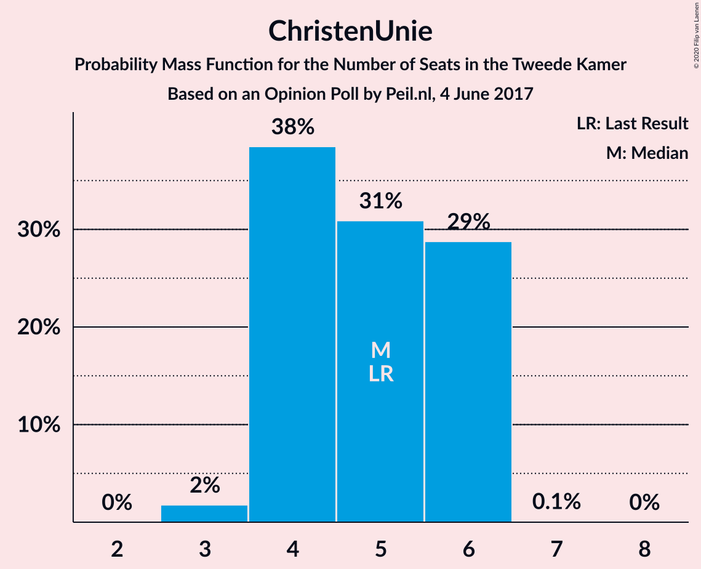

| Number of Seats | Probability | Accumulated | Special Marks |
|:---------------:|:-----------:|:-----------:|:-------------:|
| 3 | 2% | 100% |  |
| 4 | 38% | 98% |  |
| 5 | 31% | 60% | Last Result, Median |
| 6 | 29% | 29% |  |
| 7 | 0.1% | 0.1% |  |
| 8 | 0% | 0% |  |

### Partij voor de Dieren

*For a full overview of the results for this party, see the [Partij voor de Dieren](party-partijvoordedieren.html) page.*

| Number of Seats | Probability | Accumulated | Special Marks |
|:---------------:|:-----------:|:-----------:|:-------------:|
| 3 | 0.5% | 100% |  |
| 4 | 53% | 99.5% | Median |
| 5 | 43% | 47% | Last Result |
| 6 | 4% | 4% |  |
| 7 | 0% | 0% |  |

### 50Plus

*For a full overview of the results for this party, see the [50Plus](party-50plus.html) page.*

| Number of Seats | Probability | Accumulated | Special Marks |
|:---------------:|:-----------:|:-----------:|:-------------:|
| 2 | 1.2% | 100% |  |
| 3 | 29% | 98.8% |  |
| 4 | 68% | 70% | Last Result, Median |
| 5 | 2% | 2% |  |
| 6 | 0% | 0% |  |

### Forum voor Democratie

*For a full overview of the results for this party, see the [Forum voor Democratie](party-forumvoordemocratie.html) page.*

| Number of Seats | Probability | Accumulated | Special Marks |
|:---------------:|:-----------:|:-----------:|:-------------:|
| 2 | 0.1% | 100% | Last Result |
| 3 | 9% | 99.9% |  |
| 4 | 72% | 91% | Median |
| 5 | 19% | 19% |  |
| 6 | 0% | 0% |  |

### Staatkundig Gereformeerde Partij

*For a full overview of the results for this party, see the [Staatkundig Gereformeerde Partij](party-staatkundiggereformeerdepartij.html) page.*

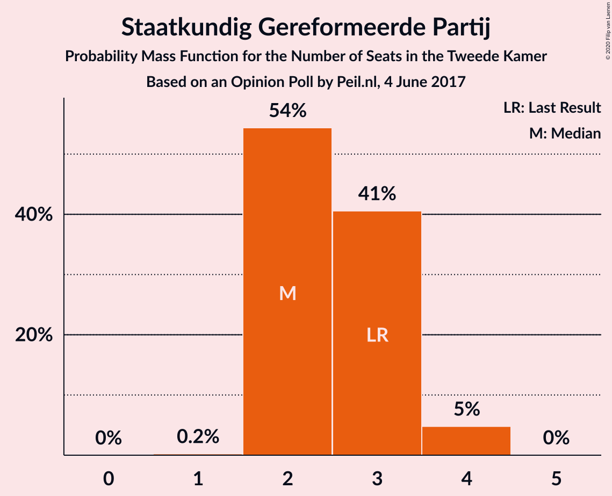

| Number of Seats | Probability | Accumulated | Special Marks |
|:---------------:|:-----------:|:-----------:|:-------------:|
| 1 | 0.2% | 100% |  |
| 2 | 54% | 99.8% | Median |
| 3 | 41% | 45% | Last Result |
| 4 | 5% | 5% |  |
| 5 | 0% | 0% |  |

### DENK

*For a full overview of the results for this party, see the [DENK](party-denk.html) page.*

| Number of Seats | Probability | Accumulated | Special Marks |
|:---------------:|:-----------:|:-----------:|:-------------:|
| 1 | 0.1% | 100% |  |
| 2 | 54% | 99.9% | Median |
| 3 | 45% | 46% | Last Result |
| 4 | 0.7% | 0.7% |  |
| 5 | 0% | 0% |  |

## Coalitions

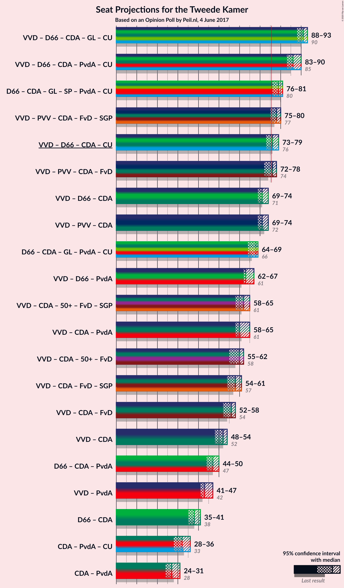

### Confidence Intervals

| Coalition | Last Result | Median | Majority? | 80% Confidence Interval | 90% Confidence Interval | 95% Confidence Interval | 99% Confidence Interval |
|:---------:|:-----------:|:------:|:---------:|:-----------------------:|:-----------------------:|:-----------------------:|:-----------------------:|
| Volkspartij voor Vrijheid en Democratie – Democraten 66 – Christen-Democratisch Appèl – GroenLinks – ChristenUnie | 90 | 91 | 100% | 90–93 | 89–93 | 88–93 | 86–95 |
| Volkspartij voor Vrijheid en Democratie – Democraten 66 – Christen-Democratisch Appèl – Partij van de Arbeid – ChristenUnie | 85 | 86 | 100% | 84–86 | 83–88 | 83–90 | 82–91 |
| Democraten 66 – Christen-Democratisch Appèl – GroenLinks – Socialistische Partij – Partij van de Arbeid – ChristenUnie | 80 | 79 | 98% | 77–81 | 76–81 | 76–81 | 73–82 |
| Volkspartij voor Vrijheid en Democratie – Partij voor de Vrijheid – Christen-Democratisch Appèl – Forum voor Democratie – Staatkundig Gereformeerde Partij | 77 | 78 | 95% | 76–80 | 75–80 | 75–80 | 73–82 |
| Volkspartij voor Vrijheid en Democratie – Democraten 66 – Christen-Democratisch Appèl – ChristenUnie | 76 | 76 | 86% | 74–78 | 74–78 | 73–79 | 72–80 |
| Volkspartij voor Vrijheid en Democratie – Partij voor de Vrijheid – Christen-Democratisch Appèl – Forum voor Democratie | 74 | 76 | 56% | 73–78 | 72–78 | 72–78 | 70–79 |
| Volkspartij voor Vrijheid en Democratie – Democraten 66 – Christen-Democratisch Appèl | 71 | 71 | 0.2% | 70–73 | 69–74 | 69–74 | 67–75 |
| Volkspartij voor Vrijheid en Democratie – Partij voor de Vrijheid – Christen-Democratisch Appèl | 72 | 71 | 0.1% | 69–74 | 69–74 | 69–74 | 67–75 |
| Democraten 66 – Christen-Democratisch Appèl – GroenLinks – Partij van de Arbeid – ChristenUnie | 66 | 68 | 0% | 65–69 | 65–69 | 64–69 | 61–69 |
| Volkspartij voor Vrijheid en Democratie – Democraten 66 – Partij van de Arbeid | 61 | 63 | 0% | 62–64 | 62–67 | 62–67 | 62–68 |
| Volkspartij voor Vrijheid en Democratie – Christen-Democratisch Appèl – 50Plus – Forum voor Democratie – Staatkundig Gereformeerde Partij | 61 | 62 | 0% | 60–63 | 58–64 | 58–65 | 56–65 |
| Volkspartij voor Vrijheid en Democratie – Christen-Democratisch Appèl – Partij van de Arbeid | 61 | 60 | 0% | 58–63 | 58–64 | 58–65 | 57–65 |
| Volkspartij voor Vrijheid en Democratie – Christen-Democratisch Appèl – 50Plus – Forum voor Democratie | 58 | 60 | 0% | 57–61 | 55–61 | 55–62 | 53–63 |
| Volkspartij voor Vrijheid en Democratie – Christen-Democratisch Appèl – Forum voor Democratie – Staatkundig Gereformeerde Partij | 57 | 58 | 0% | 56–59 | 55–60 | 54–61 | 52–61 |
| Volkspartij voor Vrijheid en Democratie – Christen-Democratisch Appèl – Forum voor Democratie | 54 | 56 | 0% | 53–57 | 52–57 | 52–58 | 49–59 |
| Volkspartij voor Vrijheid en Democratie – Christen-Democratisch Appèl | 52 | 52 | 0% | 49–53 | 49–54 | 48–54 | 46–55 |
| Democraten 66 – Christen-Democratisch Appèl – Partij van de Arbeid | 47 | 47 | 0% | 46–49 | 44–50 | 44–50 | 44–51 |
| Volkspartij voor Vrijheid en Democratie – Partij van de Arbeid | 42 | 43 | 0% | 41–45 | 41–45 | 41–47 | 40–48 |
| Democraten 66 – Christen-Democratisch Appèl | 38 | 38 | 0% | 37–40 | 35–41 | 35–41 | 34–41 |
| Christen-Democratisch Appèl – Partij van de Arbeid – ChristenUnie | 33 | 32 | 0% | 29–34 | 29–34 | 28–36 | 28–37 |
| Christen-Democratisch Appèl – Partij van de Arbeid | 28 | 27 | 0% | 25–29 | 24–29 | 24–31 | 24–31 |

### Volkspartij voor Vrijheid en Democratie – Democraten 66 – Christen-Democratisch Appèl – GroenLinks – ChristenUnie

| Number of Seats | Probability | Accumulated | Special Marks |
|:---------------:|:-----------:|:-----------:|:-------------:|
| 85 | 0.1% | 100% |  |
| 86 | 0.5% | 99.9% |  |
| 87 | 0.1% | 99.4% |  |
| 88 | 3% | 99.3% |  |
| 89 | 4% | 96% |  |
| 90 | 30% | 92% | Last Result |
| 91 | 27% | 62% | Median |
| 92 | 6% | 35% |  |
| 93 | 28% | 29% |  |
| 94 | 0.7% | 1.2% |  |
| 95 | 0.5% | 0.5% |  |
| 96 | 0% | 0% |  |

### Volkspartij voor Vrijheid en Democratie – Democraten 66 – Christen-Democratisch Appèl – Partij van de Arbeid – ChristenUnie

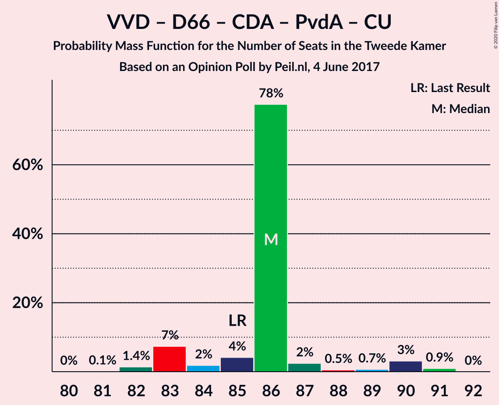

| Number of Seats | Probability | Accumulated | Special Marks |
|:---------------:|:-----------:|:-----------:|:-------------:|
| 81 | 0.1% | 100% |  |
| 82 | 1.4% | 99.9% |  |
| 83 | 7% | 98.5% |  |
| 84 | 2% | 91% |  |
| 85 | 4% | 89% | Last Result |
| 86 | 78% | 85% | Median |
| 87 | 2% | 8% |  |
| 88 | 0.5% | 5% |  |
| 89 | 0.7% | 5% |  |
| 90 | 3% | 4% |  |
| 91 | 0.9% | 0.9% |  |
| 92 | 0% | 0% |  |

### Democraten 66 – Christen-Democratisch Appèl – GroenLinks – Socialistische Partij – Partij van de Arbeid – ChristenUnie

| Number of Seats | Probability | Accumulated | Special Marks |
|:---------------:|:-----------:|:-----------:|:-------------:|
| 73 | 1.4% | 100% |  |
| 74 | 0.1% | 98.6% |  |
| 75 | 0.7% | 98% |  |
| 76 | 3% | 98% | Majority |
| 77 | 15% | 95% |  |
| 78 | 2% | 80% |  |
| 79 | 44% | 78% |  |
| 80 | 7% | 34% | Last Result, Median |
| 81 | 27% | 28% |  |
| 82 | 0.5% | 0.8% |  |
| 83 | 0.1% | 0.2% |  |
| 84 | 0% | 0.1% |  |
| 85 | 0.1% | 0.1% |  |
| 86 | 0% | 0% |  |

### Volkspartij voor Vrijheid en Democratie – Partij voor de Vrijheid – Christen-Democratisch Appèl – Forum voor Democratie – Staatkundig Gereformeerde Partij

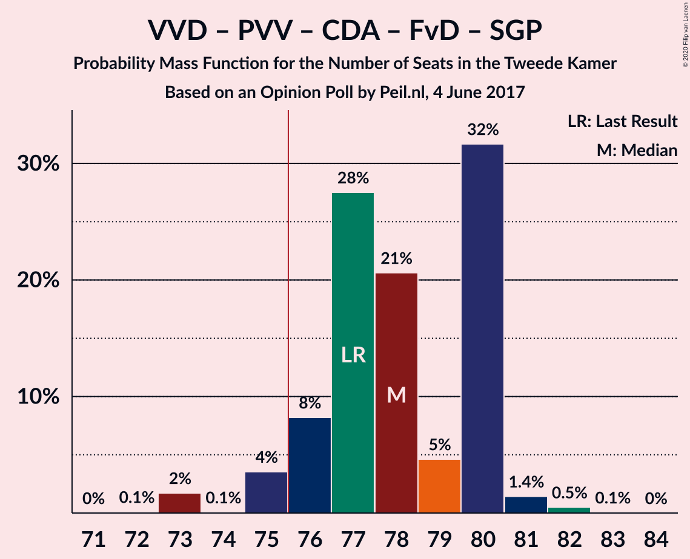

| Number of Seats | Probability | Accumulated | Special Marks |
|:---------------:|:-----------:|:-----------:|:-------------:|
| 72 | 0.1% | 100% |  |
| 73 | 2% | 99.9% |  |
| 74 | 0.1% | 98% |  |
| 75 | 4% | 98% |  |
| 76 | 8% | 95% | Majority |
| 77 | 28% | 86% | Last Result, Median |
| 78 | 21% | 59% |  |
| 79 | 5% | 38% |  |
| 80 | 32% | 34% |  |
| 81 | 1.4% | 2% |  |
| 82 | 0.5% | 0.5% |  |
| 83 | 0.1% | 0.1% |  |
| 84 | 0% | 0% |  |

### Volkspartij voor Vrijheid en Democratie – Democraten 66 – Christen-Democratisch Appèl – ChristenUnie

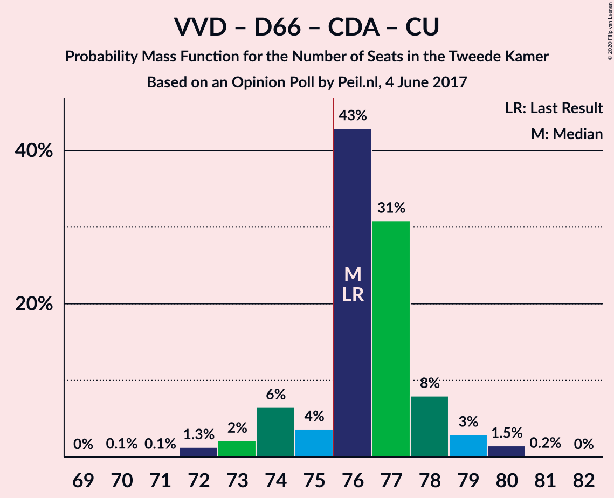

| Number of Seats | Probability | Accumulated | Special Marks |
|:---------------:|:-----------:|:-----------:|:-------------:|
| 70 | 0.1% | 100% |  |
| 71 | 0.1% | 99.9% |  |
| 72 | 1.3% | 99.9% |  |
| 73 | 2% | 98.6% |  |
| 74 | 6% | 96% |  |
| 75 | 4% | 90% |  |
| 76 | 43% | 86% | Last Result, Median, Majority |
| 77 | 31% | 43% |  |
| 78 | 8% | 13% |  |
| 79 | 3% | 5% |  |
| 80 | 1.5% | 2% |  |
| 81 | 0.2% | 0.2% |  |
| 82 | 0% | 0% |  |

### Volkspartij voor Vrijheid en Democratie – Partij voor de Vrijheid – Christen-Democratisch Appèl – Forum voor Democratie

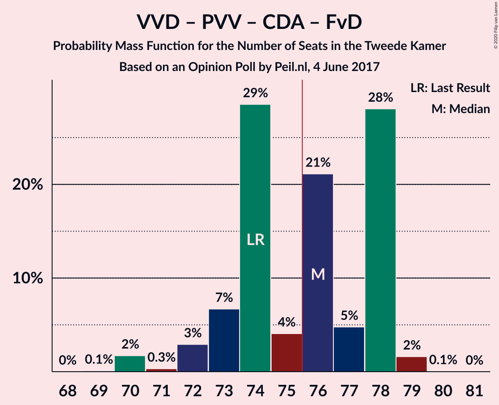

| Number of Seats | Probability | Accumulated | Special Marks |
|:---------------:|:-----------:|:-----------:|:-------------:|
| 69 | 0.1% | 100% |  |
| 70 | 2% | 99.9% |  |
| 71 | 0.3% | 98% |  |
| 72 | 3% | 98% |  |
| 73 | 7% | 95% |  |
| 74 | 29% | 88% | Last Result |
| 75 | 4% | 60% | Median |
| 76 | 21% | 56% | Majority |
| 77 | 5% | 35% |  |
| 78 | 28% | 30% |  |
| 79 | 2% | 2% |  |
| 80 | 0.1% | 0.1% |  |
| 81 | 0% | 0% |  |

### Volkspartij voor Vrijheid en Democratie – Democraten 66 – Christen-Democratisch Appèl

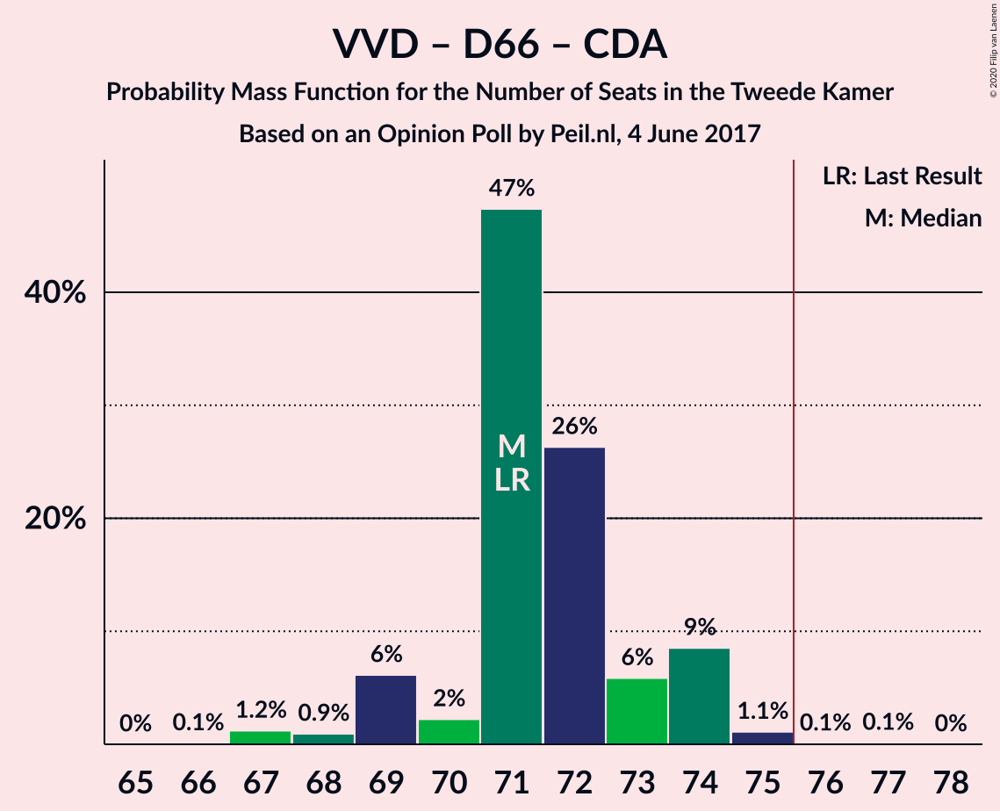

| Number of Seats | Probability | Accumulated | Special Marks |
|:---------------:|:-----------:|:-----------:|:-------------:|
| 66 | 0.1% | 100% |  |
| 67 | 1.2% | 99.9% |  |
| 68 | 0.9% | 98.7% |  |
| 69 | 6% | 98% |  |
| 70 | 2% | 92% |  |
| 71 | 47% | 89% | Last Result, Median |
| 72 | 26% | 42% |  |
| 73 | 6% | 16% |  |
| 74 | 9% | 10% |  |
| 75 | 1.1% | 1.3% |  |
| 76 | 0.1% | 0.2% | Majority |
| 77 | 0.1% | 0.1% |  |
| 78 | 0% | 0% |  |

### Volkspartij voor Vrijheid en Democratie – Partij voor de Vrijheid – Christen-Democratisch Appèl

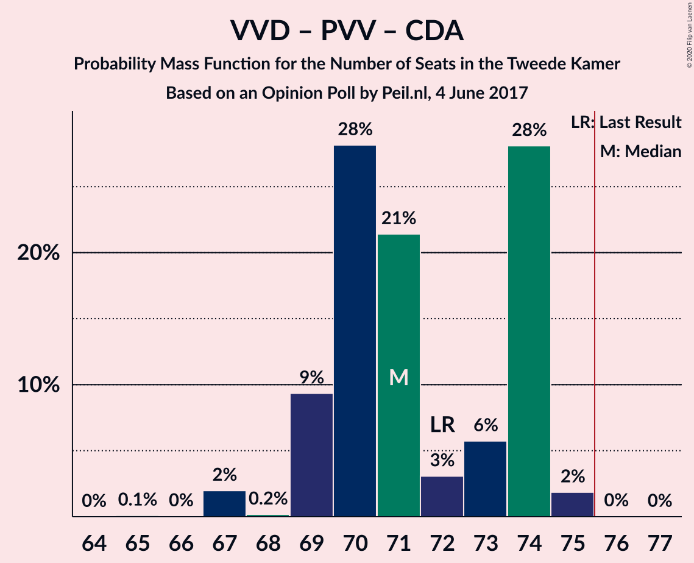

| Number of Seats | Probability | Accumulated | Special Marks |
|:---------------:|:-----------:|:-----------:|:-------------:|
| 65 | 0.1% | 100% |  |
| 66 | 0% | 99.9% |  |
| 67 | 2% | 99.9% |  |
| 68 | 0.2% | 98% |  |
| 69 | 9% | 98% |  |
| 70 | 28% | 88% |  |
| 71 | 21% | 60% | Median |
| 72 | 3% | 39% | Last Result |
| 73 | 6% | 36% |  |
| 74 | 28% | 30% |  |
| 75 | 2% | 2% |  |
| 76 | 0% | 0.1% | Majority |
| 77 | 0% | 0% |  |

### Democraten 66 – Christen-Democratisch Appèl – GroenLinks – Partij van de Arbeid – ChristenUnie

| Number of Seats | Probability | Accumulated | Special Marks |
|:---------------:|:-----------:|:-----------:|:-------------:|
| 61 | 1.4% | 100% |  |
| 62 | 0.1% | 98.6% |  |
| 63 | 0.2% | 98.5% |  |
| 64 | 2% | 98% |  |
| 65 | 30% | 96% |  |
| 66 | 10% | 66% | Last Result |
| 67 | 1.5% | 57% |  |
| 68 | 23% | 55% | Median |
| 69 | 32% | 33% |  |
| 70 | 0.1% | 0.5% |  |
| 71 | 0.1% | 0.4% |  |
| 72 | 0.2% | 0.2% |  |
| 73 | 0% | 0% |  |

### Volkspartij voor Vrijheid en Democratie – Democraten 66 – Partij van de Arbeid

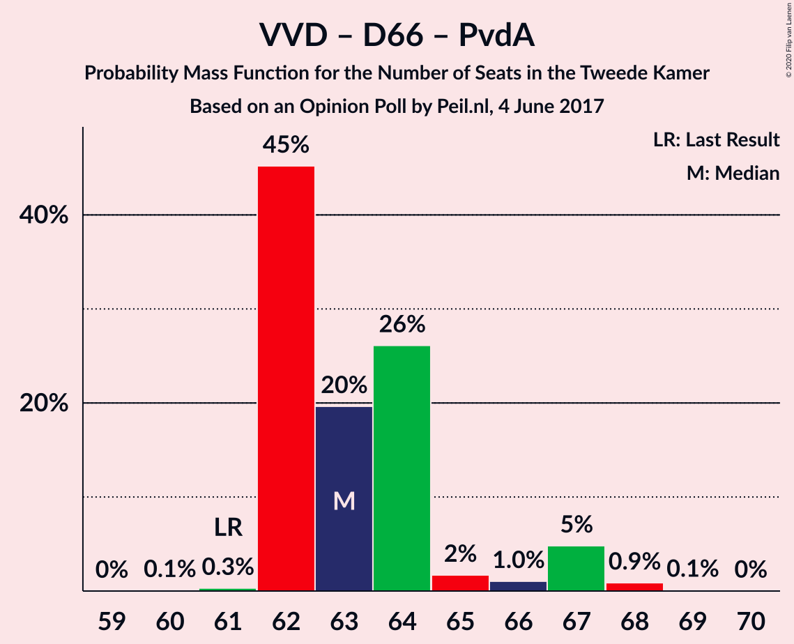

| Number of Seats | Probability | Accumulated | Special Marks |
|:---------------:|:-----------:|:-----------:|:-------------:|
| 60 | 0.1% | 100% |  |
| 61 | 0.3% | 99.9% | Last Result |
| 62 | 45% | 99.6% |  |
| 63 | 20% | 54% | Median |
| 64 | 26% | 35% |  |
| 65 | 2% | 9% |  |
| 66 | 1.0% | 7% |  |
| 67 | 5% | 6% |  |
| 68 | 0.9% | 1.0% |  |
| 69 | 0.1% | 0.1% |  |
| 70 | 0% | 0% |  |

### Volkspartij voor Vrijheid en Democratie – Christen-Democratisch Appèl – 50Plus – Forum voor Democratie – Staatkundig Gereformeerde Partij

| Number of Seats | Probability | Accumulated | Special Marks |
|:---------------:|:-----------:|:-----------:|:-------------:|
| 56 | 2% | 100% |  |
| 57 | 0.1% | 98% |  |
| 58 | 5% | 98% |  |
| 59 | 0.8% | 93% |  |
| 60 | 7% | 92% |  |
| 61 | 4% | 85% | Last Result, Median |
| 62 | 55% | 81% |  |
| 63 | 20% | 25% |  |
| 64 | 3% | 6% |  |
| 65 | 3% | 3% |  |
| 66 | 0.5% | 0.5% |  |
| 67 | 0% | 0% |  |

### Volkspartij voor Vrijheid en Democratie – Christen-Democratisch Appèl – Partij van de Arbeid

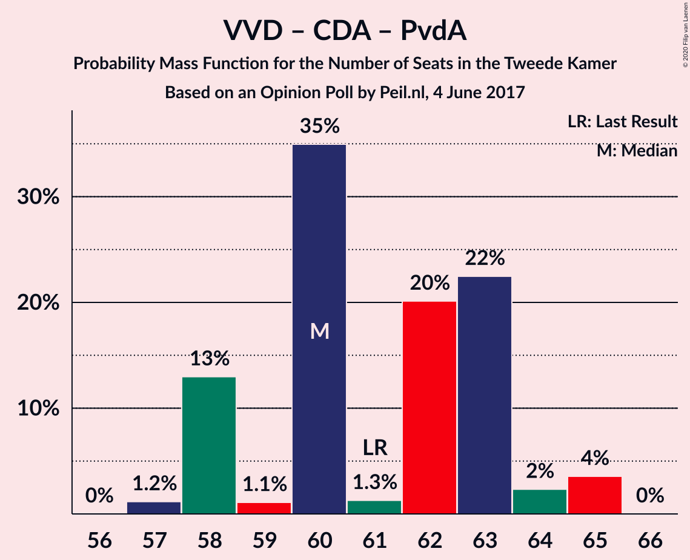

| Number of Seats | Probability | Accumulated | Special Marks |
|:---------------:|:-----------:|:-----------:|:-------------:|
| 57 | 1.2% | 100% |  |
| 58 | 13% | 98.8% |  |
| 59 | 1.1% | 86% |  |
| 60 | 35% | 85% |  |
| 61 | 1.3% | 50% | Last Result, Median |
| 62 | 20% | 49% |  |
| 63 | 22% | 28% |  |
| 64 | 2% | 6% |  |
| 65 | 4% | 4% |  |
| 66 | 0% | 0% |  |

### Volkspartij voor Vrijheid en Democratie – Christen-Democratisch Appèl – 50Plus – Forum voor Democratie

| Number of Seats | Probability | Accumulated | Special Marks |
|:---------------:|:-----------:|:-----------:|:-------------:|
| 53 | 2% | 100% |  |
| 54 | 0.2% | 98% |  |
| 55 | 3% | 98% |  |
| 56 | 2% | 95% |  |
| 57 | 9% | 93% |  |
| 58 | 3% | 84% | Last Result |
| 59 | 27% | 81% | Median |
| 60 | 30% | 54% |  |
| 61 | 19% | 24% |  |
| 62 | 4% | 5% |  |
| 63 | 0.6% | 0.6% |  |
| 64 | 0% | 0% |  |

### Volkspartij voor Vrijheid en Democratie – Christen-Democratisch Appèl – Forum voor Democratie – Staatkundig Gereformeerde Partij

| Number of Seats | Probability | Accumulated | Special Marks |
|:---------------:|:-----------:|:-----------:|:-------------:|
| 52 | 1.1% | 100% |  |
| 53 | 0.5% | 98.9% |  |
| 54 | 2% | 98% |  |
| 55 | 3% | 96% |  |
| 56 | 7% | 93% |  |
| 57 | 4% | 86% | Last Result, Median |
| 58 | 33% | 82% |  |
| 59 | 44% | 49% |  |
| 60 | 2% | 5% |  |
| 61 | 3% | 3% |  |
| 62 | 0.5% | 0.5% |  |
| 63 | 0% | 0% |  |

### Volkspartij voor Vrijheid en Democratie – Christen-Democratisch Appèl – Forum voor Democratie

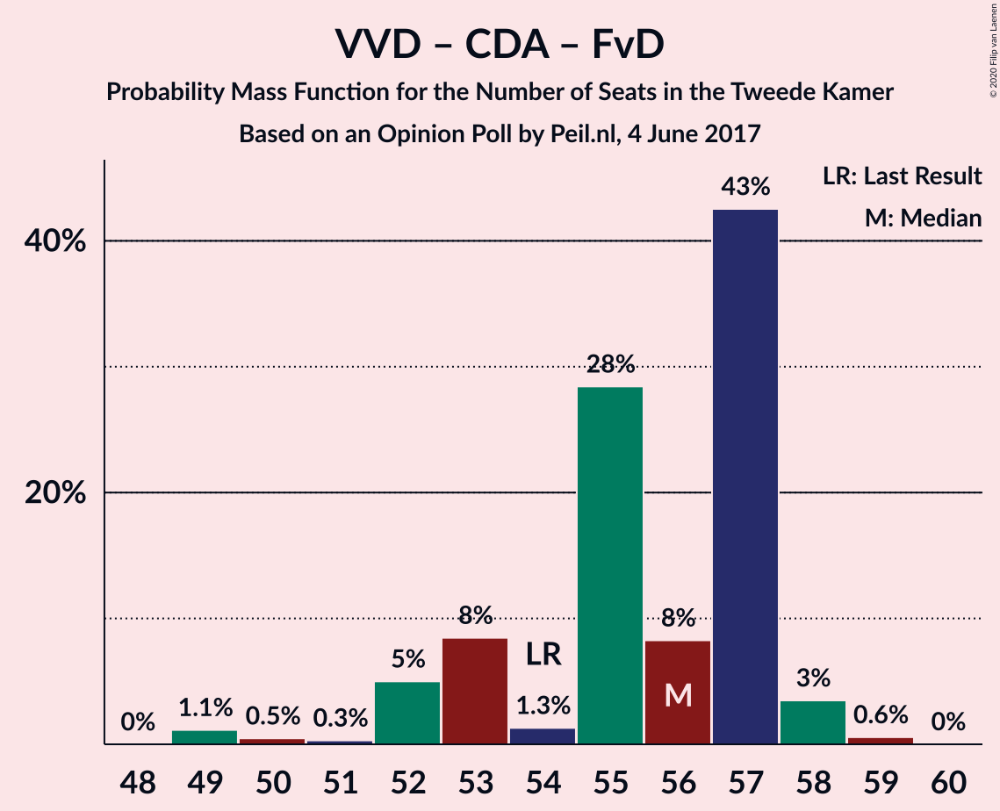

| Number of Seats | Probability | Accumulated | Special Marks |
|:---------------:|:-----------:|:-----------:|:-------------:|
| 49 | 1.1% | 100% |  |
| 50 | 0.5% | 98.9% |  |
| 51 | 0.3% | 98% |  |
| 52 | 5% | 98% |  |
| 53 | 8% | 93% |  |
| 54 | 1.3% | 85% | Last Result |
| 55 | 28% | 83% | Median |
| 56 | 8% | 55% |  |
| 57 | 43% | 47% |  |
| 58 | 3% | 4% |  |
| 59 | 0.6% | 0.6% |  |
| 60 | 0% | 0% |  |

### Volkspartij voor Vrijheid en Democratie – Christen-Democratisch Appèl

| Number of Seats | Probability | Accumulated | Special Marks |
|:---------------:|:-----------:|:-----------:|:-------------:|
| 46 | 1.1% | 100% |  |
| 47 | 0.6% | 98.8% |  |
| 48 | 2% | 98% |  |
| 49 | 11% | 96% |  |
| 50 | 2% | 85% |  |
| 51 | 28% | 83% | Median |
| 52 | 26% | 56% | Last Result |
| 53 | 24% | 29% |  |
| 54 | 5% | 5% |  |
| 55 | 0.7% | 0.7% |  |
| 56 | 0% | 0% |  |

### Democraten 66 – Christen-Democratisch Appèl – Partij van de Arbeid

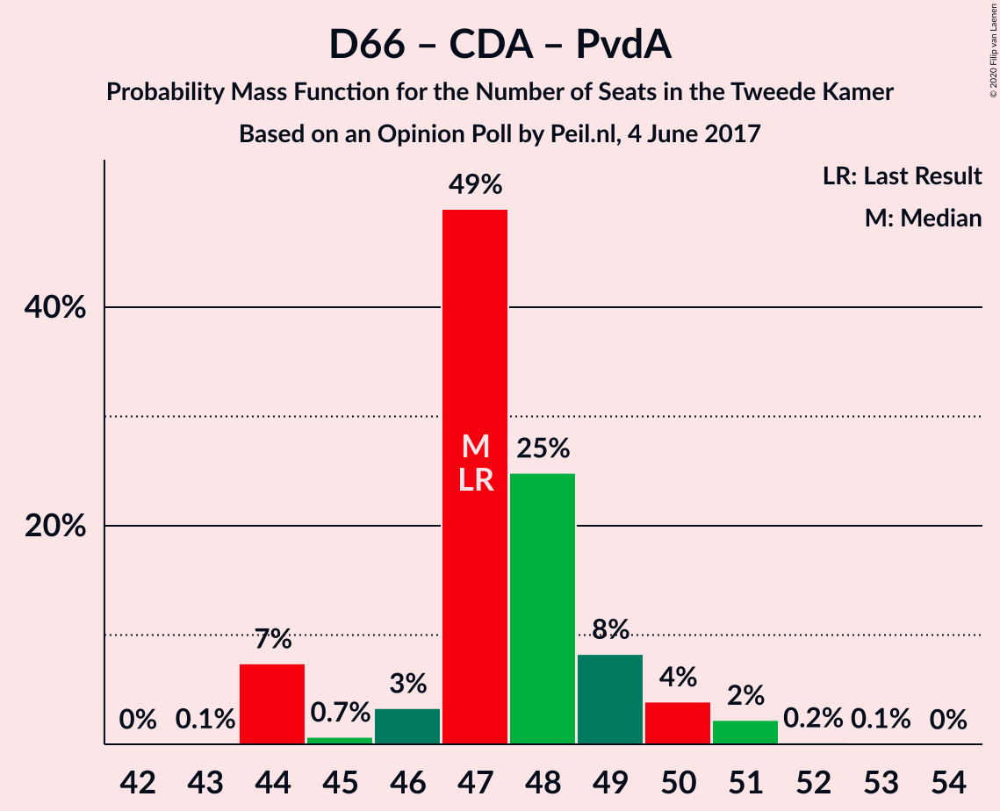

| Number of Seats | Probability | Accumulated | Special Marks |
|:---------------:|:-----------:|:-----------:|:-------------:|
| 43 | 0.1% | 100% |  |
| 44 | 7% | 99.9% |  |
| 45 | 0.7% | 92% |  |
| 46 | 3% | 92% |  |
| 47 | 49% | 89% | Last Result |
| 48 | 25% | 40% | Median |
| 49 | 8% | 15% |  |
| 50 | 4% | 6% |  |
| 51 | 2% | 2% |  |
| 52 | 0.2% | 0.3% |  |
| 53 | 0.1% | 0.1% |  |
| 54 | 0% | 0% |  |

### Volkspartij voor Vrijheid en Democratie – Partij van de Arbeid

| Number of Seats | Probability | Accumulated | Special Marks |
|:---------------:|:-----------:|:-----------:|:-------------:|
| 40 | 2% | 100% |  |
| 41 | 9% | 98% |  |
| 42 | 28% | 89% | Last Result |
| 43 | 30% | 61% | Median |
| 44 | 3% | 31% |  |
| 45 | 24% | 28% |  |
| 46 | 2% | 4% |  |
| 47 | 1.1% | 3% |  |
| 48 | 2% | 2% |  |
| 49 | 0% | 0% |  |

### Democraten 66 – Christen-Democratisch Appèl

| Number of Seats | Probability | Accumulated | Special Marks |
|:---------------:|:-----------:|:-----------:|:-------------:|
| 33 | 0.1% | 100% |  |
| 34 | 2% | 99.9% |  |
| 35 | 6% | 98% |  |
| 36 | 1.2% | 92% |  |
| 37 | 26% | 91% |  |
| 38 | 47% | 65% | Last Result, Median |
| 39 | 8% | 18% |  |
| 40 | 0.7% | 10% |  |
| 41 | 9% | 9% |  |
| 42 | 0.1% | 0.1% |  |
| 43 | 0% | 0% |  |

### Christen-Democratisch Appèl – Partij van de Arbeid – ChristenUnie

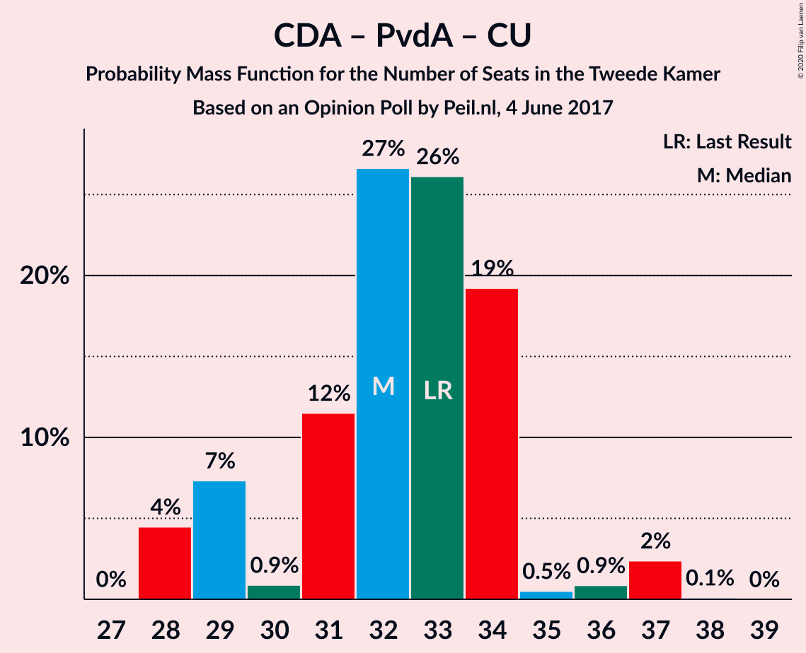

| Number of Seats | Probability | Accumulated | Special Marks |
|:---------------:|:-----------:|:-----------:|:-------------:|
| 28 | 4% | 100% |  |
| 29 | 7% | 96% |  |
| 30 | 0.9% | 88% |  |
| 31 | 12% | 87% |  |
| 32 | 27% | 76% |  |
| 33 | 26% | 49% | Last Result, Median |
| 34 | 19% | 23% |  |
| 35 | 0.5% | 4% |  |
| 36 | 0.9% | 3% |  |
| 37 | 2% | 2% |  |
| 38 | 0.1% | 0.1% |  |
| 39 | 0% | 0% |  |

### Christen-Democratisch Appèl – Partij van de Arbeid

| Number of Seats | Probability | Accumulated | Special Marks |
|:---------------:|:-----------:|:-----------:|:-------------:|
| 24 | 9% | 100% |  |
| 25 | 3% | 91% |  |
| 26 | 3% | 88% |  |
| 27 | 37% | 85% |  |
| 28 | 24% | 48% | Last Result, Median |
| 29 | 20% | 24% |  |
| 30 | 1.3% | 4% |  |
| 31 | 3% | 3% |  |
| 32 | 0% | 0.1% |  |
| 33 | 0.1% | 0.1% |  |
| 34 | 0% | 0% |  |

## Technical Information

### Opinion Poll

+ **Polling firm:** Peil.nl
+ **Commissioner(s):** —
+ **Fieldwork period:** 4 June 2017

### Calculations

+ **Sample size:** 3000
+ **Simulations done:** 1,048,576
+ **Error estimate:** 1.14%

