# Opinion Poll by Peil.nl, 4 June 2017

<a href="#voting-intentions">Voting Intentions</a> | <a href="#seats">Seats</a> | <a href="#coalitions">Coalitions</a> | <a href="#technical-information">Technical Information</a>

## Voting Intentions

### Confidence Intervals

| Party | Last Result | Poll Result | 80% Confidence Interval | 90% Confidence Interval | 95% Confidence Interval | 99% Confidence Interval |
|:-----:|:-----------:|:-----------:|:-----------------------:|:-----------------------:|:-----------------------:|:-----------------------:|
| Volkspartij voor Vrijheid en Democratie | 21.3% | 22.0% | 21.0–23.0% |20.8–23.3% |20.5–23.5% |20.1–24.0% |
| Partij voor de Vrijheid | 13.1% | 13.3% | 12.6–14.2% |12.3–14.4% |12.2–14.6% |11.8–15.0% |
| Democraten 66 | 12.2% | 13.3% | 12.6–14.2% |12.3–14.4% |12.2–14.6% |11.8–15.0% |
| Christen-Democratisch Appèl | 12.4% | 11.3% | 10.6–12.1% |10.4–12.3% |10.2–12.5% |9.9–12.9% |
| GroenLinks | 9.1% | 9.3% | 8.7–10.1% |8.5–10.3% |8.3–10.4% |8.0–10.8% |
| Socialistische Partij | 9.1% | 8.0% | 7.4–8.7% |7.2–8.9% |7.1–9.0% |6.8–9.4% |
| Partij van de Arbeid | 5.7% | 6.7% | 6.1–7.3% |6.0–7.5% |5.8–7.6% |5.6–7.9% |
| ChristenUnie | 3.4% | 3.3% | 2.9–3.8% |2.8–3.9% |2.7–4.0% |2.6–4.3% |
| Partij voor de Dieren | 3.2% | 3.3% | 2.9–3.8% |2.8–3.9% |2.7–4.0% |2.6–4.3% |
| 50Plus | 3.1% | 2.7% | 2.3–3.1% |2.2–3.2% |2.1–3.3% |2.0–3.5% |
| Forum voor Democratie | 1.8% | 2.7% | 2.3–3.1% |2.2–3.2% |2.1–3.3% |2.0–3.5% |
| Staatkundig Gereformeerde Partij | 2.1% | 2.0% | 1.7–2.4% |1.6–2.5% |1.6–2.6% |1.4–2.8% |
| DENK | 2.1% | 2.0% | 1.7–2.4% |1.6–2.5% |1.6–2.6% |1.4–2.8% |

*Note:* The poll result column reflects the actual value used in the calculations. Published results may vary slightly, and in addition be rounded to fewer digits.

## Seats

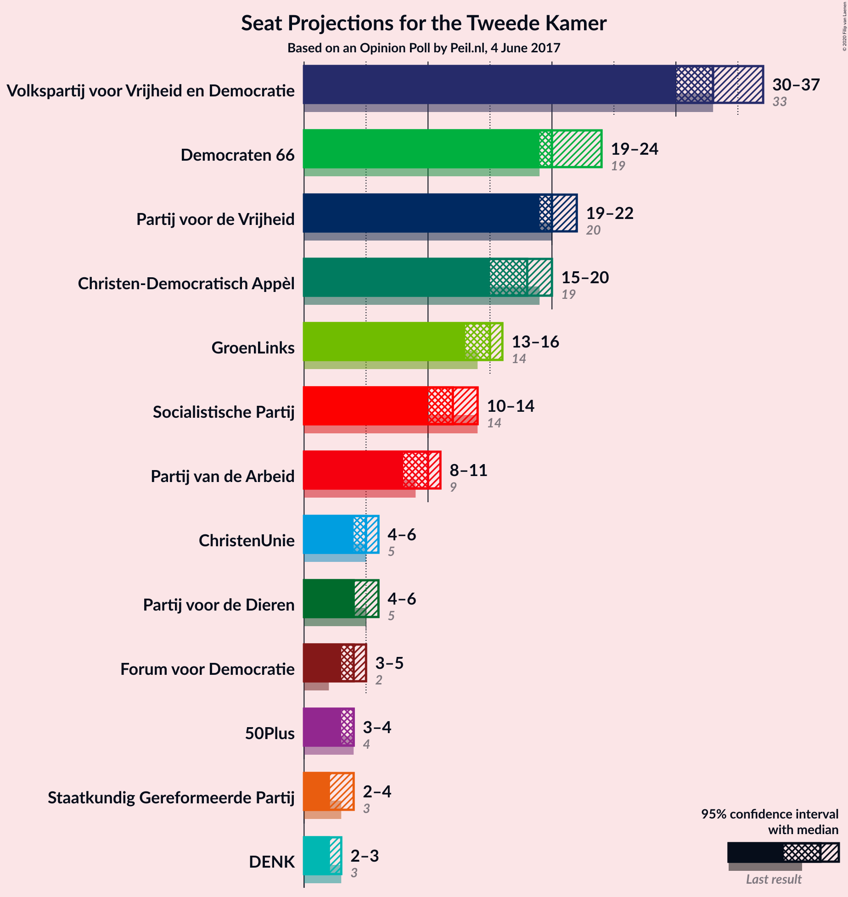

### Confidence Intervals

| Party | Last Result | Median | 80% Confidence Interval | 90% Confidence Interval | 95% Confidence Interval | 99% Confidence Interval |
|:-----:|:-----------:|:------:|:-----------------------:|:-----------------------:|:-----------------------:|:-----------------------:|
| <a href="#volkspartij-voor-vrijheid-en-democratie">Volkspartij voor Vrijheid en Democratie</a> | 33 | 35 | 33–35 |30–35 |30–35 |30–35 |
| <a href="#partij-voor-de-vrijheid">Partij voor de Vrijheid</a> | 20 | 21 | 21–22 |21–22 |21–22 |21–22 |
| <a href="#democraten-66">Democraten 66</a> | 19 | 19 | 19–22 |19–23 |19–23 |19–23 |
| <a href="#christen-democratisch-appèl">Christen-Democratisch Appèl</a> | 19 | 18 | 18–19 |18–19 |18–19 |16–19 |
| <a href="#groenlinks">GroenLinks</a> | 14 | 14 | 13–14 |13–14 |13–15 |12–17 |
| <a href="#socialistische-partij">Socialistische Partij</a> | 14 | 14 | 11–14 |11–14 |11–14 |11–14 |
| <a href="#partij-van-de-arbeid">Partij van de Arbeid</a> | 9 | 10 | 8–10 |8–10 |8–10 |8–11 |
| <a href="#christenunie">ChristenUnie</a> | 5 | 4 | 4 |4 |4 |4–5 |
| <a href="#partij-voor-de-dieren">Partij voor de Dieren</a> | 5 | 4 | 4–5 |4–5 |4–5 |4–5 |
| <a href="#50plus">50Plus</a> | 4 | 3 | 3–4 |3–4 |3–4 |3–4 |
| <a href="#forum-voor-democratie">Forum voor Democratie</a> | 2 | 4 | 4 |4 |4 |3–5 |
| <a href="#staatkundig-gereformeerde-partij">Staatkundig Gereformeerde Partij</a> | 3 | 2 | 2 |2 |2–3 |2–3 |
| <a href="#denk">DENK</a> | 3 | 2 | 2–3 |2–3 |2–3 |2–3 |

### Volkspartij voor Vrijheid en Democratie

*For a full overview of the results for this party, see the [Volkspartij voor Vrijheid en Democratie](party-volkspartijvoorvrijheidendemocratie.html) page.*

| Number of Seats | Probability | Accumulated | Special Marks |
|:---------------:|:-----------:|:-----------:|:-------------:|
| 30 | 5% | 100% |  |
| 31 | 0.9% | 95% |  |
| 32 | 0.2% | 94% |  |
| 33 | 25% | 93% | Last Result |
| 34 | 1.4% | 68% |  |
| 35 | 67% | 67% | Median |
| 36 | 0.3% | 0.4% |  |
| 37 | 0% | 0.1% |  |
| 38 | 0.1% | 0.1% |  |
| 39 | 0% | 0% |  |

### Partij voor de Vrijheid

*For a full overview of the results for this party, see the [Partij voor de Vrijheid](party-partijvoordevrijheid.html) page.*

| Number of Seats | Probability | Accumulated | Special Marks |
|:---------------:|:-----------:|:-----------:|:-------------:|
| 18 | 0.1% | 100% |  |
| 19 | 0.3% | 99.9% |  |
| 20 | 0.1% | 99.7% | Last Result |
| 21 | 68% | 99.5% | Median |
| 22 | 31% | 31% |  |
| 23 | 0% | 0% |  |

### Democraten 66

*For a full overview of the results for this party, see the [Democraten 66](party-democraten66.html) page.*

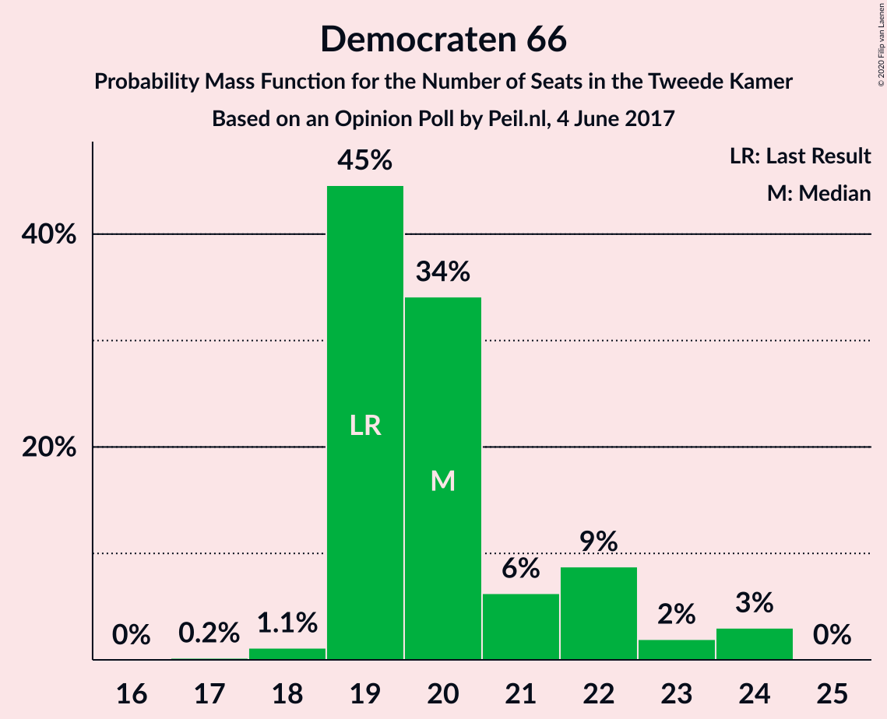

| Number of Seats | Probability | Accumulated | Special Marks |
|:---------------:|:-----------:|:-----------:|:-------------:|
| 17 | 0.3% | 100% |  |
| 18 | 0% | 99.7% |  |
| 19 | 67% | 99.6% | Last Result, Median |
| 20 | 2% | 33% |  |
| 21 | 0.2% | 31% |  |
| 22 | 25% | 30% |  |
| 23 | 6% | 6% |  |
| 24 | 0% | 0% |  |

### Christen-Democratisch Appèl

*For a full overview of the results for this party, see the [Christen-Democratisch Appèl](party-christen-democratischappèl.html) page.*

| Number of Seats | Probability | Accumulated | Special Marks |
|:---------------:|:-----------:|:-----------:|:-------------:|
| 16 | 1.4% | 100% |  |
| 17 | 0.6% | 98.6% |  |
| 18 | 74% | 98% | Median |
| 19 | 24% | 24% | Last Result |
| 20 | 0% | 0% |  |

### GroenLinks

*For a full overview of the results for this party, see the [GroenLinks](party-groenlinks.html) page.*

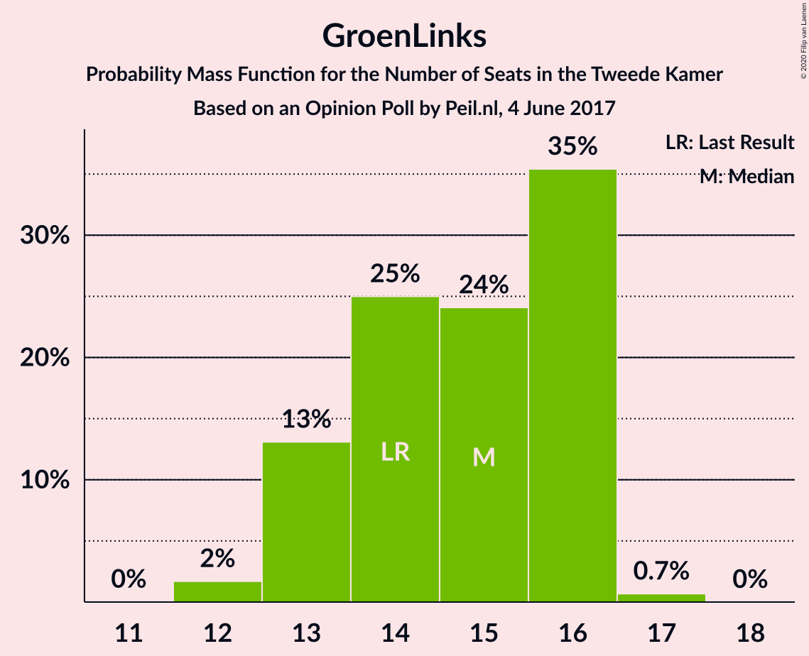

| Number of Seats | Probability | Accumulated | Special Marks |
|:---------------:|:-----------:|:-----------:|:-------------:|
| 12 | 1.0% | 100% |  |
| 13 | 23% | 99.0% |  |
| 14 | 73% | 76% | Last Result, Median |
| 15 | 0.9% | 3% |  |
| 16 | 0.1% | 2% |  |
| 17 | 2% | 2% |  |
| 18 | 0% | 0% |  |

### Socialistische Partij

*For a full overview of the results for this party, see the [Socialistische Partij](party-socialistischepartij.html) page.*

| Number of Seats | Probability | Accumulated | Special Marks |
|:---------------:|:-----------:|:-----------:|:-------------:|
| 10 | 0.1% | 100% |  |
| 11 | 31% | 99.9% |  |
| 12 | 1.1% | 69% |  |
| 13 | 1.5% | 68% |  |
| 14 | 66% | 67% | Last Result, Median |
| 15 | 0.4% | 0.4% |  |
| 16 | 0% | 0% |  |

### Partij van de Arbeid

*For a full overview of the results for this party, see the [Partij van de Arbeid](party-partijvandearbeid.html) page.*

| Number of Seats | Probability | Accumulated | Special Marks |
|:---------------:|:-----------:|:-----------:|:-------------:|
| 8 | 24% | 100% |  |
| 9 | 0.2% | 76% | Last Result |
| 10 | 75% | 76% | Median |
| 11 | 0.5% | 0.5% |  |
| 12 | 0% | 0% |  |

### ChristenUnie

*For a full overview of the results for this party, see the [ChristenUnie](party-christenunie.html) page.*

| Number of Seats | Probability | Accumulated | Special Marks |
|:---------------:|:-----------:|:-----------:|:-------------:|
| 4 | 99.3% | 100% | Median |
| 5 | 0.5% | 0.7% | Last Result |
| 6 | 0% | 0.2% |  |
| 7 | 0.2% | 0.2% |  |
| 8 | 0% | 0% |  |

### Partij voor de Dieren

*For a full overview of the results for this party, see the [Partij voor de Dieren](party-partijvoordedieren.html) page.*

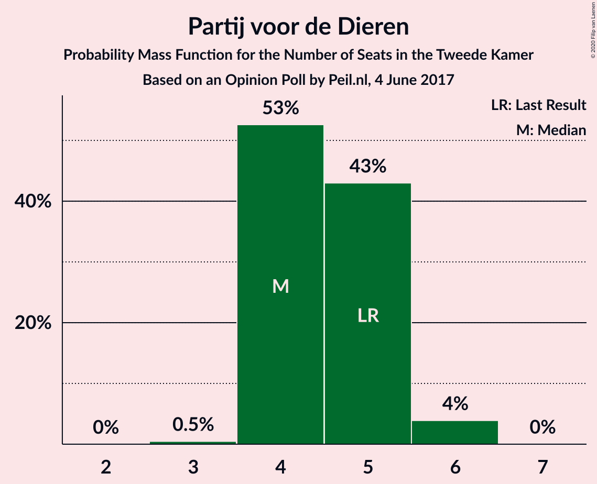

| Number of Seats | Probability | Accumulated | Special Marks |
|:---------------:|:-----------:|:-----------:|:-------------:|
| 4 | 71% | 100% | Median |
| 5 | 28% | 29% | Last Result |
| 6 | 0.3% | 0.3% |  |
| 7 | 0% | 0% |  |

### 50Plus

*For a full overview of the results for this party, see the [50Plus](party-50plus.html) page.*

| Number of Seats | Probability | Accumulated | Special Marks |
|:---------------:|:-----------:|:-----------:|:-------------:|
| 2 | 0.1% | 100% |  |
| 3 | 69% | 99.9% | Median |
| 4 | 31% | 31% | Last Result |
| 5 | 0.1% | 0.1% |  |
| 6 | 0% | 0% |  |

### Forum voor Democratie

*For a full overview of the results for this party, see the [Forum voor Democratie](party-forumvoordemocratie.html) page.*

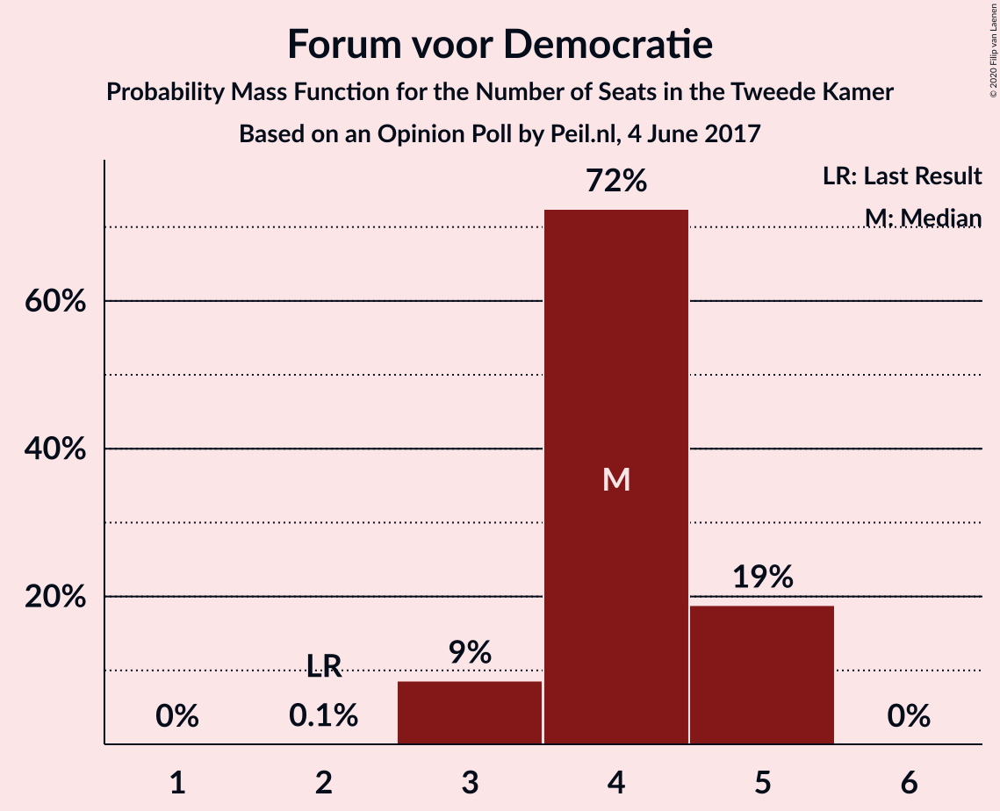

| Number of Seats | Probability | Accumulated | Special Marks |
|:---------------:|:-----------:|:-----------:|:-------------:|
| 2 | 0% | 100% | Last Result |
| 3 | 2% | 100% |  |
| 4 | 97% | 98% | Median |
| 5 | 0.9% | 0.9% |  |
| 6 | 0% | 0% |  |

### Staatkundig Gereformeerde Partij

*For a full overview of the results for this party, see the [Staatkundig Gereformeerde Partij](party-staatkundiggereformeerdepartij.html) page.*

| Number of Seats | Probability | Accumulated | Special Marks |
|:---------------:|:-----------:|:-----------:|:-------------:|
| 2 | 97% | 100% | Median |
| 3 | 3% | 3% | Last Result |
| 4 | 0.1% | 0.1% |  |
| 5 | 0.1% | 0.1% |  |
| 6 | 0% | 0% |  |

### DENK

*For a full overview of the results for this party, see the [DENK](party-denk.html) page.*

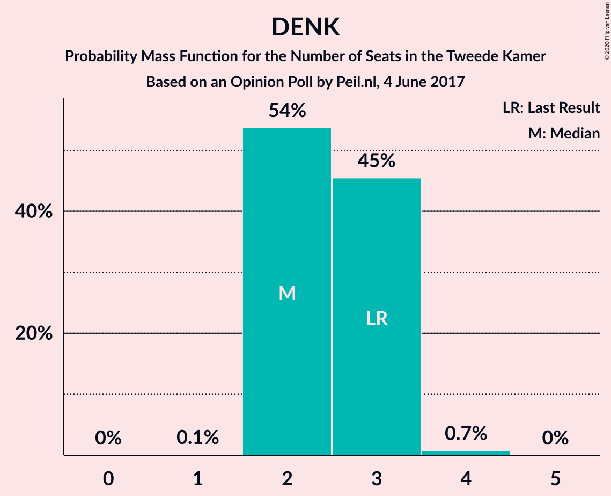

| Number of Seats | Probability | Accumulated | Special Marks |
|:---------------:|:-----------:|:-----------:|:-------------:|
| 2 | 69% | 100% | Median |
| 3 | 31% | 31% | Last Result |
| 4 | 0.1% | 0.1% |  |
| 5 | 0% | 0% |  |

## Coalitions

### Confidence Intervals

| Coalition | Last Result | Median | Majority? | 80% Confidence Interval | 90% Confidence Interval | 95% Confidence Interval | 99% Confidence Interval |
|:---------:|:-----------:|:------:|:---------:|:-----------------------:|:-----------------------:|:-----------------------:|:-----------------------:|
| Volkspartij voor Vrijheid en Democratie – Democraten 66 – Christen-Democratisch Appèl – GroenLinks – ChristenUnie | 90 | 90 | 100% | 90–91 | 89–91 | 89–91 | 88–92 |
| Volkspartij voor Vrijheid en Democratie – Democraten 66 – Christen-Democratisch Appèl – Partij van de Arbeid – ChristenUnie | 85 | 86 | 100% | 86 | 85–86 | 85–86 | 84–86 |
| Democraten 66 – Christen-Democratisch Appèl – GroenLinks – Socialistische Partij – Partij van de Arbeid – ChristenUnie | 80 | 79 | 99.9% | 77–79 | 77–80 | 77–80 | 77–80 |
| Volkspartij voor Vrijheid en Democratie – Partij voor de Vrijheid – Christen-Democratisch Appèl – Forum voor Democratie – Staatkundig Gereformeerde Partij | 77 | 80 | 99.9% | 79–80 | 76–80 | 76–80 | 76–80 |
| Volkspartij voor Vrijheid en Democratie – Democraten 66 – Christen-Democratisch Appèl – ChristenUnie | 76 | 76 | 92% | 76–78 | 75–78 | 75–78 | 74–78 |
| Volkspartij voor Vrijheid en Democratie – Partij voor de Vrijheid – Christen-Democratisch Appèl – Forum voor Democratie | 74 | 78 | 92% | 77–78 | 74–78 | 74–78 | 74–78 |
| Volkspartij voor Vrijheid en Democratie – Democraten 66 – Christen-Democratisch Appèl | 71 | 72 | 0.1% | 72–74 | 71–74 | 71–74 | 70–74 |
| Volkspartij voor Vrijheid en Democratie – Partij voor de Vrijheid – Christen-Democratisch Appèl | 72 | 74 | 0% | 73–74 | 70–74 | 70–74 | 70–74 |
| Democraten 66 – Christen-Democratisch Appèl – GroenLinks – Partij van de Arbeid – ChristenUnie | 66 | 65 | 0% | 65–66 | 65–69 | 65–69 | 64–69 |
| Volkspartij voor Vrijheid en Democratie – Democraten 66 – Partij van de Arbeid | 61 | 64 | 0% | 63–64 | 63–64 | 63–64 | 62–64 |
| Volkspartij voor Vrijheid en Democratie – Christen-Democratisch Appèl – Partij van de Arbeid | 61 | 63 | 0% | 60–63 | 58–63 | 58–63 | 58–63 |
| Volkspartij voor Vrijheid en Democratie – Christen-Democratisch Appèl – 50Plus – Forum voor Democratie – Staatkundig Gereformeerde Partij | 61 | 62 | 0% | 62 | 58–62 | 58–62 | 58–62 |
| Volkspartij voor Vrijheid en Democratie – Christen-Democratisch Appèl – 50Plus – Forum voor Democratie | 58 | 60 | 0% | 59–60 | 56–60 | 56–60 | 56–60 |
| Volkspartij voor Vrijheid en Democratie – Christen-Democratisch Appèl – Forum voor Democratie – Staatkundig Gereformeerde Partij | 57 | 59 | 0% | 58–59 | 54–59 | 54–59 | 54–59 |
| Volkspartij voor Vrijheid en Democratie – Christen-Democratisch Appèl – Forum voor Democratie | 54 | 57 | 0% | 55–57 | 52–57 | 52–57 | 52–57 |
| Volkspartij voor Vrijheid en Democratie – Christen-Democratisch Appèl | 52 | 53 | 0% | 51–53 | 48–53 | 48–53 | 48–53 |
| Democraten 66 – Christen-Democratisch Appèl – Partij van de Arbeid | 47 | 47 | 0% | 47–49 | 47–51 | 47–51 | 46–51 |
| Volkspartij voor Vrijheid en Democratie – Partij van de Arbeid | 42 | 45 | 0% | 41–45 | 40–45 | 40–45 | 40–45 |
| Democraten 66 – Christen-Democratisch Appèl | 38 | 37 | 0% | 37–41 | 37–41 | 37–41 | 36–41 |
| Christen-Democratisch Appèl – Partij van de Arbeid – ChristenUnie | 33 | 32 | 0% | 31–32 | 31–32 | 31–32 | 28–33 |
| Christen-Democratisch Appèl – Partij van de Arbeid | 28 | 28 | 0% | 27–28 | 27–28 | 27–28 | 24–29 |

### Volkspartij voor Vrijheid en Democratie – Democraten 66 – Christen-Democratisch Appèl – GroenLinks – ChristenUnie

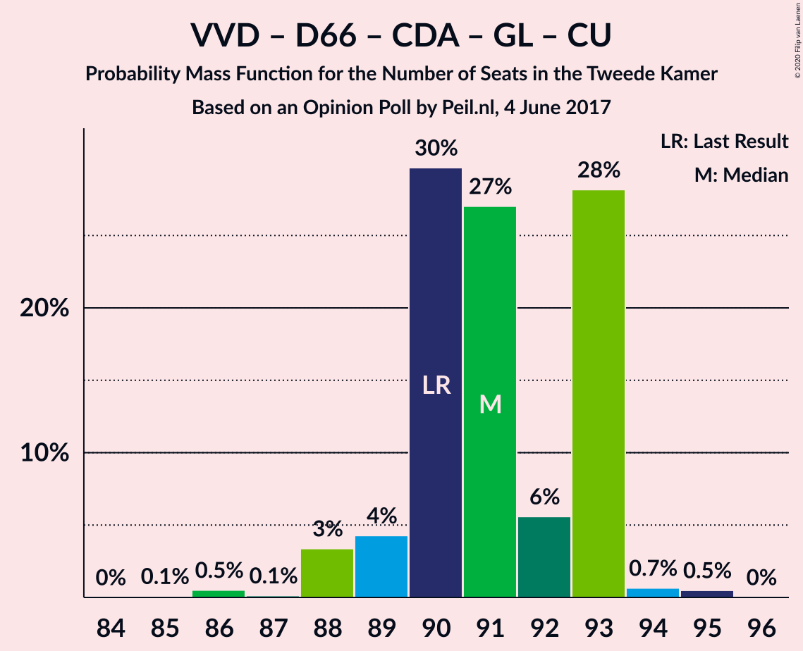

| Number of Seats | Probability | Accumulated | Special Marks |
|:---------------:|:-----------:|:-----------:|:-------------:|
| 88 | 1.1% | 100% |  |
| 89 | 6% | 98.9% |  |
| 90 | 68% | 93% | Last Result, Median |
| 91 | 23% | 25% |  |
| 92 | 2% | 2% |  |
| 93 | 0.2% | 0.2% |  |
| 94 | 0% | 0% |  |

### Volkspartij voor Vrijheid en Democratie – Democraten 66 – Christen-Democratisch Appèl – Partij van de Arbeid – ChristenUnie

| Number of Seats | Probability | Accumulated | Special Marks |
|:---------------:|:-----------:|:-----------:|:-------------:|
| 84 | 2% | 100% |  |
| 85 | 8% | 98% | Last Result |
| 86 | 90% | 91% | Median |
| 87 | 0.3% | 0.4% |  |
| 88 | 0% | 0.2% |  |
| 89 | 0.1% | 0.1% |  |
| 90 | 0.1% | 0.1% |  |
| 91 | 0% | 0% |  |

### Democraten 66 – Christen-Democratisch Appèl – GroenLinks – Socialistische Partij – Partij van de Arbeid – ChristenUnie

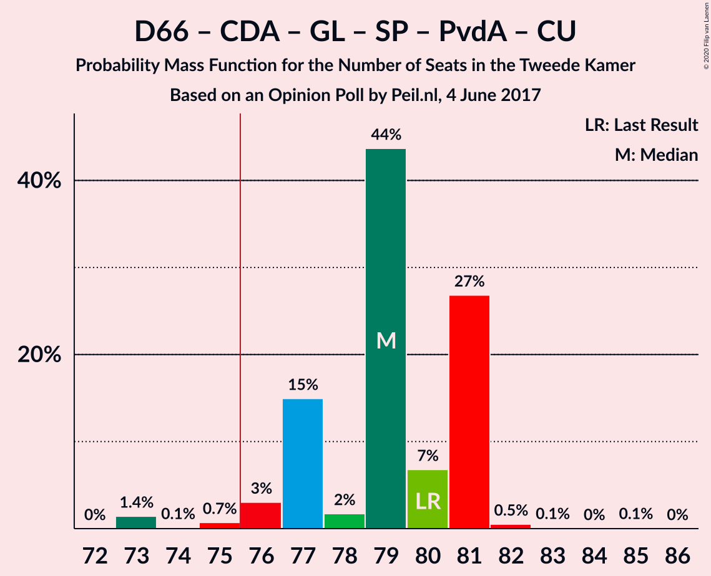

| Number of Seats | Probability | Accumulated | Special Marks |
|:---------------:|:-----------:|:-----------:|:-------------:|
| 75 | 0.1% | 100% |  |
| 76 | 0.4% | 99.9% | Majority |
| 77 | 24% | 99.6% |  |
| 78 | 0% | 76% |  |
| 79 | 68% | 76% | Median |
| 80 | 8% | 8% | Last Result |
| 81 | 0.4% | 0.5% |  |
| 82 | 0% | 0.1% |  |
| 83 | 0% | 0% |  |

### Volkspartij voor Vrijheid en Democratie – Partij voor de Vrijheid – Christen-Democratisch Appèl – Forum voor Democratie – Staatkundig Gereformeerde Partij

| Number of Seats | Probability | Accumulated | Special Marks |
|:---------------:|:-----------:|:-----------:|:-------------:|
| 75 | 0.1% | 100% |  |
| 76 | 6% | 99.9% | Majority |
| 77 | 0.7% | 94% | Last Result |
| 78 | 1.3% | 94% |  |
| 79 | 3% | 92% |  |
| 80 | 89% | 89% | Median |
| 81 | 0.3% | 0.3% |  |
| 82 | 0% | 0% |  |

### Volkspartij voor Vrijheid en Democratie – Democraten 66 – Christen-Democratisch Appèl – ChristenUnie

| Number of Seats | Probability | Accumulated | Special Marks |
|:---------------:|:-----------:|:-----------:|:-------------:|
| 74 | 0.5% | 100% |  |
| 75 | 8% | 99.5% |  |
| 76 | 69% | 92% | Last Result, Median, Majority |
| 77 | 0.3% | 23% |  |
| 78 | 23% | 23% |  |
| 79 | 0.1% | 0.2% |  |
| 80 | 0.1% | 0.1% |  |
| 81 | 0% | 0% |  |

### Volkspartij voor Vrijheid en Democratie – Partij voor de Vrijheid – Christen-Democratisch Appèl – Forum voor Democratie

| Number of Seats | Probability | Accumulated | Special Marks |
|:---------------:|:-----------:|:-----------:|:-------------:|
| 72 | 0.1% | 100% |  |
| 73 | 0.1% | 99.9% |  |
| 74 | 6% | 99.8% | Last Result |
| 75 | 1.3% | 94% |  |
| 76 | 1.0% | 92% | Majority |
| 77 | 2% | 91% |  |
| 78 | 89% | 89% | Median |
| 79 | 0% | 0% |  |

### Volkspartij voor Vrijheid en Democratie – Democraten 66 – Christen-Democratisch Appèl

| Number of Seats | Probability | Accumulated | Special Marks |
|:---------------:|:-----------:|:-----------:|:-------------:|
| 69 | 0.5% | 100% |  |
| 70 | 0.2% | 99.5% |  |
| 71 | 8% | 99.3% | Last Result |
| 72 | 69% | 91% | Median |
| 73 | 0.1% | 23% |  |
| 74 | 23% | 23% |  |
| 75 | 0% | 0.1% |  |
| 76 | 0.1% | 0.1% | Majority |
| 77 | 0% | 0% |  |

### Volkspartij voor Vrijheid en Democratie – Partij voor de Vrijheid – Christen-Democratisch Appèl

| Number of Seats | Probability | Accumulated | Special Marks |
|:---------------:|:-----------:|:-----------:|:-------------:|
| 68 | 0.1% | 100% |  |
| 69 | 0% | 99.9% |  |
| 70 | 6% | 99.9% |  |
| 71 | 1.5% | 94% |  |
| 72 | 1.3% | 93% | Last Result |
| 73 | 2% | 91% |  |
| 74 | 89% | 89% | Median |
| 75 | 0.3% | 0.3% |  |
| 76 | 0% | 0% | Majority |

### Democraten 66 – Christen-Democratisch Appèl – GroenLinks – Partij van de Arbeid – ChristenUnie

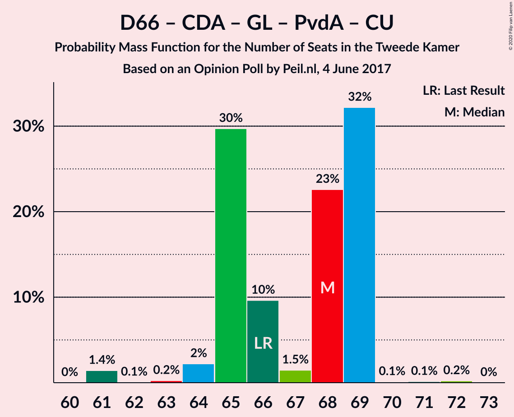

| Number of Seats | Probability | Accumulated | Special Marks |
|:---------------:|:-----------:|:-----------:|:-------------:|
| 64 | 1.3% | 100% |  |
| 65 | 67% | 98.7% | Median |
| 66 | 23% | 32% | Last Result |
| 67 | 1.0% | 9% |  |
| 68 | 0.1% | 8% |  |
| 69 | 8% | 8% |  |
| 70 | 0.1% | 0.1% |  |
| 71 | 0% | 0% |  |

### Volkspartij voor Vrijheid en Democratie – Democraten 66 – Partij van de Arbeid

| Number of Seats | Probability | Accumulated | Special Marks |
|:---------------:|:-----------:|:-----------:|:-------------:|
| 61 | 0.1% | 100% | Last Result |
| 62 | 0.5% | 99.9% |  |
| 63 | 31% | 99.5% |  |
| 64 | 68% | 68% | Median |
| 65 | 0.2% | 0.4% |  |
| 66 | 0.1% | 0.2% |  |
| 67 | 0% | 0.1% |  |
| 68 | 0% | 0.1% |  |
| 69 | 0% | 0.1% |  |
| 70 | 0.1% | 0.1% |  |
| 71 | 0% | 0% |  |

### Volkspartij voor Vrijheid en Democratie – Christen-Democratisch Appèl – Partij van de Arbeid

| Number of Seats | Probability | Accumulated | Special Marks |
|:---------------:|:-----------:|:-----------:|:-------------:|
| 58 | 7% | 100% |  |
| 59 | 0.1% | 93% |  |
| 60 | 24% | 93% |  |
| 61 | 2% | 69% | Last Result |
| 62 | 0.1% | 67% |  |
| 63 | 67% | 67% | Median |
| 64 | 0.1% | 0.4% |  |
| 65 | 0.3% | 0.3% |  |
| 66 | 0% | 0% |  |

### Volkspartij voor Vrijheid en Democratie – Christen-Democratisch Appèl – 50Plus – Forum voor Democratie – Staatkundig Gereformeerde Partij

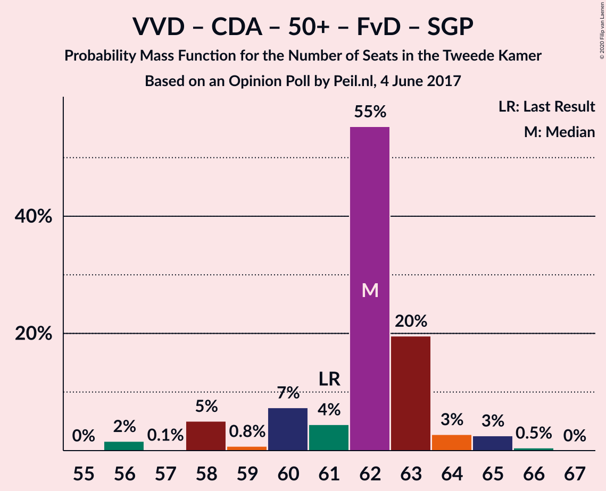

| Number of Seats | Probability | Accumulated | Special Marks |
|:---------------:|:-----------:|:-----------:|:-------------:|
| 58 | 5% | 100% |  |
| 59 | 0.5% | 95% |  |
| 60 | 3% | 94% |  |
| 61 | 0.2% | 91% | Last Result |
| 62 | 90% | 90% | Median |
| 63 | 0.4% | 0.5% |  |
| 64 | 0% | 0% |  |

### Volkspartij voor Vrijheid en Democratie – Christen-Democratisch Appèl – 50Plus – Forum voor Democratie

| Number of Seats | Probability | Accumulated | Special Marks |
|:---------------:|:-----------:|:-----------:|:-------------:|
| 56 | 6% | 100% |  |
| 57 | 1.5% | 94% |  |
| 58 | 2% | 93% | Last Result |
| 59 | 1.1% | 90% |  |
| 60 | 89% | 89% | Median |
| 61 | 0.1% | 0.1% |  |
| 62 | 0% | 0% |  |

### Volkspartij voor Vrijheid en Democratie – Christen-Democratisch Appèl – Forum voor Democratie – Staatkundig Gereformeerde Partij

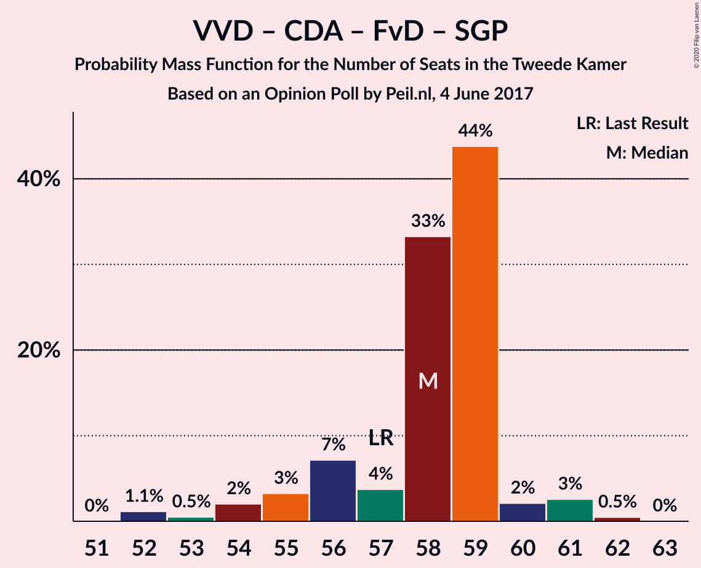

| Number of Seats | Probability | Accumulated | Special Marks |
|:---------------:|:-----------:|:-----------:|:-------------:|
| 54 | 5% | 100% |  |
| 55 | 0.1% | 95% |  |
| 56 | 2% | 94% |  |
| 57 | 2% | 93% | Last Result |
| 58 | 24% | 91% |  |
| 59 | 67% | 67% | Median |
| 60 | 0.3% | 0.3% |  |
| 61 | 0% | 0% |  |

### Volkspartij voor Vrijheid en Democratie – Christen-Democratisch Appèl – Forum voor Democratie

| Number of Seats | Probability | Accumulated | Special Marks |
|:---------------:|:-----------:|:-----------:|:-------------:|
| 52 | 6% | 100% |  |
| 53 | 2% | 94% |  |
| 54 | 0.1% | 93% | Last Result |
| 55 | 3% | 93% |  |
| 56 | 23% | 89% |  |
| 57 | 67% | 67% | Median |
| 58 | 0.1% | 0.1% |  |
| 59 | 0% | 0% |  |

### Volkspartij voor Vrijheid en Democratie – Christen-Democratisch Appèl

| Number of Seats | Probability | Accumulated | Special Marks |
|:---------------:|:-----------:|:-----------:|:-------------:|
| 48 | 6% | 100% |  |
| 49 | 0.1% | 94% |  |
| 50 | 3% | 94% |  |
| 51 | 2% | 92% |  |
| 52 | 23% | 90% | Last Result |
| 53 | 66% | 67% | Median |
| 54 | 0.4% | 0.4% |  |
| 55 | 0% | 0% |  |

### Democraten 66 – Christen-Democratisch Appèl – Partij van de Arbeid

| Number of Seats | Probability | Accumulated | Special Marks |
|:---------------:|:-----------:|:-----------:|:-------------:|
| 45 | 0.1% | 100% |  |
| 46 | 2% | 99.9% |  |
| 47 | 67% | 98% | Last Result, Median |
| 48 | 2% | 31% |  |
| 49 | 23% | 29% |  |
| 50 | 0.1% | 7% |  |
| 51 | 6% | 6% |  |
| 52 | 0% | 0% |  |

### Volkspartij voor Vrijheid en Democratie – Partij van de Arbeid

| Number of Seats | Probability | Accumulated | Special Marks |
|:---------------:|:-----------:|:-----------:|:-------------:|
| 40 | 6% | 100% |  |
| 41 | 24% | 94% |  |
| 42 | 1.2% | 71% | Last Result |
| 43 | 2% | 70% |  |
| 44 | 0.2% | 67% |  |
| 45 | 67% | 67% | Median |
| 46 | 0% | 0.4% |  |
| 47 | 0.3% | 0.3% |  |
| 48 | 0.1% | 0.1% |  |
| 49 | 0% | 0% |  |

### Democraten 66 – Christen-Democratisch Appèl

| Number of Seats | Probability | Accumulated | Special Marks |
|:---------------:|:-----------:|:-----------:|:-------------:|
| 35 | 0.3% | 100% |  |
| 36 | 0.5% | 99.7% |  |
| 37 | 67% | 99.2% | Median |
| 38 | 3% | 33% | Last Result |
| 39 | 0.2% | 29% |  |
| 40 | 0% | 29% |  |
| 41 | 29% | 29% |  |
| 42 | 0% | 0% |  |

### Christen-Democratisch Appèl – Partij van de Arbeid – ChristenUnie

| Number of Seats | Probability | Accumulated | Special Marks |
|:---------------:|:-----------:|:-----------:|:-------------:|
| 28 | 1.2% | 100% |  |
| 29 | 0% | 98.8% |  |
| 30 | 0.2% | 98.8% |  |
| 31 | 23% | 98.6% |  |
| 32 | 74% | 76% | Median |
| 33 | 1.4% | 2% | Last Result |
| 34 | 0% | 0.2% |  |
| 35 | 0.1% | 0.1% |  |
| 36 | 0.1% | 0.1% |  |
| 37 | 0% | 0% |  |

### Christen-Democratisch Appèl – Partij van de Arbeid

| Number of Seats | Probability | Accumulated | Special Marks |
|:---------------:|:-----------:|:-----------:|:-------------:|
| 24 | 1.2% | 100% |  |
| 25 | 0% | 98.8% |  |
| 26 | 0.3% | 98.8% |  |
| 27 | 23% | 98% |  |
| 28 | 74% | 75% | Last Result, Median |
| 29 | 1.3% | 1.4% |  |
| 30 | 0.1% | 0.1% |  |
| 31 | 0% | 0% |  |

## Technical Information

### Opinion Poll

+ **Polling firm:** Peil.nl
+ **Commissioner(s):** —
+ **Fieldwork period:** 4 June 2017

### Calculations

+ **Sample size:** 3000
+ **Simulations done:** 131,072
+ **Error estimate:** 2.48%

