# Opinion Poll by Ipsos, 15 June 2017

<a href="#voting-intentions">Voting Intentions</a> | <a href="#seats">Seats</a> | <a href="#coalitions">Coalitions</a> | <a href="#technical-information">Technical Information</a>

## Voting Intentions

### Confidence Intervals

| Party | Last Result | Poll Result | 80% Confidence Interval | 90% Confidence Interval | 95% Confidence Interval | 99% Confidence Interval |
|:-----:|:-----------:|:-----------:|:-----------------------:|:-----------------------:|:-----------------------:|:-----------------------:|
| Volkspartij voor Vrijheid en Democratie | 21.3% | 23.7% | 22.0–25.5% |21.6–26.0% |21.2–26.4% |20.4–27.3% |
| Democraten 66 | 12.2% | 13.2% | 11.9–14.7% |11.6–15.1% |11.2–15.5% |10.7–16.2% |
| Partij voor de Vrijheid | 13.1% | 12.2% | 11.0–13.6% |10.6–14.0% |10.3–14.4% |9.7–15.1% |
| Christen-Democratisch Appèl | 12.4% | 11.4% | 10.2–12.8% |9.9–13.2% |9.6–13.5% |9.0–14.2% |
| GroenLinks | 9.1% | 9.3% | 8.2–10.6% |7.9–10.9% |7.7–11.3% |7.2–11.9% |
| Socialistische Partij | 9.1% | 6.1% | 5.2–7.2% |5.0–7.5% |4.8–7.8% |4.4–8.3% |
| Partij van de Arbeid | 5.7% | 6.0% | 5.1–7.1% |4.9–7.4% |4.7–7.7% |4.3–8.2% |
| ChristenUnie | 3.4% | 4.2% | 3.5–5.1% |3.3–5.4% |3.1–5.6% |2.8–6.1% |
| Partij voor de Dieren | 3.2% | 3.3% | 2.7–4.1% |2.5–4.4% |2.4–4.6% |2.1–5.0% |
| Forum voor Democratie | 1.8% | 3.1% | 2.5–3.9% |2.3–4.2% |2.2–4.4% |1.9–4.8% |
| 50Plus | 3.1% | 2.4% | 1.9–3.2% |1.7–3.4% |1.6–3.6% |1.4–3.9% |
| DENK | 2.1% | 2.2% | 1.7–2.9% |1.6–3.1% |1.4–3.3% |1.2–3.7% |
| Staatkundig Gereformeerde Partij | 2.1% | 1.5% | 1.1–2.1% |1.0–2.3% |0.9–2.5% |0.7–2.8% |

*Note:* The poll result column reflects the actual value used in the calculations. Published results may vary slightly, and in addition be rounded to fewer digits.

## Seats

### Confidence Intervals

| Party | Last Result | Median | 80% Confidence Interval | 90% Confidence Interval | 95% Confidence Interval | 99% Confidence Interval |
|:-----:|:-----------:|:------:|:-----------------------:|:-----------------------:|:-----------------------:|:-----------------------:|
| <a href="#volkspartij-voor-vrijheid-en-democratie">Volkspartij voor Vrijheid en Democratie</a> | 33 | 39 | 38–40 |34–40 |34–40 |32–40 |
| <a href="#democraten-66">Democraten 66</a> | 19 | 20 | 17–22 |17–22 |17–22 |17–25 |
| <a href="#partij-voor-de-vrijheid">Partij voor de Vrijheid</a> | 20 | 19 | 17–19 |17–19 |17–19 |15–21 |
| <a href="#christen-democratisch-appèl">Christen-Democratisch Appèl</a> | 19 | 16 | 15–19 |15–19 |14–21 |14–21 |
| <a href="#groenlinks">GroenLinks</a> | 14 | 14 | 13–16 |13–16 |13–17 |12–17 |
| <a href="#socialistische-partij">Socialistische Partij</a> | 14 | 8 | 8–10 |8–10 |8–10 |7–11 |
| <a href="#partij-van-de-arbeid">Partij van de Arbeid</a> | 9 | 9 | 8–9 |8–10 |8–11 |8–11 |
| <a href="#christenunie">ChristenUnie</a> | 5 | 6 | 5–9 |5–9 |5–9 |4–9 |
| <a href="#partij-voor-de-dieren">Partij voor de Dieren</a> | 5 | 5 | 4–5 |4–5 |4–5 |4–6 |
| <a href="#forum-voor-democratie">Forum voor Democratie</a> | 2 | 4 | 4–5 |4–5 |4–5 |3–7 |
| <a href="#50plus">50Plus</a> | 4 | 3 | 3–4 |3–4 |3–4 |1–4 |
| <a href="#denk">DENK</a> | 3 | 3 | 2–3 |2–4 |2–4 |2–4 |
| <a href="#staatkundig-gereformeerde-partij">Staatkundig Gereformeerde Partij</a> | 3 | 2 | 1–3 |1–3 |1–3 |1–4 |

### Volkspartij voor Vrijheid en Democratie

*For a full overview of the results for this party, see the [Volkspartij voor Vrijheid en Democratie](party-volkspartijvoorvrijheidendemocratie.html) page.*

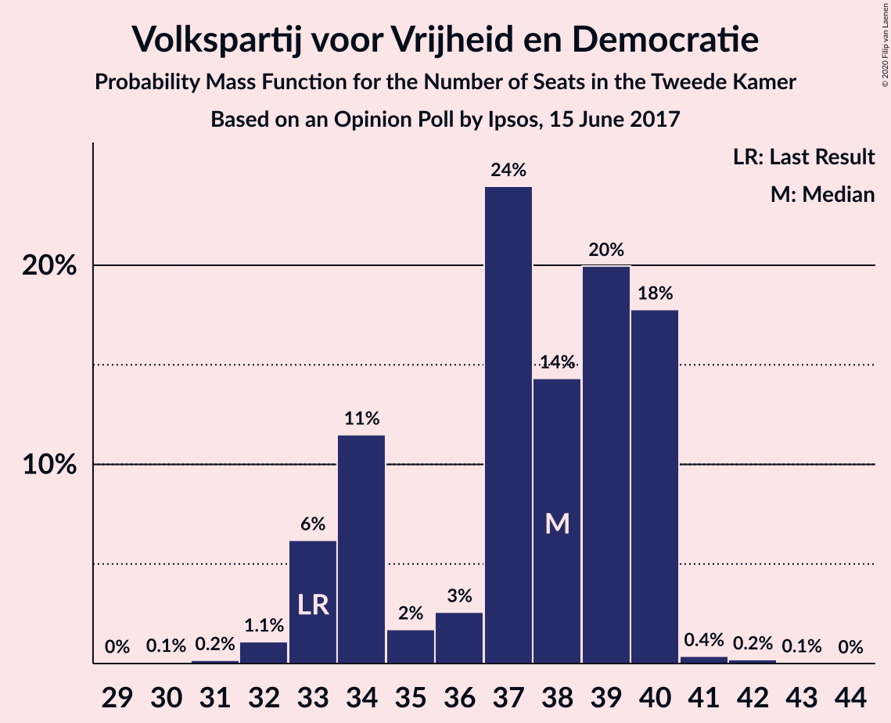

| Number of Seats | Probability | Accumulated | Special Marks |
|:---------------:|:-----------:|:-----------:|:-------------:|
| 31 | 0.1% | 100% |  |
| 32 | 0.7% | 99.9% |  |
| 33 | 0.5% | 99.2% | Last Result |
| 34 | 4% | 98.7% |  |
| 35 | 0.5% | 95% |  |
| 36 | 0.1% | 94% |  |
| 37 | 0.4% | 94% |  |
| 38 | 28% | 94% |  |
| 39 | 45% | 66% | Median |
| 40 | 21% | 21% |  |
| 41 | 0% | 0.1% |  |
| 42 | 0% | 0.1% |  |
| 43 | 0.1% | 0.1% |  |
| 44 | 0% | 0% |  |

### Democraten 66

*For a full overview of the results for this party, see the [Democraten 66](party-democraten66.html) page.*

| Number of Seats | Probability | Accumulated | Special Marks |
|:---------------:|:-----------:|:-----------:|:-------------:|
| 16 | 0.1% | 100% |  |
| 17 | 21% | 99.9% |  |
| 18 | 0.7% | 79% |  |
| 19 | 18% | 78% | Last Result |
| 20 | 32% | 60% | Median |
| 21 | 0.9% | 28% |  |
| 22 | 27% | 27% |  |
| 23 | 0.1% | 0.9% |  |
| 24 | 0% | 0.8% |  |
| 25 | 0.3% | 0.8% |  |
| 26 | 0.5% | 0.5% |  |
| 27 | 0% | 0% |  |

### Partij voor de Vrijheid

*For a full overview of the results for this party, see the [Partij voor de Vrijheid](party-partijvoordevrijheid.html) page.*

| Number of Seats | Probability | Accumulated | Special Marks |
|:---------------:|:-----------:|:-----------:|:-------------:|
| 15 | 0.5% | 100% |  |
| 16 | 0.3% | 99.5% |  |
| 17 | 32% | 99.2% |  |
| 18 | 15% | 68% |  |
| 19 | 52% | 53% | Median |
| 20 | 0.4% | 1.2% | Last Result |
| 21 | 0.5% | 0.8% |  |
| 22 | 0.2% | 0.3% |  |
| 23 | 0% | 0.1% |  |
| 24 | 0.1% | 0.1% |  |
| 25 | 0% | 0% |  |

### Christen-Democratisch Appèl

*For a full overview of the results for this party, see the [Christen-Democratisch Appèl](party-christen-democratischappèl.html) page.*

| Number of Seats | Probability | Accumulated | Special Marks |
|:---------------:|:-----------:|:-----------:|:-------------:|
| 14 | 5% | 100% |  |
| 15 | 14% | 95% |  |
| 16 | 55% | 81% | Median |
| 17 | 2% | 26% |  |
| 18 | 0.4% | 25% |  |
| 19 | 20% | 24% | Last Result |
| 20 | 0.2% | 4% |  |
| 21 | 3% | 3% |  |
| 22 | 0% | 0% |  |

### GroenLinks

*For a full overview of the results for this party, see the [GroenLinks](party-groenlinks.html) page.*

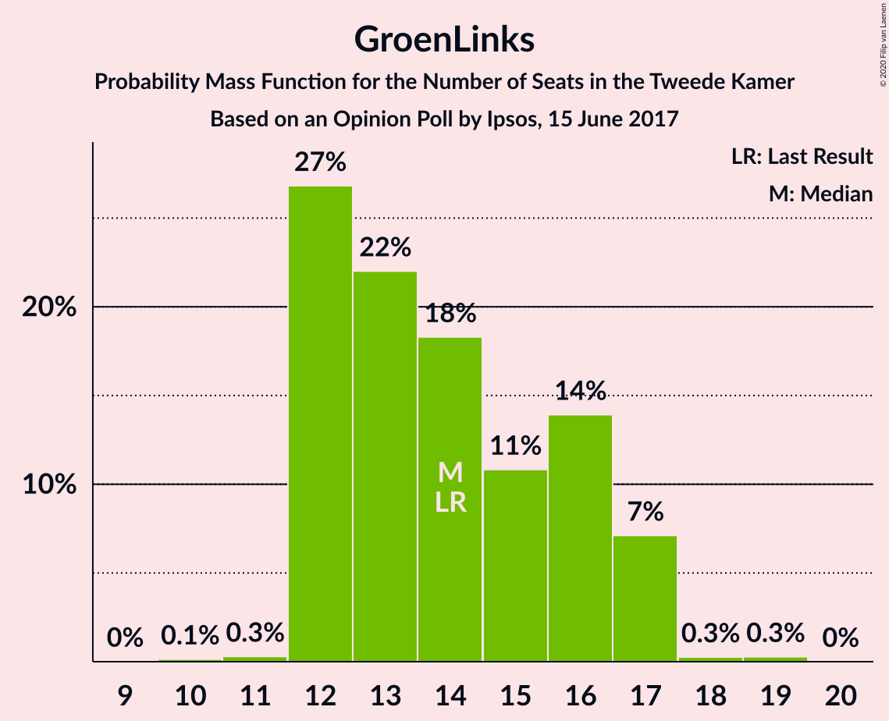

| Number of Seats | Probability | Accumulated | Special Marks |
|:---------------:|:-----------:|:-----------:|:-------------:|
| 11 | 0.1% | 100% |  |
| 12 | 0.5% | 99.9% |  |
| 13 | 47% | 99.3% |  |
| 14 | 18% | 53% | Last Result, Median |
| 15 | 0.8% | 35% |  |
| 16 | 29% | 34% |  |
| 17 | 5% | 5% |  |
| 18 | 0% | 0% |  |

### Socialistische Partij

*For a full overview of the results for this party, see the [Socialistische Partij](party-socialistischepartij.html) page.*

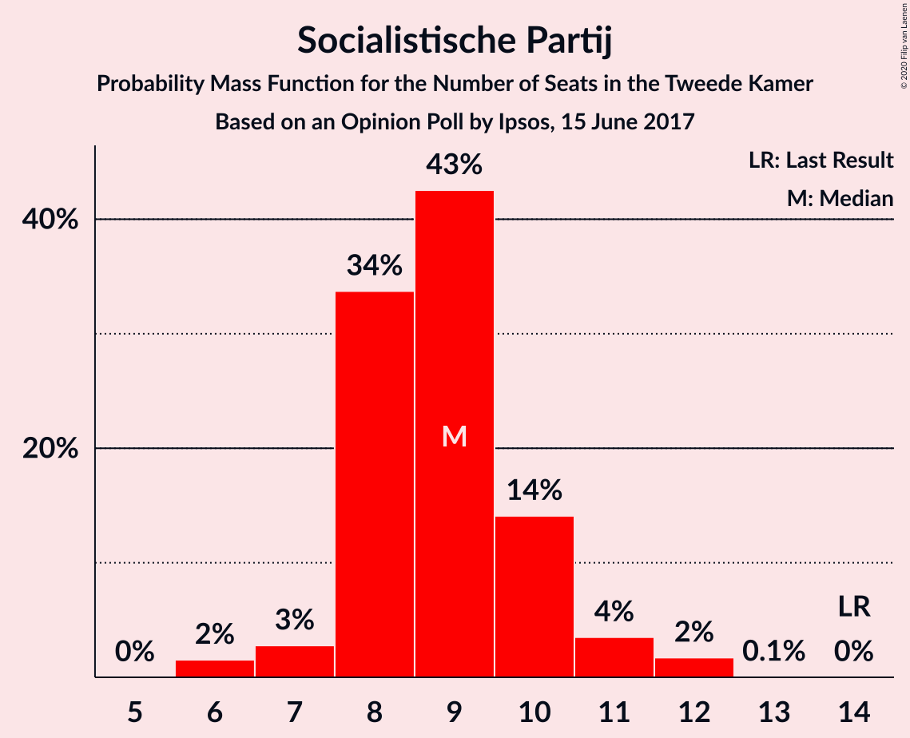

| Number of Seats | Probability | Accumulated | Special Marks |
|:---------------:|:-----------:|:-----------:|:-------------:|
| 6 | 0.1% | 100% |  |
| 7 | 0.5% | 99.9% |  |
| 8 | 75% | 99.5% | Median |
| 9 | 9% | 25% |  |
| 10 | 15% | 15% |  |
| 11 | 0.6% | 0.6% |  |
| 12 | 0% | 0.1% |  |
| 13 | 0% | 0% |  |
| 14 | 0% | 0% | Last Result |

### Partij van de Arbeid

*For a full overview of the results for this party, see the [Partij van de Arbeid](party-partijvandearbeid.html) page.*

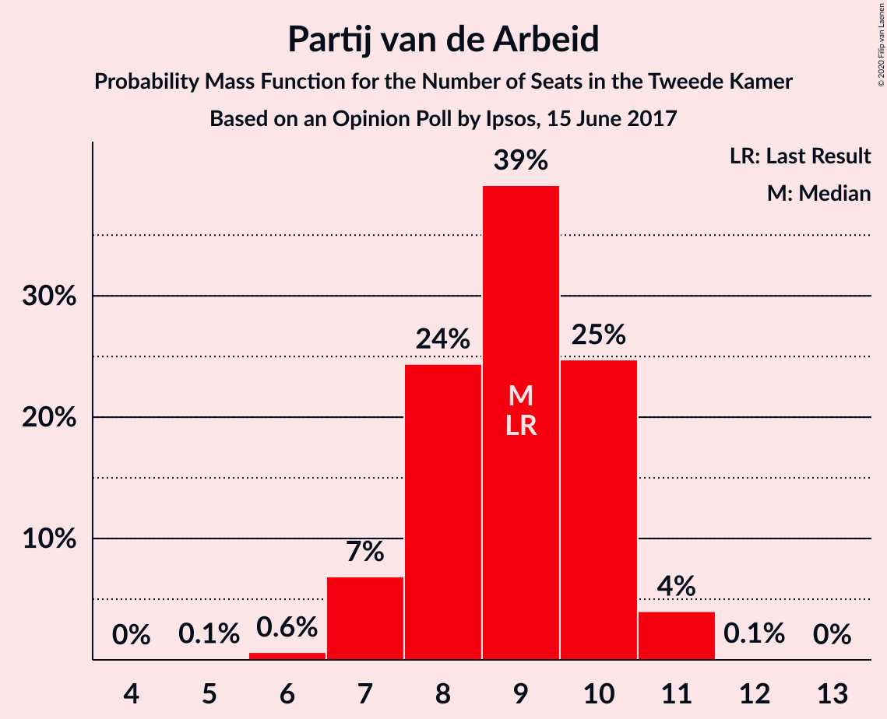

| Number of Seats | Probability | Accumulated | Special Marks |
|:---------------:|:-----------:|:-----------:|:-------------:|
| 6 | 0.1% | 100% |  |
| 7 | 0.4% | 99.9% |  |
| 8 | 27% | 99.5% |  |
| 9 | 62% | 72% | Last Result, Median |
| 10 | 6% | 10% |  |
| 11 | 4% | 4% |  |
| 12 | 0.1% | 0.1% |  |
| 13 | 0% | 0% |  |

### ChristenUnie

*For a full overview of the results for this party, see the [ChristenUnie](party-christenunie.html) page.*

| Number of Seats | Probability | Accumulated | Special Marks |
|:---------------:|:-----------:|:-----------:|:-------------:|
| 3 | 0.1% | 100% |  |
| 4 | 0.8% | 99.9% |  |
| 5 | 29% | 99.0% | Last Result |
| 6 | 28% | 70% | Median |
| 7 | 29% | 42% |  |
| 8 | 0.6% | 14% |  |
| 9 | 13% | 13% |  |
| 10 | 0% | 0% |  |

### Partij voor de Dieren

*For a full overview of the results for this party, see the [Partij voor de Dieren](party-partijvoordedieren.html) page.*

| Number of Seats | Probability | Accumulated | Special Marks |
|:---------------:|:-----------:|:-----------:|:-------------:|
| 3 | 0.2% | 100% |  |
| 4 | 47% | 99.8% |  |
| 5 | 51% | 52% | Last Result, Median |
| 6 | 1.3% | 1.3% |  |
| 7 | 0% | 0% |  |

### Forum voor Democratie

*For a full overview of the results for this party, see the [Forum voor Democratie](party-forumvoordemocratie.html) page.*

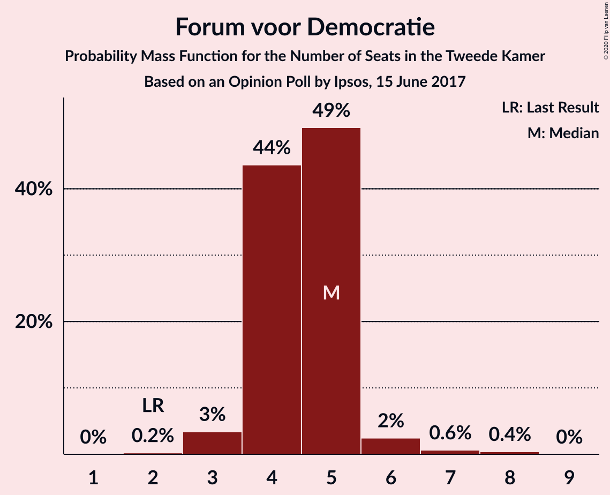

| Number of Seats | Probability | Accumulated | Special Marks |
|:---------------:|:-----------:|:-----------:|:-------------:|
| 2 | 0% | 100% | Last Result |
| 3 | 1.2% | 100% |  |
| 4 | 77% | 98.8% | Median |
| 5 | 21% | 21% |  |
| 6 | 0.1% | 0.8% |  |
| 7 | 0.6% | 0.6% |  |
| 8 | 0% | 0% |  |

### 50Plus

*For a full overview of the results for this party, see the [50Plus](party-50plus.html) page.*

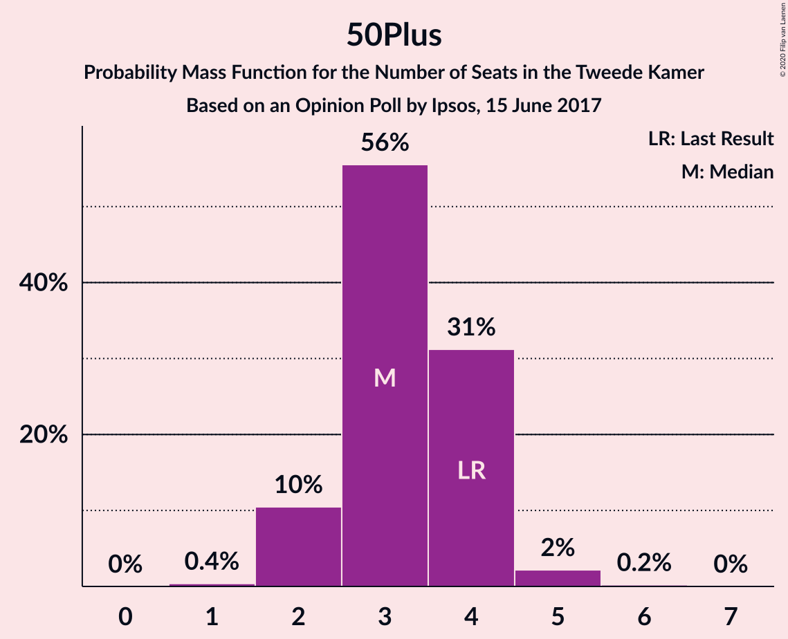

| Number of Seats | Probability | Accumulated | Special Marks |
|:---------------:|:-----------:|:-----------:|:-------------:|
| 1 | 0.9% | 100% |  |
| 2 | 0.5% | 99.1% |  |
| 3 | 65% | 98.6% | Median |
| 4 | 33% | 33% | Last Result |
| 5 | 0.3% | 0.3% |  |
| 6 | 0% | 0% |  |

### DENK

*For a full overview of the results for this party, see the [DENK](party-denk.html) page.*

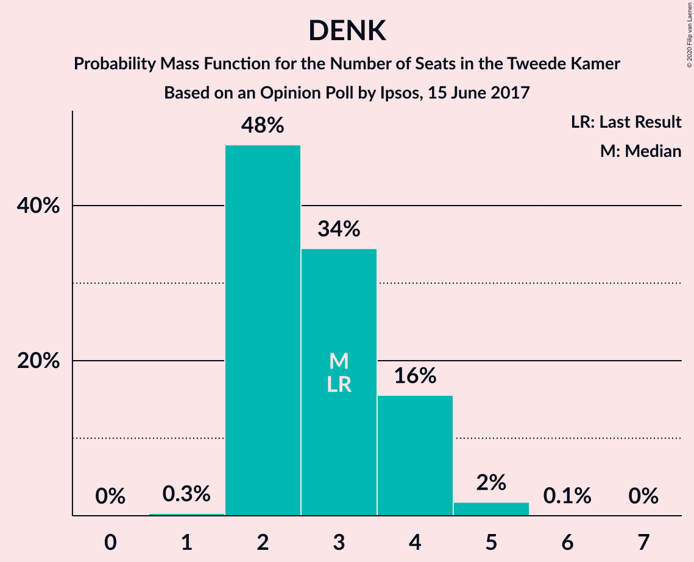

| Number of Seats | Probability | Accumulated | Special Marks |
|:---------------:|:-----------:|:-----------:|:-------------:|
| 1 | 0.1% | 100% |  |
| 2 | 45% | 99.9% |  |
| 3 | 50% | 55% | Last Result, Median |
| 4 | 5% | 5% |  |
| 5 | 0.1% | 0.3% |  |
| 6 | 0.1% | 0.1% |  |
| 7 | 0% | 0% |  |

### Staatkundig Gereformeerde Partij

*For a full overview of the results for this party, see the [Staatkundig Gereformeerde Partij](party-staatkundiggereformeerdepartij.html) page.*

| Number of Seats | Probability | Accumulated | Special Marks |
|:---------------:|:-----------:|:-----------:|:-------------:|
| 1 | 32% | 100% |  |
| 2 | 20% | 68% | Median |
| 3 | 47% | 47% | Last Result |
| 4 | 0.5% | 0.5% |  |
| 5 | 0% | 0% |  |

## Coalitions

### Confidence Intervals

| Coalition | Last Result | Median | Majority? | 80% Confidence Interval | 90% Confidence Interval | 95% Confidence Interval | 99% Confidence Interval |
|:---------:|:-----------:|:------:|:---------:|:-----------------------:|:-----------------------:|:-----------------------:|:-----------------------:|
| Volkspartij voor Vrijheid en Democratie – Democraten 66 – Christen-Democratisch Appèl – GroenLinks – ChristenUnie | 90 | 96 | 100% | 94–97 | 94–97 | 94–97 | 90–97 |
| Volkspartij voor Vrijheid en Democratie – Democraten 66 – Christen-Democratisch Appèl – Partij van de Arbeid – ChristenUnie | 85 | 90 | 100% | 90–91 | 87–91 | 87–91 | 86–92 |
| Volkspartij voor Vrijheid en Democratie – Partij voor de Vrijheid – Christen-Democratisch Appèl – Forum voor Democratie – Staatkundig Gereformeerde Partij | 77 | 78 | 98.8% | 76–86 | 76–86 | 76–86 | 72–86 |
| Volkspartij voor Vrijheid en Democratie – Democraten 66 – Christen-Democratisch Appèl – ChristenUnie | 76 | 81 | 99.7% | 80–83 | 77–83 | 77–83 | 77–83 |
| Volkspartij voor Vrijheid en Democratie – Partij voor de Vrijheid – Christen-Democratisch Appèl – Forum voor Democratie | 74 | 76 | 70% | 75–83 | 75–83 | 75–83 | 70–83 |
| Democraten 66 – Christen-Democratisch Appèl – GroenLinks – Socialistische Partij – Partij van de Arbeid – ChristenUnie | 80 | 74 | 47% | 71–76 | 71–77 | 71–80 | 71–81 |
| Volkspartij voor Vrijheid en Democratie – Partij voor de Vrijheid – Christen-Democratisch Appèl | 72 | 72 | 20% | 71–78 | 71–78 | 71–78 | 67–78 |
| Volkspartij voor Vrijheid en Democratie – Democraten 66 – Christen-Democratisch Appèl | 71 | 75 | 47% | 73–77 | 72–77 | 72–77 | 72–77 |
| Democraten 66 – Christen-Democratisch Appèl – GroenLinks – Partij van de Arbeid – ChristenUnie | 66 | 65 | 0% | 63–68 | 63–68 | 63–71 | 63–72 |
| Volkspartij voor Vrijheid en Democratie – Christen-Democratisch Appèl – Forum voor Democratie – 50Plus – Staatkundig Gereformeerde Partij | 61 | 63 | 0% | 63–70 | 63–70 | 63–70 | 57–70 |
| Volkspartij voor Vrijheid en Democratie – Democraten 66 – Partij van de Arbeid | 61 | 67 | 0% | 66–69 | 65–69 | 65–69 | 63–69 |
| Volkspartij voor Vrijheid en Democratie – Christen-Democratisch Appèl – Partij van de Arbeid | 61 | 63 | 0% | 63–68 | 63–68 | 63–68 | 58–68 |
| Volkspartij voor Vrijheid en Democratie – Christen-Democratisch Appèl – Forum voor Democratie – 50Plus | 58 | 62 | 0% | 61–67 | 61–67 | 61–67 | 56–67 |
| Volkspartij voor Vrijheid en Democratie – Christen-Democratisch Appèl – Forum voor Democratie – Staatkundig Gereformeerde Partij | 57 | 60 | 0% | 59–67 | 59–67 | 59–67 | 54–67 |
| Volkspartij voor Vrijheid en Democratie – Christen-Democratisch Appèl – Forum voor Democratie | 54 | 59 | 0% | 58–64 | 57–64 | 57–64 | 53–64 |
| Volkspartij voor Vrijheid en Democratie – Christen-Democratisch Appèl | 52 | 55 | 0% | 54–59 | 53–59 | 53–59 | 49–59 |
| Democraten 66 – Christen-Democratisch Appèl – Partij van de Arbeid | 47 | 45 | 0% | 43–46 | 43–48 | 43–52 | 43–52 |
| Volkspartij voor Vrijheid en Democratie – Partij van de Arbeid | 42 | 47 | 0% | 47–49 | 45–49 | 45–49 | 41–50 |
| Democraten 66 – Christen-Democratisch Appèl | 38 | 36 | 0% | 34–38 | 33–39 | 33–41 | 33–43 |
| Christen-Democratisch Appèl – Partij van de Arbeid – ChristenUnie | 33 | 32 | 0% | 30–33 | 29–33 | 29–37 | 29–37 |
| Christen-Democratisch Appèl – Partij van de Arbeid | 28 | 25 | 0% | 24–28 | 24–28 | 24–32 | 24–32 |

### Volkspartij voor Vrijheid en Democratie – Democraten 66 – Christen-Democratisch Appèl – GroenLinks – ChristenUnie

| Number of Seats | Probability | Accumulated | Special Marks |
|:---------------:|:-----------:|:-----------:|:-------------:|
| 90 | 0.5% | 100% | Last Result |
| 91 | 0.4% | 99.5% |  |
| 92 | 0.1% | 99.0% |  |
| 93 | 0.6% | 99.0% |  |
| 94 | 29% | 98% |  |
| 95 | 2% | 70% | Median |
| 96 | 40% | 68% |  |
| 97 | 28% | 28% |  |
| 98 | 0% | 0% |  |

### Volkspartij voor Vrijheid en Democratie – Democraten 66 – Christen-Democratisch Appèl – Partij van de Arbeid – ChristenUnie

| Number of Seats | Probability | Accumulated | Special Marks |
|:---------------:|:-----------:|:-----------:|:-------------:|
| 82 | 0.1% | 100% |  |
| 83 | 0% | 99.9% |  |
| 84 | 0.2% | 99.9% |  |
| 85 | 0.1% | 99.7% | Last Result |
| 86 | 0.5% | 99.6% |  |
| 87 | 5% | 99.1% |  |
| 88 | 1.5% | 94% |  |
| 89 | 0.3% | 92% |  |
| 90 | 48% | 92% | Median |
| 91 | 43% | 44% |  |
| 92 | 0.3% | 0.7% |  |
| 93 | 0.1% | 0.3% |  |
| 94 | 0.3% | 0.3% |  |
| 95 | 0% | 0% |  |

### Volkspartij voor Vrijheid en Democratie – Partij voor de Vrijheid – Christen-Democratisch Appèl – Forum voor Democratie – Staatkundig Gereformeerde Partij

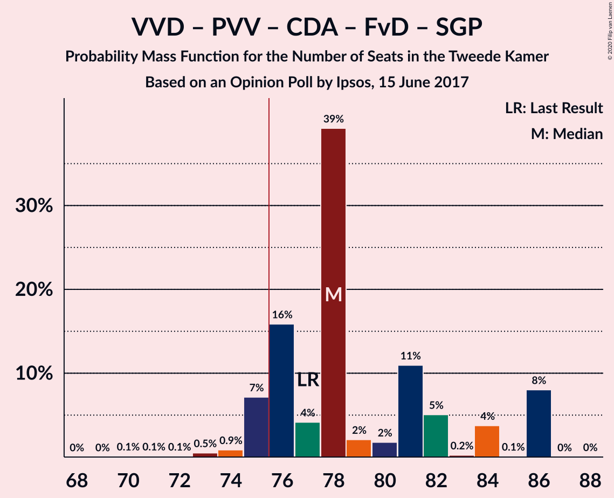

| Number of Seats | Probability | Accumulated | Special Marks |
|:---------------:|:-----------:|:-----------:|:-------------:|
| 70 | 0.2% | 100% |  |
| 71 | 0.2% | 99.8% |  |
| 72 | 0.1% | 99.5% |  |
| 73 | 0.1% | 99.5% |  |
| 74 | 0% | 99.4% |  |
| 75 | 0.5% | 99.4% |  |
| 76 | 28% | 98.8% | Majority |
| 77 | 4% | 71% | Last Result |
| 78 | 18% | 67% |  |
| 79 | 0.1% | 49% |  |
| 80 | 1.3% | 48% | Median |
| 81 | 26% | 47% |  |
| 82 | 0.3% | 21% |  |
| 83 | 0% | 20% |  |
| 84 | 0.3% | 20% |  |
| 85 | 0% | 20% |  |
| 86 | 20% | 20% |  |
| 87 | 0% | 0.1% |  |
| 88 | 0.1% | 0.1% |  |
| 89 | 0% | 0% |  |

### Volkspartij voor Vrijheid en Democratie – Democraten 66 – Christen-Democratisch Appèl – ChristenUnie

| Number of Seats | Probability | Accumulated | Special Marks |
|:---------------:|:-----------:|:-----------:|:-------------:|
| 74 | 0.1% | 100% |  |
| 75 | 0.3% | 99.9% |  |
| 76 | 0% | 99.7% | Last Result, Majority |
| 77 | 5% | 99.6% |  |
| 78 | 0.6% | 94% |  |
| 79 | 1.1% | 94% |  |
| 80 | 5% | 93% |  |
| 81 | 48% | 88% | Median |
| 82 | 13% | 40% |  |
| 83 | 27% | 27% |  |
| 84 | 0.3% | 0.3% |  |
| 85 | 0% | 0% |  |

### Volkspartij voor Vrijheid en Democratie – Partij voor de Vrijheid – Christen-Democratisch Appèl – Forum voor Democratie

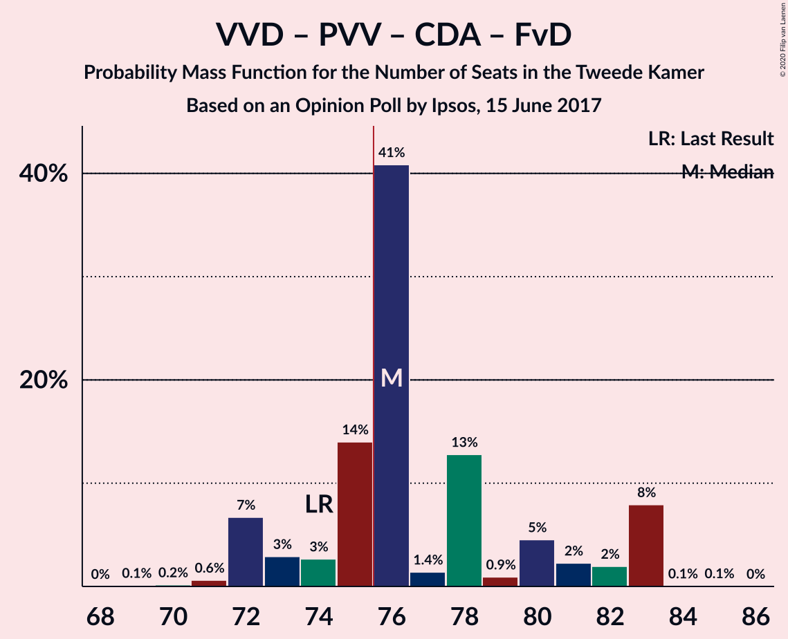

| Number of Seats | Probability | Accumulated | Special Marks |
|:---------------:|:-----------:|:-----------:|:-------------:|
| 69 | 0.2% | 100% |  |
| 70 | 0.3% | 99.8% |  |
| 71 | 0.1% | 99.5% |  |
| 72 | 0.3% | 99.3% |  |
| 73 | 0.5% | 99.1% |  |
| 74 | 0.1% | 98.5% | Last Result |
| 75 | 28% | 98% |  |
| 76 | 22% | 70% | Majority |
| 77 | 0.1% | 49% |  |
| 78 | 28% | 48% | Median |
| 79 | 0.3% | 21% |  |
| 80 | 0.1% | 21% |  |
| 81 | 0.3% | 20% |  |
| 82 | 0% | 20% |  |
| 83 | 20% | 20% |  |
| 84 | 0% | 0.1% |  |
| 85 | 0% | 0.1% |  |
| 86 | 0.1% | 0.1% |  |
| 87 | 0% | 0% |  |

### Democraten 66 – Christen-Democratisch Appèl – GroenLinks – Socialistische Partij – Partij van de Arbeid – ChristenUnie

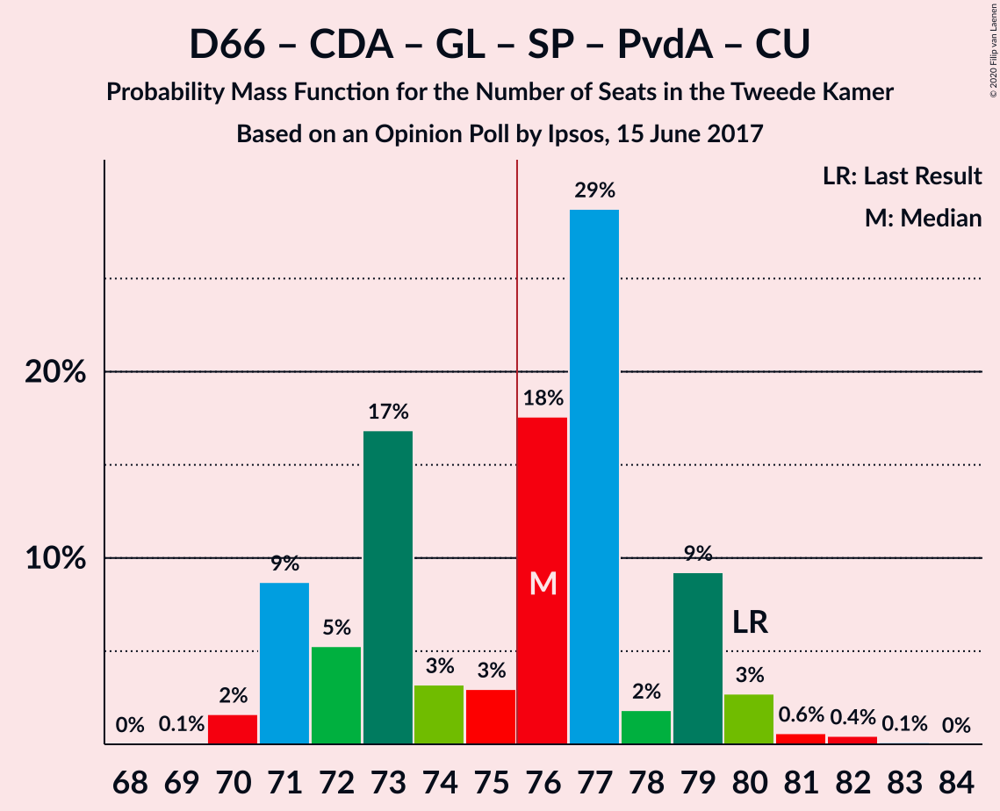

| Number of Seats | Probability | Accumulated | Special Marks |
|:---------------:|:-----------:|:-----------:|:-------------:|
| 68 | 0% | 100% |  |
| 69 | 0% | 99.9% |  |
| 70 | 0.3% | 99.9% |  |
| 71 | 20% | 99.7% |  |
| 72 | 0.4% | 80% |  |
| 73 | 26% | 79% | Median |
| 74 | 5% | 53% |  |
| 75 | 1.1% | 48% |  |
| 76 | 42% | 47% | Majority |
| 77 | 0.5% | 5% |  |
| 78 | 0.4% | 5% |  |
| 79 | 0.2% | 4% |  |
| 80 | 4% | 4% | Last Result |
| 81 | 0.1% | 0.6% |  |
| 82 | 0.2% | 0.5% |  |
| 83 | 0.2% | 0.2% |  |
| 84 | 0% | 0% |  |

### Volkspartij voor Vrijheid en Democratie – Partij voor de Vrijheid – Christen-Democratisch Appèl

| Number of Seats | Probability | Accumulated | Special Marks |
|:---------------:|:-----------:|:-----------:|:-------------:|
| 65 | 0.2% | 100% |  |
| 66 | 0.1% | 99.8% |  |
| 67 | 0.3% | 99.7% |  |
| 68 | 0.1% | 99.4% |  |
| 69 | 0.4% | 99.3% |  |
| 70 | 0.7% | 98.9% |  |
| 71 | 28% | 98% |  |
| 72 | 22% | 70% | Last Result |
| 73 | 0.1% | 48% |  |
| 74 | 28% | 48% | Median |
| 75 | 0.1% | 20% |  |
| 76 | 0.2% | 20% | Majority |
| 77 | 0% | 20% |  |
| 78 | 20% | 20% |  |
| 79 | 0% | 0.1% |  |
| 80 | 0% | 0.1% |  |
| 81 | 0.1% | 0.1% |  |
| 82 | 0% | 0% |  |

### Volkspartij voor Vrijheid en Democratie – Democraten 66 – Christen-Democratisch Appèl

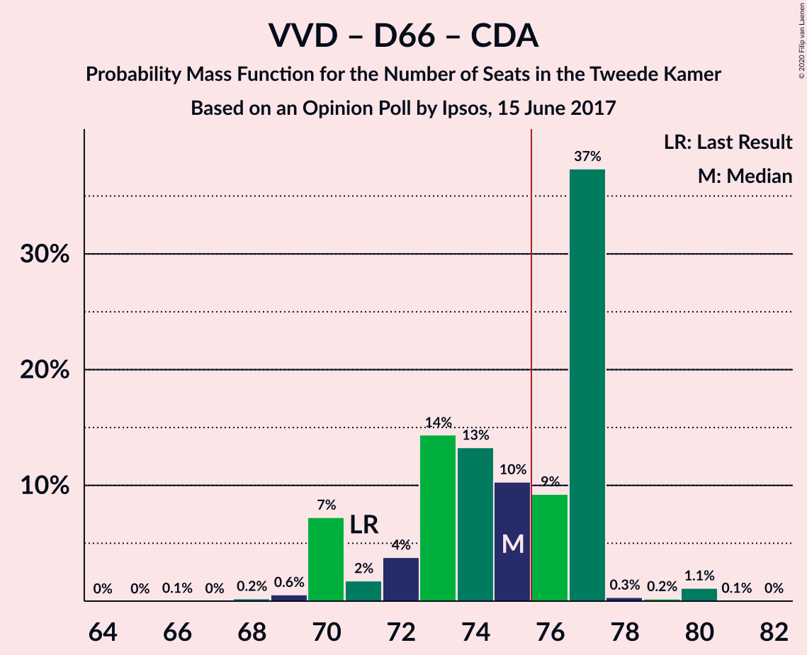

| Number of Seats | Probability | Accumulated | Special Marks |
|:---------------:|:-----------:|:-----------:|:-------------:|
| 66 | 0.1% | 100% |  |
| 67 | 0% | 99.9% |  |
| 68 | 0% | 99.9% |  |
| 69 | 0.2% | 99.9% |  |
| 70 | 0.1% | 99.7% |  |
| 71 | 0.1% | 99.6% | Last Result |
| 72 | 5% | 99.6% |  |
| 73 | 15% | 95% |  |
| 74 | 28% | 80% |  |
| 75 | 5% | 51% | Median |
| 76 | 20% | 47% | Majority |
| 77 | 26% | 26% |  |
| 78 | 0% | 0% |  |

### Democraten 66 – Christen-Democratisch Appèl – GroenLinks – Partij van de Arbeid – ChristenUnie

| Number of Seats | Probability | Accumulated | Special Marks |
|:---------------:|:-----------:|:-----------:|:-------------:|
| 60 | 0.1% | 100% |  |
| 61 | 0% | 99.9% |  |
| 62 | 0% | 99.9% |  |
| 63 | 20% | 99.9% |  |
| 64 | 0.4% | 80% |  |
| 65 | 32% | 79% | Median |
| 66 | 14% | 47% | Last Result |
| 67 | 0.8% | 33% |  |
| 68 | 28% | 32% |  |
| 69 | 0.4% | 5% |  |
| 70 | 0.1% | 4% |  |
| 71 | 4% | 4% |  |
| 72 | 0.1% | 0.6% |  |
| 73 | 0.2% | 0.5% |  |
| 74 | 0% | 0.2% |  |
| 75 | 0.2% | 0.2% |  |
| 76 | 0% | 0% | Majority |

### Volkspartij voor Vrijheid en Democratie – Christen-Democratisch Appèl – Forum voor Democratie – 50Plus – Staatkundig Gereformeerde Partij

| Number of Seats | Probability | Accumulated | Special Marks |
|:---------------:|:-----------:|:-----------:|:-------------:|
| 56 | 0.2% | 100% |  |
| 57 | 0.3% | 99.8% |  |
| 58 | 0.2% | 99.4% |  |
| 59 | 0.1% | 99.2% |  |
| 60 | 0.4% | 99.1% |  |
| 61 | 0.1% | 98.7% | Last Result |
| 62 | 0.3% | 98.7% |  |
| 63 | 51% | 98% |  |
| 64 | 0.4% | 47% | Median |
| 65 | 26% | 47% |  |
| 66 | 0.5% | 21% |  |
| 67 | 0.1% | 20% |  |
| 68 | 0.2% | 20% |  |
| 69 | 0.1% | 20% |  |
| 70 | 20% | 20% |  |
| 71 | 0% | 0% |  |

### Volkspartij voor Vrijheid en Democratie – Democraten 66 – Partij van de Arbeid

| Number of Seats | Probability | Accumulated | Special Marks |
|:---------------:|:-----------:|:-----------:|:-------------:|
| 58 | 0.1% | 100% |  |
| 59 | 0% | 99.9% |  |
| 60 | 0% | 99.9% |  |
| 61 | 0% | 99.8% | Last Result |
| 62 | 0.2% | 99.8% |  |
| 63 | 0.5% | 99.6% |  |
| 64 | 0% | 99.0% |  |
| 65 | 5% | 99.0% |  |
| 66 | 20% | 94% |  |
| 67 | 42% | 74% |  |
| 68 | 6% | 32% | Median |
| 69 | 26% | 27% |  |
| 70 | 0.2% | 0.3% |  |
| 71 | 0% | 0% |  |

### Volkspartij voor Vrijheid en Democratie – Christen-Democratisch Appèl – Partij van de Arbeid

| Number of Seats | Probability | Accumulated | Special Marks |
|:---------------:|:-----------:|:-----------:|:-------------:|
| 56 | 0.1% | 100% |  |
| 57 | 0.3% | 99.9% |  |
| 58 | 0.4% | 99.7% |  |
| 59 | 0.3% | 99.3% |  |
| 60 | 0.4% | 99.0% |  |
| 61 | 0.4% | 98.7% | Last Result |
| 62 | 0.5% | 98% |  |
| 63 | 72% | 98% |  |
| 64 | 0.1% | 25% | Median |
| 65 | 1.4% | 25% |  |
| 66 | 4% | 24% |  |
| 67 | 0.1% | 20% |  |
| 68 | 20% | 20% |  |
| 69 | 0% | 0.1% |  |
| 70 | 0% | 0% |  |

### Volkspartij voor Vrijheid en Democratie – Christen-Democratisch Appèl – Forum voor Democratie – 50Plus

| Number of Seats | Probability | Accumulated | Special Marks |
|:---------------:|:-----------:|:-----------:|:-------------:|
| 55 | 0.3% | 100% |  |
| 56 | 0.7% | 99.7% |  |
| 57 | 0.1% | 98.9% |  |
| 58 | 0.1% | 98.8% | Last Result |
| 59 | 0.1% | 98.7% |  |
| 60 | 0% | 98.6% |  |
| 61 | 20% | 98.6% |  |
| 62 | 58% | 79% | Median |
| 63 | 0.4% | 21% |  |
| 64 | 0.3% | 20% |  |
| 65 | 0.1% | 20% |  |
| 66 | 0% | 20% |  |
| 67 | 20% | 20% |  |
| 68 | 0% | 0% |  |

### Volkspartij voor Vrijheid en Democratie – Christen-Democratisch Appèl – Forum voor Democratie – Staatkundig Gereformeerde Partij

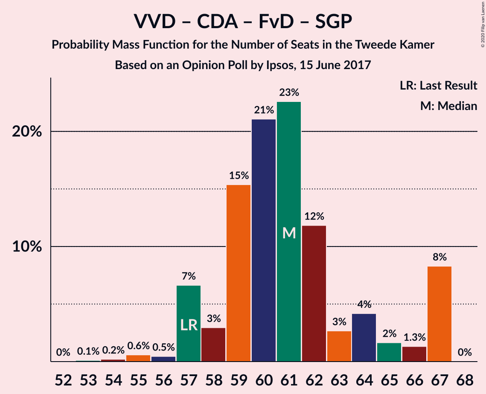

| Number of Seats | Probability | Accumulated | Special Marks |
|:---------------:|:-----------:|:-----------:|:-------------:|
| 53 | 0.2% | 100% |  |
| 54 | 0.3% | 99.8% |  |
| 55 | 0.3% | 99.4% |  |
| 56 | 0% | 99.1% |  |
| 57 | 0.4% | 99.1% | Last Result |
| 58 | 0.1% | 98.7% |  |
| 59 | 33% | 98.7% |  |
| 60 | 18% | 66% |  |
| 61 | 0.3% | 48% | Median |
| 62 | 27% | 48% |  |
| 63 | 0.6% | 21% |  |
| 64 | 0% | 20% |  |
| 65 | 0% | 20% |  |
| 66 | 0.1% | 20% |  |
| 67 | 20% | 20% |  |
| 68 | 0% | 0% |  |

### Volkspartij voor Vrijheid en Democratie – Christen-Democratisch Appèl – Forum voor Democratie

| Number of Seats | Probability | Accumulated | Special Marks |
|:---------------:|:-----------:|:-----------:|:-------------:|
| 52 | 0.3% | 100% |  |
| 53 | 0.8% | 99.7% |  |
| 54 | 0.1% | 98.9% | Last Result |
| 55 | 0.1% | 98.8% |  |
| 56 | 0% | 98.7% |  |
| 57 | 5% | 98.7% |  |
| 58 | 42% | 94% |  |
| 59 | 31% | 52% | Median |
| 60 | 1.2% | 21% |  |
| 61 | 0% | 20% |  |
| 62 | 0.1% | 20% |  |
| 63 | 0% | 20% |  |
| 64 | 20% | 20% |  |
| 65 | 0% | 0% |  |

### Volkspartij voor Vrijheid en Democratie – Christen-Democratisch Appèl

| Number of Seats | Probability | Accumulated | Special Marks |
|:---------------:|:-----------:|:-----------:|:-------------:|
| 48 | 0.3% | 100% |  |
| 49 | 0.7% | 99.7% |  |
| 50 | 0.3% | 99.0% |  |
| 51 | 0% | 98.7% |  |
| 52 | 0.3% | 98.7% | Last Result |
| 53 | 5% | 98% |  |
| 54 | 41% | 93% |  |
| 55 | 31% | 52% | Median |
| 56 | 0.9% | 21% |  |
| 57 | 0.1% | 20% |  |
| 58 | 0.1% | 20% |  |
| 59 | 20% | 20% |  |
| 60 | 0% | 0% |  |

### Democraten 66 – Christen-Democratisch Appèl – Partij van de Arbeid

| Number of Seats | Probability | Accumulated | Special Marks |
|:---------------:|:-----------:|:-----------:|:-------------:|
| 40 | 0.1% | 100% |  |
| 41 | 0.1% | 99.9% |  |
| 42 | 0.1% | 99.8% |  |
| 43 | 20% | 99.8% |  |
| 44 | 0.1% | 80% |  |
| 45 | 48% | 80% | Median |
| 46 | 26% | 32% |  |
| 47 | 0.3% | 6% | Last Result |
| 48 | 0.4% | 5% |  |
| 49 | 0.3% | 5% |  |
| 50 | 0.1% | 5% |  |
| 51 | 0.4% | 4% |  |
| 52 | 4% | 4% |  |
| 53 | 0.5% | 0.5% |  |
| 54 | 0% | 0% |  |

### Volkspartij voor Vrijheid en Democratie – Partij van de Arbeid

| Number of Seats | Probability | Accumulated | Special Marks |
|:---------------:|:-----------:|:-----------:|:-------------:|
| 40 | 0.4% | 100% |  |
| 41 | 0.3% | 99.6% |  |
| 42 | 0.6% | 99.3% | Last Result |
| 43 | 0.1% | 98.7% |  |
| 44 | 0.5% | 98.7% |  |
| 45 | 4% | 98% |  |
| 46 | 0.7% | 94% |  |
| 47 | 54% | 94% |  |
| 48 | 14% | 40% | Median |
| 49 | 25% | 25% |  |
| 50 | 0.6% | 0.6% |  |
| 51 | 0% | 0% |  |

### Democraten 66 – Christen-Democratisch Appèl

| Number of Seats | Probability | Accumulated | Special Marks |
|:---------------:|:-----------:|:-----------:|:-------------:|
| 33 | 5% | 100% |  |
| 34 | 14% | 94% |  |
| 35 | 0% | 80% |  |
| 36 | 48% | 80% | Median |
| 37 | 0.3% | 32% |  |
| 38 | 27% | 32% | Last Result |
| 39 | 0.3% | 5% |  |
| 40 | 0.5% | 5% |  |
| 41 | 4% | 4% |  |
| 42 | 0.2% | 0.8% |  |
| 43 | 0.5% | 0.5% |  |
| 44 | 0% | 0% |  |

### Christen-Democratisch Appèl – Partij van de Arbeid – ChristenUnie

| Number of Seats | Probability | Accumulated | Special Marks |
|:---------------:|:-----------:|:-----------:|:-------------:|
| 27 | 0.1% | 100% |  |
| 28 | 0.4% | 99.9% |  |
| 29 | 5% | 99.5% |  |
| 30 | 26% | 95% |  |
| 31 | 0.9% | 68% | Median |
| 32 | 30% | 68% |  |
| 33 | 34% | 38% | Last Result |
| 34 | 0.2% | 4% |  |
| 35 | 0.3% | 4% |  |
| 36 | 0% | 4% |  |
| 37 | 3% | 4% |  |
| 38 | 0.1% | 0.1% |  |
| 39 | 0% | 0% |  |

### Christen-Democratisch Appèl – Partij van de Arbeid

| Number of Seats | Probability | Accumulated | Special Marks |
|:---------------:|:-----------:|:-----------:|:-------------:|
| 22 | 0.1% | 100% |  |
| 23 | 0.3% | 99.9% |  |
| 24 | 45% | 99.6% |  |
| 25 | 29% | 55% | Median |
| 26 | 1.2% | 26% |  |
| 27 | 1.0% | 25% |  |
| 28 | 20% | 24% | Last Result |
| 29 | 0% | 4% |  |
| 30 | 0% | 4% |  |
| 31 | 0.2% | 4% |  |
| 32 | 3% | 3% |  |
| 33 | 0% | 0% |  |

## Technical Information

### Opinion Poll

+ **Polling firm:** Ipsos
+ **Commissioner(s):** —
+ **Fieldwork period:** 15 June 2017

### Calculations

+ **Sample size:** 1000
+ **Simulations done:** 131,072
+ **Error estimate:** 2.23%

