# Opinion Poll by I&O Research, 18 June 2017

<a href="#voting-intentions">Voting Intentions</a> | <a href="#seats">Seats</a> | <a href="#coalitions">Coalitions</a> | <a href="#technical-information">Technical Information</a>

## Voting Intentions

### Confidence Intervals

| Party | Last Result | Poll Result | 80% Confidence Interval | 90% Confidence Interval | 95% Confidence Interval | 99% Confidence Interval |
|:-----:|:-----------:|:-----------:|:-----------------------:|:-----------------------:|:-----------------------:|:-----------------------:|
| Volkspartij voor Vrijheid en Democratie | 21.3% | 20.4% | 19.0–21.9% |18.6–22.3% |18.3–22.6% |17.7–23.4% |
| Partij voor de Vrijheid | 13.1% | 15.2% | 14.0–16.5% |13.6–16.9% |13.3–17.2% |12.8–17.8% |
| Democraten 66 | 12.2% | 12.5% | 11.4–13.8% |11.1–14.1% |10.9–14.4% |10.4–15.0% |
| Christen-Democratisch Appèl | 12.4% | 10.5% | 9.4–11.6% |9.2–11.9% |8.9–12.2% |8.5–12.8% |
| GroenLinks | 9.1% | 9.7% | 8.7–10.8% |8.5–11.1% |8.2–11.4% |7.8–12.0% |
| Socialistische Partij | 9.1% | 8.0% | 7.1–9.0% |6.9–9.3% |6.6–9.6% |6.2–10.1% |
| Partij van de Arbeid | 5.7% | 6.5% | 5.7–7.5% |5.5–7.7% |5.3–8.0% |4.9–8.4% |
| ChristenUnie | 3.4% | 3.9% | 3.3–4.6% |3.1–4.9% |3.0–5.1% |2.7–5.5% |
| Partij voor de Dieren | 3.2% | 3.3% | 2.7–4.0% |2.6–4.2% |2.5–4.4% |2.2–4.8% |
| Forum voor Democratie | 1.8% | 3.1% | 2.5–3.8% |2.4–4.0% |2.3–4.1% |2.0–4.5% |
| 50Plus | 3.1% | 2.6% | 2.1–3.3% |2.0–3.5% |1.9–3.6% |1.7–4.0% |
| Staatkundig Gereformeerde Partij | 2.1% | 2.2% | 1.7–2.8% |1.6–2.9% |1.5–3.1% |1.3–3.4% |
| DENK | 2.1% | 1.7% | 1.3–2.3% |1.2–2.4% |1.1–2.6% |1.0–2.9% |

*Note:* The poll result column reflects the actual value used in the calculations. Published results may vary slightly, and in addition be rounded to fewer digits.

## Seats

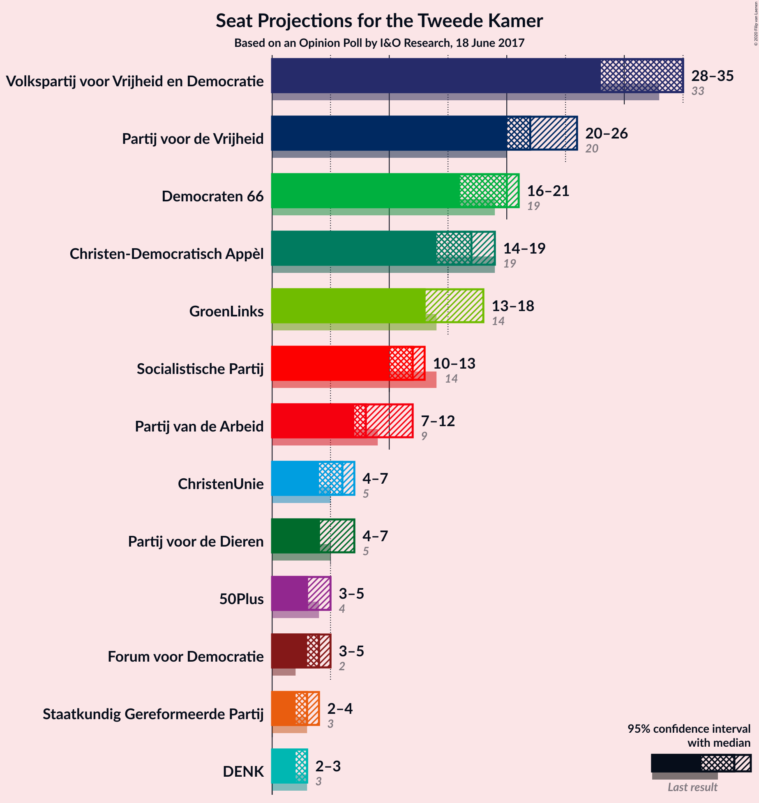

### Confidence Intervals

| Party | Last Result | Median | 80% Confidence Interval | 90% Confidence Interval | 95% Confidence Interval | 99% Confidence Interval |
|:-----:|:-----------:|:------:|:-----------------------:|:-----------------------:|:-----------------------:|:-----------------------:|
| <a href="#volkspartij-voor-vrijheid-en-democratie">Volkspartij voor Vrijheid en Democratie</a> | 33 | 29 | 29–31 |29–31 |29–31 |29–32 |
| <a href="#partij-voor-de-vrijheid">Partij voor de Vrijheid</a> | 20 | 23 | 21–25 |21–27 |21–27 |20–27 |
| <a href="#democraten-66">Democraten 66</a> | 19 | 20 | 19–21 |19–21 |18–23 |17–24 |
| <a href="#christen-democratisch-appèl">Christen-Democratisch Appèl</a> | 19 | 17 | 15–18 |15–19 |15–19 |13–19 |
| <a href="#groenlinks">GroenLinks</a> | 14 | 15 | 13–18 |13–18 |13–18 |13–18 |
| <a href="#socialistische-partij">Socialistische Partij</a> | 14 | 11 | 11–13 |11–13 |11–13 |11–14 |
| <a href="#partij-van-de-arbeid">Partij van de Arbeid</a> | 9 | 8 | 7–10 |7–10 |7–10 |7–12 |
| <a href="#christenunie">ChristenUnie</a> | 5 | 5 | 5–7 |4–7 |4–7 |4–8 |
| <a href="#partij-voor-de-dieren">Partij voor de Dieren</a> | 5 | 6 | 5–7 |5–7 |4–7 |4–7 |
| <a href="#forum-voor-democratie">Forum voor Democratie</a> | 2 | 4 | 3–5 |3–5 |3–5 |3–5 |
| <a href="#50plus">50Plus</a> | 4 | 4 | 3–5 |3–5 |3–5 |3–5 |
| <a href="#staatkundig-gereformeerde-partij">Staatkundig Gereformeerde Partij</a> | 3 | 3 | 2–4 |2–4 |2–4 |2–4 |
| <a href="#denk">DENK</a> | 3 | 2 | 2–3 |2–3 |2–3 |1–3 |

### Volkspartij voor Vrijheid en Democratie

*For a full overview of the results for this party, see the [Volkspartij voor Vrijheid en Democratie](party-volkspartijvoorvrijheidendemocratie.html) page.*

| Number of Seats | Probability | Accumulated | Special Marks |
|:---------------:|:-----------:|:-----------:|:-------------:|
| 28 | 0.2% | 100% |  |
| 29 | 63% | 99.8% | Median |
| 30 | 26% | 37% |  |
| 31 | 10% | 11% |  |
| 32 | 0.5% | 0.9% |  |
| 33 | 0.1% | 0.4% | Last Result |
| 34 | 0% | 0.3% |  |
| 35 | 0.1% | 0.3% |  |
| 36 | 0.2% | 0.2% |  |
| 37 | 0% | 0% |  |

### Partij voor de Vrijheid

*For a full overview of the results for this party, see the [Partij voor de Vrijheid](party-partijvoordevrijheid.html) page.*

| Number of Seats | Probability | Accumulated | Special Marks |
|:---------------:|:-----------:|:-----------:|:-------------:|
| 18 | 0.1% | 100% |  |
| 19 | 0% | 99.9% |  |
| 20 | 2% | 99.9% | Last Result |
| 21 | 10% | 98% |  |
| 22 | 4% | 88% |  |
| 23 | 60% | 84% | Median |
| 24 | 1.3% | 24% |  |
| 25 | 15% | 23% |  |
| 26 | 0% | 8% |  |
| 27 | 8% | 8% |  |
| 28 | 0.1% | 0.1% |  |
| 29 | 0% | 0% |  |

### Democraten 66

*For a full overview of the results for this party, see the [Democraten 66](party-democraten66.html) page.*

| Number of Seats | Probability | Accumulated | Special Marks |
|:---------------:|:-----------:|:-----------:|:-------------:|
| 16 | 0.3% | 100% |  |
| 17 | 0.7% | 99.7% |  |
| 18 | 3% | 99.0% |  |
| 19 | 14% | 96% | Last Result |
| 20 | 61% | 82% | Median |
| 21 | 19% | 21% |  |
| 22 | 0% | 3% |  |
| 23 | 0.8% | 3% |  |
| 24 | 2% | 2% |  |
| 25 | 0% | 0% |  |

### Christen-Democratisch Appèl

*For a full overview of the results for this party, see the [Christen-Democratisch Appèl](party-christen-democratischappèl.html) page.*

| Number of Seats | Probability | Accumulated | Special Marks |
|:---------------:|:-----------:|:-----------:|:-------------:|
| 13 | 0.8% | 100% |  |
| 14 | 0.4% | 99.2% |  |
| 15 | 27% | 98.8% |  |
| 16 | 4% | 72% |  |
| 17 | 57% | 68% | Median |
| 18 | 0.4% | 10% |  |
| 19 | 10% | 10% | Last Result |
| 20 | 0.1% | 0.1% |  |
| 21 | 0% | 0% |  |

### GroenLinks

*For a full overview of the results for this party, see the [GroenLinks](party-groenlinks.html) page.*

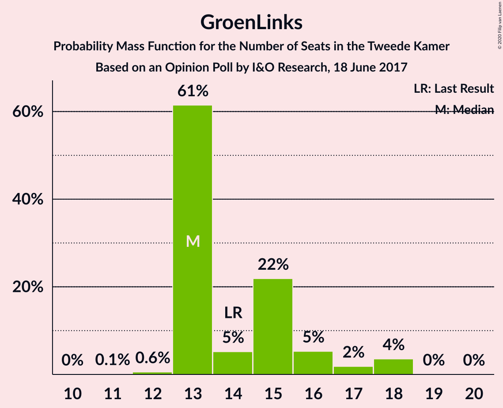

| Number of Seats | Probability | Accumulated | Special Marks |
|:---------------:|:-----------:|:-----------:|:-------------:|
| 12 | 0.1% | 100% |  |
| 13 | 18% | 99.9% |  |
| 14 | 10% | 82% | Last Result |
| 15 | 52% | 71% | Median |
| 16 | 3% | 19% |  |
| 17 | 2% | 16% |  |
| 18 | 14% | 14% |  |
| 19 | 0% | 0% |  |

### Socialistische Partij

*For a full overview of the results for this party, see the [Socialistische Partij](party-socialistischepartij.html) page.*

| Number of Seats | Probability | Accumulated | Special Marks |
|:---------------:|:-----------:|:-----------:|:-------------:|
| 9 | 0.1% | 100% |  |
| 10 | 0.3% | 99.9% |  |
| 11 | 77% | 99.6% | Median |
| 12 | 4% | 22% |  |
| 13 | 17% | 18% |  |
| 14 | 1.4% | 1.4% | Last Result |
| 15 | 0% | 0% |  |

### Partij van de Arbeid

*For a full overview of the results for this party, see the [Partij van de Arbeid](party-partijvandearbeid.html) page.*

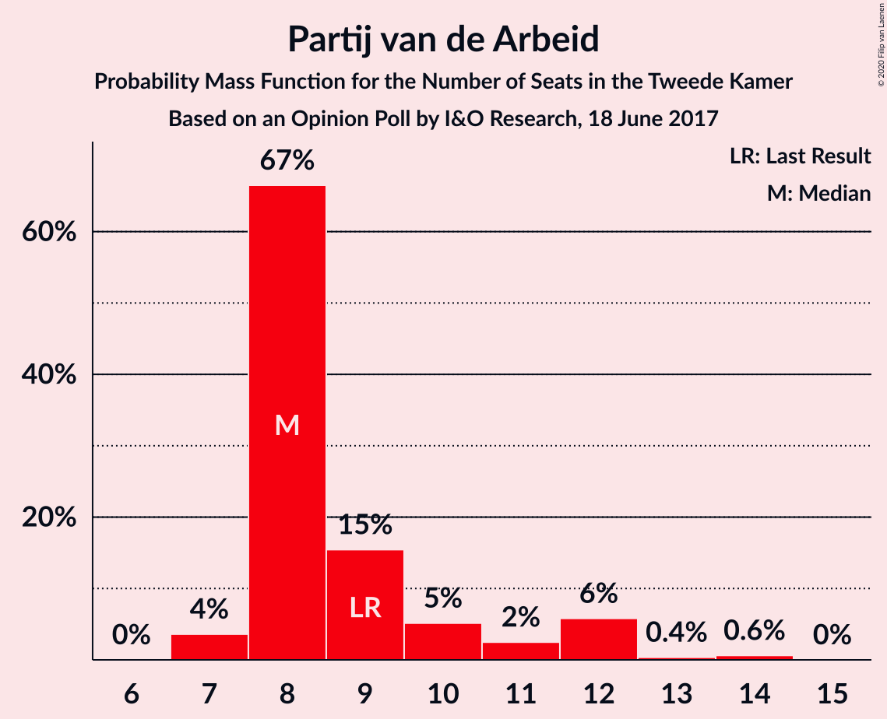

| Number of Seats | Probability | Accumulated | Special Marks |
|:---------------:|:-----------:|:-----------:|:-------------:|
| 7 | 14% | 100% |  |
| 8 | 42% | 86% | Median |
| 9 | 32% | 44% | Last Result |
| 10 | 11% | 12% |  |
| 11 | 0.2% | 0.9% |  |
| 12 | 0.7% | 0.7% |  |
| 13 | 0% | 0% |  |

### ChristenUnie

*For a full overview of the results for this party, see the [ChristenUnie](party-christenunie.html) page.*

| Number of Seats | Probability | Accumulated | Special Marks |
|:---------------:|:-----------:|:-----------:|:-------------:|
| 4 | 8% | 100% |  |
| 5 | 75% | 92% | Last Result, Median |
| 6 | 3% | 17% |  |
| 7 | 13% | 14% |  |
| 8 | 0.8% | 0.8% |  |
| 9 | 0% | 0% |  |

### Partij voor de Dieren

*For a full overview of the results for this party, see the [Partij voor de Dieren](party-partijvoordedieren.html) page.*

| Number of Seats | Probability | Accumulated | Special Marks |
|:---------------:|:-----------:|:-----------:|:-------------:|
| 3 | 0.1% | 100% |  |
| 4 | 3% | 99.8% |  |
| 5 | 12% | 97% | Last Result |
| 6 | 68% | 85% | Median |
| 7 | 17% | 17% |  |
| 8 | 0% | 0% |  |

### Forum voor Democratie

*For a full overview of the results for this party, see the [Forum voor Democratie](party-forumvoordemocratie.html) page.*

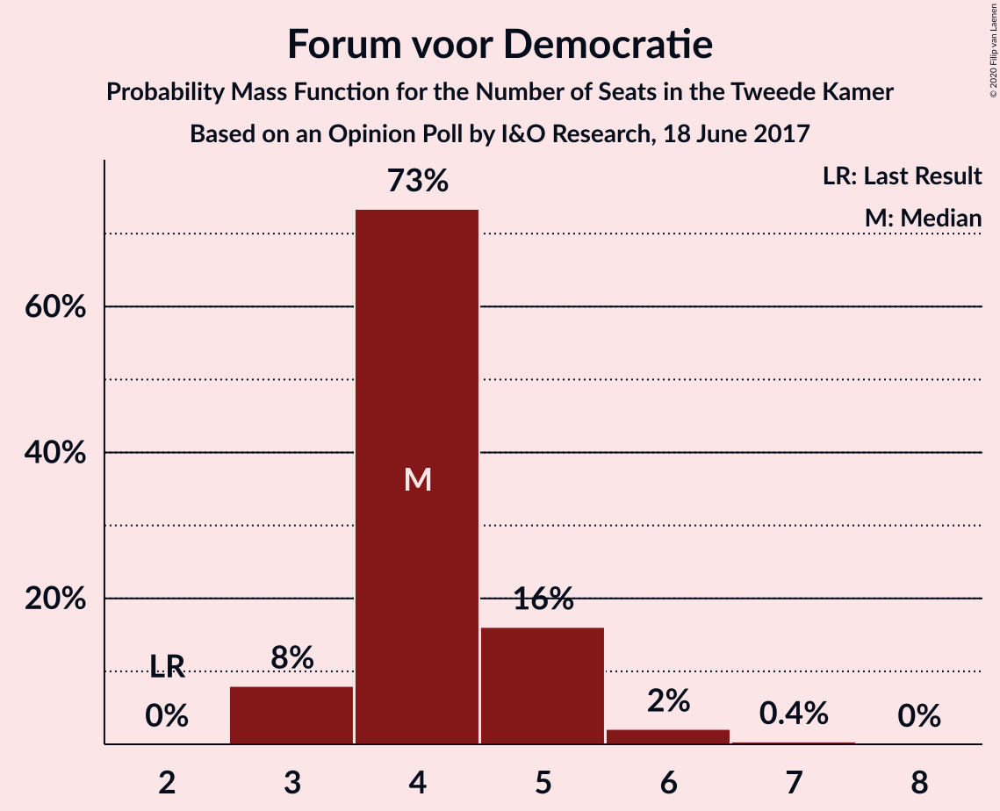

| Number of Seats | Probability | Accumulated | Special Marks |
|:---------------:|:-----------:|:-----------:|:-------------:|
| 2 | 0% | 100% | Last Result |
| 3 | 10% | 100% |  |
| 4 | 58% | 90% | Median |
| 5 | 31% | 31% |  |
| 6 | 0.3% | 0.4% |  |
| 7 | 0.1% | 0.1% |  |
| 8 | 0% | 0% |  |

### 50Plus

*For a full overview of the results for this party, see the [50Plus](party-50plus.html) page.*

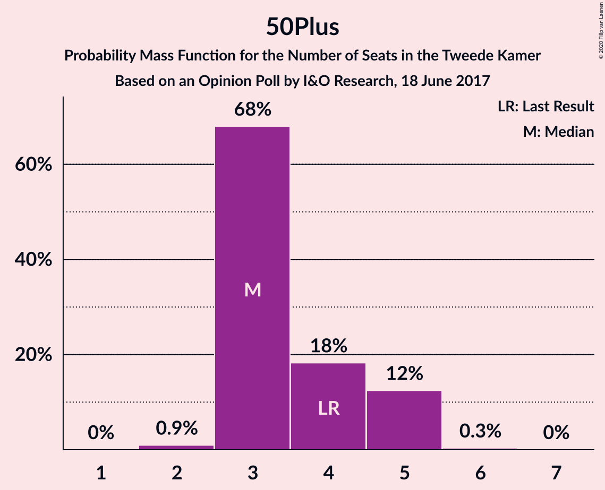

| Number of Seats | Probability | Accumulated | Special Marks |
|:---------------:|:-----------:|:-----------:|:-------------:|
| 3 | 17% | 100% |  |
| 4 | 40% | 83% | Last Result, Median |
| 5 | 43% | 43% |  |
| 6 | 0.2% | 0.2% |  |
| 7 | 0% | 0% |  |

### Staatkundig Gereformeerde Partij

*For a full overview of the results for this party, see the [Staatkundig Gereformeerde Partij](party-staatkundiggereformeerdepartij.html) page.*

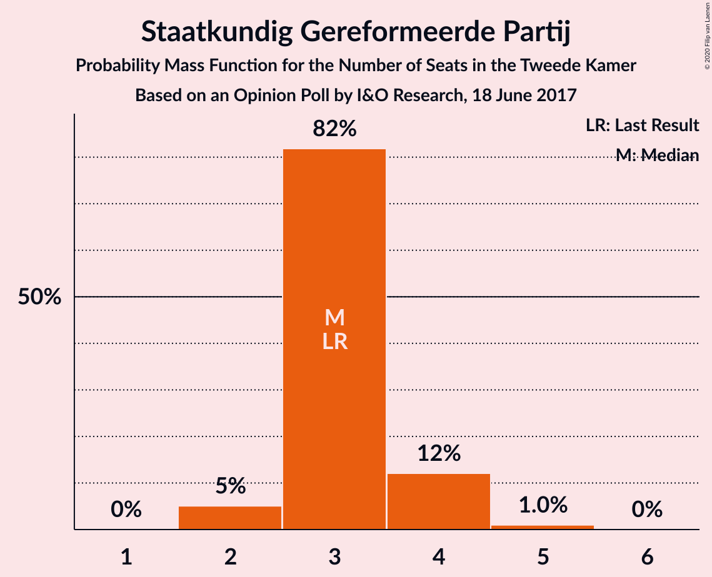

| Number of Seats | Probability | Accumulated | Special Marks |
|:---------------:|:-----------:|:-----------:|:-------------:|
| 2 | 13% | 100% |  |
| 3 | 66% | 87% | Last Result, Median |
| 4 | 21% | 21% |  |
| 5 | 0% | 0% |  |

### DENK

*For a full overview of the results for this party, see the [DENK](party-denk.html) page.*

| Number of Seats | Probability | Accumulated | Special Marks |
|:---------------:|:-----------:|:-----------:|:-------------:|
| 0 | 0.2% | 100% |  |
| 1 | 0.7% | 99.8% |  |
| 2 | 56% | 99.1% | Median |
| 3 | 43% | 43% | Last Result |
| 4 | 0% | 0% |  |

## Coalitions

### Confidence Intervals

| Coalition | Last Result | Median | Majority? | 80% Confidence Interval | 90% Confidence Interval | 95% Confidence Interval | 99% Confidence Interval |
|:---------:|:-----------:|:------:|:---------:|:-----------------------:|:-----------------------:|:-----------------------:|:-----------------------:|
| Volkspartij voor Vrijheid en Democratie – Democraten 66 – Christen-Democratisch Appèl – GroenLinks – ChristenUnie | 90 | 86 | 100% | 83–90 | 83–90 | 83–90 | 83–90 |
| Volkspartij voor Vrijheid en Democratie – Democraten 66 – Christen-Democratisch Appèl – Partij van de Arbeid – ChristenUnie | 85 | 79 | 100% | 78–86 | 78–86 | 78–86 | 78–86 |
| Democraten 66 – Christen-Democratisch Appèl – GroenLinks – Socialistische Partij – Partij van de Arbeid – ChristenUnie | 80 | 76 | 91% | 76–81 | 74–81 | 74–81 | 74–82 |
| Volkspartij voor Vrijheid en Democratie – Partij voor de Vrijheid – Christen-Democratisch Appèl – Forum voor Democratie – Staatkundig Gereformeerde Partij | 77 | 76 | 95% | 76–79 | 75–79 | 75–79 | 73–80 |
| Volkspartij voor Vrijheid en Democratie – Partij voor de Vrijheid – Christen-Democratisch Appèl – Forum voor Democratie | 74 | 73 | 23% | 72–76 | 72–76 | 71–76 | 69–78 |
| Volkspartij voor Vrijheid en Democratie – Democraten 66 – Christen-Democratisch Appèl – ChristenUnie | 76 | 71 | 10% | 70–76 | 70–76 | 70–76 | 69–76 |
| Volkspartij voor Vrijheid en Democratie – Partij voor de Vrijheid – Christen-Democratisch Appèl | 72 | 69 | 0.1% | 67–72 | 67–73 | 67–73 | 66–73 |
| Democraten 66 – Christen-Democratisch Appèl – GroenLinks – Partij van de Arbeid – ChristenUnie | 66 | 65 | 0% | 63–70 | 63–70 | 63–70 | 63–70 |
| Volkspartij voor Vrijheid en Democratie – Democraten 66 – Christen-Democratisch Appèl | 71 | 66 | 0% | 65–69 | 65–69 | 63–69 | 63–70 |
| Volkspartij voor Vrijheid en Democratie – Democraten 66 – Partij van de Arbeid | 61 | 57 | 0% | 56–60 | 56–60 | 56–62 | 56–64 |
| Volkspartij voor Vrijheid en Democratie – Christen-Democratisch Appèl – Forum voor Democratie – 50Plus – Staatkundig Gereformeerde Partij | 61 | 58 | 0% | 56–60 | 56–60 | 55–60 | 52–62 |
| Volkspartij voor Vrijheid en Democratie – Christen-Democratisch Appèl – Partij van de Arbeid | 61 | 54 | 0% | 53–59 | 53–59 | 53–59 | 53–59 |
| Volkspartij voor Vrijheid en Democratie – Christen-Democratisch Appèl – Forum voor Democratie – 50Plus | 58 | 55 | 0% | 53–58 | 53–58 | 53–58 | 49–60 |
| Volkspartij voor Vrijheid en Democratie – Christen-Democratisch Appèl – Forum voor Democratie – Staatkundig Gereformeerde Partij | 57 | 53 | 0% | 52–56 | 52–56 | 52–56 | 49–56 |
| Volkspartij voor Vrijheid en Democratie – Christen-Democratisch Appèl – Forum voor Democratie | 54 | 50 | 0% | 49–54 | 49–54 | 49–54 | 46–54 |
| Volkspartij voor Vrijheid en Democratie – Christen-Democratisch Appèl | 52 | 46 | 0% | 44–49 | 44–49 | 44–49 | 42–49 |
| Democraten 66 – Christen-Democratisch Appèl – Partij van de Arbeid | 47 | 45 | 0% | 43–49 | 43–49 | 43–49 | 41–50 |
| Volkspartij voor Vrijheid en Democratie – Partij van de Arbeid | 42 | 37 | 0% | 37–40 | 37–40 | 37–40 | 37–42 |
| Democraten 66 – Christen-Democratisch Appèl | 38 | 37 | 0% | 35–39 | 35–39 | 34–39 | 32–41 |
| Christen-Democratisch Appèl – Partij van de Arbeid – ChristenUnie | 33 | 30 | 0% | 29–33 | 28–36 | 28–36 | 28–36 |
| Christen-Democratisch Appèl – Partij van de Arbeid | 28 | 25 | 0% | 24–27 | 24–29 | 24–29 | 23–29 |

### Volkspartij voor Vrijheid en Democratie – Democraten 66 – Christen-Democratisch Appèl – GroenLinks – ChristenUnie

| Number of Seats | Probability | Accumulated | Special Marks |
|:---------------:|:-----------:|:-----------:|:-------------:|
| 81 | 0.1% | 100% |  |
| 82 | 0.1% | 99.9% |  |
| 83 | 17% | 99.8% |  |
| 84 | 0.3% | 83% |  |
| 85 | 9% | 83% |  |
| 86 | 45% | 74% | Median |
| 87 | 0.8% | 29% |  |
| 88 | 0.3% | 28% |  |
| 89 | 14% | 28% |  |
| 90 | 13% | 14% | Last Result |
| 91 | 0% | 0.3% |  |
| 92 | 0.1% | 0.3% |  |
| 93 | 0% | 0.2% |  |
| 94 | 0.2% | 0.2% |  |
| 95 | 0% | 0% |  |

### Volkspartij voor Vrijheid en Democratie – Democraten 66 – Christen-Democratisch Appèl – Partij van de Arbeid – ChristenUnie

| Number of Seats | Probability | Accumulated | Special Marks |
|:---------------:|:-----------:|:-----------:|:-------------:|
| 77 | 0.1% | 100% |  |
| 78 | 17% | 99.9% |  |
| 79 | 66% | 83% | Median |
| 80 | 0.1% | 17% |  |
| 81 | 0.8% | 17% |  |
| 82 | 2% | 16% |  |
| 83 | 2% | 14% |  |
| 84 | 2% | 12% |  |
| 85 | 0.3% | 10% | Last Result |
| 86 | 10% | 10% |  |
| 87 | 0% | 0% |  |

### Democraten 66 – Christen-Democratisch Appèl – GroenLinks – Socialistische Partij – Partij van de Arbeid – ChristenUnie

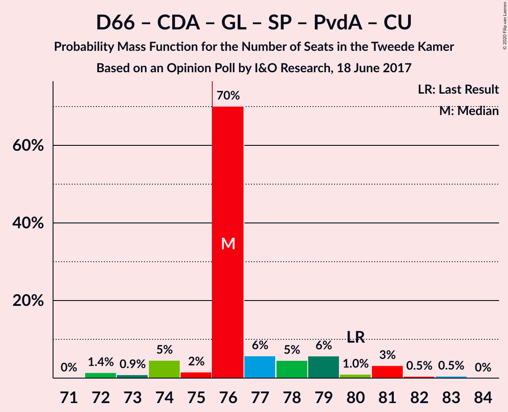

| Number of Seats | Probability | Accumulated | Special Marks |
|:---------------:|:-----------:|:-----------:|:-------------:|
| 70 | 0.1% | 100% |  |
| 71 | 0% | 99.9% |  |
| 72 | 0.2% | 99.9% |  |
| 73 | 0.1% | 99.8% |  |
| 74 | 8% | 99.6% |  |
| 75 | 0.1% | 91% |  |
| 76 | 58% | 91% | Median, Majority |
| 77 | 18% | 33% |  |
| 78 | 1.3% | 15% |  |
| 79 | 0.7% | 14% |  |
| 80 | 0% | 13% | Last Result |
| 81 | 12% | 13% |  |
| 82 | 2% | 2% |  |
| 83 | 0% | 0% |  |

### Volkspartij voor Vrijheid en Democratie – Partij voor de Vrijheid – Christen-Democratisch Appèl – Forum voor Democratie – Staatkundig Gereformeerde Partij

| Number of Seats | Probability | Accumulated | Special Marks |
|:---------------:|:-----------:|:-----------:|:-------------:|
| 71 | 0.1% | 100% |  |
| 72 | 0% | 99.9% |  |
| 73 | 2% | 99.9% |  |
| 74 | 0.1% | 98% |  |
| 75 | 3% | 98% |  |
| 76 | 61% | 95% | Median, Majority |
| 77 | 10% | 34% | Last Result |
| 78 | 0.1% | 24% |  |
| 79 | 23% | 23% |  |
| 80 | 0.2% | 0.7% |  |
| 81 | 0.2% | 0.5% |  |
| 82 | 0.1% | 0.3% |  |
| 83 | 0% | 0.1% |  |
| 84 | 0.1% | 0.1% |  |
| 85 | 0% | 0% |  |

### Volkspartij voor Vrijheid en Democratie – Partij voor de Vrijheid – Christen-Democratisch Appèl – Forum voor Democratie

| Number of Seats | Probability | Accumulated | Special Marks |
|:---------------:|:-----------:|:-----------:|:-------------:|
| 68 | 0.1% | 100% |  |
| 69 | 2% | 99.9% |  |
| 70 | 0.7% | 98% |  |
| 71 | 0.2% | 98% |  |
| 72 | 19% | 97% |  |
| 73 | 45% | 78% | Median |
| 74 | 0.4% | 34% | Last Result |
| 75 | 10% | 33% |  |
| 76 | 23% | 23% | Majority |
| 77 | 0.2% | 0.9% |  |
| 78 | 0.3% | 0.7% |  |
| 79 | 0.2% | 0.4% |  |
| 80 | 0% | 0.2% |  |
| 81 | 0% | 0.1% |  |
| 82 | 0.1% | 0.1% |  |
| 83 | 0% | 0% |  |

### Volkspartij voor Vrijheid en Democratie – Democraten 66 – Christen-Democratisch Appèl – ChristenUnie

| Number of Seats | Probability | Accumulated | Special Marks |
|:---------------:|:-----------:|:-----------:|:-------------:|
| 67 | 0.1% | 100% |  |
| 68 | 0.1% | 99.9% |  |
| 69 | 2% | 99.8% |  |
| 70 | 26% | 98% |  |
| 71 | 56% | 71% | Median |
| 72 | 0.3% | 15% |  |
| 73 | 1.0% | 15% |  |
| 74 | 2% | 14% |  |
| 75 | 2% | 12% |  |
| 76 | 10% | 10% | Last Result, Majority |
| 77 | 0% | 0.2% |  |
| 78 | 0.2% | 0.2% |  |
| 79 | 0% | 0% |  |

### Volkspartij voor Vrijheid en Democratie – Partij voor de Vrijheid – Christen-Democratisch Appèl

| Number of Seats | Probability | Accumulated | Special Marks |
|:---------------:|:-----------:|:-----------:|:-------------:|
| 63 | 0.1% | 100% |  |
| 64 | 0% | 99.9% |  |
| 65 | 0.1% | 99.9% |  |
| 66 | 2% | 99.8% |  |
| 67 | 19% | 98% |  |
| 68 | 2% | 78% |  |
| 69 | 43% | 77% | Median |
| 70 | 10% | 34% |  |
| 71 | 0.1% | 24% |  |
| 72 | 14% | 23% | Last Result |
| 73 | 9% | 9% |  |
| 74 | 0.3% | 0.5% |  |
| 75 | 0.1% | 0.2% |  |
| 76 | 0.1% | 0.1% | Majority |
| 77 | 0.1% | 0.1% |  |
| 78 | 0% | 0% |  |

### Democraten 66 – Christen-Democratisch Appèl – GroenLinks – Partij van de Arbeid – ChristenUnie

| Number of Seats | Probability | Accumulated | Special Marks |
|:---------------:|:-----------:|:-----------:|:-------------:|
| 60 | 0.1% | 100% |  |
| 61 | 0% | 99.9% |  |
| 62 | 0.2% | 99.9% |  |
| 63 | 26% | 99.6% |  |
| 64 | 0.9% | 74% |  |
| 65 | 41% | 73% | Median |
| 66 | 17% | 32% | Last Result |
| 67 | 0.2% | 14% |  |
| 68 | 0.7% | 14% |  |
| 69 | 2% | 13% |  |
| 70 | 12% | 12% |  |
| 71 | 0% | 0% |  |

### Volkspartij voor Vrijheid en Democratie – Democraten 66 – Christen-Democratisch Appèl

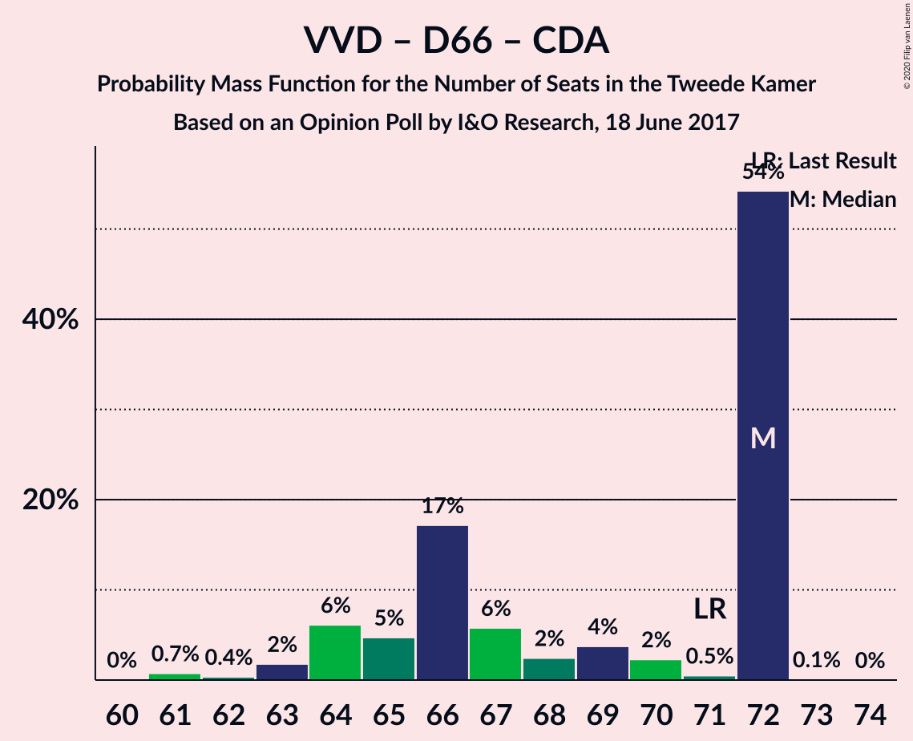

| Number of Seats | Probability | Accumulated | Special Marks |
|:---------------:|:-----------:|:-----------:|:-------------:|
| 62 | 0.2% | 100% |  |
| 63 | 3% | 99.8% |  |
| 64 | 0.2% | 97% |  |
| 65 | 18% | 96% |  |
| 66 | 64% | 79% | Median |
| 67 | 2% | 14% |  |
| 68 | 0.6% | 13% |  |
| 69 | 10% | 12% |  |
| 70 | 2% | 2% |  |
| 71 | 0% | 0.2% | Last Result |
| 72 | 0.2% | 0.2% |  |
| 73 | 0% | 0% |  |

### Volkspartij voor Vrijheid en Democratie – Democraten 66 – Partij van de Arbeid

| Number of Seats | Probability | Accumulated | Special Marks |
|:---------------:|:-----------:|:-----------:|:-------------:|
| 55 | 0% | 100% |  |
| 56 | 16% | 99.9% |  |
| 57 | 42% | 84% | Median |
| 58 | 0.9% | 42% |  |
| 59 | 17% | 41% |  |
| 60 | 21% | 24% |  |
| 61 | 0% | 3% | Last Result |
| 62 | 2% | 3% |  |
| 63 | 0.2% | 0.9% |  |
| 64 | 0.6% | 0.7% |  |
| 65 | 0% | 0% |  |

### Volkspartij voor Vrijheid en Democratie – Christen-Democratisch Appèl – Forum voor Democratie – 50Plus – Staatkundig Gereformeerde Partij

| Number of Seats | Probability | Accumulated | Special Marks |
|:---------------:|:-----------:|:-----------:|:-------------:|
| 52 | 0.7% | 100% |  |
| 53 | 0% | 99.3% |  |
| 54 | 0% | 99.3% |  |
| 55 | 2% | 99.3% |  |
| 56 | 8% | 97% |  |
| 57 | 33% | 89% | Median |
| 58 | 45% | 56% |  |
| 59 | 0.9% | 11% |  |
| 60 | 10% | 11% |  |
| 61 | 0% | 0.6% | Last Result |
| 62 | 0.3% | 0.6% |  |
| 63 | 0.1% | 0.3% |  |
| 64 | 0.2% | 0.2% |  |
| 65 | 0% | 0% |  |

### Volkspartij voor Vrijheid en Democratie – Christen-Democratisch Appèl – Partij van de Arbeid

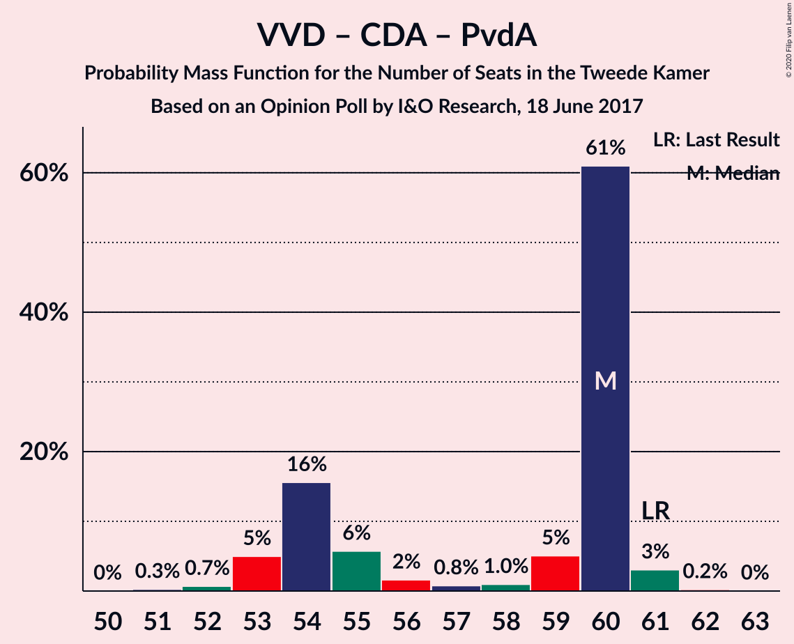

| Number of Seats | Probability | Accumulated | Special Marks |
|:---------------:|:-----------:|:-----------:|:-------------:|
| 53 | 17% | 100% |  |
| 54 | 58% | 83% | Median |
| 55 | 13% | 24% |  |
| 56 | 0.8% | 12% |  |
| 57 | 0.4% | 11% |  |
| 58 | 0.2% | 10% |  |
| 59 | 10% | 10% |  |
| 60 | 0% | 0.3% |  |
| 61 | 0.1% | 0.3% | Last Result |
| 62 | 0.2% | 0.2% |  |
| 63 | 0% | 0% |  |

### Volkspartij voor Vrijheid en Democratie – Christen-Democratisch Appèl – Forum voor Democratie – 50Plus

| Number of Seats | Probability | Accumulated | Special Marks |
|:---------------:|:-----------:|:-----------:|:-------------:|
| 49 | 0.7% | 100% |  |
| 50 | 0% | 99.3% |  |
| 51 | 0% | 99.3% |  |
| 52 | 0.2% | 99.3% |  |
| 53 | 29% | 99.2% |  |
| 54 | 17% | 71% | Median |
| 55 | 42% | 54% |  |
| 56 | 2% | 12% |  |
| 57 | 0% | 11% |  |
| 58 | 10% | 10% | Last Result |
| 59 | 0.1% | 0.6% |  |
| 60 | 0.2% | 0.5% |  |
| 61 | 0.1% | 0.3% |  |
| 62 | 0.2% | 0.2% |  |
| 63 | 0% | 0% |  |

### Volkspartij voor Vrijheid en Democratie – Christen-Democratisch Appèl – Forum voor Democratie – Staatkundig Gereformeerde Partij

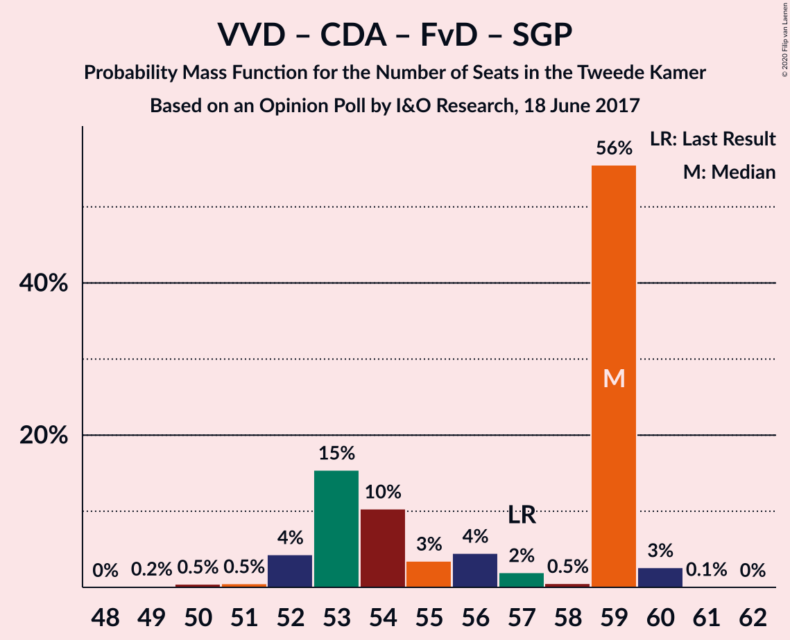

| Number of Seats | Probability | Accumulated | Special Marks |
|:---------------:|:-----------:|:-----------:|:-------------:|
| 49 | 0.7% | 100% |  |
| 50 | 0% | 99.3% |  |
| 51 | 0.2% | 99.3% |  |
| 52 | 10% | 99.2% |  |
| 53 | 61% | 89% | Median |
| 54 | 17% | 28% |  |
| 55 | 0.2% | 11% |  |
| 56 | 10% | 10% |  |
| 57 | 0% | 0.5% | Last Result |
| 58 | 0.2% | 0.4% |  |
| 59 | 0.1% | 0.3% |  |
| 60 | 0.2% | 0.2% |  |
| 61 | 0% | 0% |  |

### Volkspartij voor Vrijheid en Democratie – Christen-Democratisch Appèl – Forum voor Democratie

| Number of Seats | Probability | Accumulated | Special Marks |
|:---------------:|:-----------:|:-----------:|:-------------:|
| 46 | 0.6% | 100% |  |
| 47 | 0.1% | 99.3% |  |
| 48 | 0.1% | 99.3% |  |
| 49 | 27% | 99.1% |  |
| 50 | 46% | 72% | Median |
| 51 | 16% | 27% |  |
| 52 | 0.4% | 11% |  |
| 53 | 0.1% | 10% |  |
| 54 | 10% | 10% | Last Result |
| 55 | 0.1% | 0.4% |  |
| 56 | 0.1% | 0.4% |  |
| 57 | 0.1% | 0.3% |  |
| 58 | 0.2% | 0.2% |  |
| 59 | 0% | 0% |  |

### Volkspartij voor Vrijheid en Democratie – Christen-Democratisch Appèl

| Number of Seats | Probability | Accumulated | Special Marks |
|:---------------:|:-----------:|:-----------:|:-------------:|
| 42 | 0.6% | 100% |  |
| 43 | 0.2% | 99.3% |  |
| 44 | 17% | 99.2% |  |
| 45 | 3% | 82% |  |
| 46 | 54% | 80% | Median |
| 47 | 14% | 25% |  |
| 48 | 0.8% | 11% |  |
| 49 | 10% | 10% |  |
| 50 | 0% | 0.4% |  |
| 51 | 0.1% | 0.4% |  |
| 52 | 0.1% | 0.3% | Last Result |
| 53 | 0% | 0.2% |  |
| 54 | 0.2% | 0.2% |  |
| 55 | 0% | 0% |  |

### Democraten 66 – Christen-Democratisch Appèl – Partij van de Arbeid

| Number of Seats | Probability | Accumulated | Special Marks |
|:---------------:|:-----------:|:-----------:|:-------------:|
| 40 | 0.5% | 100% |  |
| 41 | 0% | 99.5% |  |
| 42 | 0.8% | 99.5% |  |
| 43 | 17% | 98.7% |  |
| 44 | 9% | 82% |  |
| 45 | 58% | 73% | Median |
| 46 | 2% | 14% |  |
| 47 | 0.1% | 13% | Last Result |
| 48 | 0.7% | 12% |  |
| 49 | 10% | 12% |  |
| 50 | 2% | 2% |  |
| 51 | 0% | 0% |  |

### Volkspartij voor Vrijheid en Democratie – Partij van de Arbeid

| Number of Seats | Probability | Accumulated | Special Marks |
|:---------------:|:-----------:|:-----------:|:-------------:|
| 37 | 55% | 100% | Median |
| 38 | 21% | 45% |  |
| 39 | 2% | 24% |  |
| 40 | 19% | 21% |  |
| 41 | 1.5% | 2% |  |
| 42 | 0.3% | 0.7% | Last Result |
| 43 | 0% | 0.3% |  |
| 44 | 0.3% | 0.3% |  |
| 45 | 0% | 0% |  |

### Democraten 66 – Christen-Democratisch Appèl

| Number of Seats | Probability | Accumulated | Special Marks |
|:---------------:|:-----------:|:-----------:|:-------------:|
| 30 | 0.1% | 100% |  |
| 31 | 0.1% | 99.9% |  |
| 32 | 1.1% | 99.8% |  |
| 33 | 0.2% | 98.7% |  |
| 34 | 2% | 98.6% |  |
| 35 | 9% | 96% |  |
| 36 | 32% | 87% |  |
| 37 | 43% | 55% | Median |
| 38 | 0.3% | 12% | Last Result |
| 39 | 10% | 12% |  |
| 40 | 0.1% | 2% |  |
| 41 | 2% | 2% |  |
| 42 | 0% | 0% |  |

### Christen-Democratisch Appèl – Partij van de Arbeid – ChristenUnie

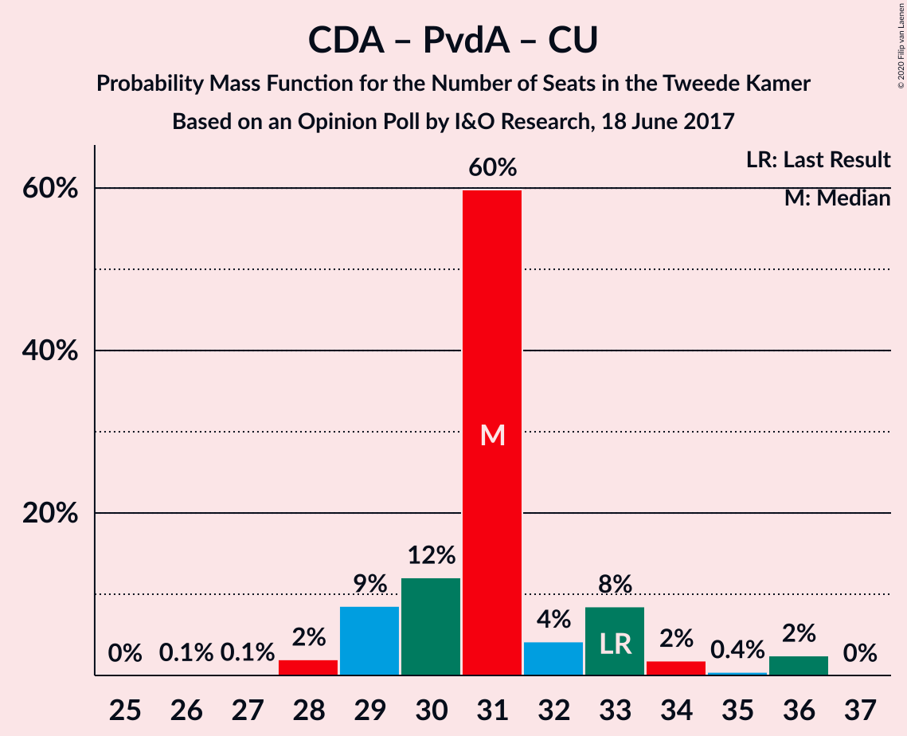

| Number of Seats | Probability | Accumulated | Special Marks |
|:---------------:|:-----------:|:-----------:|:-------------:|
| 28 | 8% | 100% |  |
| 29 | 31% | 92% |  |
| 30 | 42% | 60% | Median |
| 31 | 5% | 18% |  |
| 32 | 2% | 13% |  |
| 33 | 1.1% | 11% | Last Result |
| 34 | 0% | 10% |  |
| 35 | 0% | 10% |  |
| 36 | 10% | 10% |  |
| 37 | 0% | 0% |  |

### Christen-Democratisch Appèl – Partij van de Arbeid

| Number of Seats | Probability | Accumulated | Special Marks |
|:---------------:|:-----------:|:-----------:|:-------------:|
| 22 | 0.3% | 100% |  |
| 23 | 0.3% | 99.7% |  |
| 24 | 40% | 99.4% |  |
| 25 | 47% | 59% | Median |
| 26 | 3% | 13% |  |
| 27 | 0.1% | 10% |  |
| 28 | 0.2% | 10% | Last Result |
| 29 | 10% | 10% |  |
| 30 | 0% | 0% |  |

## Technical Information

### Opinion Poll

+ **Polling firm:** I&O Research
+ **Commissioner(s):** —
+ **Fieldwork period:** 18 June 2017

### Calculations

+ **Sample size:** 1339
+ **Simulations done:** 131,072
+ **Error estimate:** 1.37%

