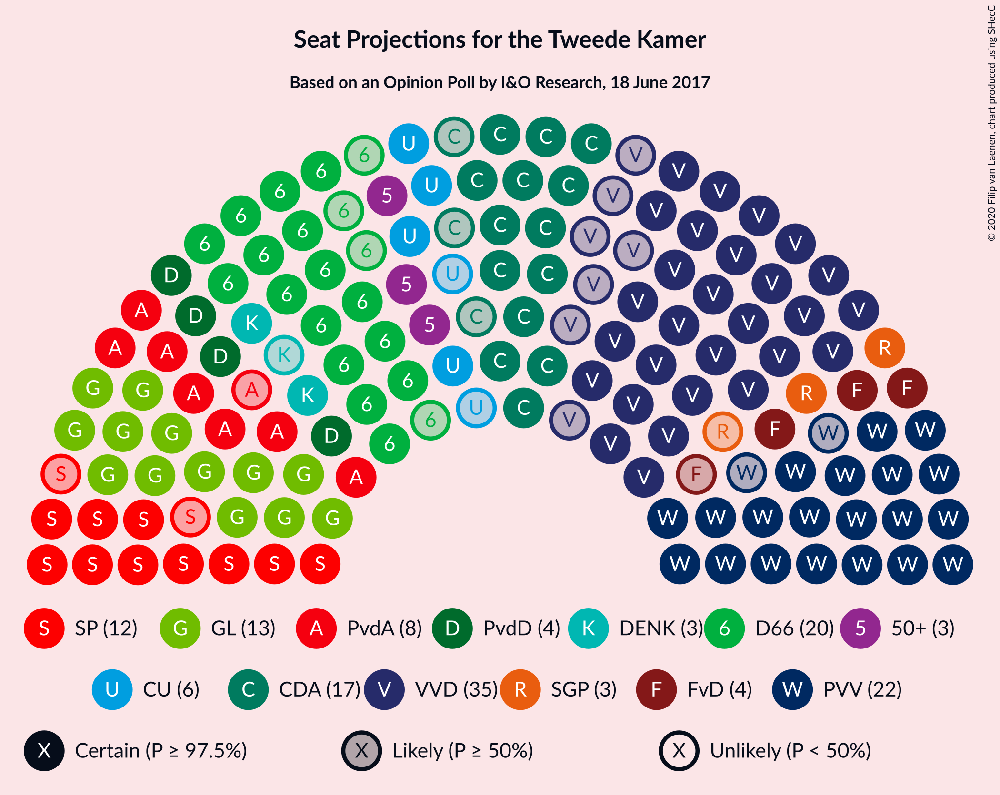
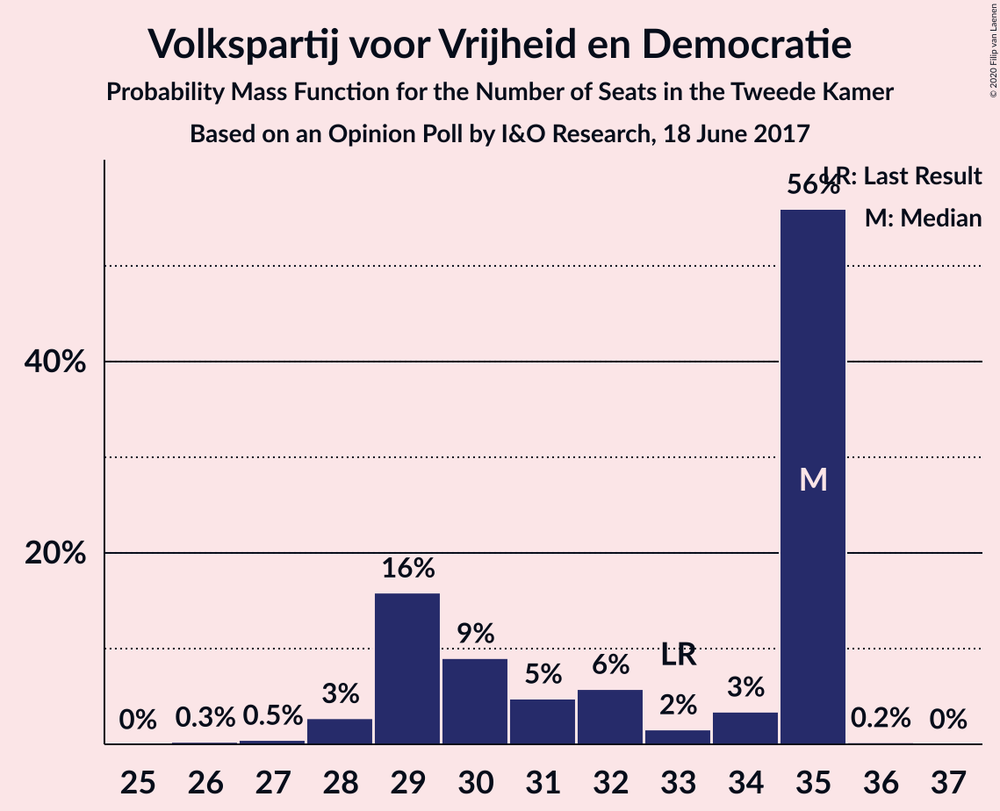
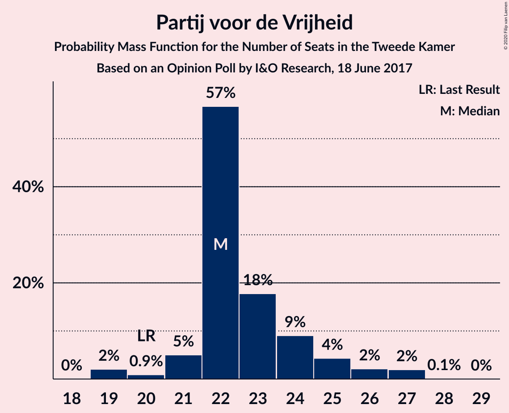
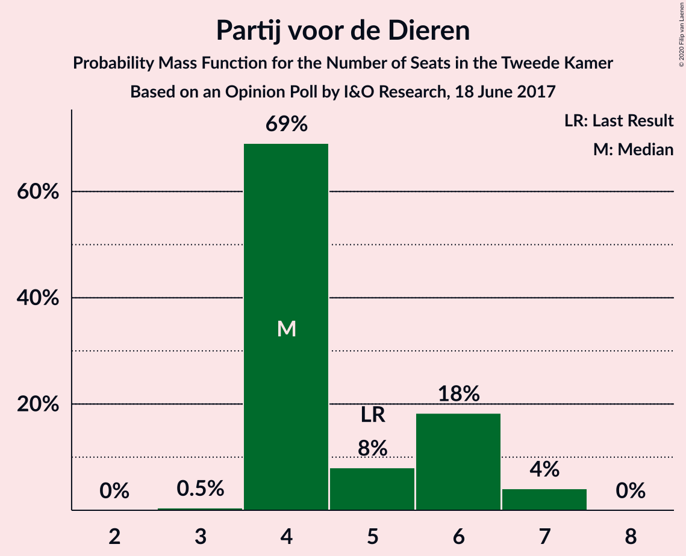
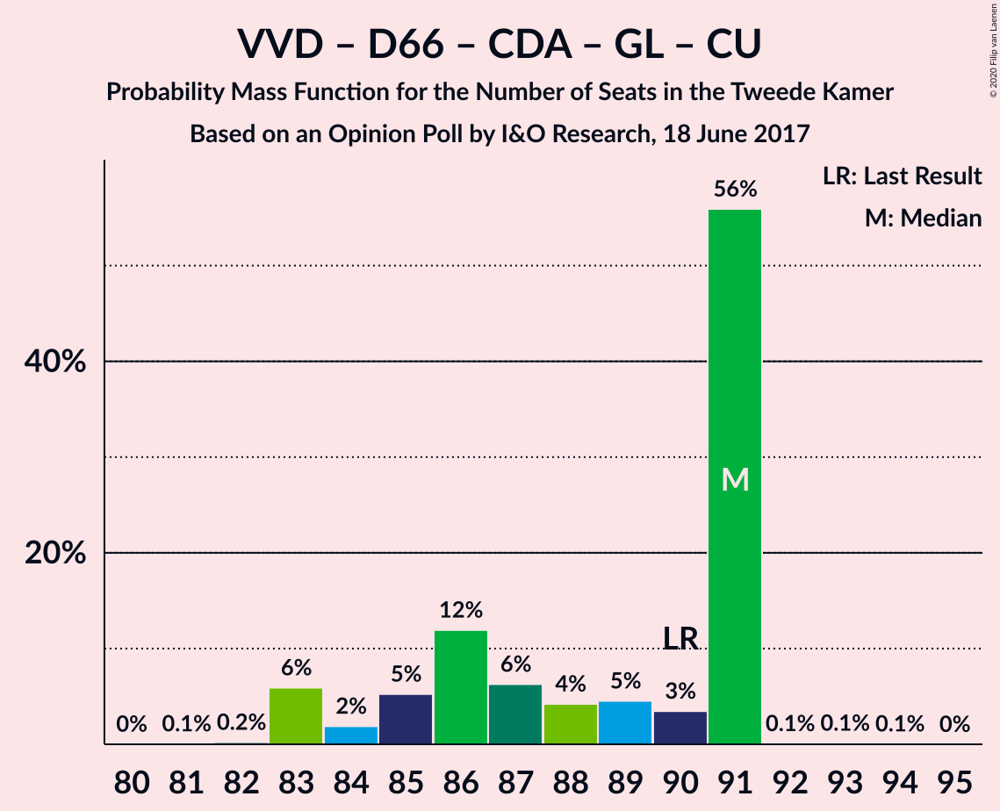
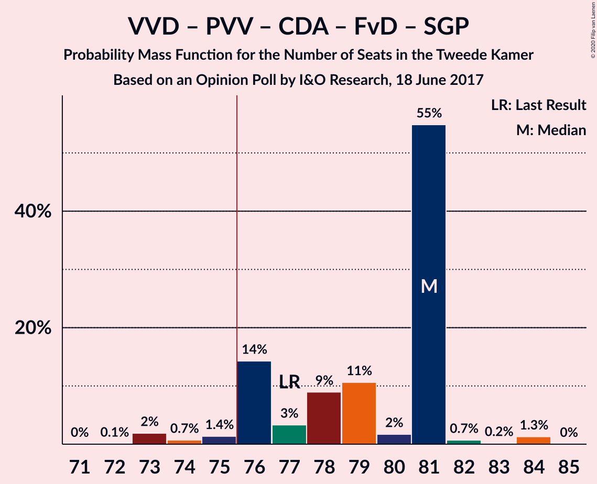
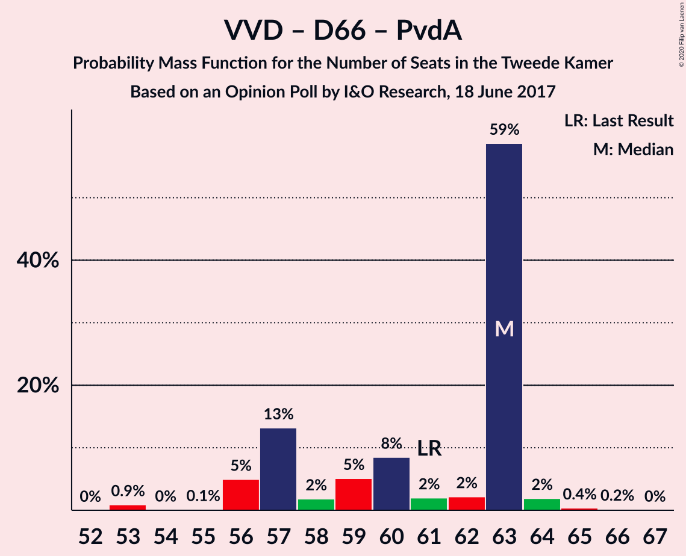
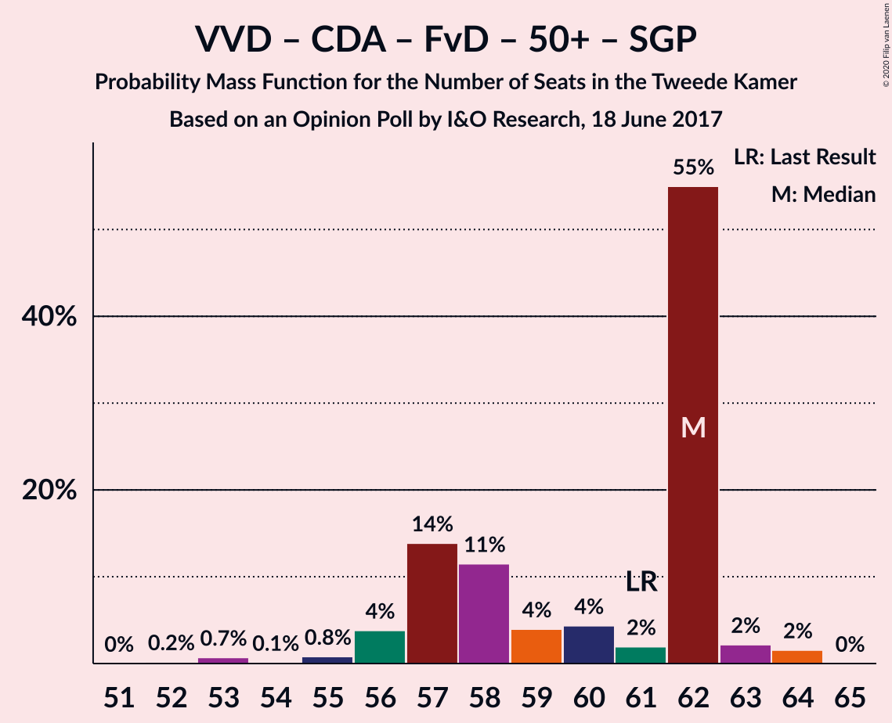
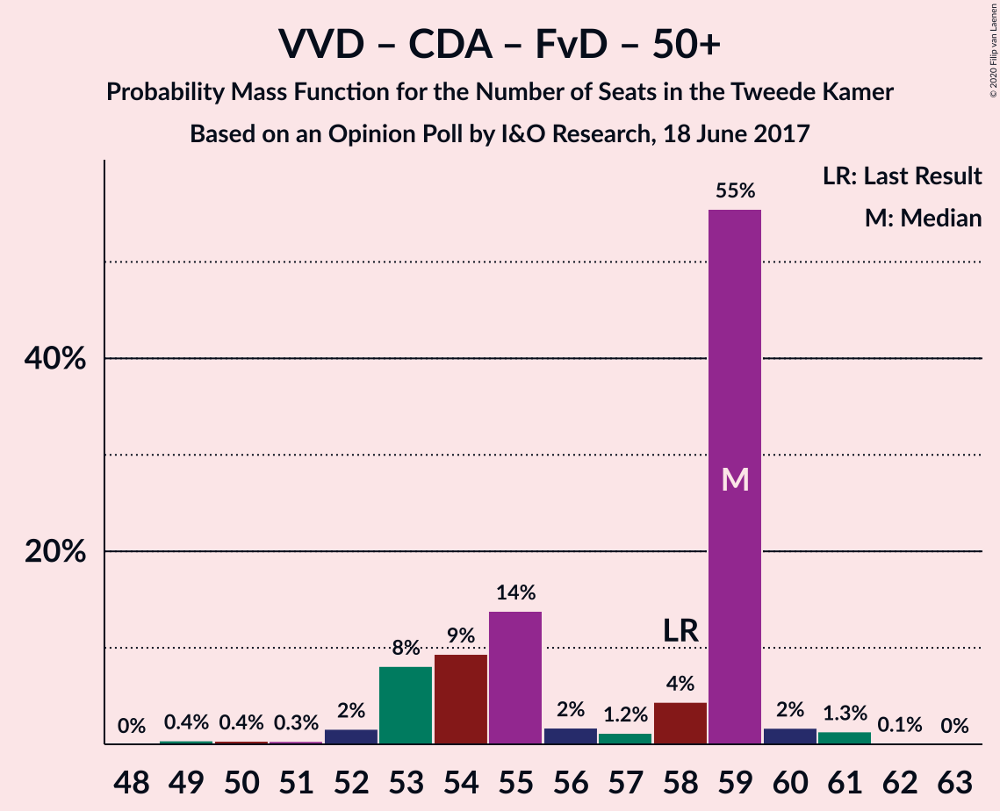
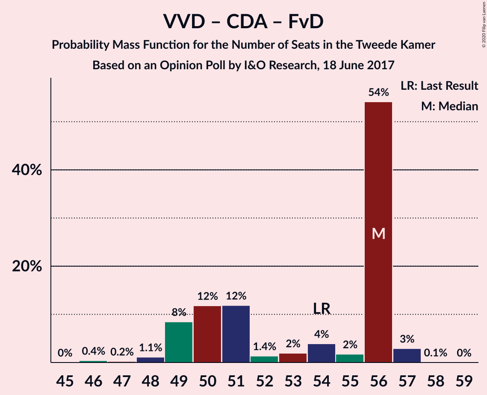

# Opinion Poll by I&O Research, 18 June 2017

<a href="#voting-intentions">Voting Intentions</a> | <a href="#seats">Seats</a> | <a href="#coalitions">Coalitions</a> | <a href="#technical-information">Technical Information</a>

## Voting Intentions

### Confidence Intervals

| Party | Last Result | Poll Result | 80% Confidence Interval | 90% Confidence Interval | 95% Confidence Interval | 99% Confidence Interval |
|:-----:|:-----------:|:-----------:|:-----------------------:|:-----------------------:|:-----------------------:|:-----------------------:|
| Volkspartij voor Vrijheid en Democratie | 21.3% | 20.4% | 19.0–21.9% |18.6–22.3% |18.3–22.6% |17.7–23.4% |
| Partij voor de Vrijheid | 13.1% | 15.2% | 14.0–16.5% |13.6–16.9% |13.3–17.2% |12.8–17.8% |
| Democraten 66 | 12.2% | 12.5% | 11.4–13.8% |11.1–14.1% |10.9–14.4% |10.4–15.0% |
| Christen-Democratisch Appèl | 12.4% | 10.5% | 9.4–11.6% |9.2–11.9% |8.9–12.2% |8.5–12.8% |
| GroenLinks | 9.1% | 9.7% | 8.7–10.8% |8.5–11.1% |8.2–11.4% |7.8–12.0% |
| Socialistische Partij | 9.1% | 8.0% | 7.1–9.0% |6.9–9.3% |6.6–9.6% |6.2–10.1% |
| Partij van de Arbeid | 5.7% | 6.5% | 5.7–7.5% |5.5–7.7% |5.3–8.0% |4.9–8.4% |
| ChristenUnie | 3.4% | 3.9% | 3.3–4.6% |3.1–4.9% |3.0–5.1% |2.7–5.5% |
| Partij voor de Dieren | 3.2% | 3.3% | 2.7–4.0% |2.6–4.2% |2.5–4.4% |2.2–4.8% |
| Forum voor Democratie | 1.8% | 3.1% | 2.5–3.8% |2.4–4.0% |2.3–4.1% |2.0–4.5% |
| 50Plus | 3.1% | 2.6% | 2.1–3.3% |2.0–3.5% |1.9–3.6% |1.7–4.0% |
| Staatkundig Gereformeerde Partij | 2.1% | 2.2% | 1.7–2.8% |1.6–2.9% |1.5–3.1% |1.3–3.4% |
| DENK | 2.1% | 1.7% | 1.3–2.3% |1.2–2.4% |1.1–2.6% |1.0–2.9% |

*Note:* The poll result column reflects the actual value used in the calculations. Published results may vary slightly, and in addition be rounded to fewer digits.

## Seats

### Confidence Intervals

| Party | Last Result | Median | 80% Confidence Interval | 90% Confidence Interval | 95% Confidence Interval | 99% Confidence Interval |
|:-----:|:-----------:|:------:|:-----------------------:|:-----------------------:|:-----------------------:|:-----------------------:|
| <a href="#volkspartij-voor-vrijheid-en-democratie">Volkspartij voor Vrijheid en Democratie</a> | 33 | 35 | 29–35 |29–35 |28–35 |27–35 |
| <a href="#partij-voor-de-vrijheid">Partij voor de Vrijheid</a> | 20 | 22 | 22–24 |21–25 |20–26 |19–27 |
| <a href="#democraten-66">Democraten 66</a> | 19 | 20 | 18–20 |17–21 |16–21 |15–23 |
| <a href="#christen-democratisch-appèl">Christen-Democratisch Appèl</a> | 19 | 17 | 15–17 |15–18 |14–19 |13–19 |
| <a href="#groenlinks">GroenLinks</a> | 14 | 13 | 13–16 |13–17 |13–18 |12–18 |
| <a href="#socialistische-partij">Socialistische Partij</a> | 14 | 12 | 11–12 |11–13 |10–13 |10–14 |
| <a href="#partij-van-de-arbeid">Partij van de Arbeid</a> | 9 | 8 | 8–10 |8–12 |7–12 |7–14 |
| <a href="#christenunie">ChristenUnie</a> | 5 | 6 | 5–6 |5–7 |4–7 |4–8 |
| <a href="#partij-voor-de-dieren">Partij voor de Dieren</a> | 5 | 4 | 4–6 |4–6 |4–7 |4–7 |
| <a href="#forum-voor-democratie">Forum voor Democratie</a> | 2 | 4 | 4–5 |3–5 |3–5 |3–6 |
| <a href="#50plus">50Plus</a> | 4 | 3 | 3–5 |3–5 |3–5 |2–5 |
| <a href="#staatkundig-gereformeerde-partij">Staatkundig Gereformeerde Partij</a> | 3 | 3 | 3–4 |2–4 |2–4 |2–5 |
| <a href="#denk">DENK</a> | 3 | 3 | 2–3 |2–3 |2–3 |1–3 |

### Volkspartij voor Vrijheid en Democratie

*For a full overview of the results for this party, see the [Volkspartij voor Vrijheid en Democratie](party-volkspartijvoorvrijheidendemocratie.html) page.*

| Number of Seats | Probability | Accumulated | Special Marks |
|:---------------:|:-----------:|:-----------:|:-------------:|
| 26 | 0.3% | 100% |  |
| 27 | 0.5% | 99.7% |  |
| 28 | 3% | 99.3% |  |
| 29 | 16% | 97% |  |
| 30 | 9% | 81% |  |
| 31 | 5% | 72% |  |
| 32 | 6% | 67% |  |
| 33 | 2% | 61% | Last Result |
| 34 | 3% | 60% |  |
| 35 | 56% | 56% | Median |
| 36 | 0.2% | 0.2% |  |
| 37 | 0% | 0% |  |

### Partij voor de Vrijheid

*For a full overview of the results for this party, see the [Partij voor de Vrijheid](party-partijvoordevrijheid.html) page.*

| Number of Seats | Probability | Accumulated | Special Marks |
|:---------------:|:-----------:|:-----------:|:-------------:|
| 19 | 2% | 100% |  |
| 20 | 0.9% | 98% | Last Result |
| 21 | 5% | 97% |  |
| 22 | 57% | 92% | Median |
| 23 | 18% | 35% |  |
| 24 | 9% | 18% |  |
| 25 | 4% | 8% |  |
| 26 | 2% | 4% |  |
| 27 | 2% | 2% |  |
| 28 | 0.1% | 0.1% |  |
| 29 | 0% | 0% |  |

### Democraten 66

*For a full overview of the results for this party, see the [Democraten 66](party-democraten66.html) page.*

| Number of Seats | Probability | Accumulated | Special Marks |
|:---------------:|:-----------:|:-----------:|:-------------:|
| 14 | 0.1% | 100% |  |
| 15 | 1.1% | 99.9% |  |
| 16 | 2% | 98.8% |  |
| 17 | 3% | 97% |  |
| 18 | 5% | 95% |  |
| 19 | 12% | 89% | Last Result |
| 20 | 70% | 77% | Median |
| 21 | 5% | 7% |  |
| 22 | 1.1% | 2% |  |
| 23 | 0.5% | 1.0% |  |
| 24 | 0.5% | 0.5% |  |
| 25 | 0% | 0% |  |

### Christen-Democratisch Appèl

*For a full overview of the results for this party, see the [Christen-Democratisch Appèl](party-christen-democratischappèl.html) page.*

| Number of Seats | Probability | Accumulated | Special Marks |
|:---------------:|:-----------:|:-----------:|:-------------:|
| 12 | 0.1% | 100% |  |
| 13 | 1.0% | 99.9% |  |
| 14 | 2% | 98.9% |  |
| 15 | 9% | 97% |  |
| 16 | 11% | 88% |  |
| 17 | 71% | 78% | Median |
| 18 | 4% | 7% |  |
| 19 | 3% | 3% | Last Result |
| 20 | 0.3% | 0.3% |  |
| 21 | 0% | 0% |  |

### GroenLinks

*For a full overview of the results for this party, see the [GroenLinks](party-groenlinks.html) page.*

| Number of Seats | Probability | Accumulated | Special Marks |
|:---------------:|:-----------:|:-----------:|:-------------:|
| 11 | 0.1% | 100% |  |
| 12 | 0.6% | 99.8% |  |
| 13 | 61% | 99.3% | Median |
| 14 | 5% | 38% | Last Result |
| 15 | 22% | 33% |  |
| 16 | 5% | 11% |  |
| 17 | 2% | 5% |  |
| 18 | 4% | 4% |  |
| 19 | 0% | 0.1% |  |
| 20 | 0% | 0% |  |

### Socialistische Partij

*For a full overview of the results for this party, see the [Socialistische Partij](party-socialistischepartij.html) page.*

| Number of Seats | Probability | Accumulated | Special Marks |
|:---------------:|:-----------:|:-----------:|:-------------:|
| 9 | 0.2% | 100% |  |
| 10 | 3% | 99.8% |  |
| 11 | 25% | 96% |  |
| 12 | 63% | 71% | Median |
| 13 | 6% | 8% |  |
| 14 | 1.4% | 2% | Last Result |
| 15 | 0.1% | 0.4% |  |
| 16 | 0.2% | 0.2% |  |
| 17 | 0% | 0% |  |

### Partij van de Arbeid

*For a full overview of the results for this party, see the [Partij van de Arbeid](party-partijvandearbeid.html) page.*

| Number of Seats | Probability | Accumulated | Special Marks |
|:---------------:|:-----------:|:-----------:|:-------------:|
| 7 | 4% | 100% |  |
| 8 | 67% | 96% | Median |
| 9 | 15% | 30% | Last Result |
| 10 | 5% | 14% |  |
| 11 | 2% | 9% |  |
| 12 | 6% | 7% |  |
| 13 | 0.4% | 1.0% |  |
| 14 | 0.6% | 0.6% |  |
| 15 | 0% | 0% |  |

### ChristenUnie

*For a full overview of the results for this party, see the [ChristenUnie](party-christenunie.html) page.*

| Number of Seats | Probability | Accumulated | Special Marks |
|:---------------:|:-----------:|:-----------:|:-------------:|
| 4 | 4% | 100% |  |
| 5 | 28% | 96% | Last Result |
| 6 | 60% | 68% | Median |
| 7 | 6% | 8% |  |
| 8 | 2% | 2% |  |
| 9 | 0% | 0.1% |  |
| 10 | 0% | 0% |  |

### Partij voor de Dieren

*For a full overview of the results for this party, see the [Partij voor de Dieren](party-partijvoordedieren.html) page.*

| Number of Seats | Probability | Accumulated | Special Marks |
|:---------------:|:-----------:|:-----------:|:-------------:|
| 3 | 0.5% | 100% |  |
| 4 | 69% | 99.5% | Median |
| 5 | 8% | 30% | Last Result |
| 6 | 18% | 22% |  |
| 7 | 4% | 4% |  |
| 8 | 0% | 0% |  |

### Forum voor Democratie

*For a full overview of the results for this party, see the [Forum voor Democratie](party-forumvoordemocratie.html) page.*

| Number of Seats | Probability | Accumulated | Special Marks |
|:---------------:|:-----------:|:-----------:|:-------------:|
| 2 | 0% | 100% | Last Result |
| 3 | 8% | 100% |  |
| 4 | 73% | 92% | Median |
| 5 | 16% | 19% |  |
| 6 | 2% | 2% |  |
| 7 | 0.4% | 0.4% |  |
| 8 | 0% | 0% |  |

### 50Plus

*For a full overview of the results for this party, see the [50Plus](party-50plus.html) page.*

| Number of Seats | Probability | Accumulated | Special Marks |
|:---------------:|:-----------:|:-----------:|:-------------:|
| 2 | 0.9% | 100% |  |
| 3 | 68% | 99.1% | Median |
| 4 | 18% | 31% | Last Result |
| 5 | 12% | 13% |  |
| 6 | 0.3% | 0.4% |  |
| 7 | 0% | 0% |  |

### Staatkundig Gereformeerde Partij

*For a full overview of the results for this party, see the [Staatkundig Gereformeerde Partij](party-staatkundiggereformeerdepartij.html) page.*

| Number of Seats | Probability | Accumulated | Special Marks |
|:---------------:|:-----------:|:-----------:|:-------------:|
| 2 | 5% | 100% |  |
| 3 | 82% | 95% | Last Result, Median |
| 4 | 12% | 13% |  |
| 5 | 1.0% | 1.0% |  |
| 6 | 0% | 0% |  |

### DENK

*For a full overview of the results for this party, see the [DENK](party-denk.html) page.*

| Number of Seats | Probability | Accumulated | Special Marks |
|:---------------:|:-----------:|:-----------:|:-------------:|
| 0 | 0.1% | 100% |  |
| 1 | 2% | 99.9% |  |
| 2 | 27% | 98% |  |
| 3 | 71% | 72% | Last Result, Median |
| 4 | 0.5% | 0.5% |  |
| 5 | 0% | 0% |  |

## Coalitions

### Confidence Intervals

| Coalition | Last Result | Median | Majority? | 80% Confidence Interval | 90% Confidence Interval | 95% Confidence Interval | 99% Confidence Interval |
|:---------:|:-----------:|:------:|:---------:|:-----------------------:|:-----------------------:|:-----------------------:|:-----------------------:|
| Volkspartij voor Vrijheid en Democratie – Democraten 66 – Christen-Democratisch Appèl – GroenLinks – ChristenUnie | 90 | 91 | 100% | 85–91 | 83–91 | 83–91 | 83–91 |
| Volkspartij voor Vrijheid en Democratie – Democraten 66 – Christen-Democratisch Appèl – Partij van de Arbeid – ChristenUnie | 85 | 86 | 99.9% | 79–86 | 78–86 | 78–86 | 77–86 |
| Democraten 66 – Christen-Democratisch Appèl – GroenLinks – Socialistische Partij – Partij van de Arbeid – ChristenUnie | 80 | 76 | 91% | 76–79 | 74–80 | 74–81 | 72–83 |
| Volkspartij voor Vrijheid en Democratie – Partij voor de Vrijheid – Christen-Democratisch Appèl – Forum voor Democratie – Staatkundig Gereformeerde Partij | 77 | 81 | 96% | 76–81 | 76–81 | 74–81 | 73–84 |
| Volkspartij voor Vrijheid en Democratie – Partij voor de Vrijheid – Christen-Democratisch Appèl – Forum voor Democratie | 74 | 78 | 68% | 73–78 | 72–78 | 71–78 | 70–81 |
| Volkspartij voor Vrijheid en Democratie – Democraten 66 – Christen-Democratisch Appèl – ChristenUnie | 76 | 78 | 57% | 70–78 | 70–78 | 69–78 | 68–78 |
| Volkspartij voor Vrijheid en Democratie – Partij voor de Vrijheid – Christen-Democratisch Appèl | 72 | 74 | 0.4% | 69–74 | 67–74 | 66–74 | 66–75 |
| Volkspartij voor Vrijheid en Democratie – Democraten 66 – Christen-Democratisch Appèl | 71 | 72 | 0% | 65–72 | 64–72 | 63–72 | 61–72 |
| Democraten 66 – Christen-Democratisch Appèl – GroenLinks – Partij van de Arbeid – ChristenUnie | 66 | 64 | 0% | 63–67 | 63–68 | 62–70 | 62–71 |
| Volkspartij voor Vrijheid en Democratie – Democraten 66 – Partij van de Arbeid | 61 | 63 | 0% | 57–63 | 56–63 | 56–64 | 53–65 |
| Volkspartij voor Vrijheid en Democratie – Christen-Democratisch Appèl – Forum voor Democratie – 50Plus – Staatkundig Gereformeerde Partij | 61 | 62 | 0% | 57–62 | 56–62 | 56–63 | 53–64 |
| Volkspartij voor Vrijheid en Democratie – Christen-Democratisch Appèl – Partij van de Arbeid | 61 | 60 | 0% | 54–60 | 53–60 | 53–61 | 52–61 |
| Volkspartij voor Vrijheid en Democratie – Christen-Democratisch Appèl – Forum voor Democratie – 50Plus | 58 | 59 | 0% | 53–59 | 53–59 | 52–60 | 50–61 |
| Volkspartij voor Vrijheid en Democratie – Christen-Democratisch Appèl – Forum voor Democratie – Staatkundig Gereformeerde Partij | 57 | 59 | 0% | 53–59 | 52–59 | 52–60 | 50–60 |
| Volkspartij voor Vrijheid en Democratie – Christen-Democratisch Appèl – Forum voor Democratie | 54 | 56 | 0% | 49–56 | 49–56 | 49–57 | 47–57 |
| Volkspartij voor Vrijheid en Democratie – Christen-Democratisch Appèl | 52 | 52 | 0% | 45–52 | 44–52 | 44–52 | 43–52 |
| Democraten 66 – Christen-Democratisch Appèl – Partij van de Arbeid | 47 | 45 | 0% | 43–47 | 43–47 | 42–49 | 42–50 |
| Volkspartij voor Vrijheid en Democratie – Partij van de Arbeid | 42 | 43 | 0% | 37–43 | 37–44 | 37–45 | 36–45 |
| Democraten 66 – Christen-Democratisch Appèl | 38 | 37 | 0% | 34–37 | 33–38 | 32–39 | 31–41 |
| Christen-Democratisch Appèl – Partij van de Arbeid – ChristenUnie | 33 | 31 | 0% | 29–33 | 29–33 | 29–35 | 28–36 |
| Christen-Democratisch Appèl – Partij van de Arbeid | 28 | 25 | 0% | 24–27 | 24–28 | 24–29 | 23–29 |

### Volkspartij voor Vrijheid en Democratie – Democraten 66 – Christen-Democratisch Appèl – GroenLinks – ChristenUnie

| Number of Seats | Probability | Accumulated | Special Marks |
|:---------------:|:-----------:|:-----------:|:-------------:|
| 81 | 0.1% | 100% |  |
| 82 | 0.2% | 99.9% |  |
| 83 | 6% | 99.7% |  |
| 84 | 2% | 94% |  |
| 85 | 5% | 92% |  |
| 86 | 12% | 87% |  |
| 87 | 6% | 75% |  |
| 88 | 4% | 68% |  |
| 89 | 5% | 64% |  |
| 90 | 3% | 60% | Last Result |
| 91 | 56% | 56% | Median |
| 92 | 0.1% | 0.3% |  |
| 93 | 0.1% | 0.2% |  |
| 94 | 0.1% | 0.1% |  |
| 95 | 0% | 0% |  |

### Volkspartij voor Vrijheid en Democratie – Democraten 66 – Christen-Democratisch Appèl – Partij van de Arbeid – ChristenUnie

| Number of Seats | Probability | Accumulated | Special Marks |
|:---------------:|:-----------:|:-----------:|:-------------:|
| 75 | 0% | 100% |  |
| 76 | 0.3% | 99.9% | Majority |
| 77 | 0.9% | 99.7% |  |
| 78 | 6% | 98.8% |  |
| 79 | 15% | 93% |  |
| 80 | 2% | 78% |  |
| 81 | 6% | 76% |  |
| 82 | 2% | 70% |  |
| 83 | 1.1% | 67% |  |
| 84 | 8% | 66% |  |
| 85 | 1.5% | 58% | Last Result |
| 86 | 57% | 57% | Median |
| 87 | 0.1% | 0.1% |  |
| 88 | 0% | 0% |  |

### Democraten 66 – Christen-Democratisch Appèl – GroenLinks – Socialistische Partij – Partij van de Arbeid – ChristenUnie

| Number of Seats | Probability | Accumulated | Special Marks |
|:---------------:|:-----------:|:-----------:|:-------------:|
| 71 | 0% | 100% |  |
| 72 | 1.4% | 99.9% |  |
| 73 | 0.9% | 98.5% |  |
| 74 | 5% | 98% |  |
| 75 | 2% | 93% |  |
| 76 | 70% | 91% | Median, Majority |
| 77 | 6% | 21% |  |
| 78 | 5% | 16% |  |
| 79 | 6% | 11% |  |
| 80 | 1.0% | 5% | Last Result |
| 81 | 3% | 4% |  |
| 82 | 0.5% | 1.0% |  |
| 83 | 0.5% | 0.5% |  |
| 84 | 0% | 0% |  |

### Volkspartij voor Vrijheid en Democratie – Partij voor de Vrijheid – Christen-Democratisch Appèl – Forum voor Democratie – Staatkundig Gereformeerde Partij

| Number of Seats | Probability | Accumulated | Special Marks |
|:---------------:|:-----------:|:-----------:|:-------------:|
| 71 | 0% | 100% |  |
| 72 | 0.1% | 99.9% |  |
| 73 | 2% | 99.9% |  |
| 74 | 0.7% | 98% |  |
| 75 | 1.4% | 97% |  |
| 76 | 14% | 96% | Majority |
| 77 | 3% | 82% | Last Result |
| 78 | 9% | 78% |  |
| 79 | 11% | 69% |  |
| 80 | 2% | 59% |  |
| 81 | 55% | 57% | Median |
| 82 | 0.7% | 2% |  |
| 83 | 0.2% | 1.5% |  |
| 84 | 1.3% | 1.3% |  |
| 85 | 0% | 0% |  |

### Volkspartij voor Vrijheid en Democratie – Partij voor de Vrijheid – Christen-Democratisch Appèl – Forum voor Democratie

| Number of Seats | Probability | Accumulated | Special Marks |
|:---------------:|:-----------:|:-----------:|:-------------:|
| 68 | 0.1% | 100% |  |
| 69 | 0.4% | 99.9% |  |
| 70 | 2% | 99.5% |  |
| 71 | 0.6% | 98% |  |
| 72 | 5% | 97% |  |
| 73 | 11% | 92% |  |
| 74 | 3% | 81% | Last Result |
| 75 | 9% | 77% |  |
| 76 | 10% | 68% | Majority |
| 77 | 1.3% | 58% |  |
| 78 | 55% | 57% | Median |
| 79 | 0.8% | 2% |  |
| 80 | 0.1% | 1.4% |  |
| 81 | 1.2% | 1.3% |  |
| 82 | 0.1% | 0.1% |  |
| 83 | 0% | 0% |  |

### Volkspartij voor Vrijheid en Democratie – Democraten 66 – Christen-Democratisch Appèl – ChristenUnie

| Number of Seats | Probability | Accumulated | Special Marks |
|:---------------:|:-----------:|:-----------:|:-------------:|
| 66 | 0% | 100% |  |
| 67 | 0.1% | 99.9% |  |
| 68 | 1.3% | 99.8% |  |
| 69 | 3% | 98.5% |  |
| 70 | 9% | 96% |  |
| 71 | 14% | 87% |  |
| 72 | 7% | 72% |  |
| 73 | 3% | 65% |  |
| 74 | 1.1% | 62% |  |
| 75 | 4% | 61% |  |
| 76 | 3% | 57% | Last Result, Majority |
| 77 | 0.2% | 54% |  |
| 78 | 54% | 54% | Median |
| 79 | 0% | 0% |  |

### Volkspartij voor Vrijheid en Democratie – Partij voor de Vrijheid – Christen-Democratisch Appèl

| Number of Seats | Probability | Accumulated | Special Marks |
|:---------------:|:-----------:|:-----------:|:-------------:|
| 64 | 0.1% | 100% |  |
| 65 | 0.4% | 99.9% |  |
| 66 | 2% | 99.6% |  |
| 67 | 5% | 97% |  |
| 68 | 1.1% | 92% |  |
| 69 | 14% | 91% |  |
| 70 | 4% | 77% |  |
| 71 | 4% | 73% |  |
| 72 | 9% | 69% | Last Result |
| 73 | 3% | 60% |  |
| 74 | 55% | 57% | Median |
| 75 | 2% | 2% |  |
| 76 | 0.4% | 0.4% | Majority |
| 77 | 0.1% | 0.1% |  |
| 78 | 0% | 0% |  |

### Volkspartij voor Vrijheid en Democratie – Democraten 66 – Christen-Democratisch Appèl

| Number of Seats | Probability | Accumulated | Special Marks |
|:---------------:|:-----------:|:-----------:|:-------------:|
| 60 | 0% | 100% |  |
| 61 | 0.7% | 99.9% |  |
| 62 | 0.4% | 99.2% |  |
| 63 | 2% | 98.8% |  |
| 64 | 6% | 97% |  |
| 65 | 5% | 91% |  |
| 66 | 17% | 86% |  |
| 67 | 6% | 69% |  |
| 68 | 2% | 63% |  |
| 69 | 4% | 61% |  |
| 70 | 2% | 57% |  |
| 71 | 0.5% | 55% | Last Result |
| 72 | 54% | 54% | Median |
| 73 | 0.1% | 0.1% |  |
| 74 | 0% | 0% |  |

### Democraten 66 – Christen-Democratisch Appèl – GroenLinks – Partij van de Arbeid – ChristenUnie

| Number of Seats | Probability | Accumulated | Special Marks |
|:---------------:|:-----------:|:-----------:|:-------------:|
| 59 | 0.1% | 100% |  |
| 60 | 0.2% | 99.9% |  |
| 61 | 0.2% | 99.7% |  |
| 62 | 3% | 99.6% |  |
| 63 | 9% | 97% |  |
| 64 | 56% | 88% | Median |
| 65 | 12% | 31% |  |
| 66 | 6% | 19% | Last Result |
| 67 | 7% | 13% |  |
| 68 | 1.1% | 6% |  |
| 69 | 1.5% | 5% |  |
| 70 | 3% | 3% |  |
| 71 | 0.2% | 0.6% |  |
| 72 | 0.3% | 0.3% |  |
| 73 | 0% | 0% |  |

### Volkspartij voor Vrijheid en Democratie – Democraten 66 – Partij van de Arbeid

| Number of Seats | Probability | Accumulated | Special Marks |
|:---------------:|:-----------:|:-----------:|:-------------:|
| 53 | 0.9% | 100% |  |
| 54 | 0% | 99.1% |  |
| 55 | 0.1% | 99.1% |  |
| 56 | 5% | 98.9% |  |
| 57 | 13% | 94% |  |
| 58 | 2% | 81% |  |
| 59 | 5% | 79% |  |
| 60 | 8% | 74% |  |
| 61 | 2% | 65% | Last Result |
| 62 | 2% | 63% |  |
| 63 | 59% | 61% | Median |
| 64 | 2% | 3% |  |
| 65 | 0.4% | 0.6% |  |
| 66 | 0.2% | 0.2% |  |
| 67 | 0% | 0% |  |

### Volkspartij voor Vrijheid en Democratie – Christen-Democratisch Appèl – Forum voor Democratie – 50Plus – Staatkundig Gereformeerde Partij

| Number of Seats | Probability | Accumulated | Special Marks |
|:---------------:|:-----------:|:-----------:|:-------------:|
| 52 | 0.2% | 100% |  |
| 53 | 0.7% | 99.8% |  |
| 54 | 0.1% | 99.1% |  |
| 55 | 0.8% | 99.0% |  |
| 56 | 4% | 98% |  |
| 57 | 14% | 94% |  |
| 58 | 11% | 81% |  |
| 59 | 4% | 69% |  |
| 60 | 4% | 65% |  |
| 61 | 2% | 61% | Last Result |
| 62 | 55% | 59% | Median |
| 63 | 2% | 4% |  |
| 64 | 2% | 2% |  |
| 65 | 0% | 0% |  |

### Volkspartij voor Vrijheid en Democratie – Christen-Democratisch Appèl – Partij van de Arbeid

| Number of Seats | Probability | Accumulated | Special Marks |
|:---------------:|:-----------:|:-----------:|:-------------:|
| 51 | 0.3% | 100% |  |
| 52 | 0.7% | 99.7% |  |
| 53 | 5% | 99.0% |  |
| 54 | 16% | 94% |  |
| 55 | 6% | 78% |  |
| 56 | 2% | 73% |  |
| 57 | 0.8% | 71% |  |
| 58 | 1.0% | 70% |  |
| 59 | 5% | 69% |  |
| 60 | 61% | 64% | Median |
| 61 | 3% | 3% | Last Result |
| 62 | 0.2% | 0.3% |  |
| 63 | 0% | 0% |  |

### Volkspartij voor Vrijheid en Democratie – Christen-Democratisch Appèl – Forum voor Democratie – 50Plus

| Number of Seats | Probability | Accumulated | Special Marks |
|:---------------:|:-----------:|:-----------:|:-------------:|
| 49 | 0.4% | 100% |  |
| 50 | 0.4% | 99.6% |  |
| 51 | 0.3% | 99.2% |  |
| 52 | 2% | 98.9% |  |
| 53 | 8% | 97% |  |
| 54 | 9% | 89% |  |
| 55 | 14% | 80% |  |
| 56 | 2% | 66% |  |
| 57 | 1.2% | 64% |  |
| 58 | 4% | 63% | Last Result |
| 59 | 55% | 59% | Median |
| 60 | 2% | 3% |  |
| 61 | 1.3% | 1.5% |  |
| 62 | 0.1% | 0.1% |  |
| 63 | 0% | 0% |  |

### Volkspartij voor Vrijheid en Democratie – Christen-Democratisch Appèl – Forum voor Democratie – Staatkundig Gereformeerde Partij

| Number of Seats | Probability | Accumulated | Special Marks |
|:---------------:|:-----------:|:-----------:|:-------------:|
| 49 | 0.2% | 100% |  |
| 50 | 0.5% | 99.8% |  |
| 51 | 0.5% | 99.3% |  |
| 52 | 4% | 98.8% |  |
| 53 | 15% | 95% |  |
| 54 | 10% | 79% |  |
| 55 | 3% | 69% |  |
| 56 | 4% | 65% |  |
| 57 | 2% | 61% | Last Result |
| 58 | 0.5% | 59% |  |
| 59 | 56% | 58% | Median |
| 60 | 3% | 3% |  |
| 61 | 0.1% | 0.2% |  |
| 62 | 0% | 0% |  |

### Volkspartij voor Vrijheid en Democratie – Christen-Democratisch Appèl – Forum voor Democratie

| Number of Seats | Probability | Accumulated | Special Marks |
|:---------------:|:-----------:|:-----------:|:-------------:|
| 46 | 0.4% | 100% |  |
| 47 | 0.2% | 99.6% |  |
| 48 | 1.1% | 99.3% |  |
| 49 | 8% | 98% |  |
| 50 | 12% | 90% |  |
| 51 | 12% | 78% |  |
| 52 | 1.4% | 66% |  |
| 53 | 2% | 65% |  |
| 54 | 4% | 63% | Last Result |
| 55 | 2% | 59% |  |
| 56 | 54% | 57% | Median |
| 57 | 3% | 3% |  |
| 58 | 0.1% | 0.1% |  |
| 59 | 0% | 0% |  |

### Volkspartij voor Vrijheid en Democratie – Christen-Democratisch Appèl

| Number of Seats | Probability | Accumulated | Special Marks |
|:---------------:|:-----------:|:-----------:|:-------------:|
| 42 | 0.3% | 100% |  |
| 43 | 0.7% | 99.6% |  |
| 44 | 5% | 98.9% |  |
| 45 | 4% | 94% |  |
| 46 | 16% | 90% |  |
| 47 | 4% | 74% |  |
| 48 | 6% | 70% |  |
| 49 | 4% | 64% |  |
| 50 | 3% | 60% |  |
| 51 | 1.5% | 57% |  |
| 52 | 56% | 56% | Last Result, Median |
| 53 | 0.3% | 0.3% |  |
| 54 | 0% | 0.1% |  |
| 55 | 0% | 0% |  |

### Democraten 66 – Christen-Democratisch Appèl – Partij van de Arbeid

| Number of Seats | Probability | Accumulated | Special Marks |
|:---------------:|:-----------:|:-----------:|:-------------:|
| 38 | 0.1% | 100% |  |
| 39 | 0% | 99.9% |  |
| 40 | 0.1% | 99.9% |  |
| 41 | 0.1% | 99.8% |  |
| 42 | 2% | 99.7% |  |
| 43 | 10% | 97% |  |
| 44 | 5% | 87% |  |
| 45 | 69% | 82% | Median |
| 46 | 2% | 12% |  |
| 47 | 6% | 10% | Last Result |
| 48 | 0.9% | 5% |  |
| 49 | 3% | 4% |  |
| 50 | 0.9% | 1.0% |  |
| 51 | 0.1% | 0.1% |  |
| 52 | 0% | 0% |  |

### Volkspartij voor Vrijheid en Democratie – Partij van de Arbeid

| Number of Seats | Probability | Accumulated | Special Marks |
|:---------------:|:-----------:|:-----------:|:-------------:|
| 34 | 0.2% | 100% |  |
| 35 | 0% | 99.8% |  |
| 36 | 2% | 99.7% |  |
| 37 | 14% | 98% |  |
| 38 | 6% | 84% |  |
| 39 | 3% | 78% |  |
| 40 | 5% | 75% |  |
| 41 | 2% | 70% |  |
| 42 | 1.2% | 67% | Last Result |
| 43 | 57% | 66% | Median |
| 44 | 6% | 9% |  |
| 45 | 3% | 3% |  |
| 46 | 0.4% | 0.5% |  |
| 47 | 0% | 0% |  |

### Democraten 66 – Christen-Democratisch Appèl

| Number of Seats | Probability | Accumulated | Special Marks |
|:---------------:|:-----------:|:-----------:|:-------------:|
| 30 | 0.1% | 100% |  |
| 31 | 1.2% | 99.9% |  |
| 32 | 1.3% | 98.7% |  |
| 33 | 4% | 97% |  |
| 34 | 6% | 94% |  |
| 35 | 9% | 88% |  |
| 36 | 9% | 80% |  |
| 37 | 64% | 70% | Median |
| 38 | 2% | 6% | Last Result |
| 39 | 3% | 4% |  |
| 40 | 0.1% | 0.8% |  |
| 41 | 0.7% | 0.7% |  |
| 42 | 0% | 0% |  |

### Christen-Democratisch Appèl – Partij van de Arbeid – ChristenUnie

| Number of Seats | Probability | Accumulated | Special Marks |
|:---------------:|:-----------:|:-----------:|:-------------:|
| 26 | 0.1% | 100% |  |
| 27 | 0.1% | 99.9% |  |
| 28 | 2% | 99.8% |  |
| 29 | 9% | 98% |  |
| 30 | 12% | 89% |  |
| 31 | 60% | 77% | Median |
| 32 | 4% | 17% |  |
| 33 | 8% | 13% | Last Result |
| 34 | 2% | 5% |  |
| 35 | 0.4% | 3% |  |
| 36 | 2% | 2% |  |
| 37 | 0% | 0% |  |

### Christen-Democratisch Appèl – Partij van de Arbeid

| Number of Seats | Probability | Accumulated | Special Marks |
|:---------------:|:-----------:|:-----------:|:-------------:|
| 21 | 0.1% | 100% |  |
| 22 | 0.2% | 99.9% |  |
| 23 | 1.0% | 99.7% |  |
| 24 | 11% | 98.7% |  |
| 25 | 70% | 88% | Median |
| 26 | 5% | 18% |  |
| 27 | 3% | 13% |  |
| 28 | 7% | 10% | Last Result |
| 29 | 3% | 3% |  |
| 30 | 0.3% | 0.3% |  |
| 31 | 0% | 0% |  |

## Technical Information

### Opinion Poll

+ **Polling firm:** I&O Research
+ **Commissioner(s):** —
+ **Fieldwork period:** 18 June 2017

### Calculations

+ **Sample size:** 1339
+ **Simulations done:** 1,048,576
+ **Error estimate:** 2.55%

