# Opinion Poll by Peil.nl, 18 June 2017

<a href="#voting-intentions">Voting Intentions</a> | <a href="#seats">Seats</a> | <a href="#coalitions">Coalitions</a> | <a href="#technical-information">Technical Information</a>

## Voting Intentions

### Confidence Intervals

| Party | Last Result | Poll Result | 80% Confidence Interval | 90% Confidence Interval | 95% Confidence Interval | 99% Confidence Interval |
|:-----:|:-----------:|:-----------:|:-----------------------:|:-----------------------:|:-----------------------:|:-----------------------:|
| Volkspartij voor Vrijheid en Democratie | 21.3% | 22.0% | 21.0–23.0% |20.8–23.3% |20.5–23.5% |20.1–24.0% |
| Partij voor de Vrijheid | 13.1% | 14.0% | 13.2–14.8% |13.0–15.1% |12.8–15.3% |12.4–15.7% |
| Democraten 66 | 12.2% | 13.3% | 12.6–14.2% |12.3–14.4% |12.2–14.6% |11.8–15.0% |
| Christen-Democratisch Appèl | 12.4% | 11.3% | 10.6–12.1% |10.4–12.3% |10.2–12.5% |9.9–12.9% |
| GroenLinks | 9.1% | 9.3% | 8.7–10.1% |8.5–10.3% |8.3–10.4% |8.0–10.8% |
| Socialistische Partij | 9.1% | 7.3% | 6.8–8.0% |6.6–8.2% |6.4–8.3% |6.2–8.6% |
| Partij van de Arbeid | 5.7% | 6.7% | 6.1–7.3% |6.0–7.5% |5.8–7.6% |5.6–7.9% |
| ChristenUnie | 3.4% | 3.3% | 2.9–3.8% |2.8–3.9% |2.7–4.0% |2.6–4.3% |
| Partij voor de Dieren | 3.2% | 3.3% | 2.9–3.8% |2.8–3.9% |2.7–4.0% |2.6–4.3% |
| Forum voor Democratie | 1.8% | 3.3% | 2.9–3.8% |2.8–3.9% |2.7–4.0% |2.6–4.3% |
| 50Plus | 3.1% | 2.0% | 1.7–2.4% |1.6–2.5% |1.6–2.6% |1.4–2.8% |
| Staatkundig Gereformeerde Partij | 2.1% | 2.0% | 1.7–2.4% |1.6–2.5% |1.6–2.6% |1.4–2.8% |
| DENK | 2.1% | 2.0% | 1.7–2.4% |1.6–2.5% |1.6–2.6% |1.4–2.8% |

*Note:* The poll result column reflects the actual value used in the calculations. Published results may vary slightly, and in addition be rounded to fewer digits.

## Seats

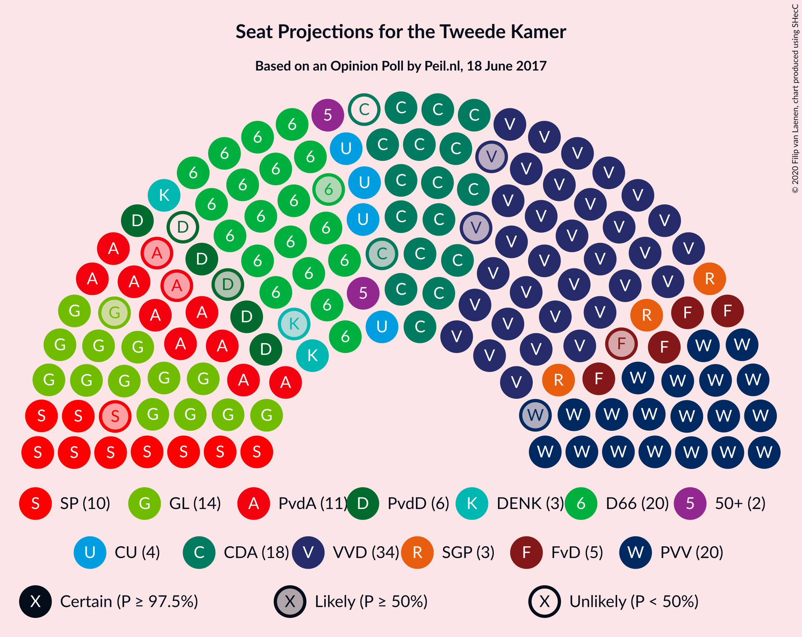

### Confidence Intervals

| Party | Last Result | Median | 80% Confidence Interval | 90% Confidence Interval | 95% Confidence Interval | 99% Confidence Interval |
|:-----:|:-----------:|:------:|:-----------------------:|:-----------------------:|:-----------------------:|:-----------------------:|
| <a href="#volkspartij-voor-vrijheid-en-democratie">Volkspartij voor Vrijheid en Democratie</a> | 33 | 34 | 34 |34 |34–35 |34–36 |
| <a href="#partij-voor-de-vrijheid">Partij voor de Vrijheid</a> | 20 | 20 | 20 |20 |20 |20–22 |
| <a href="#democraten-66">Democraten 66</a> | 19 | 21 | 21 |21 |21 |19–21 |
| <a href="#christen-democratisch-appèl">Christen-Democratisch Appèl</a> | 19 | 18 | 18 |18 |17–18 |16–18 |
| <a href="#groenlinks">GroenLinks</a> | 14 | 15 | 15 |15 |12–15 |12–15 |
| <a href="#socialistische-partij">Socialistische Partij</a> | 14 | 10 | 10 |10 |10–12 |10–12 |
| <a href="#partij-van-de-arbeid">Partij van de Arbeid</a> | 9 | 10 | 10 |10 |10–11 |10–11 |
| <a href="#christenunie">ChristenUnie</a> | 5 | 4 | 4 |4 |4–6 |4–6 |
| <a href="#partij-voor-de-dieren">Partij voor de Dieren</a> | 5 | 6 | 6 |6 |4–6 |4–6 |
| <a href="#forum-voor-democratie">Forum voor Democratie</a> | 2 | 5 | 5 |5 |4–5 |4–5 |
| <a href="#50plus">50Plus</a> | 4 | 2 | 2 |2 |2–3 |2–3 |
| <a href="#staatkundig-gereformeerde-partij">Staatkundig Gereformeerde Partij</a> | 3 | 3 | 3 |3 |3 |3 |
| <a href="#denk">DENK</a> | 3 | 2 | 2 |2 |2 |2–3 |

### Volkspartij voor Vrijheid en Democratie

*For a full overview of the results for this party, see the [Volkspartij voor Vrijheid en Democratie](party-volkspartijvoorvrijheidendemocratie.html) page.*

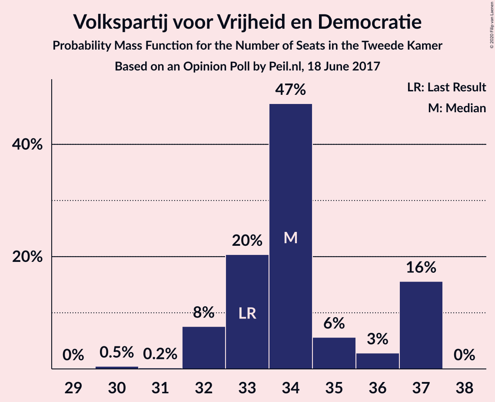

| Number of Seats | Probability | Accumulated | Special Marks |
|:---------------:|:-----------:|:-----------:|:-------------:|
| 32 | 0.3% | 100% |  |
| 33 | 0% | 99.7% | Last Result |
| 34 | 95% | 99.7% | Median |
| 35 | 3% | 4% |  |
| 36 | 1.2% | 1.2% |  |
| 37 | 0% | 0% |  |

### Partij voor de Vrijheid

*For a full overview of the results for this party, see the [Partij voor de Vrijheid](party-partijvoordevrijheid.html) page.*

| Number of Seats | Probability | Accumulated | Special Marks |
|:---------------:|:-----------:|:-----------:|:-------------:|
| 20 | 98% | 100% | Last Result, Median |
| 21 | 0.8% | 1.5% |  |
| 22 | 0.2% | 0.6% |  |
| 23 | 0.5% | 0.5% |  |
| 24 | 0% | 0% |  |

### Democraten 66

*For a full overview of the results for this party, see the [Democraten 66](party-democraten66.html) page.*

| Number of Seats | Probability | Accumulated | Special Marks |
|:---------------:|:-----------:|:-----------:|:-------------:|
| 19 | 0.8% | 100% | Last Result |
| 20 | 0.4% | 99.1% |  |
| 21 | 98% | 98.7% | Median |
| 22 | 0.3% | 0.3% |  |
| 23 | 0% | 0% |  |

### Christen-Democratisch Appèl

*For a full overview of the results for this party, see the [Christen-Democratisch Appèl](party-christen-democratischappèl.html) page.*

| Number of Seats | Probability | Accumulated | Special Marks |
|:---------------:|:-----------:|:-----------:|:-------------:|
| 14 | 0.2% | 100% |  |
| 15 | 0.3% | 99.8% |  |
| 16 | 0.2% | 99.5% |  |
| 17 | 4% | 99.3% |  |
| 18 | 96% | 96% | Median |
| 19 | 0% | 0.1% | Last Result |
| 20 | 0% | 0% |  |

### GroenLinks

*For a full overview of the results for this party, see the [GroenLinks](party-groenlinks.html) page.*

| Number of Seats | Probability | Accumulated | Special Marks |
|:---------------:|:-----------:|:-----------:|:-------------:|
| 12 | 3% | 100% |  |
| 13 | 0.6% | 97% |  |
| 14 | 0.1% | 96% | Last Result |
| 15 | 96% | 96% | Median |
| 16 | 0% | 0.2% |  |
| 17 | 0.1% | 0.1% |  |
| 18 | 0% | 0% |  |

### Socialistische Partij

*For a full overview of the results for this party, see the [Socialistische Partij](party-socialistischepartij.html) page.*

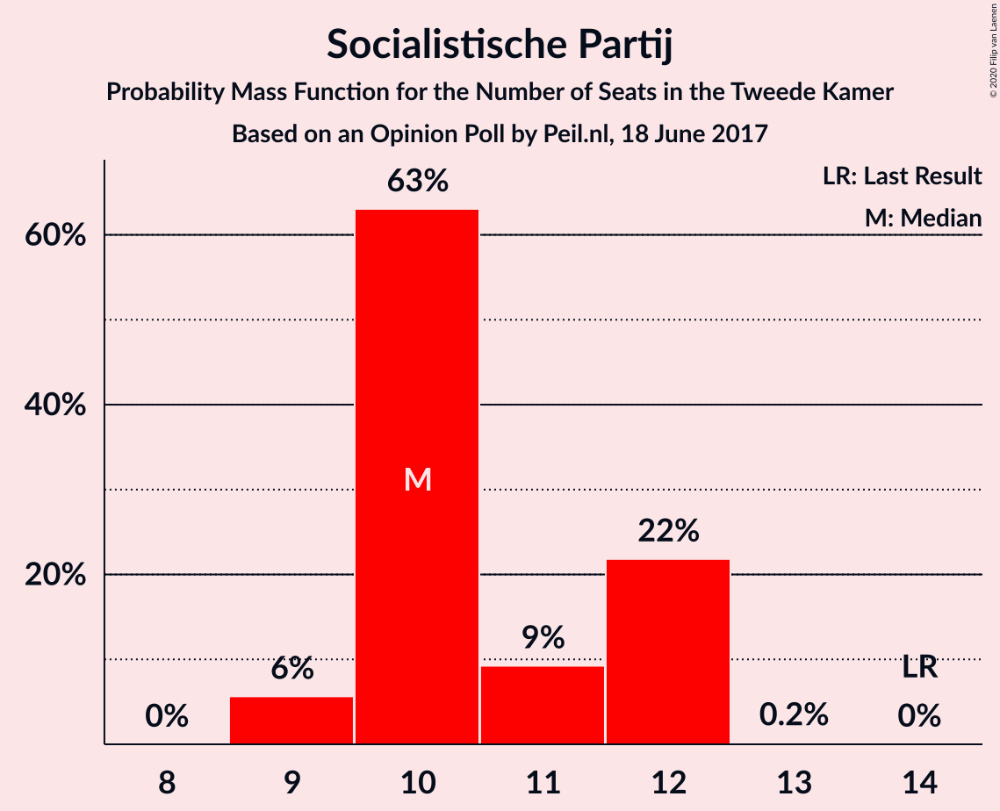

| Number of Seats | Probability | Accumulated | Special Marks |
|:---------------:|:-----------:|:-----------:|:-------------:|
| 10 | 96% | 100% | Median |
| 11 | 0.6% | 4% |  |
| 12 | 3% | 4% |  |
| 13 | 0.2% | 0.2% |  |
| 14 | 0% | 0% | Last Result |

### Partij van de Arbeid

*For a full overview of the results for this party, see the [Partij van de Arbeid](party-partijvandearbeid.html) page.*

| Number of Seats | Probability | Accumulated | Special Marks |
|:---------------:|:-----------:|:-----------:|:-------------:|
| 8 | 0.3% | 100% |  |
| 9 | 0.2% | 99.7% | Last Result |
| 10 | 95% | 99.5% | Median |
| 11 | 4% | 4% |  |
| 12 | 0% | 0% |  |

### ChristenUnie

*For a full overview of the results for this party, see the [ChristenUnie](party-christenunie.html) page.*

| Number of Seats | Probability | Accumulated | Special Marks |
|:---------------:|:-----------:|:-----------:|:-------------:|
| 3 | 0.1% | 100% |  |
| 4 | 96% | 99.9% | Median |
| 5 | 0.6% | 4% | Last Result |
| 6 | 3% | 3% |  |
| 7 | 0% | 0% |  |

### Partij voor de Dieren

*For a full overview of the results for this party, see the [Partij voor de Dieren](party-partijvoordedieren.html) page.*

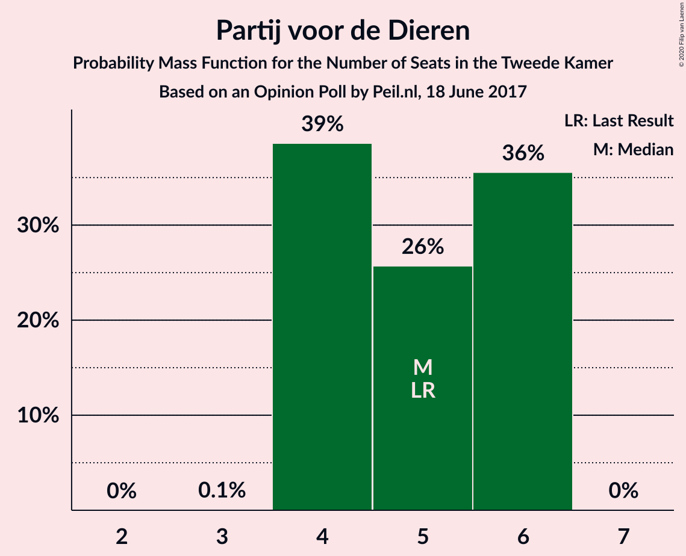

| Number of Seats | Probability | Accumulated | Special Marks |
|:---------------:|:-----------:|:-----------:|:-------------:|
| 4 | 4% | 100% |  |
| 5 | 0.1% | 96% | Last Result |
| 6 | 96% | 96% | Median |
| 7 | 0% | 0% |  |

### Forum voor Democratie

*For a full overview of the results for this party, see the [Forum voor Democratie](party-forumvoordemocratie.html) page.*

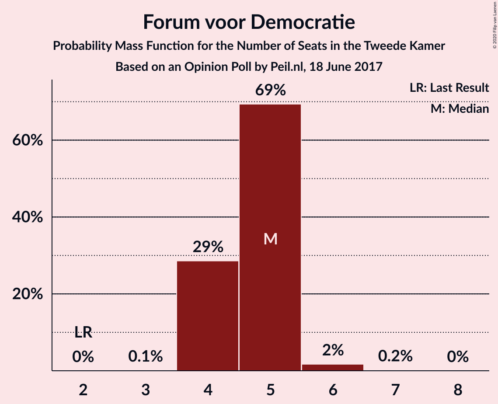

| Number of Seats | Probability | Accumulated | Special Marks |
|:---------------:|:-----------:|:-----------:|:-------------:|
| 2 | 0% | 100% | Last Result |
| 3 | 0% | 100% |  |
| 4 | 4% | 100% |  |
| 5 | 96% | 96% | Median |
| 6 | 0.1% | 0.1% |  |
| 7 | 0% | 0% |  |

### 50Plus

*For a full overview of the results for this party, see the [50Plus](party-50plus.html) page.*

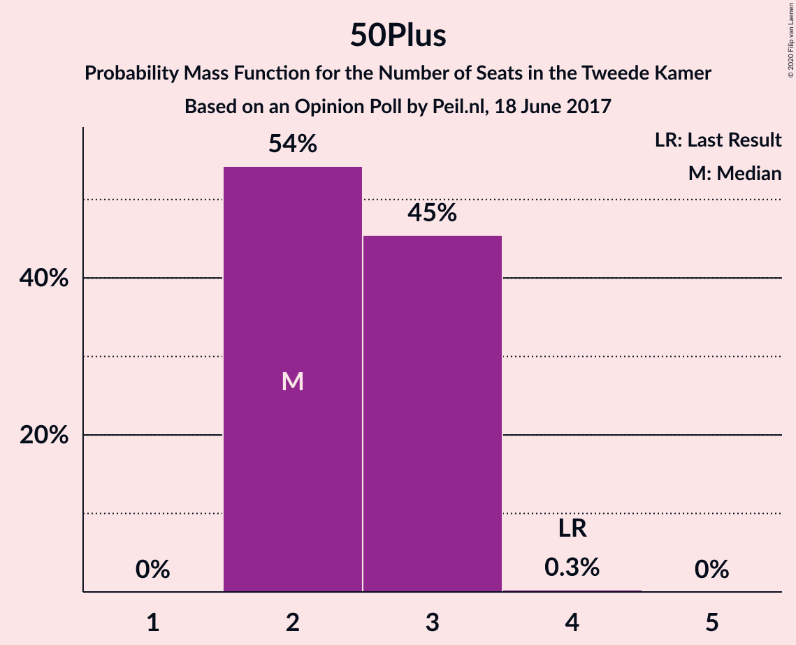

| Number of Seats | Probability | Accumulated | Special Marks |
|:---------------:|:-----------:|:-----------:|:-------------:|
| 2 | 96% | 100% | Median |
| 3 | 3% | 4% |  |
| 4 | 0.1% | 0.2% | Last Result |
| 5 | 0% | 0% |  |

### Staatkundig Gereformeerde Partij

*For a full overview of the results for this party, see the [Staatkundig Gereformeerde Partij](party-staatkundiggereformeerdepartij.html) page.*

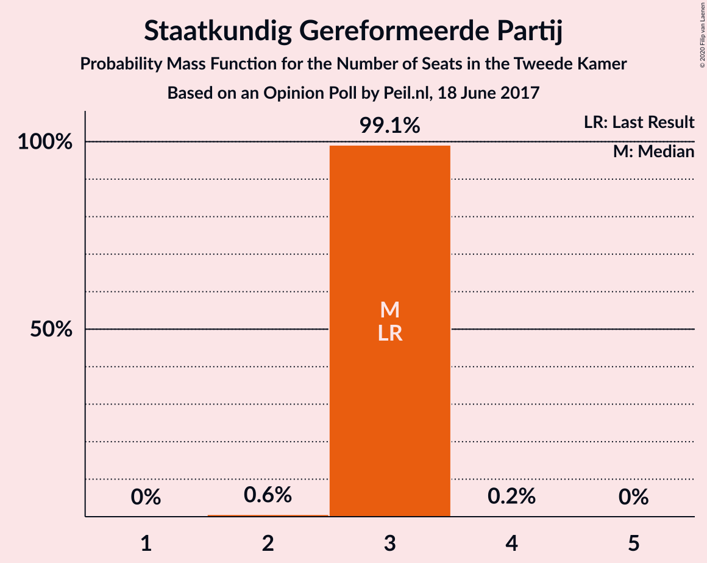

| Number of Seats | Probability | Accumulated | Special Marks |
|:---------------:|:-----------:|:-----------:|:-------------:|
| 2 | 0.2% | 100% |  |
| 3 | 99.6% | 99.8% | Last Result, Median |
| 4 | 0.2% | 0.2% |  |
| 5 | 0% | 0% |  |

### DENK

*For a full overview of the results for this party, see the [DENK](party-denk.html) page.*

| Number of Seats | Probability | Accumulated | Special Marks |
|:---------------:|:-----------:|:-----------:|:-------------:|
| 1 | 0.3% | 100% |  |
| 2 | 99.2% | 99.7% | Median |
| 3 | 0.5% | 0.5% | Last Result |
| 4 | 0% | 0% |  |

## Coalitions

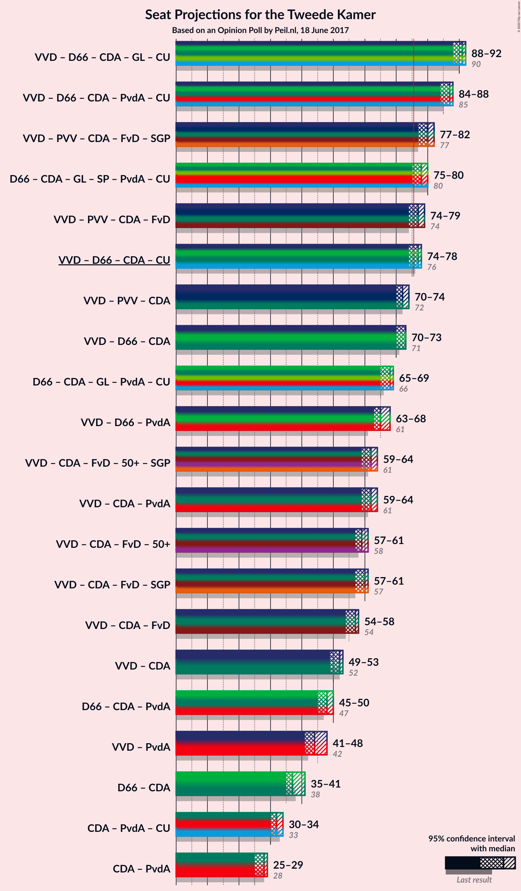

### Confidence Intervals

| Coalition | Last Result | Median | Majority? | 80% Confidence Interval | 90% Confidence Interval | 95% Confidence Interval | 99% Confidence Interval |
|:---------:|:-----------:|:------:|:---------:|:-----------------------:|:-----------------------:|:-----------------------:|:-----------------------:|
| Volkspartij voor Vrijheid en Democratie – Democraten 66 – Christen-Democratisch Appèl – GroenLinks – ChristenUnie | 90 | 92 | 100% | 92 | 92 | 91–92 | 90–92 |
| Volkspartij voor Vrijheid en Democratie – Democraten 66 – Christen-Democratisch Appèl – Partij van de Arbeid – ChristenUnie | 85 | 87 | 100% | 87 | 87 | 87–90 | 85–90 |
| Volkspartij voor Vrijheid en Democratie – Partij voor de Vrijheid – Christen-Democratisch Appèl – Forum voor Democratie – Staatkundig Gereformeerde Partij | 77 | 80 | 100% | 80 | 80 | 79–80 | 77–83 |
| Democraten 66 – Christen-Democratisch Appèl – GroenLinks – Socialistische Partij – Partij van de Arbeid – ChristenUnie | 80 | 78 | 99.7% | 78 | 78 | 78–79 | 77–79 |
| Volkspartij voor Vrijheid en Democratie – Democraten 66 – Christen-Democratisch Appèl – ChristenUnie | 76 | 77 | 99.4% | 77 | 77 | 77–79 | 75–79 |
| Volkspartij voor Vrijheid en Democratie – Partij voor de Vrijheid – Christen-Democratisch Appèl – Forum voor Democratie | 74 | 77 | 99.4% | 77 | 77 | 76–77 | 73–80 |
| Volkspartij voor Vrijheid en Democratie – Democraten 66 – Christen-Democratisch Appèl | 71 | 73 | 0% | 73 | 73 | 73 | 71–73 |
| Volkspartij voor Vrijheid en Democratie – Partij voor de Vrijheid – Christen-Democratisch Appèl | 72 | 72 | 0.3% | 72 | 72 | 72 | 69–75 |
| Democraten 66 – Christen-Democratisch Appèl – GroenLinks – Partij van de Arbeid – ChristenUnie | 66 | 68 | 0% | 68 | 68 | 67–68 | 64–68 |
| Volkspartij voor Vrijheid en Democratie – Democraten 66 – Partij van de Arbeid | 61 | 65 | 0% | 65 | 65 | 65–67 | 64–67 |
| Volkspartij voor Vrijheid en Democratie – Christen-Democratisch Appèl – Partij van de Arbeid | 61 | 62 | 0% | 62 | 62 | 62–63 | 59–65 |
| Volkspartij voor Vrijheid en Democratie – Christen-Democratisch Appèl – Forum voor Democratie – 50Plus – Staatkundig Gereformeerde Partij | 61 | 62 | 0% | 62 | 62 | 62 | 59–64 |
| Volkspartij voor Vrijheid en Democratie – Christen-Democratisch Appèl – Forum voor Democratie – Staatkundig Gereformeerde Partij | 57 | 60 | 0% | 60 | 60 | 59–60 | 57–62 |
| Volkspartij voor Vrijheid en Democratie – Christen-Democratisch Appèl – Forum voor Democratie – 50Plus | 58 | 59 | 0% | 59 | 59 | 59 | 56–61 |
| Volkspartij voor Vrijheid en Democratie – Christen-Democratisch Appèl – Forum voor Democratie | 54 | 57 | 0% | 57 | 57 | 56–57 | 53–59 |
| Volkspartij voor Vrijheid en Democratie – Christen-Democratisch Appèl | 52 | 52 | 0% | 52 | 52 | 52 | 49–54 |
| Democraten 66 – Christen-Democratisch Appèl – Partij van de Arbeid | 47 | 49 | 0% | 49 | 49 | 49 | 45–49 |
| Volkspartij voor Vrijheid en Democratie – Partij van de Arbeid | 42 | 44 | 0% | 44 | 44 | 44–46 | 42–47 |
| Democraten 66 – Christen-Democratisch Appèl | 38 | 39 | 0% | 39 | 39 | 38–39 | 36–39 |
| Christen-Democratisch Appèl – Partij van de Arbeid – ChristenUnie | 33 | 32 | 0% | 32 | 32 | 32–34 | 29–34 |
| Christen-Democratisch Appèl – Partij van de Arbeid | 28 | 28 | 0% | 28 | 28 | 28 | 26–29 |

### Volkspartij voor Vrijheid en Democratie – Democraten 66 – Christen-Democratisch Appèl – GroenLinks – ChristenUnie

| Number of Seats | Probability | Accumulated | Special Marks |
|:---------------:|:-----------:|:-----------:|:-------------:|
| 88 | 0% | 100% |  |
| 89 | 0.2% | 99.9% |  |
| 90 | 0.6% | 99.7% | Last Result |
| 91 | 3% | 99.2% |  |
| 92 | 96% | 96% | Median |
| 93 | 0% | 0% |  |

### Volkspartij voor Vrijheid en Democratie – Democraten 66 – Christen-Democratisch Appèl – Partij van de Arbeid – ChristenUnie

| Number of Seats | Probability | Accumulated | Special Marks |
|:---------------:|:-----------:|:-----------:|:-------------:|
| 83 | 0.4% | 100% |  |
| 84 | 0% | 99.6% |  |
| 85 | 0.2% | 99.5% | Last Result |
| 86 | 0% | 99.4% |  |
| 87 | 95% | 99.3% | Median |
| 88 | 0.8% | 4% |  |
| 89 | 0.3% | 3% |  |
| 90 | 3% | 3% |  |
| 91 | 0% | 0% |  |

### Volkspartij voor Vrijheid en Democratie – Partij voor de Vrijheid – Christen-Democratisch Appèl – Forum voor Democratie – Staatkundig Gereformeerde Partij

| Number of Seats | Probability | Accumulated | Special Marks |
|:---------------:|:-----------:|:-----------:|:-------------:|
| 76 | 0.3% | 100% | Majority |
| 77 | 0.3% | 99.7% | Last Result |
| 78 | 0% | 99.5% |  |
| 79 | 3% | 99.4% |  |
| 80 | 95% | 96% | Median |
| 81 | 0% | 1.1% |  |
| 82 | 0.1% | 1.1% |  |
| 83 | 1.1% | 1.1% |  |
| 84 | 0% | 0% |  |

### Democraten 66 – Christen-Democratisch Appèl – GroenLinks – Socialistische Partij – Partij van de Arbeid – ChristenUnie

| Number of Seats | Probability | Accumulated | Special Marks |
|:---------------:|:-----------:|:-----------:|:-------------:|
| 74 | 0.2% | 100% |  |
| 75 | 0% | 99.8% |  |
| 76 | 0.1% | 99.7% | Majority |
| 77 | 1.3% | 99.6% |  |
| 78 | 95% | 98% | Median |
| 79 | 3% | 3% |  |
| 80 | 0.3% | 0.3% | Last Result |
| 81 | 0% | 0% |  |

### Volkspartij voor Vrijheid en Democratie – Democraten 66 – Christen-Democratisch Appèl – ChristenUnie

| Number of Seats | Probability | Accumulated | Special Marks |
|:---------------:|:-----------:|:-----------:|:-------------:|
| 74 | 0.2% | 100% |  |
| 75 | 0.4% | 99.8% |  |
| 76 | 0% | 99.4% | Last Result, Majority |
| 77 | 96% | 99.3% | Median |
| 78 | 0.3% | 3% |  |
| 79 | 3% | 3% |  |
| 80 | 0% | 0% |  |

### Volkspartij voor Vrijheid en Democratie – Partij voor de Vrijheid – Christen-Democratisch Appèl – Forum voor Democratie

| Number of Seats | Probability | Accumulated | Special Marks |
|:---------------:|:-----------:|:-----------:|:-------------:|
| 73 | 0.5% | 100% |  |
| 74 | 0% | 99.5% | Last Result |
| 75 | 0% | 99.5% |  |
| 76 | 3% | 99.4% | Majority |
| 77 | 95% | 96% | Median |
| 78 | 0.1% | 1.2% |  |
| 79 | 0% | 1.1% |  |
| 80 | 1.1% | 1.1% |  |
| 81 | 0% | 0% |  |

### Volkspartij voor Vrijheid en Democratie – Democraten 66 – Christen-Democratisch Appèl

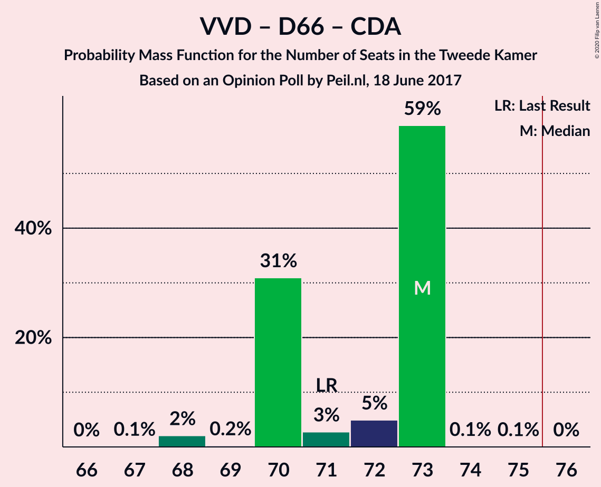

| Number of Seats | Probability | Accumulated | Special Marks |
|:---------------:|:-----------:|:-----------:|:-------------:|
| 69 | 0% | 100% |  |
| 70 | 0.4% | 99.9% |  |
| 71 | 0.4% | 99.5% | Last Result |
| 72 | 0.2% | 99.1% |  |
| 73 | 99.0% | 99.0% | Median |
| 74 | 0% | 0% |  |

### Volkspartij voor Vrijheid en Democratie – Partij voor de Vrijheid – Christen-Democratisch Appèl

| Number of Seats | Probability | Accumulated | Special Marks |
|:---------------:|:-----------:|:-----------:|:-------------:|
| 69 | 0.5% | 100% |  |
| 70 | 0% | 99.5% |  |
| 71 | 0.1% | 99.4% |  |
| 72 | 98% | 99.4% | Last Result, Median |
| 73 | 0.1% | 1.3% |  |
| 74 | 0.1% | 1.2% |  |
| 75 | 0.8% | 1.0% |  |
| 76 | 0.3% | 0.3% | Majority |
| 77 | 0% | 0% |  |

### Democraten 66 – Christen-Democratisch Appèl – GroenLinks – Partij van de Arbeid – ChristenUnie

| Number of Seats | Probability | Accumulated | Special Marks |
|:---------------:|:-----------:|:-----------:|:-------------:|
| 63 | 0.2% | 100% |  |
| 64 | 0.3% | 99.8% |  |
| 65 | 0% | 99.5% |  |
| 66 | 0.4% | 99.5% | Last Result |
| 67 | 4% | 99.1% |  |
| 68 | 95% | 95% | Median |
| 69 | 0% | 0% |  |

### Volkspartij voor Vrijheid en Democratie – Democraten 66 – Partij van de Arbeid

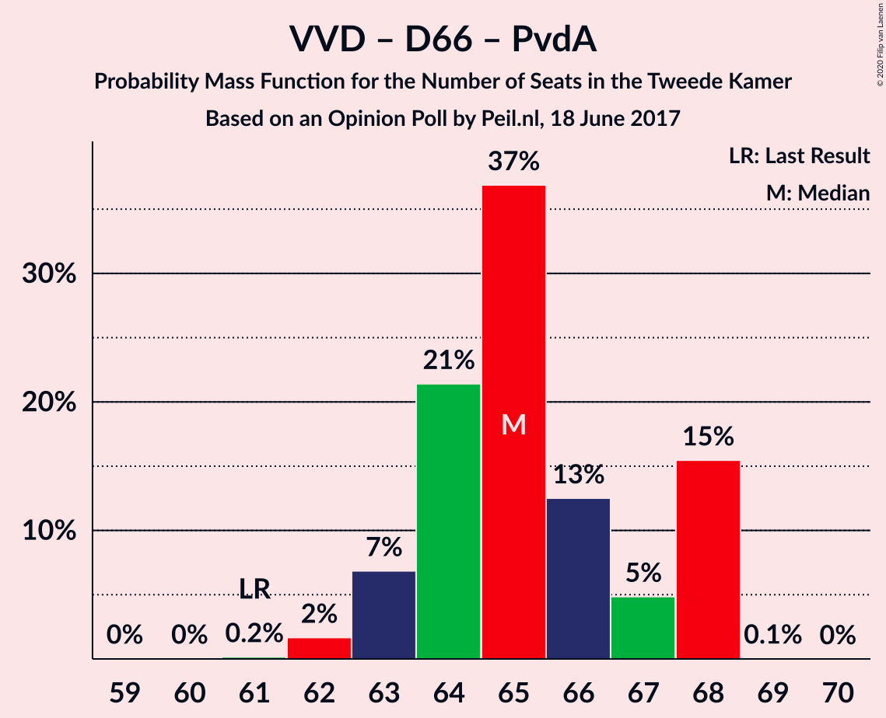

| Number of Seats | Probability | Accumulated | Special Marks |
|:---------------:|:-----------:|:-----------:|:-------------:|
| 61 | 0% | 100% | Last Result |
| 62 | 0% | 100% |  |
| 63 | 0.2% | 100% |  |
| 64 | 0.3% | 99.7% |  |
| 65 | 95% | 99.4% | Median |
| 66 | 0.9% | 4% |  |
| 67 | 3% | 3% |  |
| 68 | 0% | 0% |  |

### Volkspartij voor Vrijheid en Democratie – Christen-Democratisch Appèl – Partij van de Arbeid

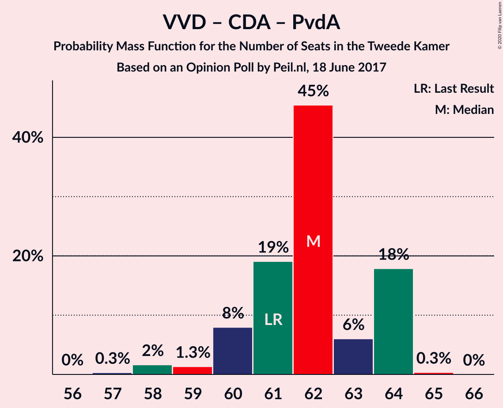

| Number of Seats | Probability | Accumulated | Special Marks |
|:---------------:|:-----------:|:-----------:|:-------------:|
| 57 | 0.2% | 100% |  |
| 58 | 0.2% | 99.8% |  |
| 59 | 0.3% | 99.6% |  |
| 60 | 0.1% | 99.3% |  |
| 61 | 0% | 99.2% | Last Result |
| 62 | 95% | 99.2% | Median |
| 63 | 3% | 4% |  |
| 64 | 0.3% | 1.0% |  |
| 65 | 0.8% | 0.8% |  |
| 66 | 0% | 0% |  |

### Volkspartij voor Vrijheid en Democratie – Christen-Democratisch Appèl – Forum voor Democratie – 50Plus – Staatkundig Gereformeerde Partij

| Number of Seats | Probability | Accumulated | Special Marks |
|:---------------:|:-----------:|:-----------:|:-------------:|
| 58 | 0.2% | 100% |  |
| 59 | 0.6% | 99.8% |  |
| 60 | 0% | 99.3% |  |
| 61 | 0% | 99.2% | Last Result |
| 62 | 98% | 99.2% | Median |
| 63 | 0% | 0.8% |  |
| 64 | 0.8% | 0.8% |  |
| 65 | 0% | 0% |  |

### Volkspartij voor Vrijheid en Democratie – Christen-Democratisch Appèl – Forum voor Democratie – Staatkundig Gereformeerde Partij

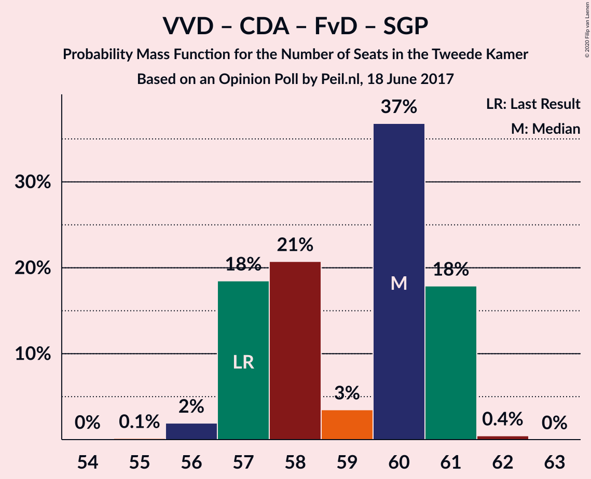

| Number of Seats | Probability | Accumulated | Special Marks |
|:---------------:|:-----------:|:-----------:|:-------------:|
| 56 | 0.5% | 100% |  |
| 57 | 0.3% | 99.5% | Last Result |
| 58 | 0.1% | 99.2% |  |
| 59 | 3% | 99.1% |  |
| 60 | 95% | 96% | Median |
| 61 | 0.1% | 0.8% |  |
| 62 | 0.8% | 0.8% |  |
| 63 | 0% | 0% |  |

### Volkspartij voor Vrijheid en Democratie – Christen-Democratisch Appèl – Forum voor Democratie – 50Plus

| Number of Seats | Probability | Accumulated | Special Marks |
|:---------------:|:-----------:|:-----------:|:-------------:|
| 55 | 0.4% | 100% |  |
| 56 | 0.3% | 99.6% |  |
| 57 | 0% | 99.3% |  |
| 58 | 0% | 99.2% | Last Result |
| 59 | 98% | 99.2% | Median |
| 60 | 0.1% | 0.9% |  |
| 61 | 0.8% | 0.8% |  |
| 62 | 0% | 0% |  |

### Volkspartij voor Vrijheid en Democratie – Christen-Democratisch Appèl – Forum voor Democratie

| Number of Seats | Probability | Accumulated | Special Marks |
|:---------------:|:-----------:|:-----------:|:-------------:|
| 53 | 0.7% | 100% |  |
| 54 | 0% | 99.3% | Last Result |
| 55 | 0.1% | 99.3% |  |
| 56 | 3% | 99.2% |  |
| 57 | 95% | 96% | Median |
| 58 | 0% | 0.8% |  |
| 59 | 0.8% | 0.8% |  |
| 60 | 0% | 0% |  |

### Volkspartij voor Vrijheid en Democratie – Christen-Democratisch Appèl

| Number of Seats | Probability | Accumulated | Special Marks |
|:---------------:|:-----------:|:-----------:|:-------------:|
| 49 | 0.7% | 100% |  |
| 50 | 0% | 99.3% |  |
| 51 | 0.1% | 99.2% |  |
| 52 | 98% | 99.1% | Last Result, Median |
| 53 | 0.3% | 1.1% |  |
| 54 | 0.8% | 0.8% |  |
| 55 | 0% | 0% |  |

### Democraten 66 – Christen-Democratisch Appèl – Partij van de Arbeid

| Number of Seats | Probability | Accumulated | Special Marks |
|:---------------:|:-----------:|:-----------:|:-------------:|
| 44 | 0.4% | 100% |  |
| 45 | 0.1% | 99.6% |  |
| 46 | 0.1% | 99.5% |  |
| 47 | 0% | 99.4% | Last Result |
| 48 | 1.0% | 99.3% |  |
| 49 | 98% | 98% | Median |
| 50 | 0% | 0% |  |

### Volkspartij voor Vrijheid en Democratie – Partij van de Arbeid

| Number of Seats | Probability | Accumulated | Special Marks |
|:---------------:|:-----------:|:-----------:|:-------------:|
| 42 | 0.5% | 100% | Last Result |
| 43 | 0% | 99.4% |  |
| 44 | 95% | 99.4% | Median |
| 45 | 0.1% | 4% |  |
| 46 | 3% | 4% |  |
| 47 | 1.0% | 1.0% |  |
| 48 | 0% | 0% |  |

### Democraten 66 – Christen-Democratisch Appèl

| Number of Seats | Probability | Accumulated | Special Marks |
|:---------------:|:-----------:|:-----------:|:-------------:|
| 35 | 0.2% | 100% |  |
| 36 | 0.4% | 99.7% |  |
| 37 | 1.1% | 99.4% |  |
| 38 | 3% | 98% | Last Result |
| 39 | 95% | 95% | Median |
| 40 | 0% | 0% |  |

### Christen-Democratisch Appèl – Partij van de Arbeid – ChristenUnie

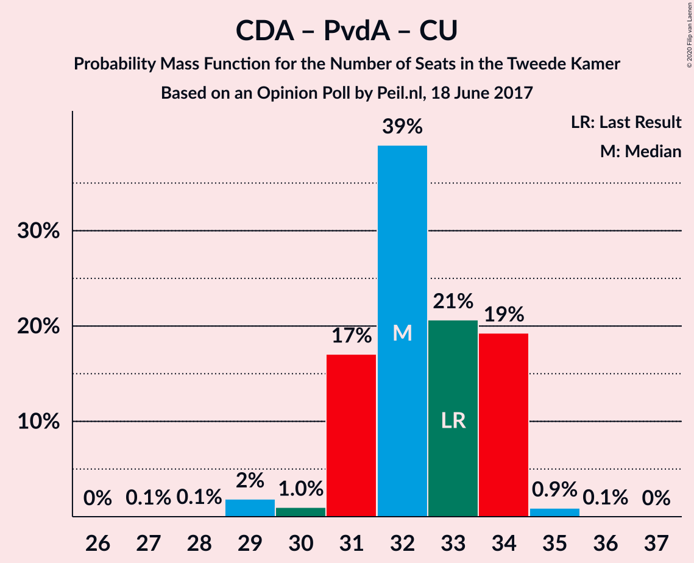

| Number of Seats | Probability | Accumulated | Special Marks |
|:---------------:|:-----------:|:-----------:|:-------------:|
| 27 | 0.2% | 100% |  |
| 28 | 0.2% | 99.8% |  |
| 29 | 0.1% | 99.6% |  |
| 30 | 0.1% | 99.5% |  |
| 31 | 0.1% | 99.4% |  |
| 32 | 95% | 99.3% | Median |
| 33 | 1.3% | 4% | Last Result |
| 34 | 3% | 3% |  |
| 35 | 0% | 0% |  |

### Christen-Democratisch Appèl – Partij van de Arbeid

| Number of Seats | Probability | Accumulated | Special Marks |
|:---------------:|:-----------:|:-----------:|:-------------:|
| 23 | 0.4% | 100% |  |
| 24 | 0% | 99.6% |  |
| 25 | 0.1% | 99.6% |  |
| 26 | 0.2% | 99.5% |  |
| 27 | 0.3% | 99.3% |  |
| 28 | 98% | 99.0% | Last Result, Median |
| 29 | 0.8% | 0.8% |  |
| 30 | 0% | 0% |  |

## Technical Information

### Opinion Poll

+ **Polling firm:** Peil.nl
+ **Commissioner(s):** —
+ **Fieldwork period:** 18 June 2017

### Calculations

+ **Sample size:** 3000
+ **Simulations done:** 131,072
+ **Error estimate:** 1.40%

