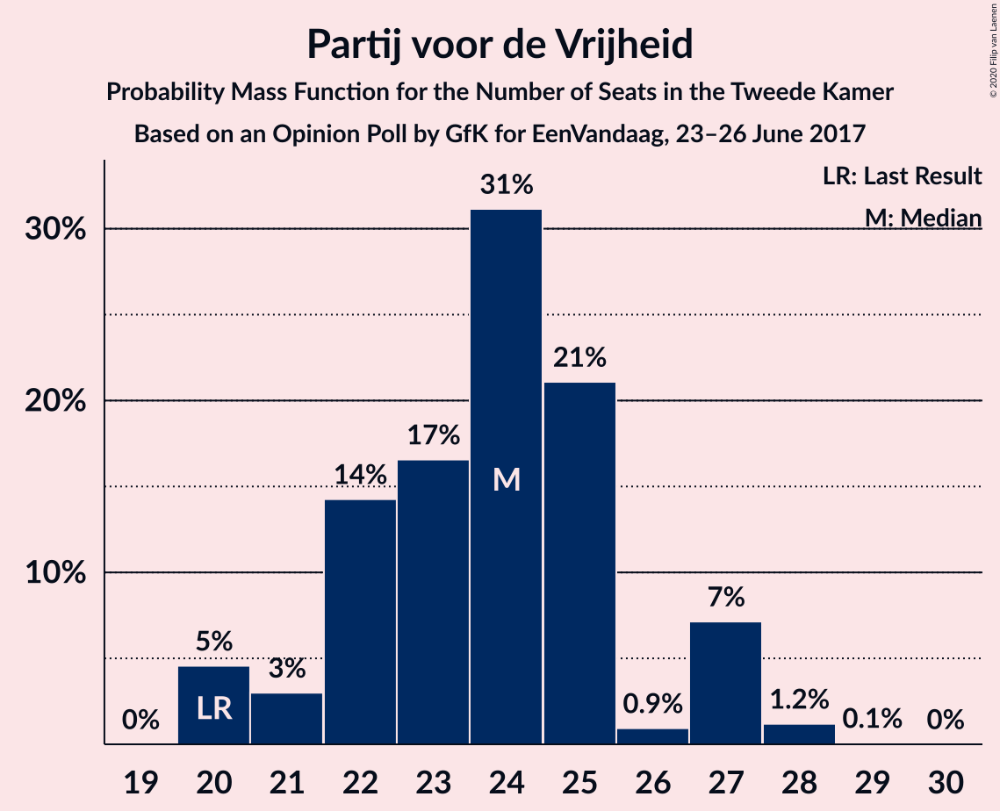
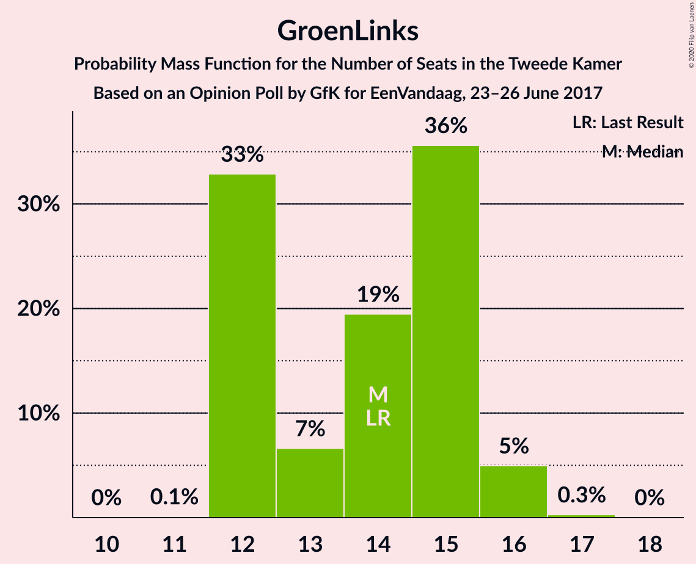
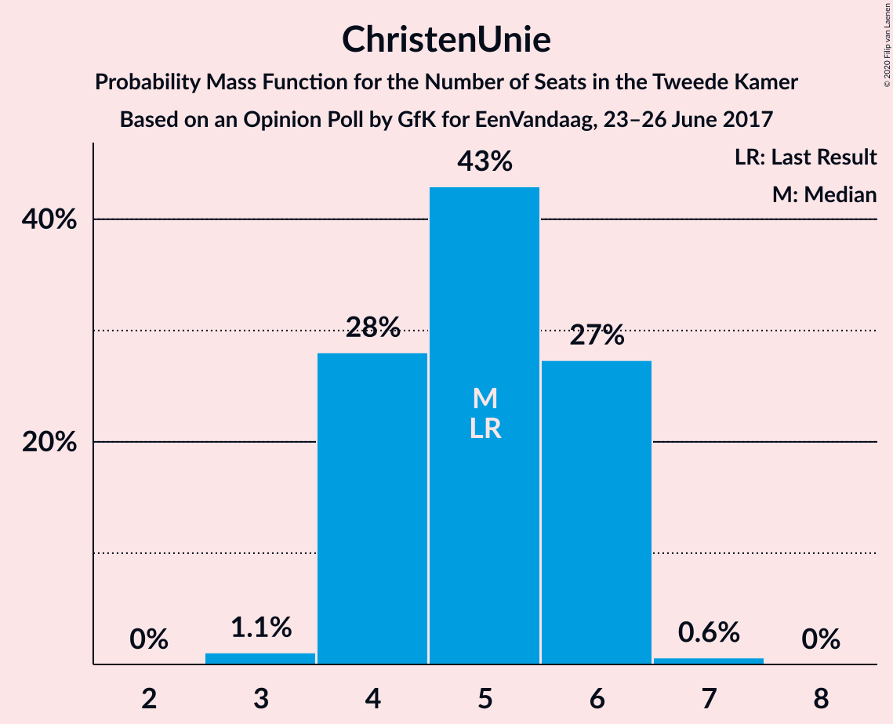
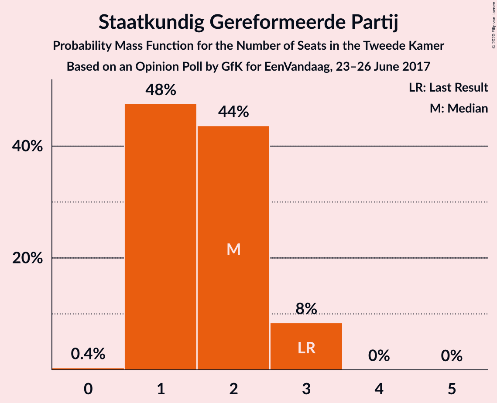
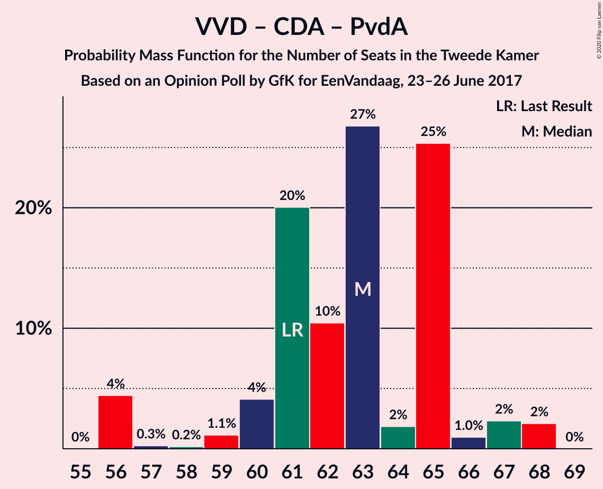
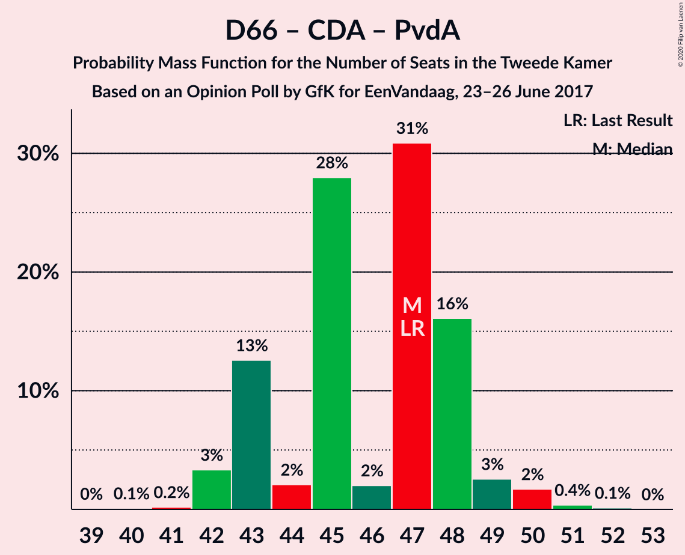

# Opinion Poll by GfK for EenVandaag, 23–26 June 2017

<a href="#voting-intentions">Voting Intentions</a> | <a href="#seats">Seats</a> | <a href="#coalitions">Coalitions</a> | <a href="#technical-information">Technical Information</a>

## Voting Intentions

### Confidence Intervals

| Party | Last Result | Poll Result | 80% Confidence Interval | 90% Confidence Interval | 95% Confidence Interval | 99% Confidence Interval |
|:-----:|:-----------:|:-----------:|:-----------------------:|:-----------------------:|:-----------------------:|:-----------------------:|
| Volkspartij voor Vrijheid en Democratie | 21.3% | 22.7% | 21.5–24.0% |21.1–24.3% |20.8–24.7% |20.2–25.3% |
| Partij voor de Vrijheid | 13.1% | 16.0% | 14.9–17.1% |14.6–17.5% |14.4–17.7% |13.9–18.3% |
| Democraten 66 | 12.2% | 12.0% | 11.1–13.0% |10.8–13.3% |10.6–13.6% |10.2–14.1% |
| Christen-Democratisch Appèl | 12.4% | 11.3% | 10.4–12.3% |10.2–12.6% |10.0–12.9% |9.5–13.4% |
| GroenLinks | 9.1% | 9.3% | 8.5–10.3% |8.3–10.5% |8.1–10.7% |7.7–11.2% |
| Socialistische Partij | 9.1% | 8.0% | 7.3–8.9% |7.0–9.1% |6.9–9.4% |6.5–9.8% |
| Partij van de Arbeid | 5.7% | 6.7% | 6.0–7.5% |5.8–7.7% |5.6–7.9% |5.3–8.3% |
| ChristenUnie | 3.4% | 3.3% | 2.8–3.9% |2.7–4.1% |2.6–4.3% |2.4–4.6% |
| 50Plus | 3.1% | 3.3% | 2.8–3.9% |2.7–4.1% |2.6–4.3% |2.4–4.6% |
| Partij voor de Dieren | 3.2% | 2.7% | 2.2–3.2% |2.1–3.4% |2.0–3.5% |1.8–3.8% |
| Forum voor Democratie | 1.8% | 2.0% | 1.6–2.5% |1.6–2.7% |1.5–2.8% |1.3–3.0% |
| Staatkundig Gereformeerde Partij | 2.1% | 1.3% | 1.0–1.7% |0.9–1.8% |0.9–2.0% |0.8–2.2% |
| DENK | 2.1% | 1.3% | 1.0–1.7% |0.9–1.8% |0.9–2.0% |0.8–2.2% |

*Note:* The poll result column reflects the actual value used in the calculations. Published results may vary slightly, and in addition be rounded to fewer digits.

## Seats

### Confidence Intervals

| Party | Last Result | Median | 80% Confidence Interval | 90% Confidence Interval | 95% Confidence Interval | 99% Confidence Interval |
|:-----:|:-----------:|:------:|:-----------------------:|:-----------------------:|:-----------------------:|:-----------------------:|
| <a href="#volkspartij-voor-vrijheid-en-democratie">Volkspartij voor Vrijheid en Democratie</a> | 33 | 33 | 32–35 |32–35 |32–35 |32–37 |
| <a href="#partij-voor-de-vrijheid">Partij voor de Vrijheid</a> | 20 | 23 | 20–27 |20–27 |20–27 |20–27 |
| <a href="#democraten-66">Democraten 66</a> | 19 | 18 | 17–19 |17–19 |17–19 |17–21 |
| <a href="#christen-democratisch-appèl">Christen-Democratisch Appèl</a> | 19 | 18 | 15–19 |15–20 |15–20 |15–20 |
| <a href="#groenlinks">GroenLinks</a> | 14 | 14 | 14–16 |14–16 |14–16 |13–16 |
| <a href="#socialistische-partij">Socialistische Partij</a> | 14 | 12 | 12–13 |12–13 |11–13 |10–13 |
| <a href="#partij-van-de-arbeid">Partij van de Arbeid</a> | 9 | 10 | 9–12 |9–12 |9–12 |8–12 |
| <a href="#christenunie">ChristenUnie</a> | 5 | 5 | 5–6 |5–6 |5–6 |4–7 |
| <a href="#50plus">50Plus</a> | 4 | 6 | 5–7 |5–7 |5–7 |4–7 |
| <a href="#partij-voor-de-dieren">Partij voor de Dieren</a> | 5 | 3 | 3–4 |3–4 |3–4 |2–5 |
| <a href="#forum-voor-democratie">Forum voor Democratie</a> | 2 | 3 | 3 |3 |3 |2–3 |
| <a href="#staatkundig-gereformeerde-partij">Staatkundig Gereformeerde Partij</a> | 3 | 1 | 1–2 |1–2 |1–2 |1–2 |
| <a href="#denk">DENK</a> | 3 | 1 | 1–2 |1–2 |1–2 |1–3 |

### Volkspartij voor Vrijheid en Democratie

*For a full overview of the results for this party, see the [Volkspartij voor Vrijheid en Democratie](party-volkspartijvoorvrijheidendemocratie.html) page.*

| Number of Seats | Probability | Accumulated | Special Marks |
|:---------------:|:-----------:|:-----------:|:-------------:|
| 31 | 0.1% | 100% |  |
| 32 | 42% | 99.8% |  |
| 33 | 10% | 58% | Last Result, Median |
| 34 | 0.6% | 48% |  |
| 35 | 45% | 47% |  |
| 36 | 1.2% | 2% |  |
| 37 | 0.4% | 0.9% |  |
| 38 | 0.3% | 0.4% |  |
| 39 | 0% | 0.1% |  |
| 40 | 0% | 0% |  |

### Partij voor de Vrijheid

*For a full overview of the results for this party, see the [Partij voor de Vrijheid](party-partijvoordevrijheid.html) page.*

| Number of Seats | Probability | Accumulated | Special Marks |
|:---------------:|:-----------:|:-----------:|:-------------:|
| 20 | 45% | 100% | Last Result |
| 21 | 0.1% | 55% |  |
| 22 | 0.8% | 55% |  |
| 23 | 10% | 54% | Median |
| 24 | 0.9% | 44% |  |
| 25 | 0.3% | 43% |  |
| 26 | 0.3% | 43% |  |
| 27 | 42% | 43% |  |
| 28 | 0% | 0.1% |  |
| 29 | 0.1% | 0.1% |  |
| 30 | 0% | 0% |  |

### Democraten 66

*For a full overview of the results for this party, see the [Democraten 66](party-democraten66.html) page.*

| Number of Seats | Probability | Accumulated | Special Marks |
|:---------------:|:-----------:|:-----------:|:-------------:|
| 15 | 0.2% | 100% |  |
| 16 | 0.2% | 99.8% |  |
| 17 | 46% | 99.6% |  |
| 18 | 10% | 54% | Median |
| 19 | 43% | 44% | Last Result |
| 20 | 0.1% | 0.9% |  |
| 21 | 0.4% | 0.8% |  |
| 22 | 0.1% | 0.3% |  |
| 23 | 0.2% | 0.2% |  |
| 24 | 0% | 0% |  |

### Christen-Democratisch Appèl

*For a full overview of the results for this party, see the [Christen-Democratisch Appèl](party-christen-democratischappèl.html) page.*

| Number of Seats | Probability | Accumulated | Special Marks |
|:---------------:|:-----------:|:-----------:|:-------------:|
| 14 | 0.5% | 100% |  |
| 15 | 43% | 99.5% |  |
| 16 | 1.3% | 57% |  |
| 17 | 0.4% | 56% |  |
| 18 | 45% | 55% | Median |
| 19 | 0.4% | 10% | Last Result |
| 20 | 10% | 10% |  |
| 21 | 0% | 0% |  |

### GroenLinks

*For a full overview of the results for this party, see the [GroenLinks](party-groenlinks.html) page.*

| Number of Seats | Probability | Accumulated | Special Marks |
|:---------------:|:-----------:|:-----------:|:-------------:|
| 12 | 0.1% | 100% |  |
| 13 | 0.5% | 99.9% |  |
| 14 | 56% | 99.4% | Last Result, Median |
| 15 | 0.6% | 43% |  |
| 16 | 43% | 43% |  |
| 17 | 0.3% | 0.3% |  |
| 18 | 0% | 0% |  |

### Socialistische Partij

*For a full overview of the results for this party, see the [Socialistische Partij](party-socialistischepartij.html) page.*

| Number of Seats | Probability | Accumulated | Special Marks |
|:---------------:|:-----------:|:-----------:|:-------------:|
| 9 | 0.3% | 100% |  |
| 10 | 0.4% | 99.7% |  |
| 11 | 2% | 99.2% |  |
| 12 | 54% | 97% | Median |
| 13 | 42% | 43% |  |
| 14 | 0.2% | 0.5% | Last Result |
| 15 | 0.3% | 0.3% |  |
| 16 | 0% | 0% |  |

### Partij van de Arbeid

*For a full overview of the results for this party, see the [Partij van de Arbeid](party-partijvandearbeid.html) page.*

| Number of Seats | Probability | Accumulated | Special Marks |
|:---------------:|:-----------:|:-----------:|:-------------:|
| 8 | 1.5% | 100% |  |
| 9 | 43% | 98% | Last Result |
| 10 | 10% | 56% | Median |
| 11 | 0.1% | 45% |  |
| 12 | 45% | 45% |  |
| 13 | 0.3% | 0.3% |  |
| 14 | 0% | 0% |  |

### ChristenUnie

*For a full overview of the results for this party, see the [ChristenUnie](party-christenunie.html) page.*

| Number of Seats | Probability | Accumulated | Special Marks |
|:---------------:|:-----------:|:-----------:|:-------------:|
| 3 | 0.2% | 100% |  |
| 4 | 0.8% | 99.8% |  |
| 5 | 88% | 99.0% | Last Result, Median |
| 6 | 11% | 11% |  |
| 7 | 0.9% | 0.9% |  |
| 8 | 0% | 0% |  |

### 50Plus

*For a full overview of the results for this party, see the [50Plus](party-50plus.html) page.*

| Number of Seats | Probability | Accumulated | Special Marks |
|:---------------:|:-----------:|:-----------:|:-------------:|
| 3 | 0.2% | 100% |  |
| 4 | 0.6% | 99.8% | Last Result |
| 5 | 43% | 99.2% |  |
| 6 | 11% | 56% | Median |
| 7 | 45% | 45% |  |
| 8 | 0% | 0% |  |

### Partij voor de Dieren

*For a full overview of the results for this party, see the [Partij voor de Dieren](party-partijvoordedieren.html) page.*

| Number of Seats | Probability | Accumulated | Special Marks |
|:---------------:|:-----------:|:-----------:|:-------------:|
| 2 | 0.6% | 100% |  |
| 3 | 53% | 99.4% | Median |
| 4 | 45% | 46% |  |
| 5 | 1.0% | 1.1% | Last Result |
| 6 | 0.1% | 0.1% |  |
| 7 | 0% | 0% |  |

### Forum voor Democratie

*For a full overview of the results for this party, see the [Forum voor Democratie](party-forumvoordemocratie.html) page.*

| Number of Seats | Probability | Accumulated | Special Marks |
|:---------------:|:-----------:|:-----------:|:-------------:|
| 1 | 0.2% | 100% |  |
| 2 | 2% | 99.8% | Last Result |
| 3 | 98% | 98% | Median |
| 4 | 0.2% | 0.2% |  |
| 5 | 0% | 0% |  |

### Staatkundig Gereformeerde Partij

*For a full overview of the results for this party, see the [Staatkundig Gereformeerde Partij](party-staatkundiggereformeerdepartij.html) page.*

| Number of Seats | Probability | Accumulated | Special Marks |
|:---------------:|:-----------:|:-----------:|:-------------:|
| 1 | 55% | 100% | Median |
| 2 | 45% | 45% |  |
| 3 | 0.3% | 0.3% | Last Result |
| 4 | 0% | 0% |  |

### DENK

*For a full overview of the results for this party, see the [DENK](party-denk.html) page.*

| Number of Seats | Probability | Accumulated | Special Marks |
|:---------------:|:-----------:|:-----------:|:-------------:|
| 1 | 53% | 100% | Median |
| 2 | 47% | 47% |  |
| 3 | 0.6% | 0.6% | Last Result |
| 4 | 0% | 0% |  |

## Coalitions

### Confidence Intervals

| Coalition | Last Result | Median | Majority? | 80% Confidence Interval | 90% Confidence Interval | 95% Confidence Interval | 99% Confidence Interval |
|:---------:|:-----------:|:------:|:---------:|:-----------------------:|:-----------------------:|:-----------------------:|:-----------------------:|
| Volkspartij voor Vrijheid en Democratie – Democraten 66 – Christen-Democratisch Appèl – GroenLinks – ChristenUnie | 90 | 89 | 100% | 87–91 | 87–91 | 87–91 | 86–93 |
| Volkspartij voor Vrijheid en Democratie – Democraten 66 – Christen-Democratisch Appèl – Partij van de Arbeid – ChristenUnie | 85 | 87 | 100% | 80–87 | 80–87 | 80–87 | 80–87 |
| Democraten 66 – Christen-Democratisch Appèl – GroenLinks – Socialistische Partij – Partij van de Arbeid – ChristenUnie | 80 | 78 | 98% | 77–78 | 77–80 | 77–80 | 73–80 |
| Volkspartij voor Vrijheid en Democratie – Partij voor de Vrijheid – Christen-Democratisch Appèl – Forum voor Democratie – Staatkundig Gereformeerde Partij | 77 | 79 | 99.9% | 77–80 | 77–80 | 77–80 | 77–84 |
| Volkspartij voor Vrijheid en Democratie – Partij voor de Vrijheid – Christen-Democratisch Appèl – Forum voor Democratie | 74 | 77 | 99.8% | 76–79 | 76–79 | 76–79 | 76–82 |
| Volkspartij voor Vrijheid en Democratie – Democraten 66 – Christen-Democratisch Appèl – ChristenUnie | 76 | 75 | 12% | 71–77 | 71–77 | 71–77 | 71–78 |
| Volkspartij voor Vrijheid en Democratie – Partij voor de Vrijheid – Christen-Democratisch Appèl | 72 | 74 | 11% | 73–76 | 73–76 | 73–76 | 73–79 |
| Volkspartij voor Vrijheid en Democratie – Democraten 66 – Christen-Democratisch Appèl | 71 | 70 | 0.3% | 66–71 | 66–71 | 66–71 | 66–74 |
| Democraten 66 – Christen-Democratisch Appèl – GroenLinks – Partij van de Arbeid – ChristenUnie | 66 | 66 | 0% | 64–67 | 64–68 | 64–68 | 62–68 |
| Volkspartij voor Vrijheid en Democratie – Christen-Democratisch Appèl – Partij van de Arbeid | 61 | 63 | 0% | 56–65 | 56–65 | 56–65 | 56–65 |
| Volkspartij voor Vrijheid en Democratie – Democraten 66 – Partij van de Arbeid | 61 | 61 | 0% | 60–64 | 60–64 | 60–64 | 60–67 |
| Volkspartij voor Vrijheid en Democratie – Christen-Democratisch Appèl – 50Plus – Forum voor Democratie – Staatkundig Gereformeerde Partij | 61 | 63 | 0% | 57–64 | 57–64 | 57–64 | 57–65 |
| Volkspartij voor Vrijheid en Democratie – Christen-Democratisch Appèl – 50Plus – Forum voor Democratie | 58 | 62 | 0% | 55–63 | 55–63 | 55–63 | 55–63 |
| Volkspartij voor Vrijheid en Democratie – Christen-Democratisch Appèl – Forum voor Democratie – Staatkundig Gereformeerde Partij | 57 | 57 | 0% | 52–57 | 52–57 | 52–57 | 52–59 |
| Volkspartij voor Vrijheid en Democratie – Christen-Democratisch Appèl – Forum voor Democratie | 54 | 56 | 0% | 50–56 | 50–56 | 50–56 | 50–57 |
| Volkspartij voor Vrijheid en Democratie – Christen-Democratisch Appèl | 52 | 53 | 0% | 47–53 | 47–53 | 47–53 | 47–55 |
| Democraten 66 – Christen-Democratisch Appèl – Partij van de Arbeid | 47 | 47 | 0% | 43–47 | 43–48 | 43–48 | 42–48 |
| Volkspartij voor Vrijheid en Democratie – Partij van de Arbeid | 42 | 43 | 0% | 41–47 | 41–47 | 41–47 | 41–48 |
| Democraten 66 – Christen-Democratisch Appèl | 38 | 35 | 0% | 34–38 | 34–38 | 34–38 | 31–38 |
| Christen-Democratisch Appèl – Partij van de Arbeid – ChristenUnie | 33 | 35 | 0% | 29–35 | 29–36 | 29–36 | 28–36 |
| Christen-Democratisch Appèl – Partij van de Arbeid | 28 | 30 | 0% | 24–30 | 24–30 | 24–30 | 23–30 |

### Volkspartij voor Vrijheid en Democratie – Democraten 66 – Christen-Democratisch Appèl – GroenLinks – ChristenUnie

| Number of Seats | Probability | Accumulated | Special Marks |
|:---------------:|:-----------:|:-----------:|:-------------:|
| 83 | 0% | 100% |  |
| 84 | 0% | 99.9% |  |
| 85 | 0.2% | 99.9% |  |
| 86 | 0.3% | 99.8% |  |
| 87 | 42% | 99.5% |  |
| 88 | 0.3% | 57% | Median |
| 89 | 45% | 57% |  |
| 90 | 0.3% | 12% | Last Result |
| 91 | 10% | 12% |  |
| 92 | 1.2% | 2% |  |
| 93 | 0% | 0.5% |  |
| 94 | 0.2% | 0.5% |  |
| 95 | 0.3% | 0.3% |  |
| 96 | 0% | 0% |  |

### Volkspartij voor Vrijheid en Democratie – Democraten 66 – Christen-Democratisch Appèl – Partij van de Arbeid – ChristenUnie

| Number of Seats | Probability | Accumulated | Special Marks |
|:---------------:|:-----------:|:-----------:|:-------------:|
| 80 | 42% | 100% |  |
| 81 | 0.5% | 58% |  |
| 82 | 0.2% | 57% |  |
| 83 | 0.2% | 57% |  |
| 84 | 0.1% | 57% | Median |
| 85 | 0.3% | 57% | Last Result |
| 86 | 1.4% | 56% |  |
| 87 | 55% | 55% |  |
| 88 | 0.1% | 0.4% |  |
| 89 | 0% | 0.3% |  |
| 90 | 0% | 0.3% |  |
| 91 | 0.2% | 0.3% |  |
| 92 | 0% | 0% |  |

### Democraten 66 – Christen-Democratisch Appèl – GroenLinks – Socialistische Partij – Partij van de Arbeid – ChristenUnie

| Number of Seats | Probability | Accumulated | Special Marks |
|:---------------:|:-----------:|:-----------:|:-------------:|
| 71 | 0.1% | 100% |  |
| 72 | 0.2% | 99.9% |  |
| 73 | 0.4% | 99.7% |  |
| 74 | 0.2% | 99.3% |  |
| 75 | 1.3% | 99.1% |  |
| 76 | 0.2% | 98% | Majority |
| 77 | 43% | 98% | Median |
| 78 | 45% | 55% |  |
| 79 | 0.1% | 10% |  |
| 80 | 10% | 10% | Last Result |
| 81 | 0.1% | 0.1% |  |
| 82 | 0% | 0% |  |

### Volkspartij voor Vrijheid en Democratie – Partij voor de Vrijheid – Christen-Democratisch Appèl – Forum voor Democratie – Staatkundig Gereformeerde Partij

| Number of Seats | Probability | Accumulated | Special Marks |
|:---------------:|:-----------:|:-----------:|:-------------:|
| 74 | 0.1% | 100% |  |
| 75 | 0% | 99.9% |  |
| 76 | 0% | 99.9% | Majority |
| 77 | 45% | 99.9% | Last Result |
| 78 | 1.1% | 55% | Median |
| 79 | 43% | 54% |  |
| 80 | 10% | 11% |  |
| 81 | 0.1% | 1.4% |  |
| 82 | 0.3% | 1.3% |  |
| 83 | 0.2% | 1.0% |  |
| 84 | 0.6% | 0.8% |  |
| 85 | 0.2% | 0.2% |  |
| 86 | 0% | 0% |  |

### Volkspartij voor Vrijheid en Democratie – Partij voor de Vrijheid – Christen-Democratisch Appèl – Forum voor Democratie

| Number of Seats | Probability | Accumulated | Special Marks |
|:---------------:|:-----------:|:-----------:|:-------------:|
| 72 | 0.1% | 100% |  |
| 73 | 0% | 99.9% |  |
| 74 | 0% | 99.9% | Last Result |
| 75 | 0.1% | 99.9% |  |
| 76 | 46% | 99.8% | Majority |
| 77 | 42% | 54% | Median |
| 78 | 0.4% | 11% |  |
| 79 | 10% | 11% |  |
| 80 | 0.1% | 1.2% |  |
| 81 | 0.2% | 1.1% |  |
| 82 | 0.4% | 0.9% |  |
| 83 | 0.4% | 0.5% |  |
| 84 | 0.1% | 0.1% |  |
| 85 | 0% | 0% |  |

### Volkspartij voor Vrijheid en Democratie – Democraten 66 – Christen-Democratisch Appèl – ChristenUnie

| Number of Seats | Probability | Accumulated | Special Marks |
|:---------------:|:-----------:|:-----------:|:-------------:|
| 70 | 0% | 100% |  |
| 71 | 42% | 99.9% |  |
| 72 | 0.2% | 58% |  |
| 73 | 0.6% | 57% |  |
| 74 | 0.1% | 57% | Median |
| 75 | 45% | 57% |  |
| 76 | 0.2% | 12% | Last Result, Majority |
| 77 | 10% | 12% |  |
| 78 | 1.1% | 1.4% |  |
| 79 | 0% | 0.3% |  |
| 80 | 0% | 0.3% |  |
| 81 | 0.2% | 0.3% |  |
| 82 | 0% | 0% |  |

### Volkspartij voor Vrijheid en Democratie – Partij voor de Vrijheid – Christen-Democratisch Appèl

| Number of Seats | Probability | Accumulated | Special Marks |
|:---------------:|:-----------:|:-----------:|:-------------:|
| 69 | 0.1% | 100% |  |
| 70 | 0% | 99.9% |  |
| 71 | 0% | 99.9% |  |
| 72 | 0.1% | 99.9% | Last Result |
| 73 | 45% | 99.8% |  |
| 74 | 43% | 55% | Median |
| 75 | 0.5% | 12% |  |
| 76 | 10% | 11% | Majority |
| 77 | 0.1% | 1.4% |  |
| 78 | 0.4% | 1.2% |  |
| 79 | 0.4% | 0.9% |  |
| 80 | 0.1% | 0.5% |  |
| 81 | 0.3% | 0.3% |  |
| 82 | 0.1% | 0.1% |  |
| 83 | 0% | 0% |  |

### Volkspartij voor Vrijheid en Democratie – Democraten 66 – Christen-Democratisch Appèl

| Number of Seats | Probability | Accumulated | Special Marks |
|:---------------:|:-----------:|:-----------:|:-------------:|
| 64 | 0.2% | 100% |  |
| 65 | 0% | 99.8% |  |
| 66 | 42% | 99.8% |  |
| 67 | 0.3% | 58% |  |
| 68 | 0.5% | 57% |  |
| 69 | 0.1% | 57% | Median |
| 70 | 45% | 57% |  |
| 71 | 11% | 12% | Last Result |
| 72 | 0% | 0.8% |  |
| 73 | 0.2% | 0.7% |  |
| 74 | 0.3% | 0.6% |  |
| 75 | 0% | 0.3% |  |
| 76 | 0% | 0.3% | Majority |
| 77 | 0.2% | 0.3% |  |
| 78 | 0% | 0% |  |

### Democraten 66 – Christen-Democratisch Appèl – GroenLinks – Partij van de Arbeid – ChristenUnie

| Number of Seats | Probability | Accumulated | Special Marks |
|:---------------:|:-----------:|:-----------:|:-------------:|
| 59 | 0.1% | 100% |  |
| 60 | 0.1% | 99.9% |  |
| 61 | 0.3% | 99.9% |  |
| 62 | 0.8% | 99.6% |  |
| 63 | 0% | 98.8% |  |
| 64 | 43% | 98.8% |  |
| 65 | 0.1% | 56% | Median |
| 66 | 45% | 56% | Last Result |
| 67 | 0.6% | 10% |  |
| 68 | 10% | 10% |  |
| 69 | 0% | 0.1% |  |
| 70 | 0% | 0% |  |

### Volkspartij voor Vrijheid en Democratie – Christen-Democratisch Appèl – Partij van de Arbeid

| Number of Seats | Probability | Accumulated | Special Marks |
|:---------------:|:-----------:|:-----------:|:-------------:|
| 54 | 0.1% | 100% |  |
| 55 | 0% | 99.9% |  |
| 56 | 42% | 99.9% |  |
| 57 | 0% | 58% |  |
| 58 | 0.2% | 58% |  |
| 59 | 0.8% | 58% |  |
| 60 | 0.8% | 57% |  |
| 61 | 0.4% | 56% | Last Result, Median |
| 62 | 0.1% | 56% |  |
| 63 | 10% | 55% |  |
| 64 | 0.7% | 46% |  |
| 65 | 45% | 45% |  |
| 66 | 0% | 0.3% |  |
| 67 | 0% | 0.3% |  |
| 68 | 0.3% | 0.3% |  |
| 69 | 0% | 0% |  |

### Volkspartij voor Vrijheid en Democratie – Democraten 66 – Partij van de Arbeid

| Number of Seats | Probability | Accumulated | Special Marks |
|:---------------:|:-----------:|:-----------:|:-------------:|
| 58 | 0.2% | 100% |  |
| 59 | 0.1% | 99.8% |  |
| 60 | 42% | 99.8% |  |
| 61 | 10% | 57% | Last Result, Median |
| 62 | 0.4% | 47% |  |
| 63 | 0.9% | 47% |  |
| 64 | 45% | 46% |  |
| 65 | 0.2% | 1.0% |  |
| 66 | 0.1% | 0.8% |  |
| 67 | 0.7% | 0.7% |  |
| 68 | 0% | 0.1% |  |
| 69 | 0% | 0% |  |

### Volkspartij voor Vrijheid en Democratie – Christen-Democratisch Appèl – 50Plus – Forum voor Democratie – Staatkundig Gereformeerde Partij

| Number of Seats | Probability | Accumulated | Special Marks |
|:---------------:|:-----------:|:-----------:|:-------------:|
| 56 | 0.1% | 100% |  |
| 57 | 42% | 99.9% |  |
| 58 | 0.5% | 58% |  |
| 59 | 0.3% | 57% |  |
| 60 | 0.4% | 57% |  |
| 61 | 0.4% | 57% | Last Result, Median |
| 62 | 1.1% | 56% |  |
| 63 | 10% | 55% |  |
| 64 | 45% | 45% |  |
| 65 | 0.4% | 0.7% |  |
| 66 | 0.1% | 0.3% |  |
| 67 | 0.2% | 0.2% |  |
| 68 | 0% | 0% |  |

### Volkspartij voor Vrijheid en Democratie – Christen-Democratisch Appèl – 50Plus – Forum voor Democratie

| Number of Seats | Probability | Accumulated | Special Marks |
|:---------------:|:-----------:|:-----------:|:-------------:|
| 54 | 0.1% | 100% |  |
| 55 | 42% | 99.9% |  |
| 56 | 0.3% | 58% |  |
| 57 | 0.3% | 57% |  |
| 58 | 0.7% | 57% | Last Result |
| 59 | 0.2% | 56% |  |
| 60 | 1.0% | 56% | Median |
| 61 | 0.2% | 55% |  |
| 62 | 10% | 55% |  |
| 63 | 45% | 45% |  |
| 64 | 0.1% | 0.4% |  |
| 65 | 0% | 0.2% |  |
| 66 | 0.2% | 0.2% |  |
| 67 | 0% | 0% |  |

### Volkspartij voor Vrijheid en Democratie – Christen-Democratisch Appèl – Forum voor Democratie – Staatkundig Gereformeerde Partij

| Number of Seats | Probability | Accumulated | Special Marks |
|:---------------:|:-----------:|:-----------:|:-------------:|
| 51 | 0.1% | 100% |  |
| 52 | 42% | 99.9% |  |
| 53 | 0.1% | 58% |  |
| 54 | 0.6% | 58% |  |
| 55 | 0.3% | 57% | Median |
| 56 | 1.4% | 57% |  |
| 57 | 54% | 55% | Last Result |
| 58 | 0.2% | 1.0% |  |
| 59 | 0.4% | 0.8% |  |
| 60 | 0.1% | 0.4% |  |
| 61 | 0.2% | 0.3% |  |
| 62 | 0% | 0% |  |

### Volkspartij voor Vrijheid en Democratie – Christen-Democratisch Appèl – Forum voor Democratie

| Number of Seats | Probability | Accumulated | Special Marks |
|:---------------:|:-----------:|:-----------:|:-------------:|
| 49 | 0.1% | 100% |  |
| 50 | 42% | 99.9% |  |
| 51 | 0.2% | 58% |  |
| 52 | 0.4% | 58% |  |
| 53 | 0.7% | 57% |  |
| 54 | 1.0% | 56% | Last Result, Median |
| 55 | 0.2% | 55% |  |
| 56 | 54% | 55% |  |
| 57 | 0.4% | 0.9% |  |
| 58 | 0.1% | 0.4% |  |
| 59 | 0% | 0.3% |  |
| 60 | 0.2% | 0.3% |  |
| 61 | 0% | 0% |  |

### Volkspartij voor Vrijheid en Democratie – Christen-Democratisch Appèl

| Number of Seats | Probability | Accumulated | Special Marks |
|:---------------:|:-----------:|:-----------:|:-------------:|
| 46 | 0.1% | 100% |  |
| 47 | 42% | 99.9% |  |
| 48 | 0% | 58% |  |
| 49 | 0.2% | 58% |  |
| 50 | 0.6% | 57% |  |
| 51 | 0.6% | 57% | Median |
| 52 | 1.0% | 56% | Last Result |
| 53 | 54% | 55% |  |
| 54 | 0.4% | 0.9% |  |
| 55 | 0.2% | 0.5% |  |
| 56 | 0.1% | 0.3% |  |
| 57 | 0% | 0.3% |  |
| 58 | 0.2% | 0.2% |  |
| 59 | 0% | 0% |  |

### Democraten 66 – Christen-Democratisch Appèl – Partij van de Arbeid

| Number of Seats | Probability | Accumulated | Special Marks |
|:---------------:|:-----------:|:-----------:|:-------------:|
| 39 | 0.2% | 100% |  |
| 40 | 0% | 99.8% |  |
| 41 | 0.2% | 99.7% |  |
| 42 | 0.3% | 99.6% |  |
| 43 | 43% | 99.3% |  |
| 44 | 0.3% | 56% |  |
| 45 | 0.4% | 56% |  |
| 46 | 0.9% | 56% | Median |
| 47 | 45% | 55% | Last Result |
| 48 | 10% | 10% |  |
| 49 | 0.2% | 0.3% |  |
| 50 | 0% | 0.1% |  |
| 51 | 0% | 0.1% |  |
| 52 | 0.1% | 0.1% |  |
| 53 | 0% | 0% |  |

### Volkspartij voor Vrijheid en Democratie – Partij van de Arbeid

| Number of Seats | Probability | Accumulated | Special Marks |
|:---------------:|:-----------:|:-----------:|:-------------:|
| 39 | 0.1% | 100% |  |
| 40 | 0% | 99.9% |  |
| 41 | 42% | 99.9% |  |
| 42 | 0.2% | 58% | Last Result |
| 43 | 10% | 58% | Median |
| 44 | 1.4% | 47% |  |
| 45 | 0.5% | 46% |  |
| 46 | 0.2% | 46% |  |
| 47 | 45% | 45% |  |
| 48 | 0.4% | 0.6% |  |
| 49 | 0% | 0.3% |  |
| 50 | 0.2% | 0.2% |  |
| 51 | 0% | 0% |  |

### Democraten 66 – Christen-Democratisch Appèl

| Number of Seats | Probability | Accumulated | Special Marks |
|:---------------:|:-----------:|:-----------:|:-------------:|
| 31 | 0.6% | 100% |  |
| 32 | 0.2% | 99.4% |  |
| 33 | 0.2% | 99.2% |  |
| 34 | 42% | 99.0% |  |
| 35 | 46% | 57% |  |
| 36 | 0.5% | 11% | Median |
| 37 | 0.6% | 11% |  |
| 38 | 10% | 10% | Last Result |
| 39 | 0.3% | 0.3% |  |
| 40 | 0% | 0% |  |

### Christen-Democratisch Appèl – Partij van de Arbeid – ChristenUnie

| Number of Seats | Probability | Accumulated | Special Marks |
|:---------------:|:-----------:|:-----------:|:-------------:|
| 27 | 0.2% | 100% |  |
| 28 | 0.3% | 99.8% |  |
| 29 | 42% | 99.4% |  |
| 30 | 0.2% | 57% |  |
| 31 | 2% | 57% |  |
| 32 | 0.2% | 55% |  |
| 33 | 0.3% | 55% | Last Result, Median |
| 34 | 0.3% | 55% |  |
| 35 | 45% | 55% |  |
| 36 | 10% | 10% |  |
| 37 | 0% | 0% |  |

### Christen-Democratisch Appèl – Partij van de Arbeid

| Number of Seats | Probability | Accumulated | Special Marks |
|:---------------:|:-----------:|:-----------:|:-------------:|
| 22 | 0.2% | 100% |  |
| 23 | 0.3% | 99.8% |  |
| 24 | 43% | 99.4% |  |
| 25 | 0.6% | 57% |  |
| 26 | 0.5% | 56% |  |
| 27 | 0.5% | 56% |  |
| 28 | 0.2% | 55% | Last Result, Median |
| 29 | 0.4% | 55% |  |
| 30 | 54% | 54% |  |
| 31 | 0% | 0.1% |  |
| 32 | 0% | 0% |  |

## Technical Information

### Opinion Poll

+ **Polling firm:** GfK
+ **Commissioner(s):** EenVandaag
+ **Fieldwork period:** 23–26 June 2017

### Calculations

+ **Sample size:** 1834
+ **Simulations done:** 131,072
+ **Error estimate:** 1.89%

