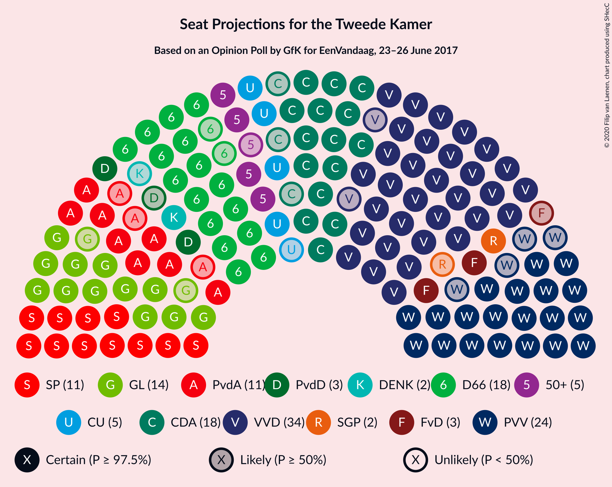
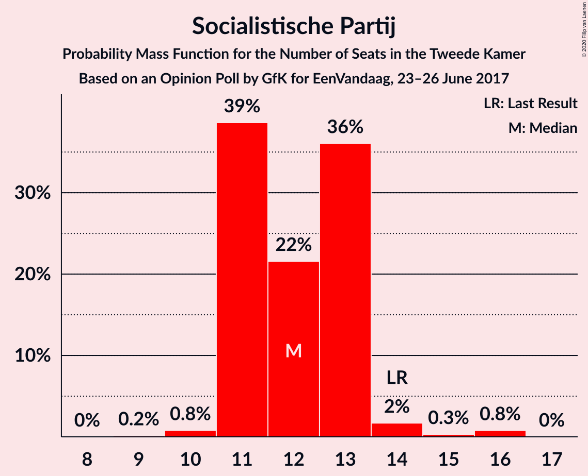
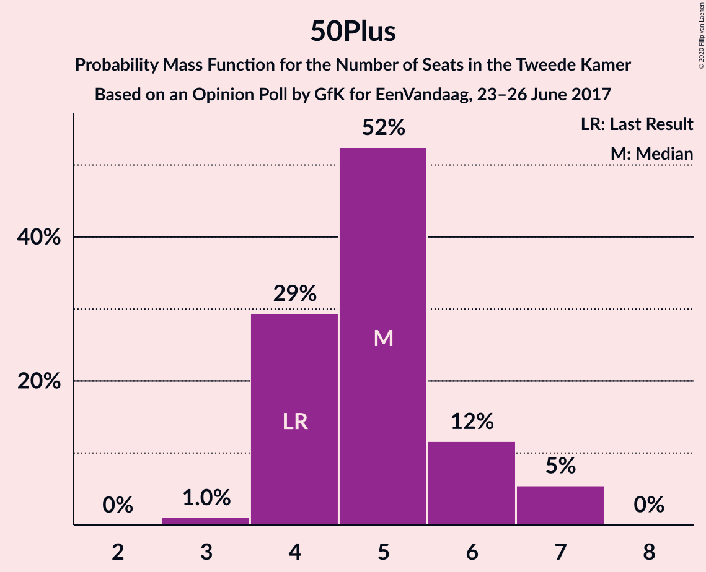
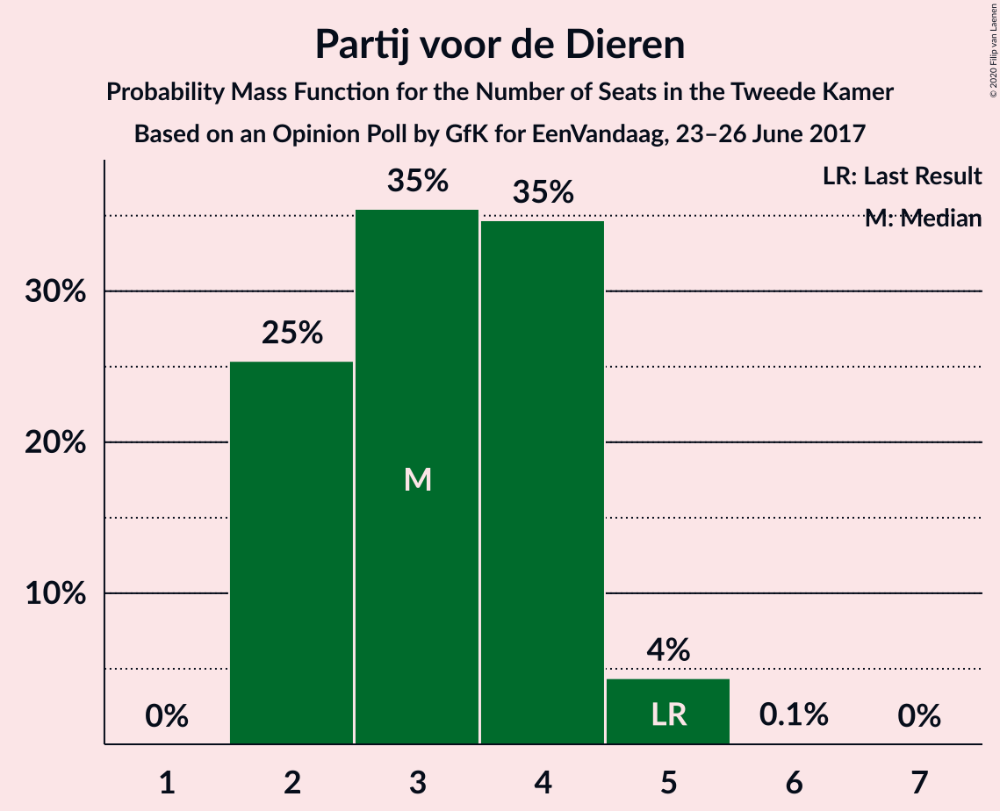
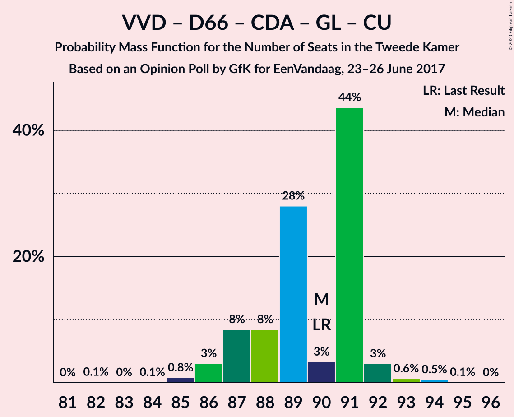
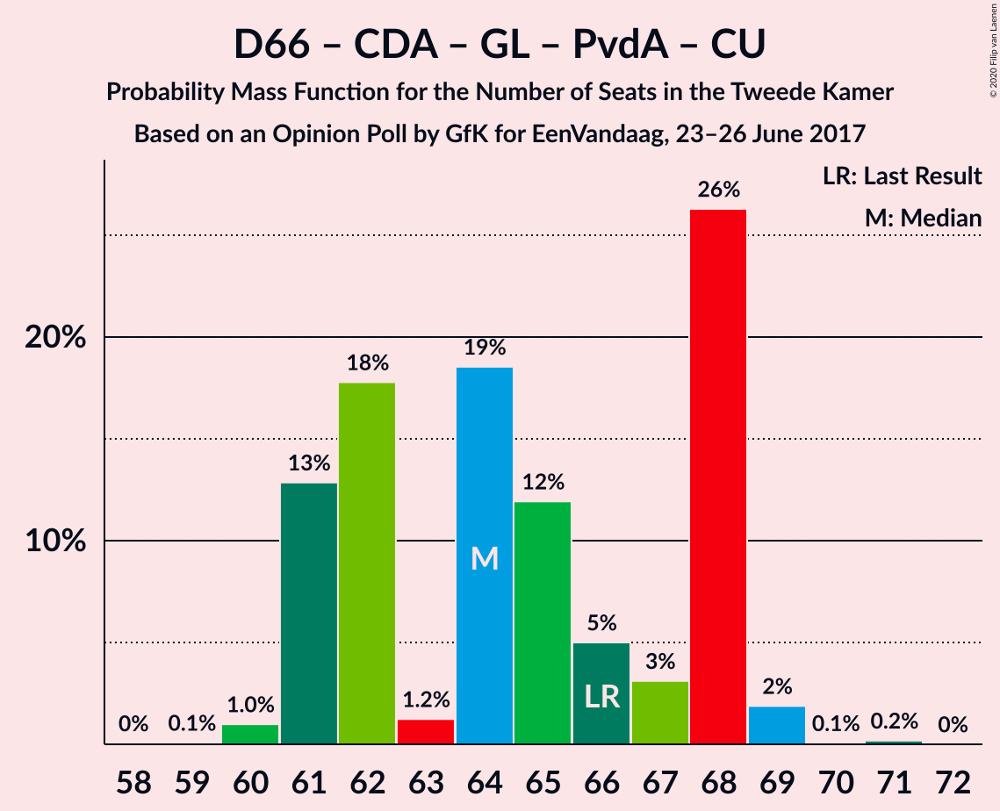
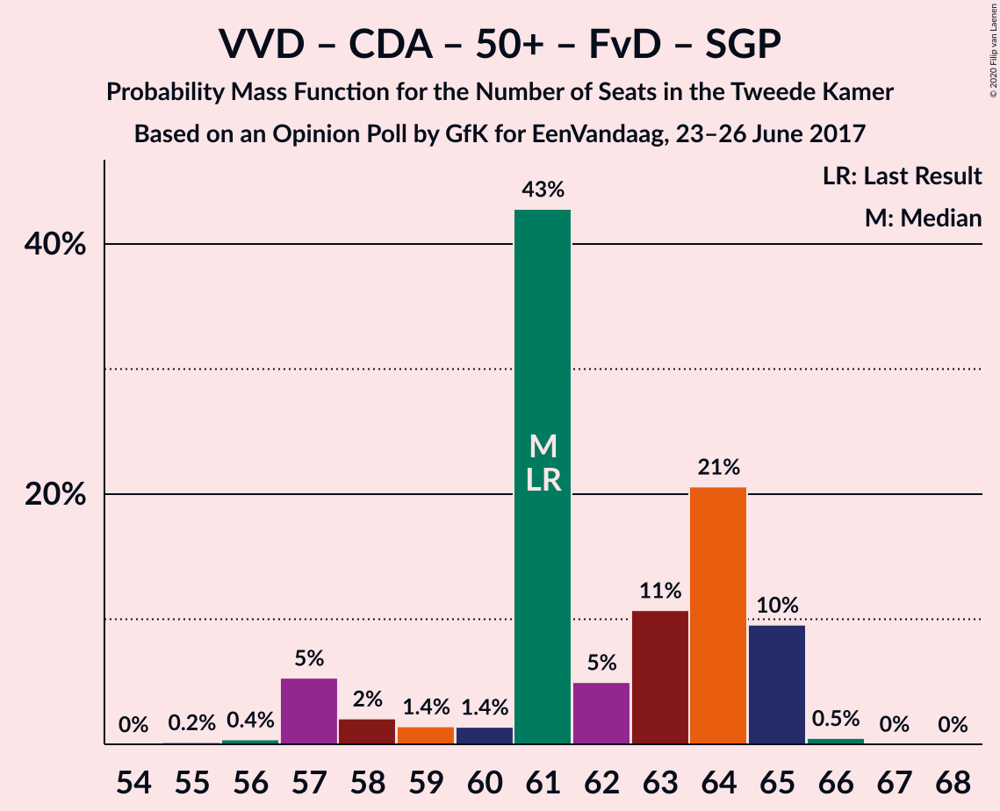
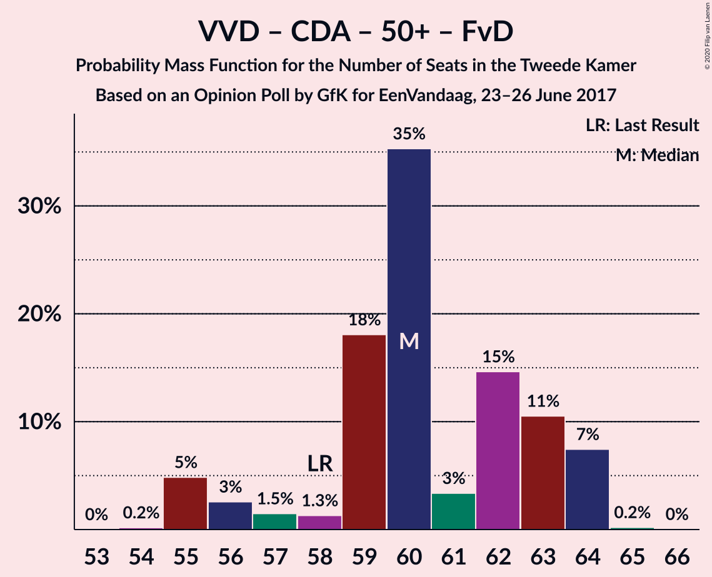
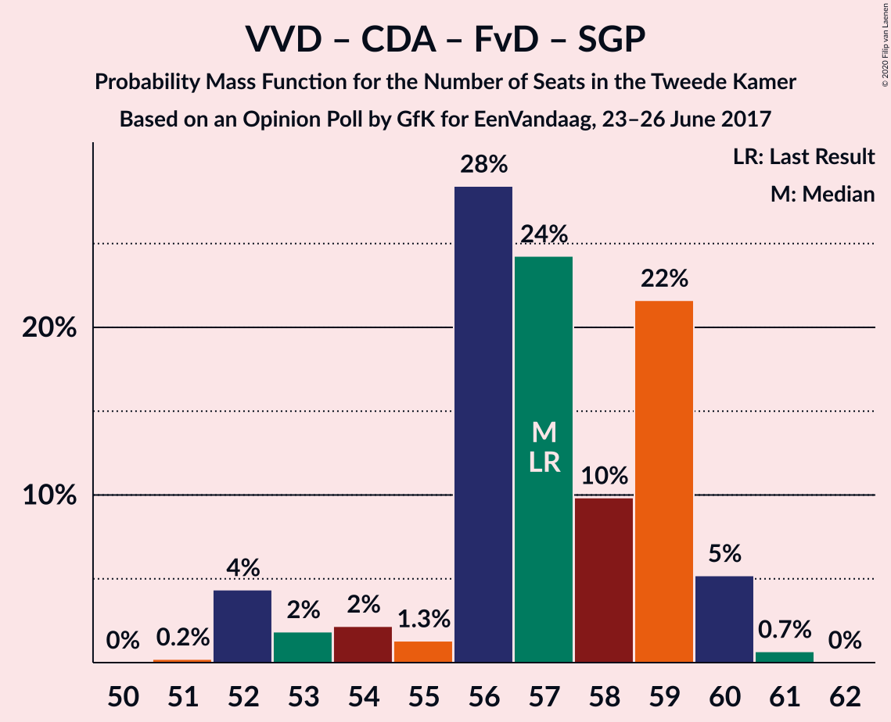
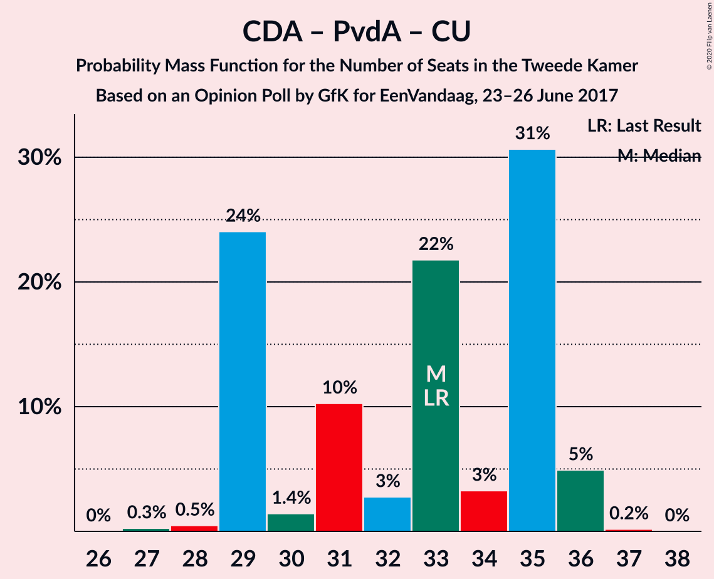

# Opinion Poll by GfK for EenVandaag, 23–26 June 2017

<a href="#voting-intentions">Voting Intentions</a> | <a href="#seats">Seats</a> | <a href="#coalitions">Coalitions</a> | <a href="#technical-information">Technical Information</a>

## Voting Intentions

### Confidence Intervals

| Party | Last Result | Poll Result | 80% Confidence Interval | 90% Confidence Interval | 95% Confidence Interval | 99% Confidence Interval |
|:-----:|:-----------:|:-----------:|:-----------------------:|:-----------------------:|:-----------------------:|:-----------------------:|
| Volkspartij voor Vrijheid en Democratie | 21.3% | 22.7% | 21.5–24.0% |21.1–24.3% |20.8–24.7% |20.2–25.3% |
| Partij voor de Vrijheid | 13.1% | 16.0% | 14.9–17.1% |14.6–17.5% |14.4–17.7% |13.9–18.3% |
| Democraten 66 | 12.2% | 12.0% | 11.1–13.0% |10.8–13.3% |10.6–13.6% |10.2–14.1% |
| Christen-Democratisch Appèl | 12.4% | 11.3% | 10.4–12.3% |10.2–12.6% |10.0–12.9% |9.5–13.4% |
| GroenLinks | 9.1% | 9.3% | 8.5–10.3% |8.3–10.5% |8.1–10.7% |7.7–11.2% |
| Socialistische Partij | 9.1% | 8.0% | 7.3–8.9% |7.0–9.1% |6.9–9.4% |6.5–9.8% |
| Partij van de Arbeid | 5.7% | 6.7% | 6.0–7.5% |5.8–7.7% |5.6–7.9% |5.3–8.3% |
| ChristenUnie | 3.4% | 3.3% | 2.8–3.9% |2.7–4.1% |2.6–4.3% |2.4–4.6% |
| 50Plus | 3.1% | 3.3% | 2.8–3.9% |2.7–4.1% |2.6–4.3% |2.4–4.6% |
| Partij voor de Dieren | 3.2% | 2.7% | 2.2–3.2% |2.1–3.4% |2.0–3.5% |1.8–3.8% |
| Forum voor Democratie | 1.8% | 2.0% | 1.6–2.5% |1.6–2.7% |1.5–2.8% |1.3–3.0% |
| Staatkundig Gereformeerde Partij | 2.1% | 1.3% | 1.0–1.7% |0.9–1.8% |0.9–2.0% |0.8–2.2% |
| DENK | 2.1% | 1.3% | 1.0–1.7% |0.9–1.8% |0.9–2.0% |0.8–2.2% |

*Note:* The poll result column reflects the actual value used in the calculations. Published results may vary slightly, and in addition be rounded to fewer digits.

## Seats

### Confidence Intervals

| Party | Last Result | Median | 80% Confidence Interval | 90% Confidence Interval | 95% Confidence Interval | 99% Confidence Interval |
|:-----:|:-----------:|:------:|:-----------------------:|:-----------------------:|:-----------------------:|:-----------------------:|
| <a href="#volkspartij-voor-vrijheid-en-democratie">Volkspartij voor Vrijheid en Democratie</a> | 33 | 35 | 33–37 |32–38 |32–38 |31–39 |
| <a href="#partij-voor-de-vrijheid">Partij voor de Vrijheid</a> | 20 | 24 | 22–25 |21–27 |20–27 |20–28 |
| <a href="#democraten-66">Democraten 66</a> | 19 | 18 | 16–21 |16–21 |16–21 |15–21 |
| <a href="#christen-democratisch-appèl">Christen-Democratisch Appèl</a> | 19 | 18 | 16–18 |15–19 |15–19 |15–20 |
| <a href="#groenlinks">GroenLinks</a> | 14 | 14 | 12–15 |12–16 |12–16 |12–16 |
| <a href="#socialistische-partij">Socialistische Partij</a> | 14 | 12 | 11–13 |11–13 |11–14 |10–16 |
| <a href="#partij-van-de-arbeid">Partij van de Arbeid</a> | 9 | 11 | 8–12 |8–12 |8–12 |8–13 |
| <a href="#christenunie">ChristenUnie</a> | 5 | 5 | 4–6 |4–6 |4–6 |3–7 |
| <a href="#50plus">50Plus</a> | 4 | 5 | 4–6 |4–7 |4–7 |3–7 |
| <a href="#partij-voor-de-dieren">Partij voor de Dieren</a> | 5 | 3 | 2–4 |2–4 |2–5 |2–5 |
| <a href="#forum-voor-democratie">Forum voor Democratie</a> | 2 | 3 | 2–4 |2–4 |2–4 |2–4 |
| <a href="#staatkundig-gereformeerde-partij">Staatkundig Gereformeerde Partij</a> | 3 | 2 | 1–2 |1–3 |1–3 |1–3 |
| <a href="#denk">DENK</a> | 3 | 2 | 1–2 |1–2 |1–2 |1–2 |

### Volkspartij voor Vrijheid en Democratie

*For a full overview of the results for this party, see the [Volkspartij voor Vrijheid en Democratie](party-volkspartijvoorvrijheidendemocratie.html) page.*

| Number of Seats | Probability | Accumulated | Special Marks |
|:---------------:|:-----------:|:-----------:|:-------------:|
| 31 | 2% | 100% |  |
| 32 | 7% | 98% |  |
| 33 | 4% | 92% | Last Result |
| 34 | 34% | 87% |  |
| 35 | 7% | 53% | Median |
| 36 | 14% | 46% |  |
| 37 | 24% | 33% |  |
| 38 | 8% | 9% |  |
| 39 | 0.5% | 0.9% |  |
| 40 | 0.4% | 0.4% |  |
| 41 | 0% | 0% |  |

### Partij voor de Vrijheid

*For a full overview of the results for this party, see the [Partij voor de Vrijheid](party-partijvoordevrijheid.html) page.*

| Number of Seats | Probability | Accumulated | Special Marks |
|:---------------:|:-----------:|:-----------:|:-------------:|
| 20 | 5% | 100% | Last Result |
| 21 | 3% | 95% |  |
| 22 | 14% | 92% |  |
| 23 | 17% | 78% |  |
| 24 | 31% | 62% | Median |
| 25 | 21% | 30% |  |
| 26 | 0.9% | 9% |  |
| 27 | 7% | 8% |  |
| 28 | 1.2% | 1.3% |  |
| 29 | 0.1% | 0.1% |  |
| 30 | 0% | 0% |  |

### Democraten 66

*For a full overview of the results for this party, see the [Democraten 66](party-democraten66.html) page.*

| Number of Seats | Probability | Accumulated | Special Marks |
|:---------------:|:-----------:|:-----------:|:-------------:|
| 15 | 2% | 100% |  |
| 16 | 9% | 98% |  |
| 17 | 15% | 89% |  |
| 18 | 33% | 74% | Median |
| 19 | 20% | 41% | Last Result |
| 20 | 2% | 21% |  |
| 21 | 19% | 19% |  |
| 22 | 0.1% | 0.1% |  |
| 23 | 0% | 0% |  |

### Christen-Democratisch Appèl

*For a full overview of the results for this party, see the [Christen-Democratisch Appèl](party-christen-democratischappèl.html) page.*

| Number of Seats | Probability | Accumulated | Special Marks |
|:---------------:|:-----------:|:-----------:|:-------------:|
| 14 | 0.4% | 100% |  |
| 15 | 5% | 99.6% |  |
| 16 | 28% | 95% |  |
| 17 | 3% | 66% |  |
| 18 | 57% | 63% | Median |
| 19 | 5% | 7% | Last Result |
| 20 | 1.4% | 2% |  |
| 21 | 0.2% | 0.3% |  |
| 22 | 0.1% | 0.1% |  |
| 23 | 0% | 0% |  |

### GroenLinks

*For a full overview of the results for this party, see the [GroenLinks](party-groenlinks.html) page.*

| Number of Seats | Probability | Accumulated | Special Marks |
|:---------------:|:-----------:|:-----------:|:-------------:|
| 11 | 0.1% | 100% |  |
| 12 | 33% | 99.9% |  |
| 13 | 7% | 67% |  |
| 14 | 19% | 60% | Last Result, Median |
| 15 | 36% | 41% |  |
| 16 | 5% | 5% |  |
| 17 | 0.3% | 0.3% |  |
| 18 | 0% | 0% |  |

### Socialistische Partij

*For a full overview of the results for this party, see the [Socialistische Partij](party-socialistischepartij.html) page.*

| Number of Seats | Probability | Accumulated | Special Marks |
|:---------------:|:-----------:|:-----------:|:-------------:|
| 9 | 0.2% | 100% |  |
| 10 | 0.8% | 99.8% |  |
| 11 | 39% | 99.1% |  |
| 12 | 22% | 60% | Median |
| 13 | 36% | 39% |  |
| 14 | 2% | 3% | Last Result |
| 15 | 0.3% | 1.1% |  |
| 16 | 0.8% | 0.8% |  |
| 17 | 0% | 0% |  |

### Partij van de Arbeid

*For a full overview of the results for this party, see the [Partij van de Arbeid](party-partijvandearbeid.html) page.*

| Number of Seats | Probability | Accumulated | Special Marks |
|:---------------:|:-----------:|:-----------:|:-------------:|
| 7 | 0.2% | 100% |  |
| 8 | 21% | 99.8% |  |
| 9 | 9% | 79% | Last Result |
| 10 | 12% | 70% |  |
| 11 | 46% | 58% | Median |
| 12 | 10% | 12% |  |
| 13 | 2% | 2% |  |
| 14 | 0% | 0% |  |

### ChristenUnie

*For a full overview of the results for this party, see the [ChristenUnie](party-christenunie.html) page.*

| Number of Seats | Probability | Accumulated | Special Marks |
|:---------------:|:-----------:|:-----------:|:-------------:|
| 3 | 1.1% | 100% |  |
| 4 | 28% | 98.9% |  |
| 5 | 43% | 71% | Last Result, Median |
| 6 | 27% | 28% |  |
| 7 | 0.6% | 0.6% |  |
| 8 | 0% | 0% |  |

### 50Plus

*For a full overview of the results for this party, see the [50Plus](party-50plus.html) page.*

| Number of Seats | Probability | Accumulated | Special Marks |
|:---------------:|:-----------:|:-----------:|:-------------:|
| 3 | 1.0% | 100% |  |
| 4 | 29% | 99.0% | Last Result |
| 5 | 52% | 70% | Median |
| 6 | 12% | 17% |  |
| 7 | 5% | 6% |  |
| 8 | 0% | 0% |  |

### Partij voor de Dieren

*For a full overview of the results for this party, see the [Partij voor de Dieren](party-partijvoordedieren.html) page.*

| Number of Seats | Probability | Accumulated | Special Marks |
|:---------------:|:-----------:|:-----------:|:-------------:|
| 2 | 25% | 100% |  |
| 3 | 35% | 75% | Median |
| 4 | 35% | 39% |  |
| 5 | 4% | 4% | Last Result |
| 6 | 0.1% | 0.1% |  |
| 7 | 0% | 0% |  |

### Forum voor Democratie

*For a full overview of the results for this party, see the [Forum voor Democratie](party-forumvoordemocratie.html) page.*

| Number of Seats | Probability | Accumulated | Special Marks |
|:---------------:|:-----------:|:-----------:|:-------------:|
| 1 | 0.1% | 100% |  |
| 2 | 23% | 99.9% | Last Result |
| 3 | 64% | 77% | Median |
| 4 | 13% | 13% |  |
| 5 | 0.1% | 0.1% |  |
| 6 | 0% | 0% |  |

### Staatkundig Gereformeerde Partij

*For a full overview of the results for this party, see the [Staatkundig Gereformeerde Partij](party-staatkundiggereformeerdepartij.html) page.*

| Number of Seats | Probability | Accumulated | Special Marks |
|:---------------:|:-----------:|:-----------:|:-------------:|
| 0 | 0.4% | 100% |  |
| 1 | 48% | 99.6% |  |
| 2 | 44% | 52% | Median |
| 3 | 8% | 8% | Last Result |
| 4 | 0% | 0% |  |

### DENK

*For a full overview of the results for this party, see the [DENK](party-denk.html) page.*

| Number of Seats | Probability | Accumulated | Special Marks |
|:---------------:|:-----------:|:-----------:|:-------------:|
| 0 | 0.3% | 100% |  |
| 1 | 27% | 99.7% |  |
| 2 | 72% | 73% | Median |
| 3 | 0.3% | 0.3% | Last Result |
| 4 | 0% | 0% |  |

## Coalitions

### Confidence Intervals

| Coalition | Last Result | Median | Majority? | 80% Confidence Interval | 90% Confidence Interval | 95% Confidence Interval | 99% Confidence Interval |
|:---------:|:-----------:|:------:|:---------:|:-----------------------:|:-----------------------:|:-----------------------:|:-----------------------:|
| Volkspartij voor Vrijheid en Democratie – Democraten 66 – Christen-Democratisch Appèl – GroenLinks – ChristenUnie | 90 | 90 | 100% | 87–91 | 87–91 | 86–92 | 85–94 |
| Volkspartij voor Vrijheid en Democratie – Democraten 66 – Christen-Democratisch Appèl – Partij van de Arbeid – ChristenUnie | 85 | 87 | 100% | 84–88 | 81–88 | 80–91 | 80–91 |
| Volkspartij voor Vrijheid en Democratie – Partij voor de Vrijheid – Christen-Democratisch Appèl – Forum voor Democratie – Staatkundig Gereformeerde Partij | 77 | 81 | 99.8% | 79–82 | 77–84 | 77–85 | 76–85 |
| Volkspartij voor Vrijheid en Democratie – Partij voor de Vrijheid – Christen-Democratisch Appèl – Forum voor Democratie | 74 | 79 | 99.4% | 77–81 | 76–83 | 76–84 | 75–84 |
| Volkspartij voor Vrijheid en Democratie – Partij voor de Vrijheid – Christen-Democratisch Appèl | 72 | 76 | 76% | 74–78 | 73–80 | 73–80 | 72–81 |
| Democraten 66 – Christen-Democratisch Appèl – GroenLinks – Socialistische Partij – Partij van de Arbeid – ChristenUnie | 80 | 77 | 68% | 72–79 | 72–79 | 72–80 | 72–80 |
| Volkspartij voor Vrijheid en Democratie – Democraten 66 – Christen-Democratisch Appèl – ChristenUnie | 76 | 76 | 66% | 73–79 | 72–79 | 71–79 | 71–80 |
| Volkspartij voor Vrijheid en Democratie – Democraten 66 – Christen-Democratisch Appèl | 71 | 70 | 0.1% | 68–74 | 67–74 | 66–74 | 66–75 |
| Democraten 66 – Christen-Democratisch Appèl – GroenLinks – Partij van de Arbeid – ChristenUnie | 66 | 64 | 0% | 61–68 | 61–68 | 61–68 | 60–69 |
| Volkspartij voor Vrijheid en Democratie – Democraten 66 – Partij van de Arbeid | 61 | 63 | 0% | 61–66 | 60–66 | 60–67 | 58–68 |
| Volkspartij voor Vrijheid en Democratie – Christen-Democratisch Appèl – Partij van de Arbeid | 61 | 63 | 0% | 60–65 | 59–66 | 56–67 | 56–68 |
| Volkspartij voor Vrijheid en Democratie – Christen-Democratisch Appèl – 50Plus – Forum voor Democratie – Staatkundig Gereformeerde Partij | 61 | 61 | 0% | 60–65 | 57–65 | 57–65 | 56–66 |
| Volkspartij voor Vrijheid en Democratie – Christen-Democratisch Appèl – 50Plus – Forum voor Democratie | 58 | 60 | 0% | 58–63 | 55–64 | 55–64 | 55–64 |
| Volkspartij voor Vrijheid en Democratie – Christen-Democratisch Appèl – Forum voor Democratie – Staatkundig Gereformeerde Partij | 57 | 57 | 0% | 56–59 | 53–60 | 52–60 | 52–61 |
| Volkspartij voor Vrijheid en Democratie – Christen-Democratisch Appèl – Forum voor Democratie | 54 | 55 | 0% | 54–58 | 51–58 | 50–59 | 50–59 |
| Volkspartij voor Vrijheid en Democratie – Christen-Democratisch Appèl | 52 | 53 | 0% | 51–54 | 49–55 | 47–56 | 47–57 |
| Democraten 66 – Christen-Democratisch Appèl – Partij van de Arbeid | 47 | 47 | 0% | 43–48 | 43–48 | 42–49 | 42–50 |
| Volkspartij voor Vrijheid en Democratie – Partij van de Arbeid | 42 | 45 | 0% | 43–49 | 42–49 | 41–49 | 41–49 |
| Democraten 66 – Christen-Democratisch Appèl | 38 | 36 | 0% | 33–37 | 32–37 | 32–39 | 32–39 |
| Christen-Democratisch Appèl – Partij van de Arbeid – ChristenUnie | 33 | 33 | 0% | 29–35 | 29–36 | 29–36 | 28–36 |
| Christen-Democratisch Appèl – Partij van de Arbeid | 28 | 29 | 0% | 24–30 | 24–30 | 24–31 | 24–31 |

### Volkspartij voor Vrijheid en Democratie – Democraten 66 – Christen-Democratisch Appèl – GroenLinks – ChristenUnie

| Number of Seats | Probability | Accumulated | Special Marks |
|:---------------:|:-----------:|:-----------:|:-------------:|
| 82 | 0.1% | 100% |  |
| 83 | 0% | 99.9% |  |
| 84 | 0.1% | 99.9% |  |
| 85 | 0.8% | 99.8% |  |
| 86 | 3% | 99.0% |  |
| 87 | 8% | 96% |  |
| 88 | 8% | 88% |  |
| 89 | 28% | 79% |  |
| 90 | 3% | 51% | Last Result, Median |
| 91 | 44% | 48% |  |
| 92 | 3% | 4% |  |
| 93 | 0.6% | 1.2% |  |
| 94 | 0.5% | 0.6% |  |
| 95 | 0.1% | 0.1% |  |
| 96 | 0% | 0% |  |

### Volkspartij voor Vrijheid en Democratie – Democraten 66 – Christen-Democratisch Appèl – Partij van de Arbeid – ChristenUnie

| Number of Seats | Probability | Accumulated | Special Marks |
|:---------------:|:-----------:|:-----------:|:-------------:|
| 79 | 0.3% | 100% |  |
| 80 | 4% | 99.7% |  |
| 81 | 1.0% | 95% |  |
| 82 | 1.2% | 94% |  |
| 83 | 2% | 93% |  |
| 84 | 11% | 91% |  |
| 85 | 10% | 80% | Last Result |
| 86 | 5% | 70% |  |
| 87 | 48% | 65% | Median |
| 88 | 14% | 17% |  |
| 89 | 0.2% | 3% |  |
| 90 | 0.2% | 3% |  |
| 91 | 2% | 3% |  |
| 92 | 0.2% | 0.2% |  |
| 93 | 0% | 0% |  |

### Volkspartij voor Vrijheid en Democratie – Partij voor de Vrijheid – Christen-Democratisch Appèl – Forum voor Democratie – Staatkundig Gereformeerde Partij

| Number of Seats | Probability | Accumulated | Special Marks |
|:---------------:|:-----------:|:-----------:|:-------------:|
| 75 | 0.2% | 100% |  |
| 76 | 0.3% | 99.8% | Majority |
| 77 | 5% | 99.5% | Last Result |
| 78 | 0.9% | 94% |  |
| 79 | 7% | 94% |  |
| 80 | 30% | 87% |  |
| 81 | 25% | 57% |  |
| 82 | 25% | 32% | Median |
| 83 | 1.1% | 7% |  |
| 84 | 0.8% | 6% |  |
| 85 | 5% | 5% |  |
| 86 | 0% | 0.1% |  |
| 87 | 0% | 0.1% |  |
| 88 | 0.1% | 0.1% |  |
| 89 | 0% | 0% |  |

### Volkspartij voor Vrijheid en Democratie – Partij voor de Vrijheid – Christen-Democratisch Appèl – Forum voor Democratie

| Number of Seats | Probability | Accumulated | Special Marks |
|:---------------:|:-----------:|:-----------:|:-------------:|
| 74 | 0.3% | 100% | Last Result |
| 75 | 0.3% | 99.6% |  |
| 76 | 6% | 99.4% | Majority |
| 77 | 7% | 94% |  |
| 78 | 11% | 87% |  |
| 79 | 41% | 76% |  |
| 80 | 21% | 35% | Median |
| 81 | 8% | 14% |  |
| 82 | 0.9% | 6% |  |
| 83 | 3% | 6% |  |
| 84 | 2% | 3% |  |
| 85 | 0% | 0.1% |  |
| 86 | 0.1% | 0.1% |  |
| 87 | 0% | 0% |  |

### Volkspartij voor Vrijheid en Democratie – Partij voor de Vrijheid – Christen-Democratisch Appèl

| Number of Seats | Probability | Accumulated | Special Marks |
|:---------------:|:-----------:|:-----------:|:-------------:|
| 70 | 0.1% | 100% |  |
| 71 | 0% | 99.9% |  |
| 72 | 0.6% | 99.9% | Last Result |
| 73 | 5% | 99.2% |  |
| 74 | 7% | 94% |  |
| 75 | 12% | 87% |  |
| 76 | 40% | 76% | Majority |
| 77 | 10% | 36% | Median |
| 78 | 19% | 25% |  |
| 79 | 1.2% | 7% |  |
| 80 | 5% | 5% |  |
| 81 | 0.6% | 0.8% |  |
| 82 | 0% | 0.1% |  |
| 83 | 0% | 0.1% |  |
| 84 | 0.1% | 0.1% |  |
| 85 | 0% | 0% |  |

### Democraten 66 – Christen-Democratisch Appèl – GroenLinks – Socialistische Partij – Partij van de Arbeid – ChristenUnie

| Number of Seats | Probability | Accumulated | Special Marks |
|:---------------:|:-----------:|:-----------:|:-------------:|
| 71 | 0.2% | 100% |  |
| 72 | 10% | 99.8% |  |
| 73 | 2% | 90% |  |
| 74 | 2% | 87% |  |
| 75 | 18% | 86% |  |
| 76 | 2% | 68% | Majority |
| 77 | 27% | 65% |  |
| 78 | 6% | 38% | Median |
| 79 | 28% | 32% |  |
| 80 | 3% | 4% | Last Result |
| 81 | 0.1% | 0.3% |  |
| 82 | 0.1% | 0.2% |  |
| 83 | 0% | 0.1% |  |
| 84 | 0.1% | 0.1% |  |
| 85 | 0% | 0% |  |

### Volkspartij voor Vrijheid en Democratie – Democraten 66 – Christen-Democratisch Appèl – ChristenUnie

| Number of Seats | Probability | Accumulated | Special Marks |
|:---------------:|:-----------:|:-----------:|:-------------:|
| 69 | 0.1% | 100% |  |
| 70 | 0.2% | 99.9% |  |
| 71 | 5% | 99.7% |  |
| 72 | 2% | 95% |  |
| 73 | 4% | 93% |  |
| 74 | 17% | 89% |  |
| 75 | 6% | 72% |  |
| 76 | 30% | 66% | Last Result, Median, Majority |
| 77 | 15% | 36% |  |
| 78 | 0.6% | 21% |  |
| 79 | 20% | 21% |  |
| 80 | 0.6% | 0.7% |  |
| 81 | 0% | 0.1% |  |
| 82 | 0% | 0% |  |

### Volkspartij voor Vrijheid en Democratie – Democraten 66 – Christen-Democratisch Appèl

| Number of Seats | Probability | Accumulated | Special Marks |
|:---------------:|:-----------:|:-----------:|:-------------:|
| 65 | 0.2% | 100% |  |
| 66 | 5% | 99.8% |  |
| 67 | 1.1% | 95% |  |
| 68 | 4% | 94% |  |
| 69 | 9% | 90% |  |
| 70 | 39% | 80% |  |
| 71 | 5% | 42% | Last Result, Median |
| 72 | 3% | 37% |  |
| 73 | 14% | 34% |  |
| 74 | 20% | 21% |  |
| 75 | 0.9% | 0.9% |  |
| 76 | 0% | 0.1% | Majority |
| 77 | 0% | 0.1% |  |
| 78 | 0% | 0% |  |

### Democraten 66 – Christen-Democratisch Appèl – GroenLinks – Partij van de Arbeid – ChristenUnie

| Number of Seats | Probability | Accumulated | Special Marks |
|:---------------:|:-----------:|:-----------:|:-------------:|
| 58 | 0% | 100% |  |
| 59 | 0.1% | 99.9% |  |
| 60 | 1.0% | 99.9% |  |
| 61 | 13% | 98.9% |  |
| 62 | 18% | 86% |  |
| 63 | 1.2% | 68% |  |
| 64 | 19% | 67% |  |
| 65 | 12% | 48% |  |
| 66 | 5% | 37% | Last Result, Median |
| 67 | 3% | 32% |  |
| 68 | 26% | 28% |  |
| 69 | 2% | 2% |  |
| 70 | 0.1% | 0.2% |  |
| 71 | 0.2% | 0.2% |  |
| 72 | 0% | 0% |  |

### Volkspartij voor Vrijheid en Democratie – Democraten 66 – Partij van de Arbeid

| Number of Seats | Probability | Accumulated | Special Marks |
|:---------------:|:-----------:|:-----------:|:-------------:|
| 58 | 0.7% | 100% |  |
| 59 | 0.4% | 99.3% |  |
| 60 | 6% | 98.9% |  |
| 61 | 10% | 93% | Last Result |
| 62 | 1.2% | 83% |  |
| 63 | 32% | 81% |  |
| 64 | 8% | 49% | Median |
| 65 | 9% | 41% |  |
| 66 | 30% | 33% |  |
| 67 | 3% | 3% |  |
| 68 | 0.5% | 0.7% |  |
| 69 | 0.2% | 0.2% |  |
| 70 | 0% | 0% |  |

### Volkspartij voor Vrijheid en Democratie – Christen-Democratisch Appèl – Partij van de Arbeid

| Number of Seats | Probability | Accumulated | Special Marks |
|:---------------:|:-----------:|:-----------:|:-------------:|
| 56 | 4% | 100% |  |
| 57 | 0.3% | 96% |  |
| 58 | 0.2% | 95% |  |
| 59 | 1.1% | 95% |  |
| 60 | 4% | 94% |  |
| 61 | 20% | 90% | Last Result |
| 62 | 10% | 70% |  |
| 63 | 27% | 59% |  |
| 64 | 2% | 33% | Median |
| 65 | 25% | 31% |  |
| 66 | 1.0% | 5% |  |
| 67 | 2% | 4% |  |
| 68 | 2% | 2% |  |
| 69 | 0% | 0% |  |

### Volkspartij voor Vrijheid en Democratie – Christen-Democratisch Appèl – 50Plus – Forum voor Democratie – Staatkundig Gereformeerde Partij

| Number of Seats | Probability | Accumulated | Special Marks |
|:---------------:|:-----------:|:-----------:|:-------------:|
| 55 | 0.2% | 100% |  |
| 56 | 0.4% | 99.8% |  |
| 57 | 5% | 99.4% |  |
| 58 | 2% | 94% |  |
| 59 | 1.4% | 92% |  |
| 60 | 1.4% | 91% |  |
| 61 | 43% | 89% | Last Result |
| 62 | 5% | 46% |  |
| 63 | 11% | 41% | Median |
| 64 | 21% | 31% |  |
| 65 | 10% | 10% |  |
| 66 | 0.5% | 0.6% |  |
| 67 | 0% | 0.1% |  |
| 68 | 0% | 0% |  |

### Volkspartij voor Vrijheid en Democratie – Christen-Democratisch Appèl – 50Plus – Forum voor Democratie

| Number of Seats | Probability | Accumulated | Special Marks |
|:---------------:|:-----------:|:-----------:|:-------------:|
| 54 | 0.2% | 100% |  |
| 55 | 5% | 99.8% |  |
| 56 | 3% | 95% |  |
| 57 | 1.5% | 92% |  |
| 58 | 1.3% | 91% | Last Result |
| 59 | 18% | 90% |  |
| 60 | 35% | 72% |  |
| 61 | 3% | 36% | Median |
| 62 | 15% | 33% |  |
| 63 | 11% | 18% |  |
| 64 | 7% | 8% |  |
| 65 | 0.2% | 0.2% |  |
| 66 | 0% | 0% |  |

### Volkspartij voor Vrijheid en Democratie – Christen-Democratisch Appèl – Forum voor Democratie – Staatkundig Gereformeerde Partij

| Number of Seats | Probability | Accumulated | Special Marks |
|:---------------:|:-----------:|:-----------:|:-------------:|
| 51 | 0.2% | 100% |  |
| 52 | 4% | 99.8% |  |
| 53 | 2% | 95% |  |
| 54 | 2% | 94% |  |
| 55 | 1.3% | 91% |  |
| 56 | 28% | 90% |  |
| 57 | 24% | 62% | Last Result |
| 58 | 10% | 37% | Median |
| 59 | 22% | 28% |  |
| 60 | 5% | 6% |  |
| 61 | 0.7% | 0.7% |  |
| 62 | 0% | 0% |  |

### Volkspartij voor Vrijheid en Democratie – Christen-Democratisch Appèl – Forum voor Democratie

| Number of Seats | Probability | Accumulated | Special Marks |
|:---------------:|:-----------:|:-----------:|:-------------:|
| 50 | 4% | 100% |  |
| 51 | 0.6% | 95% |  |
| 52 | 3% | 95% |  |
| 53 | 1.5% | 92% |  |
| 54 | 3% | 90% | Last Result |
| 55 | 51% | 87% |  |
| 56 | 6% | 36% | Median |
| 57 | 16% | 30% |  |
| 58 | 10% | 14% |  |
| 59 | 4% | 4% |  |
| 60 | 0.1% | 0.1% |  |
| 61 | 0% | 0% |  |

### Volkspartij voor Vrijheid en Democratie – Christen-Democratisch Appèl

| Number of Seats | Probability | Accumulated | Special Marks |
|:---------------:|:-----------:|:-----------:|:-------------:|
| 47 | 4% | 100% |  |
| 48 | 0.3% | 96% |  |
| 49 | 2% | 95% |  |
| 50 | 2% | 93% |  |
| 51 | 5% | 91% |  |
| 52 | 34% | 86% | Last Result |
| 53 | 25% | 52% | Median |
| 54 | 21% | 28% |  |
| 55 | 3% | 7% |  |
| 56 | 3% | 4% |  |
| 57 | 0.6% | 0.6% |  |
| 58 | 0% | 0.1% |  |
| 59 | 0% | 0% |  |

### Democraten 66 – Christen-Democratisch Appèl – Partij van de Arbeid

| Number of Seats | Probability | Accumulated | Special Marks |
|:---------------:|:-----------:|:-----------:|:-------------:|
| 40 | 0.1% | 100% |  |
| 41 | 0.2% | 99.9% |  |
| 42 | 3% | 99.7% |  |
| 43 | 13% | 96% |  |
| 44 | 2% | 84% |  |
| 45 | 28% | 82% |  |
| 46 | 2% | 54% |  |
| 47 | 31% | 52% | Last Result, Median |
| 48 | 16% | 21% |  |
| 49 | 3% | 5% |  |
| 50 | 2% | 2% |  |
| 51 | 0.4% | 0.5% |  |
| 52 | 0.1% | 0.1% |  |
| 53 | 0% | 0% |  |

### Volkspartij voor Vrijheid en Democratie – Partij van de Arbeid

| Number of Seats | Probability | Accumulated | Special Marks |
|:---------------:|:-----------:|:-----------:|:-------------:|
| 40 | 0% | 100% |  |
| 41 | 5% | 99.9% |  |
| 42 | 4% | 95% | Last Result |
| 43 | 2% | 91% |  |
| 44 | 10% | 88% |  |
| 45 | 45% | 78% |  |
| 46 | 2% | 33% | Median |
| 47 | 18% | 31% |  |
| 48 | 1.4% | 13% |  |
| 49 | 11% | 12% |  |
| 50 | 0.4% | 0.4% |  |
| 51 | 0% | 0% |  |

### Democraten 66 – Christen-Democratisch Appèl

| Number of Seats | Probability | Accumulated | Special Marks |
|:---------------:|:-----------:|:-----------:|:-------------:|
| 31 | 0.2% | 100% |  |
| 32 | 8% | 99.8% |  |
| 33 | 3% | 92% |  |
| 34 | 8% | 89% |  |
| 35 | 15% | 81% |  |
| 36 | 28% | 67% | Median |
| 37 | 34% | 38% |  |
| 38 | 2% | 4% | Last Result |
| 39 | 2% | 3% |  |
| 40 | 0.1% | 0.4% |  |
| 41 | 0.3% | 0.3% |  |
| 42 | 0% | 0% |  |

### Christen-Democratisch Appèl – Partij van de Arbeid – ChristenUnie

| Number of Seats | Probability | Accumulated | Special Marks |
|:---------------:|:-----------:|:-----------:|:-------------:|
| 27 | 0.3% | 100% |  |
| 28 | 0.5% | 99.7% |  |
| 29 | 24% | 99.3% |  |
| 30 | 1.4% | 75% |  |
| 31 | 10% | 74% |  |
| 32 | 3% | 64% |  |
| 33 | 22% | 61% | Last Result |
| 34 | 3% | 39% | Median |
| 35 | 31% | 36% |  |
| 36 | 5% | 5% |  |
| 37 | 0.2% | 0.2% |  |
| 38 | 0% | 0% |  |

### Christen-Democratisch Appèl – Partij van de Arbeid

| Number of Seats | Probability | Accumulated | Special Marks |
|:---------------:|:-----------:|:-----------:|:-------------:|
| 23 | 0.1% | 100% |  |
| 24 | 24% | 99.8% |  |
| 25 | 1.4% | 76% |  |
| 26 | 2% | 75% |  |
| 27 | 11% | 73% |  |
| 28 | 9% | 61% | Last Result |
| 29 | 39% | 52% | Median |
| 30 | 9% | 13% |  |
| 31 | 4% | 4% |  |
| 32 | 0.1% | 0.1% |  |
| 33 | 0% | 0% |  |

## Technical Information

### Opinion Poll

+ **Polling firm:** GfK
+ **Commissioner(s):** EenVandaag
+ **Fieldwork period:** 23–26 June 2017

### Calculations

+ **Sample size:** 1834
+ **Simulations done:** 1,048,576
+ **Error estimate:** 1.84%

