# Opinion Poll by Ipsos, 29 June 2017

<a href="#voting-intentions">Voting Intentions</a> | <a href="#seats">Seats</a> | <a href="#coalitions">Coalitions</a> | <a href="#technical-information">Technical Information</a>

## Voting Intentions

### Confidence Intervals

| Party | Last Result | Poll Result | 80% Confidence Interval | 90% Confidence Interval | 95% Confidence Interval | 99% Confidence Interval |
|:-----:|:-----------:|:-----------:|:-----------------------:|:-----------------------:|:-----------------------:|:-----------------------:|
| Volkspartij voor Vrijheid en Democratie | 21.3% | 23.1% | 21.4–24.9% |21.0–25.4% |20.6–25.8% |19.8–26.7% |
| Democraten 66 | 12.2% | 12.7% | 11.4–14.1% |11.1–14.6% |10.8–14.9% |10.2–15.6% |
| Partij voor de Vrijheid | 13.1% | 12.6% | 11.3–14.0% |11.0–14.4% |10.7–14.8% |10.1–15.5% |
| Christen-Democratisch Appèl | 12.4% | 11.2% | 10.0–12.6% |9.7–13.0% |9.4–13.3% |8.8–14.0% |
| GroenLinks | 9.1% | 10.7% | 9.5–12.1% |9.2–12.4% |8.9–12.8% |8.4–13.5% |
| Partij van de Arbeid | 5.7% | 5.1% | 4.3–6.1% |4.1–6.4% |3.9–6.6% |3.6–7.2% |
| Socialistische Partij | 9.1% | 5.0% | 4.2–6.0% |4.0–6.3% |3.8–6.5% |3.5–7.1% |
| ChristenUnie | 3.4% | 4.4% | 3.7–5.3% |3.5–5.6% |3.3–5.9% |3.0–6.4% |
| Forum voor Democratie | 1.8% | 3.9% | 3.2–4.8% |3.0–5.1% |2.9–5.3% |2.6–5.8% |
| Partij voor de Dieren | 3.2% | 3.7% | 3.0–4.6% |2.9–4.8% |2.7–5.1% |2.4–5.5% |
| DENK | 2.1% | 2.8% | 2.2–3.6% |2.1–3.8% |1.9–4.0% |1.7–4.4% |
| 50Plus | 3.1% | 2.4% | 1.9–3.2% |1.7–3.4% |1.6–3.6% |1.4–3.9% |
| Staatkundig Gereformeerde Partij | 2.1% | 1.7% | 1.3–2.4% |1.2–2.5% |1.1–2.7% |0.9–3.1% |

*Note:* The poll result column reflects the actual value used in the calculations. Published results may vary slightly, and in addition be rounded to fewer digits.

## Seats

### Confidence Intervals

| Party | Last Result | Median | 80% Confidence Interval | 90% Confidence Interval | 95% Confidence Interval | 99% Confidence Interval |
|:-----:|:-----------:|:------:|:-----------------------:|:-----------------------:|:-----------------------:|:-----------------------:|
| <a href="#volkspartij-voor-vrijheid-en-democratie">Volkspartij voor Vrijheid en Democratie</a> | 33 | 35 | 32–36 |32–38 |32–39 |30–40 |
| <a href="#democraten-66">Democraten 66</a> | 19 | 19 | 18–21 |18–22 |17–22 |14–23 |
| <a href="#partij-voor-de-vrijheid">Partij voor de Vrijheid</a> | 20 | 21 | 17–22 |17–23 |16–23 |15–23 |
| <a href="#christen-democratisch-appèl">Christen-Democratisch Appèl</a> | 19 | 16 | 15–18 |15–20 |15–20 |14–22 |
| <a href="#groenlinks">GroenLinks</a> | 14 | 17 | 13–19 |13–19 |13–20 |13–20 |
| <a href="#partij-van-de-arbeid">Partij van de Arbeid</a> | 9 | 8 | 7–10 |6–10 |6–10 |5–11 |
| <a href="#socialistische-partij">Socialistische Partij</a> | 14 | 9 | 6–9 |6–9 |6–9 |5–10 |
| <a href="#christenunie">ChristenUnie</a> | 5 | 6 | 5–8 |4–8 |4–8 |4–9 |
| <a href="#forum-voor-democratie">Forum voor Democratie</a> | 2 | 5 | 4–7 |4–7 |4–7 |4–9 |
| <a href="#partij-voor-de-dieren">Partij voor de Dieren</a> | 5 | 5 | 5–6 |4–7 |4–7 |3–8 |
| <a href="#denk">DENK</a> | 3 | 4 | 3–4 |3–5 |3–6 |2–6 |
| <a href="#50plus">50Plus</a> | 4 | 3 | 2–4 |2–4 |2–5 |2–5 |
| <a href="#staatkundig-gereformeerde-partij">Staatkundig Gereformeerde Partij</a> | 3 | 2 | 1–3 |1–3 |1–3 |1–4 |

### Volkspartij voor Vrijheid en Democratie

*For a full overview of the results for this party, see the [Volkspartij voor Vrijheid en Democratie](party-volkspartijvoorvrijheidendemocratie.html) page.*

| Number of Seats | Probability | Accumulated | Special Marks |
|:---------------:|:-----------:|:-----------:|:-------------:|
| 29 | 0.1% | 100% |  |
| 30 | 1.0% | 99.9% |  |
| 31 | 0.8% | 98.9% |  |
| 32 | 16% | 98% |  |
| 33 | 3% | 82% | Last Result |
| 34 | 16% | 79% |  |
| 35 | 49% | 63% | Median |
| 36 | 5% | 14% |  |
| 37 | 1.0% | 9% |  |
| 38 | 4% | 8% |  |
| 39 | 4% | 4% |  |
| 40 | 0.4% | 0.7% |  |
| 41 | 0.1% | 0.2% |  |
| 42 | 0.1% | 0.1% |  |
| 43 | 0% | 0% |  |

### Democraten 66

*For a full overview of the results for this party, see the [Democraten 66](party-democraten66.html) page.*

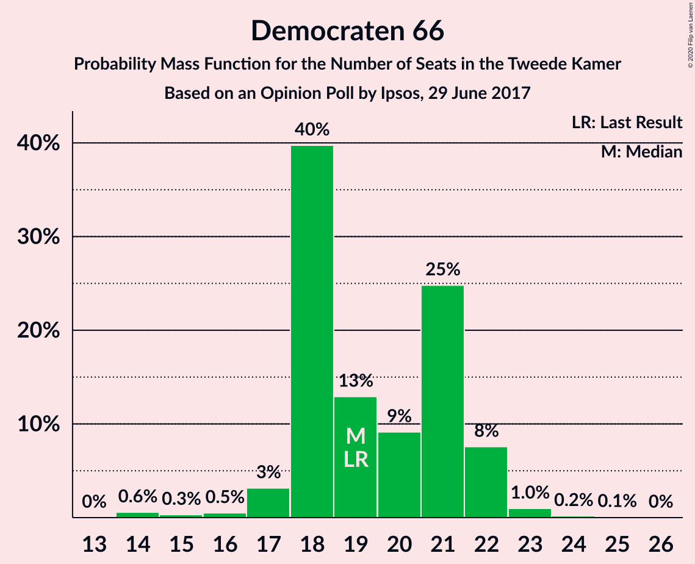

| Number of Seats | Probability | Accumulated | Special Marks |
|:---------------:|:-----------:|:-----------:|:-------------:|
| 14 | 0.6% | 100% |  |
| 15 | 0.3% | 99.4% |  |
| 16 | 0.5% | 99.1% |  |
| 17 | 3% | 98.6% |  |
| 18 | 40% | 95% |  |
| 19 | 13% | 56% | Last Result, Median |
| 20 | 9% | 43% |  |
| 21 | 25% | 34% |  |
| 22 | 8% | 9% |  |
| 23 | 1.0% | 1.3% |  |
| 24 | 0.2% | 0.3% |  |
| 25 | 0.1% | 0.1% |  |
| 26 | 0% | 0% |  |

### Partij voor de Vrijheid

*For a full overview of the results for this party, see the [Partij voor de Vrijheid](party-partijvoordevrijheid.html) page.*

| Number of Seats | Probability | Accumulated | Special Marks |
|:---------------:|:-----------:|:-----------:|:-------------:|
| 15 | 1.4% | 100% |  |
| 16 | 3% | 98.6% |  |
| 17 | 11% | 95% |  |
| 18 | 8% | 85% |  |
| 19 | 10% | 76% |  |
| 20 | 9% | 66% | Last Result |
| 21 | 29% | 57% | Median |
| 22 | 19% | 28% |  |
| 23 | 9% | 9% |  |
| 24 | 0.1% | 0.1% |  |
| 25 | 0% | 0% |  |

### Christen-Democratisch Appèl

*For a full overview of the results for this party, see the [Christen-Democratisch Appèl](party-christen-democratischappèl.html) page.*

| Number of Seats | Probability | Accumulated | Special Marks |
|:---------------:|:-----------:|:-----------:|:-------------:|
| 12 | 0.1% | 100% |  |
| 13 | 0.1% | 99.9% |  |
| 14 | 1.3% | 99.8% |  |
| 15 | 31% | 98.5% |  |
| 16 | 18% | 68% | Median |
| 17 | 3% | 50% |  |
| 18 | 38% | 47% |  |
| 19 | 2% | 9% | Last Result |
| 20 | 6% | 7% |  |
| 21 | 0.3% | 0.9% |  |
| 22 | 0.6% | 0.6% |  |
| 23 | 0% | 0% |  |

### GroenLinks

*For a full overview of the results for this party, see the [GroenLinks](party-groenlinks.html) page.*

| Number of Seats | Probability | Accumulated | Special Marks |
|:---------------:|:-----------:|:-----------:|:-------------:|
| 12 | 0.1% | 100% |  |
| 13 | 10% | 99.9% |  |
| 14 | 5% | 90% | Last Result |
| 15 | 18% | 84% |  |
| 16 | 8% | 66% |  |
| 17 | 7% | 57% | Median |
| 18 | 5% | 50% |  |
| 19 | 41% | 45% |  |
| 20 | 4% | 4% |  |
| 21 | 0% | 0.1% |  |
| 22 | 0% | 0% |  |

### Partij van de Arbeid

*For a full overview of the results for this party, see the [Partij van de Arbeid](party-partijvandearbeid.html) page.*

| Number of Seats | Probability | Accumulated | Special Marks |
|:---------------:|:-----------:|:-----------:|:-------------:|
| 5 | 2% | 100% |  |
| 6 | 7% | 98% |  |
| 7 | 37% | 92% |  |
| 8 | 30% | 55% | Median |
| 9 | 14% | 26% | Last Result |
| 10 | 11% | 11% |  |
| 11 | 0.5% | 0.5% |  |
| 12 | 0% | 0% |  |

### Socialistische Partij

*For a full overview of the results for this party, see the [Socialistische Partij](party-socialistischepartij.html) page.*

| Number of Seats | Probability | Accumulated | Special Marks |
|:---------------:|:-----------:|:-----------:|:-------------:|
| 4 | 0.1% | 100% |  |
| 5 | 2% | 99.9% |  |
| 6 | 9% | 98% |  |
| 7 | 31% | 89% |  |
| 8 | 7% | 58% |  |
| 9 | 50% | 51% | Median |
| 10 | 0.8% | 1.1% |  |
| 11 | 0.3% | 0.3% |  |
| 12 | 0% | 0% |  |
| 13 | 0% | 0% |  |
| 14 | 0% | 0% | Last Result |

### ChristenUnie

*For a full overview of the results for this party, see the [ChristenUnie](party-christenunie.html) page.*

| Number of Seats | Probability | Accumulated | Special Marks |
|:---------------:|:-----------:|:-----------:|:-------------:|
| 4 | 6% | 100% |  |
| 5 | 9% | 94% | Last Result |
| 6 | 49% | 85% | Median |
| 7 | 24% | 36% |  |
| 8 | 11% | 13% |  |
| 9 | 1.1% | 1.4% |  |
| 10 | 0.3% | 0.3% |  |
| 11 | 0% | 0% |  |

### Forum voor Democratie

*For a full overview of the results for this party, see the [Forum voor Democratie](party-forumvoordemocratie.html) page.*

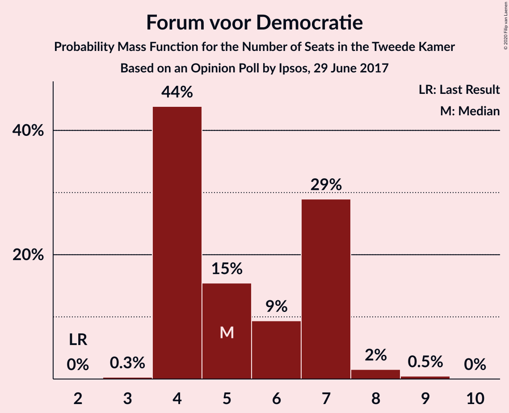

| Number of Seats | Probability | Accumulated | Special Marks |
|:---------------:|:-----------:|:-----------:|:-------------:|
| 2 | 0% | 100% | Last Result |
| 3 | 0.3% | 100% |  |
| 4 | 44% | 99.7% |  |
| 5 | 15% | 56% | Median |
| 6 | 9% | 40% |  |
| 7 | 29% | 31% |  |
| 8 | 2% | 2% |  |
| 9 | 0.5% | 0.5% |  |
| 10 | 0% | 0% |  |

### Partij voor de Dieren

*For a full overview of the results for this party, see the [Partij voor de Dieren](party-partijvoordedieren.html) page.*

| Number of Seats | Probability | Accumulated | Special Marks |
|:---------------:|:-----------:|:-----------:|:-------------:|
| 3 | 2% | 100% |  |
| 4 | 7% | 98% |  |
| 5 | 60% | 91% | Last Result, Median |
| 6 | 23% | 31% |  |
| 7 | 6% | 7% |  |
| 8 | 1.4% | 1.4% |  |
| 9 | 0% | 0.1% |  |
| 10 | 0% | 0% |  |

### DENK

*For a full overview of the results for this party, see the [DENK](party-denk.html) page.*

| Number of Seats | Probability | Accumulated | Special Marks |
|:---------------:|:-----------:|:-----------:|:-------------:|
| 2 | 2% | 100% |  |
| 3 | 24% | 98% | Last Result |
| 4 | 65% | 74% | Median |
| 5 | 7% | 10% |  |
| 6 | 3% | 3% |  |
| 7 | 0.3% | 0.3% |  |
| 8 | 0% | 0% |  |

### 50Plus

*For a full overview of the results for this party, see the [50Plus](party-50plus.html) page.*

| Number of Seats | Probability | Accumulated | Special Marks |
|:---------------:|:-----------:|:-----------:|:-------------:|
| 1 | 0.1% | 100% |  |
| 2 | 14% | 99.9% |  |
| 3 | 55% | 86% | Median |
| 4 | 28% | 31% | Last Result |
| 5 | 3% | 3% |  |
| 6 | 0.4% | 0.5% |  |
| 7 | 0% | 0% |  |

### Staatkundig Gereformeerde Partij

*For a full overview of the results for this party, see the [Staatkundig Gereformeerde Partij](party-staatkundiggereformeerdepartij.html) page.*

| Number of Seats | Probability | Accumulated | Special Marks |
|:---------------:|:-----------:|:-----------:|:-------------:|
| 1 | 35% | 100% |  |
| 2 | 34% | 65% | Median |
| 3 | 28% | 30% | Last Result |
| 4 | 2% | 2% |  |
| 5 | 0.3% | 0.3% |  |
| 6 | 0% | 0% |  |

## Coalitions

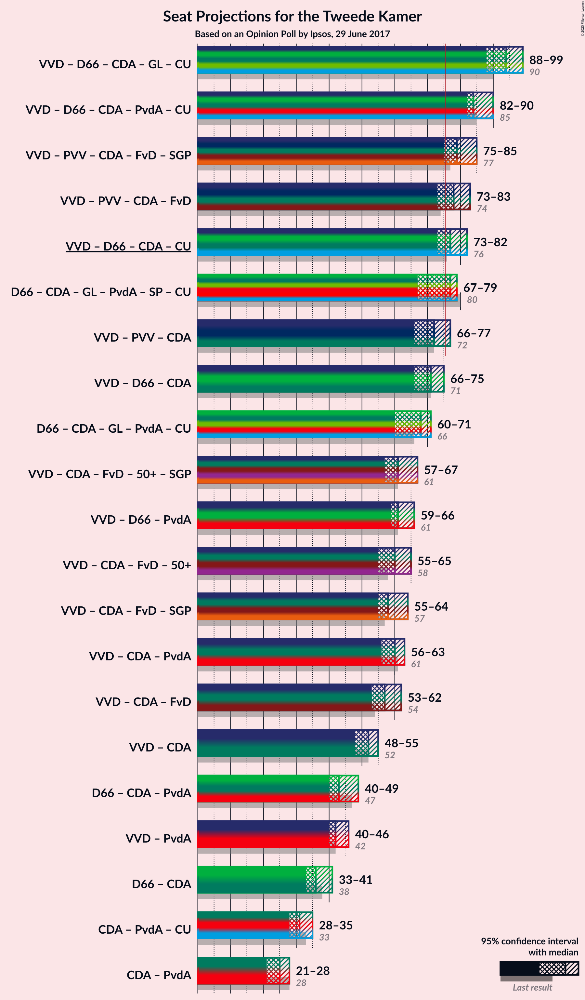

### Confidence Intervals

| Coalition | Last Result | Median | Majority? | 80% Confidence Interval | 90% Confidence Interval | 95% Confidence Interval | 99% Confidence Interval |
|:---------:|:-----------:|:------:|:---------:|:-----------------------:|:-----------------------:|:-----------------------:|:-----------------------:|
| Volkspartij voor Vrijheid en Democratie – Democraten 66 – Christen-Democratisch Appèl – GroenLinks – ChristenUnie | 90 | 94 | 100% | 91–97 | 88–98 | 88–99 | 88–99 |
| Volkspartij voor Vrijheid en Democratie – Democraten 66 – Christen-Democratisch Appèl – Partij van de Arbeid – ChristenUnie | 85 | 84 | 100% | 82–87 | 82–88 | 82–90 | 80–92 |
| Volkspartij voor Vrijheid en Democratie – Partij voor de Vrijheid – Christen-Democratisch Appèl – Forum voor Democratie – Staatkundig Gereformeerde Partij | 77 | 79 | 93% | 76–83 | 75–84 | 75–85 | 73–86 |
| Volkspartij voor Vrijheid en Democratie – Partij voor de Vrijheid – Christen-Democratisch Appèl – Forum voor Democratie | 74 | 78 | 64% | 73–80 | 73–82 | 73–83 | 71–83 |
| Volkspartij voor Vrijheid en Democratie – Democraten 66 – Christen-Democratisch Appèl – ChristenUnie | 76 | 77 | 79% | 73–80 | 73–80 | 73–82 | 73–84 |
| Democraten 66 – Christen-Democratisch Appèl – GroenLinks – Partij van de Arbeid – Socialistische Partij – ChristenUnie | 80 | 77 | 66% | 70–78 | 68–78 | 67–79 | 67–81 |
| Volkspartij voor Vrijheid en Democratie – Partij voor de Vrijheid – Christen-Democratisch Appèl | 72 | 72 | 4% | 66–74 | 66–75 | 66–77 | 66–77 |
| Volkspartij voor Vrijheid en Democratie – Democraten 66 – Christen-Democratisch Appèl | 71 | 71 | 1.3% | 66–73 | 66–74 | 66–75 | 66–76 |
| Democraten 66 – Christen-Democratisch Appèl – GroenLinks – Partij van de Arbeid – ChristenUnie | 66 | 68 | 0% | 63–70 | 61–71 | 60–71 | 60–73 |
| Volkspartij voor Vrijheid en Democratie – Christen-Democratisch Appèl – Forum voor Democratie – 50Plus – Staatkundig Gereformeerde Partij | 61 | 61 | 0% | 57–65 | 57–66 | 57–67 | 55–70 |
| Volkspartij voor Vrijheid en Democratie – Democraten 66 – Partij van de Arbeid | 61 | 61 | 0% | 59–65 | 59–66 | 59–66 | 57–67 |
| Volkspartij voor Vrijheid en Democratie – Christen-Democratisch Appèl – Forum voor Democratie – 50Plus | 58 | 60 | 0% | 55–63 | 55–64 | 55–65 | 53–68 |
| Volkspartij voor Vrijheid en Democratie – Christen-Democratisch Appèl – Forum voor Democratie – Staatkundig Gereformeerde Partij | 57 | 58 | 0% | 55–61 | 55–62 | 55–64 | 53–67 |
| Volkspartij voor Vrijheid en Democratie – Christen-Democratisch Appèl – Partij van de Arbeid | 61 | 60 | 0% | 57–61 | 57–63 | 56–63 | 54–66 |
| Volkspartij voor Vrijheid en Democratie – Christen-Democratisch Appèl – Forum voor Democratie | 54 | 57 | 0% | 53–59 | 53–60 | 53–62 | 51–64 |
| Volkspartij voor Vrijheid en Democratie – Christen-Democratisch Appèl | 52 | 52 | 0% | 48–54 | 48–54 | 48–55 | 46–57 |
| Democraten 66 – Christen-Democratisch Appèl – Partij van de Arbeid | 47 | 43 | 0% | 42–47 | 42–49 | 40–49 | 39–49 |
| Volkspartij voor Vrijheid en Democratie – Partij van de Arbeid | 42 | 42 | 0% | 40–45 | 40–45 | 40–46 | 38–47 |
| Democraten 66 – Christen-Democratisch Appèl | 38 | 36 | 0% | 34–39 | 34–41 | 33–41 | 32–42 |
| Christen-Democratisch Appèl – Partij van de Arbeid – ChristenUnie | 33 | 31 | 0% | 29–32 | 28–34 | 28–35 | 27–37 |
| Christen-Democratisch Appèl – Partij van de Arbeid | 28 | 25 | 0% | 23–27 | 21–28 | 21–28 | 21–31 |

### Volkspartij voor Vrijheid en Democratie – Democraten 66 – Christen-Democratisch Appèl – GroenLinks – ChristenUnie

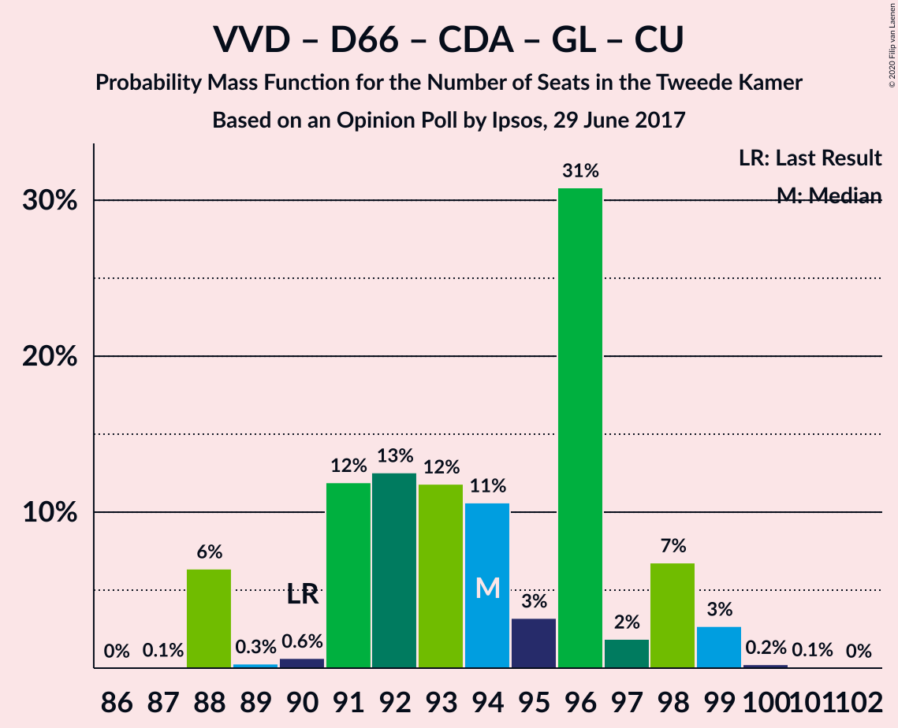

| Number of Seats | Probability | Accumulated | Special Marks |
|:---------------:|:-----------:|:-----------:|:-------------:|
| 87 | 0.1% | 100% |  |
| 88 | 6% | 99.9% |  |
| 89 | 0.3% | 94% |  |
| 90 | 0.6% | 93% | Last Result |
| 91 | 12% | 93% |  |
| 92 | 13% | 81% |  |
| 93 | 12% | 68% | Median |
| 94 | 11% | 56% |  |
| 95 | 3% | 46% |  |
| 96 | 31% | 42% |  |
| 97 | 2% | 12% |  |
| 98 | 7% | 10% |  |
| 99 | 3% | 3% |  |
| 100 | 0.2% | 0.4% |  |
| 101 | 0.1% | 0.1% |  |
| 102 | 0% | 0% |  |

### Volkspartij voor Vrijheid en Democratie – Democraten 66 – Christen-Democratisch Appèl – Partij van de Arbeid – ChristenUnie

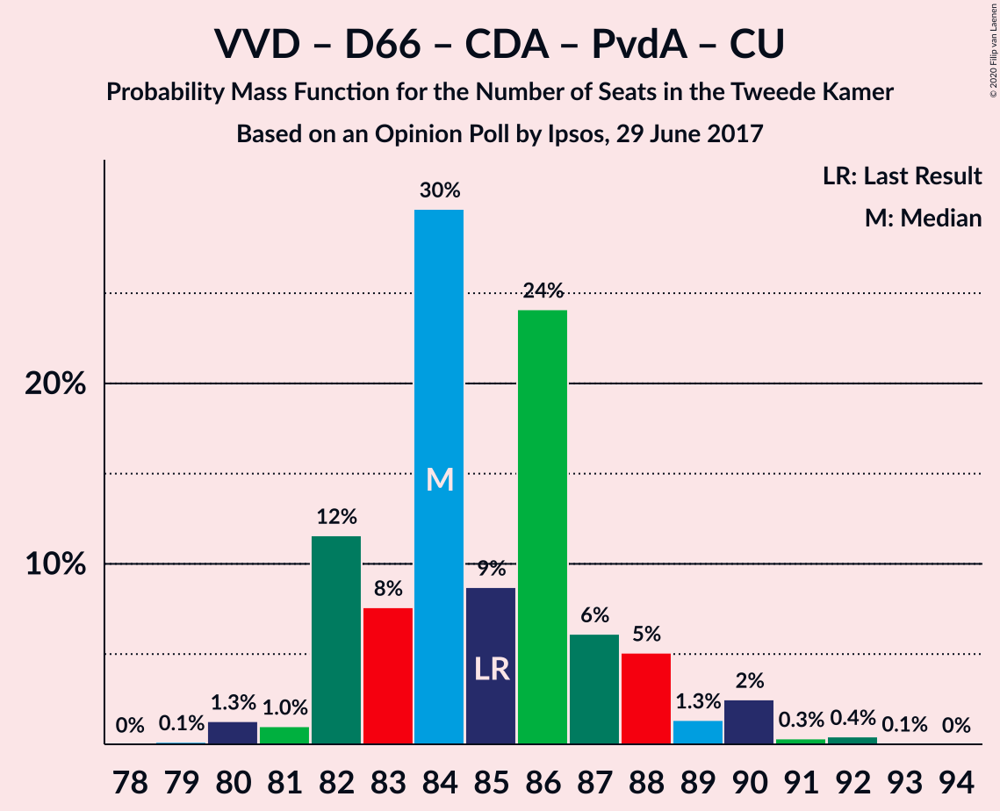

| Number of Seats | Probability | Accumulated | Special Marks |
|:---------------:|:-----------:|:-----------:|:-------------:|
| 79 | 0.1% | 100% |  |
| 80 | 1.3% | 99.8% |  |
| 81 | 1.0% | 98.5% |  |
| 82 | 12% | 98% |  |
| 83 | 8% | 86% |  |
| 84 | 30% | 78% | Median |
| 85 | 9% | 49% | Last Result |
| 86 | 24% | 40% |  |
| 87 | 6% | 16% |  |
| 88 | 5% | 10% |  |
| 89 | 1.3% | 5% |  |
| 90 | 2% | 3% |  |
| 91 | 0.3% | 0.8% |  |
| 92 | 0.4% | 0.5% |  |
| 93 | 0.1% | 0.1% |  |
| 94 | 0% | 0% |  |

### Volkspartij voor Vrijheid en Democratie – Partij voor de Vrijheid – Christen-Democratisch Appèl – Forum voor Democratie – Staatkundig Gereformeerde Partij

| Number of Seats | Probability | Accumulated | Special Marks |
|:---------------:|:-----------:|:-----------:|:-------------:|
| 71 | 0% | 100% |  |
| 72 | 0.1% | 99.9% |  |
| 73 | 1.0% | 99.8% |  |
| 74 | 0.5% | 98.8% |  |
| 75 | 5% | 98% |  |
| 76 | 12% | 93% | Majority |
| 77 | 16% | 82% | Last Result |
| 78 | 2% | 65% |  |
| 79 | 42% | 63% | Median |
| 80 | 1.4% | 21% |  |
| 81 | 6% | 20% |  |
| 82 | 1.0% | 14% |  |
| 83 | 8% | 13% |  |
| 84 | 2% | 5% |  |
| 85 | 3% | 4% |  |
| 86 | 0.6% | 0.7% |  |
| 87 | 0% | 0.1% |  |
| 88 | 0% | 0.1% |  |
| 89 | 0% | 0% |  |

### Volkspartij voor Vrijheid en Democratie – Partij voor de Vrijheid – Christen-Democratisch Appèl – Forum voor Democratie

| Number of Seats | Probability | Accumulated | Special Marks |
|:---------------:|:-----------:|:-----------:|:-------------:|
| 69 | 0% | 100% |  |
| 70 | 0.2% | 99.9% |  |
| 71 | 1.2% | 99.8% |  |
| 72 | 0.4% | 98.6% |  |
| 73 | 13% | 98% |  |
| 74 | 4% | 85% | Last Result |
| 75 | 17% | 81% |  |
| 76 | 9% | 64% | Majority |
| 77 | 4% | 55% | Median |
| 78 | 31% | 51% |  |
| 79 | 6% | 20% |  |
| 80 | 8% | 14% |  |
| 81 | 0.9% | 6% |  |
| 82 | 2% | 5% |  |
| 83 | 3% | 3% |  |
| 84 | 0.1% | 0.2% |  |
| 85 | 0% | 0.1% |  |
| 86 | 0.1% | 0.1% |  |
| 87 | 0% | 0% |  |

### Volkspartij voor Vrijheid en Democratie – Democraten 66 – Christen-Democratisch Appèl – ChristenUnie

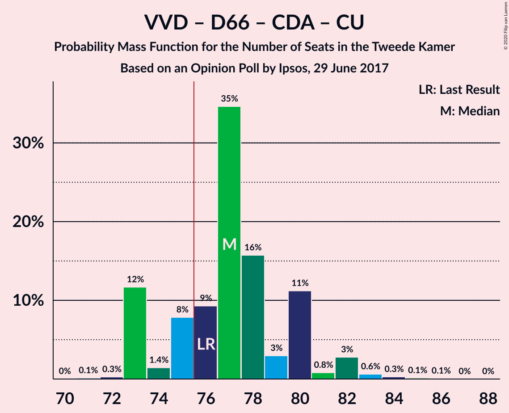

| Number of Seats | Probability | Accumulated | Special Marks |
|:---------------:|:-----------:|:-----------:|:-------------:|
| 70 | 0% | 100% |  |
| 71 | 0.1% | 99.9% |  |
| 72 | 0.3% | 99.8% |  |
| 73 | 12% | 99.5% |  |
| 74 | 1.4% | 88% |  |
| 75 | 8% | 86% |  |
| 76 | 9% | 79% | Last Result, Median, Majority |
| 77 | 35% | 69% |  |
| 78 | 16% | 35% |  |
| 79 | 3% | 19% |  |
| 80 | 11% | 16% |  |
| 81 | 0.8% | 5% |  |
| 82 | 3% | 4% |  |
| 83 | 0.6% | 1.1% |  |
| 84 | 0.3% | 0.5% |  |
| 85 | 0.1% | 0.2% |  |
| 86 | 0.1% | 0.1% |  |
| 87 | 0% | 0% |  |

### Democraten 66 – Christen-Democratisch Appèl – GroenLinks – Partij van de Arbeid – Socialistische Partij – ChristenUnie

| Number of Seats | Probability | Accumulated | Special Marks |
|:---------------:|:-----------:|:-----------:|:-------------:|
| 66 | 0% | 100% |  |
| 67 | 2% | 99.9% |  |
| 68 | 7% | 97% |  |
| 69 | 0.5% | 91% |  |
| 70 | 0.9% | 90% |  |
| 71 | 4% | 89% |  |
| 72 | 3% | 86% |  |
| 73 | 8% | 83% |  |
| 74 | 7% | 75% |  |
| 75 | 2% | 68% | Median |
| 76 | 10% | 66% | Majority |
| 77 | 39% | 55% |  |
| 78 | 14% | 16% |  |
| 79 | 1.2% | 3% |  |
| 80 | 0.6% | 1.3% | Last Result |
| 81 | 0.4% | 0.8% |  |
| 82 | 0.4% | 0.4% |  |
| 83 | 0% | 0% |  |

### Volkspartij voor Vrijheid en Democratie – Partij voor de Vrijheid – Christen-Democratisch Appèl

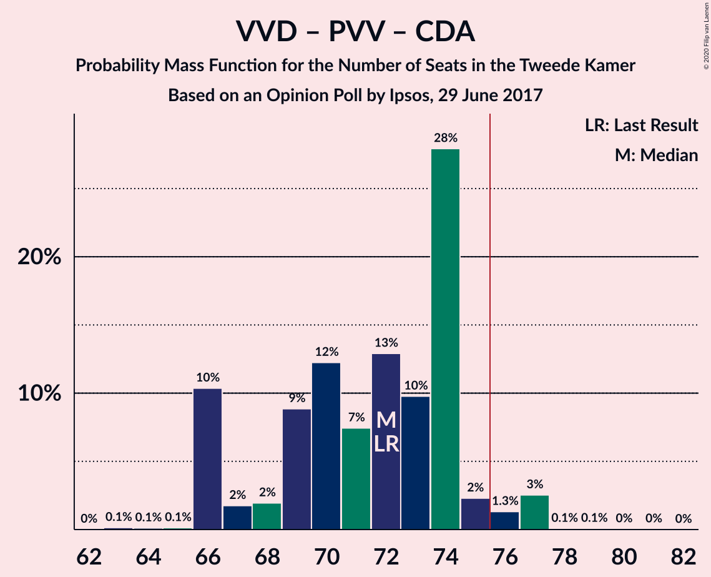

| Number of Seats | Probability | Accumulated | Special Marks |
|:---------------:|:-----------:|:-----------:|:-------------:|
| 63 | 0.1% | 100% |  |
| 64 | 0.1% | 99.8% |  |
| 65 | 0.1% | 99.7% |  |
| 66 | 10% | 99.6% |  |
| 67 | 2% | 89% |  |
| 68 | 2% | 87% |  |
| 69 | 9% | 86% |  |
| 70 | 12% | 77% |  |
| 71 | 7% | 64% |  |
| 72 | 13% | 57% | Last Result, Median |
| 73 | 10% | 44% |  |
| 74 | 28% | 34% |  |
| 75 | 2% | 6% |  |
| 76 | 1.3% | 4% | Majority |
| 77 | 3% | 3% |  |
| 78 | 0.1% | 0.2% |  |
| 79 | 0.1% | 0.2% |  |
| 80 | 0% | 0.1% |  |
| 81 | 0% | 0% |  |

### Volkspartij voor Vrijheid en Democratie – Democraten 66 – Christen-Democratisch Appèl

| Number of Seats | Probability | Accumulated | Special Marks |
|:---------------:|:-----------:|:-----------:|:-------------:|
| 64 | 0.1% | 100% |  |
| 65 | 0.3% | 99.9% |  |
| 66 | 11% | 99.6% |  |
| 67 | 1.1% | 89% |  |
| 68 | 2% | 88% |  |
| 69 | 8% | 86% |  |
| 70 | 18% | 77% | Median |
| 71 | 30% | 59% | Last Result |
| 72 | 1.5% | 29% |  |
| 73 | 19% | 28% |  |
| 74 | 4% | 9% |  |
| 75 | 4% | 5% |  |
| 76 | 0.8% | 1.3% | Majority |
| 77 | 0.2% | 0.5% |  |
| 78 | 0.1% | 0.3% |  |
| 79 | 0.1% | 0.2% |  |
| 80 | 0.1% | 0.1% |  |
| 81 | 0% | 0% |  |

### Democraten 66 – Christen-Democratisch Appèl – GroenLinks – Partij van de Arbeid – ChristenUnie

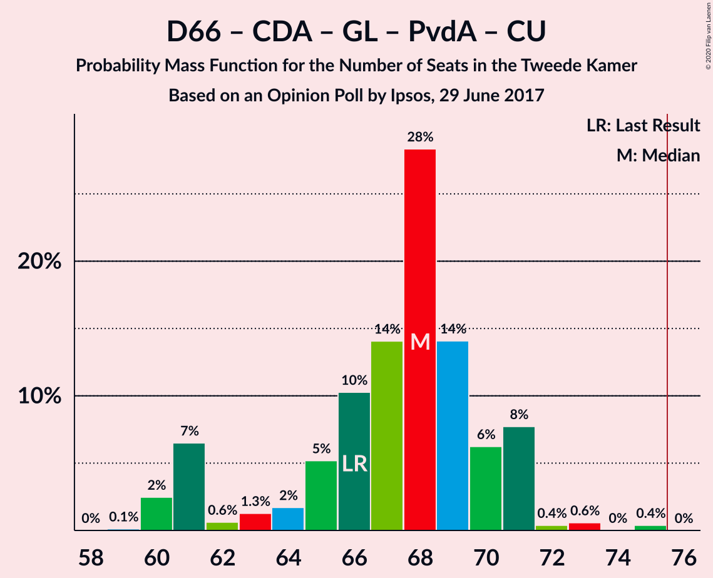

| Number of Seats | Probability | Accumulated | Special Marks |
|:---------------:|:-----------:|:-----------:|:-------------:|
| 59 | 0.1% | 100% |  |
| 60 | 2% | 99.9% |  |
| 61 | 7% | 97% |  |
| 62 | 0.6% | 91% |  |
| 63 | 1.3% | 90% |  |
| 64 | 2% | 89% |  |
| 65 | 5% | 87% |  |
| 66 | 10% | 82% | Last Result, Median |
| 67 | 14% | 72% |  |
| 68 | 28% | 58% |  |
| 69 | 14% | 29% |  |
| 70 | 6% | 15% |  |
| 71 | 8% | 9% |  |
| 72 | 0.4% | 1.4% |  |
| 73 | 0.6% | 1.0% |  |
| 74 | 0% | 0.4% |  |
| 75 | 0.4% | 0.4% |  |
| 76 | 0% | 0% | Majority |

### Volkspartij voor Vrijheid en Democratie – Christen-Democratisch Appèl – Forum voor Democratie – 50Plus – Staatkundig Gereformeerde Partij

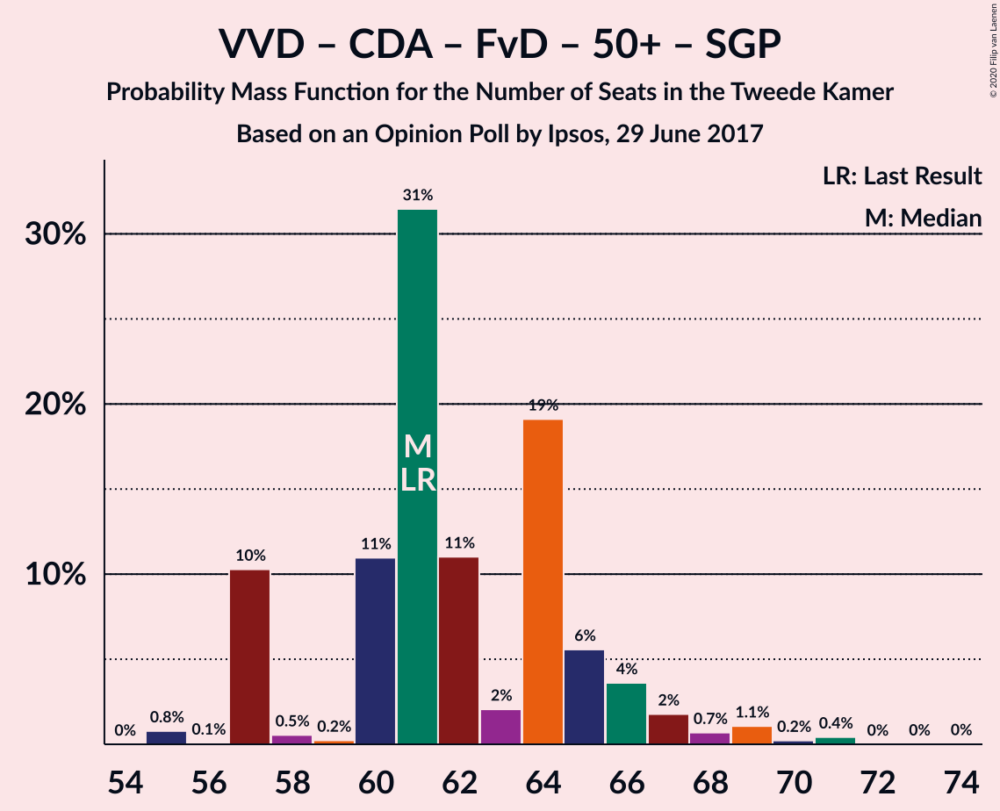

| Number of Seats | Probability | Accumulated | Special Marks |
|:---------------:|:-----------:|:-----------:|:-------------:|
| 55 | 0.8% | 100% |  |
| 56 | 0.1% | 99.2% |  |
| 57 | 10% | 99.1% |  |
| 58 | 0.5% | 89% |  |
| 59 | 0.2% | 88% |  |
| 60 | 11% | 88% |  |
| 61 | 31% | 77% | Last Result, Median |
| 62 | 11% | 46% |  |
| 63 | 2% | 35% |  |
| 64 | 19% | 33% |  |
| 65 | 6% | 13% |  |
| 66 | 4% | 8% |  |
| 67 | 2% | 4% |  |
| 68 | 0.7% | 2% |  |
| 69 | 1.1% | 2% |  |
| 70 | 0.2% | 0.7% |  |
| 71 | 0.4% | 0.5% |  |
| 72 | 0% | 0.1% |  |
| 73 | 0% | 0.1% |  |
| 74 | 0% | 0% |  |

### Volkspartij voor Vrijheid en Democratie – Democraten 66 – Partij van de Arbeid

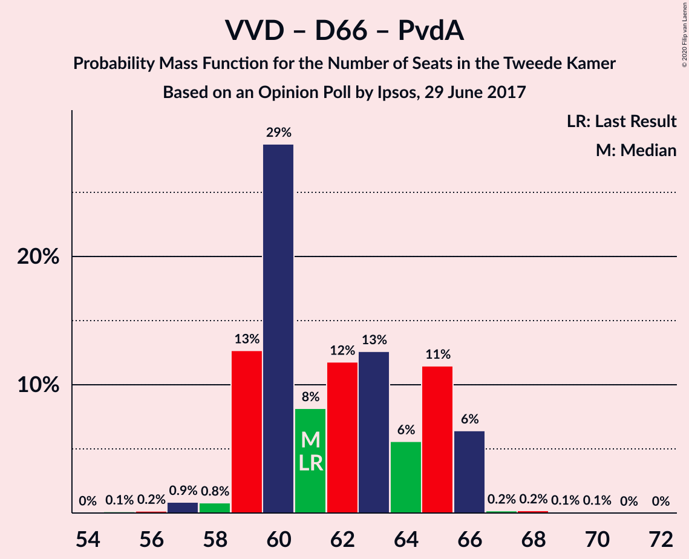

| Number of Seats | Probability | Accumulated | Special Marks |
|:---------------:|:-----------:|:-----------:|:-------------:|
| 54 | 0% | 100% |  |
| 55 | 0.1% | 99.9% |  |
| 56 | 0.2% | 99.8% |  |
| 57 | 0.9% | 99.7% |  |
| 58 | 0.8% | 98.8% |  |
| 59 | 13% | 98% |  |
| 60 | 29% | 85% |  |
| 61 | 8% | 57% | Last Result |
| 62 | 12% | 48% | Median |
| 63 | 13% | 37% |  |
| 64 | 6% | 24% |  |
| 65 | 11% | 18% |  |
| 66 | 6% | 7% |  |
| 67 | 0.2% | 0.6% |  |
| 68 | 0.2% | 0.4% |  |
| 69 | 0.1% | 0.2% |  |
| 70 | 0.1% | 0.1% |  |
| 71 | 0% | 0% |  |

### Volkspartij voor Vrijheid en Democratie – Christen-Democratisch Appèl – Forum voor Democratie – 50Plus

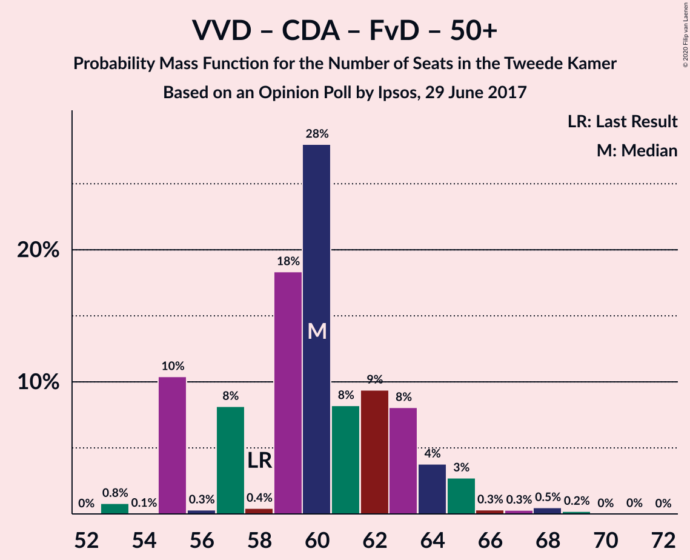

| Number of Seats | Probability | Accumulated | Special Marks |
|:---------------:|:-----------:|:-----------:|:-------------:|
| 53 | 0.8% | 100% |  |
| 54 | 0.1% | 99.2% |  |
| 55 | 10% | 99.1% |  |
| 56 | 0.3% | 89% |  |
| 57 | 8% | 88% |  |
| 58 | 0.4% | 80% | Last Result |
| 59 | 18% | 80% | Median |
| 60 | 28% | 62% |  |
| 61 | 8% | 34% |  |
| 62 | 9% | 25% |  |
| 63 | 8% | 16% |  |
| 64 | 4% | 8% |  |
| 65 | 3% | 4% |  |
| 66 | 0.3% | 1.3% |  |
| 67 | 0.3% | 1.0% |  |
| 68 | 0.5% | 0.7% |  |
| 69 | 0.2% | 0.3% |  |
| 70 | 0% | 0.1% |  |
| 71 | 0% | 0% |  |

### Volkspartij voor Vrijheid en Democratie – Christen-Democratisch Appèl – Forum voor Democratie – Staatkundig Gereformeerde Partij

| Number of Seats | Probability | Accumulated | Special Marks |
|:---------------:|:-----------:|:-----------:|:-------------:|
| 52 | 0.1% | 100% |  |
| 53 | 0.9% | 99.9% |  |
| 54 | 0.2% | 99.1% |  |
| 55 | 11% | 98.8% |  |
| 56 | 3% | 88% |  |
| 57 | 12% | 85% | Last Result |
| 58 | 27% | 73% | Median |
| 59 | 11% | 46% |  |
| 60 | 15% | 34% |  |
| 61 | 10% | 19% |  |
| 62 | 6% | 9% |  |
| 63 | 0.4% | 3% |  |
| 64 | 0.6% | 3% |  |
| 65 | 0.9% | 2% |  |
| 66 | 0.9% | 1.5% |  |
| 67 | 0.5% | 0.6% |  |
| 68 | 0.1% | 0.1% |  |
| 69 | 0% | 0% |  |

### Volkspartij voor Vrijheid en Democratie – Christen-Democratisch Appèl – Partij van de Arbeid

| Number of Seats | Probability | Accumulated | Special Marks |
|:---------------:|:-----------:|:-----------:|:-------------:|
| 52 | 0% | 100% |  |
| 53 | 0.1% | 99.9% |  |
| 54 | 1.0% | 99.8% |  |
| 55 | 0.7% | 98.8% |  |
| 56 | 0.7% | 98% |  |
| 57 | 23% | 97% |  |
| 58 | 9% | 74% |  |
| 59 | 10% | 65% | Median |
| 60 | 43% | 55% |  |
| 61 | 4% | 12% | Last Result |
| 62 | 2% | 8% |  |
| 63 | 4% | 6% |  |
| 64 | 1.2% | 2% |  |
| 65 | 0.4% | 1.1% |  |
| 66 | 0.6% | 0.7% |  |
| 67 | 0.1% | 0.1% |  |
| 68 | 0% | 0% |  |

### Volkspartij voor Vrijheid en Democratie – Christen-Democratisch Appèl – Forum voor Democratie

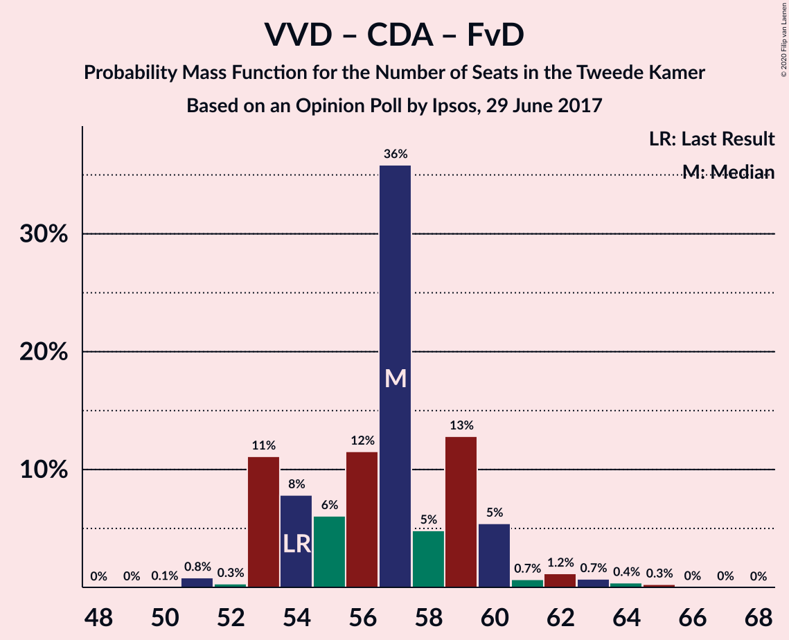

| Number of Seats | Probability | Accumulated | Special Marks |
|:---------------:|:-----------:|:-----------:|:-------------:|
| 50 | 0.1% | 100% |  |
| 51 | 0.8% | 99.9% |  |
| 52 | 0.3% | 99.1% |  |
| 53 | 11% | 98.8% |  |
| 54 | 8% | 88% | Last Result |
| 55 | 6% | 80% |  |
| 56 | 12% | 74% | Median |
| 57 | 36% | 62% |  |
| 58 | 5% | 26% |  |
| 59 | 13% | 22% |  |
| 60 | 5% | 9% |  |
| 61 | 0.7% | 3% |  |
| 62 | 1.2% | 3% |  |
| 63 | 0.7% | 1.5% |  |
| 64 | 0.4% | 0.7% |  |
| 65 | 0.3% | 0.3% |  |
| 66 | 0% | 0.1% |  |
| 67 | 0% | 0% |  |

### Volkspartij voor Vrijheid en Democratie – Christen-Democratisch Appèl

| Number of Seats | Probability | Accumulated | Special Marks |
|:---------------:|:-----------:|:-----------:|:-------------:|
| 45 | 0.1% | 100% |  |
| 46 | 1.0% | 99.9% |  |
| 47 | 0.3% | 98.9% |  |
| 48 | 11% | 98.6% |  |
| 49 | 12% | 88% |  |
| 50 | 16% | 76% |  |
| 51 | 8% | 61% | Median |
| 52 | 11% | 53% | Last Result |
| 53 | 31% | 42% |  |
| 54 | 8% | 11% |  |
| 55 | 1.5% | 4% |  |
| 56 | 1.0% | 2% |  |
| 57 | 0.8% | 1.2% |  |
| 58 | 0.3% | 0.4% |  |
| 59 | 0.1% | 0.2% |  |
| 60 | 0% | 0.1% |  |
| 61 | 0% | 0% |  |

### Democraten 66 – Christen-Democratisch Appèl – Partij van de Arbeid

| Number of Seats | Probability | Accumulated | Special Marks |
|:---------------:|:-----------:|:-----------:|:-------------:|
| 38 | 0.2% | 100% |  |
| 39 | 0.6% | 99.8% |  |
| 40 | 2% | 99.2% |  |
| 41 | 1.4% | 97% |  |
| 42 | 14% | 96% |  |
| 43 | 41% | 82% | Median |
| 44 | 11% | 41% |  |
| 45 | 8% | 30% |  |
| 46 | 10% | 22% |  |
| 47 | 2% | 12% | Last Result |
| 48 | 2% | 10% |  |
| 49 | 7% | 8% |  |
| 50 | 0% | 0.5% |  |
| 51 | 0% | 0.4% |  |
| 52 | 0.4% | 0.4% |  |
| 53 | 0% | 0% |  |

### Volkspartij voor Vrijheid en Democratie – Partij van de Arbeid

| Number of Seats | Probability | Accumulated | Special Marks |
|:---------------:|:-----------:|:-----------:|:-------------:|
| 36 | 0% | 100% |  |
| 37 | 0.2% | 99.9% |  |
| 38 | 1.3% | 99.8% |  |
| 39 | 0.5% | 98% |  |
| 40 | 8% | 98% |  |
| 41 | 16% | 90% |  |
| 42 | 41% | 74% | Last Result |
| 43 | 12% | 33% | Median |
| 44 | 2% | 21% |  |
| 45 | 16% | 19% |  |
| 46 | 1.0% | 3% |  |
| 47 | 1.4% | 2% |  |
| 48 | 0.3% | 0.5% |  |
| 49 | 0.1% | 0.2% |  |
| 50 | 0.1% | 0.1% |  |
| 51 | 0% | 0% |  |

### Democraten 66 – Christen-Democratisch Appèl

| Number of Seats | Probability | Accumulated | Special Marks |
|:---------------:|:-----------:|:-----------:|:-------------:|
| 30 | 0.1% | 100% |  |
| 31 | 0.1% | 99.9% |  |
| 32 | 0.8% | 99.8% |  |
| 33 | 2% | 98.9% |  |
| 34 | 19% | 97% |  |
| 35 | 12% | 77% | Median |
| 36 | 39% | 65% |  |
| 37 | 5% | 26% |  |
| 38 | 5% | 21% | Last Result |
| 39 | 9% | 16% |  |
| 40 | 1.4% | 7% |  |
| 41 | 5% | 6% |  |
| 42 | 0.5% | 0.5% |  |
| 43 | 0% | 0% |  |

### Christen-Democratisch Appèl – Partij van de Arbeid – ChristenUnie

| Number of Seats | Probability | Accumulated | Special Marks |
|:---------------:|:-----------:|:-----------:|:-------------:|
| 25 | 0% | 100% |  |
| 26 | 0.3% | 99.9% |  |
| 27 | 1.0% | 99.6% |  |
| 28 | 8% | 98.6% |  |
| 29 | 12% | 91% |  |
| 30 | 3% | 79% | Median |
| 31 | 46% | 76% |  |
| 32 | 21% | 30% |  |
| 33 | 3% | 9% | Last Result |
| 34 | 3% | 6% |  |
| 35 | 2% | 3% |  |
| 36 | 0.1% | 0.7% |  |
| 37 | 0.6% | 0.6% |  |
| 38 | 0% | 0% |  |

### Christen-Democratisch Appèl – Partij van de Arbeid

| Number of Seats | Probability | Accumulated | Special Marks |
|:---------------:|:-----------:|:-----------:|:-------------:|
| 19 | 0.1% | 100% |  |
| 20 | 0.3% | 99.9% |  |
| 21 | 6% | 99.6% |  |
| 22 | 1.0% | 94% |  |
| 23 | 21% | 93% |  |
| 24 | 7% | 72% | Median |
| 25 | 50% | 65% |  |
| 26 | 3% | 15% |  |
| 27 | 2% | 12% |  |
| 28 | 8% | 10% | Last Result |
| 29 | 0.6% | 2% |  |
| 30 | 0.4% | 0.9% |  |
| 31 | 0.5% | 0.5% |  |
| 32 | 0% | 0% |  |

## Technical Information

### Opinion Poll

+ **Polling firm:** Ipsos
+ **Commissioner(s):** —
+ **Fieldwork period:** 29 June 2017

### Calculations

+ **Sample size:** 1000
+ **Simulations done:** 1,048,576
+ **Error estimate:** 1.71%

