# Opinion Poll by Ipsos, 29 June 2017

<a href="#voting-intentions">Voting Intentions</a> | <a href="#seats">Seats</a> | <a href="#coalitions">Coalitions</a> | <a href="#technical-information">Technical Information</a>

## Voting Intentions

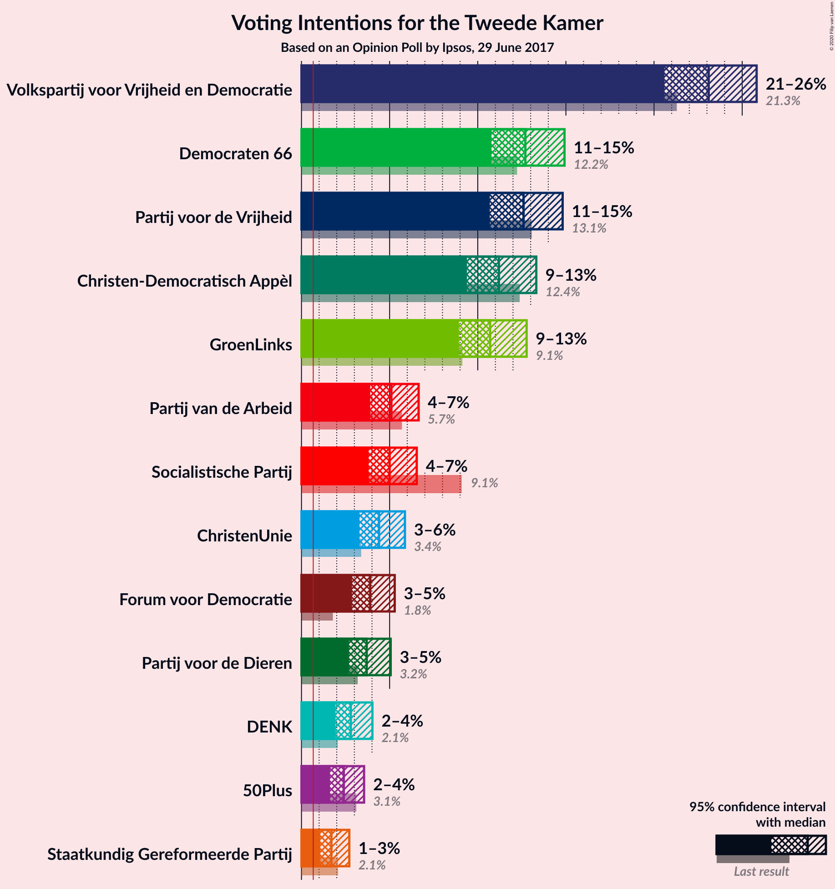

### Confidence Intervals

| Party | Last Result | Poll Result | 80% Confidence Interval | 90% Confidence Interval | 95% Confidence Interval | 99% Confidence Interval |
|:-----:|:-----------:|:-----------:|:-----------------------:|:-----------------------:|:-----------------------:|:-----------------------:|
| Volkspartij voor Vrijheid en Democratie | 21.3% | 23.1% | 21.4–24.9% |21.0–25.4% |20.6–25.8% |19.8–26.7% |
| Democraten 66 | 12.2% | 12.7% | 11.4–14.1% |11.1–14.6% |10.8–14.9% |10.2–15.6% |
| Partij voor de Vrijheid | 13.1% | 12.6% | 11.3–14.0% |11.0–14.4% |10.7–14.8% |10.1–15.5% |
| Christen-Democratisch Appèl | 12.4% | 11.2% | 10.0–12.6% |9.7–13.0% |9.4–13.3% |8.8–14.0% |
| GroenLinks | 9.1% | 10.7% | 9.5–12.1% |9.2–12.4% |8.9–12.8% |8.4–13.5% |
| Partij van de Arbeid | 5.7% | 5.1% | 4.3–6.1% |4.1–6.4% |3.9–6.6% |3.6–7.2% |
| Socialistische Partij | 9.1% | 5.0% | 4.2–6.0% |4.0–6.3% |3.8–6.5% |3.5–7.1% |
| ChristenUnie | 3.4% | 4.4% | 3.7–5.3% |3.5–5.6% |3.3–5.9% |3.0–6.4% |
| Forum voor Democratie | 1.8% | 3.9% | 3.2–4.8% |3.0–5.1% |2.9–5.3% |2.6–5.8% |
| Partij voor de Dieren | 3.2% | 3.7% | 3.0–4.6% |2.9–4.8% |2.7–5.1% |2.4–5.5% |
| DENK | 2.1% | 2.8% | 2.2–3.6% |2.1–3.8% |1.9–4.0% |1.7–4.4% |
| 50Plus | 3.1% | 2.4% | 1.9–3.2% |1.7–3.4% |1.6–3.6% |1.4–3.9% |
| Staatkundig Gereformeerde Partij | 2.1% | 1.7% | 1.3–2.4% |1.2–2.5% |1.1–2.7% |0.9–3.1% |

*Note:* The poll result column reflects the actual value used in the calculations. Published results may vary slightly, and in addition be rounded to fewer digits.

## Seats

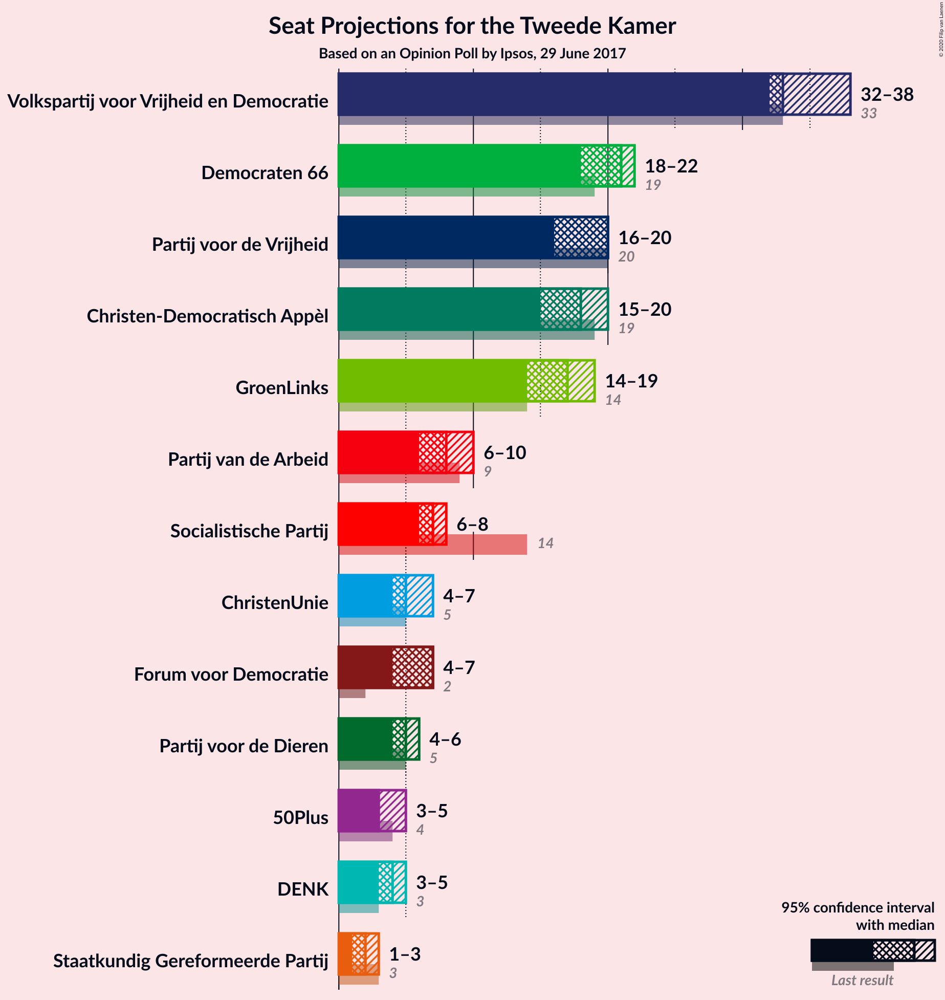

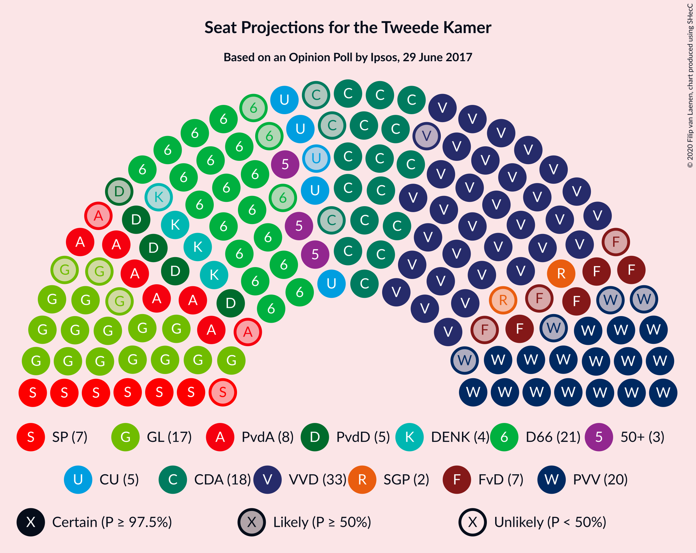

### Confidence Intervals

| Party | Last Result | Median | 80% Confidence Interval | 90% Confidence Interval | 95% Confidence Interval | 99% Confidence Interval |
|:-----:|:-----------:|:------:|:-----------------------:|:-----------------------:|:-----------------------:|:-----------------------:|
| <a href="#volkspartij-voor-vrijheid-en-democratie">Volkspartij voor Vrijheid en Democratie</a> | 33 | 33 | 32–36 |32–36 |32–38 |31–40 |
| <a href="#democraten-66">Democraten 66</a> | 19 | 21 | 21–22 |19–22 |18–22 |16–22 |
| <a href="#partij-voor-de-vrijheid">Partij voor de Vrijheid</a> | 20 | 20 | 16–20 |16–20 |16–20 |16–23 |
| <a href="#christen-democratisch-appèl">Christen-Democratisch Appèl</a> | 19 | 18 | 15–20 |15–20 |15–20 |14–21 |
| <a href="#groenlinks">GroenLinks</a> | 14 | 17 | 16–19 |16–19 |14–19 |13–20 |
| <a href="#partij-van-de-arbeid">Partij van de Arbeid</a> | 9 | 8 | 6–10 |6–10 |6–10 |6–10 |
| <a href="#socialistische-partij">Socialistische Partij</a> | 14 | 7 | 7–8 |7–8 |6–8 |5–9 |
| <a href="#christenunie">ChristenUnie</a> | 5 | 5 | 4–7 |4–7 |4–7 |4–9 |
| <a href="#forum-voor-democratie">Forum voor Democratie</a> | 2 | 7 | 4–7 |4–7 |4–7 |4–8 |
| <a href="#partij-voor-de-dieren">Partij voor de Dieren</a> | 5 | 5 | 4–5 |4–5 |4–6 |4–7 |
| <a href="#denk">DENK</a> | 3 | 4 | 3–4 |3–4 |3–5 |2–7 |
| <a href="#50plus">50Plus</a> | 4 | 3 | 3–4 |3–4 |3–5 |2–6 |
| <a href="#staatkundig-gereformeerde-partij">Staatkundig Gereformeerde Partij</a> | 3 | 2 | 1–2 |1–3 |1–3 |1–4 |

### Volkspartij voor Vrijheid en Democratie

*For a full overview of the results for this party, see the [Volkspartij voor Vrijheid en Democratie](party-volkspartijvoorvrijheidendemocratie.html) page.*

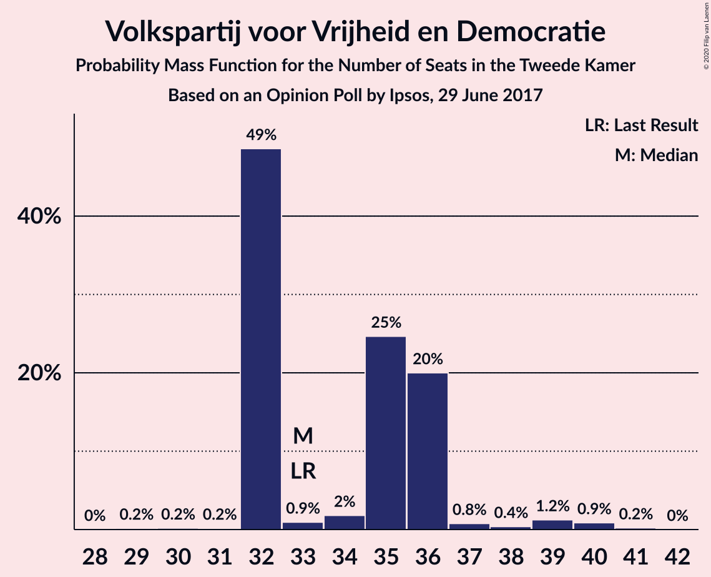

| Number of Seats | Probability | Accumulated | Special Marks |
|:---------------:|:-----------:|:-----------:|:-------------:|
| 29 | 0.2% | 100% |  |
| 30 | 0.2% | 99.8% |  |
| 31 | 0.2% | 99.7% |  |
| 32 | 49% | 99.5% |  |
| 33 | 0.9% | 51% | Last Result, Median |
| 34 | 2% | 50% |  |
| 35 | 25% | 48% |  |
| 36 | 20% | 23% |  |
| 37 | 0.8% | 3% |  |
| 38 | 0.4% | 3% |  |
| 39 | 1.2% | 2% |  |
| 40 | 0.9% | 1.1% |  |
| 41 | 0.2% | 0.2% |  |
| 42 | 0% | 0% |  |

### Democraten 66

*For a full overview of the results for this party, see the [Democraten 66](party-democraten66.html) page.*

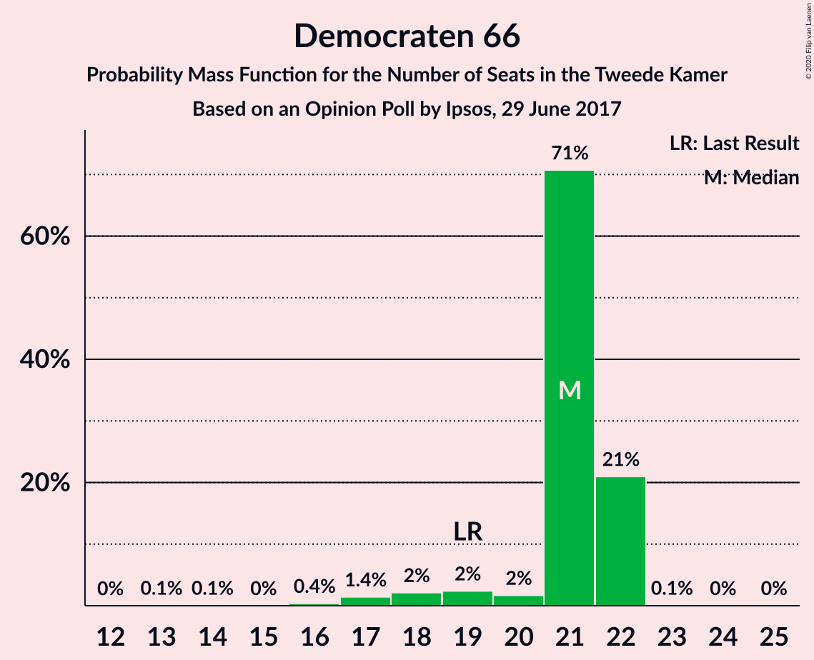

| Number of Seats | Probability | Accumulated | Special Marks |
|:---------------:|:-----------:|:-----------:|:-------------:|
| 13 | 0.1% | 100% |  |
| 14 | 0.1% | 99.9% |  |
| 15 | 0% | 99.9% |  |
| 16 | 0.4% | 99.8% |  |
| 17 | 1.4% | 99.5% |  |
| 18 | 2% | 98% |  |
| 19 | 2% | 96% | Last Result |
| 20 | 2% | 94% |  |
| 21 | 71% | 92% | Median |
| 22 | 21% | 21% |  |
| 23 | 0.1% | 0.1% |  |
| 24 | 0% | 0.1% |  |
| 25 | 0% | 0% |  |

### Partij voor de Vrijheid

*For a full overview of the results for this party, see the [Partij voor de Vrijheid](party-partijvoordevrijheid.html) page.*

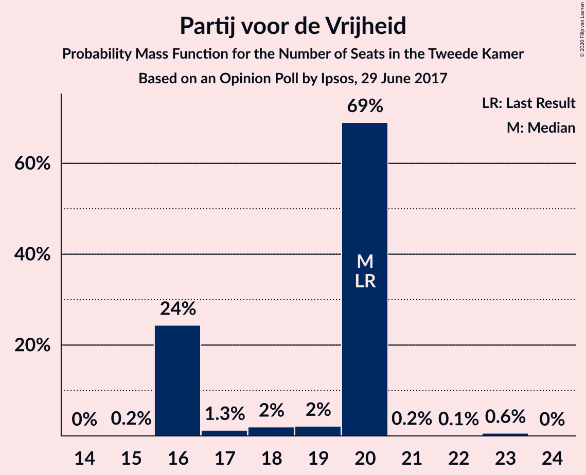

| Number of Seats | Probability | Accumulated | Special Marks |
|:---------------:|:-----------:|:-----------:|:-------------:|
| 15 | 0.2% | 100% |  |
| 16 | 24% | 99.8% |  |
| 17 | 1.3% | 75% |  |
| 18 | 2% | 74% |  |
| 19 | 2% | 72% |  |
| 20 | 69% | 70% | Last Result, Median |
| 21 | 0.2% | 0.9% |  |
| 22 | 0.1% | 0.8% |  |
| 23 | 0.6% | 0.7% |  |
| 24 | 0% | 0% |  |

### Christen-Democratisch Appèl

*For a full overview of the results for this party, see the [Christen-Democratisch Appèl](party-christen-democratischappèl.html) page.*

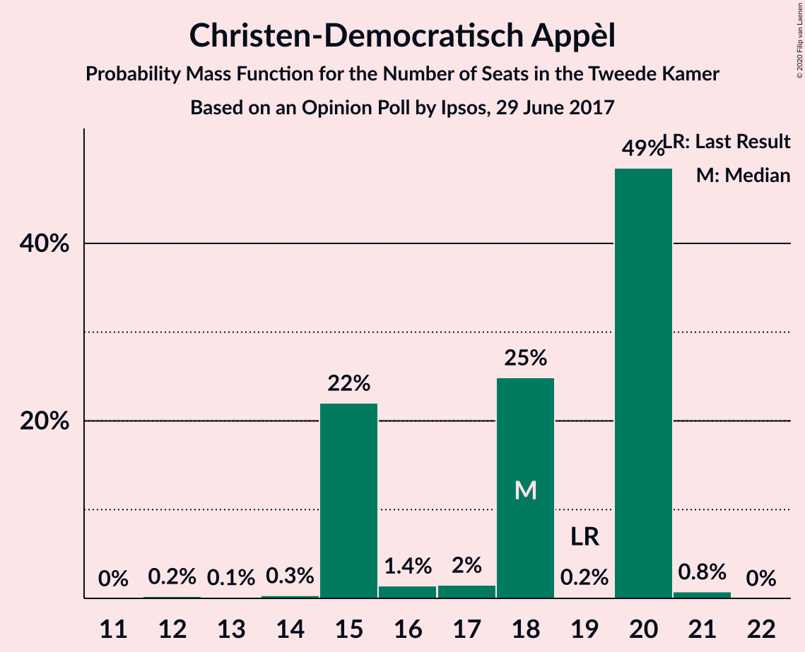

| Number of Seats | Probability | Accumulated | Special Marks |
|:---------------:|:-----------:|:-----------:|:-------------:|
| 12 | 0.2% | 100% |  |
| 13 | 0.1% | 99.8% |  |
| 14 | 0.3% | 99.6% |  |
| 15 | 22% | 99.3% |  |
| 16 | 1.4% | 77% |  |
| 17 | 2% | 76% |  |
| 18 | 25% | 74% | Median |
| 19 | 0.2% | 49% | Last Result |
| 20 | 49% | 49% |  |
| 21 | 0.8% | 0.8% |  |
| 22 | 0% | 0% |  |

### GroenLinks

*For a full overview of the results for this party, see the [GroenLinks](party-groenlinks.html) page.*

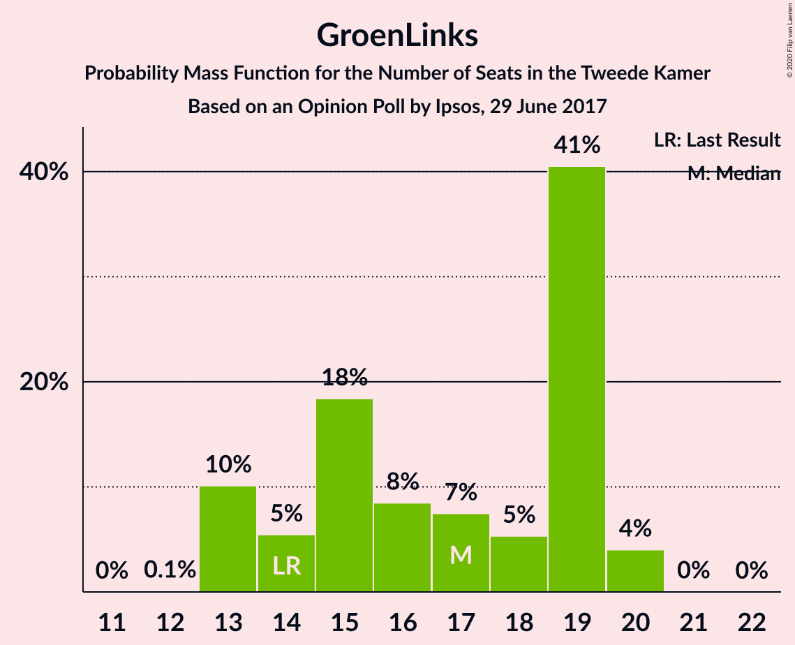

| Number of Seats | Probability | Accumulated | Special Marks |
|:---------------:|:-----------:|:-----------:|:-------------:|
| 12 | 0.3% | 100% |  |
| 13 | 1.0% | 99.7% |  |
| 14 | 2% | 98.6% | Last Result |
| 15 | 2% | 97% |  |
| 16 | 23% | 95% |  |
| 17 | 51% | 72% | Median |
| 18 | 0.5% | 21% |  |
| 19 | 20% | 20% |  |
| 20 | 0.5% | 0.6% |  |
| 21 | 0% | 0.1% |  |
| 22 | 0% | 0.1% |  |
| 23 | 0.1% | 0.1% |  |
| 24 | 0% | 0% |  |

### Partij van de Arbeid

*For a full overview of the results for this party, see the [Partij van de Arbeid](party-partijvandearbeid.html) page.*

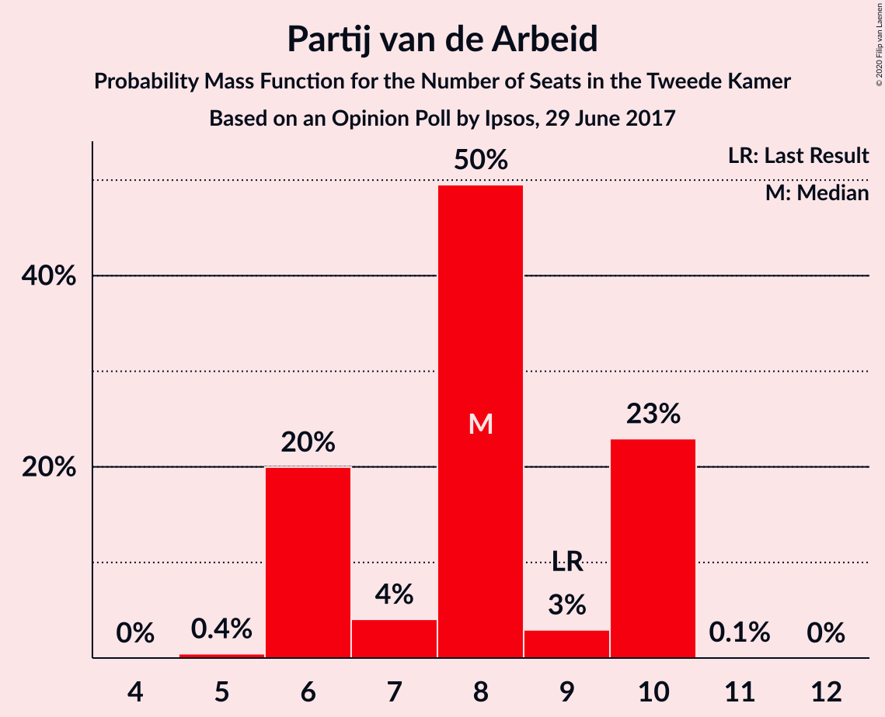

| Number of Seats | Probability | Accumulated | Special Marks |
|:---------------:|:-----------:|:-----------:|:-------------:|
| 5 | 0.4% | 100% |  |
| 6 | 20% | 99.5% |  |
| 7 | 4% | 80% |  |
| 8 | 50% | 76% | Median |
| 9 | 3% | 26% | Last Result |
| 10 | 23% | 23% |  |
| 11 | 0.1% | 0.1% |  |
| 12 | 0% | 0% |  |

### Socialistische Partij

*For a full overview of the results for this party, see the [Socialistische Partij](party-socialistischepartij.html) page.*

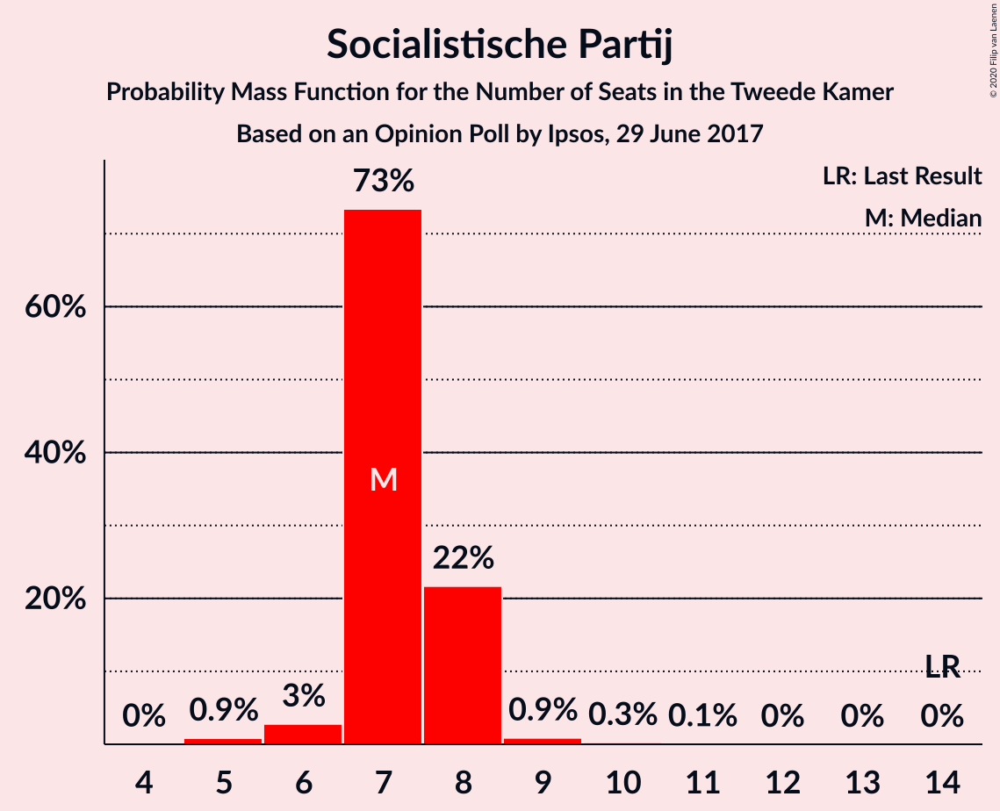

| Number of Seats | Probability | Accumulated | Special Marks |
|:---------------:|:-----------:|:-----------:|:-------------:|
| 5 | 0.9% | 100% |  |
| 6 | 3% | 99.1% |  |
| 7 | 73% | 96% | Median |
| 8 | 22% | 23% |  |
| 9 | 0.9% | 1.2% |  |
| 10 | 0.3% | 0.3% |  |
| 11 | 0.1% | 0.1% |  |
| 12 | 0% | 0% |  |
| 13 | 0% | 0% |  |
| 14 | 0% | 0% | Last Result |

### ChristenUnie

*For a full overview of the results for this party, see the [ChristenUnie](party-christenunie.html) page.*

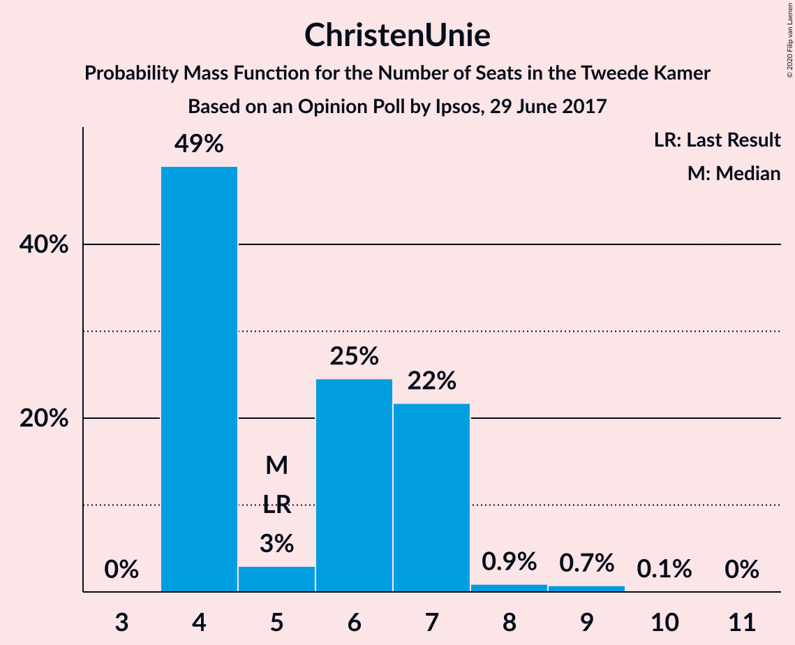

| Number of Seats | Probability | Accumulated | Special Marks |
|:---------------:|:-----------:|:-----------:|:-------------:|
| 4 | 49% | 100% |  |
| 5 | 3% | 51% | Last Result, Median |
| 6 | 25% | 48% |  |
| 7 | 22% | 23% |  |
| 8 | 0.9% | 2% |  |
| 9 | 0.7% | 0.8% |  |
| 10 | 0.1% | 0.1% |  |
| 11 | 0% | 0% |  |

### Forum voor Democratie

*For a full overview of the results for this party, see the [Forum voor Democratie](party-forumvoordemocratie.html) page.*

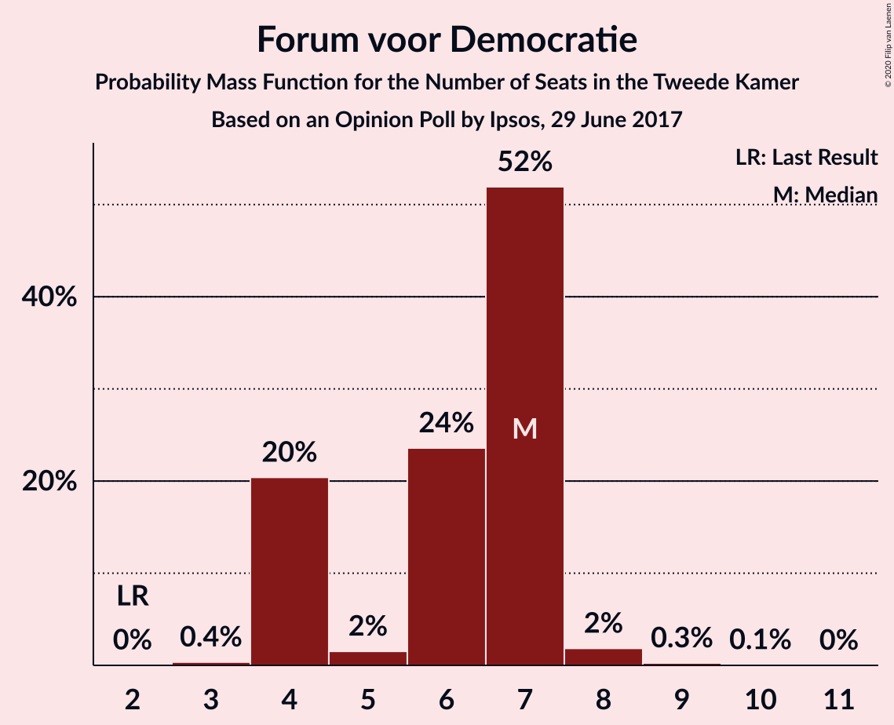

| Number of Seats | Probability | Accumulated | Special Marks |
|:---------------:|:-----------:|:-----------:|:-------------:|
| 2 | 0% | 100% | Last Result |
| 3 | 0.4% | 100% |  |
| 4 | 20% | 99.6% |  |
| 5 | 2% | 79% |  |
| 6 | 24% | 78% |  |
| 7 | 52% | 54% | Median |
| 8 | 2% | 2% |  |
| 9 | 0.3% | 0.3% |  |
| 10 | 0.1% | 0.1% |  |
| 11 | 0% | 0% |  |

### Partij voor de Dieren

*For a full overview of the results for this party, see the [Partij voor de Dieren](party-partijvoordedieren.html) page.*

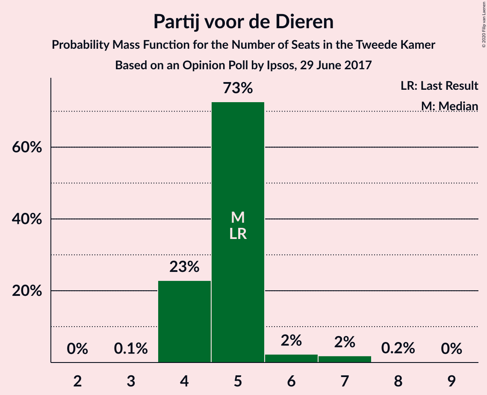

| Number of Seats | Probability | Accumulated | Special Marks |
|:---------------:|:-----------:|:-----------:|:-------------:|
| 3 | 0.1% | 100% |  |
| 4 | 23% | 99.9% |  |
| 5 | 73% | 77% | Last Result, Median |
| 6 | 2% | 4% |  |
| 7 | 2% | 2% |  |
| 8 | 0.2% | 0.2% |  |
| 9 | 0% | 0% |  |

### DENK

*For a full overview of the results for this party, see the [DENK](party-denk.html) page.*

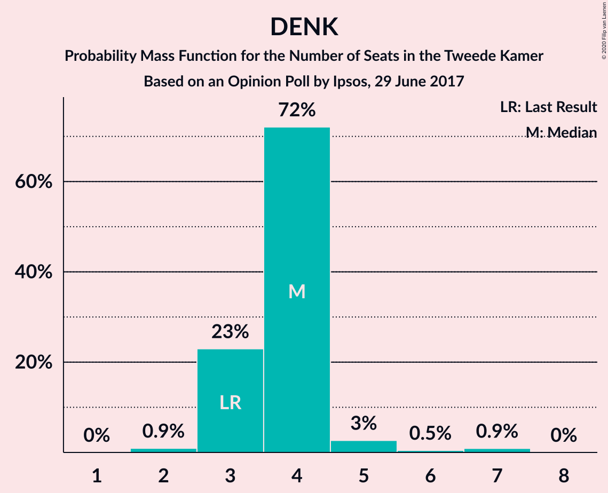

| Number of Seats | Probability | Accumulated | Special Marks |
|:---------------:|:-----------:|:-----------:|:-------------:|
| 2 | 0.9% | 100% |  |
| 3 | 23% | 99.1% | Last Result |
| 4 | 72% | 76% | Median |
| 5 | 3% | 4% |  |
| 6 | 0.5% | 1.4% |  |
| 7 | 0.9% | 0.9% |  |
| 8 | 0% | 0% |  |

### 50Plus

*For a full overview of the results for this party, see the [50Plus](party-50plus.html) page.*

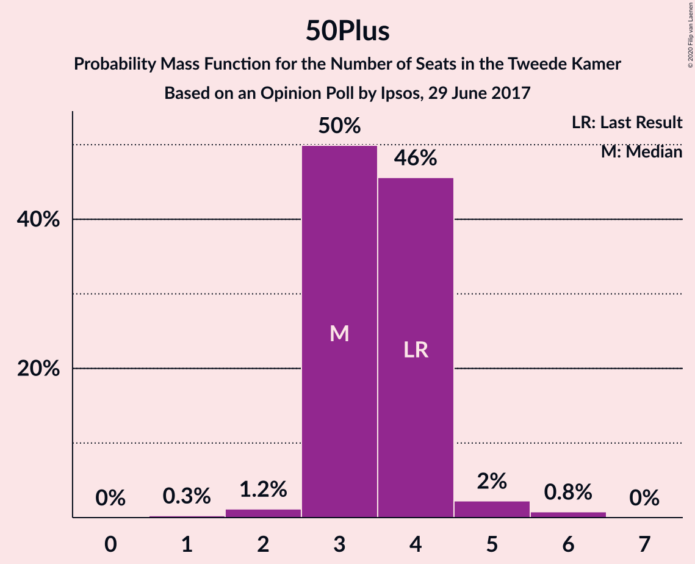

| Number of Seats | Probability | Accumulated | Special Marks |
|:---------------:|:-----------:|:-----------:|:-------------:|
| 1 | 0.3% | 100% |  |
| 2 | 1.2% | 99.7% |  |
| 3 | 50% | 98.6% | Median |
| 4 | 46% | 49% | Last Result |
| 5 | 2% | 3% |  |
| 6 | 0.8% | 0.8% |  |
| 7 | 0% | 0% |  |

### Staatkundig Gereformeerde Partij

*For a full overview of the results for this party, see the [Staatkundig Gereformeerde Partij](party-staatkundiggereformeerdepartij.html) page.*

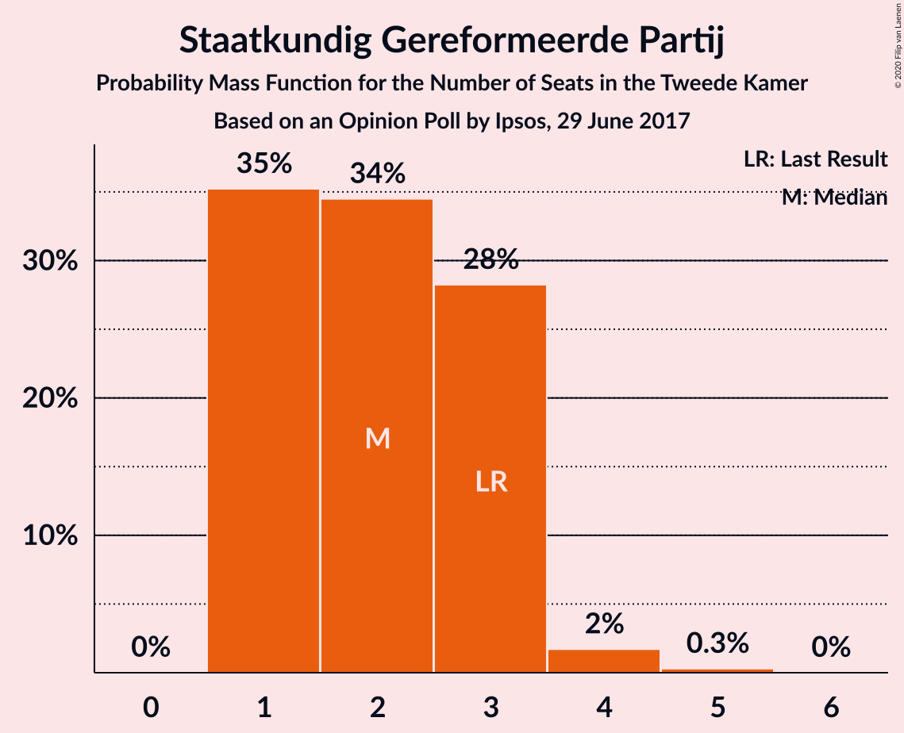

| Number of Seats | Probability | Accumulated | Special Marks |
|:---------------:|:-----------:|:-----------:|:-------------:|
| 1 | 22% | 100% |  |
| 2 | 72% | 78% | Median |
| 3 | 5% | 6% | Last Result |
| 4 | 1.2% | 1.5% |  |
| 5 | 0.3% | 0.3% |  |
| 6 | 0% | 0% |  |

## Coalitions

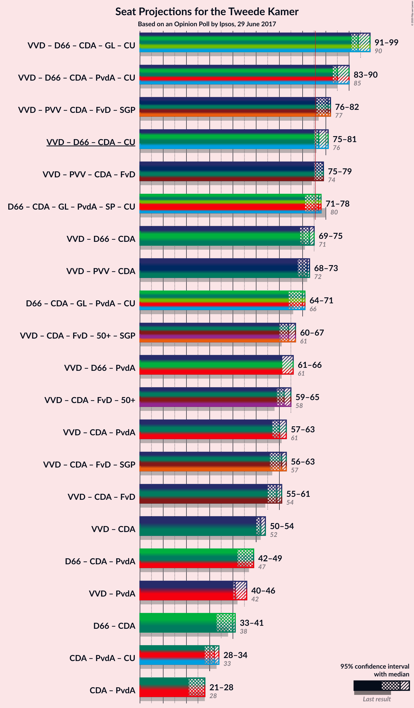

### Confidence Intervals

| Coalition | Last Result | Median | Majority? | 80% Confidence Interval | 90% Confidence Interval | 95% Confidence Interval | 99% Confidence Interval |
|:---------:|:-----------:|:------:|:---------:|:-----------------------:|:-----------------------:|:-----------------------:|:-----------------------:|
| Volkspartij voor Vrijheid en Democratie – Democraten 66 – Christen-Democratisch Appèl – GroenLinks – ChristenUnie | 90 | 94 | 100% | 94–99 | 93–99 | 91–99 | 89–99 |
| Volkspartij voor Vrijheid en Democratie – Democraten 66 – Christen-Democratisch Appèl – Partij van de Arbeid – ChristenUnie | 85 | 85 | 100% | 85–90 | 85–90 | 83–90 | 81–90 |
| Volkspartij voor Vrijheid en Democratie – Partij voor de Vrijheid – Christen-Democratisch Appèl – Forum voor Democratie – Staatkundig Gereformeerde Partij | 77 | 81 | 99.2% | 76–81 | 76–81 | 76–82 | 74–85 |
| Volkspartij voor Vrijheid en Democratie – Democraten 66 – Christen-Democratisch Appèl – ChristenUnie | 76 | 77 | 97% | 77–80 | 77–80 | 75–81 | 72–84 |
| Volkspartij voor Vrijheid en Democratie – Partij voor de Vrijheid – Christen-Democratisch Appèl – Forum voor Democratie | 74 | 79 | 55% | 75–79 | 75–79 | 75–79 | 72–82 |
| Democraten 66 – Christen-Democratisch Appèl – GroenLinks – Partij van de Arbeid – Socialistische Partij – ChristenUnie | 80 | 77 | 92% | 77–78 | 72–78 | 71–78 | 69–79 |
| Volkspartij voor Vrijheid en Democratie – Democraten 66 – Christen-Democratisch Appèl | 71 | 73 | 1.4% | 73–74 | 71–74 | 69–75 | 66–77 |
| Volkspartij voor Vrijheid en Democratie – Partij voor de Vrijheid – Christen-Democratisch Appèl | 72 | 72 | 2% | 69–72 | 69–72 | 68–73 | 66–77 |
| Democraten 66 – Christen-Democratisch Appèl – GroenLinks – Partij van de Arbeid – ChristenUnie | 66 | 70 | 0% | 69–71 | 65–71 | 64–71 | 61–71 |
| Volkspartij voor Vrijheid en Democratie – Christen-Democratisch Appèl – Forum voor Democratie – 50Plus – Staatkundig Gereformeerde Partij | 61 | 64 | 0% | 60–65 | 60–66 | 60–67 | 60–69 |
| Volkspartij voor Vrijheid en Democratie – Democraten 66 – Partij van de Arbeid | 61 | 61 | 0% | 61–66 | 61–66 | 61–66 | 58–67 |
| Volkspartij voor Vrijheid en Democratie – Christen-Democratisch Appèl – Forum voor Democratie – 50Plus | 58 | 62 | 0% | 59–63 | 59–63 | 59–65 | 57–68 |
| Volkspartij voor Vrijheid en Democratie – Christen-Democratisch Appèl – Partij van de Arbeid | 61 | 60 | 0% | 57–63 | 57–63 | 57–63 | 55–65 |
| Volkspartij voor Vrijheid en Democratie – Christen-Democratisch Appèl – Forum voor Democratie – Staatkundig Gereformeerde Partij | 57 | 61 | 0% | 56–61 | 56–62 | 56–63 | 56–66 |
| Volkspartij voor Vrijheid en Democratie – Christen-Democratisch Appèl – Forum voor Democratie | 54 | 59 | 0% | 55–59 | 55–59 | 55–61 | 54–63 |
| Volkspartij voor Vrijheid en Democratie – Christen-Democratisch Appèl | 52 | 52 | 0% | 51–53 | 51–53 | 50–54 | 48–58 |
| Democraten 66 – Christen-Democratisch Appèl – Partij van de Arbeid | 47 | 49 | 0% | 43–49 | 43–49 | 42–49 | 40–49 |
| Volkspartij voor Vrijheid en Democratie – Partij van de Arbeid | 42 | 41 | 0% | 40–45 | 40–45 | 40–46 | 39–48 |
| Democraten 66 – Christen-Democratisch Appèl | 38 | 40 | 0% | 37–41 | 36–41 | 33–41 | 32–41 |
| Christen-Democratisch Appèl – Partij van de Arbeid – ChristenUnie | 33 | 32 | 0% | 28–34 | 28–34 | 28–34 | 27–35 |
| Christen-Democratisch Appèl – Partij van de Arbeid | 28 | 28 | 0% | 21–28 | 21–28 | 21–28 | 21–28 |

### Volkspartij voor Vrijheid en Democratie – Democraten 66 – Christen-Democratisch Appèl – GroenLinks – ChristenUnie

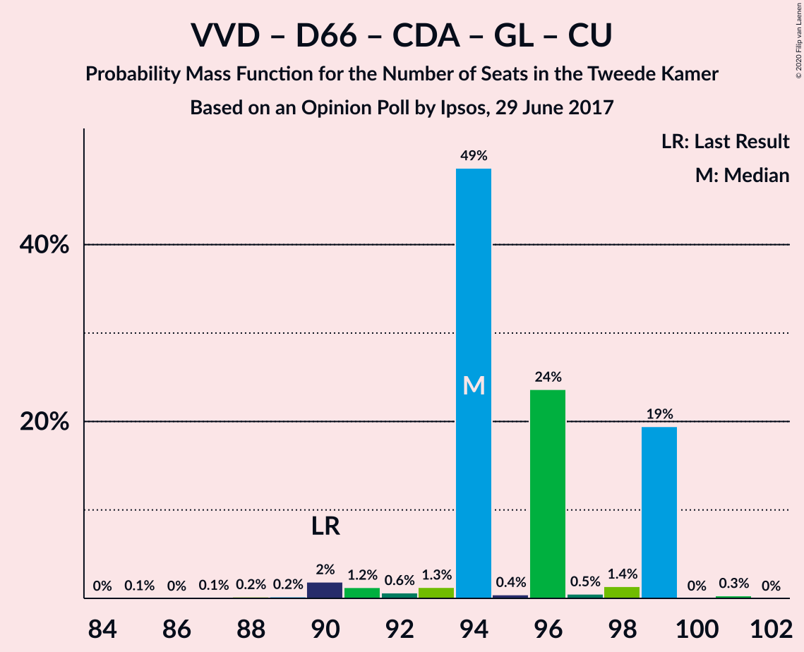

| Number of Seats | Probability | Accumulated | Special Marks |
|:---------------:|:-----------:|:-----------:|:-------------:|
| 85 | 0.1% | 100% |  |
| 86 | 0% | 99.9% |  |
| 87 | 0.1% | 99.9% |  |
| 88 | 0.2% | 99.8% |  |
| 89 | 0.2% | 99.6% |  |
| 90 | 2% | 99.4% | Last Result |
| 91 | 1.2% | 98% |  |
| 92 | 0.6% | 96% |  |
| 93 | 1.3% | 96% |  |
| 94 | 49% | 94% | Median |
| 95 | 0.4% | 46% |  |
| 96 | 24% | 45% |  |
| 97 | 0.5% | 22% |  |
| 98 | 1.4% | 21% |  |
| 99 | 19% | 20% |  |
| 100 | 0% | 0.3% |  |
| 101 | 0.3% | 0.3% |  |
| 102 | 0% | 0% |  |

### Volkspartij voor Vrijheid en Democratie – Democraten 66 – Christen-Democratisch Appèl – Partij van de Arbeid – ChristenUnie

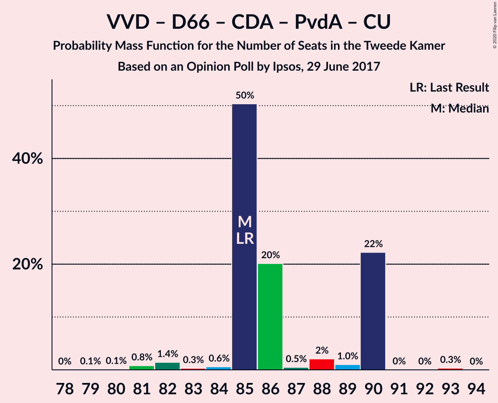

| Number of Seats | Probability | Accumulated | Special Marks |
|:---------------:|:-----------:|:-----------:|:-------------:|
| 78 | 0% | 100% |  |
| 79 | 0.1% | 99.9% |  |
| 80 | 0.1% | 99.9% |  |
| 81 | 0.8% | 99.8% |  |
| 82 | 1.4% | 99.0% |  |
| 83 | 0.3% | 98% |  |
| 84 | 0.6% | 97% |  |
| 85 | 50% | 97% | Last Result, Median |
| 86 | 20% | 46% |  |
| 87 | 0.5% | 26% |  |
| 88 | 2% | 26% |  |
| 89 | 1.0% | 24% |  |
| 90 | 22% | 23% |  |
| 91 | 0% | 0.4% |  |
| 92 | 0% | 0.4% |  |
| 93 | 0.3% | 0.3% |  |
| 94 | 0% | 0% |  |

### Volkspartij voor Vrijheid en Democratie – Partij voor de Vrijheid – Christen-Democratisch Appèl – Forum voor Democratie – Staatkundig Gereformeerde Partij

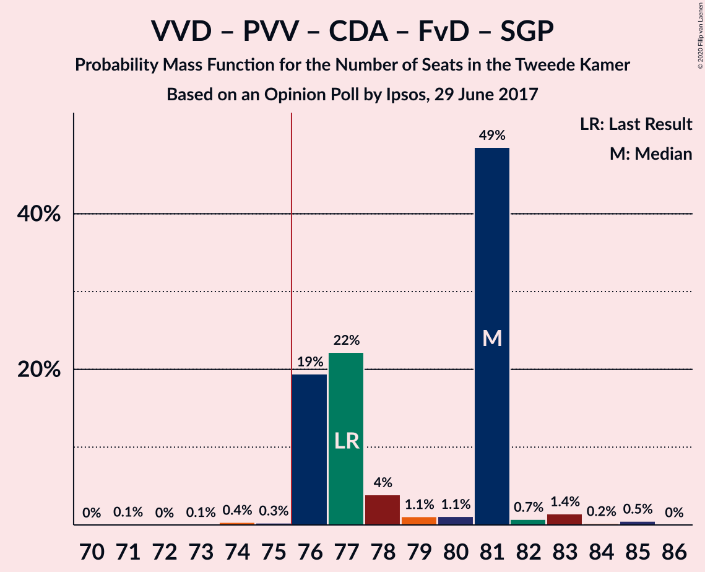

| Number of Seats | Probability | Accumulated | Special Marks |
|:---------------:|:-----------:|:-----------:|:-------------:|
| 71 | 0.1% | 100% |  |
| 72 | 0% | 99.9% |  |
| 73 | 0.1% | 99.9% |  |
| 74 | 0.4% | 99.8% |  |
| 75 | 0.3% | 99.4% |  |
| 76 | 19% | 99.2% | Majority |
| 77 | 22% | 80% | Last Result |
| 78 | 4% | 58% |  |
| 79 | 1.1% | 54% |  |
| 80 | 1.1% | 53% | Median |
| 81 | 49% | 51% |  |
| 82 | 0.7% | 3% |  |
| 83 | 1.4% | 2% |  |
| 84 | 0.2% | 0.7% |  |
| 85 | 0.5% | 0.5% |  |
| 86 | 0% | 0% |  |

### Volkspartij voor Vrijheid en Democratie – Democraten 66 – Christen-Democratisch Appèl – ChristenUnie

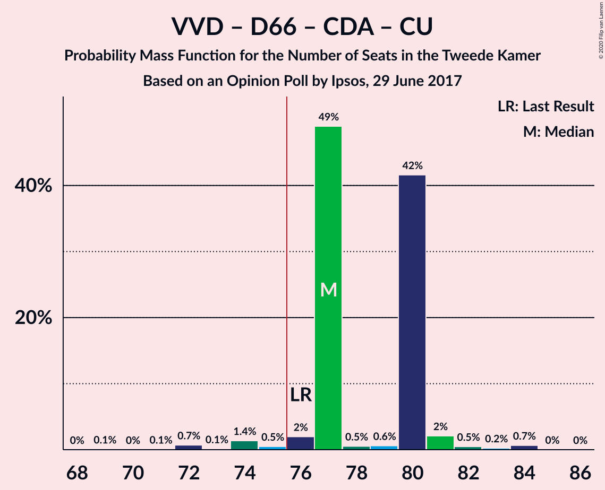

| Number of Seats | Probability | Accumulated | Special Marks |
|:---------------:|:-----------:|:-----------:|:-------------:|
| 69 | 0.1% | 100% |  |
| 70 | 0% | 99.9% |  |
| 71 | 0.1% | 99.9% |  |
| 72 | 0.7% | 99.9% |  |
| 73 | 0.1% | 99.2% |  |
| 74 | 1.4% | 99.1% |  |
| 75 | 0.5% | 98% |  |
| 76 | 2% | 97% | Last Result, Majority |
| 77 | 49% | 95% | Median |
| 78 | 0.5% | 46% |  |
| 79 | 0.6% | 46% |  |
| 80 | 42% | 45% |  |
| 81 | 2% | 4% |  |
| 82 | 0.5% | 1.4% |  |
| 83 | 0.2% | 0.9% |  |
| 84 | 0.7% | 0.7% |  |
| 85 | 0% | 0% |  |

### Volkspartij voor Vrijheid en Democratie – Partij voor de Vrijheid – Christen-Democratisch Appèl – Forum voor Democratie

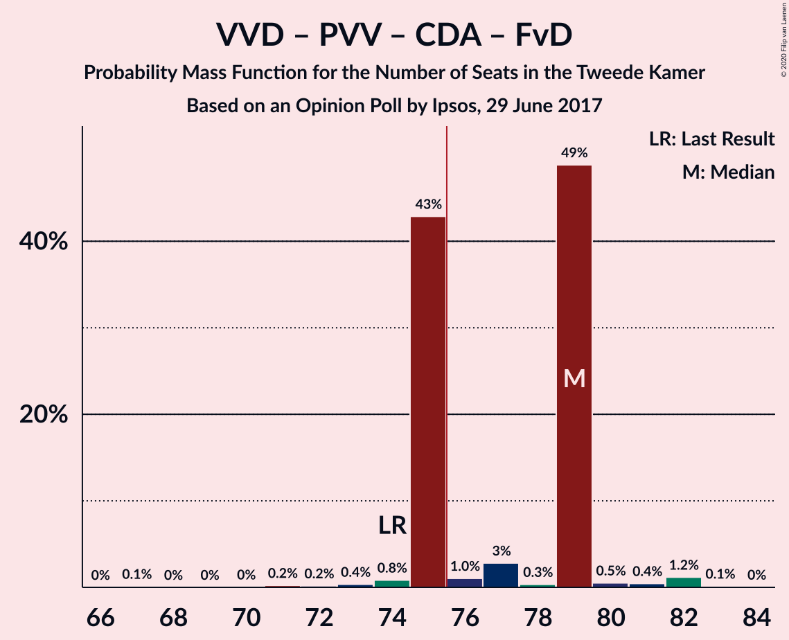

| Number of Seats | Probability | Accumulated | Special Marks |
|:---------------:|:-----------:|:-----------:|:-------------:|
| 67 | 0.1% | 100% |  |
| 68 | 0% | 99.9% |  |
| 69 | 0% | 99.9% |  |
| 70 | 0% | 99.9% |  |
| 71 | 0.2% | 99.8% |  |
| 72 | 0.2% | 99.6% |  |
| 73 | 0.4% | 99.4% |  |
| 74 | 0.8% | 99.1% | Last Result |
| 75 | 43% | 98% |  |
| 76 | 1.0% | 55% | Majority |
| 77 | 3% | 54% |  |
| 78 | 0.3% | 51% | Median |
| 79 | 49% | 51% |  |
| 80 | 0.5% | 2% |  |
| 81 | 0.4% | 2% |  |
| 82 | 1.2% | 1.4% |  |
| 83 | 0.1% | 0.2% |  |
| 84 | 0% | 0% |  |

### Democraten 66 – Christen-Democratisch Appèl – GroenLinks – Partij van de Arbeid – Socialistische Partij – ChristenUnie

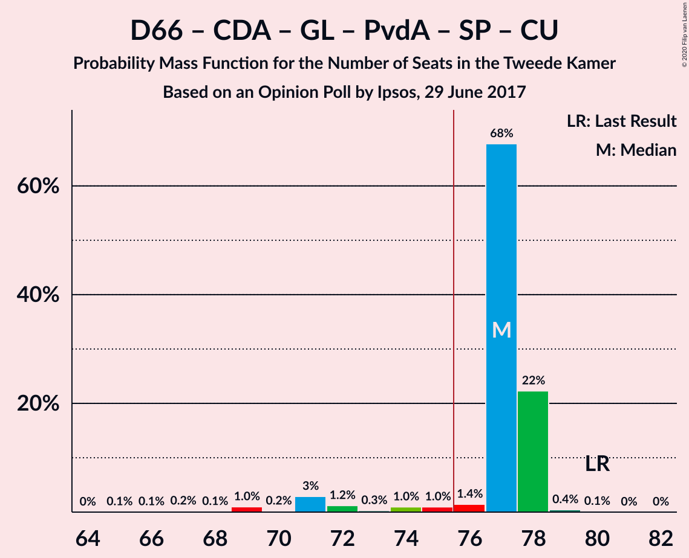

| Number of Seats | Probability | Accumulated | Special Marks |
|:---------------:|:-----------:|:-----------:|:-------------:|
| 65 | 0.1% | 100% |  |
| 66 | 0.1% | 99.9% |  |
| 67 | 0.2% | 99.9% |  |
| 68 | 0.1% | 99.7% |  |
| 69 | 1.0% | 99.6% |  |
| 70 | 0.2% | 98.6% |  |
| 71 | 3% | 98% |  |
| 72 | 1.2% | 96% |  |
| 73 | 0.3% | 94% |  |
| 74 | 1.0% | 94% |  |
| 75 | 1.0% | 93% |  |
| 76 | 1.4% | 92% | Median, Majority |
| 77 | 68% | 91% |  |
| 78 | 22% | 23% |  |
| 79 | 0.4% | 0.6% |  |
| 80 | 0.1% | 0.2% | Last Result |
| 81 | 0% | 0% |  |

### Volkspartij voor Vrijheid en Democratie – Democraten 66 – Christen-Democratisch Appèl

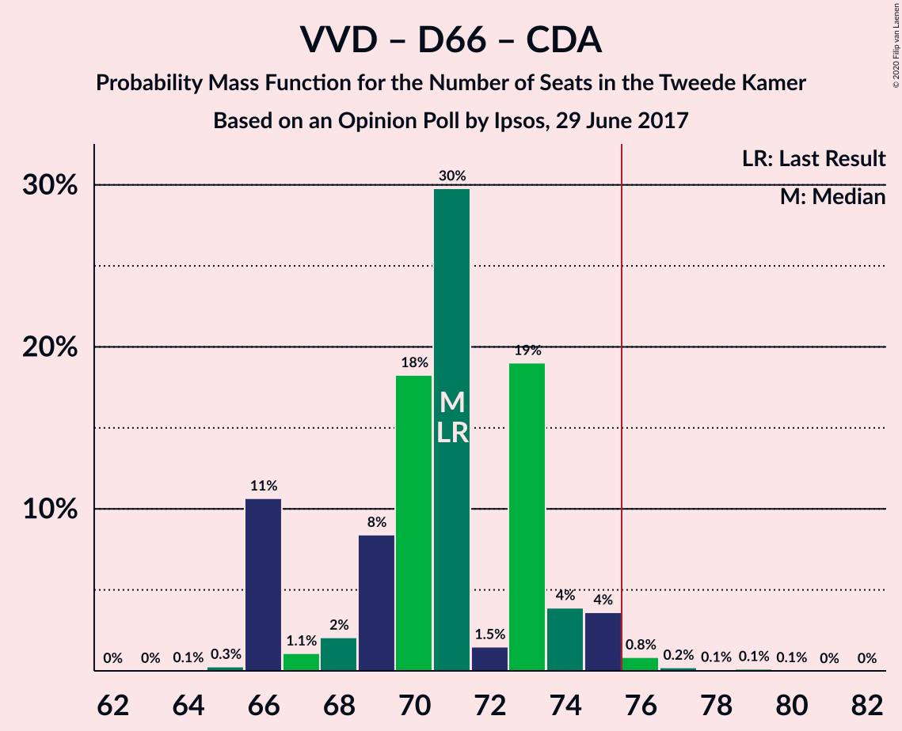

| Number of Seats | Probability | Accumulated | Special Marks |
|:---------------:|:-----------:|:-----------:|:-------------:|
| 64 | 0% | 100% |  |
| 65 | 0.1% | 99.9% |  |
| 66 | 0.6% | 99.8% |  |
| 67 | 0.4% | 99.2% |  |
| 68 | 0% | 98.8% |  |
| 69 | 2% | 98.8% |  |
| 70 | 2% | 97% |  |
| 71 | 1.3% | 95% | Last Result |
| 72 | 0.2% | 94% | Median |
| 73 | 68% | 94% |  |
| 74 | 22% | 26% |  |
| 75 | 2% | 4% |  |
| 76 | 0.9% | 1.4% | Majority |
| 77 | 0.3% | 0.5% |  |
| 78 | 0.2% | 0.2% |  |
| 79 | 0% | 0% |  |

### Volkspartij voor Vrijheid en Democratie – Partij voor de Vrijheid – Christen-Democratisch Appèl

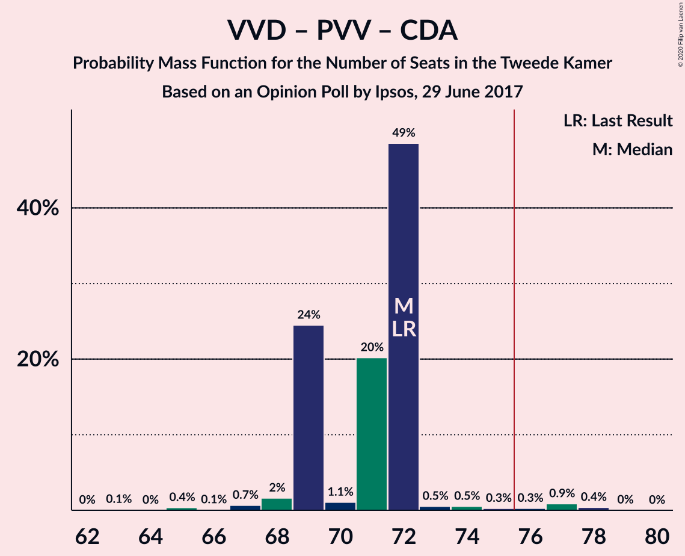

| Number of Seats | Probability | Accumulated | Special Marks |
|:---------------:|:-----------:|:-----------:|:-------------:|
| 63 | 0.1% | 100% |  |
| 64 | 0% | 99.9% |  |
| 65 | 0.4% | 99.9% |  |
| 66 | 0.1% | 99.5% |  |
| 67 | 0.7% | 99.4% |  |
| 68 | 2% | 98.8% |  |
| 69 | 24% | 97% |  |
| 70 | 1.1% | 73% |  |
| 71 | 20% | 72% | Median |
| 72 | 49% | 51% | Last Result |
| 73 | 0.5% | 3% |  |
| 74 | 0.5% | 2% |  |
| 75 | 0.3% | 2% |  |
| 76 | 0.3% | 2% | Majority |
| 77 | 0.9% | 1.3% |  |
| 78 | 0.4% | 0.4% |  |
| 79 | 0% | 0% |  |

### Democraten 66 – Christen-Democratisch Appèl – GroenLinks – Partij van de Arbeid – ChristenUnie

| Number of Seats | Probability | Accumulated | Special Marks |
|:---------------:|:-----------:|:-----------:|:-------------:|
| 59 | 0.3% | 100% |  |
| 60 | 0% | 99.7% |  |
| 61 | 0.3% | 99.7% |  |
| 62 | 0.3% | 99.4% |  |
| 63 | 1.0% | 99.1% |  |
| 64 | 2% | 98% |  |
| 65 | 1.4% | 96% |  |
| 66 | 0.7% | 95% | Last Result |
| 67 | 0.8% | 94% |  |
| 68 | 1.3% | 93% |  |
| 69 | 21% | 92% | Median |
| 70 | 49% | 71% |  |
| 71 | 22% | 23% |  |
| 72 | 0.3% | 0.3% |  |
| 73 | 0% | 0% |  |

### Volkspartij voor Vrijheid en Democratie – Christen-Democratisch Appèl – Forum voor Democratie – 50Plus – Staatkundig Gereformeerde Partij

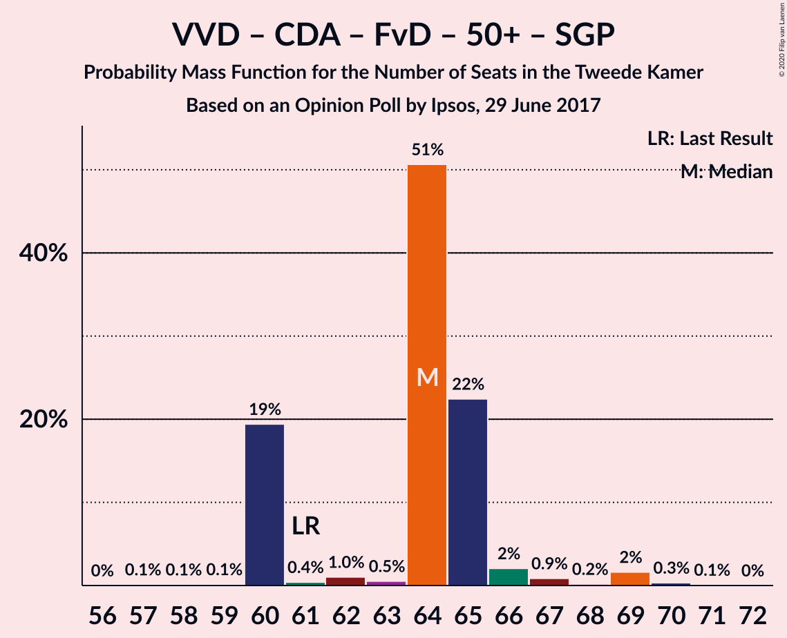

| Number of Seats | Probability | Accumulated | Special Marks |
|:---------------:|:-----------:|:-----------:|:-------------:|
| 57 | 0.1% | 100% |  |
| 58 | 0.1% | 99.9% |  |
| 59 | 0.1% | 99.8% |  |
| 60 | 19% | 99.6% |  |
| 61 | 0.4% | 80% | Last Result |
| 62 | 1.0% | 80% |  |
| 63 | 0.5% | 79% | Median |
| 64 | 51% | 78% |  |
| 65 | 22% | 28% |  |
| 66 | 2% | 5% |  |
| 67 | 0.9% | 3% |  |
| 68 | 0.2% | 2% |  |
| 69 | 2% | 2% |  |
| 70 | 0.3% | 0.4% |  |
| 71 | 0.1% | 0.1% |  |
| 72 | 0% | 0% |  |

### Volkspartij voor Vrijheid en Democratie – Democraten 66 – Partij van de Arbeid

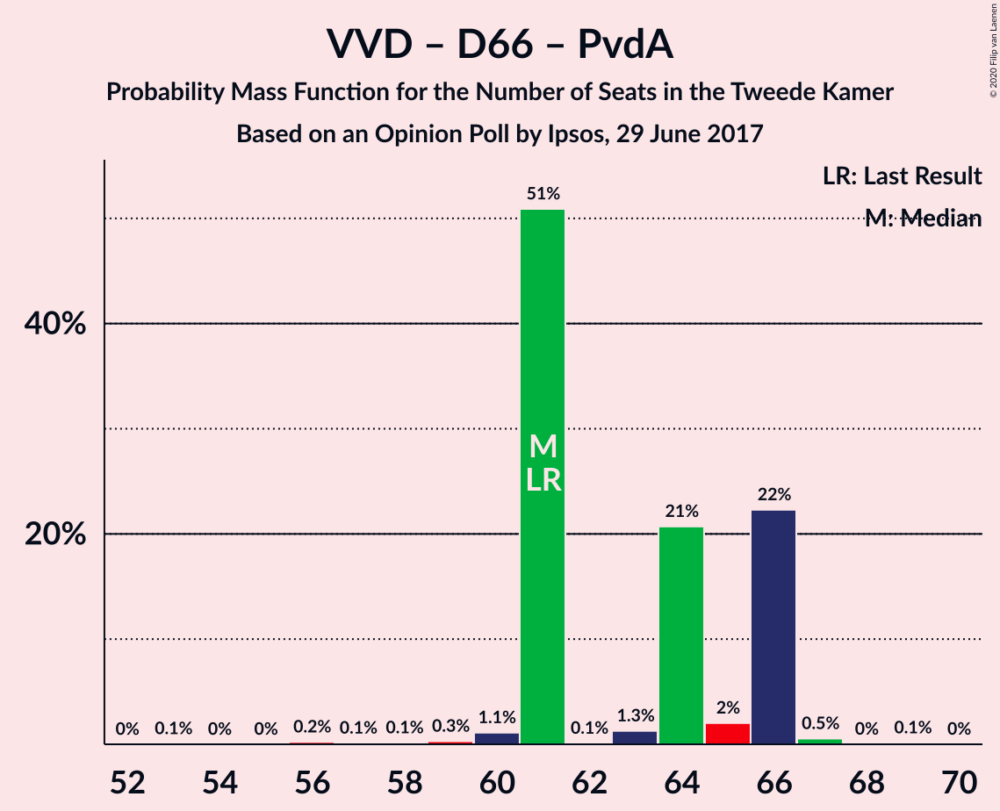

| Number of Seats | Probability | Accumulated | Special Marks |
|:---------------:|:-----------:|:-----------:|:-------------:|
| 53 | 0.1% | 100% |  |
| 54 | 0% | 99.9% |  |
| 55 | 0% | 99.9% |  |
| 56 | 0.2% | 99.9% |  |
| 57 | 0.1% | 99.7% |  |
| 58 | 0.1% | 99.6% |  |
| 59 | 0.3% | 99.4% |  |
| 60 | 1.1% | 99.1% |  |
| 61 | 51% | 98% | Last Result |
| 62 | 0.1% | 47% | Median |
| 63 | 1.3% | 47% |  |
| 64 | 21% | 46% |  |
| 65 | 2% | 25% |  |
| 66 | 22% | 23% |  |
| 67 | 0.5% | 0.7% |  |
| 68 | 0% | 0.2% |  |
| 69 | 0.1% | 0.2% |  |
| 70 | 0% | 0% |  |

### Volkspartij voor Vrijheid en Democratie – Christen-Democratisch Appèl – Forum voor Democratie – 50Plus

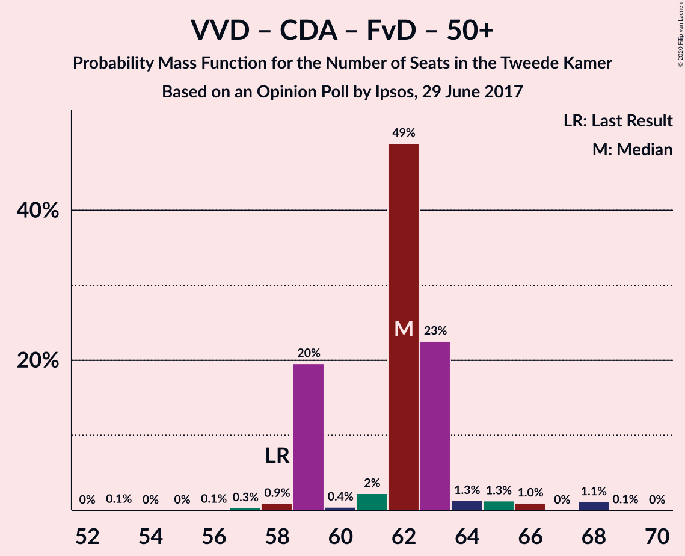

| Number of Seats | Probability | Accumulated | Special Marks |
|:---------------:|:-----------:|:-----------:|:-------------:|
| 53 | 0.1% | 100% |  |
| 54 | 0% | 99.9% |  |
| 55 | 0% | 99.9% |  |
| 56 | 0.1% | 99.9% |  |
| 57 | 0.3% | 99.7% |  |
| 58 | 0.9% | 99.4% | Last Result |
| 59 | 20% | 98% |  |
| 60 | 0.4% | 79% |  |
| 61 | 2% | 78% | Median |
| 62 | 49% | 76% |  |
| 63 | 23% | 27% |  |
| 64 | 1.3% | 5% |  |
| 65 | 1.3% | 3% |  |
| 66 | 1.0% | 2% |  |
| 67 | 0% | 1.2% |  |
| 68 | 1.1% | 1.2% |  |
| 69 | 0.1% | 0.1% |  |
| 70 | 0% | 0% |  |

### Volkspartij voor Vrijheid en Democratie – Christen-Democratisch Appèl – Partij van de Arbeid

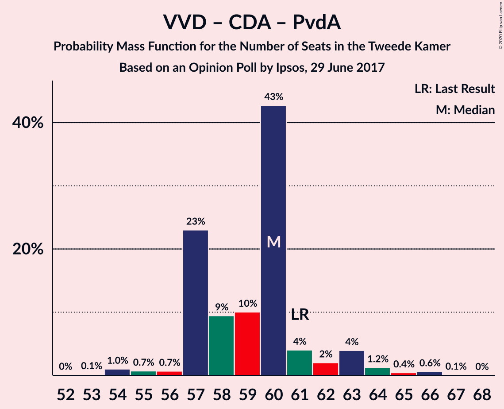

| Number of Seats | Probability | Accumulated | Special Marks |
|:---------------:|:-----------:|:-----------:|:-------------:|
| 54 | 0.2% | 100% |  |
| 55 | 0.3% | 99.8% |  |
| 56 | 0.4% | 99.5% |  |
| 57 | 20% | 99.0% |  |
| 58 | 1.3% | 79% |  |
| 59 | 2% | 78% | Median |
| 60 | 50% | 76% |  |
| 61 | 0.2% | 26% | Last Result |
| 62 | 0.7% | 26% |  |
| 63 | 24% | 25% |  |
| 64 | 0.2% | 1.4% |  |
| 65 | 1.1% | 1.2% |  |
| 66 | 0% | 0.1% |  |
| 67 | 0% | 0% |  |

### Volkspartij voor Vrijheid en Democratie – Christen-Democratisch Appèl – Forum voor Democratie – Staatkundig Gereformeerde Partij

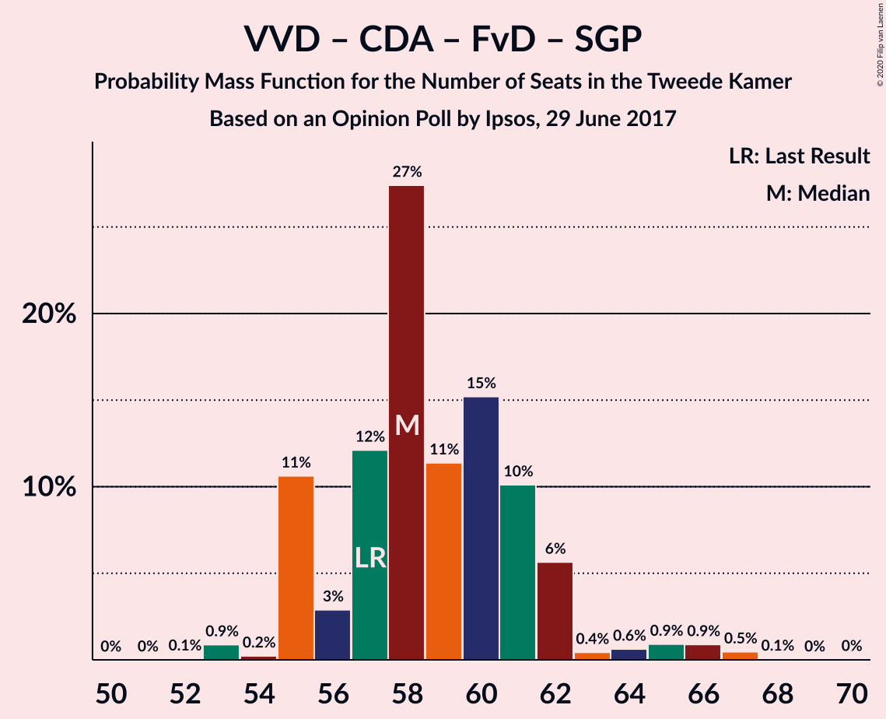

| Number of Seats | Probability | Accumulated | Special Marks |
|:---------------:|:-----------:|:-----------:|:-------------:|
| 53 | 0.1% | 100% |  |
| 54 | 0% | 99.8% |  |
| 55 | 0.1% | 99.8% |  |
| 56 | 19% | 99.8% |  |
| 57 | 0.5% | 80% | Last Result |
| 58 | 0.5% | 80% |  |
| 59 | 1.3% | 79% |  |
| 60 | 1.2% | 78% | Median |
| 61 | 72% | 77% |  |
| 62 | 2% | 5% |  |
| 63 | 0.6% | 3% |  |
| 64 | 2% | 2% |  |
| 65 | 0.1% | 0.6% |  |
| 66 | 0.4% | 0.5% |  |
| 67 | 0% | 0.1% |  |
| 68 | 0.1% | 0.1% |  |
| 69 | 0% | 0% |  |

### Volkspartij voor Vrijheid en Democratie – Christen-Democratisch Appèl – Forum voor Democratie

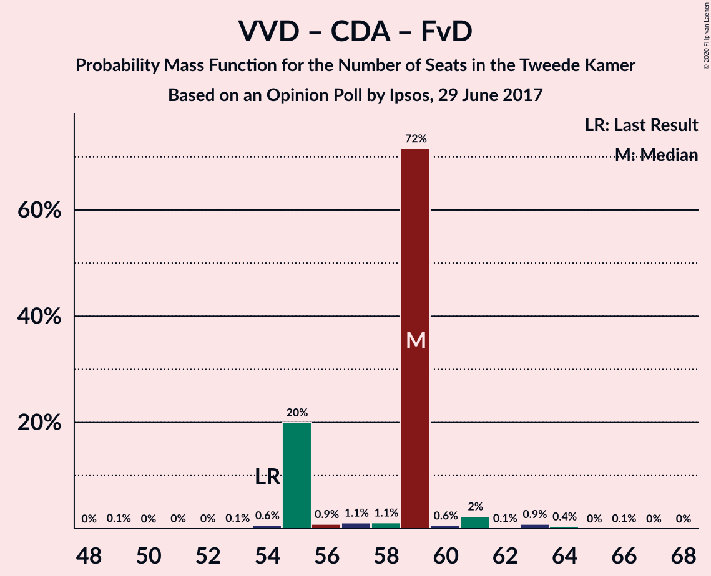

| Number of Seats | Probability | Accumulated | Special Marks |
|:---------------:|:-----------:|:-----------:|:-------------:|
| 49 | 0.1% | 100% |  |
| 50 | 0% | 99.9% |  |
| 51 | 0% | 99.9% |  |
| 52 | 0% | 99.8% |  |
| 53 | 0.1% | 99.8% |  |
| 54 | 0.6% | 99.7% | Last Result |
| 55 | 20% | 99.1% |  |
| 56 | 0.9% | 79% |  |
| 57 | 1.1% | 78% |  |
| 58 | 1.1% | 77% | Median |
| 59 | 72% | 76% |  |
| 60 | 0.6% | 4% |  |
| 61 | 2% | 4% |  |
| 62 | 0.1% | 1.5% |  |
| 63 | 0.9% | 1.4% |  |
| 64 | 0.4% | 0.5% |  |
| 65 | 0% | 0.1% |  |
| 66 | 0.1% | 0.1% |  |
| 67 | 0% | 0% |  |

### Volkspartij voor Vrijheid en Democratie – Christen-Democratisch Appèl

| Number of Seats | Probability | Accumulated | Special Marks |
|:---------------:|:-----------:|:-----------:|:-------------:|
| 45 | 0.2% | 100% |  |
| 46 | 0% | 99.8% |  |
| 47 | 0.2% | 99.8% |  |
| 48 | 0.8% | 99.6% |  |
| 49 | 0.2% | 98.9% |  |
| 50 | 2% | 98.7% |  |
| 51 | 21% | 97% | Median |
| 52 | 49% | 76% | Last Result |
| 53 | 24% | 27% |  |
| 54 | 0.9% | 3% |  |
| 55 | 0.5% | 2% |  |
| 56 | 0.7% | 2% |  |
| 57 | 0.1% | 1.3% |  |
| 58 | 1.1% | 1.2% |  |
| 59 | 0% | 0% |  |

### Democraten 66 – Christen-Democratisch Appèl – Partij van de Arbeid

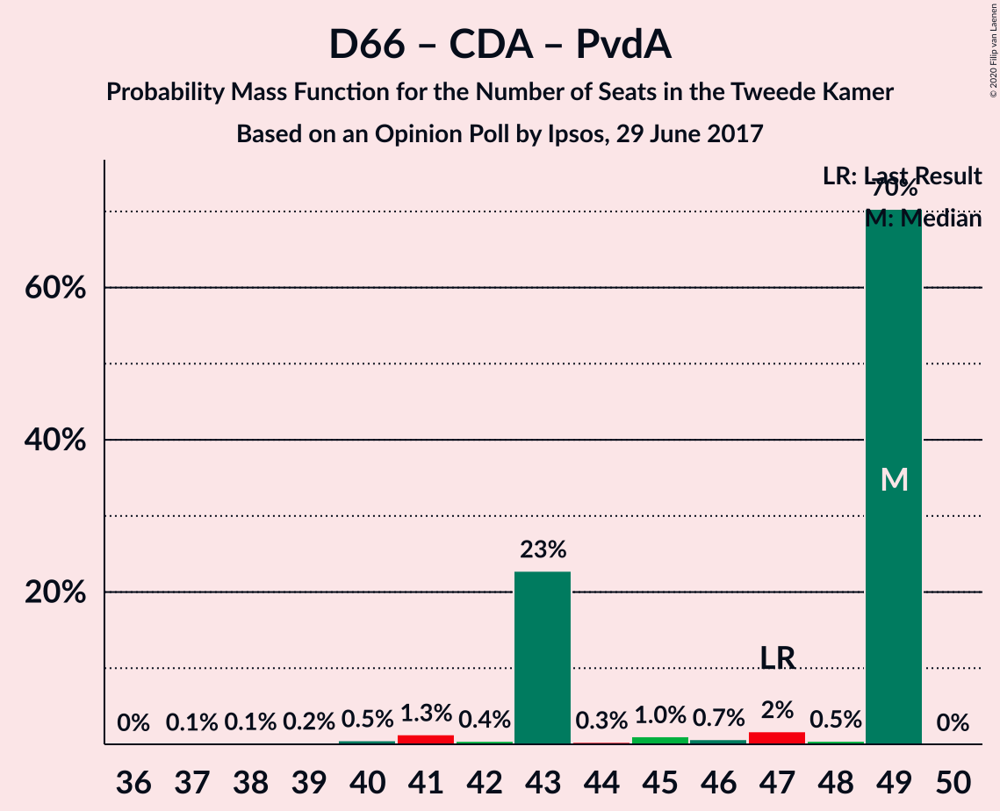

| Number of Seats | Probability | Accumulated | Special Marks |
|:---------------:|:-----------:|:-----------:|:-------------:|
| 37 | 0.1% | 100% |  |
| 38 | 0.1% | 99.9% |  |
| 39 | 0.2% | 99.8% |  |
| 40 | 0.5% | 99.6% |  |
| 41 | 1.3% | 99.1% |  |
| 42 | 0.4% | 98% |  |
| 43 | 23% | 97% |  |
| 44 | 0.3% | 75% |  |
| 45 | 1.0% | 74% |  |
| 46 | 0.7% | 73% |  |
| 47 | 2% | 73% | Last Result, Median |
| 48 | 0.5% | 71% |  |
| 49 | 70% | 70% |  |
| 50 | 0% | 0% |  |

### Volkspartij voor Vrijheid en Democratie – Partij van de Arbeid

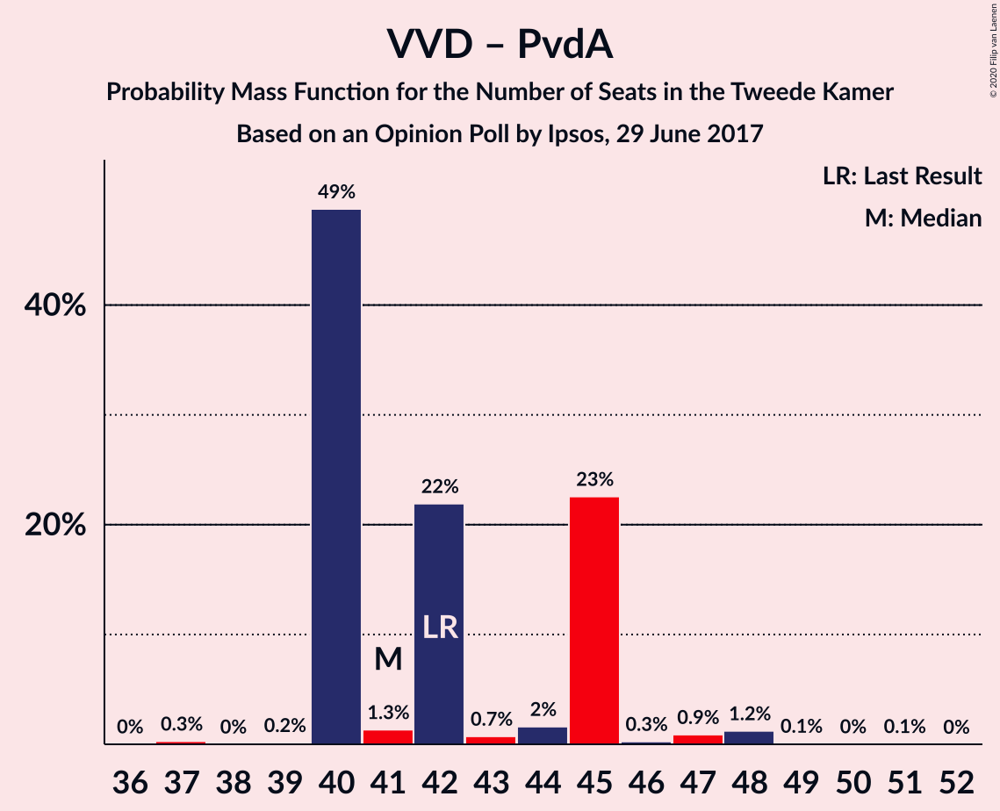

| Number of Seats | Probability | Accumulated | Special Marks |
|:---------------:|:-----------:|:-----------:|:-------------:|
| 37 | 0.3% | 100% |  |
| 38 | 0% | 99.7% |  |
| 39 | 0.2% | 99.7% |  |
| 40 | 49% | 99.5% |  |
| 41 | 1.3% | 51% | Median |
| 42 | 22% | 49% | Last Result |
| 43 | 0.7% | 27% |  |
| 44 | 2% | 27% |  |
| 45 | 23% | 25% |  |
| 46 | 0.3% | 3% |  |
| 47 | 0.9% | 2% |  |
| 48 | 1.2% | 1.4% |  |
| 49 | 0.1% | 0.2% |  |
| 50 | 0% | 0.1% |  |
| 51 | 0.1% | 0.1% |  |
| 52 | 0% | 0% |  |

### Democraten 66 – Christen-Democratisch Appèl

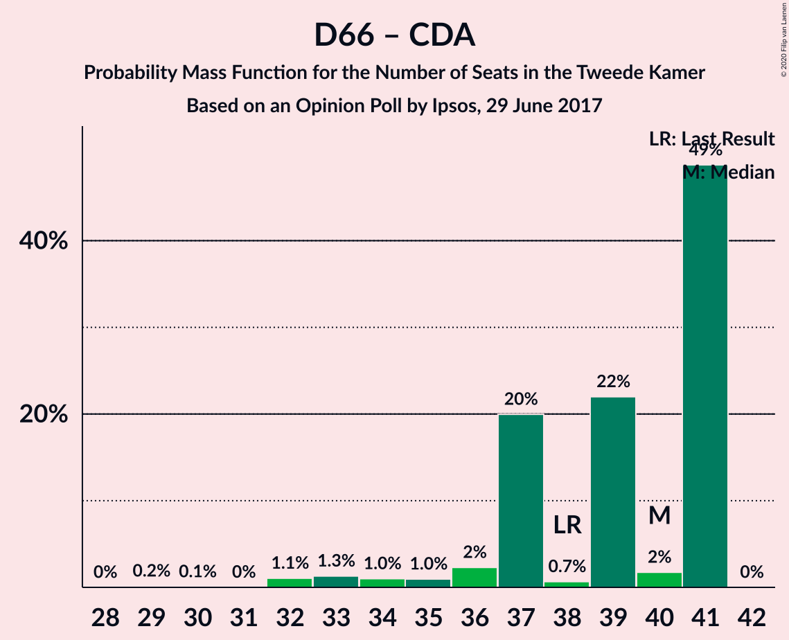

| Number of Seats | Probability | Accumulated | Special Marks |
|:---------------:|:-----------:|:-----------:|:-------------:|
| 29 | 0.2% | 100% |  |
| 30 | 0.1% | 99.8% |  |
| 31 | 0% | 99.8% |  |
| 32 | 1.1% | 99.8% |  |
| 33 | 1.3% | 98.7% |  |
| 34 | 1.0% | 97% |  |
| 35 | 1.0% | 96% |  |
| 36 | 2% | 95% |  |
| 37 | 20% | 93% |  |
| 38 | 0.7% | 73% | Last Result |
| 39 | 22% | 73% | Median |
| 40 | 2% | 51% |  |
| 41 | 49% | 49% |  |
| 42 | 0% | 0% |  |

### Christen-Democratisch Appèl – Partij van de Arbeid – ChristenUnie

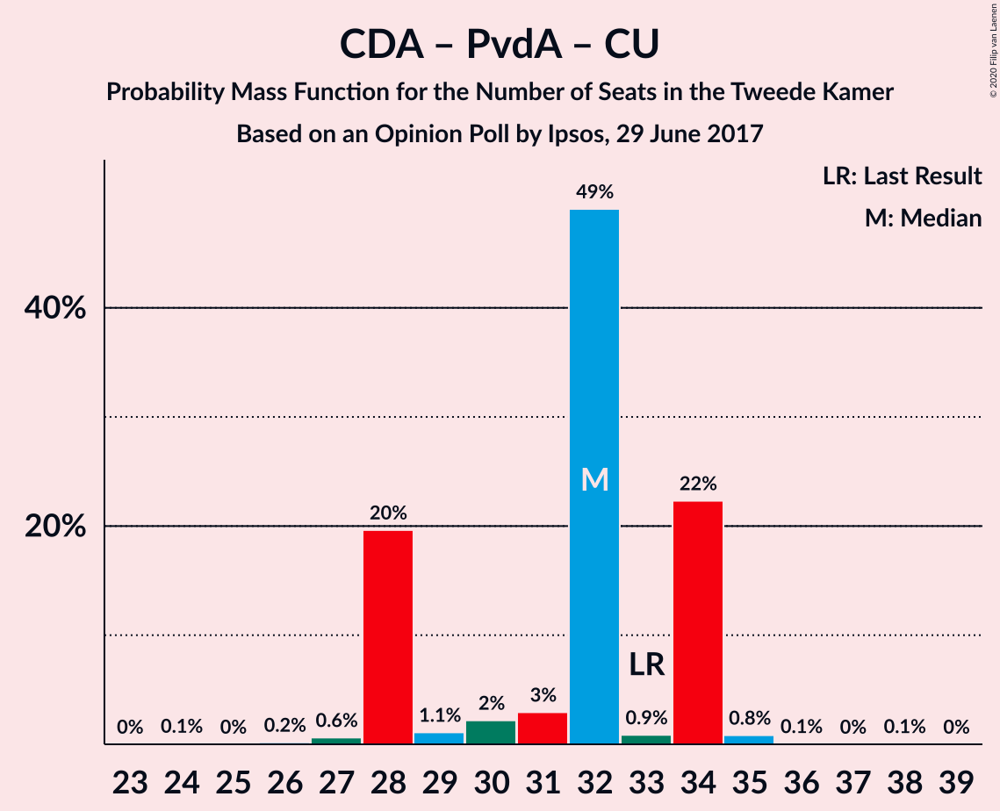

| Number of Seats | Probability | Accumulated | Special Marks |
|:---------------:|:-----------:|:-----------:|:-------------:|
| 24 | 0.1% | 100% |  |
| 25 | 0% | 99.9% |  |
| 26 | 0.2% | 99.9% |  |
| 27 | 0.6% | 99.7% |  |
| 28 | 20% | 99.1% |  |
| 29 | 1.1% | 79% |  |
| 30 | 2% | 78% |  |
| 31 | 3% | 76% | Median |
| 32 | 49% | 73% |  |
| 33 | 0.9% | 24% | Last Result |
| 34 | 22% | 23% |  |
| 35 | 0.8% | 1.0% |  |
| 36 | 0.1% | 0.1% |  |
| 37 | 0% | 0.1% |  |
| 38 | 0.1% | 0.1% |  |
| 39 | 0% | 0% |  |

### Christen-Democratisch Appèl – Partij van de Arbeid

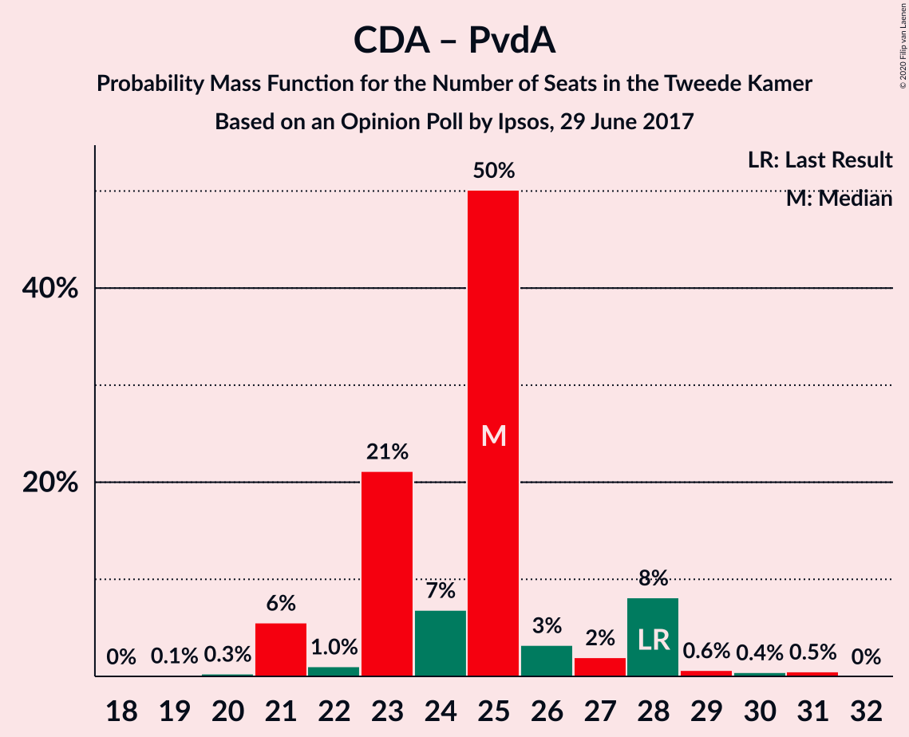

| Number of Seats | Probability | Accumulated | Special Marks |
|:---------------:|:-----------:|:-----------:|:-------------:|
| 19 | 0.1% | 100% |  |
| 20 | 0.2% | 99.9% |  |
| 21 | 20% | 99.7% |  |
| 22 | 0.4% | 80% |  |
| 23 | 1.0% | 80% |  |
| 24 | 2% | 79% |  |
| 25 | 4% | 77% |  |
| 26 | 1.1% | 73% | Median |
| 27 | 0.5% | 71% |  |
| 28 | 71% | 71% | Last Result |
| 29 | 0.1% | 0.2% |  |
| 30 | 0.1% | 0.1% |  |
| 31 | 0% | 0% |  |

## Technical Information

### Opinion Poll

+ **Polling firm:** Ipsos
+ **Commissioner(s):** —
+ **Fieldwork period:** 29 June 2017

### Calculations

+ **Sample size:** 1000
+ **Simulations done:** 131,072
+ **Error estimate:** 3.28%

