# Opinion Poll by Peil.nl, 2 July 2017

<a href="#voting-intentions">Voting Intentions</a> | <a href="#seats">Seats</a> | <a href="#coalitions">Coalitions</a> | <a href="#technical-information">Technical Information</a>

## Voting Intentions

### Confidence Intervals

| Party | Last Result | Poll Result | 80% Confidence Interval | 90% Confidence Interval | 95% Confidence Interval | 99% Confidence Interval |
|:-----:|:-----------:|:-----------:|:-----------------------:|:-----------------------:|:-----------------------:|:-----------------------:|
| Volkspartij voor Vrijheid en Democratie | 21.3% | 22.0% | 21.0–23.0% |20.8–23.3% |20.5–23.5% |20.1–24.0% |
| Partij voor de Vrijheid | 13.1% | 14.0% | 13.2–14.8% |13.0–15.1% |12.8–15.3% |12.4–15.7% |
| Democraten 66 | 12.2% | 13.3% | 12.6–14.2% |12.3–14.4% |12.2–14.6% |11.8–15.0% |
| Christen-Democratisch Appèl | 12.4% | 10.7% | 10.0–11.4% |9.8–11.6% |9.6–11.8% |9.3–12.2% |
| GroenLinks | 9.1% | 8.7% | 8.0–9.4% |7.8–9.6% |7.7–9.7% |7.4–10.1% |
| Partij van de Arbeid | 5.7% | 8.0% | 7.4–8.7% |7.2–8.9% |7.1–9.0% |6.8–9.4% |
| Socialistische Partij | 9.1% | 7.3% | 6.8–8.0% |6.6–8.2% |6.4–8.3% |6.2–8.6% |
| ChristenUnie | 3.4% | 3.3% | 2.9–3.8% |2.8–3.9% |2.7–4.0% |2.6–4.3% |
| Partij voor de Dieren | 3.2% | 3.3% | 2.9–3.8% |2.8–3.9% |2.7–4.0% |2.6–4.3% |
| Forum voor Democratie | 1.8% | 3.3% | 2.9–3.8% |2.8–3.9% |2.7–4.0% |2.6–4.3% |
| 50Plus | 3.1% | 2.0% | 1.7–2.4% |1.6–2.5% |1.6–2.6% |1.4–2.8% |
| Staatkundig Gereformeerde Partij | 2.1% | 2.0% | 1.7–2.4% |1.6–2.5% |1.6–2.6% |1.4–2.8% |
| DENK | 2.1% | 2.0% | 1.7–2.4% |1.6–2.5% |1.6–2.6% |1.4–2.8% |

*Note:* The poll result column reflects the actual value used in the calculations. Published results may vary slightly, and in addition be rounded to fewer digits.

## Seats

### Confidence Intervals

| Party | Last Result | Median | 80% Confidence Interval | 90% Confidence Interval | 95% Confidence Interval | 99% Confidence Interval |
|:-----:|:-----------:|:------:|:-----------------------:|:-----------------------:|:-----------------------:|:-----------------------:|
| <a href="#volkspartij-voor-vrijheid-en-democratie">Volkspartij voor Vrijheid en Democratie</a> | 33 | 33 | 33 |32–34 |32–34 |31–35 |
| <a href="#partij-voor-de-vrijheid">Partij voor de Vrijheid</a> | 20 | 21 | 21–22 |21–22 |21–22 |20–23 |
| <a href="#democraten-66">Democraten 66</a> | 19 | 21 | 21 |20–21 |20–22 |19–22 |
| <a href="#christen-democratisch-appèl">Christen-Democratisch Appèl</a> | 19 | 17 | 17 |17–18 |14–18 |14–18 |
| <a href="#groenlinks">GroenLinks</a> | 14 | 12 | 12–13 |12–14 |12–14 |11–14 |
| <a href="#partij-van-de-arbeid">Partij van de Arbeid</a> | 9 | 12 | 12 |12–13 |10–14 |10–14 |
| <a href="#socialistische-partij">Socialistische Partij</a> | 14 | 12 | 11–12 |11–12 |11–12 |9–13 |
| <a href="#christenunie">ChristenUnie</a> | 5 | 5 | 5 |4–5 |4–6 |4–6 |
| <a href="#partij-voor-de-dieren">Partij voor de Dieren</a> | 5 | 4 | 4 |4–5 |4–5 |4–6 |
| <a href="#forum-voor-democratie">Forum voor Democratie</a> | 2 | 5 | 5 |5 |5 |4–6 |
| <a href="#50plus">50Plus</a> | 4 | 2 | 2 |2–3 |2–3 |2–3 |
| <a href="#staatkundig-gereformeerde-partij">Staatkundig Gereformeerde Partij</a> | 3 | 3 | 3 |2–3 |2–3 |2–3 |
| <a href="#denk">DENK</a> | 3 | 3 | 2–3 |2–3 |2–3 |2–4 |

### Volkspartij voor Vrijheid en Democratie

*For a full overview of the results for this party, see the [Volkspartij voor Vrijheid en Democratie](party-volkspartijvoorvrijheidendemocratie.html) page.*

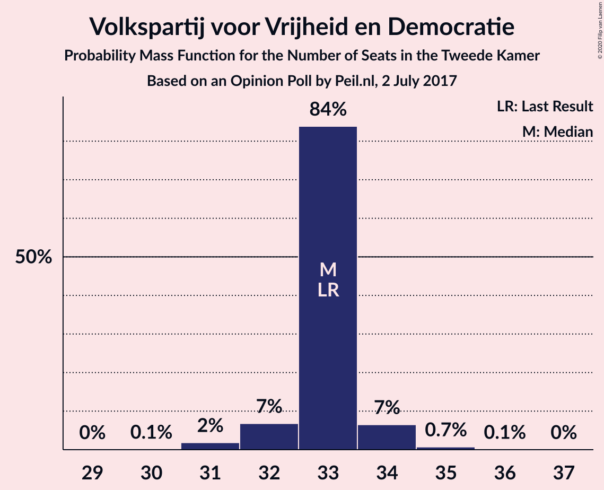

| Number of Seats | Probability | Accumulated | Special Marks |
|:---------------:|:-----------:|:-----------:|:-------------:|
| 30 | 0.1% | 100% |  |
| 31 | 2% | 99.9% |  |
| 32 | 7% | 98% |  |
| 33 | 84% | 91% | Last Result, Median |
| 34 | 7% | 7% |  |
| 35 | 0.7% | 0.8% |  |
| 36 | 0.1% | 0.1% |  |
| 37 | 0% | 0% |  |

### Partij voor de Vrijheid

*For a full overview of the results for this party, see the [Partij voor de Vrijheid](party-partijvoordevrijheid.html) page.*

| Number of Seats | Probability | Accumulated | Special Marks |
|:---------------:|:-----------:|:-----------:|:-------------:|
| 19 | 0.4% | 100% |  |
| 20 | 1.1% | 99.5% | Last Result |
| 21 | 86% | 98% | Median |
| 22 | 11% | 12% |  |
| 23 | 0.8% | 0.8% |  |
| 24 | 0.1% | 0.1% |  |
| 25 | 0% | 0% |  |

### Democraten 66

*For a full overview of the results for this party, see the [Democraten 66](party-democraten66.html) page.*

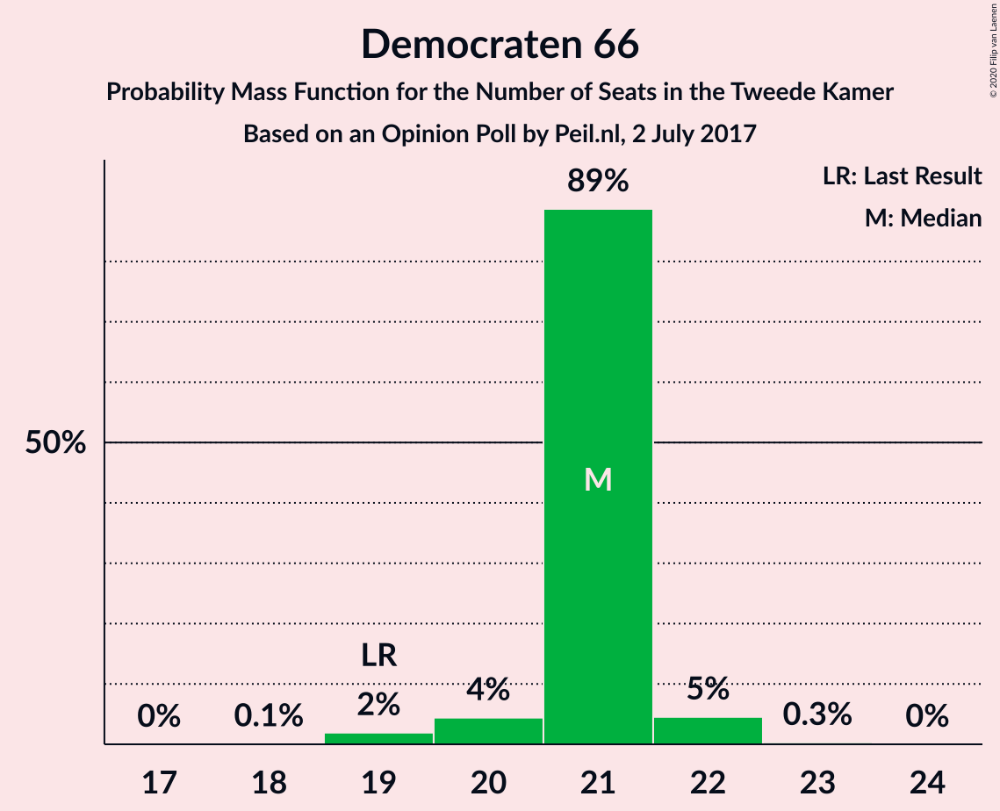

| Number of Seats | Probability | Accumulated | Special Marks |
|:---------------:|:-----------:|:-----------:|:-------------:|
| 18 | 0.1% | 100% |  |
| 19 | 2% | 99.9% | Last Result |
| 20 | 4% | 98% |  |
| 21 | 89% | 94% | Median |
| 22 | 5% | 5% |  |
| 23 | 0.3% | 0.3% |  |
| 24 | 0% | 0% |  |

### Christen-Democratisch Appèl

*For a full overview of the results for this party, see the [Christen-Democratisch Appèl](party-christen-democratischappèl.html) page.*

| Number of Seats | Probability | Accumulated | Special Marks |
|:---------------:|:-----------:|:-----------:|:-------------:|
| 13 | 0.1% | 100% |  |
| 14 | 3% | 99.9% |  |
| 15 | 0.4% | 97% |  |
| 16 | 1.2% | 96% |  |
| 17 | 89% | 95% | Median |
| 18 | 6% | 6% |  |
| 19 | 0% | 0% | Last Result |

### GroenLinks

*For a full overview of the results for this party, see the [GroenLinks](party-groenlinks.html) page.*

| Number of Seats | Probability | Accumulated | Special Marks |
|:---------------:|:-----------:|:-----------:|:-------------:|
| 11 | 0.5% | 100% |  |
| 12 | 89% | 99.5% | Median |
| 13 | 4% | 11% |  |
| 14 | 6% | 6% | Last Result |
| 15 | 0.1% | 0.1% |  |
| 16 | 0% | 0% |  |

### Partij van de Arbeid

*For a full overview of the results for this party, see the [Partij van de Arbeid](party-partijvandearbeid.html) page.*

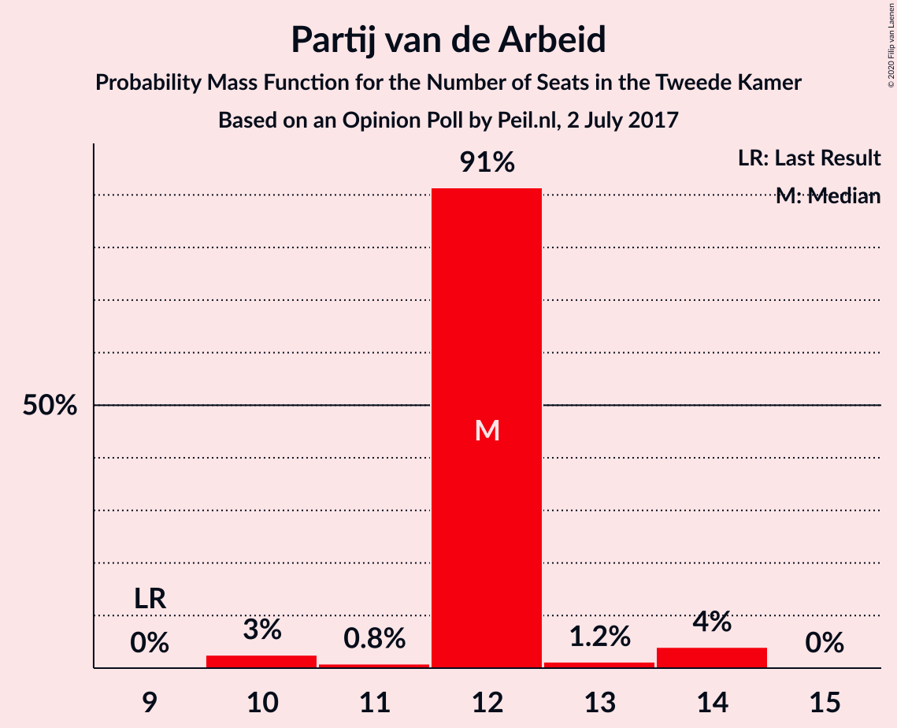

| Number of Seats | Probability | Accumulated | Special Marks |
|:---------------:|:-----------:|:-----------:|:-------------:|
| 9 | 0% | 100% | Last Result |
| 10 | 3% | 100% |  |
| 11 | 0.8% | 97% |  |
| 12 | 91% | 97% | Median |
| 13 | 1.2% | 5% |  |
| 14 | 4% | 4% |  |
| 15 | 0% | 0% |  |

### Socialistische Partij

*For a full overview of the results for this party, see the [Socialistische Partij](party-socialistischepartij.html) page.*

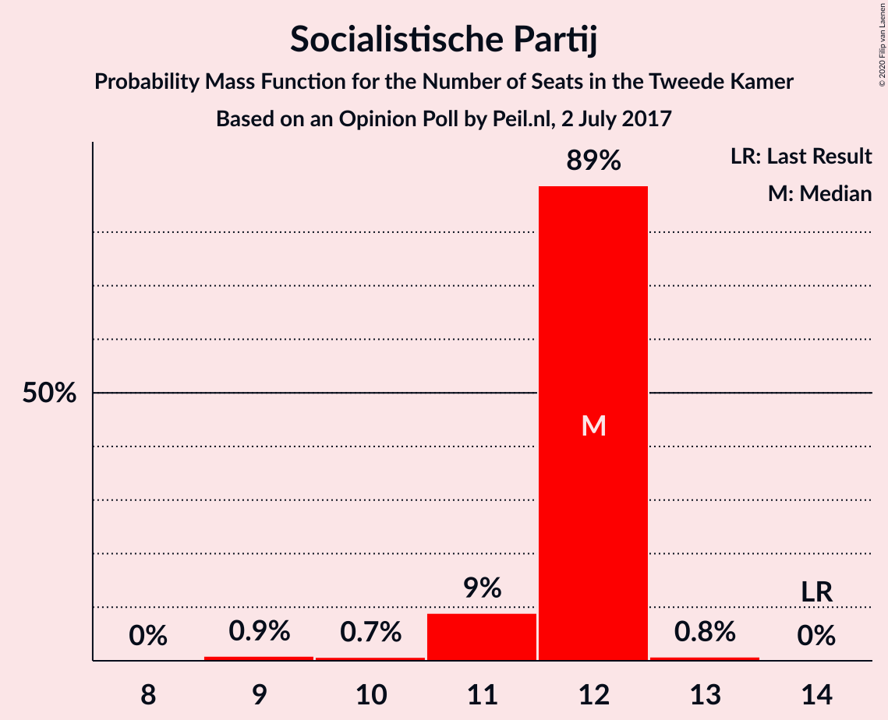

| Number of Seats | Probability | Accumulated | Special Marks |
|:---------------:|:-----------:|:-----------:|:-------------:|
| 9 | 0.9% | 100% |  |
| 10 | 0.7% | 99.1% |  |
| 11 | 9% | 98% |  |
| 12 | 89% | 89% | Median |
| 13 | 0.8% | 0.8% |  |
| 14 | 0% | 0% | Last Result |

### ChristenUnie

*For a full overview of the results for this party, see the [ChristenUnie](party-christenunie.html) page.*

| Number of Seats | Probability | Accumulated | Special Marks |
|:---------------:|:-----------:|:-----------:|:-------------:|
| 4 | 8% | 100% |  |
| 5 | 89% | 92% | Last Result, Median |
| 6 | 3% | 3% |  |
| 7 | 0% | 0% |  |

### Partij voor de Dieren

*For a full overview of the results for this party, see the [Partij voor de Dieren](party-partijvoordedieren.html) page.*

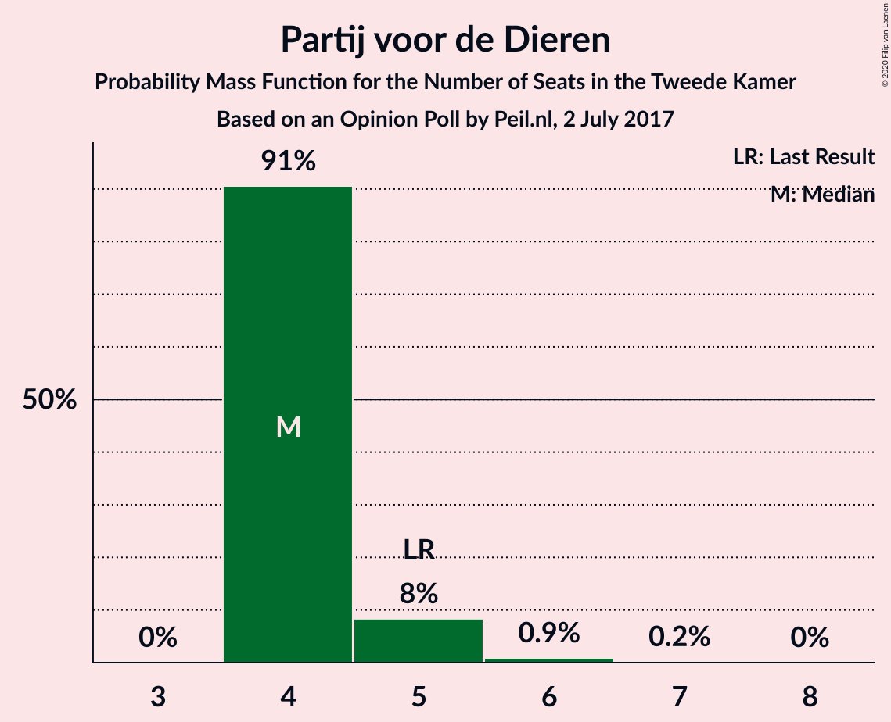

| Number of Seats | Probability | Accumulated | Special Marks |
|:---------------:|:-----------:|:-----------:|:-------------:|
| 4 | 91% | 100% | Median |
| 5 | 8% | 9% | Last Result |
| 6 | 0.9% | 1.1% |  |
| 7 | 0.2% | 0.2% |  |
| 8 | 0% | 0% |  |

### Forum voor Democratie

*For a full overview of the results for this party, see the [Forum voor Democratie](party-forumvoordemocratie.html) page.*

| Number of Seats | Probability | Accumulated | Special Marks |
|:---------------:|:-----------:|:-----------:|:-------------:|
| 2 | 0% | 100% | Last Result |
| 3 | 0% | 100% |  |
| 4 | 0.6% | 100% |  |
| 5 | 98.8% | 99.4% | Median |
| 6 | 0.6% | 0.6% |  |
| 7 | 0% | 0% |  |

### 50Plus

*For a full overview of the results for this party, see the [50Plus](party-50plus.html) page.*

| Number of Seats | Probability | Accumulated | Special Marks |
|:---------------:|:-----------:|:-----------:|:-------------:|
| 1 | 0.1% | 100% |  |
| 2 | 92% | 99.9% | Median |
| 3 | 7% | 7% |  |
| 4 | 0.1% | 0.2% | Last Result |
| 5 | 0% | 0% |  |

### Staatkundig Gereformeerde Partij

*For a full overview of the results for this party, see the [Staatkundig Gereformeerde Partij](party-staatkundiggereformeerdepartij.html) page.*

| Number of Seats | Probability | Accumulated | Special Marks |
|:---------------:|:-----------:|:-----------:|:-------------:|
| 2 | 9% | 100% |  |
| 3 | 91% | 91% | Last Result, Median |
| 4 | 0.3% | 0.3% |  |
| 5 | 0% | 0% |  |

### DENK

*For a full overview of the results for this party, see the [DENK](party-denk.html) page.*

| Number of Seats | Probability | Accumulated | Special Marks |
|:---------------:|:-----------:|:-----------:|:-------------:|
| 2 | 11% | 100% |  |
| 3 | 88% | 89% | Last Result, Median |
| 4 | 1.0% | 1.0% |  |
| 5 | 0% | 0% |  |

## Coalitions

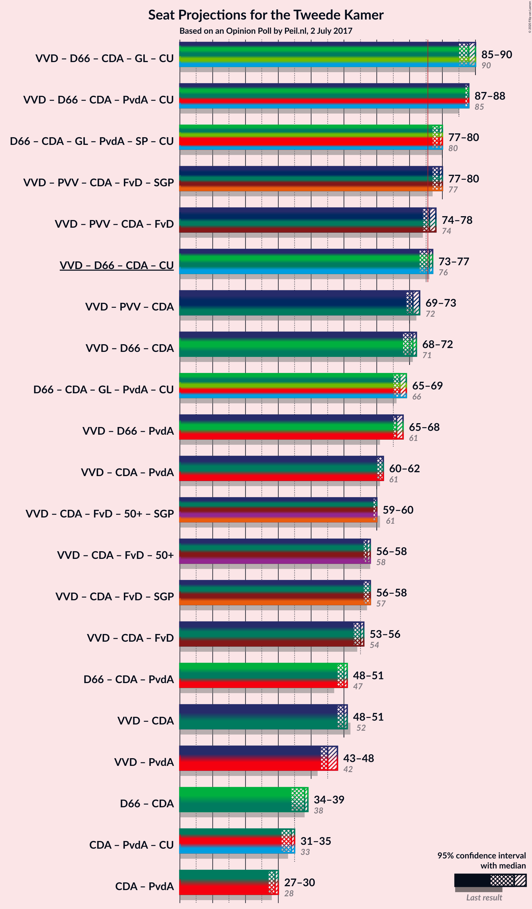

### Confidence Intervals

| Coalition | Last Result | Median | Majority? | 80% Confidence Interval | 90% Confidence Interval | 95% Confidence Interval | 99% Confidence Interval |
|:---------:|:-----------:|:------:|:---------:|:-----------------------:|:-----------------------:|:-----------------------:|:-----------------------:|
| Volkspartij voor Vrijheid en Democratie – Democraten 66 – Christen-Democratisch Appèl – GroenLinks – ChristenUnie | 90 | 88 | 100% | 88 | 87–89 | 85–90 | 85–90 |
| Volkspartij voor Vrijheid en Democratie – Democraten 66 – Christen-Democratisch Appèl – Partij van de Arbeid – ChristenUnie | 85 | 88 | 100% | 87–88 | 87–88 | 87–88 | 83–89 |
| Democraten 66 – Christen-Democratisch Appèl – GroenLinks – Partij van de Arbeid – Socialistische Partij – ChristenUnie | 80 | 79 | 99.3% | 79 | 77–80 | 77–80 | 75–81 |
| Volkspartij voor Vrijheid en Democratie – Partij voor de Vrijheid – Christen-Democratisch Appèl – Forum voor Democratie – Staatkundig Gereformeerde Partij | 77 | 79 | 99.9% | 79 | 78–79 | 77–80 | 77–82 |
| Volkspartij voor Vrijheid en Democratie – Partij voor de Vrijheid – Christen-Democratisch Appèl – Forum voor Democratie | 74 | 76 | 93% | 76 | 75–77 | 74–78 | 74–79 |
| Volkspartij voor Vrijheid en Democratie – Democraten 66 – Christen-Democratisch Appèl – ChristenUnie | 76 | 76 | 89% | 75–76 | 74–76 | 73–77 | 72–77 |
| Volkspartij voor Vrijheid en Democratie – Partij voor de Vrijheid – Christen-Democratisch Appèl | 72 | 71 | 0% | 71 | 70–72 | 69–73 | 69–74 |
| Volkspartij voor Vrijheid en Democratie – Democraten 66 – Christen-Democratisch Appèl | 71 | 71 | 0% | 71 | 69–71 | 68–72 | 67–73 |
| Democraten 66 – Christen-Democratisch Appèl – GroenLinks – Partij van de Arbeid – ChristenUnie | 66 | 67 | 0% | 67 | 66–69 | 65–69 | 64–70 |
| Volkspartij voor Vrijheid en Democratie – Democraten 66 – Partij van de Arbeid | 61 | 66 | 0% | 66 | 65–66 | 65–68 | 62–68 |
| Volkspartij voor Vrijheid en Democratie – Christen-Democratisch Appèl – Partij van de Arbeid | 61 | 62 | 0% | 62 | 61–62 | 60–62 | 59–65 |
| Volkspartij voor Vrijheid en Democratie – Christen-Democratisch Appèl – Forum voor Democratie – 50Plus – Staatkundig Gereformeerde Partij | 61 | 60 | 0% | 59–60 | 59–60 | 59–60 | 58–63 |
| Volkspartij voor Vrijheid en Democratie – Christen-Democratisch Appèl – Forum voor Democratie – 50Plus | 58 | 57 | 0% | 57 | 56–57 | 56–58 | 56–60 |
| Volkspartij voor Vrijheid en Democratie – Christen-Democratisch Appèl – Forum voor Democratie – Staatkundig Gereformeerde Partij | 57 | 58 | 0% | 57–58 | 56–58 | 56–58 | 56–61 |
| Volkspartij voor Vrijheid en Democratie – Christen-Democratisch Appèl – Forum voor Democratie | 54 | 55 | 0% | 55 | 53–55 | 53–56 | 53–58 |
| Democraten 66 – Christen-Democratisch Appèl – Partij van de Arbeid | 47 | 50 | 0% | 50 | 49–51 | 48–51 | 46–51 |
| Volkspartij voor Vrijheid en Democratie – Christen-Democratisch Appèl | 52 | 50 | 0% | 50 | 48–50 | 48–51 | 48–53 |
| Volkspartij voor Vrijheid en Democratie – Partij van de Arbeid | 42 | 45 | 0% | 44–45 | 44–46 | 43–48 | 43–48 |
| Democraten 66 – Christen-Democratisch Appèl | 38 | 38 | 0% | 38 | 36–39 | 34–39 | 34–39 |
| Christen-Democratisch Appèl – Partij van de Arbeid – ChristenUnie | 33 | 34 | 0% | 34 | 33–34 | 31–35 | 31–36 |
| Christen-Democratisch Appèl – Partij van de Arbeid | 28 | 29 | 0% | 29 | 28–30 | 27–30 | 27–31 |

### Volkspartij voor Vrijheid en Democratie – Democraten 66 – Christen-Democratisch Appèl – GroenLinks – ChristenUnie

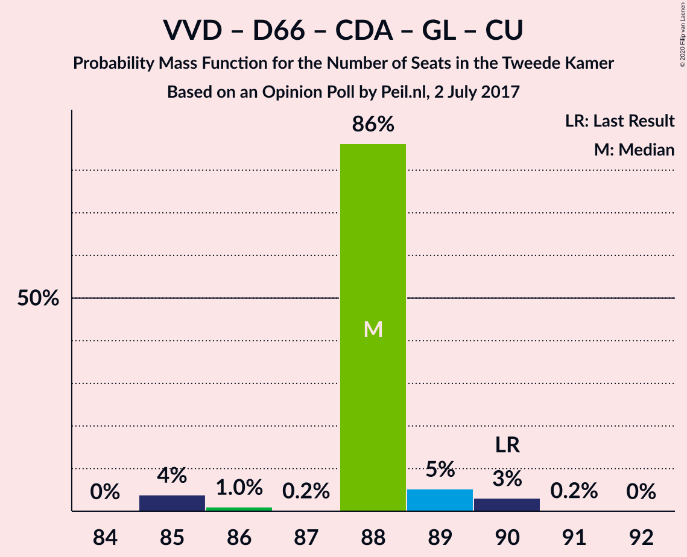

| Number of Seats | Probability | Accumulated | Special Marks |
|:---------------:|:-----------:|:-----------:|:-------------:|
| 85 | 4% | 100% |  |
| 86 | 1.0% | 96% |  |
| 87 | 0.2% | 95% |  |
| 88 | 86% | 95% | Median |
| 89 | 5% | 9% |  |
| 90 | 3% | 3% | Last Result |
| 91 | 0.2% | 0.3% |  |
| 92 | 0% | 0% |  |

### Volkspartij voor Vrijheid en Democratie – Democraten 66 – Christen-Democratisch Appèl – Partij van de Arbeid – ChristenUnie

| Number of Seats | Probability | Accumulated | Special Marks |
|:---------------:|:-----------:|:-----------:|:-------------:|
| 82 | 0.1% | 100% |  |
| 83 | 0.5% | 99.9% |  |
| 84 | 0% | 99.4% |  |
| 85 | 0.5% | 99.4% | Last Result |
| 86 | 0.2% | 98.9% |  |
| 87 | 11% | 98.7% |  |
| 88 | 86% | 88% | Median |
| 89 | 1.1% | 1.3% |  |
| 90 | 0.1% | 0.2% |  |
| 91 | 0% | 0% |  |

### Democraten 66 – Christen-Democratisch Appèl – GroenLinks – Partij van de Arbeid – Socialistische Partij – ChristenUnie

| Number of Seats | Probability | Accumulated | Special Marks |
|:---------------:|:-----------:|:-----------:|:-------------:|
| 74 | 0.1% | 100% |  |
| 75 | 0.6% | 99.9% |  |
| 76 | 0.8% | 99.3% | Majority |
| 77 | 6% | 98% |  |
| 78 | 0.5% | 92% |  |
| 79 | 84% | 92% | Median |
| 80 | 6% | 8% | Last Result |
| 81 | 2% | 2% |  |
| 82 | 0.1% | 0.1% |  |
| 83 | 0% | 0% |  |

### Volkspartij voor Vrijheid en Democratie – Partij voor de Vrijheid – Christen-Democratisch Appèl – Forum voor Democratie – Staatkundig Gereformeerde Partij

| Number of Seats | Probability | Accumulated | Special Marks |
|:---------------:|:-----------:|:-----------:|:-------------:|
| 75 | 0.1% | 100% |  |
| 76 | 0.2% | 99.9% | Majority |
| 77 | 3% | 99.6% | Last Result |
| 78 | 4% | 97% |  |
| 79 | 89% | 92% | Median |
| 80 | 2% | 3% |  |
| 81 | 0.2% | 0.9% |  |
| 82 | 0.6% | 0.7% |  |
| 83 | 0% | 0% |  |

### Volkspartij voor Vrijheid en Democratie – Partij voor de Vrijheid – Christen-Democratisch Appèl – Forum voor Democratie

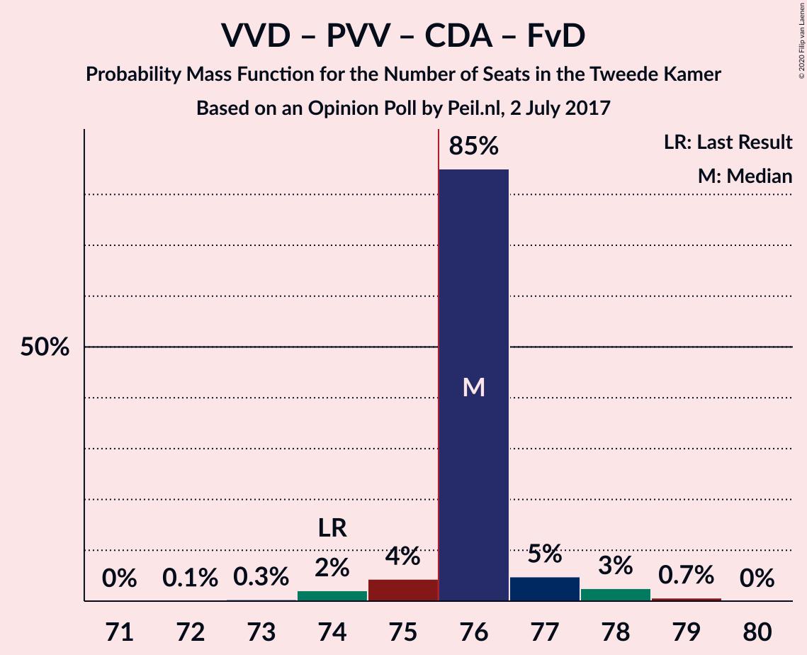

| Number of Seats | Probability | Accumulated | Special Marks |
|:---------------:|:-----------:|:-----------:|:-------------:|
| 72 | 0.1% | 100% |  |
| 73 | 0.3% | 99.9% |  |
| 74 | 2% | 99.5% | Last Result |
| 75 | 4% | 97% |  |
| 76 | 85% | 93% | Median, Majority |
| 77 | 5% | 8% |  |
| 78 | 3% | 3% |  |
| 79 | 0.7% | 0.7% |  |
| 80 | 0% | 0% |  |

### Volkspartij voor Vrijheid en Democratie – Democraten 66 – Christen-Democratisch Appèl – ChristenUnie

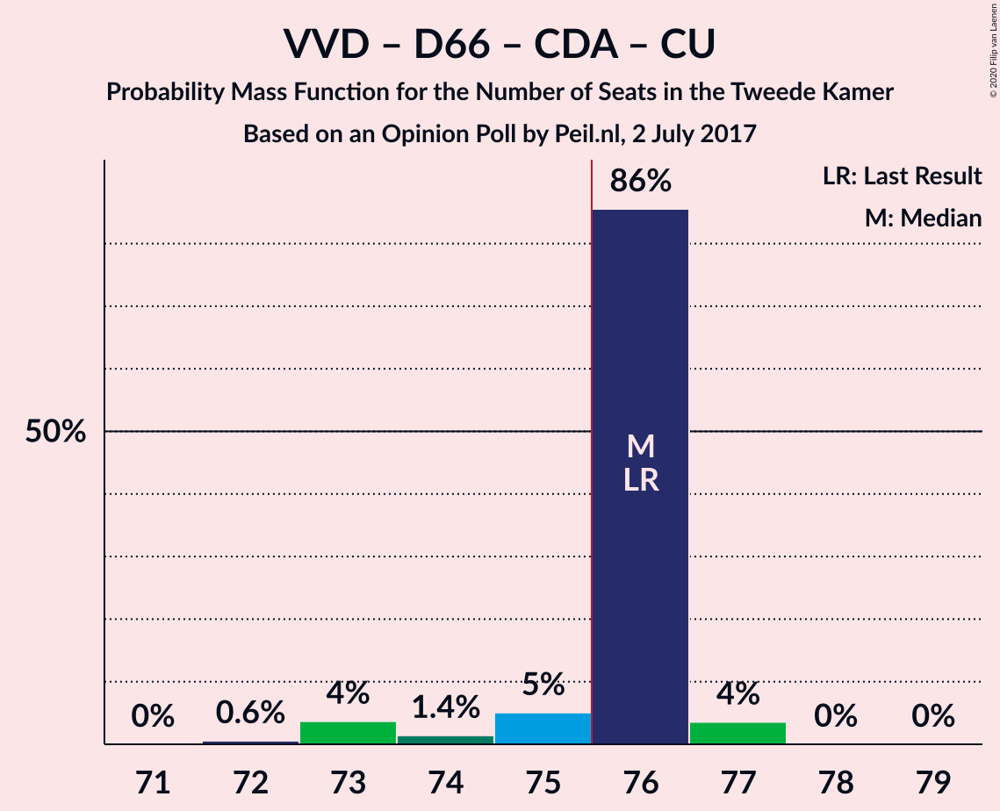

| Number of Seats | Probability | Accumulated | Special Marks |
|:---------------:|:-----------:|:-----------:|:-------------:|
| 72 | 0.6% | 100% |  |
| 73 | 4% | 99.4% |  |
| 74 | 1.4% | 96% |  |
| 75 | 5% | 94% |  |
| 76 | 86% | 89% | Last Result, Median, Majority |
| 77 | 4% | 4% |  |
| 78 | 0% | 0.1% |  |
| 79 | 0% | 0% |  |

### Volkspartij voor Vrijheid en Democratie – Partij voor de Vrijheid – Christen-Democratisch Appèl

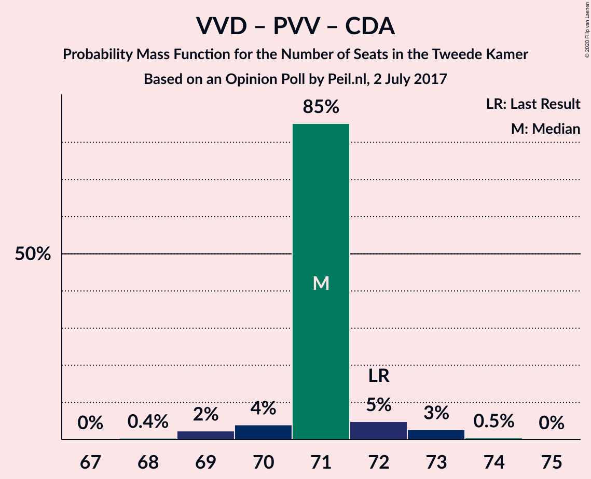

| Number of Seats | Probability | Accumulated | Special Marks |
|:---------------:|:-----------:|:-----------:|:-------------:|
| 68 | 0.4% | 100% |  |
| 69 | 2% | 99.6% |  |
| 70 | 4% | 97% |  |
| 71 | 85% | 93% | Median |
| 72 | 5% | 8% | Last Result |
| 73 | 3% | 3% |  |
| 74 | 0.5% | 0.5% |  |
| 75 | 0% | 0% |  |

### Volkspartij voor Vrijheid en Democratie – Democraten 66 – Christen-Democratisch Appèl

| Number of Seats | Probability | Accumulated | Special Marks |
|:---------------:|:-----------:|:-----------:|:-------------:|
| 66 | 0.1% | 100% |  |
| 67 | 0.5% | 99.9% |  |
| 68 | 4% | 99.4% |  |
| 69 | 0.9% | 95% |  |
| 70 | 2% | 94% |  |
| 71 | 88% | 92% | Last Result, Median |
| 72 | 2% | 4% |  |
| 73 | 2% | 2% |  |
| 74 | 0% | 0.1% |  |
| 75 | 0% | 0% |  |

### Democraten 66 – Christen-Democratisch Appèl – GroenLinks – Partij van de Arbeid – ChristenUnie

| Number of Seats | Probability | Accumulated | Special Marks |
|:---------------:|:-----------:|:-----------:|:-------------:|
| 63 | 0.1% | 100% |  |
| 64 | 0.5% | 99.9% |  |
| 65 | 4% | 99.3% |  |
| 66 | 3% | 96% | Last Result |
| 67 | 84% | 93% | Median |
| 68 | 0.5% | 8% |  |
| 69 | 7% | 8% |  |
| 70 | 0.7% | 0.8% |  |
| 71 | 0.1% | 0.1% |  |
| 72 | 0% | 0% |  |

### Volkspartij voor Vrijheid en Democratie – Democraten 66 – Partij van de Arbeid

| Number of Seats | Probability | Accumulated | Special Marks |
|:---------------:|:-----------:|:-----------:|:-------------:|
| 61 | 0% | 100% | Last Result |
| 62 | 0.5% | 100% |  |
| 63 | 0.2% | 99.5% |  |
| 64 | 0.8% | 99.2% |  |
| 65 | 7% | 98% |  |
| 66 | 87% | 92% | Median |
| 67 | 0.6% | 5% |  |
| 68 | 4% | 4% |  |
| 69 | 0.1% | 0.1% |  |
| 70 | 0% | 0% |  |

### Volkspartij voor Vrijheid en Democratie – Christen-Democratisch Appèl – Partij van de Arbeid

| Number of Seats | Probability | Accumulated | Special Marks |
|:---------------:|:-----------:|:-----------:|:-------------:|
| 58 | 0.1% | 100% |  |
| 59 | 0.7% | 99.9% |  |
| 60 | 2% | 99.2% |  |
| 61 | 2% | 97% | Last Result |
| 62 | 92% | 94% | Median |
| 63 | 1.3% | 2% |  |
| 64 | 0.3% | 1.0% |  |
| 65 | 0.6% | 0.6% |  |
| 66 | 0% | 0% |  |

### Volkspartij voor Vrijheid en Democratie – Christen-Democratisch Appèl – Forum voor Democratie – 50Plus – Staatkundig Gereformeerde Partij

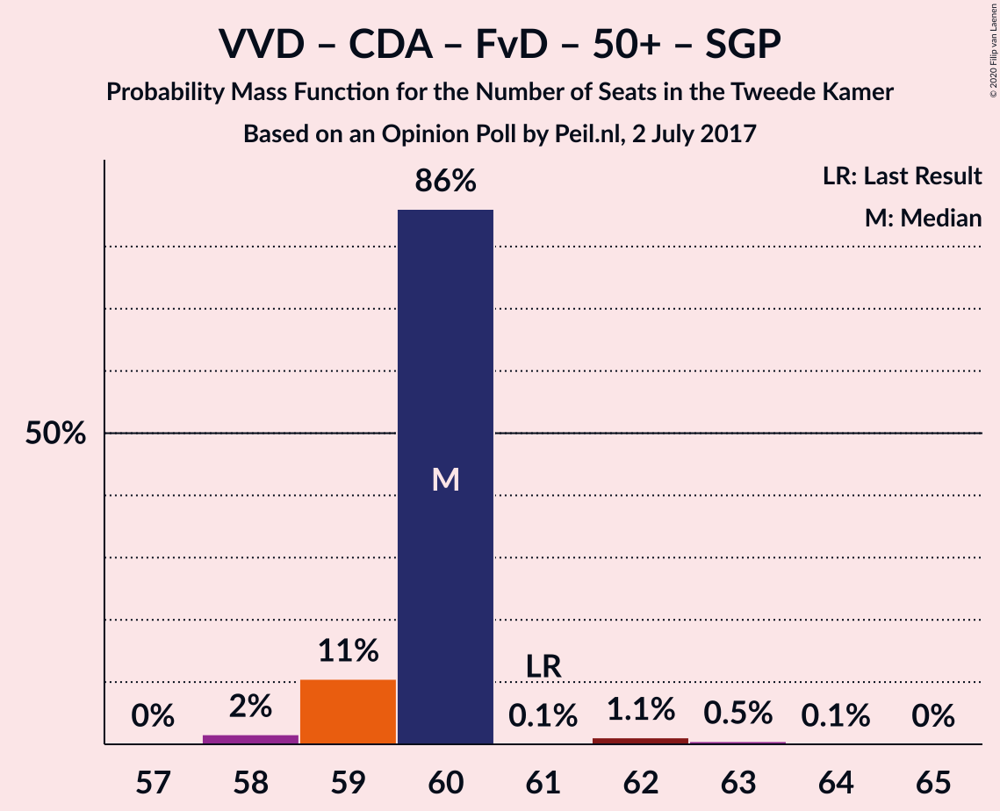

| Number of Seats | Probability | Accumulated | Special Marks |
|:---------------:|:-----------:|:-----------:|:-------------:|
| 57 | 0% | 100% |  |
| 58 | 2% | 99.9% |  |
| 59 | 11% | 98% |  |
| 60 | 86% | 88% | Median |
| 61 | 0.1% | 2% | Last Result |
| 62 | 1.1% | 2% |  |
| 63 | 0.5% | 0.6% |  |
| 64 | 0.1% | 0.1% |  |
| 65 | 0% | 0% |  |

### Volkspartij voor Vrijheid en Democratie – Christen-Democratisch Appèl – Forum voor Democratie – 50Plus

| Number of Seats | Probability | Accumulated | Special Marks |
|:---------------:|:-----------:|:-----------:|:-------------:|
| 54 | 0.2% | 100% |  |
| 55 | 0.2% | 99.8% |  |
| 56 | 7% | 99.6% |  |
| 57 | 88% | 92% | Median |
| 58 | 3% | 4% | Last Result |
| 59 | 1.0% | 2% |  |
| 60 | 0.5% | 0.6% |  |
| 61 | 0.1% | 0.1% |  |
| 62 | 0% | 0% |  |

### Volkspartij voor Vrijheid en Democratie – Christen-Democratisch Appèl – Forum voor Democratie – Staatkundig Gereformeerde Partij

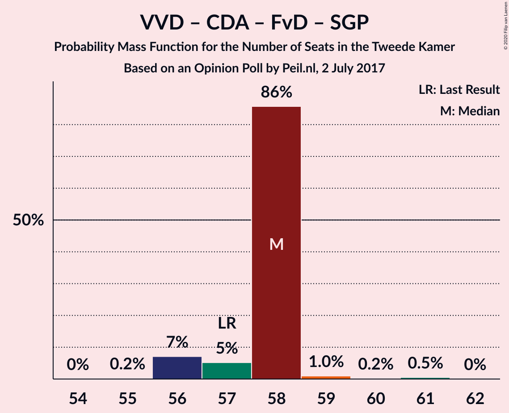

| Number of Seats | Probability | Accumulated | Special Marks |
|:---------------:|:-----------:|:-----------:|:-------------:|
| 54 | 0% | 100% |  |
| 55 | 0.2% | 99.9% |  |
| 56 | 7% | 99.7% |  |
| 57 | 5% | 93% | Last Result |
| 58 | 86% | 87% | Median |
| 59 | 1.0% | 2% |  |
| 60 | 0.2% | 0.7% |  |
| 61 | 0.5% | 0.5% |  |
| 62 | 0% | 0% |  |

### Volkspartij voor Vrijheid en Democratie – Christen-Democratisch Appèl – Forum voor Democratie

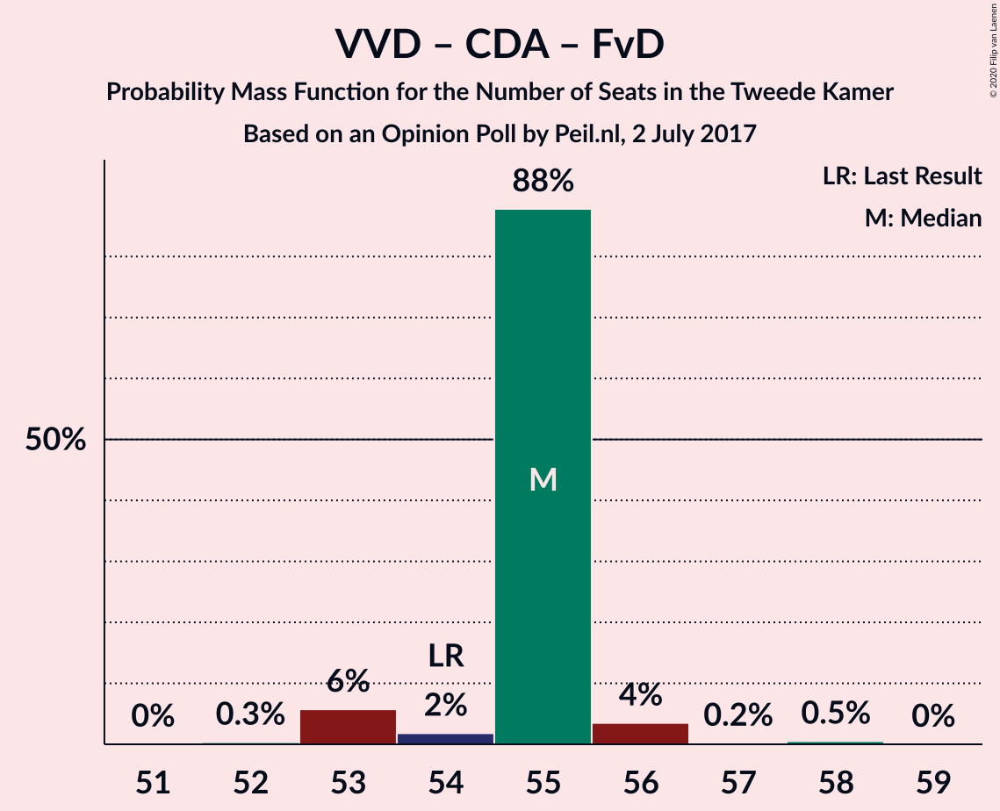

| Number of Seats | Probability | Accumulated | Special Marks |
|:---------------:|:-----------:|:-----------:|:-------------:|
| 51 | 0% | 100% |  |
| 52 | 0.3% | 99.9% |  |
| 53 | 6% | 99.6% |  |
| 54 | 2% | 94% | Last Result |
| 55 | 88% | 92% | Median |
| 56 | 4% | 4% |  |
| 57 | 0.2% | 0.7% |  |
| 58 | 0.5% | 0.5% |  |
| 59 | 0% | 0% |  |

### Democraten 66 – Christen-Democratisch Appèl – Partij van de Arbeid

| Number of Seats | Probability | Accumulated | Special Marks |
|:---------------:|:-----------:|:-----------:|:-------------:|
| 44 | 0% | 100% |  |
| 45 | 0% | 99.9% |  |
| 46 | 0.5% | 99.9% |  |
| 47 | 0.2% | 99.4% | Last Result |
| 48 | 4% | 99.2% |  |
| 49 | 4% | 95% |  |
| 50 | 84% | 92% | Median |
| 51 | 8% | 8% |  |
| 52 | 0.2% | 0.2% |  |
| 53 | 0.1% | 0.1% |  |
| 54 | 0% | 0% |  |

### Volkspartij voor Vrijheid en Democratie – Christen-Democratisch Appèl

| Number of Seats | Probability | Accumulated | Special Marks |
|:---------------:|:-----------:|:-----------:|:-------------:|
| 47 | 0.3% | 100% |  |
| 48 | 6% | 99.7% |  |
| 49 | 2% | 94% |  |
| 50 | 88% | 92% | Median |
| 51 | 3% | 4% |  |
| 52 | 0.3% | 0.8% | Last Result |
| 53 | 0.5% | 0.5% |  |
| 54 | 0% | 0% |  |

### Volkspartij voor Vrijheid en Democratie – Partij van de Arbeid

| Number of Seats | Probability | Accumulated | Special Marks |
|:---------------:|:-----------:|:-----------:|:-------------:|
| 42 | 0% | 100% | Last Result |
| 43 | 3% | 99.9% |  |
| 44 | 7% | 97% |  |
| 45 | 84% | 90% | Median |
| 46 | 1.5% | 6% |  |
| 47 | 0.6% | 4% |  |
| 48 | 4% | 4% |  |
| 49 | 0% | 0% |  |

### Democraten 66 – Christen-Democratisch Appèl

| Number of Seats | Probability | Accumulated | Special Marks |
|:---------------:|:-----------:|:-----------:|:-------------:|
| 34 | 3% | 100% |  |
| 35 | 0.6% | 97% |  |
| 36 | 1.3% | 96% |  |
| 37 | 1.3% | 95% |  |
| 38 | 84% | 93% | Last Result, Median |
| 39 | 9% | 10% |  |
| 40 | 0.3% | 0.3% |  |
| 41 | 0% | 0% |  |

### Christen-Democratisch Appèl – Partij van de Arbeid – ChristenUnie

| Number of Seats | Probability | Accumulated | Special Marks |
|:---------------:|:-----------:|:-----------:|:-------------:|
| 29 | 0.1% | 100% |  |
| 30 | 0.1% | 99.9% |  |
| 31 | 2% | 99.9% |  |
| 32 | 1.1% | 97% |  |
| 33 | 4% | 96% | Last Result |
| 34 | 89% | 92% | Median |
| 35 | 3% | 4% |  |
| 36 | 1.2% | 1.3% |  |
| 37 | 0% | 0.1% |  |
| 38 | 0% | 0% |  |

### Christen-Democratisch Appèl – Partij van de Arbeid

| Number of Seats | Probability | Accumulated | Special Marks |
|:---------------:|:-----------:|:-----------:|:-------------:|
| 25 | 0.1% | 100% |  |
| 26 | 0% | 99.9% |  |
| 27 | 3% | 99.8% |  |
| 28 | 4% | 97% | Last Result |
| 29 | 85% | 93% | Median |
| 30 | 7% | 7% |  |
| 31 | 0.6% | 0.7% |  |
| 32 | 0.1% | 0.1% |  |
| 33 | 0% | 0% |  |

## Technical Information

### Opinion Poll

+ **Polling firm:** Peil.nl
+ **Commissioner(s):** —
+ **Fieldwork period:** 2 July 2017

### Calculations

+ **Sample size:** 3000
+ **Simulations done:** 1,048,576
+ **Error estimate:** 1.92%

