# Opinion Poll by Kantar Public, 12 July 2017

<a href="#voting-intentions">Voting Intentions</a> | <a href="#seats">Seats</a> | <a href="#coalitions">Coalitions</a> | <a href="#technical-information">Technical Information</a>

## Voting Intentions

### Confidence Intervals

| Party | Last Result | Poll Result | 80% Confidence Interval | 90% Confidence Interval | 95% Confidence Interval | 99% Confidence Interval |
|:-----:|:-----------:|:-----------:|:-----------------------:|:-----------------------:|:-----------------------:|:-----------------------:|
| Volkspartij voor Vrijheid en Democratie | 21.3% | 20.6% | 19.0–22.4% |18.6–22.9% |18.2–23.4% |17.5–24.2% |
| Partij voor de Vrijheid | 13.1% | 15.3% | 13.9–16.9% |13.5–17.3% |13.2–17.7% |12.5–18.5% |
| Democraten 66 | 12.2% | 12.7% | 11.4–14.2% |11.0–14.6% |10.7–15.0% |10.1–15.7% |
| GroenLinks | 9.1% | 11.3% | 10.1–12.7% |9.8–13.1% |9.5–13.5% |8.9–14.2% |
| Christen-Democratisch Appèl | 12.4% | 10.7% | 9.5–12.1% |9.2–12.5% |8.9–12.8% |8.3–13.5% |
| Socialistische Partij | 9.1% | 8.7% | 7.6–10.0% |7.3–10.3% |7.1–10.7% |6.6–11.3% |
| Partij van de Arbeid | 5.7% | 6.0% | 5.1–7.1% |4.8–7.4% |4.6–7.7% |4.3–8.2% |
| ChristenUnie | 3.4% | 3.4% | 2.7–4.2% |2.5–4.5% |2.4–4.7% |2.1–5.2% |
| Partij voor de Dieren | 3.2% | 3.4% | 2.7–4.2% |2.5–4.5% |2.4–4.7% |2.1–5.2% |
| Forum voor Democratie | 1.8% | 2.6% | 2.1–3.4% |1.9–3.6% |1.8–3.8% |1.5–4.3% |
| 50Plus | 3.1% | 2.0% | 1.5–2.7% |1.4–2.9% |1.3–3.1% |1.1–3.5% |
| Staatkundig Gereformeerde Partij | 2.1% | 2.0% | 1.5–2.7% |1.4–2.9% |1.3–3.1% |1.1–3.5% |
| DENK | 2.1% | 1.4% | 1.0–2.0% |0.9–2.2% |0.8–2.3% |0.6–2.7% |

*Note:* The poll result column reflects the actual value used in the calculations. Published results may vary slightly, and in addition be rounded to fewer digits.

## Seats

### Confidence Intervals

| Party | Last Result | Median | 80% Confidence Interval | 90% Confidence Interval | 95% Confidence Interval | 99% Confidence Interval |
|:-----:|:-----------:|:------:|:-----------------------:|:-----------------------:|:-----------------------:|:-----------------------:|
| <a href="#volkspartij-voor-vrijheid-en-democratie">Volkspartij voor Vrijheid en Democratie</a> | 33 | 31 | 31 |25–34 |25–37 |25–37 |
| <a href="#partij-voor-de-vrijheid">Partij voor de Vrijheid</a> | 20 | 23 | 23 |21–25 |20–25 |20–28 |
| <a href="#democraten-66">Democraten 66</a> | 19 | 18 | 18–20 |18–21 |18–21 |16–25 |
| <a href="#groenlinks">GroenLinks</a> | 14 | 20 | 19–20 |17–20 |16–20 |13–20 |
| <a href="#christen-democratisch-appèl">Christen-Democratisch Appèl</a> | 19 | 16 | 16 |15–16 |15–16 |14–18 |
| <a href="#socialistische-partij">Socialistische Partij</a> | 14 | 12 | 12 |11–15 |11–17 |11–17 |
| <a href="#partij-van-de-arbeid">Partij van de Arbeid</a> | 9 | 10 | 8–10 |8–10 |6–10 |6–10 |
| <a href="#christenunie">ChristenUnie</a> | 5 | 5 | 5 |5–6 |5–6 |3–6 |
| <a href="#partij-voor-de-dieren">Partij voor de Dieren</a> | 5 | 6 | 5–6 |4–6 |4–6 |4–7 |
| <a href="#forum-voor-democratie">Forum voor Democratie</a> | 2 | 3 | 3 |3–4 |3–5 |3–5 |
| <a href="#50plus">50Plus</a> | 4 | 3 | 3 |3–4 |2–4 |2–5 |
| <a href="#staatkundig-gereformeerde-partij">Staatkundig Gereformeerde Partij</a> | 3 | 1 | 1–2 |1–3 |1–3 |1–6 |
| <a href="#denk">DENK</a> | 3 | 2 | 2 |1–2 |1–3 |1–3 |

### Volkspartij voor Vrijheid en Democratie

*For a full overview of the results for this party, see the [Volkspartij voor Vrijheid en Democratie](party-volkspartijvoorvrijheidendemocratie.html) page.*

| Number of Seats | Probability | Accumulated | Special Marks |
|:---------------:|:-----------:|:-----------:|:-------------:|
| 24 | 0.1% | 100% |  |
| 25 | 6% | 99.9% |  |
| 26 | 0.6% | 94% |  |
| 27 | 0.2% | 93% |  |
| 28 | 1.0% | 93% |  |
| 29 | 0.1% | 92% |  |
| 30 | 0.2% | 92% |  |
| 31 | 86% | 92% | Median |
| 32 | 0.6% | 6% |  |
| 33 | 0.1% | 5% | Last Result |
| 34 | 0% | 5% |  |
| 35 | 0.4% | 5% |  |
| 36 | 0.2% | 5% |  |
| 37 | 4% | 4% |  |
| 38 | 0% | 0.1% |  |
| 39 | 0% | 0.1% |  |
| 40 | 0.1% | 0.1% |  |
| 41 | 0% | 0% |  |

### Partij voor de Vrijheid

*For a full overview of the results for this party, see the [Partij voor de Vrijheid](party-partijvoordevrijheid.html) page.*

| Number of Seats | Probability | Accumulated | Special Marks |
|:---------------:|:-----------:|:-----------:|:-------------:|
| 18 | 0.1% | 100% |  |
| 19 | 0% | 99.9% |  |
| 20 | 4% | 99.8% | Last Result |
| 21 | 1.5% | 96% |  |
| 22 | 0.7% | 94% |  |
| 23 | 85% | 93% | Median |
| 24 | 0.2% | 8% |  |
| 25 | 6% | 8% |  |
| 26 | 0.5% | 2% |  |
| 27 | 0.1% | 2% |  |
| 28 | 2% | 2% |  |
| 29 | 0% | 0% |  |

### Democraten 66

*For a full overview of the results for this party, see the [Democraten 66](party-democraten66.html) page.*

| Number of Seats | Probability | Accumulated | Special Marks |
|:---------------:|:-----------:|:-----------:|:-------------:|
| 15 | 0.1% | 100% |  |
| 16 | 0.6% | 99.9% |  |
| 17 | 0.5% | 99.3% |  |
| 18 | 85% | 98.8% | Median |
| 19 | 1.1% | 13% | Last Result |
| 20 | 6% | 12% |  |
| 21 | 5% | 6% |  |
| 22 | 0.1% | 1.2% |  |
| 23 | 0.4% | 1.2% |  |
| 24 | 0.1% | 0.8% |  |
| 25 | 0.6% | 0.6% |  |
| 26 | 0% | 0% |  |

### GroenLinks

*For a full overview of the results for this party, see the [GroenLinks](party-groenlinks.html) page.*

| Number of Seats | Probability | Accumulated | Special Marks |
|:---------------:|:-----------:|:-----------:|:-------------:|
| 12 | 0.1% | 100% |  |
| 13 | 1.3% | 99.9% |  |
| 14 | 0.1% | 98.7% | Last Result |
| 15 | 0.9% | 98.5% |  |
| 16 | 2% | 98% |  |
| 17 | 4% | 95% |  |
| 18 | 1.0% | 91% |  |
| 19 | 5% | 90% |  |
| 20 | 85% | 85% | Median |
| 21 | 0.1% | 0.2% |  |
| 22 | 0% | 0% |  |

### Christen-Democratisch Appèl

*For a full overview of the results for this party, see the [Christen-Democratisch Appèl](party-christen-democratischappèl.html) page.*

| Number of Seats | Probability | Accumulated | Special Marks |
|:---------------:|:-----------:|:-----------:|:-------------:|
| 11 | 0.1% | 100% |  |
| 12 | 0% | 99.9% |  |
| 13 | 0.1% | 99.9% |  |
| 14 | 0.8% | 99.8% |  |
| 15 | 5% | 99.0% |  |
| 16 | 93% | 94% | Median |
| 17 | 0.3% | 1.3% |  |
| 18 | 0.7% | 1.0% |  |
| 19 | 0.1% | 0.3% | Last Result |
| 20 | 0.2% | 0.2% |  |
| 21 | 0% | 0% |  |

### Socialistische Partij

*For a full overview of the results for this party, see the [Socialistische Partij](party-socialistischepartij.html) page.*

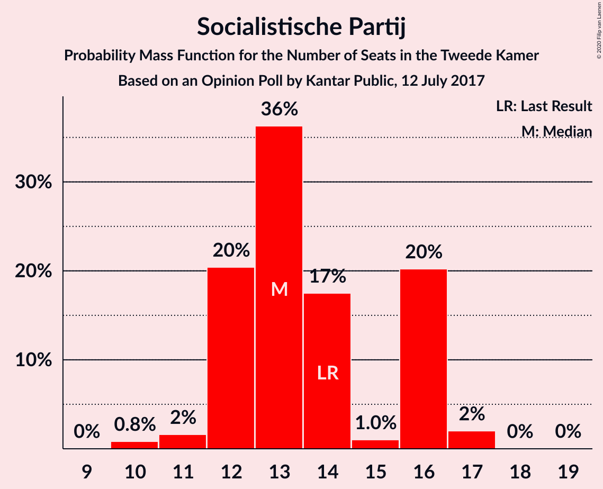

| Number of Seats | Probability | Accumulated | Special Marks |
|:---------------:|:-----------:|:-----------:|:-------------:|
| 10 | 0.2% | 100% |  |
| 11 | 5% | 99.7% |  |
| 12 | 86% | 95% | Median |
| 13 | 0.8% | 9% |  |
| 14 | 2% | 8% | Last Result |
| 15 | 0.8% | 6% |  |
| 16 | 0.3% | 5% |  |
| 17 | 4% | 5% |  |
| 18 | 0% | 0.4% |  |
| 19 | 0.4% | 0.4% |  |
| 20 | 0% | 0% |  |

### Partij van de Arbeid

*For a full overview of the results for this party, see the [Partij van de Arbeid](party-partijvandearbeid.html) page.*

| Number of Seats | Probability | Accumulated | Special Marks |
|:---------------:|:-----------:|:-----------:|:-------------:|
| 6 | 4% | 100% |  |
| 7 | 0.7% | 96% |  |
| 8 | 5% | 95% |  |
| 9 | 4% | 90% | Last Result |
| 10 | 86% | 86% | Median |
| 11 | 0% | 0.1% |  |
| 12 | 0% | 0% |  |

### ChristenUnie

*For a full overview of the results for this party, see the [ChristenUnie](party-christenunie.html) page.*

| Number of Seats | Probability | Accumulated | Special Marks |
|:---------------:|:-----------:|:-----------:|:-------------:|
| 3 | 0.6% | 100% |  |
| 4 | 0.9% | 99.4% |  |
| 5 | 92% | 98.6% | Last Result, Median |
| 6 | 6% | 7% |  |
| 7 | 0.1% | 0.3% |  |
| 8 | 0.3% | 0.3% |  |
| 9 | 0% | 0% |  |

### Partij voor de Dieren

*For a full overview of the results for this party, see the [Partij voor de Dieren](party-partijvoordedieren.html) page.*

| Number of Seats | Probability | Accumulated | Special Marks |
|:---------------:|:-----------:|:-----------:|:-------------:|
| 3 | 0.3% | 100% |  |
| 4 | 5% | 99.7% |  |
| 5 | 6% | 95% | Last Result |
| 6 | 87% | 89% | Median |
| 7 | 1.3% | 2% |  |
| 8 | 0.3% | 0.3% |  |
| 9 | 0% | 0% |  |

### Forum voor Democratie

*For a full overview of the results for this party, see the [Forum voor Democratie](party-forumvoordemocratie.html) page.*

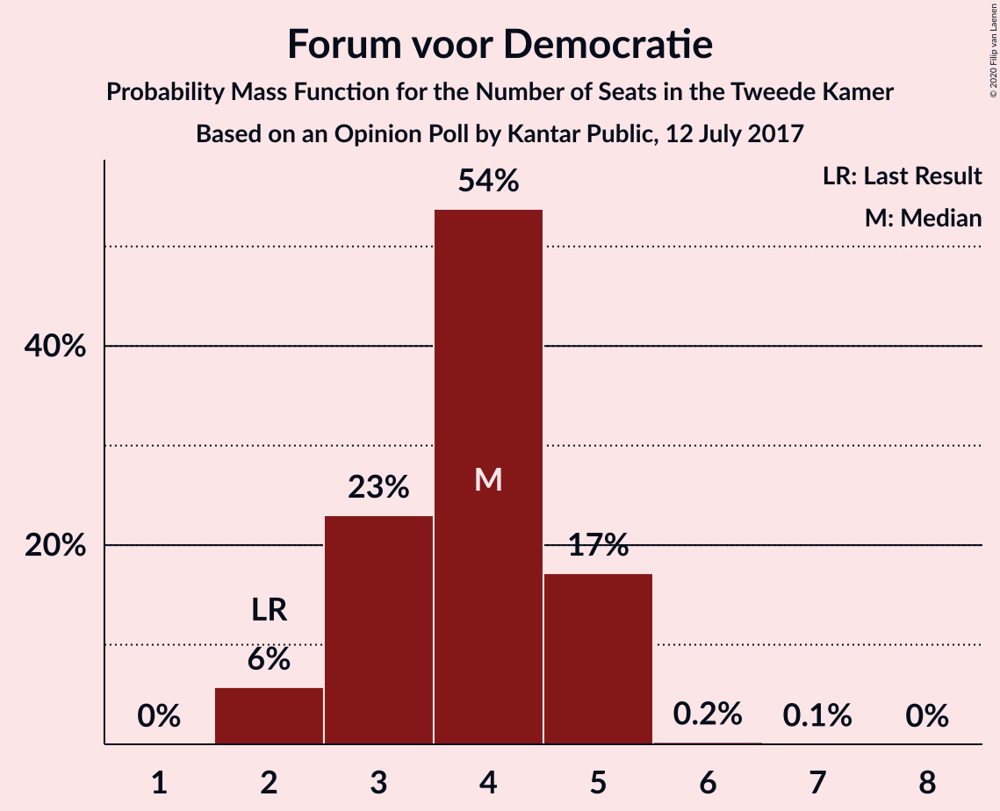

| Number of Seats | Probability | Accumulated | Special Marks |
|:---------------:|:-----------:|:-----------:|:-------------:|
| 2 | 0.2% | 100% | Last Result |
| 3 | 91% | 99.8% | Median |
| 4 | 6% | 9% |  |
| 5 | 3% | 3% |  |
| 6 | 0.1% | 0.1% |  |
| 7 | 0% | 0% |  |

### 50Plus

*For a full overview of the results for this party, see the [50Plus](party-50plus.html) page.*

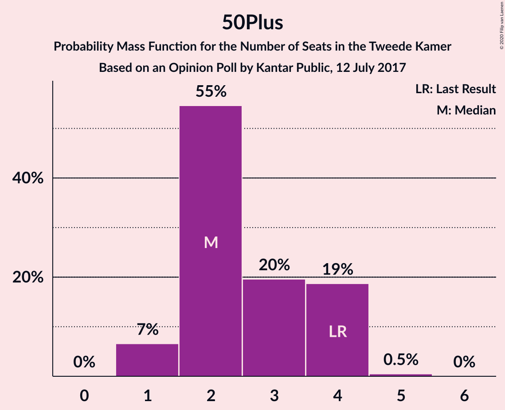

| Number of Seats | Probability | Accumulated | Special Marks |
|:---------------:|:-----------:|:-----------:|:-------------:|
| 1 | 0.1% | 100% |  |
| 2 | 3% | 99.9% |  |
| 3 | 91% | 97% | Median |
| 4 | 5% | 5% | Last Result |
| 5 | 0.6% | 0.6% |  |
| 6 | 0% | 0% |  |

### Staatkundig Gereformeerde Partij

*For a full overview of the results for this party, see the [Staatkundig Gereformeerde Partij](party-staatkundiggereformeerdepartij.html) page.*

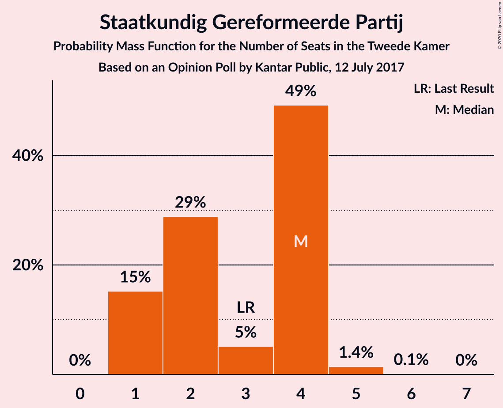

| Number of Seats | Probability | Accumulated | Special Marks |
|:---------------:|:-----------:|:-----------:|:-------------:|
| 1 | 85% | 100% | Median |
| 2 | 7% | 15% |  |
| 3 | 7% | 8% | Last Result |
| 4 | 0.2% | 1.3% |  |
| 5 | 0.3% | 1.1% |  |
| 6 | 0.8% | 0.8% |  |
| 7 | 0% | 0% |  |

### DENK

*For a full overview of the results for this party, see the [DENK](party-denk.html) page.*

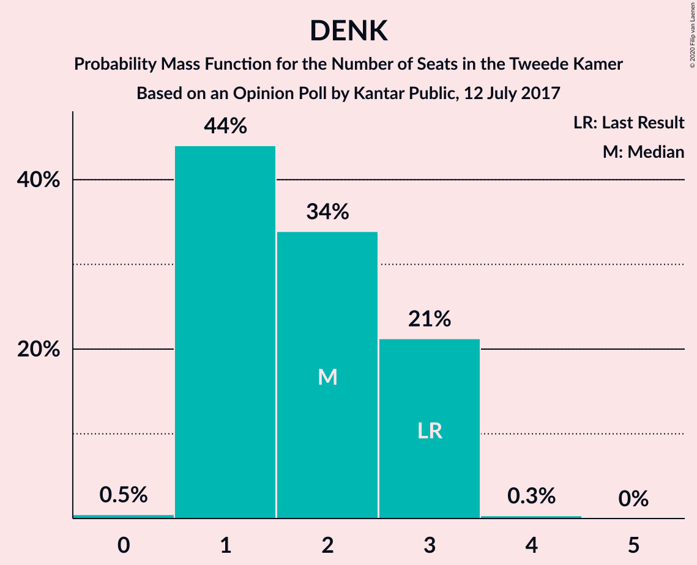

| Number of Seats | Probability | Accumulated | Special Marks |
|:---------------:|:-----------:|:-----------:|:-------------:|
| 0 | 0.1% | 100% |  |
| 1 | 7% | 99.9% |  |
| 2 | 88% | 92% | Median |
| 3 | 5% | 5% | Last Result |
| 4 | 0.1% | 0.1% |  |
| 5 | 0% | 0% |  |

## Coalitions

### Confidence Intervals

| Coalition | Last Result | Median | Majority? | 80% Confidence Interval | 90% Confidence Interval | 95% Confidence Interval | 99% Confidence Interval |
|:---------:|:-----------:|:------:|:---------:|:-----------------------:|:-----------------------:|:-----------------------:|:-----------------------:|
| Volkspartij voor Vrijheid en Democratie – Democraten 66 – GroenLinks – Christen-Democratisch Appèl – ChristenUnie | 90 | 90 | 100% | 90 | 86–92 | 84–95 | 82–95 |
| Democraten 66 – GroenLinks – Christen-Democratisch Appèl – Socialistische Partij – Partij van de Arbeid – ChristenUnie | 80 | 81 | 95% | 81 | 75–83 | 75–86 | 75–87 |
| Volkspartij voor Vrijheid en Democratie – Democraten 66 – Christen-Democratisch Appèl – Partij van de Arbeid – ChristenUnie | 85 | 80 | 94% | 80 | 75–82 | 75–84 | 75–84 |
| Volkspartij voor Vrijheid en Democratie – Partij voor de Vrijheid – Christen-Democratisch Appèl – Forum voor Democratie – Staatkundig Gereformeerde Partij | 77 | 74 | 10% | 74 | 74–79 | 71–79 | 69–80 |
| Volkspartij voor Vrijheid en Democratie – Democraten 66 – Christen-Democratisch Appèl – ChristenUnie | 76 | 70 | 4% | 70 | 67–74 | 67–78 | 66–78 |
| Volkspartij voor Vrijheid en Democratie – Partij voor de Vrijheid – Christen-Democratisch Appèl – Forum voor Democratie | 74 | 73 | 6% | 73 | 70–76 | 69–76 | 67–78 |
| Volkspartij voor Vrijheid en Democratie – Partij voor de Vrijheid – Christen-Democratisch Appèl | 72 | 70 | 0.2% | 70 | 66–73 | 65–73 | 63–73 |
| Volkspartij voor Vrijheid en Democratie – Democraten 66 – Christen-Democratisch Appèl | 71 | 65 | 0% | 65 | 61–70 | 61–73 | 61–73 |
| Democraten 66 – GroenLinks – Christen-Democratisch Appèl – Partij van de Arbeid – ChristenUnie | 66 | 69 | 0% | 69 | 64–69 | 64–69 | 60–74 |
| Volkspartij voor Vrijheid en Democratie – Democraten 66 – Partij van de Arbeid | 61 | 59 | 0% | 59 | 54–61 | 54–63 | 54–63 |
| Volkspartij voor Vrijheid en Democratie – Christen-Democratisch Appèl – Forum voor Democratie – 50Plus – Staatkundig Gereformeerde Partij | 61 | 54 | 0% | 54 | 51–60 | 49–63 | 49–63 |
| Volkspartij voor Vrijheid en Democratie – Christen-Democratisch Appèl – Forum voor Democratie – 50Plus | 58 | 53 | 0% | 53 | 48–58 | 47–60 | 47–60 |
| Volkspartij voor Vrijheid en Democratie – Christen-Democratisch Appèl – Partij van de Arbeid | 61 | 57 | 0% | 57 | 50–58 | 48–59 | 48–60 |
| Volkspartij voor Vrijheid en Democratie – Christen-Democratisch Appèl – Forum voor Democratie – Staatkundig Gereformeerde Partij | 57 | 51 | 0% | 51 | 49–56 | 46–59 | 46–59 |
| Volkspartij voor Vrijheid en Democratie – Christen-Democratisch Appèl – Forum voor Democratie | 54 | 50 | 0% | 50 | 46–54 | 44–56 | 44–56 |
| Volkspartij voor Vrijheid en Democratie – Christen-Democratisch Appèl | 52 | 47 | 0% | 47 | 41–50 | 40–53 | 40–53 |
| Democraten 66 – Christen-Democratisch Appèl – Partij van de Arbeid | 47 | 44 | 0% | 44 | 42–44 | 42–45 | 41–49 |
| Volkspartij voor Vrijheid en Democratie – Partij van de Arbeid | 42 | 41 | 0% | 41 | 34–41 | 33–43 | 33–44 |
| Democraten 66 – Christen-Democratisch Appèl | 38 | 34 | 0% | 34–36 | 34–36 | 34–36 | 32–41 |
| Christen-Democratisch Appèl – Partij van de Arbeid – ChristenUnie | 33 | 31 | 0% | 29–31 | 28–31 | 27–31 | 27–32 |
| Christen-Democratisch Appèl – Partij van de Arbeid | 28 | 26 | 0% | 24–26 | 23–26 | 22–26 | 22–26 |

### Volkspartij voor Vrijheid en Democratie – Democraten 66 – GroenLinks – Christen-Democratisch Appèl – ChristenUnie

| Number of Seats | Probability | Accumulated | Special Marks |
|:---------------:|:-----------:|:-----------:|:-------------:|
| 82 | 2% | 100% |  |
| 83 | 0.5% | 98% |  |
| 84 | 0.1% | 98% |  |
| 85 | 0.1% | 97% |  |
| 86 | 6% | 97% |  |
| 87 | 0.4% | 92% |  |
| 88 | 0.7% | 91% |  |
| 89 | 0.2% | 91% |  |
| 90 | 85% | 90% | Last Result, Median |
| 91 | 0.1% | 5% |  |
| 92 | 0.8% | 5% |  |
| 93 | 0.1% | 4% |  |
| 94 | 0% | 4% |  |
| 95 | 4% | 4% |  |
| 96 | 0% | 0% |  |

### Democraten 66 – GroenLinks – Christen-Democratisch Appèl – Socialistische Partij – Partij van de Arbeid – ChristenUnie

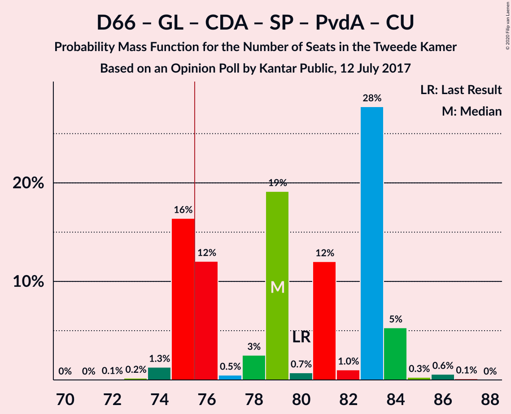

| Number of Seats | Probability | Accumulated | Special Marks |
|:---------------:|:-----------:|:-----------:|:-------------:|
| 70 | 0.1% | 100% |  |
| 71 | 0% | 99.9% |  |
| 72 | 0.1% | 99.9% |  |
| 73 | 0.1% | 99.9% |  |
| 74 | 0% | 99.7% |  |
| 75 | 5% | 99.7% |  |
| 76 | 0.4% | 95% | Majority |
| 77 | 0.1% | 95% |  |
| 78 | 2% | 94% |  |
| 79 | 0.4% | 93% |  |
| 80 | 2% | 92% | Last Result |
| 81 | 85% | 91% | Median |
| 82 | 0.1% | 5% |  |
| 83 | 0.1% | 5% |  |
| 84 | 0.1% | 5% |  |
| 85 | 0% | 5% |  |
| 86 | 4% | 5% |  |
| 87 | 0.6% | 0.6% |  |
| 88 | 0% | 0% |  |

### Volkspartij voor Vrijheid en Democratie – Democraten 66 – Christen-Democratisch Appèl – Partij van de Arbeid – ChristenUnie

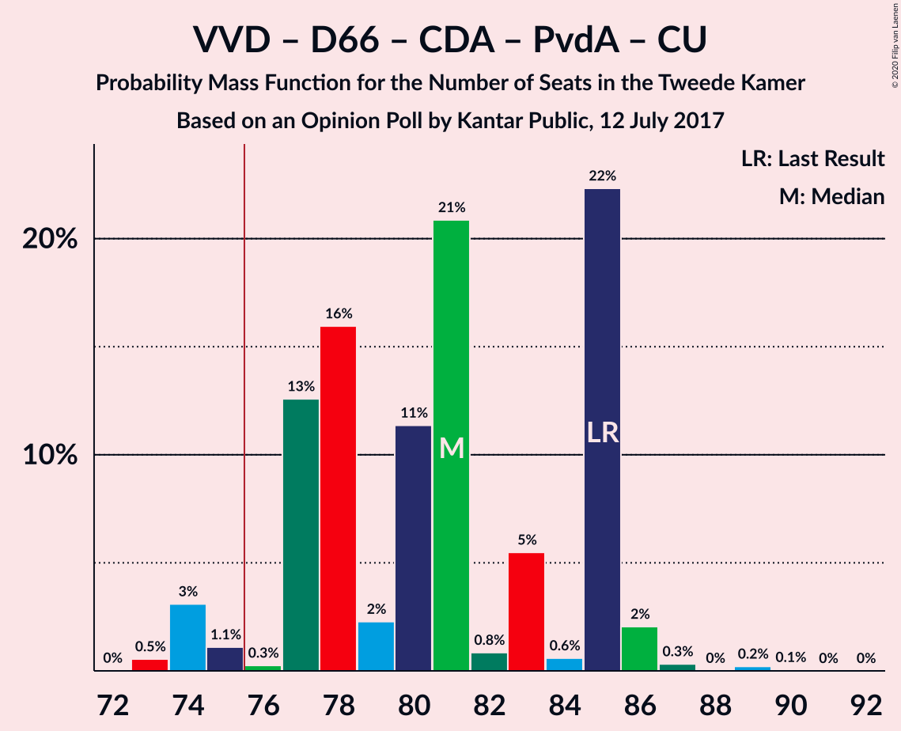

| Number of Seats | Probability | Accumulated | Special Marks |
|:---------------:|:-----------:|:-----------:|:-------------:|
| 75 | 6% | 100% |  |
| 76 | 0.1% | 94% | Majority |
| 77 | 1.4% | 94% |  |
| 78 | 0.1% | 93% |  |
| 79 | 0.2% | 92% |  |
| 80 | 86% | 92% | Median |
| 81 | 0.7% | 7% |  |
| 82 | 1.2% | 6% |  |
| 83 | 0.3% | 5% |  |
| 84 | 4% | 4% |  |
| 85 | 0% | 0.1% | Last Result |
| 86 | 0% | 0.1% |  |
| 87 | 0.1% | 0.1% |  |
| 88 | 0% | 0% |  |

### Volkspartij voor Vrijheid en Democratie – Partij voor de Vrijheid – Christen-Democratisch Appèl – Forum voor Democratie – Staatkundig Gereformeerde Partij

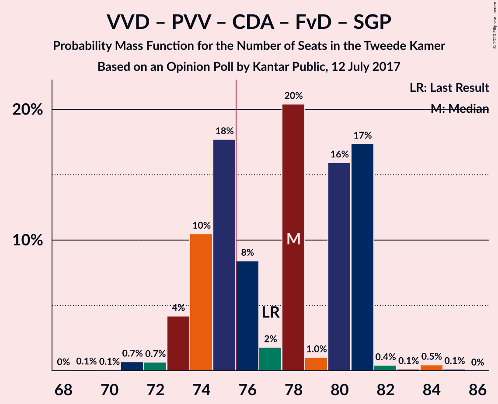

| Number of Seats | Probability | Accumulated | Special Marks |
|:---------------:|:-----------:|:-----------:|:-------------:|
| 69 | 0.6% | 100% |  |
| 70 | 0.1% | 99.4% |  |
| 71 | 4% | 99.3% |  |
| 72 | 0.1% | 95% |  |
| 73 | 0% | 95% |  |
| 74 | 85% | 95% | Median |
| 75 | 0.2% | 10% |  |
| 76 | 0.2% | 10% | Majority |
| 77 | 3% | 9% | Last Result |
| 78 | 1.1% | 6% |  |
| 79 | 4% | 5% |  |
| 80 | 0.4% | 0.7% |  |
| 81 | 0.2% | 0.3% |  |
| 82 | 0% | 0.1% |  |
| 83 | 0% | 0.1% |  |
| 84 | 0.1% | 0.1% |  |
| 85 | 0% | 0% |  |

### Volkspartij voor Vrijheid en Democratie – Democraten 66 – Christen-Democratisch Appèl – ChristenUnie

| Number of Seats | Probability | Accumulated | Special Marks |
|:---------------:|:-----------:|:-----------:|:-------------:|
| 65 | 0% | 100% |  |
| 66 | 2% | 99.9% |  |
| 67 | 4% | 98% |  |
| 68 | 1.4% | 94% |  |
| 69 | 0.1% | 93% |  |
| 70 | 85% | 92% | Median |
| 71 | 0.6% | 7% |  |
| 72 | 0.2% | 7% |  |
| 73 | 1.0% | 6% |  |
| 74 | 0.4% | 5% |  |
| 75 | 0.7% | 5% |  |
| 76 | 0% | 4% | Last Result, Majority |
| 77 | 0.1% | 4% |  |
| 78 | 4% | 4% |  |
| 79 | 0.1% | 0.1% |  |
| 80 | 0% | 0% |  |

### Volkspartij voor Vrijheid en Democratie – Partij voor de Vrijheid – Christen-Democratisch Appèl – Forum voor Democratie

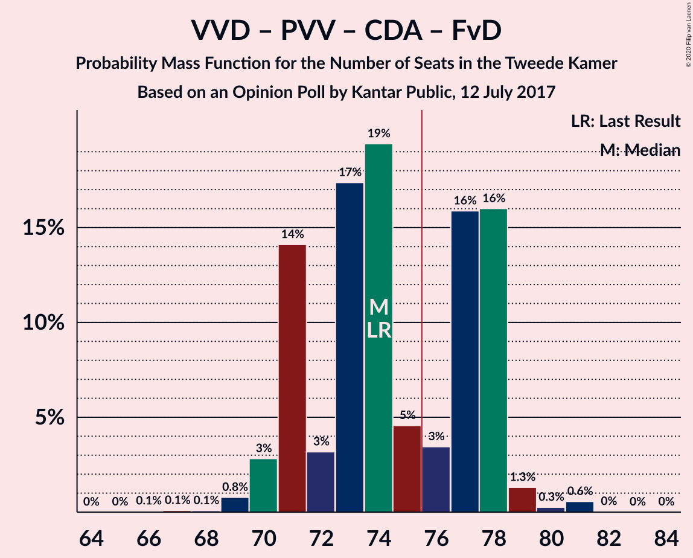

| Number of Seats | Probability | Accumulated | Special Marks |
|:---------------:|:-----------:|:-----------:|:-------------:|
| 66 | 0.1% | 100% |  |
| 67 | 0.7% | 99.9% |  |
| 68 | 0% | 99.3% |  |
| 69 | 4% | 99.3% |  |
| 70 | 0.1% | 95% |  |
| 71 | 0.8% | 95% |  |
| 72 | 0.2% | 94% |  |
| 73 | 85% | 94% | Median |
| 74 | 2% | 9% | Last Result |
| 75 | 1.2% | 7% |  |
| 76 | 5% | 6% | Majority |
| 77 | 0.2% | 0.8% |  |
| 78 | 0.4% | 0.7% |  |
| 79 | 0.2% | 0.3% |  |
| 80 | 0% | 0.1% |  |
| 81 | 0.1% | 0.1% |  |
| 82 | 0% | 0% |  |

### Volkspartij voor Vrijheid en Democratie – Partij voor de Vrijheid – Christen-Democratisch Appèl

| Number of Seats | Probability | Accumulated | Special Marks |
|:---------------:|:-----------:|:-----------:|:-------------:|
| 62 | 0.1% | 100% |  |
| 63 | 0.7% | 99.9% |  |
| 64 | 0% | 99.3% |  |
| 65 | 4% | 99.3% |  |
| 66 | 0.1% | 95% |  |
| 67 | 0% | 95% |  |
| 68 | 1.1% | 95% |  |
| 69 | 2% | 94% |  |
| 70 | 85% | 92% | Median |
| 71 | 1.1% | 7% |  |
| 72 | 0.6% | 6% | Last Result |
| 73 | 5% | 5% |  |
| 74 | 0% | 0.3% |  |
| 75 | 0.1% | 0.3% |  |
| 76 | 0% | 0.2% | Majority |
| 77 | 0.2% | 0.2% |  |
| 78 | 0% | 0% |  |

### Volkspartij voor Vrijheid en Democratie – Democraten 66 – Christen-Democratisch Appèl

| Number of Seats | Probability | Accumulated | Special Marks |
|:---------------:|:-----------:|:-----------:|:-------------:|
| 59 | 0.1% | 100% |  |
| 60 | 0% | 99.9% |  |
| 61 | 6% | 99.9% |  |
| 62 | 0.9% | 94% |  |
| 63 | 0.5% | 93% |  |
| 64 | 0.1% | 93% |  |
| 65 | 85% | 92% | Median |
| 66 | 0.1% | 7% |  |
| 67 | 0.9% | 7% |  |
| 68 | 0.9% | 6% |  |
| 69 | 0% | 5% |  |
| 70 | 0.1% | 5% |  |
| 71 | 0.6% | 5% | Last Result |
| 72 | 0% | 4% |  |
| 73 | 4% | 4% |  |
| 74 | 0% | 0.1% |  |
| 75 | 0.1% | 0.1% |  |
| 76 | 0% | 0% | Majority |

### Democraten 66 – GroenLinks – Christen-Democratisch Appèl – Partij van de Arbeid – ChristenUnie

| Number of Seats | Probability | Accumulated | Special Marks |
|:---------------:|:-----------:|:-----------:|:-------------:|
| 59 | 0.2% | 100% |  |
| 60 | 0.4% | 99.8% |  |
| 61 | 0.5% | 99.4% |  |
| 62 | 0.1% | 98.9% |  |
| 63 | 0.7% | 98.8% |  |
| 64 | 5% | 98% |  |
| 65 | 0.2% | 93% |  |
| 66 | 2% | 93% | Last Result |
| 67 | 1.0% | 91% |  |
| 68 | 0.1% | 90% |  |
| 69 | 89% | 90% | Median |
| 70 | 0.2% | 1.0% |  |
| 71 | 0.1% | 0.8% |  |
| 72 | 0% | 0.7% |  |
| 73 | 0% | 0.6% |  |
| 74 | 0.6% | 0.6% |  |
| 75 | 0% | 0% |  |

### Volkspartij voor Vrijheid en Democratie – Democraten 66 – Partij van de Arbeid

| Number of Seats | Probability | Accumulated | Special Marks |
|:---------------:|:-----------:|:-----------:|:-------------:|
| 54 | 6% | 100% |  |
| 55 | 0.1% | 94% |  |
| 56 | 1.4% | 94% |  |
| 57 | 0.1% | 92% |  |
| 58 | 0.1% | 92% |  |
| 59 | 86% | 92% | Median |
| 60 | 0.8% | 6% |  |
| 61 | 0.4% | 5% | Last Result |
| 62 | 0.5% | 5% |  |
| 63 | 4% | 4% |  |
| 64 | 0.1% | 0.3% |  |
| 65 | 0.1% | 0.2% |  |
| 66 | 0% | 0.1% |  |
| 67 | 0% | 0.1% |  |
| 68 | 0% | 0.1% |  |
| 69 | 0.1% | 0.1% |  |
| 70 | 0% | 0% |  |

### Volkspartij voor Vrijheid en Democratie – Christen-Democratisch Appèl – Forum voor Democratie – 50Plus – Staatkundig Gereformeerde Partij

| Number of Seats | Probability | Accumulated | Special Marks |
|:---------------:|:-----------:|:-----------:|:-------------:|
| 49 | 4% | 100% |  |
| 50 | 0% | 96% |  |
| 51 | 2% | 96% |  |
| 52 | 0.1% | 93% |  |
| 53 | 0.2% | 93% |  |
| 54 | 86% | 93% | Median |
| 55 | 0.9% | 8% |  |
| 56 | 0.2% | 7% |  |
| 57 | 0.7% | 6% |  |
| 58 | 0.1% | 6% |  |
| 59 | 0.1% | 6% |  |
| 60 | 0.4% | 5% |  |
| 61 | 0.7% | 5% | Last Result |
| 62 | 0% | 4% |  |
| 63 | 4% | 4% |  |
| 64 | 0% | 0% |  |

### Volkspartij voor Vrijheid en Democratie – Christen-Democratisch Appèl – Forum voor Democratie – 50Plus

| Number of Seats | Probability | Accumulated | Special Marks |
|:---------------:|:-----------:|:-----------:|:-------------:|
| 47 | 4% | 100% |  |
| 48 | 2% | 96% |  |
| 49 | 2% | 94% |  |
| 50 | 0.1% | 92% |  |
| 51 | 0.1% | 92% |  |
| 52 | 0.6% | 92% |  |
| 53 | 85% | 92% | Median |
| 54 | 0.7% | 6% |  |
| 55 | 0.2% | 6% |  |
| 56 | 0.2% | 6% |  |
| 57 | 0.1% | 5% |  |
| 58 | 0.4% | 5% | Last Result |
| 59 | 0.7% | 5% |  |
| 60 | 4% | 4% |  |
| 61 | 0% | 0% |  |

### Volkspartij voor Vrijheid en Democratie – Christen-Democratisch Appèl – Partij van de Arbeid

| Number of Seats | Probability | Accumulated | Special Marks |
|:---------------:|:-----------:|:-----------:|:-------------:|
| 48 | 4% | 100% |  |
| 49 | 0% | 96% |  |
| 50 | 2% | 96% |  |
| 51 | 0.1% | 93% |  |
| 52 | 0.9% | 93% |  |
| 53 | 0.5% | 92% |  |
| 54 | 0.1% | 92% |  |
| 55 | 0.1% | 92% |  |
| 56 | 0.5% | 92% |  |
| 57 | 86% | 91% | Median |
| 58 | 0.1% | 5% |  |
| 59 | 4% | 5% |  |
| 60 | 0.4% | 0.6% |  |
| 61 | 0.1% | 0.2% | Last Result |
| 62 | 0.1% | 0.2% |  |
| 63 | 0% | 0% |  |

### Volkspartij voor Vrijheid en Democratie – Christen-Democratisch Appèl – Forum voor Democratie – Staatkundig Gereformeerde Partij

| Number of Seats | Probability | Accumulated | Special Marks |
|:---------------:|:-----------:|:-----------:|:-------------:|
| 46 | 4% | 100% |  |
| 47 | 0% | 96% |  |
| 48 | 0.6% | 96% |  |
| 49 | 2% | 95% |  |
| 50 | 0.1% | 93% |  |
| 51 | 85% | 93% | Median |
| 52 | 1.4% | 8% |  |
| 53 | 0.5% | 7% |  |
| 54 | 0.2% | 6% |  |
| 55 | 0.4% | 6% |  |
| 56 | 0.7% | 6% |  |
| 57 | 0.1% | 5% | Last Result |
| 58 | 0.4% | 5% |  |
| 59 | 4% | 4% |  |
| 60 | 0% | 0.1% |  |
| 61 | 0.1% | 0.1% |  |
| 62 | 0% | 0% |  |

### Volkspartij voor Vrijheid en Democratie – Christen-Democratisch Appèl – Forum voor Democratie

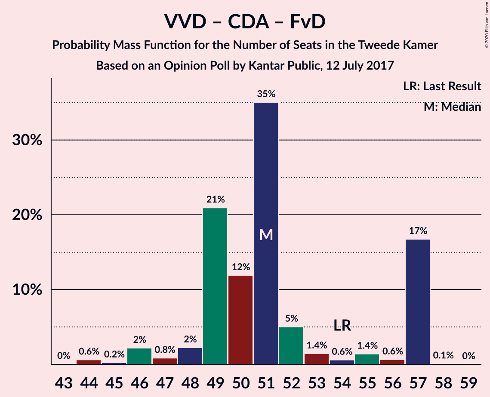

| Number of Seats | Probability | Accumulated | Special Marks |
|:---------------:|:-----------:|:-----------:|:-------------:|
| 44 | 4% | 100% |  |
| 45 | 0.1% | 96% |  |
| 46 | 3% | 96% |  |
| 47 | 0% | 92% |  |
| 48 | 0.2% | 92% |  |
| 49 | 0.1% | 92% |  |
| 50 | 86% | 92% | Median |
| 51 | 0.1% | 6% |  |
| 52 | 0.3% | 6% |  |
| 53 | 0.2% | 6% |  |
| 54 | 0.7% | 5% | Last Result |
| 55 | 0.1% | 5% |  |
| 56 | 5% | 5% |  |
| 57 | 0.1% | 0.2% |  |
| 58 | 0.1% | 0.1% |  |
| 59 | 0% | 0% |  |

### Volkspartij voor Vrijheid en Democratie – Christen-Democratisch Appèl

| Number of Seats | Probability | Accumulated | Special Marks |
|:---------------:|:-----------:|:-----------:|:-------------:|
| 40 | 4% | 100% |  |
| 41 | 2% | 96% |  |
| 42 | 0.6% | 94% |  |
| 43 | 0.8% | 93% |  |
| 44 | 0.2% | 92% |  |
| 45 | 0.5% | 92% |  |
| 46 | 0.1% | 92% |  |
| 47 | 86% | 92% | Median |
| 48 | 0.1% | 6% |  |
| 49 | 0.2% | 6% |  |
| 50 | 0.8% | 6% |  |
| 51 | 0.4% | 5% |  |
| 52 | 0% | 4% | Last Result |
| 53 | 4% | 4% |  |
| 54 | 0.1% | 0.1% |  |
| 55 | 0.1% | 0.1% |  |
| 56 | 0% | 0% |  |

### Democraten 66 – Christen-Democratisch Appèl – Partij van de Arbeid

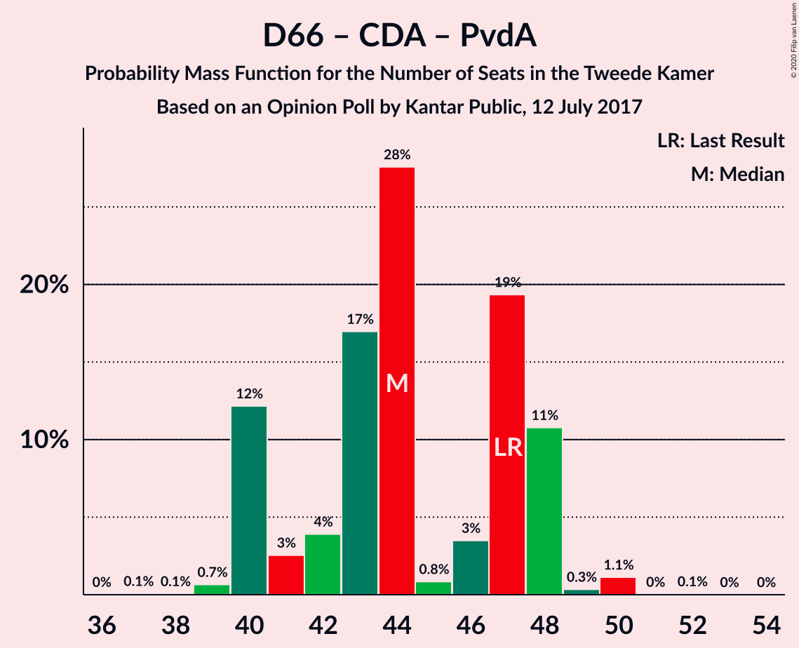

| Number of Seats | Probability | Accumulated | Special Marks |
|:---------------:|:-----------:|:-----------:|:-------------:|
| 37 | 0.2% | 100% |  |
| 38 | 0% | 99.8% |  |
| 39 | 0% | 99.8% |  |
| 40 | 0.1% | 99.8% |  |
| 41 | 0.6% | 99.7% |  |
| 42 | 5% | 99.1% |  |
| 43 | 1.0% | 94% |  |
| 44 | 90% | 93% | Median |
| 45 | 2% | 4% |  |
| 46 | 0.6% | 2% |  |
| 47 | 0.1% | 1.2% | Last Result |
| 48 | 0.2% | 1.1% |  |
| 49 | 0.6% | 0.8% |  |
| 50 | 0.2% | 0.2% |  |
| 51 | 0% | 0% |  |

### Volkspartij voor Vrijheid en Democratie – Partij van de Arbeid

| Number of Seats | Probability | Accumulated | Special Marks |
|:---------------:|:-----------:|:-----------:|:-------------:|
| 33 | 4% | 100% |  |
| 34 | 2% | 96% |  |
| 35 | 0% | 93% |  |
| 36 | 0.2% | 93% |  |
| 37 | 1.0% | 93% |  |
| 38 | 0.1% | 92% |  |
| 39 | 1.2% | 92% |  |
| 40 | 0.6% | 91% |  |
| 41 | 85% | 90% | Median |
| 42 | 0% | 5% | Last Result |
| 43 | 4% | 5% |  |
| 44 | 0.5% | 0.8% |  |
| 45 | 0% | 0.3% |  |
| 46 | 0.1% | 0.3% |  |
| 47 | 0.1% | 0.2% |  |
| 48 | 0.1% | 0.1% |  |
| 49 | 0% | 0% |  |

### Democraten 66 – Christen-Democratisch Appèl

| Number of Seats | Probability | Accumulated | Special Marks |
|:---------------:|:-----------:|:-----------:|:-------------:|
| 28 | 0.1% | 100% |  |
| 29 | 0.2% | 99.9% |  |
| 30 | 0% | 99.8% |  |
| 31 | 0.2% | 99.8% |  |
| 32 | 0.5% | 99.6% |  |
| 33 | 0.5% | 99.1% |  |
| 34 | 86% | 98.7% | Median |
| 35 | 0.1% | 12% |  |
| 36 | 10% | 12% |  |
| 37 | 0.4% | 2% |  |
| 38 | 0.2% | 2% | Last Result |
| 39 | 0.7% | 2% |  |
| 40 | 0% | 0.8% |  |
| 41 | 0.7% | 0.8% |  |
| 42 | 0.1% | 0.1% |  |
| 43 | 0% | 0% |  |

### Christen-Democratisch Appèl – Partij van de Arbeid – ChristenUnie

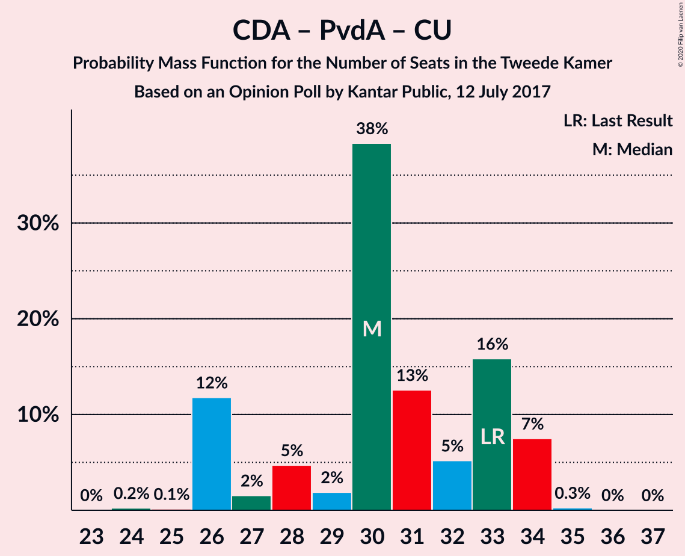

| Number of Seats | Probability | Accumulated | Special Marks |
|:---------------:|:-----------:|:-----------:|:-------------:|
| 26 | 0.1% | 100% |  |
| 27 | 4% | 99.9% |  |
| 28 | 1.2% | 96% |  |
| 29 | 5% | 95% |  |
| 30 | 4% | 90% |  |
| 31 | 85% | 86% | Median |
| 32 | 0.1% | 0.5% |  |
| 33 | 0.1% | 0.4% | Last Result |
| 34 | 0.4% | 0.4% |  |
| 35 | 0% | 0% |  |

### Christen-Democratisch Appèl – Partij van de Arbeid

| Number of Seats | Probability | Accumulated | Special Marks |
|:---------------:|:-----------:|:-----------:|:-------------:|
| 20 | 0.1% | 100% |  |
| 21 | 0% | 99.9% |  |
| 22 | 5% | 99.9% |  |
| 23 | 4% | 95% |  |
| 24 | 2% | 91% |  |
| 25 | 3% | 89% |  |
| 26 | 85% | 86% | Median |
| 27 | 0.1% | 0.4% |  |
| 28 | 0.1% | 0.3% | Last Result |
| 29 | 0.2% | 0.2% |  |
| 30 | 0% | 0% |  |

## Technical Information

### Opinion Poll

+ **Polling firm:** Kantar Public
+ **Commissioner(s):** —
+ **Fieldwork period:** 12 July 2017

### Calculations

+ **Sample size:** 954
+ **Simulations done:** 131,072
+ **Error estimate:** 4.22%

