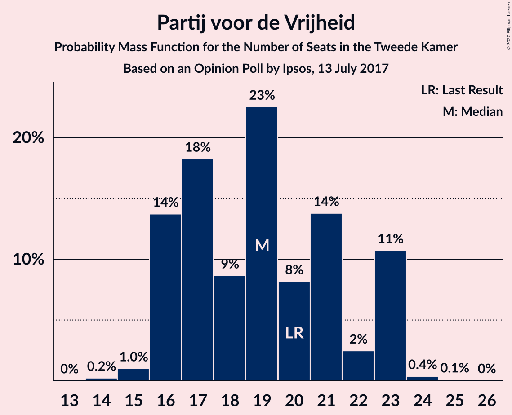
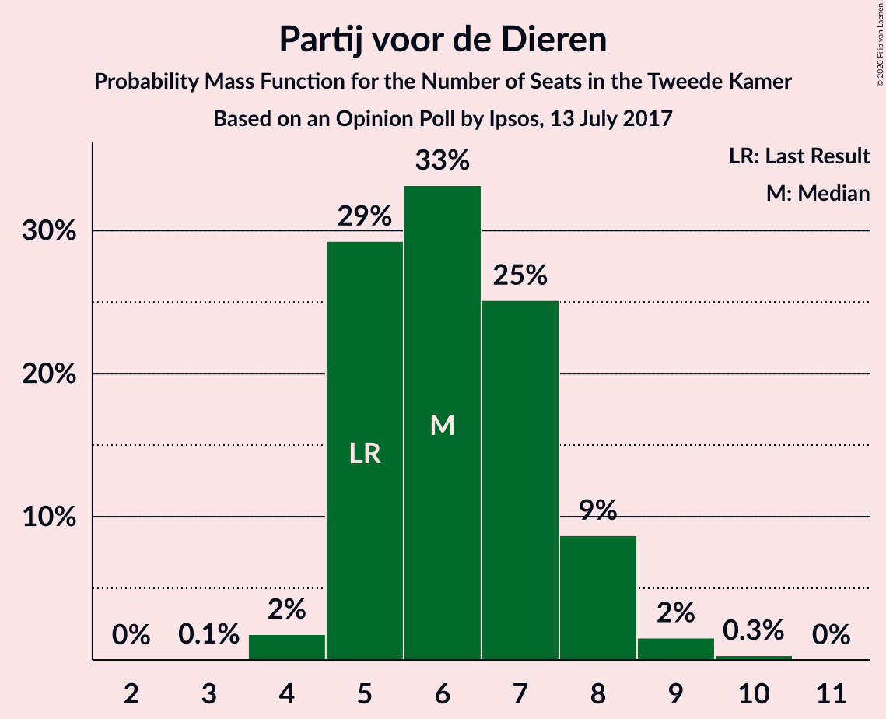
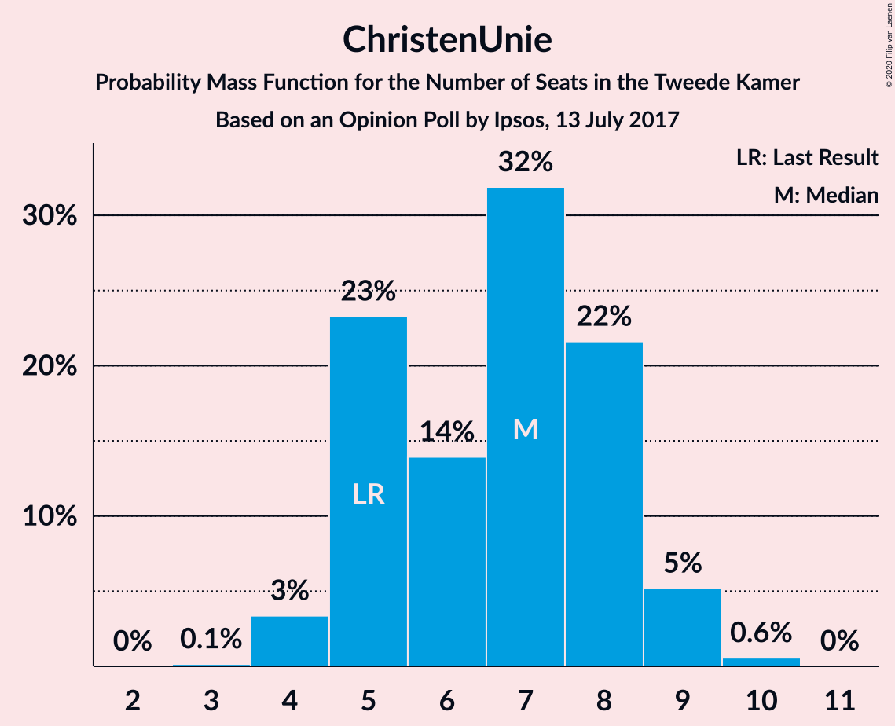
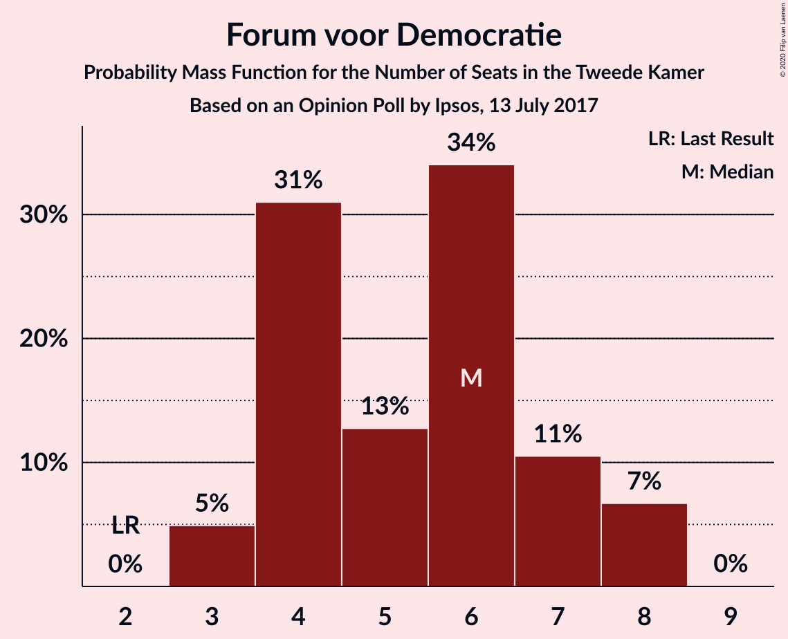
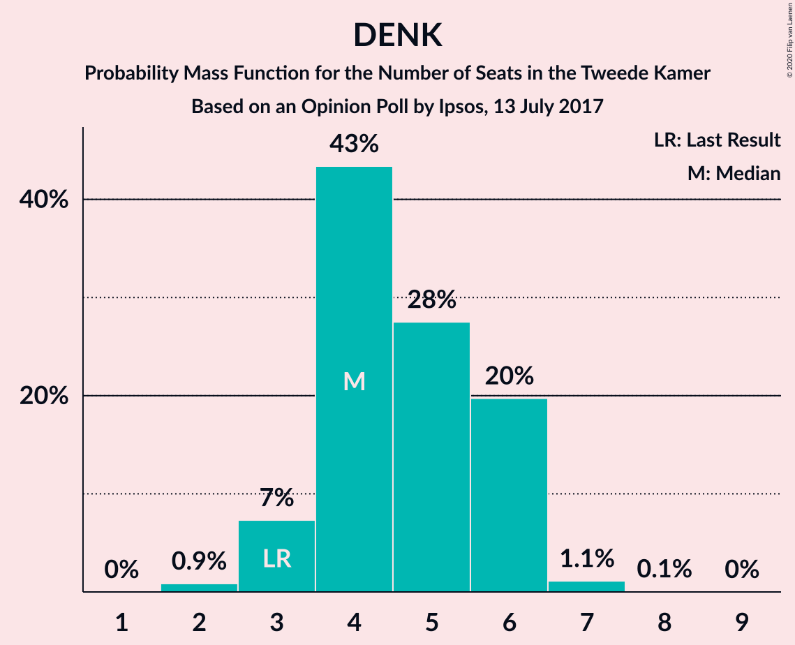
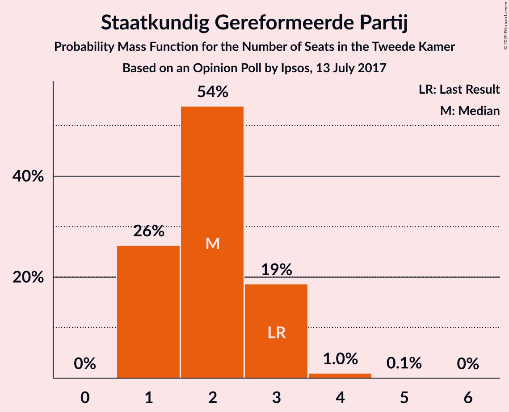
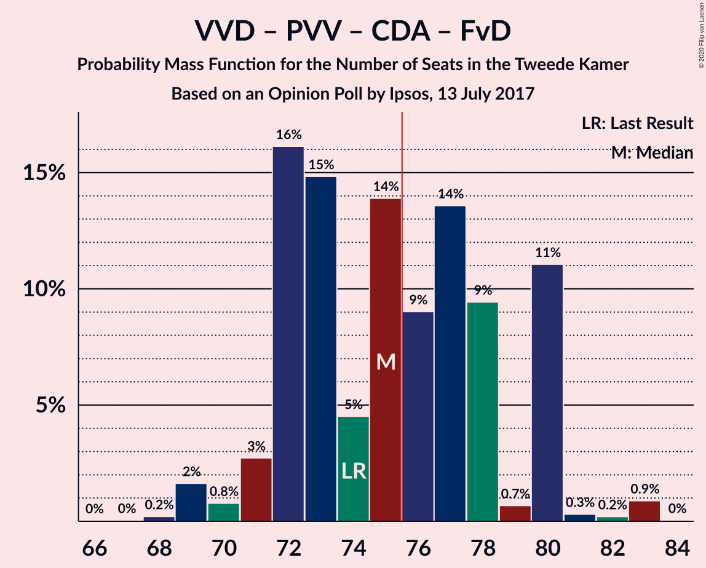
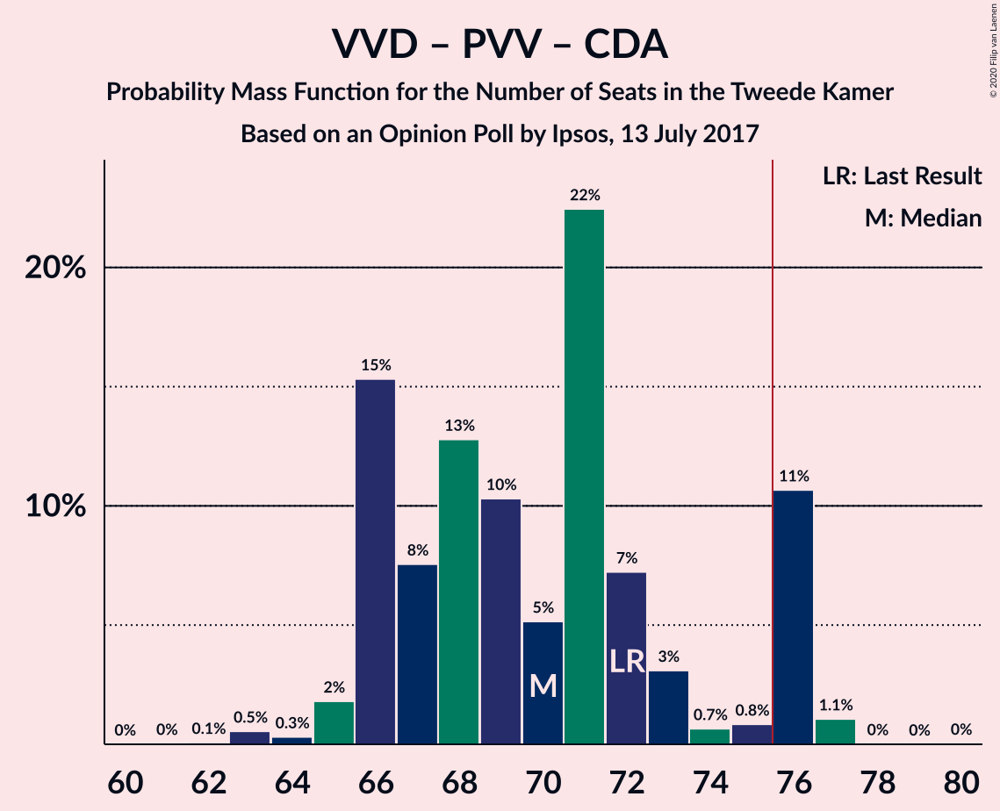
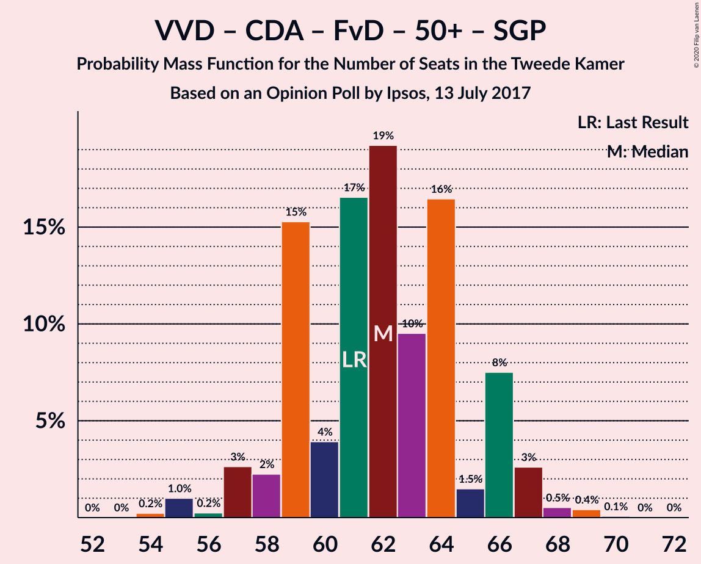
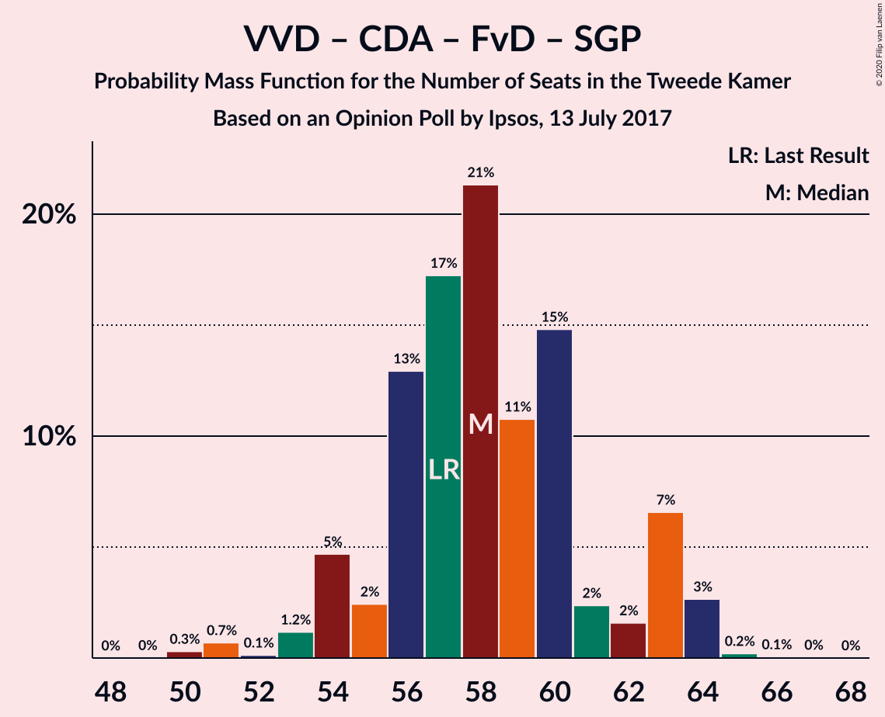

# Opinion Poll by Ipsos, 13 July 2017

<a href="#voting-intentions">Voting Intentions</a> | <a href="#seats">Seats</a> | <a href="#coalitions">Coalitions</a> | <a href="#technical-information">Technical Information</a>

## Voting Intentions

### Confidence Intervals

| Party | Last Result | Poll Result | 80% Confidence Interval | 90% Confidence Interval | 95% Confidence Interval | 99% Confidence Interval |
|:-----:|:-----------:|:-----------:|:-----------------------:|:-----------------------:|:-----------------------:|:-----------------------:|
| Volkspartij voor Vrijheid en Democratie | 21.3% | 22.7% | 21.1–24.5% |20.6–25.0% |20.2–25.4% |19.4–26.3% |
| Democraten 66 | 12.2% | 13.4% | 12.1–14.9% |11.7–15.3% |11.4–15.7% |10.8–16.4% |
| Partij voor de Vrijheid | 13.1% | 12.6% | 11.3–14.0% |11.0–14.4% |10.7–14.8% |10.1–15.5% |
| Christen-Democratisch Appèl | 12.4% | 10.6% | 9.4–11.9% |9.1–12.3% |8.8–12.7% |8.3–13.3% |
| GroenLinks | 9.1% | 9.0% | 7.9–10.3% |7.6–10.6% |7.4–10.9% |6.9–11.6% |
| Socialistische Partij | 9.1% | 5.8% | 5.0–6.9% |4.7–7.2% |4.5–7.4% |4.1–8.0% |
| Partij van de Arbeid | 5.7% | 5.5% | 4.7–6.5% |4.4–6.8% |4.3–7.1% |3.9–7.6% |
| Partij voor de Dieren | 3.2% | 4.4% | 3.7–5.3% |3.5–5.6% |3.3–5.9% |3.0–6.4% |
| ChristenUnie | 3.4% | 4.3% | 3.6–5.2% |3.4–5.5% |3.2–5.7% |2.9–6.2% |
| Forum voor Democratie | 1.8% | 3.5% | 2.9–4.4% |2.7–4.6% |2.5–4.8% |2.2–5.3% |
| DENK | 2.1% | 3.1% | 2.5–3.9% |2.3–4.2% |2.2–4.4% |1.9–4.8% |
| 50Plus | 3.1% | 2.7% | 2.1–3.5% |2.0–3.7% |1.9–3.9% |1.6–4.3% |
| Staatkundig Gereformeerde Partij | 2.1% | 1.6% | 1.2–2.2% |1.1–2.4% |1.0–2.6% |0.8–2.9% |

*Note:* The poll result column reflects the actual value used in the calculations. Published results may vary slightly, and in addition be rounded to fewer digits.

## Seats

### Confidence Intervals

| Party | Last Result | Median | 80% Confidence Interval | 90% Confidence Interval | 95% Confidence Interval | 99% Confidence Interval |
|:-----:|:-----------:|:------:|:-----------------------:|:-----------------------:|:-----------------------:|:-----------------------:|
| <a href="#volkspartij-voor-vrijheid-en-democratie">Volkspartij voor Vrijheid en Democratie</a> | 33 | 34 | 31–38 |31–39 |31–39 |29–40 |
| <a href="#democraten-66">Democraten 66</a> | 19 | 21 | 18–24 |18–24 |17–24 |16–25 |
| <a href="#partij-voor-de-vrijheid">Partij voor de Vrijheid</a> | 20 | 19 | 16–23 |16–23 |16–23 |15–23 |
| <a href="#christen-democratisch-appèl">Christen-Democratisch Appèl</a> | 19 | 16 | 15–19 |14–19 |13–19 |13–20 |
| <a href="#groenlinks">GroenLinks</a> | 14 | 14 | 12–15 |11–16 |11–17 |10–18 |
| <a href="#socialistische-partij">Socialistische Partij</a> | 14 | 8 | 7–9 |7–11 |7–11 |6–12 |
| <a href="#partij-van-de-arbeid">Partij van de Arbeid</a> | 9 | 8 | 7–10 |7–10 |6–10 |6–11 |
| <a href="#partij-voor-de-dieren">Partij voor de Dieren</a> | 5 | 6 | 5–8 |5–8 |5–8 |4–9 |
| <a href="#christenunie">ChristenUnie</a> | 5 | 7 | 5–8 |5–9 |4–9 |4–10 |
| <a href="#forum-voor-democratie">Forum voor Democratie</a> | 2 | 6 | 4–7 |4–8 |3–8 |3–8 |
| <a href="#denk">DENK</a> | 3 | 4 | 4–6 |3–6 |3–6 |2–7 |
| <a href="#50plus">50Plus</a> | 4 | 4 | 3–5 |3–5 |2–5 |2–7 |
| <a href="#staatkundig-gereformeerde-partij">Staatkundig Gereformeerde Partij</a> | 3 | 2 | 1–3 |1–3 |1–3 |1–4 |

### Volkspartij voor Vrijheid en Democratie

*For a full overview of the results for this party, see the [Volkspartij voor Vrijheid en Democratie](party-volkspartijvoorvrijheidendemocratie.html) page.*

| Number of Seats | Probability | Accumulated | Special Marks |
|:---------------:|:-----------:|:-----------:|:-------------:|
| 28 | 0.2% | 100% |  |
| 29 | 0.4% | 99.8% |  |
| 30 | 1.3% | 99.5% |  |
| 31 | 8% | 98% |  |
| 32 | 17% | 90% |  |
| 33 | 6% | 73% | Last Result |
| 34 | 29% | 67% | Median |
| 35 | 10% | 39% |  |
| 36 | 4% | 28% |  |
| 37 | 6% | 24% |  |
| 38 | 11% | 18% |  |
| 39 | 6% | 7% |  |
| 40 | 0.9% | 1.1% |  |
| 41 | 0.2% | 0.2% |  |
| 42 | 0% | 0% |  |

### Democraten 66

*For a full overview of the results for this party, see the [Democraten 66](party-democraten66.html) page.*

| Number of Seats | Probability | Accumulated | Special Marks |
|:---------------:|:-----------:|:-----------:|:-------------:|
| 15 | 0.3% | 100% |  |
| 16 | 2% | 99.7% |  |
| 17 | 2% | 98% |  |
| 18 | 17% | 96% |  |
| 19 | 14% | 79% | Last Result |
| 20 | 6% | 65% |  |
| 21 | 25% | 58% | Median |
| 22 | 19% | 33% |  |
| 23 | 4% | 14% |  |
| 24 | 9% | 10% |  |
| 25 | 0.8% | 0.9% |  |
| 26 | 0.1% | 0.1% |  |
| 27 | 0% | 0% |  |

### Partij voor de Vrijheid

*For a full overview of the results for this party, see the [Partij voor de Vrijheid](party-partijvoordevrijheid.html) page.*

| Number of Seats | Probability | Accumulated | Special Marks |
|:---------------:|:-----------:|:-----------:|:-------------:|
| 14 | 0.2% | 100% |  |
| 15 | 1.0% | 99.8% |  |
| 16 | 14% | 98.8% |  |
| 17 | 18% | 85% |  |
| 18 | 9% | 67% |  |
| 19 | 23% | 58% | Median |
| 20 | 8% | 36% | Last Result |
| 21 | 14% | 27% |  |
| 22 | 2% | 14% |  |
| 23 | 11% | 11% |  |
| 24 | 0.4% | 0.5% |  |
| 25 | 0.1% | 0.1% |  |
| 26 | 0% | 0% |  |

### Christen-Democratisch Appèl

*For a full overview of the results for this party, see the [Christen-Democratisch Appèl](party-christen-democratischappèl.html) page.*

| Number of Seats | Probability | Accumulated | Special Marks |
|:---------------:|:-----------:|:-----------:|:-------------:|
| 12 | 0.3% | 100% |  |
| 13 | 2% | 99.7% |  |
| 14 | 3% | 97% |  |
| 15 | 19% | 95% |  |
| 16 | 28% | 76% | Median |
| 17 | 28% | 48% |  |
| 18 | 8% | 19% |  |
| 19 | 11% | 12% | Last Result |
| 20 | 0.5% | 1.0% |  |
| 21 | 0.3% | 0.4% |  |
| 22 | 0.2% | 0.2% |  |
| 23 | 0% | 0% |  |

### GroenLinks

*For a full overview of the results for this party, see the [GroenLinks](party-groenlinks.html) page.*

| Number of Seats | Probability | Accumulated | Special Marks |
|:---------------:|:-----------:|:-----------:|:-------------:|
| 10 | 2% | 100% |  |
| 11 | 4% | 98% |  |
| 12 | 17% | 93% |  |
| 13 | 14% | 76% |  |
| 14 | 37% | 62% | Last Result, Median |
| 15 | 18% | 26% |  |
| 16 | 4% | 8% |  |
| 17 | 3% | 4% |  |
| 18 | 0.8% | 0.9% |  |
| 19 | 0.1% | 0.1% |  |
| 20 | 0% | 0% |  |

### Socialistische Partij

*For a full overview of the results for this party, see the [Socialistische Partij](party-socialistischepartij.html) page.*

| Number of Seats | Probability | Accumulated | Special Marks |
|:---------------:|:-----------:|:-----------:|:-------------:|
| 5 | 0.1% | 100% |  |
| 6 | 1.5% | 99.9% |  |
| 7 | 21% | 98% |  |
| 8 | 31% | 77% | Median |
| 9 | 37% | 46% |  |
| 10 | 4% | 9% |  |
| 11 | 4% | 5% |  |
| 12 | 0.7% | 0.8% |  |
| 13 | 0% | 0% |  |
| 14 | 0% | 0% | Last Result |

### Partij van de Arbeid

*For a full overview of the results for this party, see the [Partij van de Arbeid](party-partijvandearbeid.html) page.*

| Number of Seats | Probability | Accumulated | Special Marks |
|:---------------:|:-----------:|:-----------:|:-------------:|
| 5 | 0.3% | 100% |  |
| 6 | 5% | 99.7% |  |
| 7 | 21% | 95% |  |
| 8 | 32% | 74% | Median |
| 9 | 24% | 43% | Last Result |
| 10 | 16% | 18% |  |
| 11 | 1.3% | 2% |  |
| 12 | 0.4% | 0.4% |  |
| 13 | 0% | 0% |  |

### Partij voor de Dieren

*For a full overview of the results for this party, see the [Partij voor de Dieren](party-partijvoordedieren.html) page.*

| Number of Seats | Probability | Accumulated | Special Marks |
|:---------------:|:-----------:|:-----------:|:-------------:|
| 3 | 0.1% | 100% |  |
| 4 | 2% | 99.9% |  |
| 5 | 29% | 98% | Last Result |
| 6 | 33% | 69% | Median |
| 7 | 25% | 36% |  |
| 8 | 9% | 11% |  |
| 9 | 2% | 2% |  |
| 10 | 0.3% | 0.3% |  |
| 11 | 0% | 0% |  |

### ChristenUnie

*For a full overview of the results for this party, see the [ChristenUnie](party-christenunie.html) page.*

| Number of Seats | Probability | Accumulated | Special Marks |
|:---------------:|:-----------:|:-----------:|:-------------:|
| 3 | 0.1% | 100% |  |
| 4 | 3% | 99.9% |  |
| 5 | 23% | 96% | Last Result |
| 6 | 14% | 73% |  |
| 7 | 32% | 59% | Median |
| 8 | 22% | 27% |  |
| 9 | 5% | 6% |  |
| 10 | 0.6% | 0.6% |  |
| 11 | 0% | 0% |  |

### Forum voor Democratie

*For a full overview of the results for this party, see the [Forum voor Democratie](party-forumvoordemocratie.html) page.*

| Number of Seats | Probability | Accumulated | Special Marks |
|:---------------:|:-----------:|:-----------:|:-------------:|
| 2 | 0% | 100% | Last Result |
| 3 | 5% | 100% |  |
| 4 | 31% | 95% |  |
| 5 | 13% | 64% |  |
| 6 | 34% | 51% | Median |
| 7 | 11% | 17% |  |
| 8 | 7% | 7% |  |
| 9 | 0% | 0% |  |

### DENK

*For a full overview of the results for this party, see the [DENK](party-denk.html) page.*

| Number of Seats | Probability | Accumulated | Special Marks |
|:---------------:|:-----------:|:-----------:|:-------------:|
| 2 | 0.9% | 100% |  |
| 3 | 7% | 99.1% | Last Result |
| 4 | 43% | 92% | Median |
| 5 | 28% | 48% |  |
| 6 | 20% | 21% |  |
| 7 | 1.1% | 1.2% |  |
| 8 | 0.1% | 0.1% |  |
| 9 | 0% | 0% |  |

### 50Plus

*For a full overview of the results for this party, see the [50Plus](party-50plus.html) page.*

| Number of Seats | Probability | Accumulated | Special Marks |
|:---------------:|:-----------:|:-----------:|:-------------:|
| 2 | 4% | 100% |  |
| 3 | 36% | 96% |  |
| 4 | 45% | 59% | Last Result, Median |
| 5 | 12% | 14% |  |
| 6 | 1.1% | 2% |  |
| 7 | 1.1% | 1.2% |  |
| 8 | 0% | 0% |  |

### Staatkundig Gereformeerde Partij

*For a full overview of the results for this party, see the [Staatkundig Gereformeerde Partij](party-staatkundiggereformeerdepartij.html) page.*

| Number of Seats | Probability | Accumulated | Special Marks |
|:---------------:|:-----------:|:-----------:|:-------------:|
| 1 | 26% | 100% |  |
| 2 | 54% | 74% | Median |
| 3 | 19% | 20% | Last Result |
| 4 | 1.0% | 1.1% |  |
| 5 | 0.1% | 0.1% |  |
| 6 | 0% | 0% |  |

## Coalitions

### Confidence Intervals

| Coalition | Last Result | Median | Majority? | 80% Confidence Interval | 90% Confidence Interval | 95% Confidence Interval | 99% Confidence Interval |
|:---------:|:-----------:|:------:|:---------:|:-----------------------:|:-----------------------:|:-----------------------:|:-----------------------:|
| Volkspartij voor Vrijheid en Democratie – Democraten 66 – Christen-Democratisch Appèl – GroenLinks – ChristenUnie | 90 | 92 | 100% | 89–94 | 87–95 | 86–96 | 85–98 |
| Volkspartij voor Vrijheid en Democratie – Democraten 66 – Christen-Democratisch Appèl – Partij van de Arbeid – ChristenUnie | 85 | 88 | 100% | 83–88 | 81–89 | 81–90 | 78–92 |
| Volkspartij voor Vrijheid en Democratie – Democraten 66 – Christen-Democratisch Appèl – ChristenUnie | 76 | 78 | 83% | 74–81 | 74–82 | 72–83 | 71–84 |
| Volkspartij voor Vrijheid en Democratie – Partij voor de Vrijheid – Christen-Democratisch Appèl – Forum voor Democratie – Staatkundig Gereformeerde Partij | 77 | 77 | 68% | 74–81 | 73–81 | 73–81 | 71–85 |
| Volkspartij voor Vrijheid en Democratie – Partij voor de Vrijheid – Christen-Democratisch Appèl – Forum voor Democratie | 74 | 75 | 45% | 72–80 | 71–80 | 70–80 | 69–83 |
| Democraten 66 – Christen-Democratisch Appèl – GroenLinks – Socialistische Partij – Partij van de Arbeid – ChristenUnie | 80 | 74 | 31% | 71–76 | 71–78 | 69–78 | 66–80 |
| Volkspartij voor Vrijheid en Democratie – Democraten 66 – Christen-Democratisch Appèl | 71 | 71 | 15% | 67–76 | 67–76 | 66–77 | 65–78 |
| Volkspartij voor Vrijheid en Democratie – Partij voor de Vrijheid – Christen-Democratisch Appèl | 72 | 70 | 12% | 66–76 | 66–76 | 65–76 | 63–77 |
| Democraten 66 – Christen-Democratisch Appèl – GroenLinks – Partij van de Arbeid – ChristenUnie | 66 | 66 | 0% | 62–68 | 61–69 | 60–69 | 58–70 |
| Volkspartij voor Vrijheid en Democratie – Democraten 66 – Partij van de Arbeid | 61 | 64 | 0% | 59–67 | 59–67 | 57–68 | 57–70 |
| Volkspartij voor Vrijheid en Democratie – Christen-Democratisch Appèl – Forum voor Democratie – 50Plus – Staatkundig Gereformeerde Partij | 61 | 62 | 0% | 59–66 | 58–66 | 57–67 | 55–69 |
| Volkspartij voor Vrijheid en Democratie – Christen-Democratisch Appèl – Forum voor Democratie – 50Plus | 58 | 60 | 0% | 57–63 | 56–65 | 55–65 | 53–67 |
| Volkspartij voor Vrijheid en Democratie – Christen-Democratisch Appèl – Forum voor Democratie – Staatkundig Gereformeerde Partij | 57 | 58 | 0% | 56–62 | 54–63 | 54–64 | 51–64 |
| Volkspartij voor Vrijheid en Democratie – Christen-Democratisch Appèl – Partij van de Arbeid | 61 | 59 | 0% | 56–63 | 56–64 | 54–64 | 52–65 |
| Volkspartij voor Vrijheid en Democratie – Christen-Democratisch Appèl – Forum voor Democratie | 54 | 56 | 0% | 53–60 | 52–62 | 51–62 | 49–62 |
| Volkspartij voor Vrijheid en Democratie – Christen-Democratisch Appèl | 52 | 50 | 0% | 48–55 | 48–55 | 46–55 | 44–57 |
| Democraten 66 – Christen-Democratisch Appèl – Partij van de Arbeid | 47 | 45 | 0% | 43–47 | 42–48 | 42–49 | 38–51 |
| Volkspartij voor Vrijheid en Democratie – Partij van de Arbeid | 42 | 43 | 0% | 40–45 | 39–48 | 39–48 | 37–49 |
| Democraten 66 – Christen-Democratisch Appèl | 38 | 37 | 0% | 35–39 | 34–40 | 34–41 | 30–43 |
| Christen-Democratisch Appèl – Partij van de Arbeid – ChristenUnie | 33 | 32 | 0% | 29–35 | 28–36 | 28–36 | 26–37 |
| Christen-Democratisch Appèl – Partij van de Arbeid | 28 | 25 | 0% | 23–28 | 22–28 | 22–28 | 20–29 |

### Volkspartij voor Vrijheid en Democratie – Democraten 66 – Christen-Democratisch Appèl – GroenLinks – ChristenUnie

| Number of Seats | Probability | Accumulated | Special Marks |
|:---------------:|:-----------:|:-----------:|:-------------:|
| 83 | 0.1% | 100% |  |
| 84 | 0.4% | 99.9% |  |
| 85 | 1.3% | 99.6% |  |
| 86 | 2% | 98% |  |
| 87 | 3% | 96% |  |
| 88 | 1.0% | 94% |  |
| 89 | 10% | 93% |  |
| 90 | 4% | 83% | Last Result |
| 91 | 12% | 79% |  |
| 92 | 28% | 67% | Median |
| 93 | 23% | 39% |  |
| 94 | 10% | 17% |  |
| 95 | 3% | 7% |  |
| 96 | 2% | 3% |  |
| 97 | 0.2% | 0.7% |  |
| 98 | 0.4% | 0.5% |  |
| 99 | 0.1% | 0.1% |  |
| 100 | 0% | 0% |  |

### Volkspartij voor Vrijheid en Democratie – Democraten 66 – Christen-Democratisch Appèl – Partij van de Arbeid – ChristenUnie

| Number of Seats | Probability | Accumulated | Special Marks |
|:---------------:|:-----------:|:-----------:|:-------------:|
| 77 | 0.1% | 100% |  |
| 78 | 0.6% | 99.9% |  |
| 79 | 0.3% | 99.3% |  |
| 80 | 1.2% | 99.0% |  |
| 81 | 4% | 98% |  |
| 82 | 1.4% | 93% |  |
| 83 | 10% | 92% |  |
| 84 | 1.2% | 82% |  |
| 85 | 15% | 81% | Last Result |
| 86 | 7% | 66% | Median |
| 87 | 4% | 60% |  |
| 88 | 49% | 56% |  |
| 89 | 4% | 7% |  |
| 90 | 2% | 3% |  |
| 91 | 0.9% | 2% |  |
| 92 | 0.7% | 1.0% |  |
| 93 | 0.3% | 0.4% |  |
| 94 | 0% | 0% |  |

### Volkspartij voor Vrijheid en Democratie – Democraten 66 – Christen-Democratisch Appèl – ChristenUnie

| Number of Seats | Probability | Accumulated | Special Marks |
|:---------------:|:-----------:|:-----------:|:-------------:|
| 69 | 0.2% | 100% |  |
| 70 | 0.1% | 99.8% |  |
| 71 | 0.6% | 99.8% |  |
| 72 | 3% | 99.1% |  |
| 73 | 1.3% | 97% |  |
| 74 | 10% | 95% |  |
| 75 | 3% | 86% |  |
| 76 | 2% | 83% | Last Result, Majority |
| 77 | 13% | 81% |  |
| 78 | 22% | 68% | Median |
| 79 | 17% | 45% |  |
| 80 | 11% | 29% |  |
| 81 | 12% | 18% |  |
| 82 | 2% | 5% |  |
| 83 | 3% | 3% |  |
| 84 | 0.4% | 0.5% |  |
| 85 | 0.1% | 0.1% |  |
| 86 | 0% | 0% |  |

### Volkspartij voor Vrijheid en Democratie – Partij voor de Vrijheid – Christen-Democratisch Appèl – Forum voor Democratie – Staatkundig Gereformeerde Partij

| Number of Seats | Probability | Accumulated | Special Marks |
|:---------------:|:-----------:|:-----------:|:-------------:|
| 69 | 0% | 100% |  |
| 70 | 0.1% | 99.9% |  |
| 71 | 1.2% | 99.8% |  |
| 72 | 1.0% | 98.6% |  |
| 73 | 3% | 98% |  |
| 74 | 16% | 95% |  |
| 75 | 10% | 78% |  |
| 76 | 9% | 68% | Majority |
| 77 | 17% | 59% | Last Result, Median |
| 78 | 2% | 42% |  |
| 79 | 22% | 40% |  |
| 80 | 4% | 19% |  |
| 81 | 12% | 15% |  |
| 82 | 0.7% | 2% |  |
| 83 | 0.5% | 2% |  |
| 84 | 0.3% | 1.2% |  |
| 85 | 0.9% | 0.9% |  |
| 86 | 0% | 0% |  |

### Volkspartij voor Vrijheid en Democratie – Partij voor de Vrijheid – Christen-Democratisch Appèl – Forum voor Democratie

| Number of Seats | Probability | Accumulated | Special Marks |
|:---------------:|:-----------:|:-----------:|:-------------:|
| 67 | 0% | 100% |  |
| 68 | 0.2% | 99.9% |  |
| 69 | 2% | 99.7% |  |
| 70 | 0.8% | 98% |  |
| 71 | 3% | 97% |  |
| 72 | 16% | 95% |  |
| 73 | 15% | 78% |  |
| 74 | 5% | 64% | Last Result |
| 75 | 14% | 59% | Median |
| 76 | 9% | 45% | Majority |
| 77 | 14% | 36% |  |
| 78 | 9% | 23% |  |
| 79 | 0.7% | 13% |  |
| 80 | 11% | 12% |  |
| 81 | 0.3% | 1.4% |  |
| 82 | 0.2% | 1.1% |  |
| 83 | 0.9% | 0.9% |  |
| 84 | 0% | 0% |  |

### Democraten 66 – Christen-Democratisch Appèl – GroenLinks – Socialistische Partij – Partij van de Arbeid – ChristenUnie

| Number of Seats | Probability | Accumulated | Special Marks |
|:---------------:|:-----------:|:-----------:|:-------------:|
| 65 | 0.1% | 100% |  |
| 66 | 0.4% | 99.9% |  |
| 67 | 0.3% | 99.4% |  |
| 68 | 1.4% | 99.2% |  |
| 69 | 0.9% | 98% |  |
| 70 | 1.3% | 97% |  |
| 71 | 13% | 96% |  |
| 72 | 10% | 82% |  |
| 73 | 13% | 72% |  |
| 74 | 14% | 59% | Median |
| 75 | 15% | 45% |  |
| 76 | 21% | 31% | Majority |
| 77 | 0.5% | 10% |  |
| 78 | 8% | 9% |  |
| 79 | 0.5% | 1.0% |  |
| 80 | 0.5% | 0.6% | Last Result |
| 81 | 0% | 0% |  |

### Volkspartij voor Vrijheid en Democratie – Democraten 66 – Christen-Democratisch Appèl

| Number of Seats | Probability | Accumulated | Special Marks |
|:---------------:|:-----------:|:-----------:|:-------------:|
| 62 | 0.1% | 100% |  |
| 63 | 0% | 99.9% |  |
| 64 | 0.3% | 99.9% |  |
| 65 | 1.2% | 99.6% |  |
| 66 | 2% | 98% |  |
| 67 | 11% | 97% |  |
| 68 | 3% | 86% |  |
| 69 | 11% | 83% |  |
| 70 | 4% | 72% |  |
| 71 | 27% | 68% | Last Result, Median |
| 72 | 6% | 41% |  |
| 73 | 6% | 35% |  |
| 74 | 14% | 29% |  |
| 75 | 0.8% | 16% |  |
| 76 | 11% | 15% | Majority |
| 77 | 2% | 4% |  |
| 78 | 2% | 2% |  |
| 79 | 0.1% | 0.1% |  |
| 80 | 0% | 0% |  |

### Volkspartij voor Vrijheid en Democratie – Partij voor de Vrijheid – Christen-Democratisch Appèl

| Number of Seats | Probability | Accumulated | Special Marks |
|:---------------:|:-----------:|:-----------:|:-------------:|
| 62 | 0.1% | 100% |  |
| 63 | 0.5% | 99.9% |  |
| 64 | 0.3% | 99.3% |  |
| 65 | 2% | 99.0% |  |
| 66 | 15% | 97% |  |
| 67 | 8% | 82% |  |
| 68 | 13% | 74% |  |
| 69 | 10% | 62% | Median |
| 70 | 5% | 51% |  |
| 71 | 22% | 46% |  |
| 72 | 7% | 24% | Last Result |
| 73 | 3% | 16% |  |
| 74 | 0.7% | 13% |  |
| 75 | 0.8% | 13% |  |
| 76 | 11% | 12% | Majority |
| 77 | 1.1% | 1.1% |  |
| 78 | 0% | 0.1% |  |
| 79 | 0% | 0% |  |

### Democraten 66 – Christen-Democratisch Appèl – GroenLinks – Partij van de Arbeid – ChristenUnie

| Number of Seats | Probability | Accumulated | Special Marks |
|:---------------:|:-----------:|:-----------:|:-------------:|
| 56 | 0.1% | 100% |  |
| 57 | 0.1% | 99.9% |  |
| 58 | 0.7% | 99.9% |  |
| 59 | 0.5% | 99.2% |  |
| 60 | 2% | 98.7% |  |
| 61 | 2% | 96% |  |
| 62 | 12% | 94% |  |
| 63 | 8% | 82% |  |
| 64 | 5% | 74% |  |
| 65 | 7% | 69% |  |
| 66 | 13% | 61% | Last Result, Median |
| 67 | 19% | 48% |  |
| 68 | 19% | 29% |  |
| 69 | 8% | 10% |  |
| 70 | 1.2% | 2% |  |
| 71 | 0.4% | 0.4% |  |
| 72 | 0% | 0% |  |

### Volkspartij voor Vrijheid en Democratie – Democraten 66 – Partij van de Arbeid

| Number of Seats | Probability | Accumulated | Special Marks |
|:---------------:|:-----------:|:-----------:|:-------------:|
| 56 | 0% | 100% |  |
| 57 | 4% | 99.9% |  |
| 58 | 0.4% | 96% |  |
| 59 | 9% | 96% |  |
| 60 | 5% | 87% |  |
| 61 | 24% | 81% | Last Result |
| 62 | 4% | 57% |  |
| 63 | 2% | 53% | Median |
| 64 | 3% | 50% |  |
| 65 | 2% | 47% |  |
| 66 | 33% | 45% |  |
| 67 | 9% | 13% |  |
| 68 | 2% | 4% |  |
| 69 | 0.8% | 1.3% |  |
| 70 | 0.3% | 0.6% |  |
| 71 | 0.3% | 0.3% |  |
| 72 | 0.1% | 0.1% |  |
| 73 | 0% | 0% |  |

### Volkspartij voor Vrijheid en Democratie – Christen-Democratisch Appèl – Forum voor Democratie – 50Plus – Staatkundig Gereformeerde Partij

| Number of Seats | Probability | Accumulated | Special Marks |
|:---------------:|:-----------:|:-----------:|:-------------:|
| 54 | 0.2% | 100% |  |
| 55 | 1.0% | 99.7% |  |
| 56 | 0.2% | 98.7% |  |
| 57 | 3% | 98% |  |
| 58 | 2% | 96% |  |
| 59 | 15% | 94% |  |
| 60 | 4% | 78% |  |
| 61 | 17% | 74% | Last Result |
| 62 | 19% | 58% | Median |
| 63 | 10% | 39% |  |
| 64 | 16% | 29% |  |
| 65 | 1.5% | 13% |  |
| 66 | 8% | 11% |  |
| 67 | 3% | 4% |  |
| 68 | 0.5% | 1.0% |  |
| 69 | 0.4% | 0.5% |  |
| 70 | 0.1% | 0.1% |  |
| 71 | 0% | 0% |  |

### Volkspartij voor Vrijheid en Democratie – Christen-Democratisch Appèl – Forum voor Democratie – 50Plus

| Number of Seats | Probability | Accumulated | Special Marks |
|:---------------:|:-----------:|:-----------:|:-------------:|
| 52 | 0.1% | 100% |  |
| 53 | 0.8% | 99.9% |  |
| 54 | 1.4% | 99.1% |  |
| 55 | 0.5% | 98% |  |
| 56 | 5% | 97% |  |
| 57 | 16% | 92% |  |
| 58 | 4% | 76% | Last Result |
| 59 | 18% | 72% |  |
| 60 | 16% | 54% | Median |
| 61 | 8% | 38% |  |
| 62 | 5% | 30% |  |
| 63 | 16% | 25% |  |
| 64 | 2% | 9% |  |
| 65 | 6% | 7% |  |
| 66 | 0.2% | 0.8% |  |
| 67 | 0.4% | 0.6% |  |
| 68 | 0.1% | 0.2% |  |
| 69 | 0% | 0% |  |

### Volkspartij voor Vrijheid en Democratie – Christen-Democratisch Appèl – Forum voor Democratie – Staatkundig Gereformeerde Partij

| Number of Seats | Probability | Accumulated | Special Marks |
|:---------------:|:-----------:|:-----------:|:-------------:|
| 50 | 0.3% | 100% |  |
| 51 | 0.7% | 99.7% |  |
| 52 | 0.1% | 99.0% |  |
| 53 | 1.2% | 98.9% |  |
| 54 | 5% | 98% |  |
| 55 | 2% | 93% |  |
| 56 | 13% | 91% |  |
| 57 | 17% | 78% | Last Result |
| 58 | 21% | 60% | Median |
| 59 | 11% | 39% |  |
| 60 | 15% | 28% |  |
| 61 | 2% | 13% |  |
| 62 | 2% | 11% |  |
| 63 | 7% | 10% |  |
| 64 | 3% | 3% |  |
| 65 | 0.2% | 0.3% |  |
| 66 | 0.1% | 0.1% |  |
| 67 | 0% | 0% |  |

### Volkspartij voor Vrijheid en Democratie – Christen-Democratisch Appèl – Partij van de Arbeid

| Number of Seats | Probability | Accumulated | Special Marks |
|:---------------:|:-----------:|:-----------:|:-------------:|
| 51 | 0.1% | 100% |  |
| 52 | 1.2% | 99.9% |  |
| 53 | 0.3% | 98.7% |  |
| 54 | 2% | 98% |  |
| 55 | 1.0% | 97% |  |
| 56 | 16% | 96% |  |
| 57 | 11% | 80% |  |
| 58 | 11% | 69% | Median |
| 59 | 18% | 59% |  |
| 60 | 4% | 41% |  |
| 61 | 8% | 37% | Last Result |
| 62 | 19% | 29% |  |
| 63 | 3% | 11% |  |
| 64 | 7% | 7% |  |
| 65 | 0.4% | 0.9% |  |
| 66 | 0.4% | 0.5% |  |
| 67 | 0% | 0.1% |  |
| 68 | 0% | 0% |  |

### Volkspartij voor Vrijheid en Democratie – Christen-Democratisch Appèl – Forum voor Democratie

| Number of Seats | Probability | Accumulated | Special Marks |
|:---------------:|:-----------:|:-----------:|:-------------:|
| 48 | 0.2% | 100% |  |
| 49 | 0.4% | 99.8% |  |
| 50 | 0.6% | 99.4% |  |
| 51 | 2% | 98.8% |  |
| 52 | 4% | 97% |  |
| 53 | 3% | 93% |  |
| 54 | 13% | 90% | Last Result |
| 55 | 21% | 76% |  |
| 56 | 13% | 55% | Median |
| 57 | 14% | 42% |  |
| 58 | 4% | 28% |  |
| 59 | 14% | 24% |  |
| 60 | 3% | 10% |  |
| 61 | 1.4% | 8% |  |
| 62 | 6% | 6% |  |
| 63 | 0.3% | 0.4% |  |
| 64 | 0.1% | 0.1% |  |
| 65 | 0% | 0% |  |

### Volkspartij voor Vrijheid en Democratie – Christen-Democratisch Appèl

| Number of Seats | Probability | Accumulated | Special Marks |
|:---------------:|:-----------:|:-----------:|:-------------:|
| 44 | 1.0% | 100% |  |
| 45 | 1.1% | 99.0% |  |
| 46 | 0.7% | 98% |  |
| 47 | 1.5% | 97% |  |
| 48 | 19% | 96% |  |
| 49 | 22% | 77% |  |
| 50 | 6% | 54% | Median |
| 51 | 8% | 48% |  |
| 52 | 1.0% | 40% | Last Result |
| 53 | 15% | 39% |  |
| 54 | 7% | 24% |  |
| 55 | 15% | 17% |  |
| 56 | 1.1% | 2% |  |
| 57 | 0.5% | 0.6% |  |
| 58 | 0.1% | 0.2% |  |
| 59 | 0% | 0.1% |  |
| 60 | 0% | 0% |  |

### Democraten 66 – Christen-Democratisch Appèl – Partij van de Arbeid

| Number of Seats | Probability | Accumulated | Special Marks |
|:---------------:|:-----------:|:-----------:|:-------------:|
| 36 | 0.1% | 100% |  |
| 37 | 0.3% | 99.9% |  |
| 38 | 0.3% | 99.6% |  |
| 39 | 0.1% | 99.3% |  |
| 40 | 0.4% | 99.2% |  |
| 41 | 1.2% | 98.8% |  |
| 42 | 7% | 98% |  |
| 43 | 3% | 91% |  |
| 44 | 14% | 87% |  |
| 45 | 31% | 73% | Median |
| 46 | 14% | 43% |  |
| 47 | 19% | 29% | Last Result |
| 48 | 5% | 9% |  |
| 49 | 3% | 4% |  |
| 50 | 0.1% | 1.0% |  |
| 51 | 0.8% | 0.9% |  |
| 52 | 0.1% | 0.1% |  |
| 53 | 0% | 0.1% |  |
| 54 | 0% | 0% |  |

### Volkspartij voor Vrijheid en Democratie – Partij van de Arbeid

| Number of Seats | Probability | Accumulated | Special Marks |
|:---------------:|:-----------:|:-----------:|:-------------:|
| 36 | 0.1% | 100% |  |
| 37 | 0.8% | 99.9% |  |
| 38 | 1.5% | 99.1% |  |
| 39 | 5% | 98% |  |
| 40 | 19% | 92% |  |
| 41 | 7% | 74% |  |
| 42 | 7% | 66% | Last Result, Median |
| 43 | 17% | 59% |  |
| 44 | 19% | 42% |  |
| 45 | 14% | 23% |  |
| 46 | 2% | 9% |  |
| 47 | 2% | 8% |  |
| 48 | 5% | 6% |  |
| 49 | 0.5% | 0.8% |  |
| 50 | 0.2% | 0.3% |  |
| 51 | 0% | 0.1% |  |
| 52 | 0% | 0% |  |

### Democraten 66 – Christen-Democratisch Appèl

| Number of Seats | Probability | Accumulated | Special Marks |
|:---------------:|:-----------:|:-----------:|:-------------:|
| 29 | 0.4% | 100% |  |
| 30 | 0.2% | 99.6% |  |
| 31 | 0.4% | 99.4% |  |
| 32 | 0.3% | 99.0% |  |
| 33 | 0.6% | 98.7% |  |
| 34 | 4% | 98% |  |
| 35 | 12% | 94% |  |
| 36 | 14% | 82% |  |
| 37 | 39% | 69% | Median |
| 38 | 15% | 30% | Last Result |
| 39 | 6% | 15% |  |
| 40 | 6% | 10% |  |
| 41 | 3% | 4% |  |
| 42 | 0.1% | 0.6% |  |
| 43 | 0.4% | 0.6% |  |
| 44 | 0.2% | 0.2% |  |
| 45 | 0% | 0% |  |

### Christen-Democratisch Appèl – Partij van de Arbeid – ChristenUnie

| Number of Seats | Probability | Accumulated | Special Marks |
|:---------------:|:-----------:|:-----------:|:-------------:|
| 25 | 0.1% | 100% |  |
| 26 | 0.8% | 99.9% |  |
| 27 | 1.0% | 99.1% |  |
| 28 | 8% | 98% |  |
| 29 | 17% | 91% |  |
| 30 | 13% | 74% |  |
| 31 | 8% | 61% | Median |
| 32 | 25% | 52% |  |
| 33 | 10% | 27% | Last Result |
| 34 | 3% | 17% |  |
| 35 | 6% | 14% |  |
| 36 | 7% | 8% |  |
| 37 | 0.5% | 0.8% |  |
| 38 | 0.3% | 0.3% |  |
| 39 | 0% | 0% |  |

### Christen-Democratisch Appèl – Partij van de Arbeid

| Number of Seats | Probability | Accumulated | Special Marks |
|:---------------:|:-----------:|:-----------:|:-------------:|
| 19 | 0.1% | 100% |  |
| 20 | 0.4% | 99.9% |  |
| 21 | 2% | 99.5% |  |
| 22 | 6% | 98% |  |
| 23 | 4% | 91% |  |
| 24 | 37% | 87% | Median |
| 25 | 23% | 50% |  |
| 26 | 13% | 27% |  |
| 27 | 3% | 14% |  |
| 28 | 9% | 11% | Last Result |
| 29 | 1.1% | 2% |  |
| 30 | 0.2% | 0.5% |  |
| 31 | 0.3% | 0.3% |  |
| 32 | 0% | 0% |  |

## Technical Information

### Opinion Poll

+ **Polling firm:** Ipsos
+ **Commissioner(s):** —
+ **Fieldwork period:** 13 July 2017

### Calculations

+ **Sample size:** 1000
+ **Simulations done:** 1,048,576
+ **Error estimate:** 2.55%

