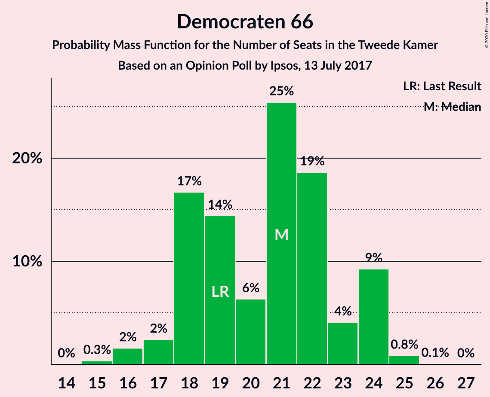
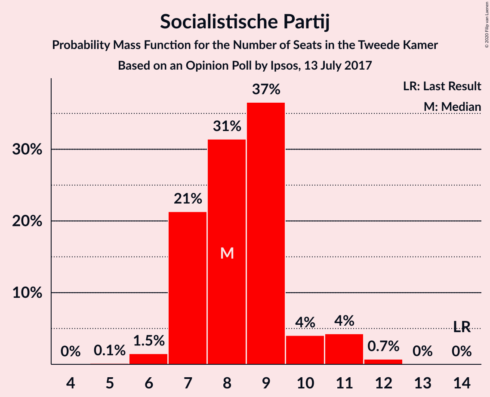
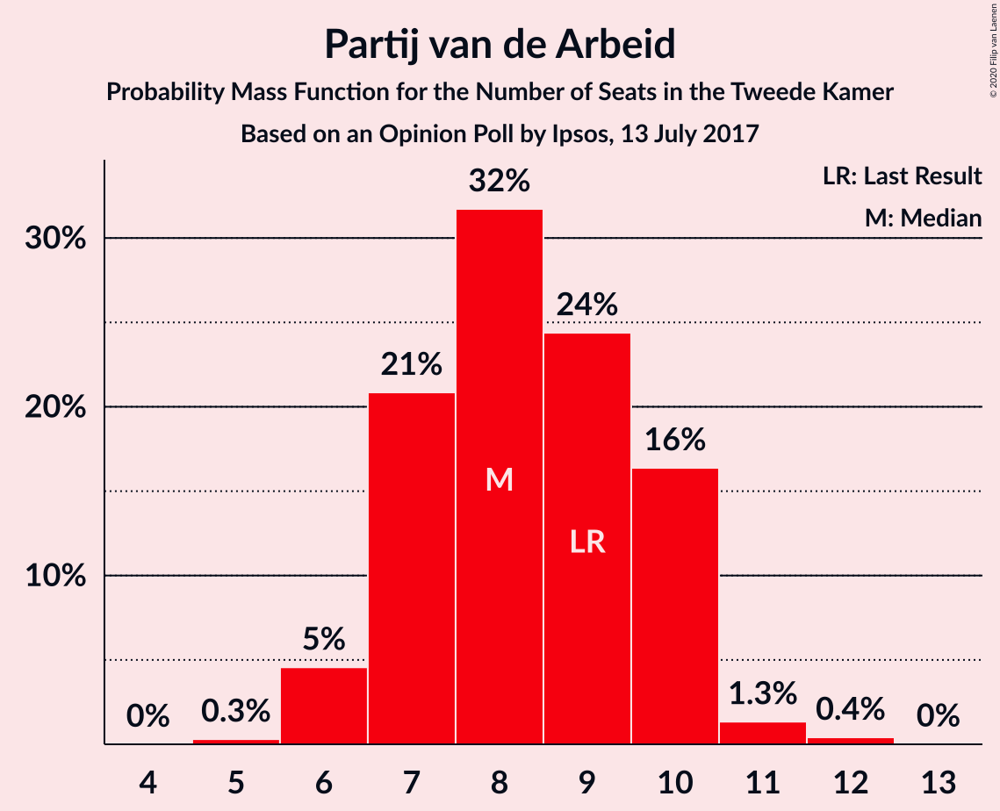
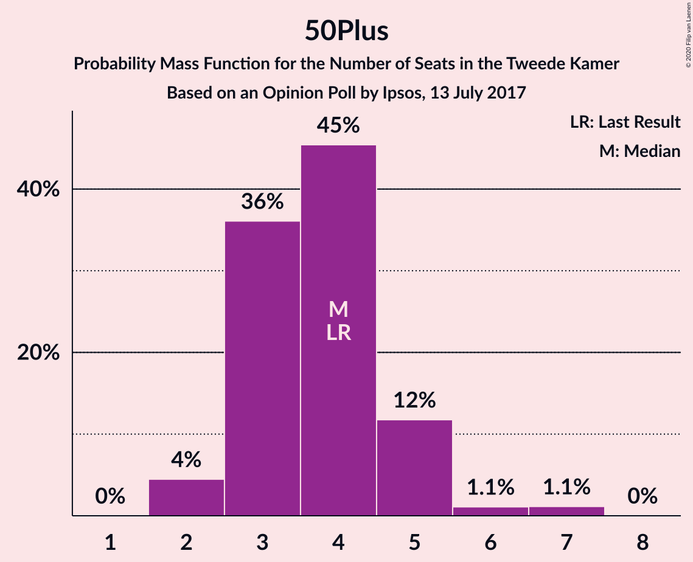
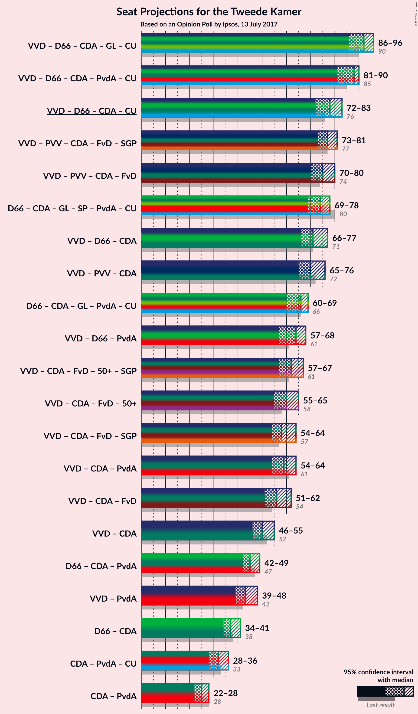
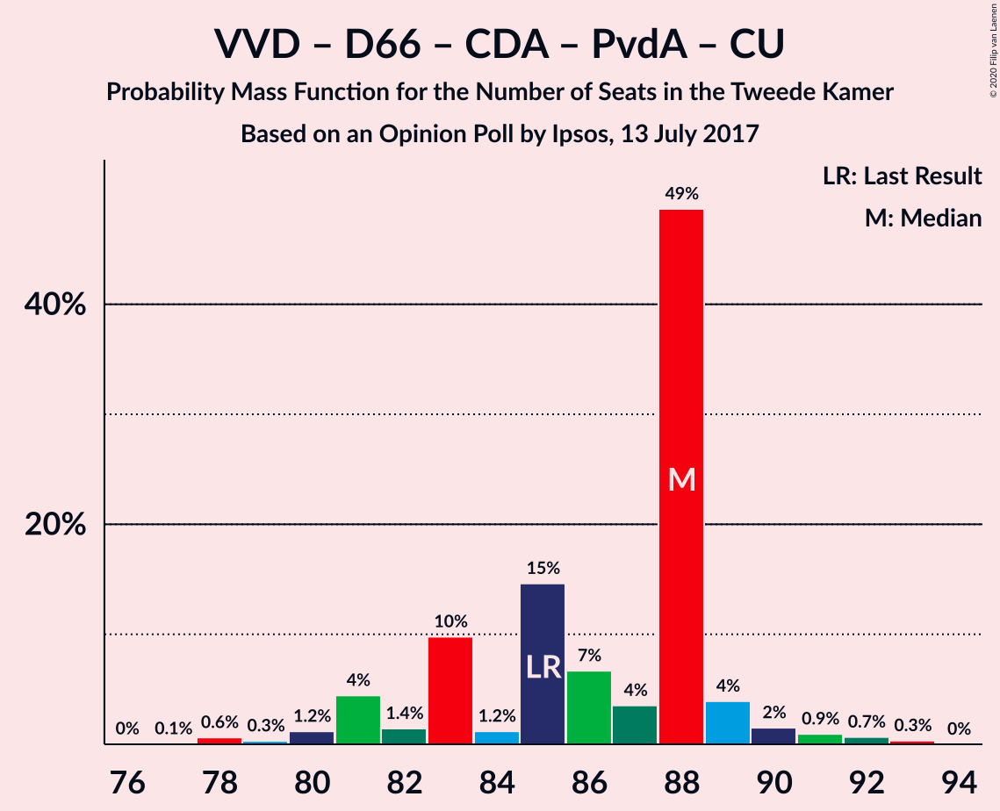
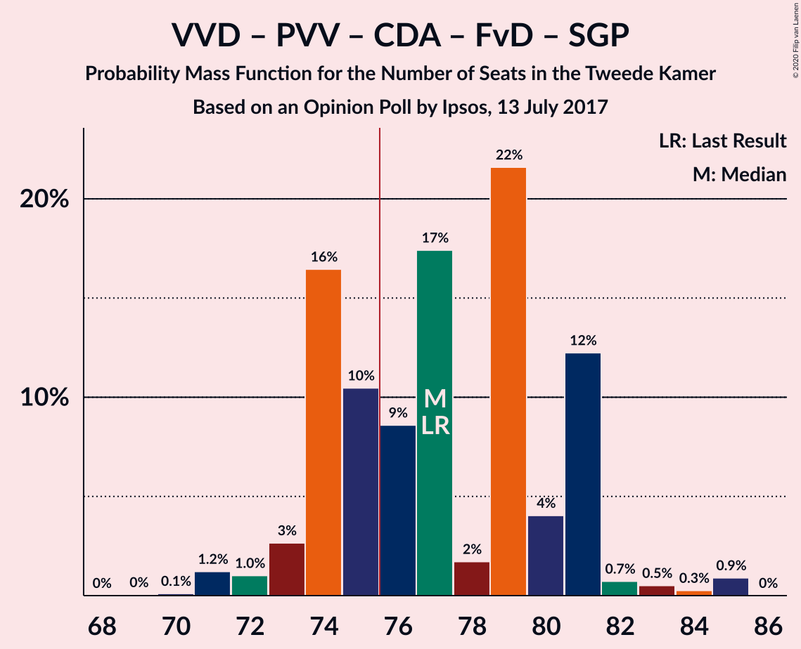
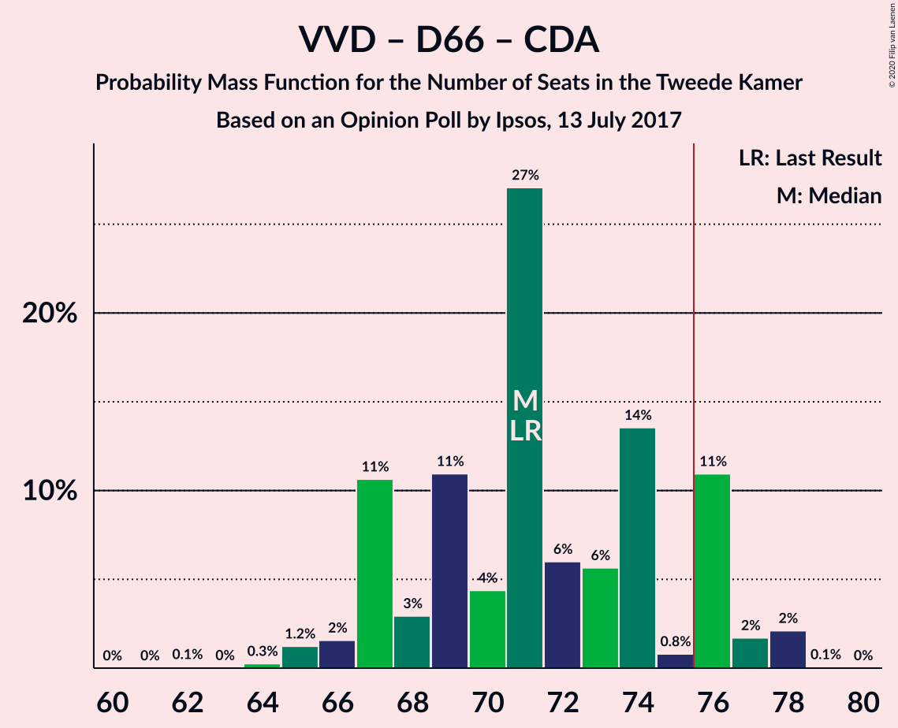
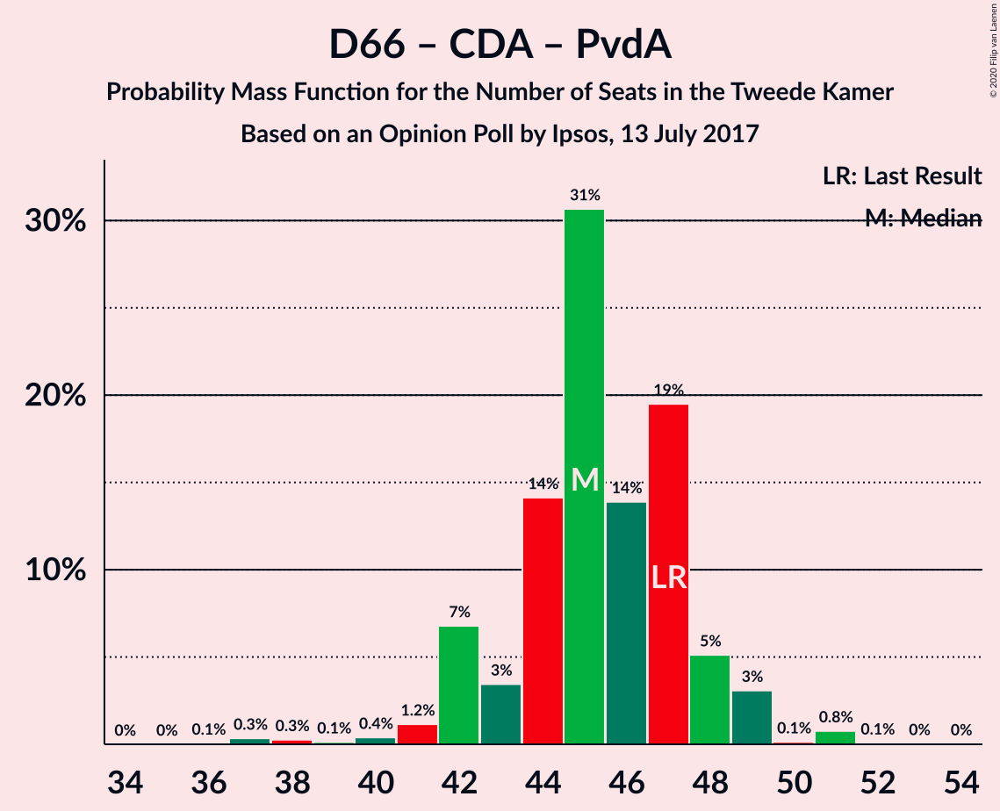

# Opinion Poll by Ipsos, 13 July 2017

<a href="#voting-intentions">Voting Intentions</a> | <a href="#seats">Seats</a> | <a href="#coalitions">Coalitions</a> | <a href="#technical-information">Technical Information</a>

## Voting Intentions

### Confidence Intervals

| Party | Last Result | Poll Result | 80% Confidence Interval | 90% Confidence Interval | 95% Confidence Interval | 99% Confidence Interval |
|:-----:|:-----------:|:-----------:|:-----------------------:|:-----------------------:|:-----------------------:|:-----------------------:|
| Volkspartij voor Vrijheid en Democratie | 21.3% | 22.7% | 21.1–24.5% |20.6–25.0% |20.2–25.4% |19.4–26.3% |
| Democraten 66 | 12.2% | 13.4% | 12.1–14.9% |11.7–15.3% |11.4–15.7% |10.8–16.4% |
| Partij voor de Vrijheid | 13.1% | 12.6% | 11.3–14.0% |11.0–14.4% |10.7–14.8% |10.1–15.5% |
| Christen-Democratisch Appèl | 12.4% | 10.6% | 9.4–11.9% |9.1–12.3% |8.8–12.7% |8.3–13.3% |
| GroenLinks | 9.1% | 9.0% | 7.9–10.3% |7.6–10.6% |7.4–10.9% |6.9–11.6% |
| Socialistische Partij | 9.1% | 5.8% | 5.0–6.9% |4.7–7.2% |4.5–7.4% |4.1–8.0% |
| Partij van de Arbeid | 5.7% | 5.5% | 4.7–6.5% |4.4–6.8% |4.3–7.1% |3.9–7.6% |
| Partij voor de Dieren | 3.2% | 4.4% | 3.7–5.3% |3.5–5.6% |3.3–5.9% |3.0–6.4% |
| ChristenUnie | 3.4% | 4.3% | 3.6–5.2% |3.4–5.5% |3.2–5.7% |2.9–6.2% |
| Forum voor Democratie | 1.8% | 3.5% | 2.9–4.4% |2.7–4.6% |2.5–4.8% |2.2–5.3% |
| DENK | 2.1% | 3.1% | 2.5–3.9% |2.3–4.2% |2.2–4.4% |1.9–4.8% |
| 50Plus | 3.1% | 2.7% | 2.1–3.5% |2.0–3.7% |1.9–3.9% |1.6–4.3% |
| Staatkundig Gereformeerde Partij | 2.1% | 1.6% | 1.2–2.2% |1.1–2.4% |1.0–2.6% |0.8–2.9% |

*Note:* The poll result column reflects the actual value used in the calculations. Published results may vary slightly, and in addition be rounded to fewer digits.

## Seats

### Confidence Intervals

| Party | Last Result | Median | 80% Confidence Interval | 90% Confidence Interval | 95% Confidence Interval | 99% Confidence Interval |
|:-----:|:-----------:|:------:|:-----------------------:|:-----------------------:|:-----------------------:|:-----------------------:|
| <a href="#volkspartij-voor-vrijheid-en-democratie">Volkspartij voor Vrijheid en Democratie</a> | 33 | 36 | 31–37 |30–37 |30–40 |30–40 |
| <a href="#democraten-66">Democraten 66</a> | 19 | 20 | 16–22 |16–22 |16–23 |16–24 |
| <a href="#partij-voor-de-vrijheid">Partij voor de Vrijheid</a> | 20 | 19 | 17–22 |17–22 |17–24 |16–24 |
| <a href="#christen-democratisch-appèl">Christen-Democratisch Appèl</a> | 19 | 16 | 14–19 |14–19 |13–19 |13–20 |
| <a href="#groenlinks">GroenLinks</a> | 14 | 13 | 11–16 |10–18 |10–18 |10–18 |
| <a href="#socialistische-partij">Socialistische Partij</a> | 14 | 9 | 7–11 |7–11 |6–11 |6–11 |
| <a href="#partij-van-de-arbeid">Partij van de Arbeid</a> | 9 | 8 | 6–9 |6–10 |6–12 |6–12 |
| <a href="#partij-voor-de-dieren">Partij voor de Dieren</a> | 5 | 7 | 5–8 |5–8 |5–9 |4–10 |
| <a href="#christenunie">ChristenUnie</a> | 5 | 6 | 4–8 |4–8 |4–8 |4–8 |
| <a href="#forum-voor-democratie">Forum voor Democratie</a> | 2 | 6 | 4–7 |4–7 |3–7 |3–7 |
| <a href="#denk">DENK</a> | 3 | 4 | 3–5 |3–5 |2–7 |2–7 |
| <a href="#50plus">50Plus</a> | 4 | 4 | 2–4 |2–5 |2–5 |2–7 |
| <a href="#staatkundig-gereformeerde-partij">Staatkundig Gereformeerde Partij</a> | 3 | 2 | 1–3 |1–3 |1–3 |1–5 |

### Volkspartij voor Vrijheid en Democratie

*For a full overview of the results for this party, see the [Volkspartij voor Vrijheid en Democratie](party-volkspartijvoorvrijheidendemocratie.html) page.*

| Number of Seats | Probability | Accumulated | Special Marks |
|:---------------:|:-----------:|:-----------:|:-------------:|
| 29 | 0.1% | 100% |  |
| 30 | 6% | 99.9% |  |
| 31 | 6% | 94% |  |
| 32 | 6% | 88% |  |
| 33 | 1.1% | 82% | Last Result |
| 34 | 5% | 81% |  |
| 35 | 21% | 75% |  |
| 36 | 23% | 55% | Median |
| 37 | 27% | 31% |  |
| 38 | 0.5% | 4% |  |
| 39 | 0.1% | 3% |  |
| 40 | 3% | 3% |  |
| 41 | 0.2% | 0.2% |  |
| 42 | 0% | 0% |  |

### Democraten 66

*For a full overview of the results for this party, see the [Democraten 66](party-democraten66.html) page.*

| Number of Seats | Probability | Accumulated | Special Marks |
|:---------------:|:-----------:|:-----------:|:-------------:|
| 15 | 0.1% | 100% |  |
| 16 | 17% | 99.9% |  |
| 17 | 0.5% | 83% |  |
| 18 | 2% | 83% |  |
| 19 | 11% | 81% | Last Result |
| 20 | 22% | 69% | Median |
| 21 | 37% | 47% |  |
| 22 | 7% | 10% |  |
| 23 | 0.6% | 3% |  |
| 24 | 2% | 2% |  |
| 25 | 0.1% | 0.2% |  |
| 26 | 0% | 0.1% |  |
| 27 | 0.1% | 0.1% |  |
| 28 | 0% | 0% |  |

### Partij voor de Vrijheid

*For a full overview of the results for this party, see the [Partij voor de Vrijheid](party-partijvoordevrijheid.html) page.*

| Number of Seats | Probability | Accumulated | Special Marks |
|:---------------:|:-----------:|:-----------:|:-------------:|
| 15 | 0.3% | 100% |  |
| 16 | 0.9% | 99.7% |  |
| 17 | 23% | 98.8% |  |
| 18 | 1.4% | 76% |  |
| 19 | 35% | 75% | Median |
| 20 | 20% | 40% | Last Result |
| 21 | 0.2% | 21% |  |
| 22 | 17% | 20% |  |
| 23 | 0.1% | 3% |  |
| 24 | 3% | 3% |  |
| 25 | 0% | 0% |  |

### Christen-Democratisch Appèl

*For a full overview of the results for this party, see the [Christen-Democratisch Appèl](party-christen-democratischappèl.html) page.*

| Number of Seats | Probability | Accumulated | Special Marks |
|:---------------:|:-----------:|:-----------:|:-------------:|
| 12 | 0.3% | 100% |  |
| 13 | 3% | 99.6% |  |
| 14 | 10% | 96% |  |
| 15 | 9% | 86% |  |
| 16 | 41% | 77% | Median |
| 17 | 3% | 36% |  |
| 18 | 17% | 33% |  |
| 19 | 15% | 16% | Last Result |
| 20 | 0.4% | 0.6% |  |
| 21 | 0.2% | 0.2% |  |
| 22 | 0% | 0% |  |

### GroenLinks

*For a full overview of the results for this party, see the [GroenLinks](party-groenlinks.html) page.*

| Number of Seats | Probability | Accumulated | Special Marks |
|:---------------:|:-----------:|:-----------:|:-------------:|
| 10 | 5% | 100% |  |
| 11 | 33% | 95% |  |
| 12 | 8% | 62% |  |
| 13 | 11% | 54% | Median |
| 14 | 26% | 43% | Last Result |
| 15 | 6% | 17% |  |
| 16 | 3% | 11% |  |
| 17 | 0% | 8% |  |
| 18 | 8% | 8% |  |
| 19 | 0% | 0% |  |

### Socialistische Partij

*For a full overview of the results for this party, see the [Socialistische Partij](party-socialistischepartij.html) page.*

| Number of Seats | Probability | Accumulated | Special Marks |
|:---------------:|:-----------:|:-----------:|:-------------:|
| 6 | 4% | 100% |  |
| 7 | 13% | 96% |  |
| 8 | 1.3% | 83% |  |
| 9 | 42% | 82% | Median |
| 10 | 7% | 40% |  |
| 11 | 33% | 33% |  |
| 12 | 0.3% | 0.4% |  |
| 13 | 0.1% | 0.1% |  |
| 14 | 0% | 0% | Last Result |

### Partij van de Arbeid

*For a full overview of the results for this party, see the [Partij van de Arbeid](party-partijvandearbeid.html) page.*

| Number of Seats | Probability | Accumulated | Special Marks |
|:---------------:|:-----------:|:-----------:|:-------------:|
| 5 | 0.4% | 100% |  |
| 6 | 16% | 99.6% |  |
| 7 | 7% | 83% |  |
| 8 | 57% | 76% | Median |
| 9 | 12% | 20% | Last Result |
| 10 | 4% | 7% |  |
| 11 | 0.2% | 4% |  |
| 12 | 3% | 3% |  |
| 13 | 0% | 0% |  |

### Partij voor de Dieren

*For a full overview of the results for this party, see the [Partij voor de Dieren](party-partijvoordedieren.html) page.*

| Number of Seats | Probability | Accumulated | Special Marks |
|:---------------:|:-----------:|:-----------:|:-------------:|
| 4 | 0.6% | 100% |  |
| 5 | 10% | 99.4% | Last Result |
| 6 | 27% | 89% |  |
| 7 | 47% | 63% | Median |
| 8 | 11% | 16% |  |
| 9 | 3% | 4% |  |
| 10 | 1.1% | 1.1% |  |
| 11 | 0% | 0% |  |

### ChristenUnie

*For a full overview of the results for this party, see the [ChristenUnie](party-christenunie.html) page.*

| Number of Seats | Probability | Accumulated | Special Marks |
|:---------------:|:-----------:|:-----------:|:-------------:|
| 3 | 0.1% | 100% |  |
| 4 | 30% | 99.9% |  |
| 5 | 2% | 70% | Last Result |
| 6 | 21% | 67% | Median |
| 7 | 13% | 46% |  |
| 8 | 33% | 34% |  |
| 9 | 0.2% | 0.3% |  |
| 10 | 0.2% | 0.2% |  |
| 11 | 0% | 0% |  |

### Forum voor Democratie

*For a full overview of the results for this party, see the [Forum voor Democratie](party-forumvoordemocratie.html) page.*

| Number of Seats | Probability | Accumulated | Special Marks |
|:---------------:|:-----------:|:-----------:|:-------------:|
| 2 | 0.1% | 100% | Last Result |
| 3 | 5% | 99.9% |  |
| 4 | 16% | 95% |  |
| 5 | 25% | 79% |  |
| 6 | 37% | 55% | Median |
| 7 | 17% | 18% |  |
| 8 | 0.1% | 0.1% |  |
| 9 | 0% | 0% |  |

### DENK

*For a full overview of the results for this party, see the [DENK](party-denk.html) page.*

| Number of Seats | Probability | Accumulated | Special Marks |
|:---------------:|:-----------:|:-----------:|:-------------:|
| 2 | 3% | 100% |  |
| 3 | 21% | 97% | Last Result |
| 4 | 55% | 76% | Median |
| 5 | 17% | 20% |  |
| 6 | 0.2% | 3% |  |
| 7 | 3% | 3% |  |
| 8 | 0.1% | 0.1% |  |
| 9 | 0% | 0% |  |

### 50Plus

*For a full overview of the results for this party, see the [50Plus](party-50plus.html) page.*

| Number of Seats | Probability | Accumulated | Special Marks |
|:---------------:|:-----------:|:-----------:|:-------------:|
| 2 | 17% | 100% |  |
| 3 | 24% | 83% |  |
| 4 | 51% | 59% | Last Result, Median |
| 5 | 6% | 8% |  |
| 6 | 0.6% | 1.2% |  |
| 7 | 0.6% | 0.6% |  |
| 8 | 0% | 0% |  |

### Staatkundig Gereformeerde Partij

*For a full overview of the results for this party, see the [Staatkundig Gereformeerde Partij](party-staatkundiggereformeerdepartij.html) page.*

| Number of Seats | Probability | Accumulated | Special Marks |
|:---------------:|:-----------:|:-----------:|:-------------:|
| 0 | 0.1% | 100% |  |
| 1 | 40% | 99.9% |  |
| 2 | 14% | 60% | Median |
| 3 | 43% | 46% | Last Result |
| 4 | 1.4% | 2% |  |
| 5 | 1.0% | 1.0% |  |
| 6 | 0% | 0% |  |

## Coalitions

### Confidence Intervals

| Coalition | Last Result | Median | Majority? | 80% Confidence Interval | 90% Confidence Interval | 95% Confidence Interval | 99% Confidence Interval |
|:---------:|:-----------:|:------:|:---------:|:-----------------------:|:-----------------------:|:-----------------------:|:-----------------------:|
| Volkspartij voor Vrijheid en Democratie – Democraten 66 – Christen-Democratisch Appèl – GroenLinks – ChristenUnie | 90 | 91 | 100% | 87–95 | 87–95 | 84–95 | 84–95 |
| Volkspartij voor Vrijheid en Democratie – Democraten 66 – Christen-Democratisch Appèl – Partij van de Arbeid – ChristenUnie | 85 | 86 | 100% | 81–88 | 80–91 | 80–93 | 79–93 |
| Volkspartij voor Vrijheid en Democratie – Partij voor de Vrijheid – Christen-Democratisch Appèl – Forum voor Democratie – Staatkundig Gereformeerde Partij | 77 | 79 | 85% | 75–81 | 73–82 | 73–82 | 71–82 |
| Volkspartij voor Vrijheid en Democratie – Democraten 66 – Christen-Democratisch Appèl – ChristenUnie | 76 | 78 | 86% | 73–81 | 72–81 | 72–82 | 72–83 |
| Volkspartij voor Vrijheid en Democratie – Partij voor de Vrijheid – Christen-Democratisch Appèl – Forum voor Democratie | 74 | 78 | 71% | 73–78 | 72–80 | 72–80 | 70–80 |
| Democraten 66 – Christen-Democratisch Appèl – GroenLinks – Socialistische Partij – Partij van de Arbeid – ChristenUnie | 80 | 73 | 13% | 71–76 | 70–76 | 69–80 | 67–80 |
| Volkspartij voor Vrijheid en Democratie – Partij voor de Vrijheid – Christen-Democratisch Appèl | 72 | 71 | 5% | 67–73 | 66–76 | 66–76 | 63–76 |
| Volkspartij voor Vrijheid en Democratie – Democraten 66 – Christen-Democratisch Appèl | 71 | 71 | 4% | 67–74 | 65–74 | 64–76 | 64–77 |
| Democraten 66 – Christen-Democratisch Appèl – GroenLinks – Partij van de Arbeid – ChristenUnie | 66 | 63 | 0% | 60–67 | 60–69 | 60–71 | 58–71 |
| Volkspartij voor Vrijheid en Democratie – Democraten 66 – Partij van de Arbeid | 61 | 62 | 0% | 60–66 | 59–67 | 59–71 | 57–71 |
| Volkspartij voor Vrijheid en Democratie – Christen-Democratisch Appèl – Forum voor Democratie – 50Plus – Staatkundig Gereformeerde Partij | 61 | 64 | 0% | 57–67 | 55–67 | 55–67 | 55–67 |
| Volkspartij voor Vrijheid en Democratie – Christen-Democratisch Appèl – Partij van de Arbeid | 61 | 61 | 0% | 55–62 | 52–63 | 52–66 | 52–66 |
| Volkspartij voor Vrijheid en Democratie – Christen-Democratisch Appèl – Forum voor Democratie – 50Plus | 58 | 62 | 0% | 55–64 | 54–64 | 53–64 | 53–64 |
| Volkspartij voor Vrijheid en Democratie – Christen-Democratisch Appèl – Forum voor Democratie – Staatkundig Gereformeerde Partij | 57 | 60 | 0% | 55–64 | 51–64 | 51–64 | 51–64 |
| Volkspartij voor Vrijheid en Democratie – Christen-Democratisch Appèl – Forum voor Democratie | 54 | 59 | 0% | 52–61 | 50–61 | 49–61 | 49–61 |
| Volkspartij voor Vrijheid en Democratie – Christen-Democratisch Appèl | 52 | 53 | 0% | 47–54 | 44–54 | 44–54 | 44–55 |
| Democraten 66 – Christen-Democratisch Appèl – Partij van de Arbeid | 47 | 45 | 0% | 42–47 | 41–48 | 41–51 | 38–51 |
| Volkspartij voor Vrijheid en Democratie – Partij van de Arbeid | 42 | 44 | 0% | 40–45 | 38–47 | 38–49 | 38–49 |
| Democraten 66 – Christen-Democratisch Appèl | 38 | 37 | 0% | 34–39 | 34–39 | 33–39 | 32–41 |
| Christen-Democratisch Appèl – Partij van de Arbeid – ChristenUnie | 33 | 30 | 0% | 28–34 | 28–34 | 27–38 | 26–38 |
| Christen-Democratisch Appèl – Partij van de Arbeid | 28 | 24 | 0% | 22–27 | 22–27 | 21–31 | 20–31 |

### Volkspartij voor Vrijheid en Democratie – Democraten 66 – Christen-Democratisch Appèl – GroenLinks – ChristenUnie

| Number of Seats | Probability | Accumulated | Special Marks |
|:---------------:|:-----------:|:-----------:|:-------------:|
| 84 | 3% | 100% |  |
| 85 | 0.4% | 97% |  |
| 86 | 1.5% | 97% |  |
| 87 | 12% | 96% |  |
| 88 | 1.1% | 83% |  |
| 89 | 30% | 82% |  |
| 90 | 1.4% | 53% | Last Result |
| 91 | 3% | 51% | Median |
| 92 | 29% | 48% |  |
| 93 | 3% | 19% |  |
| 94 | 4% | 16% |  |
| 95 | 12% | 12% |  |
| 96 | 0.1% | 0.3% |  |
| 97 | 0% | 0.3% |  |
| 98 | 0.2% | 0.3% |  |
| 99 | 0.1% | 0.1% |  |
| 100 | 0% | 0% |  |

### Volkspartij voor Vrijheid en Democratie – Democraten 66 – Christen-Democratisch Appèl – Partij van de Arbeid – ChristenUnie

| Number of Seats | Probability | Accumulated | Special Marks |
|:---------------:|:-----------:|:-----------:|:-------------:|
| 78 | 0.3% | 100% |  |
| 79 | 2% | 99.6% |  |
| 80 | 6% | 98% |  |
| 81 | 3% | 92% |  |
| 82 | 1.2% | 90% |  |
| 83 | 9% | 88% |  |
| 84 | 3% | 79% |  |
| 85 | 12% | 76% | Last Result |
| 86 | 48% | 64% | Median |
| 87 | 6% | 16% |  |
| 88 | 0.4% | 10% |  |
| 89 | 0% | 10% |  |
| 90 | 2% | 10% |  |
| 91 | 3% | 7% |  |
| 92 | 0.9% | 4% |  |
| 93 | 3% | 3% |  |
| 94 | 0% | 0% |  |

### Volkspartij voor Vrijheid en Democratie – Partij voor de Vrijheid – Christen-Democratisch Appèl – Forum voor Democratie – Staatkundig Gereformeerde Partij

| Number of Seats | Probability | Accumulated | Special Marks |
|:---------------:|:-----------:|:-----------:|:-------------:|
| 69 | 0.1% | 100% |  |
| 70 | 0.1% | 99.9% |  |
| 71 | 0.4% | 99.8% |  |
| 72 | 0.1% | 99.4% |  |
| 73 | 6% | 99.2% |  |
| 74 | 0.9% | 93% |  |
| 75 | 8% | 92% |  |
| 76 | 5% | 85% | Majority |
| 77 | 4% | 80% | Last Result |
| 78 | 8% | 76% |  |
| 79 | 36% | 68% | Median |
| 80 | 9% | 32% |  |
| 81 | 17% | 22% |  |
| 82 | 5% | 5% |  |
| 83 | 0% | 0.1% |  |
| 84 | 0.1% | 0.1% |  |
| 85 | 0% | 0% |  |

### Volkspartij voor Vrijheid en Democratie – Democraten 66 – Christen-Democratisch Appèl – ChristenUnie

| Number of Seats | Probability | Accumulated | Special Marks |
|:---------------:|:-----------:|:-----------:|:-------------:|
| 69 | 0% | 100% |  |
| 70 | 0.3% | 99.9% |  |
| 71 | 0.1% | 99.6% |  |
| 72 | 9% | 99.5% |  |
| 73 | 2% | 91% |  |
| 74 | 0.7% | 89% |  |
| 75 | 3% | 88% |  |
| 76 | 5% | 86% | Last Result, Majority |
| 77 | 14% | 81% |  |
| 78 | 49% | 67% | Median |
| 79 | 0.9% | 18% |  |
| 80 | 2% | 17% |  |
| 81 | 11% | 15% |  |
| 82 | 3% | 4% |  |
| 83 | 0.8% | 1.0% |  |
| 84 | 0.1% | 0.2% |  |
| 85 | 0.1% | 0.2% |  |
| 86 | 0% | 0.1% |  |
| 87 | 0.1% | 0.1% |  |
| 88 | 0% | 0% |  |

### Volkspartij voor Vrijheid en Democratie – Partij voor de Vrijheid – Christen-Democratisch Appèl – Forum voor Democratie

| Number of Seats | Probability | Accumulated | Special Marks |
|:---------------:|:-----------:|:-----------:|:-------------:|
| 66 | 0.1% | 100% |  |
| 67 | 0.1% | 99.9% |  |
| 68 | 0.1% | 99.8% |  |
| 69 | 0.2% | 99.8% |  |
| 70 | 0.8% | 99.6% |  |
| 71 | 0.1% | 98.8% |  |
| 72 | 7% | 98.6% |  |
| 73 | 10% | 91% |  |
| 74 | 2% | 81% | Last Result |
| 75 | 8% | 78% |  |
| 76 | 12% | 71% | Majority |
| 77 | 7% | 59% | Median |
| 78 | 43% | 52% |  |
| 79 | 3% | 9% |  |
| 80 | 5% | 5% |  |
| 81 | 0% | 0.1% |  |
| 82 | 0.1% | 0.1% |  |
| 83 | 0% | 0% |  |

### Democraten 66 – Christen-Democratisch Appèl – GroenLinks – Socialistische Partij – Partij van de Arbeid – ChristenUnie

| Number of Seats | Probability | Accumulated | Special Marks |
|:---------------:|:-----------:|:-----------:|:-------------:|
| 65 | 0.1% | 100% |  |
| 66 | 0.2% | 99.9% |  |
| 67 | 1.2% | 99.8% |  |
| 68 | 0.1% | 98.6% |  |
| 69 | 2% | 98% |  |
| 70 | 6% | 97% |  |
| 71 | 33% | 90% |  |
| 72 | 6% | 58% | Median |
| 73 | 27% | 52% |  |
| 74 | 4% | 25% |  |
| 75 | 8% | 21% |  |
| 76 | 9% | 13% | Majority |
| 77 | 0.2% | 4% |  |
| 78 | 0.2% | 4% |  |
| 79 | 0.1% | 4% |  |
| 80 | 3% | 3% | Last Result |
| 81 | 0% | 0% |  |

### Volkspartij voor Vrijheid en Democratie – Partij voor de Vrijheid – Christen-Democratisch Appèl

| Number of Seats | Probability | Accumulated | Special Marks |
|:---------------:|:-----------:|:-----------:|:-------------:|
| 60 | 0.1% | 100% |  |
| 61 | 0% | 99.9% |  |
| 62 | 0% | 99.9% |  |
| 63 | 0.4% | 99.9% |  |
| 64 | 0.1% | 99.5% |  |
| 65 | 0.3% | 99.4% |  |
| 66 | 6% | 99.0% |  |
| 67 | 5% | 93% |  |
| 68 | 3% | 89% |  |
| 69 | 2% | 85% |  |
| 70 | 10% | 83% |  |
| 71 | 30% | 72% | Median |
| 72 | 27% | 42% | Last Result |
| 73 | 7% | 15% |  |
| 74 | 3% | 8% |  |
| 75 | 0.2% | 5% |  |
| 76 | 5% | 5% | Majority |
| 77 | 0.1% | 0.1% |  |
| 78 | 0% | 0% |  |

### Volkspartij voor Vrijheid en Democratie – Democraten 66 – Christen-Democratisch Appèl

| Number of Seats | Probability | Accumulated | Special Marks |
|:---------------:|:-----------:|:-----------:|:-------------:|
| 63 | 0% | 100% |  |
| 64 | 3% | 99.9% |  |
| 65 | 6% | 97% |  |
| 66 | 0.2% | 91% |  |
| 67 | 1.1% | 91% |  |
| 68 | 4% | 90% |  |
| 69 | 0.3% | 86% |  |
| 70 | 24% | 85% |  |
| 71 | 13% | 61% | Last Result |
| 72 | 4% | 48% | Median |
| 73 | 7% | 43% |  |
| 74 | 31% | 36% |  |
| 75 | 0.7% | 5% |  |
| 76 | 3% | 4% | Majority |
| 77 | 0.4% | 0.5% |  |
| 78 | 0.1% | 0.1% |  |
| 79 | 0% | 0% |  |

### Democraten 66 – Christen-Democratisch Appèl – GroenLinks – Partij van de Arbeid – ChristenUnie

| Number of Seats | Probability | Accumulated | Special Marks |
|:---------------:|:-----------:|:-----------:|:-------------:|
| 58 | 2% | 100% |  |
| 59 | 0.3% | 98% |  |
| 60 | 27% | 98% |  |
| 61 | 0.2% | 71% |  |
| 62 | 4% | 71% |  |
| 63 | 19% | 67% | Median |
| 64 | 20% | 49% |  |
| 65 | 10% | 28% |  |
| 66 | 8% | 19% | Last Result |
| 67 | 4% | 10% |  |
| 68 | 0.1% | 6% |  |
| 69 | 2% | 6% |  |
| 70 | 0.1% | 4% |  |
| 71 | 3% | 4% |  |
| 72 | 0% | 0% |  |

### Volkspartij voor Vrijheid en Democratie – Democraten 66 – Partij van de Arbeid

| Number of Seats | Probability | Accumulated | Special Marks |
|:---------------:|:-----------:|:-----------:|:-------------:|
| 56 | 0.1% | 100% |  |
| 57 | 0.4% | 99.9% |  |
| 58 | 0.8% | 99.4% |  |
| 59 | 8% | 98.7% |  |
| 60 | 30% | 90% |  |
| 61 | 10% | 61% | Last Result |
| 62 | 7% | 50% |  |
| 63 | 0.6% | 43% |  |
| 64 | 0.4% | 42% | Median |
| 65 | 4% | 42% |  |
| 66 | 30% | 38% |  |
| 67 | 4% | 8% |  |
| 68 | 1.3% | 4% |  |
| 69 | 0.1% | 3% |  |
| 70 | 0% | 3% |  |
| 71 | 3% | 3% |  |
| 72 | 0% | 0% |  |

### Volkspartij voor Vrijheid en Democratie – Christen-Democratisch Appèl – Forum voor Democratie – 50Plus – Staatkundig Gereformeerde Partij

| Number of Seats | Probability | Accumulated | Special Marks |
|:---------------:|:-----------:|:-----------:|:-------------:|
| 52 | 0.1% | 100% |  |
| 53 | 0% | 99.9% |  |
| 54 | 0% | 99.9% |  |
| 55 | 8% | 99.9% |  |
| 56 | 0.5% | 92% |  |
| 57 | 2% | 91% |  |
| 58 | 0.2% | 89% |  |
| 59 | 2% | 89% |  |
| 60 | 7% | 87% |  |
| 61 | 12% | 80% | Last Result |
| 62 | 4% | 67% |  |
| 63 | 10% | 64% |  |
| 64 | 35% | 54% | Median |
| 65 | 0.9% | 19% |  |
| 66 | 0.5% | 18% |  |
| 67 | 17% | 17% |  |
| 68 | 0.2% | 0.4% |  |
| 69 | 0.1% | 0.1% |  |
| 70 | 0% | 0% |  |

### Volkspartij voor Vrijheid en Democratie – Christen-Democratisch Appèl – Partij van de Arbeid

| Number of Seats | Probability | Accumulated | Special Marks |
|:---------------:|:-----------:|:-----------:|:-------------:|
| 51 | 0.1% | 100% |  |
| 52 | 6% | 99.9% |  |
| 53 | 3% | 94% |  |
| 54 | 0.7% | 91% |  |
| 55 | 2% | 91% |  |
| 56 | 4% | 89% |  |
| 57 | 9% | 85% |  |
| 58 | 8% | 76% |  |
| 59 | 6% | 68% |  |
| 60 | 9% | 62% | Median |
| 61 | 29% | 53% | Last Result |
| 62 | 17% | 25% |  |
| 63 | 3% | 7% |  |
| 64 | 0.1% | 4% |  |
| 65 | 0.3% | 4% |  |
| 66 | 3% | 3% |  |
| 67 | 0% | 0% |  |

### Volkspartij voor Vrijheid en Democratie – Christen-Democratisch Appèl – Forum voor Democratie – 50Plus

| Number of Seats | Probability | Accumulated | Special Marks |
|:---------------:|:-----------:|:-----------:|:-------------:|
| 50 | 0.1% | 100% |  |
| 51 | 0% | 99.9% |  |
| 52 | 0% | 99.9% |  |
| 53 | 3% | 99.9% |  |
| 54 | 6% | 97% |  |
| 55 | 3% | 92% |  |
| 56 | 0.9% | 88% |  |
| 57 | 6% | 87% |  |
| 58 | 13% | 81% | Last Result |
| 59 | 4% | 68% |  |
| 60 | 7% | 64% |  |
| 61 | 0.4% | 57% |  |
| 62 | 9% | 56% | Median |
| 63 | 30% | 48% |  |
| 64 | 17% | 18% |  |
| 65 | 0.1% | 0.4% |  |
| 66 | 0.2% | 0.3% |  |
| 67 | 0.1% | 0.1% |  |
| 68 | 0% | 0% |  |

### Volkspartij voor Vrijheid en Democratie – Christen-Democratisch Appèl – Forum voor Democratie – Staatkundig Gereformeerde Partij

| Number of Seats | Probability | Accumulated | Special Marks |
|:---------------:|:-----------:|:-----------:|:-------------:|
| 49 | 0.1% | 100% |  |
| 50 | 0% | 99.9% |  |
| 51 | 8% | 99.9% |  |
| 52 | 0.4% | 92% |  |
| 53 | 0.5% | 91% |  |
| 54 | 0.5% | 91% |  |
| 55 | 4% | 90% |  |
| 56 | 4% | 87% |  |
| 57 | 0.3% | 83% | Last Result |
| 58 | 9% | 82% |  |
| 59 | 17% | 73% |  |
| 60 | 38% | 56% | Median |
| 61 | 0.4% | 18% |  |
| 62 | 0.5% | 18% |  |
| 63 | 0.1% | 17% |  |
| 64 | 17% | 17% |  |
| 65 | 0% | 0.1% |  |
| 66 | 0.1% | 0.1% |  |
| 67 | 0% | 0% |  |

### Volkspartij voor Vrijheid en Democratie – Christen-Democratisch Appèl – Forum voor Democratie

| Number of Seats | Probability | Accumulated | Special Marks |
|:---------------:|:-----------:|:-----------:|:-------------:|
| 47 | 0.1% | 100% |  |
| 48 | 0% | 99.9% |  |
| 49 | 3% | 99.9% |  |
| 50 | 6% | 97% |  |
| 51 | 1.3% | 92% |  |
| 52 | 1.0% | 90% |  |
| 53 | 6% | 89% |  |
| 54 | 2% | 84% | Last Result |
| 55 | 7% | 81% |  |
| 56 | 18% | 74% |  |
| 57 | 0.3% | 56% |  |
| 58 | 5% | 56% | Median |
| 59 | 33% | 51% |  |
| 60 | 0.4% | 18% |  |
| 61 | 17% | 17% |  |
| 62 | 0.3% | 0.3% |  |
| 63 | 0% | 0.1% |  |
| 64 | 0% | 0.1% |  |
| 65 | 0% | 0% |  |

### Volkspartij voor Vrijheid en Democratie – Christen-Democratisch Appèl

| Number of Seats | Probability | Accumulated | Special Marks |
|:---------------:|:-----------:|:-----------:|:-------------:|
| 44 | 8% | 100% |  |
| 45 | 0.7% | 92% |  |
| 46 | 0.2% | 91% |  |
| 47 | 3% | 91% |  |
| 48 | 1.1% | 88% |  |
| 49 | 1.2% | 87% |  |
| 50 | 7% | 86% |  |
| 51 | 20% | 79% |  |
| 52 | 2% | 59% | Last Result, Median |
| 53 | 28% | 57% |  |
| 54 | 28% | 29% |  |
| 55 | 0.2% | 0.7% |  |
| 56 | 0.5% | 0.5% |  |
| 57 | 0% | 0% |  |

### Democraten 66 – Christen-Democratisch Appèl – Partij van de Arbeid

| Number of Seats | Probability | Accumulated | Special Marks |
|:---------------:|:-----------:|:-----------:|:-------------:|
| 37 | 0.3% | 100% |  |
| 38 | 1.0% | 99.6% |  |
| 39 | 0.2% | 98.6% |  |
| 40 | 0.2% | 98% |  |
| 41 | 7% | 98% |  |
| 42 | 28% | 92% |  |
| 43 | 6% | 64% |  |
| 44 | 7% | 58% | Median |
| 45 | 31% | 51% |  |
| 46 | 2% | 19% |  |
| 47 | 9% | 17% | Last Result |
| 48 | 4% | 8% |  |
| 49 | 0.2% | 4% |  |
| 50 | 0.1% | 4% |  |
| 51 | 4% | 4% |  |
| 52 | 0% | 0.1% |  |
| 53 | 0% | 0% |  |

### Volkspartij voor Vrijheid en Democratie – Partij van de Arbeid

| Number of Seats | Probability | Accumulated | Special Marks |
|:---------------:|:-----------:|:-----------:|:-------------:|
| 36 | 0.1% | 100% |  |
| 37 | 0.1% | 99.9% |  |
| 38 | 6% | 99.8% |  |
| 39 | 2% | 94% |  |
| 40 | 10% | 92% |  |
| 41 | 16% | 81% |  |
| 42 | 2% | 65% | Last Result |
| 43 | 6% | 64% |  |
| 44 | 23% | 57% | Median |
| 45 | 26% | 34% |  |
| 46 | 0.9% | 8% |  |
| 47 | 4% | 7% |  |
| 48 | 0.2% | 3% |  |
| 49 | 3% | 3% |  |
| 50 | 0% | 0.1% |  |
| 51 | 0% | 0% |  |

### Democraten 66 – Christen-Democratisch Appèl

| Number of Seats | Probability | Accumulated | Special Marks |
|:---------------:|:-----------:|:-----------:|:-------------:|
| 29 | 0.1% | 100% |  |
| 30 | 0% | 99.9% |  |
| 31 | 0.3% | 99.9% |  |
| 32 | 1.3% | 99.5% |  |
| 33 | 3% | 98% |  |
| 34 | 23% | 95% |  |
| 35 | 7% | 72% |  |
| 36 | 13% | 65% | Median |
| 37 | 29% | 53% |  |
| 38 | 12% | 24% | Last Result |
| 39 | 12% | 12% |  |
| 40 | 0.1% | 0.7% |  |
| 41 | 0.2% | 0.5% |  |
| 42 | 0.1% | 0.4% |  |
| 43 | 0.1% | 0.3% |  |
| 44 | 0.3% | 0.3% |  |
| 45 | 0% | 0% |  |

### Christen-Democratisch Appèl – Partij van de Arbeid – ChristenUnie

| Number of Seats | Probability | Accumulated | Special Marks |
|:---------------:|:-----------:|:-----------:|:-------------:|
| 24 | 0.2% | 100% |  |
| 25 | 0.1% | 99.8% |  |
| 26 | 1.4% | 99.7% |  |
| 27 | 2% | 98% |  |
| 28 | 35% | 97% |  |
| 29 | 10% | 62% |  |
| 30 | 13% | 51% | Median |
| 31 | 1.2% | 39% |  |
| 32 | 2% | 37% |  |
| 33 | 12% | 35% | Last Result |
| 34 | 19% | 23% |  |
| 35 | 0.3% | 4% |  |
| 36 | 0.1% | 3% |  |
| 37 | 0.1% | 3% |  |
| 38 | 3% | 3% |  |
| 39 | 0% | 0% |  |

### Christen-Democratisch Appèl – Partij van de Arbeid

| Number of Seats | Probability | Accumulated | Special Marks |
|:---------------:|:-----------:|:-----------:|:-------------:|
| 19 | 0.5% | 100% |  |
| 20 | 1.3% | 99.5% |  |
| 21 | 2% | 98% |  |
| 22 | 23% | 96% |  |
| 23 | 4% | 74% |  |
| 24 | 28% | 70% | Median |
| 25 | 8% | 41% |  |
| 26 | 22% | 33% |  |
| 27 | 7% | 11% |  |
| 28 | 0.1% | 4% | Last Result |
| 29 | 0.1% | 4% |  |
| 30 | 0.1% | 4% |  |
| 31 | 3% | 3% |  |
| 32 | 0% | 0% |  |

## Technical Information

### Opinion Poll

+ **Polling firm:** Ipsos
+ **Commissioner(s):** —
+ **Fieldwork period:** 13 July 2017

### Calculations

+ **Sample size:** 1000
+ **Simulations done:** 131,072
+ **Error estimate:** 2.70%

