# Opinion Poll by Peil.nl, 16 July 2017

<a href="#voting-intentions">Voting Intentions</a> | <a href="#seats">Seats</a> | <a href="#coalitions">Coalitions</a> | <a href="#technical-information">Technical Information</a>

## Voting Intentions

### Confidence Intervals

| Party | Last Result | Poll Result | 80% Confidence Interval | 90% Confidence Interval | 95% Confidence Interval | 99% Confidence Interval |
|:-----:|:-----------:|:-----------:|:-----------------------:|:-----------------------:|:-----------------------:|:-----------------------:|
| Volkspartij voor Vrijheid en Democratie | 21.3% | 22.0% | 21.0–23.0% |20.8–23.3% |20.5–23.5% |20.1–24.0% |
| Partij voor de Vrijheid | 13.1% | 14.0% | 13.2–14.8% |13.0–15.1% |12.8–15.3% |12.4–15.7% |
| Democraten 66 | 12.2% | 13.3% | 12.6–14.2% |12.3–14.4% |12.2–14.6% |11.8–15.0% |
| Christen-Democratisch Appèl | 12.4% | 10.7% | 10.0–11.4% |9.8–11.6% |9.6–11.8% |9.3–12.2% |
| GroenLinks | 9.1% | 8.7% | 8.0–9.4% |7.8–9.6% |7.7–9.7% |7.4–10.1% |
| Socialistische Partij | 9.1% | 7.3% | 6.8–8.0% |6.6–8.2% |6.4–8.3% |6.2–8.6% |
| Partij van de Arbeid | 5.7% | 7.3% | 6.8–8.0% |6.6–8.2% |6.4–8.3% |6.2–8.6% |
| Forum voor Democratie | 1.8% | 4.0% | 3.6–4.5% |3.4–4.6% |3.4–4.8% |3.2–5.0% |
| ChristenUnie | 3.4% | 3.3% | 2.9–3.8% |2.8–3.9% |2.7–4.0% |2.6–4.3% |
| Partij voor de Dieren | 3.2% | 3.3% | 2.9–3.8% |2.8–3.9% |2.7–4.0% |2.6–4.3% |
| 50Plus | 3.1% | 2.0% | 1.7–2.4% |1.6–2.5% |1.6–2.6% |1.4–2.8% |
| Staatkundig Gereformeerde Partij | 2.1% | 2.0% | 1.7–2.4% |1.6–2.5% |1.6–2.6% |1.4–2.8% |
| DENK | 2.1% | 2.0% | 1.7–2.4% |1.6–2.5% |1.6–2.6% |1.4–2.8% |

*Note:* The poll result column reflects the actual value used in the calculations. Published results may vary slightly, and in addition be rounded to fewer digits.

## Seats

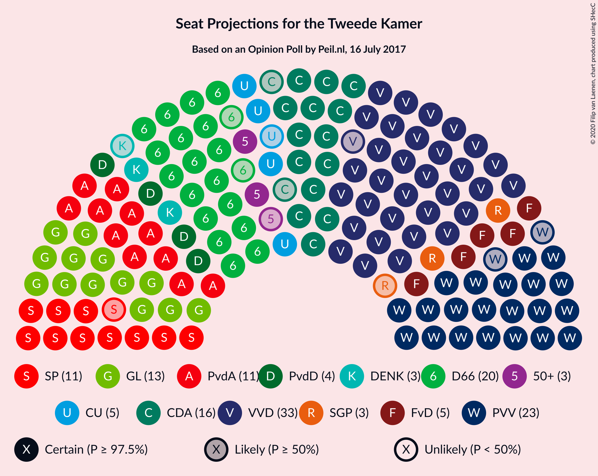

### Confidence Intervals

| Party | Last Result | Median | 80% Confidence Interval | 90% Confidence Interval | 95% Confidence Interval | 99% Confidence Interval |
|:-----:|:-----------:|:------:|:-----------------------:|:-----------------------:|:-----------------------:|:-----------------------:|
| <a href="#volkspartij-voor-vrijheid-en-democratie">Volkspartij voor Vrijheid en Democratie</a> | 33 | 33 | 33–34 |33–34 |33–34 |33–35 |
| <a href="#partij-voor-de-vrijheid">Partij voor de Vrijheid</a> | 20 | 23 | 22–23 |22–23 |21–23 |20–23 |
| <a href="#democraten-66">Democraten 66</a> | 19 | 20 | 20–21 |20–21 |19–21 |19–21 |
| <a href="#christen-democratisch-appèl">Christen-Democratisch Appèl</a> | 19 | 17 | 15–17 |15–17 |15–17 |15–18 |
| <a href="#groenlinks">GroenLinks</a> | 14 | 13 | 13 |13 |13 |13 |
| <a href="#socialistische-partij">Socialistische Partij</a> | 14 | 10 | 10–12 |10–12 |10–12 |10–12 |
| <a href="#partij-van-de-arbeid">Partij van de Arbeid</a> | 9 | 11 | 11 |11 |11 |11–12 |
| <a href="#forum-voor-democratie">Forum voor Democratie</a> | 2 | 5 | 5 |5 |5–6 |5–7 |
| <a href="#christenunie">ChristenUnie</a> | 5 | 5 | 5–6 |5–6 |5–6 |5–6 |
| <a href="#partij-voor-de-dieren">Partij voor de Dieren</a> | 5 | 4 | 4 |4 |4 |4 |
| <a href="#50plus">50Plus</a> | 4 | 3 | 2–3 |2–3 |2–3 |2–3 |
| <a href="#staatkundig-gereformeerde-partij">Staatkundig Gereformeerde Partij</a> | 3 | 3 | 2–3 |2–3 |2–3 |2–3 |
| <a href="#denk">DENK</a> | 3 | 3 | 3 |3 |2–3 |2–3 |

### Volkspartij voor Vrijheid en Democratie

*For a full overview of the results for this party, see the [Volkspartij voor Vrijheid en Democratie](party-volkspartijvoorvrijheidendemocratie.html) page.*

| Number of Seats | Probability | Accumulated | Special Marks |
|:---------------:|:-----------:|:-----------:|:-------------:|
| 30 | 0.2% | 100% |  |
| 31 | 0% | 99.8% |  |
| 32 | 0% | 99.8% |  |
| 33 | 77% | 99.8% | Last Result, Median |
| 34 | 21% | 23% |  |
| 35 | 1.4% | 1.5% |  |
| 36 | 0% | 0% |  |

### Partij voor de Vrijheid

*For a full overview of the results for this party, see the [Partij voor de Vrijheid](party-partijvoordevrijheid.html) page.*

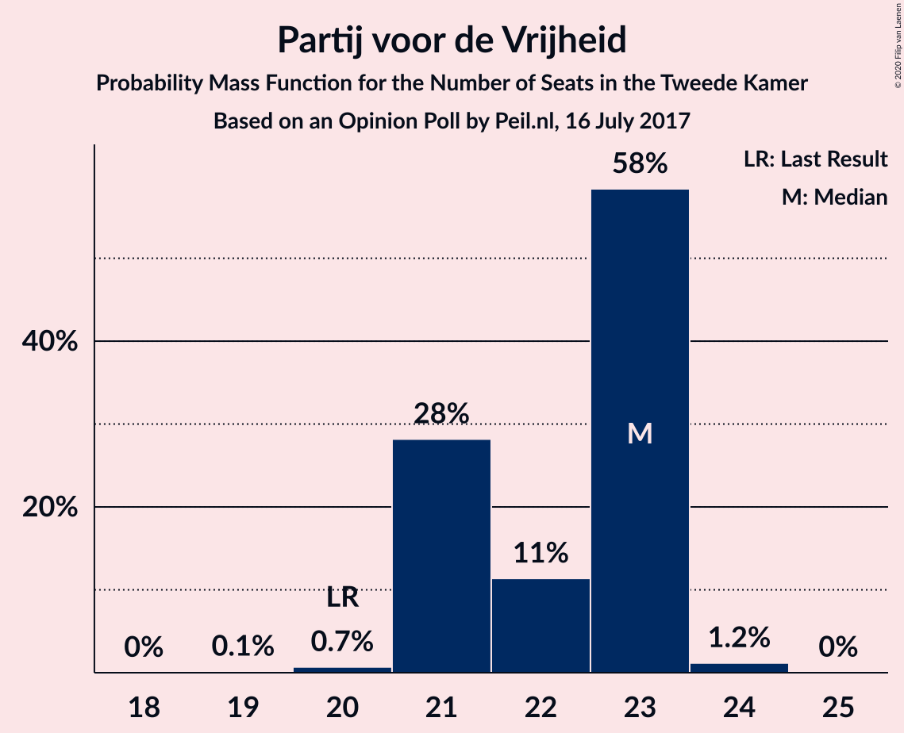

| Number of Seats | Probability | Accumulated | Special Marks |
|:---------------:|:-----------:|:-----------:|:-------------:|
| 20 | 1.1% | 100% | Last Result |
| 21 | 1.4% | 98.9% |  |
| 22 | 21% | 97% |  |
| 23 | 76% | 76% | Median |
| 24 | 0% | 0% |  |

### Democraten 66

*For a full overview of the results for this party, see the [Democraten 66](party-democraten66.html) page.*

| Number of Seats | Probability | Accumulated | Special Marks |
|:---------------:|:-----------:|:-----------:|:-------------:|
| 19 | 3% | 100% | Last Result |
| 20 | 76% | 97% | Median |
| 21 | 21% | 21% |  |
| 22 | 0% | 0% |  |

### Christen-Democratisch Appèl

*For a full overview of the results for this party, see the [Christen-Democratisch Appèl](party-christen-democratischappèl.html) page.*

| Number of Seats | Probability | Accumulated | Special Marks |
|:---------------:|:-----------:|:-----------:|:-------------:|
| 15 | 21% | 100% |  |
| 16 | 0.1% | 79% |  |
| 17 | 77% | 79% | Median |
| 18 | 1.4% | 1.4% |  |
| 19 | 0% | 0% | Last Result |

### GroenLinks

*For a full overview of the results for this party, see the [GroenLinks](party-groenlinks.html) page.*

| Number of Seats | Probability | Accumulated | Special Marks |
|:---------------:|:-----------:|:-----------:|:-------------:|
| 12 | 0.1% | 100% |  |
| 13 | 99.7% | 99.9% | Median |
| 14 | 0.2% | 0.2% | Last Result |
| 15 | 0% | 0% |  |

### Socialistische Partij

*For a full overview of the results for this party, see the [Socialistische Partij](party-socialistischepartij.html) page.*

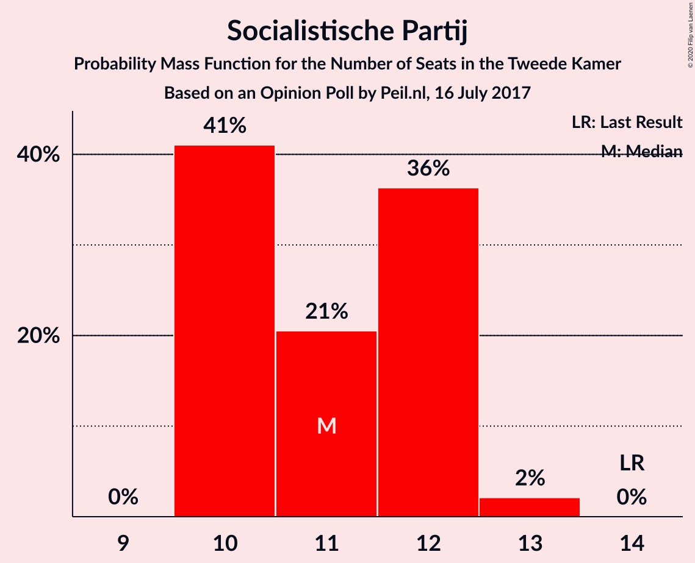

| Number of Seats | Probability | Accumulated | Special Marks |
|:---------------:|:-----------:|:-----------:|:-------------:|
| 10 | 76% | 100% | Median |
| 11 | 1.4% | 24% |  |
| 12 | 22% | 22% |  |
| 13 | 0% | 0% |  |
| 14 | 0% | 0% | Last Result |

### Partij van de Arbeid

*For a full overview of the results for this party, see the [Partij van de Arbeid](party-partijvandearbeid.html) page.*

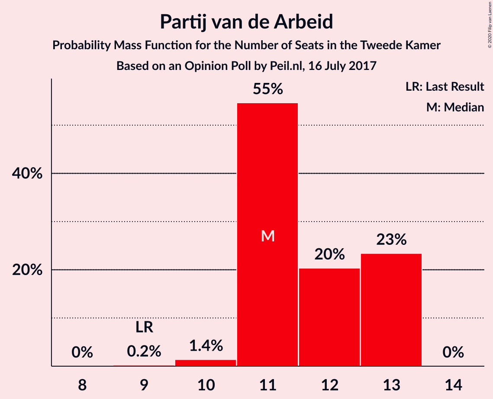

| Number of Seats | Probability | Accumulated | Special Marks |
|:---------------:|:-----------:|:-----------:|:-------------:|
| 9 | 0% | 100% | Last Result |
| 10 | 0% | 100% |  |
| 11 | 98.6% | 99.9% | Median |
| 12 | 1.3% | 1.3% |  |
| 13 | 0% | 0% |  |

### Forum voor Democratie

*For a full overview of the results for this party, see the [Forum voor Democratie](party-forumvoordemocratie.html) page.*

| Number of Seats | Probability | Accumulated | Special Marks |
|:---------------:|:-----------:|:-----------:|:-------------:|
| 2 | 0% | 100% | Last Result |
| 3 | 0% | 100% |  |
| 4 | 0% | 100% |  |
| 5 | 97% | 100% | Median |
| 6 | 1.2% | 3% |  |
| 7 | 1.4% | 1.4% |  |
| 8 | 0% | 0% |  |

### ChristenUnie

*For a full overview of the results for this party, see the [ChristenUnie](party-christenunie.html) page.*

| Number of Seats | Probability | Accumulated | Special Marks |
|:---------------:|:-----------:|:-----------:|:-------------:|
| 5 | 78% | 100% | Last Result, Median |
| 6 | 22% | 22% |  |
| 7 | 0% | 0% |  |

### Partij voor de Dieren

*For a full overview of the results for this party, see the [Partij voor de Dieren](party-partijvoordedieren.html) page.*

| Number of Seats | Probability | Accumulated | Special Marks |
|:---------------:|:-----------:|:-----------:|:-------------:|
| 4 | 99.9% | 100% | Median |
| 5 | 0.1% | 0.1% | Last Result |
| 6 | 0% | 0% |  |

### 50Plus

*For a full overview of the results for this party, see the [50Plus](party-50plus.html) page.*

| Number of Seats | Probability | Accumulated | Special Marks |
|:---------------:|:-----------:|:-----------:|:-------------:|
| 2 | 23% | 100% |  |
| 3 | 77% | 77% | Median |
| 4 | 0% | 0% | Last Result |

### Staatkundig Gereformeerde Partij

*For a full overview of the results for this party, see the [Staatkundig Gereformeerde Partij](party-staatkundiggereformeerdepartij.html) page.*

| Number of Seats | Probability | Accumulated | Special Marks |
|:---------------:|:-----------:|:-----------:|:-------------:|
| 2 | 23% | 100% |  |
| 3 | 77% | 77% | Last Result, Median |
| 4 | 0% | 0% |  |

### DENK

*For a full overview of the results for this party, see the [DENK](party-denk.html) page.*

| Number of Seats | Probability | Accumulated | Special Marks |
|:---------------:|:-----------:|:-----------:|:-------------:|
| 2 | 3% | 100% |  |
| 3 | 97% | 97% | Last Result, Median |
| 4 | 0.2% | 0.2% |  |
| 5 | 0% | 0% |  |

## Coalitions

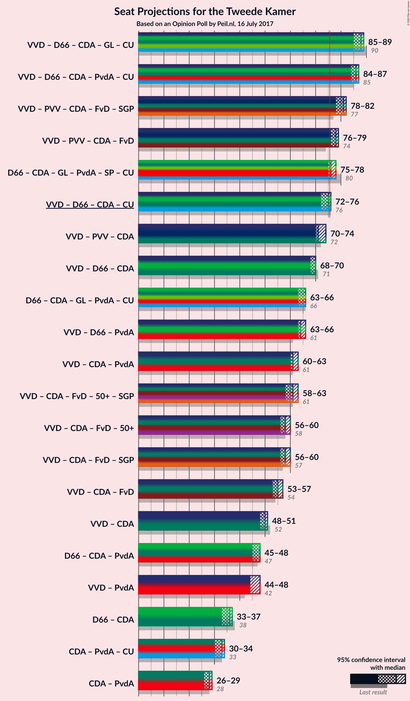

### Confidence Intervals

| Coalition | Last Result | Median | Majority? | 80% Confidence Interval | 90% Confidence Interval | 95% Confidence Interval | 99% Confidence Interval |
|:---------:|:-----------:|:------:|:---------:|:-----------------------:|:-----------------------:|:-----------------------:|:-----------------------:|
| Volkspartij voor Vrijheid en Democratie – Democraten 66 – Christen-Democratisch Appèl – GroenLinks – ChristenUnie | 90 | 88 | 100% | 88–89 | 88–89 | 88–89 | 88–90 |
| Volkspartij voor Vrijheid en Democratie – Democraten 66 – Christen-Democratisch Appèl – Partij van de Arbeid – ChristenUnie | 85 | 86 | 100% | 86–87 | 86–87 | 86–87 | 86–88 |
| Volkspartij voor Vrijheid en Democratie – Partij voor de Vrijheid – Christen-Democratisch Appèl – Forum voor Democratie – Staatkundig Gereformeerde Partij | 77 | 81 | 100% | 78–81 | 78–81 | 78–81 | 78–83 |
| Democraten 66 – Christen-Democratisch Appèl – GroenLinks – Partij van de Arbeid – Socialistische Partij – ChristenUnie | 80 | 76 | 99.9% | 76–78 | 76–78 | 76–78 | 76–79 |
| Volkspartij voor Vrijheid en Democratie – Partij voor de Vrijheid – Christen-Democratisch Appèl – Forum voor Democratie | 74 | 78 | 99.8% | 76–78 | 76–78 | 76–78 | 76–81 |
| Volkspartij voor Vrijheid en Democratie – Democraten 66 – Christen-Democratisch Appèl – ChristenUnie | 76 | 75 | 23% | 75–76 | 75–76 | 75–76 | 75–77 |
| Volkspartij voor Vrijheid en Democratie – Partij voor de Vrijheid – Christen-Democratisch Appèl | 72 | 73 | 0% | 71–73 | 71–73 | 71–73 | 70–74 |
| Volkspartij voor Vrijheid en Democratie – Democraten 66 – Christen-Democratisch Appèl | 71 | 70 | 0% | 70 | 70 | 70 | 69–72 |
| Democraten 66 – Christen-Democratisch Appèl – GroenLinks – Partij van de Arbeid – ChristenUnie | 66 | 66 | 0% | 66 | 66 | 66 | 66–67 |
| Volkspartij voor Vrijheid en Democratie – Democraten 66 – Partij van de Arbeid | 61 | 64 | 0% | 64–66 | 64–66 | 64–66 | 64–66 |
| Volkspartij voor Vrijheid en Democratie – Christen-Democratisch Appèl – Partij van de Arbeid | 61 | 61 | 0% | 60–61 | 60–61 | 60–62 | 60–64 |
| Volkspartij voor Vrijheid en Democratie – Christen-Democratisch Appèl – Forum voor Democratie – 50Plus – Staatkundig Gereformeerde Partij | 61 | 61 | 0% | 58–61 | 58–61 | 58–62 | 58–64 |
| Volkspartij voor Vrijheid en Democratie – Christen-Democratisch Appèl – Forum voor Democratie – 50Plus | 58 | 58 | 0% | 56–58 | 56–58 | 56–59 | 56–62 |
| Volkspartij voor Vrijheid en Democratie – Christen-Democratisch Appèl – Forum voor Democratie – Staatkundig Gereformeerde Partij | 57 | 58 | 0% | 56–58 | 56–58 | 56–59 | 56–62 |
| Volkspartij voor Vrijheid en Democratie – Christen-Democratisch Appèl – Forum voor Democratie | 54 | 55 | 0% | 54–55 | 54–55 | 54–56 | 54–60 |
| Volkspartij voor Vrijheid en Democratie – Christen-Democratisch Appèl | 52 | 50 | 0% | 49–50 | 49–50 | 49–50 | 49–53 |
| Democraten 66 – Christen-Democratisch Appèl – Partij van de Arbeid | 47 | 48 | 0% | 47–48 | 47–48 | 47–48 | 47–48 |
| Volkspartij voor Vrijheid en Democratie – Partij van de Arbeid | 42 | 44 | 0% | 44–45 | 44–45 | 44–45 | 44–46 |
| Democraten 66 – Christen-Democratisch Appèl | 38 | 37 | 0% | 36–37 | 36–37 | 36–37 | 36–37 |
| Christen-Democratisch Appèl – Partij van de Arbeid – ChristenUnie | 33 | 33 | 0% | 32–33 | 32–33 | 32–34 | 32–35 |
| Christen-Democratisch Appèl – Partij van de Arbeid | 28 | 28 | 0% | 26–28 | 26–28 | 26–29 | 26–29 |

### Volkspartij voor Vrijheid en Democratie – Democraten 66 – Christen-Democratisch Appèl – GroenLinks – ChristenUnie

| Number of Seats | Probability | Accumulated | Special Marks |
|:---------------:|:-----------:|:-----------:|:-------------:|
| 85 | 0.1% | 100% |  |
| 86 | 0.2% | 99.9% |  |
| 87 | 0.1% | 99.8% |  |
| 88 | 77% | 99.7% | Median |
| 89 | 21% | 23% |  |
| 90 | 1.4% | 1.5% | Last Result |
| 91 | 0% | 0% |  |

### Volkspartij voor Vrijheid en Democratie – Democraten 66 – Christen-Democratisch Appèl – Partij van de Arbeid – ChristenUnie

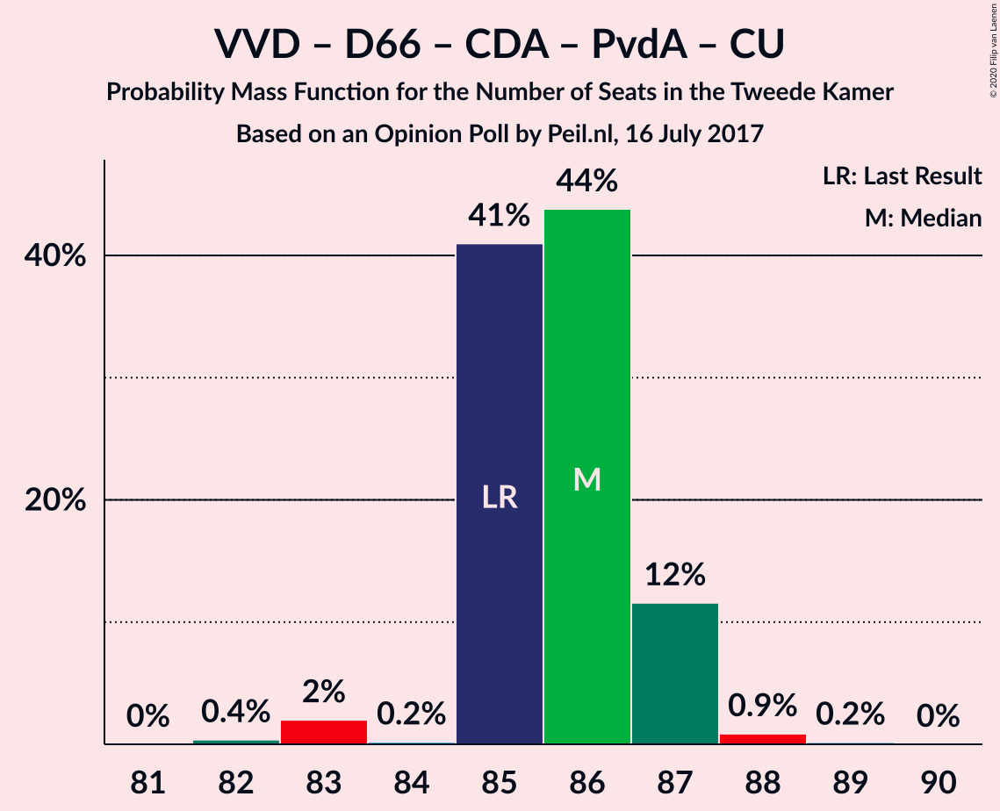

| Number of Seats | Probability | Accumulated | Special Marks |
|:---------------:|:-----------:|:-----------:|:-------------:|
| 84 | 0.2% | 100% |  |
| 85 | 0% | 99.8% | Last Result |
| 86 | 76% | 99.8% | Median |
| 87 | 22% | 24% |  |
| 88 | 1.4% | 1.4% |  |
| 89 | 0% | 0% |  |

### Volkspartij voor Vrijheid en Democratie – Partij voor de Vrijheid – Christen-Democratisch Appèl – Forum voor Democratie – Staatkundig Gereformeerde Partij

| Number of Seats | Probability | Accumulated | Special Marks |
|:---------------:|:-----------:|:-----------:|:-------------:|
| 77 | 0.2% | 100% | Last Result |
| 78 | 21% | 99.8% |  |
| 79 | 1.1% | 79% |  |
| 80 | 0% | 78% |  |
| 81 | 76% | 78% | Median |
| 82 | 0.1% | 1.5% |  |
| 83 | 1.4% | 1.4% |  |
| 84 | 0% | 0% |  |

### Democraten 66 – Christen-Democratisch Appèl – GroenLinks – Partij van de Arbeid – Socialistische Partij – ChristenUnie

| Number of Seats | Probability | Accumulated | Special Marks |
|:---------------:|:-----------:|:-----------:|:-------------:|
| 73 | 0% | 100% |  |
| 74 | 0% | 99.9% |  |
| 75 | 0% | 99.9% |  |
| 76 | 76% | 99.9% | Median, Majority |
| 77 | 1.4% | 24% |  |
| 78 | 21% | 22% |  |
| 79 | 1.1% | 1.3% |  |
| 80 | 0.2% | 0.2% | Last Result |
| 81 | 0% | 0% |  |

### Volkspartij voor Vrijheid en Democratie – Partij voor de Vrijheid – Christen-Democratisch Appèl – Forum voor Democratie

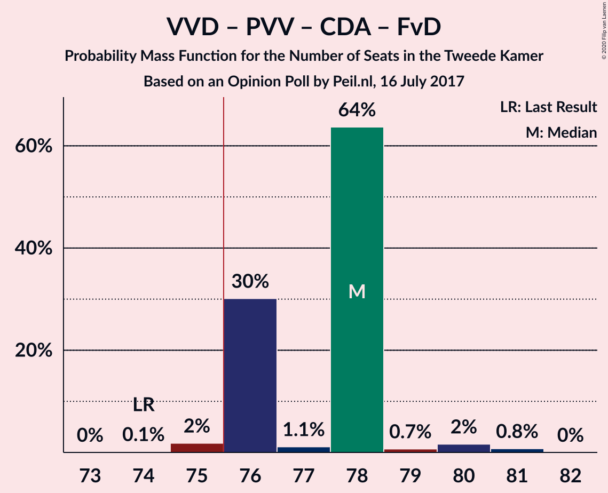

| Number of Seats | Probability | Accumulated | Special Marks |
|:---------------:|:-----------:|:-----------:|:-------------:|
| 74 | 0.2% | 100% | Last Result |
| 75 | 0% | 99.8% |  |
| 76 | 22% | 99.8% | Majority |
| 77 | 0% | 78% |  |
| 78 | 76% | 78% | Median |
| 79 | 0.1% | 2% |  |
| 80 | 0% | 1.4% |  |
| 81 | 1.4% | 1.4% |  |
| 82 | 0% | 0% |  |

### Volkspartij voor Vrijheid en Democratie – Democraten 66 – Christen-Democratisch Appèl – ChristenUnie

| Number of Seats | Probability | Accumulated | Special Marks |
|:---------------:|:-----------:|:-----------:|:-------------:|
| 72 | 0.2% | 100% |  |
| 73 | 0% | 99.8% |  |
| 74 | 0% | 99.8% |  |
| 75 | 77% | 99.8% | Median |
| 76 | 21% | 23% | Last Result, Majority |
| 77 | 1.4% | 1.4% |  |
| 78 | 0% | 0% |  |

### Volkspartij voor Vrijheid en Democratie – Partij voor de Vrijheid – Christen-Democratisch Appèl

| Number of Seats | Probability | Accumulated | Special Marks |
|:---------------:|:-----------:|:-----------:|:-------------:|
| 69 | 0.2% | 100% |  |
| 70 | 1.1% | 99.8% |  |
| 71 | 21% | 98.7% |  |
| 72 | 0% | 78% | Last Result |
| 73 | 76% | 78% | Median |
| 74 | 1.4% | 1.4% |  |
| 75 | 0% | 0% |  |

### Volkspartij voor Vrijheid en Democratie – Democraten 66 – Christen-Democratisch Appèl

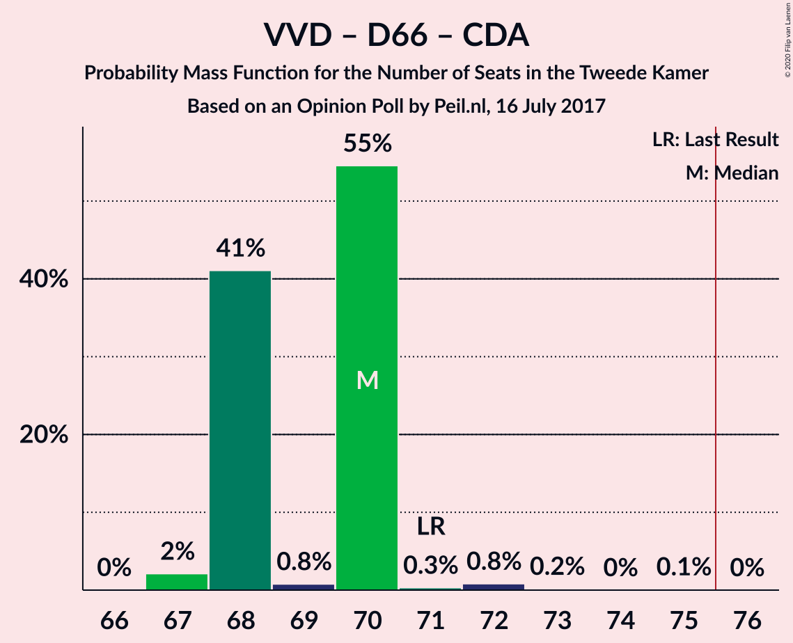

| Number of Seats | Probability | Accumulated | Special Marks |
|:---------------:|:-----------:|:-----------:|:-------------:|
| 67 | 0.2% | 100% |  |
| 68 | 0% | 99.8% |  |
| 69 | 1.1% | 99.8% |  |
| 70 | 97% | 98.7% | Median |
| 71 | 0.1% | 2% | Last Result |
| 72 | 1.4% | 1.4% |  |
| 73 | 0% | 0% |  |

### Democraten 66 – Christen-Democratisch Appèl – GroenLinks – Partij van de Arbeid – ChristenUnie

| Number of Seats | Probability | Accumulated | Special Marks |
|:---------------:|:-----------:|:-----------:|:-------------:|
| 62 | 0% | 100% |  |
| 63 | 0% | 99.9% |  |
| 64 | 0.1% | 99.9% |  |
| 65 | 0% | 99.9% |  |
| 66 | 98.6% | 99.9% | Last Result, Median |
| 67 | 1.1% | 1.3% |  |
| 68 | 0.2% | 0.2% |  |
| 69 | 0% | 0% |  |

### Volkspartij voor Vrijheid en Democratie – Democraten 66 – Partij van de Arbeid

| Number of Seats | Probability | Accumulated | Special Marks |
|:---------------:|:-----------:|:-----------:|:-------------:|
| 61 | 0% | 100% | Last Result |
| 62 | 0.2% | 100% |  |
| 63 | 0% | 99.8% |  |
| 64 | 77% | 99.8% | Median |
| 65 | 1.4% | 23% |  |
| 66 | 21% | 21% |  |
| 67 | 0% | 0% |  |

### Volkspartij voor Vrijheid en Democratie – Christen-Democratisch Appèl – Partij van de Arbeid

| Number of Seats | Probability | Accumulated | Special Marks |
|:---------------:|:-----------:|:-----------:|:-------------:|
| 59 | 0.2% | 100% |  |
| 60 | 21% | 99.8% |  |
| 61 | 76% | 79% | Last Result, Median |
| 62 | 1.1% | 3% |  |
| 63 | 0% | 1.4% |  |
| 64 | 1.4% | 1.4% |  |
| 65 | 0% | 0% |  |

### Volkspartij voor Vrijheid en Democratie – Christen-Democratisch Appèl – Forum voor Democratie – 50Plus – Staatkundig Gereformeerde Partij

| Number of Seats | Probability | Accumulated | Special Marks |
|:---------------:|:-----------:|:-----------:|:-------------:|
| 57 | 0.2% | 100% |  |
| 58 | 21% | 99.8% |  |
| 59 | 0% | 79% |  |
| 60 | 0% | 79% |  |
| 61 | 76% | 79% | Last Result, Median |
| 62 | 1.1% | 3% |  |
| 63 | 0% | 1.4% |  |
| 64 | 1.4% | 1.4% |  |
| 65 | 0% | 0% |  |

### Volkspartij voor Vrijheid en Democratie – Christen-Democratisch Appèl – Forum voor Democratie – 50Plus

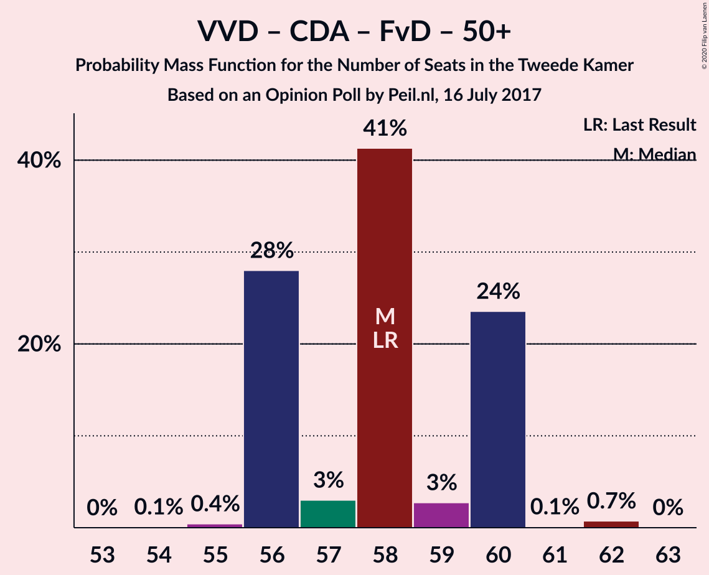

| Number of Seats | Probability | Accumulated | Special Marks |
|:---------------:|:-----------:|:-----------:|:-------------:|
| 54 | 0.2% | 100% |  |
| 55 | 0% | 99.8% |  |
| 56 | 21% | 99.8% |  |
| 57 | 0% | 79% |  |
| 58 | 76% | 79% | Last Result, Median |
| 59 | 1.2% | 3% |  |
| 60 | 0% | 1.4% |  |
| 61 | 0% | 1.4% |  |
| 62 | 1.4% | 1.4% |  |
| 63 | 0% | 0% |  |

### Volkspartij voor Vrijheid en Democratie – Christen-Democratisch Appèl – Forum voor Democratie – Staatkundig Gereformeerde Partij

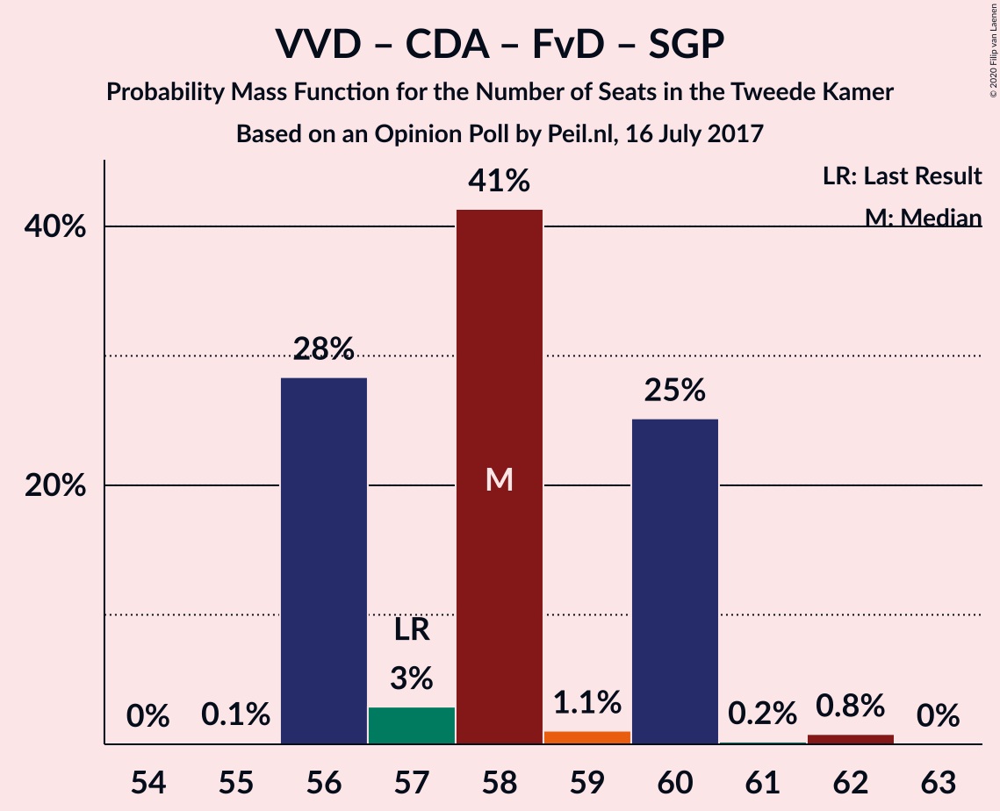

| Number of Seats | Probability | Accumulated | Special Marks |
|:---------------:|:-----------:|:-----------:|:-------------:|
| 55 | 0.2% | 100% |  |
| 56 | 21% | 99.8% |  |
| 57 | 0% | 79% | Last Result |
| 58 | 76% | 79% | Median |
| 59 | 1.2% | 3% |  |
| 60 | 0% | 1.4% |  |
| 61 | 0% | 1.4% |  |
| 62 | 1.4% | 1.4% |  |
| 63 | 0% | 0% |  |

### Volkspartij voor Vrijheid en Democratie – Christen-Democratisch Appèl – Forum voor Democratie

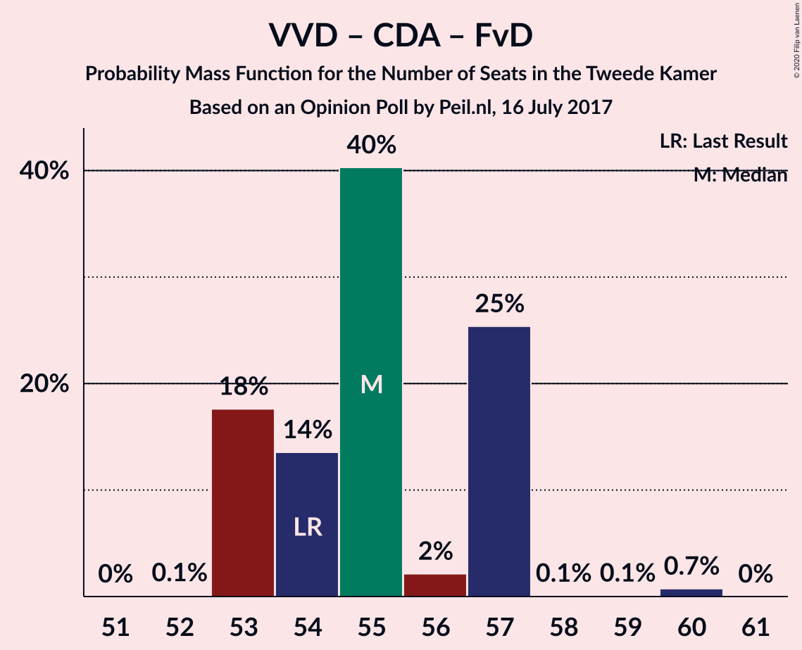

| Number of Seats | Probability | Accumulated | Special Marks |
|:---------------:|:-----------:|:-----------:|:-------------:|
| 52 | 0.2% | 100% |  |
| 53 | 0% | 99.8% |  |
| 54 | 21% | 99.8% | Last Result |
| 55 | 76% | 79% | Median |
| 56 | 1.2% | 3% |  |
| 57 | 0% | 1.4% |  |
| 58 | 0% | 1.4% |  |
| 59 | 0% | 1.4% |  |
| 60 | 1.4% | 1.4% |  |
| 61 | 0% | 0% |  |

### Volkspartij voor Vrijheid en Democratie – Christen-Democratisch Appèl

| Number of Seats | Probability | Accumulated | Special Marks |
|:---------------:|:-----------:|:-----------:|:-------------:|
| 47 | 0.2% | 100% |  |
| 48 | 0% | 99.8% |  |
| 49 | 21% | 99.8% |  |
| 50 | 77% | 79% | Median |
| 51 | 0.1% | 1.5% |  |
| 52 | 0% | 1.4% | Last Result |
| 53 | 1.4% | 1.4% |  |
| 54 | 0% | 0% |  |

### Democraten 66 – Christen-Democratisch Appèl – Partij van de Arbeid

| Number of Seats | Probability | Accumulated | Special Marks |
|:---------------:|:-----------:|:-----------:|:-------------:|
| 46 | 0% | 100% |  |
| 47 | 21% | 99.9% | Last Result |
| 48 | 79% | 79% | Median |
| 49 | 0.2% | 0.2% |  |
| 50 | 0% | 0% |  |

### Volkspartij voor Vrijheid en Democratie – Partij van de Arbeid

| Number of Seats | Probability | Accumulated | Special Marks |
|:---------------:|:-----------:|:-----------:|:-------------:|
| 42 | 0.2% | 100% | Last Result |
| 43 | 0% | 99.8% |  |
| 44 | 76% | 99.8% | Median |
| 45 | 22% | 24% |  |
| 46 | 1.4% | 1.5% |  |
| 47 | 0% | 0.1% |  |
| 48 | 0% | 0% |  |

### Democraten 66 – Christen-Democratisch Appèl

| Number of Seats | Probability | Accumulated | Special Marks |
|:---------------:|:-----------:|:-----------:|:-------------:|
| 35 | 0.1% | 100% |  |
| 36 | 22% | 99.9% |  |
| 37 | 78% | 78% | Median |
| 38 | 0% | 0% | Last Result |

### Christen-Democratisch Appèl – Partij van de Arbeid – ChristenUnie

| Number of Seats | Probability | Accumulated | Special Marks |
|:---------------:|:-----------:|:-----------:|:-------------:|
| 30 | 0% | 100% |  |
| 31 | 0% | 99.9% |  |
| 32 | 21% | 99.9% |  |
| 33 | 76% | 79% | Last Result, Median |
| 34 | 2% | 3% |  |
| 35 | 1.1% | 1.1% |  |
| 36 | 0% | 0% |  |

### Christen-Democratisch Appèl – Partij van de Arbeid

| Number of Seats | Probability | Accumulated | Special Marks |
|:---------------:|:-----------:|:-----------:|:-------------:|
| 25 | 0% | 100% |  |
| 26 | 21% | 99.9% |  |
| 27 | 0% | 79% |  |
| 28 | 76% | 79% | Last Result, Median |
| 29 | 3% | 3% |  |
| 30 | 0% | 0% |  |

## Technical Information

### Opinion Poll

+ **Polling firm:** Peil.nl
+ **Commissioner(s):** —
+ **Fieldwork period:** 16 July 2017

### Calculations

+ **Sample size:** 3000
+ **Simulations done:** 131,072
+ **Error estimate:** 1.49%

