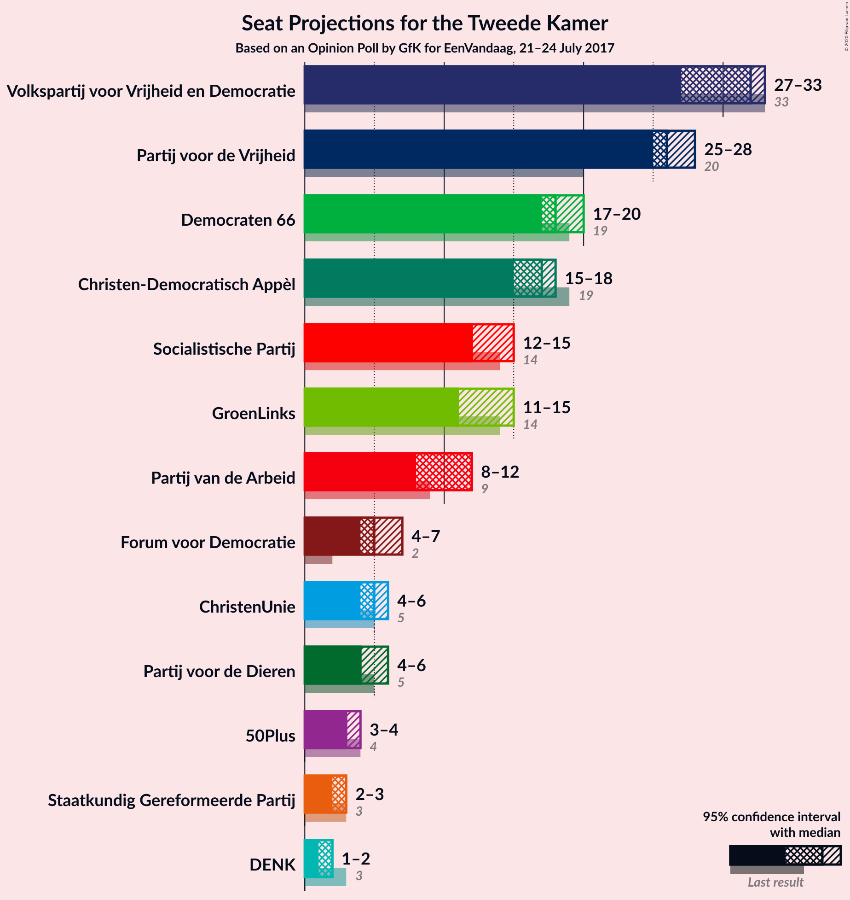
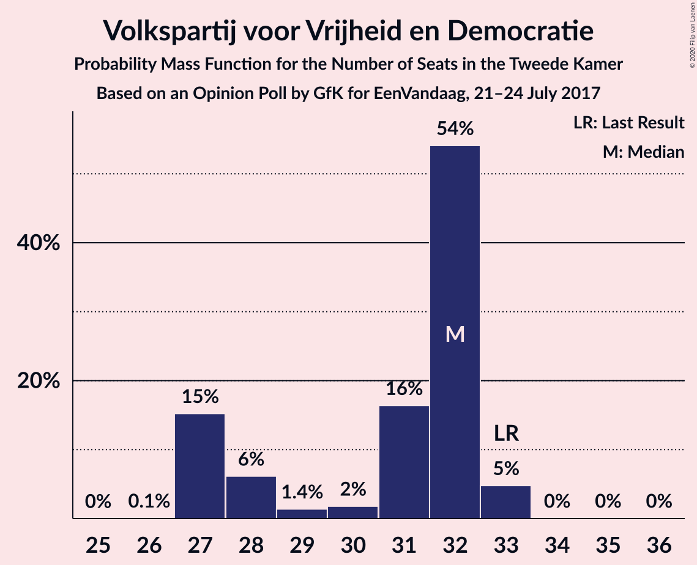
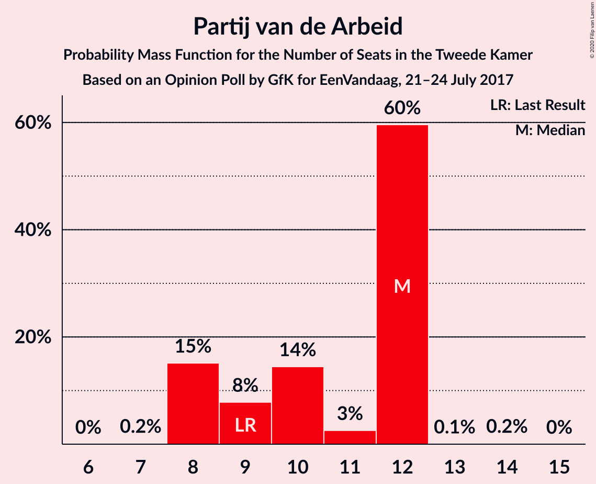
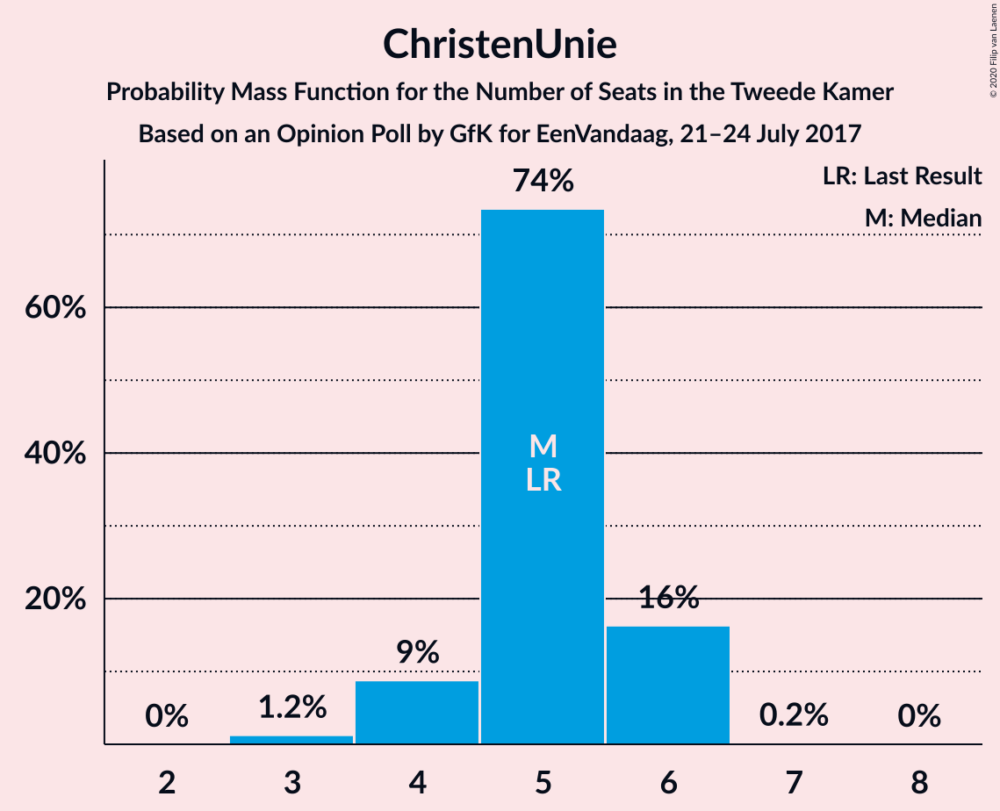
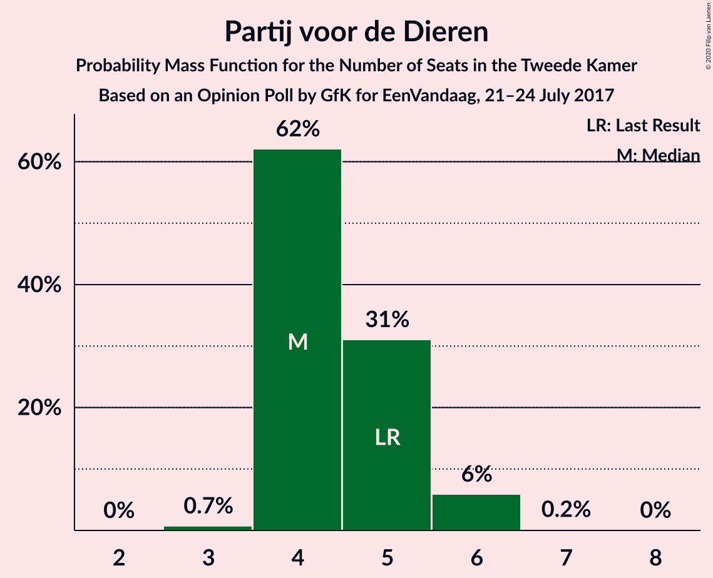
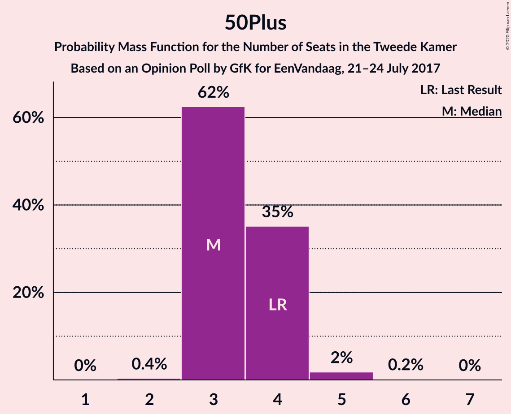
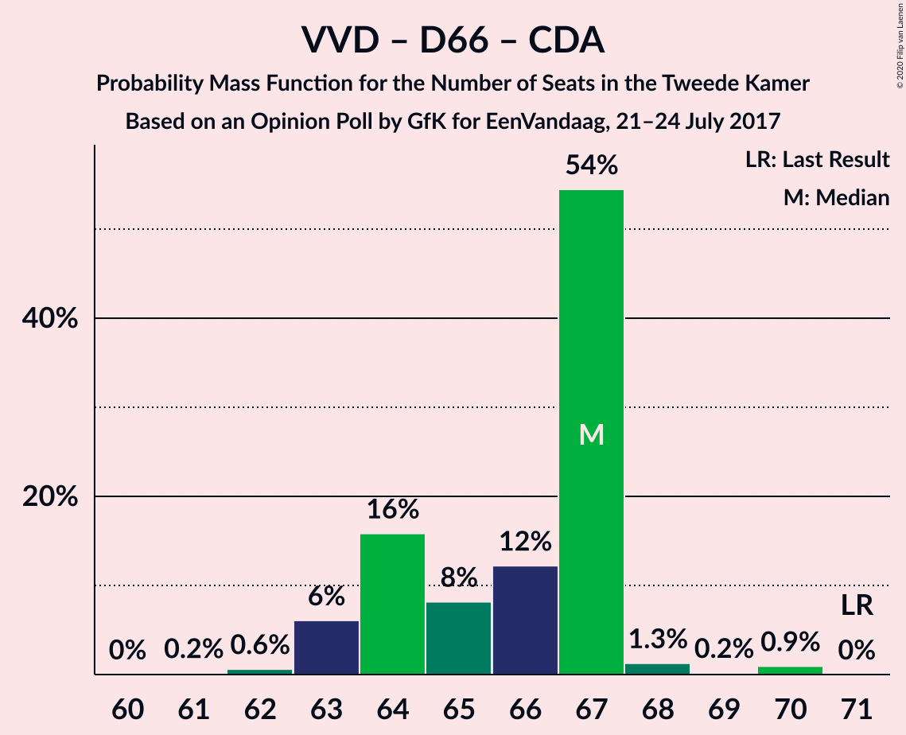
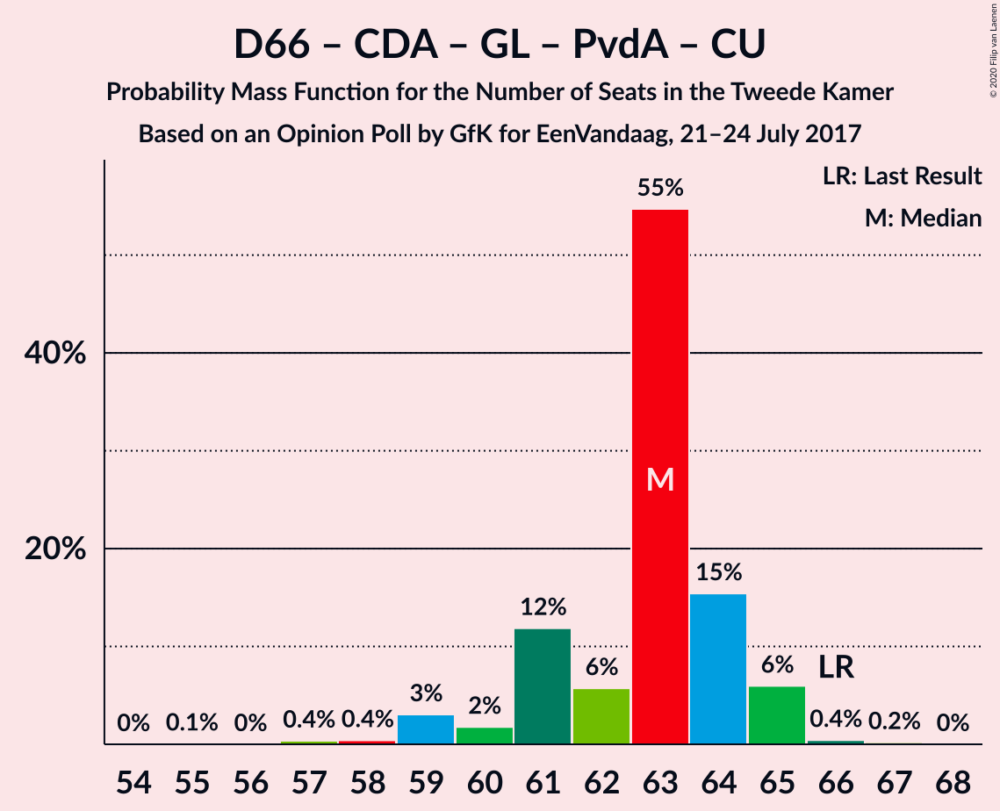
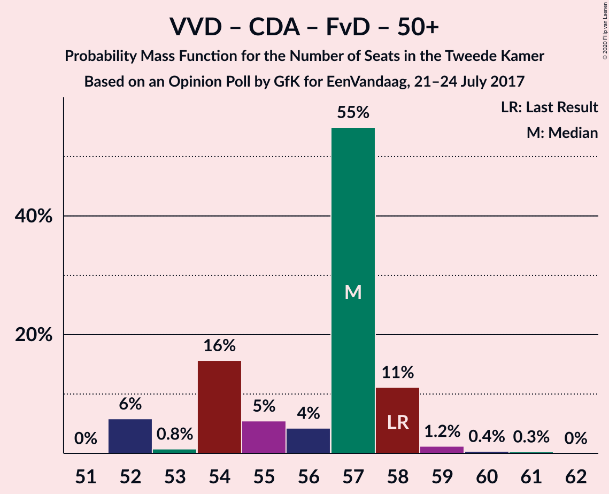

# Opinion Poll by GfK for EenVandaag, 21–24 July 2017

<a href="#voting-intentions">Voting Intentions</a> | <a href="#seats">Seats</a> | <a href="#coalitions">Coalitions</a> | <a href="#technical-information">Technical Information</a>

## Voting Intentions

### Confidence Intervals

| Party | Last Result | Poll Result | 80% Confidence Interval | 90% Confidence Interval | 95% Confidence Interval | 99% Confidence Interval |
|:-----:|:-----------:|:-----------:|:-----------------------:|:-----------------------:|:-----------------------:|:-----------------------:|
| Volkspartij voor Vrijheid en Democratie | 21.3% | 20.0% | 18.8–21.2% |18.5–21.6% |18.2–21.9% |17.7–22.5% |
| Partij voor de Vrijheid | 13.1% | 17.3% | 16.3–18.5% |16.0–18.8% |15.7–19.1% |15.2–19.7% |
| Democraten 66 | 12.2% | 12.0% | 11.1–13.0% |10.8–13.3% |10.6–13.5% |10.2–14.0% |
| Christen-Democratisch Appèl | 12.4% | 11.3% | 10.5–12.3% |10.2–12.6% |10.0–12.9% |9.6–13.4% |
| Socialistische Partij | 9.1% | 8.6% | 7.9–9.5% |7.6–9.8% |7.5–10.0% |7.1–10.4% |
| GroenLinks | 9.1% | 8.0% | 7.3–8.9% |7.0–9.1% |6.9–9.3% |6.5–9.8% |
| Partij van de Arbeid | 5.7% | 6.7% | 6.0–7.5% |5.8–7.7% |5.6–7.9% |5.3–8.3% |
| ChristenUnie | 3.4% | 3.3% | 2.9–3.9% |2.7–4.1% |2.6–4.3% |2.4–4.6% |
| Partij voor de Dieren | 3.2% | 3.3% | 2.9–3.9% |2.7–4.1% |2.6–4.3% |2.4–4.6% |
| Forum voor Democratie | 1.8% | 3.3% | 2.9–3.9% |2.7–4.1% |2.6–4.3% |2.4–4.6% |
| 50Plus | 3.1% | 2.7% | 2.2–3.2% |2.1–3.4% |2.0–3.5% |1.8–3.8% |
| Staatkundig Gereformeerde Partij | 2.1% | 2.0% | 1.6–2.5% |1.6–2.6% |1.5–2.8% |1.3–3.0% |
| DENK | 2.1% | 1.3% | 1.0–1.7% |1.0–1.9% |0.9–2.0% |0.8–2.2% |

*Note:* The poll result column reflects the actual value used in the calculations. Published results may vary slightly, and in addition be rounded to fewer digits.

## Seats

### Confidence Intervals

| Party | Last Result | Median | 80% Confidence Interval | 90% Confidence Interval | 95% Confidence Interval | 99% Confidence Interval |
|:-----:|:-----------:|:------:|:-----------------------:|:-----------------------:|:-----------------------:|:-----------------------:|
| <a href="#volkspartij-voor-vrijheid-en-democratie">Volkspartij voor Vrijheid en Democratie</a> | 33 | 32 | 27–32 |27–32 |27–33 |27–33 |
| <a href="#partij-voor-de-vrijheid">Partij voor de Vrijheid</a> | 20 | 26 | 25–27 |25–27 |25–28 |24–30 |
| <a href="#democraten-66">Democraten 66</a> | 19 | 18 | 18–19 |17–19 |17–20 |16–21 |
| <a href="#christen-democratisch-appèl">Christen-Democratisch Appèl</a> | 19 | 17 | 16–18 |15–18 |15–18 |14–20 |
| <a href="#socialistische-partij">Socialistische Partij</a> | 14 | 12 | 12–14 |12–15 |12–15 |11–16 |
| <a href="#groenlinks">GroenLinks</a> | 14 | 11 | 11–13 |11–15 |11–15 |9–15 |
| <a href="#partij-van-de-arbeid">Partij van de Arbeid</a> | 9 | 12 | 8–12 |8–12 |8–12 |8–12 |
| <a href="#christenunie">ChristenUnie</a> | 5 | 5 | 4–6 |4–6 |4–6 |3–6 |
| <a href="#partij-voor-de-dieren">Partij voor de Dieren</a> | 5 | 4 | 4–5 |4–6 |4–6 |3–6 |
| <a href="#forum-voor-democratie">Forum voor Democratie</a> | 2 | 5 | 5–6 |4–7 |4–7 |4–7 |
| <a href="#50plus">50Plus</a> | 4 | 3 | 3–4 |3–4 |3–4 |3–5 |
| <a href="#staatkundig-gereformeerde-partij">Staatkundig Gereformeerde Partij</a> | 3 | 3 | 2–3 |2–3 |2–3 |2–4 |
| <a href="#denk">DENK</a> | 3 | 2 | 1–2 |1–2 |1–2 |1–3 |

### Volkspartij voor Vrijheid en Democratie

*For a full overview of the results for this party, see the [Volkspartij voor Vrijheid en Democratie](party-volkspartijvoorvrijheidendemocratie.html) page.*

| Number of Seats | Probability | Accumulated | Special Marks |
|:---------------:|:-----------:|:-----------:|:-------------:|
| 26 | 0.1% | 100% |  |
| 27 | 15% | 99.9% |  |
| 28 | 6% | 85% |  |
| 29 | 1.4% | 79% |  |
| 30 | 2% | 77% |  |
| 31 | 16% | 75% |  |
| 32 | 54% | 59% | Median |
| 33 | 5% | 5% | Last Result |
| 34 | 0% | 0.1% |  |
| 35 | 0% | 0.1% |  |
| 36 | 0% | 0% |  |

### Partij voor de Vrijheid

*For a full overview of the results for this party, see the [Partij voor de Vrijheid](party-partijvoordevrijheid.html) page.*

| Number of Seats | Probability | Accumulated | Special Marks |
|:---------------:|:-----------:|:-----------:|:-------------:|
| 20 | 0% | 100% | Last Result |
| 21 | 0% | 100% |  |
| 22 | 0% | 100% |  |
| 23 | 0% | 100% |  |
| 24 | 1.5% | 99.9% |  |
| 25 | 16% | 98% |  |
| 26 | 54% | 82% | Median |
| 27 | 25% | 28% |  |
| 28 | 3% | 4% |  |
| 29 | 0.2% | 1.0% |  |
| 30 | 0.7% | 0.8% |  |
| 31 | 0.1% | 0.1% |  |
| 32 | 0% | 0% |  |

### Democraten 66

*For a full overview of the results for this party, see the [Democraten 66](party-democraten66.html) page.*

| Number of Seats | Probability | Accumulated | Special Marks |
|:---------------:|:-----------:|:-----------:|:-------------:|
| 15 | 0.3% | 100% |  |
| 16 | 1.4% | 99.6% |  |
| 17 | 5% | 98% |  |
| 18 | 55% | 94% | Median |
| 19 | 36% | 39% | Last Result |
| 20 | 2% | 3% |  |
| 21 | 1.0% | 1.0% |  |
| 22 | 0% | 0% |  |

### Christen-Democratisch Appèl

*For a full overview of the results for this party, see the [Christen-Democratisch Appèl](party-christen-democratischappèl.html) page.*

| Number of Seats | Probability | Accumulated | Special Marks |
|:---------------:|:-----------:|:-----------:|:-------------:|
| 14 | 0.9% | 100% |  |
| 15 | 8% | 99.1% |  |
| 16 | 17% | 92% |  |
| 17 | 56% | 74% | Median |
| 18 | 16% | 18% |  |
| 19 | 1.0% | 2% | Last Result |
| 20 | 0.2% | 0.6% |  |
| 21 | 0.4% | 0.4% |  |
| 22 | 0% | 0% |  |

### Socialistische Partij

*For a full overview of the results for this party, see the [Socialistische Partij](party-socialistischepartij.html) page.*

| Number of Seats | Probability | Accumulated | Special Marks |
|:---------------:|:-----------:|:-----------:|:-------------:|
| 10 | 0.2% | 100% |  |
| 11 | 2% | 99.8% |  |
| 12 | 54% | 98% | Median |
| 13 | 32% | 44% |  |
| 14 | 5% | 12% | Last Result |
| 15 | 6% | 7% |  |
| 16 | 0.5% | 0.6% |  |
| 17 | 0.1% | 0.1% |  |
| 18 | 0% | 0% |  |

### GroenLinks

*For a full overview of the results for this party, see the [GroenLinks](party-groenlinks.html) page.*

| Number of Seats | Probability | Accumulated | Special Marks |
|:---------------:|:-----------:|:-----------:|:-------------:|
| 9 | 0.8% | 100% |  |
| 10 | 1.3% | 99.2% |  |
| 11 | 66% | 98% | Median |
| 12 | 5% | 32% |  |
| 13 | 21% | 28% |  |
| 14 | 0.9% | 6% | Last Result |
| 15 | 5% | 5% |  |
| 16 | 0% | 0% |  |

### Partij van de Arbeid

*For a full overview of the results for this party, see the [Partij van de Arbeid](party-partijvandearbeid.html) page.*

| Number of Seats | Probability | Accumulated | Special Marks |
|:---------------:|:-----------:|:-----------:|:-------------:|
| 7 | 0.2% | 100% |  |
| 8 | 15% | 99.8% |  |
| 9 | 8% | 85% | Last Result |
| 10 | 14% | 77% |  |
| 11 | 3% | 62% |  |
| 12 | 60% | 60% | Median |
| 13 | 0.1% | 0.2% |  |
| 14 | 0.2% | 0.2% |  |
| 15 | 0% | 0% |  |

### ChristenUnie

*For a full overview of the results for this party, see the [ChristenUnie](party-christenunie.html) page.*

| Number of Seats | Probability | Accumulated | Special Marks |
|:---------------:|:-----------:|:-----------:|:-------------:|
| 3 | 1.2% | 100% |  |
| 4 | 9% | 98.8% |  |
| 5 | 74% | 90% | Last Result, Median |
| 6 | 16% | 16% |  |
| 7 | 0.2% | 0.2% |  |
| 8 | 0% | 0% |  |

### Partij voor de Dieren

*For a full overview of the results for this party, see the [Partij voor de Dieren](party-partijvoordedieren.html) page.*

| Number of Seats | Probability | Accumulated | Special Marks |
|:---------------:|:-----------:|:-----------:|:-------------:|
| 3 | 0.7% | 100% |  |
| 4 | 62% | 99.3% | Median |
| 5 | 31% | 37% | Last Result |
| 6 | 6% | 6% |  |
| 7 | 0.2% | 0.2% |  |
| 8 | 0% | 0% |  |

### Forum voor Democratie

*For a full overview of the results for this party, see the [Forum voor Democratie](party-forumvoordemocratie.html) page.*

| Number of Seats | Probability | Accumulated | Special Marks |
|:---------------:|:-----------:|:-----------:|:-------------:|
| 2 | 0% | 100% | Last Result |
| 3 | 0.3% | 100% |  |
| 4 | 9% | 99.7% |  |
| 5 | 75% | 91% | Median |
| 6 | 6% | 16% |  |
| 7 | 10% | 10% |  |
| 8 | 0% | 0% |  |

### 50Plus

*For a full overview of the results for this party, see the [50Plus](party-50plus.html) page.*

| Number of Seats | Probability | Accumulated | Special Marks |
|:---------------:|:-----------:|:-----------:|:-------------:|
| 2 | 0.4% | 100% |  |
| 3 | 62% | 99.6% | Median |
| 4 | 35% | 37% | Last Result |
| 5 | 2% | 2% |  |
| 6 | 0.2% | 0.2% |  |
| 7 | 0% | 0% |  |

### Staatkundig Gereformeerde Partij

*For a full overview of the results for this party, see the [Staatkundig Gereformeerde Partij](party-staatkundiggereformeerdepartij.html) page.*

| Number of Seats | Probability | Accumulated | Special Marks |
|:---------------:|:-----------:|:-----------:|:-------------:|
| 2 | 11% | 100% |  |
| 3 | 88% | 89% | Last Result, Median |
| 4 | 0.8% | 0.9% |  |
| 5 | 0.2% | 0.2% |  |
| 6 | 0% | 0% |  |

### DENK

*For a full overview of the results for this party, see the [DENK](party-denk.html) page.*

| Number of Seats | Probability | Accumulated | Special Marks |
|:---------------:|:-----------:|:-----------:|:-------------:|
| 1 | 22% | 100% |  |
| 2 | 76% | 78% | Median |
| 3 | 1.3% | 1.3% | Last Result |
| 4 | 0% | 0% |  |

## Coalitions

### Confidence Intervals

| Coalition | Last Result | Median | Majority? | 80% Confidence Interval | 90% Confidence Interval | 95% Confidence Interval | 99% Confidence Interval |
|:---------:|:-----------:|:------:|:---------:|:-----------------------:|:-----------------------:|:-----------------------:|:-----------------------:|
| Volkspartij voor Vrijheid en Democratie – Democraten 66 – Christen-Democratisch Appèl – GroenLinks – ChristenUnie | 90 | 83 | 100% | 82–83 | 81–84 | 81–84 | 78–87 |
| Volkspartij voor Vrijheid en Democratie – Democraten 66 – Christen-Democratisch Appèl – Partij van de Arbeid – ChristenUnie | 85 | 84 | 99.9% | 78–84 | 78–84 | 78–84 | 77–84 |
| Volkspartij voor Vrijheid en Democratie – Partij voor de Vrijheid – Christen-Democratisch Appèl – Forum voor Democratie – Staatkundig Gereformeerde Partij | 77 | 83 | 100% | 80–83 | 77–83 | 77–84 | 77–86 |
| Volkspartij voor Vrijheid en Democratie – Partij voor de Vrijheid – Christen-Democratisch Appèl – Forum voor Democratie | 74 | 80 | 94% | 77–80 | 75–80 | 75–81 | 75–83 |
| Democraten 66 – Christen-Democratisch Appèl – Socialistische Partij – GroenLinks – Partij van de Arbeid – ChristenUnie | 80 | 75 | 24% | 74–77 | 73–80 | 73–80 | 71–80 |
| Volkspartij voor Vrijheid en Democratie – Partij voor de Vrijheid – Christen-Democratisch Appèl | 72 | 75 | 3% | 71–75 | 71–75 | 71–76 | 70–79 |
| Volkspartij voor Vrijheid en Democratie – Democraten 66 – Christen-Democratisch Appèl – ChristenUnie | 76 | 72 | 0.3% | 69–72 | 68–72 | 68–72 | 67–74 |
| Volkspartij voor Vrijheid en Democratie – Democraten 66 – Christen-Democratisch Appèl | 71 | 67 | 0% | 64–67 | 63–67 | 63–67 | 62–70 |
| Democraten 66 – Christen-Democratisch Appèl – GroenLinks – Partij van de Arbeid – ChristenUnie | 66 | 63 | 0% | 61–64 | 60–65 | 59–65 | 58–66 |
| Volkspartij voor Vrijheid en Democratie – Democraten 66 – Partij van de Arbeid | 61 | 62 | 0% | 54–62 | 54–62 | 54–62 | 54–63 |
| Volkspartij voor Vrijheid en Democratie – Christen-Democratisch Appèl – Forum voor Democratie – 50Plus – Staatkundig Gereformeerde Partij | 61 | 60 | 0% | 57–61 | 54–61 | 54–61 | 54–63 |
| Volkspartij voor Vrijheid en Democratie – Christen-Democratisch Appèl – Partij van de Arbeid | 61 | 61 | 0% | 53–61 | 53–61 | 53–61 | 53–63 |
| Volkspartij voor Vrijheid en Democratie – Christen-Democratisch Appèl – Forum voor Democratie – 50Plus | 58 | 57 | 0% | 54–58 | 52–58 | 52–58 | 52–60 |
| Volkspartij voor Vrijheid en Democratie – Christen-Democratisch Appèl – Forum voor Democratie – Staatkundig Gereformeerde Partij | 57 | 57 | 0% | 53–57 | 50–57 | 50–57 | 50–59 |
| Volkspartij voor Vrijheid en Democratie – Christen-Democratisch Appèl – Forum voor Democratie | 54 | 54 | 0% | 50–54 | 48–54 | 48–54 | 48–56 |
| Volkspartij voor Vrijheid en Democratie – Christen-Democratisch Appèl | 52 | 49 | 0% | 45–49 | 44–49 | 44–49 | 44–51 |
| Democraten 66 – Christen-Democratisch Appèl – Partij van de Arbeid | 47 | 47 | 0% | 45–47 | 43–47 | 42–47 | 42–48 |
| Volkspartij voor Vrijheid en Democratie – Partij van de Arbeid | 42 | 44 | 0% | 35–44 | 35–44 | 35–44 | 35–45 |
| Democraten 66 – Christen-Democratisch Appèl | 38 | 35 | 0% | 34–37 | 34–37 | 32–37 | 32–38 |
| Christen-Democratisch Appèl – Partij van de Arbeid – ChristenUnie | 33 | 34 | 0% | 30–34 | 28–34 | 28–34 | 27–35 |
| Christen-Democratisch Appèl – Partij van de Arbeid | 28 | 29 | 0% | 26–29 | 24–29 | 24–29 | 24–30 |

### Volkspartij voor Vrijheid en Democratie – Democraten 66 – Christen-Democratisch Appèl – GroenLinks – ChristenUnie

| Number of Seats | Probability | Accumulated | Special Marks |
|:---------------:|:-----------:|:-----------:|:-------------:|
| 76 | 0.1% | 100% | Majority |
| 77 | 0% | 99.8% |  |
| 78 | 0.6% | 99.8% |  |
| 79 | 0.4% | 99.2% |  |
| 80 | 1.0% | 98.7% |  |
| 81 | 7% | 98% |  |
| 82 | 13% | 91% |  |
| 83 | 70% | 77% | Median |
| 84 | 5% | 7% |  |
| 85 | 1.4% | 2% |  |
| 86 | 0.1% | 0.6% |  |
| 87 | 0.5% | 0.5% |  |
| 88 | 0% | 0% |  |
| 89 | 0% | 0% |  |
| 90 | 0% | 0% | Last Result |

### Volkspartij voor Vrijheid en Democratie – Democraten 66 – Christen-Democratisch Appèl – Partij van de Arbeid – ChristenUnie

| Number of Seats | Probability | Accumulated | Special Marks |
|:---------------:|:-----------:|:-----------:|:-------------:|
| 74 | 0.1% | 100% |  |
| 75 | 0% | 99.9% |  |
| 76 | 0.3% | 99.9% | Majority |
| 77 | 0.8% | 99.6% |  |
| 78 | 20% | 98.7% |  |
| 79 | 0.9% | 79% |  |
| 80 | 9% | 78% |  |
| 81 | 13% | 69% |  |
| 82 | 1.0% | 56% |  |
| 83 | 1.0% | 55% |  |
| 84 | 54% | 54% | Median |
| 85 | 0.3% | 0.3% | Last Result |
| 86 | 0% | 0% |  |

### Volkspartij voor Vrijheid en Democratie – Partij voor de Vrijheid – Christen-Democratisch Appèl – Forum voor Democratie – Staatkundig Gereformeerde Partij

| Number of Seats | Probability | Accumulated | Special Marks |
|:---------------:|:-----------:|:-----------:|:-------------:|
| 76 | 0.2% | 100% | Majority |
| 77 | 5% | 99.8% | Last Result |
| 78 | 0.9% | 94% |  |
| 79 | 0.4% | 94% |  |
| 80 | 20% | 93% |  |
| 81 | 2% | 73% |  |
| 82 | 15% | 71% |  |
| 83 | 53% | 56% | Median |
| 84 | 0.5% | 3% |  |
| 85 | 0.9% | 2% |  |
| 86 | 1.0% | 1.2% |  |
| 87 | 0.2% | 0.2% |  |
| 88 | 0% | 0.1% |  |
| 89 | 0% | 0% |  |

### Volkspartij voor Vrijheid en Democratie – Partij voor de Vrijheid – Christen-Democratisch Appèl – Forum voor Democratie

| Number of Seats | Probability | Accumulated | Special Marks |
|:---------------:|:-----------:|:-----------:|:-------------:|
| 73 | 0.1% | 100% |  |
| 74 | 0.2% | 99.9% | Last Result |
| 75 | 6% | 99.7% |  |
| 76 | 0.6% | 94% | Majority |
| 77 | 20% | 93% |  |
| 78 | 2% | 73% |  |
| 79 | 12% | 71% |  |
| 80 | 56% | 59% | Median |
| 81 | 0.4% | 3% |  |
| 82 | 1.0% | 2% |  |
| 83 | 1.0% | 1.3% |  |
| 84 | 0.2% | 0.2% |  |
| 85 | 0% | 0.1% |  |
| 86 | 0% | 0% |  |

### Democraten 66 – Christen-Democratisch Appèl – Socialistische Partij – GroenLinks – Partij van de Arbeid – ChristenUnie

| Number of Seats | Probability | Accumulated | Special Marks |
|:---------------:|:-----------:|:-----------:|:-------------:|
| 69 | 0.1% | 100% |  |
| 70 | 0.4% | 99.9% |  |
| 71 | 0.4% | 99.6% |  |
| 72 | 1.3% | 99.1% |  |
| 73 | 4% | 98% |  |
| 74 | 10% | 94% |  |
| 75 | 59% | 84% | Median |
| 76 | 2% | 24% | Majority |
| 77 | 16% | 23% |  |
| 78 | 0.5% | 6% |  |
| 79 | 0.6% | 6% |  |
| 80 | 5% | 5% | Last Result |
| 81 | 0% | 0% |  |

### Volkspartij voor Vrijheid en Democratie – Partij voor de Vrijheid – Christen-Democratisch Appèl

| Number of Seats | Probability | Accumulated | Special Marks |
|:---------------:|:-----------:|:-----------:|:-------------:|
| 69 | 0.3% | 100% |  |
| 70 | 0.4% | 99.7% |  |
| 71 | 10% | 99.3% |  |
| 72 | 25% | 89% | Last Result |
| 73 | 2% | 64% |  |
| 74 | 2% | 62% |  |
| 75 | 57% | 60% | Median |
| 76 | 0.7% | 3% | Majority |
| 77 | 0.4% | 2% |  |
| 78 | 0.3% | 1.5% |  |
| 79 | 1.2% | 1.2% |  |
| 80 | 0% | 0.1% |  |
| 81 | 0% | 0% |  |

### Volkspartij voor Vrijheid en Democratie – Democraten 66 – Christen-Democratisch Appèl – ChristenUnie

| Number of Seats | Probability | Accumulated | Special Marks |
|:---------------:|:-----------:|:-----------:|:-------------:|
| 64 | 0.1% | 100% |  |
| 65 | 0% | 99.8% |  |
| 66 | 0.3% | 99.8% |  |
| 67 | 0.5% | 99.6% |  |
| 68 | 7% | 99.0% |  |
| 69 | 5% | 92% |  |
| 70 | 19% | 87% |  |
| 71 | 11% | 68% |  |
| 72 | 55% | 57% | Median |
| 73 | 0.4% | 2% |  |
| 74 | 0.8% | 1.1% |  |
| 75 | 0% | 0.3% |  |
| 76 | 0.2% | 0.3% | Last Result, Majority |
| 77 | 0% | 0% |  |

### Volkspartij voor Vrijheid en Democratie – Democraten 66 – Christen-Democratisch Appèl

| Number of Seats | Probability | Accumulated | Special Marks |
|:---------------:|:-----------:|:-----------:|:-------------:|
| 61 | 0.2% | 100% |  |
| 62 | 0.6% | 99.8% |  |
| 63 | 6% | 99.2% |  |
| 64 | 16% | 93% |  |
| 65 | 8% | 77% |  |
| 66 | 12% | 69% |  |
| 67 | 54% | 57% | Median |
| 68 | 1.3% | 2% |  |
| 69 | 0.2% | 1.2% |  |
| 70 | 0.9% | 1.0% |  |
| 71 | 0% | 0% | Last Result |

### Democraten 66 – Christen-Democratisch Appèl – GroenLinks – Partij van de Arbeid – ChristenUnie

| Number of Seats | Probability | Accumulated | Special Marks |
|:---------------:|:-----------:|:-----------:|:-------------:|
| 55 | 0.1% | 100% |  |
| 56 | 0% | 99.9% |  |
| 57 | 0.4% | 99.9% |  |
| 58 | 0.4% | 99.6% |  |
| 59 | 3% | 99.2% |  |
| 60 | 2% | 96% |  |
| 61 | 12% | 94% |  |
| 62 | 6% | 82% |  |
| 63 | 55% | 77% | Median |
| 64 | 15% | 22% |  |
| 65 | 6% | 7% |  |
| 66 | 0.4% | 0.6% | Last Result |
| 67 | 0.2% | 0.2% |  |
| 68 | 0% | 0% |  |

### Volkspartij voor Vrijheid en Democratie – Democraten 66 – Partij van de Arbeid

| Number of Seats | Probability | Accumulated | Special Marks |
|:---------------:|:-----------:|:-----------:|:-------------:|
| 52 | 0.1% | 100% |  |
| 53 | 0% | 99.9% |  |
| 54 | 15% | 99.9% |  |
| 55 | 0.9% | 85% |  |
| 56 | 0.6% | 84% |  |
| 57 | 1.2% | 84% |  |
| 58 | 2% | 83% |  |
| 59 | 11% | 81% |  |
| 60 | 14% | 70% |  |
| 61 | 2% | 56% | Last Result |
| 62 | 53% | 54% | Median |
| 63 | 0.9% | 1.0% |  |
| 64 | 0% | 0% |  |

### Volkspartij voor Vrijheid en Democratie – Christen-Democratisch Appèl – Forum voor Democratie – 50Plus – Staatkundig Gereformeerde Partij

| Number of Seats | Probability | Accumulated | Special Marks |
|:---------------:|:-----------:|:-----------:|:-------------:|
| 54 | 5% | 100% |  |
| 55 | 1.1% | 95% |  |
| 56 | 0.8% | 94% |  |
| 57 | 15% | 93% |  |
| 58 | 9% | 78% |  |
| 59 | 2% | 69% |  |
| 60 | 54% | 67% | Median |
| 61 | 11% | 13% | Last Result |
| 62 | 1.4% | 2% |  |
| 63 | 0.2% | 0.6% |  |
| 64 | 0.3% | 0.3% |  |
| 65 | 0% | 0% |  |

### Volkspartij voor Vrijheid en Democratie – Christen-Democratisch Appèl – Partij van de Arbeid

| Number of Seats | Probability | Accumulated | Special Marks |
|:---------------:|:-----------:|:-----------:|:-------------:|
| 52 | 0.2% | 100% |  |
| 53 | 15% | 99.8% |  |
| 54 | 0.5% | 85% |  |
| 55 | 5% | 84% |  |
| 56 | 7% | 79% |  |
| 57 | 12% | 73% |  |
| 58 | 4% | 61% |  |
| 59 | 1.3% | 57% |  |
| 60 | 1.0% | 55% |  |
| 61 | 53% | 54% | Last Result, Median |
| 62 | 0.1% | 0.9% |  |
| 63 | 0.8% | 0.9% |  |
| 64 | 0% | 0% |  |

### Volkspartij voor Vrijheid en Democratie – Christen-Democratisch Appèl – Forum voor Democratie – 50Plus

| Number of Seats | Probability | Accumulated | Special Marks |
|:---------------:|:-----------:|:-----------:|:-------------:|
| 52 | 6% | 100% |  |
| 53 | 0.8% | 94% |  |
| 54 | 16% | 93% |  |
| 55 | 5% | 78% |  |
| 56 | 4% | 72% |  |
| 57 | 55% | 68% | Median |
| 58 | 11% | 13% | Last Result |
| 59 | 1.2% | 2% |  |
| 60 | 0.4% | 0.7% |  |
| 61 | 0.3% | 0.3% |  |
| 62 | 0% | 0% |  |

### Volkspartij voor Vrijheid en Democratie – Christen-Democratisch Appèl – Forum voor Democratie – Staatkundig Gereformeerde Partij

| Number of Seats | Probability | Accumulated | Special Marks |
|:---------------:|:-----------:|:-----------:|:-------------:|
| 50 | 5% | 100% |  |
| 51 | 0.4% | 94% |  |
| 52 | 0.8% | 94% |  |
| 53 | 15% | 93% |  |
| 54 | 3% | 78% |  |
| 55 | 8% | 76% |  |
| 56 | 0.7% | 67% |  |
| 57 | 65% | 67% | Last Result, Median |
| 58 | 1.3% | 2% |  |
| 59 | 0.4% | 0.6% |  |
| 60 | 0.1% | 0.2% |  |
| 61 | 0% | 0.1% |  |
| 62 | 0% | 0% |  |

### Volkspartij voor Vrijheid en Democratie – Christen-Democratisch Appèl – Forum voor Democratie

| Number of Seats | Probability | Accumulated | Special Marks |
|:---------------:|:-----------:|:-----------:|:-------------:|
| 48 | 6% | 100% |  |
| 49 | 1.0% | 94% |  |
| 50 | 15% | 93% |  |
| 51 | 1.3% | 78% |  |
| 52 | 7% | 77% |  |
| 53 | 3% | 70% |  |
| 54 | 65% | 67% | Last Result, Median |
| 55 | 1.4% | 2% |  |
| 56 | 0.4% | 0.6% |  |
| 57 | 0.1% | 0.2% |  |
| 58 | 0.1% | 0.1% |  |
| 59 | 0% | 0% |  |

### Volkspartij voor Vrijheid en Democratie – Christen-Democratisch Appèl

| Number of Seats | Probability | Accumulated | Special Marks |
|:---------------:|:-----------:|:-----------:|:-------------:|
| 43 | 0.2% | 100% |  |
| 44 | 6% | 99.8% |  |
| 45 | 15% | 94% |  |
| 46 | 6% | 79% |  |
| 47 | 12% | 73% |  |
| 48 | 4% | 61% |  |
| 49 | 55% | 57% | Median |
| 50 | 0.5% | 2% |  |
| 51 | 1.1% | 1.4% |  |
| 52 | 0.2% | 0.3% | Last Result |
| 53 | 0% | 0.1% |  |
| 54 | 0% | 0% |  |

### Democraten 66 – Christen-Democratisch Appèl – Partij van de Arbeid

| Number of Seats | Probability | Accumulated | Special Marks |
|:---------------:|:-----------:|:-----------:|:-------------:|
| 40 | 0.1% | 100% |  |
| 41 | 0.1% | 99.9% |  |
| 42 | 3% | 99.9% |  |
| 43 | 6% | 97% |  |
| 44 | 1.0% | 91% |  |
| 45 | 26% | 90% |  |
| 46 | 4% | 64% |  |
| 47 | 59% | 60% | Last Result, Median |
| 48 | 1.0% | 1.4% |  |
| 49 | 0.3% | 0.4% |  |
| 50 | 0.1% | 0.1% |  |
| 51 | 0% | 0% |  |

### Volkspartij voor Vrijheid en Democratie – Partij van de Arbeid

| Number of Seats | Probability | Accumulated | Special Marks |
|:---------------:|:-----------:|:-----------:|:-------------:|
| 35 | 15% | 100% |  |
| 36 | 0.2% | 85% |  |
| 37 | 0.4% | 85% |  |
| 38 | 0.6% | 85% |  |
| 39 | 2% | 84% |  |
| 40 | 12% | 82% |  |
| 41 | 11% | 70% |  |
| 42 | 2% | 60% | Last Result |
| 43 | 3% | 58% |  |
| 44 | 53% | 54% | Median |
| 45 | 0.9% | 0.9% |  |
| 46 | 0% | 0% |  |

### Democraten 66 – Christen-Democratisch Appèl

| Number of Seats | Probability | Accumulated | Special Marks |
|:---------------:|:-----------:|:-----------:|:-------------:|
| 32 | 3% | 100% |  |
| 33 | 0.9% | 97% |  |
| 34 | 7% | 96% |  |
| 35 | 70% | 89% | Median |
| 36 | 1.3% | 19% |  |
| 37 | 17% | 18% |  |
| 38 | 0.5% | 1.0% | Last Result |
| 39 | 0.1% | 0.4% |  |
| 40 | 0.3% | 0.3% |  |
| 41 | 0% | 0% |  |

### Christen-Democratisch Appèl – Partij van de Arbeid – ChristenUnie

| Number of Seats | Probability | Accumulated | Special Marks |
|:---------------:|:-----------:|:-----------:|:-------------:|
| 26 | 0.1% | 100% |  |
| 27 | 0.7% | 99.9% |  |
| 28 | 5% | 99.2% |  |
| 29 | 1.0% | 94% |  |
| 30 | 4% | 93% |  |
| 31 | 10% | 89% |  |
| 32 | 17% | 79% |  |
| 33 | 6% | 62% | Last Result |
| 34 | 54% | 56% | Median |
| 35 | 1.1% | 2% |  |
| 36 | 0.2% | 0.4% |  |
| 37 | 0.2% | 0.2% |  |
| 38 | 0% | 0% |  |

### Christen-Democratisch Appèl – Partij van de Arbeid

| Number of Seats | Probability | Accumulated | Special Marks |
|:---------------:|:-----------:|:-----------:|:-------------:|
| 23 | 0.4% | 100% |  |
| 24 | 5% | 99.6% |  |
| 25 | 4% | 94% |  |
| 26 | 26% | 90% |  |
| 27 | 2% | 65% |  |
| 28 | 7% | 63% | Last Result |
| 29 | 54% | 56% | Median |
| 30 | 1.5% | 2% |  |
| 31 | 0.3% | 0.5% |  |
| 32 | 0.2% | 0.2% |  |
| 33 | 0% | 0% |  |

## Technical Information

### Opinion Poll

+ **Polling firm:** GfK
+ **Commissioner(s):** EenVandaag
+ **Fieldwork period:** 21–24 July 2017

### Calculations

+ **Sample size:** 1886
+ **Simulations done:** 1,048,576
+ **Error estimate:** 3.31%

