# Opinion Poll by GfK for EenVandaag, 21–24 July 2017

<a href="#voting-intentions">Voting Intentions</a> | <a href="#seats">Seats</a> | <a href="#coalitions">Coalitions</a> | <a href="#technical-information">Technical Information</a>

## Voting Intentions

### Confidence Intervals

| Party | Last Result | Poll Result | 80% Confidence Interval | 90% Confidence Interval | 95% Confidence Interval | 99% Confidence Interval |
|:-----:|:-----------:|:-----------:|:-----------------------:|:-----------------------:|:-----------------------:|:-----------------------:|
| Volkspartij voor Vrijheid en Democratie | 21.3% | 20.0% | 18.8–21.2% |18.5–21.6% |18.2–21.9% |17.7–22.5% |
| Partij voor de Vrijheid | 13.1% | 17.3% | 16.3–18.5% |16.0–18.8% |15.7–19.1% |15.2–19.7% |
| Democraten 66 | 12.2% | 12.0% | 11.1–13.0% |10.8–13.3% |10.6–13.5% |10.2–14.0% |
| Christen-Democratisch Appèl | 12.4% | 11.3% | 10.5–12.3% |10.2–12.6% |10.0–12.9% |9.6–13.4% |
| Socialistische Partij | 9.1% | 8.6% | 7.9–9.5% |7.6–9.8% |7.5–10.0% |7.1–10.4% |
| GroenLinks | 9.1% | 8.0% | 7.3–8.9% |7.0–9.1% |6.9–9.3% |6.5–9.8% |
| Partij van de Arbeid | 5.7% | 6.7% | 6.0–7.5% |5.8–7.7% |5.6–7.9% |5.3–8.3% |
| ChristenUnie | 3.4% | 3.3% | 2.9–3.9% |2.7–4.1% |2.6–4.3% |2.4–4.6% |
| Partij voor de Dieren | 3.2% | 3.3% | 2.9–3.9% |2.7–4.1% |2.6–4.3% |2.4–4.6% |
| Forum voor Democratie | 1.8% | 3.3% | 2.9–3.9% |2.7–4.1% |2.6–4.3% |2.4–4.6% |
| 50Plus | 3.1% | 2.7% | 2.2–3.2% |2.1–3.4% |2.0–3.5% |1.8–3.8% |
| Staatkundig Gereformeerde Partij | 2.1% | 2.0% | 1.6–2.5% |1.6–2.6% |1.5–2.8% |1.3–3.0% |
| DENK | 2.1% | 1.3% | 1.0–1.7% |1.0–1.9% |0.9–2.0% |0.8–2.2% |

*Note:* The poll result column reflects the actual value used in the calculations. Published results may vary slightly, and in addition be rounded to fewer digits.

## Seats

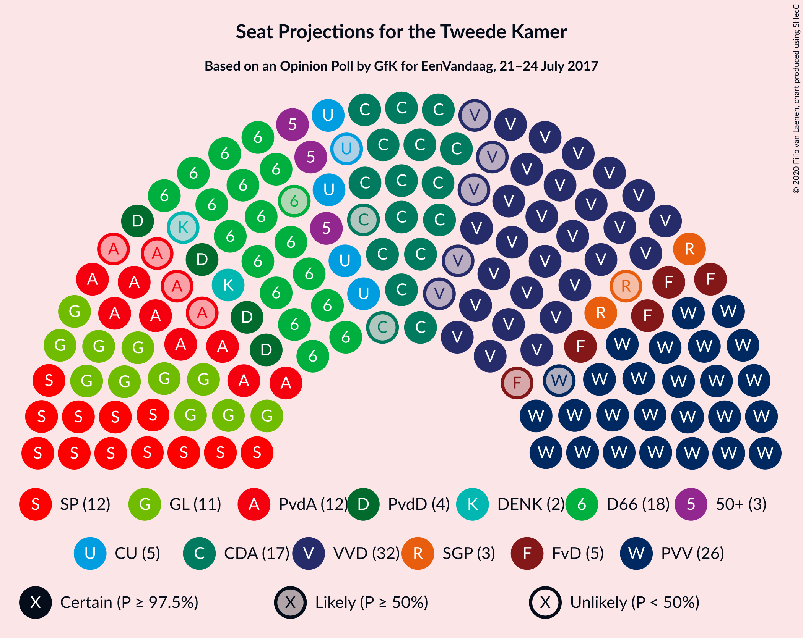

### Confidence Intervals

| Party | Last Result | Median | 80% Confidence Interval | 90% Confidence Interval | 95% Confidence Interval | 99% Confidence Interval |
|:-----:|:-----------:|:------:|:-----------------------:|:-----------------------:|:-----------------------:|:-----------------------:|
| <a href="#volkspartij-voor-vrijheid-en-democratie">Volkspartij voor Vrijheid en Democratie</a> | 33 | 30 | 28–32 |28–33 |27–34 |26–34 |
| <a href="#partij-voor-de-vrijheid">Partij voor de Vrijheid</a> | 20 | 27 | 24–27 |23–28 |21–29 |21–33 |
| <a href="#democraten-66">Democraten 66</a> | 19 | 17 | 17–20 |17–21 |17–21 |15–21 |
| <a href="#christen-democratisch-appèl">Christen-Democratisch Appèl</a> | 19 | 16 | 16–19 |15–20 |15–22 |14–22 |
| <a href="#socialistische-partij">Socialistische Partij</a> | 14 | 13 | 11–14 |11–15 |11–15 |10–16 |
| <a href="#groenlinks">GroenLinks</a> | 14 | 11 | 11–13 |10–14 |10–15 |9–16 |
| <a href="#partij-van-de-arbeid">Partij van de Arbeid</a> | 9 | 12 | 8–14 |8–14 |8–14 |7–14 |
| <a href="#christenunie">ChristenUnie</a> | 5 | 4 | 4–5 |4–6 |3–7 |3–7 |
| <a href="#partij-voor-de-dieren">Partij voor de Dieren</a> | 5 | 6 | 4–6 |3–6 |3–7 |3–8 |
| <a href="#forum-voor-democratie">Forum voor Democratie</a> | 2 | 4 | 4–6 |4–6 |3–6 |3–7 |
| <a href="#50plus">50Plus</a> | 4 | 4 | 3–5 |2–5 |2–5 |2–6 |
| <a href="#staatkundig-gereformeerde-partij">Staatkundig Gereformeerde Partij</a> | 3 | 2 | 2–3 |2–4 |2–4 |1–5 |
| <a href="#denk">DENK</a> | 3 | 2 | 2 |1–3 |1–3 |1–3 |

### Volkspartij voor Vrijheid en Democratie

*For a full overview of the results for this party, see the [Volkspartij voor Vrijheid en Democratie](party-volkspartijvoorvrijheidendemocratie.html) page.*

| Number of Seats | Probability | Accumulated | Special Marks |
|:---------------:|:-----------:|:-----------:|:-------------:|
| 25 | 0.2% | 100% |  |
| 26 | 2% | 99.8% |  |
| 27 | 0.5% | 98% |  |
| 28 | 8% | 97% |  |
| 29 | 11% | 90% |  |
| 30 | 51% | 79% | Median |
| 31 | 17% | 28% |  |
| 32 | 1.1% | 11% |  |
| 33 | 5% | 9% | Last Result |
| 34 | 4% | 4% |  |
| 35 | 0.1% | 0.4% |  |
| 36 | 0.3% | 0.3% |  |
| 37 | 0% | 0% |  |

### Partij voor de Vrijheid

*For a full overview of the results for this party, see the [Partij voor de Vrijheid](party-partijvoordevrijheid.html) page.*

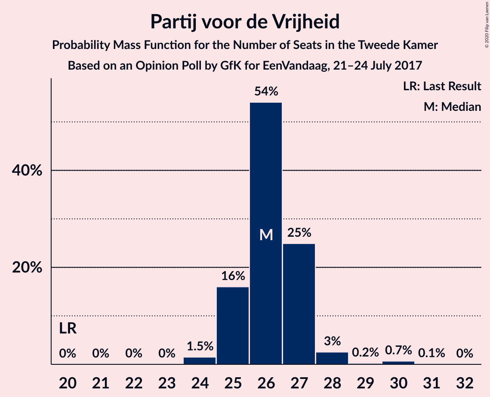

| Number of Seats | Probability | Accumulated | Special Marks |
|:---------------:|:-----------:|:-----------:|:-------------:|
| 20 | 0% | 100% | Last Result |
| 21 | 3% | 100% |  |
| 22 | 1.3% | 97% |  |
| 23 | 1.2% | 96% |  |
| 24 | 19% | 95% |  |
| 25 | 7% | 76% |  |
| 26 | 3% | 68% |  |
| 27 | 57% | 65% | Median |
| 28 | 4% | 7% |  |
| 29 | 2% | 3% |  |
| 30 | 0.4% | 2% |  |
| 31 | 0% | 1.2% |  |
| 32 | 0% | 1.2% |  |
| 33 | 1.2% | 1.2% |  |
| 34 | 0% | 0% |  |

### Democraten 66

*For a full overview of the results for this party, see the [Democraten 66](party-democraten66.html) page.*

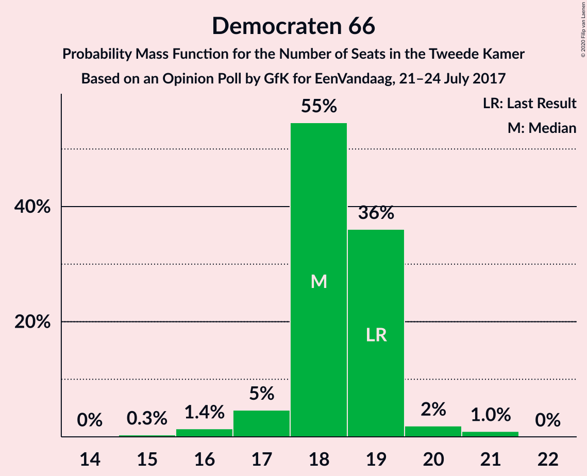

| Number of Seats | Probability | Accumulated | Special Marks |
|:---------------:|:-----------:|:-----------:|:-------------:|
| 15 | 1.2% | 100% |  |
| 16 | 1.1% | 98.8% |  |
| 17 | 55% | 98% | Median |
| 18 | 9% | 43% |  |
| 19 | 19% | 34% | Last Result |
| 20 | 7% | 16% |  |
| 21 | 8% | 9% |  |
| 22 | 0.1% | 0.2% |  |
| 23 | 0% | 0.1% |  |
| 24 | 0.1% | 0.1% |  |
| 25 | 0% | 0% |  |

### Christen-Democratisch Appèl

*For a full overview of the results for this party, see the [Christen-Democratisch Appèl](party-christen-democratischappèl.html) page.*

| Number of Seats | Probability | Accumulated | Special Marks |
|:---------------:|:-----------:|:-----------:|:-------------:|
| 13 | 0.3% | 100% |  |
| 14 | 1.2% | 99.7% |  |
| 15 | 6% | 98.5% |  |
| 16 | 63% | 93% | Median |
| 17 | 4% | 29% |  |
| 18 | 13% | 25% |  |
| 19 | 4% | 12% | Last Result |
| 20 | 5% | 8% |  |
| 21 | 0.1% | 3% |  |
| 22 | 3% | 3% |  |
| 23 | 0% | 0% |  |

### Socialistische Partij

*For a full overview of the results for this party, see the [Socialistische Partij](party-socialistischepartij.html) page.*

| Number of Seats | Probability | Accumulated | Special Marks |
|:---------------:|:-----------:|:-----------:|:-------------:|
| 10 | 2% | 100% |  |
| 11 | 10% | 98% |  |
| 12 | 6% | 88% |  |
| 13 | 70% | 82% | Median |
| 14 | 5% | 12% | Last Result |
| 15 | 5% | 6% |  |
| 16 | 2% | 2% |  |
| 17 | 0% | 0% |  |

### GroenLinks

*For a full overview of the results for this party, see the [GroenLinks](party-groenlinks.html) page.*

| Number of Seats | Probability | Accumulated | Special Marks |
|:---------------:|:-----------:|:-----------:|:-------------:|
| 8 | 0.1% | 100% |  |
| 9 | 2% | 99.9% |  |
| 10 | 3% | 98% |  |
| 11 | 59% | 95% | Median |
| 12 | 13% | 36% |  |
| 13 | 18% | 23% |  |
| 14 | 1.3% | 5% | Last Result |
| 15 | 1.3% | 4% |  |
| 16 | 2% | 2% |  |
| 17 | 0% | 0% |  |

### Partij van de Arbeid

*For a full overview of the results for this party, see the [Partij van de Arbeid](party-partijvandearbeid.html) page.*

| Number of Seats | Probability | Accumulated | Special Marks |
|:---------------:|:-----------:|:-----------:|:-------------:|
| 7 | 0.8% | 100% |  |
| 8 | 11% | 99.2% |  |
| 9 | 10% | 88% | Last Result |
| 10 | 10% | 79% |  |
| 11 | 15% | 69% |  |
| 12 | 6% | 54% | Median |
| 13 | 0.4% | 48% |  |
| 14 | 48% | 48% |  |
| 15 | 0% | 0% |  |

### ChristenUnie

*For a full overview of the results for this party, see the [ChristenUnie](party-christenunie.html) page.*

| Number of Seats | Probability | Accumulated | Special Marks |
|:---------------:|:-----------:|:-----------:|:-------------:|
| 3 | 4% | 100% |  |
| 4 | 60% | 96% | Median |
| 5 | 27% | 36% | Last Result |
| 6 | 5% | 9% |  |
| 7 | 4% | 4% |  |
| 8 | 0.1% | 0.1% |  |
| 9 | 0% | 0% |  |

### Partij voor de Dieren

*For a full overview of the results for this party, see the [Partij voor de Dieren](party-partijvoordedieren.html) page.*

| Number of Seats | Probability | Accumulated | Special Marks |
|:---------------:|:-----------:|:-----------:|:-------------:|
| 3 | 7% | 100% |  |
| 4 | 14% | 93% |  |
| 5 | 17% | 79% | Last Result |
| 6 | 57% | 62% | Median |
| 7 | 4% | 5% |  |
| 8 | 0.6% | 0.6% |  |
| 9 | 0% | 0% |  |

### Forum voor Democratie

*For a full overview of the results for this party, see the [Forum voor Democratie](party-forumvoordemocratie.html) page.*

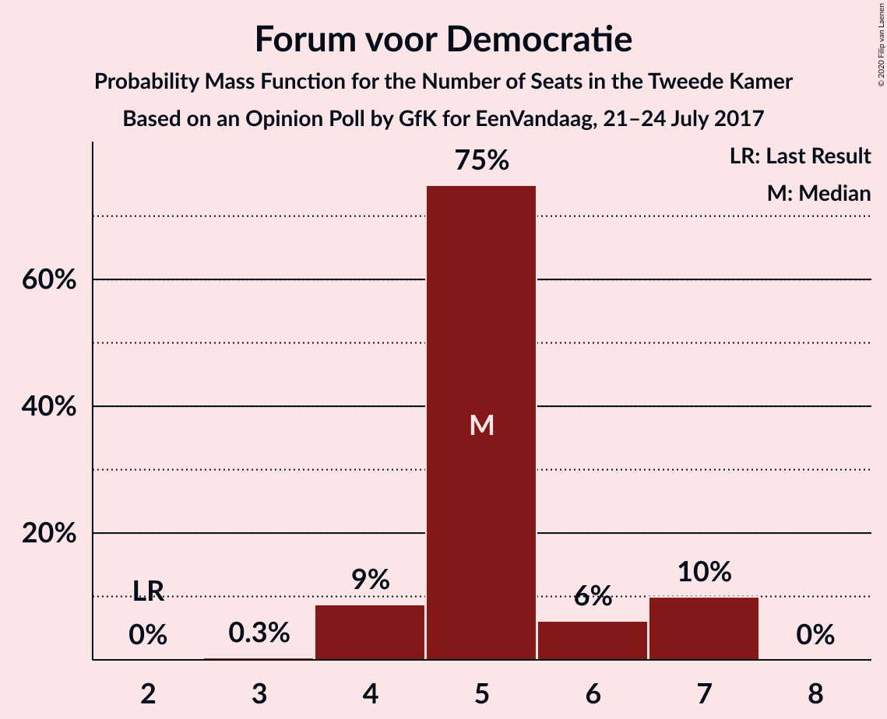

| Number of Seats | Probability | Accumulated | Special Marks |
|:---------------:|:-----------:|:-----------:|:-------------:|
| 2 | 0% | 100% | Last Result |
| 3 | 3% | 100% |  |
| 4 | 64% | 97% | Median |
| 5 | 19% | 33% |  |
| 6 | 12% | 14% |  |
| 7 | 2% | 2% |  |
| 8 | 0% | 0% |  |

### 50Plus

*For a full overview of the results for this party, see the [50Plus](party-50plus.html) page.*

| Number of Seats | Probability | Accumulated | Special Marks |
|:---------------:|:-----------:|:-----------:|:-------------:|
| 2 | 5% | 100% |  |
| 3 | 14% | 95% |  |
| 4 | 66% | 81% | Last Result, Median |
| 5 | 14% | 15% |  |
| 6 | 1.5% | 1.5% |  |
| 7 | 0% | 0% |  |

### Staatkundig Gereformeerde Partij

*For a full overview of the results for this party, see the [Staatkundig Gereformeerde Partij](party-staatkundiggereformeerdepartij.html) page.*

| Number of Seats | Probability | Accumulated | Special Marks |
|:---------------:|:-----------:|:-----------:|:-------------:|
| 1 | 0.9% | 100% |  |
| 2 | 60% | 99.1% | Median |
| 3 | 31% | 39% | Last Result |
| 4 | 7% | 8% |  |
| 5 | 1.2% | 1.2% |  |
| 6 | 0% | 0% |  |

### DENK

*For a full overview of the results for this party, see the [DENK](party-denk.html) page.*

| Number of Seats | Probability | Accumulated | Special Marks |
|:---------------:|:-----------:|:-----------:|:-------------:|
| 0 | 0.3% | 100% |  |
| 1 | 9% | 99.7% |  |
| 2 | 84% | 91% | Median |
| 3 | 7% | 7% | Last Result |
| 4 | 0% | 0% |  |

## Coalitions

### Confidence Intervals

| Coalition | Last Result | Median | Majority? | 80% Confidence Interval | 90% Confidence Interval | 95% Confidence Interval | 99% Confidence Interval |
|:---------:|:-----------:|:------:|:---------:|:-----------------------:|:-----------------------:|:-----------------------:|:-----------------------:|
| Volkspartij voor Vrijheid en Democratie – Democraten 66 – Christen-Democratisch Appèl – GroenLinks – ChristenUnie | 90 | 79 | 99.9% | 78–85 | 78–86 | 78–86 | 77–90 |
| Volkspartij voor Vrijheid en Democratie – Democraten 66 – Christen-Democratisch Appèl – Partij van de Arbeid – ChristenUnie | 85 | 81 | 99.9% | 79–85 | 78–85 | 77–85 | 76–86 |
| Volkspartij voor Vrijheid en Democratie – Partij voor de Vrijheid – Christen-Democratisch Appèl – Forum voor Democratie – Staatkundig Gereformeerde Partij | 77 | 79 | 99.8% | 79–83 | 77–84 | 76–85 | 76–86 |
| Volkspartij voor Vrijheid en Democratie – Partij voor de Vrijheid – Christen-Democratisch Appèl – Forum voor Democratie | 74 | 77 | 93% | 76–81 | 75–81 | 73–83 | 72–83 |
| Democraten 66 – Christen-Democratisch Appèl – Socialistische Partij – GroenLinks – Partij van de Arbeid – ChristenUnie | 80 | 75 | 29% | 74–79 | 72–79 | 71–79 | 70–80 |
| Volkspartij voor Vrijheid en Democratie – Partij voor de Vrijheid – Christen-Democratisch Appèl | 72 | 73 | 12% | 71–76 | 70–76 | 67–78 | 67–79 |
| Volkspartij voor Vrijheid en Democratie – Democraten 66 – Christen-Democratisch Appèl – ChristenUnie | 76 | 67 | 2% | 67–74 | 67–74 | 66–74 | 66–77 |
| Volkspartij voor Vrijheid en Democratie – Democraten 66 – Christen-Democratisch Appèl | 71 | 63 | 0% | 63–70 | 62–70 | 62–70 | 60–72 |
| Democraten 66 – Christen-Democratisch Appèl – GroenLinks – Partij van de Arbeid – ChristenUnie | 66 | 62 | 0% | 61–65 | 60–67 | 58–67 | 57–68 |
| Volkspartij voor Vrijheid en Democratie – Democraten 66 – Partij van de Arbeid | 61 | 61 | 0% | 57–61 | 56–64 | 56–65 | 55–65 |
| Volkspartij voor Vrijheid en Democratie – Christen-Democratisch Appèl – Forum voor Democratie – 50Plus – Staatkundig Gereformeerde Partij | 61 | 56 | 0% | 56–61 | 56–62 | 56–63 | 53–64 |
| Volkspartij voor Vrijheid en Democratie – Christen-Democratisch Appèl – Partij van de Arbeid | 61 | 60 | 0% | 55–60 | 54–60 | 54–62 | 52–62 |
| Volkspartij voor Vrijheid en Democratie – Christen-Democratisch Appèl – Forum voor Democratie – 50Plus | 58 | 54 | 0% | 54–58 | 53–59 | 52–61 | 50–61 |
| Volkspartij voor Vrijheid en Democratie – Christen-Democratisch Appèl – Forum voor Democratie – Staatkundig Gereformeerde Partij | 57 | 52 | 0% | 52–57 | 52–58 | 52–60 | 49–61 |
| Volkspartij voor Vrijheid en Democratie – Christen-Democratisch Appèl – Forum voor Democratie | 54 | 50 | 0% | 50–54 | 49–55 | 48–58 | 46–58 |
| Volkspartij voor Vrijheid en Democratie – Christen-Democratisch Appèl | 52 | 46 | 0% | 46–49 | 44–51 | 43–53 | 42–53 |
| Democraten 66 – Christen-Democratisch Appèl – Partij van de Arbeid | 47 | 47 | 0% | 43–48 | 43–51 | 43–51 | 40–52 |
| Volkspartij voor Vrijheid en Democratie – Partij van de Arbeid | 42 | 44 | 0% | 38–44 | 38–44 | 37–44 | 36–45 |
| Democraten 66 – Christen-Democratisch Appèl | 38 | 33 | 0% | 33–38 | 33–39 | 33–39 | 31–41 |
| Christen-Democratisch Appèl – Partij van de Arbeid – ChristenUnie | 33 | 34 | 0% | 29–35 | 29–36 | 28–36 | 27–37 |
| Christen-Democratisch Appèl – Partij van de Arbeid | 28 | 30 | 0% | 24–31 | 24–31 | 24–31 | 22–31 |

### Volkspartij voor Vrijheid en Democratie – Democraten 66 – Christen-Democratisch Appèl – GroenLinks – ChristenUnie

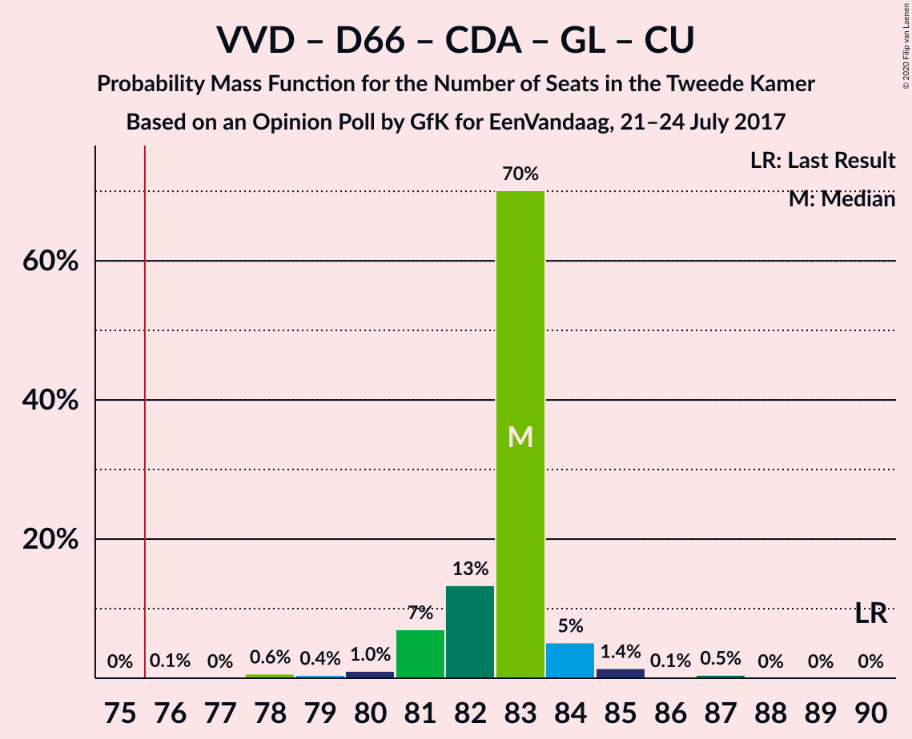

| Number of Seats | Probability | Accumulated | Special Marks |
|:---------------:|:-----------:|:-----------:|:-------------:|
| 74 | 0.1% | 100% |  |
| 75 | 0% | 99.9% |  |
| 76 | 0% | 99.9% | Majority |
| 77 | 1.0% | 99.9% |  |
| 78 | 48% | 98.9% | Median |
| 79 | 2% | 51% |  |
| 80 | 2% | 49% |  |
| 81 | 4% | 47% |  |
| 82 | 5% | 43% |  |
| 83 | 6% | 38% |  |
| 84 | 13% | 32% |  |
| 85 | 10% | 19% |  |
| 86 | 6% | 9% |  |
| 87 | 0.8% | 2% |  |
| 88 | 0.7% | 2% |  |
| 89 | 0% | 0.9% |  |
| 90 | 0.9% | 0.9% | Last Result |
| 91 | 0% | 0% |  |

### Volkspartij voor Vrijheid en Democratie – Democraten 66 – Christen-Democratisch Appèl – Partij van de Arbeid – ChristenUnie

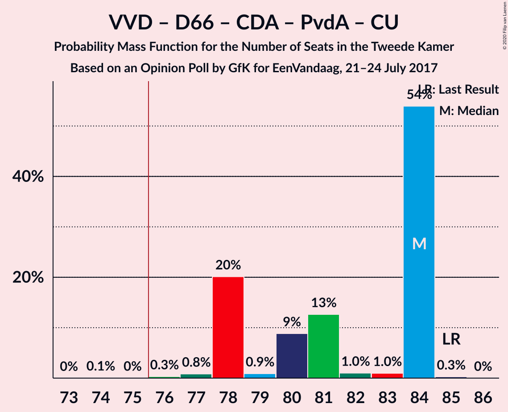

| Number of Seats | Probability | Accumulated | Special Marks |
|:---------------:|:-----------:|:-----------:|:-------------:|
| 74 | 0% | 100% |  |
| 75 | 0% | 99.9% |  |
| 76 | 1.4% | 99.9% | Majority |
| 77 | 2% | 98.5% |  |
| 78 | 6% | 97% |  |
| 79 | 9% | 91% | Median |
| 80 | 3% | 82% |  |
| 81 | 56% | 79% |  |
| 82 | 4% | 23% |  |
| 83 | 6% | 19% |  |
| 84 | 1.4% | 13% |  |
| 85 | 11% | 12% | Last Result |
| 86 | 0.7% | 0.7% |  |
| 87 | 0% | 0% |  |

### Volkspartij voor Vrijheid en Democratie – Partij voor de Vrijheid – Christen-Democratisch Appèl – Forum voor Democratie – Staatkundig Gereformeerde Partij

| Number of Seats | Probability | Accumulated | Special Marks |
|:---------------:|:-----------:|:-----------:|:-------------:|
| 75 | 0.1% | 100% |  |
| 76 | 3% | 99.8% | Majority |
| 77 | 3% | 97% | Last Result |
| 78 | 1.3% | 94% |  |
| 79 | 57% | 93% | Median |
| 80 | 11% | 35% |  |
| 81 | 5% | 24% |  |
| 82 | 3% | 19% |  |
| 83 | 6% | 15% |  |
| 84 | 5% | 9% |  |
| 85 | 3% | 5% |  |
| 86 | 1.3% | 1.3% |  |
| 87 | 0% | 0.1% |  |
| 88 | 0% | 0% |  |

### Volkspartij voor Vrijheid en Democratie – Partij voor de Vrijheid – Christen-Democratisch Appèl – Forum voor Democratie

| Number of Seats | Probability | Accumulated | Special Marks |
|:---------------:|:-----------:|:-----------:|:-------------:|
| 72 | 2% | 100% |  |
| 73 | 0.8% | 98% |  |
| 74 | 0.2% | 97% | Last Result |
| 75 | 3% | 97% |  |
| 76 | 10% | 93% | Majority |
| 77 | 60% | 83% | Median |
| 78 | 3% | 23% |  |
| 79 | 5% | 20% |  |
| 80 | 4% | 16% |  |
| 81 | 9% | 12% |  |
| 82 | 0.5% | 3% |  |
| 83 | 3% | 3% |  |
| 84 | 0.2% | 0.3% |  |
| 85 | 0% | 0% |  |

### Democraten 66 – Christen-Democratisch Appèl – Socialistische Partij – GroenLinks – Partij van de Arbeid – ChristenUnie

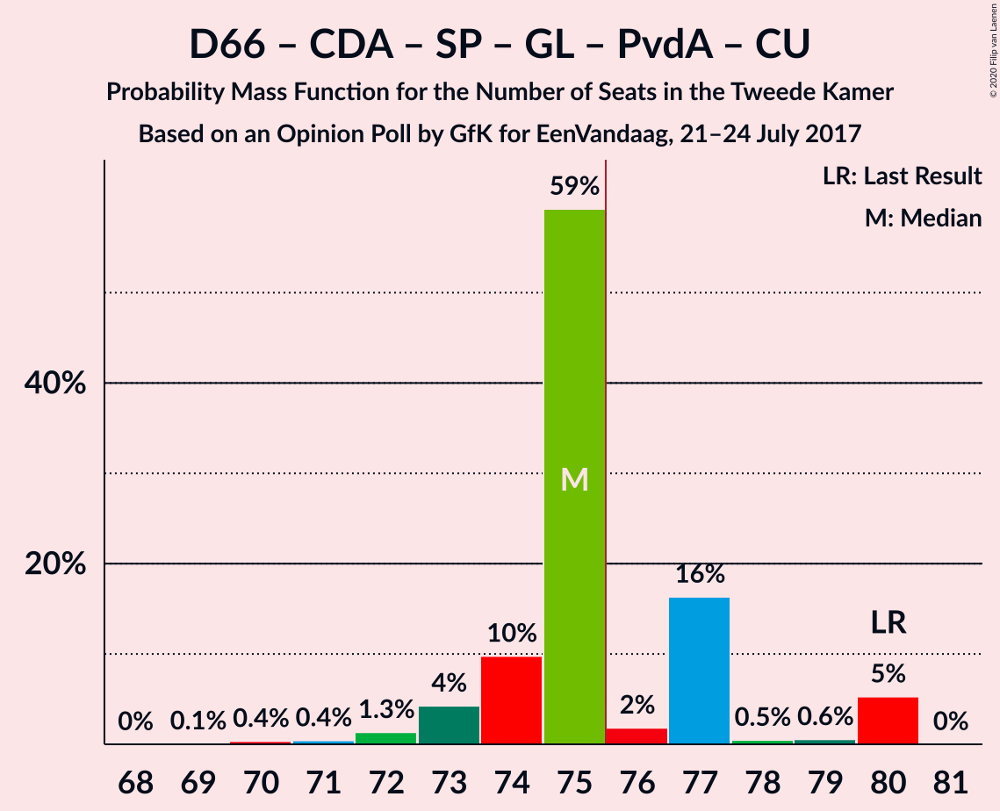

| Number of Seats | Probability | Accumulated | Special Marks |
|:---------------:|:-----------:|:-----------:|:-------------:|
| 70 | 1.1% | 100% |  |
| 71 | 2% | 98.9% |  |
| 72 | 3% | 97% |  |
| 73 | 1.4% | 93% | Median |
| 74 | 10% | 92% |  |
| 75 | 53% | 82% |  |
| 76 | 3% | 29% | Majority |
| 77 | 5% | 25% |  |
| 78 | 8% | 20% |  |
| 79 | 11% | 12% |  |
| 80 | 0.6% | 0.6% | Last Result |
| 81 | 0% | 0% |  |

### Volkspartij voor Vrijheid en Democratie – Partij voor de Vrijheid – Christen-Democratisch Appèl

| Number of Seats | Probability | Accumulated | Special Marks |
|:---------------:|:-----------:|:-----------:|:-------------:|
| 67 | 3% | 100% |  |
| 68 | 0.2% | 97% |  |
| 69 | 0.6% | 97% |  |
| 70 | 4% | 97% |  |
| 71 | 9% | 92% |  |
| 72 | 10% | 84% | Last Result |
| 73 | 53% | 73% | Median |
| 74 | 4% | 20% |  |
| 75 | 5% | 17% |  |
| 76 | 7% | 12% | Majority |
| 77 | 1.1% | 5% |  |
| 78 | 3% | 4% |  |
| 79 | 0.5% | 0.5% |  |
| 80 | 0% | 0% |  |

### Volkspartij voor Vrijheid en Democratie – Democraten 66 – Christen-Democratisch Appèl – ChristenUnie

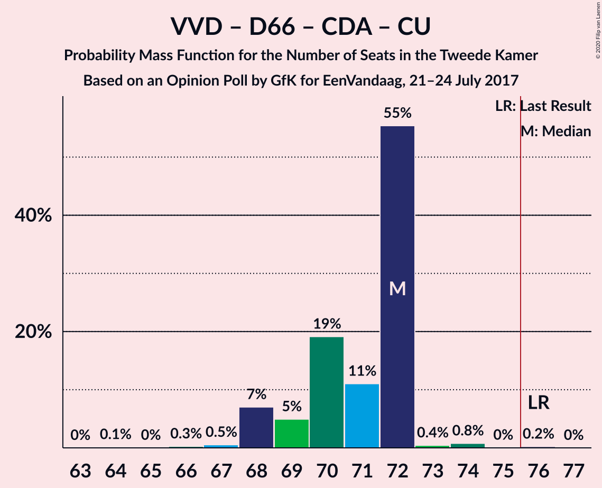

| Number of Seats | Probability | Accumulated | Special Marks |
|:---------------:|:-----------:|:-----------:|:-------------:|
| 64 | 0.1% | 100% |  |
| 65 | 0% | 99.9% |  |
| 66 | 3% | 99.8% |  |
| 67 | 50% | 97% | Median |
| 68 | 2% | 46% |  |
| 69 | 1.0% | 45% |  |
| 70 | 4% | 44% |  |
| 71 | 13% | 40% |  |
| 72 | 10% | 27% |  |
| 73 | 5% | 17% |  |
| 74 | 10% | 11% |  |
| 75 | 0.1% | 2% |  |
| 76 | 0.7% | 2% | Last Result, Majority |
| 77 | 0.9% | 0.9% |  |
| 78 | 0% | 0% |  |

### Volkspartij voor Vrijheid en Democratie – Democraten 66 – Christen-Democratisch Appèl

| Number of Seats | Probability | Accumulated | Special Marks |
|:---------------:|:-----------:|:-----------:|:-------------:|
| 60 | 0.8% | 100% |  |
| 61 | 1.2% | 99.2% |  |
| 62 | 4% | 98% |  |
| 63 | 49% | 94% | Median |
| 64 | 0.7% | 45% |  |
| 65 | 7% | 44% |  |
| 66 | 14% | 37% |  |
| 67 | 4% | 23% |  |
| 68 | 7% | 19% |  |
| 69 | 1.4% | 12% |  |
| 70 | 9% | 11% |  |
| 71 | 0.6% | 1.4% | Last Result |
| 72 | 0.9% | 0.9% |  |
| 73 | 0% | 0% |  |

### Democraten 66 – Christen-Democratisch Appèl – GroenLinks – Partij van de Arbeid – ChristenUnie

| Number of Seats | Probability | Accumulated | Special Marks |
|:---------------:|:-----------:|:-----------:|:-------------:|
| 56 | 0.1% | 100% |  |
| 57 | 2% | 99.9% |  |
| 58 | 2% | 98% |  |
| 59 | 0.5% | 96% |  |
| 60 | 3% | 96% | Median |
| 61 | 9% | 93% |  |
| 62 | 50% | 84% |  |
| 63 | 8% | 35% |  |
| 64 | 11% | 27% |  |
| 65 | 6% | 15% |  |
| 66 | 3% | 9% | Last Result |
| 67 | 4% | 6% |  |
| 68 | 2% | 2% |  |
| 69 | 0% | 0% |  |

### Volkspartij voor Vrijheid en Democratie – Democraten 66 – Partij van de Arbeid

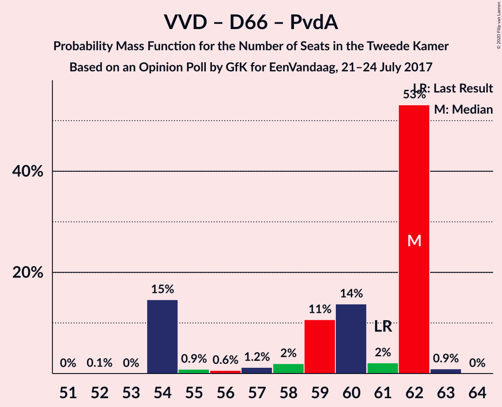

| Number of Seats | Probability | Accumulated | Special Marks |
|:---------------:|:-----------:|:-----------:|:-------------:|
| 52 | 0.2% | 100% |  |
| 53 | 0.1% | 99.8% |  |
| 54 | 0.1% | 99.7% |  |
| 55 | 2% | 99.6% |  |
| 56 | 5% | 98% |  |
| 57 | 9% | 93% |  |
| 58 | 14% | 84% |  |
| 59 | 5% | 70% | Median |
| 60 | 2% | 65% |  |
| 61 | 53% | 63% | Last Result |
| 62 | 2% | 10% |  |
| 63 | 3% | 8% |  |
| 64 | 0.4% | 5% |  |
| 65 | 4% | 5% |  |
| 66 | 0.3% | 0.3% |  |
| 67 | 0% | 0% |  |

### Volkspartij voor Vrijheid en Democratie – Christen-Democratisch Appèl – Forum voor Democratie – 50Plus – Staatkundig Gereformeerde Partij

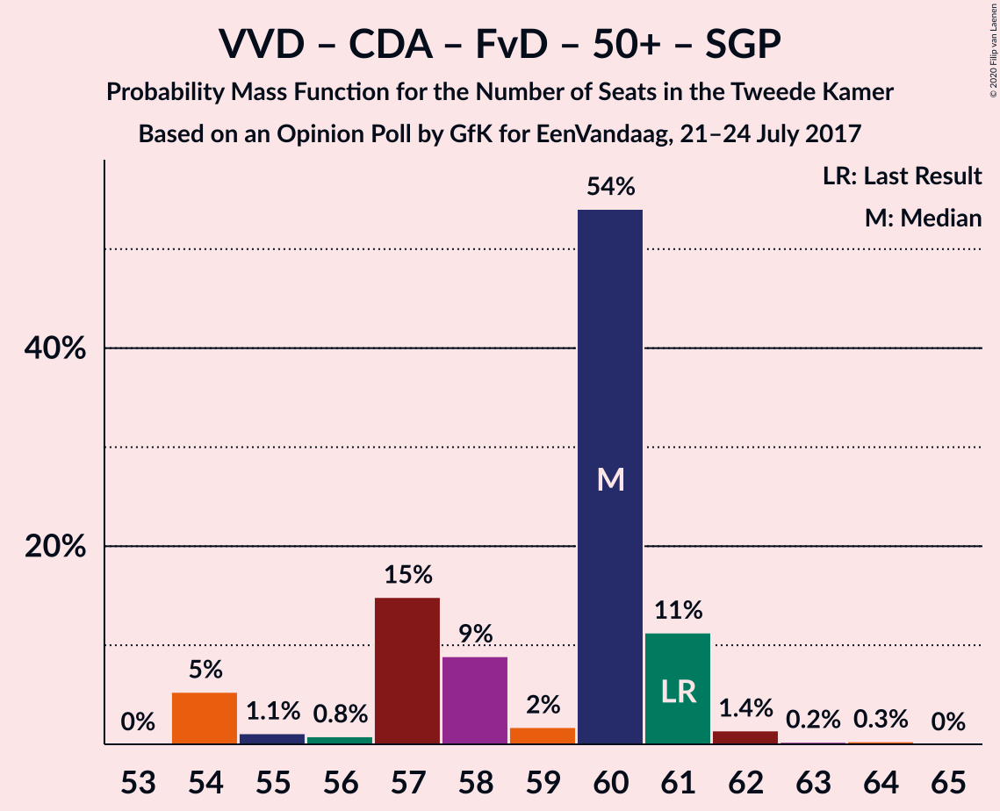

| Number of Seats | Probability | Accumulated | Special Marks |
|:---------------:|:-----------:|:-----------:|:-------------:|
| 53 | 1.2% | 100% |  |
| 54 | 0.2% | 98.8% |  |
| 55 | 1.1% | 98.6% |  |
| 56 | 51% | 98% | Median |
| 57 | 7% | 46% |  |
| 58 | 3% | 39% |  |
| 59 | 10% | 36% |  |
| 60 | 8% | 26% |  |
| 61 | 11% | 18% | Last Result |
| 62 | 3% | 7% |  |
| 63 | 3% | 4% |  |
| 64 | 1.0% | 1.0% |  |
| 65 | 0.1% | 0.1% |  |
| 66 | 0% | 0% |  |

### Volkspartij voor Vrijheid en Democratie – Christen-Democratisch Appèl – Partij van de Arbeid

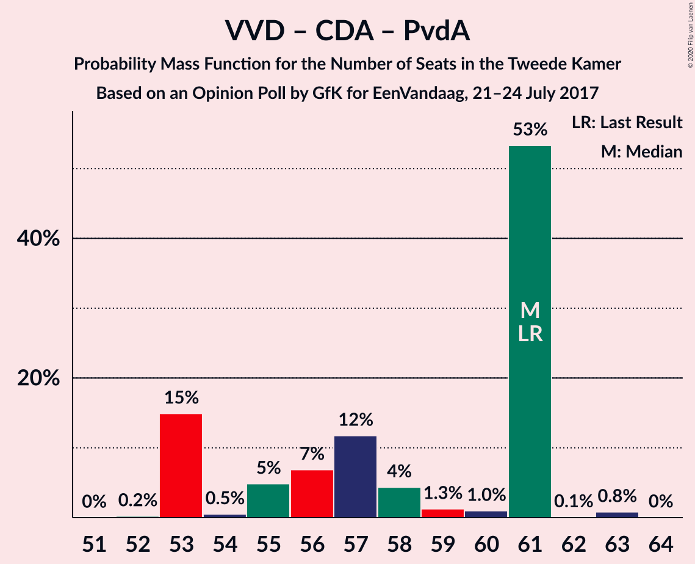

| Number of Seats | Probability | Accumulated | Special Marks |
|:---------------:|:-----------:|:-----------:|:-------------:|
| 52 | 1.4% | 100% |  |
| 53 | 0.8% | 98.5% |  |
| 54 | 4% | 98% |  |
| 55 | 11% | 94% |  |
| 56 | 7% | 82% |  |
| 57 | 1.1% | 76% |  |
| 58 | 2% | 75% | Median |
| 59 | 6% | 73% |  |
| 60 | 62% | 67% |  |
| 61 | 1.2% | 5% | Last Result |
| 62 | 3% | 4% |  |
| 63 | 0.3% | 0.3% |  |
| 64 | 0% | 0% |  |

### Volkspartij voor Vrijheid en Democratie – Christen-Democratisch Appèl – Forum voor Democratie – 50Plus

| Number of Seats | Probability | Accumulated | Special Marks |
|:---------------:|:-----------:|:-----------:|:-------------:|
| 50 | 1.2% | 100% |  |
| 51 | 0.1% | 98.8% |  |
| 52 | 3% | 98.6% |  |
| 53 | 2% | 96% |  |
| 54 | 54% | 94% | Median |
| 55 | 3% | 40% |  |
| 56 | 11% | 37% |  |
| 57 | 6% | 26% |  |
| 58 | 14% | 20% | Last Result |
| 59 | 2% | 6% |  |
| 60 | 0.9% | 4% |  |
| 61 | 3% | 3% |  |
| 62 | 0.1% | 0.1% |  |
| 63 | 0% | 0% |  |

### Volkspartij voor Vrijheid en Democratie – Christen-Democratisch Appèl – Forum voor Democratie – Staatkundig Gereformeerde Partij

| Number of Seats | Probability | Accumulated | Special Marks |
|:---------------:|:-----------:|:-----------:|:-------------:|
| 49 | 1.2% | 100% |  |
| 50 | 0.1% | 98.8% |  |
| 51 | 0.2% | 98.6% |  |
| 52 | 53% | 98% | Median |
| 53 | 3% | 46% |  |
| 54 | 7% | 43% |  |
| 55 | 7% | 36% |  |
| 56 | 16% | 29% |  |
| 57 | 7% | 14% | Last Result |
| 58 | 2% | 6% |  |
| 59 | 0.4% | 4% |  |
| 60 | 3% | 4% |  |
| 61 | 1.0% | 1.0% |  |
| 62 | 0% | 0% |  |

### Volkspartij voor Vrijheid en Democratie – Christen-Democratisch Appèl – Forum voor Democratie

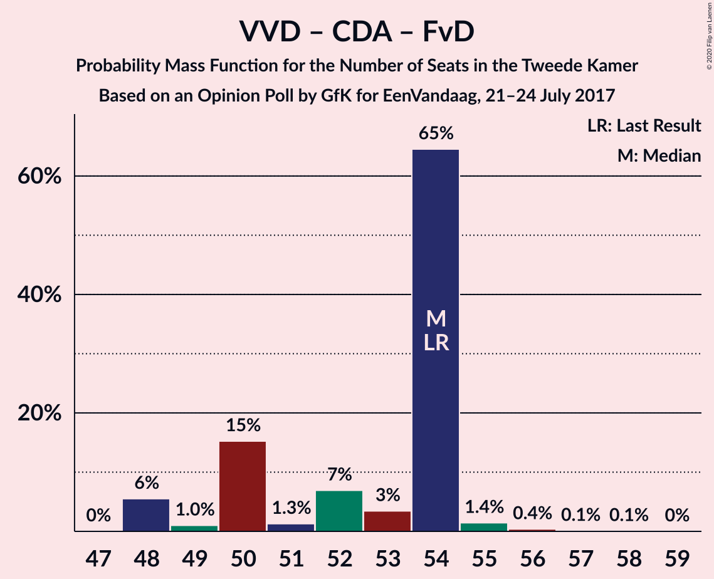

| Number of Seats | Probability | Accumulated | Special Marks |
|:---------------:|:-----------:|:-----------:|:-------------:|
| 46 | 1.2% | 100% |  |
| 47 | 0.2% | 98.8% |  |
| 48 | 3% | 98.6% |  |
| 49 | 2% | 96% |  |
| 50 | 50% | 94% | Median |
| 51 | 6% | 44% |  |
| 52 | 7% | 38% |  |
| 53 | 17% | 31% |  |
| 54 | 8% | 14% | Last Result |
| 55 | 1.5% | 6% |  |
| 56 | 0.9% | 5% |  |
| 57 | 0.3% | 4% |  |
| 58 | 3% | 3% |  |
| 59 | 0.1% | 0.1% |  |
| 60 | 0% | 0% |  |

### Volkspartij voor Vrijheid en Democratie – Christen-Democratisch Appèl

| Number of Seats | Probability | Accumulated | Special Marks |
|:---------------:|:-----------:|:-----------:|:-------------:|
| 41 | 0.1% | 100% |  |
| 42 | 1.5% | 99.9% |  |
| 43 | 3% | 98% |  |
| 44 | 1.1% | 95% |  |
| 45 | 1.3% | 94% |  |
| 46 | 51% | 93% | Median |
| 47 | 14% | 42% |  |
| 48 | 9% | 27% |  |
| 49 | 12% | 18% |  |
| 50 | 0.8% | 6% |  |
| 51 | 1.4% | 6% |  |
| 52 | 2% | 4% | Last Result |
| 53 | 3% | 3% |  |
| 54 | 0% | 0% |  |

### Democraten 66 – Christen-Democratisch Appèl – Partij van de Arbeid

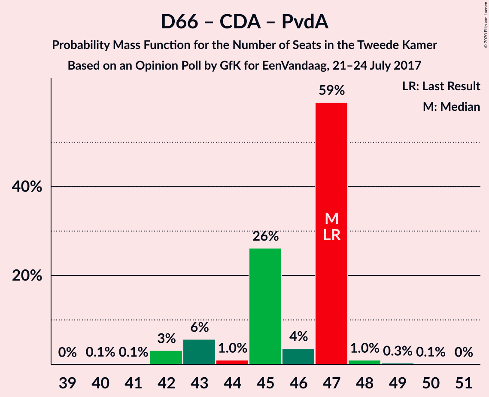

| Number of Seats | Probability | Accumulated | Special Marks |
|:---------------:|:-----------:|:-----------:|:-------------:|
| 39 | 0% | 100% |  |
| 40 | 0.6% | 99.9% |  |
| 41 | 0% | 99.3% |  |
| 42 | 2% | 99.3% |  |
| 43 | 9% | 98% |  |
| 44 | 4% | 88% |  |
| 45 | 9% | 84% | Median |
| 46 | 6% | 75% |  |
| 47 | 51% | 69% | Last Result |
| 48 | 9% | 18% |  |
| 49 | 3% | 9% |  |
| 50 | 0.2% | 6% |  |
| 51 | 4% | 5% |  |
| 52 | 2% | 2% |  |
| 53 | 0% | 0% |  |

### Volkspartij voor Vrijheid en Democratie – Partij van de Arbeid

| Number of Seats | Probability | Accumulated | Special Marks |
|:---------------:|:-----------:|:-----------:|:-------------:|
| 35 | 0.3% | 100% |  |
| 36 | 2% | 99.7% |  |
| 37 | 2% | 98% |  |
| 38 | 6% | 96% |  |
| 39 | 16% | 90% |  |
| 40 | 7% | 74% |  |
| 41 | 6% | 68% |  |
| 42 | 5% | 62% | Last Result, Median |
| 43 | 0.5% | 56% |  |
| 44 | 55% | 56% |  |
| 45 | 0.5% | 0.8% |  |
| 46 | 0.3% | 0.3% |  |
| 47 | 0% | 0% |  |

### Democraten 66 – Christen-Democratisch Appèl

| Number of Seats | Probability | Accumulated | Special Marks |
|:---------------:|:-----------:|:-----------:|:-------------:|
| 31 | 1.0% | 100% |  |
| 32 | 0.4% | 99.0% |  |
| 33 | 50% | 98.6% | Median |
| 34 | 6% | 48% |  |
| 35 | 13% | 42% |  |
| 36 | 7% | 29% |  |
| 37 | 7% | 22% |  |
| 38 | 5% | 15% | Last Result |
| 39 | 8% | 10% |  |
| 40 | 0.1% | 2% |  |
| 41 | 2% | 2% |  |
| 42 | 0% | 0% |  |

### Christen-Democratisch Appèl – Partij van de Arbeid – ChristenUnie

| Number of Seats | Probability | Accumulated | Special Marks |
|:---------------:|:-----------:|:-----------:|:-------------:|
| 27 | 0.6% | 100% |  |
| 28 | 2% | 99.3% |  |
| 29 | 10% | 97% |  |
| 30 | 3% | 88% |  |
| 31 | 11% | 84% |  |
| 32 | 3% | 73% | Median |
| 33 | 3% | 70% | Last Result |
| 34 | 56% | 67% |  |
| 35 | 5% | 12% |  |
| 36 | 4% | 7% |  |
| 37 | 2% | 2% |  |
| 38 | 0% | 0% |  |

### Christen-Democratisch Appèl – Partij van de Arbeid

| Number of Seats | Probability | Accumulated | Special Marks |
|:---------------:|:-----------:|:-----------:|:-------------:|
| 22 | 0.6% | 100% |  |
| 23 | 0.3% | 99.4% |  |
| 24 | 9% | 99.1% |  |
| 25 | 5% | 90% |  |
| 26 | 5% | 85% |  |
| 27 | 14% | 80% |  |
| 28 | 3% | 67% | Last Result, Median |
| 29 | 4% | 64% |  |
| 30 | 50% | 60% |  |
| 31 | 10% | 10% |  |
| 32 | 0.3% | 0.3% |  |
| 33 | 0% | 0% |  |

## Technical Information

### Opinion Poll

+ **Polling firm:** GfK
+ **Commissioner(s):** EenVandaag
+ **Fieldwork period:** 21–24 July 2017

### Calculations

+ **Sample size:** 1886
+ **Simulations done:** 131,072
+ **Error estimate:** 3.86%

