# Opinion Poll by Ipsos, 10 August 2017

<a href="#voting-intentions">Voting Intentions</a> | <a href="#seats">Seats</a> | <a href="#coalitions">Coalitions</a> | <a href="#technical-information">Technical Information</a>

## Voting Intentions

### Confidence Intervals

| Party | Last Result | Poll Result | 80% Confidence Interval | 90% Confidence Interval | 95% Confidence Interval | 99% Confidence Interval |
|:-----:|:-----------:|:-----------:|:-----------------------:|:-----------------------:|:-----------------------:|:-----------------------:|
| Volkspartij voor Vrijheid en Democratie | 21.3% | 22.2% | 20.6–24.0% |20.1–24.4% |19.7–24.9% |19.0–25.7% |
| Partij voor de Vrijheid | 13.1% | 13.7% | 12.4–15.2% |12.0–15.6% |11.7–16.0% |11.1–16.7% |
| Democraten 66 | 12.2% | 13.1% | 11.8–14.6% |11.4–15.0% |11.1–15.3% |10.6–16.1% |
| Christen-Democratisch Appèl | 12.4% | 10.0% | 8.9–11.3% |8.6–11.7% |8.3–12.0% |7.8–12.7% |
| GroenLinks | 9.1% | 8.4% | 7.4–9.6% |7.1–10.0% |6.8–10.3% |6.4–10.9% |
| Socialistische Partij | 9.1% | 5.7% | 4.9–6.8% |4.6–7.1% |4.4–7.3% |4.1–7.9% |
| Partij van de Arbeid | 5.7% | 4.9% | 4.1–5.9% |3.9–6.2% |3.7–6.4% |3.4–6.9% |
| Partij voor de Dieren | 3.2% | 4.9% | 4.1–5.9% |3.9–6.2% |3.7–6.4% |3.4–6.9% |
| Forum voor Democratie | 1.8% | 4.8% | 4.0–5.8% |3.8–6.1% |3.6–6.3% |3.3–6.8% |
| ChristenUnie | 3.4% | 4.2% | 3.5–5.1% |3.3–5.4% |3.1–5.6% |2.8–6.1% |
| DENK | 2.1% | 3.1% | 2.5–3.9% |2.3–4.2% |2.2–4.4% |1.9–4.8% |
| 50Plus | 3.1% | 2.4% | 1.9–3.2% |1.7–3.4% |1.6–3.6% |1.4–3.9% |
| Staatkundig Gereformeerde Partij | 2.1% | 1.4% | 1.0–2.0% |0.9–2.2% |0.8–2.3% |0.7–2.7% |

*Note:* The poll result column reflects the actual value used in the calculations. Published results may vary slightly, and in addition be rounded to fewer digits.

## Seats

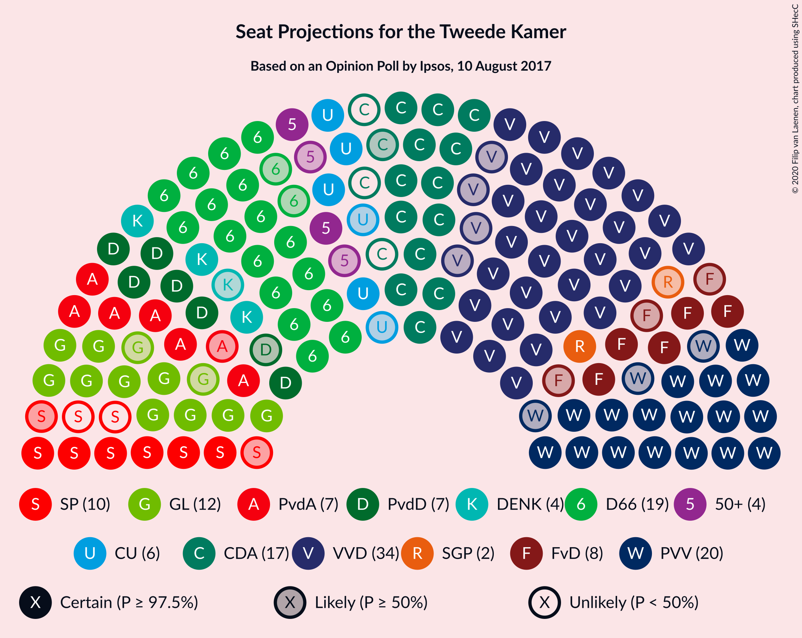

### Confidence Intervals

| Party | Last Result | Median | 80% Confidence Interval | 90% Confidence Interval | 95% Confidence Interval | 99% Confidence Interval |
|:-----:|:-----------:|:------:|:-----------------------:|:-----------------------:|:-----------------------:|:-----------------------:|
| <a href="#volkspartij-voor-vrijheid-en-democratie">Volkspartij voor Vrijheid en Democratie</a> | 33 | 34 | 32–35 |31–37 |29–37 |27–39 |
| <a href="#partij-voor-de-vrijheid">Partij voor de Vrijheid</a> | 20 | 20 | 19–22 |18–24 |17–24 |17–26 |
| <a href="#democraten-66">Democraten 66</a> | 19 | 20 | 18–21 |17–23 |17–24 |16–25 |
| <a href="#christen-democratisch-appèl">Christen-Democratisch Appèl</a> | 19 | 16 | 14–16 |14–17 |13–18 |12–19 |
| <a href="#groenlinks">GroenLinks</a> | 14 | 10 | 10–14 |10–15 |10–16 |9–17 |
| <a href="#socialistische-partij">Socialistische Partij</a> | 14 | 10 | 7–10 |6–10 |6–11 |6–12 |
| <a href="#partij-van-de-arbeid">Partij van de Arbeid</a> | 9 | 7 | 6–8 |5–9 |4–9 |4–11 |
| <a href="#partij-voor-de-dieren">Partij voor de Dieren</a> | 5 | 9 | 7–9 |6–9 |6–9 |5–10 |
| <a href="#forum-voor-democratie">Forum voor Democratie</a> | 2 | 5 | 5–9 |5–10 |5–10 |5–10 |
| <a href="#christenunie">ChristenUnie</a> | 5 | 5 | 5–6 |5–7 |5–7 |4–10 |
| <a href="#denk">DENK</a> | 3 | 5 | 4–6 |3–6 |3–7 |3–8 |
| <a href="#50plus">50Plus</a> | 4 | 4 | 3–4 |2–5 |2–5 |2–6 |
| <a href="#staatkundig-gereformeerde-partij">Staatkundig Gereformeerde Partij</a> | 3 | 2 | 1–2 |1–3 |1–3 |1–4 |

### Volkspartij voor Vrijheid en Democratie

*For a full overview of the results for this party, see the [Volkspartij voor Vrijheid en Democratie](party-volkspartijvoorvrijheidendemocratie.html) page.*

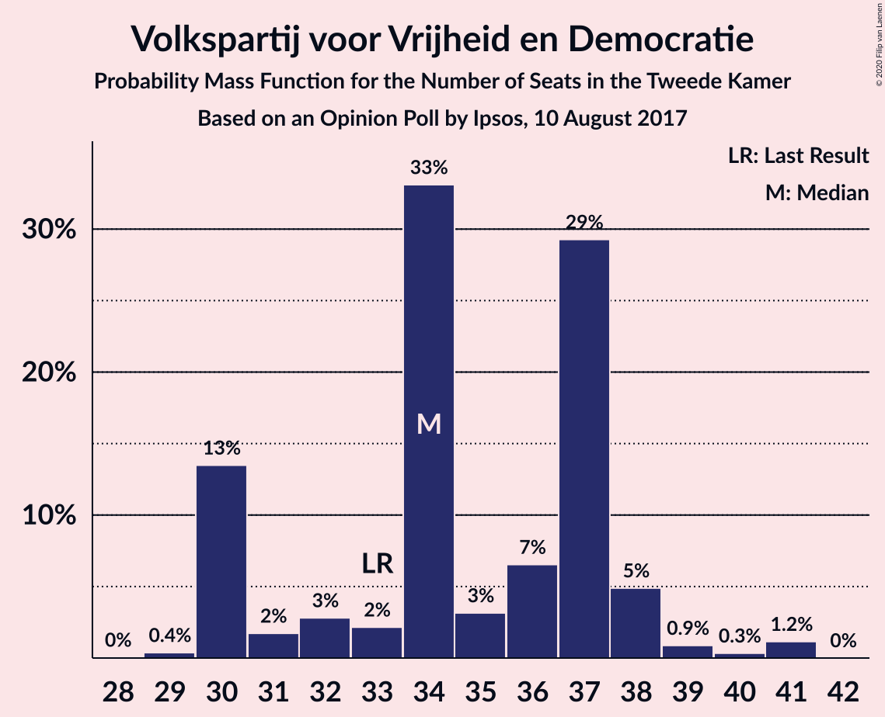

| Number of Seats | Probability | Accumulated | Special Marks |
|:---------------:|:-----------:|:-----------:|:-------------:|
| 27 | 0.5% | 100% |  |
| 28 | 0.6% | 99.5% |  |
| 29 | 2% | 98.9% |  |
| 30 | 0.7% | 97% |  |
| 31 | 5% | 97% |  |
| 32 | 6% | 91% |  |
| 33 | 8% | 85% | Last Result |
| 34 | 65% | 78% | Median |
| 35 | 4% | 13% |  |
| 36 | 0.3% | 9% |  |
| 37 | 7% | 9% |  |
| 38 | 0.5% | 1.5% |  |
| 39 | 0.8% | 0.9% |  |
| 40 | 0% | 0.1% |  |
| 41 | 0% | 0.1% |  |
| 42 | 0% | 0% |  |

### Partij voor de Vrijheid

*For a full overview of the results for this party, see the [Partij voor de Vrijheid](party-partijvoordevrijheid.html) page.*

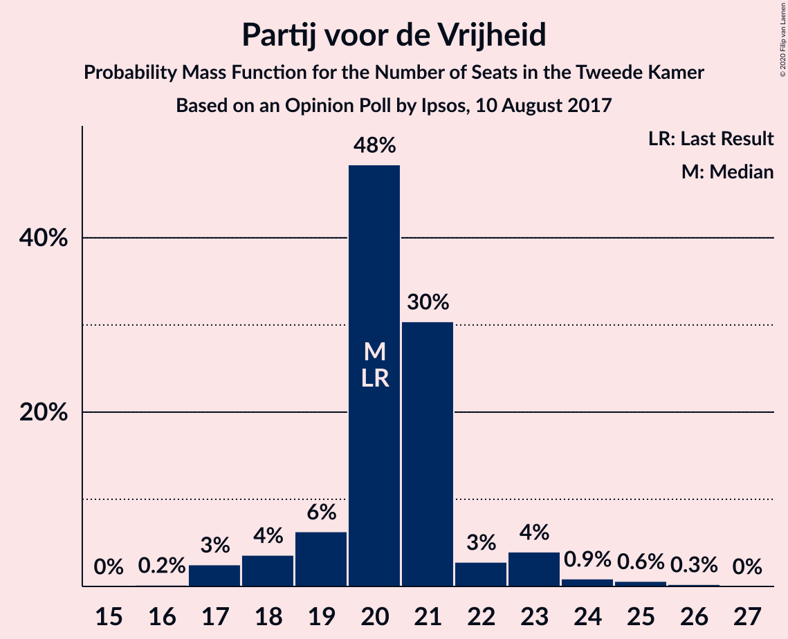

| Number of Seats | Probability | Accumulated | Special Marks |
|:---------------:|:-----------:|:-----------:|:-------------:|
| 16 | 0.2% | 100% |  |
| 17 | 3% | 99.7% |  |
| 18 | 3% | 97% |  |
| 19 | 5% | 94% |  |
| 20 | 68% | 89% | Last Result, Median |
| 21 | 5% | 21% |  |
| 22 | 10% | 17% |  |
| 23 | 2% | 7% |  |
| 24 | 4% | 5% |  |
| 25 | 0.1% | 2% |  |
| 26 | 1.4% | 1.5% |  |
| 27 | 0% | 0% |  |

### Democraten 66

*For a full overview of the results for this party, see the [Democraten 66](party-democraten66.html) page.*

| Number of Seats | Probability | Accumulated | Special Marks |
|:---------------:|:-----------:|:-----------:|:-------------:|
| 14 | 0.1% | 100% |  |
| 15 | 0% | 99.9% |  |
| 16 | 2% | 99.8% |  |
| 17 | 7% | 98% |  |
| 18 | 2% | 90% |  |
| 19 | 4% | 89% | Last Result |
| 20 | 70% | 84% | Median |
| 21 | 4% | 14% |  |
| 22 | 1.2% | 9% |  |
| 23 | 3% | 8% |  |
| 24 | 4% | 5% |  |
| 25 | 1.2% | 1.3% |  |
| 26 | 0% | 0% |  |

### Christen-Democratisch Appèl

*For a full overview of the results for this party, see the [Christen-Democratisch Appèl](party-christen-democratischappèl.html) page.*

| Number of Seats | Probability | Accumulated | Special Marks |
|:---------------:|:-----------:|:-----------:|:-------------:|
| 10 | 0.1% | 100% |  |
| 11 | 0% | 99.9% |  |
| 12 | 2% | 99.9% |  |
| 13 | 0.7% | 98% |  |
| 14 | 10% | 97% |  |
| 15 | 2% | 87% |  |
| 16 | 77% | 85% | Median |
| 17 | 3% | 7% |  |
| 18 | 3% | 4% |  |
| 19 | 0.7% | 0.8% | Last Result |
| 20 | 0% | 0.1% |  |
| 21 | 0% | 0% |  |

### GroenLinks

*For a full overview of the results for this party, see the [GroenLinks](party-groenlinks.html) page.*

| Number of Seats | Probability | Accumulated | Special Marks |
|:---------------:|:-----------:|:-----------:|:-------------:|
| 8 | 0.2% | 100% |  |
| 9 | 0.7% | 99.8% |  |
| 10 | 68% | 99.0% | Median |
| 11 | 5% | 31% |  |
| 12 | 10% | 26% |  |
| 13 | 2% | 15% |  |
| 14 | 6% | 13% | Last Result |
| 15 | 4% | 7% |  |
| 16 | 2% | 3% |  |
| 17 | 0.9% | 1.1% |  |
| 18 | 0% | 0.2% |  |
| 19 | 0.2% | 0.2% |  |
| 20 | 0% | 0% |  |

### Socialistische Partij

*For a full overview of the results for this party, see the [Socialistische Partij](party-socialistischepartij.html) page.*

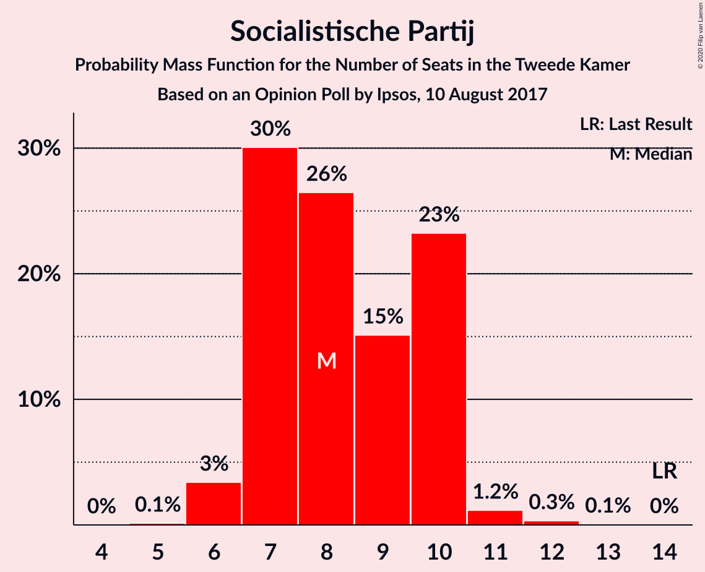

| Number of Seats | Probability | Accumulated | Special Marks |
|:---------------:|:-----------:|:-----------:|:-------------:|
| 5 | 0.1% | 100% |  |
| 6 | 6% | 99.9% |  |
| 7 | 6% | 94% |  |
| 8 | 9% | 88% |  |
| 9 | 8% | 78% |  |
| 10 | 67% | 71% | Median |
| 11 | 3% | 4% |  |
| 12 | 0.9% | 1.0% |  |
| 13 | 0.1% | 0.1% |  |
| 14 | 0% | 0% | Last Result |

### Partij van de Arbeid

*For a full overview of the results for this party, see the [Partij van de Arbeid](party-partijvandearbeid.html) page.*

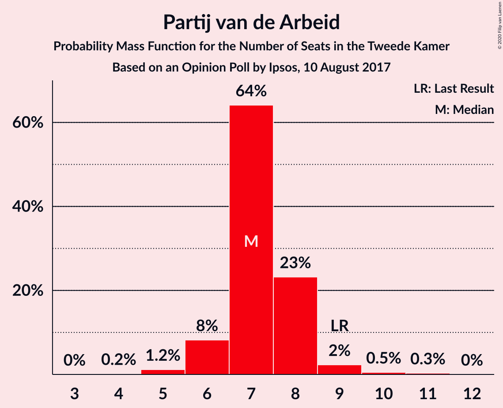

| Number of Seats | Probability | Accumulated | Special Marks |
|:---------------:|:-----------:|:-----------:|:-------------:|
| 4 | 3% | 100% |  |
| 5 | 6% | 97% |  |
| 6 | 2% | 91% |  |
| 7 | 75% | 89% | Median |
| 8 | 6% | 14% |  |
| 9 | 6% | 8% | Last Result |
| 10 | 1.1% | 2% |  |
| 11 | 0.8% | 0.8% |  |
| 12 | 0% | 0% |  |

### Partij voor de Dieren

*For a full overview of the results for this party, see the [Partij voor de Dieren](party-partijvoordedieren.html) page.*

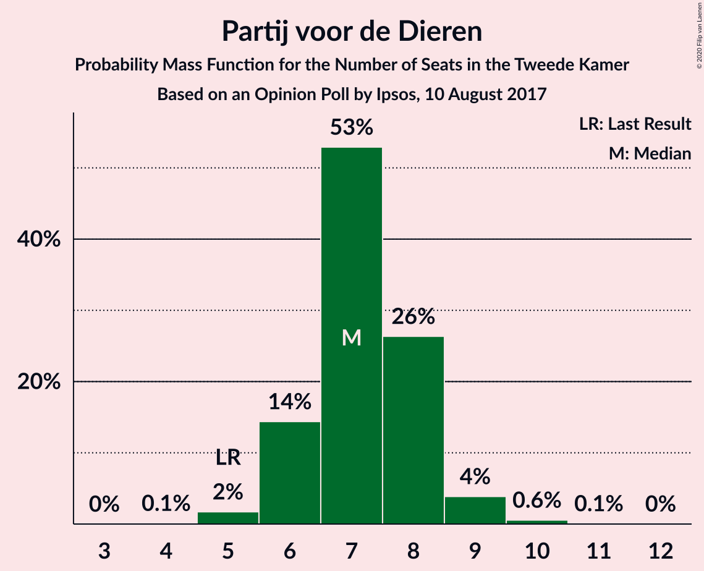

| Number of Seats | Probability | Accumulated | Special Marks |
|:---------------:|:-----------:|:-----------:|:-------------:|
| 5 | 0.8% | 100% | Last Result |
| 6 | 7% | 99.2% |  |
| 7 | 11% | 92% |  |
| 8 | 12% | 82% |  |
| 9 | 68% | 70% | Median |
| 10 | 2% | 2% |  |
| 11 | 0.1% | 0.1% |  |
| 12 | 0% | 0% |  |

### Forum voor Democratie

*For a full overview of the results for this party, see the [Forum voor Democratie](party-forumvoordemocratie.html) page.*

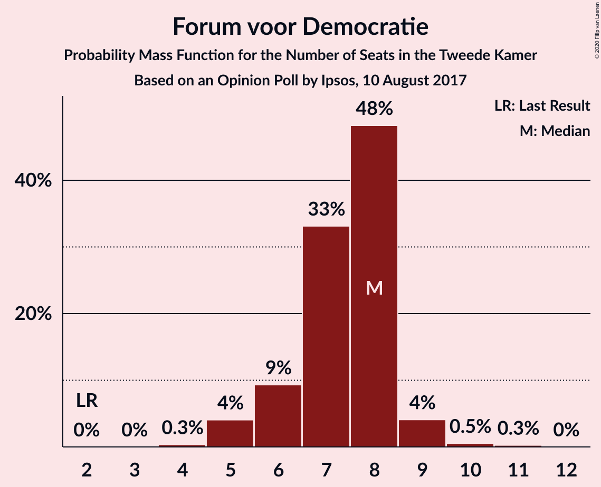

| Number of Seats | Probability | Accumulated | Special Marks |
|:---------------:|:-----------:|:-----------:|:-------------:|
| 2 | 0% | 100% | Last Result |
| 3 | 0% | 100% |  |
| 4 | 0.5% | 100% |  |
| 5 | 65% | 99.5% | Median |
| 6 | 8% | 34% |  |
| 7 | 9% | 26% |  |
| 8 | 4% | 17% |  |
| 9 | 5% | 13% |  |
| 10 | 8% | 8% |  |
| 11 | 0% | 0.1% |  |
| 12 | 0.1% | 0.1% |  |
| 13 | 0% | 0% |  |

### ChristenUnie

*For a full overview of the results for this party, see the [ChristenUnie](party-christenunie.html) page.*

| Number of Seats | Probability | Accumulated | Special Marks |
|:---------------:|:-----------:|:-----------:|:-------------:|
| 4 | 0.6% | 100% |  |
| 5 | 82% | 99.4% | Last Result, Median |
| 6 | 10% | 18% |  |
| 7 | 5% | 8% |  |
| 8 | 0.5% | 2% |  |
| 9 | 1.1% | 2% |  |
| 10 | 0.5% | 0.6% |  |
| 11 | 0.1% | 0.1% |  |
| 12 | 0% | 0% |  |

### DENK

*For a full overview of the results for this party, see the [DENK](party-denk.html) page.*

| Number of Seats | Probability | Accumulated | Special Marks |
|:---------------:|:-----------:|:-----------:|:-------------:|
| 2 | 0.1% | 100% |  |
| 3 | 8% | 99.9% | Last Result |
| 4 | 8% | 92% |  |
| 5 | 74% | 84% | Median |
| 6 | 8% | 11% |  |
| 7 | 2% | 3% |  |
| 8 | 0.6% | 0.6% |  |
| 9 | 0% | 0% |  |

### 50Plus

*For a full overview of the results for this party, see the [50Plus](party-50plus.html) page.*

| Number of Seats | Probability | Accumulated | Special Marks |
|:---------------:|:-----------:|:-----------:|:-------------:|
| 1 | 0.4% | 100% |  |
| 2 | 7% | 99.6% |  |
| 3 | 13% | 93% |  |
| 4 | 75% | 80% | Last Result, Median |
| 5 | 3% | 5% |  |
| 6 | 2% | 2% |  |
| 7 | 0% | 0% |  |

### Staatkundig Gereformeerde Partij

*For a full overview of the results for this party, see the [Staatkundig Gereformeerde Partij](party-staatkundiggereformeerdepartij.html) page.*

| Number of Seats | Probability | Accumulated | Special Marks |
|:---------------:|:-----------:|:-----------:|:-------------:|
| 0 | 0.5% | 100% |  |
| 1 | 13% | 99.5% |  |
| 2 | 81% | 86% | Median |
| 3 | 4% | 5% | Last Result |
| 4 | 1.1% | 1.5% |  |
| 5 | 0.4% | 0.4% |  |
| 6 | 0% | 0% |  |

## Coalitions

### Confidence Intervals

| Coalition | Last Result | Median | Majority? | 80% Confidence Interval | 90% Confidence Interval | 95% Confidence Interval | 99% Confidence Interval |
|:---------:|:-----------:|:------:|:---------:|:-----------------------:|:-----------------------:|:-----------------------:|:-----------------------:|
| Volkspartij voor Vrijheid en Democratie – Democraten 66 – Christen-Democratisch Appèl – GroenLinks – ChristenUnie | 90 | 85 | 100% | 85–89 | 84–91 | 83–93 | 80–93 |
| Volkspartij voor Vrijheid en Democratie – Democraten 66 – Christen-Democratisch Appèl – Partij van de Arbeid – ChristenUnie | 85 | 82 | 99.4% | 79–83 | 76–87 | 76–88 | 75–89 |
| Volkspartij voor Vrijheid en Democratie – Partij voor de Vrijheid – Christen-Democratisch Appèl – Forum voor Democratie – Staatkundig Gereformeerde Partij | 77 | 77 | 95% | 77–82 | 76–84 | 74–84 | 72–84 |
| Volkspartij voor Vrijheid en Democratie – Partij voor de Vrijheid – Christen-Democratisch Appèl – Forum voor Democratie | 74 | 75 | 27% | 75–80 | 74–83 | 72–83 | 70–83 |
| Volkspartij voor Vrijheid en Democratie – Democraten 66 – Christen-Democratisch Appèl – ChristenUnie | 76 | 75 | 14% | 72–77 | 71–79 | 69–81 | 67–81 |
| Volkspartij voor Vrijheid en Democratie – Partij voor de Vrijheid – Christen-Democratisch Appèl | 72 | 70 | 4% | 68–71 | 65–73 | 64–76 | 64–77 |
| Volkspartij voor Vrijheid en Democratie – Democraten 66 – Christen-Democratisch Appèl | 71 | 70 | 2% | 67–72 | 65–73 | 63–75 | 61–76 |
| Democraten 66 – Christen-Democratisch Appèl – GroenLinks – Socialistische Partij – Partij van de Arbeid – ChristenUnie | 80 | 68 | 1.2% | 67–71 | 65–73 | 64–74 | 62–76 |
| Volkspartij voor Vrijheid en Democratie – Democraten 66 – Partij van de Arbeid | 61 | 61 | 0% | 58–63 | 57–65 | 56–67 | 53–67 |
| Volkspartij voor Vrijheid en Democratie – Christen-Democratisch Appèl – Forum voor Democratie – 50Plus – Staatkundig Gereformeerde Partij | 61 | 61 | 0% | 60–63 | 59–66 | 58–66 | 56–67 |
| Volkspartij voor Vrijheid en Democratie – Christen-Democratisch Appèl – Forum voor Democratie – 50Plus | 58 | 59 | 0% | 58–61 | 56–65 | 55–65 | 53–65 |
| Democraten 66 – Christen-Democratisch Appèl – GroenLinks – Partij van de Arbeid – ChristenUnie | 66 | 58 | 0% | 58–63 | 57–64 | 56–64 | 56–68 |
| Volkspartij voor Vrijheid en Democratie – Christen-Democratisch Appèl – Forum voor Democratie – Staatkundig Gereformeerde Partij | 57 | 57 | 0% | 57–60 | 55–62 | 54–63 | 52–64 |
| Volkspartij voor Vrijheid en Democratie – Christen-Democratisch Appèl – Forum voor Democratie | 54 | 55 | 0% | 55–59 | 53–61 | 52–62 | 50–62 |
| Volkspartij voor Vrijheid en Democratie – Christen-Democratisch Appèl – Partij van de Arbeid | 61 | 57 | 0% | 54–58 | 51–60 | 50–60 | 50–63 |
| Volkspartij voor Vrijheid en Democratie – Christen-Democratisch Appèl | 52 | 50 | 0% | 46–51 | 45–53 | 44–55 | 42–55 |
| Democraten 66 – Christen-Democratisch Appèl – Partij van de Arbeid | 47 | 43 | 0% | 40–45 | 39–47 | 39–48 | 36–48 |
| Volkspartij voor Vrijheid en Democratie – Partij van de Arbeid | 42 | 41 | 0% | 38–42 | 37–44 | 36–44 | 34–47 |
| Democraten 66 – Christen-Democratisch Appèl | 38 | 36 | 0% | 34–36 | 32–40 | 31–40 | 30–40 |
| Christen-Democratisch Appèl – Partij van de Arbeid – ChristenUnie | 33 | 28 | 0% | 28–30 | 26–30 | 23–31 | 23–34 |
| Christen-Democratisch Appèl – Partij van de Arbeid | 28 | 23 | 0% | 22–23 | 21–24 | 18–26 | 18–27 |

### Volkspartij voor Vrijheid en Democratie – Democraten 66 – Christen-Democratisch Appèl – GroenLinks – ChristenUnie

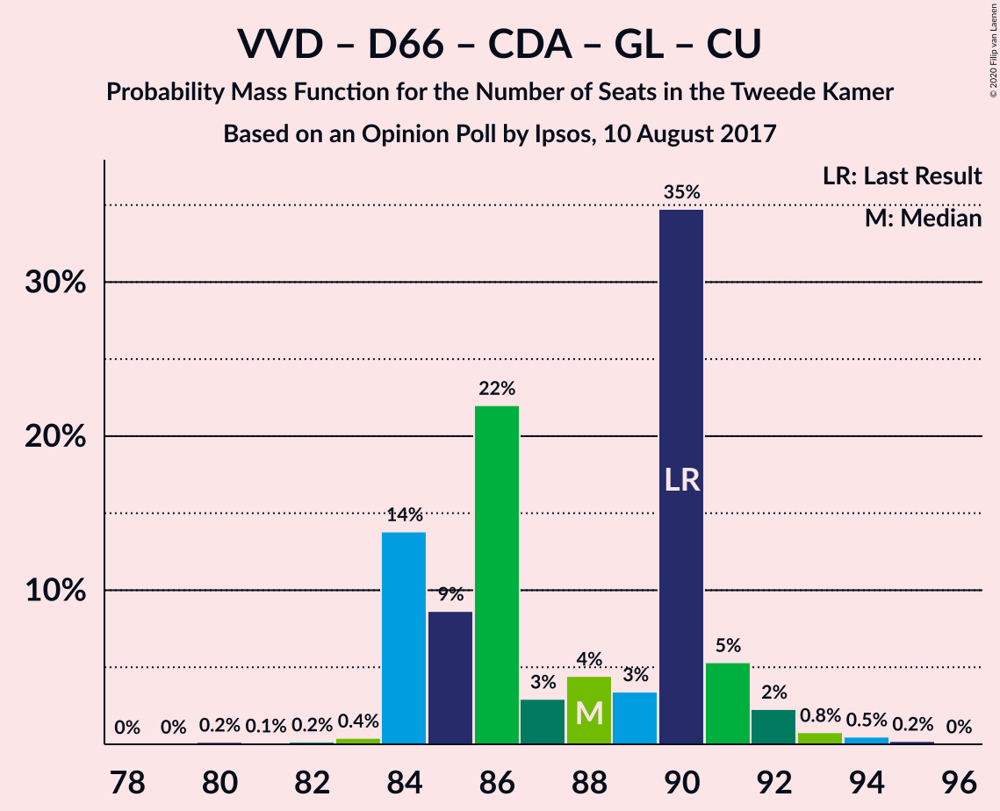

| Number of Seats | Probability | Accumulated | Special Marks |
|:---------------:|:-----------:|:-----------:|:-------------:|
| 79 | 0.2% | 100% |  |
| 80 | 0.4% | 99.8% |  |
| 81 | 2% | 99.4% |  |
| 82 | 0.1% | 98% |  |
| 83 | 0.4% | 98% |  |
| 84 | 6% | 97% |  |
| 85 | 65% | 91% | Median |
| 86 | 6% | 27% |  |
| 87 | 1.3% | 20% |  |
| 88 | 5% | 19% |  |
| 89 | 8% | 15% |  |
| 90 | 1.1% | 6% | Last Result |
| 91 | 2% | 5% |  |
| 92 | 0.4% | 3% |  |
| 93 | 3% | 3% |  |
| 94 | 0.1% | 0.3% |  |
| 95 | 0.1% | 0.2% |  |
| 96 | 0% | 0% |  |

### Volkspartij voor Vrijheid en Democratie – Democraten 66 – Christen-Democratisch Appèl – Partij van de Arbeid – ChristenUnie

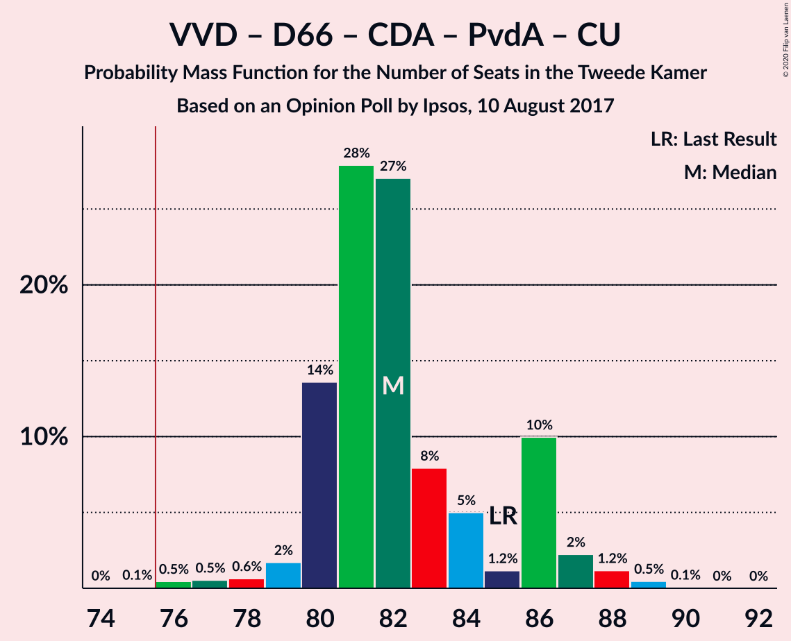

| Number of Seats | Probability | Accumulated | Special Marks |
|:---------------:|:-----------:|:-----------:|:-------------:|
| 74 | 0.2% | 100% |  |
| 75 | 0.4% | 99.8% |  |
| 76 | 5% | 99.4% | Majority |
| 77 | 0.3% | 95% |  |
| 78 | 2% | 94% |  |
| 79 | 4% | 93% |  |
| 80 | 4% | 89% |  |
| 81 | 1.3% | 85% |  |
| 82 | 72% | 83% | Median |
| 83 | 0.9% | 11% |  |
| 84 | 0.4% | 10% |  |
| 85 | 0.6% | 9% | Last Result |
| 86 | 1.0% | 9% |  |
| 87 | 5% | 8% |  |
| 88 | 3% | 3% |  |
| 89 | 0.6% | 0.7% |  |
| 90 | 0% | 0.1% |  |
| 91 | 0.1% | 0.1% |  |
| 92 | 0% | 0% |  |

### Volkspartij voor Vrijheid en Democratie – Partij voor de Vrijheid – Christen-Democratisch Appèl – Forum voor Democratie – Staatkundig Gereformeerde Partij

| Number of Seats | Probability | Accumulated | Special Marks |
|:---------------:|:-----------:|:-----------:|:-------------:|
| 72 | 0.7% | 100% |  |
| 73 | 0.7% | 99.2% |  |
| 74 | 1.3% | 98% |  |
| 75 | 2% | 97% |  |
| 76 | 3% | 95% | Majority |
| 77 | 67% | 93% | Last Result, Median |
| 78 | 4% | 26% |  |
| 79 | 5% | 22% |  |
| 80 | 4% | 16% |  |
| 81 | 3% | 13% |  |
| 82 | 3% | 10% |  |
| 83 | 1.2% | 7% |  |
| 84 | 5% | 6% |  |
| 85 | 0.3% | 0.4% |  |
| 86 | 0.1% | 0.2% |  |
| 87 | 0.1% | 0.1% |  |
| 88 | 0% | 0% |  |

### Volkspartij voor Vrijheid en Democratie – Partij voor de Vrijheid – Christen-Democratisch Appèl – Forum voor Democratie

| Number of Seats | Probability | Accumulated | Special Marks |
|:---------------:|:-----------:|:-----------:|:-------------:|
| 69 | 0% | 100% |  |
| 70 | 2% | 99.9% |  |
| 71 | 0.9% | 98% |  |
| 72 | 1.3% | 98% |  |
| 73 | 1.2% | 96% |  |
| 74 | 2% | 95% | Last Result |
| 75 | 67% | 93% | Median |
| 76 | 5% | 27% | Majority |
| 77 | 4% | 22% |  |
| 78 | 6% | 18% |  |
| 79 | 2% | 13% |  |
| 80 | 2% | 11% |  |
| 81 | 3% | 9% |  |
| 82 | 0.8% | 6% |  |
| 83 | 5% | 5% |  |
| 84 | 0.1% | 0.2% |  |
| 85 | 0.1% | 0.1% |  |
| 86 | 0% | 0% |  |

### Volkspartij voor Vrijheid en Democratie – Democraten 66 – Christen-Democratisch Appèl – ChristenUnie

| Number of Seats | Probability | Accumulated | Special Marks |
|:---------------:|:-----------:|:-----------:|:-------------:|
| 66 | 0.1% | 100% |  |
| 67 | 2% | 99.9% |  |
| 68 | 0.5% | 98% |  |
| 69 | 0.4% | 98% |  |
| 70 | 0.5% | 97% |  |
| 71 | 2% | 97% |  |
| 72 | 7% | 95% |  |
| 73 | 5% | 88% |  |
| 74 | 3% | 83% |  |
| 75 | 67% | 80% | Median |
| 76 | 1.1% | 14% | Last Result, Majority |
| 77 | 4% | 13% |  |
| 78 | 1.0% | 9% |  |
| 79 | 4% | 8% |  |
| 80 | 0.7% | 4% |  |
| 81 | 3% | 3% |  |
| 82 | 0.1% | 0.1% |  |
| 83 | 0% | 0% |  |

### Volkspartij voor Vrijheid en Democratie – Partij voor de Vrijheid – Christen-Democratisch Appèl

| Number of Seats | Probability | Accumulated | Special Marks |
|:---------------:|:-----------:|:-----------:|:-------------:|
| 63 | 0.4% | 100% |  |
| 64 | 3% | 99.6% |  |
| 65 | 2% | 96% |  |
| 66 | 1.5% | 94% |  |
| 67 | 0.8% | 93% |  |
| 68 | 6% | 92% |  |
| 69 | 1.4% | 86% |  |
| 70 | 68% | 84% | Median |
| 71 | 7% | 16% |  |
| 72 | 0.9% | 9% | Last Result |
| 73 | 3% | 8% |  |
| 74 | 0.2% | 5% |  |
| 75 | 0.4% | 5% |  |
| 76 | 4% | 4% | Majority |
| 77 | 0.6% | 0.7% |  |
| 78 | 0% | 0% |  |

### Volkspartij voor Vrijheid en Democratie – Democraten 66 – Christen-Democratisch Appèl

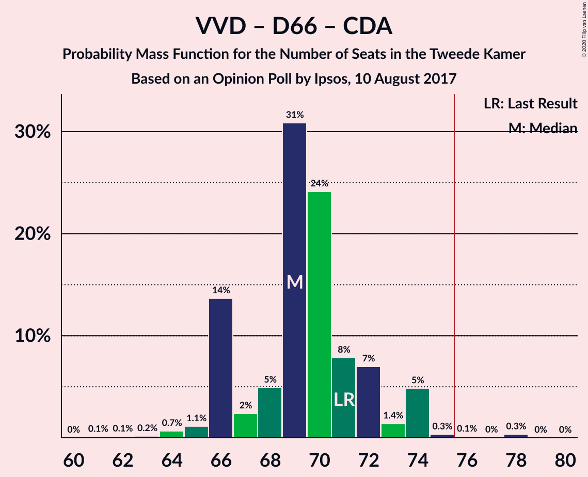

| Number of Seats | Probability | Accumulated | Special Marks |
|:---------------:|:-----------:|:-----------:|:-------------:|
| 61 | 2% | 100% |  |
| 62 | 0.1% | 98% |  |
| 63 | 1.0% | 98% |  |
| 64 | 1.2% | 97% |  |
| 65 | 0.9% | 96% |  |
| 66 | 4% | 95% |  |
| 67 | 8% | 91% |  |
| 68 | 1.0% | 82% |  |
| 69 | 3% | 81% |  |
| 70 | 66% | 78% | Median |
| 71 | 1.1% | 13% | Last Result |
| 72 | 4% | 12% |  |
| 73 | 4% | 7% |  |
| 74 | 0.4% | 4% |  |
| 75 | 1.0% | 3% |  |
| 76 | 2% | 2% | Majority |
| 77 | 0% | 0% |  |

### Democraten 66 – Christen-Democratisch Appèl – GroenLinks – Socialistische Partij – Partij van de Arbeid – ChristenUnie

| Number of Seats | Probability | Accumulated | Special Marks |
|:---------------:|:-----------:|:-----------:|:-------------:|
| 61 | 0.1% | 100% |  |
| 62 | 1.5% | 99.9% |  |
| 63 | 0.1% | 98% |  |
| 64 | 3% | 98% |  |
| 65 | 2% | 96% |  |
| 66 | 3% | 94% |  |
| 67 | 2% | 90% |  |
| 68 | 67% | 88% | Median |
| 69 | 2% | 21% |  |
| 70 | 7% | 20% |  |
| 71 | 5% | 13% |  |
| 72 | 1.3% | 7% |  |
| 73 | 2% | 6% |  |
| 74 | 2% | 4% |  |
| 75 | 0.4% | 2% |  |
| 76 | 0.7% | 1.2% | Majority |
| 77 | 0.1% | 0.5% |  |
| 78 | 0.4% | 0.4% |  |
| 79 | 0% | 0% |  |
| 80 | 0% | 0% | Last Result |

### Volkspartij voor Vrijheid en Democratie – Democraten 66 – Partij van de Arbeid

| Number of Seats | Probability | Accumulated | Special Marks |
|:---------------:|:-----------:|:-----------:|:-------------:|
| 52 | 0.2% | 100% |  |
| 53 | 0.3% | 99.8% |  |
| 54 | 1.3% | 99.5% |  |
| 55 | 0.1% | 98% |  |
| 56 | 3% | 98% |  |
| 57 | 5% | 95% |  |
| 58 | 4% | 90% |  |
| 59 | 5% | 86% |  |
| 60 | 1.0% | 81% |  |
| 61 | 66% | 80% | Last Result, Median |
| 62 | 0.9% | 14% |  |
| 63 | 4% | 13% |  |
| 64 | 2% | 9% |  |
| 65 | 4% | 8% |  |
| 66 | 0.5% | 4% |  |
| 67 | 3% | 3% |  |
| 68 | 0.3% | 0.3% |  |
| 69 | 0% | 0% |  |

### Volkspartij voor Vrijheid en Democratie – Christen-Democratisch Appèl – Forum voor Democratie – 50Plus – Staatkundig Gereformeerde Partij

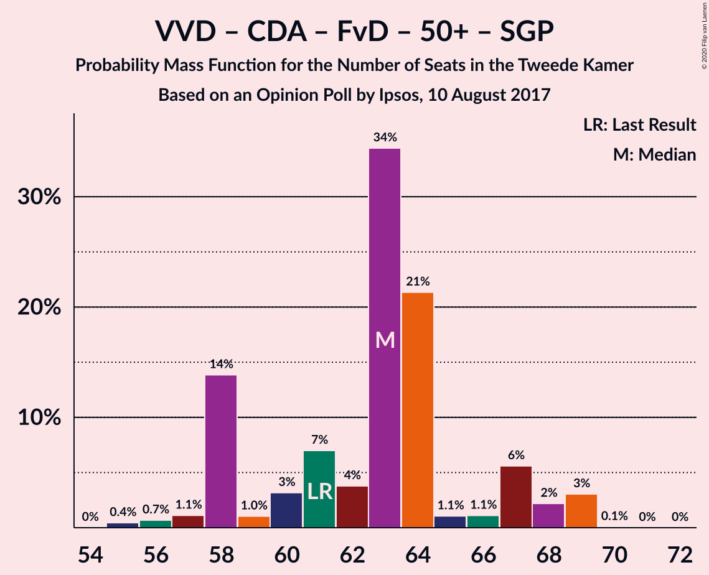

| Number of Seats | Probability | Accumulated | Special Marks |
|:---------------:|:-----------:|:-----------:|:-------------:|
| 55 | 0.2% | 100% |  |
| 56 | 2% | 99.7% |  |
| 57 | 0.2% | 98% |  |
| 58 | 2% | 98% |  |
| 59 | 4% | 96% |  |
| 60 | 2% | 92% |  |
| 61 | 69% | 89% | Last Result, Median |
| 62 | 7% | 21% |  |
| 63 | 4% | 13% |  |
| 64 | 0.7% | 9% |  |
| 65 | 2% | 8% |  |
| 66 | 6% | 6% |  |
| 67 | 0.6% | 0.7% |  |
| 68 | 0% | 0.1% |  |
| 69 | 0% | 0% |  |

### Volkspartij voor Vrijheid en Democratie – Christen-Democratisch Appèl – Forum voor Democratie – 50Plus

| Number of Seats | Probability | Accumulated | Special Marks |
|:---------------:|:-----------:|:-----------:|:-------------:|
| 53 | 1.5% | 100% |  |
| 54 | 0.4% | 98.5% |  |
| 55 | 0.6% | 98% |  |
| 56 | 3% | 97% |  |
| 57 | 3% | 95% |  |
| 58 | 2% | 92% | Last Result |
| 59 | 66% | 90% | Median |
| 60 | 10% | 24% |  |
| 61 | 4% | 14% |  |
| 62 | 2% | 10% |  |
| 63 | 3% | 8% |  |
| 64 | 0.6% | 6% |  |
| 65 | 5% | 5% |  |
| 66 | 0% | 0.1% |  |
| 67 | 0% | 0% |  |

### Democraten 66 – Christen-Democratisch Appèl – GroenLinks – Partij van de Arbeid – ChristenUnie

| Number of Seats | Probability | Accumulated | Special Marks |
|:---------------:|:-----------:|:-----------:|:-------------:|
| 52 | 0.1% | 100% |  |
| 53 | 0% | 99.9% |  |
| 54 | 0% | 99.9% |  |
| 55 | 0.1% | 99.8% |  |
| 56 | 4% | 99.7% |  |
| 57 | 4% | 95% |  |
| 58 | 66% | 92% | Median |
| 59 | 4% | 26% |  |
| 60 | 0.1% | 22% |  |
| 61 | 3% | 22% |  |
| 62 | 5% | 19% |  |
| 63 | 5% | 13% |  |
| 64 | 6% | 8% |  |
| 65 | 0.5% | 2% |  |
| 66 | 0.6% | 2% | Last Result |
| 67 | 0% | 1.2% |  |
| 68 | 0.9% | 1.2% |  |
| 69 | 0.3% | 0.4% |  |
| 70 | 0.1% | 0.1% |  |
| 71 | 0% | 0% |  |

### Volkspartij voor Vrijheid en Democratie – Christen-Democratisch Appèl – Forum voor Democratie – Staatkundig Gereformeerde Partij

| Number of Seats | Probability | Accumulated | Special Marks |
|:---------------:|:-----------:|:-----------:|:-------------:|
| 51 | 0% | 100% |  |
| 52 | 1.2% | 99.9% |  |
| 53 | 0.9% | 98.7% |  |
| 54 | 0.7% | 98% |  |
| 55 | 2% | 97% |  |
| 56 | 4% | 95% |  |
| 57 | 69% | 90% | Last Result, Median |
| 58 | 7% | 22% |  |
| 59 | 3% | 15% |  |
| 60 | 2% | 12% |  |
| 61 | 3% | 10% |  |
| 62 | 2% | 7% |  |
| 63 | 3% | 5% |  |
| 64 | 1.1% | 1.4% |  |
| 65 | 0.3% | 0.3% |  |
| 66 | 0% | 0% |  |

### Volkspartij voor Vrijheid en Democratie – Christen-Democratisch Appèl – Forum voor Democratie

| Number of Seats | Probability | Accumulated | Special Marks |
|:---------------:|:-----------:|:-----------:|:-------------:|
| 49 | 0.4% | 100% |  |
| 50 | 1.4% | 99.6% |  |
| 51 | 0.4% | 98% |  |
| 52 | 2% | 98% |  |
| 53 | 2% | 96% |  |
| 54 | 2% | 94% | Last Result |
| 55 | 70% | 92% | Median |
| 56 | 4% | 22% |  |
| 57 | 5% | 18% |  |
| 58 | 1.3% | 13% |  |
| 59 | 5% | 11% |  |
| 60 | 0.2% | 7% |  |
| 61 | 3% | 6% |  |
| 62 | 3% | 4% |  |
| 63 | 0.2% | 0.3% |  |
| 64 | 0% | 0% |  |

### Volkspartij voor Vrijheid en Democratie – Christen-Democratisch Appèl – Partij van de Arbeid

| Number of Seats | Probability | Accumulated | Special Marks |
|:---------------:|:-----------:|:-----------:|:-------------:|
| 48 | 0.2% | 100% |  |
| 49 | 0% | 99.8% |  |
| 50 | 3% | 99.8% |  |
| 51 | 2% | 97% |  |
| 52 | 1.1% | 94% |  |
| 53 | 0.8% | 93% |  |
| 54 | 5% | 92% |  |
| 55 | 2% | 87% |  |
| 56 | 5% | 85% |  |
| 57 | 68% | 80% | Median |
| 58 | 2% | 12% |  |
| 59 | 2% | 9% |  |
| 60 | 6% | 8% |  |
| 61 | 0.7% | 2% | Last Result |
| 62 | 0.6% | 1.3% |  |
| 63 | 0.4% | 0.7% |  |
| 64 | 0% | 0.2% |  |
| 65 | 0% | 0.2% |  |
| 66 | 0.2% | 0.2% |  |
| 67 | 0% | 0% |  |

### Volkspartij voor Vrijheid en Democratie – Christen-Democratisch Appèl

| Number of Seats | Probability | Accumulated | Special Marks |
|:---------------:|:-----------:|:-----------:|:-------------:|
| 41 | 0.4% | 100% |  |
| 42 | 0.2% | 99.6% |  |
| 43 | 0.1% | 99.4% |  |
| 44 | 2% | 99.3% |  |
| 45 | 2% | 97% |  |
| 46 | 5% | 95% |  |
| 47 | 5% | 90% |  |
| 48 | 1.2% | 85% |  |
| 49 | 7% | 84% |  |
| 50 | 66% | 76% | Median |
| 51 | 3% | 11% |  |
| 52 | 0.4% | 8% | Last Result |
| 53 | 2% | 7% |  |
| 54 | 1.0% | 5% |  |
| 55 | 4% | 4% |  |
| 56 | 0.2% | 0.3% |  |
| 57 | 0% | 0% |  |

### Democraten 66 – Christen-Democratisch Appèl – Partij van de Arbeid

| Number of Seats | Probability | Accumulated | Special Marks |
|:---------------:|:-----------:|:-----------:|:-------------:|
| 34 | 0.1% | 100% |  |
| 35 | 0.1% | 99.9% |  |
| 36 | 0.4% | 99.9% |  |
| 37 | 0.6% | 99.4% |  |
| 38 | 0.2% | 98.9% |  |
| 39 | 6% | 98.6% |  |
| 40 | 8% | 92% |  |
| 41 | 2% | 84% |  |
| 42 | 2% | 83% |  |
| 43 | 69% | 81% | Median |
| 44 | 1.0% | 11% |  |
| 45 | 0.7% | 10% |  |
| 46 | 4% | 10% |  |
| 47 | 2% | 6% | Last Result |
| 48 | 3% | 4% |  |
| 49 | 0.4% | 0.5% |  |
| 50 | 0% | 0% |  |

### Volkspartij voor Vrijheid en Democratie – Partij van de Arbeid

| Number of Seats | Probability | Accumulated | Special Marks |
|:---------------:|:-----------:|:-----------:|:-------------:|
| 33 | 0.2% | 100% |  |
| 34 | 0.3% | 99.8% |  |
| 35 | 0.6% | 99.5% |  |
| 36 | 4% | 98.9% |  |
| 37 | 2% | 95% |  |
| 38 | 4% | 93% |  |
| 39 | 1.0% | 89% |  |
| 40 | 5% | 88% |  |
| 41 | 69% | 83% | Median |
| 42 | 5% | 14% | Last Result |
| 43 | 0.4% | 9% |  |
| 44 | 6% | 8% |  |
| 45 | 0.8% | 2% |  |
| 46 | 0.3% | 1.1% |  |
| 47 | 0.6% | 0.9% |  |
| 48 | 0% | 0.3% |  |
| 49 | 0.2% | 0.2% |  |
| 50 | 0% | 0% |  |

### Democraten 66 – Christen-Democratisch Appèl

| Number of Seats | Probability | Accumulated | Special Marks |
|:---------------:|:-----------:|:-----------:|:-------------:|
| 28 | 0.1% | 100% |  |
| 29 | 0% | 99.9% |  |
| 30 | 2% | 99.9% |  |
| 31 | 1.0% | 98% |  |
| 32 | 2% | 97% |  |
| 33 | 5% | 95% |  |
| 34 | 5% | 90% |  |
| 35 | 7% | 86% |  |
| 36 | 69% | 78% | Median |
| 37 | 0.2% | 10% |  |
| 38 | 1.2% | 10% | Last Result |
| 39 | 3% | 8% |  |
| 40 | 5% | 5% |  |
| 41 | 0% | 0% |  |

### Christen-Democratisch Appèl – Partij van de Arbeid – ChristenUnie

| Number of Seats | Probability | Accumulated | Special Marks |
|:---------------:|:-----------:|:-----------:|:-------------:|
| 23 | 3% | 100% |  |
| 24 | 0.3% | 97% |  |
| 25 | 0.7% | 97% |  |
| 26 | 3% | 96% |  |
| 27 | 3% | 94% |  |
| 28 | 76% | 91% | Median |
| 29 | 4% | 15% |  |
| 30 | 6% | 11% |  |
| 31 | 3% | 5% |  |
| 32 | 1.3% | 2% |  |
| 33 | 0.6% | 1.1% | Last Result |
| 34 | 0.2% | 0.5% |  |
| 35 | 0.3% | 0.3% |  |
| 36 | 0% | 0% |  |

### Christen-Democratisch Appèl – Partij van de Arbeid

| Number of Seats | Probability | Accumulated | Special Marks |
|:---------------:|:-----------:|:-----------:|:-------------:|
| 18 | 4% | 100% |  |
| 19 | 0.1% | 96% |  |
| 20 | 0.7% | 96% |  |
| 21 | 5% | 95% |  |
| 22 | 3% | 90% |  |
| 23 | 78% | 87% | Median |
| 24 | 5% | 9% |  |
| 25 | 0.7% | 4% |  |
| 26 | 2% | 3% |  |
| 27 | 0.6% | 0.8% |  |
| 28 | 0.1% | 0.1% | Last Result |
| 29 | 0% | 0% |  |

## Technical Information

### Opinion Poll

+ **Polling firm:** Ipsos
+ **Commissioner(s):** —
+ **Fieldwork period:** 10 August 2017

### Calculations

+ **Sample size:** 1000
+ **Simulations done:** 131,072
+ **Error estimate:** 2.26%

