# Opinion Poll by Peil.nl, 20 August 2017

<a href="#voting-intentions">Voting Intentions</a> | <a href="#seats">Seats</a> | <a href="#coalitions">Coalitions</a> | <a href="#technical-information">Technical Information</a>

## Voting Intentions

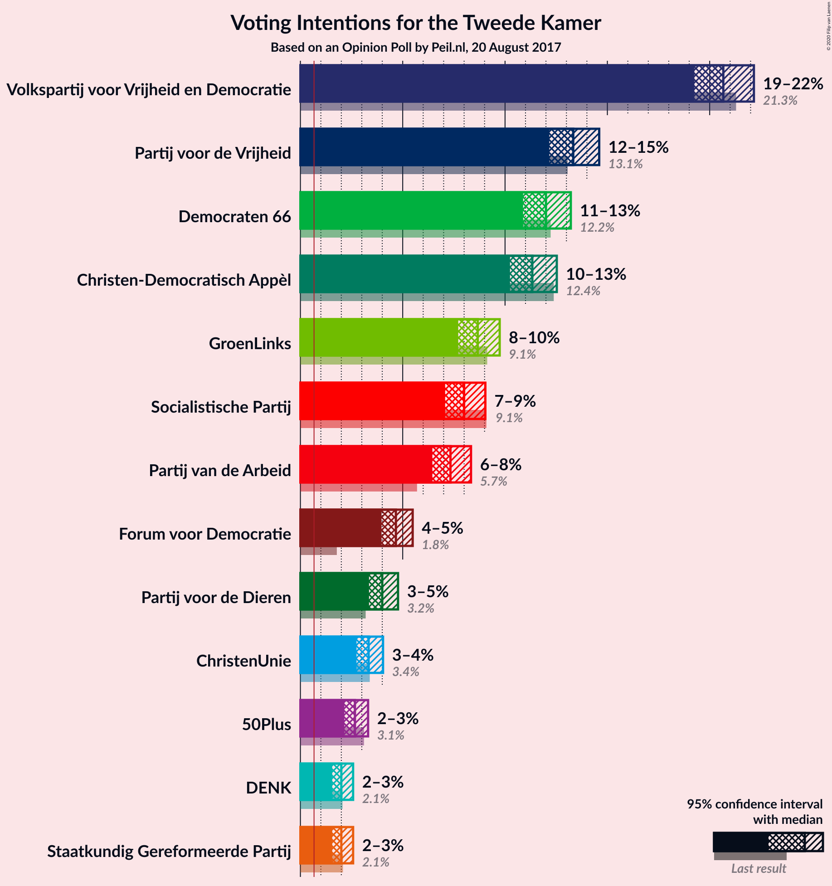

### Confidence Intervals

| Party | Last Result | Poll Result | 80% Confidence Interval | 90% Confidence Interval | 95% Confidence Interval | 99% Confidence Interval |
|:-----:|:-----------:|:-----------:|:-----------------------:|:-----------------------:|:-----------------------:|:-----------------------:|
| Volkspartij voor Vrijheid en Democratie | 21.3% | 20.7% | 19.7–21.6% |19.5–21.9% |19.3–22.2% |18.8–22.6% |
| Partij voor de Vrijheid | 13.1% | 13.3% | 12.6–14.2% |12.3–14.4% |12.2–14.6% |11.8–15.0% |
| Democraten 66 | 12.2% | 12.0% | 11.3–12.8% |11.1–13.0% |10.9–13.2% |10.5–13.6% |
| Christen-Democratisch Appèl | 12.4% | 11.3% | 10.6–12.1% |10.4–12.3% |10.2–12.5% |9.9–12.9% |
| GroenLinks | 9.1% | 8.7% | 8.0–9.4% |7.8–9.6% |7.7–9.7% |7.4–10.1% |
| Socialistische Partij | 9.1% | 8.0% | 7.4–8.7% |7.2–8.9% |7.1–9.0% |6.8–9.4% |
| Partij van de Arbeid | 5.7% | 7.3% | 6.8–8.0% |6.6–8.2% |6.4–8.3% |6.2–8.6% |
| Forum voor Democratie | 1.8% | 4.7% | 4.2–5.2% |4.1–5.3% |4.0–5.5% |3.7–5.8% |
| Partij voor de Dieren | 3.2% | 4.0% | 3.6–4.5% |3.4–4.6% |3.4–4.8% |3.2–5.0% |
| ChristenUnie | 3.4% | 3.3% | 2.9–3.8% |2.8–3.9% |2.7–4.0% |2.6–4.3% |
| 50Plus | 3.1% | 2.7% | 2.3–3.1% |2.2–3.2% |2.1–3.3% |2.0–3.5% |
| Staatkundig Gereformeerde Partij | 2.1% | 2.0% | 1.7–2.4% |1.6–2.5% |1.6–2.6% |1.4–2.8% |
| DENK | 2.1% | 2.0% | 1.7–2.4% |1.6–2.5% |1.6–2.6% |1.4–2.8% |

*Note:* The poll result column reflects the actual value used in the calculations. Published results may vary slightly, and in addition be rounded to fewer digits.

## Seats

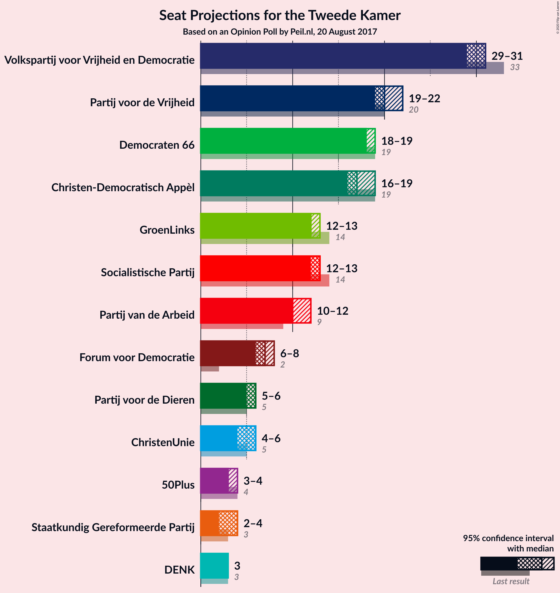

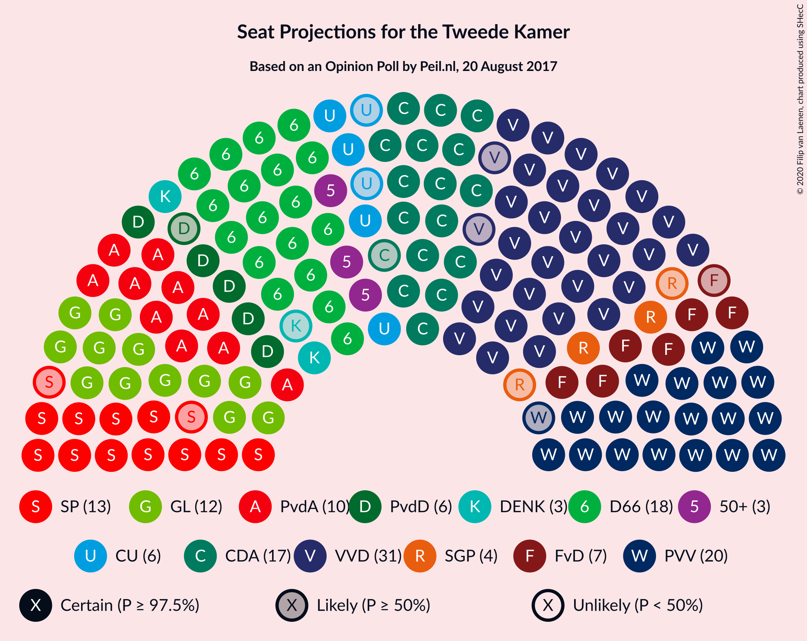

### Confidence Intervals

| Party | Last Result | Median | 80% Confidence Interval | 90% Confidence Interval | 95% Confidence Interval | 99% Confidence Interval |
|:-----:|:-----------:|:------:|:-----------------------:|:-----------------------:|:-----------------------:|:-----------------------:|
| <a href="#volkspartij-voor-vrijheid-en-democratie">Volkspartij voor Vrijheid en Democratie</a> | 33 | 31 | 30–31 |30–31 |29–32 |29–32 |
| <a href="#partij-voor-de-vrijheid">Partij voor de Vrijheid</a> | 20 | 20 | 20–22 |20–22 |19–22 |19–22 |
| <a href="#democraten-66">Democraten 66</a> | 19 | 18 | 18 |18–20 |18–20 |17–20 |
| <a href="#christen-democratisch-appèl">Christen-Democratisch Appèl</a> | 19 | 17 | 16–18 |16–19 |16–19 |16–19 |
| <a href="#groenlinks">GroenLinks</a> | 14 | 12 | 12–13 |12–13 |12–13 |12–14 |
| <a href="#socialistische-partij">Socialistische Partij</a> | 14 | 13 | 12–13 |11–13 |11–13 |10–15 |
| <a href="#partij-van-de-arbeid">Partij van de Arbeid</a> | 9 | 10 | 10–12 |10–12 |10–12 |9–13 |
| <a href="#forum-voor-democratie">Forum voor Democratie</a> | 2 | 7 | 7 |7 |6–8 |6–8 |
| <a href="#partij-voor-de-dieren">Partij voor de Dieren</a> | 5 | 6 | 5–6 |5–6 |5–7 |5–7 |
| <a href="#christenunie">ChristenUnie</a> | 5 | 6 | 5–6 |4–6 |4–6 |4–6 |
| <a href="#50plus">50Plus</a> | 4 | 3 | 3–4 |3–4 |3–4 |3–5 |
| <a href="#staatkundig-gereformeerde-partij">Staatkundig Gereformeerde Partij</a> | 3 | 4 | 2–4 |2–4 |2–4 |2–4 |
| <a href="#denk">DENK</a> | 3 | 3 | 3 |3–4 |2–4 |2–4 |

### Volkspartij voor Vrijheid en Democratie

*For a full overview of the results for this party, see the [Volkspartij voor Vrijheid en Democratie](party-volkspartijvoorvrijheidendemocratie.html) page.*

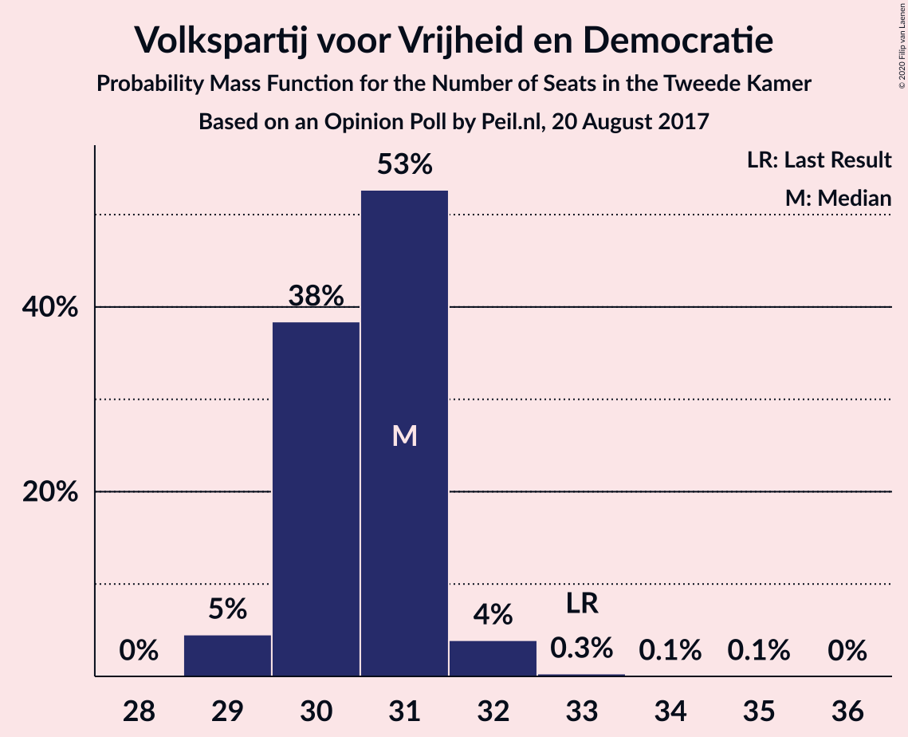

| Number of Seats | Probability | Accumulated | Special Marks |
|:---------------:|:-----------:|:-----------:|:-------------:|
| 29 | 5% | 100% |  |
| 30 | 38% | 95% |  |
| 31 | 53% | 57% | Median |
| 32 | 4% | 4% |  |
| 33 | 0.3% | 0.4% | Last Result |
| 34 | 0.1% | 0.1% |  |
| 35 | 0.1% | 0.1% |  |
| 36 | 0% | 0% |  |

### Partij voor de Vrijheid

*For a full overview of the results for this party, see the [Partij voor de Vrijheid](party-partijvoordevrijheid.html) page.*

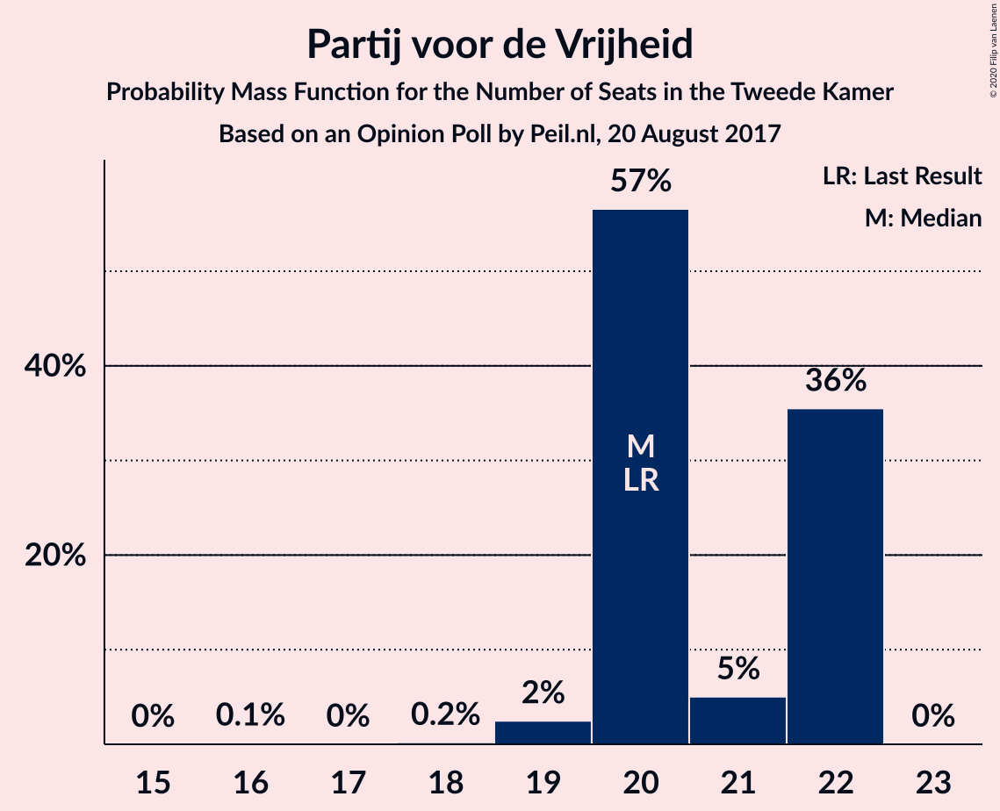

| Number of Seats | Probability | Accumulated | Special Marks |
|:---------------:|:-----------:|:-----------:|:-------------:|
| 16 | 0.1% | 100% |  |
| 17 | 0% | 99.9% |  |
| 18 | 0.2% | 99.8% |  |
| 19 | 4% | 99.7% |  |
| 20 | 52% | 95% | Last Result, Median |
| 21 | 10% | 43% |  |
| 22 | 33% | 33% |  |
| 23 | 0.1% | 0.1% |  |
| 24 | 0% | 0% |  |

### Democraten 66

*For a full overview of the results for this party, see the [Democraten 66](party-democraten66.html) page.*

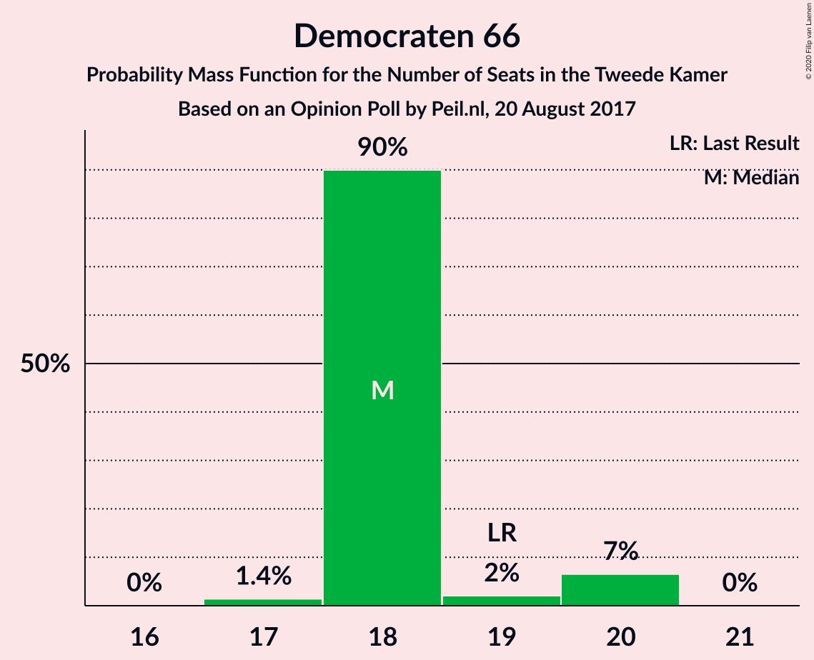

| Number of Seats | Probability | Accumulated | Special Marks |
|:---------------:|:-----------:|:-----------:|:-------------:|
| 17 | 1.4% | 100% |  |
| 18 | 90% | 98.6% | Median |
| 19 | 2% | 9% | Last Result |
| 20 | 7% | 7% |  |
| 21 | 0% | 0% |  |

### Christen-Democratisch Appèl

*For a full overview of the results for this party, see the [Christen-Democratisch Appèl](party-christen-democratischappèl.html) page.*

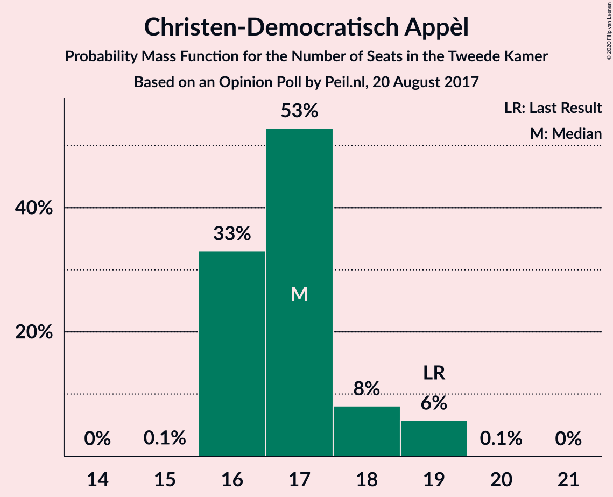

| Number of Seats | Probability | Accumulated | Special Marks |
|:---------------:|:-----------:|:-----------:|:-------------:|
| 15 | 0.1% | 100% |  |
| 16 | 33% | 99.8% |  |
| 17 | 53% | 67% | Median |
| 18 | 8% | 14% |  |
| 19 | 6% | 6% | Last Result |
| 20 | 0.1% | 0.1% |  |
| 21 | 0% | 0% |  |

### GroenLinks

*For a full overview of the results for this party, see the [GroenLinks](party-groenlinks.html) page.*

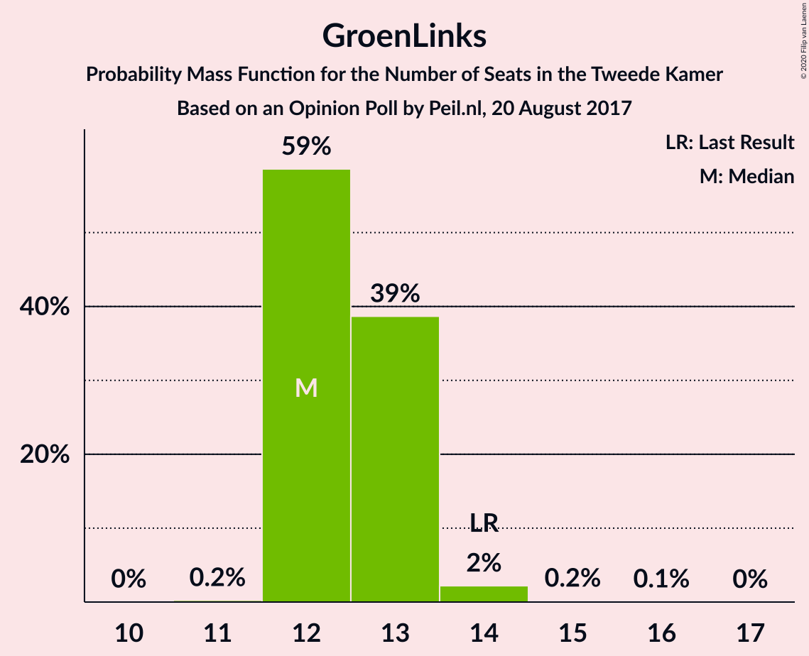

| Number of Seats | Probability | Accumulated | Special Marks |
|:---------------:|:-----------:|:-----------:|:-------------:|
| 11 | 0.2% | 100% |  |
| 12 | 59% | 99.7% | Median |
| 13 | 39% | 41% |  |
| 14 | 2% | 2% | Last Result |
| 15 | 0.2% | 0.2% |  |
| 16 | 0.1% | 0.1% |  |
| 17 | 0% | 0% |  |

### Socialistische Partij

*For a full overview of the results for this party, see the [Socialistische Partij](party-socialistischepartij.html) page.*

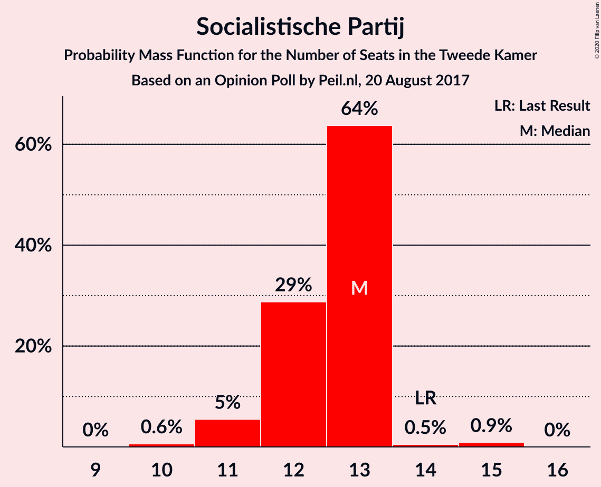

| Number of Seats | Probability | Accumulated | Special Marks |
|:---------------:|:-----------:|:-----------:|:-------------:|
| 10 | 0.7% | 100% |  |
| 11 | 6% | 99.3% |  |
| 12 | 33% | 93% |  |
| 13 | 59% | 60% | Median |
| 14 | 0.1% | 1.3% | Last Result |
| 15 | 1.2% | 1.2% |  |
| 16 | 0% | 0% |  |

### Partij van de Arbeid

*For a full overview of the results for this party, see the [Partij van de Arbeid](party-partijvandearbeid.html) page.*

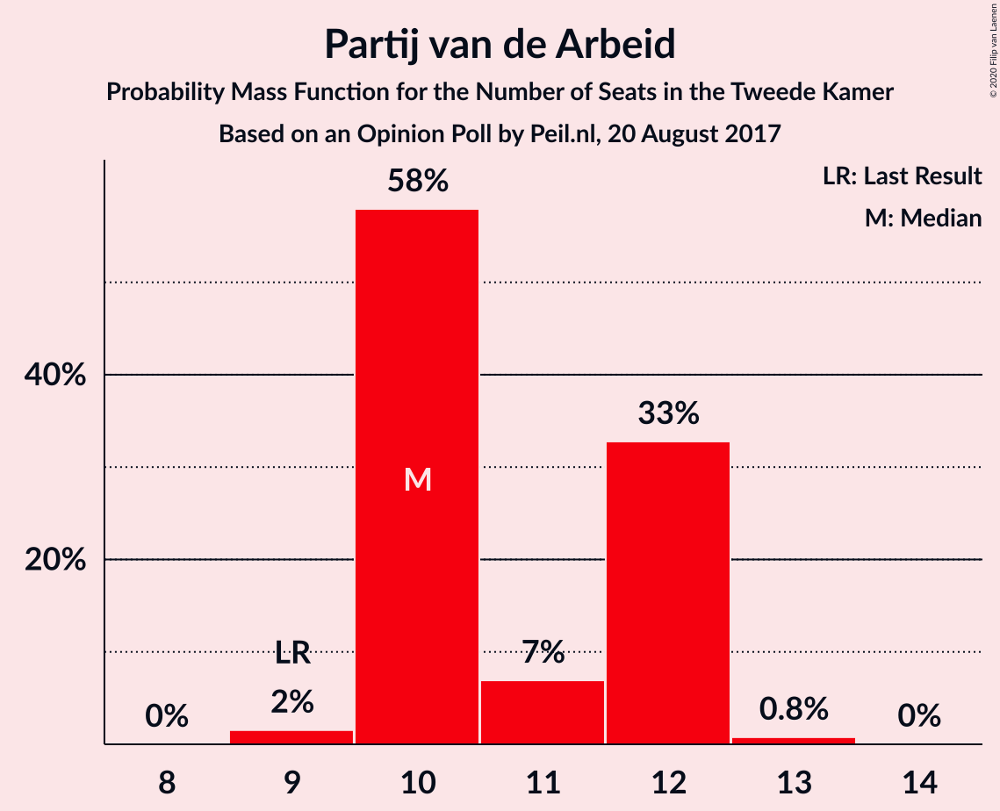

| Number of Seats | Probability | Accumulated | Special Marks |
|:---------------:|:-----------:|:-----------:|:-------------:|
| 9 | 2% | 100% | Last Result |
| 10 | 58% | 98% | Median |
| 11 | 7% | 41% |  |
| 12 | 33% | 34% |  |
| 13 | 0.8% | 0.8% |  |
| 14 | 0% | 0% |  |

### Forum voor Democratie

*For a full overview of the results for this party, see the [Forum voor Democratie](party-forumvoordemocratie.html) page.*

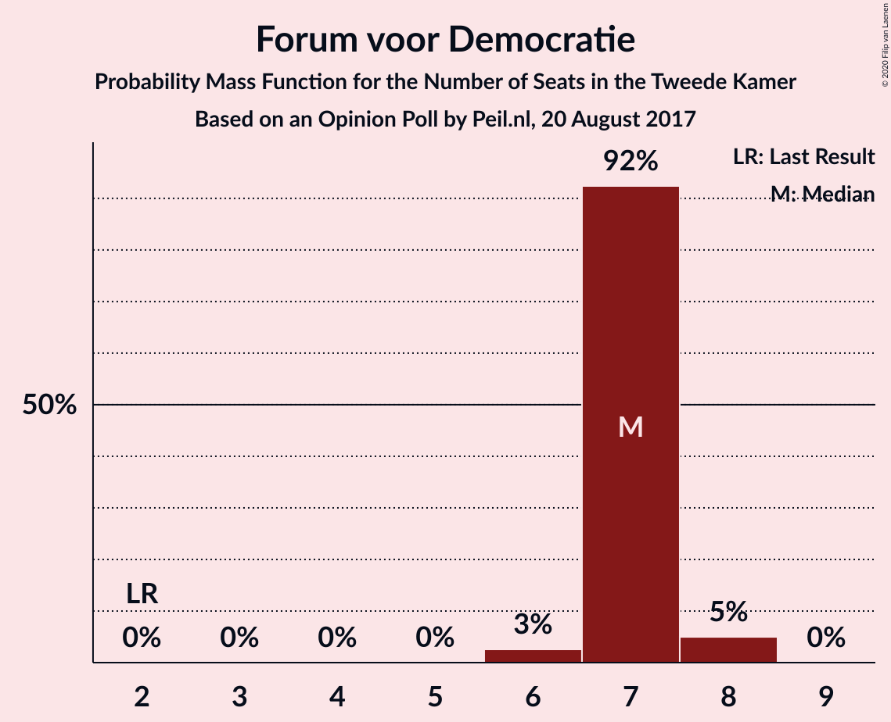

| Number of Seats | Probability | Accumulated | Special Marks |
|:---------------:|:-----------:|:-----------:|:-------------:|
| 2 | 0% | 100% | Last Result |
| 3 | 0% | 100% |  |
| 4 | 0% | 100% |  |
| 5 | 0.2% | 100% |  |
| 6 | 2% | 99.8% |  |
| 7 | 93% | 97% | Median |
| 8 | 5% | 5% |  |
| 9 | 0% | 0% |  |

### Partij voor de Dieren

*For a full overview of the results for this party, see the [Partij voor de Dieren](party-partijvoordedieren.html) page.*

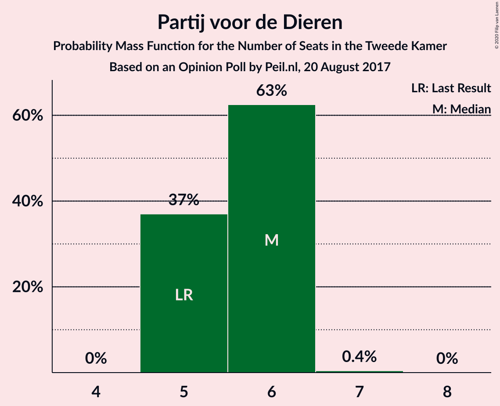

| Number of Seats | Probability | Accumulated | Special Marks |
|:---------------:|:-----------:|:-----------:|:-------------:|
| 4 | 0.1% | 100% |  |
| 5 | 39% | 99.9% | Last Result |
| 6 | 58% | 61% | Median |
| 7 | 2% | 3% |  |
| 8 | 0% | 0% |  |

### ChristenUnie

*For a full overview of the results for this party, see the [ChristenUnie](party-christenunie.html) page.*

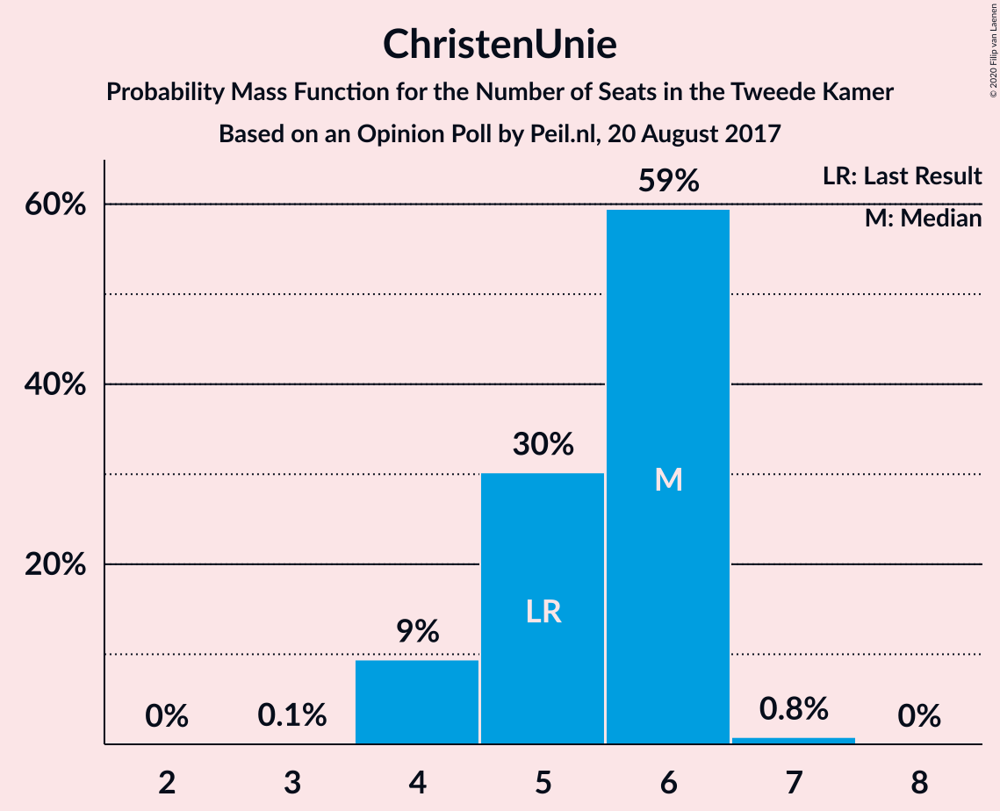

| Number of Seats | Probability | Accumulated | Special Marks |
|:---------------:|:-----------:|:-----------:|:-------------:|
| 3 | 0.1% | 100% |  |
| 4 | 8% | 99.9% |  |
| 5 | 40% | 92% | Last Result |
| 6 | 52% | 52% | Median |
| 7 | 0% | 0% |  |

### 50Plus

*For a full overview of the results for this party, see the [50Plus](party-50plus.html) page.*

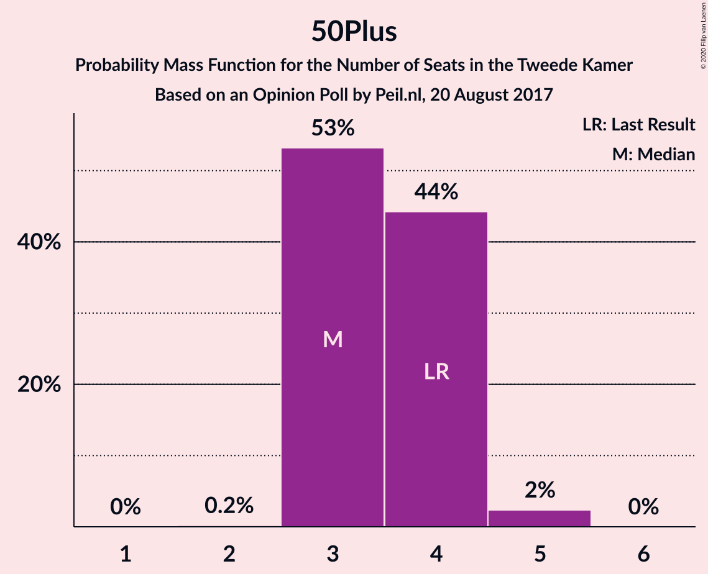

| Number of Seats | Probability | Accumulated | Special Marks |
|:---------------:|:-----------:|:-----------:|:-------------:|
| 2 | 0.2% | 100% |  |
| 3 | 53% | 99.8% | Median |
| 4 | 44% | 47% | Last Result |
| 5 | 2% | 2% |  |
| 6 | 0% | 0% |  |

### Staatkundig Gereformeerde Partij

*For a full overview of the results for this party, see the [Staatkundig Gereformeerde Partij](party-staatkundiggereformeerdepartij.html) page.*

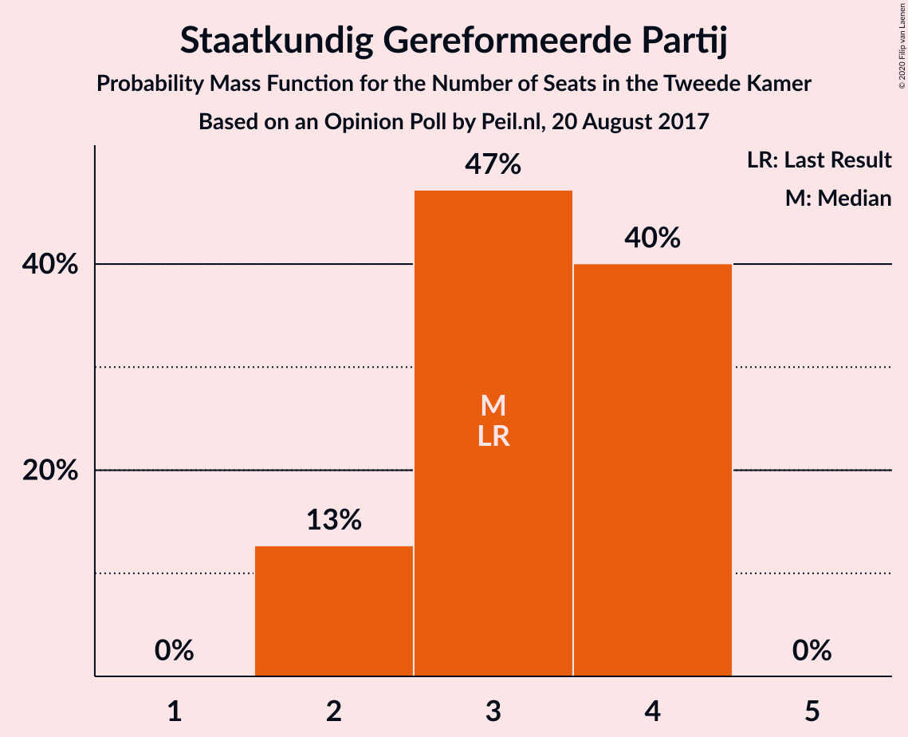

| Number of Seats | Probability | Accumulated | Special Marks |
|:---------------:|:-----------:|:-----------:|:-------------:|
| 2 | 11% | 100% |  |
| 3 | 36% | 89% | Last Result |
| 4 | 53% | 53% | Median |
| 5 | 0% | 0% |  |

### DENK

*For a full overview of the results for this party, see the [DENK](party-denk.html) page.*

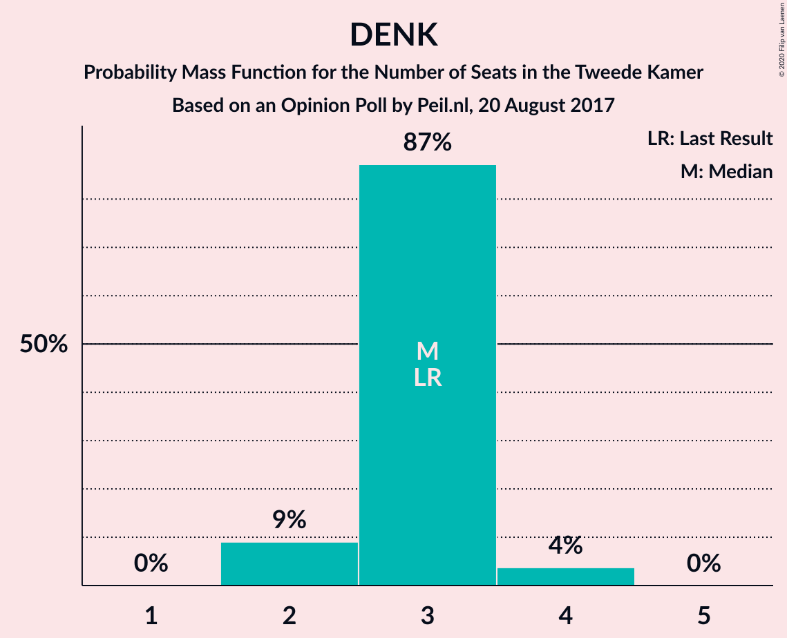

| Number of Seats | Probability | Accumulated | Special Marks |
|:---------------:|:-----------:|:-----------:|:-------------:|
| 2 | 5% | 100% |  |
| 3 | 90% | 95% | Last Result, Median |
| 4 | 5% | 5% |  |
| 5 | 0% | 0% |  |

## Coalitions

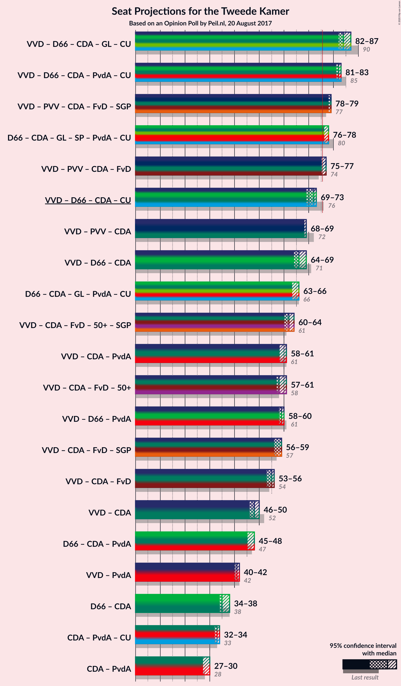

### Confidence Intervals

| Coalition | Last Result | Median | Majority? | 80% Confidence Interval | 90% Confidence Interval | 95% Confidence Interval | 99% Confidence Interval |
|:---------:|:-----------:|:------:|:---------:|:-----------------------:|:-----------------------:|:-----------------------:|:-----------------------:|
| Volkspartij voor Vrijheid en Democratie – Democraten 66 – Christen-Democratisch Appèl – GroenLinks – ChristenUnie | 90 | 84 | 100% | 82–84 | 82–86 | 82–87 | 82–88 |
| Volkspartij voor Vrijheid en Democratie – Democraten 66 – Christen-Democratisch Appèl – Partij van de Arbeid – ChristenUnie | 85 | 82 | 100% | 81–82 | 81–83 | 81–83 | 81–88 |
| Volkspartij voor Vrijheid en Democratie – Partij voor de Vrijheid – Christen-Democratisch Appèl – Forum voor Democratie – Staatkundig Gereformeerde Partij | 77 | 79 | 99.8% | 78–79 | 78–79 | 78–79 | 76–80 |
| Democraten 66 – Christen-Democratisch Appèl – GroenLinks – Socialistische Partij – Partij van de Arbeid – ChristenUnie | 80 | 76 | 98% | 76–77 | 76–77 | 76–78 | 75–80 |
| Volkspartij voor Vrijheid en Democratie – Partij voor de Vrijheid – Christen-Democratisch Appèl – Forum voor Democratie | 74 | 75 | 13% | 75–76 | 75–76 | 75–77 | 74–77 |
| Volkspartij voor Vrijheid en Democratie – Democraten 66 – Christen-Democratisch Appèl – ChristenUnie | 76 | 72 | 0.2% | 69–72 | 69–73 | 69–73 | 69–75 |
| Volkspartij voor Vrijheid en Democratie – Partij voor de Vrijheid – Christen-Democratisch Appèl | 72 | 68 | 0% | 68–69 | 68–69 | 68–69 | 67–70 |
| Volkspartij voor Vrijheid en Democratie – Democraten 66 – Christen-Democratisch Appèl | 71 | 66 | 0% | 64–67 | 64–68 | 64–69 | 64–70 |
| Democraten 66 – Christen-Democratisch Appèl – GroenLinks – Partij van de Arbeid – ChristenUnie | 66 | 63 | 0% | 63–64 | 63–66 | 63–66 | 62–70 |
| Volkspartij voor Vrijheid en Democratie – Christen-Democratisch Appèl – Forum voor Democratie – 50Plus – Staatkundig Gereformeerde Partij | 61 | 62 | 0% | 60–62 | 60–63 | 60–64 | 60–64 |
| Volkspartij voor Vrijheid en Democratie – Christen-Democratisch Appèl – Partij van de Arbeid | 61 | 58 | 0% | 58–59 | 58–59 | 58–61 | 57–62 |
| Volkspartij voor Vrijheid en Democratie – Christen-Democratisch Appèl – Forum voor Democratie – 50Plus | 58 | 58 | 0% | 57–59 | 57–60 | 57–61 | 57–61 |
| Volkspartij voor Vrijheid en Democratie – Democraten 66 – Partij van de Arbeid | 61 | 59 | 0% | 59–60 | 59–60 | 58–60 | 58–64 |
| Volkspartij voor Vrijheid en Democratie – Christen-Democratisch Appèl – Forum voor Democratie – Staatkundig Gereformeerde Partij | 57 | 59 | 0% | 56–59 | 56–59 | 56–59 | 56–61 |
| Volkspartij voor Vrijheid en Democratie – Christen-Democratisch Appèl – Forum voor Democratie | 54 | 55 | 0% | 53–55 | 53–56 | 53–56 | 53–57 |
| Volkspartij voor Vrijheid en Democratie – Christen-Democratisch Appèl | 52 | 48 | 0% | 46–48 | 46–49 | 46–50 | 46–50 |
| Democraten 66 – Christen-Democratisch Appèl – Partij van de Arbeid | 47 | 45 | 0% | 45–48 | 45–48 | 45–48 | 45–51 |
| Volkspartij voor Vrijheid en Democratie – Partij van de Arbeid | 42 | 41 | 0% | 41–42 | 40–42 | 40–42 | 40–44 |
| Democraten 66 – Christen-Democratisch Appèl | 38 | 35 | 0% | 34–37 | 34–38 | 34–38 | 34–38 |
| Christen-Democratisch Appèl – Partij van de Arbeid – ChristenUnie | 33 | 33 | 0% | 33 | 33–34 | 32–34 | 31–37 |
| Christen-Democratisch Appèl – Partij van de Arbeid | 28 | 27 | 0% | 27–28 | 27–30 | 27–30 | 27–31 |

### Volkspartij voor Vrijheid en Democratie – Democraten 66 – Christen-Democratisch Appèl – GroenLinks – ChristenUnie

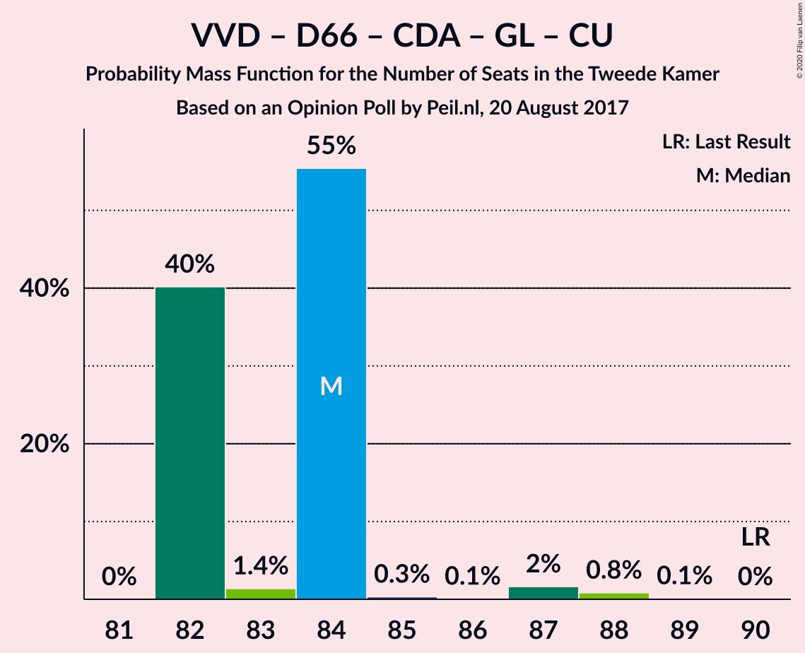

| Number of Seats | Probability | Accumulated | Special Marks |
|:---------------:|:-----------:|:-----------:|:-------------:|
| 82 | 37% | 100% |  |
| 83 | 1.3% | 63% |  |
| 84 | 53% | 62% | Median |
| 85 | 0.4% | 8% |  |
| 86 | 5% | 8% |  |
| 87 | 2% | 3% |  |
| 88 | 0.9% | 1.1% |  |
| 89 | 0.1% | 0.1% |  |
| 90 | 0% | 0% | Last Result |

### Volkspartij voor Vrijheid en Democratie – Democraten 66 – Christen-Democratisch Appèl – Partij van de Arbeid – ChristenUnie

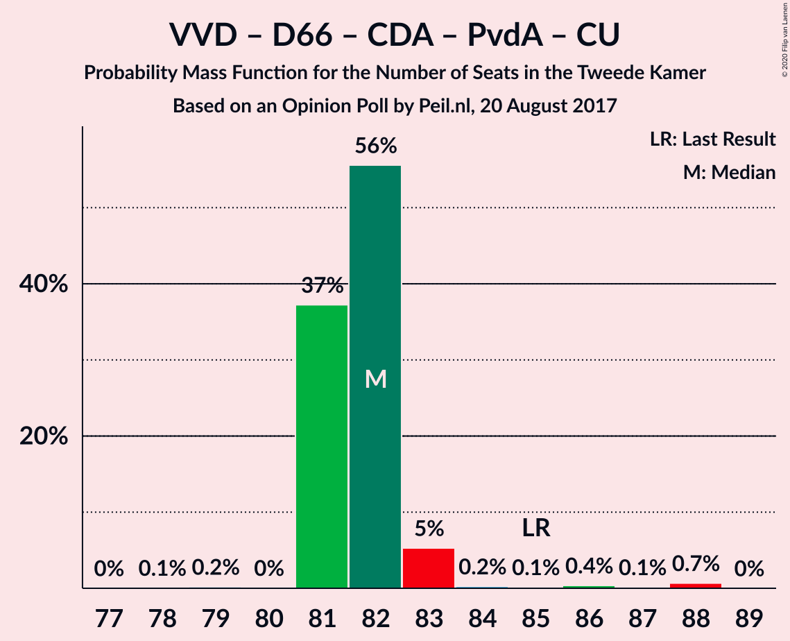

| Number of Seats | Probability | Accumulated | Special Marks |
|:---------------:|:-----------:|:-----------:|:-------------:|
| 78 | 0.1% | 100% |  |
| 79 | 0.2% | 99.9% |  |
| 80 | 0% | 99.7% |  |
| 81 | 37% | 99.7% |  |
| 82 | 56% | 62% | Median |
| 83 | 5% | 7% |  |
| 84 | 0.2% | 2% |  |
| 85 | 0.1% | 1.3% | Last Result |
| 86 | 0.4% | 1.2% |  |
| 87 | 0.1% | 0.8% |  |
| 88 | 0.7% | 0.7% |  |
| 89 | 0% | 0% |  |

### Volkspartij voor Vrijheid en Democratie – Partij voor de Vrijheid – Christen-Democratisch Appèl – Forum voor Democratie – Staatkundig Gereformeerde Partij

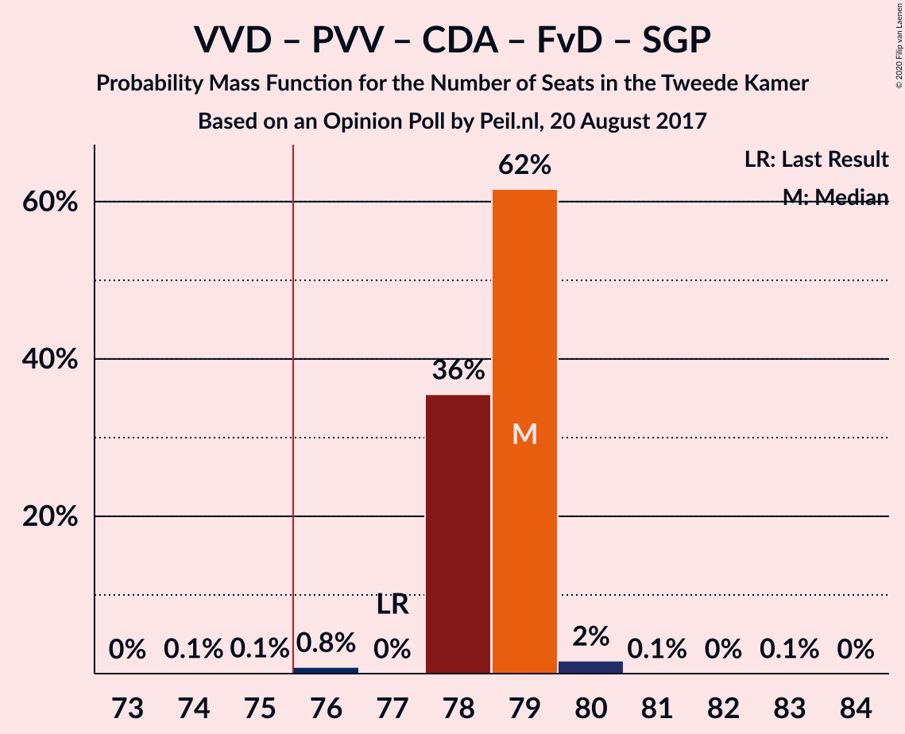

| Number of Seats | Probability | Accumulated | Special Marks |
|:---------------:|:-----------:|:-----------:|:-------------:|
| 74 | 0.1% | 100% |  |
| 75 | 0.1% | 99.9% |  |
| 76 | 0.8% | 99.8% | Majority |
| 77 | 0% | 99.0% | Last Result |
| 78 | 40% | 99.0% |  |
| 79 | 57% | 59% | Median |
| 80 | 2% | 2% |  |
| 81 | 0.1% | 0.2% |  |
| 82 | 0.1% | 0.2% |  |
| 83 | 0.1% | 0.1% |  |
| 84 | 0% | 0% |  |

### Democraten 66 – Christen-Democratisch Appèl – GroenLinks – Socialistische Partij – Partij van de Arbeid – ChristenUnie

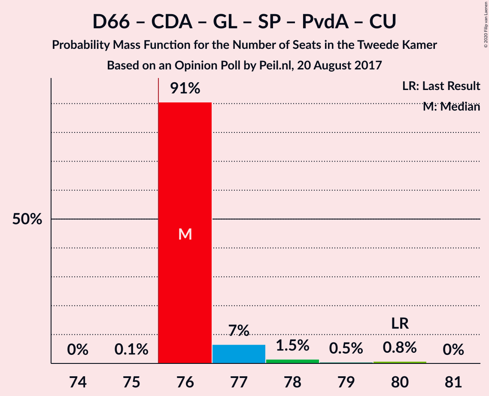

| Number of Seats | Probability | Accumulated | Special Marks |
|:---------------:|:-----------:|:-----------:|:-------------:|
| 73 | 0.1% | 100% |  |
| 74 | 0.1% | 99.9% |  |
| 75 | 2% | 99.8% |  |
| 76 | 84% | 98% | Median, Majority |
| 77 | 11% | 14% |  |
| 78 | 2% | 3% |  |
| 79 | 0.4% | 1.1% |  |
| 80 | 0.7% | 0.7% | Last Result |
| 81 | 0% | 0% |  |

### Volkspartij voor Vrijheid en Democratie – Partij voor de Vrijheid – Christen-Democratisch Appèl – Forum voor Democratie

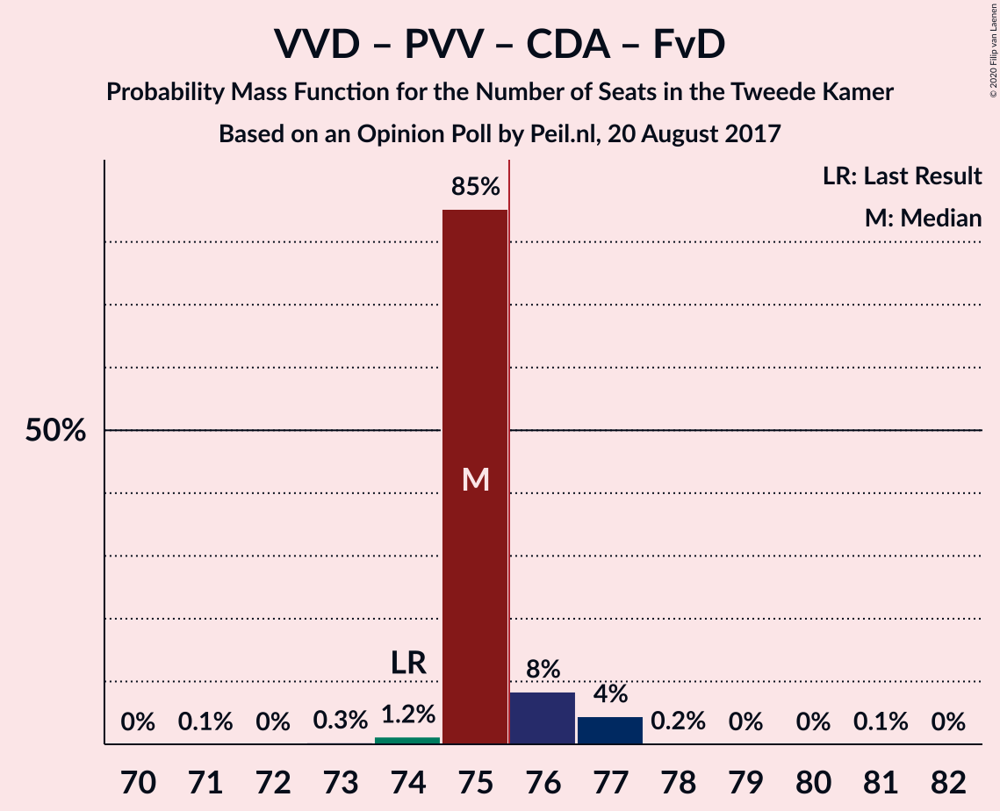

| Number of Seats | Probability | Accumulated | Special Marks |
|:---------------:|:-----------:|:-----------:|:-------------:|
| 71 | 0.1% | 100% |  |
| 72 | 0% | 99.9% |  |
| 73 | 0.3% | 99.9% |  |
| 74 | 1.2% | 99.6% | Last Result |
| 75 | 85% | 98% | Median |
| 76 | 8% | 13% | Majority |
| 77 | 4% | 5% |  |
| 78 | 0.2% | 0.3% |  |
| 79 | 0% | 0.1% |  |
| 80 | 0% | 0.1% |  |
| 81 | 0.1% | 0.1% |  |
| 82 | 0% | 0% |  |

### Volkspartij voor Vrijheid en Democratie – Democraten 66 – Christen-Democratisch Appèl – ChristenUnie

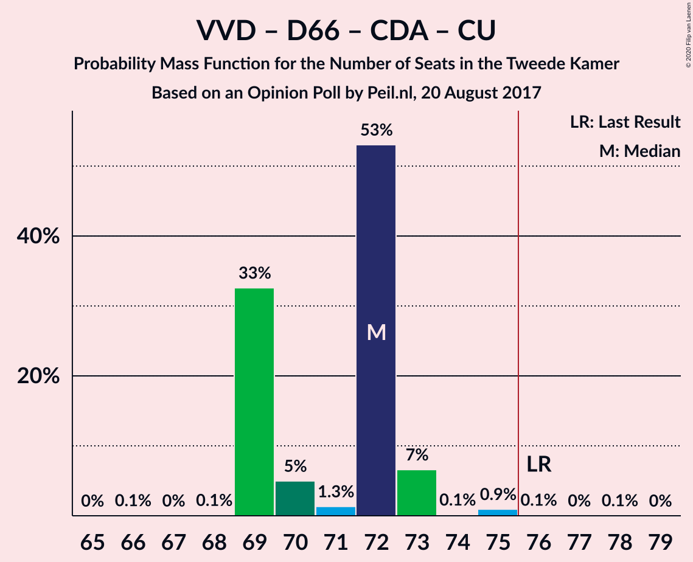

| Number of Seats | Probability | Accumulated | Special Marks |
|:---------------:|:-----------:|:-----------:|:-------------:|
| 66 | 0.1% | 100% |  |
| 67 | 0% | 99.9% |  |
| 68 | 0.1% | 99.9% |  |
| 69 | 33% | 99.8% |  |
| 70 | 5% | 67% |  |
| 71 | 1.3% | 62% |  |
| 72 | 53% | 61% | Median |
| 73 | 7% | 8% |  |
| 74 | 0.1% | 1.3% |  |
| 75 | 0.9% | 1.1% |  |
| 76 | 0.1% | 0.2% | Last Result, Majority |
| 77 | 0% | 0.1% |  |
| 78 | 0.1% | 0.1% |  |
| 79 | 0% | 0% |  |

### Volkspartij voor Vrijheid en Democratie – Partij voor de Vrijheid – Christen-Democratisch Appèl

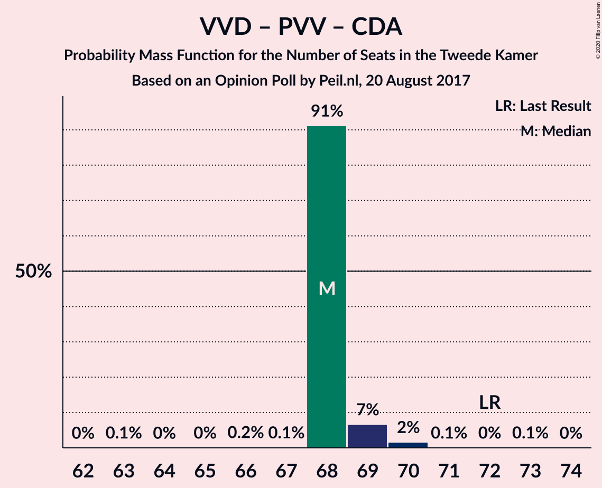

| Number of Seats | Probability | Accumulated | Special Marks |
|:---------------:|:-----------:|:-----------:|:-------------:|
| 63 | 0.1% | 100% |  |
| 64 | 0% | 99.9% |  |
| 65 | 0% | 99.9% |  |
| 66 | 0.3% | 99.9% |  |
| 67 | 0.6% | 99.6% |  |
| 68 | 86% | 99.0% | Median |
| 69 | 11% | 13% |  |
| 70 | 2% | 2% |  |
| 71 | 0.3% | 0.4% |  |
| 72 | 0.1% | 0.1% | Last Result |
| 73 | 0.1% | 0.1% |  |
| 74 | 0% | 0% |  |

### Volkspartij voor Vrijheid en Democratie – Democraten 66 – Christen-Democratisch Appèl

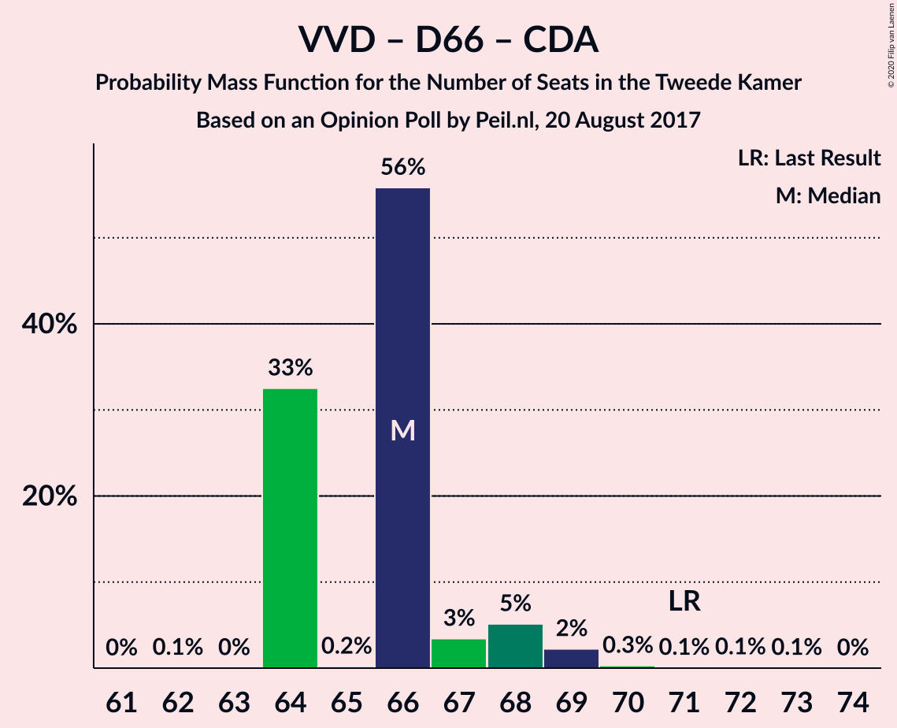

| Number of Seats | Probability | Accumulated | Special Marks |
|:---------------:|:-----------:|:-----------:|:-------------:|
| 62 | 0.1% | 100% |  |
| 63 | 0% | 99.9% |  |
| 64 | 33% | 99.9% |  |
| 65 | 0.2% | 67% |  |
| 66 | 56% | 67% | Median |
| 67 | 3% | 11% |  |
| 68 | 5% | 8% |  |
| 69 | 2% | 3% |  |
| 70 | 0.3% | 0.5% |  |
| 71 | 0.1% | 0.2% | Last Result |
| 72 | 0.1% | 0.2% |  |
| 73 | 0.1% | 0.1% |  |
| 74 | 0% | 0% |  |

### Democraten 66 – Christen-Democratisch Appèl – GroenLinks – Partij van de Arbeid – ChristenUnie

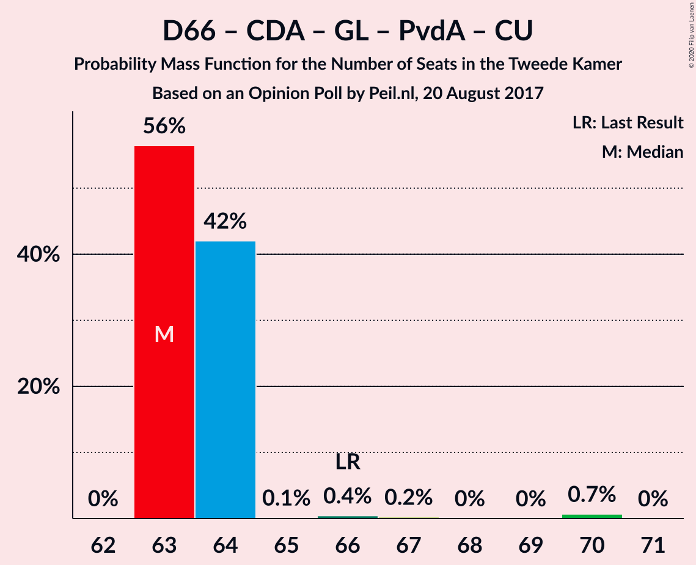

| Number of Seats | Probability | Accumulated | Special Marks |
|:---------------:|:-----------:|:-----------:|:-------------:|
| 61 | 0.1% | 100% |  |
| 62 | 2% | 99.9% |  |
| 63 | 52% | 98% | Median |
| 64 | 39% | 46% |  |
| 65 | 0.7% | 7% |  |
| 66 | 5% | 6% | Last Result |
| 67 | 0.4% | 1.0% |  |
| 68 | 0% | 0.6% |  |
| 69 | 0% | 0.6% |  |
| 70 | 0.6% | 0.6% |  |
| 71 | 0% | 0% |  |

### Volkspartij voor Vrijheid en Democratie – Christen-Democratisch Appèl – Forum voor Democratie – 50Plus – Staatkundig Gereformeerde Partij

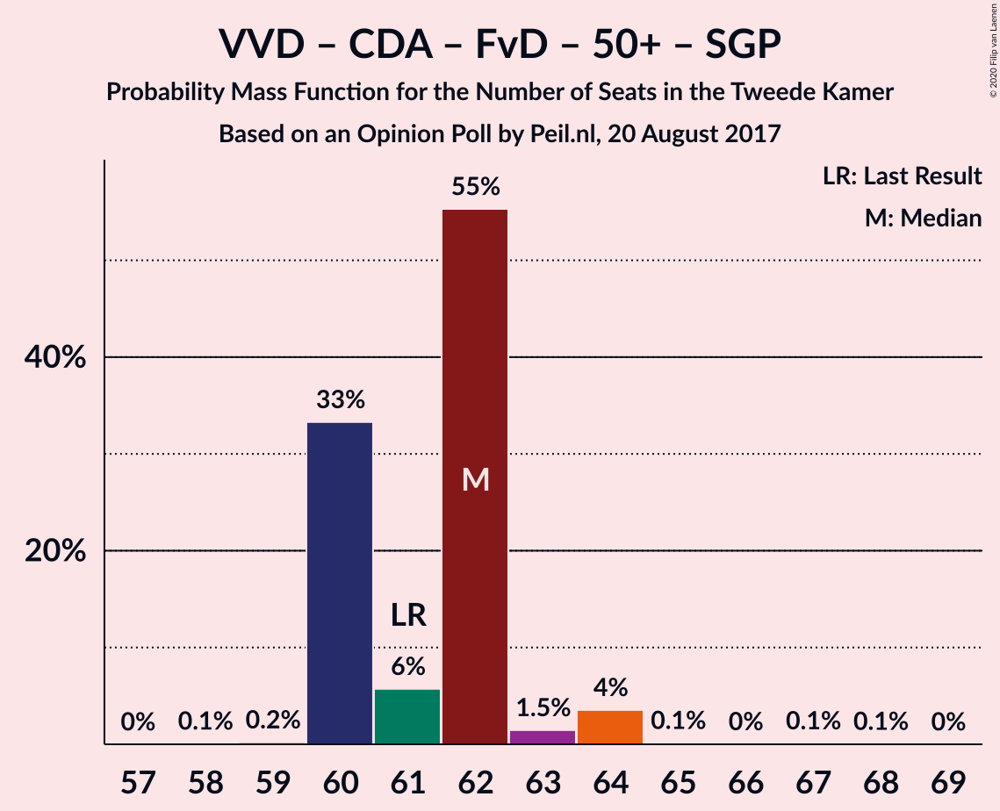

| Number of Seats | Probability | Accumulated | Special Marks |
|:---------------:|:-----------:|:-----------:|:-------------:|
| 58 | 0.1% | 100% |  |
| 59 | 0.2% | 99.9% |  |
| 60 | 33% | 99.7% |  |
| 61 | 6% | 66% | Last Result |
| 62 | 55% | 61% | Median |
| 63 | 1.5% | 5% |  |
| 64 | 4% | 4% |  |
| 65 | 0.1% | 0.3% |  |
| 66 | 0% | 0.2% |  |
| 67 | 0.1% | 0.2% |  |
| 68 | 0.1% | 0.1% |  |
| 69 | 0% | 0% |  |

### Volkspartij voor Vrijheid en Democratie – Christen-Democratisch Appèl – Partij van de Arbeid

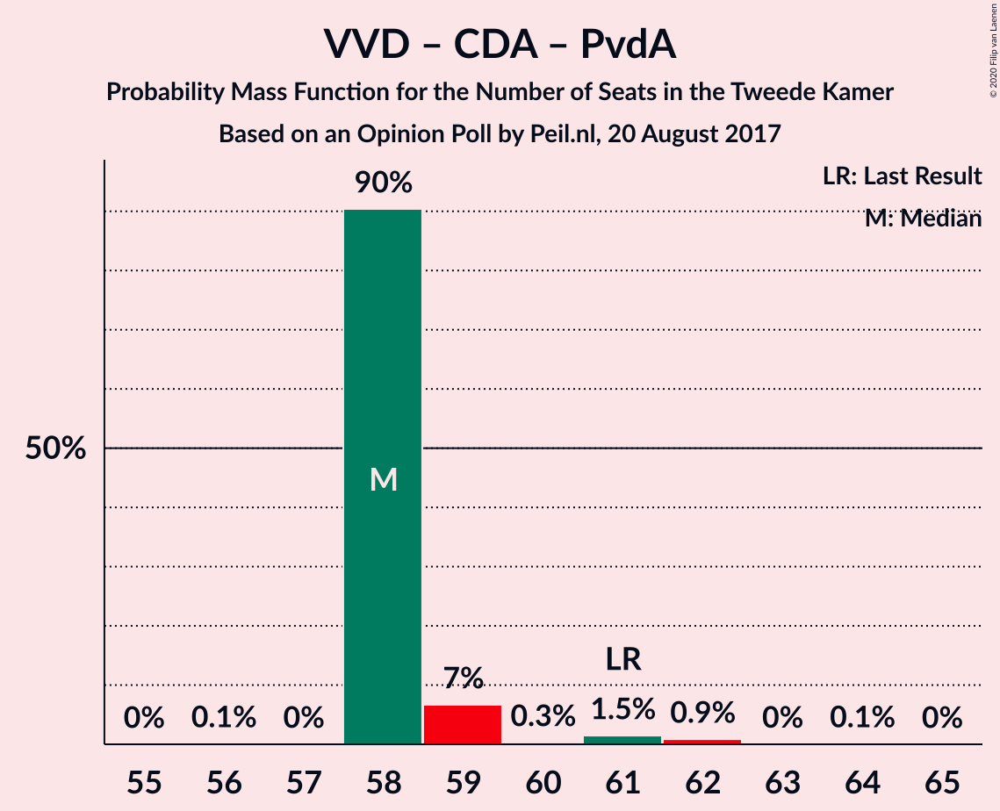

| Number of Seats | Probability | Accumulated | Special Marks |
|:---------------:|:-----------:|:-----------:|:-------------:|
| 56 | 0.2% | 100% |  |
| 57 | 0.5% | 99.8% |  |
| 58 | 88% | 99.3% | Median |
| 59 | 8% | 11% |  |
| 60 | 0.5% | 3% |  |
| 61 | 1.5% | 3% | Last Result |
| 62 | 0.8% | 1.0% |  |
| 63 | 0.1% | 0.2% |  |
| 64 | 0.1% | 0.1% |  |
| 65 | 0% | 0% |  |

### Volkspartij voor Vrijheid en Democratie – Christen-Democratisch Appèl – Forum voor Democratie – 50Plus

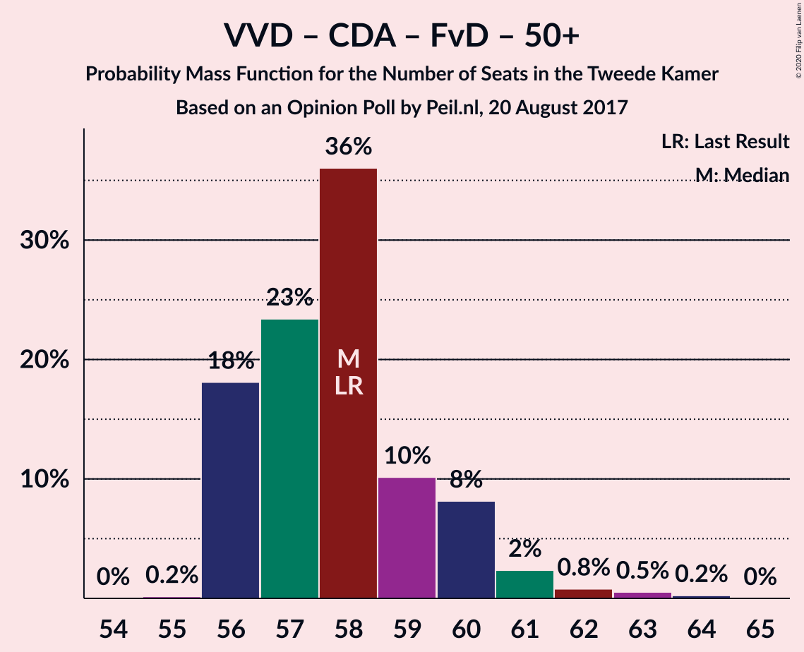

| Number of Seats | Probability | Accumulated | Special Marks |
|:---------------:|:-----------:|:-----------:|:-------------:|
| 55 | 0.1% | 100% |  |
| 56 | 0.3% | 99.9% |  |
| 57 | 33% | 99.7% |  |
| 58 | 51% | 66% | Last Result, Median |
| 59 | 5% | 15% |  |
| 60 | 7% | 10% |  |
| 61 | 2% | 3% |  |
| 62 | 0.1% | 0.3% |  |
| 63 | 0.1% | 0.2% |  |
| 64 | 0.1% | 0.1% |  |
| 65 | 0% | 0.1% |  |
| 66 | 0.1% | 0.1% |  |
| 67 | 0% | 0% |  |

### Volkspartij voor Vrijheid en Democratie – Democraten 66 – Partij van de Arbeid

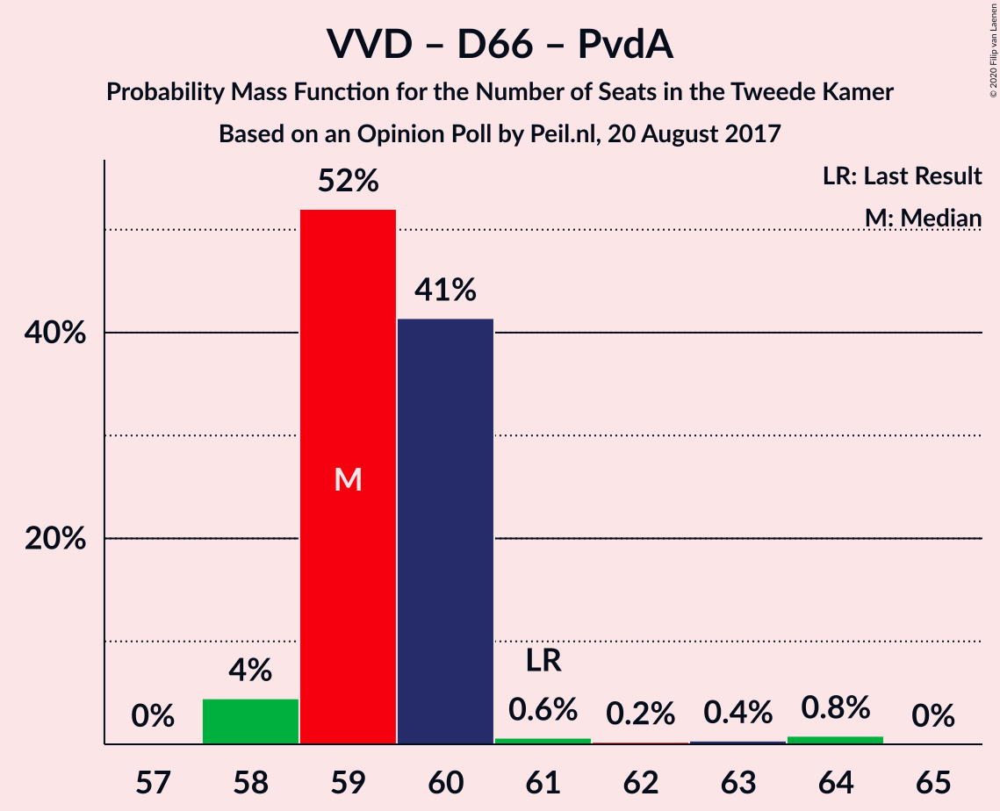

| Number of Seats | Probability | Accumulated | Special Marks |
|:---------------:|:-----------:|:-----------:|:-------------:|
| 57 | 0% | 100% |  |
| 58 | 4% | 99.9% |  |
| 59 | 52% | 95% | Median |
| 60 | 41% | 43% |  |
| 61 | 0.6% | 2% | Last Result |
| 62 | 0.2% | 1.4% |  |
| 63 | 0.4% | 1.2% |  |
| 64 | 0.8% | 0.8% |  |
| 65 | 0% | 0% |  |

### Volkspartij voor Vrijheid en Democratie – Christen-Democratisch Appèl – Forum voor Democratie – Staatkundig Gereformeerde Partij

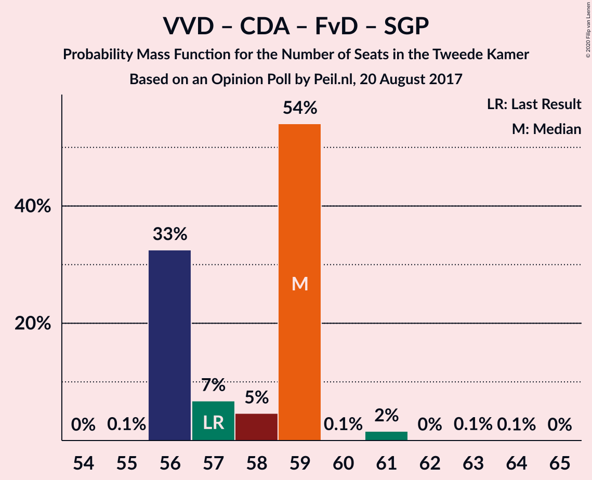

| Number of Seats | Probability | Accumulated | Special Marks |
|:---------------:|:-----------:|:-----------:|:-------------:|
| 55 | 0.1% | 100% |  |
| 56 | 33% | 99.9% |  |
| 57 | 7% | 67% | Last Result |
| 58 | 5% | 61% |  |
| 59 | 54% | 56% | Median |
| 60 | 0.1% | 2% |  |
| 61 | 2% | 2% |  |
| 62 | 0% | 0.2% |  |
| 63 | 0.1% | 0.2% |  |
| 64 | 0.1% | 0.1% |  |
| 65 | 0% | 0% |  |

### Volkspartij voor Vrijheid en Democratie – Christen-Democratisch Appèl – Forum voor Democratie

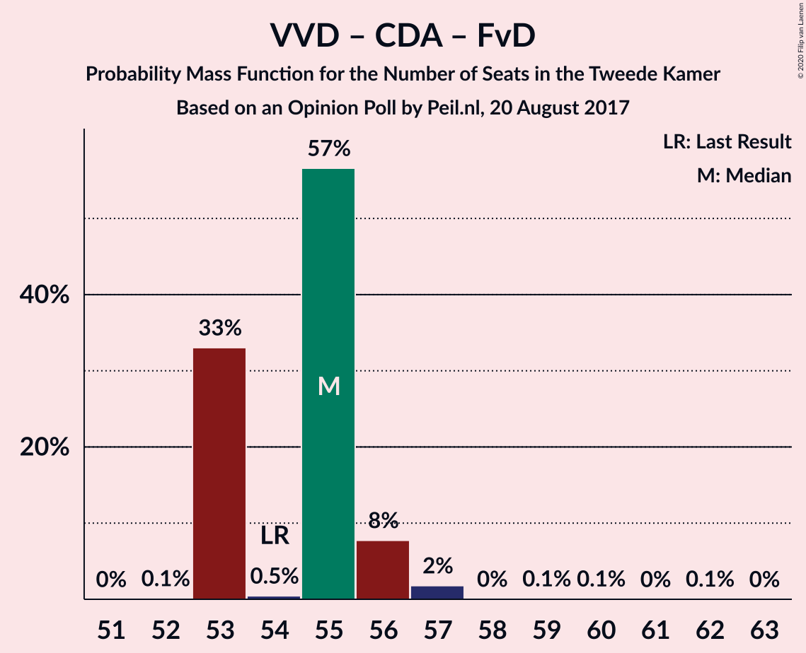

| Number of Seats | Probability | Accumulated | Special Marks |
|:---------------:|:-----------:|:-----------:|:-------------:|
| 52 | 0.1% | 100% |  |
| 53 | 33% | 99.9% |  |
| 54 | 0.5% | 67% | Last Result |
| 55 | 57% | 66% | Median |
| 56 | 8% | 10% |  |
| 57 | 2% | 2% |  |
| 58 | 0% | 0.3% |  |
| 59 | 0.1% | 0.2% |  |
| 60 | 0.1% | 0.1% |  |
| 61 | 0% | 0.1% |  |
| 62 | 0.1% | 0.1% |  |
| 63 | 0% | 0% |  |

### Volkspartij voor Vrijheid en Democratie – Christen-Democratisch Appèl

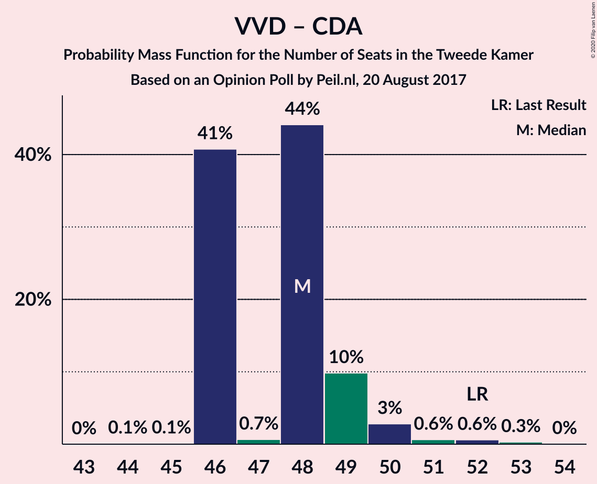

| Number of Seats | Probability | Accumulated | Special Marks |
|:---------------:|:-----------:|:-----------:|:-------------:|
| 44 | 0.1% | 100% |  |
| 45 | 0% | 99.9% |  |
| 46 | 33% | 99.9% |  |
| 47 | 0.2% | 67% |  |
| 48 | 60% | 67% | Median |
| 49 | 3% | 6% |  |
| 50 | 3% | 3% |  |
| 51 | 0.1% | 0.3% |  |
| 52 | 0.1% | 0.2% | Last Result |
| 53 | 0.1% | 0.1% |  |
| 54 | 0.1% | 0.1% |  |
| 55 | 0% | 0% |  |

### Democraten 66 – Christen-Democratisch Appèl – Partij van de Arbeid

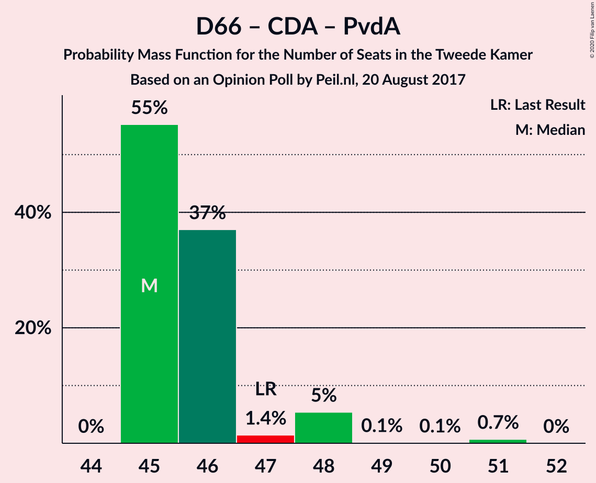

| Number of Seats | Probability | Accumulated | Special Marks |
|:---------------:|:-----------:|:-----------:|:-------------:|
| 43 | 0.1% | 100% |  |
| 44 | 0.1% | 99.9% |  |
| 45 | 53% | 99.8% | Median |
| 46 | 34% | 47% |  |
| 47 | 2% | 13% | Last Result |
| 48 | 10% | 11% |  |
| 49 | 0.3% | 1.1% |  |
| 50 | 0.1% | 0.8% |  |
| 51 | 0.6% | 0.6% |  |
| 52 | 0% | 0% |  |

### Volkspartij voor Vrijheid en Democratie – Partij van de Arbeid

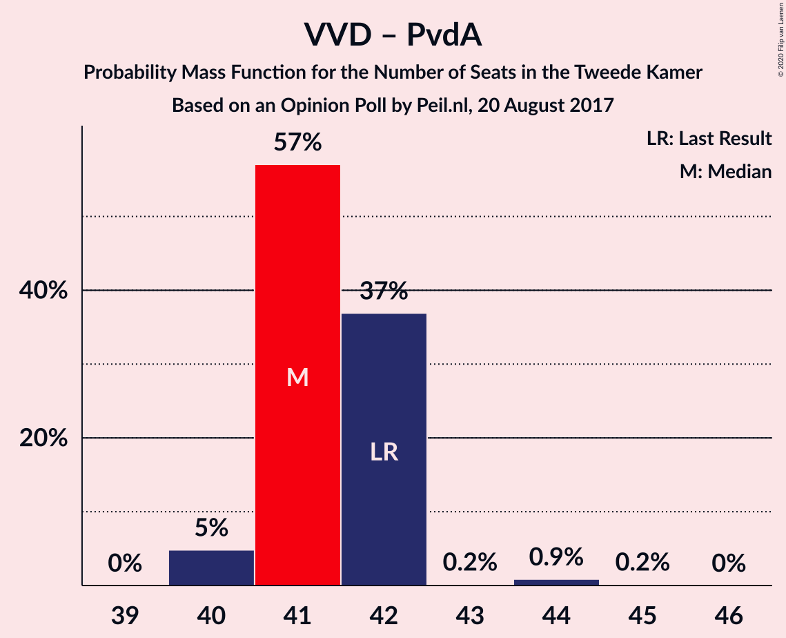

| Number of Seats | Probability | Accumulated | Special Marks |
|:---------------:|:-----------:|:-----------:|:-------------:|
| 39 | 0.1% | 100% |  |
| 40 | 9% | 99.9% |  |
| 41 | 53% | 90% | Median |
| 42 | 36% | 37% | Last Result |
| 43 | 0.3% | 2% |  |
| 44 | 1.0% | 1.2% |  |
| 45 | 0.2% | 0.2% |  |
| 46 | 0% | 0% |  |

### Democraten 66 – Christen-Democratisch Appèl

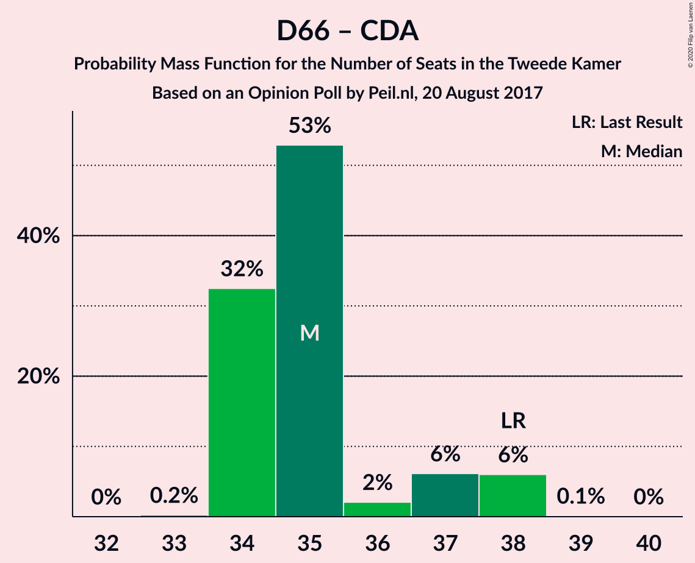

| Number of Seats | Probability | Accumulated | Special Marks |
|:---------------:|:-----------:|:-----------:|:-------------:|
| 33 | 0.2% | 100% |  |
| 34 | 32% | 99.8% |  |
| 35 | 53% | 67% | Median |
| 36 | 2% | 14% |  |
| 37 | 6% | 12% |  |
| 38 | 6% | 6% | Last Result |
| 39 | 0.1% | 0.2% |  |
| 40 | 0% | 0% |  |

### Christen-Democratisch Appèl – Partij van de Arbeid – ChristenUnie

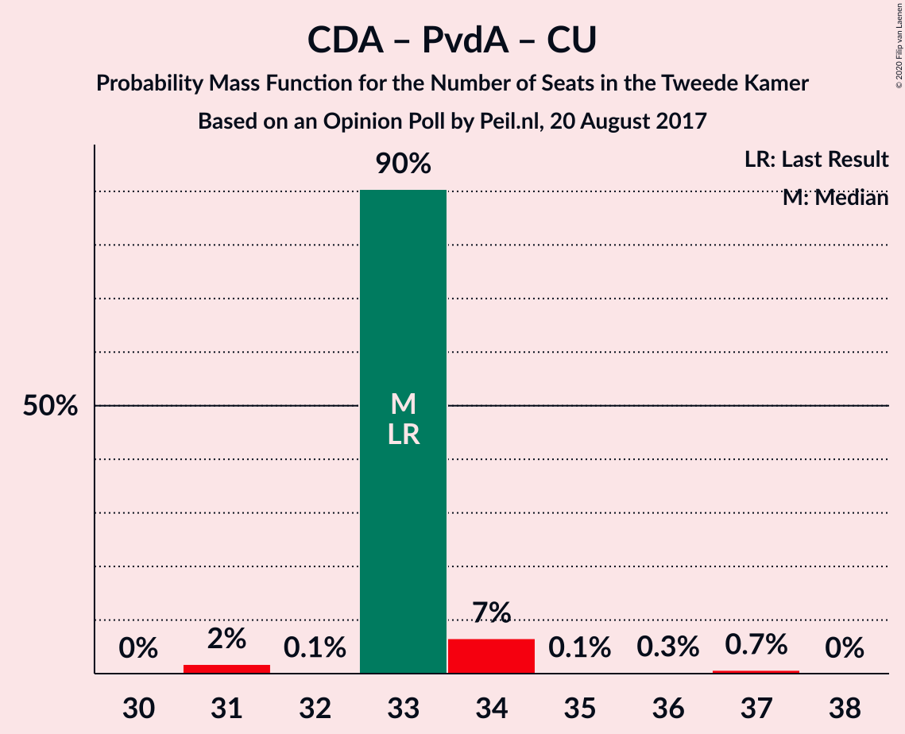

| Number of Seats | Probability | Accumulated | Special Marks |
|:---------------:|:-----------:|:-----------:|:-------------:|
| 30 | 0.1% | 100% |  |
| 31 | 2% | 99.9% |  |
| 32 | 2% | 98% |  |
| 33 | 88% | 96% | Last Result, Median |
| 34 | 6% | 7% |  |
| 35 | 0.1% | 1.0% |  |
| 36 | 0.3% | 0.9% |  |
| 37 | 0.6% | 0.6% |  |
| 38 | 0% | 0% |  |

### Christen-Democratisch Appèl – Partij van de Arbeid

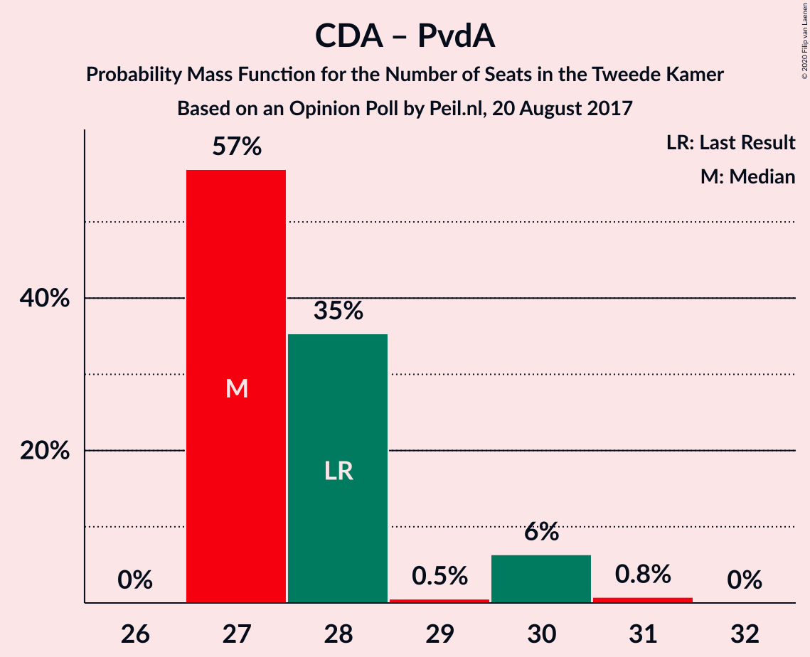

| Number of Seats | Probability | Accumulated | Special Marks |
|:---------------:|:-----------:|:-----------:|:-------------:|
| 25 | 0.1% | 100% |  |
| 26 | 0% | 99.9% |  |
| 27 | 55% | 99.9% | Median |
| 28 | 38% | 45% | Last Result |
| 29 | 0.7% | 7% |  |
| 30 | 6% | 7% |  |
| 31 | 0.7% | 0.8% |  |
| 32 | 0% | 0% |  |

## Technical Information

### Opinion Poll

+ **Polling firm:** Peil.nl
+ **Commissioner(s):** —
+ **Fieldwork period:** 20 August 2017

### Calculations

+ **Sample size:** 3000
+ **Simulations done:** 262,144
+ **Error estimate:** 1.28%

