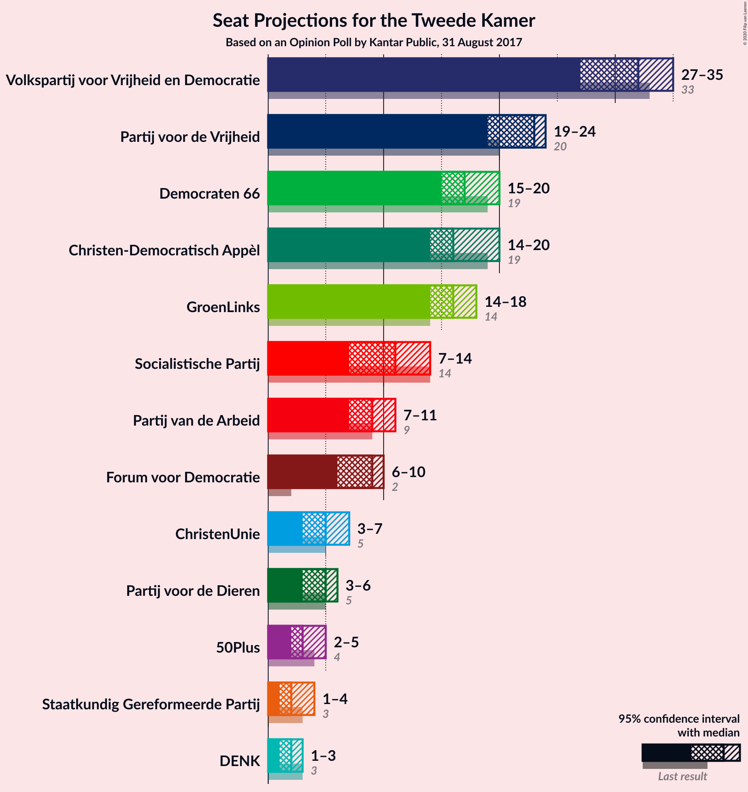
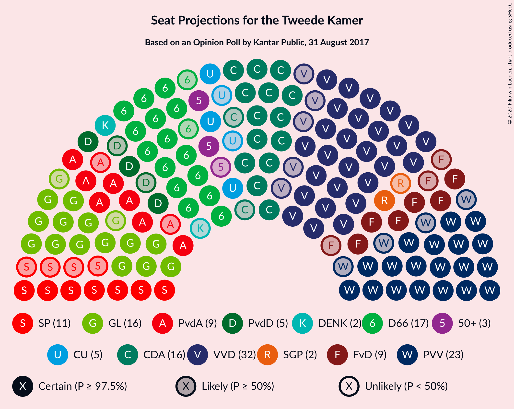
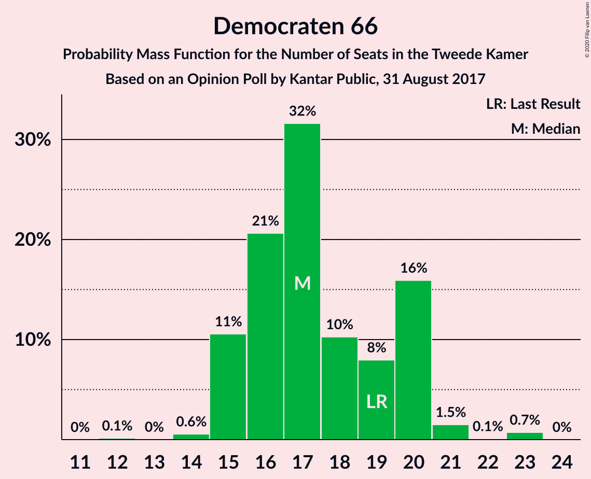
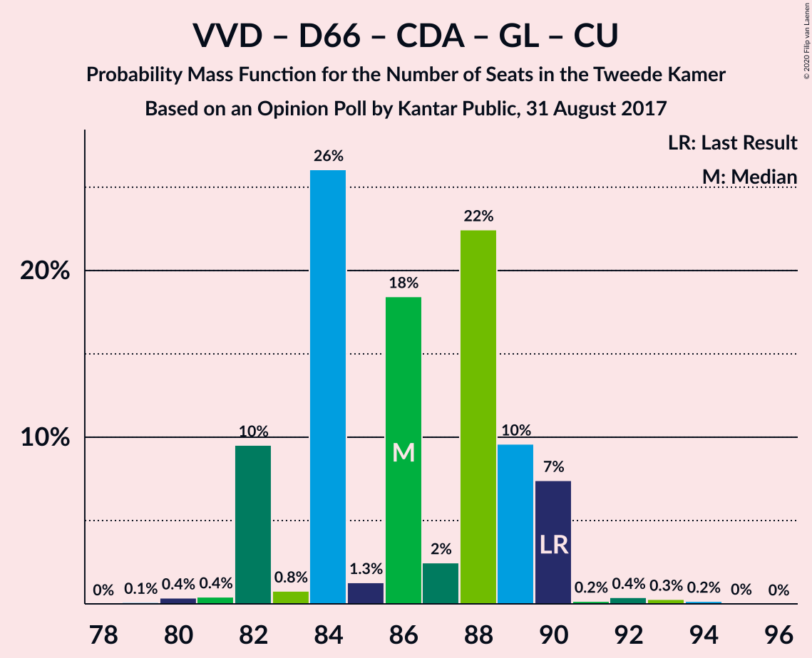
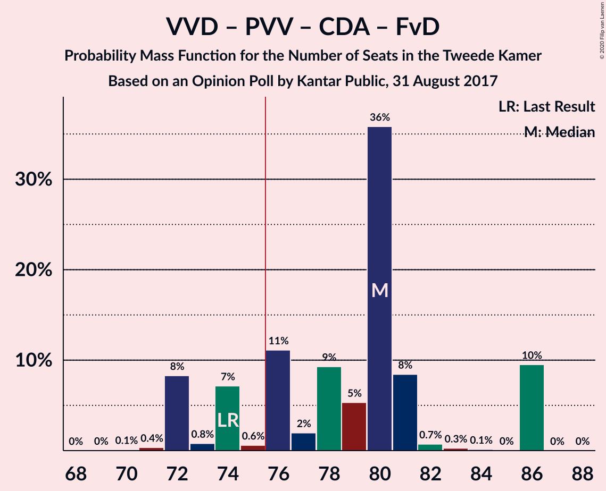
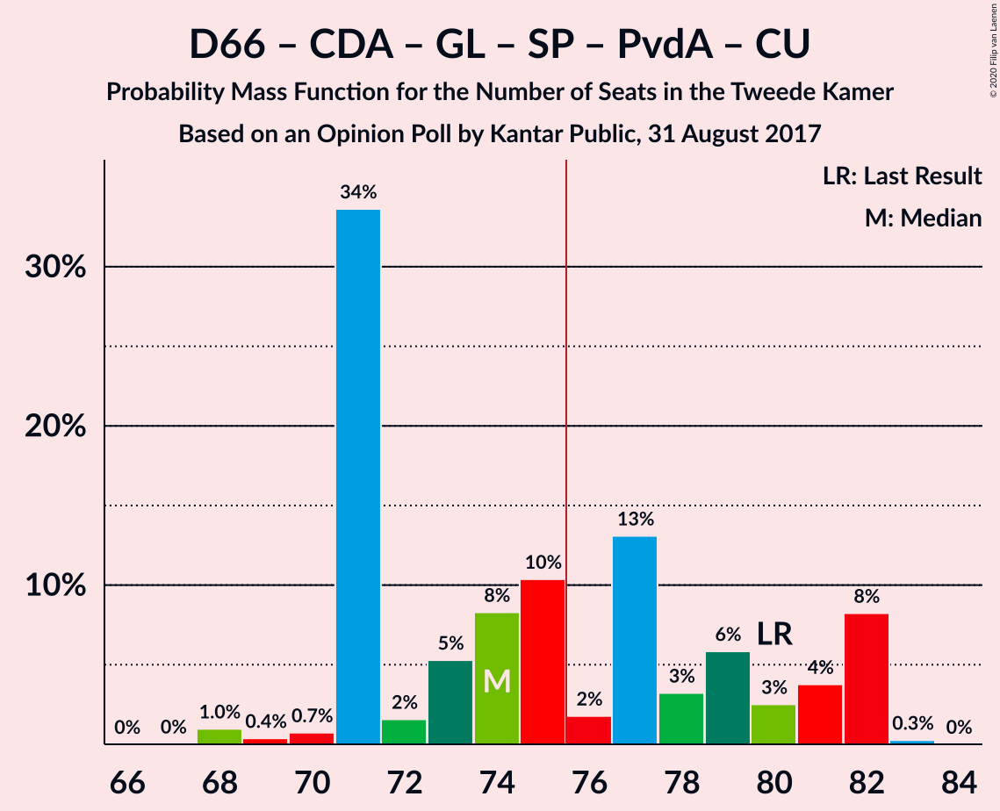
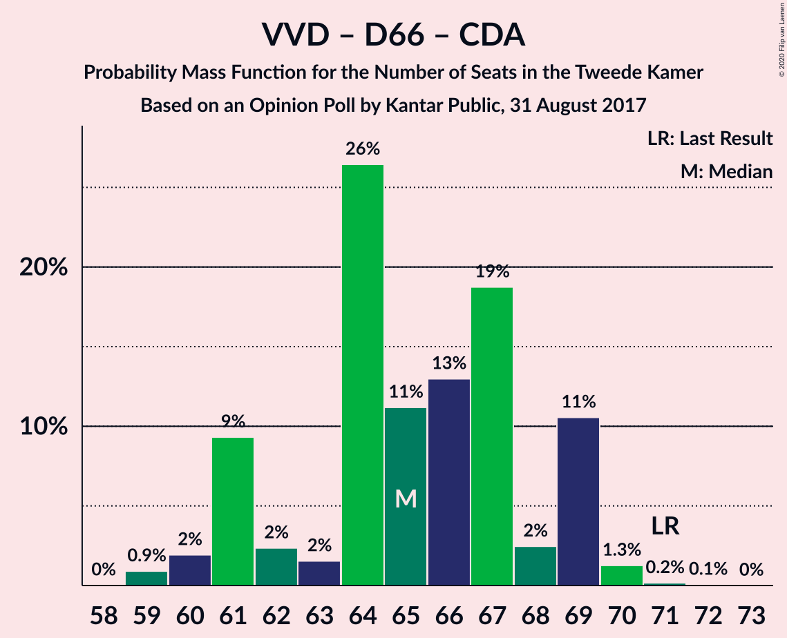
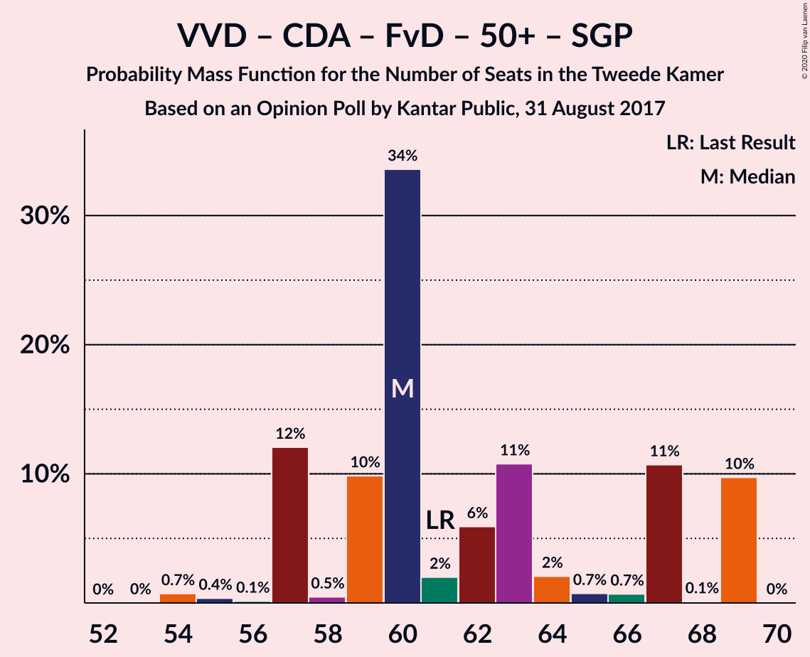
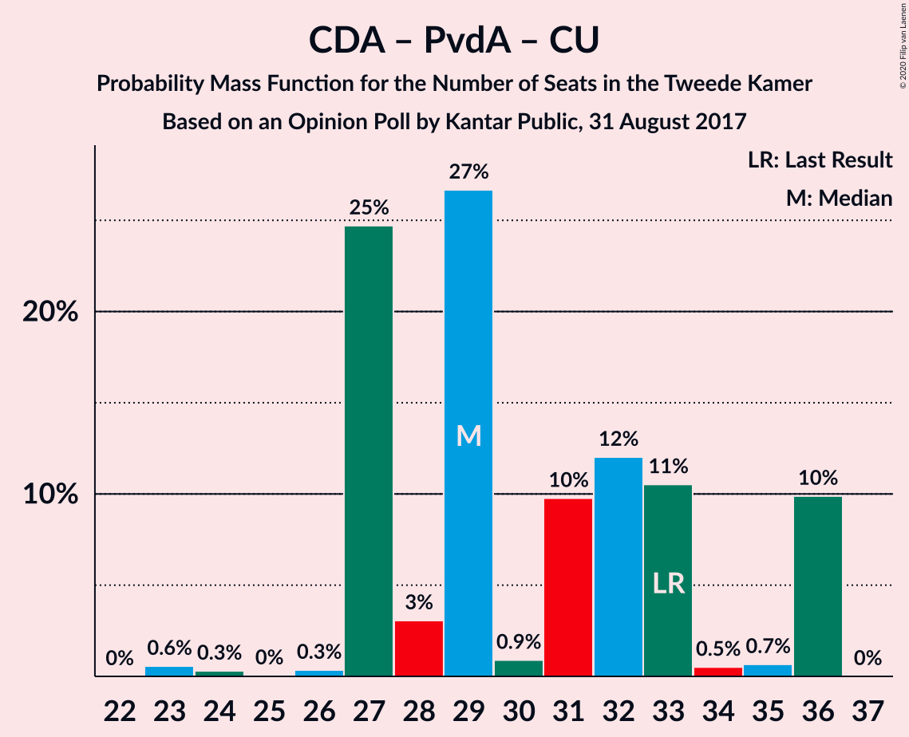

# Opinion Poll by Kantar Public, 31 August 2017

<a href="#voting-intentions">Voting Intentions</a> | <a href="#seats">Seats</a> | <a href="#coalitions">Coalitions</a> | <a href="#technical-information">Technical Information</a>

## Voting Intentions

### Confidence Intervals

| Party | Last Result | Poll Result | 80% Confidence Interval | 90% Confidence Interval | 95% Confidence Interval | 99% Confidence Interval |
|:-----:|:-----------:|:-----------:|:-----------------------:|:-----------------------:|:-----------------------:|:-----------------------:|
| Volkspartij voor Vrijheid en Democratie | 21.3% | 20.6% | 19.0–22.4% |18.6–22.9% |18.2–23.4% |17.5–24.2% |
| Partij voor de Vrijheid | 13.1% | 14.7% | 13.3–16.2% |12.9–16.7% |12.6–17.1% |11.9–17.8% |
| Democraten 66 | 12.2% | 11.9% | 10.7–13.4% |10.3–13.8% |10.0–14.2% |9.5–14.9% |
| Christen-Democratisch Appèl | 12.4% | 10.7% | 9.5–12.1% |9.2–12.5% |8.9–12.8% |8.3–13.5% |
| GroenLinks | 9.1% | 10.7% | 9.5–12.1% |9.2–12.5% |8.9–12.8% |8.3–13.5% |
| Socialistische Partij | 9.1% | 7.3% | 6.4–8.5% |6.1–8.9% |5.8–9.2% |5.4–9.8% |
| Partij van de Arbeid | 5.7% | 6.0% | 5.1–7.1% |4.8–7.4% |4.6–7.7% |4.3–8.2% |
| Forum voor Democratie | 1.8% | 5.3% | 4.5–6.4% |4.3–6.7% |4.1–7.0% |3.7–7.5% |
| ChristenUnie | 3.4% | 3.4% | 2.7–4.2% |2.5–4.5% |2.4–4.7% |2.1–5.2% |
| Partij voor de Dieren | 3.2% | 3.4% | 2.7–4.2% |2.5–4.5% |2.4–4.7% |2.1–5.2% |
| 50Plus | 3.1% | 2.6% | 2.1–3.4% |1.9–3.6% |1.8–3.8% |1.5–4.3% |
| Staatkundig Gereformeerde Partij | 2.1% | 2.0% | 1.5–2.7% |1.4–2.9% |1.3–3.1% |1.1–3.5% |
| DENK | 2.1% | 1.4% | 1.0–2.0% |0.9–2.2% |0.8–2.3% |0.6–2.7% |

*Note:* The poll result column reflects the actual value used in the calculations. Published results may vary slightly, and in addition be rounded to fewer digits.

## Seats

### Confidence Intervals

| Party | Last Result | Median | 80% Confidence Interval | 90% Confidence Interval | 95% Confidence Interval | 99% Confidence Interval |
|:-----:|:-----------:|:------:|:-----------------------:|:-----------------------:|:-----------------------:|:-----------------------:|
| <a href="#volkspartij-voor-vrijheid-en-democratie">Volkspartij voor Vrijheid en Democratie</a> | 33 | 32 | 27–35 |27–35 |27–35 |27–35 |
| <a href="#partij-voor-de-vrijheid">Partij voor de Vrijheid</a> | 20 | 23 | 22–23 |20–23 |20–23 |20–25 |
| <a href="#democraten-66">Democraten 66</a> | 19 | 16 | 15–20 |15–20 |15–23 |15–23 |
| <a href="#christen-democratisch-appèl">Christen-Democratisch Appèl</a> | 19 | 19 | 17–19 |16–19 |14–19 |14–19 |
| <a href="#groenlinks">GroenLinks</a> | 14 | 16 | 16–18 |16–18 |16–18 |15–18 |
| <a href="#socialistische-partij">Socialistische Partij</a> | 14 | 11 | 11–12 |11–12 |10–12 |10–14 |
| <a href="#partij-van-de-arbeid">Partij van de Arbeid</a> | 9 | 8 | 7–8 |7–9 |7–10 |7–12 |
| <a href="#forum-voor-democratie">Forum voor Democratie</a> | 2 | 9 | 6–9 |6–9 |6–9 |6–11 |
| <a href="#christenunie">ChristenUnie</a> | 5 | 4 | 3–5 |3–5 |3–6 |3–7 |
| <a href="#partij-voor-de-dieren">Partij voor de Dieren</a> | 5 | 4 | 3–6 |3–7 |3–7 |3–8 |
| <a href="#50plus">50Plus</a> | 4 | 4 | 3–4 |3–4 |3–4 |3–5 |
| <a href="#staatkundig-gereformeerde-partij">Staatkundig Gereformeerde Partij</a> | 3 | 2 | 2–4 |2–4 |2–4 |2–4 |
| <a href="#denk">DENK</a> | 3 | 2 | 2–3 |1–3 |1–3 |1–3 |

### Volkspartij voor Vrijheid en Democratie

*For a full overview of the results for this party, see the [Volkspartij voor Vrijheid en Democratie](party-volkspartijvoorvrijheidendemocratie.html) page.*

| Number of Seats | Probability | Accumulated | Special Marks |
|:---------------:|:-----------:|:-----------:|:-------------:|
| 27 | 13% | 100% |  |
| 28 | 2% | 87% |  |
| 29 | 1.1% | 85% |  |
| 30 | 31% | 84% |  |
| 31 | 3% | 54% |  |
| 32 | 0.9% | 50% | Median |
| 33 | 0.1% | 49% | Last Result |
| 34 | 0.1% | 49% |  |
| 35 | 49% | 49% |  |
| 36 | 0.1% | 0.1% |  |
| 37 | 0% | 0% |  |

### Partij voor de Vrijheid

*For a full overview of the results for this party, see the [Partij voor de Vrijheid](party-partijvoordevrijheid.html) page.*

| Number of Seats | Probability | Accumulated | Special Marks |
|:---------------:|:-----------:|:-----------:|:-------------:|
| 19 | 0% | 100% |  |
| 20 | 6% | 99.9% | Last Result |
| 21 | 0.9% | 94% |  |
| 22 | 12% | 93% |  |
| 23 | 80% | 82% | Median |
| 24 | 0% | 2% |  |
| 25 | 2% | 2% |  |
| 26 | 0% | 0.3% |  |
| 27 | 0% | 0.2% |  |
| 28 | 0% | 0.2% |  |
| 29 | 0% | 0.2% |  |
| 30 | 0.2% | 0.2% |  |
| 31 | 0% | 0% |  |

### Democraten 66

*For a full overview of the results for this party, see the [Democraten 66](party-democraten66.html) page.*

| Number of Seats | Probability | Accumulated | Special Marks |
|:---------------:|:-----------:|:-----------:|:-------------:|
| 14 | 0% | 100% |  |
| 15 | 50% | 99.9% |  |
| 16 | 2% | 50% | Median |
| 17 | 2% | 48% |  |
| 18 | 0.1% | 46% |  |
| 19 | 11% | 45% | Last Result |
| 20 | 31% | 34% |  |
| 21 | 0% | 3% |  |
| 22 | 0.1% | 3% |  |
| 23 | 3% | 3% |  |
| 24 | 0% | 0% |  |

### Christen-Democratisch Appèl

*For a full overview of the results for this party, see the [Christen-Democratisch Appèl](party-christen-democratischappèl.html) page.*

| Number of Seats | Probability | Accumulated | Special Marks |
|:---------------:|:-----------:|:-----------:|:-------------:|
| 13 | 0.1% | 100% |  |
| 14 | 3% | 99.9% |  |
| 15 | 2% | 97% |  |
| 16 | 5% | 95% |  |
| 17 | 30% | 91% |  |
| 18 | 0.3% | 61% |  |
| 19 | 60% | 60% | Last Result, Median |
| 20 | 0% | 0% |  |

### GroenLinks

*For a full overview of the results for this party, see the [GroenLinks](party-groenlinks.html) page.*

| Number of Seats | Probability | Accumulated | Special Marks |
|:---------------:|:-----------:|:-----------:|:-------------:|
| 13 | 0.1% | 100% |  |
| 14 | 0% | 99.9% | Last Result |
| 15 | 0.4% | 99.9% |  |
| 16 | 56% | 99.4% | Median |
| 17 | 3% | 44% |  |
| 18 | 40% | 40% |  |
| 19 | 0.1% | 0.1% |  |
| 20 | 0% | 0% |  |

### Socialistische Partij

*For a full overview of the results for this party, see the [Socialistische Partij](party-socialistischepartij.html) page.*

| Number of Seats | Probability | Accumulated | Special Marks |
|:---------------:|:-----------:|:-----------:|:-------------:|
| 8 | 0% | 100% |  |
| 9 | 0.2% | 99.9% |  |
| 10 | 3% | 99.8% |  |
| 11 | 53% | 97% | Median |
| 12 | 42% | 44% |  |
| 13 | 0.1% | 2% |  |
| 14 | 2% | 2% | Last Result |
| 15 | 0% | 0% |  |

### Partij van de Arbeid

*For a full overview of the results for this party, see the [Partij van de Arbeid](party-partijvandearbeid.html) page.*

| Number of Seats | Probability | Accumulated | Special Marks |
|:---------------:|:-----------:|:-----------:|:-------------:|
| 7 | 49% | 100% |  |
| 8 | 41% | 51% | Median |
| 9 | 5% | 10% | Last Result |
| 10 | 2% | 4% |  |
| 11 | 0% | 2% |  |
| 12 | 2% | 2% |  |
| 13 | 0% | 0% |  |

### Forum voor Democratie

*For a full overview of the results for this party, see the [Forum voor Democratie](party-forumvoordemocratie.html) page.*

| Number of Seats | Probability | Accumulated | Special Marks |
|:---------------:|:-----------:|:-----------:|:-------------:|
| 2 | 0% | 100% | Last Result |
| 3 | 0% | 100% |  |
| 4 | 0% | 100% |  |
| 5 | 0% | 100% |  |
| 6 | 42% | 100% |  |
| 7 | 3% | 58% |  |
| 8 | 3% | 55% |  |
| 9 | 50% | 52% | Median |
| 10 | 0.1% | 2% |  |
| 11 | 2% | 2% |  |
| 12 | 0% | 0% |  |

### ChristenUnie

*For a full overview of the results for this party, see the [ChristenUnie](party-christenunie.html) page.*

| Number of Seats | Probability | Accumulated | Special Marks |
|:---------------:|:-----------:|:-----------:|:-------------:|
| 3 | 49% | 100% |  |
| 4 | 32% | 51% | Median |
| 5 | 14% | 18% | Last Result |
| 6 | 3% | 4% |  |
| 7 | 2% | 2% |  |
| 8 | 0% | 0.1% |  |
| 9 | 0% | 0% |  |

### Partij voor de Dieren

*For a full overview of the results for this party, see the [Partij voor de Dieren](party-partijvoordedieren.html) page.*

| Number of Seats | Probability | Accumulated | Special Marks |
|:---------------:|:-----------:|:-----------:|:-------------:|
| 2 | 0.1% | 100% |  |
| 3 | 32% | 99.9% |  |
| 4 | 49% | 68% | Median |
| 5 | 2% | 19% | Last Result |
| 6 | 11% | 17% |  |
| 7 | 5% | 6% |  |
| 8 | 0.8% | 0.8% |  |
| 9 | 0% | 0% |  |

### 50Plus

*For a full overview of the results for this party, see the [50Plus](party-50plus.html) page.*

| Number of Seats | Probability | Accumulated | Special Marks |
|:---------------:|:-----------:|:-----------:|:-------------:|
| 2 | 0.3% | 100% |  |
| 3 | 45% | 99.7% |  |
| 4 | 53% | 54% | Last Result, Median |
| 5 | 1.0% | 1.0% |  |
| 6 | 0% | 0% |  |

### Staatkundig Gereformeerde Partij

*For a full overview of the results for this party, see the [Staatkundig Gereformeerde Partij](party-staatkundiggereformeerdepartij.html) page.*

| Number of Seats | Probability | Accumulated | Special Marks |
|:---------------:|:-----------:|:-----------:|:-------------:|
| 1 | 0.2% | 100% |  |
| 2 | 64% | 99.8% | Median |
| 3 | 5% | 36% | Last Result |
| 4 | 31% | 31% |  |
| 5 | 0.1% | 0.1% |  |
| 6 | 0% | 0% |  |

### DENK

*For a full overview of the results for this party, see the [DENK](party-denk.html) page.*

| Number of Seats | Probability | Accumulated | Special Marks |
|:---------------:|:-----------:|:-----------:|:-------------:|
| 1 | 6% | 100% |  |
| 2 | 80% | 94% | Median |
| 3 | 14% | 14% | Last Result |
| 4 | 0% | 0% |  |

## Coalitions

### Confidence Intervals

| Coalition | Last Result | Median | Majority? | 80% Confidence Interval | 90% Confidence Interval | 95% Confidence Interval | 99% Confidence Interval |
|:---------:|:-----------:|:------:|:---------:|:-----------------------:|:-----------------------:|:-----------------------:|:-----------------------:|
| Volkspartij voor Vrijheid en Democratie – Democraten 66 – Christen-Democratisch Appèl – GroenLinks – ChristenUnie | 90 | 88 | 100% | 88–89 | 86–89 | 82–90 | 81–90 |
| Volkspartij voor Vrijheid en Democratie – Partij voor de Vrijheid – Christen-Democratisch Appèl – Forum voor Democratie – Staatkundig Gereformeerde Partij | 77 | 80 | 100% | 76–88 | 76–88 | 76–88 | 76–88 |
| Volkspartij voor Vrijheid en Democratie – Partij voor de Vrijheid – Christen-Democratisch Appèl – Forum voor Democratie | 74 | 77 | 81% | 74–86 | 74–86 | 73–86 | 73–86 |
| Volkspartij voor Vrijheid en Democratie – Democraten 66 – Christen-Democratisch Appèl – Partij van de Arbeid – ChristenUnie | 85 | 79 | 97% | 78–79 | 78–81 | 73–83 | 73–83 |
| Democraten 66 – Christen-Democratisch Appèl – GroenLinks – Socialistische Partij – Partij van de Arbeid – ChristenUnie | 80 | 73 | 50% | 71–81 | 71–81 | 71–81 | 71–81 |
| Volkspartij voor Vrijheid en Democratie – Partij voor de Vrijheid – Christen-Democratisch Appèl | 72 | 70 | 49% | 68–77 | 67–77 | 65–77 | 64–77 |
| Volkspartij voor Vrijheid en Democratie – Democraten 66 – Christen-Democratisch Appèl – ChristenUnie | 76 | 72 | 0% | 70–72 | 69–72 | 65–74 | 64–74 |
| Volkspartij voor Vrijheid en Democratie – Democraten 66 – Christen-Democratisch Appèl | 71 | 69 | 0% | 65–69 | 64–69 | 59–70 | 59–70 |
| Democraten 66 – Christen-Democratisch Appèl – GroenLinks – Partij van de Arbeid – ChristenUnie | 66 | 61 | 0% | 60–69 | 60–69 | 60–69 | 60–69 |
| Volkspartij voor Vrijheid en Democratie – Christen-Democratisch Appèl – Forum voor Democratie – 50Plus – Staatkundig Gereformeerde Partij | 61 | 65 | 0% | 57–69 | 57–69 | 57–69 | 55–69 |
| Volkspartij voor Vrijheid en Democratie – Christen-Democratisch Appèl – Forum voor Democratie – 50Plus | 58 | 62 | 0% | 55–67 | 55–67 | 53–67 | 53–67 |
| Volkspartij voor Vrijheid en Democratie – Christen-Democratisch Appèl – Forum voor Democratie – Staatkundig Gereformeerde Partij | 57 | 60 | 0% | 54–65 | 54–65 | 54–65 | 51–65 |
| Volkspartij voor Vrijheid en Democratie – Democraten 66 – Partij van de Arbeid | 61 | 57 | 0% | 54–58 | 54–60 | 54–63 | 53–63 |
| Volkspartij voor Vrijheid en Democratie – Christen-Democratisch Appèl – Forum voor Democratie | 54 | 57 | 0% | 52–63 | 52–63 | 50–63 | 49–63 |
| Volkspartij voor Vrijheid en Democratie – Christen-Democratisch Appèl – Partij van de Arbeid | 61 | 60 | 0% | 54–61 | 54–61 | 51–61 | 51–61 |
| Volkspartij voor Vrijheid en Democratie – Christen-Democratisch Appèl | 52 | 49 | 0% | 46–54 | 45–54 | 43–54 | 42–54 |
| Democraten 66 – Christen-Democratisch Appèl – Partij van de Arbeid | 47 | 41 | 0% | 41–46 | 41–46 | 40–48 | 38–48 |
| Volkspartij voor Vrijheid en Democratie – Partij van de Arbeid | 42 | 42 | 0% | 35–42 | 35–42 | 35–42 | 35–44 |
| Democraten 66 – Christen-Democratisch Appèl | 38 | 34 | 0% | 34–38 | 32–38 | 31–39 | 30–39 |
| Christen-Democratisch Appèl – Partij van de Arbeid – ChristenUnie | 33 | 29 | 0% | 29–32 | 29–32 | 28–33 | 28–35 |
| Christen-Democratisch Appèl – Partij van de Arbeid | 28 | 26 | 0% | 25–27 | 25–27 | 23–27 | 22–29 |

### Volkspartij voor Vrijheid en Democratie – Democraten 66 – Christen-Democratisch Appèl – GroenLinks – ChristenUnie

| Number of Seats | Probability | Accumulated | Special Marks |
|:---------------:|:-----------:|:-----------:|:-------------:|
| 80 | 0% | 100% |  |
| 81 | 2% | 99.9% |  |
| 82 | 2% | 98% |  |
| 83 | 0.3% | 96% |  |
| 84 | 0% | 96% |  |
| 85 | 0% | 96% |  |
| 86 | 1.0% | 95% |  |
| 87 | 2% | 95% | Median |
| 88 | 60% | 93% |  |
| 89 | 29% | 32% |  |
| 90 | 3% | 3% | Last Result |
| 91 | 0% | 0.1% |  |
| 92 | 0% | 0.1% |  |
| 93 | 0% | 0.1% |  |
| 94 | 0.1% | 0.1% |  |
| 95 | 0% | 0% |  |

### Volkspartij voor Vrijheid en Democratie – Partij voor de Vrijheid – Christen-Democratisch Appèl – Forum voor Democratie – Staatkundig Gereformeerde Partij

| Number of Seats | Probability | Accumulated | Special Marks |
|:---------------:|:-----------:|:-----------:|:-------------:|
| 76 | 14% | 100% | Majority |
| 77 | 5% | 86% | Last Result |
| 78 | 2% | 81% |  |
| 79 | 0.1% | 80% |  |
| 80 | 30% | 79% |  |
| 81 | 0% | 50% |  |
| 82 | 0.2% | 50% |  |
| 83 | 0.2% | 50% |  |
| 84 | 0.1% | 49% |  |
| 85 | 0.1% | 49% | Median |
| 86 | 0.2% | 49% |  |
| 87 | 0% | 49% |  |
| 88 | 49% | 49% |  |
| 89 | 0% | 0% |  |

### Volkspartij voor Vrijheid en Democratie – Partij voor de Vrijheid – Christen-Democratisch Appèl – Forum voor Democratie

| Number of Seats | Probability | Accumulated | Special Marks |
|:---------------:|:-----------:|:-----------:|:-------------:|
| 73 | 3% | 100% |  |
| 74 | 16% | 97% | Last Result |
| 75 | 0% | 81% |  |
| 76 | 31% | 81% | Majority |
| 77 | 0.9% | 51% |  |
| 78 | 0.2% | 50% |  |
| 79 | 0.1% | 50% |  |
| 80 | 0% | 49% |  |
| 81 | 0.1% | 49% |  |
| 82 | 0.1% | 49% |  |
| 83 | 0% | 49% | Median |
| 84 | 0.3% | 49% |  |
| 85 | 0% | 49% |  |
| 86 | 49% | 49% |  |
| 87 | 0% | 0% |  |

### Volkspartij voor Vrijheid en Democratie – Democraten 66 – Christen-Democratisch Appèl – Partij van de Arbeid – ChristenUnie

| Number of Seats | Probability | Accumulated | Special Marks |
|:---------------:|:-----------:|:-----------:|:-------------:|
| 72 | 0% | 100% |  |
| 73 | 3% | 99.9% |  |
| 74 | 0% | 97% |  |
| 75 | 0% | 97% |  |
| 76 | 0% | 97% | Majority |
| 77 | 0.2% | 97% |  |
| 78 | 13% | 97% |  |
| 79 | 78% | 84% | Median |
| 80 | 0.1% | 6% |  |
| 81 | 3% | 6% |  |
| 82 | 0.1% | 3% |  |
| 83 | 3% | 3% |  |
| 84 | 0% | 0% |  |
| 85 | 0% | 0% | Last Result |

### Democraten 66 – Christen-Democratisch Appèl – GroenLinks – Socialistische Partij – Partij van de Arbeid – ChristenUnie

| Number of Seats | Probability | Accumulated | Special Marks |
|:---------------:|:-----------:|:-----------:|:-------------:|
| 70 | 0% | 100% |  |
| 71 | 49% | 99.9% |  |
| 72 | 0.1% | 51% |  |
| 73 | 0.9% | 51% |  |
| 74 | 0.2% | 50% | Median |
| 75 | 0.1% | 50% |  |
| 76 | 2% | 50% | Majority |
| 77 | 0.1% | 48% |  |
| 78 | 7% | 48% |  |
| 79 | 29% | 40% |  |
| 80 | 0.1% | 11% | Last Result |
| 81 | 11% | 11% |  |
| 82 | 0% | 0% |  |

### Volkspartij voor Vrijheid en Democratie – Partij voor de Vrijheid – Christen-Democratisch Appèl

| Number of Seats | Probability | Accumulated | Special Marks |
|:---------------:|:-----------:|:-----------:|:-------------:|
| 64 | 0.8% | 100% |  |
| 65 | 3% | 99.2% |  |
| 66 | 0% | 96% |  |
| 67 | 3% | 96% |  |
| 68 | 13% | 92% |  |
| 69 | 0.9% | 79% |  |
| 70 | 29% | 78% |  |
| 71 | 0.1% | 50% |  |
| 72 | 0.1% | 49% | Last Result |
| 73 | 0.1% | 49% |  |
| 74 | 0% | 49% | Median |
| 75 | 0% | 49% |  |
| 76 | 0.1% | 49% | Majority |
| 77 | 49% | 49% |  |
| 78 | 0% | 0% |  |

### Volkspartij voor Vrijheid en Democratie – Democraten 66 – Christen-Democratisch Appèl – ChristenUnie

| Number of Seats | Probability | Accumulated | Special Marks |
|:---------------:|:-----------:|:-----------:|:-------------:|
| 64 | 2% | 100% |  |
| 65 | 0.8% | 98% |  |
| 66 | 2% | 97% |  |
| 67 | 0% | 96% |  |
| 68 | 0.3% | 96% |  |
| 69 | 0.9% | 96% |  |
| 70 | 11% | 95% |  |
| 71 | 31% | 83% | Median |
| 72 | 49% | 53% |  |
| 73 | 0.1% | 4% |  |
| 74 | 3% | 3% |  |
| 75 | 0.1% | 0.1% |  |
| 76 | 0% | 0% | Last Result, Majority |

### Volkspartij voor Vrijheid en Democratie – Democraten 66 – Christen-Democratisch Appèl

| Number of Seats | Probability | Accumulated | Special Marks |
|:---------------:|:-----------:|:-----------:|:-------------:|
| 59 | 4% | 100% |  |
| 60 | 0% | 96% |  |
| 61 | 0.1% | 96% |  |
| 62 | 0% | 96% |  |
| 63 | 0% | 96% |  |
| 64 | 1.1% | 96% |  |
| 65 | 13% | 95% |  |
| 66 | 0.1% | 82% |  |
| 67 | 29% | 81% | Median |
| 68 | 0.1% | 53% |  |
| 69 | 49% | 52% |  |
| 70 | 3% | 3% |  |
| 71 | 0% | 0.1% | Last Result |
| 72 | 0% | 0% |  |

### Democraten 66 – Christen-Democratisch Appèl – GroenLinks – Partij van de Arbeid – ChristenUnie

| Number of Seats | Probability | Accumulated | Special Marks |
|:---------------:|:-----------:|:-----------:|:-------------:|
| 59 | 0.1% | 100% |  |
| 60 | 49% | 99.9% |  |
| 61 | 0.9% | 51% |  |
| 62 | 2% | 50% |  |
| 63 | 0.3% | 48% | Median |
| 64 | 0% | 48% |  |
| 65 | 0% | 48% |  |
| 66 | 0.9% | 48% | Last Result |
| 67 | 32% | 47% |  |
| 68 | 3% | 15% |  |
| 69 | 11% | 11% |  |
| 70 | 0% | 0% |  |

### Volkspartij voor Vrijheid en Democratie – Christen-Democratisch Appèl – Forum voor Democratie – 50Plus – Staatkundig Gereformeerde Partij

| Number of Seats | Probability | Accumulated | Special Marks |
|:---------------:|:-----------:|:-----------:|:-------------:|
| 55 | 2% | 100% |  |
| 56 | 0% | 98% |  |
| 57 | 13% | 98% |  |
| 58 | 0.3% | 85% |  |
| 59 | 0.8% | 85% |  |
| 60 | 32% | 84% |  |
| 61 | 0% | 52% | Last Result |
| 62 | 2% | 52% |  |
| 63 | 0.1% | 50% |  |
| 64 | 0.2% | 50% |  |
| 65 | 0.9% | 50% |  |
| 66 | 0% | 49% | Median |
| 67 | 0% | 49% |  |
| 68 | 0% | 49% |  |
| 69 | 49% | 49% |  |
| 70 | 0% | 0% |  |

### Volkspartij voor Vrijheid en Democratie – Christen-Democratisch Appèl – Forum voor Democratie – 50Plus

| Number of Seats | Probability | Accumulated | Special Marks |
|:---------------:|:-----------:|:-----------:|:-------------:|
| 53 | 3% | 100% |  |
| 54 | 0% | 97% |  |
| 55 | 11% | 97% |  |
| 56 | 30% | 85% |  |
| 57 | 3% | 55% |  |
| 58 | 0% | 52% | Last Result |
| 59 | 0.1% | 52% |  |
| 60 | 2% | 52% |  |
| 61 | 0.1% | 50% |  |
| 62 | 0.8% | 50% |  |
| 63 | 0.1% | 49% |  |
| 64 | 0% | 49% | Median |
| 65 | 0% | 49% |  |
| 66 | 0% | 49% |  |
| 67 | 49% | 49% |  |
| 68 | 0% | 0% |  |

### Volkspartij voor Vrijheid en Democratie – Christen-Democratisch Appèl – Forum voor Democratie – Staatkundig Gereformeerde Partij

| Number of Seats | Probability | Accumulated | Special Marks |
|:---------------:|:-----------:|:-----------:|:-------------:|
| 51 | 2% | 100% |  |
| 52 | 0% | 98% |  |
| 53 | 0% | 98% |  |
| 54 | 13% | 98% |  |
| 55 | 0.9% | 85% |  |
| 56 | 0.2% | 85% |  |
| 57 | 32% | 84% | Last Result |
| 58 | 2% | 52% |  |
| 59 | 0.1% | 50% |  |
| 60 | 1.0% | 50% |  |
| 61 | 0.1% | 49% |  |
| 62 | 0% | 49% | Median |
| 63 | 0% | 49% |  |
| 64 | 0% | 49% |  |
| 65 | 49% | 49% |  |
| 66 | 0% | 0% |  |

### Volkspartij voor Vrijheid en Democratie – Democraten 66 – Partij van de Arbeid

| Number of Seats | Probability | Accumulated | Special Marks |
|:---------------:|:-----------:|:-----------:|:-------------:|
| 51 | 0% | 100% |  |
| 52 | 0% | 99.9% |  |
| 53 | 0.9% | 99.9% |  |
| 54 | 13% | 99.1% |  |
| 55 | 2% | 86% |  |
| 56 | 0% | 84% | Median |
| 57 | 49% | 84% |  |
| 58 | 29% | 35% |  |
| 59 | 1.0% | 6% |  |
| 60 | 2% | 5% |  |
| 61 | 0% | 3% | Last Result |
| 62 | 0.1% | 3% |  |
| 63 | 3% | 3% |  |
| 64 | 0% | 0.1% |  |
| 65 | 0% | 0% |  |

### Volkspartij voor Vrijheid en Democratie – Christen-Democratisch Appèl – Forum voor Democratie

| Number of Seats | Probability | Accumulated | Special Marks |
|:---------------:|:-----------:|:-----------:|:-------------:|
| 49 | 2% | 100% |  |
| 50 | 2% | 98% |  |
| 51 | 0% | 97% |  |
| 52 | 12% | 97% |  |
| 53 | 29% | 85% |  |
| 54 | 3% | 56% | Last Result |
| 55 | 0.1% | 52% |  |
| 56 | 2% | 52% |  |
| 57 | 1.0% | 50% |  |
| 58 | 0.1% | 49% |  |
| 59 | 0.1% | 49% |  |
| 60 | 0% | 49% | Median |
| 61 | 0% | 49% |  |
| 62 | 0% | 49% |  |
| 63 | 49% | 49% |  |
| 64 | 0% | 0% |  |

### Volkspartij voor Vrijheid en Democratie – Christen-Democratisch Appèl – Partij van de Arbeid

| Number of Seats | Probability | Accumulated | Special Marks |
|:---------------:|:-----------:|:-----------:|:-------------:|
| 51 | 3% | 100% |  |
| 52 | 0% | 97% |  |
| 53 | 0% | 97% |  |
| 54 | 11% | 97% |  |
| 55 | 32% | 86% |  |
| 56 | 3% | 54% |  |
| 57 | 0.1% | 50% |  |
| 58 | 0% | 50% |  |
| 59 | 0.2% | 50% | Median |
| 60 | 0.1% | 50% |  |
| 61 | 50% | 50% | Last Result |
| 62 | 0.1% | 0.1% |  |
| 63 | 0% | 0% |  |

### Volkspartij voor Vrijheid en Democratie – Christen-Democratisch Appèl

| Number of Seats | Probability | Accumulated | Special Marks |
|:---------------:|:-----------:|:-----------:|:-------------:|
| 42 | 2% | 100% |  |
| 43 | 2% | 98% |  |
| 44 | 0% | 96% |  |
| 45 | 2% | 96% |  |
| 46 | 11% | 94% |  |
| 47 | 32% | 83% |  |
| 48 | 0.1% | 50% |  |
| 49 | 0.9% | 50% |  |
| 50 | 0.1% | 49% |  |
| 51 | 0.1% | 49% | Median |
| 52 | 0% | 49% | Last Result |
| 53 | 0.1% | 49% |  |
| 54 | 49% | 49% |  |
| 55 | 0% | 0% |  |

### Democraten 66 – Christen-Democratisch Appèl – Partij van de Arbeid

| Number of Seats | Probability | Accumulated | Special Marks |
|:---------------:|:-----------:|:-----------:|:-------------:|
| 37 | 0.1% | 100% |  |
| 38 | 0.8% | 99.9% |  |
| 39 | 0.1% | 99.1% |  |
| 40 | 2% | 99.0% |  |
| 41 | 49% | 97% |  |
| 42 | 0.1% | 48% |  |
| 43 | 0.1% | 48% | Median |
| 44 | 3% | 48% |  |
| 45 | 31% | 45% |  |
| 46 | 11% | 15% |  |
| 47 | 0% | 3% | Last Result |
| 48 | 3% | 3% |  |
| 49 | 0% | 0% |  |

### Volkspartij voor Vrijheid en Democratie – Partij van de Arbeid

| Number of Seats | Probability | Accumulated | Special Marks |
|:---------------:|:-----------:|:-----------:|:-------------:|
| 35 | 11% | 100% |  |
| 36 | 0% | 89% |  |
| 37 | 3% | 89% |  |
| 38 | 29% | 86% |  |
| 39 | 2% | 57% |  |
| 40 | 5% | 55% | Median |
| 41 | 0.1% | 50% |  |
| 42 | 49% | 50% | Last Result |
| 43 | 0% | 1.1% |  |
| 44 | 0.9% | 1.1% |  |
| 45 | 0.1% | 0.2% |  |
| 46 | 0% | 0% |  |

### Democraten 66 – Christen-Democratisch Appèl

| Number of Seats | Probability | Accumulated | Special Marks |
|:---------------:|:-----------:|:-----------:|:-------------:|
| 29 | 0% | 100% |  |
| 30 | 0.9% | 99.9% |  |
| 31 | 2% | 99.0% |  |
| 32 | 2% | 97% |  |
| 33 | 0% | 95% |  |
| 34 | 49% | 95% |  |
| 35 | 2% | 46% | Median |
| 36 | 0.1% | 44% |  |
| 37 | 29% | 44% |  |
| 38 | 11% | 15% | Last Result |
| 39 | 3% | 3% |  |
| 40 | 0% | 0% |  |

### Christen-Democratisch Appèl – Partij van de Arbeid – ChristenUnie

| Number of Seats | Probability | Accumulated | Special Marks |
|:---------------:|:-----------:|:-----------:|:-------------:|
| 27 | 0% | 100% |  |
| 28 | 3% | 99.9% |  |
| 29 | 81% | 97% |  |
| 30 | 0% | 16% |  |
| 31 | 2% | 16% | Median |
| 32 | 11% | 14% |  |
| 33 | 0.1% | 3% | Last Result |
| 34 | 0.9% | 2% |  |
| 35 | 2% | 2% |  |
| 36 | 0% | 0% |  |

### Christen-Democratisch Appèl – Partij van de Arbeid

| Number of Seats | Probability | Accumulated | Special Marks |
|:---------------:|:-----------:|:-----------:|:-------------:|
| 22 | 0.8% | 100% |  |
| 23 | 2% | 99.1% |  |
| 24 | 0.1% | 97% |  |
| 25 | 34% | 97% |  |
| 26 | 49% | 63% |  |
| 27 | 12% | 14% | Median |
| 28 | 2% | 2% | Last Result |
| 29 | 0.9% | 0.9% |  |
| 30 | 0% | 0% |  |

## Technical Information

### Opinion Poll

+ **Polling firm:** Kantar Public
+ **Commissioner(s):** —
+ **Fieldwork period:** 31 August 2017

### Calculations

+ **Sample size:** 954
+ **Simulations done:** 131,072
+ **Error estimate:** 5.24%

