# Opinion Poll by Peil.nl, 3 September 2017

<a href="#voting-intentions">Voting Intentions</a> | <a href="#seats">Seats</a> | <a href="#coalitions">Coalitions</a> | <a href="#technical-information">Technical Information</a>

## Voting Intentions

### Confidence Intervals

| Party | Last Result | Poll Result | 80% Confidence Interval | 90% Confidence Interval | 95% Confidence Interval | 99% Confidence Interval |
|:-----:|:-----------:|:-----------:|:-----------------------:|:-----------------------:|:-----------------------:|:-----------------------:|
| Volkspartij voor Vrijheid en Democratie | 21.3% | 20.7% | 19.7–21.6% |19.5–21.9% |19.3–22.2% |18.8–22.6% |
| Partij voor de Vrijheid | 13.1% | 12.7% | 11.9–13.5% |11.7–13.7% |11.5–13.9% |11.2–14.3% |
| Democraten 66 | 12.2% | 12.0% | 11.3–12.8% |11.1–13.0% |10.9–13.2% |10.5–13.6% |
| Christen-Democratisch Appèl | 12.4% | 11.3% | 10.6–12.1% |10.4–12.3% |10.2–12.5% |9.9–12.9% |
| GroenLinks | 9.1% | 8.7% | 8.0–9.4% |7.8–9.6% |7.7–9.7% |7.4–10.1% |
| Socialistische Partij | 9.1% | 8.0% | 7.4–8.7% |7.2–8.9% |7.1–9.0% |6.8–9.4% |
| Partij van de Arbeid | 5.7% | 8.0% | 7.4–8.7% |7.2–8.9% |7.1–9.0% |6.8–9.4% |
| Forum voor Democratie | 1.8% | 4.7% | 4.2–5.2% |4.1–5.3% |4.0–5.5% |3.7–5.8% |
| Partij voor de Dieren | 3.2% | 4.0% | 3.6–4.5% |3.4–4.6% |3.4–4.8% |3.2–5.0% |
| ChristenUnie | 3.4% | 3.3% | 2.9–3.8% |2.8–3.9% |2.7–4.0% |2.6–4.3% |
| 50Plus | 3.1% | 2.7% | 2.3–3.1% |2.2–3.2% |2.1–3.3% |2.0–3.5% |
| Staatkundig Gereformeerde Partij | 2.1% | 2.0% | 1.7–2.4% |1.6–2.5% |1.6–2.6% |1.4–2.8% |
| DENK | 2.1% | 2.0% | 1.7–2.4% |1.6–2.5% |1.6–2.6% |1.4–2.8% |

*Note:* The poll result column reflects the actual value used in the calculations. Published results may vary slightly, and in addition be rounded to fewer digits.

## Seats

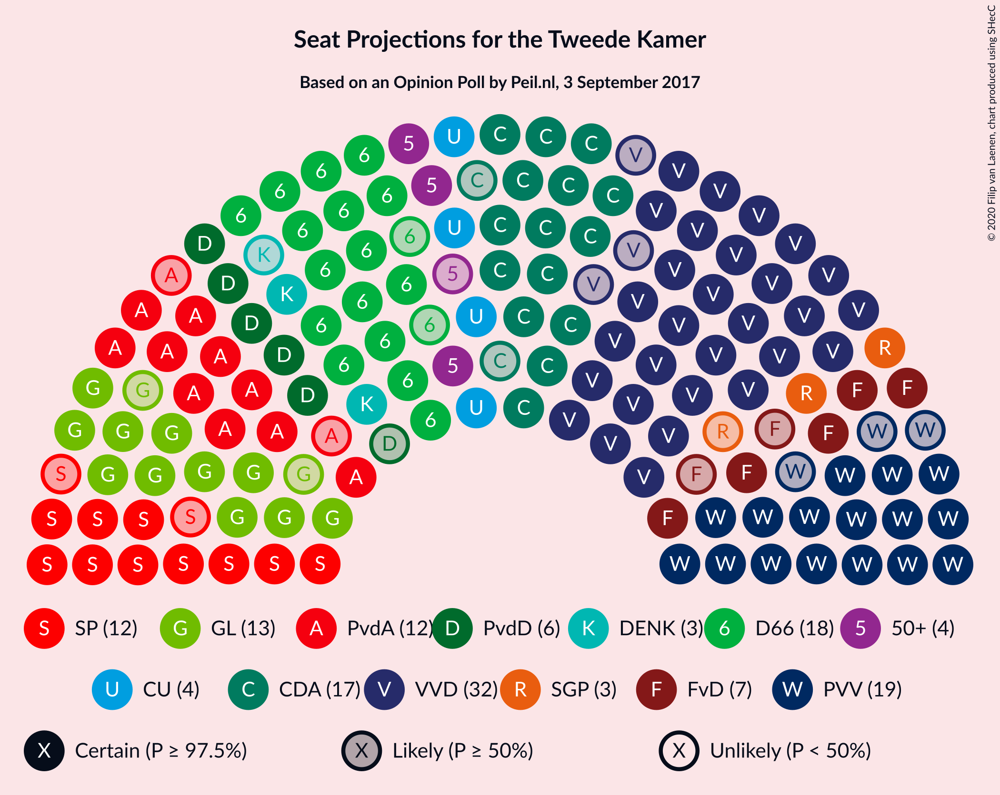

### Confidence Intervals

| Party | Last Result | Median | 80% Confidence Interval | 90% Confidence Interval | 95% Confidence Interval | 99% Confidence Interval |
|:-----:|:-----------:|:------:|:-----------------------:|:-----------------------:|:-----------------------:|:-----------------------:|
| <a href="#volkspartij-voor-vrijheid-en-democratie">Volkspartij voor Vrijheid en Democratie</a> | 33 | 32 | 30–35 |29–35 |29–35 |29–36 |
| <a href="#partij-voor-de-vrijheid">Partij voor de Vrijheid</a> | 20 | 19 | 18–21 |16–22 |16–22 |16–22 |
| <a href="#democraten-66">Democraten 66</a> | 19 | 18 | 17–20 |17–22 |16–22 |15–22 |
| <a href="#christen-democratisch-appèl">Christen-Democratisch Appèl</a> | 19 | 17 | 16–18 |16–18 |15–19 |15–20 |
| <a href="#groenlinks">GroenLinks</a> | 14 | 13 | 11–14 |11–14 |11–15 |11–15 |
| <a href="#socialistische-partij">Socialistische Partij</a> | 14 | 12 | 11–14 |10–15 |10–15 |10–15 |
| <a href="#partij-van-de-arbeid">Partij van de Arbeid</a> | 9 | 12 | 11–13 |10–14 |10–14 |10–14 |
| <a href="#forum-voor-democratie">Forum voor Democratie</a> | 2 | 7 | 6–8 |5–8 |5–8 |5–8 |
| <a href="#partij-voor-de-dieren">Partij voor de Dieren</a> | 5 | 6 | 5–7 |5–7 |5–7 |4–8 |
| <a href="#christenunie">ChristenUnie</a> | 5 | 4 | 4–5 |4–5 |4–6 |4–6 |
| <a href="#50plus">50Plus</a> | 4 | 4 | 3–4 |3–5 |3–5 |3–5 |
| <a href="#staatkundig-gereformeerde-partij">Staatkundig Gereformeerde Partij</a> | 3 | 3 | 2–4 |2–4 |2–4 |1–4 |
| <a href="#denk">DENK</a> | 3 | 3 | 2–3 |2–4 |2–4 |2–4 |

### Volkspartij voor Vrijheid en Democratie

*For a full overview of the results for this party, see the [Volkspartij voor Vrijheid en Democratie](party-volkspartijvoorvrijheidendemocratie.html) page.*

| Number of Seats | Probability | Accumulated | Special Marks |
|:---------------:|:-----------:|:-----------:|:-------------:|
| 27 | 0.1% | 100% |  |
| 28 | 0.4% | 99.9% |  |
| 29 | 6% | 99.5% |  |
| 30 | 19% | 94% |  |
| 31 | 15% | 75% |  |
| 32 | 29% | 60% | Median |
| 33 | 18% | 32% | Last Result |
| 34 | 1.2% | 14% |  |
| 35 | 11% | 13% |  |
| 36 | 1.3% | 1.3% |  |
| 37 | 0% | 0% |  |

### Partij voor de Vrijheid

*For a full overview of the results for this party, see the [Partij voor de Vrijheid](party-partijvoordevrijheid.html) page.*

| Number of Seats | Probability | Accumulated | Special Marks |
|:---------------:|:-----------:|:-----------:|:-------------:|
| 16 | 5% | 100% |  |
| 17 | 3% | 95% |  |
| 18 | 36% | 92% |  |
| 19 | 20% | 55% | Median |
| 20 | 7% | 35% | Last Result |
| 21 | 21% | 28% |  |
| 22 | 7% | 7% |  |
| 23 | 0.3% | 0.3% |  |
| 24 | 0% | 0% |  |

### Democraten 66

*For a full overview of the results for this party, see the [Democraten 66](party-democraten66.html) page.*

| Number of Seats | Probability | Accumulated | Special Marks |
|:---------------:|:-----------:|:-----------:|:-------------:|
| 15 | 1.1% | 100% |  |
| 16 | 1.5% | 98.9% |  |
| 17 | 33% | 97% |  |
| 18 | 20% | 65% | Median |
| 19 | 11% | 44% | Last Result |
| 20 | 26% | 33% |  |
| 21 | 1.2% | 7% |  |
| 22 | 6% | 6% |  |
| 23 | 0% | 0% |  |

### Christen-Democratisch Appèl

*For a full overview of the results for this party, see the [Christen-Democratisch Appèl](party-christen-democratischappèl.html) page.*

| Number of Seats | Probability | Accumulated | Special Marks |
|:---------------:|:-----------:|:-----------:|:-------------:|
| 14 | 0.1% | 100% |  |
| 15 | 3% | 99.9% |  |
| 16 | 25% | 97% |  |
| 17 | 25% | 72% | Median |
| 18 | 42% | 47% |  |
| 19 | 3% | 5% | Last Result |
| 20 | 2% | 2% |  |
| 21 | 0% | 0% |  |

### GroenLinks

*For a full overview of the results for this party, see the [GroenLinks](party-groenlinks.html) page.*

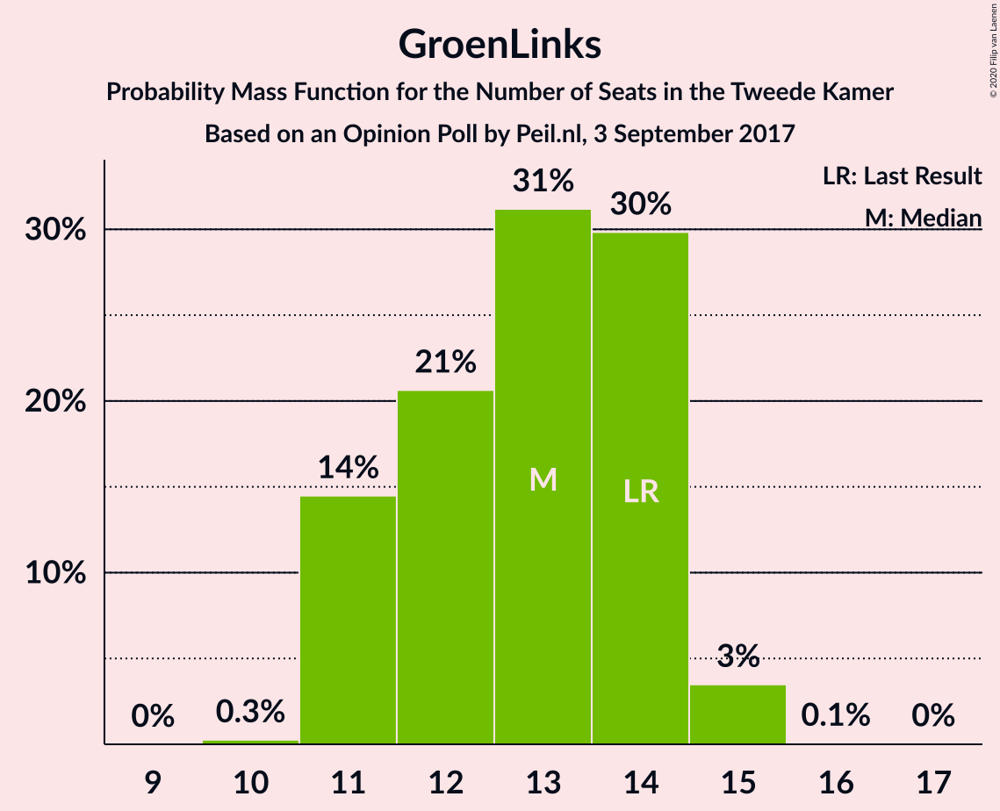

| Number of Seats | Probability | Accumulated | Special Marks |
|:---------------:|:-----------:|:-----------:|:-------------:|
| 10 | 0.3% | 100% |  |
| 11 | 14% | 99.7% |  |
| 12 | 21% | 85% |  |
| 13 | 31% | 65% | Median |
| 14 | 30% | 33% | Last Result |
| 15 | 3% | 4% |  |
| 16 | 0.1% | 0.1% |  |
| 17 | 0% | 0% |  |

### Socialistische Partij

*For a full overview of the results for this party, see the [Socialistische Partij](party-socialistischepartij.html) page.*

| Number of Seats | Probability | Accumulated | Special Marks |
|:---------------:|:-----------:|:-----------:|:-------------:|
| 9 | 0.2% | 100% |  |
| 10 | 5% | 99.8% |  |
| 11 | 35% | 95% |  |
| 12 | 21% | 60% | Median |
| 13 | 25% | 38% |  |
| 14 | 5% | 13% | Last Result |
| 15 | 8% | 8% |  |
| 16 | 0% | 0% |  |

### Partij van de Arbeid

*For a full overview of the results for this party, see the [Partij van de Arbeid](party-partijvandearbeid.html) page.*

| Number of Seats | Probability | Accumulated | Special Marks |
|:---------------:|:-----------:|:-----------:|:-------------:|
| 9 | 0.1% | 100% | Last Result |
| 10 | 8% | 99.9% |  |
| 11 | 33% | 92% |  |
| 12 | 28% | 59% | Median |
| 13 | 23% | 31% |  |
| 14 | 8% | 8% |  |
| 15 | 0.1% | 0.1% |  |
| 16 | 0% | 0% |  |

### Forum voor Democratie

*For a full overview of the results for this party, see the [Forum voor Democratie](party-forumvoordemocratie.html) page.*

| Number of Seats | Probability | Accumulated | Special Marks |
|:---------------:|:-----------:|:-----------:|:-------------:|
| 2 | 0% | 100% | Last Result |
| 3 | 0% | 100% |  |
| 4 | 0% | 100% |  |
| 5 | 6% | 100% |  |
| 6 | 35% | 94% |  |
| 7 | 43% | 59% | Median |
| 8 | 16% | 16% |  |
| 9 | 0.3% | 0.4% |  |
| 10 | 0.1% | 0.1% |  |
| 11 | 0% | 0% |  |

### Partij voor de Dieren

*For a full overview of the results for this party, see the [Partij voor de Dieren](party-partijvoordedieren.html) page.*

| Number of Seats | Probability | Accumulated | Special Marks |
|:---------------:|:-----------:|:-----------:|:-------------:|
| 4 | 1.5% | 100% |  |
| 5 | 42% | 98.5% | Last Result |
| 6 | 42% | 57% | Median |
| 7 | 14% | 14% |  |
| 8 | 0.7% | 0.7% |  |
| 9 | 0% | 0% |  |

### ChristenUnie

*For a full overview of the results for this party, see the [ChristenUnie](party-christenunie.html) page.*

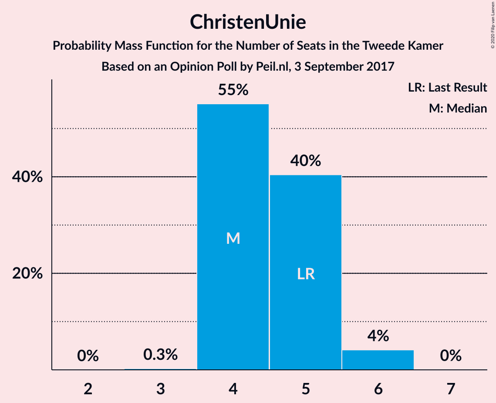

| Number of Seats | Probability | Accumulated | Special Marks |
|:---------------:|:-----------:|:-----------:|:-------------:|
| 3 | 0.3% | 100% |  |
| 4 | 55% | 99.7% | Median |
| 5 | 40% | 45% | Last Result |
| 6 | 4% | 4% |  |
| 7 | 0% | 0% |  |

### 50Plus

*For a full overview of the results for this party, see the [50Plus](party-50plus.html) page.*

| Number of Seats | Probability | Accumulated | Special Marks |
|:---------------:|:-----------:|:-----------:|:-------------:|
| 2 | 0.3% | 100% |  |
| 3 | 42% | 99.7% |  |
| 4 | 49% | 57% | Last Result, Median |
| 5 | 8% | 8% |  |
| 6 | 0.2% | 0.2% |  |
| 7 | 0% | 0% |  |

### Staatkundig Gereformeerde Partij

*For a full overview of the results for this party, see the [Staatkundig Gereformeerde Partij](party-staatkundiggereformeerdepartij.html) page.*

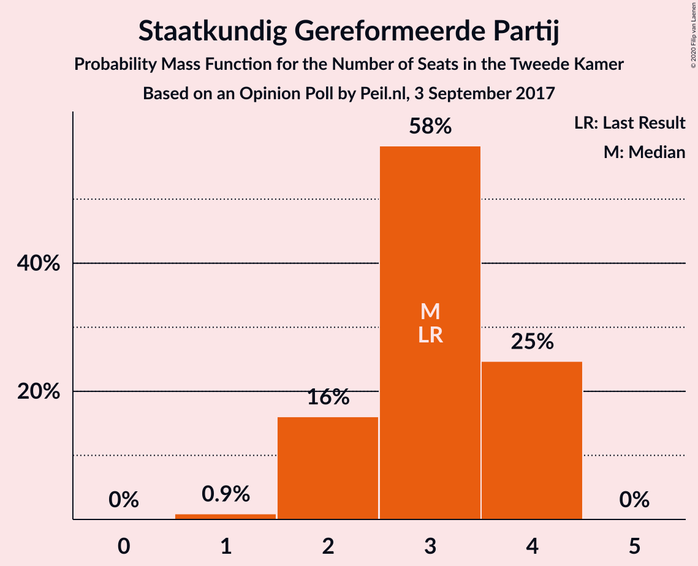

| Number of Seats | Probability | Accumulated | Special Marks |
|:---------------:|:-----------:|:-----------:|:-------------:|
| 1 | 0.9% | 100% |  |
| 2 | 16% | 99.1% |  |
| 3 | 58% | 83% | Last Result, Median |
| 4 | 25% | 25% |  |
| 5 | 0% | 0% |  |

### DENK

*For a full overview of the results for this party, see the [DENK](party-denk.html) page.*

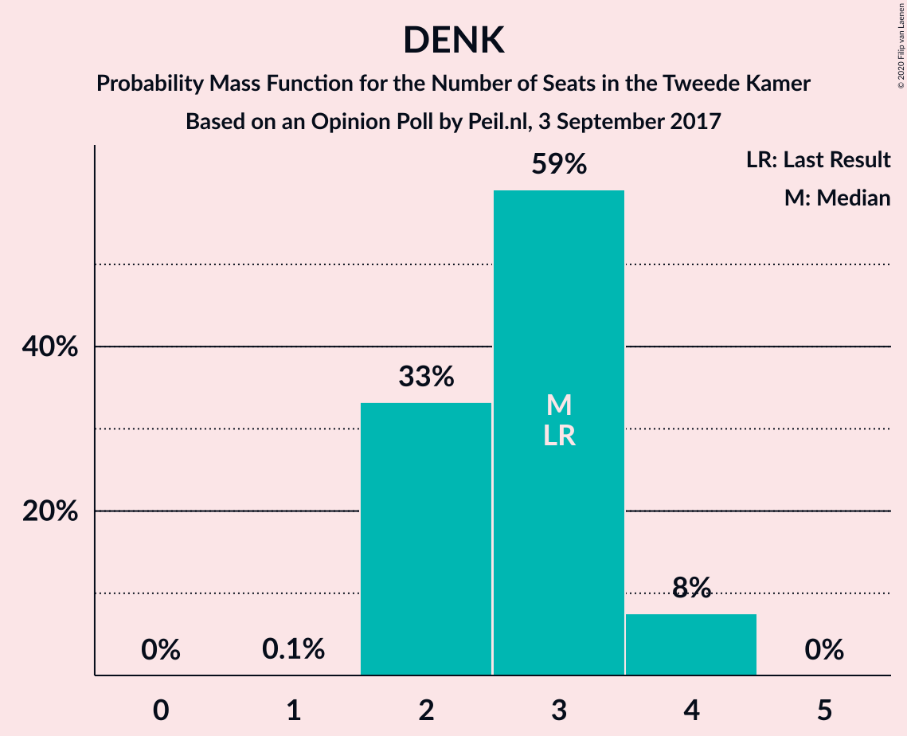

| Number of Seats | Probability | Accumulated | Special Marks |
|:---------------:|:-----------:|:-----------:|:-------------:|
| 1 | 0.1% | 100% |  |
| 2 | 33% | 99.9% |  |
| 3 | 59% | 67% | Last Result, Median |
| 4 | 8% | 8% |  |
| 5 | 0% | 0% |  |

## Coalitions

### Confidence Intervals

| Coalition | Last Result | Median | Majority? | 80% Confidence Interval | 90% Confidence Interval | 95% Confidence Interval | 99% Confidence Interval |
|:---------:|:-----------:|:------:|:---------:|:-----------------------:|:-----------------------:|:-----------------------:|:-----------------------:|
| Volkspartij voor Vrijheid en Democratie – Democraten 66 – Christen-Democratisch Appèl – GroenLinks – ChristenUnie | 90 | 84 | 100% | 83–88 | 82–88 | 82–88 | 81–90 |
| Volkspartij voor Vrijheid en Democratie – Democraten 66 – Christen-Democratisch Appèl – Partij van de Arbeid – ChristenUnie | 85 | 84 | 100% | 82–88 | 82–88 | 81–88 | 80–88 |
| Volkspartij voor Vrijheid en Democratie – Partij voor de Vrijheid – Christen-Democratisch Appèl – Forum voor Democratie – Staatkundig Gereformeerde Partij | 77 | 78 | 91% | 76–80 | 75–81 | 75–83 | 74–84 |
| Democraten 66 – Christen-Democratisch Appèl – GroenLinks – Partij van de Arbeid – Socialistische Partij – ChristenUnie | 80 | 77 | 92% | 76–80 | 75–81 | 73–81 | 73–81 |
| Volkspartij voor Vrijheid en Democratie – Partij voor de Vrijheid – Christen-Democratisch Appèl – Forum voor Democratie | 74 | 75 | 39% | 73–77 | 71–78 | 71–80 | 71–80 |
| Volkspartij voor Vrijheid en Democratie – Democraten 66 – Christen-Democratisch Appèl – ChristenUnie | 76 | 72 | 2% | 70–75 | 69–75 | 69–75 | 67–76 |
| Volkspartij voor Vrijheid en Democratie – Partij voor de Vrijheid – Christen-Democratisch Appèl | 72 | 68 | 0% | 66–70 | 66–71 | 65–73 | 64–73 |
| Volkspartij voor Vrijheid en Democratie – Democraten 66 – Christen-Democratisch Appèl | 71 | 67 | 0% | 65–71 | 65–71 | 65–71 | 63–71 |
| Democraten 66 – Christen-Democratisch Appèl – GroenLinks – Partij van de Arbeid – ChristenUnie | 66 | 65 | 0% | 62–68 | 61–68 | 61–68 | 61–70 |
| Volkspartij voor Vrijheid en Democratie – Democraten 66 – Partij van de Arbeid | 61 | 62 | 0% | 60–68 | 59–68 | 59–68 | 59–68 |
| Volkspartij voor Vrijheid en Democratie – Christen-Democratisch Appèl – Forum voor Democratie – 50Plus – Staatkundig Gereformeerde Partij | 61 | 63 | 0% | 60–65 | 59–65 | 58–66 | 58–67 |
| Volkspartij voor Vrijheid en Democratie – Christen-Democratisch Appèl – Partij van de Arbeid | 61 | 61 | 0% | 58–64 | 58–64 | 57–64 | 57–65 |
| Volkspartij voor Vrijheid en Democratie – Christen-Democratisch Appèl – Forum voor Democratie – 50Plus | 58 | 59 | 0% | 56–62 | 56–62 | 55–62 | 55–65 |
| Volkspartij voor Vrijheid en Democratie – Christen-Democratisch Appèl – Forum voor Democratie – Staatkundig Gereformeerde Partij | 57 | 59 | 0% | 57–61 | 56–62 | 54–62 | 54–63 |
| Volkspartij voor Vrijheid en Democratie – Christen-Democratisch Appèl – Forum voor Democratie | 54 | 56 | 0% | 53–58 | 53–58 | 51–58 | 51–61 |
| Volkspartij voor Vrijheid en Democratie – Christen-Democratisch Appèl | 52 | 49 | 0% | 47–51 | 46–51 | 45–51 | 45–54 |
| Democraten 66 – Christen-Democratisch Appèl – Partij van de Arbeid | 47 | 48 | 0% | 46–50 | 46–50 | 46–50 | 44–51 |
| Volkspartij voor Vrijheid en Democratie – Partij van de Arbeid | 42 | 44 | 0% | 41–48 | 41–48 | 41–48 | 40–48 |
| Democraten 66 – Christen-Democratisch Appèl | 38 | 36 | 0% | 34–38 | 33–39 | 33–39 | 33–39 |
| Christen-Democratisch Appèl – Partij van de Arbeid – ChristenUnie | 33 | 33 | 0% | 32–36 | 32–36 | 32–37 | 31–38 |
| Christen-Democratisch Appèl – Partij van de Arbeid | 28 | 29 | 0% | 28–31 | 28–31 | 27–32 | 26–32 |

### Volkspartij voor Vrijheid en Democratie – Democraten 66 – Christen-Democratisch Appèl – GroenLinks – ChristenUnie

| Number of Seats | Probability | Accumulated | Special Marks |
|:---------------:|:-----------:|:-----------:|:-------------:|
| 80 | 0.1% | 100% |  |
| 81 | 0.6% | 99.8% |  |
| 82 | 9% | 99.2% |  |
| 83 | 14% | 90% |  |
| 84 | 26% | 76% | Median |
| 85 | 9% | 50% |  |
| 86 | 13% | 41% |  |
| 87 | 18% | 28% |  |
| 88 | 9% | 10% |  |
| 89 | 0.5% | 2% |  |
| 90 | 1.3% | 1.3% | Last Result |
| 91 | 0% | 0% |  |

### Volkspartij voor Vrijheid en Democratie – Democraten 66 – Christen-Democratisch Appèl – Partij van de Arbeid – ChristenUnie

| Number of Seats | Probability | Accumulated | Special Marks |
|:---------------:|:-----------:|:-----------:|:-------------:|
| 79 | 0.1% | 100% |  |
| 80 | 1.1% | 99.9% |  |
| 81 | 3% | 98.7% |  |
| 82 | 22% | 96% |  |
| 83 | 19% | 73% | Median |
| 84 | 24% | 54% |  |
| 85 | 8% | 30% | Last Result |
| 86 | 7% | 22% |  |
| 87 | 3% | 15% |  |
| 88 | 12% | 12% |  |
| 89 | 0.4% | 0.5% |  |
| 90 | 0% | 0% |  |

### Volkspartij voor Vrijheid en Democratie – Partij voor de Vrijheid – Christen-Democratisch Appèl – Forum voor Democratie – Staatkundig Gereformeerde Partij

| Number of Seats | Probability | Accumulated | Special Marks |
|:---------------:|:-----------:|:-----------:|:-------------:|
| 73 | 0.3% | 100% |  |
| 74 | 1.3% | 99.7% |  |
| 75 | 7% | 98% |  |
| 76 | 14% | 91% | Majority |
| 77 | 16% | 77% | Last Result |
| 78 | 23% | 62% | Median |
| 79 | 25% | 39% |  |
| 80 | 4% | 14% |  |
| 81 | 7% | 10% |  |
| 82 | 0.8% | 3% |  |
| 83 | 0% | 3% |  |
| 84 | 2% | 2% |  |
| 85 | 0% | 0% |  |

### Democraten 66 – Christen-Democratisch Appèl – GroenLinks – Partij van de Arbeid – Socialistische Partij – ChristenUnie

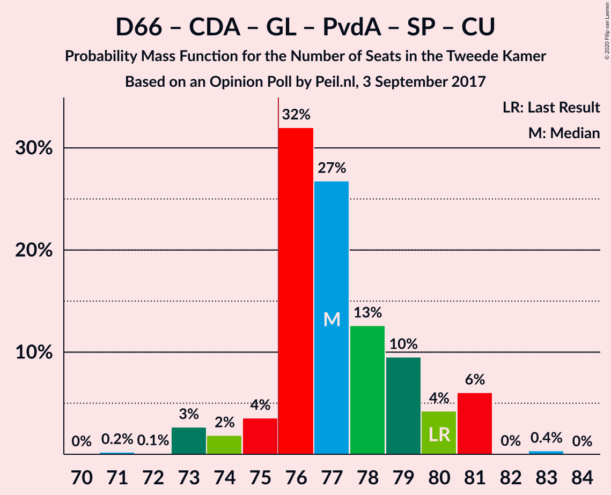

| Number of Seats | Probability | Accumulated | Special Marks |
|:---------------:|:-----------:|:-----------:|:-------------:|
| 71 | 0.2% | 100% |  |
| 72 | 0.1% | 99.8% |  |
| 73 | 3% | 99.7% |  |
| 74 | 2% | 97% |  |
| 75 | 4% | 95% |  |
| 76 | 32% | 92% | Median, Majority |
| 77 | 27% | 60% |  |
| 78 | 13% | 33% |  |
| 79 | 10% | 20% |  |
| 80 | 4% | 11% | Last Result |
| 81 | 6% | 6% |  |
| 82 | 0% | 0.4% |  |
| 83 | 0.4% | 0.4% |  |
| 84 | 0% | 0% |  |

### Volkspartij voor Vrijheid en Democratie – Partij voor de Vrijheid – Christen-Democratisch Appèl – Forum voor Democratie

| Number of Seats | Probability | Accumulated | Special Marks |
|:---------------:|:-----------:|:-----------:|:-------------:|
| 70 | 0.3% | 100% |  |
| 71 | 6% | 99.7% |  |
| 72 | 2% | 93% |  |
| 73 | 13% | 92% |  |
| 74 | 22% | 78% | Last Result |
| 75 | 17% | 56% | Median |
| 76 | 19% | 39% | Majority |
| 77 | 15% | 20% |  |
| 78 | 1.2% | 6% |  |
| 79 | 2% | 5% |  |
| 80 | 2% | 3% |  |
| 81 | 0.1% | 0.1% |  |
| 82 | 0% | 0% |  |

### Volkspartij voor Vrijheid en Democratie – Democraten 66 – Christen-Democratisch Appèl – ChristenUnie

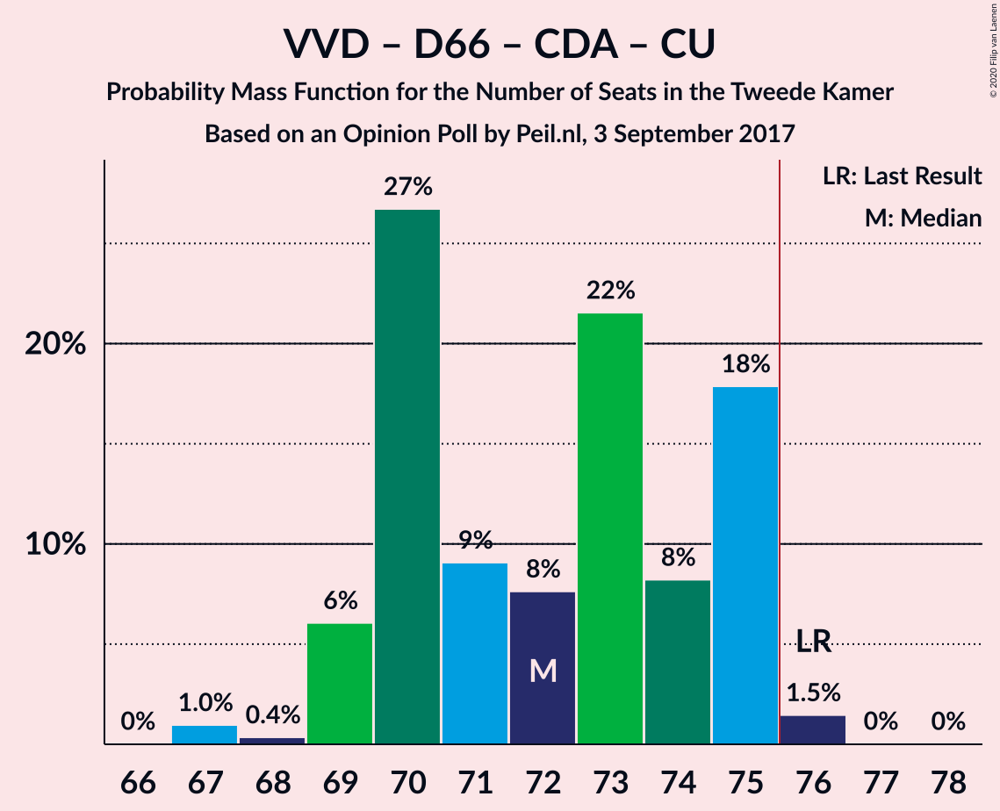

| Number of Seats | Probability | Accumulated | Special Marks |
|:---------------:|:-----------:|:-----------:|:-------------:|
| 67 | 1.0% | 100% |  |
| 68 | 0.4% | 99.0% |  |
| 69 | 6% | 98.6% |  |
| 70 | 27% | 93% |  |
| 71 | 9% | 66% | Median |
| 72 | 8% | 57% |  |
| 73 | 22% | 49% |  |
| 74 | 8% | 28% |  |
| 75 | 18% | 19% |  |
| 76 | 1.5% | 2% | Last Result, Majority |
| 77 | 0% | 0.1% |  |
| 78 | 0% | 0% |  |

### Volkspartij voor Vrijheid en Democratie – Partij voor de Vrijheid – Christen-Democratisch Appèl

| Number of Seats | Probability | Accumulated | Special Marks |
|:---------------:|:-----------:|:-----------:|:-------------:|
| 64 | 2% | 100% |  |
| 65 | 2% | 98% |  |
| 66 | 18% | 97% |  |
| 67 | 22% | 78% |  |
| 68 | 7% | 56% | Median |
| 69 | 20% | 50% |  |
| 70 | 24% | 30% |  |
| 71 | 0.8% | 6% |  |
| 72 | 2% | 5% | Last Result |
| 73 | 3% | 3% |  |
| 74 | 0% | 0% |  |

### Volkspartij voor Vrijheid en Democratie – Democraten 66 – Christen-Democratisch Appèl

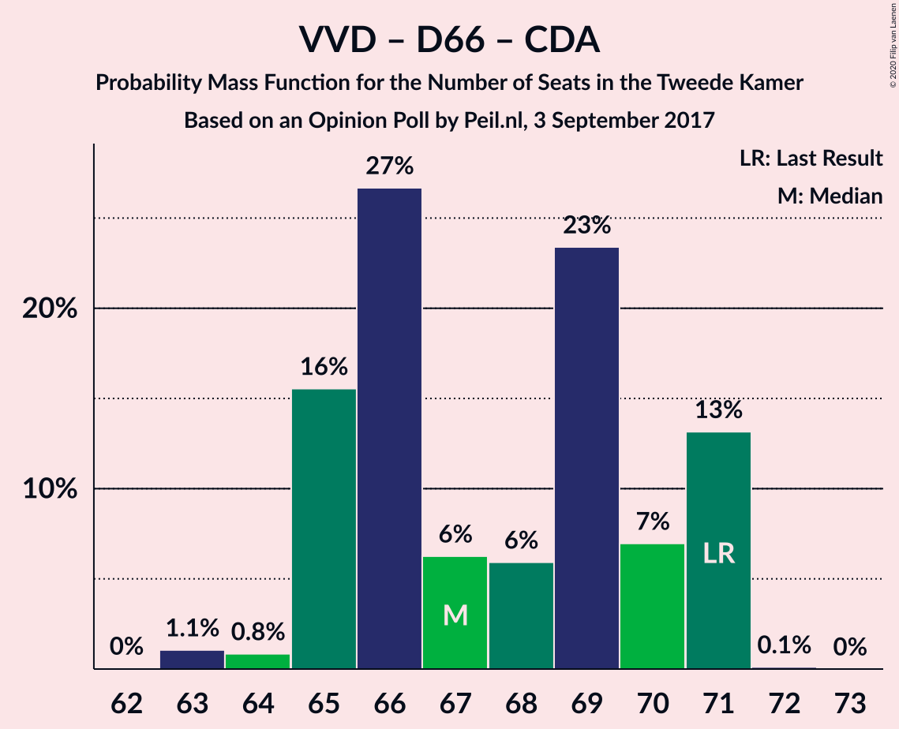

| Number of Seats | Probability | Accumulated | Special Marks |
|:---------------:|:-----------:|:-----------:|:-------------:|
| 63 | 1.1% | 100% |  |
| 64 | 0.8% | 98.9% |  |
| 65 | 16% | 98% |  |
| 66 | 27% | 83% |  |
| 67 | 6% | 56% | Median |
| 68 | 6% | 50% |  |
| 69 | 23% | 44% |  |
| 70 | 7% | 20% |  |
| 71 | 13% | 13% | Last Result |
| 72 | 0.1% | 0.1% |  |
| 73 | 0% | 0% |  |

### Democraten 66 – Christen-Democratisch Appèl – GroenLinks – Partij van de Arbeid – ChristenUnie

| Number of Seats | Probability | Accumulated | Special Marks |
|:---------------:|:-----------:|:-----------:|:-------------:|
| 60 | 0.2% | 100% |  |
| 61 | 8% | 99.8% |  |
| 62 | 3% | 91% |  |
| 63 | 3% | 88% |  |
| 64 | 25% | 85% | Median |
| 65 | 20% | 60% |  |
| 66 | 21% | 40% | Last Result |
| 67 | 4% | 19% |  |
| 68 | 14% | 15% |  |
| 69 | 0.2% | 0.7% |  |
| 70 | 0.1% | 0.5% |  |
| 71 | 0.4% | 0.4% |  |
| 72 | 0% | 0% |  |

### Volkspartij voor Vrijheid en Democratie – Democraten 66 – Partij van de Arbeid

| Number of Seats | Probability | Accumulated | Special Marks |
|:---------------:|:-----------:|:-----------:|:-------------:|
| 57 | 0.2% | 100% |  |
| 58 | 0.2% | 99.8% |  |
| 59 | 9% | 99.6% |  |
| 60 | 3% | 91% |  |
| 61 | 37% | 88% | Last Result |
| 62 | 15% | 51% | Median |
| 63 | 20% | 37% |  |
| 64 | 3% | 16% |  |
| 65 | 0.9% | 13% |  |
| 66 | 0.6% | 12% |  |
| 67 | 0% | 11% |  |
| 68 | 11% | 11% |  |
| 69 | 0% | 0% |  |

### Volkspartij voor Vrijheid en Democratie – Christen-Democratisch Appèl – Forum voor Democratie – 50Plus – Staatkundig Gereformeerde Partij

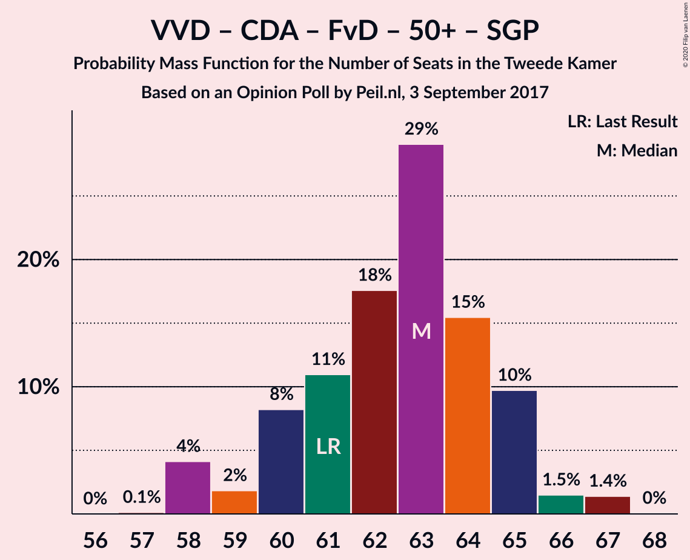

| Number of Seats | Probability | Accumulated | Special Marks |
|:---------------:|:-----------:|:-----------:|:-------------:|
| 57 | 0.1% | 100% |  |
| 58 | 4% | 99.9% |  |
| 59 | 2% | 96% |  |
| 60 | 8% | 94% |  |
| 61 | 11% | 86% | Last Result |
| 62 | 18% | 75% |  |
| 63 | 29% | 57% | Median |
| 64 | 15% | 28% |  |
| 65 | 10% | 13% |  |
| 66 | 1.5% | 3% |  |
| 67 | 1.4% | 1.4% |  |
| 68 | 0% | 0% |  |

### Volkspartij voor Vrijheid en Democratie – Christen-Democratisch Appèl – Partij van de Arbeid

| Number of Seats | Probability | Accumulated | Special Marks |
|:---------------:|:-----------:|:-----------:|:-------------:|
| 56 | 0.1% | 100% |  |
| 57 | 4% | 99.9% |  |
| 58 | 10% | 96% |  |
| 59 | 1.5% | 86% |  |
| 60 | 19% | 84% |  |
| 61 | 30% | 66% | Last Result, Median |
| 62 | 17% | 35% |  |
| 63 | 3% | 18% |  |
| 64 | 13% | 15% |  |
| 65 | 2% | 2% |  |
| 66 | 0.2% | 0.2% |  |
| 67 | 0% | 0% |  |

### Volkspartij voor Vrijheid en Democratie – Christen-Democratisch Appèl – Forum voor Democratie – 50Plus

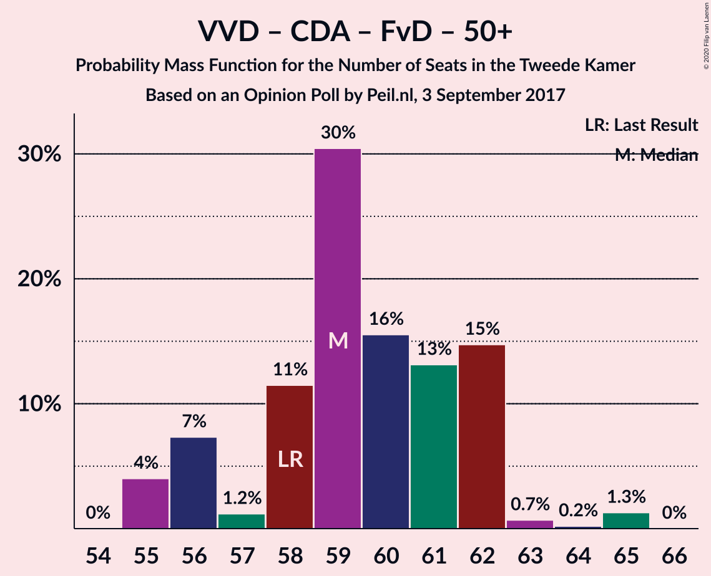

| Number of Seats | Probability | Accumulated | Special Marks |
|:---------------:|:-----------:|:-----------:|:-------------:|
| 55 | 4% | 100% |  |
| 56 | 7% | 96% |  |
| 57 | 1.2% | 89% |  |
| 58 | 11% | 87% | Last Result |
| 59 | 30% | 76% |  |
| 60 | 16% | 46% | Median |
| 61 | 13% | 30% |  |
| 62 | 15% | 17% |  |
| 63 | 0.7% | 2% |  |
| 64 | 0.2% | 1.5% |  |
| 65 | 1.3% | 1.3% |  |
| 66 | 0% | 0% |  |

### Volkspartij voor Vrijheid en Democratie – Christen-Democratisch Appèl – Forum voor Democratie – Staatkundig Gereformeerde Partij

| Number of Seats | Probability | Accumulated | Special Marks |
|:---------------:|:-----------:|:-----------:|:-------------:|
| 53 | 0.1% | 100% |  |
| 54 | 4% | 99.9% |  |
| 55 | 0.6% | 96% |  |
| 56 | 4% | 96% |  |
| 57 | 14% | 92% | Last Result |
| 58 | 19% | 78% |  |
| 59 | 13% | 59% | Median |
| 60 | 33% | 46% |  |
| 61 | 8% | 13% |  |
| 62 | 4% | 5% |  |
| 63 | 1.4% | 1.4% |  |
| 64 | 0% | 0% |  |

### Volkspartij voor Vrijheid en Democratie – Christen-Democratisch Appèl – Forum voor Democratie

| Number of Seats | Probability | Accumulated | Special Marks |
|:---------------:|:-----------:|:-----------:|:-------------:|
| 51 | 4% | 100% |  |
| 52 | 0.6% | 96% |  |
| 53 | 8% | 96% |  |
| 54 | 9% | 88% | Last Result |
| 55 | 17% | 79% |  |
| 56 | 26% | 61% | Median |
| 57 | 15% | 35% |  |
| 58 | 18% | 20% |  |
| 59 | 0.6% | 2% |  |
| 60 | 0.3% | 2% |  |
| 61 | 1.2% | 1.2% |  |
| 62 | 0% | 0% |  |

### Volkspartij voor Vrijheid en Democratie – Christen-Democratisch Appèl

| Number of Seats | Probability | Accumulated | Special Marks |
|:---------------:|:-----------:|:-----------:|:-------------:|
| 44 | 0.1% | 100% |  |
| 45 | 5% | 99.9% |  |
| 46 | 1.5% | 95% |  |
| 47 | 10% | 94% |  |
| 48 | 18% | 84% |  |
| 49 | 30% | 65% | Median |
| 50 | 4% | 35% |  |
| 51 | 30% | 32% |  |
| 52 | 0.8% | 2% | Last Result |
| 53 | 0.1% | 1.4% |  |
| 54 | 1.3% | 1.3% |  |
| 55 | 0% | 0% |  |

### Democraten 66 – Christen-Democratisch Appèl – Partij van de Arbeid

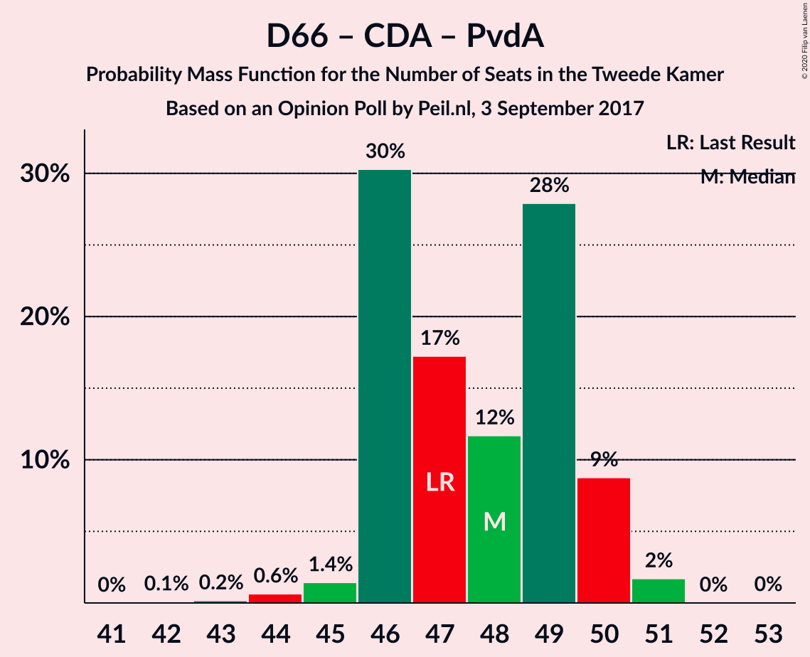

| Number of Seats | Probability | Accumulated | Special Marks |
|:---------------:|:-----------:|:-----------:|:-------------:|
| 42 | 0.1% | 100% |  |
| 43 | 0.2% | 99.9% |  |
| 44 | 0.6% | 99.7% |  |
| 45 | 1.4% | 99.1% |  |
| 46 | 30% | 98% |  |
| 47 | 17% | 67% | Last Result, Median |
| 48 | 12% | 50% |  |
| 49 | 28% | 38% |  |
| 50 | 9% | 11% |  |
| 51 | 2% | 2% |  |
| 52 | 0% | 0.1% |  |
| 53 | 0% | 0% |  |

### Volkspartij voor Vrijheid en Democratie – Partij van de Arbeid

| Number of Seats | Probability | Accumulated | Special Marks |
|:---------------:|:-----------:|:-----------:|:-------------:|
| 39 | 0% | 100% |  |
| 40 | 1.2% | 99.9% |  |
| 41 | 10% | 98.8% |  |
| 42 | 19% | 88% | Last Result |
| 43 | 18% | 69% |  |
| 44 | 25% | 51% | Median |
| 45 | 5% | 26% |  |
| 46 | 8% | 21% |  |
| 47 | 2% | 13% |  |
| 48 | 12% | 12% |  |
| 49 | 0% | 0% |  |

### Democraten 66 – Christen-Democratisch Appèl

| Number of Seats | Probability | Accumulated | Special Marks |
|:---------------:|:-----------:|:-----------:|:-------------:|
| 31 | 0% | 100% |  |
| 32 | 0.3% | 99.9% |  |
| 33 | 8% | 99.6% |  |
| 34 | 17% | 91% |  |
| 35 | 18% | 74% | Median |
| 36 | 30% | 57% |  |
| 37 | 9% | 27% |  |
| 38 | 9% | 17% | Last Result |
| 39 | 7% | 8% |  |
| 40 | 0.4% | 0.4% |  |
| 41 | 0% | 0% |  |

### Christen-Democratisch Appèl – Partij van de Arbeid – ChristenUnie

| Number of Seats | Probability | Accumulated | Special Marks |
|:---------------:|:-----------:|:-----------:|:-------------:|
| 30 | 0.1% | 100% |  |
| 31 | 2% | 99.9% |  |
| 32 | 10% | 98% |  |
| 33 | 48% | 88% | Last Result, Median |
| 34 | 18% | 40% |  |
| 35 | 11% | 22% |  |
| 36 | 8% | 11% |  |
| 37 | 2% | 3% |  |
| 38 | 0.8% | 0.8% |  |
| 39 | 0% | 0% |  |

### Christen-Democratisch Appèl – Partij van de Arbeid

| Number of Seats | Probability | Accumulated | Special Marks |
|:---------------:|:-----------:|:-----------:|:-------------:|
| 25 | 0.1% | 100% |  |
| 26 | 2% | 99.9% |  |
| 27 | 1.4% | 98% |  |
| 28 | 22% | 97% | Last Result |
| 29 | 48% | 75% | Median |
| 30 | 13% | 27% |  |
| 31 | 10% | 13% |  |
| 32 | 3% | 3% |  |
| 33 | 0.1% | 0.2% |  |
| 34 | 0% | 0% |  |

## Technical Information

### Opinion Poll

+ **Polling firm:** Peil.nl
+ **Commissioner(s):** —
+ **Fieldwork period:** 3 September 2017

### Calculations

+ **Sample size:** 3000
+ **Simulations done:** 1,048,576
+ **Error estimate:** 2.21%

