# Opinion Poll by Peil.nl, 3 September 2017

<a href="#voting-intentions">Voting Intentions</a> | <a href="#seats">Seats</a> | <a href="#coalitions">Coalitions</a> | <a href="#technical-information">Technical Information</a>

## Voting Intentions

### Confidence Intervals

| Party | Last Result | Poll Result | 80% Confidence Interval | 90% Confidence Interval | 95% Confidence Interval | 99% Confidence Interval |
|:-----:|:-----------:|:-----------:|:-----------------------:|:-----------------------:|:-----------------------:|:-----------------------:|
| Volkspartij voor Vrijheid en Democratie | 21.3% | 20.7% | 19.7–21.6% |19.5–21.9% |19.3–22.2% |18.8–22.6% |
| Partij voor de Vrijheid | 13.1% | 12.7% | 11.9–13.5% |11.7–13.7% |11.5–13.9% |11.2–14.3% |
| Democraten 66 | 12.2% | 12.0% | 11.3–12.8% |11.1–13.0% |10.9–13.2% |10.5–13.6% |
| Christen-Democratisch Appèl | 12.4% | 11.3% | 10.6–12.1% |10.4–12.3% |10.2–12.5% |9.9–12.9% |
| GroenLinks | 9.1% | 8.7% | 8.0–9.4% |7.8–9.6% |7.7–9.7% |7.4–10.1% |
| Socialistische Partij | 9.1% | 8.0% | 7.4–8.7% |7.2–8.9% |7.1–9.0% |6.8–9.4% |
| Partij van de Arbeid | 5.7% | 8.0% | 7.4–8.7% |7.2–8.9% |7.1–9.0% |6.8–9.4% |
| Forum voor Democratie | 1.8% | 4.7% | 4.2–5.2% |4.1–5.3% |4.0–5.5% |3.7–5.8% |
| Partij voor de Dieren | 3.2% | 4.0% | 3.6–4.5% |3.4–4.6% |3.4–4.8% |3.2–5.0% |
| ChristenUnie | 3.4% | 3.3% | 2.9–3.8% |2.8–3.9% |2.7–4.0% |2.6–4.3% |
| 50Plus | 3.1% | 2.7% | 2.3–3.1% |2.2–3.2% |2.1–3.3% |2.0–3.5% |
| Staatkundig Gereformeerde Partij | 2.1% | 2.0% | 1.7–2.4% |1.6–2.5% |1.6–2.6% |1.4–2.8% |
| DENK | 2.1% | 2.0% | 1.7–2.4% |1.6–2.5% |1.6–2.6% |1.4–2.8% |

*Note:* The poll result column reflects the actual value used in the calculations. Published results may vary slightly, and in addition be rounded to fewer digits.

## Seats

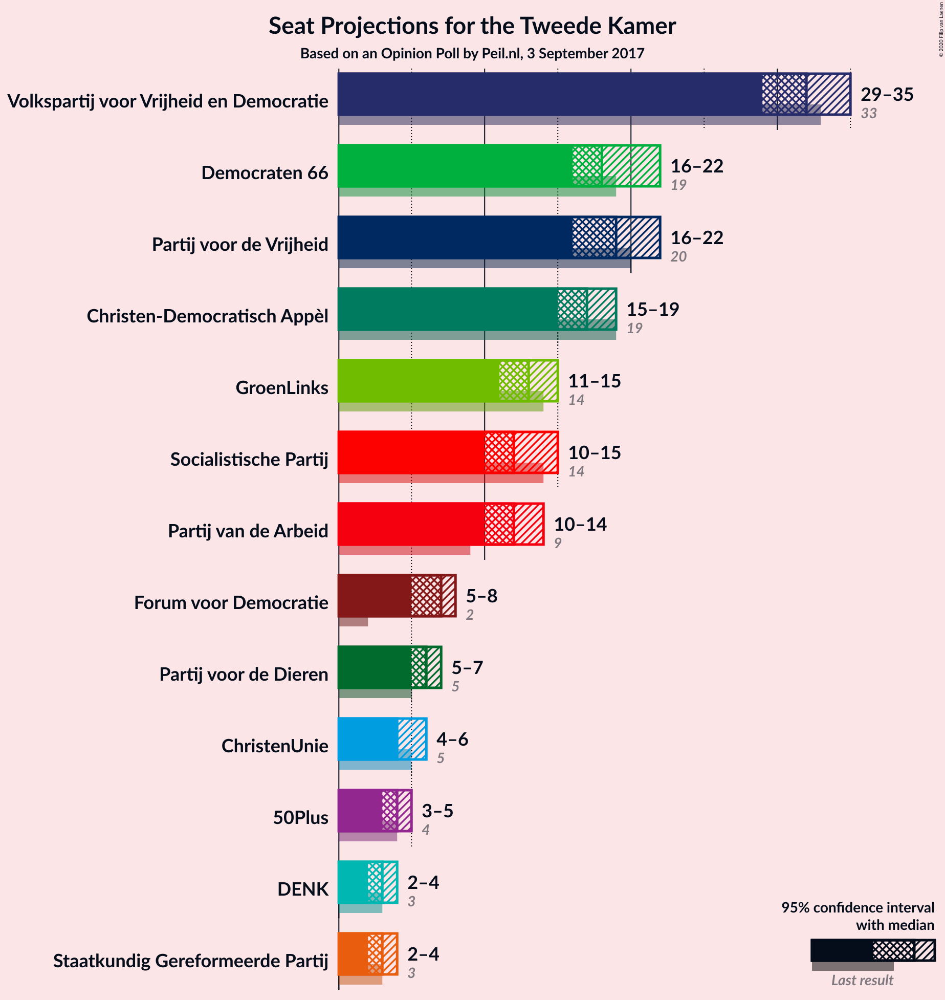

### Confidence Intervals

| Party | Last Result | Median | 80% Confidence Interval | 90% Confidence Interval | 95% Confidence Interval | 99% Confidence Interval |
|:-----:|:-----------:|:------:|:-----------------------:|:-----------------------:|:-----------------------:|:-----------------------:|
| <a href="#volkspartij-voor-vrijheid-en-democratie">Volkspartij voor Vrijheid en Democratie</a> | 33 | 32 | 29–36 |29–36 |29–36 |29–36 |
| <a href="#partij-voor-de-vrijheid">Partij voor de Vrijheid</a> | 20 | 18 | 18–20 |17–20 |17–20 |17–21 |
| <a href="#democraten-66">Democraten 66</a> | 19 | 17 | 17–19 |17–21 |17–21 |16–21 |
| <a href="#christen-democratisch-appèl">Christen-Democratisch Appèl</a> | 19 | 16 | 16–18 |16–20 |16–20 |16–20 |
| <a href="#groenlinks">GroenLinks</a> | 14 | 14 | 13–14 |12–14 |12–14 |11–15 |
| <a href="#socialistische-partij">Socialistische Partij</a> | 14 | 11 | 10–12 |10–14 |10–14 |10–14 |
| <a href="#partij-van-de-arbeid">Partij van de Arbeid</a> | 9 | 14 | 11–14 |11–14 |11–14 |10–14 |
| <a href="#forum-voor-democratie">Forum voor Democratie</a> | 2 | 8 | 7–8 |6–8 |6–8 |6–8 |
| <a href="#partij-voor-de-dieren">Partij voor de Dieren</a> | 5 | 5 | 5–6 |4–6 |4–7 |4–7 |
| <a href="#christenunie">ChristenUnie</a> | 5 | 4 | 4–5 |4–6 |4–6 |4–6 |
| <a href="#50plus">50Plus</a> | 4 | 5 | 3–5 |3–5 |3–5 |3–5 |
| <a href="#staatkundig-gereformeerde-partij">Staatkundig Gereformeerde Partij</a> | 3 | 3 | 2–3 |2–3 |2–3 |2–3 |
| <a href="#denk">DENK</a> | 3 | 3 | 3 |3 |3–4 |1–4 |

### Volkspartij voor Vrijheid en Democratie

*For a full overview of the results for this party, see the [Volkspartij voor Vrijheid en Democratie](party-volkspartijvoorvrijheidendemocratie.html) page.*

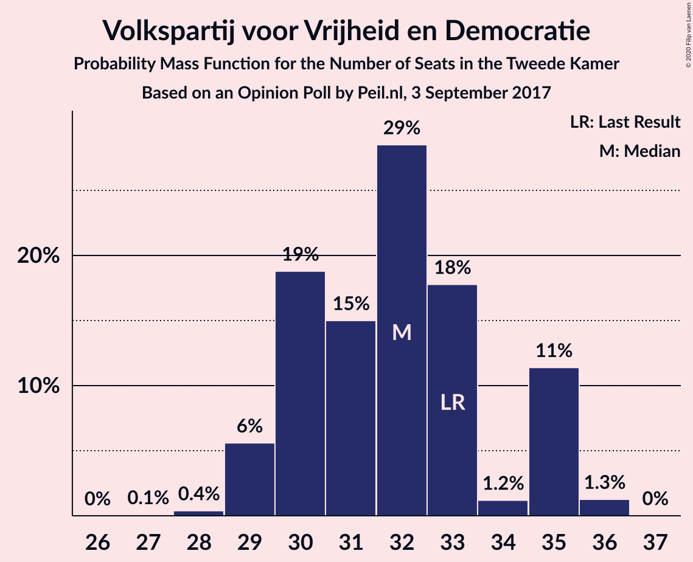

| Number of Seats | Probability | Accumulated | Special Marks |
|:---------------:|:-----------:|:-----------:|:-------------:|
| 29 | 13% | 100% |  |
| 30 | 6% | 87% |  |
| 31 | 0.4% | 81% |  |
| 32 | 64% | 80% | Median |
| 33 | 0.3% | 16% | Last Result |
| 34 | 2% | 16% |  |
| 35 | 0.1% | 14% |  |
| 36 | 14% | 14% |  |
| 37 | 0% | 0% |  |

### Partij voor de Vrijheid

*For a full overview of the results for this party, see the [Partij voor de Vrijheid](party-partijvoordevrijheid.html) page.*

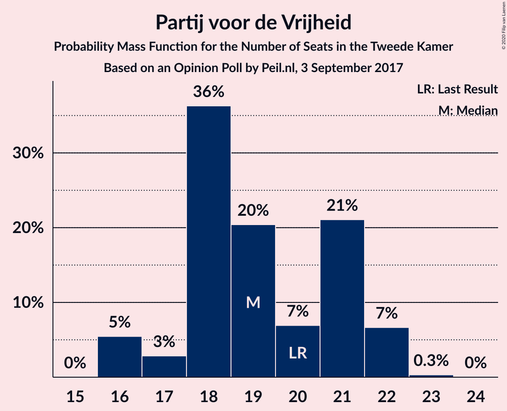

| Number of Seats | Probability | Accumulated | Special Marks |
|:---------------:|:-----------:|:-----------:|:-------------:|
| 17 | 6% | 100% |  |
| 18 | 76% | 94% | Median |
| 19 | 8% | 18% |  |
| 20 | 8% | 10% | Last Result |
| 21 | 2% | 2% |  |
| 22 | 0.1% | 0.3% |  |
| 23 | 0.1% | 0.2% |  |
| 24 | 0.2% | 0.2% |  |
| 25 | 0% | 0% |  |

### Democraten 66

*For a full overview of the results for this party, see the [Democraten 66](party-democraten66.html) page.*

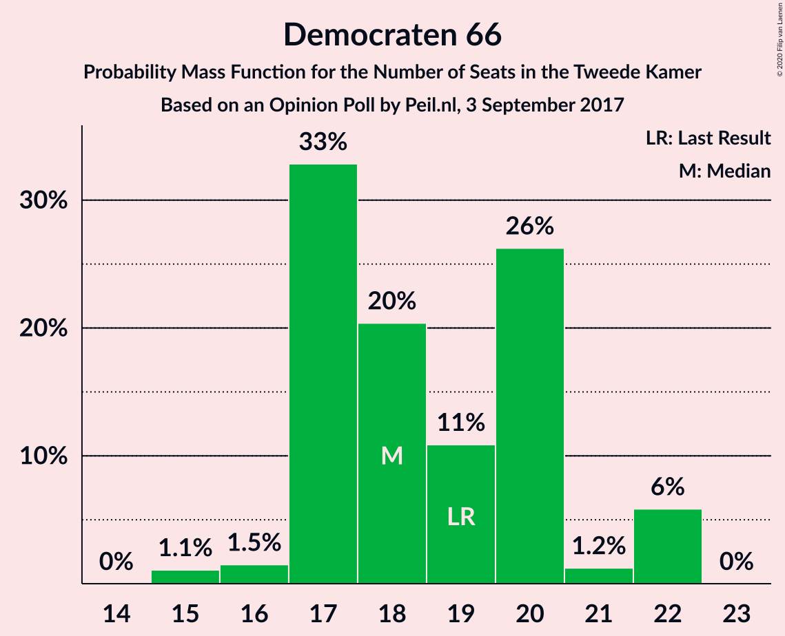

| Number of Seats | Probability | Accumulated | Special Marks |
|:---------------:|:-----------:|:-----------:|:-------------:|
| 16 | 0.8% | 100% |  |
| 17 | 76% | 99.1% | Median |
| 18 | 6% | 23% |  |
| 19 | 8% | 17% | Last Result |
| 20 | 4% | 9% |  |
| 21 | 5% | 5% |  |
| 22 | 0% | 0% |  |

### Christen-Democratisch Appèl

*For a full overview of the results for this party, see the [Christen-Democratisch Appèl](party-christen-democratischappèl.html) page.*

| Number of Seats | Probability | Accumulated | Special Marks |
|:---------------:|:-----------:|:-----------:|:-------------:|
| 14 | 0.1% | 100% |  |
| 15 | 0.2% | 99.9% |  |
| 16 | 67% | 99.7% | Median |
| 17 | 1.4% | 33% |  |
| 18 | 24% | 31% |  |
| 19 | 0.5% | 7% | Last Result |
| 20 | 7% | 7% |  |
| 21 | 0% | 0% |  |

### GroenLinks

*For a full overview of the results for this party, see the [GroenLinks](party-groenlinks.html) page.*

| Number of Seats | Probability | Accumulated | Special Marks |
|:---------------:|:-----------:|:-----------:|:-------------:|
| 11 | 2% | 100% |  |
| 12 | 4% | 98% |  |
| 13 | 8% | 94% |  |
| 14 | 85% | 86% | Last Result, Median |
| 15 | 1.1% | 1.1% |  |
| 16 | 0.1% | 0.1% |  |
| 17 | 0% | 0% |  |

### Socialistische Partij

*For a full overview of the results for this party, see the [Socialistische Partij](party-socialistischepartij.html) page.*

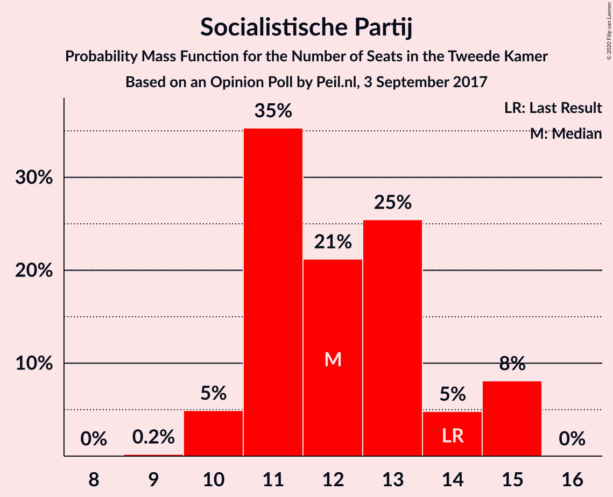

| Number of Seats | Probability | Accumulated | Special Marks |
|:---------------:|:-----------:|:-----------:|:-------------:|
| 10 | 16% | 100% |  |
| 11 | 64% | 84% | Median |
| 12 | 12% | 20% |  |
| 13 | 2% | 7% |  |
| 14 | 5% | 5% | Last Result |
| 15 | 0.2% | 0.2% |  |
| 16 | 0% | 0% |  |

### Partij van de Arbeid

*For a full overview of the results for this party, see the [Partij van de Arbeid](party-partijvandearbeid.html) page.*

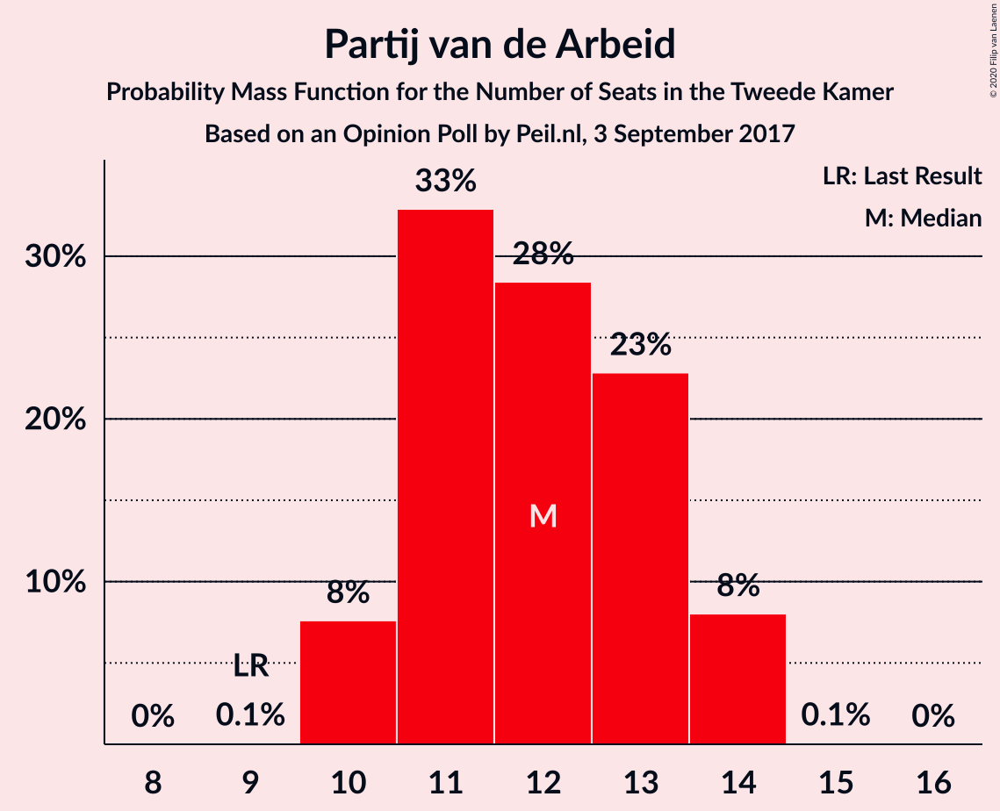

| Number of Seats | Probability | Accumulated | Special Marks |
|:---------------:|:-----------:|:-----------:|:-------------:|
| 9 | 0% | 100% | Last Result |
| 10 | 1.4% | 100% |  |
| 11 | 24% | 98.6% |  |
| 12 | 9% | 74% |  |
| 13 | 4% | 65% |  |
| 14 | 61% | 62% | Median |
| 15 | 0.4% | 0.4% |  |
| 16 | 0% | 0% |  |

### Forum voor Democratie

*For a full overview of the results for this party, see the [Forum voor Democratie](party-forumvoordemocratie.html) page.*

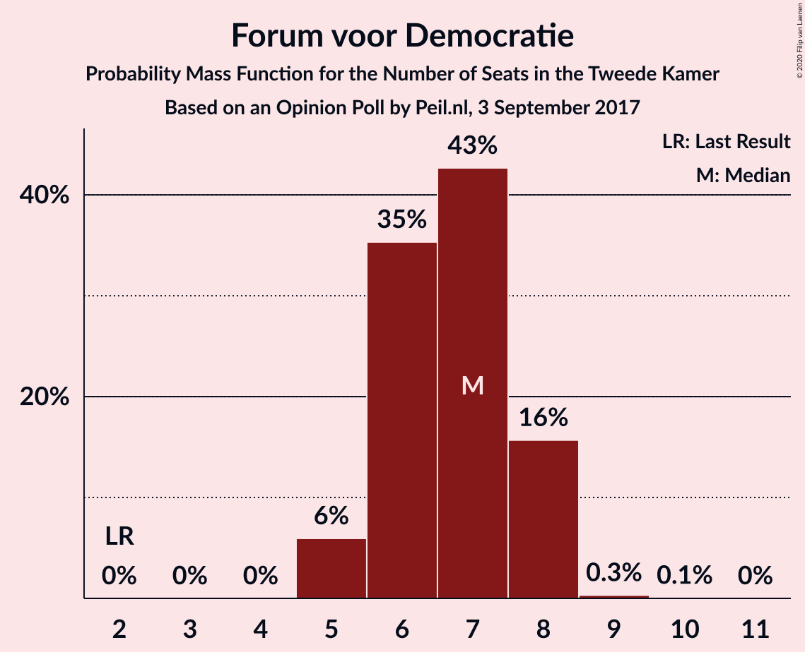

| Number of Seats | Probability | Accumulated | Special Marks |
|:---------------:|:-----------:|:-----------:|:-------------:|
| 2 | 0% | 100% | Last Result |
| 3 | 0% | 100% |  |
| 4 | 0% | 100% |  |
| 5 | 0.2% | 100% |  |
| 6 | 9% | 99.8% |  |
| 7 | 24% | 91% |  |
| 8 | 67% | 67% | Median |
| 9 | 0.2% | 0.2% |  |
| 10 | 0% | 0% |  |

### Partij voor de Dieren

*For a full overview of the results for this party, see the [Partij voor de Dieren](party-partijvoordedieren.html) page.*

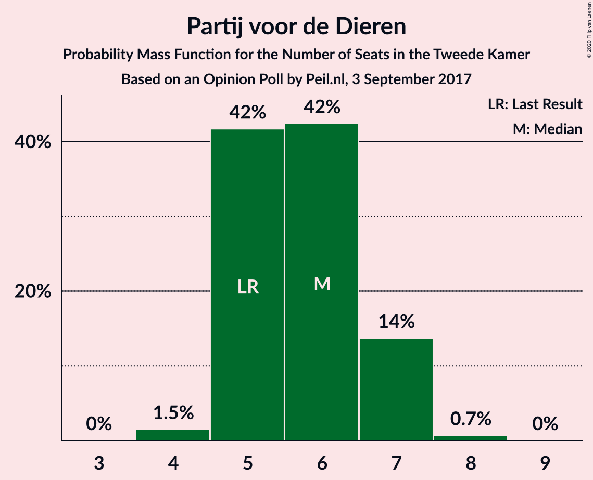

| Number of Seats | Probability | Accumulated | Special Marks |
|:---------------:|:-----------:|:-----------:|:-------------:|
| 4 | 6% | 100% |  |
| 5 | 81% | 94% | Last Result, Median |
| 6 | 9% | 13% |  |
| 7 | 3% | 3% |  |
| 8 | 0.1% | 0.1% |  |
| 9 | 0% | 0% |  |

### ChristenUnie

*For a full overview of the results for this party, see the [ChristenUnie](party-christenunie.html) page.*

| Number of Seats | Probability | Accumulated | Special Marks |
|:---------------:|:-----------:|:-----------:|:-------------:|
| 3 | 0.1% | 100% |  |
| 4 | 65% | 99.9% | Median |
| 5 | 25% | 35% | Last Result |
| 6 | 10% | 10% |  |
| 7 | 0% | 0% |  |

### 50Plus

*For a full overview of the results for this party, see the [50Plus](party-50plus.html) page.*

| Number of Seats | Probability | Accumulated | Special Marks |
|:---------------:|:-----------:|:-----------:|:-------------:|
| 2 | 0.3% | 100% |  |
| 3 | 16% | 99.7% |  |
| 4 | 22% | 84% | Last Result |
| 5 | 61% | 61% | Median |
| 6 | 0% | 0% |  |

### Staatkundig Gereformeerde Partij

*For a full overview of the results for this party, see the [Staatkundig Gereformeerde Partij](party-staatkundiggereformeerdepartij.html) page.*

| Number of Seats | Probability | Accumulated | Special Marks |
|:---------------:|:-----------:|:-----------:|:-------------:|
| 1 | 0.2% | 100% |  |
| 2 | 22% | 99.8% |  |
| 3 | 78% | 78% | Last Result, Median |
| 4 | 0.3% | 0.3% |  |
| 5 | 0% | 0% |  |

### DENK

*For a full overview of the results for this party, see the [DENK](party-denk.html) page.*

| Number of Seats | Probability | Accumulated | Special Marks |
|:---------------:|:-----------:|:-----------:|:-------------:|
| 1 | 0.5% | 100% |  |
| 2 | 0.8% | 99.5% |  |
| 3 | 95% | 98.7% | Last Result, Median |
| 4 | 3% | 3% |  |
| 5 | 0% | 0% |  |

## Coalitions

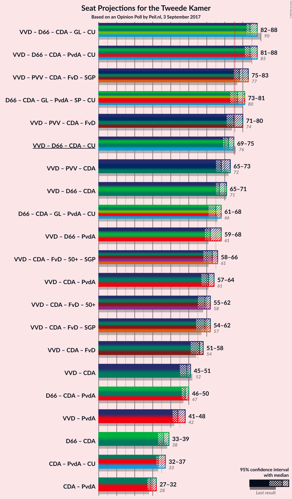

### Confidence Intervals

| Coalition | Last Result | Median | Majority? | 80% Confidence Interval | 90% Confidence Interval | 95% Confidence Interval | 99% Confidence Interval |
|:---------:|:-----------:|:------:|:---------:|:-----------------------:|:-----------------------:|:-----------------------:|:-----------------------:|
| Volkspartij voor Vrijheid en Democratie – Democraten 66 – Christen-Democratisch Appèl – GroenLinks – ChristenUnie | 90 | 83 | 100% | 83–90 | 83–90 | 83–90 | 80–90 |
| Volkspartij voor Vrijheid en Democratie – Democraten 66 – Christen-Democratisch Appèl – Partij van de Arbeid – ChristenUnie | 85 | 83 | 100% | 83–87 | 83–87 | 83–87 | 81–87 |
| Democraten 66 – Christen-Democratisch Appèl – GroenLinks – Partij van de Arbeid – Socialistische Partij – ChristenUnie | 80 | 76 | 84% | 75–80 | 75–81 | 75–83 | 71–83 |
| Volkspartij voor Vrijheid en Democratie – Partij voor de Vrijheid – Christen-Democratisch Appèl – Forum voor Democratie – Staatkundig Gereformeerde Partij | 77 | 77 | 91% | 76–81 | 74–81 | 74–81 | 74–84 |
| Volkspartij voor Vrijheid en Democratie – Partij voor de Vrijheid – Christen-Democratisch Appèl – Forum voor Democratie | 74 | 74 | 20% | 73–79 | 71–79 | 71–79 | 71–81 |
| Volkspartij voor Vrijheid en Democratie – Democraten 66 – Christen-Democratisch Appèl – ChristenUnie | 76 | 69 | 14% | 69–76 | 69–76 | 69–76 | 68–76 |
| Volkspartij voor Vrijheid en Democratie – Partij voor de Vrijheid – Christen-Democratisch Appèl | 72 | 66 | 0% | 66–72 | 65–72 | 65–72 | 65–73 |
| Volkspartij voor Vrijheid en Democratie – Democraten 66 – Christen-Democratisch Appèl | 71 | 65 | 0% | 65–71 | 65–71 | 65–71 | 64–71 |
| Democraten 66 – Christen-Democratisch Appèl – GroenLinks – Partij van de Arbeid – ChristenUnie | 66 | 65 | 0% | 65–68 | 65–68 | 64–71 | 61–71 |
| Volkspartij voor Vrijheid en Democratie – Christen-Democratisch Appèl – Forum voor Democratie – 50Plus – Staatkundig Gereformeerde Partij | 61 | 64 | 0% | 61–67 | 58–67 | 58–67 | 58–67 |
| Volkspartij voor Vrijheid en Democratie – Christen-Democratisch Appèl – Partij van de Arbeid | 61 | 62 | 0% | 58–65 | 58–65 | 58–65 | 58–65 |
| Volkspartij voor Vrijheid en Democratie – Christen-Democratisch Appèl – Forum voor Democratie – 50Plus | 58 | 61 | 0% | 58–65 | 55–65 | 55–65 | 55–65 |
| Volkspartij voor Vrijheid en Democratie – Democraten 66 – Partij van de Arbeid | 61 | 63 | 0% | 60–64 | 59–64 | 59–64 | 58–64 |
| Volkspartij voor Vrijheid en Democratie – Christen-Democratisch Appèl – Forum voor Democratie – Staatkundig Gereformeerde Partij | 57 | 59 | 0% | 57–63 | 55–63 | 55–63 | 55–63 |
| Volkspartij voor Vrijheid en Democratie – Christen-Democratisch Appèl – Forum voor Democratie | 54 | 56 | 0% | 54–61 | 52–61 | 52–61 | 52–61 |
| Volkspartij voor Vrijheid en Democratie – Christen-Democratisch Appèl | 52 | 48 | 0% | 47–54 | 46–54 | 46–54 | 46–54 |
| Democraten 66 – Christen-Democratisch Appèl – Partij van de Arbeid | 47 | 47 | 0% | 46–49 | 46–50 | 46–51 | 45–51 |
| Volkspartij voor Vrijheid en Democratie – Partij van de Arbeid | 42 | 46 | 0% | 41–47 | 40–47 | 40–47 | 40–47 |
| Democraten 66 – Christen-Democratisch Appèl | 38 | 33 | 0% | 33–37 | 33–38 | 33–40 | 33–40 |
| Christen-Democratisch Appèl – Partij van de Arbeid – ChristenUnie | 33 | 34 | 0% | 34–35 | 33–37 | 33–37 | 32–37 |
| Christen-Democratisch Appèl – Partij van de Arbeid | 28 | 30 | 0% | 29–30 | 28–31 | 28–32 | 28–32 |

### Volkspartij voor Vrijheid en Democratie – Democraten 66 – Christen-Democratisch Appèl – GroenLinks – ChristenUnie

| Number of Seats | Probability | Accumulated | Special Marks |
|:---------------:|:-----------:|:-----------:|:-------------:|
| 80 | 1.4% | 100% |  |
| 81 | 0.1% | 98.6% |  |
| 82 | 0.2% | 98.5% |  |
| 83 | 61% | 98% | Median |
| 84 | 0.5% | 37% |  |
| 85 | 9% | 36% |  |
| 86 | 9% | 28% |  |
| 87 | 0.4% | 19% |  |
| 88 | 0.2% | 18% |  |
| 89 | 4% | 18% |  |
| 90 | 14% | 14% | Last Result |
| 91 | 0% | 0% |  |

### Volkspartij voor Vrijheid en Democratie – Democraten 66 – Christen-Democratisch Appèl – Partij van de Arbeid – ChristenUnie

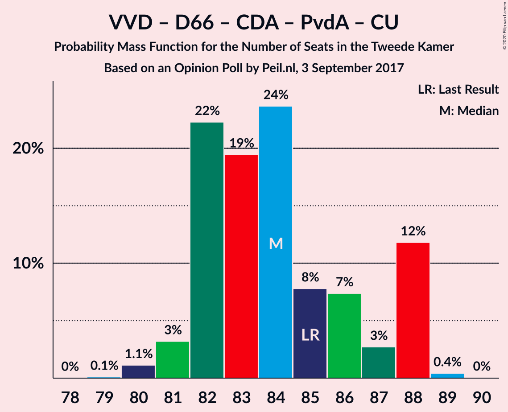

| Number of Seats | Probability | Accumulated | Special Marks |
|:---------------:|:-----------:|:-----------:|:-------------:|
| 79 | 0.1% | 100% |  |
| 80 | 0.1% | 99.9% |  |
| 81 | 1.3% | 99.8% |  |
| 82 | 0.2% | 98% |  |
| 83 | 68% | 98% | Median |
| 84 | 9% | 30% |  |
| 85 | 0.6% | 21% | Last Result |
| 86 | 4% | 21% |  |
| 87 | 17% | 17% |  |
| 88 | 0.2% | 0.2% |  |
| 89 | 0% | 0% |  |

### Democraten 66 – Christen-Democratisch Appèl – GroenLinks – Partij van de Arbeid – Socialistische Partij – ChristenUnie

| Number of Seats | Probability | Accumulated | Special Marks |
|:---------------:|:-----------:|:-----------:|:-------------:|
| 71 | 1.4% | 100% |  |
| 72 | 0% | 98.6% |  |
| 73 | 0.1% | 98.6% |  |
| 74 | 0.4% | 98.5% |  |
| 75 | 14% | 98% |  |
| 76 | 61% | 84% | Median, Majority |
| 77 | 2% | 22% |  |
| 78 | 0% | 21% |  |
| 79 | 4% | 21% |  |
| 80 | 7% | 16% | Last Result |
| 81 | 5% | 9% |  |
| 82 | 0.1% | 4% |  |
| 83 | 4% | 4% |  |
| 84 | 0% | 0% |  |

### Volkspartij voor Vrijheid en Democratie – Partij voor de Vrijheid – Christen-Democratisch Appèl – Forum voor Democratie – Staatkundig Gereformeerde Partij

| Number of Seats | Probability | Accumulated | Special Marks |
|:---------------:|:-----------:|:-----------:|:-------------:|
| 73 | 0.1% | 100% |  |
| 74 | 5% | 99.9% |  |
| 75 | 4% | 95% |  |
| 76 | 2% | 91% | Majority |
| 77 | 69% | 88% | Last Result, Median |
| 78 | 3% | 20% |  |
| 79 | 1.1% | 17% |  |
| 80 | 0.2% | 16% |  |
| 81 | 14% | 16% |  |
| 82 | 0.2% | 2% |  |
| 83 | 0.2% | 1.4% |  |
| 84 | 1.2% | 1.2% |  |
| 85 | 0% | 0% |  |

### Volkspartij voor Vrijheid en Democratie – Partij voor de Vrijheid – Christen-Democratisch Appèl – Forum voor Democratie

| Number of Seats | Probability | Accumulated | Special Marks |
|:---------------:|:-----------:|:-----------:|:-------------:|
| 71 | 5% | 100% |  |
| 72 | 0.2% | 95% |  |
| 73 | 6% | 95% |  |
| 74 | 68% | 89% | Last Result, Median |
| 75 | 0.8% | 20% |  |
| 76 | 3% | 20% | Majority |
| 77 | 0.4% | 16% |  |
| 78 | 0% | 16% |  |
| 79 | 15% | 16% |  |
| 80 | 0% | 1.4% |  |
| 81 | 1.4% | 1.4% |  |
| 82 | 0% | 0% |  |

### Volkspartij voor Vrijheid en Democratie – Democraten 66 – Christen-Democratisch Appèl – ChristenUnie

| Number of Seats | Probability | Accumulated | Special Marks |
|:---------------:|:-----------:|:-----------:|:-------------:|
| 66 | 0.1% | 100% |  |
| 67 | 0% | 99.9% |  |
| 68 | 1.4% | 99.9% |  |
| 69 | 61% | 98% | Median |
| 70 | 0% | 37% |  |
| 71 | 1.1% | 37% |  |
| 72 | 14% | 36% |  |
| 73 | 0.8% | 22% |  |
| 74 | 3% | 22% |  |
| 75 | 4% | 18% |  |
| 76 | 14% | 14% | Last Result, Majority |
| 77 | 0% | 0% |  |

### Volkspartij voor Vrijheid en Democratie – Partij voor de Vrijheid – Christen-Democratisch Appèl

| Number of Seats | Probability | Accumulated | Special Marks |
|:---------------:|:-----------:|:-----------:|:-------------:|
| 64 | 0% | 100% |  |
| 65 | 5% | 99.9% |  |
| 66 | 67% | 95% | Median |
| 67 | 8% | 28% |  |
| 68 | 3% | 20% |  |
| 69 | 0.7% | 18% |  |
| 70 | 0.8% | 17% |  |
| 71 | 0.3% | 16% |  |
| 72 | 14% | 16% | Last Result |
| 73 | 1.2% | 1.4% |  |
| 74 | 0.2% | 0.2% |  |
| 75 | 0% | 0% |  |

### Volkspartij voor Vrijheid en Democratie – Democraten 66 – Christen-Democratisch Appèl

| Number of Seats | Probability | Accumulated | Special Marks |
|:---------------:|:-----------:|:-----------:|:-------------:|
| 62 | 0.1% | 100% |  |
| 63 | 0.1% | 99.9% |  |
| 64 | 1.4% | 99.8% |  |
| 65 | 61% | 98% | Median |
| 66 | 7% | 37% |  |
| 67 | 8% | 31% |  |
| 68 | 1.1% | 23% |  |
| 69 | 6% | 22% |  |
| 70 | 1.3% | 16% |  |
| 71 | 14% | 14% | Last Result |
| 72 | 0% | 0% |  |

### Democraten 66 – Christen-Democratisch Appèl – GroenLinks – Partij van de Arbeid – ChristenUnie

| Number of Seats | Probability | Accumulated | Special Marks |
|:---------------:|:-----------:|:-----------:|:-------------:|
| 60 | 0.2% | 100% |  |
| 61 | 1.3% | 99.8% |  |
| 62 | 0.1% | 98.5% |  |
| 63 | 0.2% | 98% |  |
| 64 | 2% | 98% |  |
| 65 | 75% | 96% | Median |
| 66 | 0.4% | 21% | Last Result |
| 67 | 8% | 20% |  |
| 68 | 9% | 13% |  |
| 69 | 0.4% | 4% |  |
| 70 | 0.1% | 4% |  |
| 71 | 4% | 4% |  |
| 72 | 0% | 0% |  |

### Volkspartij voor Vrijheid en Democratie – Christen-Democratisch Appèl – Forum voor Democratie – 50Plus – Staatkundig Gereformeerde Partij

| Number of Seats | Probability | Accumulated | Special Marks |
|:---------------:|:-----------:|:-----------:|:-------------:|
| 58 | 5% | 100% |  |
| 59 | 0.1% | 95% |  |
| 60 | 2% | 94% |  |
| 61 | 10% | 93% | Last Result |
| 62 | 5% | 83% |  |
| 63 | 1.3% | 79% |  |
| 64 | 62% | 77% | Median |
| 65 | 0.1% | 16% |  |
| 66 | 0% | 15% |  |
| 67 | 15% | 15% |  |
| 68 | 0% | 0% |  |

### Volkspartij voor Vrijheid en Democratie – Christen-Democratisch Appèl – Partij van de Arbeid

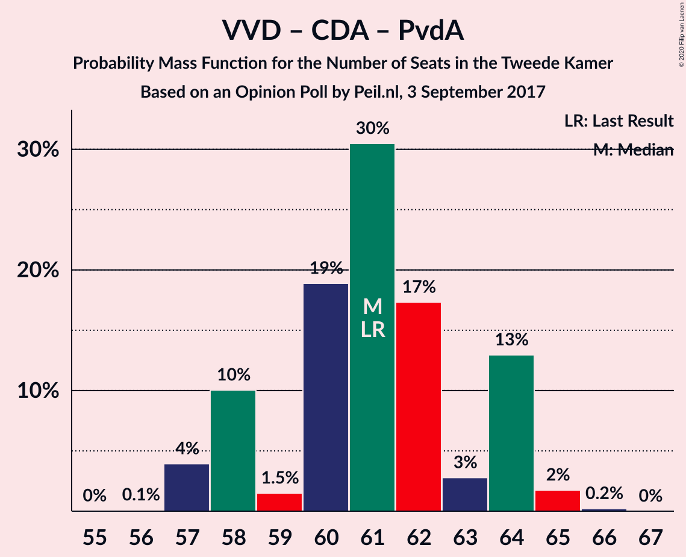

| Number of Seats | Probability | Accumulated | Special Marks |
|:---------------:|:-----------:|:-----------:|:-------------:|
| 57 | 0.1% | 100% |  |
| 58 | 11% | 99.9% |  |
| 59 | 2% | 89% |  |
| 60 | 4% | 87% |  |
| 61 | 2% | 83% | Last Result |
| 62 | 64% | 81% | Median |
| 63 | 3% | 17% |  |
| 64 | 0.2% | 14% |  |
| 65 | 14% | 14% |  |
| 66 | 0% | 0% |  |

### Volkspartij voor Vrijheid en Democratie – Christen-Democratisch Appèl – Forum voor Democratie – 50Plus

| Number of Seats | Probability | Accumulated | Special Marks |
|:---------------:|:-----------:|:-----------:|:-------------:|
| 55 | 5% | 100% |  |
| 56 | 0.3% | 95% |  |
| 57 | 1.4% | 95% |  |
| 58 | 6% | 93% | Last Result |
| 59 | 6% | 87% |  |
| 60 | 3% | 81% |  |
| 61 | 62% | 78% | Median |
| 62 | 0.4% | 16% |  |
| 63 | 0% | 15% |  |
| 64 | 1.2% | 15% |  |
| 65 | 14% | 14% |  |
| 66 | 0% | 0% |  |

### Volkspartij voor Vrijheid en Democratie – Democraten 66 – Partij van de Arbeid

| Number of Seats | Probability | Accumulated | Special Marks |
|:---------------:|:-----------:|:-----------:|:-------------:|
| 58 | 0.8% | 100% |  |
| 59 | 8% | 99.2% |  |
| 60 | 5% | 91% |  |
| 61 | 0.6% | 86% | Last Result |
| 62 | 2% | 85% |  |
| 63 | 67% | 84% | Median |
| 64 | 17% | 17% |  |
| 65 | 0.3% | 0.4% |  |
| 66 | 0.1% | 0.1% |  |
| 67 | 0% | 0% |  |

### Volkspartij voor Vrijheid en Democratie – Christen-Democratisch Appèl – Forum voor Democratie – Staatkundig Gereformeerde Partij

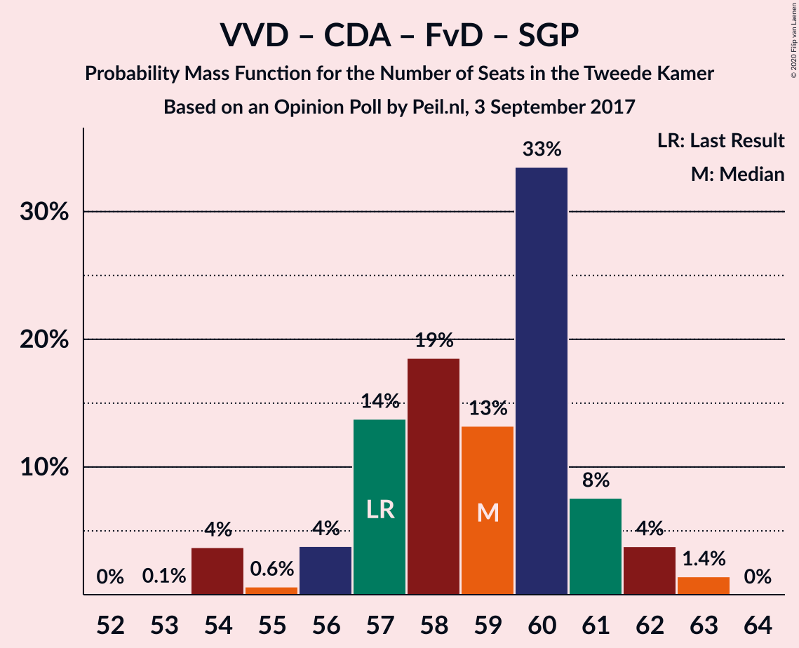

| Number of Seats | Probability | Accumulated | Special Marks |
|:---------------:|:-----------:|:-----------:|:-------------:|
| 54 | 0.1% | 100% |  |
| 55 | 5% | 99.9% |  |
| 56 | 0.5% | 95% |  |
| 57 | 7% | 94% | Last Result |
| 58 | 4% | 87% |  |
| 59 | 67% | 83% | Median |
| 60 | 0.5% | 16% |  |
| 61 | 0.4% | 16% |  |
| 62 | 0.1% | 15% |  |
| 63 | 15% | 15% |  |
| 64 | 0% | 0% |  |

### Volkspartij voor Vrijheid en Democratie – Christen-Democratisch Appèl – Forum voor Democratie

| Number of Seats | Probability | Accumulated | Special Marks |
|:---------------:|:-----------:|:-----------:|:-------------:|
| 51 | 0% | 100% |  |
| 52 | 5% | 99.9% |  |
| 53 | 0.1% | 95% |  |
| 54 | 7% | 95% | Last Result |
| 55 | 0.2% | 87% |  |
| 56 | 68% | 87% | Median |
| 57 | 3% | 19% |  |
| 58 | 0.8% | 16% |  |
| 59 | 0.2% | 16% |  |
| 60 | 1.3% | 15% |  |
| 61 | 14% | 14% |  |
| 62 | 0% | 0% |  |

### Volkspartij voor Vrijheid en Democratie – Christen-Democratisch Appèl

| Number of Seats | Probability | Accumulated | Special Marks |
|:---------------:|:-----------:|:-----------:|:-------------:|
| 45 | 0% | 100% |  |
| 46 | 7% | 99.9% |  |
| 47 | 6% | 93% |  |
| 48 | 62% | 88% | Median |
| 49 | 7% | 26% |  |
| 50 | 4% | 19% |  |
| 51 | 0.1% | 16% |  |
| 52 | 2% | 16% | Last Result |
| 53 | 0% | 14% |  |
| 54 | 14% | 14% |  |
| 55 | 0% | 0% |  |

### Democraten 66 – Christen-Democratisch Appèl – Partij van de Arbeid

| Number of Seats | Probability | Accumulated | Special Marks |
|:---------------:|:-----------:|:-----------:|:-------------:|
| 44 | 0.4% | 100% |  |
| 45 | 0.4% | 99.6% |  |
| 46 | 16% | 99.2% |  |
| 47 | 61% | 84% | Last Result, Median |
| 48 | 8% | 22% |  |
| 49 | 5% | 14% |  |
| 50 | 4% | 9% |  |
| 51 | 4% | 4% |  |
| 52 | 0% | 0.4% |  |
| 53 | 0.4% | 0.4% |  |
| 54 | 0% | 0% |  |

### Volkspartij voor Vrijheid en Democratie – Partij van de Arbeid

| Number of Seats | Probability | Accumulated | Special Marks |
|:---------------:|:-----------:|:-----------:|:-------------:|
| 40 | 9% | 100% |  |
| 41 | 2% | 91% |  |
| 42 | 7% | 88% | Last Result |
| 43 | 0.7% | 81% |  |
| 44 | 2% | 80% |  |
| 45 | 3% | 79% |  |
| 46 | 62% | 76% | Median |
| 47 | 14% | 14% |  |
| 48 | 0% | 0.1% |  |
| 49 | 0% | 0% |  |

### Democraten 66 – Christen-Democratisch Appèl

| Number of Seats | Probability | Accumulated | Special Marks |
|:---------------:|:-----------:|:-----------:|:-------------:|
| 31 | 0.1% | 100% |  |
| 32 | 0.2% | 99.9% |  |
| 33 | 62% | 99.7% | Median |
| 34 | 0.3% | 38% |  |
| 35 | 16% | 38% |  |
| 36 | 2% | 22% |  |
| 37 | 13% | 20% |  |
| 38 | 3% | 6% | Last Result |
| 39 | 0% | 4% |  |
| 40 | 4% | 4% |  |
| 41 | 0% | 0% |  |

### Christen-Democratisch Appèl – Partij van de Arbeid – ChristenUnie

| Number of Seats | Probability | Accumulated | Special Marks |
|:---------------:|:-----------:|:-----------:|:-------------:|
| 30 | 0.1% | 100% |  |
| 31 | 0.1% | 99.9% |  |
| 32 | 2% | 99.8% |  |
| 33 | 5% | 98% | Last Result |
| 34 | 78% | 93% | Median |
| 35 | 6% | 15% |  |
| 36 | 2% | 10% |  |
| 37 | 7% | 7% |  |
| 38 | 0% | 0.2% |  |
| 39 | 0.1% | 0.1% |  |
| 40 | 0% | 0% |  |

### Christen-Democratisch Appèl – Partij van de Arbeid

| Number of Seats | Probability | Accumulated | Special Marks |
|:---------------:|:-----------:|:-----------:|:-------------:|
| 26 | 0.2% | 100% |  |
| 27 | 0.2% | 99.8% |  |
| 28 | 7% | 99.5% | Last Result |
| 29 | 21% | 93% |  |
| 30 | 63% | 72% | Median |
| 31 | 6% | 10% |  |
| 32 | 3% | 3% |  |
| 33 | 0.3% | 0.4% |  |
| 34 | 0.1% | 0.1% |  |
| 35 | 0% | 0% |  |

## Technical Information

### Opinion Poll

+ **Polling firm:** Peil.nl
+ **Commissioner(s):** —
+ **Fieldwork period:** 3 September 2017

### Calculations

+ **Sample size:** 3000
+ **Simulations done:** 131,072
+ **Error estimate:** 2.35%

