# Opinion Poll by GfK for EenVandaag, 1–4 September 2017

<a href="#voting-intentions">Voting Intentions</a> | <a href="#seats">Seats</a> | <a href="#coalitions">Coalitions</a> | <a href="#technical-information">Technical Information</a>

## Voting Intentions

### Confidence Intervals

| Party | Last Result | Poll Result | 80% Confidence Interval | 90% Confidence Interval | 95% Confidence Interval | 99% Confidence Interval |
|:-----:|:-----------:|:-----------:|:-----------------------:|:-----------------------:|:-----------------------:|:-----------------------:|
| Volkspartij voor Vrijheid en Democratie | 21.3% | 20.0% | 18.9–21.2% |18.5–21.6% |18.3–21.9% |17.7–22.5% |
| Partij voor de Vrijheid | 13.1% | 15.4% | 14.3–16.5% |14.0–16.8% |13.8–17.1% |13.3–17.6% |
| Democraten 66 | 12.2% | 12.7% | 11.7–13.7% |11.5–14.0% |11.2–14.3% |10.8–14.8% |
| Christen-Democratisch Appèl | 12.4% | 10.6% | 9.8–11.6% |9.5–11.9% |9.3–12.1% |8.9–12.6% |
| GroenLinks | 9.1% | 9.3% | 8.5–10.2% |8.3–10.5% |8.1–10.7% |7.7–11.2% |
| Socialistische Partij | 9.1% | 7.3% | 6.6–8.2% |6.4–8.4% |6.2–8.6% |5.9–9.0% |
| Partij van de Arbeid | 5.7% | 6.0% | 5.3–6.8% |5.2–7.0% |5.0–7.2% |4.7–7.6% |
| ChristenUnie | 3.4% | 4.7% | 4.1–5.3% |3.9–5.5% |3.8–5.7% |3.5–6.1% |
| Partij voor de Dieren | 3.2% | 4.0% | 3.5–4.7% |3.3–4.8% |3.2–5.0% |3.0–5.3% |
| 50Plus | 3.1% | 3.3% | 2.8–3.9% |2.7–4.1% |2.6–4.2% |2.4–4.5% |
| Forum voor Democratie | 1.8% | 3.3% | 2.8–3.9% |2.7–4.1% |2.6–4.2% |2.4–4.5% |
| Staatkundig Gereformeerde Partij | 2.1% | 2.0% | 1.6–2.5% |1.5–2.6% |1.4–2.7% |1.3–3.0% |
| DENK | 2.1% | 1.3% | 1.1–1.8% |1.0–1.9% |0.9–2.0% |0.8–2.2% |

*Note:* The poll result column reflects the actual value used in the calculations. Published results may vary slightly, and in addition be rounded to fewer digits.

## Seats

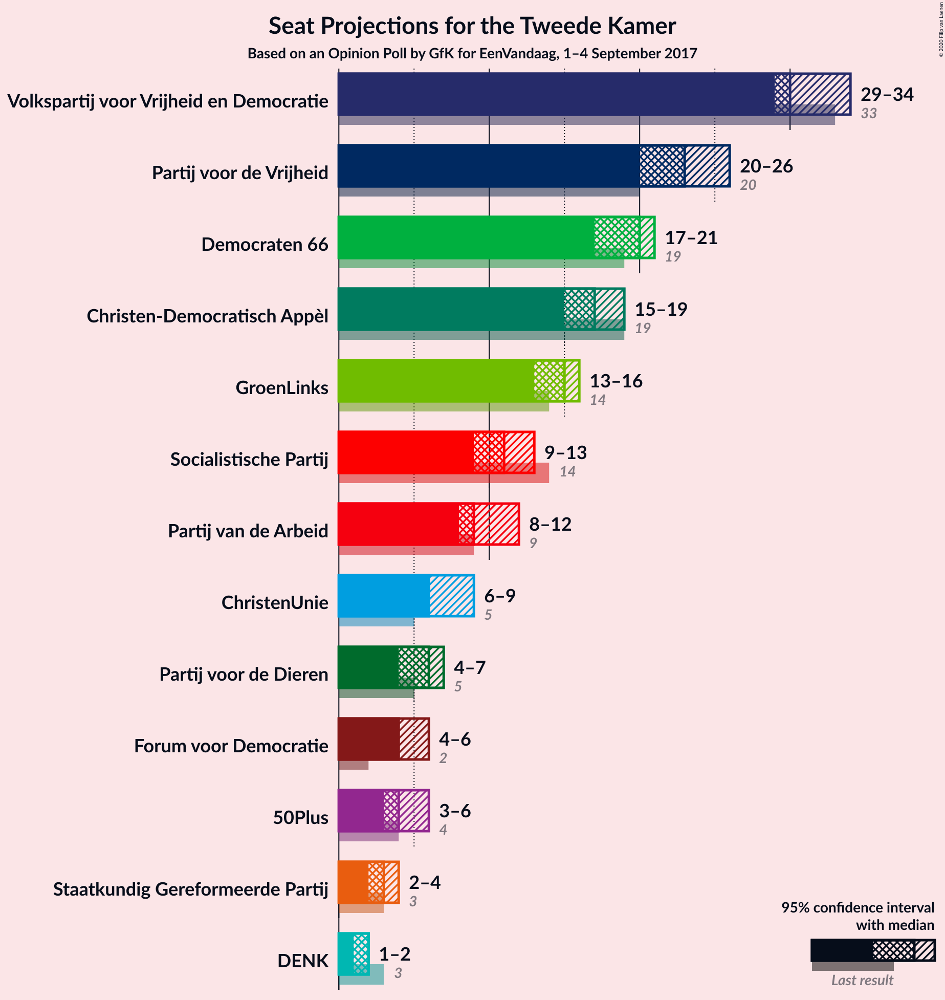

### Confidence Intervals

| Party | Last Result | Median | 80% Confidence Interval | 90% Confidence Interval | 95% Confidence Interval | 99% Confidence Interval |
|:-----:|:-----------:|:------:|:-----------------------:|:-----------------------:|:-----------------------:|:-----------------------:|
| <a href="#volkspartij-voor-vrijheid-en-democratie">Volkspartij voor Vrijheid en Democratie</a> | 33 | 29 | 29–34 |29–34 |28–34 |28–34 |
| <a href="#partij-voor-de-vrijheid">Partij voor de Vrijheid</a> | 20 | 24 | 23–24 |23–24 |23–24 |20–26 |
| <a href="#democraten-66">Democraten 66</a> | 19 | 20 | 20 |19–20 |18–20 |17–22 |
| <a href="#christen-democratisch-appèl">Christen-Democratisch Appèl</a> | 19 | 16 | 15–16 |15–16 |15–17 |14–20 |
| <a href="#groenlinks">GroenLinks</a> | 14 | 15 | 14–15 |14–17 |14–17 |12–17 |
| <a href="#socialistische-partij">Socialistische Partij</a> | 14 | 10 | 9–10 |9–10 |9–11 |9–12 |
| <a href="#partij-van-de-arbeid">Partij van de Arbeid</a> | 9 | 10 | 8–12 |8–12 |8–12 |7–12 |
| <a href="#christenunie">ChristenUnie</a> | 5 | 7 | 6–7 |5–7 |5–8 |5–9 |
| <a href="#partij-voor-de-dieren">Partij voor de Dieren</a> | 5 | 7 | 5–7 |5–7 |5–7 |4–7 |
| <a href="#50plus">50Plus</a> | 4 | 3 | 3–5 |3–5 |3–6 |3–6 |
| <a href="#forum-voor-democratie">Forum voor Democratie</a> | 2 | 4 | 4–5 |4–6 |4–6 |3–6 |
| <a href="#staatkundig-gereformeerde-partij">Staatkundig Gereformeerde Partij</a> | 3 | 3 | 2–3 |2–3 |2–4 |2–4 |
| <a href="#denk">DENK</a> | 3 | 2 | 1–2 |1–2 |1–2 |1–3 |

### Volkspartij voor Vrijheid en Democratie

*For a full overview of the results for this party, see the [Volkspartij voor Vrijheid en Democratie](party-volkspartijvoorvrijheidendemocratie.html) page.*

| Number of Seats | Probability | Accumulated | Special Marks |
|:---------------:|:-----------:|:-----------:|:-------------:|
| 27 | 0.1% | 100% |  |
| 28 | 3% | 99.9% |  |
| 29 | 57% | 97% | Median |
| 30 | 9% | 40% |  |
| 31 | 2% | 31% |  |
| 32 | 0.9% | 29% |  |
| 33 | 0.3% | 28% | Last Result |
| 34 | 28% | 28% |  |
| 35 | 0% | 0% |  |

### Partij voor de Vrijheid

*For a full overview of the results for this party, see the [Partij voor de Vrijheid](party-partijvoordevrijheid.html) page.*

| Number of Seats | Probability | Accumulated | Special Marks |
|:---------------:|:-----------:|:-----------:|:-------------:|
| 20 | 0.9% | 100% | Last Result |
| 21 | 0.5% | 99.1% |  |
| 22 | 1.0% | 98.6% |  |
| 23 | 39% | 98% |  |
| 24 | 57% | 59% | Median |
| 25 | 1.0% | 2% |  |
| 26 | 1.2% | 1.2% |  |
| 27 | 0% | 0% |  |

### Democraten 66

*For a full overview of the results for this party, see the [Democraten 66](party-democraten66.html) page.*

| Number of Seats | Probability | Accumulated | Special Marks |
|:---------------:|:-----------:|:-----------:|:-------------:|
| 16 | 0.4% | 100% |  |
| 17 | 2% | 99.5% |  |
| 18 | 0.5% | 98% |  |
| 19 | 3% | 97% | Last Result |
| 20 | 93% | 94% | Median |
| 21 | 0.4% | 1.2% |  |
| 22 | 0.6% | 0.7% |  |
| 23 | 0.1% | 0.1% |  |
| 24 | 0% | 0% |  |

### Christen-Democratisch Appèl

*For a full overview of the results for this party, see the [Christen-Democratisch Appèl](party-christen-democratischappèl.html) page.*

| Number of Seats | Probability | Accumulated | Special Marks |
|:---------------:|:-----------:|:-----------:|:-------------:|
| 13 | 0.4% | 100% |  |
| 14 | 0.3% | 99.6% |  |
| 15 | 30% | 99.3% |  |
| 16 | 66% | 69% | Median |
| 17 | 0.9% | 3% |  |
| 18 | 0.9% | 2% |  |
| 19 | 0.5% | 1.1% | Last Result |
| 20 | 0.6% | 0.6% |  |
| 21 | 0% | 0% |  |

### GroenLinks

*For a full overview of the results for this party, see the [GroenLinks](party-groenlinks.html) page.*

| Number of Seats | Probability | Accumulated | Special Marks |
|:---------------:|:-----------:|:-----------:|:-------------:|
| 12 | 0.7% | 100% |  |
| 13 | 2% | 99.3% |  |
| 14 | 30% | 98% | Last Result |
| 15 | 58% | 67% | Median |
| 16 | 1.2% | 10% |  |
| 17 | 9% | 9% |  |
| 18 | 0% | 0% |  |

### Socialistische Partij

*For a full overview of the results for this party, see the [Socialistische Partij](party-socialistischepartij.html) page.*

| Number of Seats | Probability | Accumulated | Special Marks |
|:---------------:|:-----------:|:-----------:|:-------------:|
| 8 | 0.3% | 100% |  |
| 9 | 28% | 99.7% |  |
| 10 | 69% | 72% | Median |
| 11 | 2% | 3% |  |
| 12 | 0.3% | 0.7% |  |
| 13 | 0.4% | 0.4% |  |
| 14 | 0% | 0% | Last Result |

### Partij van de Arbeid

*For a full overview of the results for this party, see the [Partij van de Arbeid](party-partijvandearbeid.html) page.*

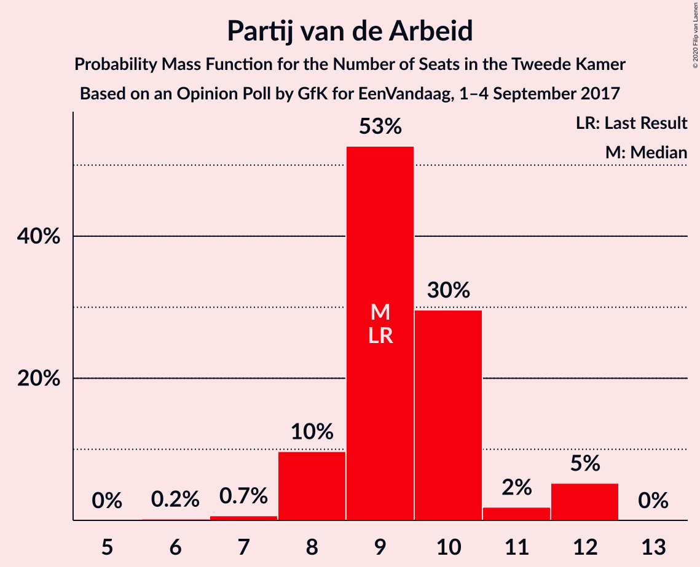

| Number of Seats | Probability | Accumulated | Special Marks |
|:---------------:|:-----------:|:-----------:|:-------------:|
| 7 | 0.7% | 100% |  |
| 8 | 10% | 99.3% |  |
| 9 | 3% | 89% | Last Result |
| 10 | 57% | 86% | Median |
| 11 | 0.1% | 29% |  |
| 12 | 29% | 29% |  |
| 13 | 0% | 0% |  |

### ChristenUnie

*For a full overview of the results for this party, see the [ChristenUnie](party-christenunie.html) page.*

| Number of Seats | Probability | Accumulated | Special Marks |
|:---------------:|:-----------:|:-----------:|:-------------:|
| 5 | 9% | 100% | Last Result |
| 6 | 28% | 91% |  |
| 7 | 60% | 63% | Median |
| 8 | 2% | 3% |  |
| 9 | 1.2% | 1.2% |  |
| 10 | 0% | 0% |  |

### Partij voor de Dieren

*For a full overview of the results for this party, see the [Partij voor de Dieren](party-partijvoordedieren.html) page.*

| Number of Seats | Probability | Accumulated | Special Marks |
|:---------------:|:-----------:|:-----------:|:-------------:|
| 4 | 1.3% | 100% |  |
| 5 | 29% | 98.7% | Last Result |
| 6 | 4% | 70% |  |
| 7 | 65% | 65% | Median |
| 8 | 0.2% | 0.2% |  |
| 9 | 0% | 0% |  |

### 50Plus

*For a full overview of the results for this party, see the [50Plus](party-50plus.html) page.*

| Number of Seats | Probability | Accumulated | Special Marks |
|:---------------:|:-----------:|:-----------:|:-------------:|
| 3 | 56% | 100% | Median |
| 4 | 9% | 44% | Last Result |
| 5 | 31% | 34% |  |
| 6 | 3% | 4% |  |
| 7 | 0.1% | 0.1% |  |
| 8 | 0% | 0% |  |

### Forum voor Democratie

*For a full overview of the results for this party, see the [Forum voor Democratie](party-forumvoordemocratie.html) page.*

| Number of Seats | Probability | Accumulated | Special Marks |
|:---------------:|:-----------:|:-----------:|:-------------:|
| 2 | 0% | 100% | Last Result |
| 3 | 0.8% | 100% |  |
| 4 | 86% | 99.2% | Median |
| 5 | 4% | 13% |  |
| 6 | 9% | 9% |  |
| 7 | 0.2% | 0.2% |  |
| 8 | 0% | 0% |  |

### Staatkundig Gereformeerde Partij

*For a full overview of the results for this party, see the [Staatkundig Gereformeerde Partij](party-staatkundiggereformeerdepartij.html) page.*

| Number of Seats | Probability | Accumulated | Special Marks |
|:---------------:|:-----------:|:-----------:|:-------------:|
| 2 | 38% | 100% |  |
| 3 | 59% | 62% | Last Result, Median |
| 4 | 3% | 3% |  |
| 5 | 0% | 0% |  |

### DENK

*For a full overview of the results for this party, see the [DENK](party-denk.html) page.*

| Number of Seats | Probability | Accumulated | Special Marks |
|:---------------:|:-----------:|:-----------:|:-------------:|
| 1 | 30% | 100% |  |
| 2 | 70% | 70% | Median |
| 3 | 0.7% | 0.7% | Last Result |
| 4 | 0% | 0% |  |

## Coalitions

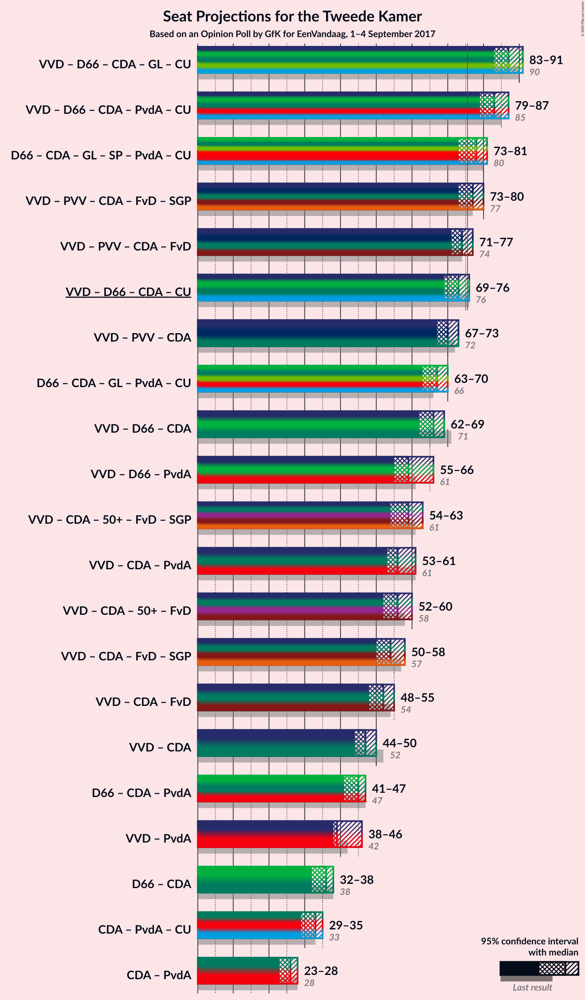

### Confidence Intervals

| Coalition | Last Result | Median | Majority? | 80% Confidence Interval | 90% Confidence Interval | 95% Confidence Interval | 99% Confidence Interval |
|:---------:|:-----------:|:------:|:---------:|:-----------------------:|:-----------------------:|:-----------------------:|:-----------------------:|
| Volkspartij voor Vrijheid en Democratie – Democraten 66 – Christen-Democratisch Appèl – GroenLinks – ChristenUnie | 90 | 87 | 100% | 87–89 | 87–89 | 85–89 | 83–92 |
| Volkspartij voor Vrijheid en Democratie – Democraten 66 – Christen-Democratisch Appèl – Partij van de Arbeid – ChristenUnie | 85 | 82 | 100% | 80–87 | 79–87 | 79–87 | 78–88 |
| Democraten 66 – Christen-Democratisch Appèl – GroenLinks – Socialistische Partij – Partij van de Arbeid – ChristenUnie | 80 | 78 | 98% | 76–78 | 76–78 | 76–78 | 73–81 |
| Volkspartij voor Vrijheid en Democratie – Partij voor de Vrijheid – Christen-Democratisch Appèl – Forum voor Democratie – Staatkundig Gereformeerde Partij | 77 | 76 | 98% | 76–78 | 76–78 | 76–78 | 74–81 |
| Volkspartij voor Vrijheid en Democratie – Partij voor de Vrijheid – Christen-Democratisch Appèl – Forum voor Democratie | 74 | 73 | 29% | 73–76 | 73–76 | 72–76 | 71–78 |
| Volkspartij voor Vrijheid en Democratie – Democraten 66 – Christen-Democratisch Appèl – ChristenUnie | 76 | 72 | 2% | 71–75 | 71–75 | 69–75 | 69–79 |
| Volkspartij voor Vrijheid en Democratie – Partij voor de Vrijheid – Christen-Democratisch Appèl | 72 | 69 | 0% | 69–72 | 69–72 | 67–72 | 66–74 |
| Volkspartij voor Vrijheid en Democratie – Democraten 66 – Christen-Democratisch Appèl | 71 | 65 | 0% | 65–69 | 65–69 | 62–69 | 61–72 |
| Democraten 66 – Christen-Democratisch Appèl – GroenLinks – Partij van de Arbeid – ChristenUnie | 66 | 68 | 0% | 66–68 | 66–68 | 66–68 | 62–70 |
| Volkspartij voor Vrijheid en Democratie – Democraten 66 – Partij van de Arbeid | 61 | 59 | 0% | 58–66 | 58–66 | 56–66 | 54–66 |
| Volkspartij voor Vrijheid en Democratie – Christen-Democratisch Appèl – 50Plus – Forum voor Democratie – Staatkundig Gereformeerde Partij | 61 | 55 | 0% | 55–60 | 55–60 | 55–61 | 55–64 |
| Volkspartij voor Vrijheid en Democratie – Christen-Democratisch Appèl – Partij van de Arbeid | 61 | 55 | 0% | 54–61 | 54–61 | 54–61 | 53–61 |
| Volkspartij voor Vrijheid en Democratie – Christen-Democratisch Appèl – 50Plus – Forum voor Democratie | 58 | 52 | 0% | 52–58 | 52–58 | 52–58 | 52–60 |
| Volkspartij voor Vrijheid en Democratie – Christen-Democratisch Appèl – Forum voor Democratie – Staatkundig Gereformeerde Partij | 57 | 52 | 0% | 52–55 | 52–55 | 52–56 | 52–58 |
| Volkspartij voor Vrijheid en Democratie – Christen-Democratisch Appèl – Forum voor Democratie | 54 | 49 | 0% | 49–53 | 49–53 | 49–53 | 48–55 |
| Volkspartij voor Vrijheid en Democratie – Christen-Democratisch Appèl | 52 | 45 | 0% | 45–49 | 45–49 | 44–49 | 43–51 |
| Democraten 66 – Christen-Democratisch Appèl – Partij van de Arbeid | 47 | 46 | 0% | 44–47 | 44–47 | 42–47 | 40–50 |
| Volkspartij voor Vrijheid en Democratie – Partij van de Arbeid | 42 | 39 | 0% | 38–46 | 38–46 | 38–46 | 36–46 |
| Democraten 66 – Christen-Democratisch Appèl | 38 | 36 | 0% | 35–36 | 35–36 | 33–36 | 32–41 |
| Christen-Democratisch Appèl – Partij van de Arbeid – ChristenUnie | 33 | 33 | 0% | 32–33 | 29–33 | 29–34 | 29–35 |
| Christen-Democratisch Appèl – Partij van de Arbeid | 28 | 26 | 0% | 24–27 | 24–27 | 24–27 | 23–28 |

### Volkspartij voor Vrijheid en Democratie – Democraten 66 – Christen-Democratisch Appèl – GroenLinks – ChristenUnie

| Number of Seats | Probability | Accumulated | Special Marks |
|:---------------:|:-----------:|:-----------:|:-------------:|
| 81 | 0.1% | 100% |  |
| 82 | 0% | 99.9% |  |
| 83 | 2% | 99.9% |  |
| 84 | 0.2% | 98% |  |
| 85 | 2% | 98% |  |
| 86 | 0.2% | 96% |  |
| 87 | 57% | 96% | Median |
| 88 | 9% | 39% |  |
| 89 | 29% | 30% |  |
| 90 | 0.5% | 1.3% | Last Result |
| 91 | 0.1% | 0.8% |  |
| 92 | 0.6% | 0.7% |  |
| 93 | 0% | 0.1% |  |
| 94 | 0% | 0.1% |  |
| 95 | 0.1% | 0.1% |  |
| 96 | 0% | 0% |  |

### Volkspartij voor Vrijheid en Democratie – Democraten 66 – Christen-Democratisch Appèl – Partij van de Arbeid – ChristenUnie

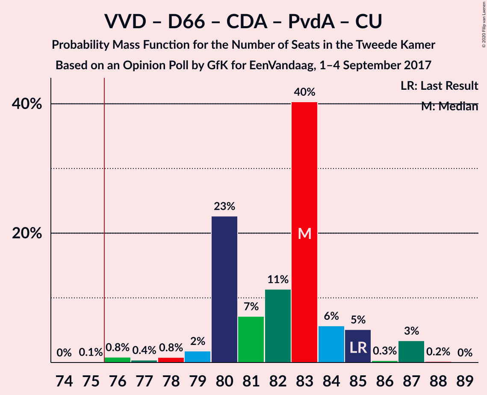

| Number of Seats | Probability | Accumulated | Special Marks |
|:---------------:|:-----------:|:-----------:|:-------------:|
| 78 | 1.2% | 100% |  |
| 79 | 9% | 98.8% |  |
| 80 | 0.9% | 90% |  |
| 81 | 3% | 89% |  |
| 82 | 56% | 86% | Median |
| 83 | 0.8% | 30% |  |
| 84 | 0.3% | 29% |  |
| 85 | 0.3% | 29% | Last Result |
| 86 | 0.5% | 29% |  |
| 87 | 28% | 28% |  |
| 88 | 0.6% | 0.6% |  |
| 89 | 0% | 0% |  |

### Democraten 66 – Christen-Democratisch Appèl – GroenLinks – Socialistische Partij – Partij van de Arbeid – ChristenUnie

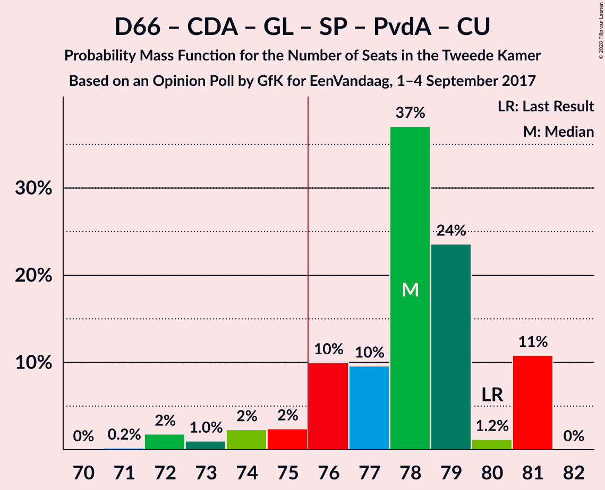

| Number of Seats | Probability | Accumulated | Special Marks |
|:---------------:|:-----------:|:-----------:|:-------------:|
| 72 | 0.4% | 100% |  |
| 73 | 0.5% | 99.6% |  |
| 74 | 1.0% | 99.1% |  |
| 75 | 0.1% | 98% |  |
| 76 | 36% | 98% | Majority |
| 77 | 4% | 61% |  |
| 78 | 56% | 57% | Median |
| 79 | 0.3% | 1.0% |  |
| 80 | 0.1% | 0.7% | Last Result |
| 81 | 0.5% | 0.5% |  |
| 82 | 0% | 0% |  |

### Volkspartij voor Vrijheid en Democratie – Partij voor de Vrijheid – Christen-Democratisch Appèl – Forum voor Democratie – Staatkundig Gereformeerde Partij

| Number of Seats | Probability | Accumulated | Special Marks |
|:---------------:|:-----------:|:-----------:|:-------------:|
| 73 | 0.3% | 100% |  |
| 74 | 0.2% | 99.7% |  |
| 75 | 2% | 99.5% |  |
| 76 | 57% | 98% | Median, Majority |
| 77 | 10% | 41% | Last Result |
| 78 | 29% | 31% |  |
| 79 | 0.2% | 2% |  |
| 80 | 0.9% | 1.5% |  |
| 81 | 0.1% | 0.5% |  |
| 82 | 0.5% | 0.5% |  |
| 83 | 0% | 0% |  |

### Volkspartij voor Vrijheid en Democratie – Partij voor de Vrijheid – Christen-Democratisch Appèl – Forum voor Democratie

| Number of Seats | Probability | Accumulated | Special Marks |
|:---------------:|:-----------:|:-----------:|:-------------:|
| 70 | 0.3% | 100% |  |
| 71 | 2% | 99.7% |  |
| 72 | 0.1% | 98% |  |
| 73 | 56% | 97% | Median |
| 74 | 1.1% | 41% | Last Result |
| 75 | 11% | 40% |  |
| 76 | 29% | 29% | Majority |
| 77 | 0.1% | 0.6% |  |
| 78 | 0.1% | 0.6% |  |
| 79 | 0.4% | 0.4% |  |
| 80 | 0% | 0% |  |

### Volkspartij voor Vrijheid en Democratie – Democraten 66 – Christen-Democratisch Appèl – ChristenUnie

| Number of Seats | Probability | Accumulated | Special Marks |
|:---------------:|:-----------:|:-----------:|:-------------:|
| 68 | 0.1% | 100% |  |
| 69 | 3% | 99.9% |  |
| 70 | 0.2% | 97% |  |
| 71 | 9% | 97% |  |
| 72 | 57% | 88% | Median |
| 73 | 0% | 30% |  |
| 74 | 0.4% | 30% |  |
| 75 | 28% | 30% |  |
| 76 | 0.6% | 2% | Last Result, Majority |
| 77 | 0.7% | 1.4% |  |
| 78 | 0.1% | 0.7% |  |
| 79 | 0.6% | 0.6% |  |
| 80 | 0% | 0% |  |

### Volkspartij voor Vrijheid en Democratie – Partij voor de Vrijheid – Christen-Democratisch Appèl

| Number of Seats | Probability | Accumulated | Special Marks |
|:---------------:|:-----------:|:-----------:|:-------------:|
| 65 | 0.1% | 100% |  |
| 66 | 2% | 99.9% |  |
| 67 | 0.2% | 98% |  |
| 68 | 0.1% | 97% |  |
| 69 | 65% | 97% | Median |
| 70 | 2% | 32% |  |
| 71 | 1.3% | 30% |  |
| 72 | 28% | 29% | Last Result |
| 73 | 0.6% | 1.2% |  |
| 74 | 0.1% | 0.5% |  |
| 75 | 0.4% | 0.4% |  |
| 76 | 0% | 0% | Majority |

### Volkspartij voor Vrijheid en Democratie – Democraten 66 – Christen-Democratisch Appèl

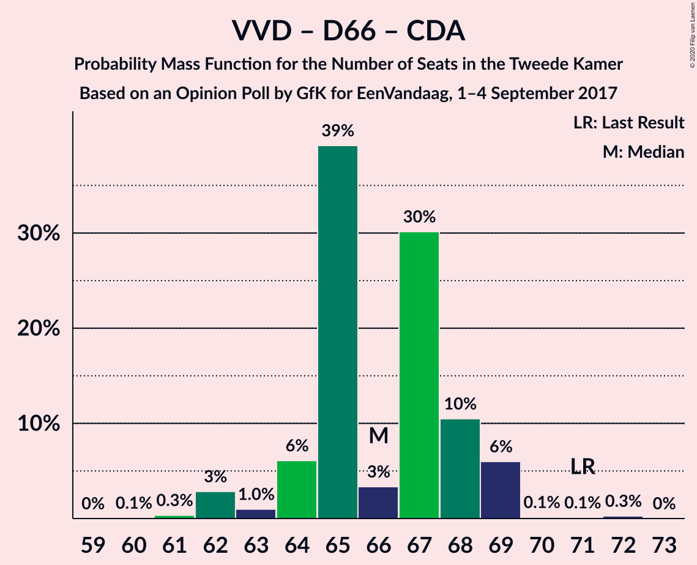

| Number of Seats | Probability | Accumulated | Special Marks |
|:---------------:|:-----------:|:-----------:|:-------------:|
| 61 | 1.1% | 100% |  |
| 62 | 2% | 98.9% |  |
| 63 | 0.9% | 97% |  |
| 64 | 0.2% | 96% |  |
| 65 | 57% | 96% | Median |
| 66 | 9% | 39% |  |
| 67 | 0.4% | 30% |  |
| 68 | 1.0% | 30% |  |
| 69 | 28% | 29% |  |
| 70 | 0.4% | 1.1% |  |
| 71 | 0.1% | 0.7% | Last Result |
| 72 | 0.6% | 0.6% |  |
| 73 | 0% | 0% |  |

### Democraten 66 – Christen-Democratisch Appèl – GroenLinks – Partij van de Arbeid – ChristenUnie

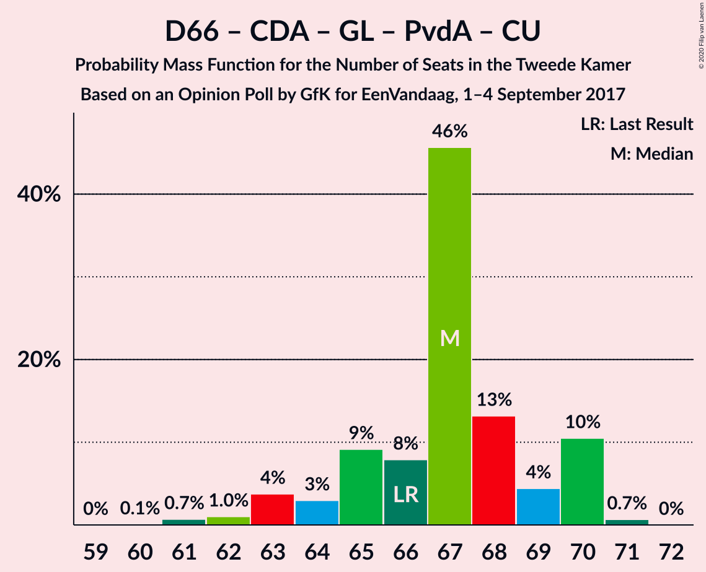

| Number of Seats | Probability | Accumulated | Special Marks |
|:---------------:|:-----------:|:-----------:|:-------------:|
| 61 | 0% | 100% |  |
| 62 | 0.5% | 99.9% |  |
| 63 | 0.1% | 99.4% |  |
| 64 | 2% | 99.4% |  |
| 65 | 0.3% | 98% |  |
| 66 | 10% | 98% | Last Result |
| 67 | 31% | 88% |  |
| 68 | 56% | 57% | Median |
| 69 | 0.3% | 0.9% |  |
| 70 | 0.6% | 0.6% |  |
| 71 | 0% | 0% |  |

### Volkspartij voor Vrijheid en Democratie – Democraten 66 – Partij van de Arbeid

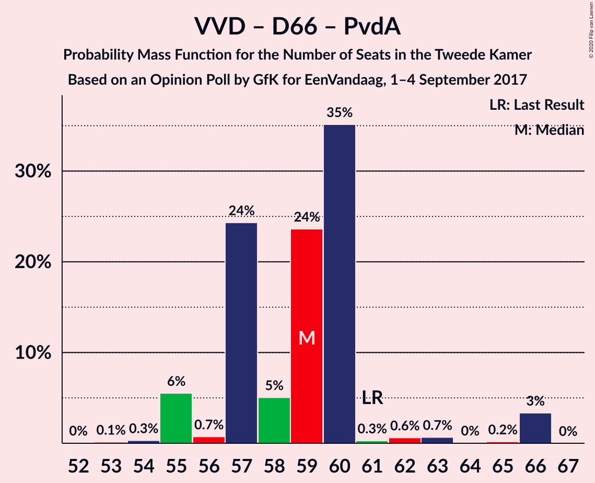

| Number of Seats | Probability | Accumulated | Special Marks |
|:---------------:|:-----------:|:-----------:|:-------------:|
| 54 | 1.1% | 100% |  |
| 55 | 0.7% | 98.9% |  |
| 56 | 0.8% | 98% |  |
| 57 | 0.3% | 97% |  |
| 58 | 9% | 97% |  |
| 59 | 58% | 88% | Median |
| 60 | 0.5% | 30% |  |
| 61 | 0.9% | 29% | Last Result |
| 62 | 0.5% | 28% |  |
| 63 | 0% | 28% |  |
| 64 | 0% | 28% |  |
| 65 | 0.2% | 28% |  |
| 66 | 28% | 28% |  |
| 67 | 0% | 0% |  |

### Volkspartij voor Vrijheid en Democratie – Christen-Democratisch Appèl – 50Plus – Forum voor Democratie – Staatkundig Gereformeerde Partij

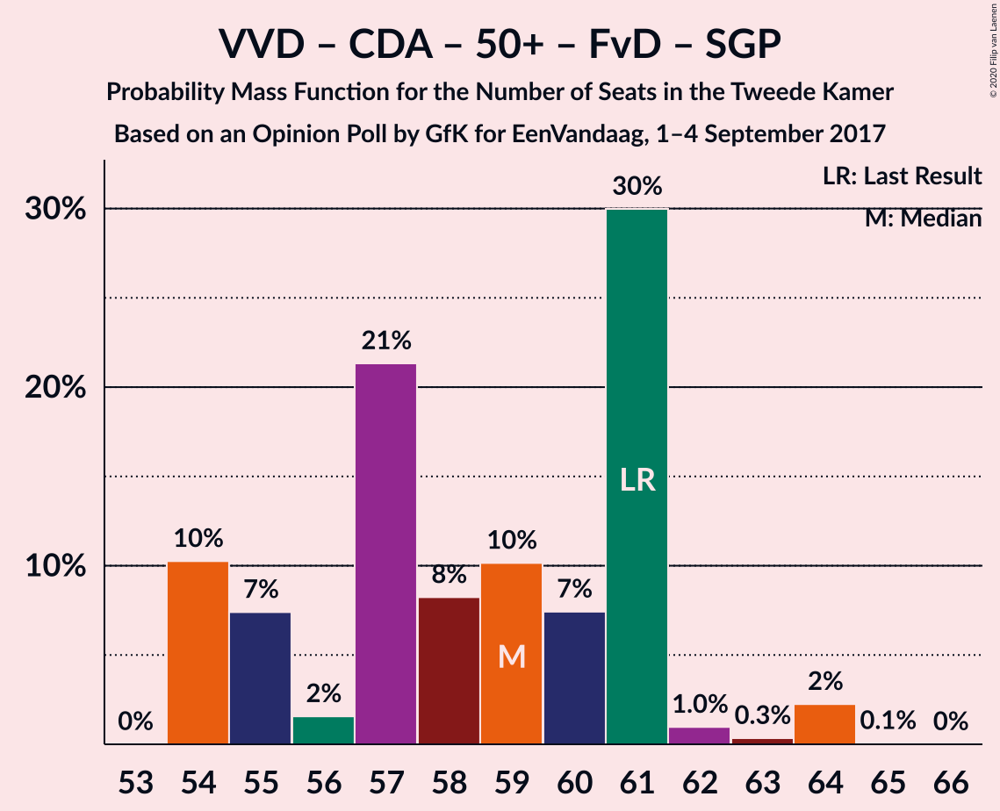

| Number of Seats | Probability | Accumulated | Special Marks |
|:---------------:|:-----------:|:-----------:|:-------------:|
| 55 | 56% | 100% | Median |
| 56 | 0% | 44% |  |
| 57 | 2% | 44% |  |
| 58 | 11% | 42% |  |
| 59 | 0.1% | 30% |  |
| 60 | 28% | 30% |  |
| 61 | 1.2% | 3% | Last Result |
| 62 | 0.4% | 2% |  |
| 63 | 0.4% | 1.1% |  |
| 64 | 0.3% | 0.7% |  |
| 65 | 0.4% | 0.4% |  |
| 66 | 0% | 0% |  |

### Volkspartij voor Vrijheid en Democratie – Christen-Democratisch Appèl – Partij van de Arbeid

| Number of Seats | Probability | Accumulated | Special Marks |
|:---------------:|:-----------:|:-----------:|:-------------:|
| 51 | 0% | 100% |  |
| 52 | 0.1% | 99.9% |  |
| 53 | 1.2% | 99.8% |  |
| 54 | 10% | 98.7% |  |
| 55 | 58% | 89% | Median |
| 56 | 0.6% | 31% |  |
| 57 | 0.8% | 30% |  |
| 58 | 0.5% | 29% |  |
| 59 | 0.7% | 29% |  |
| 60 | 0% | 28% |  |
| 61 | 28% | 28% | Last Result |
| 62 | 0% | 0% |  |

### Volkspartij voor Vrijheid en Democratie – Christen-Democratisch Appèl – 50Plus – Forum voor Democratie

| Number of Seats | Probability | Accumulated | Special Marks |
|:---------------:|:-----------:|:-----------:|:-------------:|
| 52 | 56% | 100% | Median |
| 53 | 2% | 44% |  |
| 54 | 0.2% | 42% |  |
| 55 | 1.5% | 42% |  |
| 56 | 10% | 40% |  |
| 57 | 0.8% | 30% |  |
| 58 | 28% | 30% | Last Result |
| 59 | 0.9% | 2% |  |
| 60 | 0.7% | 1.1% |  |
| 61 | 0% | 0.4% |  |
| 62 | 0.4% | 0.4% |  |
| 63 | 0% | 0% |  |

### Volkspartij voor Vrijheid en Democratie – Christen-Democratisch Appèl – Forum voor Democratie – Staatkundig Gereformeerde Partij

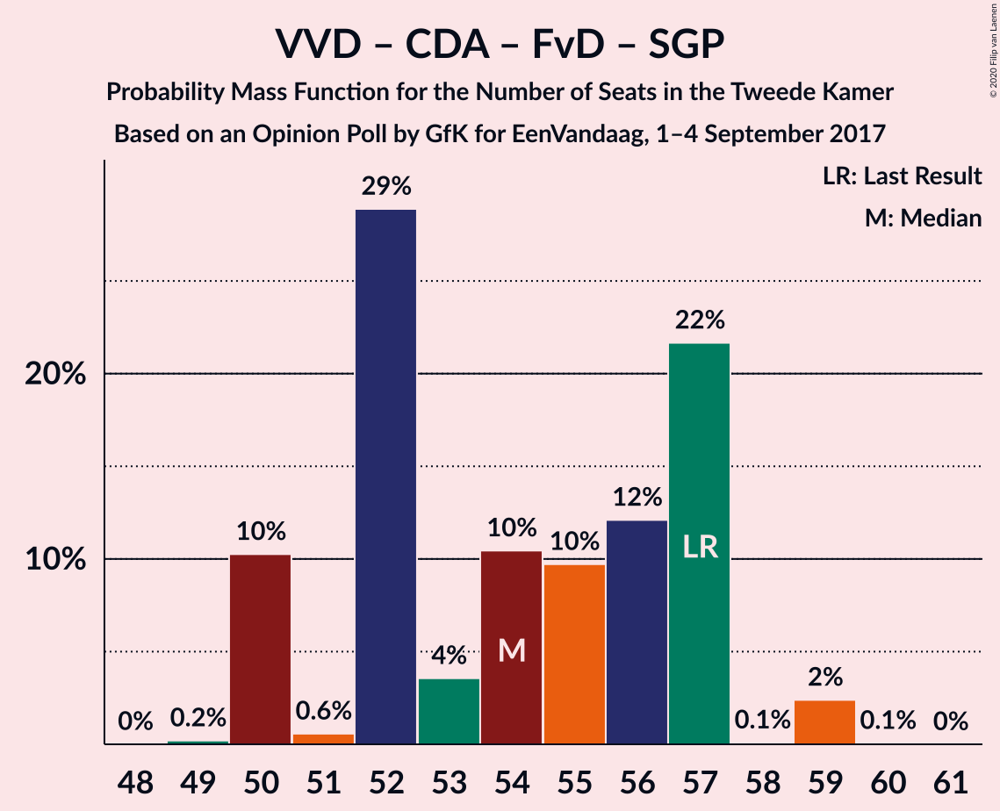

| Number of Seats | Probability | Accumulated | Special Marks |
|:---------------:|:-----------:|:-----------:|:-------------:|
| 50 | 0% | 100% |  |
| 51 | 0.2% | 99.9% |  |
| 52 | 60% | 99.7% | Median |
| 53 | 0.1% | 40% |  |
| 54 | 9% | 39% |  |
| 55 | 28% | 30% |  |
| 56 | 2% | 3% |  |
| 57 | 0.4% | 1.3% | Last Result |
| 58 | 0.4% | 0.9% |  |
| 59 | 0.4% | 0.4% |  |
| 60 | 0% | 0% |  |

### Volkspartij voor Vrijheid en Democratie – Christen-Democratisch Appèl – Forum voor Democratie

| Number of Seats | Probability | Accumulated | Special Marks |
|:---------------:|:-----------:|:-----------:|:-------------:|
| 48 | 2% | 100% |  |
| 49 | 58% | 98% | Median |
| 50 | 0.8% | 40% |  |
| 51 | 0.2% | 40% |  |
| 52 | 10% | 39% |  |
| 53 | 28% | 30% |  |
| 54 | 1.2% | 2% | Last Result |
| 55 | 0.2% | 0.6% |  |
| 56 | 0.4% | 0.4% |  |
| 57 | 0% | 0% |  |

### Volkspartij voor Vrijheid en Democratie – Christen-Democratisch Appèl

| Number of Seats | Probability | Accumulated | Special Marks |
|:---------------:|:-----------:|:-----------:|:-------------:|
| 43 | 2% | 100% |  |
| 44 | 1.2% | 98% |  |
| 45 | 56% | 97% | Median |
| 46 | 10% | 40% |  |
| 47 | 0.3% | 31% |  |
| 48 | 0.3% | 30% |  |
| 49 | 29% | 30% |  |
| 50 | 0.5% | 1.0% |  |
| 51 | 0.1% | 0.5% |  |
| 52 | 0.4% | 0.4% | Last Result |
| 53 | 0% | 0% |  |

### Democraten 66 – Christen-Democratisch Appèl – Partij van de Arbeid

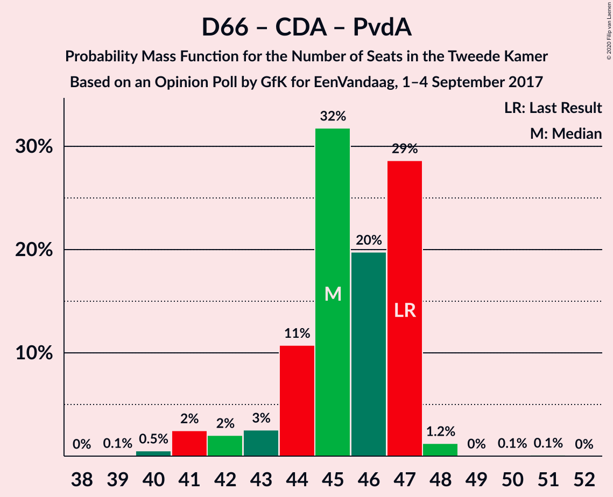

| Number of Seats | Probability | Accumulated | Special Marks |
|:---------------:|:-----------:|:-----------:|:-------------:|
| 40 | 0.8% | 100% |  |
| 41 | 0.1% | 99.2% |  |
| 42 | 2% | 99.1% |  |
| 43 | 0.3% | 97% |  |
| 44 | 9% | 97% |  |
| 45 | 1.1% | 88% |  |
| 46 | 59% | 87% | Median |
| 47 | 28% | 28% | Last Result |
| 48 | 0% | 0.7% |  |
| 49 | 0% | 0.6% |  |
| 50 | 0.6% | 0.6% |  |
| 51 | 0% | 0% |  |

### Volkspartij voor Vrijheid en Democratie – Partij van de Arbeid

| Number of Seats | Probability | Accumulated | Special Marks |
|:---------------:|:-----------:|:-----------:|:-------------:|
| 35 | 0.1% | 100% |  |
| 36 | 0.6% | 99.9% |  |
| 37 | 1.1% | 99.4% |  |
| 38 | 9% | 98% |  |
| 39 | 57% | 89% | Median |
| 40 | 3% | 32% |  |
| 41 | 0.6% | 29% |  |
| 42 | 0.2% | 28% | Last Result |
| 43 | 0.5% | 28% |  |
| 44 | 0% | 28% |  |
| 45 | 0% | 28% |  |
| 46 | 28% | 28% |  |
| 47 | 0% | 0% |  |

### Democraten 66 – Christen-Democratisch Appèl

| Number of Seats | Probability | Accumulated | Special Marks |
|:---------------:|:-----------:|:-----------:|:-------------:|
| 32 | 0.9% | 100% |  |
| 33 | 2% | 99.1% |  |
| 34 | 2% | 97% |  |
| 35 | 28% | 95% |  |
| 36 | 66% | 67% | Median |
| 37 | 0.6% | 2% |  |
| 38 | 0.2% | 1.4% | Last Result |
| 39 | 0.6% | 1.2% |  |
| 40 | 0.1% | 0.6% |  |
| 41 | 0.5% | 0.5% |  |
| 42 | 0% | 0% |  |

### Christen-Democratisch Appèl – Partij van de Arbeid – ChristenUnie

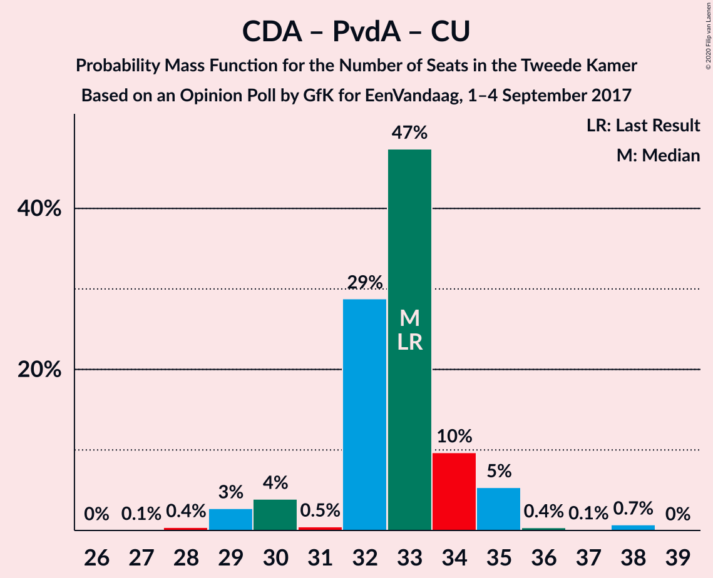

| Number of Seats | Probability | Accumulated | Special Marks |
|:---------------:|:-----------:|:-----------:|:-------------:|
| 29 | 9% | 100% |  |
| 30 | 0.3% | 91% |  |
| 31 | 0.2% | 91% |  |
| 32 | 1.1% | 90% |  |
| 33 | 85% | 89% | Last Result, Median |
| 34 | 3% | 4% |  |
| 35 | 1.4% | 1.5% |  |
| 36 | 0.1% | 0.1% |  |
| 37 | 0% | 0% |  |

### Christen-Democratisch Appèl – Partij van de Arbeid

| Number of Seats | Probability | Accumulated | Special Marks |
|:---------------:|:-----------:|:-----------:|:-------------:|
| 22 | 0.4% | 100% |  |
| 23 | 1.0% | 99.6% |  |
| 24 | 9% | 98.5% |  |
| 25 | 1.4% | 90% |  |
| 26 | 57% | 88% | Median |
| 27 | 31% | 31% |  |
| 28 | 0.6% | 0.6% | Last Result |
| 29 | 0% | 0% |  |

## Technical Information

### Opinion Poll

+ **Polling firm:** GfK
+ **Commissioner(s):** EenVandaag
+ **Fieldwork period:** 1–4 September 2017

### Calculations

+ **Sample size:** 1869
+ **Simulations done:** 131,072
+ **Error estimate:** 1.30%

