# Opinion Poll by Peil.nl, 10 September 2017

<a href="#voting-intentions">Voting Intentions</a> | <a href="#seats">Seats</a> | <a href="#coalitions">Coalitions</a> | <a href="#technical-information">Technical Information</a>

## Voting Intentions

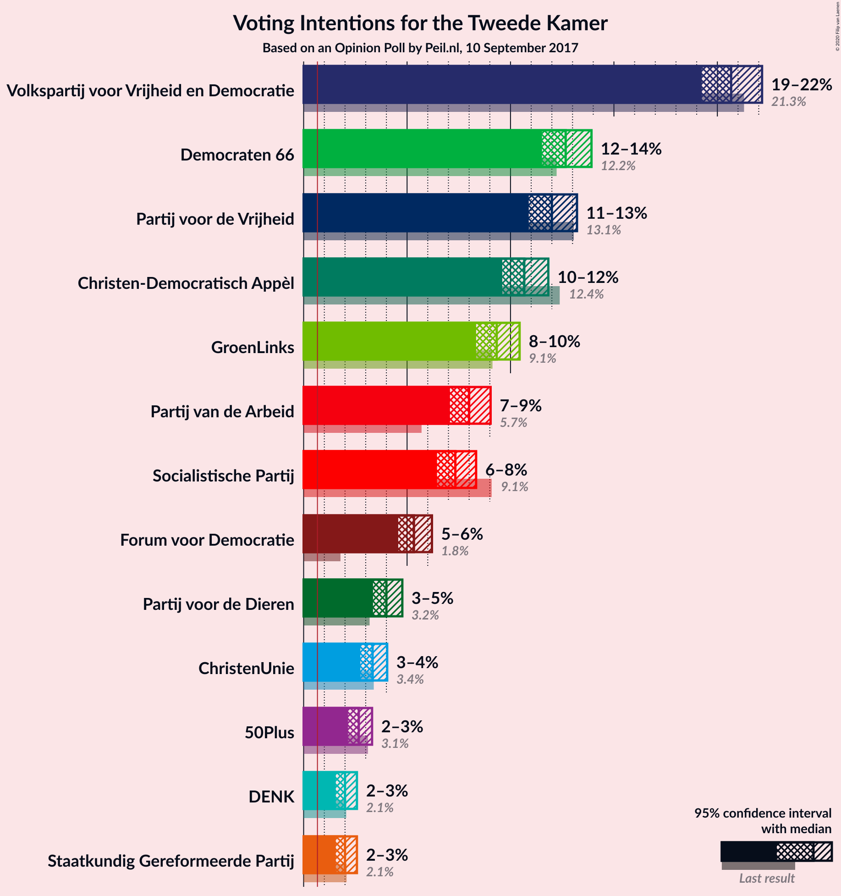

### Confidence Intervals

| Party | Last Result | Poll Result | 80% Confidence Interval | 90% Confidence Interval | 95% Confidence Interval | 99% Confidence Interval |
|:-----:|:-----------:|:-----------:|:-----------------------:|:-----------------------:|:-----------------------:|:-----------------------:|
| Volkspartij voor Vrijheid en Democratie | 21.3% | 20.7% | 19.7–21.6% |19.5–21.9% |19.3–22.2% |18.8–22.6% |
| Democraten 66 | 12.2% | 12.7% | 11.9–13.5% |11.7–13.7% |11.5–13.9% |11.2–14.3% |
| Partij voor de Vrijheid | 13.1% | 12.0% | 11.3–12.8% |11.1–13.0% |10.9–13.2% |10.5–13.6% |
| Christen-Democratisch Appèl | 12.4% | 10.7% | 10.0–11.4% |9.8–11.6% |9.6–11.8% |9.3–12.2% |
| GroenLinks | 9.1% | 9.3% | 8.7–10.1% |8.5–10.3% |8.3–10.4% |8.0–10.8% |
| Partij van de Arbeid | 5.7% | 8.0% | 7.4–8.7% |7.2–8.9% |7.1–9.0% |6.8–9.4% |
| Socialistische Partij | 9.1% | 7.3% | 6.8–8.0% |6.6–8.2% |6.4–8.3% |6.2–8.6% |
| Forum voor Democratie | 1.8% | 5.3% | 4.8–5.9% |4.7–6.1% |4.6–6.2% |4.4–6.5% |
| Partij voor de Dieren | 3.2% | 4.0% | 3.6–4.5% |3.4–4.6% |3.4–4.8% |3.2–5.0% |
| ChristenUnie | 3.4% | 3.3% | 2.9–3.8% |2.8–3.9% |2.7–4.0% |2.6–4.3% |
| 50Plus | 3.1% | 2.7% | 2.3–3.1% |2.2–3.2% |2.1–3.3% |2.0–3.5% |
| Staatkundig Gereformeerde Partij | 2.1% | 2.0% | 1.7–2.4% |1.6–2.5% |1.6–2.6% |1.4–2.8% |
| DENK | 2.1% | 2.0% | 1.7–2.4% |1.6–2.5% |1.6–2.6% |1.4–2.8% |

*Note:* The poll result column reflects the actual value used in the calculations. Published results may vary slightly, and in addition be rounded to fewer digits.

## Seats

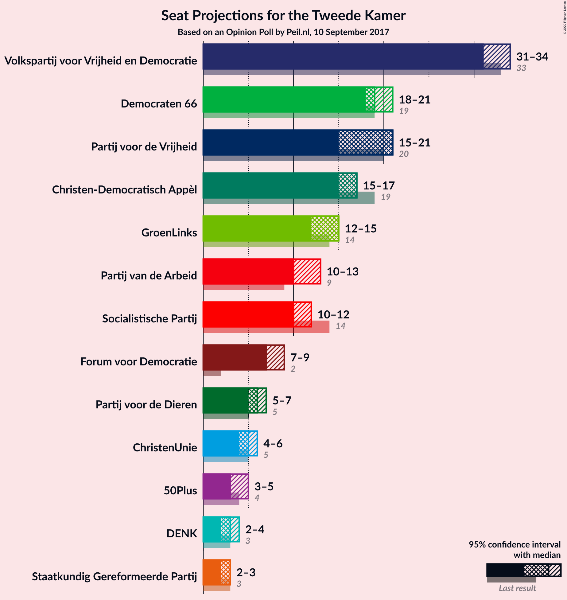

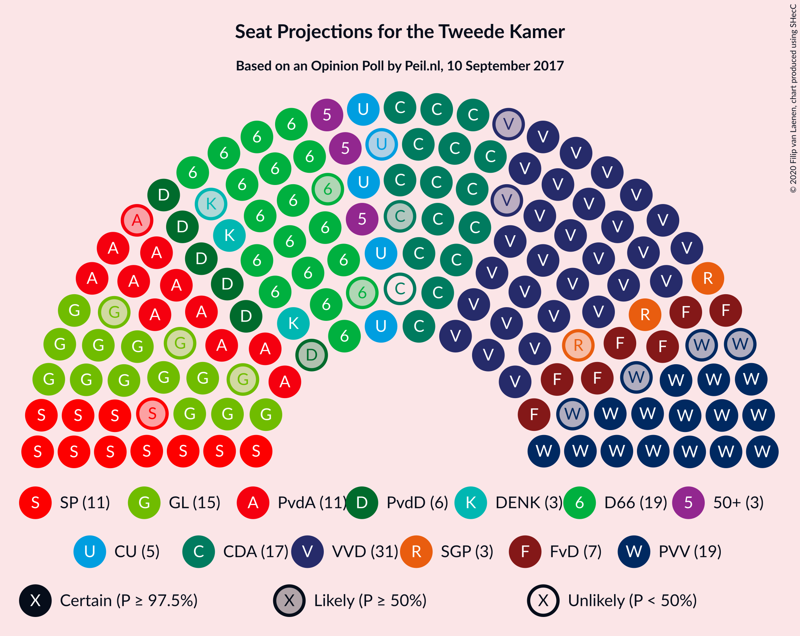

### Confidence Intervals

| Party | Last Result | Median | 80% Confidence Interval | 90% Confidence Interval | 95% Confidence Interval | 99% Confidence Interval |
|:-----:|:-----------:|:------:|:-----------------------:|:-----------------------:|:-----------------------:|:-----------------------:|
| <a href="#volkspartij-voor-vrijheid-en-democratie">Volkspartij voor Vrijheid en Democratie</a> | 33 | 31 | 30–35 |30–35 |29–35 |28–35 |
| <a href="#democraten-66">Democraten 66</a> | 19 | 19 | 18–20 |17–21 |17–21 |16–22 |
| <a href="#partij-voor-de-vrijheid">Partij voor de Vrijheid</a> | 20 | 19 | 15–21 |15–21 |15–21 |15–21 |
| <a href="#christen-democratisch-appèl">Christen-Democratisch Appèl</a> | 19 | 16 | 15–17 |15–17 |15–17 |14–17 |
| <a href="#groenlinks">GroenLinks</a> | 14 | 15 | 13–15 |13–16 |12–16 |12–17 |
| <a href="#partij-van-de-arbeid">Partij van de Arbeid</a> | 9 | 11 | 10–14 |10–14 |10–14 |10–15 |
| <a href="#socialistische-partij">Socialistische Partij</a> | 14 | 11 | 10–12 |10–12 |10–12 |9–13 |
| <a href="#forum-voor-democratie">Forum voor Democratie</a> | 2 | 7 | 7–9 |7–9 |7–9 |6–9 |
| <a href="#partij-voor-de-dieren">Partij voor de Dieren</a> | 5 | 6 | 5–6 |5–6 |5–7 |4–7 |
| <a href="#christenunie">ChristenUnie</a> | 5 | 5 | 5–6 |4–6 |4–6 |4–6 |
| <a href="#50plus">50Plus</a> | 4 | 3 | 3–4 |3–4 |3–5 |3–5 |
| <a href="#staatkundig-gereformeerde-partij">Staatkundig Gereformeerde Partij</a> | 3 | 3 | 2–3 |2–3 |2–3 |2–3 |
| <a href="#denk">DENK</a> | 3 | 3 | 2–3 |2–4 |2–4 |2–4 |

### Volkspartij voor Vrijheid en Democratie

*For a full overview of the results for this party, see the [Volkspartij voor Vrijheid en Democratie](party-volkspartijvoorvrijheidendemocratie.html) page.*

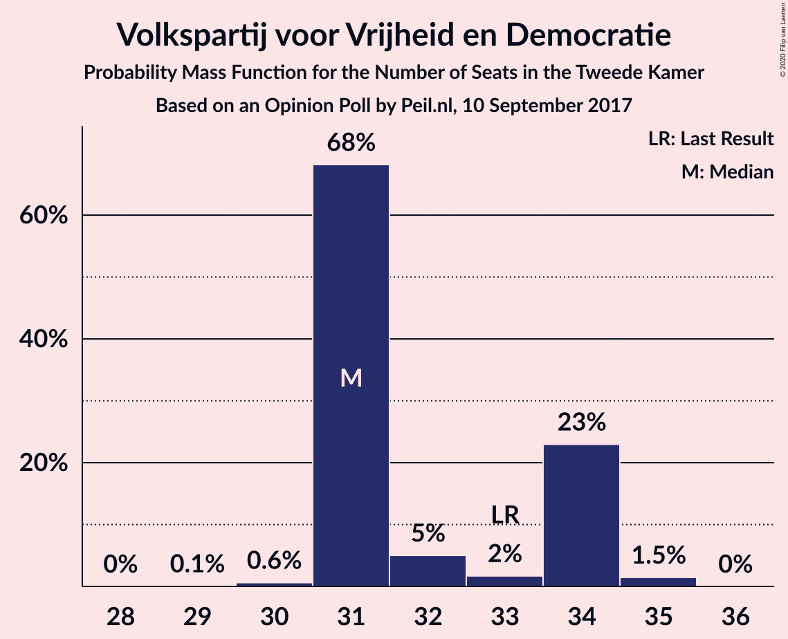

| Number of Seats | Probability | Accumulated | Special Marks |
|:---------------:|:-----------:|:-----------:|:-------------:|
| 28 | 2% | 100% |  |
| 29 | 0.1% | 98% |  |
| 30 | 11% | 97% |  |
| 31 | 43% | 87% | Median |
| 32 | 12% | 43% |  |
| 33 | 4% | 31% | Last Result |
| 34 | 13% | 28% |  |
| 35 | 15% | 15% |  |
| 36 | 0% | 0.3% |  |
| 37 | 0.2% | 0.2% |  |
| 38 | 0% | 0% |  |

### Democraten 66

*For a full overview of the results for this party, see the [Democraten 66](party-democraten66.html) page.*

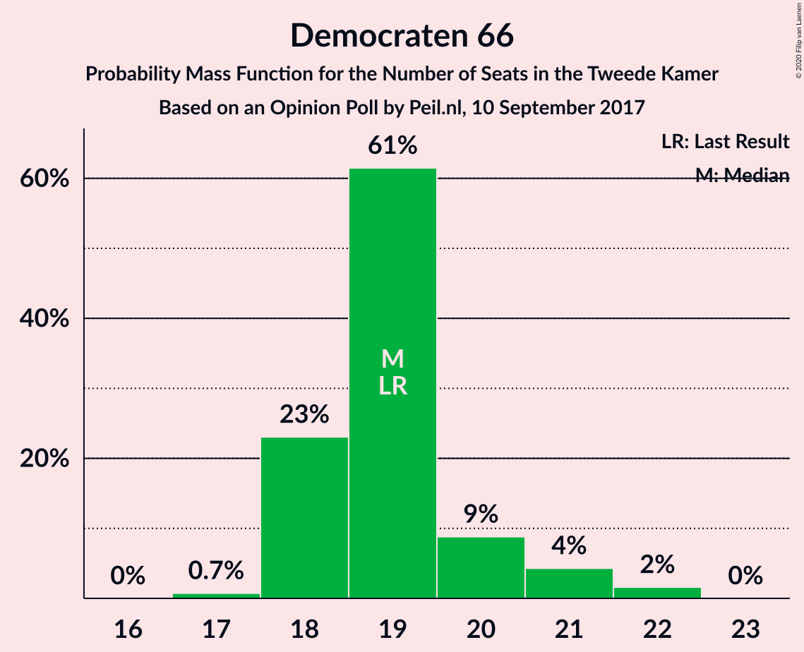

| Number of Seats | Probability | Accumulated | Special Marks |
|:---------------:|:-----------:|:-----------:|:-------------:|
| 16 | 0.6% | 100% |  |
| 17 | 6% | 99.4% |  |
| 18 | 29% | 93% |  |
| 19 | 43% | 64% | Last Result, Median |
| 20 | 13% | 21% |  |
| 21 | 6% | 7% |  |
| 22 | 0.9% | 1.2% |  |
| 23 | 0.3% | 0.3% |  |
| 24 | 0% | 0% |  |

### Partij voor de Vrijheid

*For a full overview of the results for this party, see the [Partij voor de Vrijheid](party-partijvoordevrijheid.html) page.*

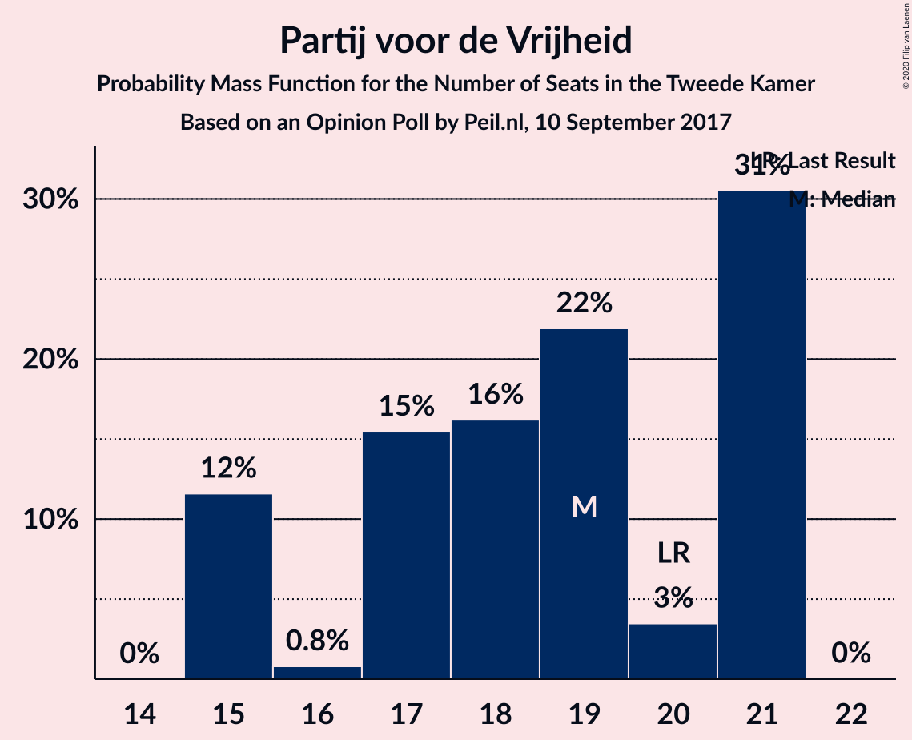

| Number of Seats | Probability | Accumulated | Special Marks |
|:---------------:|:-----------:|:-----------:|:-------------:|
| 15 | 12% | 100% |  |
| 16 | 0.8% | 88% |  |
| 17 | 15% | 88% |  |
| 18 | 16% | 72% |  |
| 19 | 22% | 56% | Median |
| 20 | 3% | 34% | Last Result |
| 21 | 31% | 31% |  |
| 22 | 0% | 0% |  |

### Christen-Democratisch Appèl

*For a full overview of the results for this party, see the [Christen-Democratisch Appèl](party-christen-democratischappèl.html) page.*

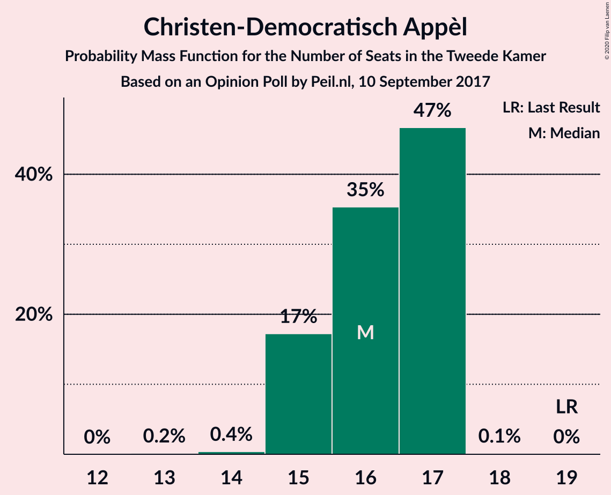

| Number of Seats | Probability | Accumulated | Special Marks |
|:---------------:|:-----------:|:-----------:|:-------------:|
| 13 | 0.2% | 100% |  |
| 14 | 0.4% | 99.8% |  |
| 15 | 17% | 99.4% |  |
| 16 | 35% | 82% | Median |
| 17 | 47% | 47% |  |
| 18 | 0.1% | 0.2% |  |
| 19 | 0% | 0% | Last Result |

### GroenLinks

*For a full overview of the results for this party, see the [GroenLinks](party-groenlinks.html) page.*

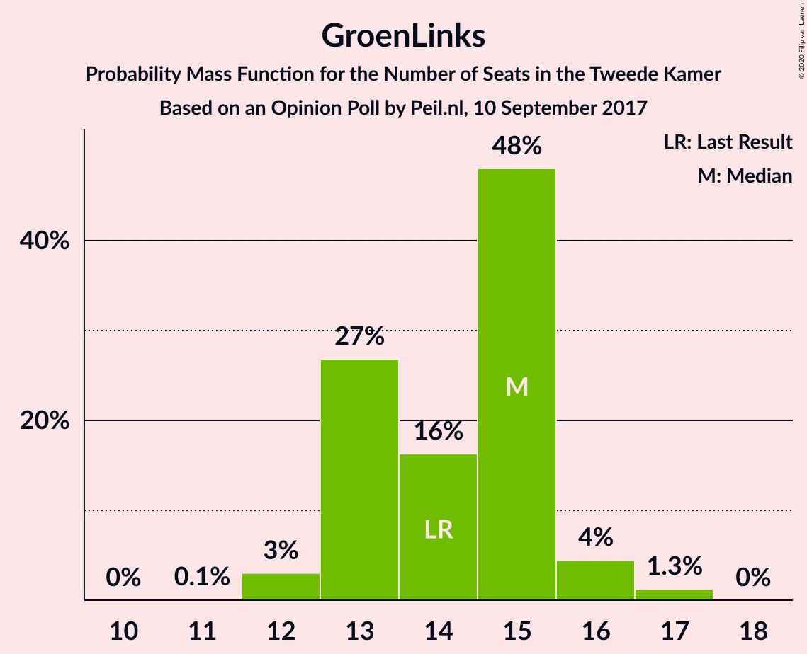

| Number of Seats | Probability | Accumulated | Special Marks |
|:---------------:|:-----------:|:-----------:|:-------------:|
| 11 | 0.1% | 100% |  |
| 12 | 3% | 99.9% |  |
| 13 | 27% | 97% |  |
| 14 | 16% | 70% | Last Result |
| 15 | 48% | 54% | Median |
| 16 | 4% | 6% |  |
| 17 | 1.3% | 1.3% |  |
| 18 | 0% | 0% |  |

### Partij van de Arbeid

*For a full overview of the results for this party, see the [Partij van de Arbeid](party-partijvandearbeid.html) page.*

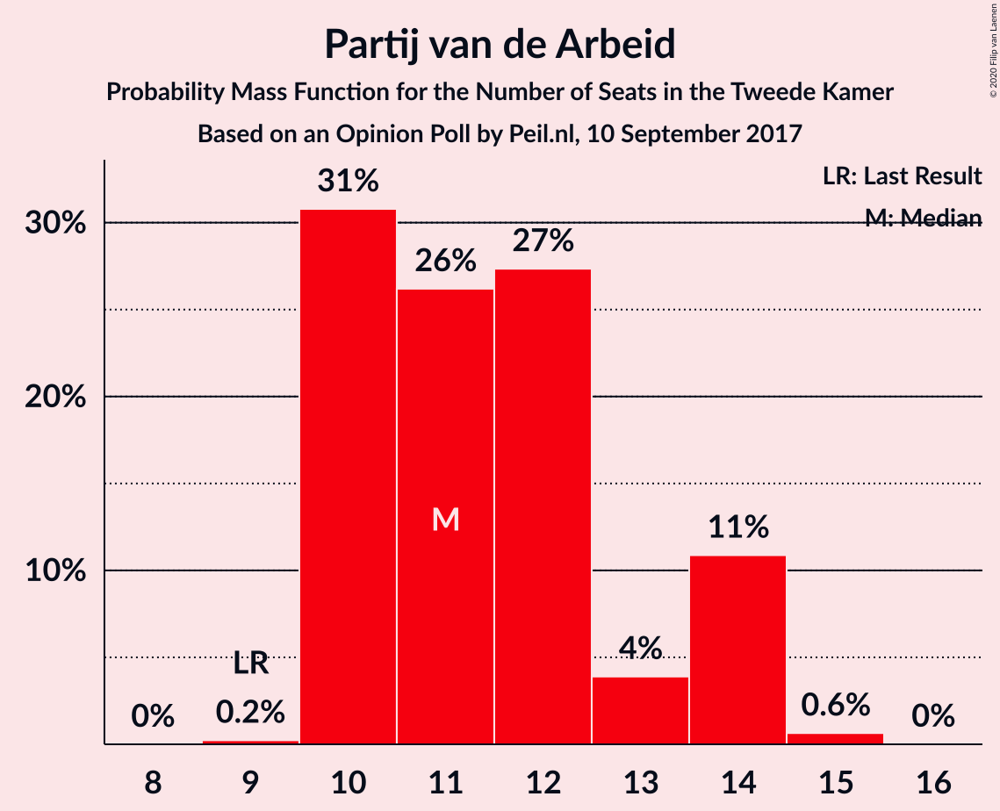

| Number of Seats | Probability | Accumulated | Special Marks |
|:---------------:|:-----------:|:-----------:|:-------------:|
| 9 | 0.2% | 100% | Last Result |
| 10 | 31% | 99.8% |  |
| 11 | 26% | 69% | Median |
| 12 | 27% | 43% |  |
| 13 | 4% | 15% |  |
| 14 | 11% | 12% |  |
| 15 | 0.6% | 0.7% |  |
| 16 | 0% | 0% |  |

### Socialistische Partij

*For a full overview of the results for this party, see the [Socialistische Partij](party-socialistischepartij.html) page.*

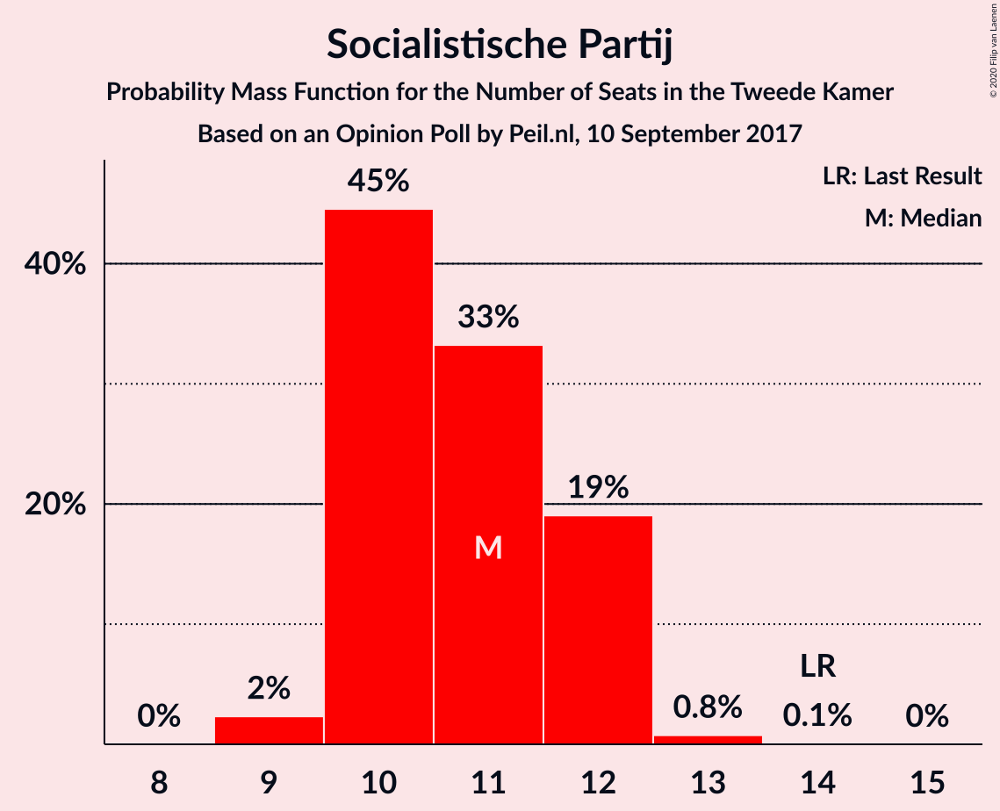

| Number of Seats | Probability | Accumulated | Special Marks |
|:---------------:|:-----------:|:-----------:|:-------------:|
| 9 | 2% | 100% |  |
| 10 | 45% | 98% |  |
| 11 | 33% | 53% | Median |
| 12 | 19% | 20% |  |
| 13 | 0.8% | 0.8% |  |
| 14 | 0.1% | 0.1% | Last Result |
| 15 | 0% | 0% |  |

### Forum voor Democratie

*For a full overview of the results for this party, see the [Forum voor Democratie](party-forumvoordemocratie.html) page.*

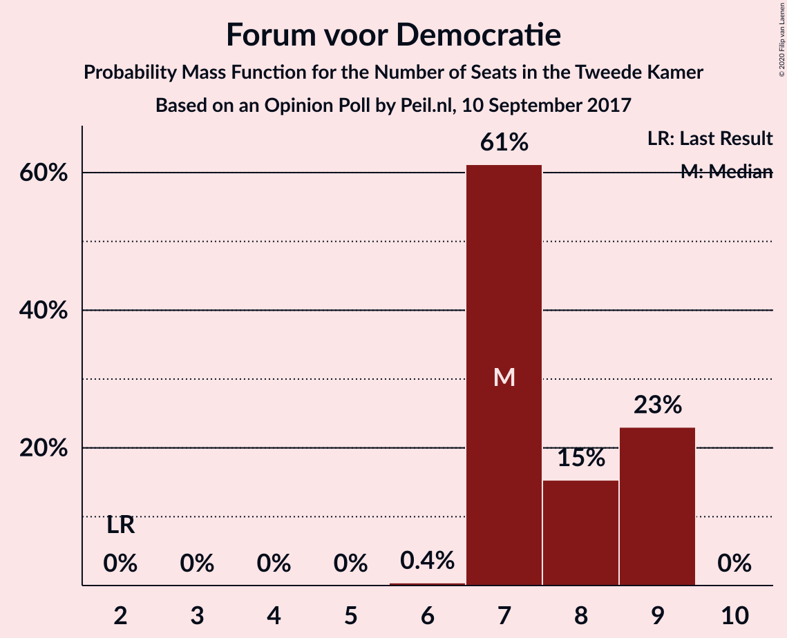

| Number of Seats | Probability | Accumulated | Special Marks |
|:---------------:|:-----------:|:-----------:|:-------------:|
| 2 | 0% | 100% | Last Result |
| 3 | 0% | 100% |  |
| 4 | 0% | 100% |  |
| 5 | 0% | 100% |  |
| 6 | 0.8% | 100% |  |
| 7 | 53% | 99.2% | Median |
| 8 | 11% | 46% |  |
| 9 | 35% | 35% |  |
| 10 | 0.5% | 0.5% |  |
| 11 | 0% | 0% |  |

### Partij voor de Dieren

*For a full overview of the results for this party, see the [Partij voor de Dieren](party-partijvoordedieren.html) page.*

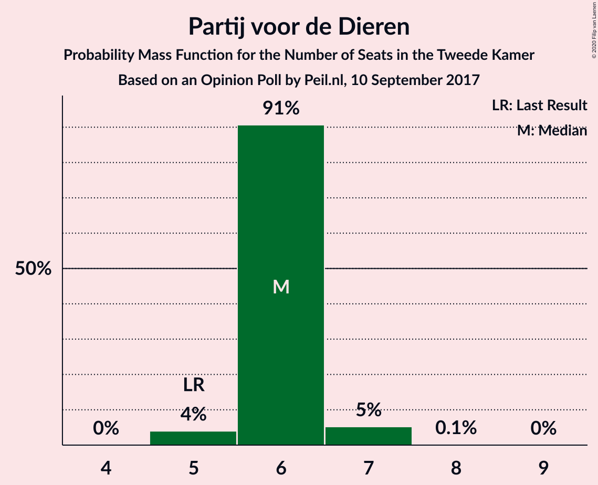

| Number of Seats | Probability | Accumulated | Special Marks |
|:---------------:|:-----------:|:-----------:|:-------------:|
| 4 | 0.9% | 100% |  |
| 5 | 21% | 99.1% | Last Result |
| 6 | 75% | 78% | Median |
| 7 | 3% | 3% |  |
| 8 | 0.1% | 0.1% |  |
| 9 | 0% | 0% |  |

### ChristenUnie

*For a full overview of the results for this party, see the [ChristenUnie](party-christenunie.html) page.*

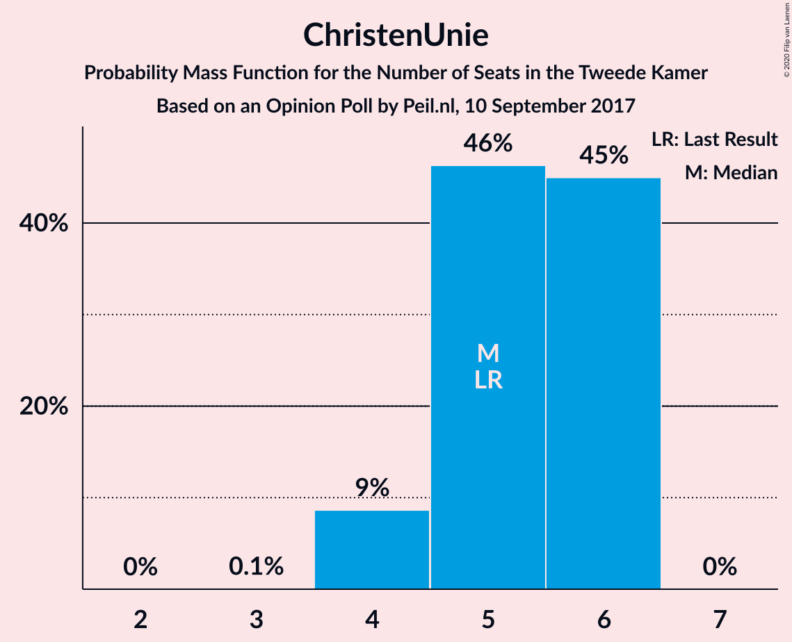

| Number of Seats | Probability | Accumulated | Special Marks |
|:---------------:|:-----------:|:-----------:|:-------------:|
| 3 | 0.1% | 100% |  |
| 4 | 9% | 99.9% |  |
| 5 | 46% | 91% | Last Result, Median |
| 6 | 45% | 45% |  |
| 7 | 0% | 0% |  |

### 50Plus

*For a full overview of the results for this party, see the [50Plus](party-50plus.html) page.*

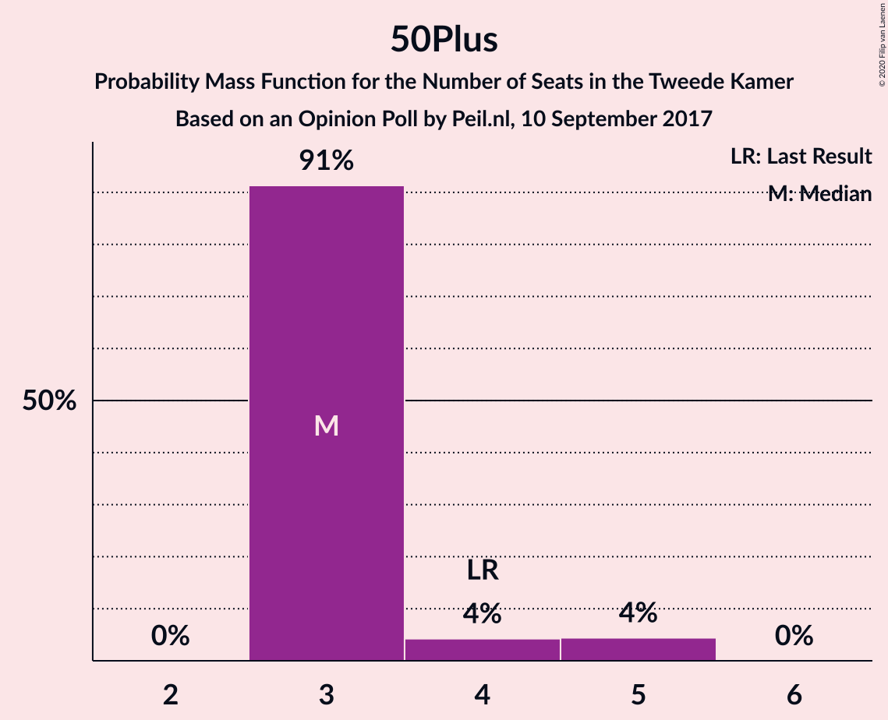

| Number of Seats | Probability | Accumulated | Special Marks |
|:---------------:|:-----------:|:-----------:|:-------------:|
| 2 | 0.1% | 100% |  |
| 3 | 55% | 99.9% | Median |
| 4 | 41% | 45% | Last Result |
| 5 | 4% | 4% |  |
| 6 | 0% | 0% |  |

### Staatkundig Gereformeerde Partij

*For a full overview of the results for this party, see the [Staatkundig Gereformeerde Partij](party-staatkundiggereformeerdepartij.html) page.*

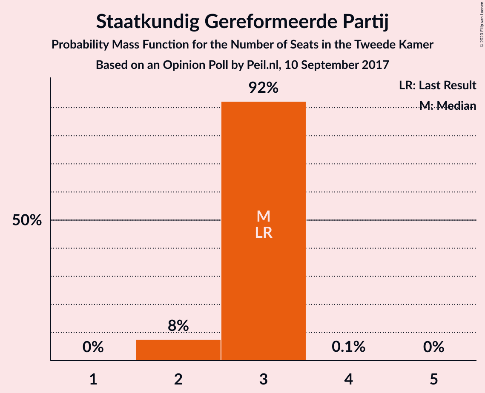

| Number of Seats | Probability | Accumulated | Special Marks |
|:---------------:|:-----------:|:-----------:|:-------------:|
| 2 | 44% | 100% |  |
| 3 | 56% | 56% | Last Result, Median |
| 4 | 0.3% | 0.3% |  |
| 5 | 0% | 0% |  |

### DENK

*For a full overview of the results for this party, see the [DENK](party-denk.html) page.*

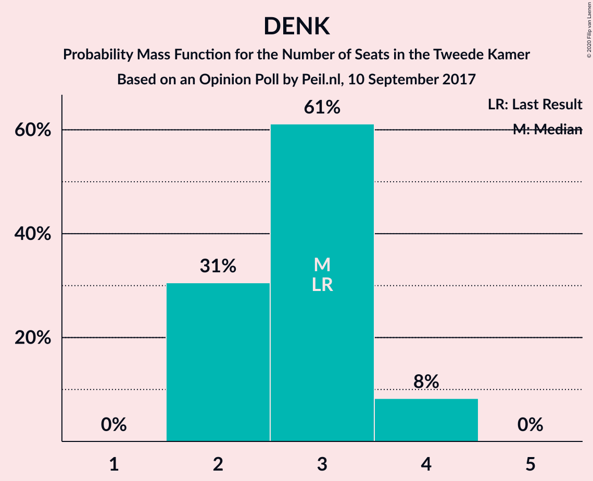

| Number of Seats | Probability | Accumulated | Special Marks |
|:---------------:|:-----------:|:-----------:|:-------------:|
| 2 | 31% | 100% |  |
| 3 | 61% | 69% | Last Result, Median |
| 4 | 8% | 8% |  |
| 5 | 0% | 0% |  |

## Coalitions

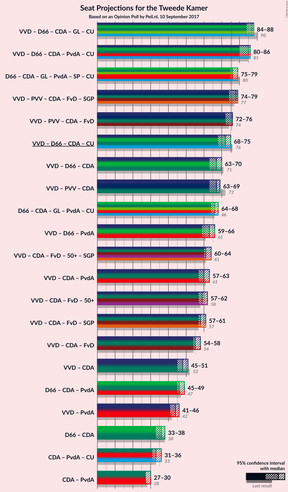

### Confidence Intervals

| Coalition | Last Result | Median | Majority? | 80% Confidence Interval | 90% Confidence Interval | 95% Confidence Interval | 99% Confidence Interval |
|:---------:|:-----------:|:------:|:---------:|:-----------------------:|:-----------------------:|:-----------------------:|:-----------------------:|
| Volkspartij voor Vrijheid en Democratie – Democraten 66 – Christen-Democratisch Appèl – GroenLinks – ChristenUnie | 90 | 87 | 100% | 84–88 | 84–88 | 84–88 | 82–89 |
| Volkspartij voor Vrijheid en Democratie – Democraten 66 – Christen-Democratisch Appèl – Partij van de Arbeid – ChristenUnie | 85 | 85 | 100% | 82–86 | 81–86 | 80–86 | 79–88 |
| Democraten 66 – Christen-Democratisch Appèl – GroenLinks – Partij van de Arbeid – Socialistische Partij – ChristenUnie | 80 | 76 | 92% | 76–79 | 75–79 | 75–79 | 73–80 |
| Volkspartij voor Vrijheid en Democratie – Partij voor de Vrijheid – Christen-Democratisch Appèl – Forum voor Democratie – Staatkundig Gereformeerde Partij | 77 | 78 | 84% | 74–79 | 74–79 | 74–79 | 74–81 |
| Volkspartij voor Vrijheid en Democratie – Partij voor de Vrijheid – Christen-Democratisch Appèl – Forum voor Democratie | 74 | 76 | 56% | 72–76 | 72–76 | 72–76 | 71–78 |
| Volkspartij voor Vrijheid en Democratie – Democraten 66 – Christen-Democratisch Appèl – ChristenUnie | 76 | 72 | 0.2% | 71–75 | 70–75 | 68–75 | 68–75 |
| Volkspartij voor Vrijheid en Democratie – Democraten 66 – Christen-Democratisch Appèl | 71 | 67 | 0% | 65–69 | 65–69 | 63–70 | 63–71 |
| Volkspartij voor Vrijheid en Democratie – Partij voor de Vrijheid – Christen-Democratisch Appèl | 72 | 67 | 0% | 63–69 | 63–69 | 63–69 | 63–70 |
| Democraten 66 – Christen-Democratisch Appèl – GroenLinks – Partij van de Arbeid – ChristenUnie | 66 | 66 | 0% | 64–68 | 64–68 | 64–68 | 63–70 |
| Volkspartij voor Vrijheid en Democratie – Democraten 66 – Partij van de Arbeid | 61 | 63 | 0% | 60–64 | 59–65 | 59–66 | 57–67 |
| Volkspartij voor Vrijheid en Democratie – Christen-Democratisch Appèl – Forum voor Democratie – 50Plus – Staatkundig Gereformeerde Partij | 61 | 61 | 0% | 61–64 | 61–64 | 60–64 | 59–66 |
| Volkspartij voor Vrijheid en Democratie – Christen-Democratisch Appèl – Partij van de Arbeid | 61 | 60 | 0% | 58–62 | 58–62 | 57–63 | 56–63 |
| Volkspartij voor Vrijheid en Democratie – Christen-Democratisch Appèl – Forum voor Democratie – 50Plus | 58 | 59 | 0% | 58–62 | 58–62 | 57–62 | 57–63 |
| Volkspartij voor Vrijheid en Democratie – Christen-Democratisch Appèl – Forum voor Democratie – Staatkundig Gereformeerde Partij | 57 | 58 | 0% | 57–61 | 57–61 | 57–61 | 56–63 |
| Volkspartij voor Vrijheid en Democratie – Christen-Democratisch Appèl – Forum voor Democratie | 54 | 55 | 0% | 55–58 | 55–58 | 54–58 | 53–60 |
| Volkspartij voor Vrijheid en Democratie – Christen-Democratisch Appèl | 52 | 48 | 0% | 46–51 | 46–51 | 45–51 | 45–52 |
| Democraten 66 – Christen-Democratisch Appèl – Partij van de Arbeid | 47 | 46 | 0% | 45–49 | 45–49 | 45–49 | 44–49 |
| Volkspartij voor Vrijheid en Democratie – Partij van de Arbeid | 42 | 44 | 0% | 41–46 | 41–46 | 41–46 | 39–48 |
| Democraten 66 – Christen-Democratisch Appèl | 38 | 36 | 0% | 33–36 | 33–37 | 33–38 | 32–38 |
| Christen-Democratisch Appèl – Partij van de Arbeid – ChristenUnie | 33 | 33 | 0% | 32–36 | 32–36 | 31–36 | 31–36 |
| Christen-Democratisch Appèl – Partij van de Arbeid | 28 | 27 | 0% | 27–30 | 27–30 | 27–30 | 25–30 |

### Volkspartij voor Vrijheid en Democratie – Democraten 66 – Christen-Democratisch Appèl – GroenLinks – ChristenUnie

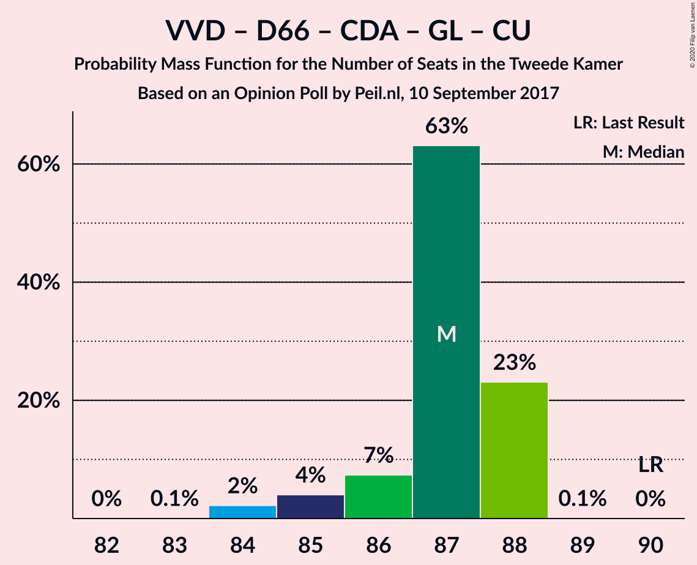

| Number of Seats | Probability | Accumulated | Special Marks |
|:---------------:|:-----------:|:-----------:|:-------------:|
| 81 | 0.3% | 100% |  |
| 82 | 0.2% | 99.7% |  |
| 83 | 0.2% | 99.5% |  |
| 84 | 14% | 99.3% |  |
| 85 | 7% | 85% |  |
| 86 | 4% | 78% | Median |
| 87 | 34% | 74% |  |
| 88 | 38% | 39% |  |
| 89 | 1.5% | 2% |  |
| 90 | 0.4% | 0.5% | Last Result |
| 91 | 0% | 0% |  |

### Volkspartij voor Vrijheid en Democratie – Democraten 66 – Christen-Democratisch Appèl – Partij van de Arbeid – ChristenUnie

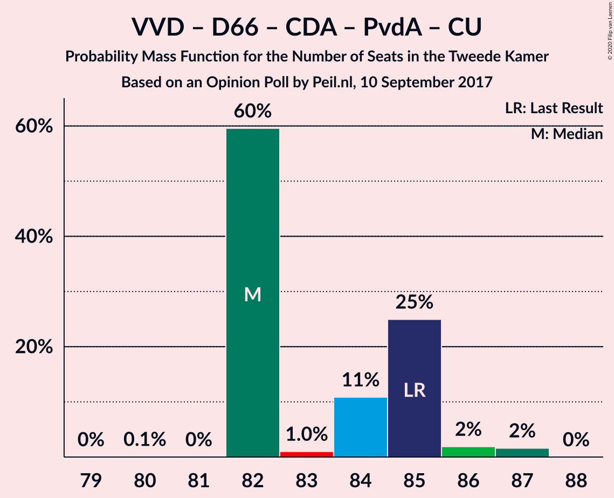

| Number of Seats | Probability | Accumulated | Special Marks |
|:---------------:|:-----------:|:-----------:|:-------------:|
| 79 | 2% | 100% |  |
| 80 | 0.3% | 98% |  |
| 81 | 5% | 97% |  |
| 82 | 31% | 92% | Median |
| 83 | 1.4% | 61% |  |
| 84 | 7% | 60% |  |
| 85 | 26% | 52% | Last Result |
| 86 | 24% | 26% |  |
| 87 | 0.9% | 2% |  |
| 88 | 1.2% | 1.2% |  |
| 89 | 0% | 0% |  |

### Democraten 66 – Christen-Democratisch Appèl – GroenLinks – Partij van de Arbeid – Socialistische Partij – ChristenUnie

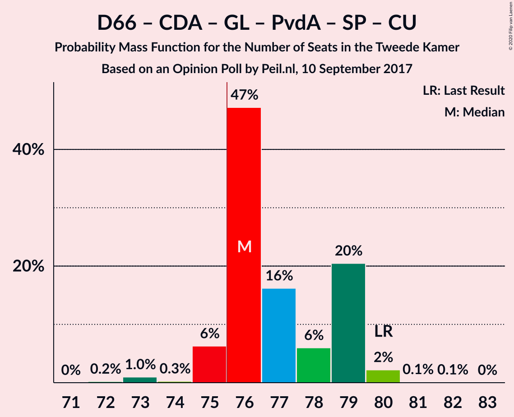

| Number of Seats | Probability | Accumulated | Special Marks |
|:---------------:|:-----------:|:-----------:|:-------------:|
| 72 | 0.2% | 100% |  |
| 73 | 1.0% | 99.8% |  |
| 74 | 0.3% | 98.8% |  |
| 75 | 6% | 98.6% |  |
| 76 | 47% | 92% | Majority |
| 77 | 16% | 45% | Median |
| 78 | 6% | 29% |  |
| 79 | 20% | 23% |  |
| 80 | 2% | 2% | Last Result |
| 81 | 0.1% | 0.2% |  |
| 82 | 0.1% | 0.1% |  |
| 83 | 0% | 0% |  |

### Volkspartij voor Vrijheid en Democratie – Partij voor de Vrijheid – Christen-Democratisch Appèl – Forum voor Democratie – Staatkundig Gereformeerde Partij

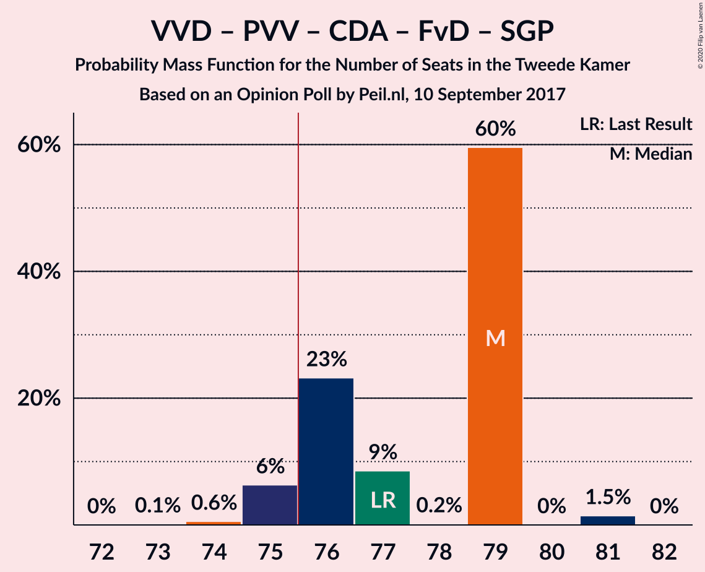

| Number of Seats | Probability | Accumulated | Special Marks |
|:---------------:|:-----------:|:-----------:|:-------------:|
| 72 | 0.1% | 100% |  |
| 73 | 0.1% | 99.9% |  |
| 74 | 11% | 99.8% |  |
| 75 | 5% | 89% |  |
| 76 | 20% | 84% | Median, Majority |
| 77 | 8% | 64% | Last Result |
| 78 | 19% | 56% |  |
| 79 | 36% | 37% |  |
| 80 | 0.5% | 1.2% |  |
| 81 | 0.7% | 0.8% |  |
| 82 | 0% | 0% |  |

### Volkspartij voor Vrijheid en Democratie – Partij voor de Vrijheid – Christen-Democratisch Appèl – Forum voor Democratie

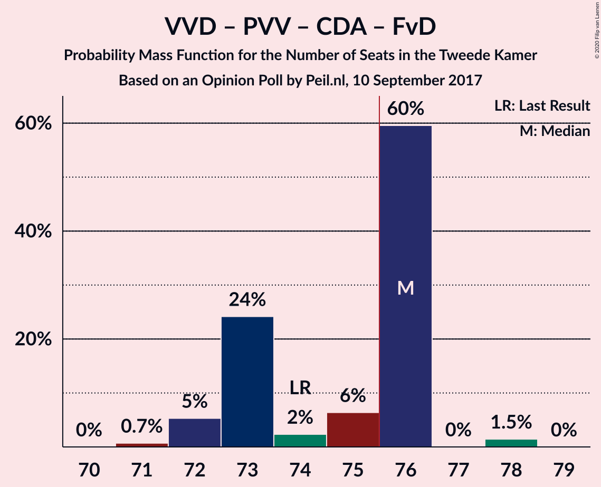

| Number of Seats | Probability | Accumulated | Special Marks |
|:---------------:|:-----------:|:-----------:|:-------------:|
| 69 | 0.1% | 100% |  |
| 70 | 0% | 99.9% |  |
| 71 | 0.5% | 99.9% |  |
| 72 | 13% | 99.4% |  |
| 73 | 14% | 86% | Median |
| 74 | 11% | 72% | Last Result |
| 75 | 5% | 61% |  |
| 76 | 54% | 56% | Majority |
| 77 | 0.9% | 2% |  |
| 78 | 1.0% | 1.0% |  |
| 79 | 0% | 0% |  |

### Volkspartij voor Vrijheid en Democratie – Democraten 66 – Christen-Democratisch Appèl – ChristenUnie

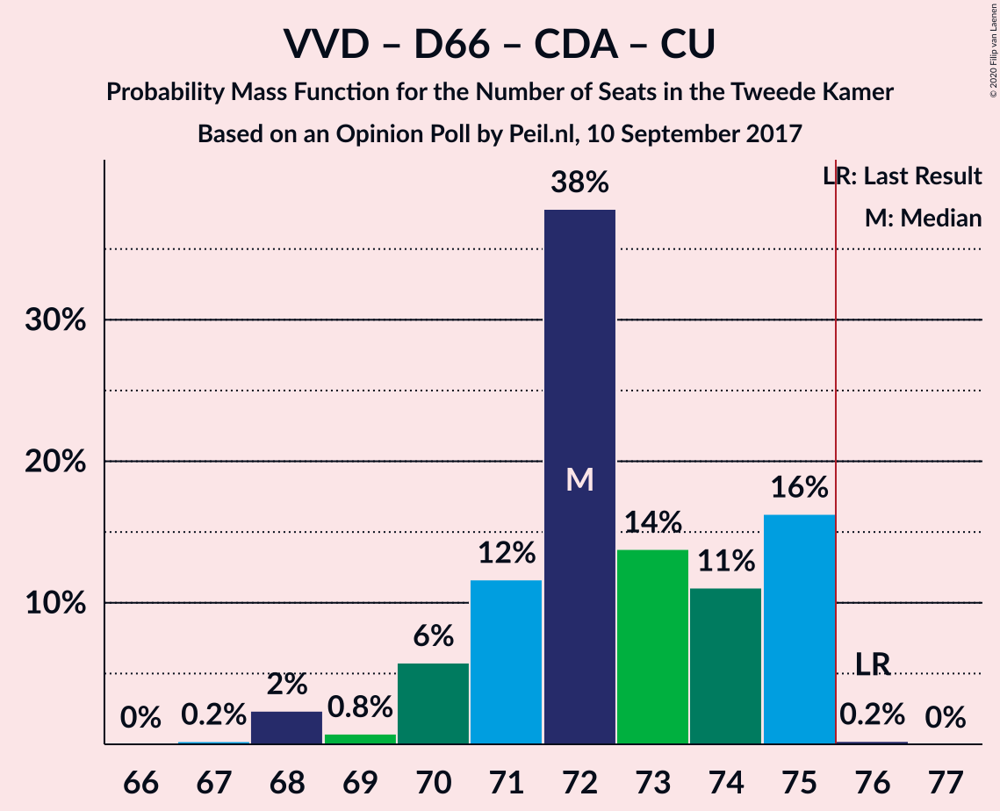

| Number of Seats | Probability | Accumulated | Special Marks |
|:---------------:|:-----------:|:-----------:|:-------------:|
| 67 | 0.2% | 100% |  |
| 68 | 2% | 99.8% |  |
| 69 | 0.8% | 97% |  |
| 70 | 6% | 97% |  |
| 71 | 12% | 91% | Median |
| 72 | 38% | 79% |  |
| 73 | 14% | 41% |  |
| 74 | 11% | 28% |  |
| 75 | 16% | 17% |  |
| 76 | 0.2% | 0.2% | Last Result, Majority |
| 77 | 0% | 0% |  |

### Volkspartij voor Vrijheid en Democratie – Democraten 66 – Christen-Democratisch Appèl

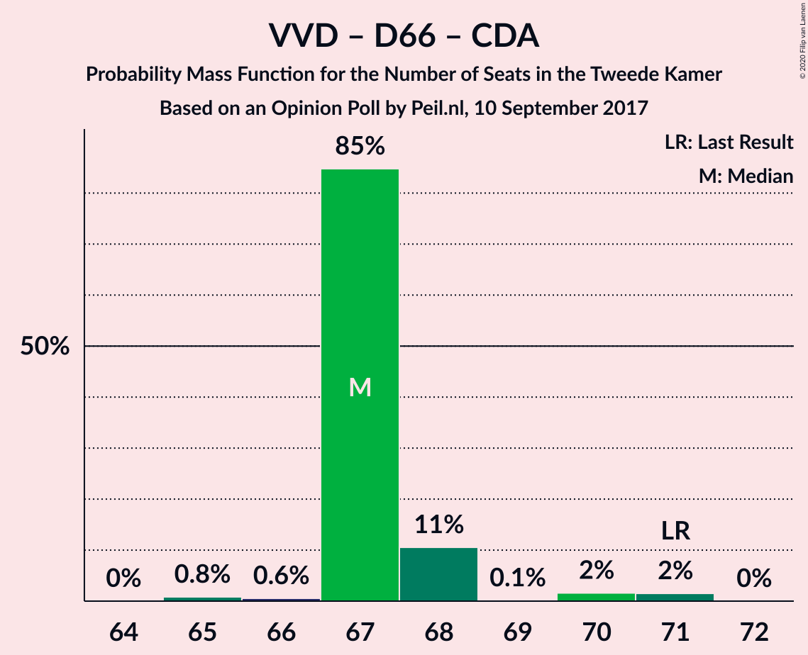

| Number of Seats | Probability | Accumulated | Special Marks |
|:---------------:|:-----------:|:-----------:|:-------------:|
| 63 | 3% | 100% |  |
| 64 | 0.3% | 97% |  |
| 65 | 16% | 97% |  |
| 66 | 2% | 81% | Median |
| 67 | 45% | 79% |  |
| 68 | 14% | 34% |  |
| 69 | 17% | 20% |  |
| 70 | 2% | 3% |  |
| 71 | 0.9% | 1.1% | Last Result |
| 72 | 0.2% | 0.2% |  |
| 73 | 0% | 0% |  |

### Volkspartij voor Vrijheid en Democratie – Partij voor de Vrijheid – Christen-Democratisch Appèl

| Number of Seats | Probability | Accumulated | Special Marks |
|:---------------:|:-----------:|:-----------:|:-------------:|
| 60 | 0.1% | 100% |  |
| 61 | 0% | 99.9% |  |
| 62 | 0% | 99.9% |  |
| 63 | 11% | 99.9% |  |
| 64 | 14% | 89% |  |
| 65 | 5% | 75% |  |
| 66 | 3% | 71% | Median |
| 67 | 20% | 67% |  |
| 68 | 2% | 47% |  |
| 69 | 44% | 46% |  |
| 70 | 1.0% | 1.2% |  |
| 71 | 0.2% | 0.2% |  |
| 72 | 0% | 0% | Last Result |

### Democraten 66 – Christen-Democratisch Appèl – GroenLinks – Partij van de Arbeid – ChristenUnie

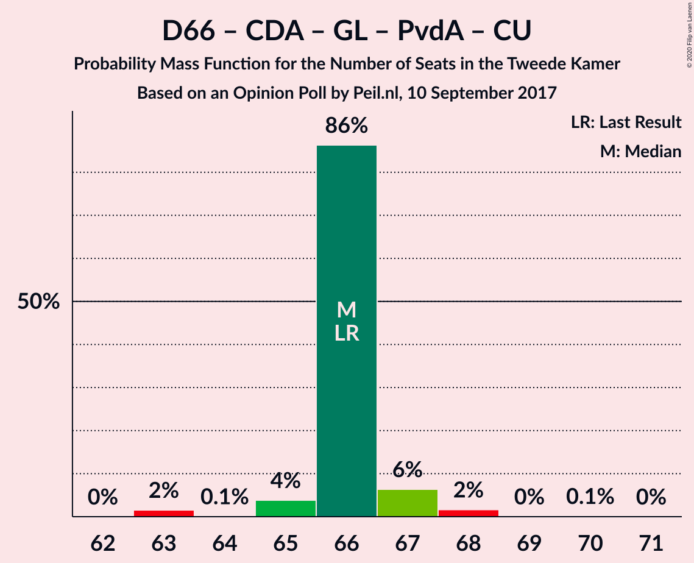

| Number of Seats | Probability | Accumulated | Special Marks |
|:---------------:|:-----------:|:-----------:|:-------------:|
| 62 | 0.3% | 100% |  |
| 63 | 1.1% | 99.7% |  |
| 64 | 14% | 98.6% |  |
| 65 | 8% | 85% |  |
| 66 | 46% | 77% | Last Result, Median |
| 67 | 7% | 31% |  |
| 68 | 22% | 24% |  |
| 69 | 0.9% | 2% |  |
| 70 | 0.7% | 0.8% |  |
| 71 | 0% | 0% |  |

### Volkspartij voor Vrijheid en Democratie – Democraten 66 – Partij van de Arbeid

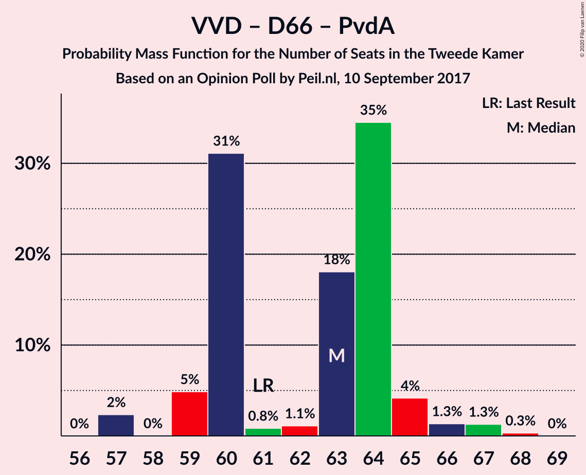

| Number of Seats | Probability | Accumulated | Special Marks |
|:---------------:|:-----------:|:-----------:|:-------------:|
| 57 | 2% | 100% |  |
| 58 | 0% | 98% |  |
| 59 | 5% | 98% |  |
| 60 | 31% | 93% |  |
| 61 | 0.8% | 62% | Last Result, Median |
| 62 | 1.1% | 61% |  |
| 63 | 18% | 60% |  |
| 64 | 35% | 42% |  |
| 65 | 4% | 7% |  |
| 66 | 1.3% | 3% |  |
| 67 | 1.3% | 2% |  |
| 68 | 0.3% | 0.3% |  |
| 69 | 0% | 0% |  |

### Volkspartij voor Vrijheid en Democratie – Christen-Democratisch Appèl – Forum voor Democratie – 50Plus – Staatkundig Gereformeerde Partij

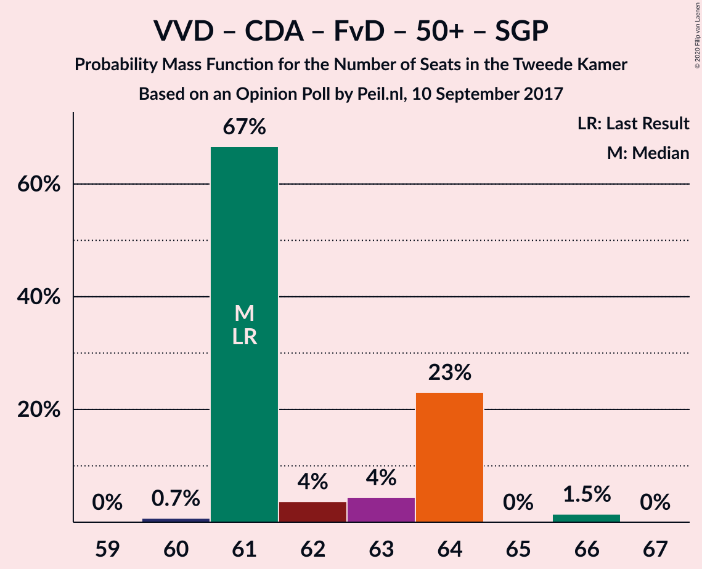

| Number of Seats | Probability | Accumulated | Special Marks |
|:---------------:|:-----------:|:-----------:|:-------------:|
| 58 | 0.1% | 100% |  |
| 59 | 1.3% | 99.9% |  |
| 60 | 3% | 98.6% | Median |
| 61 | 52% | 96% | Last Result |
| 62 | 6% | 44% |  |
| 63 | 4% | 38% |  |
| 64 | 31% | 34% |  |
| 65 | 1.1% | 2% |  |
| 66 | 1.1% | 1.1% |  |
| 67 | 0% | 0% |  |

### Volkspartij voor Vrijheid en Democratie – Christen-Democratisch Appèl – Partij van de Arbeid

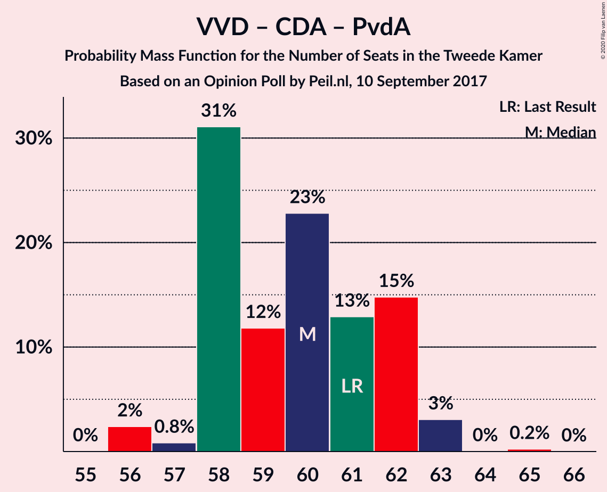

| Number of Seats | Probability | Accumulated | Special Marks |
|:---------------:|:-----------:|:-----------:|:-------------:|
| 56 | 2% | 100% |  |
| 57 | 0.8% | 98% |  |
| 58 | 31% | 97% | Median |
| 59 | 12% | 66% |  |
| 60 | 23% | 54% |  |
| 61 | 13% | 31% | Last Result |
| 62 | 15% | 18% |  |
| 63 | 3% | 3% |  |
| 64 | 0% | 0.3% |  |
| 65 | 0.2% | 0.2% |  |
| 66 | 0% | 0% |  |

### Volkspartij voor Vrijheid en Democratie – Christen-Democratisch Appèl – Forum voor Democratie – 50Plus

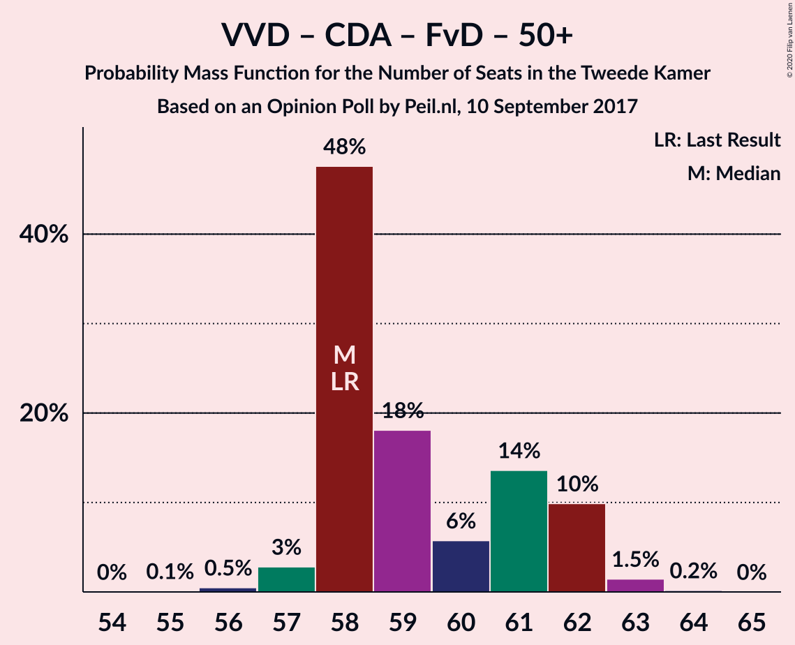

| Number of Seats | Probability | Accumulated | Special Marks |
|:---------------:|:-----------:|:-----------:|:-------------:|
| 55 | 0.1% | 100% |  |
| 56 | 0.1% | 99.9% |  |
| 57 | 4% | 99.8% | Median |
| 58 | 31% | 96% | Last Result |
| 59 | 24% | 65% |  |
| 60 | 7% | 42% |  |
| 61 | 18% | 35% |  |
| 62 | 15% | 17% |  |
| 63 | 2% | 2% |  |
| 64 | 0.2% | 0.2% |  |
| 65 | 0% | 0% |  |

### Volkspartij voor Vrijheid en Democratie – Christen-Democratisch Appèl – Forum voor Democratie – Staatkundig Gereformeerde Partij

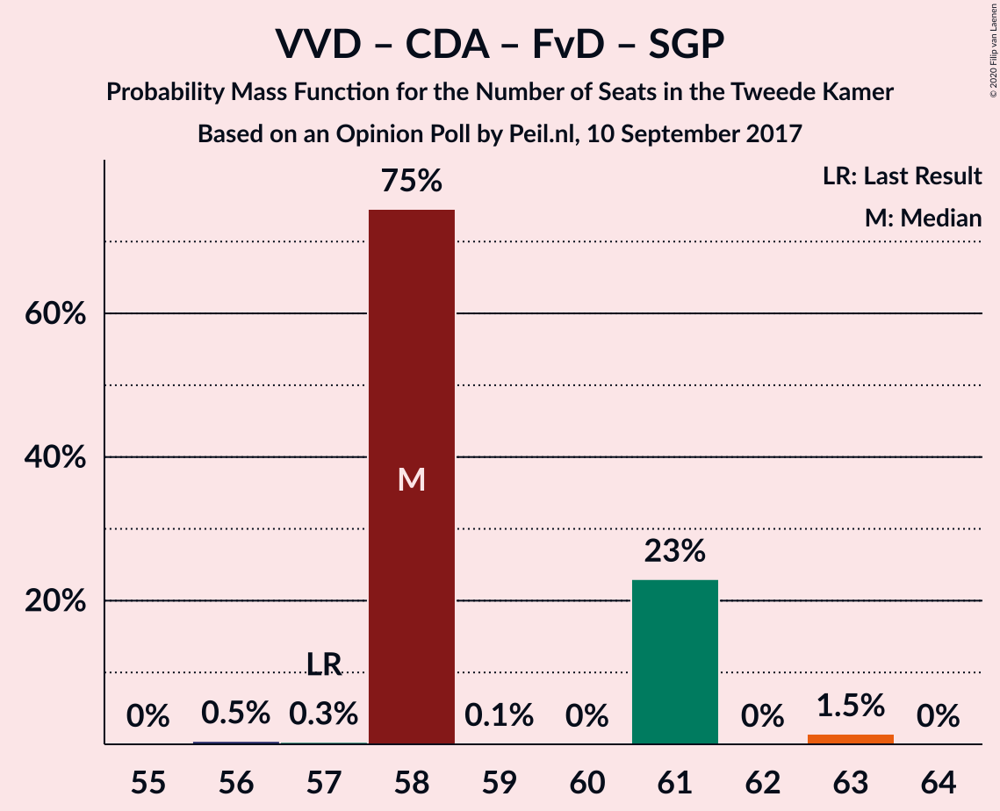

| Number of Seats | Probability | Accumulated | Special Marks |
|:---------------:|:-----------:|:-----------:|:-------------:|
| 55 | 0.5% | 100% |  |
| 56 | 1.3% | 99.5% |  |
| 57 | 20% | 98% | Last Result, Median |
| 58 | 38% | 78% |  |
| 59 | 5% | 39% |  |
| 60 | 22% | 35% |  |
| 61 | 12% | 13% |  |
| 62 | 0.4% | 1.2% |  |
| 63 | 0.7% | 0.8% |  |
| 64 | 0% | 0% |  |

### Volkspartij voor Vrijheid en Democratie – Christen-Democratisch Appèl – Forum voor Democratie

| Number of Seats | Probability | Accumulated | Special Marks |
|:---------------:|:-----------:|:-----------:|:-------------:|
| 52 | 0.1% | 100% |  |
| 53 | 0.6% | 99.9% |  |
| 54 | 4% | 99.3% | Last Result, Median |
| 55 | 52% | 96% |  |
| 56 | 4% | 43% |  |
| 57 | 10% | 39% |  |
| 58 | 28% | 29% |  |
| 59 | 0.2% | 1.1% |  |
| 60 | 1.0% | 1.0% |  |
| 61 | 0% | 0% |  |

### Volkspartij voor Vrijheid en Democratie – Christen-Democratisch Appèl

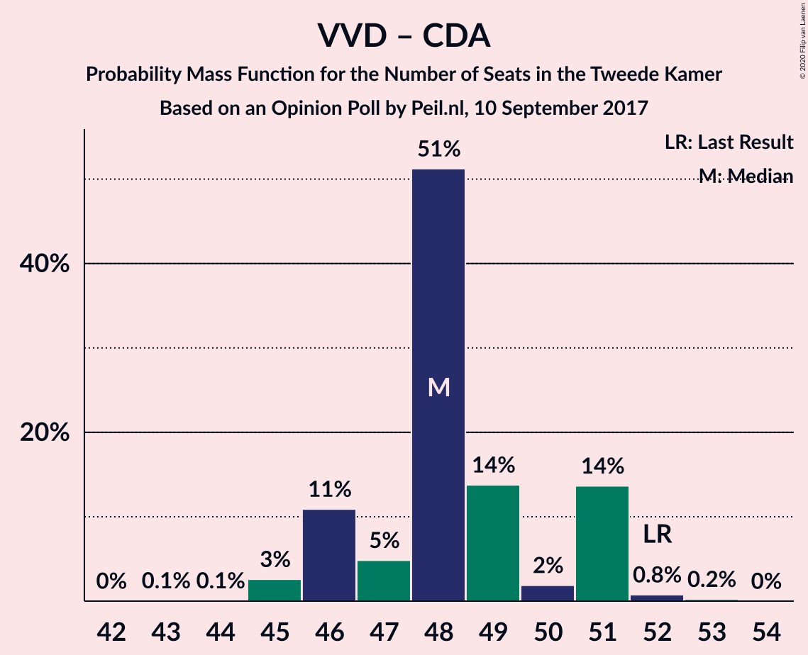

| Number of Seats | Probability | Accumulated | Special Marks |
|:---------------:|:-----------:|:-----------:|:-------------:|
| 43 | 0.1% | 100% |  |
| 44 | 0.1% | 99.9% |  |
| 45 | 3% | 99.9% |  |
| 46 | 11% | 97% |  |
| 47 | 5% | 86% | Median |
| 48 | 51% | 82% |  |
| 49 | 14% | 30% |  |
| 50 | 2% | 17% |  |
| 51 | 14% | 15% |  |
| 52 | 0.8% | 1.0% | Last Result |
| 53 | 0.2% | 0.2% |  |
| 54 | 0% | 0% |  |

### Democraten 66 – Christen-Democratisch Appèl – Partij van de Arbeid

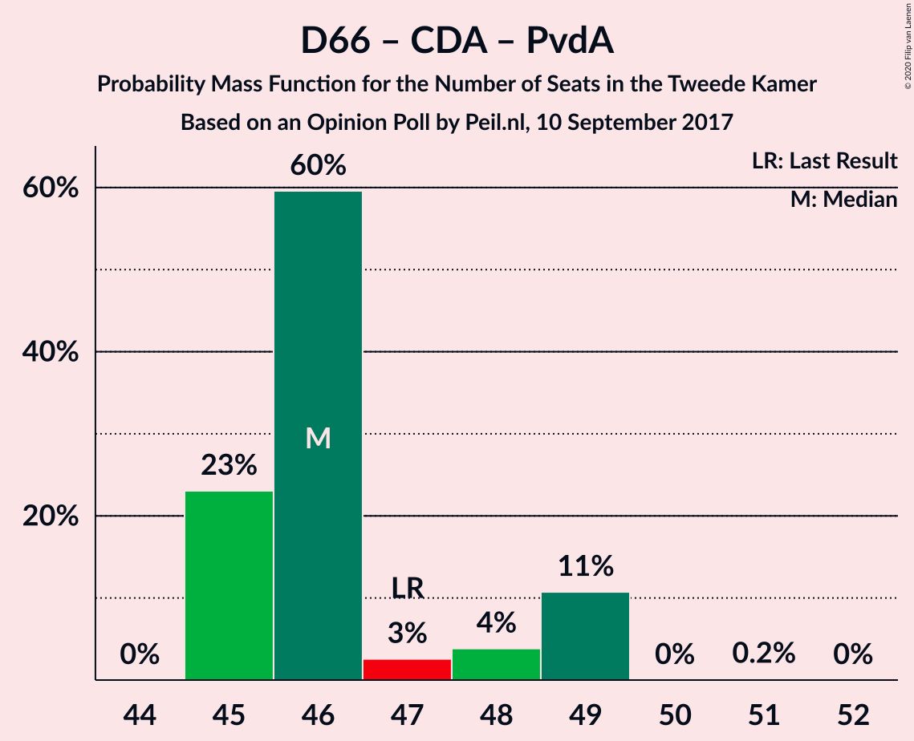

| Number of Seats | Probability | Accumulated | Special Marks |
|:---------------:|:-----------:|:-----------:|:-------------:|
| 43 | 0.1% | 100% |  |
| 44 | 1.1% | 99.9% |  |
| 45 | 31% | 98.8% |  |
| 46 | 33% | 68% | Median |
| 47 | 4% | 35% | Last Result |
| 48 | 10% | 31% |  |
| 49 | 21% | 21% |  |
| 50 | 0.2% | 0.3% |  |
| 51 | 0.1% | 0.1% |  |
| 52 | 0% | 0% |  |

### Volkspartij voor Vrijheid en Democratie – Partij van de Arbeid

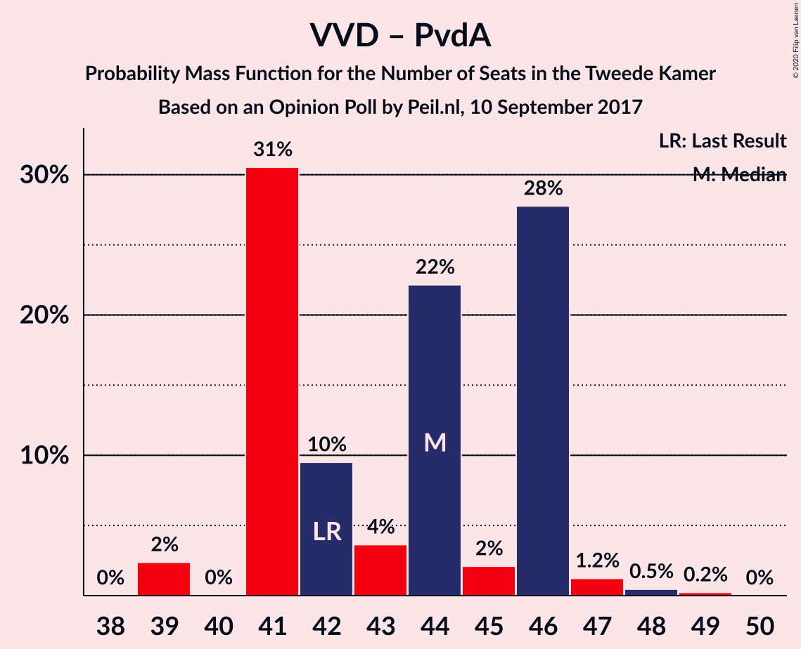

| Number of Seats | Probability | Accumulated | Special Marks |
|:---------------:|:-----------:|:-----------:|:-------------:|
| 39 | 2% | 100% |  |
| 40 | 0% | 98% |  |
| 41 | 31% | 98% |  |
| 42 | 10% | 67% | Last Result, Median |
| 43 | 4% | 58% |  |
| 44 | 22% | 54% |  |
| 45 | 2% | 32% |  |
| 46 | 28% | 30% |  |
| 47 | 1.2% | 2% |  |
| 48 | 0.5% | 0.7% |  |
| 49 | 0.2% | 0.2% |  |
| 50 | 0% | 0% |  |

### Democraten 66 – Christen-Democratisch Appèl

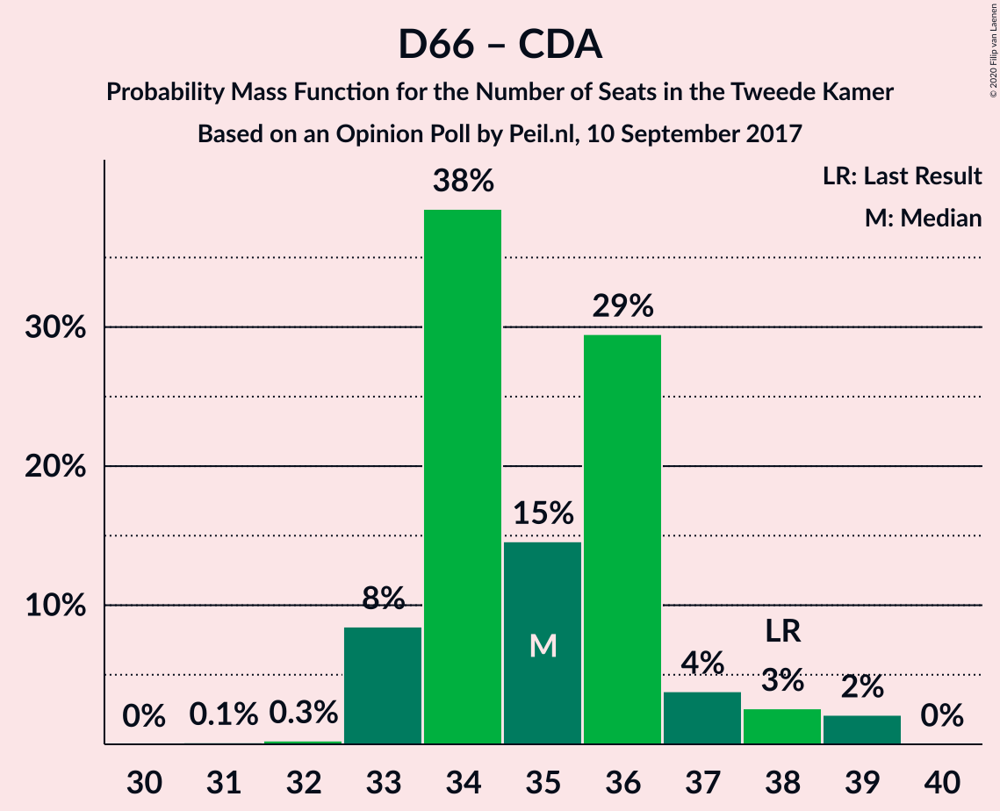

| Number of Seats | Probability | Accumulated | Special Marks |
|:---------------:|:-----------:|:-----------:|:-------------:|
| 31 | 0.2% | 100% |  |
| 32 | 0.4% | 99.8% |  |
| 33 | 13% | 99.4% |  |
| 34 | 21% | 87% |  |
| 35 | 15% | 65% | Median |
| 36 | 42% | 50% |  |
| 37 | 5% | 9% |  |
| 38 | 4% | 4% | Last Result |
| 39 | 0% | 0.1% |  |
| 40 | 0% | 0% |  |

### Christen-Democratisch Appèl – Partij van de Arbeid – ChristenUnie

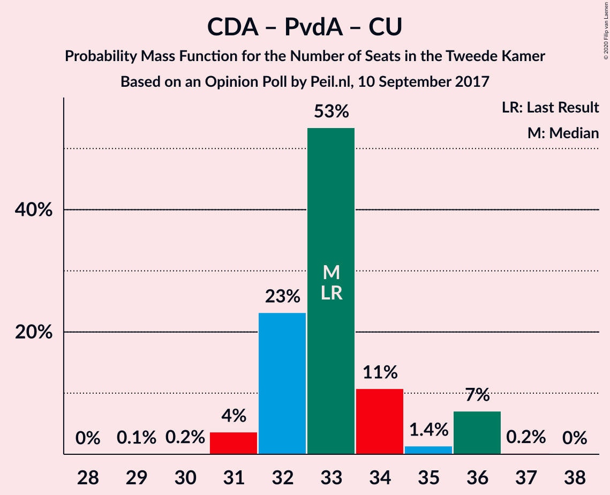

| Number of Seats | Probability | Accumulated | Special Marks |
|:---------------:|:-----------:|:-----------:|:-------------:|
| 29 | 0.1% | 100% |  |
| 30 | 0.2% | 99.9% |  |
| 31 | 3% | 99.6% |  |
| 32 | 34% | 96% | Median |
| 33 | 40% | 62% | Last Result |
| 34 | 11% | 23% |  |
| 35 | 1.2% | 12% |  |
| 36 | 11% | 11% |  |
| 37 | 0.2% | 0.2% |  |
| 38 | 0% | 0% |  |

### Christen-Democratisch Appèl – Partij van de Arbeid

| Number of Seats | Probability | Accumulated | Special Marks |
|:---------------:|:-----------:|:-----------:|:-------------:|
| 24 | 0.1% | 100% |  |
| 25 | 0.8% | 99.9% |  |
| 26 | 0.5% | 99.0% |  |
| 27 | 60% | 98% | Median |
| 28 | 20% | 39% | Last Result |
| 29 | 7% | 19% |  |
| 30 | 12% | 12% |  |
| 31 | 0.1% | 0.3% |  |
| 32 | 0.2% | 0.2% |  |
| 33 | 0% | 0% |  |

## Technical Information

### Opinion Poll

+ **Polling firm:** Peil.nl
+ **Commissioner(s):** —
+ **Fieldwork period:** 10 September 2017

### Calculations

+ **Sample size:** 3000
+ **Simulations done:** 524,288
+ **Error estimate:** 2.47%

