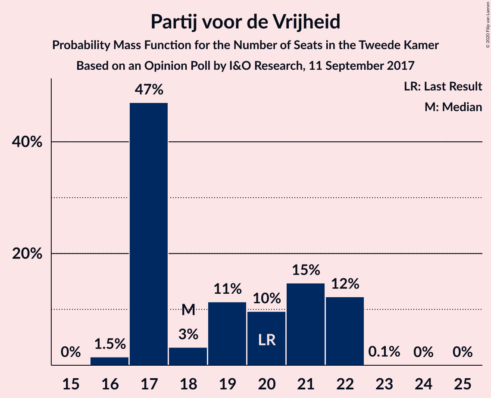
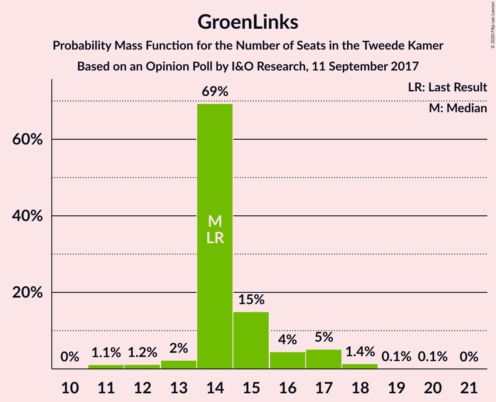
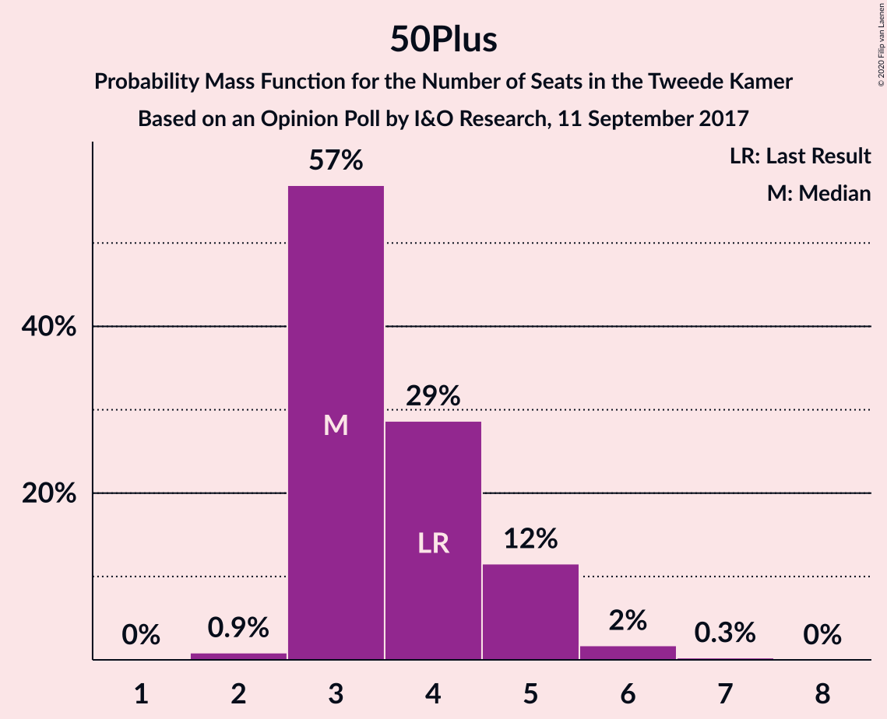
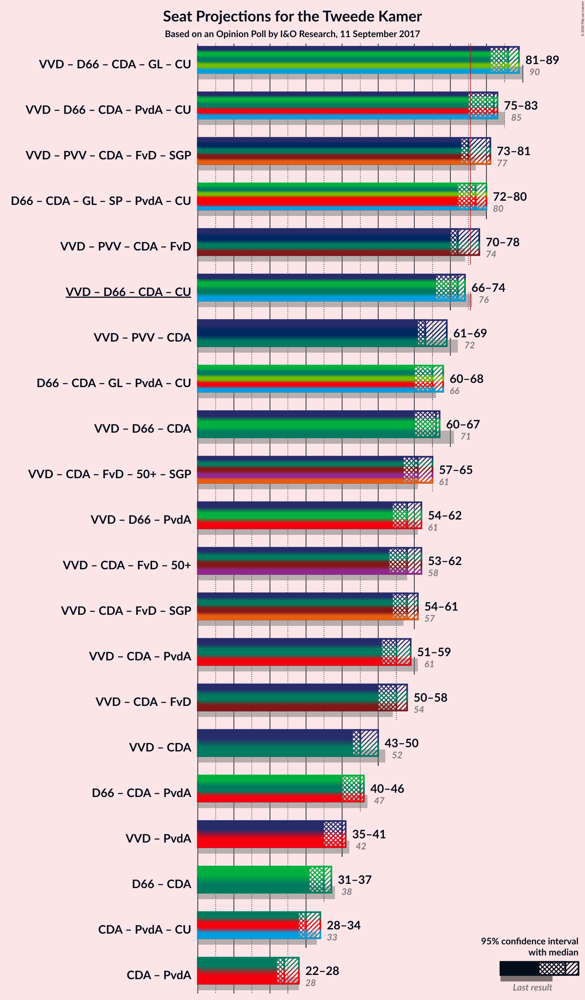
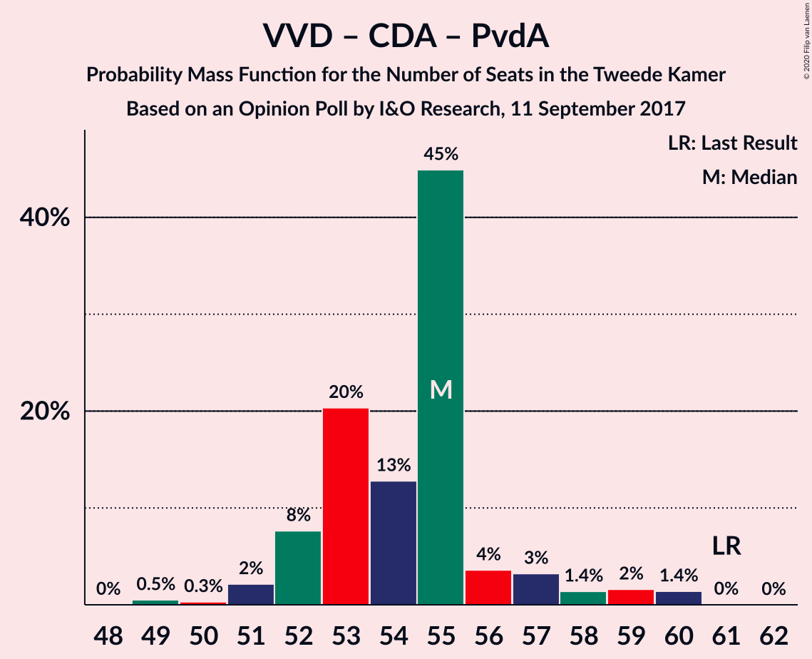

# Opinion Poll by I&O Research, 11 September 2017

<a href="#voting-intentions">Voting Intentions</a> | <a href="#seats">Seats</a> | <a href="#coalitions">Coalitions</a> | <a href="#technical-information">Technical Information</a>

## Voting Intentions

### Confidence Intervals

| Party | Last Result | Poll Result | 80% Confidence Interval | 90% Confidence Interval | 95% Confidence Interval | 99% Confidence Interval |
|:-----:|:-----------:|:-----------:|:-----------------------:|:-----------------------:|:-----------------------:|:-----------------------:|
| Volkspartij voor Vrijheid en Democratie | 21.3% | 19.5% | 18.2–20.9% |17.8–21.4% |17.5–21.7% |16.8–22.4% |
| Partij voor de Vrijheid | 13.1% | 12.8% | 11.7–14.0% |11.4–14.4% |11.1–14.7% |10.6–15.3% |
| Democraten 66 | 12.2% | 12.0% | 10.9–13.2% |10.6–13.6% |10.4–13.9% |9.9–14.5% |
| Christen-Democratisch Appèl | 12.4% | 10.4% | 9.4–11.5% |9.1–11.9% |8.9–12.1% |8.4–12.7% |
| GroenLinks | 9.1% | 9.7% | 8.7–10.8% |8.5–11.1% |8.2–11.4% |7.8–12.0% |
| Socialistische Partij | 9.1% | 7.9% | 7.0–8.9% |6.8–9.2% |6.6–9.5% |6.2–10.0% |
| Partij van de Arbeid | 5.7% | 6.0% | 5.2–6.9% |5.0–7.1% |4.8–7.4% |4.5–7.8% |
| Forum voor Democratie | 1.8% | 5.9% | 5.2–6.8% |4.9–7.1% |4.8–7.3% |4.4–7.8% |
| ChristenUnie | 3.4% | 4.3% | 3.7–5.1% |3.5–5.4% |3.4–5.6% |3.1–6.0% |
| Partij voor de Dieren | 3.2% | 4.1% | 3.5–4.9% |3.3–5.1% |3.2–5.3% |2.9–5.7% |
| 50Plus | 3.1% | 2.8% | 2.3–3.4% |2.1–3.6% |2.0–3.8% |1.8–4.1% |
| Staatkundig Gereformeerde Partij | 2.1% | 2.2% | 1.7–2.8% |1.6–2.9% |1.5–3.1% |1.3–3.4% |
| DENK | 2.1% | 1.8% | 1.4–2.4% |1.3–2.5% |1.2–2.7% |1.0–3.0% |

*Note:* The poll result column reflects the actual value used in the calculations. Published results may vary slightly, and in addition be rounded to fewer digits.

## Seats

### Confidence Intervals

| Party | Last Result | Median | 80% Confidence Interval | 90% Confidence Interval | 95% Confidence Interval | 99% Confidence Interval |
|:-----:|:-----------:|:------:|:-----------------------:|:-----------------------:|:-----------------------:|:-----------------------:|
| <a href="#volkspartij-voor-vrijheid-en-democratie">Volkspartij voor Vrijheid en Democratie</a> | 33 | 31 | 30–32 |29–32 |28–32 |26–33 |
| <a href="#partij-voor-de-vrijheid">Partij voor de Vrijheid</a> | 20 | 20 | 19–22 |18–22 |18–22 |17–22 |
| <a href="#democraten-66">Democraten 66</a> | 19 | 17 | 17–19 |17–21 |17–22 |15–23 |
| <a href="#christen-democratisch-appèl">Christen-Democratisch Appèl</a> | 19 | 15 | 15–17 |13–17 |13–17 |12–18 |
| <a href="#groenlinks">GroenLinks</a> | 14 | 15 | 14–16 |13–16 |13–18 |12–18 |
| <a href="#socialistische-partij">Socialistische Partij</a> | 14 | 12 | 12–13 |11–13 |10–15 |9–15 |
| <a href="#partij-van-de-arbeid">Partij van de Arbeid</a> | 9 | 9 | 8–10 |8–10 |8–10 |7–11 |
| <a href="#forum-voor-democratie">Forum voor Democratie</a> | 2 | 9 | 7–10 |7–10 |7–11 |6–11 |
| <a href="#christenunie">ChristenUnie</a> | 5 | 5 | 5–7 |5–7 |5–8 |4–9 |
| <a href="#partij-voor-de-dieren">Partij voor de Dieren</a> | 5 | 4 | 3–6 |3–7 |3–8 |3–8 |
| <a href="#50plus">50Plus</a> | 4 | 4 | 3–5 |3–5 |2–5 |2–5 |
| <a href="#staatkundig-gereformeerde-partij">Staatkundig Gereformeerde Partij</a> | 3 | 3 | 3–4 |3–4 |2–4 |2–5 |
| <a href="#denk">DENK</a> | 3 | 3 | 2–3 |1–3 |1–4 |1–4 |

### Volkspartij voor Vrijheid en Democratie

*For a full overview of the results for this party, see the [Volkspartij voor Vrijheid en Democratie](party-volkspartijvoorvrijheidendemocratie.html) page.*

| Number of Seats | Probability | Accumulated | Special Marks |
|:---------------:|:-----------:|:-----------:|:-------------:|
| 25 | 0.2% | 100% |  |
| 26 | 1.0% | 99.8% |  |
| 27 | 0.3% | 98.8% |  |
| 28 | 2% | 98% |  |
| 29 | 3% | 97% |  |
| 30 | 39% | 93% |  |
| 31 | 45% | 55% | Median |
| 32 | 8% | 10% |  |
| 33 | 2% | 2% | Last Result |
| 34 | 0.1% | 0.2% |  |
| 35 | 0% | 0.1% |  |
| 36 | 0% | 0% |  |

### Partij voor de Vrijheid

*For a full overview of the results for this party, see the [Partij voor de Vrijheid](party-partijvoordevrijheid.html) page.*

| Number of Seats | Probability | Accumulated | Special Marks |
|:---------------:|:-----------:|:-----------:|:-------------:|
| 15 | 0.1% | 100% |  |
| 16 | 0.1% | 99.9% |  |
| 17 | 2% | 99.8% |  |
| 18 | 5% | 98% |  |
| 19 | 6% | 93% |  |
| 20 | 46% | 86% | Last Result, Median |
| 21 | 5% | 40% |  |
| 22 | 35% | 35% |  |
| 23 | 0.1% | 0.2% |  |
| 24 | 0.1% | 0.1% |  |
| 25 | 0% | 0% |  |

### Democraten 66

*For a full overview of the results for this party, see the [Democraten 66](party-democraten66.html) page.*

| Number of Seats | Probability | Accumulated | Special Marks |
|:---------------:|:-----------:|:-----------:|:-------------:|
| 14 | 0.3% | 100% |  |
| 15 | 0.5% | 99.7% |  |
| 16 | 1.0% | 99.2% |  |
| 17 | 49% | 98% | Median |
| 18 | 7% | 49% |  |
| 19 | 37% | 42% | Last Result |
| 20 | 0.4% | 6% |  |
| 21 | 0.4% | 5% |  |
| 22 | 4% | 5% |  |
| 23 | 0.9% | 0.9% |  |
| 24 | 0% | 0% |  |

### Christen-Democratisch Appèl

*For a full overview of the results for this party, see the [Christen-Democratisch Appèl](party-christen-democratischappèl.html) page.*

| Number of Seats | Probability | Accumulated | Special Marks |
|:---------------:|:-----------:|:-----------:|:-------------:|
| 12 | 0.5% | 100% |  |
| 13 | 6% | 99.5% |  |
| 14 | 1.5% | 93% |  |
| 15 | 46% | 91% | Median |
| 16 | 7% | 46% |  |
| 17 | 37% | 39% |  |
| 18 | 2% | 2% |  |
| 19 | 0.3% | 0.3% | Last Result |
| 20 | 0% | 0% |  |

### GroenLinks

*For a full overview of the results for this party, see the [GroenLinks](party-groenlinks.html) page.*

| Number of Seats | Probability | Accumulated | Special Marks |
|:---------------:|:-----------:|:-----------:|:-------------:|
| 11 | 0.1% | 100% |  |
| 12 | 2% | 99.9% |  |
| 13 | 4% | 98% |  |
| 14 | 38% | 94% | Last Result |
| 15 | 45% | 56% | Median |
| 16 | 7% | 11% |  |
| 17 | 0.4% | 4% |  |
| 18 | 4% | 4% |  |
| 19 | 0% | 0.1% |  |
| 20 | 0% | 0% |  |

### Socialistische Partij

*For a full overview of the results for this party, see the [Socialistische Partij](party-socialistischepartij.html) page.*

| Number of Seats | Probability | Accumulated | Special Marks |
|:---------------:|:-----------:|:-----------:|:-------------:|
| 9 | 2% | 100% |  |
| 10 | 1.4% | 98% |  |
| 11 | 3% | 97% |  |
| 12 | 45% | 94% | Median |
| 13 | 45% | 49% |  |
| 14 | 1.3% | 4% | Last Result |
| 15 | 3% | 3% |  |
| 16 | 0% | 0% |  |

### Partij van de Arbeid

*For a full overview of the results for this party, see the [Partij van de Arbeid](party-partijvandearbeid.html) page.*

| Number of Seats | Probability | Accumulated | Special Marks |
|:---------------:|:-----------:|:-----------:|:-------------:|
| 5 | 0.1% | 100% |  |
| 6 | 0.2% | 99.9% |  |
| 7 | 0.6% | 99.7% |  |
| 8 | 48% | 99.1% |  |
| 9 | 9% | 52% | Last Result, Median |
| 10 | 42% | 42% |  |
| 11 | 0.6% | 0.6% |  |
| 12 | 0% | 0.1% |  |
| 13 | 0% | 0% |  |

### Forum voor Democratie

*For a full overview of the results for this party, see the [Forum voor Democratie](party-forumvoordemocratie.html) page.*

| Number of Seats | Probability | Accumulated | Special Marks |
|:---------------:|:-----------:|:-----------:|:-------------:|
| 2 | 0% | 100% | Last Result |
| 3 | 0% | 100% |  |
| 4 | 0% | 100% |  |
| 5 | 0% | 100% |  |
| 6 | 2% | 100% |  |
| 7 | 10% | 98% |  |
| 8 | 5% | 89% |  |
| 9 | 37% | 84% | Median |
| 10 | 44% | 46% |  |
| 11 | 2% | 3% |  |
| 12 | 0.1% | 0.1% |  |
| 13 | 0% | 0% |  |

### ChristenUnie

*For a full overview of the results for this party, see the [ChristenUnie](party-christenunie.html) page.*

| Number of Seats | Probability | Accumulated | Special Marks |
|:---------------:|:-----------:|:-----------:|:-------------:|
| 4 | 1.3% | 100% |  |
| 5 | 76% | 98.6% | Last Result, Median |
| 6 | 10% | 22% |  |
| 7 | 8% | 12% |  |
| 8 | 3% | 4% |  |
| 9 | 1.2% | 1.3% |  |
| 10 | 0% | 0% |  |

### Partij voor de Dieren

*For a full overview of the results for this party, see the [Partij voor de Dieren](party-partijvoordedieren.html) page.*

| Number of Seats | Probability | Accumulated | Special Marks |
|:---------------:|:-----------:|:-----------:|:-------------:|
| 3 | 35% | 100% |  |
| 4 | 42% | 65% | Median |
| 5 | 8% | 24% | Last Result |
| 6 | 6% | 16% |  |
| 7 | 6% | 10% |  |
| 8 | 3% | 3% |  |
| 9 | 0.1% | 0.1% |  |
| 10 | 0% | 0% |  |

### 50Plus

*For a full overview of the results for this party, see the [50Plus](party-50plus.html) page.*

| Number of Seats | Probability | Accumulated | Special Marks |
|:---------------:|:-----------:|:-----------:|:-------------:|
| 2 | 4% | 100% |  |
| 3 | 8% | 96% |  |
| 4 | 43% | 88% | Last Result, Median |
| 5 | 45% | 45% |  |
| 6 | 0.3% | 0.3% |  |
| 7 | 0% | 0% |  |

### Staatkundig Gereformeerde Partij

*For a full overview of the results for this party, see the [Staatkundig Gereformeerde Partij](party-staatkundiggereformeerdepartij.html) page.*

| Number of Seats | Probability | Accumulated | Special Marks |
|:---------------:|:-----------:|:-----------:|:-------------:|
| 1 | 0.2% | 100% |  |
| 2 | 4% | 99.8% |  |
| 3 | 85% | 96% | Last Result, Median |
| 4 | 9% | 11% |  |
| 5 | 1.4% | 1.5% |  |
| 6 | 0.1% | 0.1% |  |
| 7 | 0% | 0% |  |

### DENK

*For a full overview of the results for this party, see the [DENK](party-denk.html) page.*

| Number of Seats | Probability | Accumulated | Special Marks |
|:---------------:|:-----------:|:-----------:|:-------------:|
| 1 | 10% | 100% |  |
| 2 | 39% | 90% |  |
| 3 | 48% | 51% | Last Result, Median |
| 4 | 3% | 3% |  |
| 5 | 0.2% | 0.2% |  |
| 6 | 0% | 0% |  |

## Coalitions

### Confidence Intervals

| Coalition | Last Result | Median | Majority? | 80% Confidence Interval | 90% Confidence Interval | 95% Confidence Interval | 99% Confidence Interval |
|:---------:|:-----------:|:------:|:---------:|:-----------------------:|:-----------------------:|:-----------------------:|:-----------------------:|
| Volkspartij voor Vrijheid en Democratie – Democraten 66 – Christen-Democratisch Appèl – GroenLinks – ChristenUnie | 90 | 84 | 100% | 83–87 | 82–89 | 81–90 | 81–90 |
| Volkspartij voor Vrijheid en Democratie – Democraten 66 – Christen-Democratisch Appèl – Partij van de Arbeid – ChristenUnie | 85 | 79 | 99.6% | 76–81 | 76–82 | 76–83 | 76–83 |
| Volkspartij voor Vrijheid en Democratie – Partij voor de Vrijheid – Christen-Democratisch Appèl – Forum voor Democratie – Staatkundig Gereformeerde Partij | 77 | 79 | 92% | 76–81 | 75–81 | 73–81 | 69–81 |
| Democraten 66 – Christen-Democratisch Appèl – GroenLinks – Socialistische Partij – Partij van de Arbeid – ChristenUnie | 80 | 76 | 53% | 73–77 | 73–78 | 73–79 | 70–82 |
| Volkspartij voor Vrijheid en Democratie – Partij voor de Vrijheid – Christen-Democratisch Appèl – Forum voor Democratie | 74 | 76 | 78% | 72–78 | 71–78 | 69–78 | 67–78 |
| Volkspartij voor Vrijheid en Democratie – Democraten 66 – Christen-Democratisch Appèl – ChristenUnie | 76 | 70 | 0.2% | 68–72 | 68–73 | 68–74 | 66–74 |
| Volkspartij voor Vrijheid en Democratie – Partij voor de Vrijheid – Christen-Democratisch Appèl | 72 | 66 | 0% | 64–69 | 64–69 | 60–69 | 59–69 |
| Volkspartij voor Vrijheid en Democratie – Democraten 66 – Christen-Democratisch Appèl | 71 | 64 | 0% | 63–66 | 61–66 | 61–68 | 59–68 |
| Democraten 66 – Christen-Democratisch Appèl – GroenLinks – Partij van de Arbeid – ChristenUnie | 66 | 63 | 0% | 60–66 | 60–67 | 59–67 | 59–68 |
| Volkspartij voor Vrijheid en Democratie – Christen-Democratisch Appèl – Forum voor Democratie – 50Plus – Staatkundig Gereformeerde Partij | 61 | 63 | 0% | 60–64 | 59–64 | 58–65 | 54–65 |
| Volkspartij voor Vrijheid en Democratie – Christen-Democratisch Appèl – Forum voor Democratie – 50Plus | 58 | 60 | 0% | 56–61 | 54–61 | 54–61 | 52–62 |
| Volkspartij voor Vrijheid en Democratie – Christen-Democratisch Appèl – Forum voor Democratie – Staatkundig Gereformeerde Partij | 57 | 59 | 0% | 57–59 | 55–59 | 55–60 | 51–61 |
| Volkspartij voor Vrijheid en Democratie – Democraten 66 – Partij van de Arbeid | 61 | 58 | 0% | 56–59 | 56–60 | 54–60 | 52–60 |
| Volkspartij voor Vrijheid en Democratie – Christen-Democratisch Appèl – Partij van de Arbeid | 61 | 54 | 0% | 54–57 | 53–57 | 51–57 | 50–59 |
| Volkspartij voor Vrijheid en Democratie – Christen-Democratisch Appèl – Forum voor Democratie | 54 | 56 | 0% | 53–56 | 51–56 | 50–57 | 49–57 |
| Volkspartij voor Vrijheid en Democratie – Christen-Democratisch Appèl | 52 | 46 | 0% | 45–47 | 44–48 | 42–48 | 41–50 |
| Democraten 66 – Christen-Democratisch Appèl – Partij van de Arbeid | 47 | 41 | 0% | 40–46 | 40–46 | 40–46 | 39–47 |
| Volkspartij voor Vrijheid en Democratie – Partij van de Arbeid | 42 | 39 | 0% | 39–41 | 38–41 | 36–42 | 35–42 |
| Democraten 66 – Christen-Democratisch Appèl | 38 | 33 | 0% | 32–36 | 30–36 | 30–38 | 30–38 |
| Christen-Democratisch Appèl – Partij van de Arbeid – ChristenUnie | 33 | 30 | 0% | 28–32 | 28–32 | 28–33 | 28–35 |
| Christen-Democratisch Appèl – Partij van de Arbeid | 28 | 23 | 0% | 23–27 | 23–27 | 23–27 | 22–27 |

### Volkspartij voor Vrijheid en Democratie – Democraten 66 – Christen-Democratisch Appèl – GroenLinks – ChristenUnie

| Number of Seats | Probability | Accumulated | Special Marks |
|:---------------:|:-----------:|:-----------:|:-------------:|
| 77 | 0.2% | 100% |  |
| 78 | 0% | 99.8% |  |
| 79 | 0% | 99.8% |  |
| 80 | 0.1% | 99.8% |  |
| 81 | 3% | 99.7% |  |
| 82 | 2% | 96% |  |
| 83 | 40% | 94% | Median |
| 84 | 5% | 53% |  |
| 85 | 36% | 49% |  |
| 86 | 1.2% | 12% |  |
| 87 | 1.2% | 11% |  |
| 88 | 2% | 10% |  |
| 89 | 3% | 7% |  |
| 90 | 4% | 5% | Last Result |
| 91 | 0.1% | 0.3% |  |
| 92 | 0% | 0.1% |  |
| 93 | 0% | 0.1% |  |
| 94 | 0% | 0.1% |  |
| 95 | 0.1% | 0.1% |  |
| 96 | 0% | 0% |  |

### Volkspartij voor Vrijheid en Democratie – Democraten 66 – Christen-Democratisch Appèl – Partij van de Arbeid – ChristenUnie

| Number of Seats | Probability | Accumulated | Special Marks |
|:---------------:|:-----------:|:-----------:|:-------------:|
| 71 | 0.2% | 100% |  |
| 72 | 0% | 99.8% |  |
| 73 | 0% | 99.8% |  |
| 74 | 0.1% | 99.8% |  |
| 75 | 0.1% | 99.7% |  |
| 76 | 42% | 99.6% | Majority |
| 77 | 1.3% | 57% | Median |
| 78 | 6% | 56% |  |
| 79 | 3% | 50% |  |
| 80 | 4% | 47% |  |
| 81 | 37% | 43% |  |
| 82 | 3% | 6% |  |
| 83 | 3% | 3% |  |
| 84 | 0.1% | 0.2% |  |
| 85 | 0.1% | 0.2% | Last Result |
| 86 | 0.1% | 0.1% |  |
| 87 | 0% | 0% |  |

### Volkspartij voor Vrijheid en Democratie – Partij voor de Vrijheid – Christen-Democratisch Appèl – Forum voor Democratie – Staatkundig Gereformeerde Partij

| Number of Seats | Probability | Accumulated | Special Marks |
|:---------------:|:-----------:|:-----------:|:-------------:|
| 69 | 1.2% | 100% |  |
| 70 | 0% | 98.8% |  |
| 71 | 0% | 98.8% |  |
| 72 | 0.2% | 98.7% |  |
| 73 | 2% | 98.5% |  |
| 74 | 2% | 97% |  |
| 75 | 3% | 95% |  |
| 76 | 3% | 92% | Majority |
| 77 | 1.3% | 89% | Last Result |
| 78 | 9% | 87% | Median |
| 79 | 44% | 79% |  |
| 80 | 0.3% | 35% |  |
| 81 | 35% | 35% |  |
| 82 | 0% | 0.2% |  |
| 83 | 0.2% | 0.2% |  |
| 84 | 0% | 0% |  |

### Democraten 66 – Christen-Democratisch Appèl – GroenLinks – Socialistische Partij – Partij van de Arbeid – ChristenUnie

| Number of Seats | Probability | Accumulated | Special Marks |
|:---------------:|:-----------:|:-----------:|:-------------:|
| 68 | 0.1% | 100% |  |
| 69 | 0% | 99.9% |  |
| 70 | 2% | 99.9% |  |
| 71 | 0% | 98% |  |
| 72 | 0.1% | 98% |  |
| 73 | 41% | 98% | Median |
| 74 | 3% | 57% |  |
| 75 | 2% | 55% |  |
| 76 | 6% | 53% | Majority |
| 77 | 38% | 46% |  |
| 78 | 5% | 9% |  |
| 79 | 3% | 4% |  |
| 80 | 0.1% | 1.0% | Last Result |
| 81 | 0% | 0.9% |  |
| 82 | 0.8% | 0.9% |  |
| 83 | 0% | 0% |  |

### Volkspartij voor Vrijheid en Democratie – Partij voor de Vrijheid – Christen-Democratisch Appèl – Forum voor Democratie

| Number of Seats | Probability | Accumulated | Special Marks |
|:---------------:|:-----------:|:-----------:|:-------------:|
| 66 | 0.4% | 100% |  |
| 67 | 0.8% | 99.6% |  |
| 68 | 1.2% | 98.8% |  |
| 69 | 0.2% | 98% |  |
| 70 | 0.3% | 97% |  |
| 71 | 3% | 97% |  |
| 72 | 5% | 94% |  |
| 73 | 0.4% | 89% |  |
| 74 | 3% | 89% | Last Result |
| 75 | 8% | 86% | Median |
| 76 | 43% | 78% | Majority |
| 77 | 0.4% | 35% |  |
| 78 | 35% | 35% |  |
| 79 | 0.1% | 0.2% |  |
| 80 | 0% | 0% |  |

### Volkspartij voor Vrijheid en Democratie – Democraten 66 – Christen-Democratisch Appèl – ChristenUnie

| Number of Seats | Probability | Accumulated | Special Marks |
|:---------------:|:-----------:|:-----------:|:-------------:|
| 62 | 0.2% | 100% |  |
| 63 | 0% | 99.8% |  |
| 64 | 0.1% | 99.8% |  |
| 65 | 0% | 99.7% |  |
| 66 | 0.4% | 99.7% |  |
| 67 | 2% | 99.4% |  |
| 68 | 46% | 98% | Median |
| 69 | 0.3% | 51% |  |
| 70 | 3% | 51% |  |
| 71 | 36% | 48% |  |
| 72 | 6% | 12% |  |
| 73 | 1.5% | 6% |  |
| 74 | 4% | 5% |  |
| 75 | 0% | 0.2% |  |
| 76 | 0% | 0.2% | Last Result, Majority |
| 77 | 0% | 0.1% |  |
| 78 | 0.1% | 0.1% |  |
| 79 | 0% | 0% |  |

### Volkspartij voor Vrijheid en Democratie – Partij voor de Vrijheid – Christen-Democratisch Appèl

| Number of Seats | Probability | Accumulated | Special Marks |
|:---------------:|:-----------:|:-----------:|:-------------:|
| 59 | 1.3% | 100% |  |
| 60 | 1.3% | 98.7% |  |
| 61 | 0.4% | 97% |  |
| 62 | 1.1% | 97% |  |
| 63 | 0.7% | 96% |  |
| 64 | 6% | 95% |  |
| 65 | 5% | 90% |  |
| 66 | 42% | 84% | Median |
| 67 | 2% | 42% |  |
| 68 | 4% | 40% |  |
| 69 | 36% | 36% |  |
| 70 | 0.2% | 0.2% |  |
| 71 | 0% | 0% |  |
| 72 | 0% | 0% | Last Result |

### Volkspartij voor Vrijheid en Democratie – Democraten 66 – Christen-Democratisch Appèl

| Number of Seats | Probability | Accumulated | Special Marks |
|:---------------:|:-----------:|:-----------:|:-------------:|
| 56 | 0.1% | 100% |  |
| 57 | 0% | 99.9% |  |
| 58 | 0.3% | 99.9% |  |
| 59 | 0.6% | 99.6% |  |
| 60 | 1.4% | 99.0% |  |
| 61 | 3% | 98% |  |
| 62 | 2% | 94% |  |
| 63 | 41% | 92% | Median |
| 64 | 4% | 51% |  |
| 65 | 5% | 47% |  |
| 66 | 37% | 42% |  |
| 67 | 0.2% | 5% |  |
| 68 | 4% | 4% |  |
| 69 | 0.1% | 0.2% |  |
| 70 | 0% | 0.2% |  |
| 71 | 0.1% | 0.1% | Last Result |
| 72 | 0% | 0% |  |

### Democraten 66 – Christen-Democratisch Appèl – GroenLinks – Partij van de Arbeid – ChristenUnie

| Number of Seats | Probability | Accumulated | Special Marks |
|:---------------:|:-----------:|:-----------:|:-------------:|
| 58 | 0.1% | 100% |  |
| 59 | 4% | 99.9% |  |
| 60 | 40% | 96% |  |
| 61 | 2% | 56% | Median |
| 62 | 1.0% | 54% |  |
| 63 | 4% | 53% |  |
| 64 | 2% | 50% |  |
| 65 | 38% | 48% |  |
| 66 | 5% | 11% | Last Result |
| 67 | 4% | 5% |  |
| 68 | 1.1% | 1.3% |  |
| 69 | 0% | 0.2% |  |
| 70 | 0.2% | 0.2% |  |
| 71 | 0% | 0% |  |

### Volkspartij voor Vrijheid en Democratie – Christen-Democratisch Appèl – Forum voor Democratie – 50Plus – Staatkundig Gereformeerde Partij

| Number of Seats | Probability | Accumulated | Special Marks |
|:---------------:|:-----------:|:-----------:|:-------------:|
| 54 | 0.8% | 100% |  |
| 55 | 0.5% | 99.2% |  |
| 56 | 0% | 98.7% |  |
| 57 | 0.2% | 98.7% |  |
| 58 | 3% | 98% |  |
| 59 | 5% | 95% |  |
| 60 | 4% | 90% |  |
| 61 | 3% | 87% | Last Result |
| 62 | 2% | 84% | Median |
| 63 | 37% | 82% |  |
| 64 | 43% | 46% |  |
| 65 | 2% | 3% |  |
| 66 | 0.1% | 0.3% |  |
| 67 | 0% | 0.2% |  |
| 68 | 0.1% | 0.2% |  |
| 69 | 0.1% | 0.2% |  |
| 70 | 0% | 0% |  |

### Volkspartij voor Vrijheid en Democratie – Christen-Democratisch Appèl – Forum voor Democratie – 50Plus

| Number of Seats | Probability | Accumulated | Special Marks |
|:---------------:|:-----------:|:-----------:|:-------------:|
| 52 | 1.2% | 100% |  |
| 53 | 0.2% | 98.7% |  |
| 54 | 4% | 98.5% |  |
| 55 | 0.2% | 94% |  |
| 56 | 6% | 94% |  |
| 57 | 2% | 88% |  |
| 58 | 1.0% | 86% | Last Result |
| 59 | 2% | 85% | Median |
| 60 | 39% | 83% |  |
| 61 | 42% | 44% |  |
| 62 | 2% | 2% |  |
| 63 | 0.1% | 0.4% |  |
| 64 | 0.1% | 0.2% |  |
| 65 | 0.1% | 0.2% |  |
| 66 | 0% | 0% |  |

### Volkspartij voor Vrijheid en Democratie – Christen-Democratisch Appèl – Forum voor Democratie – Staatkundig Gereformeerde Partij

| Number of Seats | Probability | Accumulated | Special Marks |
|:---------------:|:-----------:|:-----------:|:-------------:|
| 51 | 1.3% | 100% |  |
| 52 | 0% | 98.7% |  |
| 53 | 0.2% | 98.6% |  |
| 54 | 0.2% | 98% |  |
| 55 | 4% | 98% |  |
| 56 | 1.3% | 94% |  |
| 57 | 9% | 93% | Last Result |
| 58 | 0.5% | 83% | Median |
| 59 | 78% | 83% |  |
| 60 | 4% | 5% |  |
| 61 | 0.4% | 0.7% |  |
| 62 | 0.1% | 0.3% |  |
| 63 | 0.1% | 0.2% |  |
| 64 | 0.1% | 0.2% |  |
| 65 | 0% | 0% |  |

### Volkspartij voor Vrijheid en Democratie – Democraten 66 – Partij van de Arbeid

| Number of Seats | Probability | Accumulated | Special Marks |
|:---------------:|:-----------:|:-----------:|:-------------:|
| 51 | 0.3% | 100% |  |
| 52 | 0.2% | 99.7% |  |
| 53 | 2% | 99.5% |  |
| 54 | 1.1% | 98% |  |
| 55 | 1.2% | 97% |  |
| 56 | 40% | 96% |  |
| 57 | 1.4% | 56% | Median |
| 58 | 9% | 54% |  |
| 59 | 39% | 45% |  |
| 60 | 6% | 7% |  |
| 61 | 0.1% | 0.3% | Last Result |
| 62 | 0.1% | 0.2% |  |
| 63 | 0% | 0.1% |  |
| 64 | 0% | 0% |  |

### Volkspartij voor Vrijheid en Democratie – Christen-Democratisch Appèl – Partij van de Arbeid

| Number of Seats | Probability | Accumulated | Special Marks |
|:---------------:|:-----------:|:-----------:|:-------------:|
| 49 | 0% | 100% |  |
| 50 | 1.2% | 99.9% |  |
| 51 | 3% | 98.8% |  |
| 52 | 0.3% | 95% |  |
| 53 | 0.5% | 95% |  |
| 54 | 46% | 95% |  |
| 55 | 6% | 49% | Median |
| 56 | 2% | 42% |  |
| 57 | 39% | 40% |  |
| 58 | 0.2% | 2% |  |
| 59 | 2% | 2% |  |
| 60 | 0% | 0.1% |  |
| 61 | 0% | 0% | Last Result |

### Volkspartij voor Vrijheid en Democratie – Christen-Democratisch Appèl – Forum voor Democratie

| Number of Seats | Probability | Accumulated | Special Marks |
|:---------------:|:-----------:|:-----------:|:-------------:|
| 48 | 0.5% | 100% |  |
| 49 | 1.0% | 99.5% |  |
| 50 | 1.2% | 98.5% |  |
| 51 | 3% | 97% |  |
| 52 | 0.3% | 94% |  |
| 53 | 4% | 94% |  |
| 54 | 4% | 89% | Last Result |
| 55 | 2% | 85% | Median |
| 56 | 79% | 83% |  |
| 57 | 3% | 4% |  |
| 58 | 0.1% | 0.4% |  |
| 59 | 0.2% | 0.3% |  |
| 60 | 0.1% | 0.2% |  |
| 61 | 0% | 0% |  |

### Volkspartij voor Vrijheid en Democratie – Christen-Democratisch Appèl

| Number of Seats | Probability | Accumulated | Special Marks |
|:---------------:|:-----------:|:-----------:|:-------------:|
| 41 | 2% | 100% |  |
| 42 | 1.3% | 98% |  |
| 43 | 1.5% | 97% |  |
| 44 | 4% | 96% |  |
| 45 | 3% | 91% |  |
| 46 | 43% | 88% | Median |
| 47 | 39% | 45% |  |
| 48 | 4% | 6% |  |
| 49 | 0.1% | 2% |  |
| 50 | 2% | 2% |  |
| 51 | 0.2% | 0.2% |  |
| 52 | 0% | 0% | Last Result |

### Democraten 66 – Christen-Democratisch Appèl – Partij van de Arbeid

| Number of Seats | Probability | Accumulated | Special Marks |
|:---------------:|:-----------:|:-----------:|:-------------:|
| 37 | 0.1% | 100% |  |
| 38 | 0.2% | 99.9% |  |
| 39 | 0.5% | 99.7% |  |
| 40 | 47% | 99.2% |  |
| 41 | 3% | 53% | Median |
| 42 | 2% | 49% |  |
| 43 | 4% | 47% |  |
| 44 | 3% | 43% |  |
| 45 | 0.4% | 39% |  |
| 46 | 38% | 39% |  |
| 47 | 0.8% | 0.9% | Last Result |
| 48 | 0% | 0.1% |  |
| 49 | 0.1% | 0.1% |  |
| 50 | 0% | 0% |  |

### Volkspartij voor Vrijheid en Democratie – Partij van de Arbeid

| Number of Seats | Probability | Accumulated | Special Marks |
|:---------------:|:-----------:|:-----------:|:-------------:|
| 34 | 0.4% | 100% |  |
| 35 | 1.0% | 99.6% |  |
| 36 | 1.4% | 98.6% |  |
| 37 | 0.7% | 97% |  |
| 38 | 6% | 97% |  |
| 39 | 41% | 91% |  |
| 40 | 38% | 50% | Median |
| 41 | 8% | 12% |  |
| 42 | 3% | 3% | Last Result |
| 43 | 0% | 0.1% |  |
| 44 | 0% | 0% |  |

### Democraten 66 – Christen-Democratisch Appèl

| Number of Seats | Probability | Accumulated | Special Marks |
|:---------------:|:-----------:|:-----------:|:-------------:|
| 28 | 0.1% | 100% |  |
| 29 | 0.2% | 99.9% |  |
| 30 | 5% | 99.7% |  |
| 31 | 0.5% | 94% |  |
| 32 | 42% | 94% | Median |
| 33 | 6% | 52% |  |
| 34 | 3% | 46% |  |
| 35 | 4% | 43% |  |
| 36 | 35% | 39% |  |
| 37 | 0.1% | 4% |  |
| 38 | 4% | 4% | Last Result |
| 39 | 0% | 0.1% |  |
| 40 | 0% | 0.1% |  |
| 41 | 0% | 0% |  |

### Christen-Democratisch Appèl – Partij van de Arbeid – ChristenUnie

| Number of Seats | Probability | Accumulated | Special Marks |
|:---------------:|:-----------:|:-----------:|:-------------:|
| 26 | 0.1% | 100% |  |
| 27 | 0.4% | 99.9% |  |
| 28 | 41% | 99.5% |  |
| 29 | 2% | 58% | Median |
| 30 | 11% | 56% |  |
| 31 | 6% | 45% |  |
| 32 | 36% | 39% |  |
| 33 | 1.1% | 3% | Last Result |
| 34 | 0.9% | 2% |  |
| 35 | 0.9% | 1.0% |  |
| 36 | 0% | 0.1% |  |
| 37 | 0% | 0% |  |

### Christen-Democratisch Appèl – Partij van de Arbeid

| Number of Seats | Probability | Accumulated | Special Marks |
|:---------------:|:-----------:|:-----------:|:-------------:|
| 20 | 0.4% | 100% |  |
| 21 | 0.1% | 99.6% |  |
| 22 | 2% | 99.5% |  |
| 23 | 49% | 98% |  |
| 24 | 5% | 48% | Median |
| 25 | 5% | 43% |  |
| 26 | 2% | 39% |  |
| 27 | 37% | 37% |  |
| 28 | 0.1% | 0.2% | Last Result |
| 29 | 0.1% | 0.1% |  |
| 30 | 0% | 0% |  |

## Technical Information

### Opinion Poll

+ **Polling firm:** I&O Research
+ **Commissioner(s):** —
+ **Fieldwork period:** 11 September 2017

### Calculations

+ **Sample size:** 1339
+ **Simulations done:** 131,072
+ **Error estimate:** 1.54%

