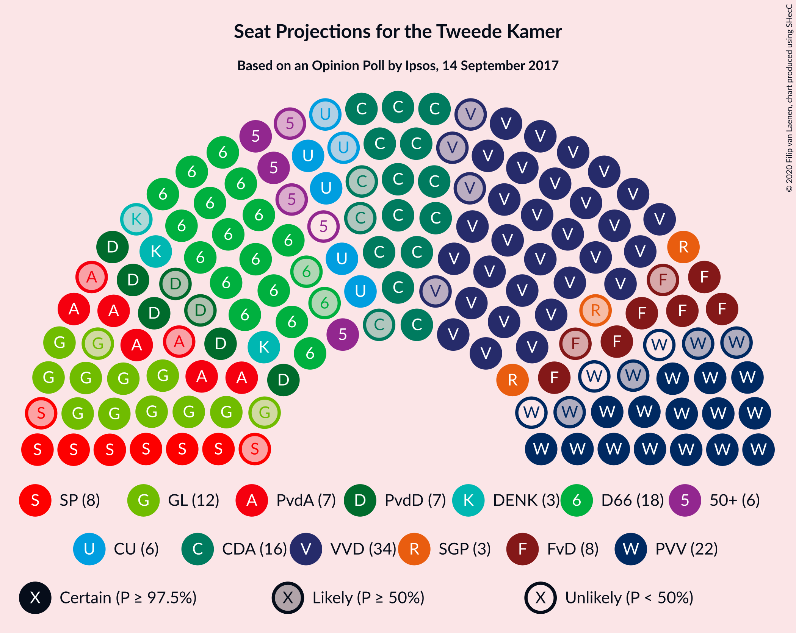
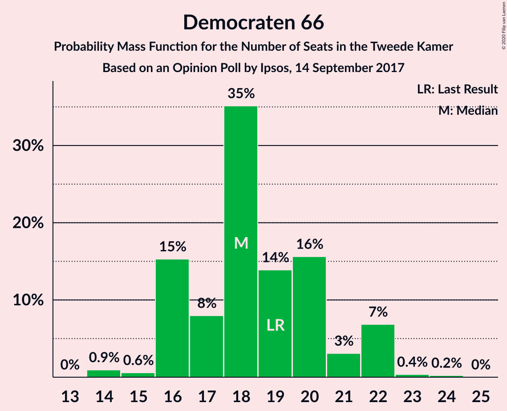
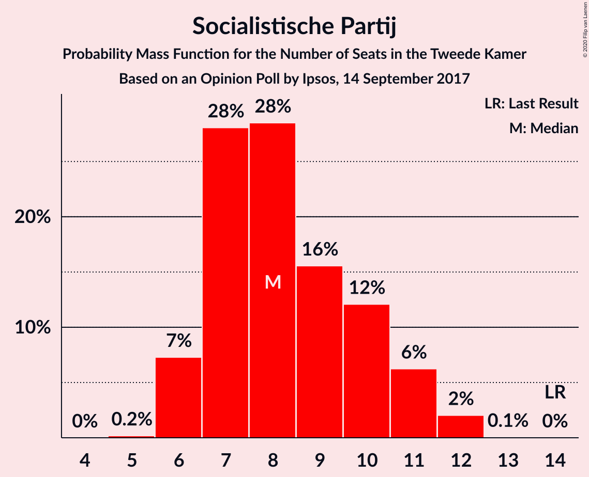
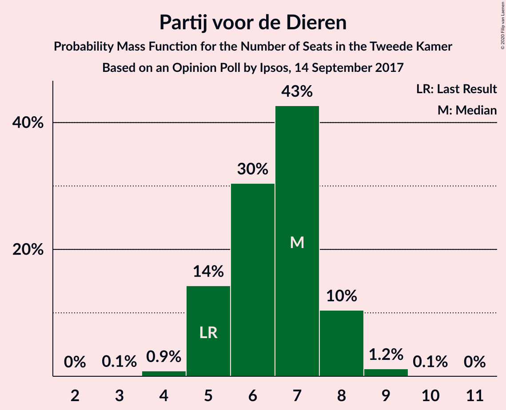
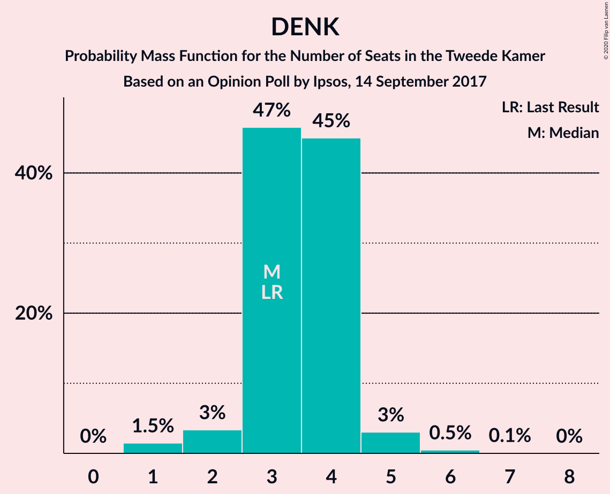
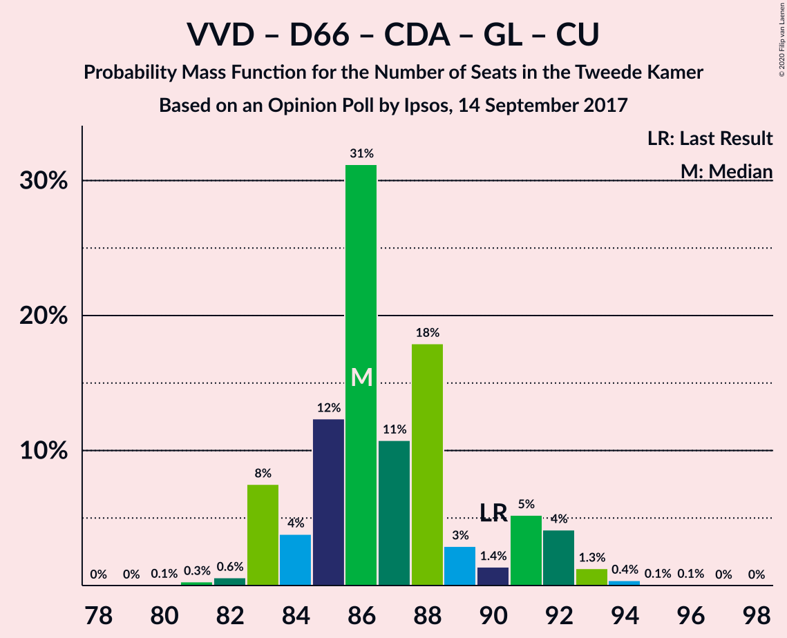
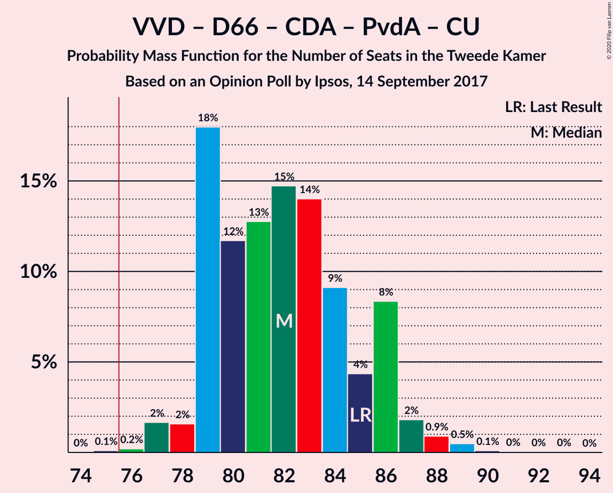
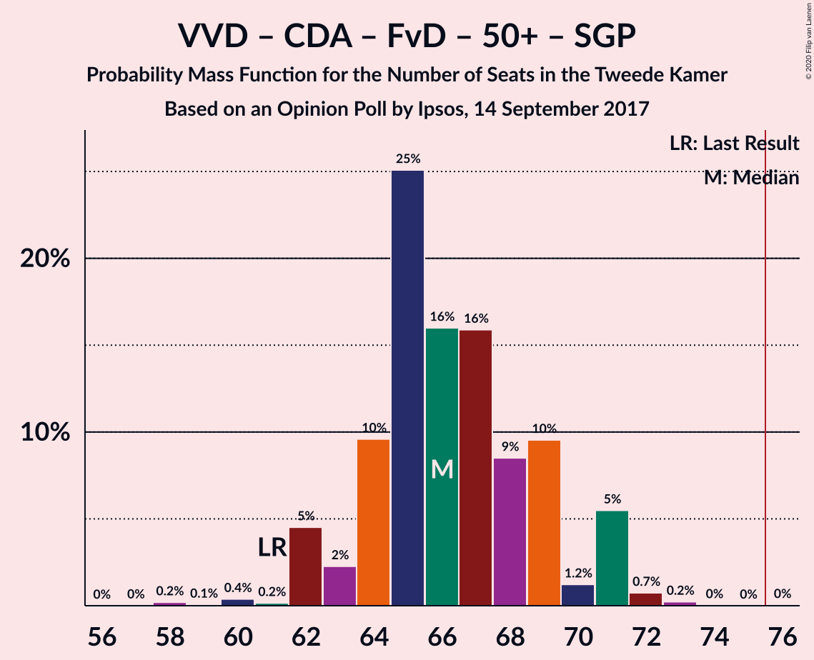
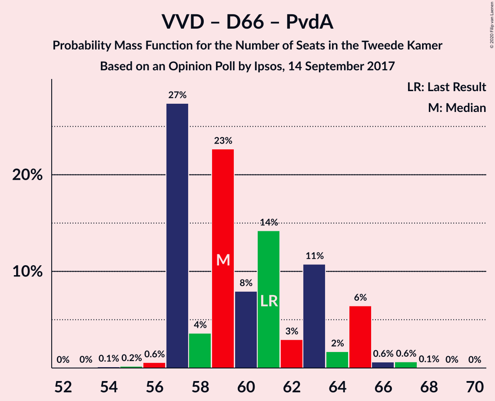
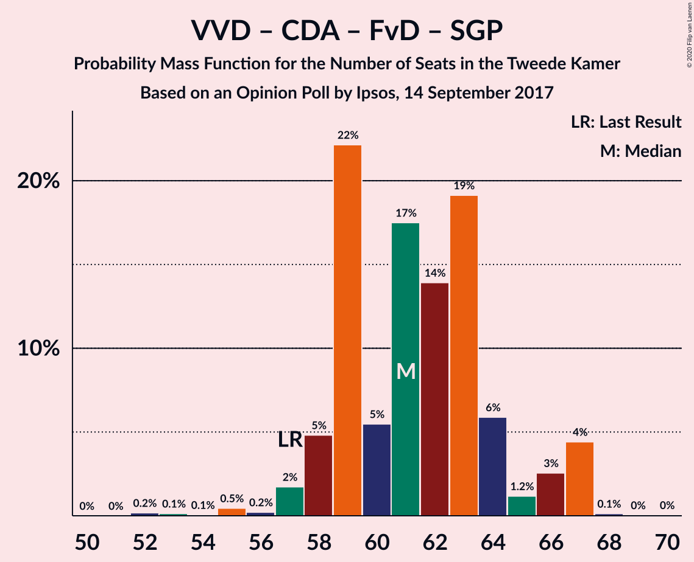

# Opinion Poll by Ipsos, 14 September 2017

<a href="#voting-intentions">Voting Intentions</a> | <a href="#seats">Seats</a> | <a href="#coalitions">Coalitions</a> | <a href="#technical-information">Technical Information</a>

## Voting Intentions

### Confidence Intervals

| Party | Last Result | Poll Result | 80% Confidence Interval | 90% Confidence Interval | 95% Confidence Interval | 99% Confidence Interval |
|:-----:|:-----------:|:-----------:|:-----------------------:|:-----------------------:|:-----------------------:|:-----------------------:|
| Volkspartij voor Vrijheid en Democratie | 21.3% | 22.7% | 21.1–24.5% |20.6–25.0% |20.2–25.4% |19.4–26.3% |
| Democraten 66 | 12.2% | 12.4% | 11.1–13.8% |10.8–14.2% |10.5–14.6% |9.9–15.3% |
| Partij voor de Vrijheid | 13.1% | 12.1% | 10.9–13.5% |10.5–13.9% |10.2–14.3% |9.6–15.0% |
| Christen-Democratisch Appèl | 12.4% | 10.3% | 9.2–11.6% |8.8–12.0% |8.6–12.3% |8.0–13.0% |
| GroenLinks | 9.1% | 8.5% | 7.5–9.7% |7.2–10.1% |6.9–10.4% |6.4–11.0% |
| Socialistische Partij | 9.1% | 5.8% | 5.0–6.9% |4.7–7.2% |4.5–7.4% |4.1–8.0% |
| Forum voor Democratie | 1.8% | 5.6% | 4.8–6.6% |4.5–7.0% |4.3–7.2% |4.0–7.7% |
| Partij van de Arbeid | 5.7% | 5.1% | 4.3–6.1% |4.1–6.4% |3.9–6.6% |3.6–7.2% |
| Partij voor de Dieren | 3.2% | 4.3% | 3.6–5.2% |3.4–5.5% |3.2–5.7% |2.9–6.2% |
| ChristenUnie | 3.4% | 4.0% | 3.3–4.9% |3.1–5.2% |2.9–5.4% |2.7–5.9% |
| 50Plus | 3.1% | 3.3% | 2.7–4.1% |2.5–4.4% |2.4–4.6% |2.1–5.0% |
| DENK | 2.1% | 2.4% | 1.9–3.2% |1.7–3.4% |1.6–3.6% |1.4–3.9% |
| Staatkundig Gereformeerde Partij | 2.1% | 2.1% | 1.6–2.8% |1.5–3.0% |1.4–3.2% |1.2–3.6% |

*Note:* The poll result column reflects the actual value used in the calculations. Published results may vary slightly, and in addition be rounded to fewer digits.

## Seats

### Confidence Intervals

| Party | Last Result | Median | 80% Confidence Interval | 90% Confidence Interval | 95% Confidence Interval | 99% Confidence Interval |
|:-----:|:-----------:|:------:|:-----------------------:|:-----------------------:|:-----------------------:|:-----------------------:|
| <a href="#volkspartij-voor-vrijheid-en-democratie">Volkspartij voor Vrijheid en Democratie</a> | 33 | 34 | 33–38 |32–38 |30–38 |29–39 |
| <a href="#democraten-66">Democraten 66</a> | 19 | 19 | 17–20 |17–21 |16–22 |14–23 |
| <a href="#partij-voor-de-vrijheid">Partij voor de Vrijheid</a> | 20 | 19 | 17–20 |17–21 |16–23 |15–26 |
| <a href="#christen-democratisch-appèl">Christen-Democratisch Appèl</a> | 19 | 17 | 14–18 |13–18 |12–18 |12–20 |
| <a href="#groenlinks">GroenLinks</a> | 14 | 12 | 10–14 |10–14 |10–15 |10–16 |
| <a href="#socialistische-partij">Socialistische Partij</a> | 14 | 9 | 6–9 |6–9 |6–10 |6–11 |
| <a href="#forum-voor-democratie">Forum voor Democratie</a> | 2 | 7 | 6–10 |6–10 |6–11 |6–12 |
| <a href="#partij-van-de-arbeid">Partij van de Arbeid</a> | 9 | 8 | 5–9 |5–10 |5–10 |5–11 |
| <a href="#partij-voor-de-dieren">Partij voor de Dieren</a> | 5 | 7 | 4–7 |4–8 |4–8 |4–10 |
| <a href="#christenunie">ChristenUnie</a> | 5 | 6 | 4–9 |4–9 |4–9 |4–9 |
| <a href="#50plus">50Plus</a> | 4 | 5 | 4–6 |3–6 |3–6 |3–8 |
| <a href="#denk">DENK</a> | 3 | 4 | 3–5 |2–6 |2–6 |2–6 |
| <a href="#staatkundig-gereformeerde-partij">Staatkundig Gereformeerde Partij</a> | 3 | 3 | 2–4 |2–5 |2–5 |1–5 |

### Volkspartij voor Vrijheid en Democratie

*For a full overview of the results for this party, see the [Volkspartij voor Vrijheid en Democratie](party-volkspartijvoorvrijheidendemocratie.html) page.*

| Number of Seats | Probability | Accumulated | Special Marks |
|:---------------:|:-----------:|:-----------:|:-------------:|
| 28 | 0.2% | 100% |  |
| 29 | 2% | 99.7% |  |
| 30 | 1.4% | 98% |  |
| 31 | 2% | 97% |  |
| 32 | 4% | 95% |  |
| 33 | 25% | 91% | Last Result |
| 34 | 28% | 66% | Median |
| 35 | 16% | 38% |  |
| 36 | 0.8% | 22% |  |
| 37 | 9% | 21% |  |
| 38 | 11% | 12% |  |
| 39 | 1.4% | 2% |  |
| 40 | 0.1% | 0.5% |  |
| 41 | 0.3% | 0.3% |  |
| 42 | 0% | 0% |  |

### Democraten 66

*For a full overview of the results for this party, see the [Democraten 66](party-democraten66.html) page.*

| Number of Seats | Probability | Accumulated | Special Marks |
|:---------------:|:-----------:|:-----------:|:-------------:|
| 14 | 2% | 100% |  |
| 15 | 0.4% | 98% |  |
| 16 | 1.5% | 98% |  |
| 17 | 17% | 96% |  |
| 18 | 19% | 80% |  |
| 19 | 29% | 61% | Last Result, Median |
| 20 | 25% | 32% |  |
| 21 | 2% | 7% |  |
| 22 | 3% | 5% |  |
| 23 | 1.1% | 1.2% |  |
| 24 | 0% | 0% |  |

### Partij voor de Vrijheid

*For a full overview of the results for this party, see the [Partij voor de Vrijheid](party-partijvoordevrijheid.html) page.*

| Number of Seats | Probability | Accumulated | Special Marks |
|:---------------:|:-----------:|:-----------:|:-------------:|
| 13 | 0.1% | 100% |  |
| 14 | 0.1% | 99.9% |  |
| 15 | 1.4% | 99.8% |  |
| 16 | 0.9% | 98% |  |
| 17 | 15% | 97% |  |
| 18 | 21% | 83% |  |
| 19 | 47% | 62% | Median |
| 20 | 10% | 15% | Last Result |
| 21 | 2% | 6% |  |
| 22 | 0.8% | 3% |  |
| 23 | 0.2% | 3% |  |
| 24 | 0.1% | 2% |  |
| 25 | 0% | 2% |  |
| 26 | 2% | 2% |  |
| 27 | 0% | 0% |  |

### Christen-Democratisch Appèl

*For a full overview of the results for this party, see the [Christen-Democratisch Appèl](party-christen-democratischappèl.html) page.*

| Number of Seats | Probability | Accumulated | Special Marks |
|:---------------:|:-----------:|:-----------:|:-------------:|
| 11 | 0.1% | 100% |  |
| 12 | 4% | 99.9% |  |
| 13 | 3% | 96% |  |
| 14 | 16% | 94% |  |
| 15 | 3% | 78% |  |
| 16 | 12% | 75% |  |
| 17 | 14% | 63% | Median |
| 18 | 48% | 49% |  |
| 19 | 0.7% | 1.5% | Last Result |
| 20 | 0.7% | 0.8% |  |
| 21 | 0% | 0% |  |

### GroenLinks

*For a full overview of the results for this party, see the [GroenLinks](party-groenlinks.html) page.*

| Number of Seats | Probability | Accumulated | Special Marks |
|:---------------:|:-----------:|:-----------:|:-------------:|
| 8 | 0.2% | 100% |  |
| 9 | 0.2% | 99.8% |  |
| 10 | 23% | 99.6% |  |
| 11 | 6% | 76% |  |
| 12 | 30% | 71% | Median |
| 13 | 20% | 40% |  |
| 14 | 18% | 20% | Last Result |
| 15 | 0.7% | 3% |  |
| 16 | 2% | 2% |  |
| 17 | 0.3% | 0.3% |  |
| 18 | 0% | 0% |  |

### Socialistische Partij

*For a full overview of the results for this party, see the [Socialistische Partij](party-socialistischepartij.html) page.*

| Number of Seats | Probability | Accumulated | Special Marks |
|:---------------:|:-----------:|:-----------:|:-------------:|
| 6 | 27% | 100% |  |
| 7 | 16% | 73% |  |
| 8 | 4% | 57% |  |
| 9 | 49% | 53% | Median |
| 10 | 3% | 4% |  |
| 11 | 0.6% | 1.1% |  |
| 12 | 0.4% | 0.5% |  |
| 13 | 0% | 0.1% |  |
| 14 | 0.1% | 0.1% | Last Result |
| 15 | 0% | 0% |  |

### Forum voor Democratie

*For a full overview of the results for this party, see the [Forum voor Democratie](party-forumvoordemocratie.html) page.*

| Number of Seats | Probability | Accumulated | Special Marks |
|:---------------:|:-----------:|:-----------:|:-------------:|
| 2 | 0% | 100% | Last Result |
| 3 | 0% | 100% |  |
| 4 | 0% | 100% |  |
| 5 | 0.1% | 100% |  |
| 6 | 13% | 99.9% |  |
| 7 | 48% | 86% | Median |
| 8 | 10% | 38% |  |
| 9 | 4% | 28% |  |
| 10 | 20% | 24% |  |
| 11 | 3% | 5% |  |
| 12 | 2% | 2% |  |
| 13 | 0% | 0% |  |

### Partij van de Arbeid

*For a full overview of the results for this party, see the [Partij van de Arbeid](party-partijvandearbeid.html) page.*

| Number of Seats | Probability | Accumulated | Special Marks |
|:---------------:|:-----------:|:-----------:|:-------------:|
| 5 | 12% | 100% |  |
| 6 | 17% | 88% |  |
| 7 | 8% | 72% |  |
| 8 | 17% | 63% | Median |
| 9 | 39% | 47% | Last Result |
| 10 | 6% | 7% |  |
| 11 | 2% | 2% |  |
| 12 | 0.1% | 0.1% |  |
| 13 | 0% | 0% |  |

### Partij voor de Dieren

*For a full overview of the results for this party, see the [Partij voor de Dieren](party-partijvoordedieren.html) page.*

| Number of Seats | Probability | Accumulated | Special Marks |
|:---------------:|:-----------:|:-----------:|:-------------:|
| 3 | 0.4% | 100% |  |
| 4 | 16% | 99.6% |  |
| 5 | 5% | 84% | Last Result |
| 6 | 16% | 80% |  |
| 7 | 55% | 63% | Median |
| 8 | 7% | 9% |  |
| 9 | 1.0% | 1.5% |  |
| 10 | 0.4% | 0.5% |  |
| 11 | 0.1% | 0.1% |  |
| 12 | 0% | 0% |  |

### ChristenUnie

*For a full overview of the results for this party, see the [ChristenUnie](party-christenunie.html) page.*

| Number of Seats | Probability | Accumulated | Special Marks |
|:---------------:|:-----------:|:-----------:|:-------------:|
| 4 | 13% | 100% |  |
| 5 | 28% | 87% | Last Result |
| 6 | 36% | 58% | Median |
| 7 | 8% | 22% |  |
| 8 | 4% | 14% |  |
| 9 | 10% | 11% |  |
| 10 | 0% | 0% |  |

### 50Plus

*For a full overview of the results for this party, see the [50Plus](party-50plus.html) page.*

| Number of Seats | Probability | Accumulated | Special Marks |
|:---------------:|:-----------:|:-----------:|:-------------:|
| 3 | 8% | 100% |  |
| 4 | 35% | 92% | Last Result |
| 5 | 32% | 56% | Median |
| 6 | 23% | 25% |  |
| 7 | 1.0% | 2% |  |
| 8 | 0.9% | 1.2% |  |
| 9 | 0.2% | 0.2% |  |
| 10 | 0% | 0% |  |

### DENK

*For a full overview of the results for this party, see the [DENK](party-denk.html) page.*

| Number of Seats | Probability | Accumulated | Special Marks |
|:---------------:|:-----------:|:-----------:|:-------------:|
| 1 | 0.2% | 100% |  |
| 2 | 6% | 99.8% |  |
| 3 | 25% | 94% | Last Result |
| 4 | 58% | 69% | Median |
| 5 | 4% | 11% |  |
| 6 | 7% | 7% |  |
| 7 | 0% | 0% |  |

### Staatkundig Gereformeerde Partij

*For a full overview of the results for this party, see the [Staatkundig Gereformeerde Partij](party-staatkundiggereformeerdepartij.html) page.*

| Number of Seats | Probability | Accumulated | Special Marks |
|:---------------:|:-----------:|:-----------:|:-------------:|
| 1 | 2% | 100% |  |
| 2 | 22% | 98% |  |
| 3 | 54% | 76% | Last Result, Median |
| 4 | 16% | 22% |  |
| 5 | 6% | 6% |  |
| 6 | 0.2% | 0.3% |  |
| 7 | 0% | 0% |  |

## Coalitions

### Confidence Intervals

| Coalition | Last Result | Median | Majority? | 80% Confidence Interval | 90% Confidence Interval | 95% Confidence Interval | 99% Confidence Interval |
|:---------:|:-----------:|:------:|:---------:|:-----------------------:|:-----------------------:|:-----------------------:|:-----------------------:|
| Volkspartij voor Vrijheid en Democratie – Democraten 66 – Christen-Democratisch Appèl – GroenLinks – ChristenUnie | 90 | 86 | 100% | 85–93 | 82–94 | 82–94 | 80–94 |
| Volkspartij voor Vrijheid en Democratie – Democraten 66 – Christen-Democratisch Appèl – Partij van de Arbeid – ChristenUnie | 85 | 85 | 99.9% | 77–89 | 77–89 | 76–89 | 76–90 |
| Volkspartij voor Vrijheid en Democratie – Partij voor de Vrijheid – Christen-Democratisch Appèl – Forum voor Democratie – Staatkundig Gereformeerde Partij | 77 | 80 | 97% | 78–84 | 77–85 | 75–85 | 73–85 |
| Volkspartij voor Vrijheid en Democratie – Partij voor de Vrijheid – Christen-Democratisch Appèl – Forum voor Democratie | 74 | 77 | 79% | 75–81 | 73–83 | 72–83 | 71–83 |
| Volkspartij voor Vrijheid en Democratie – Democraten 66 – Christen-Democratisch Appèl – ChristenUnie | 76 | 76 | 66% | 72–79 | 71–81 | 69–81 | 67–81 |
| Democraten 66 – Christen-Democratisch Appèl – GroenLinks – Socialistische Partij – Partij van de Arbeid – ChristenUnie | 80 | 69 | 0.7% | 66–73 | 66–73 | 65–73 | 63–80 |
| Volkspartij voor Vrijheid en Democratie – Democraten 66 – Christen-Democratisch Appèl | 71 | 70 | 0.1% | 66–73 | 65–73 | 64–73 | 61–73 |
| Volkspartij voor Vrijheid en Democratie – Partij voor de Vrijheid – Christen-Democratisch Appèl | 72 | 70 | 0% | 68–72 | 65–73 | 64–73 | 61–74 |
| Volkspartij voor Vrijheid en Democratie – Christen-Democratisch Appèl – Forum voor Democratie – 50Plus – Staatkundig Gereformeerde Partij | 61 | 66 | 0% | 63–70 | 62–71 | 62–71 | 60–71 |
| Volkspartij voor Vrijheid en Democratie – Christen-Democratisch Appèl – Forum voor Democratie – 50Plus | 58 | 63 | 0% | 61–67 | 60–69 | 58–69 | 56–69 |
| Volkspartij voor Vrijheid en Democratie – Democraten 66 – Partij van de Arbeid | 61 | 61 | 0% | 56–66 | 56–67 | 55–67 | 54–68 |
| Volkspartij voor Vrijheid en Democratie – Christen-Democratisch Appèl – Forum voor Democratie – Staatkundig Gereformeerde Partij | 57 | 61 | 0% | 59–65 | 58–65 | 57–65 | 55–66 |
| Democraten 66 – Christen-Democratisch Appèl – GroenLinks – Partij van de Arbeid – ChristenUnie | 66 | 62 | 0% | 57–64 | 57–64 | 56–64 | 55–71 |
| Volkspartij voor Vrijheid en Democratie – Christen-Democratisch Appèl – Forum voor Democratie | 54 | 58 | 0% | 56–61 | 55–63 | 54–63 | 52–63 |
| Volkspartij voor Vrijheid en Democratie – Christen-Democratisch Appèl – Partij van de Arbeid | 61 | 60 | 0% | 56–61 | 55–62 | 54–62 | 50–66 |
| Volkspartij voor Vrijheid en Democratie – Christen-Democratisch Appèl | 52 | 51 | 0% | 48–53 | 46–53 | 46–53 | 44–55 |
| Democraten 66 – Christen-Democratisch Appèl – Partij van de Arbeid | 47 | 43 | 0% | 39–46 | 39–46 | 38–46 | 37–50 |
| Volkspartij voor Vrijheid en Democratie – Partij van de Arbeid | 42 | 42 | 0% | 39–46 | 39–46 | 37–46 | 35–48 |
| Democraten 66 – Christen-Democratisch Appèl | 38 | 36 | 0% | 33–38 | 32–38 | 31–38 | 29–42 |
| Christen-Democratisch Appèl – Partij van de Arbeid – ChristenUnie | 33 | 30 | 0% | 26–33 | 26–33 | 26–33 | 25–37 |
| Christen-Democratisch Appèl – Partij van de Arbeid | 28 | 24 | 0% | 22–27 | 20–27 | 20–27 | 20–31 |

### Volkspartij voor Vrijheid en Democratie – Democraten 66 – Christen-Democratisch Appèl – GroenLinks – ChristenUnie

| Number of Seats | Probability | Accumulated | Special Marks |
|:---------------:|:-----------:|:-----------:|:-------------:|
| 79 | 0.2% | 100% |  |
| 80 | 0.9% | 99.8% |  |
| 81 | 0.8% | 98.9% |  |
| 82 | 4% | 98% |  |
| 83 | 2% | 94% |  |
| 84 | 0.5% | 92% |  |
| 85 | 2% | 91% |  |
| 86 | 41% | 89% |  |
| 87 | 1.0% | 48% |  |
| 88 | 6% | 47% | Median |
| 89 | 10% | 41% |  |
| 90 | 14% | 31% | Last Result |
| 91 | 5% | 17% |  |
| 92 | 0.2% | 12% |  |
| 93 | 2% | 12% |  |
| 94 | 10% | 10% |  |
| 95 | 0.1% | 0.1% |  |
| 96 | 0% | 0% |  |

### Volkspartij voor Vrijheid en Democratie – Democraten 66 – Christen-Democratisch Appèl – Partij van de Arbeid – ChristenUnie

| Number of Seats | Probability | Accumulated | Special Marks |
|:---------------:|:-----------:|:-----------:|:-------------:|
| 74 | 0.1% | 100% |  |
| 75 | 0% | 99.9% |  |
| 76 | 2% | 99.9% | Majority |
| 77 | 12% | 97% |  |
| 78 | 0.7% | 85% |  |
| 79 | 2% | 85% |  |
| 80 | 4% | 82% |  |
| 81 | 2% | 78% |  |
| 82 | 3% | 76% |  |
| 83 | 3% | 73% |  |
| 84 | 19% | 70% | Median |
| 85 | 35% | 51% | Last Result |
| 86 | 1.5% | 16% |  |
| 87 | 4% | 14% |  |
| 88 | 0.1% | 10% |  |
| 89 | 10% | 10% |  |
| 90 | 0.6% | 0.7% |  |
| 91 | 0% | 0.1% |  |
| 92 | 0.1% | 0.1% |  |
| 93 | 0% | 0% |  |

### Volkspartij voor Vrijheid en Democratie – Partij voor de Vrijheid – Christen-Democratisch Appèl – Forum voor Democratie – Staatkundig Gereformeerde Partij

| Number of Seats | Probability | Accumulated | Special Marks |
|:---------------:|:-----------:|:-----------:|:-------------:|
| 72 | 0.2% | 100% |  |
| 73 | 0.7% | 99.8% |  |
| 74 | 1.5% | 99.1% |  |
| 75 | 0.4% | 98% |  |
| 76 | 0.9% | 97% | Majority |
| 77 | 6% | 96% | Last Result |
| 78 | 11% | 91% |  |
| 79 | 2% | 80% |  |
| 80 | 30% | 78% | Median |
| 81 | 23% | 48% |  |
| 82 | 2% | 25% |  |
| 83 | 1.4% | 23% |  |
| 84 | 15% | 21% |  |
| 85 | 6% | 6% |  |
| 86 | 0.1% | 0.2% |  |
| 87 | 0% | 0% |  |

### Volkspartij voor Vrijheid en Democratie – Partij voor de Vrijheid – Christen-Democratisch Appèl – Forum voor Democratie

| Number of Seats | Probability | Accumulated | Special Marks |
|:---------------:|:-----------:|:-----------:|:-------------:|
| 69 | 0.1% | 100% |  |
| 70 | 0.3% | 99.9% |  |
| 71 | 1.0% | 99.6% |  |
| 72 | 1.1% | 98.6% |  |
| 73 | 4% | 97% |  |
| 74 | 0.6% | 94% | Last Result |
| 75 | 14% | 93% |  |
| 76 | 6% | 79% | Majority |
| 77 | 24% | 73% | Median |
| 78 | 23% | 50% |  |
| 79 | 3% | 26% |  |
| 80 | 14% | 24% |  |
| 81 | 0.8% | 10% |  |
| 82 | 4% | 9% |  |
| 83 | 5% | 6% |  |
| 84 | 0.1% | 0.1% |  |
| 85 | 0% | 0% |  |

### Volkspartij voor Vrijheid en Democratie – Democraten 66 – Christen-Democratisch Appèl – ChristenUnie

| Number of Seats | Probability | Accumulated | Special Marks |
|:---------------:|:-----------:|:-----------:|:-------------:|
| 66 | 0.4% | 100% |  |
| 67 | 0.2% | 99.6% |  |
| 68 | 1.0% | 99.4% |  |
| 69 | 2% | 98% |  |
| 70 | 0.5% | 97% |  |
| 71 | 5% | 96% |  |
| 72 | 12% | 91% |  |
| 73 | 2% | 79% |  |
| 74 | 6% | 78% |  |
| 75 | 6% | 72% |  |
| 76 | 36% | 66% | Last Result, Median, Majority |
| 77 | 0.6% | 30% |  |
| 78 | 14% | 30% |  |
| 79 | 6% | 16% |  |
| 80 | 0.2% | 10% |  |
| 81 | 10% | 10% |  |
| 82 | 0% | 0.1% |  |
| 83 | 0% | 0.1% |  |
| 84 | 0.1% | 0.1% |  |
| 85 | 0% | 0% |  |

### Democraten 66 – Christen-Democratisch Appèl – GroenLinks – Socialistische Partij – Partij van de Arbeid – ChristenUnie

| Number of Seats | Probability | Accumulated | Special Marks |
|:---------------:|:-----------:|:-----------:|:-------------:|
| 62 | 0.4% | 100% |  |
| 63 | 0.1% | 99.6% |  |
| 64 | 2% | 99.5% |  |
| 65 | 1.2% | 98% |  |
| 66 | 14% | 97% |  |
| 67 | 21% | 82% |  |
| 68 | 6% | 61% |  |
| 69 | 8% | 55% |  |
| 70 | 9% | 47% |  |
| 71 | 24% | 38% | Median |
| 72 | 2% | 14% |  |
| 73 | 10% | 12% |  |
| 74 | 0.2% | 2% |  |
| 75 | 0.9% | 2% |  |
| 76 | 0.1% | 0.7% | Majority |
| 77 | 0% | 0.6% |  |
| 78 | 0% | 0.6% |  |
| 79 | 0.1% | 0.6% |  |
| 80 | 0.5% | 0.5% | Last Result |
| 81 | 0% | 0% |  |

### Volkspartij voor Vrijheid en Democratie – Democraten 66 – Christen-Democratisch Appèl

| Number of Seats | Probability | Accumulated | Special Marks |
|:---------------:|:-----------:|:-----------:|:-------------:|
| 60 | 0.1% | 100% |  |
| 61 | 0.4% | 99.9% |  |
| 62 | 0.5% | 99.5% |  |
| 63 | 0.7% | 99.0% |  |
| 64 | 3% | 98% |  |
| 65 | 3% | 95% |  |
| 66 | 3% | 93% |  |
| 67 | 5% | 89% |  |
| 68 | 13% | 84% |  |
| 69 | 2% | 72% |  |
| 70 | 35% | 70% | Median |
| 71 | 9% | 35% | Last Result |
| 72 | 10% | 26% |  |
| 73 | 15% | 16% |  |
| 74 | 0.1% | 0.4% |  |
| 75 | 0.1% | 0.3% |  |
| 76 | 0% | 0.1% | Majority |
| 77 | 0.1% | 0.1% |  |
| 78 | 0% | 0% |  |

### Volkspartij voor Vrijheid en Democratie – Partij voor de Vrijheid – Christen-Democratisch Appèl

| Number of Seats | Probability | Accumulated | Special Marks |
|:---------------:|:-----------:|:-----------:|:-------------:|
| 59 | 0% | 100% |  |
| 60 | 0.1% | 99.9% |  |
| 61 | 1.0% | 99.8% |  |
| 62 | 0.1% | 98.8% |  |
| 63 | 0.4% | 98.7% |  |
| 64 | 3% | 98% |  |
| 65 | 2% | 96% |  |
| 66 | 1.2% | 94% |  |
| 67 | 3% | 93% |  |
| 68 | 9% | 90% |  |
| 69 | 11% | 81% |  |
| 70 | 35% | 69% | Median |
| 71 | 22% | 34% |  |
| 72 | 4% | 12% | Last Result |
| 73 | 6% | 8% |  |
| 74 | 2% | 2% |  |
| 75 | 0.1% | 0.2% |  |
| 76 | 0% | 0% | Majority |

### Volkspartij voor Vrijheid en Democratie – Christen-Democratisch Appèl – Forum voor Democratie – 50Plus – Staatkundig Gereformeerde Partij

| Number of Seats | Probability | Accumulated | Special Marks |
|:---------------:|:-----------:|:-----------:|:-------------:|
| 59 | 0.2% | 100% |  |
| 60 | 0.8% | 99.7% |  |
| 61 | 0.1% | 99.0% | Last Result |
| 62 | 6% | 98.9% |  |
| 63 | 4% | 93% |  |
| 64 | 1.3% | 89% |  |
| 65 | 31% | 88% |  |
| 66 | 18% | 57% | Median |
| 67 | 2% | 39% |  |
| 68 | 0.9% | 37% |  |
| 69 | 17% | 36% |  |
| 70 | 12% | 19% |  |
| 71 | 7% | 8% |  |
| 72 | 0.1% | 0.2% |  |
| 73 | 0% | 0.1% |  |
| 74 | 0.1% | 0.1% |  |
| 75 | 0% | 0% |  |

### Volkspartij voor Vrijheid en Democratie – Christen-Democratisch Appèl – Forum voor Democratie – 50Plus

| Number of Seats | Probability | Accumulated | Special Marks |
|:---------------:|:-----------:|:-----------:|:-------------:|
| 56 | 0.6% | 100% |  |
| 57 | 0% | 99.3% |  |
| 58 | 2% | 99.3% | Last Result |
| 59 | 0.9% | 97% |  |
| 60 | 5% | 97% |  |
| 61 | 9% | 92% |  |
| 62 | 24% | 83% |  |
| 63 | 19% | 58% | Median |
| 64 | 2% | 39% |  |
| 65 | 0.9% | 37% |  |
| 66 | 25% | 36% |  |
| 67 | 3% | 11% |  |
| 68 | 2% | 8% |  |
| 69 | 6% | 6% |  |
| 70 | 0% | 0.1% |  |
| 71 | 0.1% | 0.1% |  |
| 72 | 0.1% | 0.1% |  |
| 73 | 0% | 0% |  |

### Volkspartij voor Vrijheid en Democratie – Democraten 66 – Partij van de Arbeid

| Number of Seats | Probability | Accumulated | Special Marks |
|:---------------:|:-----------:|:-----------:|:-------------:|
| 53 | 0.3% | 100% |  |
| 54 | 1.4% | 99.7% |  |
| 55 | 1.4% | 98% |  |
| 56 | 12% | 97% |  |
| 57 | 2% | 85% |  |
| 58 | 1.3% | 83% |  |
| 59 | 5% | 82% |  |
| 60 | 2% | 77% |  |
| 61 | 52% | 75% | Last Result, Median |
| 62 | 0.3% | 23% |  |
| 63 | 0.6% | 23% |  |
| 64 | 6% | 22% |  |
| 65 | 1.0% | 16% |  |
| 66 | 10% | 15% |  |
| 67 | 4% | 5% |  |
| 68 | 0.3% | 0.7% |  |
| 69 | 0.3% | 0.4% |  |
| 70 | 0% | 0% |  |

### Volkspartij voor Vrijheid en Democratie – Christen-Democratisch Appèl – Forum voor Democratie – Staatkundig Gereformeerde Partij

| Number of Seats | Probability | Accumulated | Special Marks |
|:---------------:|:-----------:|:-----------:|:-------------:|
| 54 | 0.2% | 100% |  |
| 55 | 0.4% | 99.8% |  |
| 56 | 0.7% | 99.4% |  |
| 57 | 2% | 98.7% | Last Result |
| 58 | 6% | 97% |  |
| 59 | 4% | 91% |  |
| 60 | 0.7% | 87% |  |
| 61 | 43% | 86% | Median |
| 62 | 0.9% | 43% |  |
| 63 | 21% | 43% |  |
| 64 | 2% | 22% |  |
| 65 | 17% | 19% |  |
| 66 | 2% | 2% |  |
| 67 | 0.1% | 0.2% |  |
| 68 | 0.1% | 0.1% |  |
| 69 | 0% | 0% |  |

### Democraten 66 – Christen-Democratisch Appèl – GroenLinks – Partij van de Arbeid – ChristenUnie

| Number of Seats | Probability | Accumulated | Special Marks |
|:---------------:|:-----------:|:-----------:|:-------------:|
| 54 | 0% | 100% |  |
| 55 | 0.6% | 99.9% |  |
| 56 | 2% | 99.3% |  |
| 57 | 14% | 97% |  |
| 58 | 0.4% | 83% |  |
| 59 | 1.2% | 82% |  |
| 60 | 8% | 81% |  |
| 61 | 17% | 73% |  |
| 62 | 35% | 56% | Median |
| 63 | 2% | 21% |  |
| 64 | 17% | 19% |  |
| 65 | 0.5% | 2% |  |
| 66 | 0.1% | 1.5% | Last Result |
| 67 | 0.5% | 1.4% |  |
| 68 | 0.1% | 0.8% |  |
| 69 | 0.1% | 0.8% |  |
| 70 | 0.1% | 0.6% |  |
| 71 | 0.5% | 0.5% |  |
| 72 | 0% | 0% |  |

### Volkspartij voor Vrijheid en Democratie – Christen-Democratisch Appèl – Forum voor Democratie

| Number of Seats | Probability | Accumulated | Special Marks |
|:---------------:|:-----------:|:-----------:|:-------------:|
| 51 | 0.2% | 100% |  |
| 52 | 0.5% | 99.8% |  |
| 53 | 0.5% | 99.4% |  |
| 54 | 2% | 98.8% | Last Result |
| 55 | 3% | 96% |  |
| 56 | 6% | 94% |  |
| 57 | 2% | 88% |  |
| 58 | 41% | 86% | Median |
| 59 | 8% | 45% |  |
| 60 | 14% | 37% |  |
| 61 | 14% | 23% |  |
| 62 | 2% | 10% |  |
| 63 | 7% | 7% |  |
| 64 | 0.1% | 0.2% |  |
| 65 | 0% | 0.1% |  |
| 66 | 0.1% | 0.1% |  |
| 67 | 0% | 0% |  |

### Volkspartij voor Vrijheid en Democratie – Christen-Democratisch Appèl – Partij van de Arbeid

| Number of Seats | Probability | Accumulated | Special Marks |
|:---------------:|:-----------:|:-----------:|:-------------:|
| 49 | 0.1% | 100% |  |
| 50 | 0.7% | 99.8% |  |
| 51 | 0% | 99.1% |  |
| 52 | 1.0% | 99.1% |  |
| 53 | 0.3% | 98% |  |
| 54 | 2% | 98% |  |
| 55 | 2% | 95% |  |
| 56 | 12% | 93% |  |
| 57 | 9% | 81% |  |
| 58 | 3% | 72% |  |
| 59 | 19% | 70% | Median |
| 60 | 37% | 51% |  |
| 61 | 7% | 14% | Last Result |
| 62 | 6% | 7% |  |
| 63 | 0.1% | 1.0% |  |
| 64 | 0.1% | 0.9% |  |
| 65 | 0.2% | 0.8% |  |
| 66 | 0.5% | 0.6% |  |
| 67 | 0% | 0% |  |

### Volkspartij voor Vrijheid en Democratie – Christen-Democratisch Appèl

| Number of Seats | Probability | Accumulated | Special Marks |
|:---------------:|:-----------:|:-----------:|:-------------:|
| 42 | 0.1% | 100% |  |
| 43 | 0% | 99.8% |  |
| 44 | 1.2% | 99.8% |  |
| 45 | 0.5% | 98.6% |  |
| 46 | 3% | 98% |  |
| 47 | 2% | 95% |  |
| 48 | 3% | 93% |  |
| 49 | 4% | 90% |  |
| 50 | 8% | 85% |  |
| 51 | 37% | 78% | Median |
| 52 | 21% | 41% | Last Result |
| 53 | 19% | 20% |  |
| 54 | 0.2% | 1.1% |  |
| 55 | 0.7% | 0.9% |  |
| 56 | 0.1% | 0.2% |  |
| 57 | 0.1% | 0.2% |  |
| 58 | 0% | 0% |  |

### Democraten 66 – Christen-Democratisch Appèl – Partij van de Arbeid

| Number of Seats | Probability | Accumulated | Special Marks |
|:---------------:|:-----------:|:-----------:|:-------------:|
| 36 | 0% | 100% |  |
| 37 | 0.6% | 99.9% |  |
| 38 | 2% | 99.3% |  |
| 39 | 12% | 97% |  |
| 40 | 2% | 85% |  |
| 41 | 5% | 83% |  |
| 42 | 16% | 78% |  |
| 43 | 14% | 62% |  |
| 44 | 15% | 48% | Median |
| 45 | 8% | 33% |  |
| 46 | 24% | 25% |  |
| 47 | 0.1% | 1.5% | Last Result |
| 48 | 0.3% | 1.4% |  |
| 49 | 0.5% | 1.1% |  |
| 50 | 0.5% | 0.6% |  |
| 51 | 0% | 0% |  |

### Volkspartij voor Vrijheid en Democratie – Partij van de Arbeid

| Number of Seats | Probability | Accumulated | Special Marks |
|:---------------:|:-----------:|:-----------:|:-------------:|
| 34 | 0.1% | 100% |  |
| 35 | 0.8% | 99.9% |  |
| 36 | 0.7% | 99.1% |  |
| 37 | 1.2% | 98% |  |
| 38 | 1.1% | 97% |  |
| 39 | 12% | 96% |  |
| 40 | 4% | 84% |  |
| 41 | 19% | 80% |  |
| 42 | 24% | 61% | Last Result, Median |
| 43 | 10% | 37% |  |
| 44 | 5% | 27% |  |
| 45 | 4% | 22% |  |
| 46 | 18% | 19% |  |
| 47 | 0.2% | 0.8% |  |
| 48 | 0.2% | 0.5% |  |
| 49 | 0.1% | 0.4% |  |
| 50 | 0.2% | 0.3% |  |
| 51 | 0% | 0% |  |

### Democraten 66 – Christen-Democratisch Appèl

| Number of Seats | Probability | Accumulated | Special Marks |
|:---------------:|:-----------:|:-----------:|:-------------:|
| 29 | 0.5% | 100% |  |
| 30 | 0.3% | 99.4% |  |
| 31 | 2% | 99.1% |  |
| 32 | 5% | 97% |  |
| 33 | 7% | 92% |  |
| 34 | 32% | 85% |  |
| 35 | 2% | 53% |  |
| 36 | 10% | 51% | Median |
| 37 | 25% | 41% |  |
| 38 | 14% | 16% | Last Result |
| 39 | 0.9% | 1.5% |  |
| 40 | 0% | 0.6% |  |
| 41 | 0% | 0.6% |  |
| 42 | 0.5% | 0.5% |  |
| 43 | 0% | 0% |  |

### Christen-Democratisch Appèl – Partij van de Arbeid – ChristenUnie

| Number of Seats | Probability | Accumulated | Special Marks |
|:---------------:|:-----------:|:-----------:|:-------------:|
| 23 | 0.1% | 100% |  |
| 24 | 0% | 99.9% |  |
| 25 | 0.6% | 99.9% |  |
| 26 | 14% | 99.3% |  |
| 27 | 0.7% | 86% |  |
| 28 | 8% | 85% |  |
| 29 | 19% | 77% |  |
| 30 | 10% | 58% |  |
| 31 | 10% | 48% | Median |
| 32 | 1.4% | 37% |  |
| 33 | 34% | 36% | Last Result |
| 34 | 1.1% | 2% |  |
| 35 | 0.1% | 0.8% |  |
| 36 | 0% | 0.7% |  |
| 37 | 0.7% | 0.7% |  |
| 38 | 0% | 0% |  |

### Christen-Democratisch Appèl – Partij van de Arbeid

| Number of Seats | Probability | Accumulated | Special Marks |
|:---------------:|:-----------:|:-----------:|:-------------:|
| 18 | 0.1% | 100% |  |
| 19 | 0.1% | 99.9% |  |
| 20 | 5% | 99.8% |  |
| 21 | 4% | 95% |  |
| 22 | 22% | 91% |  |
| 23 | 6% | 69% |  |
| 24 | 16% | 63% |  |
| 25 | 10% | 47% | Median |
| 26 | 6% | 37% |  |
| 27 | 30% | 31% |  |
| 28 | 0.3% | 1.0% | Last Result |
| 29 | 0.1% | 0.8% |  |
| 30 | 0.1% | 0.7% |  |
| 31 | 0.5% | 0.5% |  |
| 32 | 0% | 0% |  |

## Technical Information

### Opinion Poll

+ **Polling firm:** Ipsos
+ **Commissioner(s):** —
+ **Fieldwork period:** 14 September 2017

### Calculations

+ **Sample size:** 1000
+ **Simulations done:** 131,072
+ **Error estimate:** 2.33%

