# Opinion Poll by Peil.nl, 17 September 2017

<a href="#voting-intentions">Voting Intentions</a> | <a href="#seats">Seats</a> | <a href="#coalitions">Coalitions</a> | <a href="#technical-information">Technical Information</a>

## Voting Intentions

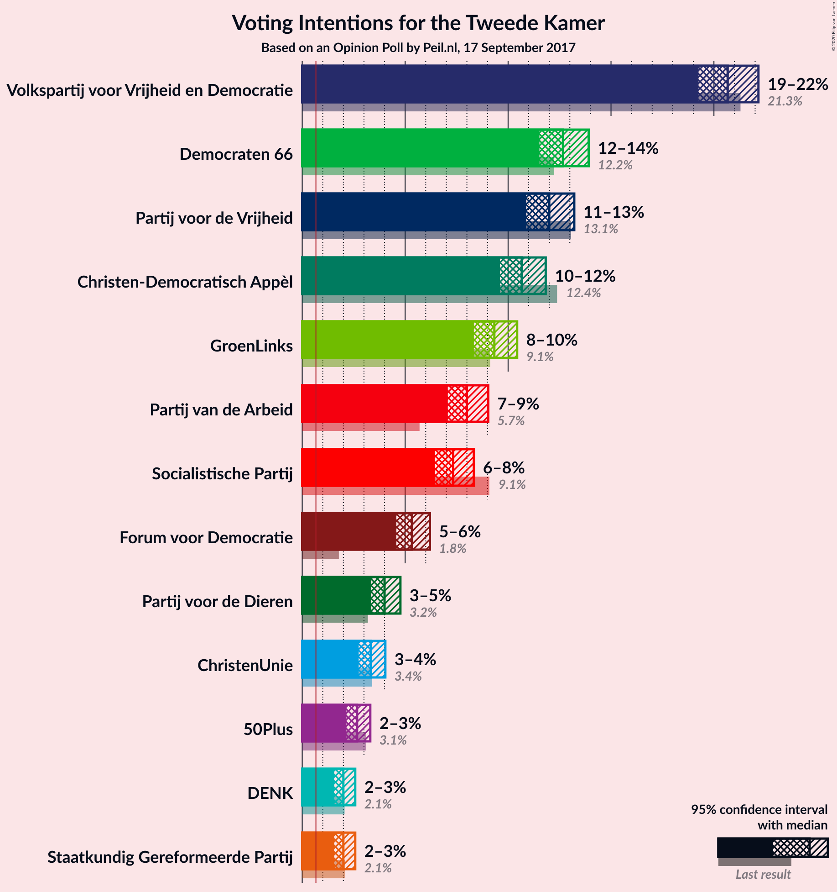

### Confidence Intervals

| Party | Last Result | Poll Result | 80% Confidence Interval | 90% Confidence Interval | 95% Confidence Interval | 99% Confidence Interval |
|:-----:|:-----------:|:-----------:|:-----------------------:|:-----------------------:|:-----------------------:|:-----------------------:|
| Volkspartij voor Vrijheid en Democratie | 21.3% | 20.7% | 19.7–21.6% |19.5–21.9% |19.3–22.2% |18.8–22.6% |
| Democraten 66 | 12.2% | 12.7% | 11.9–13.5% |11.7–13.7% |11.5–13.9% |11.2–14.3% |
| Partij voor de Vrijheid | 13.1% | 12.0% | 11.3–12.8% |11.1–13.0% |10.9–13.2% |10.5–13.6% |
| Christen-Democratisch Appèl | 12.4% | 10.7% | 10.0–11.4% |9.8–11.6% |9.6–11.8% |9.3–12.2% |
| GroenLinks | 9.1% | 9.3% | 8.7–10.1% |8.5–10.3% |8.3–10.4% |8.0–10.8% |
| Partij van de Arbeid | 5.7% | 8.0% | 7.4–8.7% |7.2–8.9% |7.1–9.0% |6.8–9.4% |
| Socialistische Partij | 9.1% | 7.3% | 6.8–8.0% |6.6–8.2% |6.4–8.3% |6.2–8.6% |
| Forum voor Democratie | 1.8% | 5.3% | 4.8–5.9% |4.7–6.1% |4.6–6.2% |4.4–6.5% |
| Partij voor de Dieren | 3.2% | 4.0% | 3.6–4.5% |3.4–4.6% |3.4–4.8% |3.2–5.0% |
| ChristenUnie | 3.4% | 3.3% | 2.9–3.8% |2.8–3.9% |2.7–4.0% |2.6–4.3% |
| 50Plus | 3.1% | 2.7% | 2.3–3.1% |2.2–3.2% |2.1–3.3% |2.0–3.5% |
| Staatkundig Gereformeerde Partij | 2.1% | 2.0% | 1.7–2.4% |1.6–2.5% |1.6–2.6% |1.4–2.8% |
| DENK | 2.1% | 2.0% | 1.7–2.4% |1.6–2.5% |1.6–2.6% |1.4–2.8% |

*Note:* The poll result column reflects the actual value used in the calculations. Published results may vary slightly, and in addition be rounded to fewer digits.

## Seats

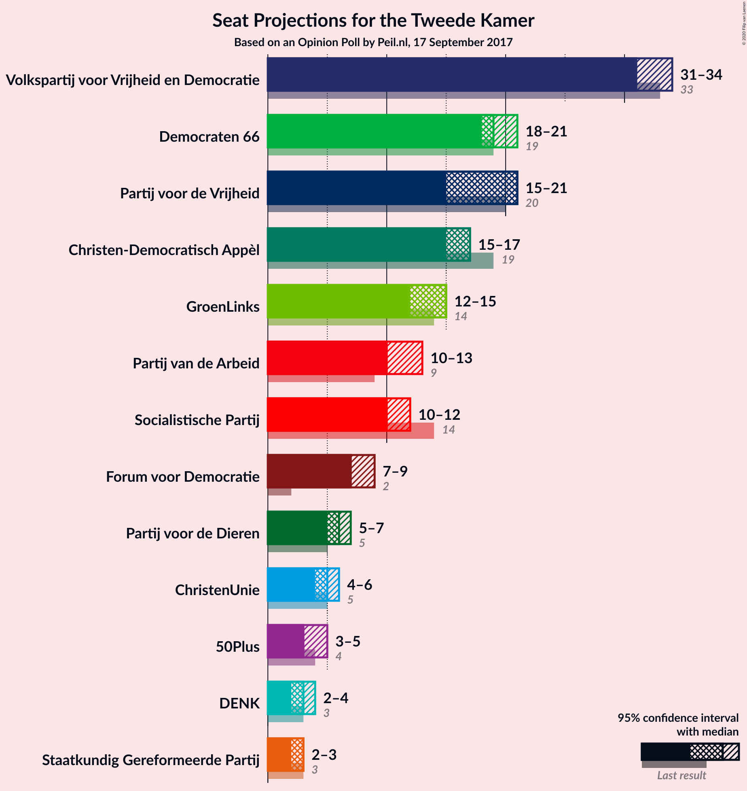

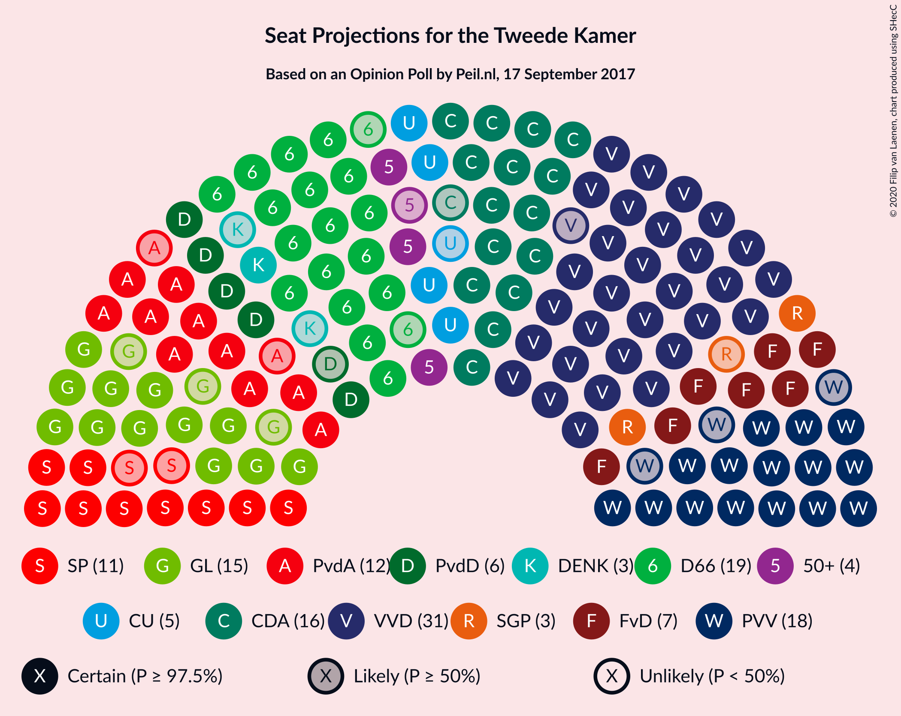

### Confidence Intervals

| Party | Last Result | Median | 80% Confidence Interval | 90% Confidence Interval | 95% Confidence Interval | 99% Confidence Interval |
|:-----:|:-----------:|:------:|:-----------------------:|:-----------------------:|:-----------------------:|:-----------------------:|
| <a href="#volkspartij-voor-vrijheid-en-democratie">Volkspartij voor Vrijheid en Democratie</a> | 33 | 31 | 31–34 |31–34 |31–34 |30–35 |
| <a href="#democraten-66">Democraten 66</a> | 19 | 19 | 18–20 |18–21 |18–21 |17–22 |
| <a href="#partij-voor-de-vrijheid">Partij voor de Vrijheid</a> | 20 | 21 | 15–21 |15–21 |15–21 |15–21 |
| <a href="#christen-democratisch-appèl">Christen-Democratisch Appèl</a> | 19 | 17 | 15–17 |15–17 |15–17 |15–17 |
| <a href="#groenlinks">GroenLinks</a> | 14 | 15 | 14–15 |12–15 |12–15 |12–17 |
| <a href="#partij-van-de-arbeid">Partij van de Arbeid</a> | 9 | 10 | 10–12 |10–12 |10–13 |10–14 |
| <a href="#socialistische-partij">Socialistische Partij</a> | 14 | 10 | 10–11 |10–11 |10–12 |10–12 |
| <a href="#forum-voor-democratie">Forum voor Democratie</a> | 2 | 7 | 7–9 |7–9 |7–9 |7–9 |
| <a href="#partij-voor-de-dieren">Partij voor de Dieren</a> | 5 | 6 | 6 |6–7 |5–7 |5–7 |
| <a href="#christenunie">ChristenUnie</a> | 5 | 5 | 4–6 |4–6 |4–6 |4–6 |
| <a href="#50plus">50Plus</a> | 4 | 3 | 3 |3–4 |3–5 |3–5 |
| <a href="#staatkundig-gereformeerde-partij">Staatkundig Gereformeerde Partij</a> | 3 | 3 | 3 |2–3 |2–3 |2–3 |
| <a href="#denk">DENK</a> | 3 | 3 | 3 |2–4 |2–4 |2–4 |

### Volkspartij voor Vrijheid en Democratie

*For a full overview of the results for this party, see the [Volkspartij voor Vrijheid en Democratie](party-volkspartijvoorvrijheidendemocratie.html) page.*

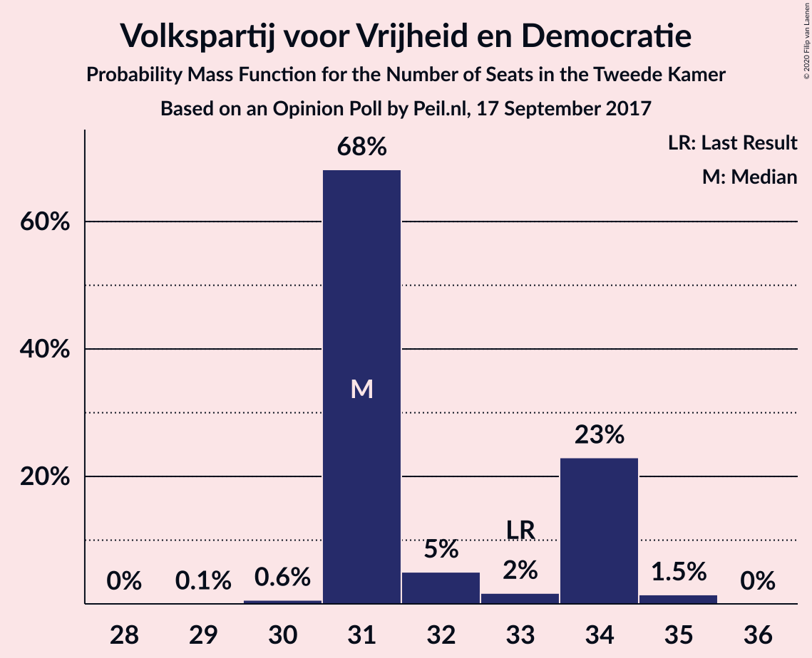

| Number of Seats | Probability | Accumulated | Special Marks |
|:---------------:|:-----------:|:-----------:|:-------------:|
| 29 | 0.1% | 100% |  |
| 30 | 0.6% | 99.9% |  |
| 31 | 68% | 99.3% | Median |
| 32 | 5% | 31% |  |
| 33 | 2% | 26% | Last Result |
| 34 | 23% | 24% |  |
| 35 | 1.5% | 1.5% |  |
| 36 | 0% | 0% |  |

### Democraten 66

*For a full overview of the results for this party, see the [Democraten 66](party-democraten66.html) page.*

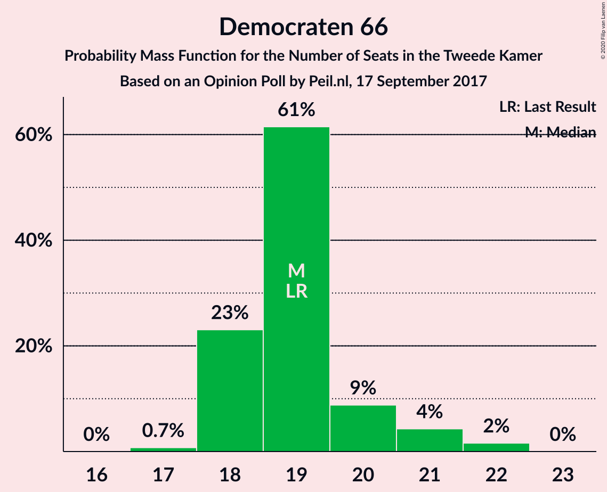

| Number of Seats | Probability | Accumulated | Special Marks |
|:---------------:|:-----------:|:-----------:|:-------------:|
| 17 | 0.7% | 100% |  |
| 18 | 23% | 99.3% |  |
| 19 | 61% | 76% | Last Result, Median |
| 20 | 9% | 15% |  |
| 21 | 4% | 6% |  |
| 22 | 2% | 2% |  |
| 23 | 0% | 0% |  |

### Partij voor de Vrijheid

*For a full overview of the results for this party, see the [Partij voor de Vrijheid](party-partijvoordevrijheid.html) page.*

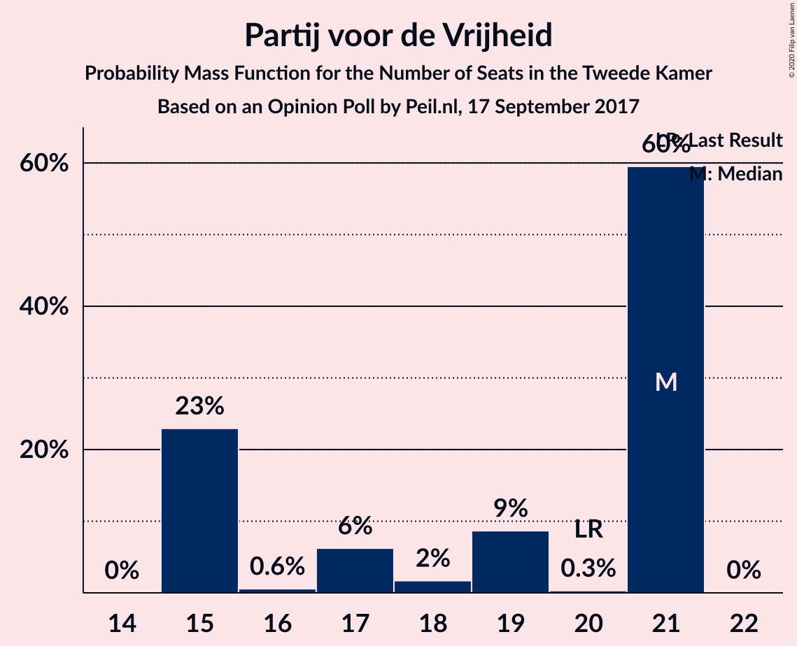

| Number of Seats | Probability | Accumulated | Special Marks |
|:---------------:|:-----------:|:-----------:|:-------------:|
| 15 | 23% | 100% |  |
| 16 | 0.6% | 77% |  |
| 17 | 6% | 76% |  |
| 18 | 2% | 70% |  |
| 19 | 9% | 69% |  |
| 20 | 0.3% | 60% | Last Result |
| 21 | 60% | 60% | Median |
| 22 | 0% | 0% |  |

### Christen-Democratisch Appèl

*For a full overview of the results for this party, see the [Christen-Democratisch Appèl](party-christen-democratischappèl.html) page.*

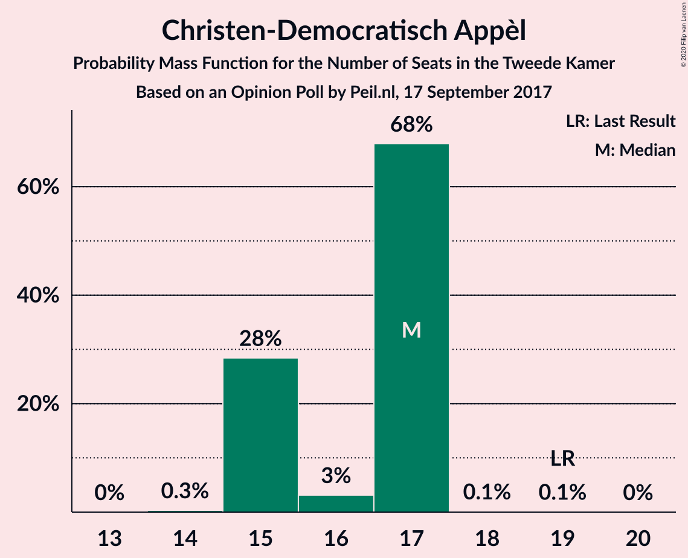

| Number of Seats | Probability | Accumulated | Special Marks |
|:---------------:|:-----------:|:-----------:|:-------------:|
| 14 | 0.3% | 100% |  |
| 15 | 28% | 99.7% |  |
| 16 | 3% | 71% |  |
| 17 | 68% | 68% | Median |
| 18 | 0.1% | 0.2% |  |
| 19 | 0.1% | 0.1% | Last Result |
| 20 | 0% | 0% |  |

### GroenLinks

*For a full overview of the results for this party, see the [GroenLinks](party-groenlinks.html) page.*

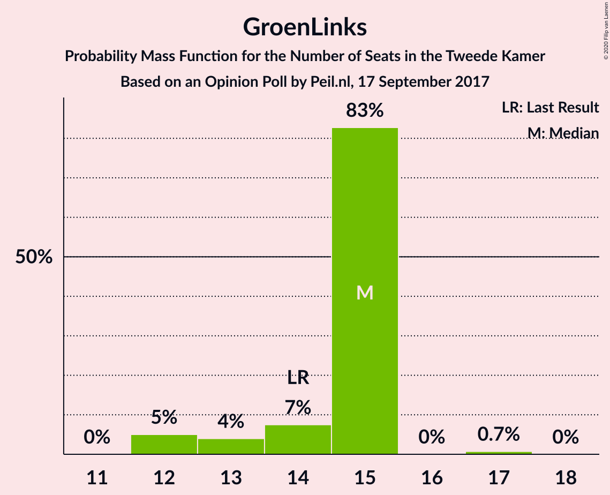

| Number of Seats | Probability | Accumulated | Special Marks |
|:---------------:|:-----------:|:-----------:|:-------------:|
| 12 | 5% | 100% |  |
| 13 | 4% | 95% |  |
| 14 | 7% | 91% | Last Result |
| 15 | 83% | 83% | Median |
| 16 | 0% | 0.8% |  |
| 17 | 0.7% | 0.7% |  |
| 18 | 0% | 0% |  |

### Partij van de Arbeid

*For a full overview of the results for this party, see the [Partij van de Arbeid](party-partijvandearbeid.html) page.*

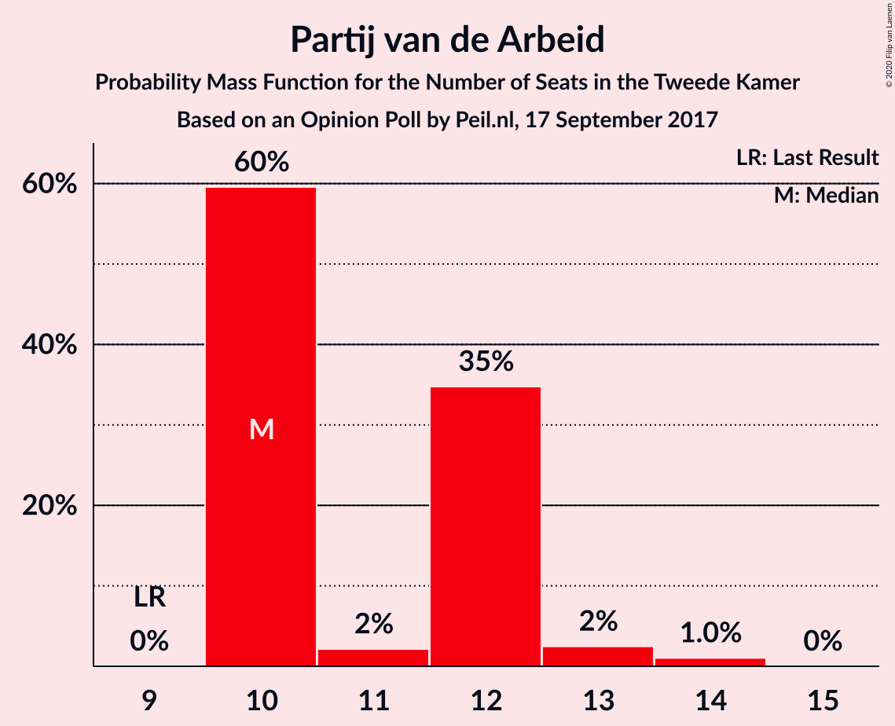

| Number of Seats | Probability | Accumulated | Special Marks |
|:---------------:|:-----------:|:-----------:|:-------------:|
| 9 | 0% | 100% | Last Result |
| 10 | 60% | 100% | Median |
| 11 | 2% | 40% |  |
| 12 | 35% | 38% |  |
| 13 | 2% | 4% |  |
| 14 | 1.0% | 1.0% |  |
| 15 | 0% | 0% |  |

### Socialistische Partij

*For a full overview of the results for this party, see the [Socialistische Partij](party-socialistischepartij.html) page.*

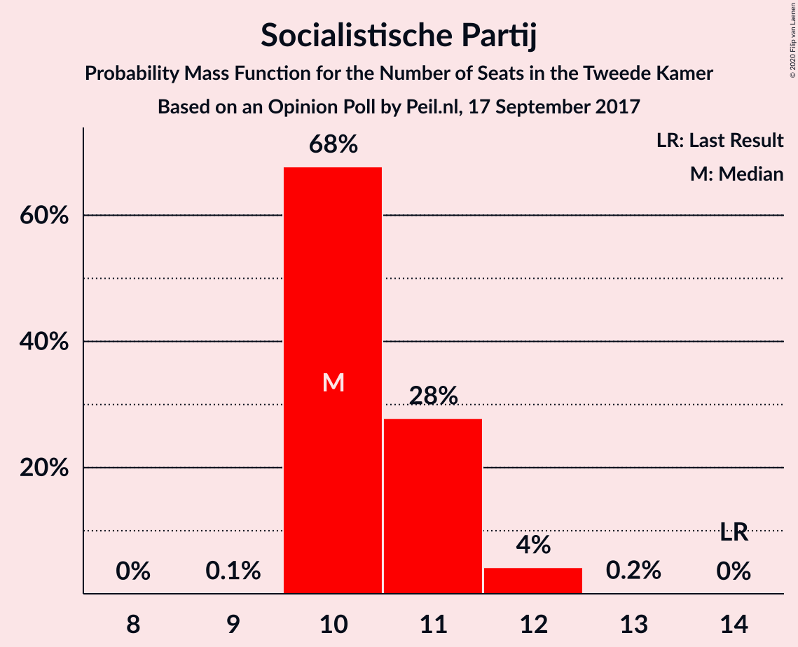

| Number of Seats | Probability | Accumulated | Special Marks |
|:---------------:|:-----------:|:-----------:|:-------------:|
| 9 | 0.1% | 100% |  |
| 10 | 68% | 99.9% | Median |
| 11 | 28% | 32% |  |
| 12 | 4% | 4% |  |
| 13 | 0.2% | 0.2% |  |
| 14 | 0% | 0% | Last Result |

### Forum voor Democratie

*For a full overview of the results for this party, see the [Forum voor Democratie](party-forumvoordemocratie.html) page.*

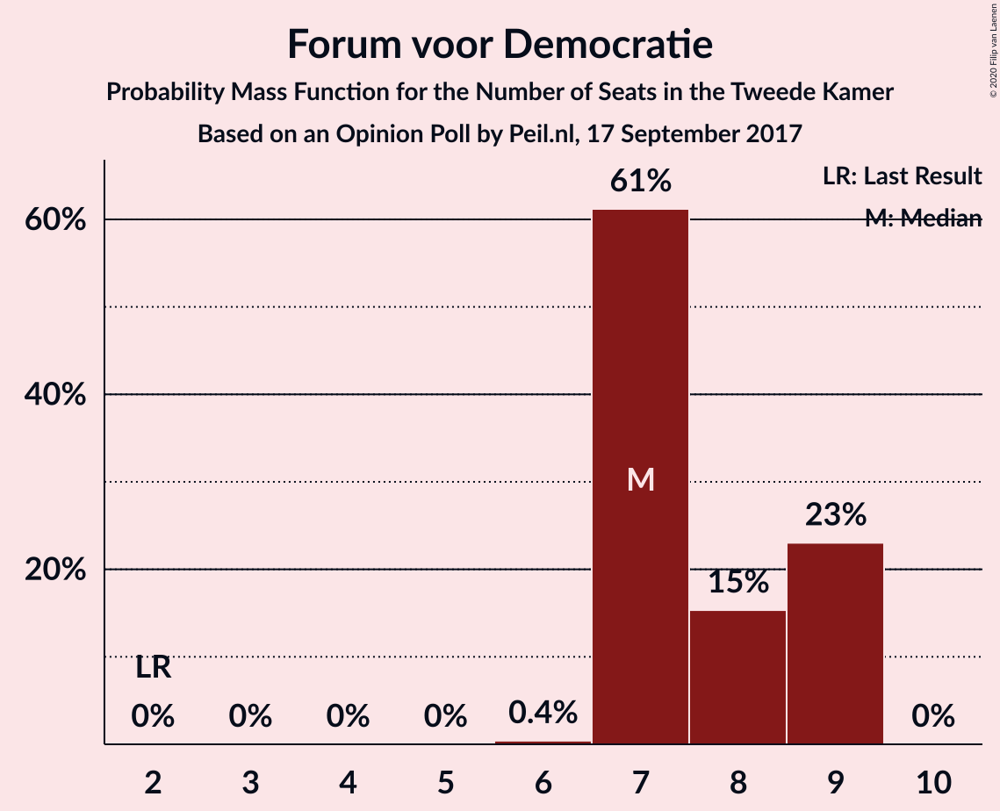

| Number of Seats | Probability | Accumulated | Special Marks |
|:---------------:|:-----------:|:-----------:|:-------------:|
| 2 | 0% | 100% | Last Result |
| 3 | 0% | 100% |  |
| 4 | 0% | 100% |  |
| 5 | 0% | 100% |  |
| 6 | 0.4% | 100% |  |
| 7 | 61% | 99.6% | Median |
| 8 | 15% | 38% |  |
| 9 | 23% | 23% |  |
| 10 | 0% | 0% |  |

### Partij voor de Dieren

*For a full overview of the results for this party, see the [Partij voor de Dieren](party-partijvoordedieren.html) page.*

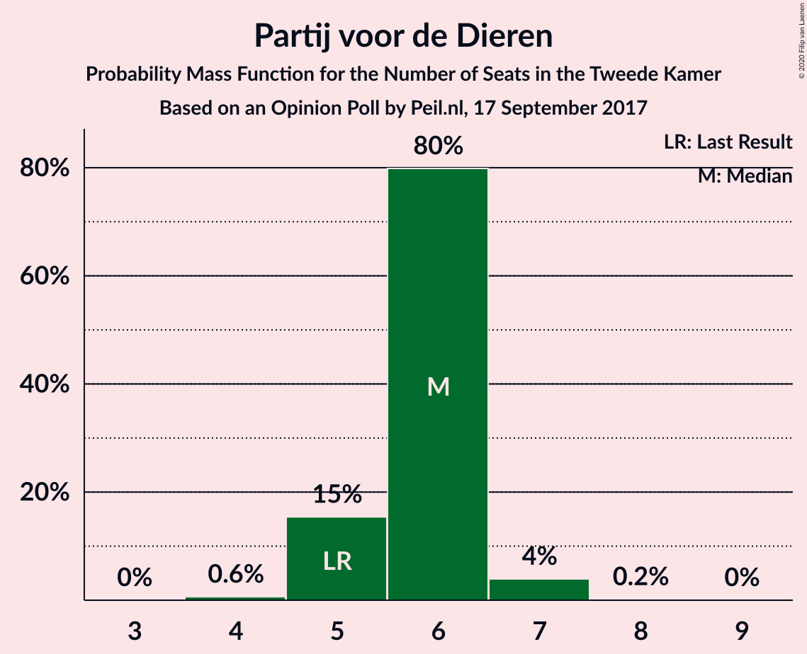

| Number of Seats | Probability | Accumulated | Special Marks |
|:---------------:|:-----------:|:-----------:|:-------------:|
| 5 | 4% | 100% | Last Result |
| 6 | 91% | 96% | Median |
| 7 | 5% | 5% |  |
| 8 | 0.1% | 0.1% |  |
| 9 | 0% | 0% |  |

### ChristenUnie

*For a full overview of the results for this party, see the [ChristenUnie](party-christenunie.html) page.*

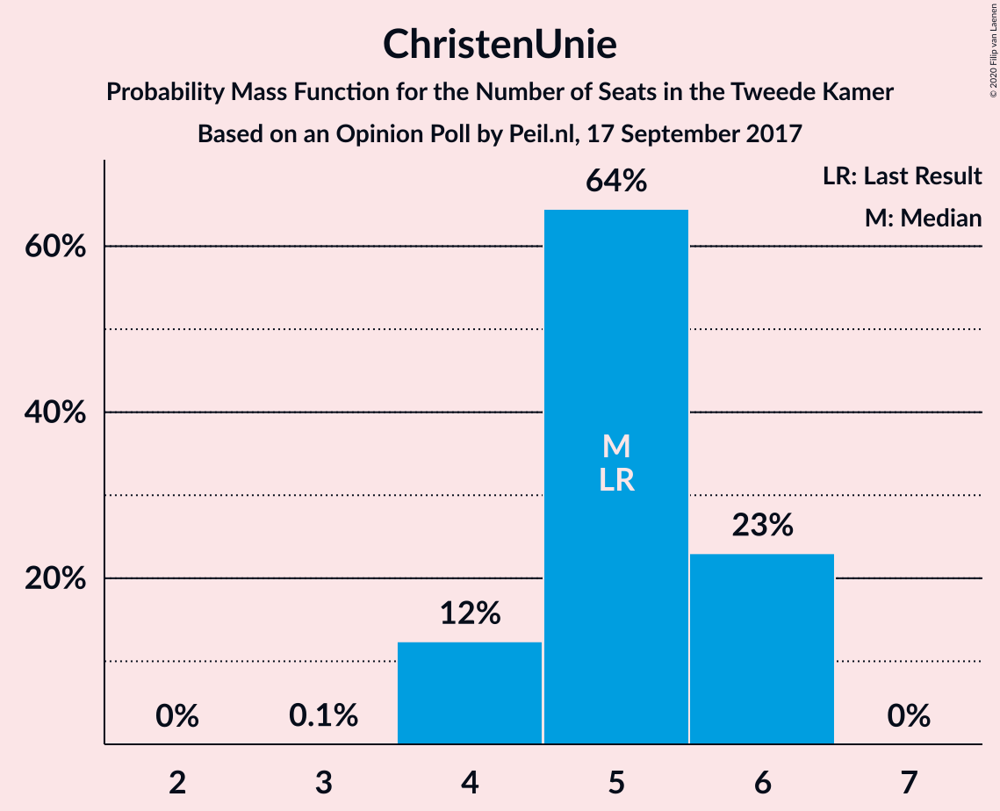

| Number of Seats | Probability | Accumulated | Special Marks |
|:---------------:|:-----------:|:-----------:|:-------------:|
| 3 | 0.1% | 100% |  |
| 4 | 12% | 99.9% |  |
| 5 | 64% | 88% | Last Result, Median |
| 6 | 23% | 23% |  |
| 7 | 0% | 0% |  |

### 50Plus

*For a full overview of the results for this party, see the [50Plus](party-50plus.html) page.*

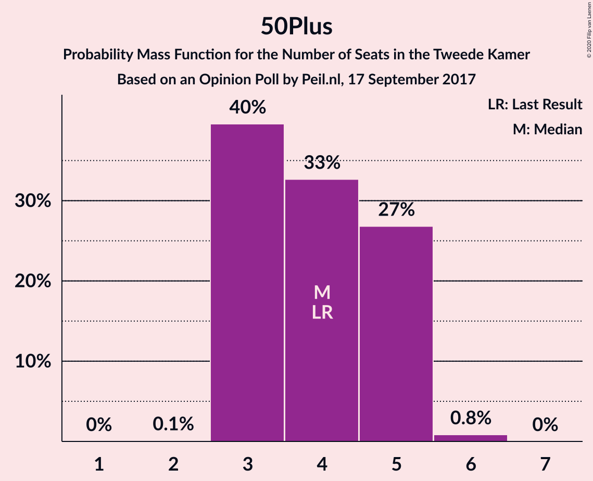

| Number of Seats | Probability | Accumulated | Special Marks |
|:---------------:|:-----------:|:-----------:|:-------------:|
| 3 | 91% | 100% | Median |
| 4 | 4% | 9% | Last Result |
| 5 | 4% | 4% |  |
| 6 | 0% | 0% |  |

### Staatkundig Gereformeerde Partij

*For a full overview of the results for this party, see the [Staatkundig Gereformeerde Partij](party-staatkundiggereformeerdepartij.html) page.*

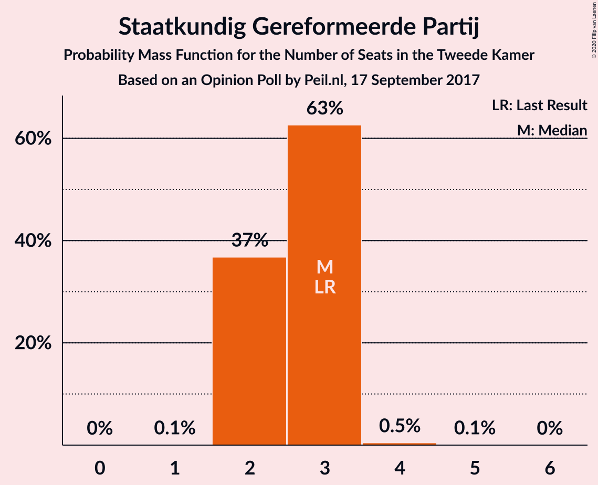

| Number of Seats | Probability | Accumulated | Special Marks |
|:---------------:|:-----------:|:-----------:|:-------------:|
| 2 | 8% | 100% |  |
| 3 | 92% | 92% | Last Result, Median |
| 4 | 0.1% | 0.1% |  |
| 5 | 0% | 0% |  |

### DENK

*For a full overview of the results for this party, see the [DENK](party-denk.html) page.*

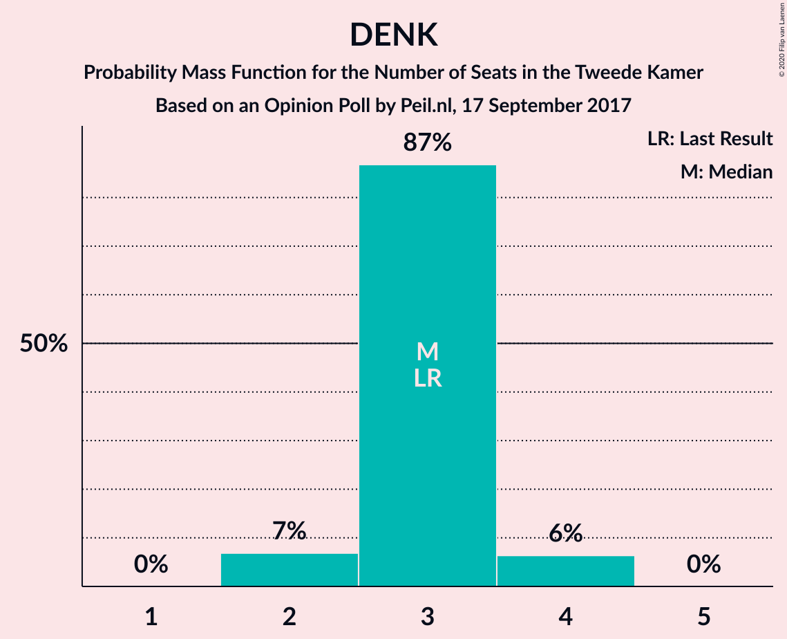

| Number of Seats | Probability | Accumulated | Special Marks |
|:---------------:|:-----------:|:-----------:|:-------------:|
| 2 | 7% | 100% |  |
| 3 | 87% | 93% | Last Result, Median |
| 4 | 6% | 6% |  |
| 5 | 0% | 0% |  |

## Coalitions

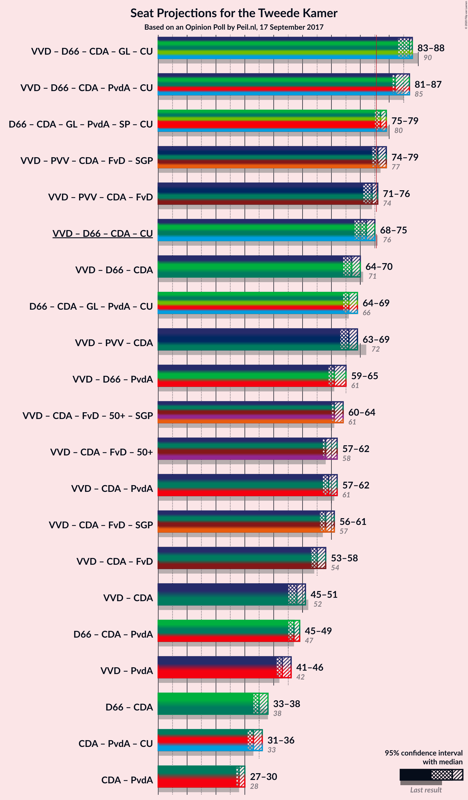

### Confidence Intervals

| Coalition | Last Result | Median | Majority? | 80% Confidence Interval | 90% Confidence Interval | 95% Confidence Interval | 99% Confidence Interval |
|:---------:|:-----------:|:------:|:---------:|:-----------------------:|:-----------------------:|:-----------------------:|:-----------------------:|
| Volkspartij voor Vrijheid en Democratie – Democraten 66 – Christen-Democratisch Appèl – GroenLinks – ChristenUnie | 90 | 87 | 100% | 86–88 | 85–88 | 85–88 | 84–88 |
| Volkspartij voor Vrijheid en Democratie – Democraten 66 – Christen-Democratisch Appèl – Partij van de Arbeid – ChristenUnie | 85 | 82 | 100% | 82–85 | 82–85 | 82–86 | 82–87 |
| Volkspartij voor Vrijheid en Democratie – Partij voor de Vrijheid – Christen-Democratisch Appèl – Forum voor Democratie – Staatkundig Gereformeerde Partij | 77 | 79 | 93% | 76–79 | 75–79 | 75–79 | 74–81 |
| Democraten 66 – Christen-Democratisch Appèl – GroenLinks – Partij van de Arbeid – Socialistische Partij – ChristenUnie | 80 | 76 | 98% | 76–77 | 76–78 | 76–78 | 73–80 |
| Volkspartij voor Vrijheid en Democratie – Partij voor de Vrijheid – Christen-Democratisch Appèl – Forum voor Democratie | 74 | 76 | 61% | 73–76 | 72–76 | 72–76 | 71–78 |
| Volkspartij voor Vrijheid en Democratie – Democraten 66 – Christen-Democratisch Appèl – ChristenUnie | 76 | 72 | 0% | 72–73 | 72–73 | 72–75 | 69–75 |
| Volkspartij voor Vrijheid en Democratie – Democraten 66 – Christen-Democratisch Appèl | 71 | 67 | 0% | 67–68 | 67–68 | 67–70 | 65–71 |
| Volkspartij voor Vrijheid en Democratie – Partij voor de Vrijheid – Christen-Democratisch Appèl | 72 | 69 | 0% | 64–69 | 64–69 | 64–69 | 63–70 |
| Democraten 66 – Christen-Democratisch Appèl – GroenLinks – Partij van de Arbeid – ChristenUnie | 66 | 66 | 0% | 66 | 65–67 | 65–67 | 63–68 |
| Volkspartij voor Vrijheid en Democratie – Democraten 66 – Partij van de Arbeid | 61 | 60 | 0% | 60–64 | 60–65 | 60–65 | 60–67 |
| Volkspartij voor Vrijheid en Democratie – Christen-Democratisch Appèl – Forum voor Democratie – 50Plus – Staatkundig Gereformeerde Partij | 61 | 61 | 0% | 61–64 | 61–64 | 61–64 | 60–66 |
| Volkspartij voor Vrijheid en Democratie – Christen-Democratisch Appèl – Partij van de Arbeid | 61 | 58 | 0% | 58–61 | 58–61 | 58–62 | 58–63 |
| Volkspartij voor Vrijheid en Democratie – Christen-Democratisch Appèl – Forum voor Democratie – 50Plus | 58 | 58 | 0% | 58–61 | 58–61 | 58–61 | 58–63 |
| Volkspartij voor Vrijheid en Democratie – Christen-Democratisch Appèl – Forum voor Democratie – Staatkundig Gereformeerde Partij | 57 | 58 | 0% | 58–61 | 58–61 | 58–61 | 57–63 |
| Volkspartij voor Vrijheid en Democratie – Christen-Democratisch Appèl – Forum voor Democratie | 54 | 55 | 0% | 55–58 | 55–58 | 55–58 | 54–60 |
| Volkspartij voor Vrijheid en Democratie – Christen-Democratisch Appèl | 52 | 48 | 0% | 48–49 | 47–49 | 47–49 | 46–52 |
| Democraten 66 – Christen-Democratisch Appèl – Partij van de Arbeid | 47 | 46 | 0% | 45–49 | 45–49 | 45–49 | 45–49 |
| Volkspartij voor Vrijheid en Democratie – Partij van de Arbeid | 42 | 41 | 0% | 41–46 | 41–46 | 41–46 | 41–46 |
| Democraten 66 – Christen-Democratisch Appèl | 38 | 36 | 0% | 33–36 | 33–37 | 33–37 | 33–38 |
| Christen-Democratisch Appèl – Partij van de Arbeid – ChristenUnie | 33 | 32 | 0% | 32–33 | 32–33 | 31–34 | 31–35 |
| Christen-Democratisch Appèl – Partij van de Arbeid | 28 | 27 | 0% | 27–28 | 27–29 | 27–29 | 27–30 |

### Volkspartij voor Vrijheid en Democratie – Democraten 66 – Christen-Democratisch Appèl – GroenLinks – ChristenUnie

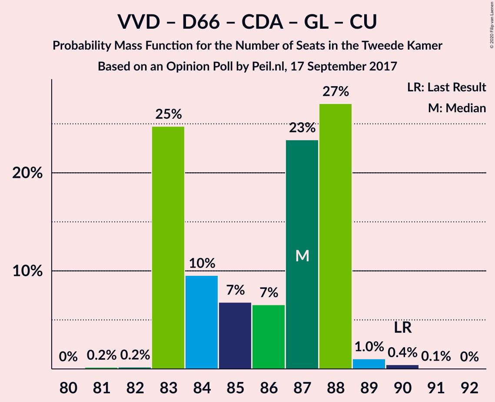

| Number of Seats | Probability | Accumulated | Special Marks |
|:---------------:|:-----------:|:-----------:|:-------------:|
| 83 | 0.1% | 100% |  |
| 84 | 2% | 99.9% |  |
| 85 | 4% | 98% |  |
| 86 | 7% | 94% |  |
| 87 | 63% | 86% | Median |
| 88 | 23% | 23% |  |
| 89 | 0.1% | 0.1% |  |
| 90 | 0% | 0% | Last Result |

### Volkspartij voor Vrijheid en Democratie – Democraten 66 – Christen-Democratisch Appèl – Partij van de Arbeid – ChristenUnie

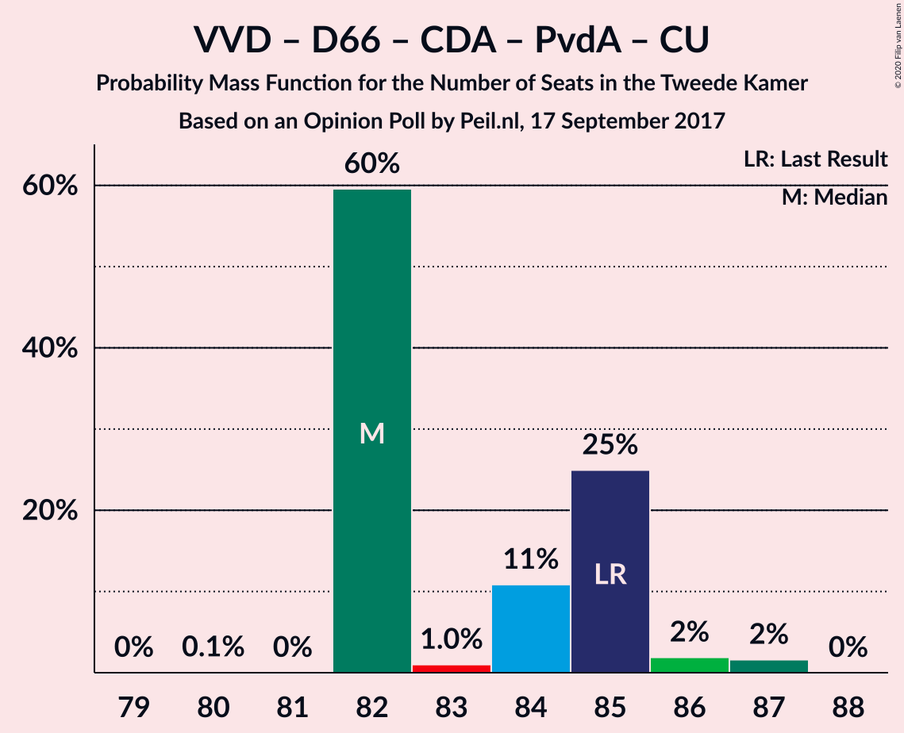

| Number of Seats | Probability | Accumulated | Special Marks |
|:---------------:|:-----------:|:-----------:|:-------------:|
| 80 | 0.1% | 100% |  |
| 81 | 0% | 99.9% |  |
| 82 | 60% | 99.9% | Median |
| 83 | 1.0% | 40% |  |
| 84 | 11% | 39% |  |
| 85 | 25% | 28% | Last Result |
| 86 | 2% | 4% |  |
| 87 | 2% | 2% |  |
| 88 | 0% | 0% |  |

### Volkspartij voor Vrijheid en Democratie – Partij voor de Vrijheid – Christen-Democratisch Appèl – Forum voor Democratie – Staatkundig Gereformeerde Partij

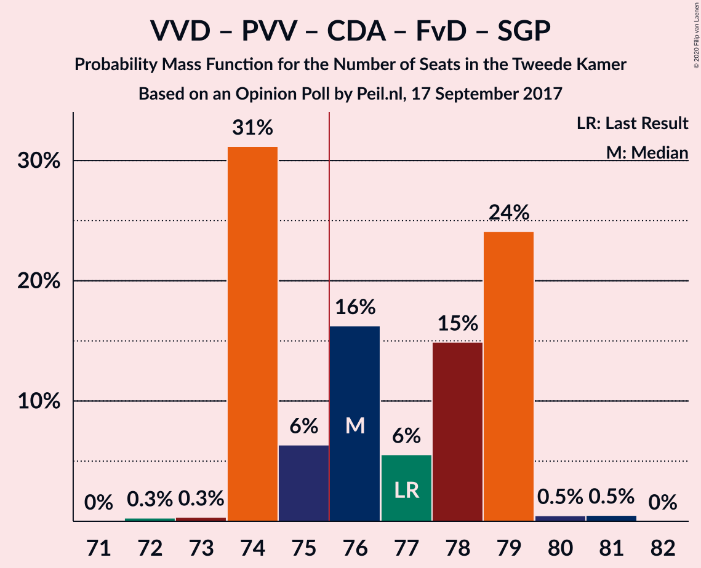

| Number of Seats | Probability | Accumulated | Special Marks |
|:---------------:|:-----------:|:-----------:|:-------------:|
| 73 | 0.1% | 100% |  |
| 74 | 0.6% | 99.8% |  |
| 75 | 6% | 99.3% |  |
| 76 | 23% | 93% | Majority |
| 77 | 9% | 70% | Last Result |
| 78 | 0.2% | 61% |  |
| 79 | 60% | 61% | Median |
| 80 | 0% | 1.5% |  |
| 81 | 1.5% | 1.5% |  |
| 82 | 0% | 0% |  |

### Democraten 66 – Christen-Democratisch Appèl – GroenLinks – Partij van de Arbeid – Socialistische Partij – ChristenUnie

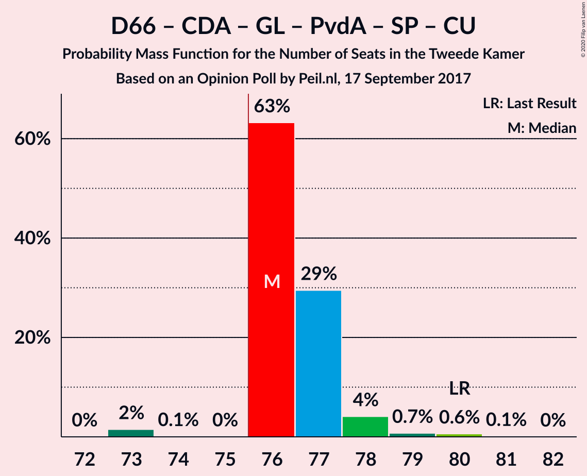

| Number of Seats | Probability | Accumulated | Special Marks |
|:---------------:|:-----------:|:-----------:|:-------------:|
| 73 | 2% | 100% |  |
| 74 | 0.1% | 98% |  |
| 75 | 0% | 98% |  |
| 76 | 63% | 98% | Median, Majority |
| 77 | 29% | 35% |  |
| 78 | 4% | 6% |  |
| 79 | 0.7% | 1.5% |  |
| 80 | 0.6% | 0.7% | Last Result |
| 81 | 0.1% | 0.1% |  |
| 82 | 0% | 0% |  |

### Volkspartij voor Vrijheid en Democratie – Partij voor de Vrijheid – Christen-Democratisch Appèl – Forum voor Democratie

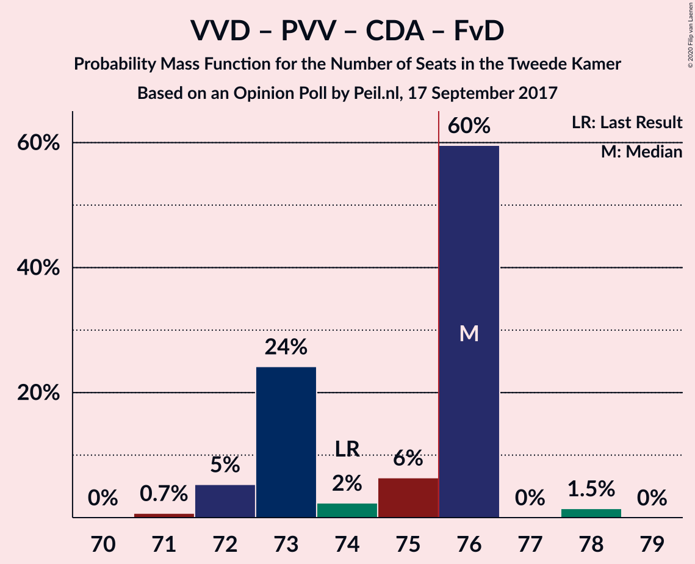

| Number of Seats | Probability | Accumulated | Special Marks |
|:---------------:|:-----------:|:-----------:|:-------------:|
| 71 | 0.7% | 100% |  |
| 72 | 5% | 99.3% |  |
| 73 | 24% | 94% |  |
| 74 | 2% | 70% | Last Result |
| 75 | 6% | 67% |  |
| 76 | 60% | 61% | Median, Majority |
| 77 | 0% | 1.5% |  |
| 78 | 1.5% | 1.5% |  |
| 79 | 0% | 0% |  |

### Volkspartij voor Vrijheid en Democratie – Democraten 66 – Christen-Democratisch Appèl – ChristenUnie

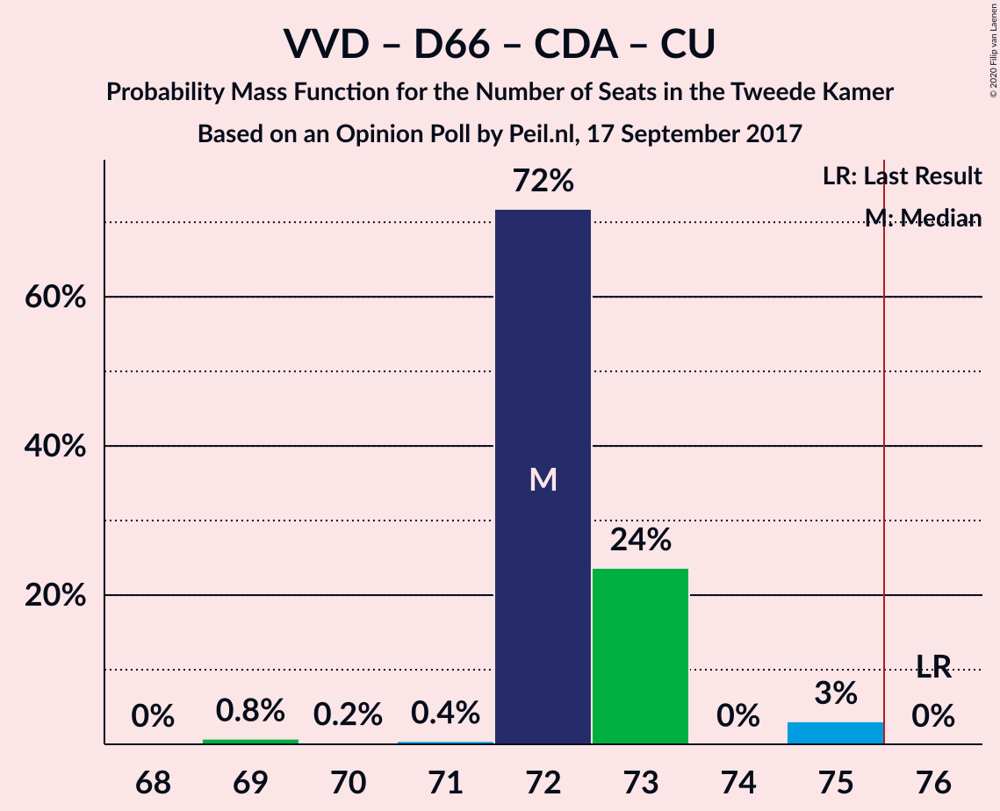

| Number of Seats | Probability | Accumulated | Special Marks |
|:---------------:|:-----------:|:-----------:|:-------------:|
| 69 | 0.8% | 100% |  |
| 70 | 0.2% | 99.2% |  |
| 71 | 0.4% | 99.0% |  |
| 72 | 72% | 98.6% | Median |
| 73 | 24% | 27% |  |
| 74 | 0% | 3% |  |
| 75 | 3% | 3% |  |
| 76 | 0% | 0% | Last Result, Majority |

### Volkspartij voor Vrijheid en Democratie – Democraten 66 – Christen-Democratisch Appèl

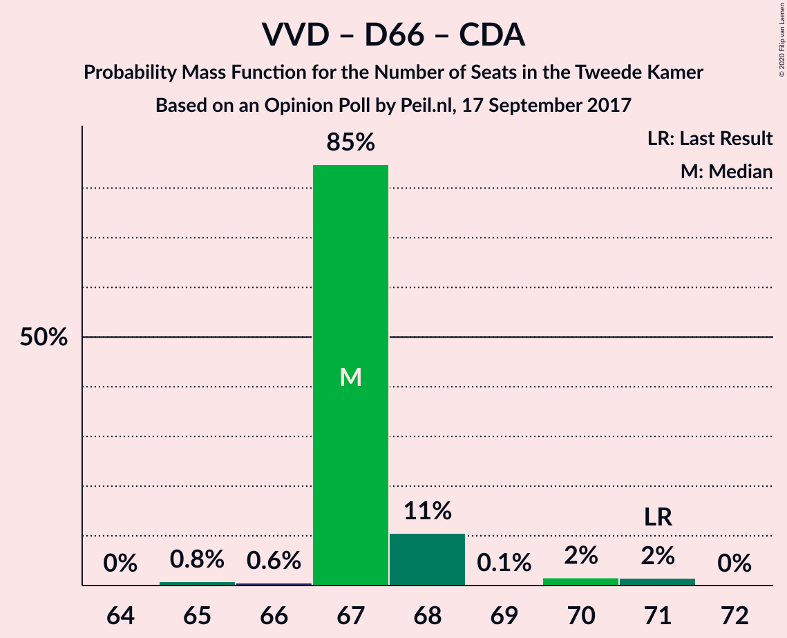

| Number of Seats | Probability | Accumulated | Special Marks |
|:---------------:|:-----------:|:-----------:|:-------------:|
| 65 | 0.8% | 100% |  |
| 66 | 0.6% | 99.1% |  |
| 67 | 85% | 98.6% | Median |
| 68 | 11% | 14% |  |
| 69 | 0.1% | 3% |  |
| 70 | 2% | 3% |  |
| 71 | 2% | 2% | Last Result |
| 72 | 0% | 0% |  |

### Volkspartij voor Vrijheid en Democratie – Partij voor de Vrijheid – Christen-Democratisch Appèl

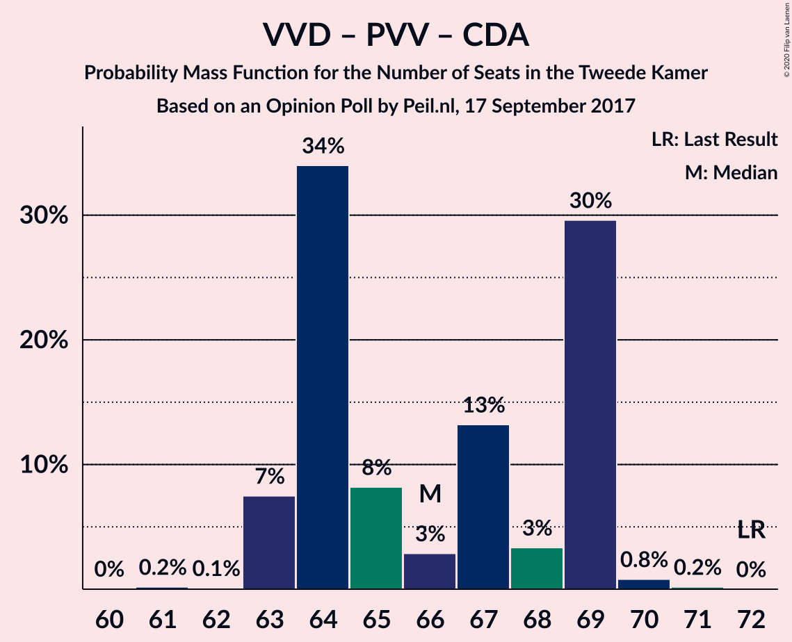

| Number of Seats | Probability | Accumulated | Special Marks |
|:---------------:|:-----------:|:-----------:|:-------------:|
| 63 | 0.7% | 100% |  |
| 64 | 27% | 99.3% |  |
| 65 | 2% | 73% |  |
| 66 | 2% | 70% |  |
| 67 | 7% | 68% |  |
| 68 | 0% | 61% |  |
| 69 | 60% | 61% | Median |
| 70 | 1.5% | 1.5% |  |
| 71 | 0% | 0% |  |
| 72 | 0% | 0% | Last Result |

### Democraten 66 – Christen-Democratisch Appèl – GroenLinks – Partij van de Arbeid – ChristenUnie

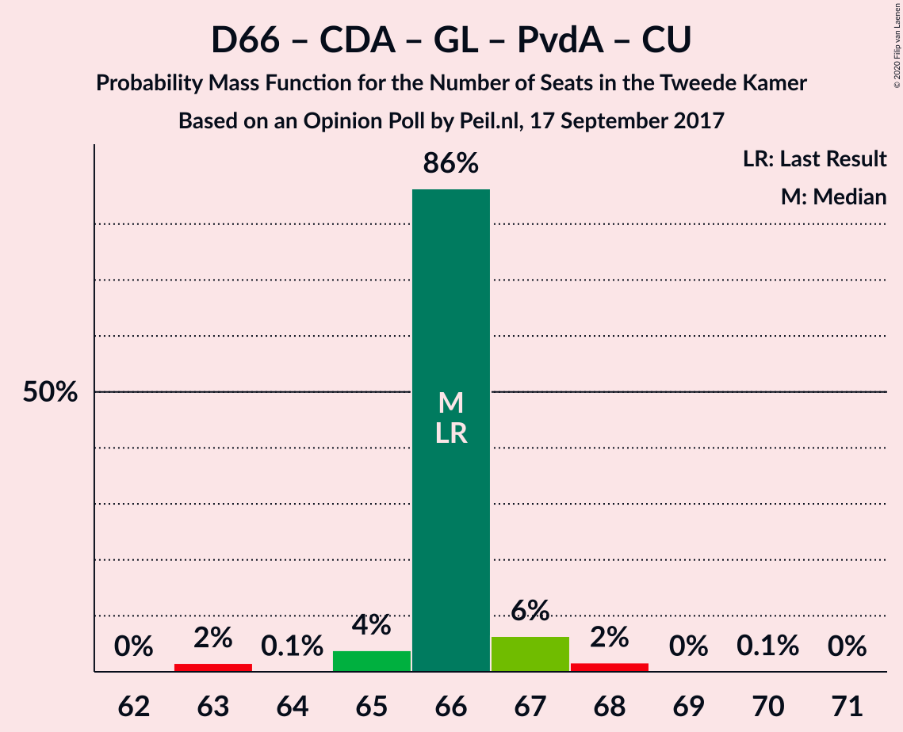

| Number of Seats | Probability | Accumulated | Special Marks |
|:---------------:|:-----------:|:-----------:|:-------------:|
| 63 | 2% | 100% |  |
| 64 | 0.1% | 98% |  |
| 65 | 4% | 98% |  |
| 66 | 86% | 95% | Last Result, Median |
| 67 | 6% | 8% |  |
| 68 | 2% | 2% |  |
| 69 | 0% | 0.2% |  |
| 70 | 0.1% | 0.1% |  |
| 71 | 0% | 0% |  |

### Volkspartij voor Vrijheid en Democratie – Democraten 66 – Partij van de Arbeid

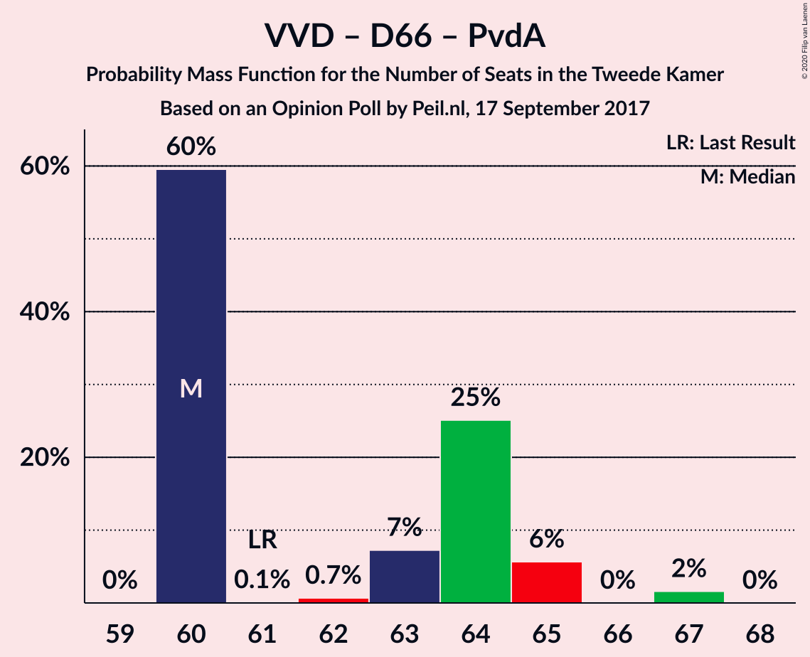

| Number of Seats | Probability | Accumulated | Special Marks |
|:---------------:|:-----------:|:-----------:|:-------------:|
| 60 | 60% | 100% | Median |
| 61 | 0.1% | 40% | Last Result |
| 62 | 0.7% | 40% |  |
| 63 | 7% | 40% |  |
| 64 | 25% | 32% |  |
| 65 | 6% | 7% |  |
| 66 | 0% | 2% |  |
| 67 | 2% | 2% |  |
| 68 | 0% | 0% |  |

### Volkspartij voor Vrijheid en Democratie – Christen-Democratisch Appèl – Forum voor Democratie – 50Plus – Staatkundig Gereformeerde Partij

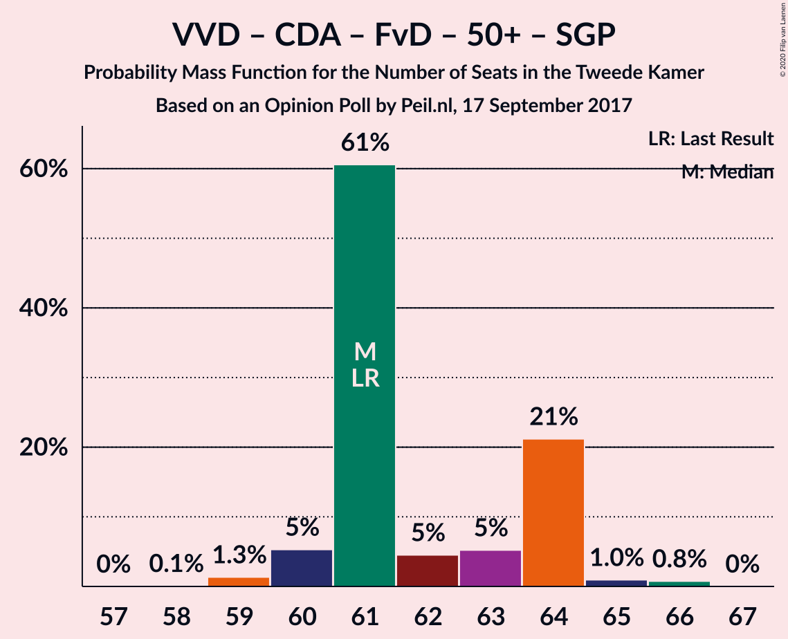

| Number of Seats | Probability | Accumulated | Special Marks |
|:---------------:|:-----------:|:-----------:|:-------------:|
| 60 | 0.7% | 100% |  |
| 61 | 67% | 99.3% | Last Result, Median |
| 62 | 4% | 33% |  |
| 63 | 4% | 29% |  |
| 64 | 23% | 25% |  |
| 65 | 0% | 1.5% |  |
| 66 | 1.5% | 1.5% |  |
| 67 | 0% | 0% |  |

### Volkspartij voor Vrijheid en Democratie – Christen-Democratisch Appèl – Partij van de Arbeid

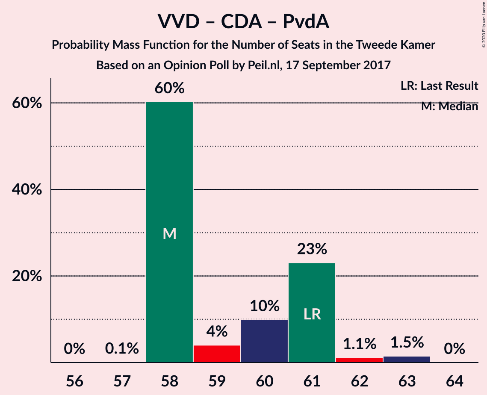

| Number of Seats | Probability | Accumulated | Special Marks |
|:---------------:|:-----------:|:-----------:|:-------------:|
| 57 | 0.1% | 100% |  |
| 58 | 60% | 99.9% | Median |
| 59 | 4% | 40% |  |
| 60 | 10% | 36% |  |
| 61 | 23% | 26% | Last Result |
| 62 | 1.1% | 3% |  |
| 63 | 1.5% | 1.5% |  |
| 64 | 0% | 0% |  |

### Volkspartij voor Vrijheid en Democratie – Christen-Democratisch Appèl – Forum voor Democratie – 50Plus

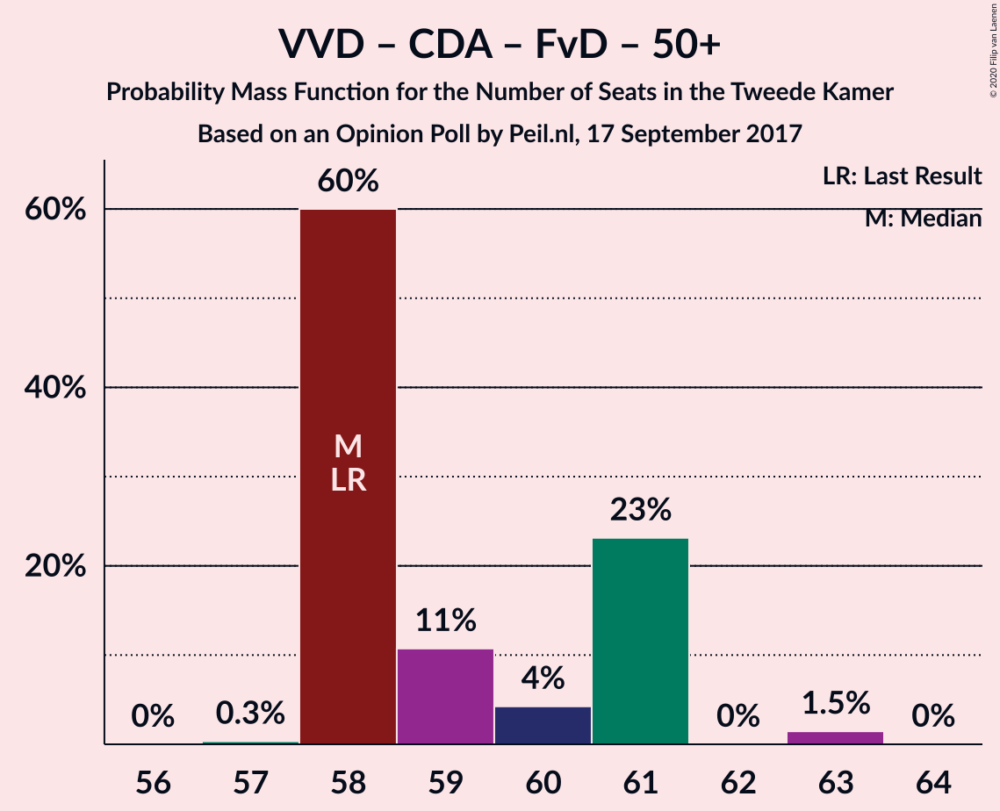

| Number of Seats | Probability | Accumulated | Special Marks |
|:---------------:|:-----------:|:-----------:|:-------------:|
| 57 | 0.3% | 100% |  |
| 58 | 60% | 99.6% | Last Result, Median |
| 59 | 11% | 40% |  |
| 60 | 4% | 29% |  |
| 61 | 23% | 25% |  |
| 62 | 0% | 1.5% |  |
| 63 | 1.5% | 1.5% |  |
| 64 | 0% | 0% |  |

### Volkspartij voor Vrijheid en Democratie – Christen-Democratisch Appèl – Forum voor Democratie – Staatkundig Gereformeerde Partij

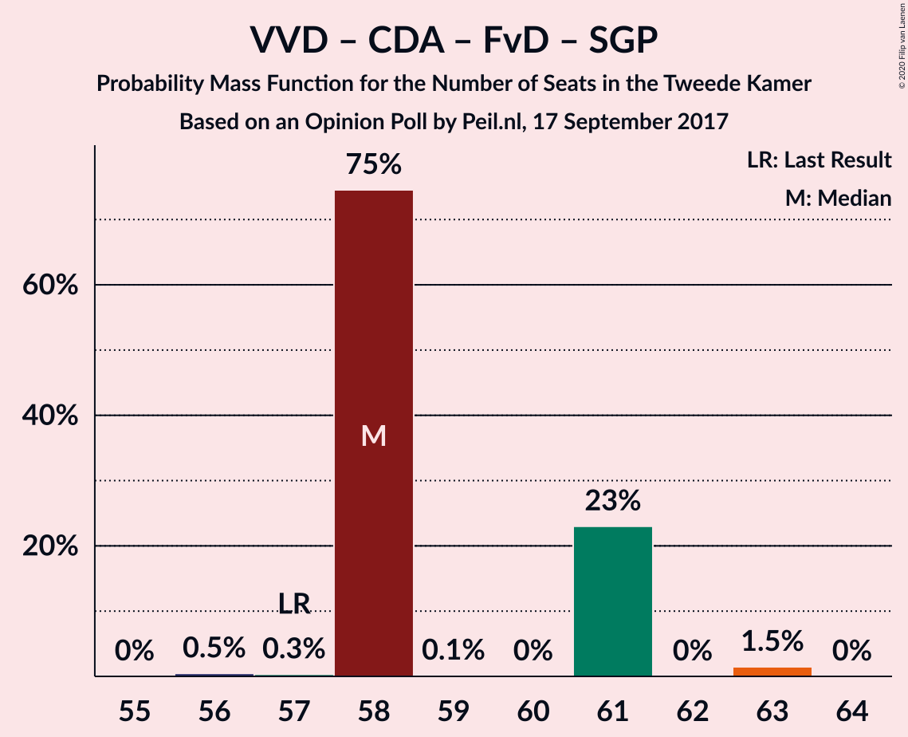

| Number of Seats | Probability | Accumulated | Special Marks |
|:---------------:|:-----------:|:-----------:|:-------------:|
| 56 | 0.5% | 100% |  |
| 57 | 0.3% | 99.5% | Last Result |
| 58 | 75% | 99.2% | Median |
| 59 | 0.1% | 25% |  |
| 60 | 0% | 25% |  |
| 61 | 23% | 24% |  |
| 62 | 0% | 1.5% |  |
| 63 | 1.5% | 1.5% |  |
| 64 | 0% | 0% |  |

### Volkspartij voor Vrijheid en Democratie – Christen-Democratisch Appèl – Forum voor Democratie

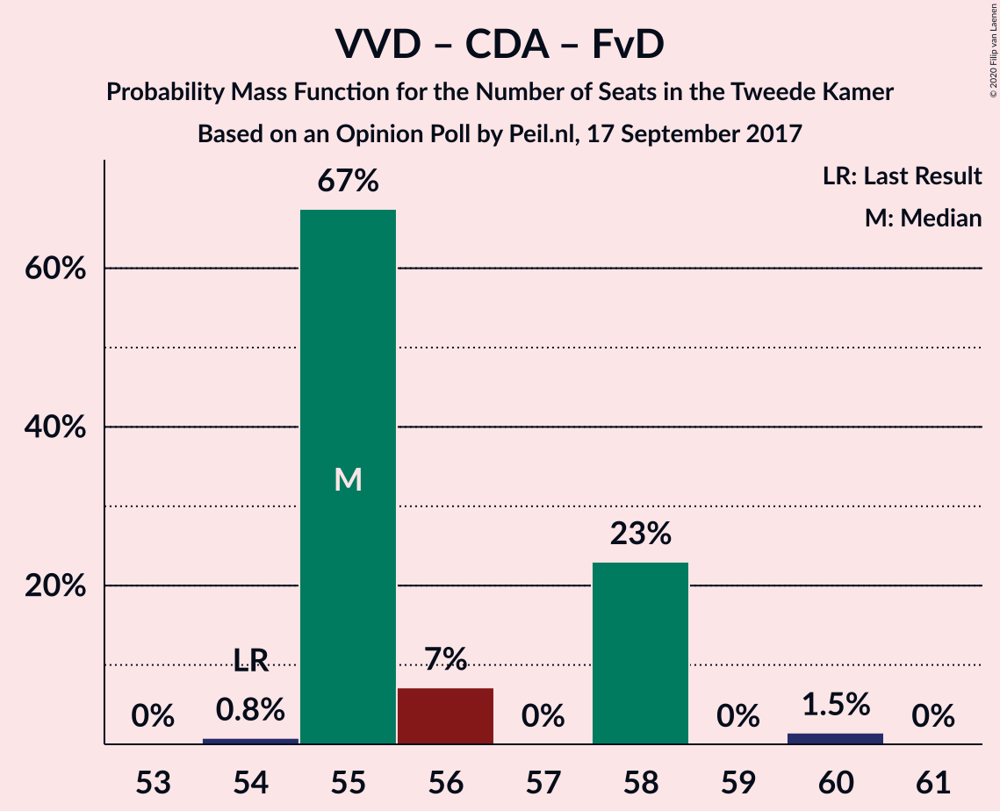

| Number of Seats | Probability | Accumulated | Special Marks |
|:---------------:|:-----------:|:-----------:|:-------------:|
| 54 | 0.8% | 100% | Last Result |
| 55 | 67% | 99.1% | Median |
| 56 | 7% | 32% |  |
| 57 | 0% | 25% |  |
| 58 | 23% | 24% |  |
| 59 | 0% | 1.5% |  |
| 60 | 1.5% | 1.5% |  |
| 61 | 0% | 0% |  |

### Volkspartij voor Vrijheid en Democratie – Christen-Democratisch Appèl

| Number of Seats | Probability | Accumulated | Special Marks |
|:---------------:|:-----------:|:-----------:|:-------------:|
| 45 | 0.1% | 100% |  |
| 46 | 0.4% | 99.9% |  |
| 47 | 6% | 99.5% |  |
| 48 | 69% | 93% | Median |
| 49 | 23% | 25% |  |
| 50 | 0% | 2% |  |
| 51 | 0% | 1.5% |  |
| 52 | 1.5% | 1.5% | Last Result |
| 53 | 0% | 0% |  |

### Democraten 66 – Christen-Democratisch Appèl – Partij van de Arbeid

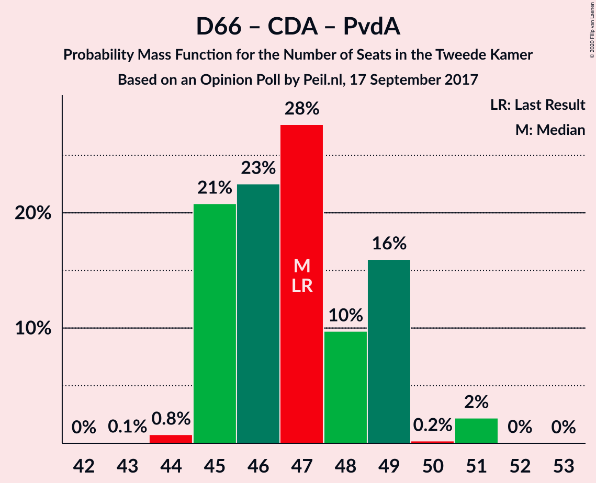

| Number of Seats | Probability | Accumulated | Special Marks |
|:---------------:|:-----------:|:-----------:|:-------------:|
| 45 | 23% | 100% |  |
| 46 | 60% | 77% | Median |
| 47 | 3% | 17% | Last Result |
| 48 | 4% | 15% |  |
| 49 | 11% | 11% |  |
| 50 | 0% | 0.2% |  |
| 51 | 0.2% | 0.2% |  |
| 52 | 0% | 0% |  |

### Volkspartij voor Vrijheid en Democratie – Partij van de Arbeid

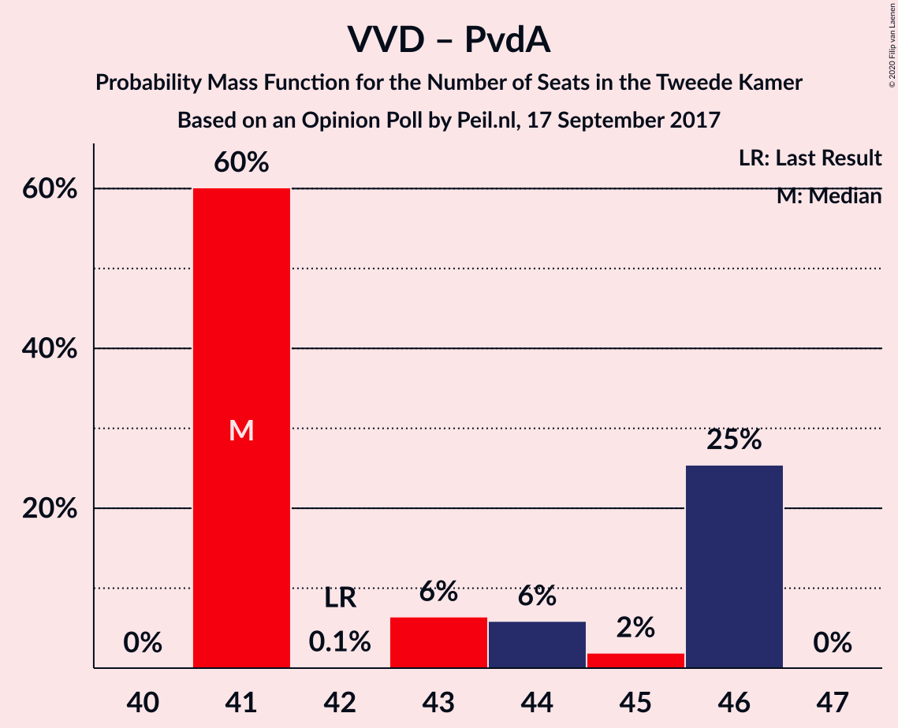

| Number of Seats | Probability | Accumulated | Special Marks |
|:---------------:|:-----------:|:-----------:|:-------------:|
| 41 | 60% | 100% | Median |
| 42 | 0.1% | 40% | Last Result |
| 43 | 6% | 40% |  |
| 44 | 6% | 33% |  |
| 45 | 2% | 27% |  |
| 46 | 25% | 25% |  |
| 47 | 0% | 0% |  |

### Democraten 66 – Christen-Democratisch Appèl

| Number of Seats | Probability | Accumulated | Special Marks |
|:---------------:|:-----------:|:-----------:|:-------------:|
| 33 | 24% | 100% |  |
| 34 | 0.3% | 76% |  |
| 35 | 0.6% | 76% |  |
| 36 | 67% | 75% | Median |
| 37 | 8% | 9% |  |
| 38 | 0.7% | 0.7% | Last Result |
| 39 | 0% | 0% |  |

### Christen-Democratisch Appèl – Partij van de Arbeid – ChristenUnie

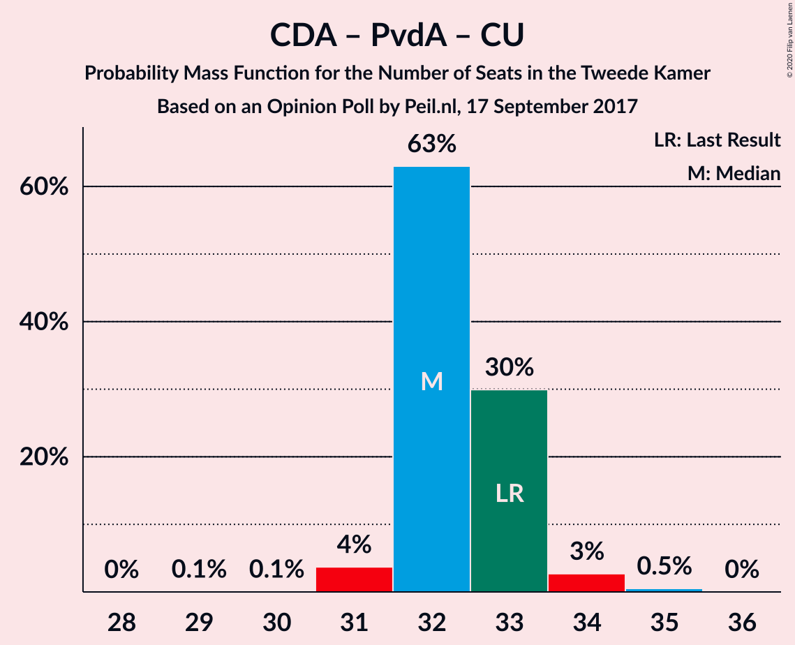

| Number of Seats | Probability | Accumulated | Special Marks |
|:---------------:|:-----------:|:-----------:|:-------------:|
| 29 | 0.1% | 100% |  |
| 30 | 0.1% | 99.9% |  |
| 31 | 4% | 99.9% |  |
| 32 | 63% | 96% | Median |
| 33 | 30% | 33% | Last Result |
| 34 | 3% | 3% |  |
| 35 | 0.5% | 0.5% |  |
| 36 | 0% | 0% |  |

### Christen-Democratisch Appèl – Partij van de Arbeid

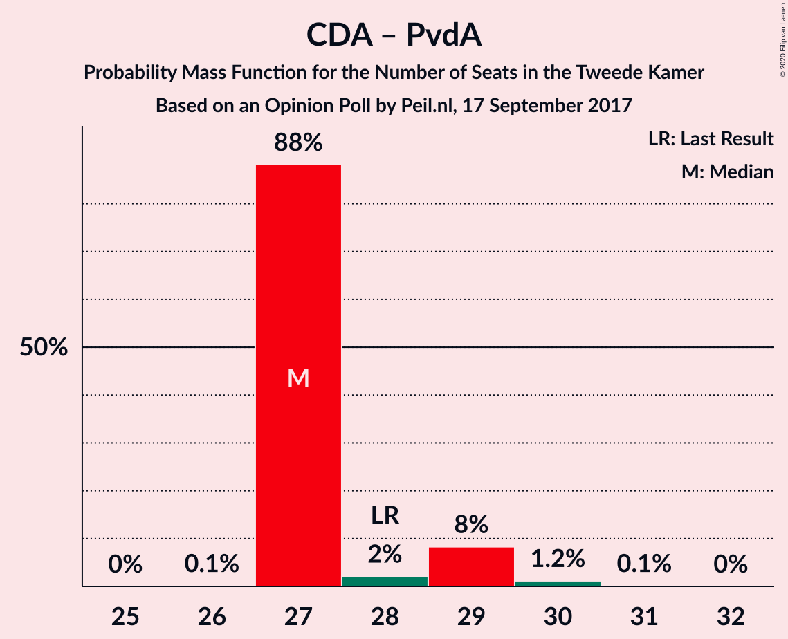

| Number of Seats | Probability | Accumulated | Special Marks |
|:---------------:|:-----------:|:-----------:|:-------------:|
| 26 | 0.1% | 100% |  |
| 27 | 88% | 99.9% | Median |
| 28 | 2% | 12% | Last Result |
| 29 | 8% | 10% |  |
| 30 | 1.2% | 1.3% |  |
| 31 | 0.1% | 0.1% |  |
| 32 | 0% | 0% |  |

## Technical Information

### Opinion Poll

+ **Polling firm:** Peil.nl
+ **Commissioner(s):** —
+ **Fieldwork period:** 17 September 2017

### Calculations

+ **Sample size:** 3000
+ **Simulations done:** 131,072
+ **Error estimate:** 2.23%

