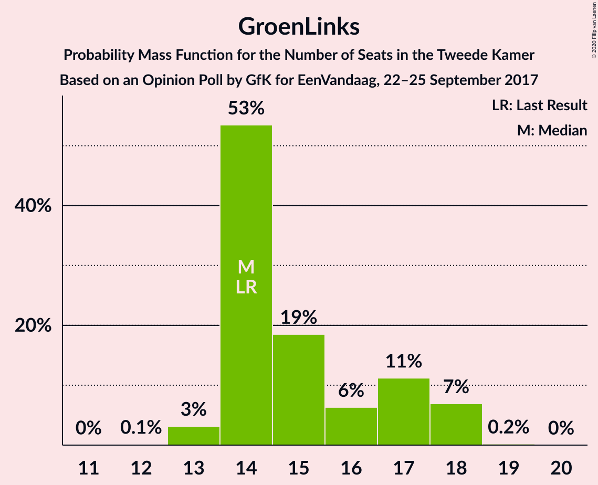
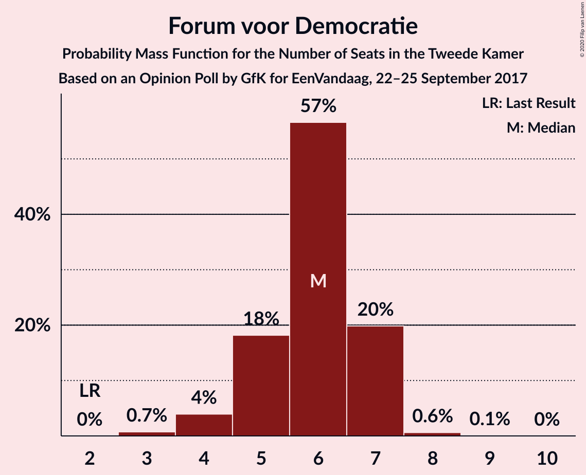
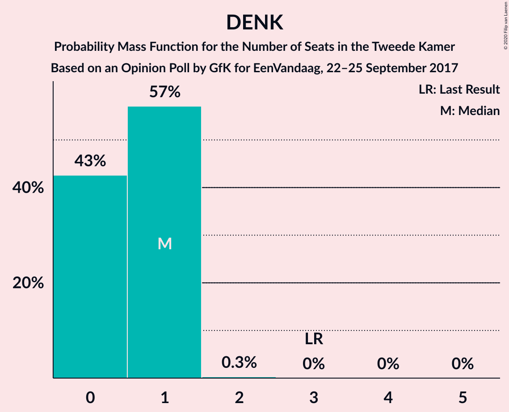
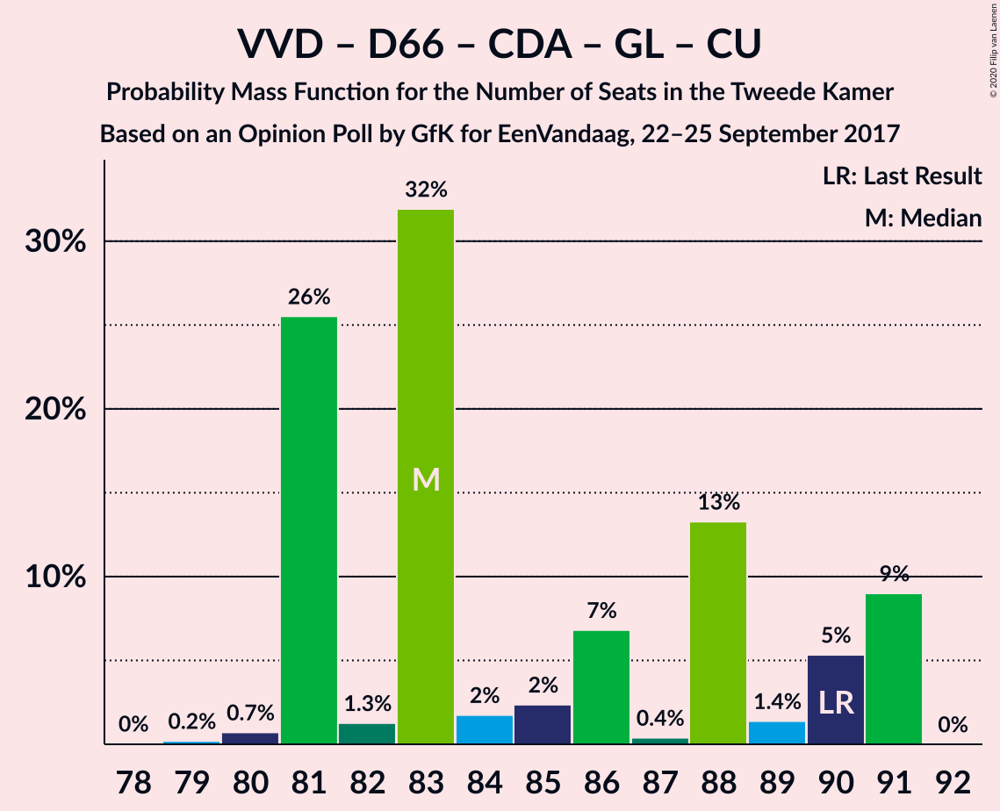
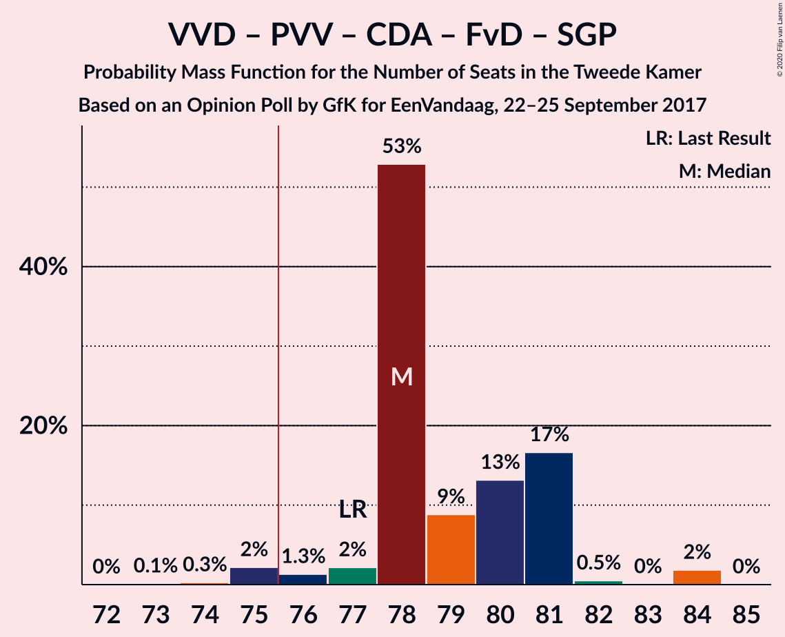
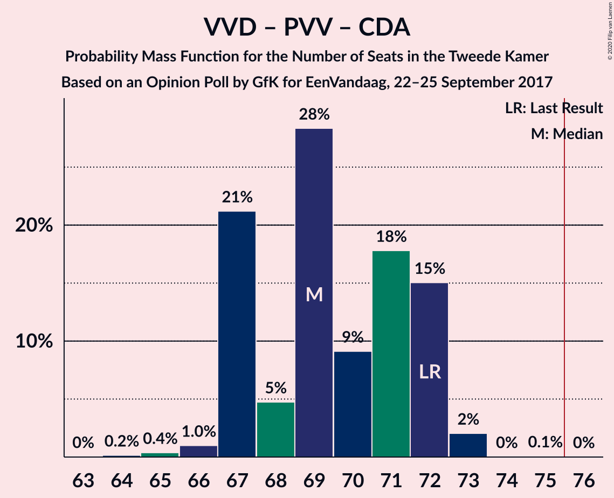
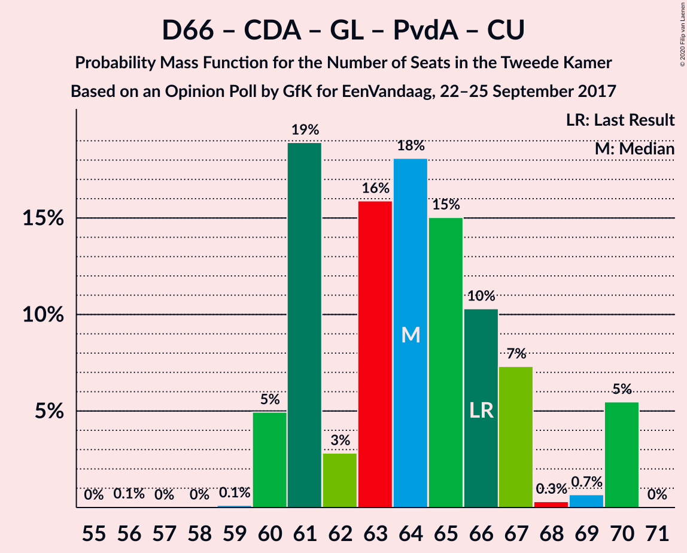
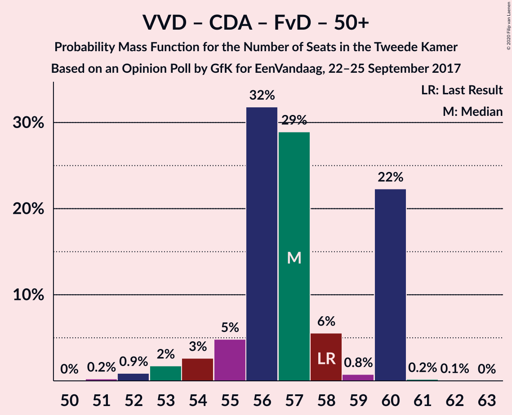
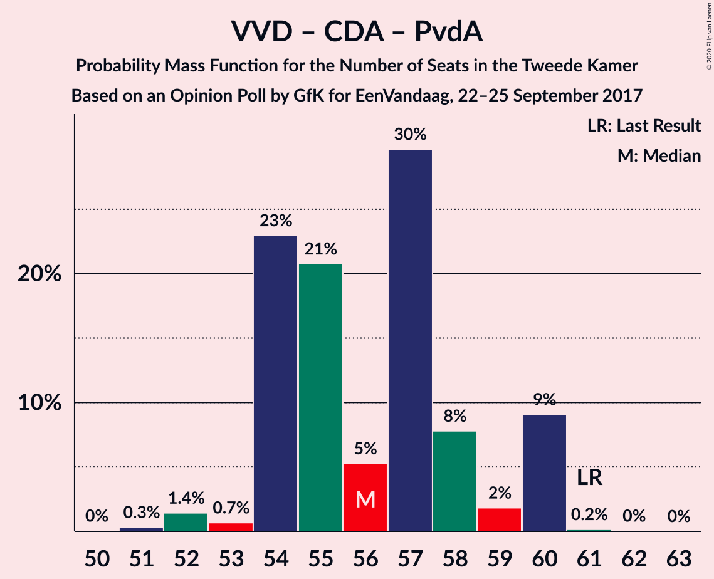
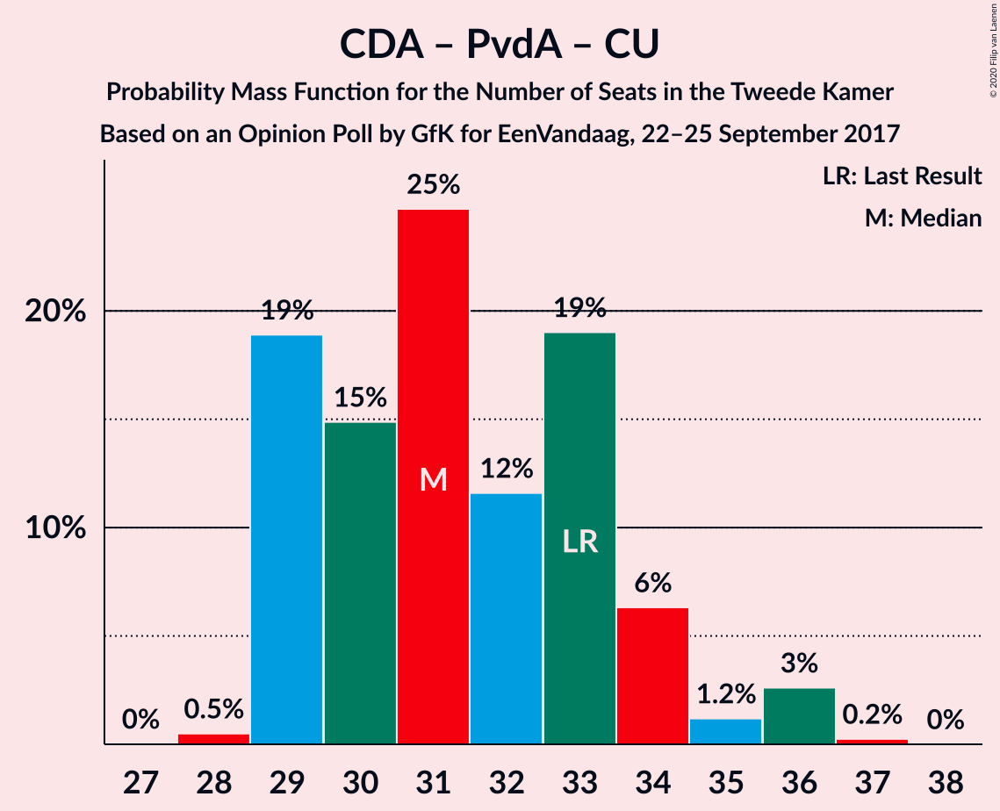

# Opinion Poll by GfK for EenVandaag, 22–25 September 2017

<a href="#voting-intentions">Voting Intentions</a> | <a href="#seats">Seats</a> | <a href="#coalitions">Coalitions</a> | <a href="#technical-information">Technical Information</a>

## Voting Intentions

### Confidence Intervals

| Party | Last Result | Poll Result | 80% Confidence Interval | 90% Confidence Interval | 95% Confidence Interval | 99% Confidence Interval |
|:-----:|:-----------:|:-----------:|:-----------------------:|:-----------------------:|:-----------------------:|:-----------------------:|
| Volkspartij voor Vrijheid en Democratie | 21.3% | 19.3% | 18.2–20.6% |17.8–20.9% |17.6–21.2% |17.0–21.8% |
| Partij voor de Vrijheid | 13.1% | 15.4% | 14.3–16.5% |14.0–16.8% |13.8–17.1% |13.3–17.6% |
| Democraten 66 | 12.2% | 11.3% | 10.4–12.3% |10.2–12.6% |10.0–12.9% |9.5–13.4% |
| Christen-Democratisch Appèl | 12.4% | 10.7% | 9.8–11.7% |9.5–11.9% |9.3–12.2% |8.9–12.7% |
| GroenLinks | 9.1% | 10.0% | 9.2–11.0% |8.9–11.2% |8.7–11.5% |8.3–11.9% |
| Socialistische Partij | 9.1% | 8.0% | 7.2–8.9% |7.0–9.1% |6.8–9.3% |6.5–9.8% |
| Partij van de Arbeid | 5.7% | 6.6% | 5.9–7.5% |5.7–7.7% |5.6–7.9% |5.3–8.3% |
| ChristenUnie | 3.4% | 4.0% | 3.4–4.6% |3.3–4.8% |3.2–5.0% |2.9–5.3% |
| Partij voor de Dieren | 3.2% | 4.0% | 3.4–4.6% |3.3–4.8% |3.2–5.0% |2.9–5.3% |
| Forum voor Democratie | 1.8% | 4.0% | 3.4–4.6% |3.3–4.8% |3.2–5.0% |2.9–5.3% |
| 50Plus | 3.1% | 3.3% | 2.8–3.9% |2.7–4.1% |2.6–4.3% |2.4–4.6% |
| Staatkundig Gereformeerde Partij | 2.1% | 2.7% | 2.2–3.2% |2.1–3.4% |2.0–3.5% |1.8–3.8% |
| DENK | 2.1% | 0.7% | 0.5–1.0% |0.4–1.1% |0.4–1.1% |0.3–1.3% |

*Note:* The poll result column reflects the actual value used in the calculations. Published results may vary slightly, and in addition be rounded to fewer digits.

## Seats

### Confidence Intervals

| Party | Last Result | Median | 80% Confidence Interval | 90% Confidence Interval | 95% Confidence Interval | 99% Confidence Interval |
|:-----:|:-----------:|:------:|:-----------------------:|:-----------------------:|:-----------------------:|:-----------------------:|
| <a href="#volkspartij-voor-vrijheid-en-democratie">Volkspartij voor Vrijheid en Democratie</a> | 33 | 29 | 29–32 |29–32 |29–32 |26–33 |
| <a href="#partij-voor-de-vrijheid">Partij voor de Vrijheid</a> | 20 | 25 | 23–25 |23–25 |23–25 |22–26 |
| <a href="#democraten-66">Democraten 66</a> | 19 | 18 | 17–18 |17–18 |17–18 |17–19 |
| <a href="#christen-democratisch-appèl">Christen-Democratisch Appèl</a> | 19 | 17 | 16–17 |16–17 |16–17 |15–20 |
| <a href="#groenlinks">GroenLinks</a> | 14 | 14 | 13–14 |13–14 |13–15 |13–17 |
| <a href="#socialistische-partij">Socialistische Partij</a> | 14 | 13 | 13 |13 |12–13 |11–14 |
| <a href="#partij-van-de-arbeid">Partij van de Arbeid</a> | 9 | 9 | 9 |9 |9 |8–11 |
| <a href="#christenunie">ChristenUnie</a> | 5 | 5 | 5–8 |5–8 |5–8 |4–8 |
| <a href="#partij-voor-de-dieren">Partij voor de Dieren</a> | 5 | 6 | 5–6 |5–6 |5–6 |4–7 |
| <a href="#forum-voor-democratie">Forum voor Democratie</a> | 2 | 6 | 5–6 |5–6 |5–6 |5–6 |
| <a href="#50plus">50Plus</a> | 4 | 4 | 4 |4 |4–5 |4–6 |
| <a href="#staatkundig-gereformeerde-partij">Staatkundig Gereformeerde Partij</a> | 3 | 3 | 3–5 |3–5 |3–5 |3–5 |
| <a href="#denk">DENK</a> | 3 | 1 | 0–1 |0–1 |0–1 |0–1 |

### Volkspartij voor Vrijheid en Democratie

*For a full overview of the results for this party, see the [Volkspartij voor Vrijheid en Democratie](party-volkspartijvoorvrijheidendemocratie.html) page.*

| Number of Seats | Probability | Accumulated | Special Marks |
|:---------------:|:-----------:|:-----------:|:-------------:|
| 24 | 0.1% | 100% |  |
| 25 | 0% | 99.9% |  |
| 26 | 0.4% | 99.9% |  |
| 27 | 0.3% | 99.5% |  |
| 28 | 1.1% | 99.2% |  |
| 29 | 85% | 98% | Median |
| 30 | 0.5% | 13% |  |
| 31 | 1.0% | 13% |  |
| 32 | 11% | 12% |  |
| 33 | 0.5% | 0.6% | Last Result |
| 34 | 0% | 0.1% |  |
| 35 | 0% | 0% |  |

### Partij voor de Vrijheid

*For a full overview of the results for this party, see the [Partij voor de Vrijheid](party-partijvoordevrijheid.html) page.*

| Number of Seats | Probability | Accumulated | Special Marks |
|:---------------:|:-----------:|:-----------:|:-------------:|
| 20 | 0.1% | 100% | Last Result |
| 21 | 0.1% | 99.9% |  |
| 22 | 1.0% | 99.8% |  |
| 23 | 12% | 98.8% |  |
| 24 | 0.6% | 87% |  |
| 25 | 85% | 86% | Median |
| 26 | 1.3% | 1.3% |  |
| 27 | 0% | 0.1% |  |
| 28 | 0% | 0% |  |

### Democraten 66

*For a full overview of the results for this party, see the [Democraten 66](party-democraten66.html) page.*

| Number of Seats | Probability | Accumulated | Special Marks |
|:---------------:|:-----------:|:-----------:|:-------------:|
| 15 | 0.1% | 100% |  |
| 16 | 0.2% | 99.8% |  |
| 17 | 13% | 99.7% |  |
| 18 | 85% | 86% | Median |
| 19 | 1.1% | 1.3% | Last Result |
| 20 | 0% | 0.1% |  |
| 21 | 0.1% | 0.1% |  |
| 22 | 0% | 0% |  |

### Christen-Democratisch Appèl

*For a full overview of the results for this party, see the [Christen-Democratisch Appèl](party-christen-democratischappèl.html) page.*

| Number of Seats | Probability | Accumulated | Special Marks |
|:---------------:|:-----------:|:-----------:|:-------------:|
| 13 | 0.1% | 100% |  |
| 14 | 0% | 99.9% |  |
| 15 | 2% | 99.9% |  |
| 16 | 12% | 98% |  |
| 17 | 85% | 86% | Median |
| 18 | 0.3% | 1.1% |  |
| 19 | 0.1% | 0.8% | Last Result |
| 20 | 0.7% | 0.7% |  |
| 21 | 0% | 0% |  |

### GroenLinks

*For a full overview of the results for this party, see the [GroenLinks](party-groenlinks.html) page.*

| Number of Seats | Probability | Accumulated | Special Marks |
|:---------------:|:-----------:|:-----------:|:-------------:|
| 13 | 11% | 100% |  |
| 14 | 86% | 89% | Last Result, Median |
| 15 | 0.4% | 3% |  |
| 16 | 2% | 2% |  |
| 17 | 0.6% | 0.7% |  |
| 18 | 0.1% | 0.1% |  |
| 19 | 0% | 0% |  |

### Socialistische Partij

*For a full overview of the results for this party, see the [Socialistische Partij](party-socialistischepartij.html) page.*

| Number of Seats | Probability | Accumulated | Special Marks |
|:---------------:|:-----------:|:-----------:|:-------------:|
| 10 | 0.1% | 100% |  |
| 11 | 2% | 99.9% |  |
| 12 | 0.9% | 98% |  |
| 13 | 96% | 97% | Median |
| 14 | 0.3% | 0.5% | Last Result |
| 15 | 0.2% | 0.2% |  |
| 16 | 0% | 0% |  |

### Partij van de Arbeid

*For a full overview of the results for this party, see the [Partij van de Arbeid](party-partijvandearbeid.html) page.*

| Number of Seats | Probability | Accumulated | Special Marks |
|:---------------:|:-----------:|:-----------:|:-------------:|
| 8 | 0.6% | 100% |  |
| 9 | 97% | 99.4% | Last Result, Median |
| 10 | 2% | 2% |  |
| 11 | 0.1% | 0.6% |  |
| 12 | 0.4% | 0.4% |  |
| 13 | 0% | 0.1% |  |
| 14 | 0% | 0% |  |

### ChristenUnie

*For a full overview of the results for this party, see the [ChristenUnie](party-christenunie.html) page.*

| Number of Seats | Probability | Accumulated | Special Marks |
|:---------------:|:-----------:|:-----------:|:-------------:|
| 4 | 1.0% | 100% |  |
| 5 | 86% | 99.0% | Last Result, Median |
| 6 | 1.0% | 13% |  |
| 7 | 0.4% | 12% |  |
| 8 | 11% | 11% |  |
| 9 | 0% | 0% |  |

### Partij voor de Dieren

*For a full overview of the results for this party, see the [Partij voor de Dieren](party-partijvoordedieren.html) page.*

| Number of Seats | Probability | Accumulated | Special Marks |
|:---------------:|:-----------:|:-----------:|:-------------:|
| 4 | 1.3% | 100% |  |
| 5 | 12% | 98.7% | Last Result |
| 6 | 86% | 87% | Median |
| 7 | 1.1% | 1.2% |  |
| 8 | 0.1% | 0.1% |  |
| 9 | 0% | 0% |  |

### Forum voor Democratie

*For a full overview of the results for this party, see the [Forum voor Democratie](party-forumvoordemocratie.html) page.*

| Number of Seats | Probability | Accumulated | Special Marks |
|:---------------:|:-----------:|:-----------:|:-------------:|
| 2 | 0% | 100% | Last Result |
| 3 | 0% | 100% |  |
| 4 | 0.2% | 100% |  |
| 5 | 12% | 99.8% |  |
| 6 | 87% | 88% | Median |
| 7 | 0.4% | 0.4% |  |
| 8 | 0% | 0% |  |

### 50Plus

*For a full overview of the results for this party, see the [50Plus](party-50plus.html) page.*

| Number of Seats | Probability | Accumulated | Special Marks |
|:---------------:|:-----------:|:-----------:|:-------------:|
| 3 | 0.1% | 100% |  |
| 4 | 97% | 99.9% | Last Result, Median |
| 5 | 1.1% | 3% |  |
| 6 | 2% | 2% |  |
| 7 | 0.1% | 0.1% |  |
| 8 | 0% | 0% |  |

### Staatkundig Gereformeerde Partij

*For a full overview of the results for this party, see the [Staatkundig Gereformeerde Partij](party-staatkundiggereformeerdepartij.html) page.*

| Number of Seats | Probability | Accumulated | Special Marks |
|:---------------:|:-----------:|:-----------:|:-------------:|
| 2 | 0.1% | 100% |  |
| 3 | 88% | 99.9% | Last Result, Median |
| 4 | 0.3% | 12% |  |
| 5 | 12% | 12% |  |
| 6 | 0% | 0% |  |

### DENK

*For a full overview of the results for this party, see the [DENK](party-denk.html) page.*

| Number of Seats | Probability | Accumulated | Special Marks |
|:---------------:|:-----------:|:-----------:|:-------------:|
| 0 | 13% | 100% |  |
| 1 | 87% | 87% | Median |
| 2 | 0% | 0% |  |
| 3 | 0% | 0% | Last Result |

## Coalitions

### Confidence Intervals

| Coalition | Last Result | Median | Majority? | 80% Confidence Interval | 90% Confidence Interval | 95% Confidence Interval | 99% Confidence Interval |
|:---------:|:-----------:|:------:|:---------:|:-----------------------:|:-----------------------:|:-----------------------:|:-----------------------:|
| Volkspartij voor Vrijheid en Democratie – Democraten 66 – Christen-Democratisch Appèl – GroenLinks – ChristenUnie | 90 | 83 | 100% | 83–86 | 83–86 | 83–86 | 80–89 |
| Volkspartij voor Vrijheid en Democratie – Democraten 66 – Christen-Democratisch Appèl – Partij van de Arbeid – ChristenUnie | 85 | 78 | 98.5% | 78–82 | 78–82 | 78–82 | 74–85 |
| Volkspartij voor Vrijheid en Democratie – Partij voor de Vrijheid – Christen-Democratisch Appèl – Forum voor Democratie – Staatkundig Gereformeerde Partij | 77 | 80 | 99.8% | 80–81 | 80–81 | 80–81 | 76–82 |
| Volkspartij voor Vrijheid en Democratie – Partij voor de Vrijheid – Christen-Democratisch Appèl – Forum voor Democratie | 74 | 77 | 97% | 76–77 | 76–77 | 75–77 | 73–79 |
| Democraten 66 – Christen-Democratisch Appèl – GroenLinks – Socialistische Partij – Partij van de Arbeid – ChristenUnie | 80 | 76 | 98% | 76 | 76 | 76 | 73–80 |
| Volkspartij voor Vrijheid en Democratie – Democraten 66 – Christen-Democratisch Appèl – ChristenUnie | 76 | 69 | 0% | 69–73 | 69–73 | 69–73 | 64–75 |
| Volkspartij voor Vrijheid en Democratie – Partij voor de Vrijheid – Christen-Democratisch Appèl | 72 | 71 | 0% | 71 | 71 | 70–71 | 67–73 |
| Volkspartij voor Vrijheid en Democratie – Democraten 66 – Christen-Democratisch Appèl | 71 | 64 | 0% | 64–65 | 64–65 | 63–65 | 60–70 |
| Democraten 66 – Christen-Democratisch Appèl – GroenLinks – Partij van de Arbeid – ChristenUnie | 66 | 63 | 0% | 63 | 63 | 63 | 61–68 |
| Volkspartij voor Vrijheid en Democratie – Christen-Democratisch Appèl – Forum voor Democratie – 50Plus – Staatkundig Gereformeerde Partij | 61 | 59 | 0% | 59–62 | 59–62 | 59–62 | 57–64 |
| Volkspartij voor Vrijheid en Democratie – Democraten 66 – Partij van de Arbeid | 61 | 56 | 0% | 56–58 | 56–58 | 56–58 | 55–60 |
| Volkspartij voor Vrijheid en Democratie – Christen-Democratisch Appèl – Forum voor Democratie – Staatkundig Gereformeerde Partij | 57 | 55 | 0% | 55–58 | 55–58 | 55–58 | 51–60 |
| Volkspartij voor Vrijheid en Democratie – Christen-Democratisch Appèl – Forum voor Democratie – 50Plus | 58 | 56 | 0% | 56–57 | 56–57 | 56–57 | 54–61 |
| Volkspartij voor Vrijheid en Democratie – Christen-Democratisch Appèl – Partij van de Arbeid | 61 | 55 | 0% | 55–57 | 55–57 | 55–57 | 53–61 |
| Volkspartij voor Vrijheid en Democratie – Christen-Democratisch Appèl – Forum voor Democratie | 54 | 52 | 0% | 52–53 | 52–53 | 52–53 | 48–57 |
| Volkspartij voor Vrijheid en Democratie – Christen-Democratisch Appèl | 52 | 46 | 0% | 46–48 | 46–48 | 46–48 | 43–51 |
| Democraten 66 – Christen-Democratisch Appèl – Partij van de Arbeid | 47 | 44 | 0% | 42–44 | 42–44 | 42–44 | 40–49 |
| Volkspartij voor Vrijheid en Democratie – Partij van de Arbeid | 42 | 38 | 0% | 38–41 | 38–41 | 38–41 | 37–42 |
| Democraten 66 – Christen-Democratisch Appèl | 38 | 35 | 0% | 33–35 | 33–35 | 33–35 | 32–39 |
| Christen-Democratisch Appèl – Partij van de Arbeid – ChristenUnie | 33 | 31 | 0% | 31–33 | 31–33 | 31–33 | 28–35 |
| Christen-Democratisch Appèl – Partij van de Arbeid | 28 | 26 | 0% | 25–26 | 25–26 | 25–26 | 23–30 |

### Volkspartij voor Vrijheid en Democratie – Democraten 66 – Christen-Democratisch Appèl – GroenLinks – ChristenUnie

| Number of Seats | Probability | Accumulated | Special Marks |
|:---------------:|:-----------:|:-----------:|:-------------:|
| 78 | 0.1% | 100% |  |
| 79 | 0% | 99.9% |  |
| 80 | 0.9% | 99.9% |  |
| 81 | 0% | 99.0% |  |
| 82 | 0.7% | 98.9% |  |
| 83 | 85% | 98% | Median |
| 84 | 0.1% | 13% |  |
| 85 | 0.1% | 13% |  |
| 86 | 11% | 13% |  |
| 87 | 0% | 1.3% |  |
| 88 | 0.5% | 1.3% |  |
| 89 | 0.7% | 0.7% |  |
| 90 | 0% | 0% | Last Result |

### Volkspartij voor Vrijheid en Democratie – Democraten 66 – Christen-Democratisch Appèl – Partij van de Arbeid – ChristenUnie

| Number of Seats | Probability | Accumulated | Special Marks |
|:---------------:|:-----------:|:-----------:|:-------------:|
| 73 | 0.1% | 100% |  |
| 74 | 0.9% | 99.9% |  |
| 75 | 0.4% | 99.0% |  |
| 76 | 0.4% | 98.5% | Majority |
| 77 | 0.2% | 98% |  |
| 78 | 85% | 98% | Median |
| 79 | 0.2% | 13% |  |
| 80 | 0.9% | 13% |  |
| 81 | 0.1% | 12% |  |
| 82 | 11% | 12% |  |
| 83 | 0% | 0.7% |  |
| 84 | 0% | 0.7% |  |
| 85 | 0.7% | 0.7% | Last Result |
| 86 | 0% | 0% |  |

### Volkspartij voor Vrijheid en Democratie – Partij voor de Vrijheid – Christen-Democratisch Appèl – Forum voor Democratie – Staatkundig Gereformeerde Partij

| Number of Seats | Probability | Accumulated | Special Marks |
|:---------------:|:-----------:|:-----------:|:-------------:|
| 73 | 0.1% | 100% |  |
| 74 | 0% | 99.9% |  |
| 75 | 0.1% | 99.9% |  |
| 76 | 0.4% | 99.8% | Majority |
| 77 | 0.3% | 99.3% | Last Result |
| 78 | 1.0% | 99.1% |  |
| 79 | 0.6% | 98% |  |
| 80 | 85% | 98% | Median |
| 81 | 11% | 12% |  |
| 82 | 0.8% | 0.8% |  |
| 83 | 0% | 0.1% |  |
| 84 | 0% | 0% |  |

### Volkspartij voor Vrijheid en Democratie – Partij voor de Vrijheid – Christen-Democratisch Appèl – Forum voor Democratie

| Number of Seats | Probability | Accumulated | Special Marks |
|:---------------:|:-----------:|:-----------:|:-------------:|
| 70 | 0.1% | 100% |  |
| 71 | 0% | 99.9% |  |
| 72 | 0.1% | 99.8% |  |
| 73 | 0.5% | 99.7% |  |
| 74 | 0.7% | 99.2% | Last Result |
| 75 | 1.2% | 98.6% |  |
| 76 | 11% | 97% | Majority |
| 77 | 85% | 86% | Median |
| 78 | 0% | 0.9% |  |
| 79 | 0.7% | 0.8% |  |
| 80 | 0% | 0.1% |  |
| 81 | 0% | 0% |  |

### Democraten 66 – Christen-Democratisch Appèl – GroenLinks – Socialistische Partij – Partij van de Arbeid – ChristenUnie

| Number of Seats | Probability | Accumulated | Special Marks |
|:---------------:|:-----------:|:-----------:|:-------------:|
| 72 | 0.1% | 100% |  |
| 73 | 1.0% | 99.9% |  |
| 74 | 0.5% | 98.9% |  |
| 75 | 0.8% | 98% |  |
| 76 | 96% | 98% | Median, Majority |
| 77 | 0.1% | 2% |  |
| 78 | 0.3% | 2% |  |
| 79 | 0.4% | 1.3% |  |
| 80 | 0.8% | 0.9% | Last Result |
| 81 | 0.1% | 0.2% |  |
| 82 | 0% | 0.1% |  |
| 83 | 0% | 0% |  |

### Volkspartij voor Vrijheid en Democratie – Democraten 66 – Christen-Democratisch Appèl – ChristenUnie

| Number of Seats | Probability | Accumulated | Special Marks |
|:---------------:|:-----------:|:-----------:|:-------------:|
| 64 | 1.0% | 100% |  |
| 65 | 0% | 99.0% |  |
| 66 | 0.2% | 99.0% |  |
| 67 | 0.7% | 98.8% |  |
| 68 | 0.5% | 98% |  |
| 69 | 85% | 98% | Median |
| 70 | 0% | 13% |  |
| 71 | 0.6% | 13% |  |
| 72 | 0.1% | 12% |  |
| 73 | 11% | 12% |  |
| 74 | 0% | 0.7% |  |
| 75 | 0.7% | 0.7% |  |
| 76 | 0% | 0% | Last Result, Majority |

### Volkspartij voor Vrijheid en Democratie – Partij voor de Vrijheid – Christen-Democratisch Appèl

| Number of Seats | Probability | Accumulated | Special Marks |
|:---------------:|:-----------:|:-----------:|:-------------:|
| 64 | 0.1% | 100% |  |
| 65 | 0.1% | 99.9% |  |
| 66 | 0.2% | 99.8% |  |
| 67 | 0.3% | 99.6% |  |
| 68 | 0.7% | 99.3% |  |
| 69 | 1.0% | 98.6% |  |
| 70 | 0.2% | 98% |  |
| 71 | 96% | 97% | Median |
| 72 | 0.5% | 1.4% | Last Result |
| 73 | 0.7% | 0.8% |  |
| 74 | 0% | 0.1% |  |
| 75 | 0% | 0.1% |  |
| 76 | 0% | 0% | Majority |

### Volkspartij voor Vrijheid en Democratie – Democraten 66 – Christen-Democratisch Appèl

| Number of Seats | Probability | Accumulated | Special Marks |
|:---------------:|:-----------:|:-----------:|:-------------:|
| 58 | 0.1% | 100% |  |
| 59 | 0% | 99.9% |  |
| 60 | 1.0% | 99.9% |  |
| 61 | 0.7% | 98.9% |  |
| 62 | 0.6% | 98% |  |
| 63 | 0.2% | 98% |  |
| 64 | 85% | 97% | Median |
| 65 | 12% | 13% |  |
| 66 | 0% | 0.8% |  |
| 67 | 0% | 0.8% |  |
| 68 | 0% | 0.8% |  |
| 69 | 0% | 0.7% |  |
| 70 | 0.7% | 0.7% |  |
| 71 | 0% | 0% | Last Result |

### Democraten 66 – Christen-Democratisch Appèl – GroenLinks – Partij van de Arbeid – ChristenUnie

| Number of Seats | Probability | Accumulated | Special Marks |
|:---------------:|:-----------:|:-----------:|:-------------:|
| 60 | 0.1% | 100% |  |
| 61 | 0.6% | 99.8% |  |
| 62 | 1.0% | 99.2% |  |
| 63 | 96% | 98% | Median |
| 64 | 0.6% | 2% |  |
| 65 | 0.3% | 2% |  |
| 66 | 0.1% | 1.4% | Last Result |
| 67 | 0.4% | 1.3% |  |
| 68 | 0.8% | 0.9% |  |
| 69 | 0.1% | 0.1% |  |
| 70 | 0% | 0% |  |

### Volkspartij voor Vrijheid en Democratie – Christen-Democratisch Appèl – Forum voor Democratie – 50Plus – Staatkundig Gereformeerde Partij

| Number of Seats | Probability | Accumulated | Special Marks |
|:---------------:|:-----------:|:-----------:|:-------------:|
| 55 | 0.1% | 100% |  |
| 56 | 0.3% | 99.9% |  |
| 57 | 0.3% | 99.6% |  |
| 58 | 1.0% | 99.3% |  |
| 59 | 85% | 98% | Median |
| 60 | 0.1% | 13% |  |
| 61 | 0.6% | 13% | Last Result |
| 62 | 12% | 13% |  |
| 63 | 0.2% | 0.9% |  |
| 64 | 0.7% | 0.8% |  |
| 65 | 0% | 0% |  |

### Volkspartij voor Vrijheid en Democratie – Democraten 66 – Partij van de Arbeid

| Number of Seats | Probability | Accumulated | Special Marks |
|:---------------:|:-----------:|:-----------:|:-------------:|
| 50 | 0.1% | 100% |  |
| 51 | 0% | 99.9% |  |
| 52 | 0.3% | 99.9% |  |
| 53 | 0% | 99.7% |  |
| 54 | 0.1% | 99.6% |  |
| 55 | 2% | 99.6% |  |
| 56 | 85% | 98% | Median |
| 57 | 0.2% | 13% |  |
| 58 | 12% | 13% |  |
| 59 | 0.6% | 1.5% |  |
| 60 | 0.8% | 0.8% |  |
| 61 | 0% | 0.1% | Last Result |
| 62 | 0% | 0% |  |

### Volkspartij voor Vrijheid en Democratie – Christen-Democratisch Appèl – Forum voor Democratie – Staatkundig Gereformeerde Partij

| Number of Seats | Probability | Accumulated | Special Marks |
|:---------------:|:-----------:|:-----------:|:-------------:|
| 50 | 0.1% | 100% |  |
| 51 | 0.5% | 99.9% |  |
| 52 | 0.9% | 99.4% |  |
| 53 | 0.2% | 98% |  |
| 54 | 0.2% | 98% |  |
| 55 | 85% | 98% | Median |
| 56 | 1.0% | 13% |  |
| 57 | 0% | 12% | Last Result |
| 58 | 11% | 12% |  |
| 59 | 0.1% | 0.8% |  |
| 60 | 0.7% | 0.8% |  |
| 61 | 0% | 0% |  |

### Volkspartij voor Vrijheid en Democratie – Christen-Democratisch Appèl – Forum voor Democratie – 50Plus

| Number of Seats | Probability | Accumulated | Special Marks |
|:---------------:|:-----------:|:-----------:|:-------------:|
| 52 | 0.1% | 100% |  |
| 53 | 0.3% | 99.8% |  |
| 54 | 0.3% | 99.5% |  |
| 55 | 1.0% | 99.2% |  |
| 56 | 85% | 98% | Median |
| 57 | 11% | 13% |  |
| 58 | 0.1% | 1.5% | Last Result |
| 59 | 0.6% | 1.4% |  |
| 60 | 0% | 0.8% |  |
| 61 | 0.7% | 0.8% |  |
| 62 | 0% | 0% |  |

### Volkspartij voor Vrijheid en Democratie – Christen-Democratisch Appèl – Partij van de Arbeid

| Number of Seats | Probability | Accumulated | Special Marks |
|:---------------:|:-----------:|:-----------:|:-------------:|
| 50 | 0.2% | 100% |  |
| 51 | 0% | 99.8% |  |
| 52 | 0.1% | 99.8% |  |
| 53 | 2% | 99.7% |  |
| 54 | 0.5% | 98% |  |
| 55 | 85% | 98% | Median |
| 56 | 0.1% | 13% |  |
| 57 | 12% | 13% |  |
| 58 | 0.1% | 0.9% |  |
| 59 | 0% | 0.8% |  |
| 60 | 0% | 0.8% |  |
| 61 | 0.7% | 0.8% | Last Result |
| 62 | 0% | 0% |  |

### Volkspartij voor Vrijheid en Democratie – Christen-Democratisch Appèl – Forum voor Democratie

| Number of Seats | Probability | Accumulated | Special Marks |
|:---------------:|:-----------:|:-----------:|:-------------:|
| 47 | 0.1% | 100% |  |
| 48 | 0.5% | 99.9% |  |
| 49 | 1.0% | 99.3% |  |
| 50 | 0.2% | 98% |  |
| 51 | 0.5% | 98% |  |
| 52 | 85% | 98% | Median |
| 53 | 12% | 13% |  |
| 54 | 0.1% | 0.9% | Last Result |
| 55 | 0% | 0.8% |  |
| 56 | 0% | 0.8% |  |
| 57 | 0.7% | 0.8% |  |
| 58 | 0% | 0% |  |

### Volkspartij voor Vrijheid en Democratie – Christen-Democratisch Appèl

| Number of Seats | Probability | Accumulated | Special Marks |
|:---------------:|:-----------:|:-----------:|:-------------:|
| 40 | 0.1% | 100% |  |
| 41 | 0% | 99.9% |  |
| 42 | 0.3% | 99.9% |  |
| 43 | 1.0% | 99.5% |  |
| 44 | 0.4% | 98.5% |  |
| 45 | 0.5% | 98% |  |
| 46 | 85% | 98% | Median |
| 47 | 0.1% | 13% |  |
| 48 | 12% | 13% |  |
| 49 | 0.1% | 0.8% |  |
| 50 | 0% | 0.8% |  |
| 51 | 0.7% | 0.8% |  |
| 52 | 0% | 0% | Last Result |

### Democraten 66 – Christen-Democratisch Appèl – Partij van de Arbeid

| Number of Seats | Probability | Accumulated | Special Marks |
|:---------------:|:-----------:|:-----------:|:-------------:|
| 39 | 0.1% | 100% |  |
| 40 | 0.5% | 99.9% |  |
| 41 | 0.7% | 99.5% |  |
| 42 | 12% | 98.7% |  |
| 43 | 0.1% | 87% |  |
| 44 | 85% | 86% | Median |
| 45 | 0.1% | 1.4% |  |
| 46 | 0.3% | 1.3% |  |
| 47 | 0.2% | 0.9% | Last Result |
| 48 | 0% | 0.8% |  |
| 49 | 0.7% | 0.7% |  |
| 50 | 0% | 0% |  |

### Volkspartij voor Vrijheid en Democratie – Partij van de Arbeid

| Number of Seats | Probability | Accumulated | Special Marks |
|:---------------:|:-----------:|:-----------:|:-------------:|
| 34 | 0.1% | 100% |  |
| 35 | 0.3% | 99.9% |  |
| 36 | 0% | 99.5% |  |
| 37 | 0% | 99.5% |  |
| 38 | 86% | 99.5% | Median |
| 39 | 0.5% | 13% |  |
| 40 | 0.1% | 13% |  |
| 41 | 12% | 13% |  |
| 42 | 0.5% | 0.7% | Last Result |
| 43 | 0.1% | 0.2% |  |
| 44 | 0% | 0.1% |  |
| 45 | 0% | 0% |  |

### Democraten 66 – Christen-Democratisch Appèl

| Number of Seats | Probability | Accumulated | Special Marks |
|:---------------:|:-----------:|:-----------:|:-------------:|
| 29 | 0.1% | 100% |  |
| 30 | 0% | 99.9% |  |
| 31 | 0.1% | 99.9% |  |
| 32 | 2% | 99.8% |  |
| 33 | 11% | 98% |  |
| 34 | 0.5% | 86% |  |
| 35 | 85% | 86% | Median |
| 36 | 0% | 0.9% |  |
| 37 | 0.1% | 0.9% |  |
| 38 | 0% | 0.7% | Last Result |
| 39 | 0.7% | 0.7% |  |
| 40 | 0% | 0% |  |

### Christen-Democratisch Appèl – Partij van de Arbeid – ChristenUnie

| Number of Seats | Probability | Accumulated | Special Marks |
|:---------------:|:-----------:|:-----------:|:-------------:|
| 28 | 0.6% | 100% |  |
| 29 | 1.0% | 99.4% |  |
| 30 | 0.6% | 98% |  |
| 31 | 85% | 98% | Median |
| 32 | 0.2% | 13% |  |
| 33 | 12% | 13% | Last Result |
| 34 | 0.4% | 1.2% |  |
| 35 | 0.7% | 0.8% |  |
| 36 | 0% | 0% |  |

### Christen-Democratisch Appèl – Partij van de Arbeid

| Number of Seats | Probability | Accumulated | Special Marks |
|:---------------:|:-----------:|:-----------:|:-------------:|
| 23 | 0.6% | 100% |  |
| 24 | 0.6% | 99.3% |  |
| 25 | 12% | 98.8% |  |
| 26 | 85% | 87% | Median |
| 27 | 0.6% | 2% |  |
| 28 | 0.2% | 0.9% | Last Result |
| 29 | 0% | 0.8% |  |
| 30 | 0.7% | 0.8% |  |
| 31 | 0% | 0% |  |

## Technical Information

### Opinion Poll

+ **Polling firm:** GfK
+ **Commissioner(s):** EenVandaag
+ **Fieldwork period:** 22–25 September 2017

### Calculations

+ **Sample size:** 1837
+ **Simulations done:** 131,072
+ **Error estimate:** 1.55%

