# Opinion Poll by Peil.nl, 1 October 2017

<a href="#voting-intentions">Voting Intentions</a> | <a href="#seats">Seats</a> | <a href="#coalitions">Coalitions</a> | <a href="#technical-information">Technical Information</a>

## Voting Intentions

### Confidence Intervals

| Party | Last Result | Poll Result | 80% Confidence Interval | 90% Confidence Interval | 95% Confidence Interval | 99% Confidence Interval |
|:-----:|:-----------:|:-----------:|:-----------------------:|:-----------------------:|:-----------------------:|:-----------------------:|
| Volkspartij voor Vrijheid en Democratie | 21.3% | 20.7% | 19.7–21.6% |19.5–21.9% |19.3–22.2% |18.8–22.6% |
| Democraten 66 | 12.2% | 12.7% | 11.9–13.5% |11.7–13.7% |11.5–13.9% |11.2–14.3% |
| Partij voor de Vrijheid | 13.1% | 12.0% | 11.3–12.8% |11.1–13.0% |10.9–13.2% |10.5–13.6% |
| Christen-Democratisch Appèl | 12.4% | 10.0% | 9.3–10.7% |9.1–10.9% |9.0–11.1% |8.7–11.5% |
| GroenLinks | 9.1% | 9.3% | 8.7–10.1% |8.5–10.3% |8.3–10.4% |8.0–10.8% |
| Partij van de Arbeid | 5.7% | 8.0% | 7.4–8.7% |7.2–8.9% |7.1–9.0% |6.8–9.4% |
| Socialistische Partij | 9.1% | 7.3% | 6.8–8.0% |6.6–8.2% |6.4–8.3% |6.2–8.6% |
| Forum voor Democratie | 1.8% | 6.0% | 5.5–6.6% |5.3–6.8% |5.2–6.9% |5.0–7.2% |
| Partij voor de Dieren | 3.2% | 4.0% | 3.6–4.5% |3.4–4.6% |3.4–4.8% |3.2–5.0% |
| ChristenUnie | 3.4% | 3.3% | 2.9–3.8% |2.8–3.9% |2.7–4.0% |2.6–4.3% |
| 50Plus | 3.1% | 2.7% | 2.3–3.1% |2.2–3.2% |2.1–3.3% |2.0–3.5% |
| Staatkundig Gereformeerde Partij | 2.1% | 2.0% | 1.7–2.4% |1.6–2.5% |1.6–2.6% |1.4–2.8% |
| DENK | 2.1% | 2.0% | 1.7–2.4% |1.6–2.5% |1.6–2.6% |1.4–2.8% |

*Note:* The poll result column reflects the actual value used in the calculations. Published results may vary slightly, and in addition be rounded to fewer digits.

## Seats

### Confidence Intervals

| Party | Last Result | Median | 80% Confidence Interval | 90% Confidence Interval | 95% Confidence Interval | 99% Confidence Interval |
|:-----:|:-----------:|:------:|:-----------------------:|:-----------------------:|:-----------------------:|:-----------------------:|
| <a href="#volkspartij-voor-vrijheid-en-democratie">Volkspartij voor Vrijheid en Democratie</a> | 33 | 33 | 31–33 |29–33 |29–33 |29–34 |
| <a href="#democraten-66">Democraten 66</a> | 19 | 19 | 19 |18–20 |18–21 |17–21 |
| <a href="#partij-voor-de-vrijheid">Partij voor de Vrijheid</a> | 20 | 17 | 17–18 |17–20 |16–20 |16–21 |
| <a href="#christen-democratisch-appèl">Christen-Democratisch Appèl</a> | 19 | 16 | 14–16 |14–16 |14–17 |13–17 |
| <a href="#groenlinks">GroenLinks</a> | 14 | 14 | 14 |13–15 |13–15 |13–17 |
| <a href="#partij-van-de-arbeid">Partij van de Arbeid</a> | 9 | 13 | 12–13 |12–13 |11–13 |11–14 |
| <a href="#socialistische-partij">Socialistische Partij</a> | 14 | 11 | 11 |10–12 |10–12 |9–12 |
| <a href="#forum-voor-democratie">Forum voor Democratie</a> | 2 | 8 | 8–9 |8–10 |8–10 |7–10 |
| <a href="#partij-voor-de-dieren">Partij voor de Dieren</a> | 5 | 5 | 5–7 |5–7 |5–7 |5–8 |
| <a href="#christenunie">ChristenUnie</a> | 5 | 5 | 5 |5 |4–6 |4–6 |
| <a href="#50plus">50Plus</a> | 4 | 4 | 3–4 |3–4 |3–5 |3–5 |
| <a href="#staatkundig-gereformeerde-partij">Staatkundig Gereformeerde Partij</a> | 3 | 3 | 2–3 |2–3 |2–3 |2–3 |
| <a href="#denk">DENK</a> | 3 | 2 | 2–3 |2–3 |2–3 |2–3 |

### Volkspartij voor Vrijheid en Democratie

*For a full overview of the results for this party, see the [Volkspartij voor Vrijheid en Democratie](party-volkspartijvoorvrijheidendemocratie.html) page.*

| Number of Seats | Probability | Accumulated | Special Marks |
|:---------------:|:-----------:|:-----------:|:-------------:|
| 29 | 5% | 100% |  |
| 30 | 1.0% | 95% |  |
| 31 | 7% | 94% |  |
| 32 | 5% | 86% |  |
| 33 | 80% | 81% | Last Result, Median |
| 34 | 0.9% | 1.0% |  |
| 35 | 0.1% | 0.1% |  |
| 36 | 0% | 0% |  |

### Democraten 66

*For a full overview of the results for this party, see the [Democraten 66](party-democraten66.html) page.*

| Number of Seats | Probability | Accumulated | Special Marks |
|:---------------:|:-----------:|:-----------:|:-------------:|
| 17 | 1.4% | 100% |  |
| 18 | 7% | 98.6% |  |
| 19 | 82% | 92% | Last Result, Median |
| 20 | 6% | 10% |  |
| 21 | 4% | 4% |  |
| 22 | 0.4% | 0.4% |  |
| 23 | 0% | 0% |  |

### Partij voor de Vrijheid

*For a full overview of the results for this party, see the [Partij voor de Vrijheid](party-partijvoordevrijheid.html) page.*

| Number of Seats | Probability | Accumulated | Special Marks |
|:---------------:|:-----------:|:-----------:|:-------------:|
| 16 | 2% | 100% |  |
| 17 | 82% | 97% | Median |
| 18 | 8% | 16% |  |
| 19 | 2% | 7% |  |
| 20 | 4% | 5% | Last Result |
| 21 | 0.9% | 0.9% |  |
| 22 | 0% | 0% |  |

### Christen-Democratisch Appèl

*For a full overview of the results for this party, see the [Christen-Democratisch Appèl](party-christen-democratischappèl.html) page.*

| Number of Seats | Probability | Accumulated | Special Marks |
|:---------------:|:-----------:|:-----------:|:-------------:|
| 13 | 0.8% | 100% |  |
| 14 | 9% | 99.2% |  |
| 15 | 5% | 90% |  |
| 16 | 81% | 85% | Median |
| 17 | 4% | 4% |  |
| 18 | 0.3% | 0.3% |  |
| 19 | 0% | 0% | Last Result |

### GroenLinks

*For a full overview of the results for this party, see the [GroenLinks](party-groenlinks.html) page.*

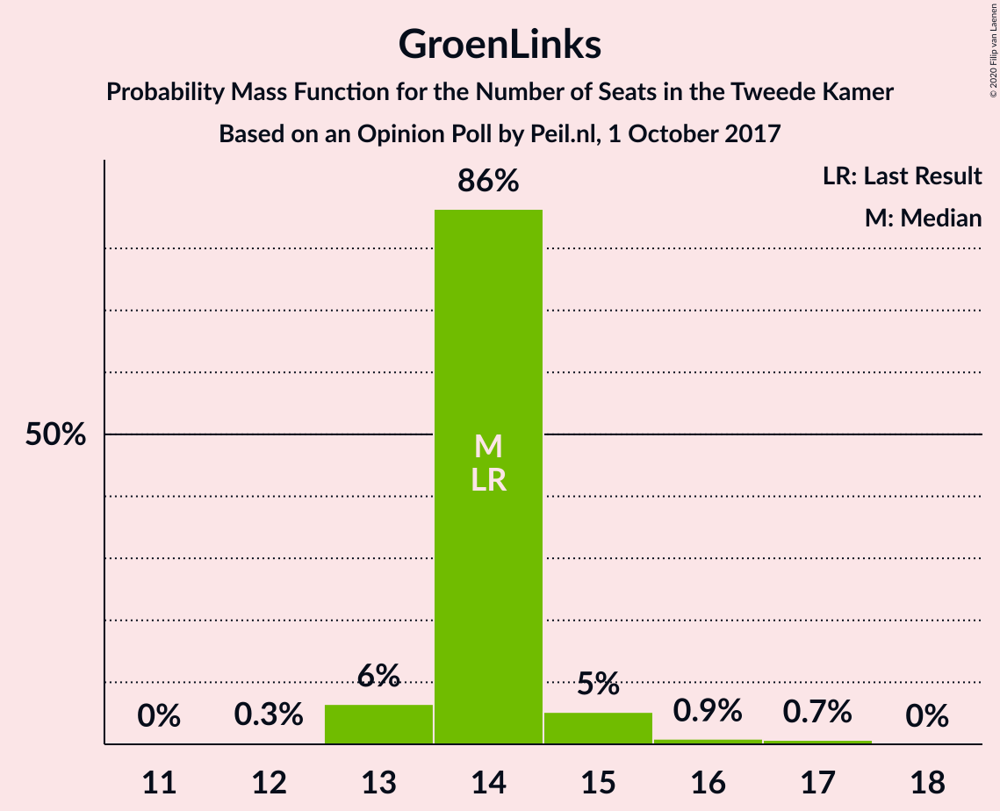

| Number of Seats | Probability | Accumulated | Special Marks |
|:---------------:|:-----------:|:-----------:|:-------------:|
| 12 | 0.3% | 100% |  |
| 13 | 6% | 99.7% |  |
| 14 | 86% | 93% | Last Result, Median |
| 15 | 5% | 7% |  |
| 16 | 0.9% | 2% |  |
| 17 | 0.7% | 0.7% |  |
| 18 | 0% | 0% |  |

### Partij van de Arbeid

*For a full overview of the results for this party, see the [Partij van de Arbeid](party-partijvandearbeid.html) page.*

| Number of Seats | Probability | Accumulated | Special Marks |
|:---------------:|:-----------:|:-----------:|:-------------:|
| 9 | 0% | 100% | Last Result |
| 10 | 0.1% | 100% |  |
| 11 | 4% | 99.8% |  |
| 12 | 7% | 96% |  |
| 13 | 87% | 89% | Median |
| 14 | 2% | 2% |  |
| 15 | 0% | 0% |  |

### Socialistische Partij

*For a full overview of the results for this party, see the [Socialistische Partij](party-socialistischepartij.html) page.*

| Number of Seats | Probability | Accumulated | Special Marks |
|:---------------:|:-----------:|:-----------:|:-------------:|
| 8 | 0.2% | 100% |  |
| 9 | 2% | 99.8% |  |
| 10 | 5% | 98% |  |
| 11 | 86% | 93% | Median |
| 12 | 6% | 7% |  |
| 13 | 0.2% | 0.2% |  |
| 14 | 0% | 0% | Last Result |

### Forum voor Democratie

*For a full overview of the results for this party, see the [Forum voor Democratie](party-forumvoordemocratie.html) page.*

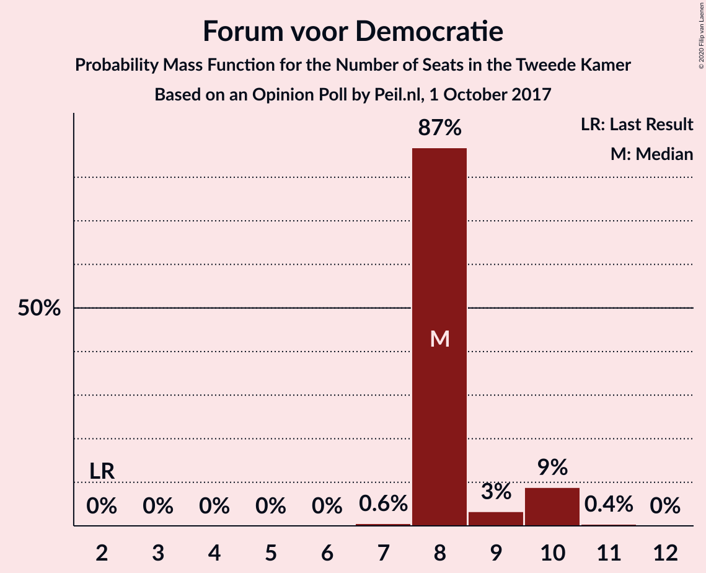

| Number of Seats | Probability | Accumulated | Special Marks |
|:---------------:|:-----------:|:-----------:|:-------------:|
| 2 | 0% | 100% | Last Result |
| 3 | 0% | 100% |  |
| 4 | 0% | 100% |  |
| 5 | 0% | 100% |  |
| 6 | 0% | 100% |  |
| 7 | 0.6% | 100% |  |
| 8 | 87% | 99.4% | Median |
| 9 | 3% | 13% |  |
| 10 | 9% | 9% |  |
| 11 | 0.4% | 0.5% |  |
| 12 | 0% | 0% |  |

### Partij voor de Dieren

*For a full overview of the results for this party, see the [Partij voor de Dieren](party-partijvoordedieren.html) page.*

| Number of Seats | Probability | Accumulated | Special Marks |
|:---------------:|:-----------:|:-----------:|:-------------:|
| 4 | 0.1% | 100% |  |
| 5 | 85% | 99.9% | Last Result, Median |
| 6 | 3% | 15% |  |
| 7 | 11% | 12% |  |
| 8 | 1.1% | 1.1% |  |
| 9 | 0% | 0% |  |

### ChristenUnie

*For a full overview of the results for this party, see the [ChristenUnie](party-christenunie.html) page.*

| Number of Seats | Probability | Accumulated | Special Marks |
|:---------------:|:-----------:|:-----------:|:-------------:|
| 3 | 0.2% | 100% |  |
| 4 | 4% | 99.8% |  |
| 5 | 93% | 96% | Last Result, Median |
| 6 | 3% | 3% |  |
| 7 | 0% | 0% |  |

### 50Plus

*For a full overview of the results for this party, see the [50Plus](party-50plus.html) page.*

| Number of Seats | Probability | Accumulated | Special Marks |
|:---------------:|:-----------:|:-----------:|:-------------:|
| 3 | 10% | 100% |  |
| 4 | 86% | 90% | Last Result, Median |
| 5 | 4% | 4% |  |
| 6 | 0% | 0% |  |

### Staatkundig Gereformeerde Partij

*For a full overview of the results for this party, see the [Staatkundig Gereformeerde Partij](party-staatkundiggereformeerdepartij.html) page.*

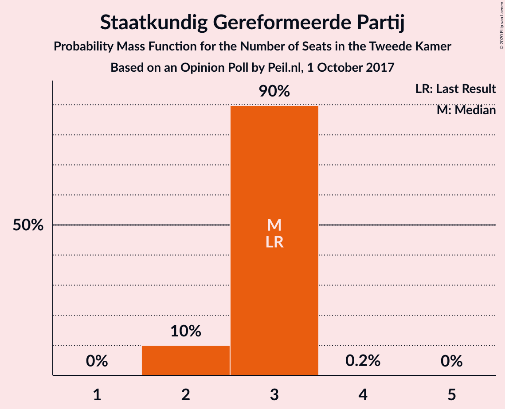

| Number of Seats | Probability | Accumulated | Special Marks |
|:---------------:|:-----------:|:-----------:|:-------------:|
| 2 | 10% | 100% |  |
| 3 | 90% | 90% | Last Result, Median |
| 4 | 0.2% | 0.2% |  |
| 5 | 0% | 0% |  |

### DENK

*For a full overview of the results for this party, see the [DENK](party-denk.html) page.*

| Number of Seats | Probability | Accumulated | Special Marks |
|:---------------:|:-----------:|:-----------:|:-------------:|
| 2 | 86% | 100% | Median |
| 3 | 14% | 14% | Last Result |
| 4 | 0.1% | 0.1% |  |
| 5 | 0% | 0% |  |

## Coalitions

### Confidence Intervals

| Coalition | Last Result | Median | Majority? | 80% Confidence Interval | 90% Confidence Interval | 95% Confidence Interval | 99% Confidence Interval |
|:---------:|:-----------:|:------:|:---------:|:-----------------------:|:-----------------------:|:-----------------------:|:-----------------------:|
| Volkspartij voor Vrijheid en Democratie – Democraten 66 – Christen-Democratisch Appèl – GroenLinks – ChristenUnie | 90 | 87 | 100% | 84–87 | 82–87 | 82–87 | 82–87 |
| Volkspartij voor Vrijheid en Democratie – Democraten 66 – Christen-Democratisch Appèl – Partij van de Arbeid – ChristenUnie | 85 | 86 | 100% | 83–86 | 81–86 | 81–86 | 79–86 |
| Volkspartij voor Vrijheid en Democratie – Partij voor de Vrijheid – Christen-Democratisch Appèl – Forum voor Democratie – Staatkundig Gereformeerde Partij | 77 | 77 | 88% | 75–77 | 73–79 | 73–79 | 72–81 |
| Democraten 66 – Christen-Democratisch Appèl – GroenLinks – Partij van de Arbeid – Socialistische Partij – ChristenUnie | 80 | 78 | 93% | 77–78 | 75–78 | 74–78 | 72–80 |
| Volkspartij voor Vrijheid en Democratie – Partij voor de Vrijheid – Christen-Democratisch Appèl – Forum voor Democratie | 74 | 74 | 6% | 73–74 | 71–76 | 71–76 | 69–78 |
| Volkspartij voor Vrijheid en Democratie – Democraten 66 – Christen-Democratisch Appèl – ChristenUnie | 76 | 73 | 0% | 70–73 | 68–73 | 68–73 | 67–73 |
| Volkspartij voor Vrijheid en Democratie – Democraten 66 – Christen-Democratisch Appèl | 71 | 68 | 0% | 65–68 | 63–68 | 63–68 | 62–68 |
| Volkspartij voor Vrijheid en Democratie – Partij voor de Vrijheid – Christen-Democratisch Appèl | 72 | 66 | 0% | 64–66 | 61–67 | 61–68 | 61–69 |
| Democraten 66 – Christen-Democratisch Appèl – GroenLinks – Partij van de Arbeid – ChristenUnie | 66 | 67 | 0% | 66–67 | 65–67 | 64–67 | 61–69 |
| Volkspartij voor Vrijheid en Democratie – Democraten 66 – Partij van de Arbeid | 61 | 65 | 0% | 62–65 | 61–65 | 61–65 | 61–66 |
| Volkspartij voor Vrijheid en Democratie – Christen-Democratisch Appèl – Forum voor Democratie – 50Plus – Staatkundig Gereformeerde Partij | 61 | 64 | 0% | 61–64 | 58–64 | 58–64 | 58–64 |
| Volkspartij voor Vrijheid en Democratie – Christen-Democratisch Appèl – Partij van de Arbeid | 61 | 62 | 0% | 58–62 | 56–62 | 56–62 | 56–62 |
| Volkspartij voor Vrijheid en Democratie – Christen-Democratisch Appèl – Forum voor Democratie – 50Plus | 58 | 61 | 0% | 59–61 | 56–61 | 56–61 | 56–62 |
| Volkspartij voor Vrijheid en Democratie – Christen-Democratisch Appèl – Forum voor Democratie – Staatkundig Gereformeerde Partij | 57 | 60 | 0% | 58–60 | 55–60 | 55–60 | 54–61 |
| Volkspartij voor Vrijheid en Democratie – Christen-Democratisch Appèl – Forum voor Democratie | 54 | 57 | 0% | 55–57 | 53–57 | 53–57 | 52–58 |
| Volkspartij voor Vrijheid en Democratie – Christen-Democratisch Appèl | 52 | 49 | 0% | 46–49 | 43–49 | 43–49 | 43–49 |
| Democraten 66 – Christen-Democratisch Appèl – Partij van de Arbeid | 47 | 48 | 0% | 47–48 | 46–48 | 44–48 | 43–49 |
| Volkspartij voor Vrijheid en Democratie – Partij van de Arbeid | 42 | 46 | 0% | 43–46 | 42–46 | 42–46 | 42–46 |
| Democraten 66 – Christen-Democratisch Appèl | 38 | 35 | 0% | 34–35 | 34–35 | 33–35 | 31–37 |
| Christen-Democratisch Appèl – Partij van de Arbeid – ChristenUnie | 33 | 34 | 0% | 32–34 | 31–34 | 31–34 | 30–34 |
| Christen-Democratisch Appèl – Partij van de Arbeid | 28 | 29 | 0% | 27–29 | 26–29 | 26–29 | 26–30 |

### Volkspartij voor Vrijheid en Democratie – Democraten 66 – Christen-Democratisch Appèl – GroenLinks – ChristenUnie

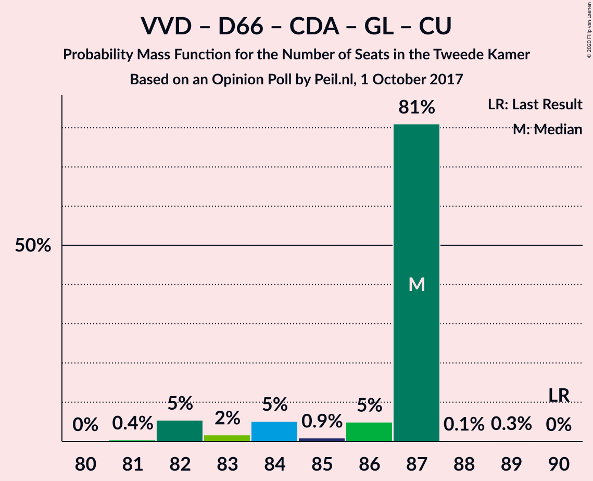

| Number of Seats | Probability | Accumulated | Special Marks |
|:---------------:|:-----------:|:-----------:|:-------------:|
| 81 | 0.4% | 100% |  |
| 82 | 5% | 99.6% |  |
| 83 | 2% | 94% |  |
| 84 | 5% | 92% |  |
| 85 | 0.9% | 87% |  |
| 86 | 5% | 86% |  |
| 87 | 81% | 81% | Median |
| 88 | 0.1% | 0.4% |  |
| 89 | 0.3% | 0.3% |  |
| 90 | 0% | 0% | Last Result |

### Volkspartij voor Vrijheid en Democratie – Democraten 66 – Christen-Democratisch Appèl – Partij van de Arbeid – ChristenUnie

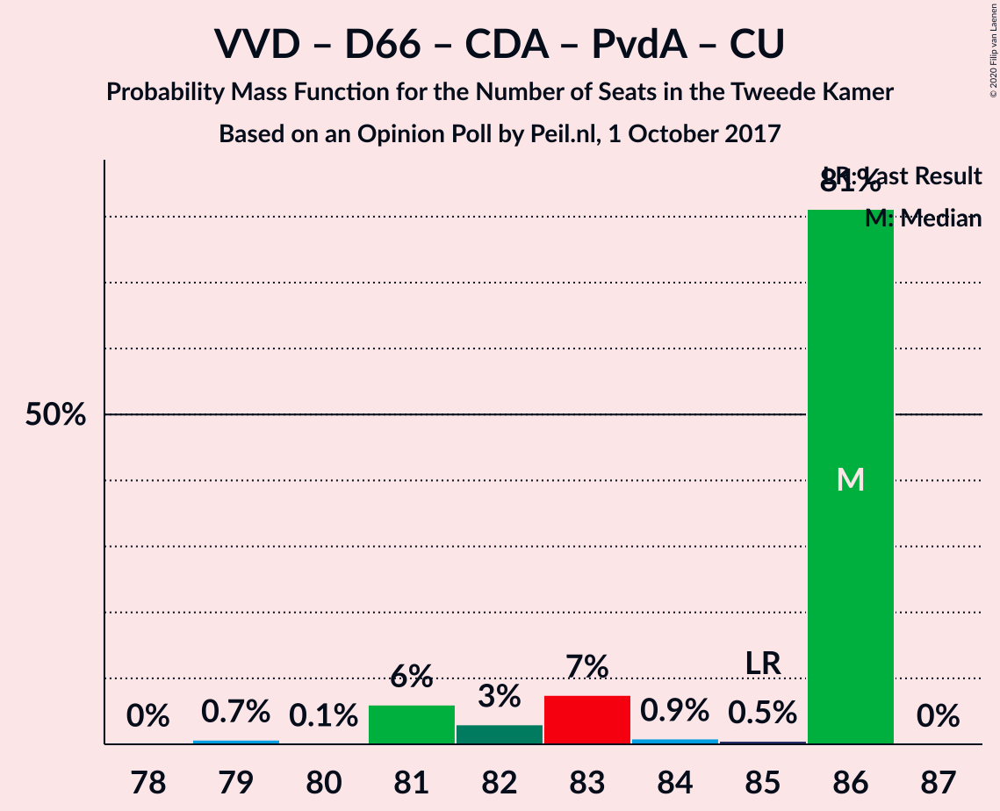

| Number of Seats | Probability | Accumulated | Special Marks |
|:---------------:|:-----------:|:-----------:|:-------------:|
| 78 | 0% | 100% |  |
| 79 | 0.7% | 99.9% |  |
| 80 | 0.1% | 99.2% |  |
| 81 | 6% | 99.1% |  |
| 82 | 3% | 93% |  |
| 83 | 7% | 90% |  |
| 84 | 0.9% | 83% |  |
| 85 | 0.5% | 82% | Last Result |
| 86 | 81% | 81% | Median |
| 87 | 0% | 0% |  |

### Volkspartij voor Vrijheid en Democratie – Partij voor de Vrijheid – Christen-Democratisch Appèl – Forum voor Democratie – Staatkundig Gereformeerde Partij

| Number of Seats | Probability | Accumulated | Special Marks |
|:---------------:|:-----------:|:-----------:|:-------------:|
| 71 | 0.1% | 100% |  |
| 72 | 0.7% | 99.9% |  |
| 73 | 7% | 99.2% |  |
| 74 | 0.2% | 92% |  |
| 75 | 4% | 92% |  |
| 76 | 0.7% | 88% | Majority |
| 77 | 82% | 88% | Last Result, Median |
| 78 | 0.5% | 6% |  |
| 79 | 4% | 6% |  |
| 80 | 0.7% | 2% |  |
| 81 | 0.8% | 0.9% |  |
| 82 | 0.1% | 0.1% |  |
| 83 | 0% | 0% |  |

### Democraten 66 – Christen-Democratisch Appèl – GroenLinks – Partij van de Arbeid – Socialistische Partij – ChristenUnie

| Number of Seats | Probability | Accumulated | Special Marks |
|:---------------:|:-----------:|:-----------:|:-------------:|
| 72 | 0.9% | 100% |  |
| 73 | 0.5% | 99.1% |  |
| 74 | 1.2% | 98.6% |  |
| 75 | 4% | 97% |  |
| 76 | 2% | 93% | Majority |
| 77 | 3% | 91% |  |
| 78 | 87% | 88% | Median |
| 79 | 0.5% | 1.3% |  |
| 80 | 0.8% | 0.9% | Last Result |
| 81 | 0.1% | 0.1% |  |
| 82 | 0% | 0% |  |

### Volkspartij voor Vrijheid en Democratie – Partij voor de Vrijheid – Christen-Democratisch Appèl – Forum voor Democratie

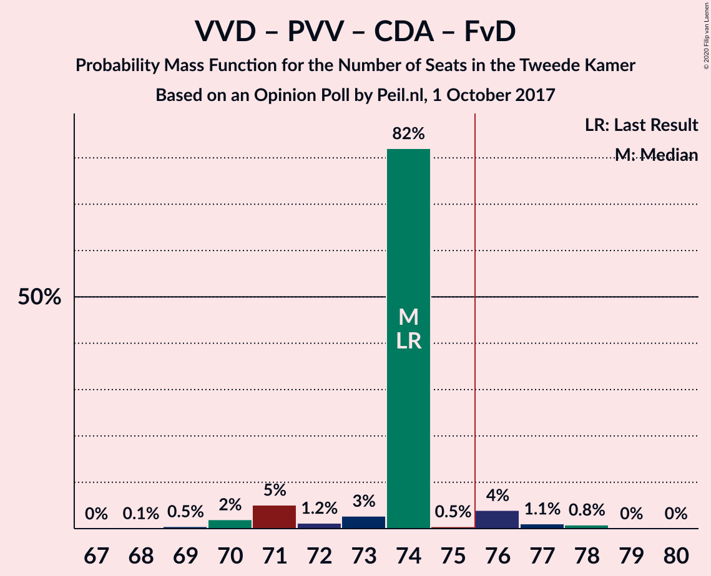

| Number of Seats | Probability | Accumulated | Special Marks |
|:---------------:|:-----------:|:-----------:|:-------------:|
| 68 | 0.1% | 100% |  |
| 69 | 0.5% | 99.9% |  |
| 70 | 2% | 99.5% |  |
| 71 | 5% | 98% |  |
| 72 | 1.2% | 92% |  |
| 73 | 3% | 91% |  |
| 74 | 82% | 88% | Last Result, Median |
| 75 | 0.5% | 6% |  |
| 76 | 4% | 6% | Majority |
| 77 | 1.1% | 2% |  |
| 78 | 0.8% | 0.9% |  |
| 79 | 0% | 0.1% |  |
| 80 | 0% | 0% |  |

### Volkspartij voor Vrijheid en Democratie – Democraten 66 – Christen-Democratisch Appèl – ChristenUnie

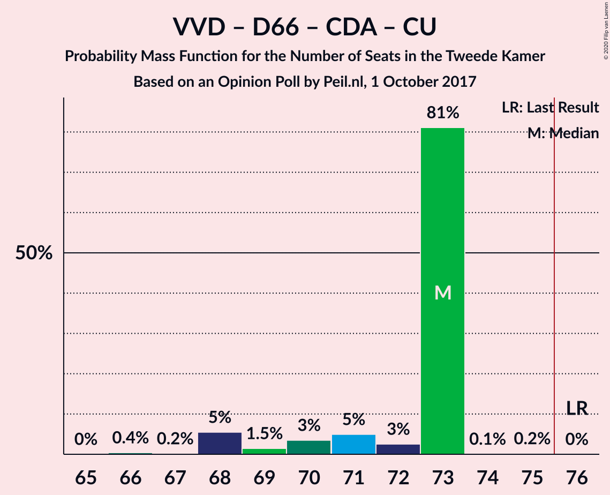

| Number of Seats | Probability | Accumulated | Special Marks |
|:---------------:|:-----------:|:-----------:|:-------------:|
| 66 | 0.4% | 100% |  |
| 67 | 0.2% | 99.5% |  |
| 68 | 5% | 99.4% |  |
| 69 | 1.5% | 94% |  |
| 70 | 3% | 92% |  |
| 71 | 5% | 89% |  |
| 72 | 3% | 84% |  |
| 73 | 81% | 81% | Median |
| 74 | 0.1% | 0.3% |  |
| 75 | 0.2% | 0.2% |  |
| 76 | 0% | 0% | Last Result, Majority |

### Volkspartij voor Vrijheid en Democratie – Democraten 66 – Christen-Democratisch Appèl

| Number of Seats | Probability | Accumulated | Special Marks |
|:---------------:|:-----------:|:-----------:|:-------------:|
| 62 | 0.6% | 100% |  |
| 63 | 5% | 99.4% |  |
| 64 | 0.4% | 94% |  |
| 65 | 4% | 94% |  |
| 66 | 5% | 89% |  |
| 67 | 5% | 84% |  |
| 68 | 79% | 80% | Median |
| 69 | 0.1% | 0.3% |  |
| 70 | 0.2% | 0.2% |  |
| 71 | 0% | 0% | Last Result |

### Volkspartij voor Vrijheid en Democratie – Partij voor de Vrijheid – Christen-Democratisch Appèl

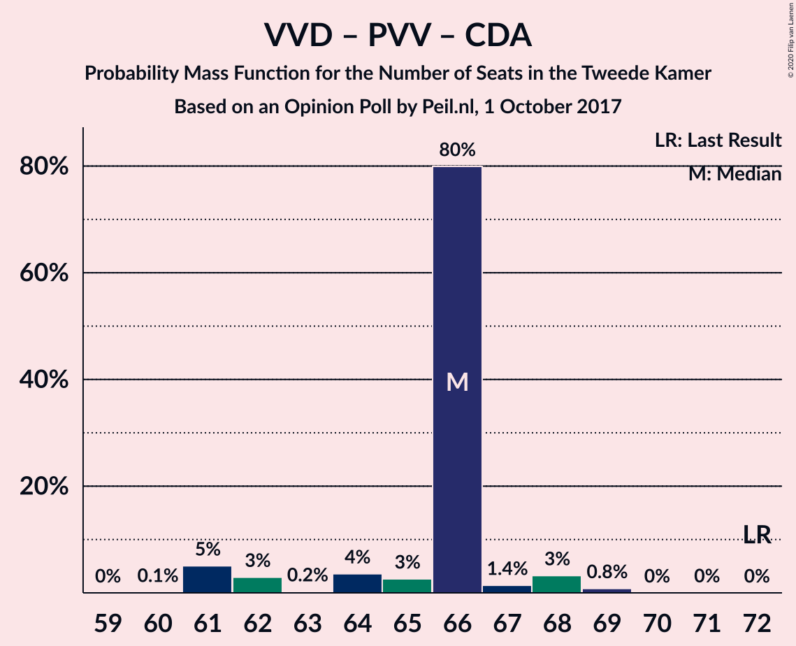

| Number of Seats | Probability | Accumulated | Special Marks |
|:---------------:|:-----------:|:-----------:|:-------------:|
| 60 | 0.1% | 100% |  |
| 61 | 5% | 99.9% |  |
| 62 | 3% | 95% |  |
| 63 | 0.2% | 92% |  |
| 64 | 4% | 92% |  |
| 65 | 3% | 88% |  |
| 66 | 80% | 85% | Median |
| 67 | 1.4% | 6% |  |
| 68 | 3% | 4% |  |
| 69 | 0.8% | 0.9% |  |
| 70 | 0% | 0% |  |
| 71 | 0% | 0% |  |
| 72 | 0% | 0% | Last Result |

### Democraten 66 – Christen-Democratisch Appèl – GroenLinks – Partij van de Arbeid – ChristenUnie

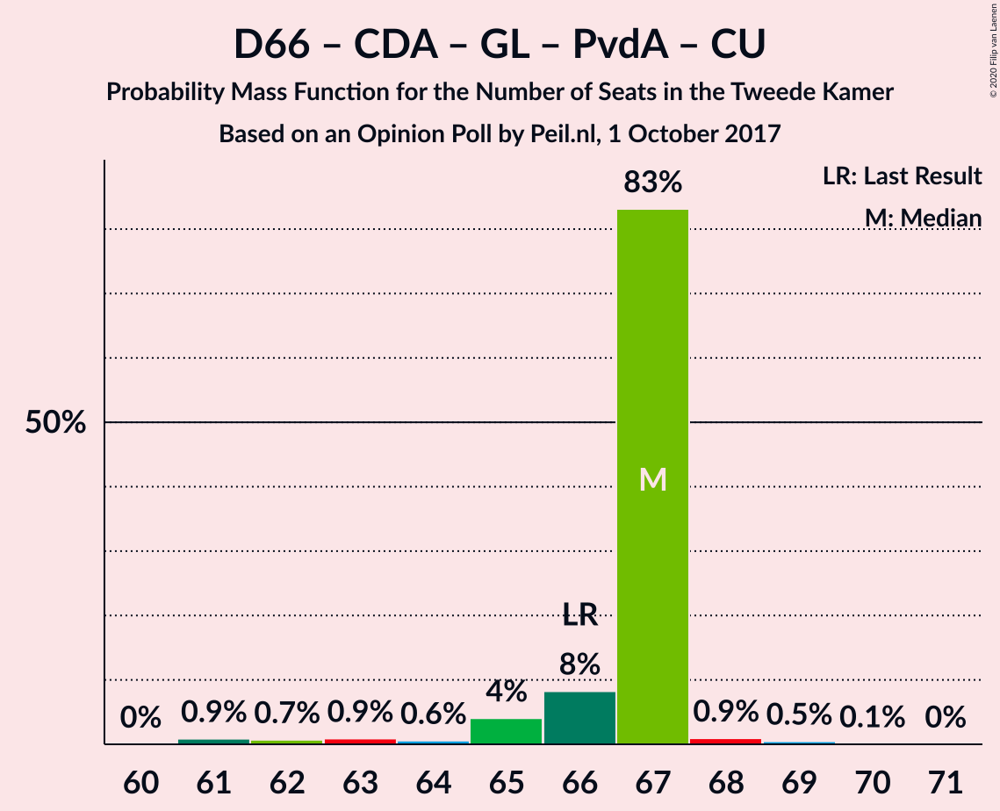

| Number of Seats | Probability | Accumulated | Special Marks |
|:---------------:|:-----------:|:-----------:|:-------------:|
| 61 | 0.9% | 100% |  |
| 62 | 0.7% | 99.1% |  |
| 63 | 0.9% | 98% |  |
| 64 | 0.6% | 98% |  |
| 65 | 4% | 97% |  |
| 66 | 8% | 93% | Last Result |
| 67 | 83% | 85% | Median |
| 68 | 0.9% | 2% |  |
| 69 | 0.5% | 0.6% |  |
| 70 | 0.1% | 0.1% |  |
| 71 | 0% | 0% |  |

### Volkspartij voor Vrijheid en Democratie – Democraten 66 – Partij van de Arbeid

| Number of Seats | Probability | Accumulated | Special Marks |
|:---------------:|:-----------:|:-----------:|:-------------:|
| 58 | 0.1% | 100% |  |
| 59 | 0.1% | 99.9% |  |
| 60 | 0.2% | 99.8% |  |
| 61 | 5% | 99.6% | Last Result |
| 62 | 7% | 94% |  |
| 63 | 4% | 88% |  |
| 64 | 2% | 84% |  |
| 65 | 80% | 82% | Median |
| 66 | 2% | 2% |  |
| 67 | 0.2% | 0.2% |  |
| 68 | 0% | 0% |  |

### Volkspartij voor Vrijheid en Democratie – Christen-Democratisch Appèl – Forum voor Democratie – 50Plus – Staatkundig Gereformeerde Partij

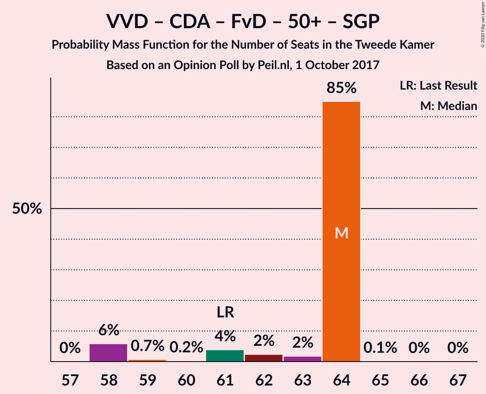

| Number of Seats | Probability | Accumulated | Special Marks |
|:---------------:|:-----------:|:-----------:|:-------------:|
| 57 | 0% | 100% |  |
| 58 | 6% | 99.9% |  |
| 59 | 0.7% | 94% |  |
| 60 | 0.2% | 93% |  |
| 61 | 4% | 93% | Last Result |
| 62 | 2% | 89% |  |
| 63 | 2% | 87% |  |
| 64 | 85% | 85% | Median |
| 65 | 0.1% | 0.2% |  |
| 66 | 0% | 0.1% |  |
| 67 | 0% | 0% |  |

### Volkspartij voor Vrijheid en Democratie – Christen-Democratisch Appèl – Partij van de Arbeid

| Number of Seats | Probability | Accumulated | Special Marks |
|:---------------:|:-----------:|:-----------:|:-------------:|
| 54 | 0.1% | 100% |  |
| 55 | 0.1% | 99.9% |  |
| 56 | 5% | 99.9% |  |
| 57 | 2% | 94% |  |
| 58 | 2% | 92% |  |
| 59 | 3% | 90% |  |
| 60 | 6% | 87% |  |
| 61 | 1.2% | 81% | Last Result |
| 62 | 80% | 80% | Median |
| 63 | 0% | 0% |  |

### Volkspartij voor Vrijheid en Democratie – Christen-Democratisch Appèl – Forum voor Democratie – 50Plus

| Number of Seats | Probability | Accumulated | Special Marks |
|:---------------:|:-----------:|:-----------:|:-------------:|
| 54 | 0% | 100% |  |
| 55 | 0.4% | 99.9% |  |
| 56 | 6% | 99.6% |  |
| 57 | 0.8% | 94% |  |
| 58 | 2% | 93% | Last Result |
| 59 | 4% | 91% |  |
| 60 | 2% | 87% |  |
| 61 | 85% | 86% | Median |
| 62 | 0.9% | 1.0% |  |
| 63 | 0.1% | 0.1% |  |
| 64 | 0% | 0% |  |

### Volkspartij voor Vrijheid en Democratie – Christen-Democratisch Appèl – Forum voor Democratie – Staatkundig Gereformeerde Partij

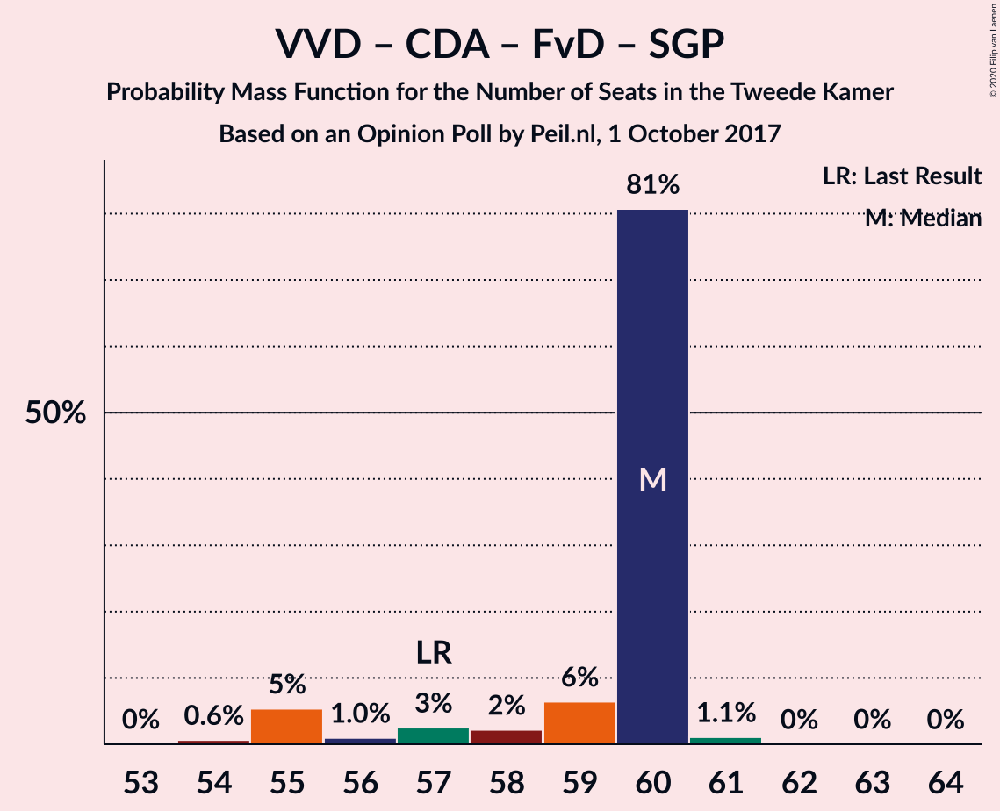

| Number of Seats | Probability | Accumulated | Special Marks |
|:---------------:|:-----------:|:-----------:|:-------------:|
| 54 | 0.6% | 100% |  |
| 55 | 5% | 99.3% |  |
| 56 | 1.0% | 94% |  |
| 57 | 3% | 93% | Last Result |
| 58 | 2% | 90% |  |
| 59 | 6% | 88% |  |
| 60 | 81% | 82% | Median |
| 61 | 1.1% | 1.2% |  |
| 62 | 0% | 0.1% |  |
| 63 | 0% | 0.1% |  |
| 64 | 0% | 0% |  |

### Volkspartij voor Vrijheid en Democratie – Christen-Democratisch Appèl – Forum voor Democratie

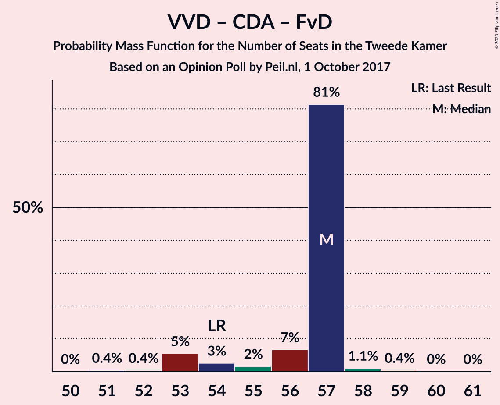

| Number of Seats | Probability | Accumulated | Special Marks |
|:---------------:|:-----------:|:-----------:|:-------------:|
| 51 | 0.4% | 100% |  |
| 52 | 0.4% | 99.6% |  |
| 53 | 5% | 99.2% |  |
| 54 | 3% | 94% | Last Result |
| 55 | 2% | 91% |  |
| 56 | 7% | 90% |  |
| 57 | 81% | 83% | Median |
| 58 | 1.1% | 2% |  |
| 59 | 0.4% | 0.4% |  |
| 60 | 0% | 0.1% |  |
| 61 | 0% | 0% |  |

### Volkspartij voor Vrijheid en Democratie – Christen-Democratisch Appèl

| Number of Seats | Probability | Accumulated | Special Marks |
|:---------------:|:-----------:|:-----------:|:-------------:|
| 42 | 0.1% | 100% |  |
| 43 | 5% | 99.9% |  |
| 44 | 0.9% | 95% |  |
| 45 | 1.0% | 94% |  |
| 46 | 4% | 93% |  |
| 47 | 4% | 89% |  |
| 48 | 6% | 85% |  |
| 49 | 80% | 80% | Median |
| 50 | 0.1% | 0.1% |  |
| 51 | 0% | 0% |  |
| 52 | 0% | 0% | Last Result |

### Democraten 66 – Christen-Democratisch Appèl – Partij van de Arbeid

| Number of Seats | Probability | Accumulated | Special Marks |
|:---------------:|:-----------:|:-----------:|:-------------:|
| 43 | 1.0% | 100% |  |
| 44 | 2% | 99.0% |  |
| 45 | 1.3% | 97% |  |
| 46 | 1.3% | 96% |  |
| 47 | 12% | 95% | Last Result |
| 48 | 82% | 83% | Median |
| 49 | 0.4% | 0.6% |  |
| 50 | 0.1% | 0.3% |  |
| 51 | 0.2% | 0.2% |  |
| 52 | 0% | 0% |  |

### Volkspartij voor Vrijheid en Democratie – Partij van de Arbeid

| Number of Seats | Probability | Accumulated | Special Marks |
|:---------------:|:-----------:|:-----------:|:-------------:|
| 40 | 0.1% | 100% |  |
| 41 | 0.4% | 99.9% |  |
| 42 | 7% | 99.5% | Last Result |
| 43 | 6% | 93% |  |
| 44 | 2% | 87% |  |
| 45 | 3% | 84% |  |
| 46 | 81% | 81% | Median |
| 47 | 0% | 0.1% |  |
| 48 | 0% | 0% |  |

### Democraten 66 – Christen-Democratisch Appèl

| Number of Seats | Probability | Accumulated | Special Marks |
|:---------------:|:-----------:|:-----------:|:-------------:|
| 31 | 1.3% | 100% |  |
| 32 | 1.1% | 98.7% |  |
| 33 | 2% | 98% |  |
| 34 | 7% | 96% |  |
| 35 | 87% | 89% | Median |
| 36 | 2% | 2% |  |
| 37 | 0.5% | 0.6% |  |
| 38 | 0% | 0% | Last Result |

### Christen-Democratisch Appèl – Partij van de Arbeid – ChristenUnie

| Number of Seats | Probability | Accumulated | Special Marks |
|:---------------:|:-----------:|:-----------:|:-------------:|
| 29 | 0.3% | 100% |  |
| 30 | 0.6% | 99.7% |  |
| 31 | 4% | 99.1% |  |
| 32 | 8% | 95% |  |
| 33 | 3% | 87% | Last Result |
| 34 | 83% | 84% | Median |
| 35 | 0% | 0.4% |  |
| 36 | 0.3% | 0.3% |  |
| 37 | 0% | 0% |  |

### Christen-Democratisch Appèl – Partij van de Arbeid

| Number of Seats | Probability | Accumulated | Special Marks |
|:---------------:|:-----------:|:-----------:|:-------------:|
| 24 | 0.1% | 100% |  |
| 25 | 0.3% | 99.9% |  |
| 26 | 5% | 99.6% |  |
| 27 | 8% | 95% |  |
| 28 | 2% | 86% | Last Result |
| 29 | 84% | 85% | Median |
| 30 | 0.2% | 0.6% |  |
| 31 | 0.3% | 0.3% |  |
| 32 | 0% | 0% |  |

## Technical Information

### Opinion Poll

+ **Polling firm:** Peil.nl
+ **Commissioner(s):** —
+ **Fieldwork period:** 1 October 2017

### Calculations

+ **Sample size:** 3000
+ **Simulations done:** 1,048,576
+ **Error estimate:** 1.95%

