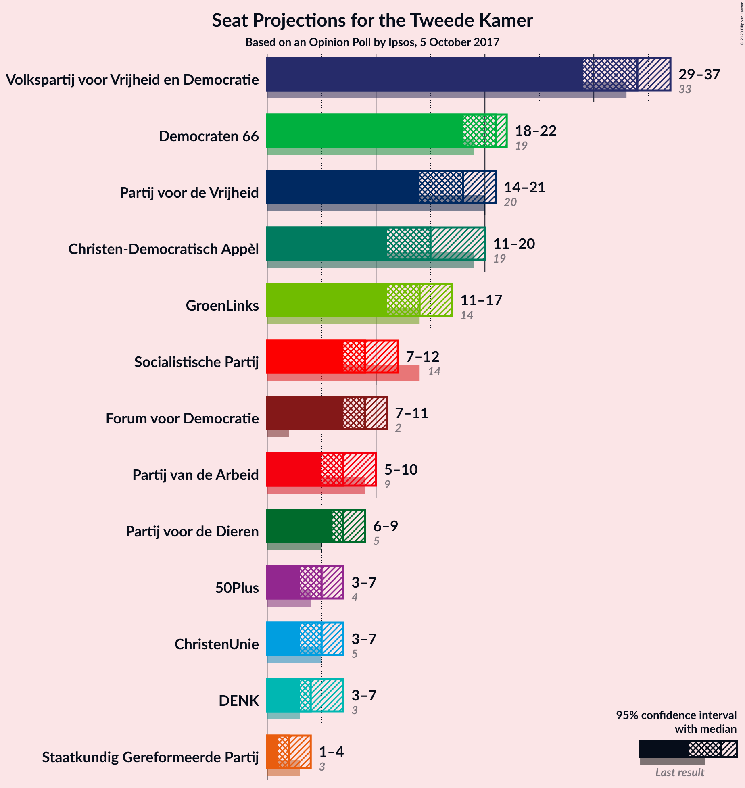
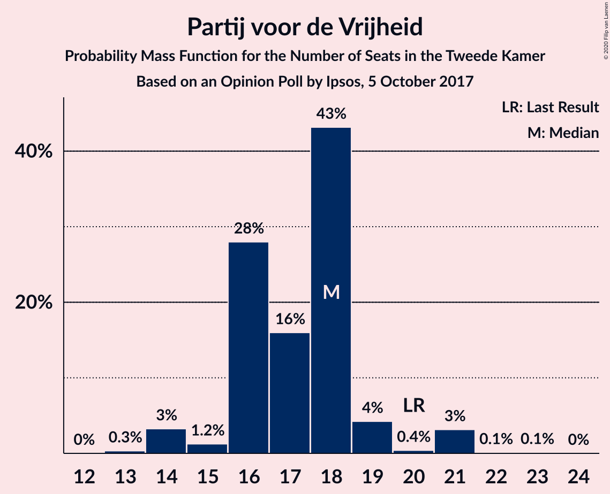
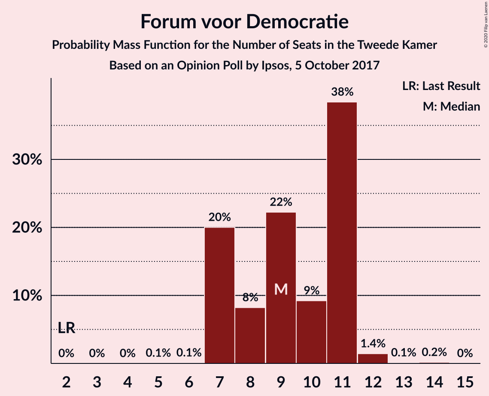
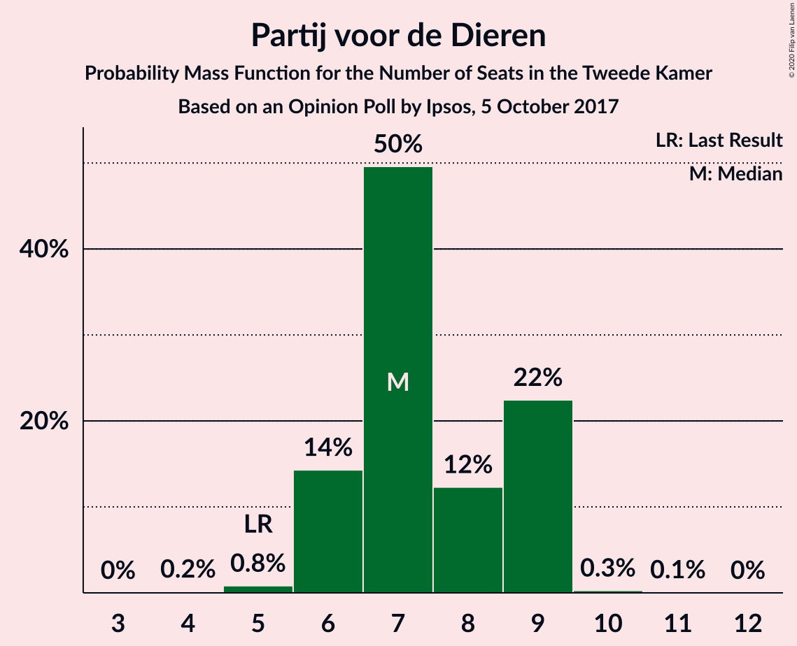
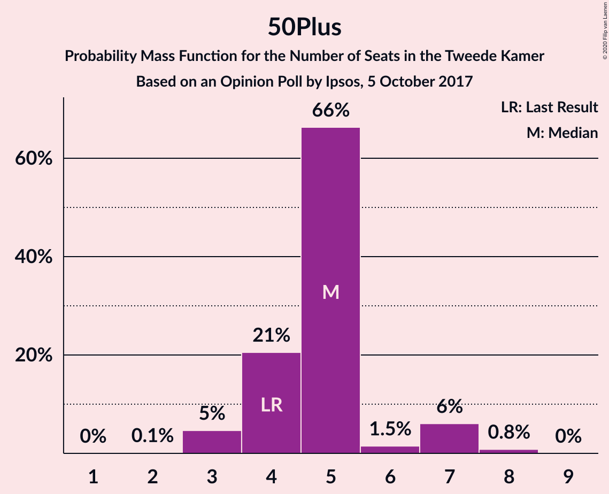
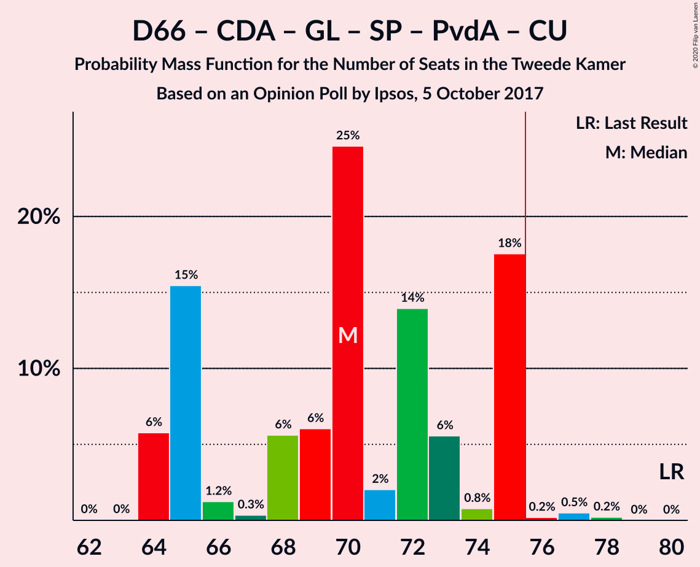
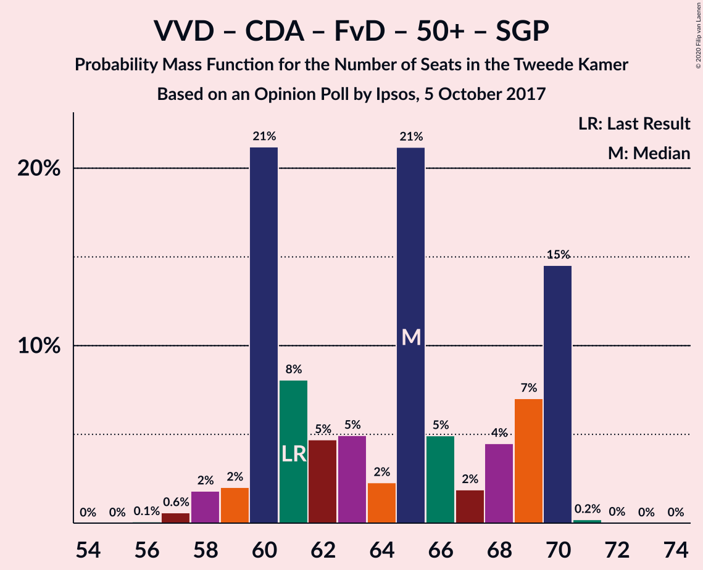
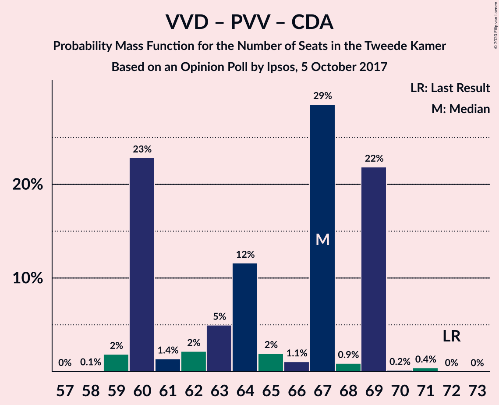
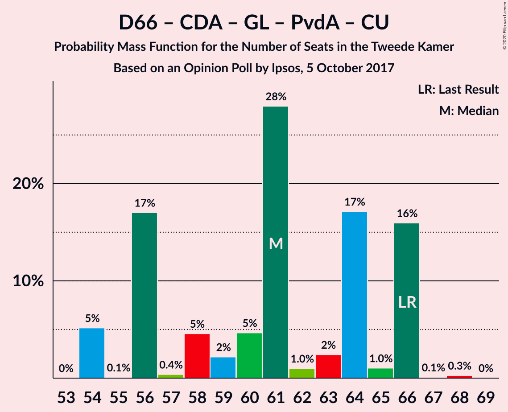

# Opinion Poll by Ipsos, 5 October 2017

<a href="#voting-intentions">Voting Intentions</a> | <a href="#seats">Seats</a> | <a href="#coalitions">Coalitions</a> | <a href="#technical-information">Technical Information</a>

## Voting Intentions

### Confidence Intervals

| Party | Last Result | Poll Result | 80% Confidence Interval | 90% Confidence Interval | 95% Confidence Interval | 99% Confidence Interval |
|:-----:|:-----------:|:-----------:|:-----------------------:|:-----------------------:|:-----------------------:|:-----------------------:|
| Volkspartij voor Vrijheid en Democratie | 21.3% | 21.9% | 20.3–23.7% |19.8–24.1% |19.4–24.6% |18.7–25.4% |
| Democraten 66 | 12.2% | 12.9% | 11.6–14.4% |11.3–14.8% |11.0–15.1% |10.4–15.9% |
| Partij voor de Vrijheid | 13.1% | 11.4% | 10.2–12.8% |9.9–13.2% |9.6–13.5% |9.0–14.2% |
| Christen-Democratisch Appèl | 12.4% | 9.7% | 8.6–11.0% |8.3–11.4% |8.0–11.7% |7.5–12.3% |
| GroenLinks | 9.1% | 9.4% | 8.3–10.7% |8.0–11.1% |7.7–11.4% |7.2–12.0% |
| Socialistische Partij | 9.1% | 6.2% | 5.3–7.3% |5.1–7.6% |4.9–7.9% |4.5–8.4% |
| Forum voor Democratie | 1.8% | 6.2% | 5.3–7.3% |5.1–7.6% |4.9–7.9% |4.5–8.4% |
| Partij van de Arbeid | 5.7% | 4.9% | 4.1–5.9% |3.9–6.2% |3.7–6.4% |3.4–6.9% |
| Partij voor de Dieren | 3.2% | 4.7% | 3.9–5.7% |3.7–6.0% |3.6–6.2% |3.2–6.7% |
| ChristenUnie | 3.4% | 3.6% | 2.9–4.5% |2.8–4.7% |2.6–5.0% |2.3–5.4% |
| 50Plus | 3.1% | 3.3% | 2.7–4.1% |2.5–4.4% |2.4–4.6% |2.1–5.0% |
| DENK | 2.1% | 3.1% | 2.5–3.9% |2.3–4.2% |2.2–4.4% |1.9–4.8% |
| Staatkundig Gereformeerde Partij | 2.1% | 1.7% | 1.3–2.4% |1.2–2.5% |1.1–2.7% |0.9–3.1% |

*Note:* The poll result column reflects the actual value used in the calculations. Published results may vary slightly, and in addition be rounded to fewer digits.

## Seats

### Confidence Intervals

| Party | Last Result | Median | 80% Confidence Interval | 90% Confidence Interval | 95% Confidence Interval | 99% Confidence Interval |
|:-----:|:-----------:|:------:|:-----------------------:|:-----------------------:|:-----------------------:|:-----------------------:|
| <a href="#volkspartij-voor-vrijheid-en-democratie">Volkspartij voor Vrijheid en Democratie</a> | 33 | 34 | 29–36 |29–37 |29–37 |29–38 |
| <a href="#democraten-66">Democraten 66</a> | 19 | 21 | 18–22 |18–22 |18–22 |17–23 |
| <a href="#partij-voor-de-vrijheid">Partij voor de Vrijheid</a> | 20 | 18 | 16–18 |16–19 |14–21 |14–21 |
| <a href="#christen-democratisch-appèl">Christen-Democratisch Appèl</a> | 19 | 15 | 12–17 |12–17 |11–20 |11–20 |
| <a href="#groenlinks">GroenLinks</a> | 14 | 14 | 11–15 |11–16 |11–17 |11–17 |
| <a href="#socialistische-partij">Socialistische Partij</a> | 14 | 9 | 8–10 |8–11 |7–12 |7–12 |
| <a href="#forum-voor-democratie">Forum voor Democratie</a> | 2 | 9 | 7–11 |7–11 |7–11 |7–12 |
| <a href="#partij-van-de-arbeid">Partij van de Arbeid</a> | 9 | 7 | 6–9 |6–9 |5–10 |5–10 |
| <a href="#partij-voor-de-dieren">Partij voor de Dieren</a> | 5 | 7 | 6–9 |6–9 |6–9 |5–9 |
| <a href="#christenunie">ChristenUnie</a> | 5 | 5 | 4–7 |4–7 |3–7 |3–7 |
| <a href="#50plus">50Plus</a> | 4 | 5 | 4–5 |4–7 |3–7 |3–8 |
| <a href="#denk">DENK</a> | 3 | 4 | 3–6 |3–7 |3–7 |3–7 |
| <a href="#staatkundig-gereformeerde-partij">Staatkundig Gereformeerde Partij</a> | 3 | 2 | 2–3 |2–3 |1–4 |1–4 |

### Volkspartij voor Vrijheid en Democratie

*For a full overview of the results for this party, see the [Volkspartij voor Vrijheid en Democratie](party-volkspartijvoorvrijheidendemocratie.html) page.*

| Number of Seats | Probability | Accumulated | Special Marks |
|:---------------:|:-----------:|:-----------:|:-------------:|
| 27 | 0% | 100% |  |
| 28 | 0.1% | 99.9% |  |
| 29 | 22% | 99.8% |  |
| 30 | 3% | 78% |  |
| 31 | 5% | 75% |  |
| 32 | 8% | 70% |  |
| 33 | 7% | 62% | Last Result |
| 34 | 25% | 55% | Median |
| 35 | 5% | 30% |  |
| 36 | 16% | 25% |  |
| 37 | 8% | 10% |  |
| 38 | 2% | 2% |  |
| 39 | 0.1% | 0.1% |  |
| 40 | 0% | 0% |  |

### Democraten 66

*For a full overview of the results for this party, see the [Democraten 66](party-democraten66.html) page.*

| Number of Seats | Probability | Accumulated | Special Marks |
|:---------------:|:-----------:|:-----------:|:-------------:|
| 14 | 0.1% | 100% |  |
| 15 | 0.1% | 99.9% |  |
| 16 | 0.2% | 99.8% |  |
| 17 | 1.0% | 99.6% |  |
| 18 | 19% | 98.6% |  |
| 19 | 19% | 80% | Last Result |
| 20 | 6% | 61% |  |
| 21 | 25% | 55% | Median |
| 22 | 29% | 30% |  |
| 23 | 0.6% | 1.0% |  |
| 24 | 0.2% | 0.4% |  |
| 25 | 0% | 0.2% |  |
| 26 | 0.2% | 0.2% |  |
| 27 | 0% | 0% |  |

### Partij voor de Vrijheid

*For a full overview of the results for this party, see the [Partij voor de Vrijheid](party-partijvoordevrijheid.html) page.*

| Number of Seats | Probability | Accumulated | Special Marks |
|:---------------:|:-----------:|:-----------:|:-------------:|
| 13 | 0.3% | 100% |  |
| 14 | 3% | 99.7% |  |
| 15 | 1.2% | 96% |  |
| 16 | 28% | 95% |  |
| 17 | 16% | 67% |  |
| 18 | 43% | 51% | Median |
| 19 | 4% | 8% |  |
| 20 | 0.4% | 4% | Last Result |
| 21 | 3% | 3% |  |
| 22 | 0.1% | 0.2% |  |
| 23 | 0.1% | 0.1% |  |
| 24 | 0% | 0% |  |

### Christen-Democratisch Appèl

*For a full overview of the results for this party, see the [Christen-Democratisch Appèl](party-christen-democratischappèl.html) page.*

| Number of Seats | Probability | Accumulated | Special Marks |
|:---------------:|:-----------:|:-----------:|:-------------:|
| 11 | 4% | 100% |  |
| 12 | 6% | 96% |  |
| 13 | 30% | 90% |  |
| 14 | 8% | 59% |  |
| 15 | 25% | 51% | Median |
| 16 | 1.2% | 26% |  |
| 17 | 20% | 25% |  |
| 18 | 0.6% | 5% |  |
| 19 | 0.1% | 4% | Last Result |
| 20 | 4% | 4% |  |
| 21 | 0% | 0% |  |

### GroenLinks

*For a full overview of the results for this party, see the [GroenLinks](party-groenlinks.html) page.*

| Number of Seats | Probability | Accumulated | Special Marks |
|:---------------:|:-----------:|:-----------:|:-------------:|
| 10 | 0.2% | 100% |  |
| 11 | 21% | 99.8% |  |
| 12 | 8% | 79% |  |
| 13 | 11% | 71% |  |
| 14 | 26% | 60% | Last Result, Median |
| 15 | 27% | 34% |  |
| 16 | 4% | 7% |  |
| 17 | 3% | 4% |  |
| 18 | 0.3% | 0.4% |  |
| 19 | 0% | 0.1% |  |
| 20 | 0% | 0% |  |

### Socialistische Partij

*For a full overview of the results for this party, see the [Socialistische Partij](party-socialistischepartij.html) page.*

| Number of Seats | Probability | Accumulated | Special Marks |
|:---------------:|:-----------:|:-----------:|:-------------:|
| 6 | 0.2% | 100% |  |
| 7 | 3% | 99.8% |  |
| 8 | 16% | 97% |  |
| 9 | 63% | 81% | Median |
| 10 | 8% | 18% |  |
| 11 | 6% | 10% |  |
| 12 | 3% | 4% |  |
| 13 | 0.2% | 0.3% |  |
| 14 | 0.1% | 0.1% | Last Result |
| 15 | 0% | 0% |  |

### Forum voor Democratie

*For a full overview of the results for this party, see the [Forum voor Democratie](party-forumvoordemocratie.html) page.*

| Number of Seats | Probability | Accumulated | Special Marks |
|:---------------:|:-----------:|:-----------:|:-------------:|
| 2 | 0% | 100% | Last Result |
| 3 | 0% | 100% |  |
| 4 | 0% | 100% |  |
| 5 | 0.1% | 100% |  |
| 6 | 0.1% | 99.9% |  |
| 7 | 20% | 99.8% |  |
| 8 | 8% | 80% |  |
| 9 | 22% | 72% | Median |
| 10 | 9% | 49% |  |
| 11 | 38% | 40% |  |
| 12 | 1.4% | 2% |  |
| 13 | 0.1% | 0.3% |  |
| 14 | 0.2% | 0.2% |  |
| 15 | 0% | 0% |  |

### Partij van de Arbeid

*For a full overview of the results for this party, see the [Partij van de Arbeid](party-partijvandearbeid.html) page.*

| Number of Seats | Probability | Accumulated | Special Marks |
|:---------------:|:-----------:|:-----------:|:-------------:|
| 4 | 0.4% | 100% |  |
| 5 | 3% | 99.6% |  |
| 6 | 21% | 96% |  |
| 7 | 40% | 75% | Median |
| 8 | 23% | 35% |  |
| 9 | 9% | 12% | Last Result |
| 10 | 3% | 3% |  |
| 11 | 0.1% | 0.1% |  |
| 12 | 0% | 0% |  |

### Partij voor de Dieren

*For a full overview of the results for this party, see the [Partij voor de Dieren](party-partijvoordedieren.html) page.*

| Number of Seats | Probability | Accumulated | Special Marks |
|:---------------:|:-----------:|:-----------:|:-------------:|
| 4 | 0.2% | 100% |  |
| 5 | 0.8% | 99.8% | Last Result |
| 6 | 14% | 99.0% |  |
| 7 | 50% | 85% | Median |
| 8 | 12% | 35% |  |
| 9 | 22% | 23% |  |
| 10 | 0.3% | 0.4% |  |
| 11 | 0.1% | 0.1% |  |
| 12 | 0% | 0% |  |

### ChristenUnie

*For a full overview of the results for this party, see the [ChristenUnie](party-christenunie.html) page.*

| Number of Seats | Probability | Accumulated | Special Marks |
|:---------------:|:-----------:|:-----------:|:-------------:|
| 3 | 4% | 100% |  |
| 4 | 9% | 96% |  |
| 5 | 49% | 87% | Last Result, Median |
| 6 | 22% | 37% |  |
| 7 | 15% | 15% |  |
| 8 | 0.2% | 0.4% |  |
| 9 | 0.3% | 0.3% |  |
| 10 | 0% | 0% |  |

### 50Plus

*For a full overview of the results for this party, see the [50Plus](party-50plus.html) page.*

| Number of Seats | Probability | Accumulated | Special Marks |
|:---------------:|:-----------:|:-----------:|:-------------:|
| 2 | 0.1% | 100% |  |
| 3 | 5% | 99.9% |  |
| 4 | 21% | 95% | Last Result |
| 5 | 66% | 75% | Median |
| 6 | 1.5% | 8% |  |
| 7 | 6% | 7% |  |
| 8 | 0.8% | 0.8% |  |
| 9 | 0% | 0% |  |

### DENK

*For a full overview of the results for this party, see the [DENK](party-denk.html) page.*

| Number of Seats | Probability | Accumulated | Special Marks |
|:---------------:|:-----------:|:-----------:|:-------------:|
| 2 | 0.1% | 100% |  |
| 3 | 24% | 99.9% | Last Result |
| 4 | 31% | 76% | Median |
| 5 | 35% | 45% |  |
| 6 | 4% | 10% |  |
| 7 | 6% | 6% |  |
| 8 | 0% | 0% |  |

### Staatkundig Gereformeerde Partij

*For a full overview of the results for this party, see the [Staatkundig Gereformeerde Partij](party-staatkundiggereformeerdepartij.html) page.*

| Number of Seats | Probability | Accumulated | Special Marks |
|:---------------:|:-----------:|:-----------:|:-------------:|
| 1 | 4% | 100% |  |
| 2 | 63% | 96% | Median |
| 3 | 29% | 34% | Last Result |
| 4 | 4% | 4% |  |
| 5 | 0.1% | 0.1% |  |
| 6 | 0% | 0% |  |

## Coalitions

### Confidence Intervals

| Coalition | Last Result | Median | Majority? | 80% Confidence Interval | 90% Confidence Interval | 95% Confidence Interval | 99% Confidence Interval |
|:---------:|:-----------:|:------:|:---------:|:-----------------------:|:-----------------------:|:-----------------------:|:-----------------------:|
| Volkspartij voor Vrijheid en Democratie – Democraten 66 – Christen-Democratisch Appèl – GroenLinks – ChristenUnie | 90 | 86 | 100% | 83–92 | 83–92 | 82–93 | 81–93 |
| Volkspartij voor Vrijheid en Democratie – Democraten 66 – Christen-Democratisch Appèl – Partij van de Arbeid – ChristenUnie | 85 | 81 | 99.5% | 76–85 | 76–85 | 76–85 | 76–86 |
| Volkspartij voor Vrijheid en Democratie – Partij voor de Vrijheid – Christen-Democratisch Appèl – Forum voor Democratie – Staatkundig Gereformeerde Partij | 77 | 76 | 60% | 73–83 | 73–83 | 71–83 | 69–83 |
| Volkspartij voor Vrijheid en Democratie – Partij voor de Vrijheid – Christen-Democratisch Appèl – Forum voor Democratie | 74 | 74 | 38% | 71–80 | 71–80 | 69–80 | 68–80 |
| Volkspartij voor Vrijheid en Democratie – Democraten 66 – Christen-Democratisch Appèl – ChristenUnie | 76 | 73 | 25% | 69–77 | 69–77 | 69–78 | 67–78 |
| Democraten 66 – Christen-Democratisch Appèl – GroenLinks – Socialistische Partij – Partij van de Arbeid – ChristenUnie | 80 | 70 | 0.9% | 65–75 | 64–75 | 64–75 | 64–77 |
| Volkspartij voor Vrijheid en Democratie – Democraten 66 – Christen-Democratisch Appèl | 71 | 69 | 0% | 64–72 | 64–72 | 63–72 | 63–72 |
| Volkspartij voor Vrijheid en Democratie – Christen-Democratisch Appèl – Forum voor Democratie – 50Plus – Staatkundig Gereformeerde Partij | 61 | 65 | 0% | 60–70 | 60–70 | 59–70 | 57–70 |
| Volkspartij voor Vrijheid en Democratie – Partij voor de Vrijheid – Christen-Democratisch Appèl | 72 | 67 | 0% | 60–69 | 60–69 | 60–69 | 59–70 |
| Volkspartij voor Vrijheid en Democratie – Christen-Democratisch Appèl – Forum voor Democratie – 50Plus | 58 | 63 | 0% | 58–67 | 58–67 | 57–67 | 55–68 |
| Democraten 66 – Christen-Democratisch Appèl – GroenLinks – Partij van de Arbeid – ChristenUnie | 66 | 61 | 0% | 56–66 | 54–66 | 54–66 | 54–66 |
| Volkspartij voor Vrijheid en Democratie – Democraten 66 – Partij van de Arbeid | 61 | 60 | 0% | 58–63 | 57–65 | 57–65 | 55–67 |
| Volkspartij voor Vrijheid en Democratie – Christen-Democratisch Appèl – Forum voor Democratie – Staatkundig Gereformeerde Partij | 57 | 60 | 0% | 55–65 | 55–65 | 54–65 | 53–65 |
| Volkspartij voor Vrijheid en Democratie – Christen-Democratisch Appèl – Forum voor Democratie | 54 | 58 | 0% | 53–62 | 53–62 | 52–62 | 51–63 |
| Volkspartij voor Vrijheid en Democratie – Christen-Democratisch Appèl – Partij van de Arbeid | 61 | 56 | 0% | 49–59 | 49–59 | 49–60 | 48–61 |
| Volkspartij voor Vrijheid en Democratie – Christen-Democratisch Appèl | 52 | 48 | 0% | 42–51 | 42–53 | 42–53 | 42–53 |
| Democraten 66 – Christen-Democratisch Appèl – Partij van de Arbeid | 47 | 42 | 0% | 39–46 | 39–46 | 38–47 | 38–47 |
| Volkspartij voor Vrijheid en Democratie – Partij van de Arbeid | 42 | 42 | 0% | 36–43 | 36–44 | 36–44 | 36–46 |
| Democraten 66 – Christen-Democratisch Appèl | 38 | 35 | 0% | 32–38 | 31–38 | 31–39 | 30–39 |
| Christen-Democratisch Appèl – Partij van de Arbeid – ChristenUnie | 33 | 27 | 0% | 24–30 | 24–30 | 24–32 | 24–32 |
| Christen-Democratisch Appèl – Partij van de Arbeid | 28 | 21 | 0% | 20–25 | 20–25 | 18–27 | 17–27 |

### Volkspartij voor Vrijheid en Democratie – Democraten 66 – Christen-Democratisch Appèl – GroenLinks – ChristenUnie

| Number of Seats | Probability | Accumulated | Special Marks |
|:---------------:|:-----------:|:-----------:|:-------------:|
| 79 | 0.1% | 100% |  |
| 80 | 0.3% | 99.9% |  |
| 81 | 1.1% | 99.6% |  |
| 82 | 1.2% | 98.6% |  |
| 83 | 21% | 97% |  |
| 84 | 6% | 76% |  |
| 85 | 9% | 70% |  |
| 86 | 22% | 61% |  |
| 87 | 1.5% | 39% |  |
| 88 | 5% | 37% |  |
| 89 | 4% | 32% | Median |
| 90 | 7% | 28% | Last Result |
| 91 | 0.5% | 21% |  |
| 92 | 16% | 20% |  |
| 93 | 5% | 5% |  |
| 94 | 0% | 0.1% |  |
| 95 | 0% | 0% |  |

### Volkspartij voor Vrijheid en Democratie – Democraten 66 – Christen-Democratisch Appèl – Partij van de Arbeid – ChristenUnie

| Number of Seats | Probability | Accumulated | Special Marks |
|:---------------:|:-----------:|:-----------:|:-------------:|
| 73 | 0% | 100% |  |
| 74 | 0.1% | 99.9% |  |
| 75 | 0.3% | 99.8% |  |
| 76 | 23% | 99.5% | Majority |
| 77 | 4% | 76% |  |
| 78 | 3% | 72% |  |
| 79 | 6% | 69% |  |
| 80 | 7% | 63% |  |
| 81 | 19% | 56% |  |
| 82 | 7% | 37% | Median |
| 83 | 0.3% | 30% |  |
| 84 | 14% | 30% |  |
| 85 | 16% | 16% | Last Result |
| 86 | 0.6% | 0.7% |  |
| 87 | 0.1% | 0.1% |  |
| 88 | 0% | 0% |  |

### Volkspartij voor Vrijheid en Democratie – Partij voor de Vrijheid – Christen-Democratisch Appèl – Forum voor Democratie – Staatkundig Gereformeerde Partij

| Number of Seats | Probability | Accumulated | Special Marks |
|:---------------:|:-----------:|:-----------:|:-------------:|
| 69 | 2% | 100% |  |
| 70 | 0.6% | 98% |  |
| 71 | 0.3% | 98% |  |
| 72 | 2% | 97% |  |
| 73 | 22% | 95% |  |
| 74 | 7% | 73% |  |
| 75 | 6% | 66% |  |
| 76 | 19% | 60% | Majority |
| 77 | 3% | 41% | Last Result |
| 78 | 5% | 38% | Median |
| 79 | 9% | 33% |  |
| 80 | 9% | 24% |  |
| 81 | 0.2% | 16% |  |
| 82 | 0.6% | 15% |  |
| 83 | 14% | 15% |  |
| 84 | 0.2% | 0.2% |  |
| 85 | 0% | 0% |  |

### Volkspartij voor Vrijheid en Democratie – Partij voor de Vrijheid – Christen-Democratisch Appèl – Forum voor Democratie

| Number of Seats | Probability | Accumulated | Special Marks |
|:---------------:|:-----------:|:-----------:|:-------------:|
| 67 | 0.1% | 100% |  |
| 68 | 2% | 99.9% |  |
| 69 | 0.2% | 98% |  |
| 70 | 2% | 97% |  |
| 71 | 22% | 95% |  |
| 72 | 9% | 73% |  |
| 73 | 5% | 64% |  |
| 74 | 18% | 59% | Last Result |
| 75 | 3% | 41% |  |
| 76 | 15% | 38% | Median, Majority |
| 77 | 7% | 23% |  |
| 78 | 0.4% | 16% |  |
| 79 | 0.2% | 15% |  |
| 80 | 15% | 15% |  |
| 81 | 0% | 0.2% |  |
| 82 | 0.1% | 0.2% |  |
| 83 | 0% | 0% |  |

### Volkspartij voor Vrijheid en Democratie – Democraten 66 – Christen-Democratisch Appèl – ChristenUnie

| Number of Seats | Probability | Accumulated | Special Marks |
|:---------------:|:-----------:|:-----------:|:-------------:|
| 65 | 0% | 100% |  |
| 66 | 0.1% | 99.9% |  |
| 67 | 0.4% | 99.8% |  |
| 68 | 1.2% | 99.4% |  |
| 69 | 23% | 98% |  |
| 70 | 1.5% | 75% |  |
| 71 | 4% | 73% |  |
| 72 | 6% | 69% |  |
| 73 | 14% | 64% |  |
| 74 | 3% | 50% |  |
| 75 | 21% | 46% | Median |
| 76 | 0.8% | 25% | Last Result, Majority |
| 77 | 21% | 24% |  |
| 78 | 3% | 4% |  |
| 79 | 0.2% | 0.3% |  |
| 80 | 0% | 0.1% |  |
| 81 | 0% | 0% |  |

### Democraten 66 – Christen-Democratisch Appèl – GroenLinks – Socialistische Partij – Partij van de Arbeid – ChristenUnie

| Number of Seats | Probability | Accumulated | Special Marks |
|:---------------:|:-----------:|:-----------:|:-------------:|
| 63 | 0% | 100% |  |
| 64 | 6% | 99.9% |  |
| 65 | 15% | 94% |  |
| 66 | 1.2% | 79% |  |
| 67 | 0.3% | 77% |  |
| 68 | 6% | 77% |  |
| 69 | 6% | 71% |  |
| 70 | 25% | 65% |  |
| 71 | 2% | 41% | Median |
| 72 | 14% | 39% |  |
| 73 | 6% | 25% |  |
| 74 | 0.8% | 19% |  |
| 75 | 18% | 18% |  |
| 76 | 0.2% | 0.9% | Majority |
| 77 | 0.5% | 0.7% |  |
| 78 | 0.2% | 0.2% |  |
| 79 | 0% | 0% |  |
| 80 | 0% | 0% | Last Result |

### Volkspartij voor Vrijheid en Democratie – Democraten 66 – Christen-Democratisch Appèl

| Number of Seats | Probability | Accumulated | Special Marks |
|:---------------:|:-----------:|:-----------:|:-------------:|
| 60 | 0% | 100% |  |
| 61 | 0.1% | 99.9% |  |
| 62 | 0.2% | 99.8% |  |
| 63 | 2% | 99.6% |  |
| 64 | 24% | 97% |  |
| 65 | 2% | 73% |  |
| 66 | 7% | 71% |  |
| 67 | 2% | 64% |  |
| 68 | 9% | 62% |  |
| 69 | 27% | 53% |  |
| 70 | 0.3% | 26% | Median |
| 71 | 4% | 25% | Last Result |
| 72 | 21% | 21% |  |
| 73 | 0.2% | 0.4% |  |
| 74 | 0.2% | 0.2% |  |
| 75 | 0% | 0% |  |

### Volkspartij voor Vrijheid en Democratie – Christen-Democratisch Appèl – Forum voor Democratie – 50Plus – Staatkundig Gereformeerde Partij

| Number of Seats | Probability | Accumulated | Special Marks |
|:---------------:|:-----------:|:-----------:|:-------------:|
| 56 | 0.1% | 100% |  |
| 57 | 0.6% | 99.9% |  |
| 58 | 2% | 99.3% |  |
| 59 | 2% | 98% |  |
| 60 | 21% | 96% |  |
| 61 | 8% | 74% | Last Result |
| 62 | 5% | 66% |  |
| 63 | 5% | 62% |  |
| 64 | 2% | 57% |  |
| 65 | 21% | 54% | Median |
| 66 | 5% | 33% |  |
| 67 | 2% | 28% |  |
| 68 | 4% | 26% |  |
| 69 | 7% | 22% |  |
| 70 | 15% | 15% |  |
| 71 | 0.2% | 0.3% |  |
| 72 | 0% | 0.1% |  |
| 73 | 0% | 0% |  |

### Volkspartij voor Vrijheid en Democratie – Partij voor de Vrijheid – Christen-Democratisch Appèl

| Number of Seats | Probability | Accumulated | Special Marks |
|:---------------:|:-----------:|:-----------:|:-------------:|
| 57 | 0% | 100% |  |
| 58 | 0.1% | 99.9% |  |
| 59 | 2% | 99.8% |  |
| 60 | 23% | 98% |  |
| 61 | 1.4% | 75% |  |
| 62 | 2% | 74% |  |
| 63 | 5% | 72% |  |
| 64 | 12% | 67% |  |
| 65 | 2% | 55% |  |
| 66 | 1.1% | 53% |  |
| 67 | 29% | 52% | Median |
| 68 | 0.9% | 23% |  |
| 69 | 22% | 23% |  |
| 70 | 0.2% | 0.6% |  |
| 71 | 0.4% | 0.5% |  |
| 72 | 0% | 0.1% | Last Result |
| 73 | 0% | 0% |  |

### Volkspartij voor Vrijheid en Democratie – Christen-Democratisch Appèl – Forum voor Democratie – 50Plus

| Number of Seats | Probability | Accumulated | Special Marks |
|:---------------:|:-----------:|:-----------:|:-------------:|
| 54 | 0% | 100% |  |
| 55 | 0.6% | 99.9% |  |
| 56 | 0.2% | 99.3% |  |
| 57 | 4% | 99.1% |  |
| 58 | 22% | 95% | Last Result |
| 59 | 8% | 74% |  |
| 60 | 6% | 66% |  |
| 61 | 4% | 59% |  |
| 62 | 4% | 56% |  |
| 63 | 23% | 52% | Median |
| 64 | 1.3% | 28% |  |
| 65 | 5% | 27% |  |
| 66 | 6% | 22% |  |
| 67 | 16% | 17% |  |
| 68 | 0.3% | 0.5% |  |
| 69 | 0.2% | 0.2% |  |
| 70 | 0% | 0% |  |

### Democraten 66 – Christen-Democratisch Appèl – GroenLinks – Partij van de Arbeid – ChristenUnie

| Number of Seats | Probability | Accumulated | Special Marks |
|:---------------:|:-----------:|:-----------:|:-------------:|
| 54 | 5% | 100% |  |
| 55 | 0.1% | 95% |  |
| 56 | 17% | 95% |  |
| 57 | 0.4% | 78% |  |
| 58 | 5% | 77% |  |
| 59 | 2% | 73% |  |
| 60 | 5% | 71% |  |
| 61 | 28% | 66% |  |
| 62 | 1.0% | 38% | Median |
| 63 | 2% | 37% |  |
| 64 | 17% | 35% |  |
| 65 | 1.0% | 17% |  |
| 66 | 16% | 16% | Last Result |
| 67 | 0.1% | 0.4% |  |
| 68 | 0.3% | 0.3% |  |
| 69 | 0% | 0% |  |

### Volkspartij voor Vrijheid en Democratie – Democraten 66 – Partij van de Arbeid

| Number of Seats | Probability | Accumulated | Special Marks |
|:---------------:|:-----------:|:-----------:|:-------------:|
| 53 | 0% | 100% |  |
| 54 | 0.4% | 99.9% |  |
| 55 | 0.3% | 99.5% |  |
| 56 | 0.7% | 99.2% |  |
| 57 | 4% | 98% |  |
| 58 | 23% | 94% |  |
| 59 | 10% | 72% |  |
| 60 | 20% | 62% |  |
| 61 | 3% | 42% | Last Result |
| 62 | 6% | 39% | Median |
| 63 | 23% | 33% |  |
| 64 | 5% | 10% |  |
| 65 | 5% | 5% |  |
| 66 | 0.1% | 0.7% |  |
| 67 | 0.4% | 0.6% |  |
| 68 | 0% | 0.2% |  |
| 69 | 0.1% | 0.1% |  |
| 70 | 0% | 0% |  |

### Volkspartij voor Vrijheid en Democratie – Christen-Democratisch Appèl – Forum voor Democratie – Staatkundig Gereformeerde Partij

| Number of Seats | Probability | Accumulated | Special Marks |
|:---------------:|:-----------:|:-----------:|:-------------:|
| 52 | 0% | 100% |  |
| 53 | 2% | 99.9% |  |
| 54 | 2% | 98% |  |
| 55 | 21% | 95% |  |
| 56 | 0.6% | 74% |  |
| 57 | 8% | 74% | Last Result |
| 58 | 7% | 66% |  |
| 59 | 5% | 59% |  |
| 60 | 17% | 54% | Median |
| 61 | 9% | 37% |  |
| 62 | 7% | 28% |  |
| 63 | 0.5% | 21% |  |
| 64 | 6% | 21% |  |
| 65 | 15% | 15% |  |
| 66 | 0.1% | 0.2% |  |
| 67 | 0.1% | 0.2% |  |
| 68 | 0% | 0% |  |

### Volkspartij voor Vrijheid en Democratie – Christen-Democratisch Appèl – Forum voor Democratie

| Number of Seats | Probability | Accumulated | Special Marks |
|:---------------:|:-----------:|:-----------:|:-------------:|
| 50 | 0% | 100% |  |
| 51 | 0.7% | 99.9% |  |
| 52 | 4% | 99.2% |  |
| 53 | 21% | 95% |  |
| 54 | 1.4% | 74% | Last Result |
| 55 | 9% | 73% |  |
| 56 | 6% | 64% |  |
| 57 | 6% | 58% |  |
| 58 | 18% | 51% | Median |
| 59 | 12% | 34% |  |
| 60 | 0.8% | 22% |  |
| 61 | 4% | 21% |  |
| 62 | 16% | 17% |  |
| 63 | 0.6% | 0.8% |  |
| 64 | 0% | 0.2% |  |
| 65 | 0.1% | 0.2% |  |
| 66 | 0% | 0% |  |

### Volkspartij voor Vrijheid en Democratie – Christen-Democratisch Appèl – Partij van de Arbeid

| Number of Seats | Probability | Accumulated | Special Marks |
|:---------------:|:-----------:|:-----------:|:-------------:|
| 48 | 2% | 100% |  |
| 49 | 21% | 98% |  |
| 50 | 2% | 77% |  |
| 51 | 2% | 75% |  |
| 52 | 0.9% | 73% |  |
| 53 | 2% | 72% |  |
| 54 | 2% | 70% |  |
| 55 | 15% | 68% |  |
| 56 | 5% | 53% | Median |
| 57 | 22% | 49% |  |
| 58 | 5% | 26% |  |
| 59 | 16% | 21% |  |
| 60 | 4% | 5% |  |
| 61 | 0.2% | 0.6% | Last Result |
| 62 | 0.4% | 0.5% |  |
| 63 | 0% | 0.1% |  |
| 64 | 0% | 0% |  |

### Volkspartij voor Vrijheid en Democratie – Christen-Democratisch Appèl

| Number of Seats | Probability | Accumulated | Special Marks |
|:---------------:|:-----------:|:-----------:|:-------------:|
| 41 | 0.1% | 100% |  |
| 42 | 23% | 99.9% |  |
| 43 | 2% | 77% |  |
| 44 | 0.8% | 75% |  |
| 45 | 0.4% | 74% |  |
| 46 | 9% | 73% |  |
| 47 | 10% | 65% |  |
| 48 | 8% | 55% |  |
| 49 | 0.5% | 46% | Median |
| 50 | 6% | 46% |  |
| 51 | 31% | 40% |  |
| 52 | 4% | 10% | Last Result |
| 53 | 5% | 6% |  |
| 54 | 0.1% | 0.2% |  |
| 55 | 0% | 0.1% |  |
| 56 | 0% | 0% |  |

### Democraten 66 – Christen-Democratisch Appèl – Partij van de Arbeid

| Number of Seats | Probability | Accumulated | Special Marks |
|:---------------:|:-----------:|:-----------:|:-------------:|
| 35 | 0.1% | 100% |  |
| 36 | 0.1% | 99.9% |  |
| 37 | 0.2% | 99.8% |  |
| 38 | 2% | 99.5% |  |
| 39 | 26% | 97% |  |
| 40 | 3% | 71% |  |
| 41 | 4% | 68% |  |
| 42 | 33% | 64% |  |
| 43 | 5% | 32% | Median |
| 44 | 4% | 27% |  |
| 45 | 0.8% | 23% |  |
| 46 | 19% | 22% |  |
| 47 | 3% | 3% | Last Result |
| 48 | 0% | 0.1% |  |
| 49 | 0% | 0.1% |  |
| 50 | 0% | 0% |  |

### Volkspartij voor Vrijheid en Democratie – Partij van de Arbeid

| Number of Seats | Probability | Accumulated | Special Marks |
|:---------------:|:-----------:|:-----------:|:-------------:|
| 34 | 0% | 100% |  |
| 35 | 0.3% | 99.9% |  |
| 36 | 23% | 99.7% |  |
| 37 | 5% | 77% |  |
| 38 | 2% | 72% |  |
| 39 | 2% | 70% |  |
| 40 | 8% | 69% |  |
| 41 | 8% | 61% | Median |
| 42 | 36% | 53% | Last Result |
| 43 | 8% | 17% |  |
| 44 | 9% | 9% |  |
| 45 | 0.2% | 0.8% |  |
| 46 | 0.1% | 0.6% |  |
| 47 | 0% | 0.5% |  |
| 48 | 0.4% | 0.4% |  |
| 49 | 0% | 0% |  |

### Democraten 66 – Christen-Democratisch Appèl

| Number of Seats | Probability | Accumulated | Special Marks |
|:---------------:|:-----------:|:-----------:|:-------------:|
| 28 | 0.1% | 100% |  |
| 29 | 0.2% | 99.9% |  |
| 30 | 1.3% | 99.7% |  |
| 31 | 4% | 98% |  |
| 32 | 6% | 94% |  |
| 33 | 20% | 88% |  |
| 34 | 10% | 68% |  |
| 35 | 28% | 58% |  |
| 36 | 6% | 30% | Median |
| 37 | 3% | 23% |  |
| 38 | 16% | 20% | Last Result |
| 39 | 4% | 4% |  |
| 40 | 0.1% | 0.1% |  |
| 41 | 0% | 0% |  |

### Christen-Democratisch Appèl – Partij van de Arbeid – ChristenUnie

| Number of Seats | Probability | Accumulated | Special Marks |
|:---------------:|:-----------:|:-----------:|:-------------:|
| 22 | 0.1% | 100% |  |
| 23 | 0.3% | 99.9% |  |
| 24 | 11% | 99.6% |  |
| 25 | 27% | 88% |  |
| 26 | 4% | 62% |  |
| 27 | 18% | 58% | Median |
| 28 | 9% | 40% |  |
| 29 | 1.4% | 31% |  |
| 30 | 25% | 30% |  |
| 31 | 0.8% | 5% |  |
| 32 | 4% | 4% |  |
| 33 | 0.1% | 0.1% | Last Result |
| 34 | 0% | 0% |  |

### Christen-Democratisch Appèl – Partij van de Arbeid

| Number of Seats | Probability | Accumulated | Special Marks |
|:---------------:|:-----------:|:-----------:|:-------------:|
| 17 | 2% | 100% |  |
| 18 | 2% | 98% |  |
| 19 | 0.8% | 96% |  |
| 20 | 32% | 95% |  |
| 21 | 25% | 63% |  |
| 22 | 2% | 37% | Median |
| 23 | 11% | 35% |  |
| 24 | 1.3% | 24% |  |
| 25 | 18% | 23% |  |
| 26 | 0.4% | 5% |  |
| 27 | 4% | 4% |  |
| 28 | 0.1% | 0.1% | Last Result |
| 29 | 0% | 0% |  |

## Technical Information

### Opinion Poll

+ **Polling firm:** Ipsos
+ **Commissioner(s):** —
+ **Fieldwork period:** 5 October 2017

### Calculations

+ **Sample size:** 1000
+ **Simulations done:** 1,048,576
+ **Error estimate:** 3.20%

