# Opinion Poll by Ipsos, 5 October 2017

<a href="#voting-intentions">Voting Intentions</a> | <a href="#seats">Seats</a> | <a href="#coalitions">Coalitions</a> | <a href="#technical-information">Technical Information</a>

## Voting Intentions

### Confidence Intervals

| Party | Last Result | Poll Result | 80% Confidence Interval | 90% Confidence Interval | 95% Confidence Interval | 99% Confidence Interval |
|:-----:|:-----------:|:-----------:|:-----------------------:|:-----------------------:|:-----------------------:|:-----------------------:|
| Volkspartij voor Vrijheid en Democratie | 21.3% | 21.9% | 20.3–23.7% |19.8–24.1% |19.4–24.6% |18.7–25.4% |
| Democraten 66 | 12.2% | 12.9% | 11.6–14.4% |11.3–14.8% |11.0–15.1% |10.4–15.9% |
| Partij voor de Vrijheid | 13.1% | 11.4% | 10.2–12.8% |9.9–13.2% |9.6–13.5% |9.0–14.2% |
| Christen-Democratisch Appèl | 12.4% | 9.7% | 8.6–11.0% |8.3–11.4% |8.0–11.7% |7.5–12.3% |
| GroenLinks | 9.1% | 9.4% | 8.3–10.7% |8.0–11.1% |7.7–11.4% |7.2–12.0% |
| Socialistische Partij | 9.1% | 6.2% | 5.3–7.3% |5.1–7.6% |4.9–7.9% |4.5–8.4% |
| Forum voor Democratie | 1.8% | 6.2% | 5.3–7.3% |5.1–7.6% |4.9–7.9% |4.5–8.4% |
| Partij van de Arbeid | 5.7% | 4.9% | 4.1–5.9% |3.9–6.2% |3.7–6.4% |3.4–6.9% |
| Partij voor de Dieren | 3.2% | 4.7% | 3.9–5.7% |3.7–6.0% |3.6–6.2% |3.2–6.7% |
| ChristenUnie | 3.4% | 3.6% | 2.9–4.5% |2.8–4.7% |2.6–5.0% |2.3–5.4% |
| 50Plus | 3.1% | 3.3% | 2.7–4.1% |2.5–4.4% |2.4–4.6% |2.1–5.0% |
| DENK | 2.1% | 3.1% | 2.5–3.9% |2.3–4.2% |2.2–4.4% |1.9–4.8% |
| Staatkundig Gereformeerde Partij | 2.1% | 1.7% | 1.3–2.4% |1.2–2.5% |1.1–2.7% |0.9–3.1% |

*Note:* The poll result column reflects the actual value used in the calculations. Published results may vary slightly, and in addition be rounded to fewer digits.

## Seats

### Confidence Intervals

| Party | Last Result | Median | 80% Confidence Interval | 90% Confidence Interval | 95% Confidence Interval | 99% Confidence Interval |
|:-----:|:-----------:|:------:|:-----------------------:|:-----------------------:|:-----------------------:|:-----------------------:|
| <a href="#volkspartij-voor-vrijheid-en-democratie">Volkspartij voor Vrijheid en Democratie</a> | 33 | 37 | 30–37 |30–37 |29–37 |29–38 |
| <a href="#democraten-66">Democraten 66</a> | 19 | 19 | 18–20 |18–20 |18–20 |17–23 |
| <a href="#partij-voor-de-vrijheid">Partij voor de Vrijheid</a> | 20 | 17 | 16–18 |16–18 |16–19 |14–20 |
| <a href="#christen-democratisch-appèl">Christen-Democratisch Appèl</a> | 19 | 13 | 13–15 |13–16 |13–17 |12–17 |
| <a href="#groenlinks">GroenLinks</a> | 14 | 11 | 11–17 |11–17 |11–17 |11–18 |
| <a href="#socialistische-partij">Socialistische Partij</a> | 14 | 10 | 9–12 |8–12 |8–12 |7–14 |
| <a href="#forum-voor-democratie">Forum voor Democratie</a> | 2 | 9 | 9–12 |9–12 |9–12 |8–12 |
| <a href="#partij-van-de-arbeid">Partij van de Arbeid</a> | 9 | 7 | 7–8 |7–8 |7–8 |5–9 |
| <a href="#partij-voor-de-dieren">Partij voor de Dieren</a> | 5 | 7 | 7 |7 |6–7 |5–9 |
| <a href="#christenunie">ChristenUnie</a> | 5 | 4 | 4–6 |4–6 |4–6 |4–7 |
| <a href="#50plus">50Plus</a> | 4 | 7 | 4–7 |4–7 |4–7 |3–7 |
| <a href="#denk">DENK</a> | 3 | 4 | 4–6 |4–6 |3–6 |3–7 |
| <a href="#staatkundig-gereformeerde-partij">Staatkundig Gereformeerde Partij</a> | 3 | 3 | 1–3 |1–3 |1–4 |1–4 |

### Volkspartij voor Vrijheid en Democratie

*For a full overview of the results for this party, see the [Volkspartij voor Vrijheid en Democratie](party-volkspartijvoorvrijheidendemocratie.html) page.*

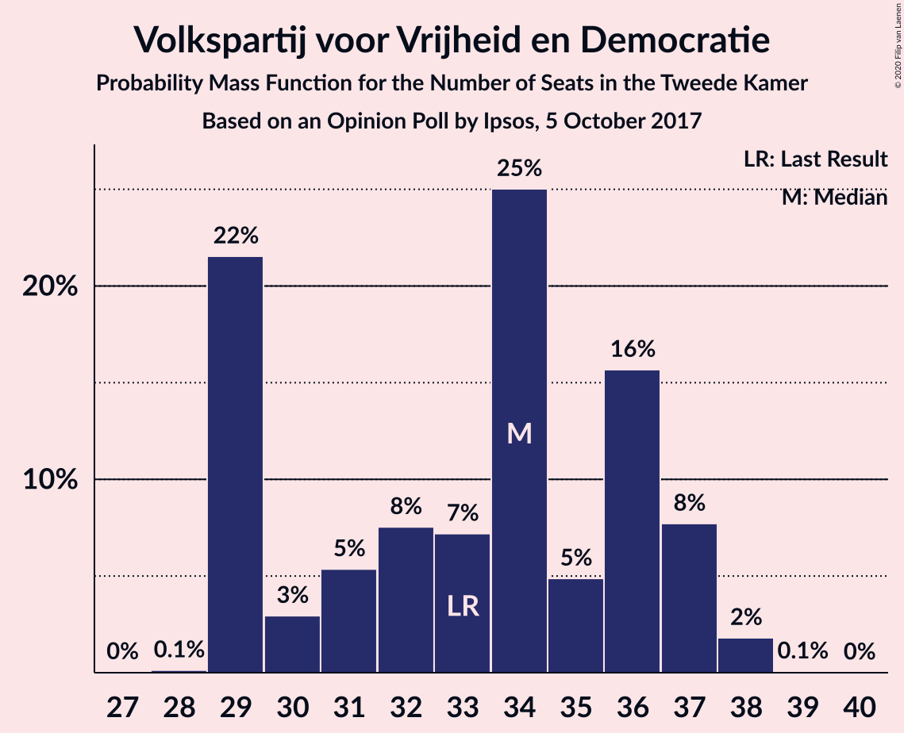

| Number of Seats | Probability | Accumulated | Special Marks |
|:---------------:|:-----------:|:-----------:|:-------------:|
| 26 | 0.1% | 100% |  |
| 27 | 0% | 99.9% |  |
| 28 | 0.2% | 99.9% |  |
| 29 | 4% | 99.7% |  |
| 30 | 21% | 95% |  |
| 31 | 0.5% | 74% |  |
| 32 | 0.7% | 74% |  |
| 33 | 0.5% | 73% | Last Result |
| 34 | 9% | 73% |  |
| 35 | 0.3% | 63% |  |
| 36 | 5% | 63% |  |
| 37 | 58% | 58% | Median |
| 38 | 0.3% | 0.7% |  |
| 39 | 0.4% | 0.4% |  |
| 40 | 0% | 0% |  |

### Democraten 66

*For a full overview of the results for this party, see the [Democraten 66](party-democraten66.html) page.*

| Number of Seats | Probability | Accumulated | Special Marks |
|:---------------:|:-----------:|:-----------:|:-------------:|
| 16 | 0.1% | 100% |  |
| 17 | 2% | 99.8% |  |
| 18 | 13% | 98% |  |
| 19 | 63% | 84% | Last Result, Median |
| 20 | 19% | 21% |  |
| 21 | 0.3% | 2% |  |
| 22 | 0.3% | 1.5% |  |
| 23 | 0.8% | 1.1% |  |
| 24 | 0.2% | 0.3% |  |
| 25 | 0.1% | 0.1% |  |
| 26 | 0% | 0% |  |

### Partij voor de Vrijheid

*For a full overview of the results for this party, see the [Partij voor de Vrijheid](party-partijvoordevrijheid.html) page.*

| Number of Seats | Probability | Accumulated | Special Marks |
|:---------------:|:-----------:|:-----------:|:-------------:|
| 13 | 0.1% | 100% |  |
| 14 | 0.8% | 99.9% |  |
| 15 | 0.5% | 99.1% |  |
| 16 | 24% | 98.6% |  |
| 17 | 63% | 74% | Median |
| 18 | 9% | 11% |  |
| 19 | 2% | 3% |  |
| 20 | 0.4% | 0.7% | Last Result |
| 21 | 0.2% | 0.2% |  |
| 22 | 0.1% | 0.1% |  |
| 23 | 0% | 0% |  |

### Christen-Democratisch Appèl

*For a full overview of the results for this party, see the [Christen-Democratisch Appèl](party-christen-democratischappèl.html) page.*

| Number of Seats | Probability | Accumulated | Special Marks |
|:---------------:|:-----------:|:-----------:|:-------------:|
| 10 | 0.2% | 100% |  |
| 11 | 0.1% | 99.8% |  |
| 12 | 1.2% | 99.8% |  |
| 13 | 86% | 98.6% | Median |
| 14 | 1.2% | 13% |  |
| 15 | 5% | 12% |  |
| 16 | 3% | 7% |  |
| 17 | 4% | 5% |  |
| 18 | 0.1% | 0.3% |  |
| 19 | 0.2% | 0.3% | Last Result |
| 20 | 0% | 0.1% |  |
| 21 | 0% | 0% |  |

### GroenLinks

*For a full overview of the results for this party, see the [GroenLinks](party-groenlinks.html) page.*

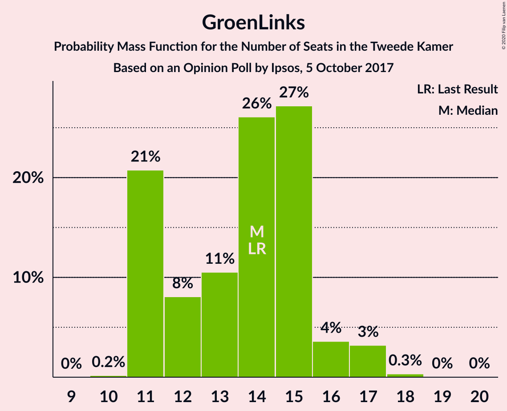

| Number of Seats | Probability | Accumulated | Special Marks |
|:---------------:|:-----------:|:-----------:|:-------------:|
| 10 | 0.1% | 100% |  |
| 11 | 70% | 99.9% | Median |
| 12 | 0.5% | 30% |  |
| 13 | 0.6% | 29% |  |
| 14 | 0.8% | 28% | Last Result |
| 15 | 0.9% | 28% |  |
| 16 | 2% | 27% |  |
| 17 | 23% | 25% |  |
| 18 | 2% | 2% |  |
| 19 | 0% | 0% |  |

### Socialistische Partij

*For a full overview of the results for this party, see the [Socialistische Partij](party-socialistischepartij.html) page.*

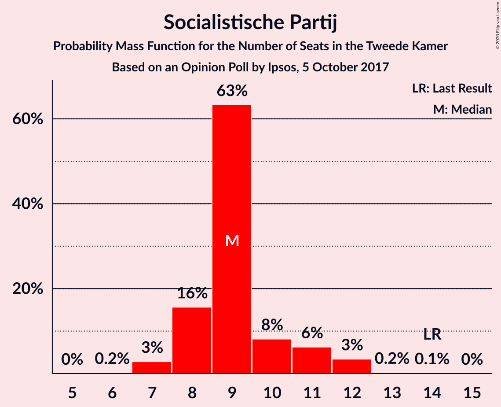

| Number of Seats | Probability | Accumulated | Special Marks |
|:---------------:|:-----------:|:-----------:|:-------------:|
| 6 | 0.3% | 100% |  |
| 7 | 0.5% | 99.7% |  |
| 8 | 9% | 99.3% |  |
| 9 | 3% | 90% |  |
| 10 | 67% | 88% | Median |
| 11 | 0.4% | 21% |  |
| 12 | 20% | 20% |  |
| 13 | 0.1% | 0.9% |  |
| 14 | 0.8% | 0.8% | Last Result |
| 15 | 0% | 0% |  |

### Forum voor Democratie

*For a full overview of the results for this party, see the [Forum voor Democratie](party-forumvoordemocratie.html) page.*

| Number of Seats | Probability | Accumulated | Special Marks |
|:---------------:|:-----------:|:-----------:|:-------------:|
| 2 | 0% | 100% | Last Result |
| 3 | 0% | 100% |  |
| 4 | 0% | 100% |  |
| 5 | 0% | 100% |  |
| 6 | 0.1% | 100% |  |
| 7 | 0.3% | 99.9% |  |
| 8 | 2% | 99.7% |  |
| 9 | 83% | 98% | Median |
| 10 | 1.0% | 15% |  |
| 11 | 0.7% | 14% |  |
| 12 | 13% | 13% |  |
| 13 | 0.2% | 0.2% |  |
| 14 | 0% | 0% |  |

### Partij van de Arbeid

*For a full overview of the results for this party, see the [Partij van de Arbeid](party-partijvandearbeid.html) page.*

| Number of Seats | Probability | Accumulated | Special Marks |
|:---------------:|:-----------:|:-----------:|:-------------:|
| 5 | 0.5% | 100% |  |
| 6 | 0.7% | 99.5% |  |
| 7 | 80% | 98.8% | Median |
| 8 | 18% | 19% |  |
| 9 | 0.5% | 1.0% | Last Result |
| 10 | 0.3% | 0.4% |  |
| 11 | 0.1% | 0.2% |  |
| 12 | 0% | 0% |  |

### Partij voor de Dieren

*For a full overview of the results for this party, see the [Partij voor de Dieren](party-partijvoordedieren.html) page.*

| Number of Seats | Probability | Accumulated | Special Marks |
|:---------------:|:-----------:|:-----------:|:-------------:|
| 5 | 2% | 100% | Last Result |
| 6 | 2% | 98% |  |
| 7 | 95% | 96% | Median |
| 8 | 0.7% | 1.4% |  |
| 9 | 0.3% | 0.7% |  |
| 10 | 0.3% | 0.4% |  |
| 11 | 0% | 0% |  |

### ChristenUnie

*For a full overview of the results for this party, see the [ChristenUnie](party-christenunie.html) page.*

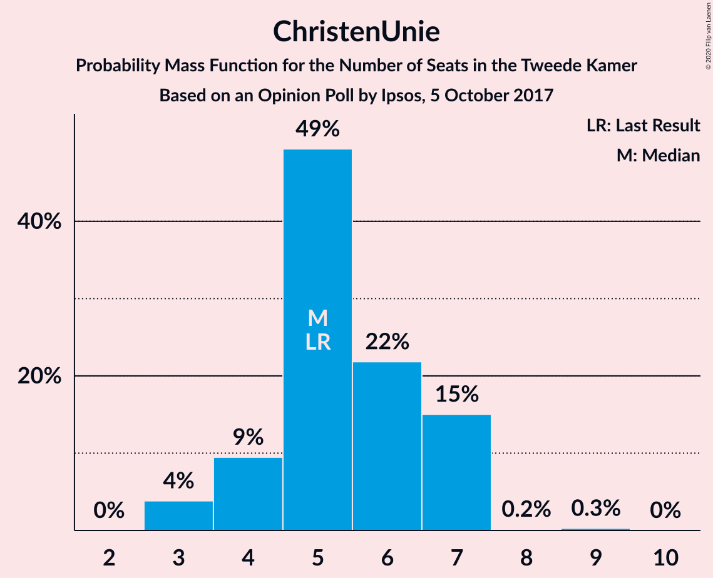

| Number of Seats | Probability | Accumulated | Special Marks |
|:---------------:|:-----------:|:-----------:|:-------------:|
| 3 | 0.1% | 100% |  |
| 4 | 67% | 99.9% | Median |
| 5 | 1.2% | 32% | Last Result |
| 6 | 30% | 31% |  |
| 7 | 1.2% | 1.3% |  |
| 8 | 0% | 0.1% |  |
| 9 | 0.1% | 0.1% |  |
| 10 | 0% | 0% |  |

### 50Plus

*For a full overview of the results for this party, see the [50Plus](party-50plus.html) page.*

| Number of Seats | Probability | Accumulated | Special Marks |
|:---------------:|:-----------:|:-----------:|:-------------:|
| 2 | 0.2% | 100% |  |
| 3 | 0.8% | 99.8% |  |
| 4 | 14% | 99.0% | Last Result |
| 5 | 25% | 85% |  |
| 6 | 2% | 60% |  |
| 7 | 58% | 58% | Median |
| 8 | 0.1% | 0.1% |  |
| 9 | 0% | 0% |  |

### DENK

*For a full overview of the results for this party, see the [DENK](party-denk.html) page.*

| Number of Seats | Probability | Accumulated | Special Marks |
|:---------------:|:-----------:|:-----------:|:-------------:|
| 3 | 3% | 100% | Last Result |
| 4 | 60% | 97% | Median |
| 5 | 13% | 37% |  |
| 6 | 24% | 24% |  |
| 7 | 0.4% | 0.5% |  |
| 8 | 0.1% | 0.1% |  |
| 9 | 0% | 0% |  |

### Staatkundig Gereformeerde Partij

*For a full overview of the results for this party, see the [Staatkundig Gereformeerde Partij](party-staatkundiggereformeerdepartij.html) page.*

| Number of Seats | Probability | Accumulated | Special Marks |
|:---------------:|:-----------:|:-----------:|:-------------:|
| 0 | 0.1% | 100% |  |
| 1 | 20% | 99.9% |  |
| 2 | 8% | 80% |  |
| 3 | 68% | 73% | Last Result, Median |
| 4 | 5% | 5% |  |
| 5 | 0.1% | 0.1% |  |
| 6 | 0% | 0% |  |

## Coalitions

### Confidence Intervals

| Coalition | Last Result | Median | Majority? | 80% Confidence Interval | 90% Confidence Interval | 95% Confidence Interval | 99% Confidence Interval |
|:---------:|:-----------:|:------:|:---------:|:-----------------------:|:-----------------------:|:-----------------------:|:-----------------------:|
| Volkspartij voor Vrijheid en Democratie – Democraten 66 – Christen-Democratisch Appèl – GroenLinks – ChristenUnie | 90 | 84 | 100% | 84–86 | 82–86 | 82–87 | 82–91 |
| Volkspartij voor Vrijheid en Democratie – Partij voor de Vrijheid – Christen-Democratisch Appèl – Forum voor Democratie – Staatkundig Gereformeerde Partij | 77 | 79 | 74% | 69–80 | 69–80 | 69–82 | 69–82 |
| Volkspartij voor Vrijheid en Democratie – Democraten 66 – Christen-Democratisch Appèl – Partij van de Arbeid – ChristenUnie | 85 | 80 | 99.7% | 76–80 | 76–81 | 76–81 | 76–83 |
| Volkspartij voor Vrijheid en Democratie – Partij voor de Vrijheid – Christen-Democratisch Appèl – Forum voor Democratie | 74 | 76 | 72% | 68–77 | 68–78 | 68–80 | 68–80 |
| Democraten 66 – Christen-Democratisch Appèl – GroenLinks – Socialistische Partij – Partij van de Arbeid – ChristenUnie | 80 | 64 | 1.0% | 64–75 | 64–75 | 64–75 | 64–76 |
| Volkspartij voor Vrijheid en Democratie – Democraten 66 – Christen-Democratisch Appèl – ChristenUnie | 76 | 73 | 1.4% | 69–73 | 69–73 | 69–73 | 69–77 |
| Volkspartij voor Vrijheid en Democratie – Democraten 66 – Christen-Democratisch Appèl | 71 | 69 | 0% | 63–69 | 63–69 | 63–69 | 63–71 |
| Volkspartij voor Vrijheid en Democratie – Christen-Democratisch Appèl – Forum voor Democratie – 50Plus – Staatkundig Gereformeerde Partij | 61 | 69 | 0% | 58–69 | 58–69 | 58–69 | 58–69 |
| Volkspartij voor Vrijheid en Democratie – Partij voor de Vrijheid – Christen-Democratisch Appèl | 72 | 67 | 0% | 59–67 | 59–68 | 59–68 | 59–70 |
| Volkspartij voor Vrijheid en Democratie – Christen-Democratisch Appèl – Forum voor Democratie – 50Plus | 58 | 66 | 0% | 57–66 | 57–66 | 57–67 | 57–67 |
| Democraten 66 – Christen-Democratisch Appèl – GroenLinks – Partij van de Arbeid – ChristenUnie | 66 | 54 | 0% | 54–63 | 54–65 | 54–65 | 54–66 |
| Volkspartij voor Vrijheid en Democratie – Christen-Democratisch Appèl – Forum voor Democratie – Staatkundig Gereformeerde Partij | 57 | 62 | 0% | 53–62 | 53–64 | 53–65 | 53–65 |
| Volkspartij voor Vrijheid en Democratie – Democraten 66 – Partij van de Arbeid | 61 | 63 | 0% | 57–63 | 56–63 | 56–63 | 54–63 |
| Volkspartij voor Vrijheid en Democratie – Christen-Democratisch Appèl – Forum voor Democratie | 54 | 59 | 0% | 52–59 | 52–61 | 52–63 | 52–63 |
| Volkspartij voor Vrijheid en Democratie – Christen-Democratisch Appèl – Partij van de Arbeid | 61 | 57 | 0% | 50–57 | 50–58 | 50–59 | 50–59 |
| Volkspartij voor Vrijheid en Democratie – Christen-Democratisch Appèl | 52 | 50 | 0% | 43–50 | 43–51 | 43–51 | 43–51 |
| Democraten 66 – Christen-Democratisch Appèl – Partij van de Arbeid | 47 | 39 | 0% | 39–41 | 39–44 | 39–44 | 36–45 |
| Volkspartij voor Vrijheid en Democratie – Partij van de Arbeid | 42 | 44 | 0% | 37–44 | 37–44 | 37–44 | 37–44 |
| Democraten 66 – Christen-Democratisch Appèl | 38 | 32 | 0% | 32–33 | 31–36 | 31–36 | 31–39 |
| Christen-Democratisch Appèl – Partij van de Arbeid – ChristenUnie | 33 | 24 | 0% | 24–27 | 24–29 | 24–29 | 24–31 |
| Christen-Democratisch Appèl – Partij van de Arbeid | 28 | 20 | 0% | 20–23 | 20–24 | 20–25 | 18–26 |

### Volkspartij voor Vrijheid en Democratie – Democraten 66 – Christen-Democratisch Appèl – GroenLinks – ChristenUnie

| Number of Seats | Probability | Accumulated | Special Marks |
|:---------------:|:-----------:|:-----------:|:-------------:|
| 78 | 0.1% | 100% |  |
| 79 | 0.1% | 99.9% |  |
| 80 | 0% | 99.8% |  |
| 81 | 0% | 99.8% |  |
| 82 | 9% | 99.8% |  |
| 83 | 0.3% | 91% |  |
| 84 | 62% | 91% | Median |
| 85 | 0.1% | 29% |  |
| 86 | 24% | 29% |  |
| 87 | 3% | 5% |  |
| 88 | 0.3% | 2% |  |
| 89 | 0.1% | 2% |  |
| 90 | 0.7% | 2% | Last Result |
| 91 | 0.4% | 0.9% |  |
| 92 | 0.4% | 0.5% |  |
| 93 | 0% | 0.1% |  |
| 94 | 0% | 0.1% |  |
| 95 | 0% | 0% |  |

### Volkspartij voor Vrijheid en Democratie – Partij voor de Vrijheid – Christen-Democratisch Appèl – Forum voor Democratie – Staatkundig Gereformeerde Partij

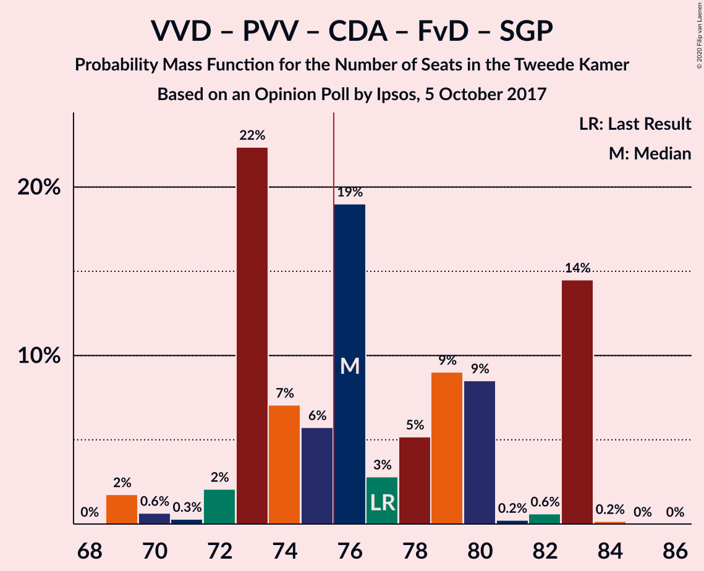

| Number of Seats | Probability | Accumulated | Special Marks |
|:---------------:|:-----------:|:-----------:|:-------------:|
| 69 | 19% | 100% |  |
| 70 | 0.2% | 81% |  |
| 71 | 0.5% | 81% |  |
| 72 | 0.2% | 80% |  |
| 73 | 0.2% | 80% |  |
| 74 | 0.2% | 80% |  |
| 75 | 6% | 80% |  |
| 76 | 2% | 74% | Majority |
| 77 | 0.3% | 72% | Last Result |
| 78 | 0.7% | 72% |  |
| 79 | 58% | 71% | Median |
| 80 | 9% | 14% |  |
| 81 | 0.1% | 5% |  |
| 82 | 4% | 5% |  |
| 83 | 0.4% | 0.5% |  |
| 84 | 0% | 0% |  |

### Volkspartij voor Vrijheid en Democratie – Democraten 66 – Christen-Democratisch Appèl – Partij van de Arbeid – ChristenUnie

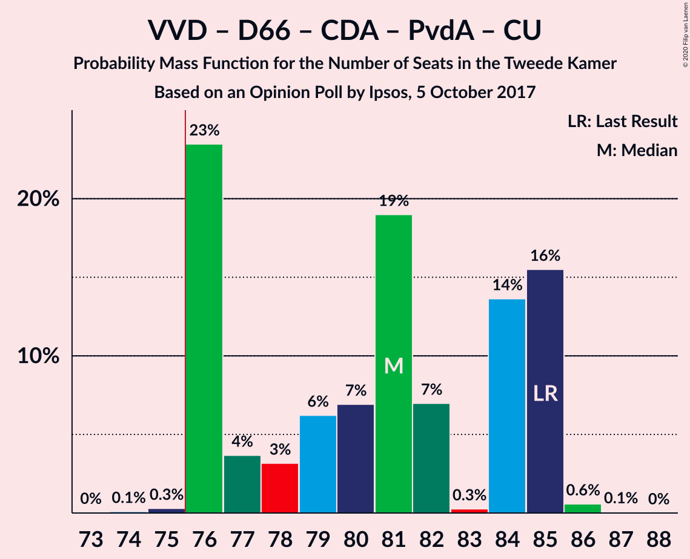

| Number of Seats | Probability | Accumulated | Special Marks |
|:---------------:|:-----------:|:-----------:|:-------------:|
| 72 | 0.1% | 100% |  |
| 73 | 0% | 99.9% |  |
| 74 | 0.1% | 99.9% |  |
| 75 | 0.1% | 99.8% |  |
| 76 | 21% | 99.7% | Majority |
| 77 | 4% | 79% |  |
| 78 | 1.4% | 75% |  |
| 79 | 9% | 73% |  |
| 80 | 58% | 65% | Median |
| 81 | 5% | 6% |  |
| 82 | 1.3% | 2% |  |
| 83 | 0.2% | 0.6% |  |
| 84 | 0.1% | 0.4% |  |
| 85 | 0.1% | 0.3% | Last Result |
| 86 | 0% | 0.2% |  |
| 87 | 0.2% | 0.2% |  |
| 88 | 0% | 0% |  |

### Volkspartij voor Vrijheid en Democratie – Partij voor de Vrijheid – Christen-Democratisch Appèl – Forum voor Democratie

| Number of Seats | Probability | Accumulated | Special Marks |
|:---------------:|:-----------:|:-----------:|:-------------:|
| 66 | 0.1% | 100% |  |
| 67 | 0% | 99.9% |  |
| 68 | 19% | 99.9% |  |
| 69 | 0.7% | 81% |  |
| 70 | 0.2% | 80% |  |
| 71 | 5% | 80% |  |
| 72 | 0.9% | 75% |  |
| 73 | 0.4% | 74% |  |
| 74 | 2% | 74% | Last Result |
| 75 | 0.2% | 72% |  |
| 76 | 58% | 72% | Median, Majority |
| 77 | 9% | 14% |  |
| 78 | 0.2% | 5% |  |
| 79 | 0% | 5% |  |
| 80 | 5% | 5% |  |
| 81 | 0% | 0% |  |

### Democraten 66 – Christen-Democratisch Appèl – GroenLinks – Socialistische Partij – Partij van de Arbeid – ChristenUnie

| Number of Seats | Probability | Accumulated | Special Marks |
|:---------------:|:-----------:|:-----------:|:-------------:|
| 64 | 62% | 100% | Median |
| 65 | 0.7% | 38% |  |
| 66 | 9% | 37% |  |
| 67 | 0.1% | 29% |  |
| 68 | 0.4% | 29% |  |
| 69 | 0.1% | 28% |  |
| 70 | 0.2% | 28% |  |
| 71 | 0.3% | 28% |  |
| 72 | 0.5% | 28% |  |
| 73 | 6% | 27% |  |
| 74 | 1.0% | 21% |  |
| 75 | 19% | 20% |  |
| 76 | 0.8% | 1.0% | Majority |
| 77 | 0.1% | 0.2% |  |
| 78 | 0.1% | 0.2% |  |
| 79 | 0% | 0% |  |
| 80 | 0% | 0% | Last Result |

### Volkspartij voor Vrijheid en Democratie – Democraten 66 – Christen-Democratisch Appèl – ChristenUnie

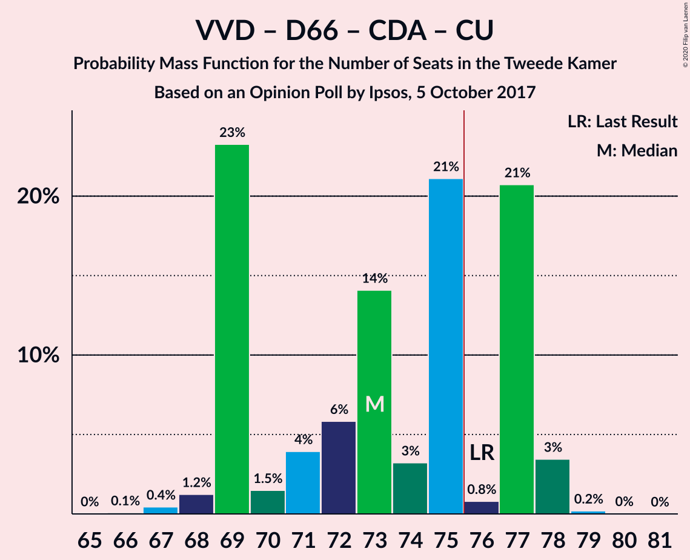

| Number of Seats | Probability | Accumulated | Special Marks |
|:---------------:|:-----------:|:-----------:|:-------------:|
| 64 | 0.1% | 100% |  |
| 65 | 0% | 99.9% |  |
| 66 | 0.1% | 99.8% |  |
| 67 | 0% | 99.8% |  |
| 68 | 0.1% | 99.7% |  |
| 69 | 25% | 99.7% |  |
| 70 | 0.6% | 75% |  |
| 71 | 10% | 74% |  |
| 72 | 0.5% | 64% |  |
| 73 | 62% | 64% | Median |
| 74 | 0.2% | 2% |  |
| 75 | 0.3% | 2% |  |
| 76 | 0.7% | 1.4% | Last Result, Majority |
| 77 | 0.5% | 0.7% |  |
| 78 | 0.1% | 0.2% |  |
| 79 | 0.1% | 0.1% |  |
| 80 | 0% | 0% |  |

### Volkspartij voor Vrijheid en Democratie – Democraten 66 – Christen-Democratisch Appèl

| Number of Seats | Probability | Accumulated | Special Marks |
|:---------------:|:-----------:|:-----------:|:-------------:|
| 59 | 0.1% | 100% |  |
| 60 | 0.1% | 99.8% |  |
| 61 | 0% | 99.8% |  |
| 62 | 0.1% | 99.8% |  |
| 63 | 21% | 99.7% |  |
| 64 | 0.4% | 79% |  |
| 65 | 13% | 78% |  |
| 66 | 0.7% | 66% |  |
| 67 | 1.1% | 65% |  |
| 68 | 0.2% | 64% |  |
| 69 | 62% | 64% | Median |
| 70 | 0.5% | 1.3% |  |
| 71 | 0.6% | 0.8% | Last Result |
| 72 | 0% | 0.2% |  |
| 73 | 0.1% | 0.1% |  |
| 74 | 0% | 0.1% |  |
| 75 | 0% | 0% |  |

### Volkspartij voor Vrijheid en Democratie – Christen-Democratisch Appèl – Forum voor Democratie – 50Plus – Staatkundig Gereformeerde Partij

| Number of Seats | Probability | Accumulated | Special Marks |
|:---------------:|:-----------:|:-----------:|:-------------:|
| 56 | 0.2% | 100% |  |
| 57 | 0% | 99.8% |  |
| 58 | 19% | 99.7% |  |
| 59 | 0.1% | 81% |  |
| 60 | 0.4% | 80% |  |
| 61 | 0.2% | 80% | Last Result |
| 62 | 0.2% | 80% |  |
| 63 | 2% | 80% |  |
| 64 | 5% | 77% |  |
| 65 | 0.5% | 72% |  |
| 66 | 9% | 72% |  |
| 67 | 0.1% | 63% |  |
| 68 | 0.7% | 63% |  |
| 69 | 62% | 62% | Median |
| 70 | 0% | 0.1% |  |
| 71 | 0% | 0.1% |  |
| 72 | 0% | 0% |  |

### Volkspartij voor Vrijheid en Democratie – Partij voor de Vrijheid – Christen-Democratisch Appèl

| Number of Seats | Probability | Accumulated | Special Marks |
|:---------------:|:-----------:|:-----------:|:-------------:|
| 58 | 0.1% | 100% |  |
| 59 | 19% | 99.9% |  |
| 60 | 0.3% | 81% |  |
| 61 | 0.6% | 80% |  |
| 62 | 5% | 80% |  |
| 63 | 0.1% | 75% |  |
| 64 | 1.1% | 75% |  |
| 65 | 11% | 74% |  |
| 66 | 0.3% | 63% |  |
| 67 | 58% | 63% | Median |
| 68 | 4% | 5% |  |
| 69 | 0% | 0.5% |  |
| 70 | 0.4% | 0.5% |  |
| 71 | 0% | 0.1% |  |
| 72 | 0% | 0% | Last Result |

### Volkspartij voor Vrijheid en Democratie – Christen-Democratisch Appèl – Forum voor Democratie – 50Plus

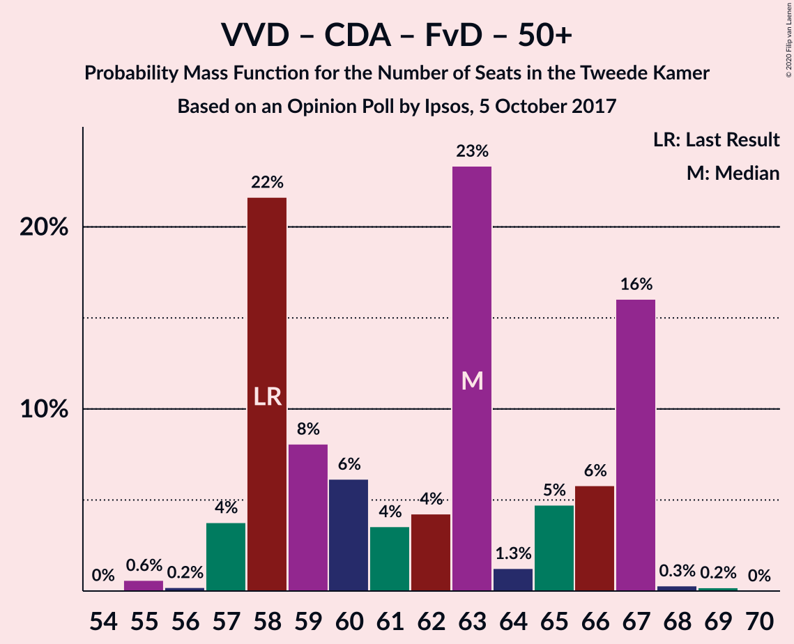

| Number of Seats | Probability | Accumulated | Special Marks |
|:---------------:|:-----------:|:-----------:|:-------------:|
| 54 | 0.3% | 100% |  |
| 55 | 0% | 99.7% |  |
| 56 | 0% | 99.7% |  |
| 57 | 19% | 99.7% |  |
| 58 | 0.1% | 80% | Last Result |
| 59 | 0.6% | 80% |  |
| 60 | 5% | 80% |  |
| 61 | 3% | 75% |  |
| 62 | 0.3% | 72% |  |
| 63 | 9% | 72% |  |
| 64 | 0.3% | 63% |  |
| 65 | 0.5% | 63% |  |
| 66 | 58% | 62% | Median |
| 67 | 4% | 4% |  |
| 68 | 0% | 0.1% |  |
| 69 | 0.1% | 0.1% |  |
| 70 | 0% | 0% |  |

### Democraten 66 – Christen-Democratisch Appèl – GroenLinks – Partij van de Arbeid – ChristenUnie

| Number of Seats | Probability | Accumulated | Special Marks |
|:---------------:|:-----------:|:-----------:|:-------------:|
| 54 | 58% | 100% | Median |
| 55 | 0.2% | 42% |  |
| 56 | 13% | 42% |  |
| 57 | 0.1% | 29% |  |
| 58 | 0.2% | 29% |  |
| 59 | 0.3% | 29% |  |
| 60 | 0.9% | 28% |  |
| 61 | 0.4% | 27% |  |
| 62 | 0.4% | 27% |  |
| 63 | 19% | 27% |  |
| 64 | 2% | 7% |  |
| 65 | 5% | 5% |  |
| 66 | 0.6% | 0.8% | Last Result |
| 67 | 0% | 0.2% |  |
| 68 | 0.1% | 0.2% |  |
| 69 | 0% | 0% |  |

### Volkspartij voor Vrijheid en Democratie – Christen-Democratisch Appèl – Forum voor Democratie – Staatkundig Gereformeerde Partij

| Number of Seats | Probability | Accumulated | Special Marks |
|:---------------:|:-----------:|:-----------:|:-------------:|
| 51 | 0.2% | 100% |  |
| 52 | 0.1% | 99.8% |  |
| 53 | 19% | 99.7% |  |
| 54 | 0% | 80% |  |
| 55 | 0.2% | 80% |  |
| 56 | 0.1% | 80% |  |
| 57 | 2% | 80% | Last Result |
| 58 | 0.3% | 78% |  |
| 59 | 5% | 78% |  |
| 60 | 0.3% | 73% |  |
| 61 | 0.9% | 72% |  |
| 62 | 66% | 71% | Median |
| 63 | 0.1% | 5% |  |
| 64 | 0.6% | 5% |  |
| 65 | 4% | 4% |  |
| 66 | 0% | 0% |  |

### Volkspartij voor Vrijheid en Democratie – Democraten 66 – Partij van de Arbeid

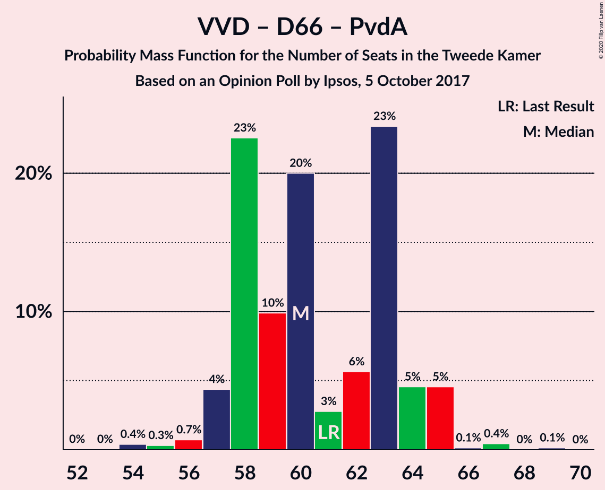

| Number of Seats | Probability | Accumulated | Special Marks |
|:---------------:|:-----------:|:-----------:|:-------------:|
| 53 | 0.1% | 100% |  |
| 54 | 2% | 99.9% |  |
| 55 | 0% | 98% |  |
| 56 | 4% | 98% |  |
| 57 | 19% | 94% |  |
| 58 | 0.1% | 74% |  |
| 59 | 0.4% | 74% |  |
| 60 | 10% | 74% |  |
| 61 | 1.0% | 64% | Last Result |
| 62 | 5% | 63% |  |
| 63 | 58% | 59% | Median |
| 64 | 0.1% | 0.4% |  |
| 65 | 0.1% | 0.3% |  |
| 66 | 0% | 0.2% |  |
| 67 | 0.1% | 0.2% |  |
| 68 | 0.1% | 0.1% |  |
| 69 | 0% | 0% |  |

### Volkspartij voor Vrijheid en Democratie – Christen-Democratisch Appèl – Forum voor Democratie

| Number of Seats | Probability | Accumulated | Special Marks |
|:---------------:|:-----------:|:-----------:|:-------------:|
| 49 | 0.3% | 100% |  |
| 50 | 0.1% | 99.7% |  |
| 51 | 0% | 99.6% |  |
| 52 | 19% | 99.6% |  |
| 53 | 0.1% | 80% |  |
| 54 | 0.3% | 80% | Last Result |
| 55 | 6% | 80% |  |
| 56 | 1.2% | 74% |  |
| 57 | 0.7% | 73% |  |
| 58 | 0.3% | 72% |  |
| 59 | 66% | 72% | Median |
| 60 | 0.1% | 5% |  |
| 61 | 0.5% | 5% |  |
| 62 | 0.2% | 5% |  |
| 63 | 4% | 4% |  |
| 64 | 0% | 0% |  |

### Volkspartij voor Vrijheid en Democratie – Christen-Democratisch Appèl – Partij van de Arbeid

| Number of Seats | Probability | Accumulated | Special Marks |
|:---------------:|:-----------:|:-----------:|:-------------:|
| 48 | 0.1% | 100% |  |
| 49 | 0.2% | 99.9% |  |
| 50 | 19% | 99.7% |  |
| 51 | 0% | 80% |  |
| 52 | 0.5% | 80% |  |
| 53 | 2% | 80% |  |
| 54 | 5% | 78% |  |
| 55 | 9% | 73% |  |
| 56 | 0.7% | 64% |  |
| 57 | 58% | 63% | Median |
| 58 | 0.2% | 5% |  |
| 59 | 5% | 5% |  |
| 60 | 0.1% | 0.2% |  |
| 61 | 0% | 0.1% | Last Result |
| 62 | 0% | 0.1% |  |
| 63 | 0.1% | 0.1% |  |
| 64 | 0% | 0% |  |

### Volkspartij voor Vrijheid en Democratie – Christen-Democratisch Appèl

| Number of Seats | Probability | Accumulated | Special Marks |
|:---------------:|:-----------:|:-----------:|:-------------:|
| 40 | 0.1% | 100% |  |
| 41 | 0.3% | 99.9% |  |
| 42 | 0.1% | 99.6% |  |
| 43 | 19% | 99.5% |  |
| 44 | 0.1% | 80% |  |
| 45 | 0.3% | 80% |  |
| 46 | 6% | 80% |  |
| 47 | 9% | 74% |  |
| 48 | 1.5% | 65% |  |
| 49 | 0.1% | 63% |  |
| 50 | 58% | 63% | Median |
| 51 | 5% | 5% |  |
| 52 | 0.4% | 0.5% | Last Result |
| 53 | 0% | 0.1% |  |
| 54 | 0% | 0% |  |

### Democraten 66 – Christen-Democratisch Appèl – Partij van de Arbeid

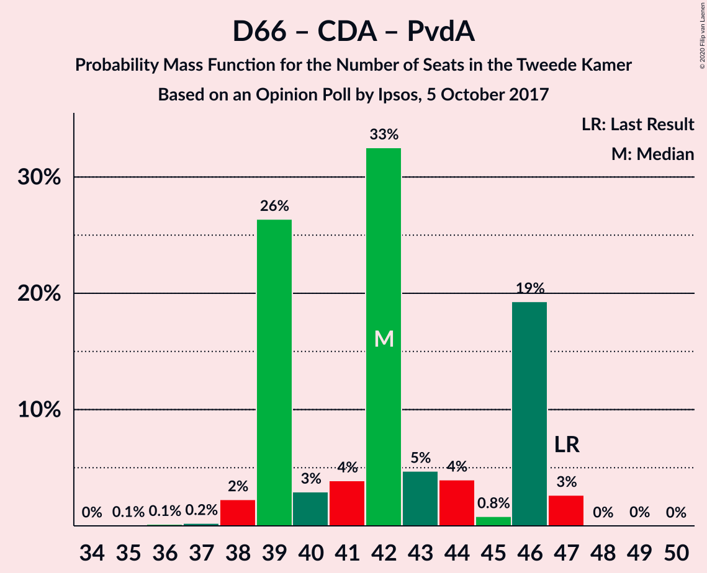

| Number of Seats | Probability | Accumulated | Special Marks |
|:---------------:|:-----------:|:-----------:|:-------------:|
| 36 | 0.7% | 100% |  |
| 37 | 0.1% | 99.3% |  |
| 38 | 0.1% | 99.1% |  |
| 39 | 66% | 99.1% | Median |
| 40 | 22% | 33% |  |
| 41 | 5% | 11% |  |
| 42 | 0.4% | 6% |  |
| 43 | 0.3% | 6% |  |
| 44 | 5% | 6% |  |
| 45 | 0.8% | 1.1% |  |
| 46 | 0.2% | 0.3% |  |
| 47 | 0% | 0.1% | Last Result |
| 48 | 0% | 0.1% |  |
| 49 | 0% | 0% |  |

### Volkspartij voor Vrijheid en Democratie – Partij van de Arbeid

| Number of Seats | Probability | Accumulated | Special Marks |
|:---------------:|:-----------:|:-----------:|:-------------:|
| 34 | 0% | 100% |  |
| 35 | 0.1% | 99.9% |  |
| 36 | 0.2% | 99.8% |  |
| 37 | 25% | 99.7% |  |
| 38 | 0.6% | 75% |  |
| 39 | 0.3% | 74% |  |
| 40 | 0.6% | 74% |  |
| 41 | 1.2% | 73% |  |
| 42 | 9% | 72% | Last Result |
| 43 | 0.2% | 63% |  |
| 44 | 63% | 63% | Median |
| 45 | 0.1% | 0.3% |  |
| 46 | 0.1% | 0.2% |  |
| 47 | 0% | 0.1% |  |
| 48 | 0% | 0.1% |  |
| 49 | 0.1% | 0.1% |  |
| 50 | 0% | 0% |  |

### Democraten 66 – Christen-Democratisch Appèl

| Number of Seats | Probability | Accumulated | Special Marks |
|:---------------:|:-----------:|:-----------:|:-------------:|
| 28 | 0.2% | 100% |  |
| 29 | 0.2% | 99.8% |  |
| 30 | 0.1% | 99.7% |  |
| 31 | 9% | 99.5% |  |
| 32 | 58% | 90% | Median |
| 33 | 26% | 33% |  |
| 34 | 0.2% | 6% |  |
| 35 | 0.7% | 6% |  |
| 36 | 5% | 6% |  |
| 37 | 0.1% | 0.9% |  |
| 38 | 0.1% | 0.8% | Last Result |
| 39 | 0.7% | 0.7% |  |
| 40 | 0% | 0% |  |

### Christen-Democratisch Appèl – Partij van de Arbeid – ChristenUnie

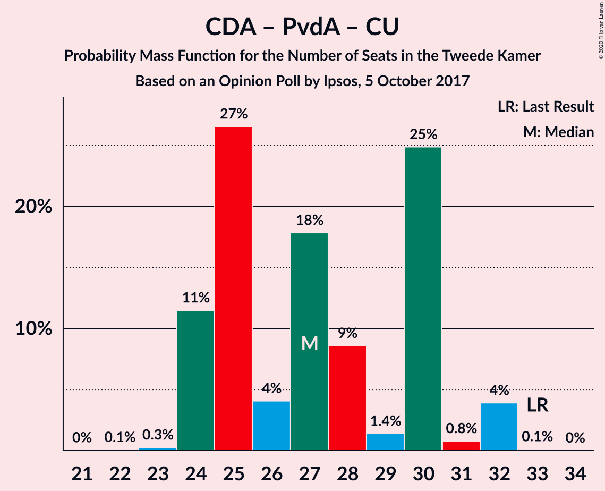

| Number of Seats | Probability | Accumulated | Special Marks |
|:---------------:|:-----------:|:-----------:|:-------------:|
| 23 | 0.1% | 100% |  |
| 24 | 58% | 99.9% | Median |
| 25 | 1.1% | 42% |  |
| 26 | 20% | 41% |  |
| 27 | 14% | 21% |  |
| 28 | 0.3% | 7% |  |
| 29 | 6% | 7% |  |
| 30 | 0.5% | 1.0% |  |
| 31 | 0.2% | 0.5% |  |
| 32 | 0.2% | 0.3% |  |
| 33 | 0.1% | 0.1% | Last Result |
| 34 | 0% | 0% |  |

### Christen-Democratisch Appèl – Partij van de Arbeid

| Number of Seats | Probability | Accumulated | Special Marks |
|:---------------:|:-----------:|:-----------:|:-------------:|
| 17 | 0.4% | 100% |  |
| 18 | 0.2% | 99.6% |  |
| 19 | 0.2% | 99.4% |  |
| 20 | 77% | 99.1% | Median |
| 21 | 10% | 22% |  |
| 22 | 0.8% | 12% |  |
| 23 | 6% | 11% |  |
| 24 | 0.3% | 5% |  |
| 25 | 4% | 5% |  |
| 26 | 0.4% | 0.5% |  |
| 27 | 0.1% | 0.1% |  |
| 28 | 0.1% | 0.1% | Last Result |
| 29 | 0% | 0% |  |

## Technical Information

### Opinion Poll

+ **Polling firm:** Ipsos
+ **Commissioner(s):** —
+ **Fieldwork period:** 5 October 2017

### Calculations

+ **Sample size:** 1000
+ **Simulations done:** 131,072
+ **Error estimate:** 4.50%

