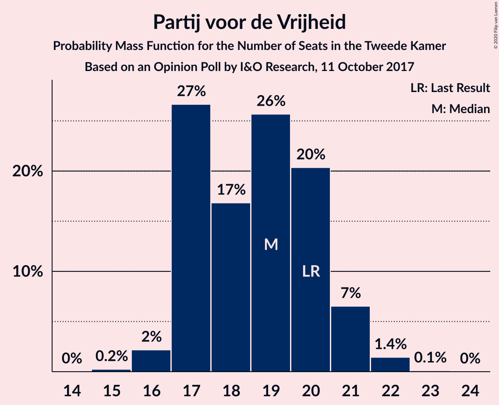
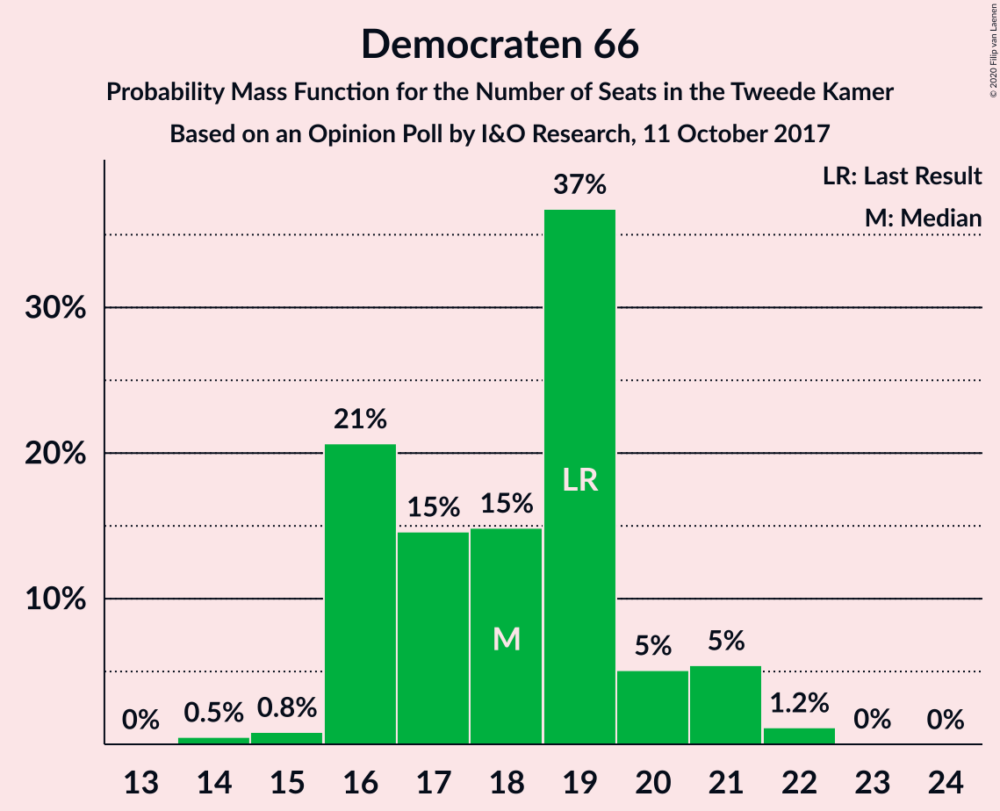
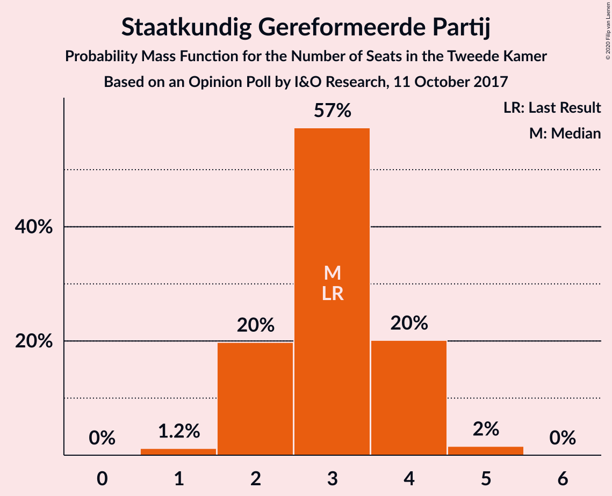
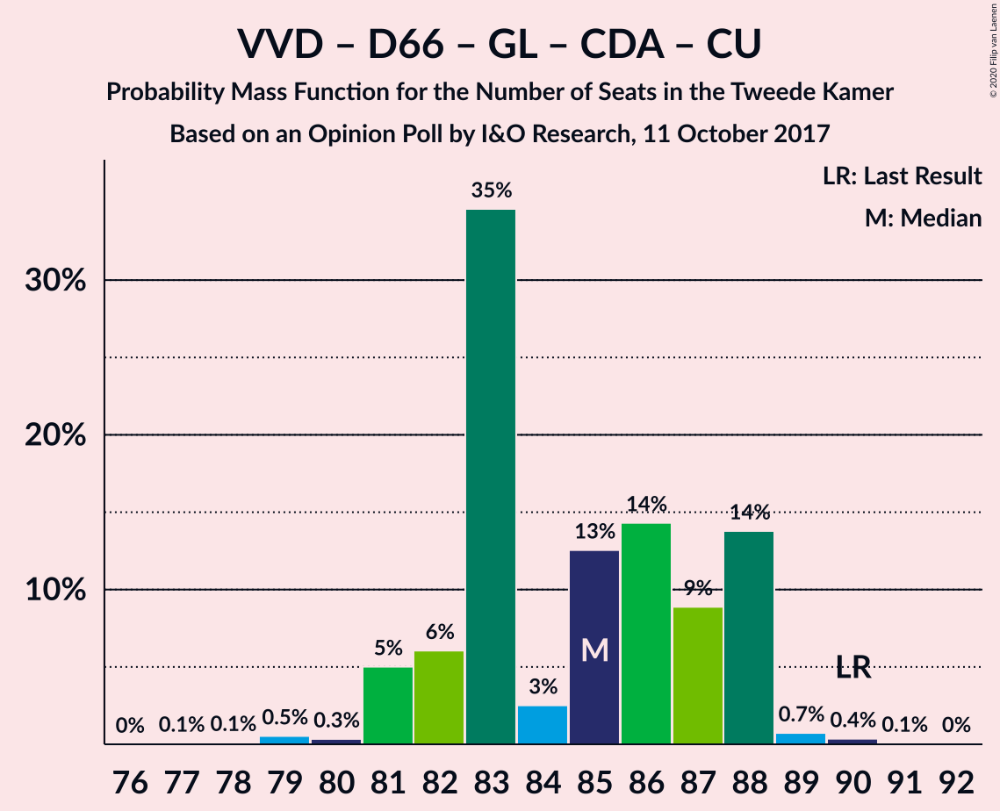
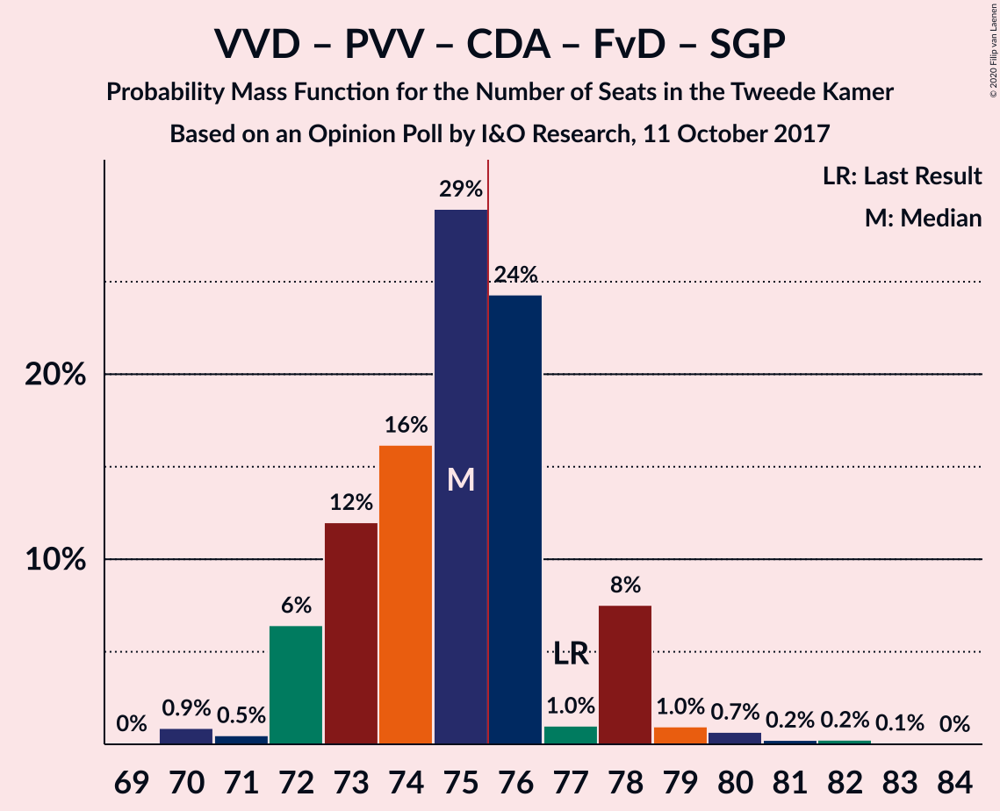
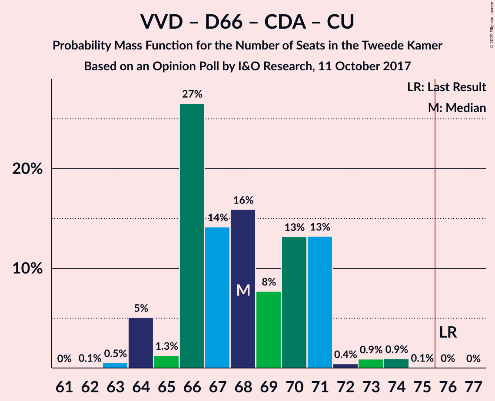
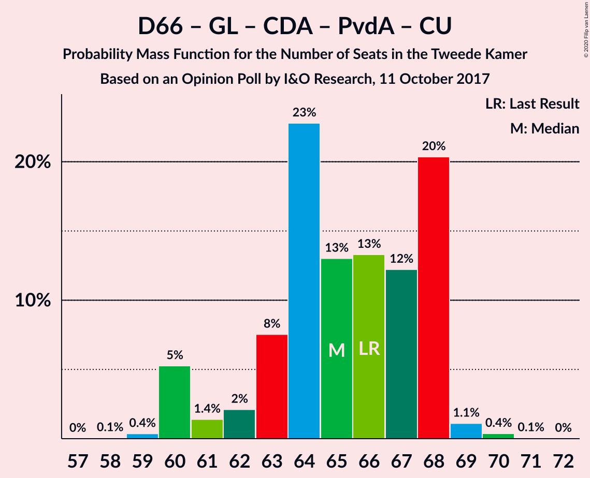
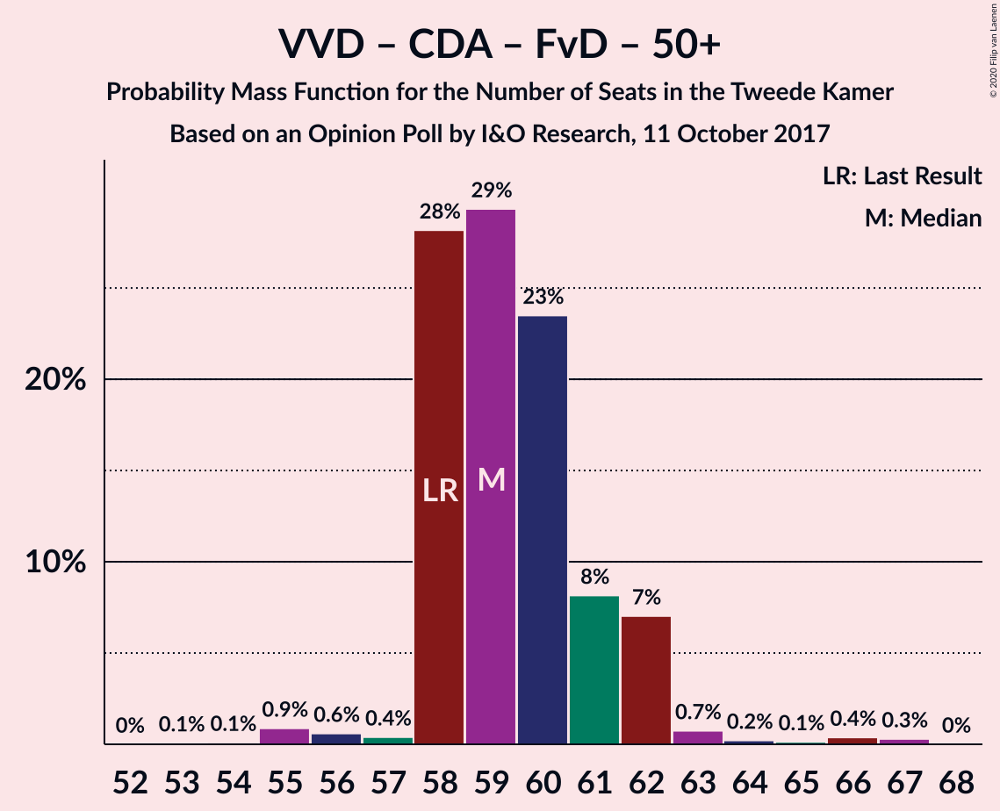
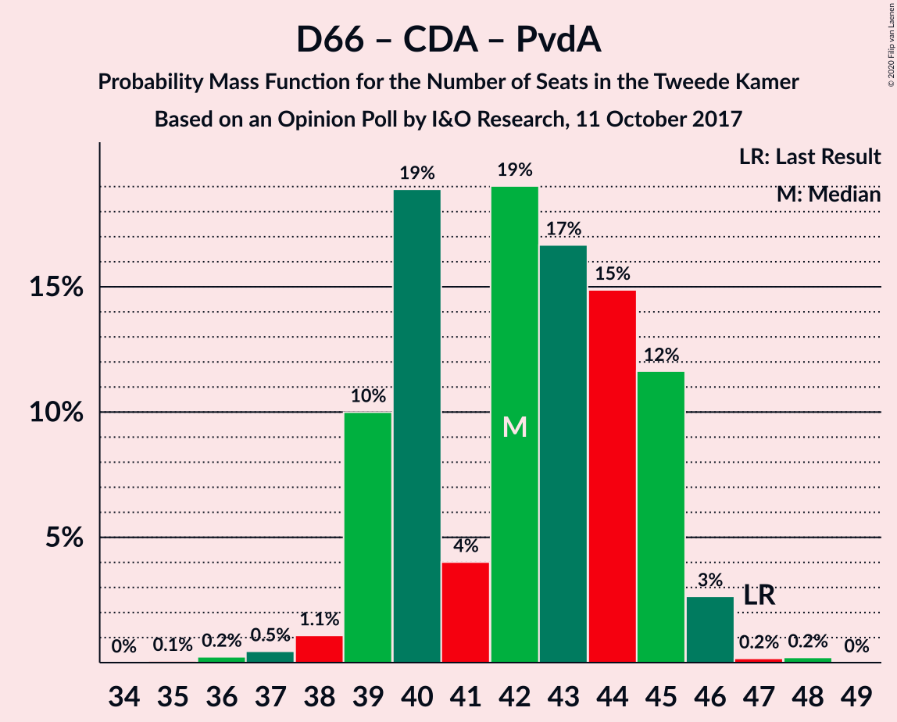
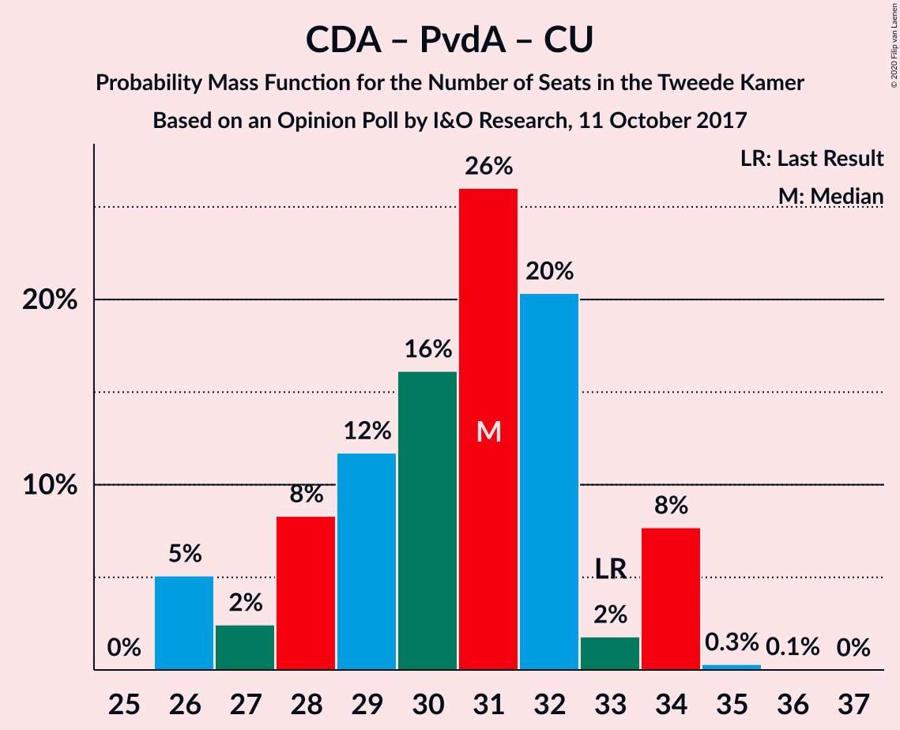

# Opinion Poll by I&O Research, 11 October 2017

<a href="#voting-intentions">Voting Intentions</a> | <a href="#seats">Seats</a> | <a href="#coalitions">Coalitions</a> | <a href="#technical-information">Technical Information</a>

## Voting Intentions

### Confidence Intervals

| Party | Last Result | Poll Result | 80% Confidence Interval | 90% Confidence Interval | 95% Confidence Interval | 99% Confidence Interval |
|:-----:|:-----------:|:-----------:|:-----------------------:|:-----------------------:|:-----------------------:|:-----------------------:|
| Volkspartij voor Vrijheid en Democratie | 21.3% | 19.3% | 17.9–20.7% |17.6–21.1% |17.2–21.5% |16.6–22.2% |
| Partij voor de Vrijheid | 13.1% | 12.3% | 11.2–13.5% |10.9–13.9% |10.7–14.2% |10.2–14.8% |
| Democraten 66 | 12.2% | 12.0% | 10.9–13.2% |10.6–13.6% |10.4–13.9% |9.9–14.5% |
| GroenLinks | 9.1% | 10.5% | 9.5–11.7% |9.2–12.0% |9.0–12.3% |8.5–12.9% |
| Christen-Democratisch Appèl | 12.4% | 9.6% | 8.7–10.7% |8.4–11.1% |8.2–11.3% |7.7–11.9% |
| Socialistische Partij | 9.1% | 6.6% | 5.8–7.5% |5.5–7.8% |5.4–8.0% |5.0–8.5% |
| Forum voor Democratie | 1.8% | 6.6% | 5.8–7.5% |5.5–7.8% |5.4–8.0% |5.0–8.5% |
| Partij van de Arbeid | 5.7% | 6.4% | 5.6–7.4% |5.4–7.6% |5.2–7.9% |4.9–8.4% |
| ChristenUnie | 3.4% | 4.4% | 3.8–5.2% |3.6–5.4% |3.4–5.7% |3.1–6.1% |
| 50Plus | 3.1% | 4.1% | 3.5–4.9% |3.3–5.1% |3.2–5.3% |2.9–5.7% |
| Partij voor de Dieren | 3.2% | 3.9% | 3.3–4.6% |3.1–4.9% |3.0–5.1% |2.7–5.5% |
| Staatkundig Gereformeerde Partij | 2.1% | 2.2% | 1.7–2.8% |1.6–2.9% |1.5–3.1% |1.3–3.4% |
| DENK | 2.1% | 1.6% | 1.2–2.1% |1.1–2.3% |1.0–2.4% |0.9–2.7% |

*Note:* The poll result column reflects the actual value used in the calculations. Published results may vary slightly, and in addition be rounded to fewer digits.

## Seats

### Confidence Intervals

| Party | Last Result | Median | 80% Confidence Interval | 90% Confidence Interval | 95% Confidence Interval | 99% Confidence Interval |
|:-----:|:-----------:|:------:|:-----------------------:|:-----------------------:|:-----------------------:|:-----------------------:|
| <a href="#volkspartij-voor-vrijheid-en-democratie">Volkspartij voor Vrijheid en Democratie</a> | 33 | 26 | 26–29 |26–32 |26–33 |26–35 |
| <a href="#partij-voor-de-vrijheid">Partij voor de Vrijheid</a> | 20 | 20 | 17–20 |17–20 |16–20 |15–22 |
| <a href="#democraten-66">Democraten 66</a> | 19 | 19 | 17–20 |17–20 |17–22 |15–22 |
| <a href="#groenlinks">GroenLinks</a> | 14 | 16 | 14–16 |14–16 |14–17 |13–19 |
| <a href="#christen-democratisch-appèl">Christen-Democratisch Appèl</a> | 19 | 14 | 12–15 |12–16 |12–17 |12–17 |
| <a href="#socialistische-partij">Socialistische Partij</a> | 14 | 11 | 11 |9–12 |9–12 |8–13 |
| <a href="#forum-voor-democratie">Forum voor Democratie</a> | 2 | 12 | 9–12 |9–12 |9–12 |8–12 |
| <a href="#partij-van-de-arbeid">Partij van de Arbeid</a> | 9 | 9 | 8–10 |8–11 |7–12 |7–12 |
| <a href="#christenunie">ChristenUnie</a> | 5 | 7 | 6–7 |6–7 |5–8 |4–9 |
| <a href="#50plus">50Plus</a> | 4 | 7 | 6–7 |6–7 |5–7 |4–8 |
| <a href="#partij-voor-de-dieren">Partij voor de Dieren</a> | 5 | 5 | 5–6 |5–6 |4–7 |4–7 |
| <a href="#staatkundig-gereformeerde-partij">Staatkundig Gereformeerde Partij</a> | 3 | 3 | 2–3 |2–3 |2–4 |2–5 |
| <a href="#denk">DENK</a> | 3 | 1 | 1–3 |1–4 |1–4 |0–4 |

### Volkspartij voor Vrijheid en Democratie

*For a full overview of the results for this party, see the [Volkspartij voor Vrijheid en Democratie](party-volkspartijvoorvrijheidendemocratie.html) page.*

| Number of Seats | Probability | Accumulated | Special Marks |
|:---------------:|:-----------:|:-----------:|:-------------:|
| 23 | 0.2% | 100% |  |
| 24 | 0% | 99.8% |  |
| 25 | 0.2% | 99.8% |  |
| 26 | 70% | 99.6% | Median |
| 27 | 1.2% | 30% |  |
| 28 | 9% | 28% |  |
| 29 | 11% | 20% |  |
| 30 | 0.4% | 9% |  |
| 31 | 2% | 8% |  |
| 32 | 3% | 6% |  |
| 33 | 3% | 3% | Last Result |
| 34 | 0% | 0.8% |  |
| 35 | 0.8% | 0.8% |  |
| 36 | 0% | 0% |  |

### Partij voor de Vrijheid

*For a full overview of the results for this party, see the [Partij voor de Vrijheid](party-partijvoordevrijheid.html) page.*

| Number of Seats | Probability | Accumulated | Special Marks |
|:---------------:|:-----------:|:-----------:|:-------------:|
| 15 | 0.6% | 100% |  |
| 16 | 3% | 99.4% |  |
| 17 | 12% | 96% |  |
| 18 | 4% | 84% |  |
| 19 | 1.0% | 80% |  |
| 20 | 77% | 79% | Last Result, Median |
| 21 | 0.8% | 2% |  |
| 22 | 1.1% | 1.2% |  |
| 23 | 0.1% | 0.1% |  |
| 24 | 0% | 0% |  |

### Democraten 66

*For a full overview of the results for this party, see the [Democraten 66](party-democraten66.html) page.*

| Number of Seats | Probability | Accumulated | Special Marks |
|:---------------:|:-----------:|:-----------:|:-------------:|
| 14 | 0% | 100% |  |
| 15 | 1.1% | 99.9% |  |
| 16 | 0.3% | 98.8% |  |
| 17 | 10% | 98.5% |  |
| 18 | 1.3% | 88% |  |
| 19 | 74% | 87% | Last Result, Median |
| 20 | 9% | 13% |  |
| 21 | 1.5% | 4% |  |
| 22 | 2% | 3% |  |
| 23 | 0.2% | 0.2% |  |
| 24 | 0% | 0% |  |

### GroenLinks

*For a full overview of the results for this party, see the [GroenLinks](party-groenlinks.html) page.*

| Number of Seats | Probability | Accumulated | Special Marks |
|:---------------:|:-----------:|:-----------:|:-------------:|
| 12 | 0.3% | 100% |  |
| 13 | 0.3% | 99.7% |  |
| 14 | 12% | 99.4% | Last Result |
| 15 | 3% | 88% |  |
| 16 | 81% | 84% | Median |
| 17 | 1.3% | 3% |  |
| 18 | 1.2% | 2% |  |
| 19 | 0.4% | 0.8% |  |
| 20 | 0.4% | 0.4% |  |
| 21 | 0% | 0% |  |

### Christen-Democratisch Appèl

*For a full overview of the results for this party, see the [Christen-Democratisch Appèl](party-christen-democratischappèl.html) page.*

| Number of Seats | Probability | Accumulated | Special Marks |
|:---------------:|:-----------:|:-----------:|:-------------:|
| 11 | 0.1% | 100% |  |
| 12 | 11% | 99.9% |  |
| 13 | 2% | 89% |  |
| 14 | 73% | 87% | Median |
| 15 | 10% | 15% |  |
| 16 | 2% | 5% |  |
| 17 | 3% | 3% |  |
| 18 | 0.2% | 0.2% |  |
| 19 | 0.1% | 0.1% | Last Result |
| 20 | 0% | 0% |  |

### Socialistische Partij

*For a full overview of the results for this party, see the [Socialistische Partij](party-socialistischepartij.html) page.*

| Number of Seats | Probability | Accumulated | Special Marks |
|:---------------:|:-----------:|:-----------:|:-------------:|
| 7 | 0.1% | 100% |  |
| 8 | 1.2% | 99.9% |  |
| 9 | 4% | 98.7% |  |
| 10 | 2% | 94% |  |
| 11 | 86% | 93% | Median |
| 12 | 6% | 7% |  |
| 13 | 0.6% | 0.6% |  |
| 14 | 0% | 0% | Last Result |

### Forum voor Democratie

*For a full overview of the results for this party, see the [Forum voor Democratie](party-forumvoordemocratie.html) page.*

| Number of Seats | Probability | Accumulated | Special Marks |
|:---------------:|:-----------:|:-----------:|:-------------:|
| 2 | 0% | 100% | Last Result |
| 3 | 0% | 100% |  |
| 4 | 0% | 100% |  |
| 5 | 0% | 100% |  |
| 6 | 0% | 100% |  |
| 7 | 0.1% | 100% |  |
| 8 | 2% | 99.9% |  |
| 9 | 10% | 98% |  |
| 10 | 1.3% | 89% |  |
| 11 | 9% | 87% |  |
| 12 | 79% | 79% | Median |
| 13 | 0.1% | 0.1% |  |
| 14 | 0% | 0% |  |

### Partij van de Arbeid

*For a full overview of the results for this party, see the [Partij van de Arbeid](party-partijvandearbeid.html) page.*

| Number of Seats | Probability | Accumulated | Special Marks |
|:---------------:|:-----------:|:-----------:|:-------------:|
| 7 | 3% | 100% |  |
| 8 | 11% | 97% |  |
| 9 | 72% | 86% | Last Result, Median |
| 10 | 8% | 14% |  |
| 11 | 0.9% | 5% |  |
| 12 | 4% | 4% |  |
| 13 | 0.1% | 0.2% |  |
| 14 | 0% | 0% |  |

### ChristenUnie

*For a full overview of the results for this party, see the [ChristenUnie](party-christenunie.html) page.*

| Number of Seats | Probability | Accumulated | Special Marks |
|:---------------:|:-----------:|:-----------:|:-------------:|
| 4 | 0.8% | 100% |  |
| 5 | 3% | 99.2% | Last Result |
| 6 | 7% | 96% |  |
| 7 | 86% | 89% | Median |
| 8 | 1.4% | 3% |  |
| 9 | 1.3% | 1.4% |  |
| 10 | 0.1% | 0.1% |  |
| 11 | 0% | 0% |  |

### 50Plus

*For a full overview of the results for this party, see the [50Plus](party-50plus.html) page.*

| Number of Seats | Probability | Accumulated | Special Marks |
|:---------------:|:-----------:|:-----------:|:-------------:|
| 4 | 0.6% | 100% | Last Result |
| 5 | 3% | 99.3% |  |
| 6 | 25% | 96% |  |
| 7 | 70% | 71% | Median |
| 8 | 0.4% | 0.7% |  |
| 9 | 0.3% | 0.3% |  |
| 10 | 0% | 0% |  |

### Partij voor de Dieren

*For a full overview of the results for this party, see the [Partij voor de Dieren](party-partijvoordedieren.html) page.*

| Number of Seats | Probability | Accumulated | Special Marks |
|:---------------:|:-----------:|:-----------:|:-------------:|
| 3 | 0.2% | 100% |  |
| 4 | 3% | 99.8% |  |
| 5 | 78% | 97% | Last Result, Median |
| 6 | 17% | 20% |  |
| 7 | 3% | 3% |  |
| 8 | 0.1% | 0.1% |  |
| 9 | 0% | 0% |  |

### Staatkundig Gereformeerde Partij

*For a full overview of the results for this party, see the [Staatkundig Gereformeerde Partij](party-staatkundiggereformeerdepartij.html) page.*

| Number of Seats | Probability | Accumulated | Special Marks |
|:---------------:|:-----------:|:-----------:|:-------------:|
| 2 | 13% | 100% |  |
| 3 | 84% | 87% | Last Result, Median |
| 4 | 2% | 3% |  |
| 5 | 0.6% | 0.6% |  |
| 6 | 0% | 0% |  |

### DENK

*For a full overview of the results for this party, see the [DENK](party-denk.html) page.*

| Number of Seats | Probability | Accumulated | Special Marks |
|:---------------:|:-----------:|:-----------:|:-------------:|
| 0 | 0.7% | 100% |  |
| 1 | 69% | 99.3% | Median |
| 2 | 20% | 30% |  |
| 3 | 2% | 10% | Last Result |
| 4 | 8% | 8% |  |
| 5 | 0% | 0% |  |

## Coalitions

### Confidence Intervals

| Coalition | Last Result | Median | Majority? | 80% Confidence Interval | 90% Confidence Interval | 95% Confidence Interval | 99% Confidence Interval |
|:---------:|:-----------:|:------:|:---------:|:-----------------------:|:-----------------------:|:-----------------------:|:-----------------------:|
| Volkspartij voor Vrijheid en Democratie – Democraten 66 – GroenLinks – Christen-Democratisch Appèl – ChristenUnie | 90 | 82 | 100% | 82–86 | 82–87 | 82–88 | 77–91 |
| Volkspartij voor Vrijheid en Democratie – Democraten 66 – Christen-Democratisch Appèl – Partij van de Arbeid – ChristenUnie | 85 | 75 | 30% | 75–77 | 75–80 | 75–85 | 74–85 |
| Democraten 66 – GroenLinks – Christen-Democratisch Appèl – Socialistische Partij – Partij van de Arbeid – ChristenUnie | 80 | 76 | 86% | 73–76 | 72–76 | 72–77 | 72–80 |
| Volkspartij voor Vrijheid en Democratie – Partij voor de Vrijheid – Christen-Democratisch Appèl – Forum voor Democratie – Staatkundig Gereformeerde Partij | 77 | 75 | 15% | 73–76 | 72–76 | 72–77 | 71–81 |
| Volkspartij voor Vrijheid en Democratie – Partij voor de Vrijheid – Christen-Democratisch Appèl – Forum voor Democratie | 74 | 72 | 2% | 71–73 | 70–73 | 69–75 | 68–78 |
| Volkspartij voor Vrijheid en Democratie – Democraten 66 – Christen-Democratisch Appèl – ChristenUnie | 76 | 66 | 0.4% | 66–69 | 66–72 | 66–73 | 63–75 |
| Democraten 66 – GroenLinks – Christen-Democratisch Appèl – Partij van de Arbeid – ChristenUnie | 66 | 65 | 0% | 62–65 | 61–66 | 61–67 | 60–68 |
| Volkspartij voor Vrijheid en Democratie – Democraten 66 – Christen-Democratisch Appèl | 71 | 59 | 0% | 59–63 | 59–65 | 59–67 | 57–69 |
| Volkspartij voor Vrijheid en Democratie – Christen-Democratisch Appèl – Forum voor Democratie – 50Plus – Staatkundig Gereformeerde Partij | 61 | 62 | 0% | 62 | 62–65 | 60–66 | 57–67 |
| Volkspartij voor Vrijheid en Democratie – Partij voor de Vrijheid – Christen-Democratisch Appèl | 72 | 60 | 0% | 60–61 | 60–64 | 59–66 | 57–68 |
| Volkspartij voor Vrijheid en Democratie – Democraten 66 – Partij van de Arbeid | 61 | 54 | 0% | 54–57 | 54–60 | 54–64 | 53–67 |
| Volkspartij voor Vrijheid en Democratie – Christen-Democratisch Appèl – Forum voor Democratie – 50Plus | 58 | 59 | 0% | 59–60 | 59–61 | 57–62 | 54–64 |
| Volkspartij voor Vrijheid en Democratie – Christen-Democratisch Appèl – Forum voor Democratie – Staatkundig Gereformeerde Partij | 57 | 55 | 0% | 55–57 | 55–58 | 54–59 | 52–63 |
| Volkspartij voor Vrijheid en Democratie – Christen-Democratisch Appèl – Partij van de Arbeid | 61 | 49 | 0% | 49–53 | 49–56 | 49–57 | 48–60 |
| Volkspartij voor Vrijheid en Democratie – Christen-Democratisch Appèl – Forum voor Democratie | 54 | 52 | 0% | 52–54 | 52–55 | 52–56 | 49–58 |
| Volkspartij voor Vrijheid en Democratie – Christen-Democratisch Appèl | 52 | 40 | 0% | 40–44 | 40–46 | 40–47 | 40–49 |
| Democraten 66 – Christen-Democratisch Appèl – Partij van de Arbeid | 47 | 42 | 0% | 40–42 | 40–44 | 40–46 | 38–46 |
| Volkspartij voor Vrijheid en Democratie – Partij van de Arbeid | 42 | 35 | 0% | 35–39 | 35–40 | 35–45 | 34–45 |
| Democraten 66 – Christen-Democratisch Appèl | 38 | 33 | 0% | 32–33 | 32–34 | 31–36 | 29–37 |
| Christen-Democratisch Appèl – Partij van de Arbeid – ChristenUnie | 33 | 30 | 0% | 28–32 | 27–32 | 27–32 | 27–35 |
| Christen-Democratisch Appèl – Partij van de Arbeid | 28 | 23 | 0% | 22–25 | 20–25 | 20–25 | 20–28 |

### Volkspartij voor Vrijheid en Democratie – Democraten 66 – GroenLinks – Christen-Democratisch Appèl – ChristenUnie

| Number of Seats | Probability | Accumulated | Special Marks |
|:---------------:|:-----------:|:-----------:|:-------------:|
| 77 | 1.0% | 100% |  |
| 78 | 0.1% | 99.0% |  |
| 79 | 0% | 98.9% |  |
| 80 | 0% | 98.9% |  |
| 81 | 0.3% | 98.9% |  |
| 82 | 79% | 98.6% | Median |
| 83 | 8% | 20% |  |
| 84 | 0.9% | 12% |  |
| 85 | 0.4% | 11% |  |
| 86 | 5% | 11% |  |
| 87 | 0.8% | 6% |  |
| 88 | 4% | 5% |  |
| 89 | 0.3% | 1.2% |  |
| 90 | 0% | 0.9% | Last Result |
| 91 | 0.6% | 0.9% |  |
| 92 | 0.2% | 0.2% |  |
| 93 | 0% | 0% |  |

### Volkspartij voor Vrijheid en Democratie – Democraten 66 – Christen-Democratisch Appèl – Partij van de Arbeid – ChristenUnie

| Number of Seats | Probability | Accumulated | Special Marks |
|:---------------:|:-----------:|:-----------:|:-------------:|
| 72 | 0.2% | 100% |  |
| 73 | 0.1% | 99.8% |  |
| 74 | 0.5% | 99.7% |  |
| 75 | 70% | 99.2% | Median |
| 76 | 8% | 30% | Majority |
| 77 | 14% | 22% |  |
| 78 | 0.2% | 8% |  |
| 79 | 1.1% | 8% |  |
| 80 | 2% | 7% |  |
| 81 | 0.7% | 5% |  |
| 82 | 1.0% | 4% |  |
| 83 | 0.3% | 3% |  |
| 84 | 0.2% | 3% |  |
| 85 | 3% | 3% | Last Result |
| 86 | 0.2% | 0.2% |  |
| 87 | 0% | 0% |  |

### Democraten 66 – GroenLinks – Christen-Democratisch Appèl – Socialistische Partij – Partij van de Arbeid – ChristenUnie

| Number of Seats | Probability | Accumulated | Special Marks |
|:---------------:|:-----------:|:-----------:|:-------------:|
| 69 | 0.1% | 100% |  |
| 70 | 0% | 99.9% |  |
| 71 | 0% | 99.9% |  |
| 72 | 9% | 99.8% |  |
| 73 | 3% | 91% |  |
| 74 | 0.9% | 87% |  |
| 75 | 0.2% | 87% |  |
| 76 | 84% | 86% | Median, Majority |
| 77 | 2% | 3% |  |
| 78 | 0.2% | 1.2% |  |
| 79 | 0.1% | 1.0% |  |
| 80 | 0.7% | 0.9% | Last Result |
| 81 | 0.2% | 0.3% |  |
| 82 | 0% | 0% |  |

### Volkspartij voor Vrijheid en Democratie – Partij voor de Vrijheid – Christen-Democratisch Appèl – Forum voor Democratie – Staatkundig Gereformeerde Partij

| Number of Seats | Probability | Accumulated | Special Marks |
|:---------------:|:-----------:|:-----------:|:-------------:|
| 69 | 0% | 100% |  |
| 70 | 0% | 99.9% |  |
| 71 | 1.0% | 99.9% |  |
| 72 | 4% | 98.9% |  |
| 73 | 9% | 95% |  |
| 74 | 1.1% | 86% |  |
| 75 | 70% | 85% | Median |
| 76 | 11% | 15% | Majority |
| 77 | 2% | 4% | Last Result |
| 78 | 0.4% | 2% |  |
| 79 | 0.2% | 2% |  |
| 80 | 1.0% | 2% |  |
| 81 | 0.1% | 0.5% |  |
| 82 | 0% | 0.5% |  |
| 83 | 0.5% | 0.5% |  |
| 84 | 0% | 0% |  |

### Volkspartij voor Vrijheid en Democratie – Partij voor de Vrijheid – Christen-Democratisch Appèl – Forum voor Democratie

| Number of Seats | Probability | Accumulated | Special Marks |
|:---------------:|:-----------:|:-----------:|:-------------:|
| 66 | 0% | 100% |  |
| 67 | 0% | 99.9% |  |
| 68 | 0.9% | 99.9% |  |
| 69 | 2% | 99.0% |  |
| 70 | 3% | 97% |  |
| 71 | 9% | 94% |  |
| 72 | 71% | 85% | Median |
| 73 | 10% | 14% |  |
| 74 | 1.3% | 5% | Last Result |
| 75 | 2% | 3% |  |
| 76 | 0.4% | 2% | Majority |
| 77 | 0.8% | 1.3% |  |
| 78 | 0.5% | 0.5% |  |
| 79 | 0% | 0% |  |

### Volkspartij voor Vrijheid en Democratie – Democraten 66 – Christen-Democratisch Appèl – ChristenUnie

| Number of Seats | Probability | Accumulated | Special Marks |
|:---------------:|:-----------:|:-----------:|:-------------:|
| 62 | 0.2% | 100% |  |
| 63 | 1.1% | 99.8% |  |
| 64 | 0.4% | 98.7% |  |
| 65 | 0.1% | 98% |  |
| 66 | 69% | 98% | Median |
| 67 | 8% | 30% |  |
| 68 | 11% | 22% |  |
| 69 | 0.8% | 11% |  |
| 70 | 4% | 10% |  |
| 71 | 0.6% | 6% |  |
| 72 | 1.2% | 5% |  |
| 73 | 3% | 4% |  |
| 74 | 0.6% | 1.2% |  |
| 75 | 0.2% | 0.6% |  |
| 76 | 0.2% | 0.4% | Last Result, Majority |
| 77 | 0.2% | 0.2% |  |
| 78 | 0% | 0% |  |

### Democraten 66 – GroenLinks – Christen-Democratisch Appèl – Partij van de Arbeid – ChristenUnie

| Number of Seats | Probability | Accumulated | Special Marks |
|:---------------:|:-----------:|:-----------:|:-------------:|
| 60 | 2% | 100% |  |
| 61 | 8% | 98% |  |
| 62 | 1.1% | 90% |  |
| 63 | 0.8% | 89% |  |
| 64 | 5% | 88% |  |
| 65 | 78% | 84% | Median |
| 66 | 2% | 6% | Last Result |
| 67 | 3% | 5% |  |
| 68 | 1.0% | 1.4% |  |
| 69 | 0% | 0.4% |  |
| 70 | 0.3% | 0.4% |  |
| 71 | 0.1% | 0.1% |  |
| 72 | 0% | 0% |  |

### Volkspartij voor Vrijheid en Democratie – Democraten 66 – Christen-Democratisch Appèl

| Number of Seats | Probability | Accumulated | Special Marks |
|:---------------:|:-----------:|:-----------:|:-------------:|
| 56 | 0.2% | 100% |  |
| 57 | 2% | 99.8% |  |
| 58 | 0% | 98% |  |
| 59 | 69% | 98% | Median |
| 60 | 8% | 29% |  |
| 61 | 9% | 21% |  |
| 62 | 2% | 13% |  |
| 63 | 1.0% | 11% |  |
| 64 | 2% | 10% |  |
| 65 | 3% | 8% |  |
| 66 | 2% | 5% |  |
| 67 | 2% | 3% |  |
| 68 | 0.1% | 0.7% |  |
| 69 | 0.5% | 0.6% |  |
| 70 | 0% | 0% |  |
| 71 | 0% | 0% | Last Result |

### Volkspartij voor Vrijheid en Democratie – Christen-Democratisch Appèl – Forum voor Democratie – 50Plus – Staatkundig Gereformeerde Partij

| Number of Seats | Probability | Accumulated | Special Marks |
|:---------------:|:-----------:|:-----------:|:-------------:|
| 57 | 1.0% | 100% |  |
| 58 | 0.2% | 99.0% |  |
| 59 | 1.2% | 98.7% |  |
| 60 | 0.6% | 98% |  |
| 61 | 2% | 97% | Last Result |
| 62 | 85% | 95% | Median |
| 63 | 0.7% | 10% |  |
| 64 | 4% | 9% |  |
| 65 | 2% | 5% |  |
| 66 | 2% | 3% |  |
| 67 | 0.7% | 1.1% |  |
| 68 | 0.2% | 0.4% |  |
| 69 | 0% | 0.2% |  |
| 70 | 0.2% | 0.2% |  |
| 71 | 0% | 0% |  |

### Volkspartij voor Vrijheid en Democratie – Partij voor de Vrijheid – Christen-Democratisch Appèl

| Number of Seats | Probability | Accumulated | Special Marks |
|:---------------:|:-----------:|:-----------:|:-------------:|
| 57 | 1.2% | 100% |  |
| 58 | 0.4% | 98.8% |  |
| 59 | 1.4% | 98% |  |
| 60 | 78% | 97% | Median |
| 61 | 10% | 19% |  |
| 62 | 1.5% | 9% |  |
| 63 | 1.3% | 8% |  |
| 64 | 3% | 7% |  |
| 65 | 0.8% | 3% |  |
| 66 | 1.1% | 3% |  |
| 67 | 0.2% | 2% |  |
| 68 | 1.0% | 1.4% |  |
| 69 | 0.4% | 0.5% |  |
| 70 | 0% | 0% |  |
| 71 | 0% | 0% |  |
| 72 | 0% | 0% | Last Result |

### Volkspartij voor Vrijheid en Democratie – Democraten 66 – Partij van de Arbeid

| Number of Seats | Probability | Accumulated | Special Marks |
|:---------------:|:-----------:|:-----------:|:-------------:|
| 51 | 0% | 100% |  |
| 52 | 0.2% | 99.9% |  |
| 53 | 1.4% | 99.7% |  |
| 54 | 69% | 98% | Median |
| 55 | 10% | 30% |  |
| 56 | 2% | 20% |  |
| 57 | 10% | 18% |  |
| 58 | 0.6% | 8% |  |
| 59 | 1.4% | 7% |  |
| 60 | 3% | 6% |  |
| 61 | 0.1% | 3% | Last Result |
| 62 | 0.3% | 3% |  |
| 63 | 0% | 3% |  |
| 64 | 0.2% | 3% |  |
| 65 | 0% | 2% |  |
| 66 | 0% | 2% |  |
| 67 | 2% | 2% |  |
| 68 | 0% | 0% |  |

### Volkspartij voor Vrijheid en Democratie – Christen-Democratisch Appèl – Forum voor Democratie – 50Plus

| Number of Seats | Probability | Accumulated | Special Marks |
|:---------------:|:-----------:|:-----------:|:-------------:|
| 54 | 1.1% | 100% |  |
| 55 | 0.3% | 98.9% |  |
| 56 | 0.4% | 98.6% |  |
| 57 | 0.7% | 98% |  |
| 58 | 2% | 97% | Last Result |
| 59 | 76% | 96% | Median |
| 60 | 10% | 20% |  |
| 61 | 6% | 9% |  |
| 62 | 2% | 4% |  |
| 63 | 0.6% | 2% |  |
| 64 | 1.1% | 1.3% |  |
| 65 | 0% | 0.2% |  |
| 66 | 0% | 0.2% |  |
| 67 | 0.2% | 0.2% |  |
| 68 | 0% | 0% |  |

### Volkspartij voor Vrijheid en Democratie – Christen-Democratisch Appèl – Forum voor Democratie – Staatkundig Gereformeerde Partij

| Number of Seats | Probability | Accumulated | Special Marks |
|:---------------:|:-----------:|:-----------:|:-------------:|
| 51 | 0.2% | 100% |  |
| 52 | 1.1% | 99.8% |  |
| 53 | 0.1% | 98.8% |  |
| 54 | 2% | 98.7% |  |
| 55 | 69% | 97% | Median |
| 56 | 17% | 27% |  |
| 57 | 2% | 10% | Last Result |
| 58 | 4% | 8% |  |
| 59 | 3% | 5% |  |
| 60 | 0.8% | 2% |  |
| 61 | 0% | 0.9% |  |
| 62 | 0.1% | 0.9% |  |
| 63 | 0.8% | 0.8% |  |
| 64 | 0% | 0% |  |

### Volkspartij voor Vrijheid en Democratie – Christen-Democratisch Appèl – Partij van de Arbeid

| Number of Seats | Probability | Accumulated | Special Marks |
|:---------------:|:-----------:|:-----------:|:-------------:|
| 48 | 0.7% | 100% |  |
| 49 | 77% | 99.3% | Median |
| 50 | 0.3% | 23% |  |
| 51 | 1.1% | 22% |  |
| 52 | 3% | 21% |  |
| 53 | 10% | 18% |  |
| 54 | 2% | 8% |  |
| 55 | 0.2% | 5% |  |
| 56 | 0.3% | 5% |  |
| 57 | 3% | 5% |  |
| 58 | 0.2% | 2% |  |
| 59 | 0.8% | 1.5% |  |
| 60 | 0.5% | 0.6% |  |
| 61 | 0% | 0.2% | Last Result |
| 62 | 0.2% | 0.2% |  |
| 63 | 0% | 0% |  |

### Volkspartij voor Vrijheid en Democratie – Christen-Democratisch Appèl – Forum voor Democratie

| Number of Seats | Probability | Accumulated | Special Marks |
|:---------------:|:-----------:|:-----------:|:-------------:|
| 48 | 0.2% | 100% |  |
| 49 | 1.1% | 99.8% |  |
| 50 | 0% | 98.7% |  |
| 51 | 0.8% | 98.7% |  |
| 52 | 71% | 98% | Median |
| 53 | 8% | 27% |  |
| 54 | 10% | 19% | Last Result |
| 55 | 6% | 9% |  |
| 56 | 1.1% | 3% |  |
| 57 | 1.4% | 2% |  |
| 58 | 0.4% | 0.9% |  |
| 59 | 0.2% | 0.4% |  |
| 60 | 0.2% | 0.2% |  |
| 61 | 0% | 0% |  |

### Volkspartij voor Vrijheid en Democratie – Christen-Democratisch Appèl

| Number of Seats | Probability | Accumulated | Special Marks |
|:---------------:|:-----------:|:-----------:|:-------------:|
| 39 | 0.2% | 100% |  |
| 40 | 71% | 99.8% | Median |
| 41 | 7% | 29% |  |
| 42 | 1.2% | 21% |  |
| 43 | 9% | 20% |  |
| 44 | 1.3% | 11% |  |
| 45 | 3% | 10% |  |
| 46 | 4% | 7% |  |
| 47 | 1.5% | 3% |  |
| 48 | 0.3% | 2% |  |
| 49 | 1.1% | 1.4% |  |
| 50 | 0.2% | 0.4% |  |
| 51 | 0.2% | 0.2% |  |
| 52 | 0% | 0% | Last Result |

### Democraten 66 – Christen-Democratisch Appèl – Partij van de Arbeid

| Number of Seats | Probability | Accumulated | Special Marks |
|:---------------:|:-----------:|:-----------:|:-------------:|
| 38 | 0.5% | 100% |  |
| 39 | 0.8% | 99.5% |  |
| 40 | 9% | 98.6% |  |
| 41 | 2% | 89% |  |
| 42 | 78% | 88% | Median |
| 43 | 4% | 10% |  |
| 44 | 2% | 6% |  |
| 45 | 0.9% | 4% |  |
| 46 | 3% | 3% |  |
| 47 | 0.3% | 0.4% | Last Result |
| 48 | 0% | 0.1% |  |
| 49 | 0.1% | 0.1% |  |
| 50 | 0% | 0% |  |

### Volkspartij voor Vrijheid en Democratie – Partij van de Arbeid

| Number of Seats | Probability | Accumulated | Special Marks |
|:---------------:|:-----------:|:-----------:|:-------------:|
| 33 | 0.3% | 100% |  |
| 34 | 0.8% | 99.7% |  |
| 35 | 69% | 99.0% | Median |
| 36 | 3% | 30% |  |
| 37 | 7% | 26% |  |
| 38 | 9% | 19% |  |
| 39 | 2% | 10% |  |
| 40 | 3% | 8% |  |
| 41 | 0.4% | 5% |  |
| 42 | 0.2% | 5% | Last Result |
| 43 | 2% | 4% |  |
| 44 | 0% | 3% |  |
| 45 | 2% | 3% |  |
| 46 | 0.2% | 0.2% |  |
| 47 | 0% | 0% |  |

### Democraten 66 – Christen-Democratisch Appèl

| Number of Seats | Probability | Accumulated | Special Marks |
|:---------------:|:-----------:|:-----------:|:-------------:|
| 28 | 0.4% | 100% |  |
| 29 | 0.1% | 99.5% |  |
| 30 | 1.2% | 99.4% |  |
| 31 | 3% | 98% |  |
| 32 | 15% | 96% |  |
| 33 | 71% | 81% | Median |
| 34 | 5% | 10% |  |
| 35 | 1.0% | 5% |  |
| 36 | 3% | 4% |  |
| 37 | 0.5% | 0.6% |  |
| 38 | 0.1% | 0.1% | Last Result |
| 39 | 0% | 0% |  |

### Christen-Democratisch Appèl – Partij van de Arbeid – ChristenUnie

| Number of Seats | Probability | Accumulated | Special Marks |
|:---------------:|:-----------:|:-----------:|:-------------:|
| 26 | 0.1% | 100% |  |
| 27 | 10% | 99.9% |  |
| 28 | 1.4% | 90% |  |
| 29 | 3% | 89% |  |
| 30 | 73% | 86% | Median |
| 31 | 3% | 13% |  |
| 32 | 9% | 11% |  |
| 33 | 0.6% | 2% | Last Result |
| 34 | 0.4% | 1.1% |  |
| 35 | 0.6% | 0.7% |  |
| 36 | 0.2% | 0.2% |  |
| 37 | 0% | 0% |  |

### Christen-Democratisch Appèl – Partij van de Arbeid

| Number of Seats | Probability | Accumulated | Special Marks |
|:---------------:|:-----------:|:-----------:|:-------------:|
| 20 | 7% | 100% |  |
| 21 | 2% | 93% |  |
| 22 | 4% | 91% |  |
| 23 | 71% | 88% | Median |
| 24 | 6% | 17% |  |
| 25 | 8% | 11% |  |
| 26 | 0.2% | 2% |  |
| 27 | 0.6% | 2% |  |
| 28 | 1.3% | 1.5% | Last Result |
| 29 | 0.1% | 0.2% |  |
| 30 | 0% | 0.1% |  |
| 31 | 0% | 0% |  |

## Technical Information

### Opinion Poll

+ **Polling firm:** I&O Research
+ **Commissioner(s):** —
+ **Fieldwork period:** 11 October 2017

### Calculations

+ **Sample size:** 1339
+ **Simulations done:** 131,072
+ **Error estimate:** 1.89%

