# Opinion Poll by Kantar Public, 11–15 October 2017

<a href="#voting-intentions">Voting Intentions</a> | <a href="#seats">Seats</a> | <a href="#coalitions">Coalitions</a> | <a href="#technical-information">Technical Information</a>

## Voting Intentions

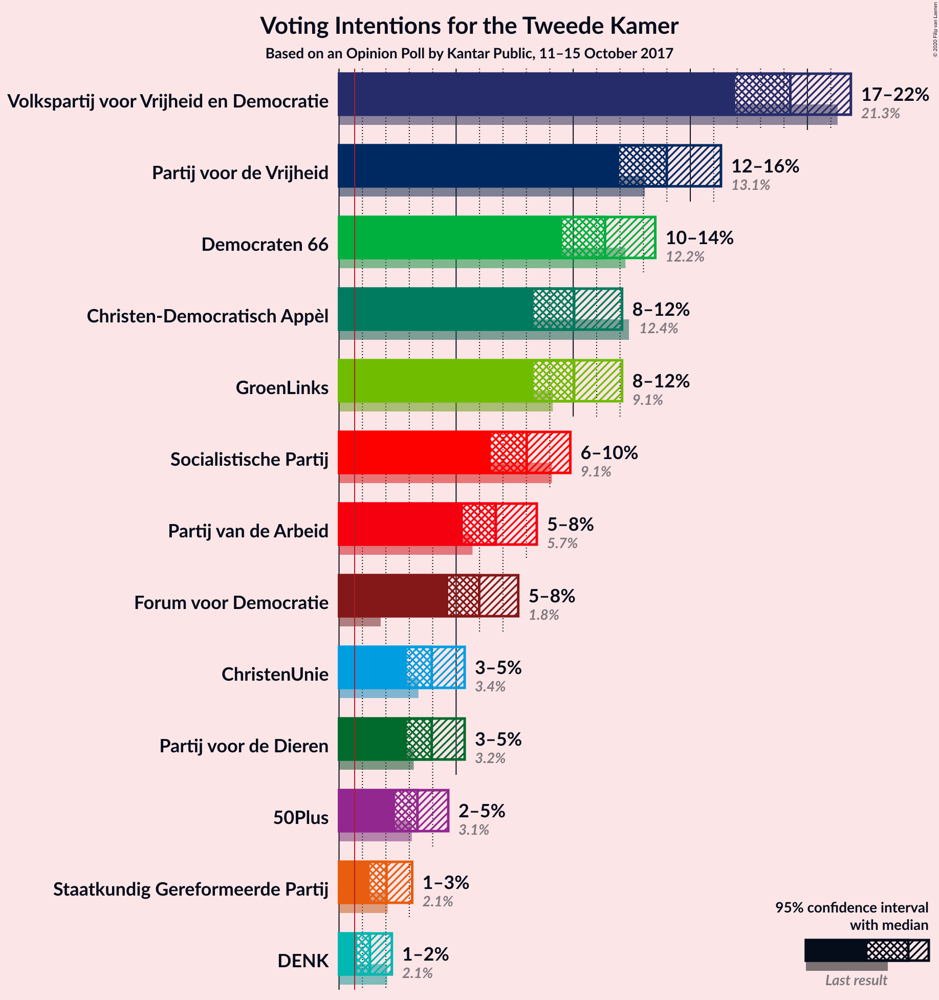

### Confidence Intervals

| Party | Last Result | Poll Result | 80% Confidence Interval | 90% Confidence Interval | 95% Confidence Interval | 99% Confidence Interval |
|:-----:|:-----------:|:-----------:|:-----------------------:|:-----------------------:|:-----------------------:|:-----------------------:|
| Volkspartij voor Vrijheid en Democratie | 21.3% | 19.3% | 17.7–21.0% |17.3–21.4% |16.9–21.9% |16.2–22.7% |
| Partij voor de Vrijheid | 13.1% | 14.0% | 12.7–15.5% |12.3–15.9% |12.0–16.3% |11.4–17.1% |
| Democraten 66 | 12.2% | 11.4% | 10.2–12.8% |9.8–13.2% |9.5–13.5% |9.0–14.2% |
| Christen-Democratisch Appèl | 12.4% | 10.0% | 8.9–11.4% |8.6–11.8% |8.3–12.1% |7.8–12.7% |
| GroenLinks | 9.1% | 10.0% | 8.9–11.4% |8.6–11.8% |8.3–12.1% |7.8–12.7% |
| Socialistische Partij | 9.1% | 8.0% | 7.0–9.2% |6.7–9.6% |6.5–9.9% |6.0–10.5% |
| Partij van de Arbeid | 5.7% | 6.7% | 5.8–7.8% |5.5–8.2% |5.3–8.4% |4.9–9.0% |
| Forum voor Democratie | 1.8% | 6.0% | 5.1–7.1% |4.9–7.4% |4.7–7.7% |4.3–8.2% |
| ChristenUnie | 3.4% | 4.0% | 3.3–4.9% |3.1–5.1% |2.9–5.4% |2.6–5.8% |
| Partij voor de Dieren | 3.2% | 4.0% | 3.3–4.9% |3.1–5.1% |2.9–5.4% |2.6–5.8% |
| 50Plus | 3.1% | 3.3% | 2.7–4.2% |2.5–4.5% |2.4–4.7% |2.1–5.1% |
| Staatkundig Gereformeerde Partij | 2.1% | 2.0% | 1.6–2.7% |1.4–2.9% |1.3–3.1% |1.1–3.5% |
| DENK | 2.1% | 1.3% | 1.0–1.9% |0.9–2.1% |0.8–2.3% |0.6–2.6% |

*Note:* The poll result column reflects the actual value used in the calculations. Published results may vary slightly, and in addition be rounded to fewer digits.

## Seats

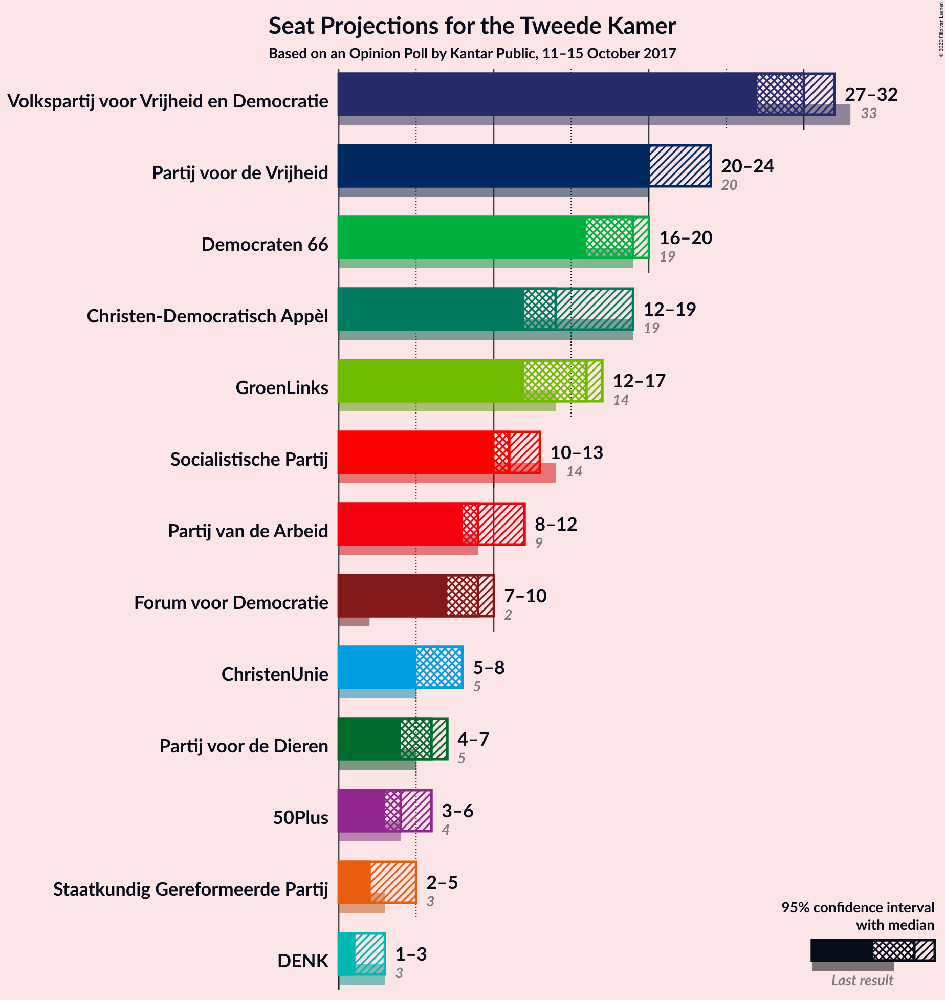

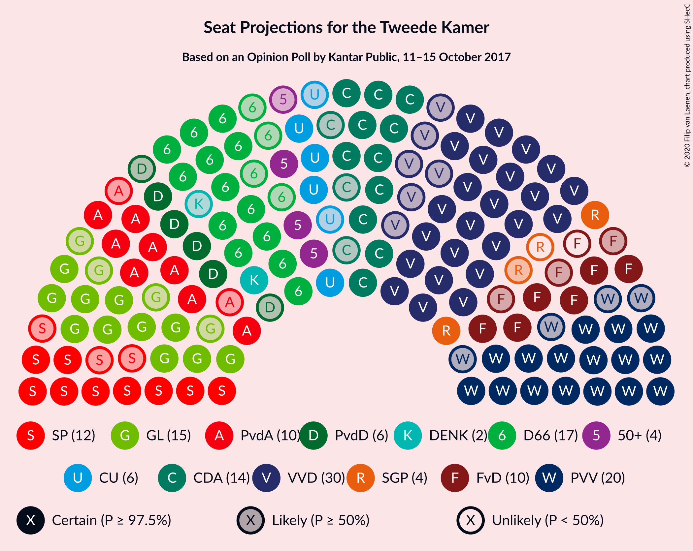

### Confidence Intervals

| Party | Last Result | Median | 80% Confidence Interval | 90% Confidence Interval | 95% Confidence Interval | 99% Confidence Interval |
|:-----:|:-----------:|:------:|:-----------------------:|:-----------------------:|:-----------------------:|:-----------------------:|
| <a href="#volkspartij-voor-vrijheid-en-democratie">Volkspartij voor Vrijheid en Democratie</a> | 33 | 30 | 29–32 |27–34 |24–34 |24–34 |
| <a href="#partij-voor-de-vrijheid">Partij voor de Vrijheid</a> | 20 | 20 | 19–23 |17–24 |16–25 |16–25 |
| <a href="#democraten-66">Democraten 66</a> | 19 | 17 | 15–18 |14–18 |13–18 |13–20 |
| <a href="#christen-democratisch-appèl">Christen-Democratisch Appèl</a> | 19 | 14 | 11–16 |11–16 |11–17 |11–17 |
| <a href="#groenlinks">GroenLinks</a> | 14 | 15 | 14–17 |11–17 |11–17 |11–17 |
| <a href="#socialistische-partij">Socialistische Partij</a> | 14 | 12 | 11–17 |10–17 |9–17 |9–17 |
| <a href="#partij-van-de-arbeid">Partij van de Arbeid</a> | 9 | 10 | 8–11 |8–12 |8–12 |7–13 |
| <a href="#forum-voor-democratie">Forum voor Democratie</a> | 2 | 9 | 7–11 |7–11 |6–11 |6–12 |
| <a href="#christenunie">ChristenUnie</a> | 5 | 6 | 4–7 |4–8 |4–9 |4–9 |
| <a href="#partij-voor-de-dieren">Partij voor de Dieren</a> | 5 | 6 | 4–8 |4–8 |4–9 |4–9 |
| <a href="#50plus">50Plus</a> | 4 | 4 | 3–5 |3–6 |3–6 |3–6 |
| <a href="#staatkundig-gereformeerde-partij">Staatkundig Gereformeerde Partij</a> | 3 | 3 | 2–4 |2–5 |2–6 |2–6 |
| <a href="#denk">DENK</a> | 3 | 2 | 1–2 |1–2 |1–2 |1–4 |

### Volkspartij voor Vrijheid en Democratie

*For a full overview of the results for this party, see the [Volkspartij voor Vrijheid en Democratie](party-volkspartijvoorvrijheidendemocratie.html) page.*

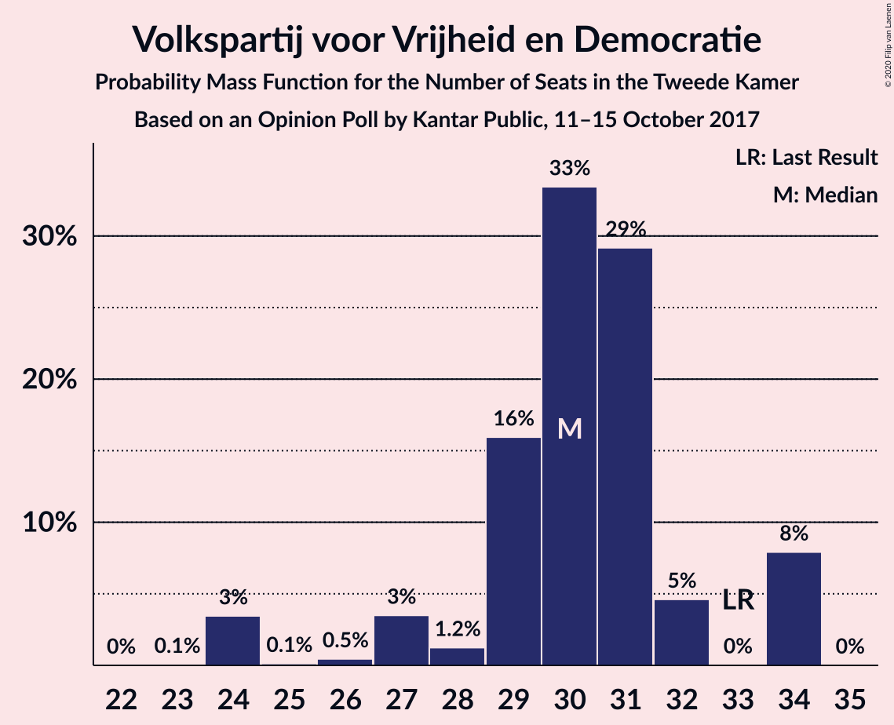

| Number of Seats | Probability | Accumulated | Special Marks |
|:---------------:|:-----------:|:-----------:|:-------------:|
| 23 | 0.1% | 100% |  |
| 24 | 3% | 99.9% |  |
| 25 | 0.1% | 96% |  |
| 26 | 0.5% | 96% |  |
| 27 | 3% | 96% |  |
| 28 | 1.2% | 92% |  |
| 29 | 16% | 91% |  |
| 30 | 33% | 75% | Median |
| 31 | 29% | 42% |  |
| 32 | 5% | 13% |  |
| 33 | 0% | 8% | Last Result |
| 34 | 8% | 8% |  |
| 35 | 0% | 0% |  |

### Partij voor de Vrijheid

*For a full overview of the results for this party, see the [Partij voor de Vrijheid](party-partijvoordevrijheid.html) page.*

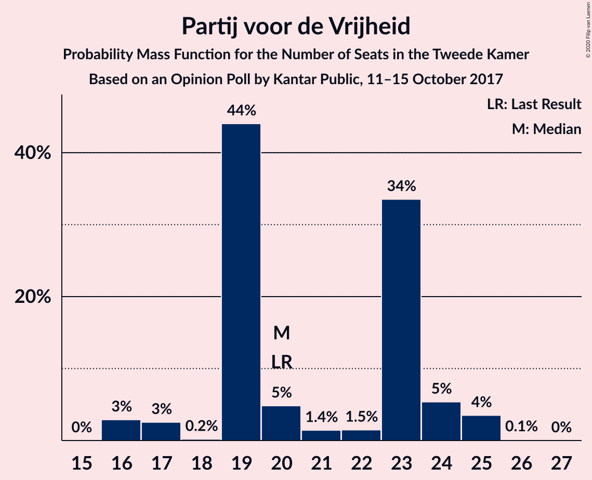

| Number of Seats | Probability | Accumulated | Special Marks |
|:---------------:|:-----------:|:-----------:|:-------------:|
| 16 | 3% | 100% |  |
| 17 | 3% | 97% |  |
| 18 | 0.2% | 95% |  |
| 19 | 44% | 94% |  |
| 20 | 5% | 50% | Last Result, Median |
| 21 | 1.4% | 45% |  |
| 22 | 1.5% | 44% |  |
| 23 | 34% | 43% |  |
| 24 | 5% | 9% |  |
| 25 | 4% | 4% |  |
| 26 | 0.1% | 0.2% |  |
| 27 | 0% | 0% |  |

### Democraten 66

*For a full overview of the results for this party, see the [Democraten 66](party-democraten66.html) page.*

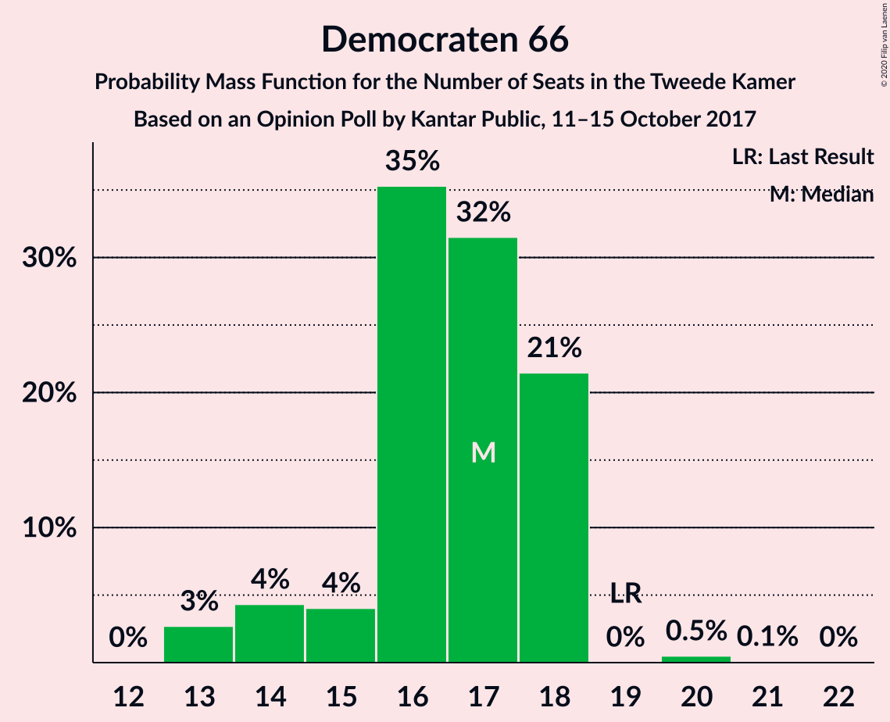

| Number of Seats | Probability | Accumulated | Special Marks |
|:---------------:|:-----------:|:-----------:|:-------------:|
| 13 | 3% | 100% |  |
| 14 | 4% | 97% |  |
| 15 | 4% | 93% |  |
| 16 | 35% | 89% |  |
| 17 | 32% | 54% | Median |
| 18 | 21% | 22% |  |
| 19 | 0% | 0.7% | Last Result |
| 20 | 0.5% | 0.6% |  |
| 21 | 0.1% | 0.1% |  |
| 22 | 0% | 0% |  |

### Christen-Democratisch Appèl

*For a full overview of the results for this party, see the [Christen-Democratisch Appèl](party-christen-democratischappèl.html) page.*

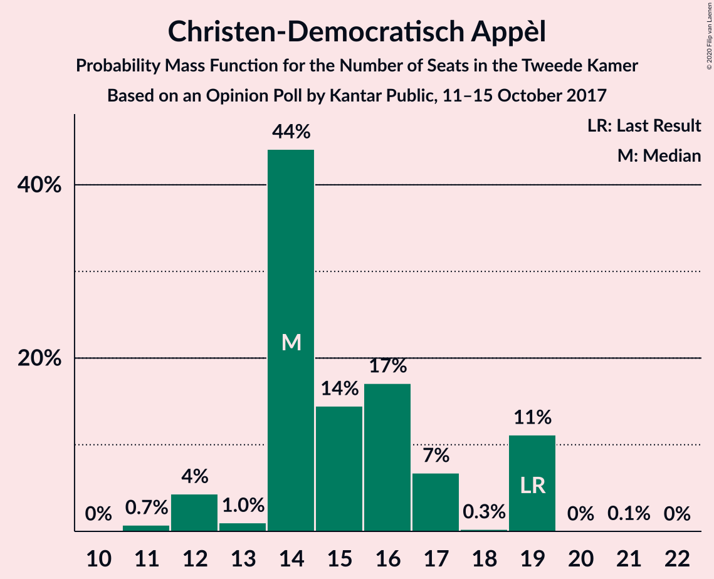

| Number of Seats | Probability | Accumulated | Special Marks |
|:---------------:|:-----------:|:-----------:|:-------------:|
| 11 | 30% | 100% |  |
| 12 | 0.1% | 70% |  |
| 13 | 6% | 70% |  |
| 14 | 14% | 63% | Median |
| 15 | 12% | 49% |  |
| 16 | 33% | 38% |  |
| 17 | 4% | 4% |  |
| 18 | 0.1% | 0.4% |  |
| 19 | 0.1% | 0.3% | Last Result |
| 20 | 0.2% | 0.3% |  |
| 21 | 0% | 0% |  |

### GroenLinks

*For a full overview of the results for this party, see the [GroenLinks](party-groenlinks.html) page.*

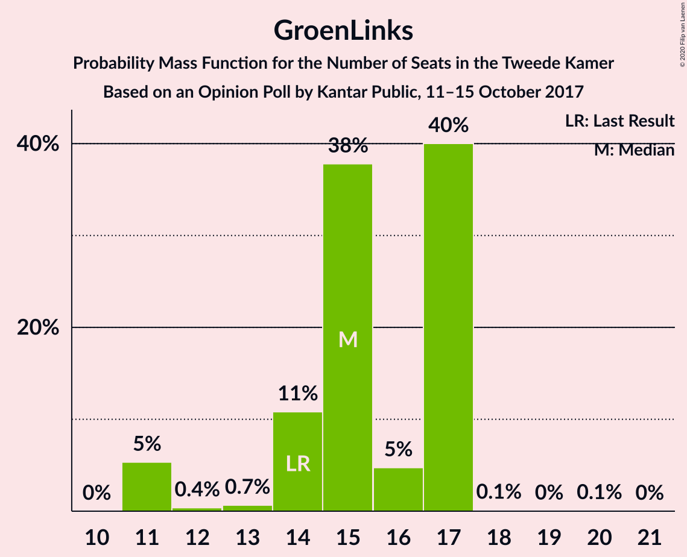

| Number of Seats | Probability | Accumulated | Special Marks |
|:---------------:|:-----------:|:-----------:|:-------------:|
| 11 | 5% | 100% |  |
| 12 | 0.4% | 95% |  |
| 13 | 0.7% | 94% |  |
| 14 | 11% | 94% | Last Result |
| 15 | 38% | 83% | Median |
| 16 | 5% | 45% |  |
| 17 | 40% | 40% |  |
| 18 | 0.1% | 0.3% |  |
| 19 | 0% | 0.1% |  |
| 20 | 0.1% | 0.1% |  |
| 21 | 0% | 0% |  |

### Socialistische Partij

*For a full overview of the results for this party, see the [Socialistische Partij](party-socialistischepartij.html) page.*

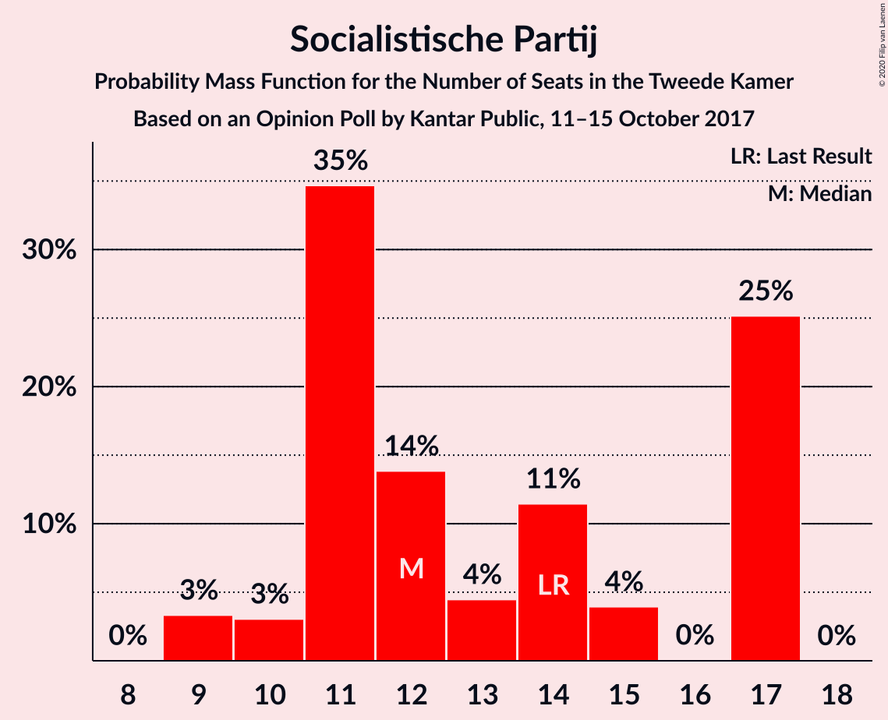

| Number of Seats | Probability | Accumulated | Special Marks |
|:---------------:|:-----------:|:-----------:|:-------------:|
| 9 | 3% | 100% |  |
| 10 | 3% | 97% |  |
| 11 | 35% | 94% |  |
| 12 | 14% | 59% | Median |
| 13 | 4% | 45% |  |
| 14 | 11% | 41% | Last Result |
| 15 | 4% | 29% |  |
| 16 | 0% | 25% |  |
| 17 | 25% | 25% |  |
| 18 | 0% | 0% |  |

### Partij van de Arbeid

*For a full overview of the results for this party, see the [Partij van de Arbeid](party-partijvandearbeid.html) page.*

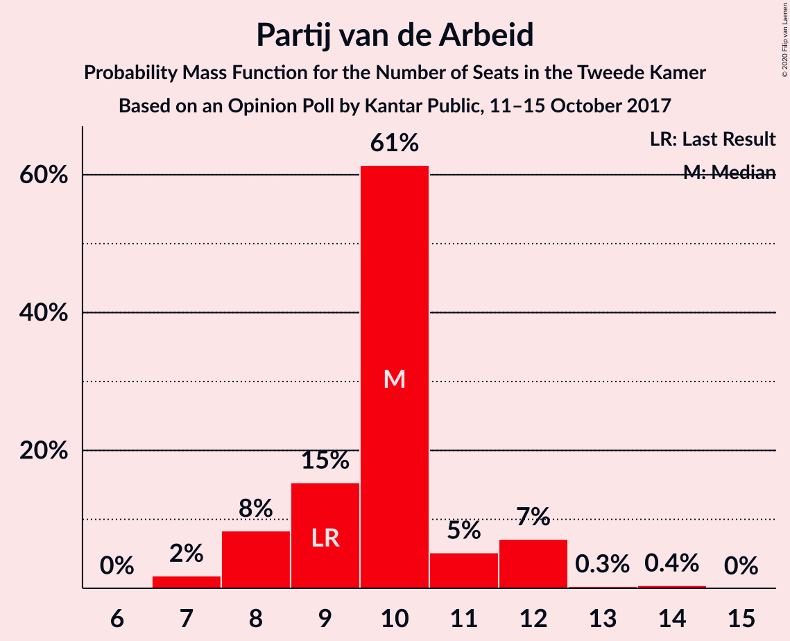

| Number of Seats | Probability | Accumulated | Special Marks |
|:---------------:|:-----------:|:-----------:|:-------------:|
| 6 | 0% | 100% |  |
| 7 | 2% | 99.9% |  |
| 8 | 8% | 98% |  |
| 9 | 15% | 90% | Last Result |
| 10 | 61% | 74% | Median |
| 11 | 5% | 13% |  |
| 12 | 7% | 8% |  |
| 13 | 0.3% | 0.7% |  |
| 14 | 0.4% | 0.4% |  |
| 15 | 0% | 0% |  |

### Forum voor Democratie

*For a full overview of the results for this party, see the [Forum voor Democratie](party-forumvoordemocratie.html) page.*

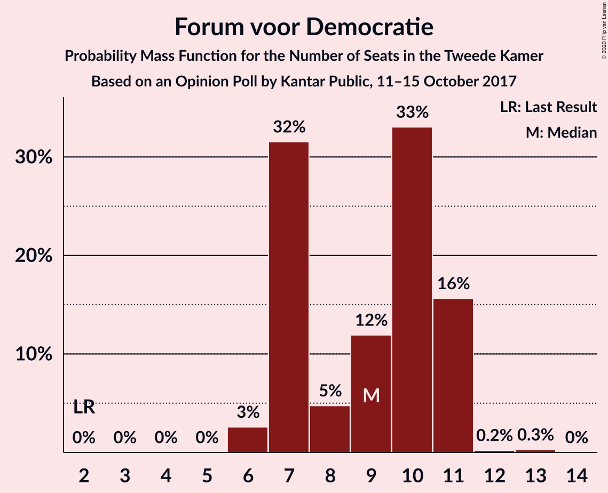

| Number of Seats | Probability | Accumulated | Special Marks |
|:---------------:|:-----------:|:-----------:|:-------------:|
| 2 | 0% | 100% | Last Result |
| 3 | 0% | 100% |  |
| 4 | 0% | 100% |  |
| 5 | 0% | 100% |  |
| 6 | 3% | 100% |  |
| 7 | 32% | 97% |  |
| 8 | 5% | 66% |  |
| 9 | 12% | 61% | Median |
| 10 | 33% | 49% |  |
| 11 | 16% | 16% |  |
| 12 | 0.2% | 0.5% |  |
| 13 | 0.3% | 0.3% |  |
| 14 | 0% | 0% |  |

### ChristenUnie

*For a full overview of the results for this party, see the [ChristenUnie](party-christenunie.html) page.*

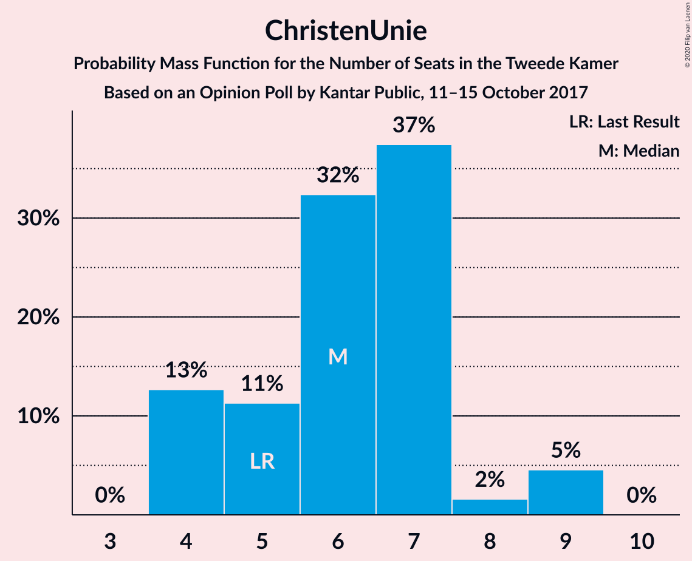

| Number of Seats | Probability | Accumulated | Special Marks |
|:---------------:|:-----------:|:-----------:|:-------------:|
| 4 | 13% | 100% |  |
| 5 | 11% | 87% | Last Result |
| 6 | 32% | 76% | Median |
| 7 | 37% | 44% |  |
| 8 | 2% | 6% |  |
| 9 | 5% | 5% |  |
| 10 | 0% | 0% |  |

### Partij voor de Dieren

*For a full overview of the results for this party, see the [Partij voor de Dieren](party-partijvoordedieren.html) page.*

| Number of Seats | Probability | Accumulated | Special Marks |
|:---------------:|:-----------:|:-----------:|:-------------:|
| 3 | 0.2% | 100% |  |
| 4 | 31% | 99.8% |  |
| 5 | 7% | 69% | Last Result |
| 6 | 26% | 62% | Median |
| 7 | 19% | 36% |  |
| 8 | 12% | 16% |  |
| 9 | 4% | 4% |  |
| 10 | 0.4% | 0.4% |  |
| 11 | 0% | 0% |  |

### 50Plus

*For a full overview of the results for this party, see the [50Plus](party-50plus.html) page.*

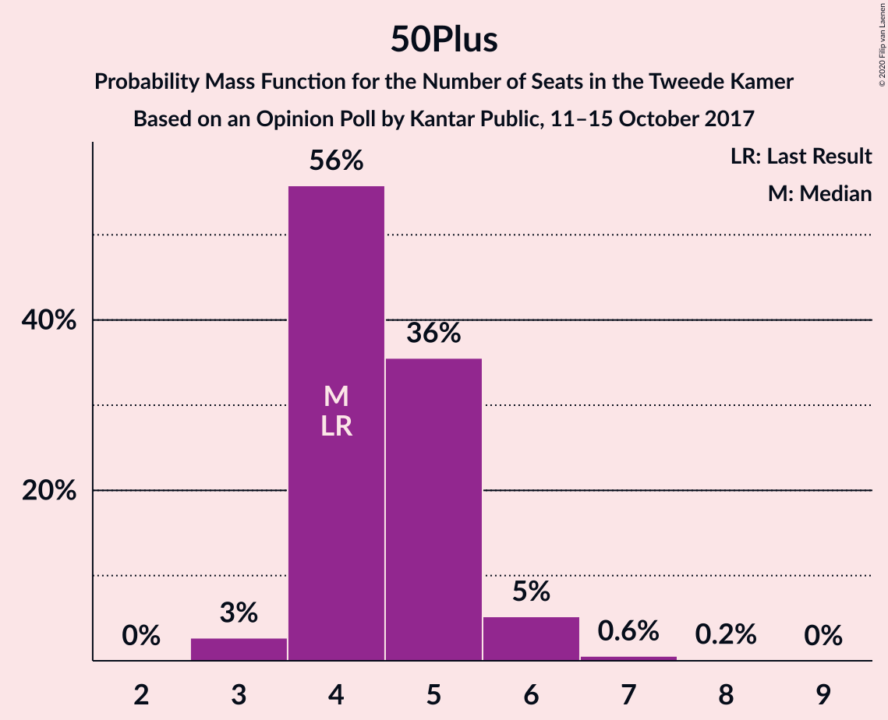

| Number of Seats | Probability | Accumulated | Special Marks |
|:---------------:|:-----------:|:-----------:|:-------------:|
| 3 | 15% | 100% |  |
| 4 | 62% | 85% | Last Result, Median |
| 5 | 14% | 23% |  |
| 6 | 9% | 9% |  |
| 7 | 0.2% | 0.3% |  |
| 8 | 0% | 0.1% |  |
| 9 | 0% | 0.1% |  |
| 10 | 0% | 0% |  |

### Staatkundig Gereformeerde Partij

*For a full overview of the results for this party, see the [Staatkundig Gereformeerde Partij](party-staatkundiggereformeerdepartij.html) page.*

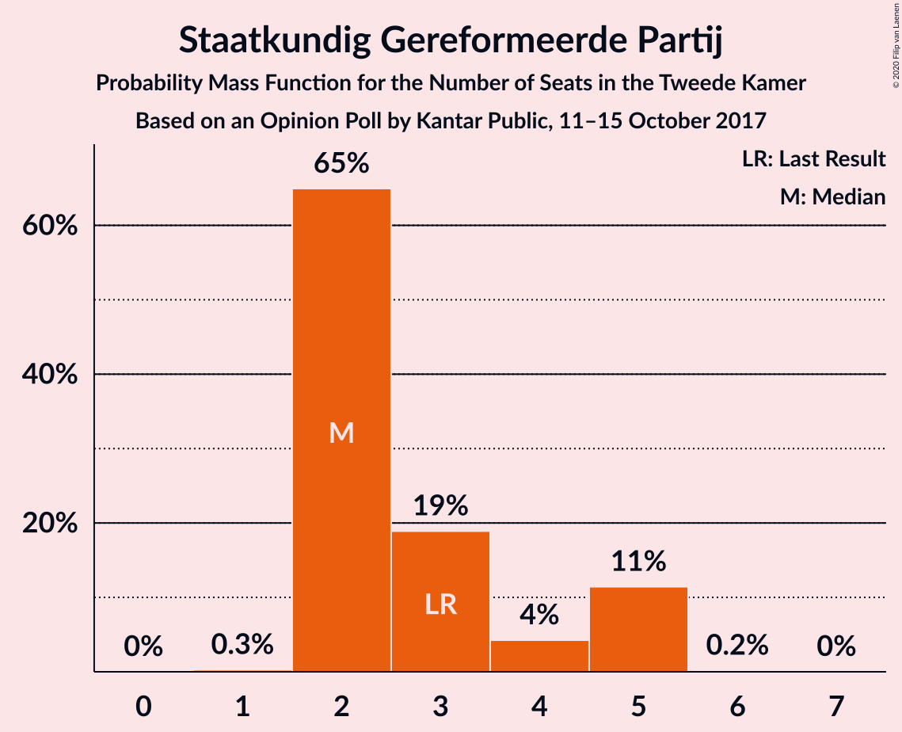

| Number of Seats | Probability | Accumulated | Special Marks |
|:---------------:|:-----------:|:-----------:|:-------------:|
| 1 | 0.1% | 100% |  |
| 2 | 34% | 99.9% |  |
| 3 | 20% | 66% | Last Result, Median |
| 4 | 40% | 45% |  |
| 5 | 1.4% | 5% |  |
| 6 | 4% | 4% |  |
| 7 | 0% | 0% |  |

### DENK

*For a full overview of the results for this party, see the [DENK](party-denk.html) page.*

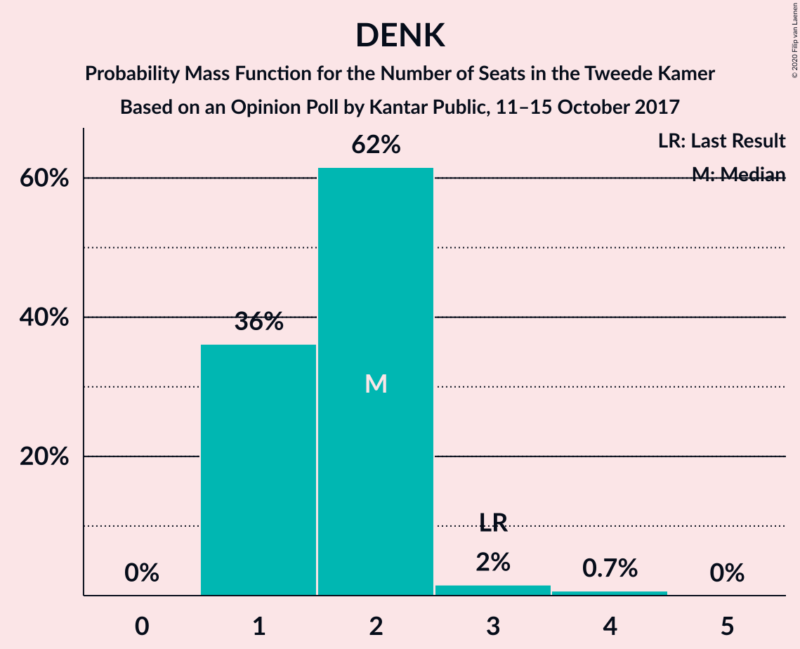

| Number of Seats | Probability | Accumulated | Special Marks |
|:---------------:|:-----------:|:-----------:|:-------------:|
| 1 | 36% | 100% |  |
| 2 | 62% | 64% | Median |
| 3 | 2% | 2% | Last Result |
| 4 | 0.7% | 0.7% |  |
| 5 | 0% | 0% |  |

## Coalitions

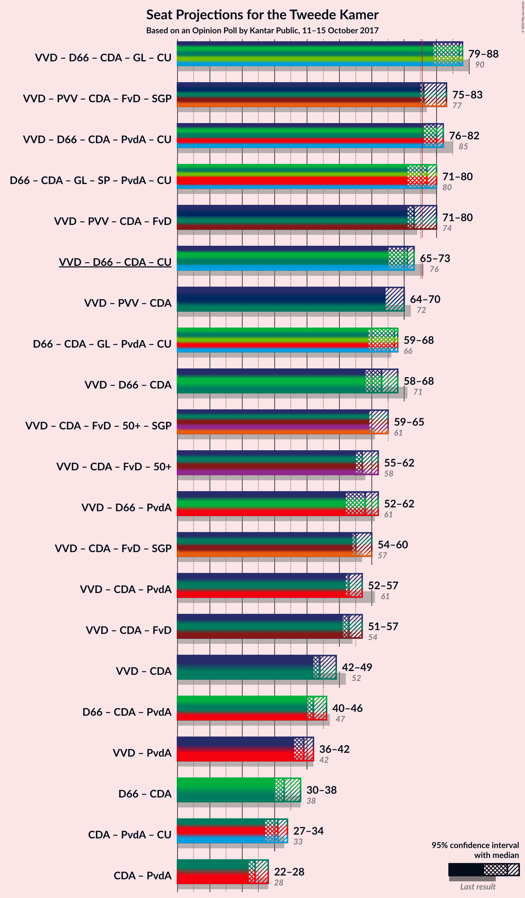

### Confidence Intervals

| Coalition | Last Result | Median | Majority? | 80% Confidence Interval | 90% Confidence Interval | 95% Confidence Interval | 99% Confidence Interval |
|:---------:|:-----------:|:------:|:---------:|:-----------------------:|:-----------------------:|:-----------------------:|:-----------------------:|
| Volkspartij voor Vrijheid en Democratie – Democraten 66 – Christen-Democratisch Appèl – GroenLinks – ChristenUnie | 90 | 82 | 97% | 80–84 | 79–85 | 75–88 | 75–92 |
| Volkspartij voor Vrijheid en Democratie – Partij voor de Vrijheid – Christen-Democratisch Appèl – Forum voor Democratie – Staatkundig Gereformeerde Partij | 77 | 77 | 67% | 75–80 | 74–83 | 73–83 | 73–83 |
| Volkspartij voor Vrijheid en Democratie – Democraten 66 – Christen-Democratisch Appèl – Partij van de Arbeid – ChristenUnie | 85 | 75 | 49% | 75–79 | 73–81 | 72–83 | 72–86 |
| Volkspartij voor Vrijheid en Democratie – Partij voor de Vrijheid – Christen-Democratisch Appèl – Forum voor Democratie | 74 | 74 | 7% | 72–75 | 71–80 | 71–80 | 70–80 |
| Democraten 66 – Christen-Democratisch Appèl – GroenLinks – Socialistische Partij – Partij van de Arbeid – ChristenUnie | 80 | 75 | 38% | 72–80 | 66–80 | 66–80 | 66–80 |
| Volkspartij voor Vrijheid en Democratie – Democraten 66 – Christen-Democratisch Appèl – ChristenUnie | 76 | 66 | 2% | 65–69 | 62–70 | 61–73 | 61–78 |
| Volkspartij voor Vrijheid en Democratie – Partij voor de Vrijheid – Christen-Democratisch Appèl | 72 | 64 | 0% | 63–67 | 62–71 | 61–71 | 60–71 |
| Volkspartij voor Vrijheid en Democratie – Democraten 66 – Christen-Democratisch Appèl | 71 | 62 | 0% | 58–63 | 57–65 | 56–67 | 56–69 |
| Democraten 66 – Christen-Democratisch Appèl – GroenLinks – Partij van de Arbeid – ChristenUnie | 66 | 62 | 0% | 60–63 | 54–66 | 54–67 | 54–68 |
| Volkspartij voor Vrijheid en Democratie – Christen-Democratisch Appèl – Forum voor Democratie – 50Plus – Staatkundig Gereformeerde Partij | 61 | 60 | 0% | 59–64 | 58–64 | 55–65 | 55–65 |
| Volkspartij voor Vrijheid en Democratie – Christen-Democratisch Appèl – Forum voor Democratie – 50Plus | 58 | 58 | 0% | 55–61 | 55–61 | 51–62 | 51–62 |
| Volkspartij voor Vrijheid en Democratie – Christen-Democratisch Appèl – Forum voor Democratie – Staatkundig Gereformeerde Partij | 57 | 56 | 0% | 54–59 | 53–60 | 51–61 | 51–61 |
| Volkspartij voor Vrijheid en Democratie – Democraten 66 – Partij van de Arbeid | 61 | 57 | 0% | 55–58 | 53–59 | 52–60 | 52–60 |
| Volkspartij voor Vrijheid en Democratie – Christen-Democratisch Appèl – Partij van de Arbeid | 61 | 53 | 0% | 51–57 | 51–57 | 51–59 | 50–59 |
| Volkspartij voor Vrijheid en Democratie – Christen-Democratisch Appèl – Forum voor Democratie | 54 | 54 | 0% | 51–55 | 51–56 | 47–57 | 47–57 |
| Volkspartij voor Vrijheid en Democratie – Christen-Democratisch Appèl | 52 | 44 | 0% | 41–47 | 41–47 | 40–49 | 40–51 |
| Democraten 66 – Christen-Democratisch Appèl – Partij van de Arbeid | 47 | 41 | 0% | 38–43 | 37–44 | 37–45 | 37–47 |
| Volkspartij voor Vrijheid en Democratie – Partij van de Arbeid | 42 | 40 | 0% | 38–42 | 37–42 | 36–43 | 35–43 |
| Christen-Democratisch Appèl – Partij van de Arbeid – ChristenUnie | 33 | 28 | 0% | 28–33 | 27–34 | 27–36 | 27–36 |
| Democraten 66 – Christen-Democratisch Appèl | 38 | 32 | 0% | 28–33 | 28–34 | 27–35 | 27–35 |
| Christen-Democratisch Appèl – Partij van de Arbeid | 28 | 24 | 0% | 21–26 | 21–27 | 21–28 | 21–29 |

### Volkspartij voor Vrijheid en Democratie – Democraten 66 – Christen-Democratisch Appèl – GroenLinks – ChristenUnie

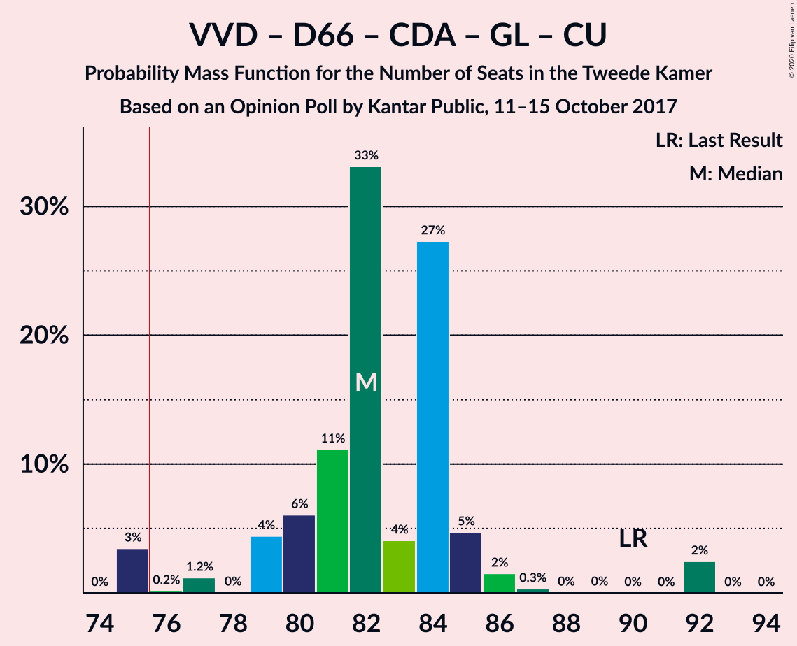

| Number of Seats | Probability | Accumulated | Special Marks |
|:---------------:|:-----------:|:-----------:|:-------------:|
| 75 | 3% | 100% |  |
| 76 | 0.2% | 97% | Majority |
| 77 | 1.2% | 96% |  |
| 78 | 0% | 95% |  |
| 79 | 4% | 95% |  |
| 80 | 6% | 91% |  |
| 81 | 11% | 85% |  |
| 82 | 33% | 74% | Median |
| 83 | 4% | 40% |  |
| 84 | 27% | 36% |  |
| 85 | 5% | 9% |  |
| 86 | 2% | 4% |  |
| 87 | 0.3% | 3% |  |
| 88 | 0% | 3% |  |
| 89 | 0% | 2% |  |
| 90 | 0% | 2% | Last Result |
| 91 | 0% | 2% |  |
| 92 | 2% | 2% |  |
| 93 | 0% | 0% |  |

### Volkspartij voor Vrijheid en Democratie – Partij voor de Vrijheid – Christen-Democratisch Appèl – Forum voor Democratie – Staatkundig Gereformeerde Partij

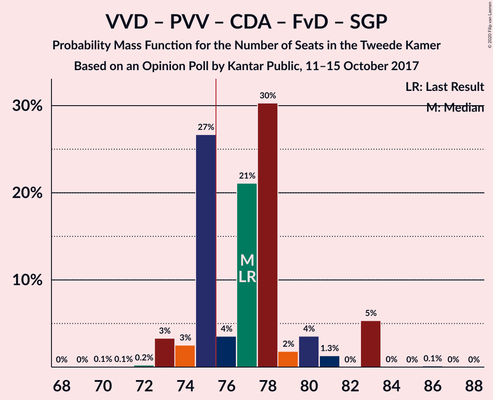

| Number of Seats | Probability | Accumulated | Special Marks |
|:---------------:|:-----------:|:-----------:|:-------------:|
| 70 | 0.1% | 100% |  |
| 71 | 0.1% | 99.9% |  |
| 72 | 0.2% | 99.9% |  |
| 73 | 3% | 99.6% |  |
| 74 | 3% | 96% |  |
| 75 | 27% | 94% |  |
| 76 | 4% | 67% | Median, Majority |
| 77 | 21% | 64% | Last Result |
| 78 | 30% | 42% |  |
| 79 | 2% | 12% |  |
| 80 | 4% | 10% |  |
| 81 | 1.3% | 7% |  |
| 82 | 0% | 6% |  |
| 83 | 5% | 6% |  |
| 84 | 0% | 0.2% |  |
| 85 | 0% | 0.1% |  |
| 86 | 0.1% | 0.1% |  |
| 87 | 0% | 0% |  |

### Volkspartij voor Vrijheid en Democratie – Democraten 66 – Christen-Democratisch Appèl – Partij van de Arbeid – ChristenUnie

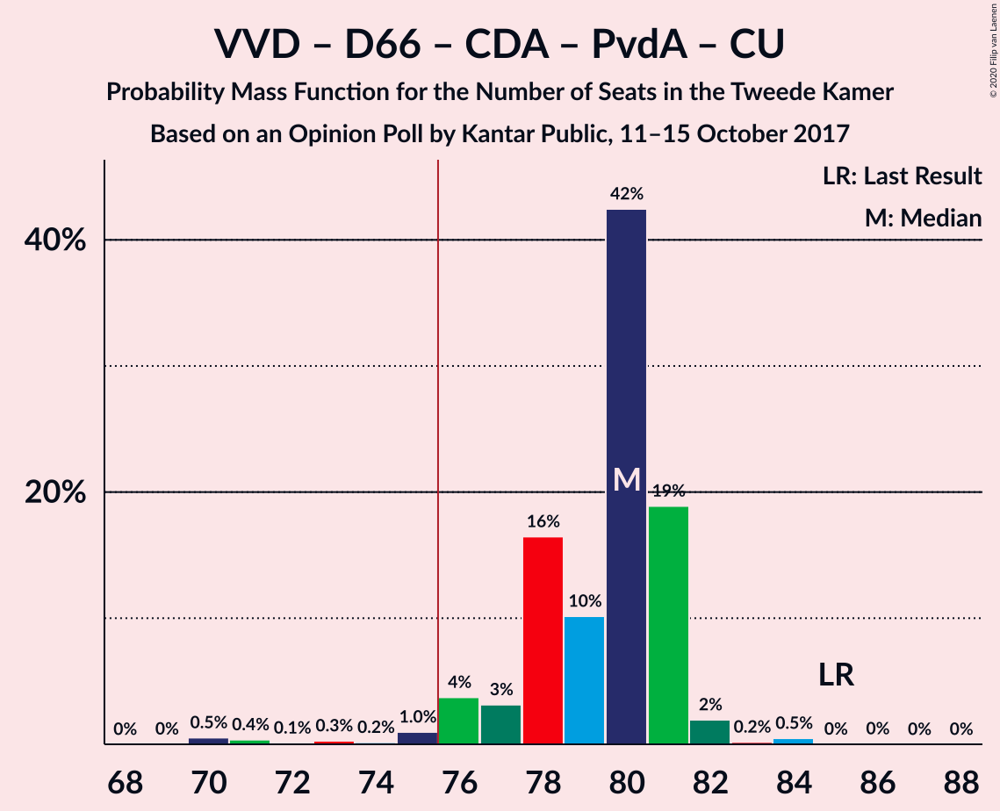

| Number of Seats | Probability | Accumulated | Special Marks |
|:---------------:|:-----------:|:-----------:|:-------------:|
| 71 | 0% | 100% |  |
| 72 | 4% | 99.9% |  |
| 73 | 4% | 96% |  |
| 74 | 0.9% | 92% |  |
| 75 | 41% | 91% |  |
| 76 | 0.5% | 49% | Majority |
| 77 | 11% | 49% | Median |
| 78 | 4% | 38% |  |
| 79 | 28% | 34% |  |
| 80 | 0.3% | 5% |  |
| 81 | 2% | 5% |  |
| 82 | 0.1% | 3% |  |
| 83 | 0.1% | 3% |  |
| 84 | 0% | 2% |  |
| 85 | 0% | 2% | Last Result |
| 86 | 2% | 2% |  |
| 87 | 0% | 0% |  |

### Volkspartij voor Vrijheid en Democratie – Partij voor de Vrijheid – Christen-Democratisch Appèl – Forum voor Democratie

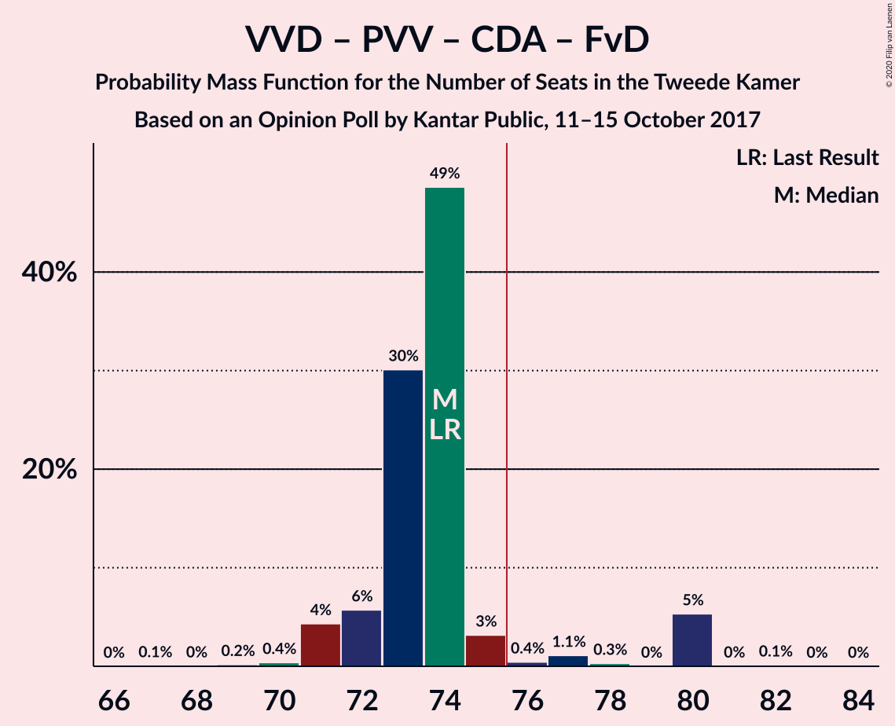

| Number of Seats | Probability | Accumulated | Special Marks |
|:---------------:|:-----------:|:-----------:|:-------------:|
| 67 | 0.1% | 100% |  |
| 68 | 0% | 99.9% |  |
| 69 | 0.2% | 99.9% |  |
| 70 | 0.4% | 99.7% |  |
| 71 | 4% | 99.3% |  |
| 72 | 6% | 95% |  |
| 73 | 30% | 89% | Median |
| 74 | 49% | 59% | Last Result |
| 75 | 3% | 11% |  |
| 76 | 0.4% | 7% | Majority |
| 77 | 1.1% | 7% |  |
| 78 | 0.3% | 6% |  |
| 79 | 0% | 6% |  |
| 80 | 5% | 6% |  |
| 81 | 0% | 0.2% |  |
| 82 | 0.1% | 0.1% |  |
| 83 | 0% | 0% |  |

### Democraten 66 – Christen-Democratisch Appèl – GroenLinks – Socialistische Partij – Partij van de Arbeid – ChristenUnie

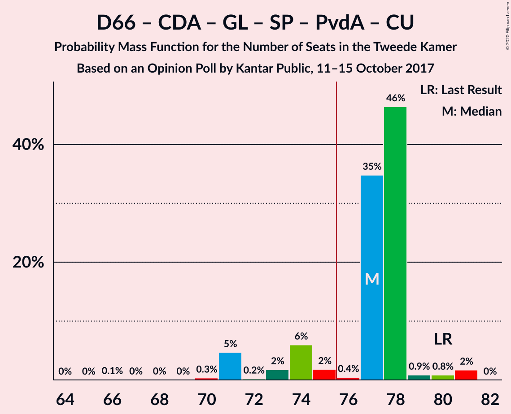

| Number of Seats | Probability | Accumulated | Special Marks |
|:---------------:|:-----------:|:-----------:|:-------------:|
| 66 | 5% | 100% |  |
| 67 | 0% | 95% |  |
| 68 | 0.2% | 95% |  |
| 69 | 0% | 95% |  |
| 70 | 0.1% | 95% |  |
| 71 | 4% | 94% |  |
| 72 | 1.4% | 90% |  |
| 73 | 34% | 89% |  |
| 74 | 4% | 54% | Median |
| 75 | 13% | 50% |  |
| 76 | 3% | 38% | Majority |
| 77 | 0.4% | 35% |  |
| 78 | 6% | 34% |  |
| 79 | 0.1% | 28% |  |
| 80 | 27% | 28% | Last Result |
| 81 | 0% | 0.1% |  |
| 82 | 0% | 0.1% |  |
| 83 | 0% | 0.1% |  |
| 84 | 0.1% | 0.1% |  |
| 85 | 0% | 0% |  |

### Volkspartij voor Vrijheid en Democratie – Democraten 66 – Christen-Democratisch Appèl – ChristenUnie

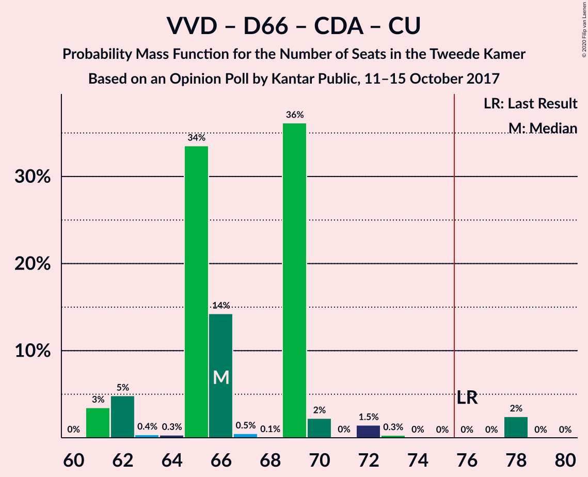

| Number of Seats | Probability | Accumulated | Special Marks |
|:---------------:|:-----------:|:-----------:|:-------------:|
| 61 | 3% | 100% |  |
| 62 | 5% | 97% |  |
| 63 | 0.4% | 92% |  |
| 64 | 0.3% | 91% |  |
| 65 | 34% | 91% |  |
| 66 | 14% | 57% |  |
| 67 | 0.5% | 43% | Median |
| 68 | 0.1% | 43% |  |
| 69 | 36% | 43% |  |
| 70 | 2% | 6% |  |
| 71 | 0% | 4% |  |
| 72 | 1.5% | 4% |  |
| 73 | 0.3% | 3% |  |
| 74 | 0% | 2% |  |
| 75 | 0% | 2% |  |
| 76 | 0% | 2% | Last Result, Majority |
| 77 | 0% | 2% |  |
| 78 | 2% | 2% |  |
| 79 | 0% | 0% |  |

### Volkspartij voor Vrijheid en Democratie – Partij voor de Vrijheid – Christen-Democratisch Appèl

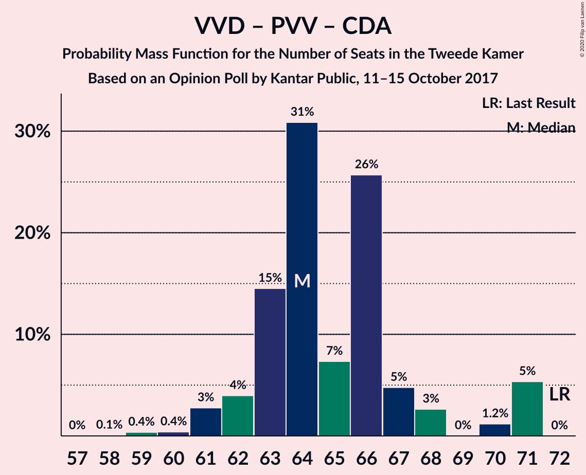

| Number of Seats | Probability | Accumulated | Special Marks |
|:---------------:|:-----------:|:-----------:|:-------------:|
| 58 | 0.1% | 100% |  |
| 59 | 0.4% | 99.9% |  |
| 60 | 0.4% | 99.5% |  |
| 61 | 3% | 99.2% |  |
| 62 | 4% | 96% |  |
| 63 | 15% | 92% |  |
| 64 | 31% | 78% | Median |
| 65 | 7% | 47% |  |
| 66 | 26% | 40% |  |
| 67 | 5% | 14% |  |
| 68 | 3% | 9% |  |
| 69 | 0% | 7% |  |
| 70 | 1.2% | 7% |  |
| 71 | 5% | 5% |  |
| 72 | 0% | 0% | Last Result |

### Volkspartij voor Vrijheid en Democratie – Democraten 66 – Christen-Democratisch Appèl

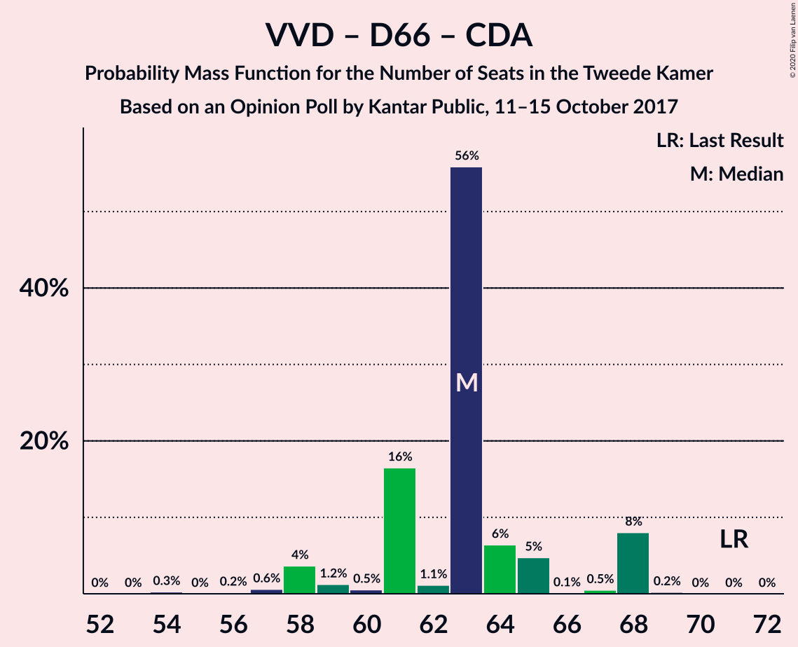

| Number of Seats | Probability | Accumulated | Special Marks |
|:---------------:|:-----------:|:-----------:|:-------------:|
| 56 | 5% | 100% |  |
| 57 | 4% | 95% |  |
| 58 | 33% | 91% |  |
| 59 | 3% | 58% |  |
| 60 | 0.2% | 55% |  |
| 61 | 4% | 55% | Median |
| 62 | 11% | 51% |  |
| 63 | 31% | 40% |  |
| 64 | 4% | 9% |  |
| 65 | 3% | 5% |  |
| 66 | 0.1% | 3% |  |
| 67 | 0.1% | 3% |  |
| 68 | 0% | 2% |  |
| 69 | 2% | 2% |  |
| 70 | 0% | 0% |  |
| 71 | 0% | 0% | Last Result |

### Democraten 66 – Christen-Democratisch Appèl – GroenLinks – Partij van de Arbeid – ChristenUnie

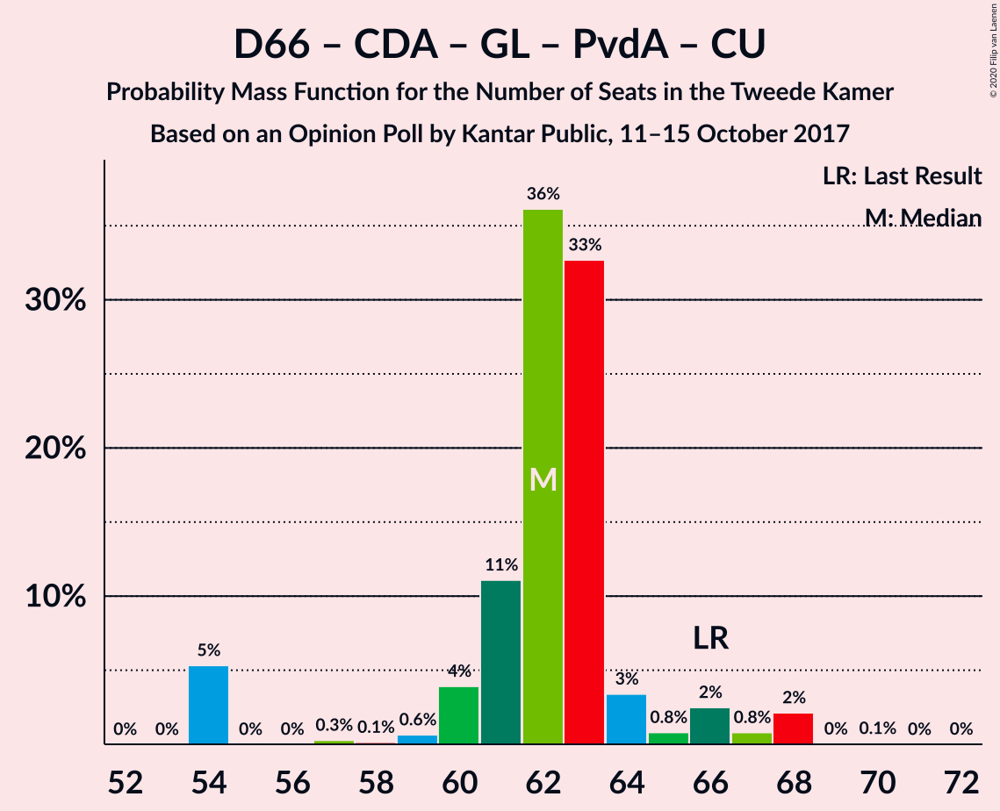

| Number of Seats | Probability | Accumulated | Special Marks |
|:---------------:|:-----------:|:-----------:|:-------------:|
| 54 | 5% | 100% |  |
| 55 | 0% | 95% |  |
| 56 | 0% | 95% |  |
| 57 | 0.3% | 95% |  |
| 58 | 0.1% | 94% |  |
| 59 | 0.6% | 94% |  |
| 60 | 4% | 94% |  |
| 61 | 11% | 90% |  |
| 62 | 36% | 79% | Median |
| 63 | 33% | 42% |  |
| 64 | 3% | 10% |  |
| 65 | 0.8% | 6% |  |
| 66 | 2% | 6% | Last Result |
| 67 | 0.8% | 3% |  |
| 68 | 2% | 2% |  |
| 69 | 0% | 0.1% |  |
| 70 | 0.1% | 0.1% |  |
| 71 | 0% | 0% |  |

### Volkspartij voor Vrijheid en Democratie – Christen-Democratisch Appèl – Forum voor Democratie – 50Plus – Staatkundig Gereformeerde Partij

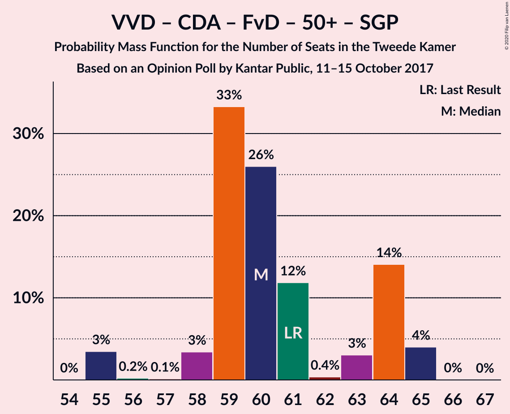

| Number of Seats | Probability | Accumulated | Special Marks |
|:---------------:|:-----------:|:-----------:|:-------------:|
| 54 | 0% | 100% |  |
| 55 | 3% | 99.9% |  |
| 56 | 0.2% | 96% |  |
| 57 | 0.1% | 96% |  |
| 58 | 3% | 96% |  |
| 59 | 33% | 93% |  |
| 60 | 26% | 59% | Median |
| 61 | 12% | 33% | Last Result |
| 62 | 0.4% | 22% |  |
| 63 | 3% | 21% |  |
| 64 | 14% | 18% |  |
| 65 | 4% | 4% |  |
| 66 | 0% | 0.1% |  |
| 67 | 0% | 0% |  |

### Volkspartij voor Vrijheid en Democratie – Christen-Democratisch Appèl – Forum voor Democratie – 50Plus

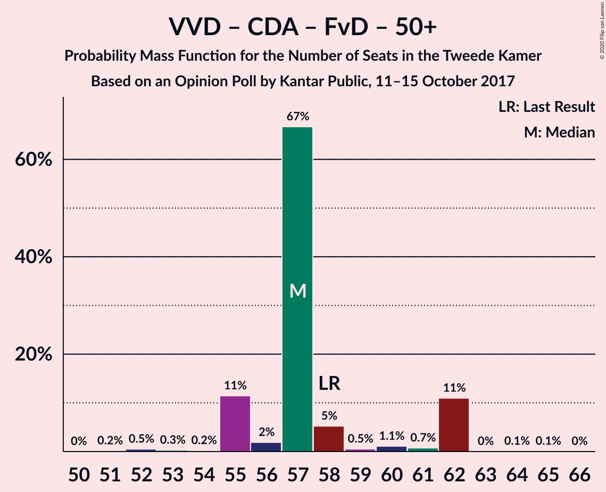

| Number of Seats | Probability | Accumulated | Special Marks |
|:---------------:|:-----------:|:-----------:|:-------------:|
| 51 | 3% | 100% |  |
| 52 | 0.1% | 97% |  |
| 53 | 0% | 96% |  |
| 54 | 1.1% | 96% |  |
| 55 | 30% | 95% |  |
| 56 | 3% | 65% |  |
| 57 | 4% | 62% | Median |
| 58 | 40% | 58% | Last Result |
| 59 | 0.9% | 19% |  |
| 60 | 7% | 18% |  |
| 61 | 9% | 11% |  |
| 62 | 3% | 3% |  |
| 63 | 0% | 0.1% |  |
| 64 | 0% | 0% |  |

### Volkspartij voor Vrijheid en Democratie – Christen-Democratisch Appèl – Forum voor Democratie – Staatkundig Gereformeerde Partij

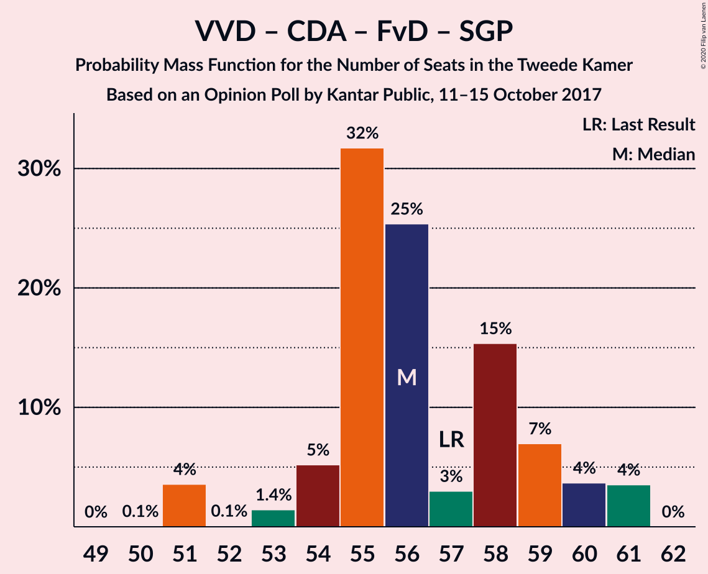

| Number of Seats | Probability | Accumulated | Special Marks |
|:---------------:|:-----------:|:-----------:|:-------------:|
| 50 | 0.1% | 100% |  |
| 51 | 4% | 99.9% |  |
| 52 | 0.1% | 96% |  |
| 53 | 1.4% | 96% |  |
| 54 | 5% | 95% |  |
| 55 | 32% | 90% |  |
| 56 | 25% | 58% | Median |
| 57 | 3% | 33% | Last Result |
| 58 | 15% | 30% |  |
| 59 | 7% | 14% |  |
| 60 | 4% | 7% |  |
| 61 | 4% | 4% |  |
| 62 | 0% | 0% |  |

### Volkspartij voor Vrijheid en Democratie – Democraten 66 – Partij van de Arbeid

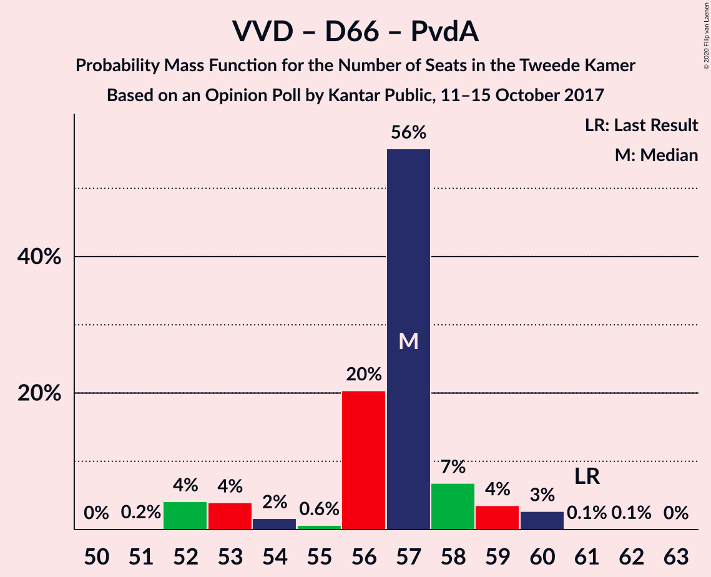

| Number of Seats | Probability | Accumulated | Special Marks |
|:---------------:|:-----------:|:-----------:|:-------------:|
| 50 | 0% | 100% |  |
| 51 | 0.2% | 99.9% |  |
| 52 | 4% | 99.8% |  |
| 53 | 4% | 96% |  |
| 54 | 2% | 92% |  |
| 55 | 0.6% | 90% |  |
| 56 | 20% | 89% |  |
| 57 | 56% | 69% | Median |
| 58 | 7% | 13% |  |
| 59 | 4% | 6% |  |
| 60 | 3% | 3% |  |
| 61 | 0.1% | 0.2% | Last Result |
| 62 | 0.1% | 0.1% |  |
| 63 | 0% | 0% |  |

### Volkspartij voor Vrijheid en Democratie – Christen-Democratisch Appèl – Partij van de Arbeid

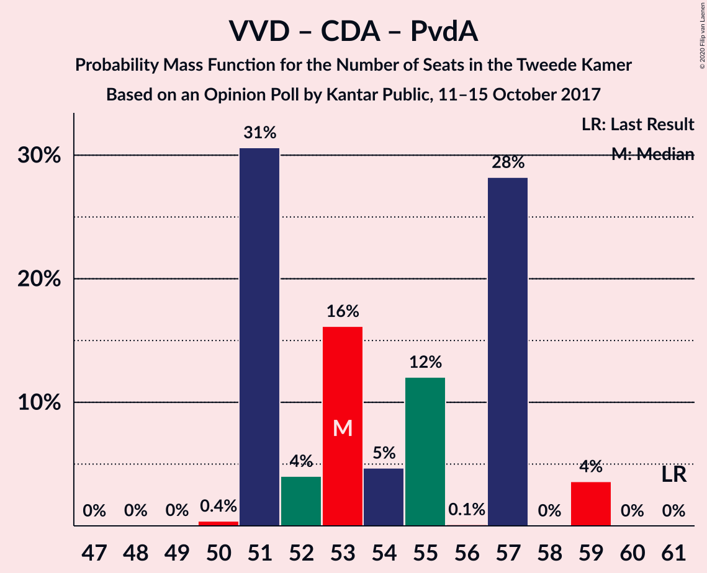

| Number of Seats | Probability | Accumulated | Special Marks |
|:---------------:|:-----------:|:-----------:|:-------------:|
| 47 | 0% | 100% |  |
| 48 | 0% | 99.9% |  |
| 49 | 0% | 99.9% |  |
| 50 | 0.4% | 99.9% |  |
| 51 | 31% | 99.5% |  |
| 52 | 4% | 69% |  |
| 53 | 16% | 65% |  |
| 54 | 5% | 49% | Median |
| 55 | 12% | 44% |  |
| 56 | 0.1% | 32% |  |
| 57 | 28% | 32% |  |
| 58 | 0% | 4% |  |
| 59 | 4% | 4% |  |
| 60 | 0% | 0% |  |
| 61 | 0% | 0% | Last Result |

### Volkspartij voor Vrijheid en Democratie – Christen-Democratisch Appèl – Forum voor Democratie

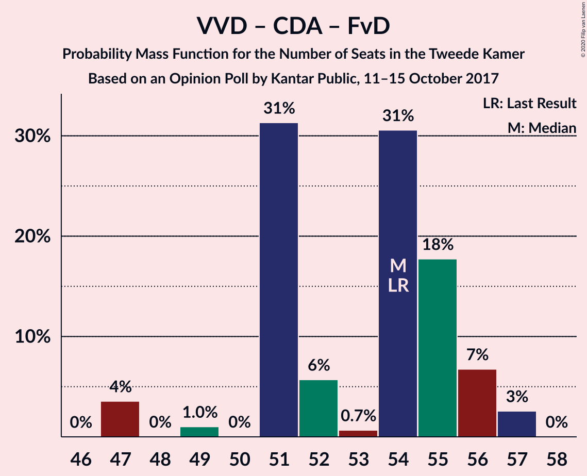

| Number of Seats | Probability | Accumulated | Special Marks |
|:---------------:|:-----------:|:-----------:|:-------------:|
| 47 | 4% | 100% |  |
| 48 | 0% | 96% |  |
| 49 | 1.0% | 96% |  |
| 50 | 0% | 95% |  |
| 51 | 31% | 95% |  |
| 52 | 6% | 64% |  |
| 53 | 0.7% | 58% | Median |
| 54 | 31% | 58% | Last Result |
| 55 | 18% | 27% |  |
| 56 | 7% | 9% |  |
| 57 | 3% | 3% |  |
| 58 | 0% | 0% |  |

### Volkspartij voor Vrijheid en Democratie – Christen-Democratisch Appèl

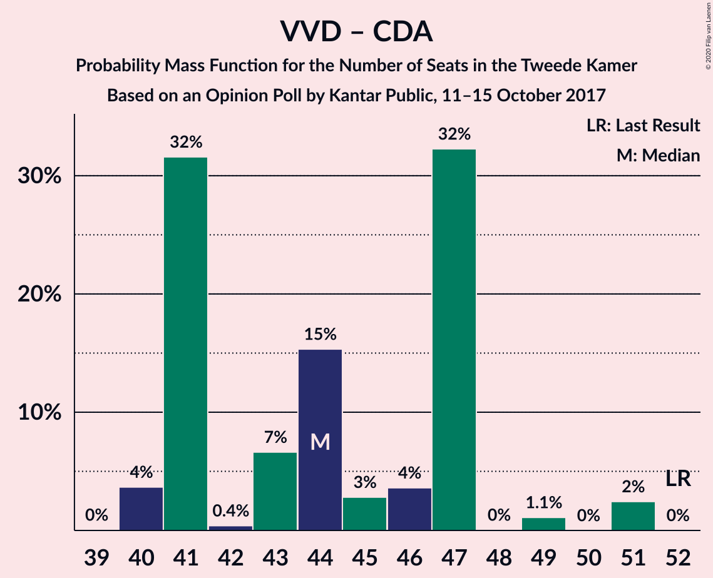

| Number of Seats | Probability | Accumulated | Special Marks |
|:---------------:|:-----------:|:-----------:|:-------------:|
| 39 | 0% | 100% |  |
| 40 | 4% | 99.9% |  |
| 41 | 32% | 96% |  |
| 42 | 0.4% | 65% |  |
| 43 | 7% | 64% |  |
| 44 | 15% | 58% | Median |
| 45 | 3% | 42% |  |
| 46 | 4% | 39% |  |
| 47 | 32% | 36% |  |
| 48 | 0% | 4% |  |
| 49 | 1.1% | 4% |  |
| 50 | 0% | 2% |  |
| 51 | 2% | 2% |  |
| 52 | 0% | 0% | Last Result |

### Democraten 66 – Christen-Democratisch Appèl – Partij van de Arbeid

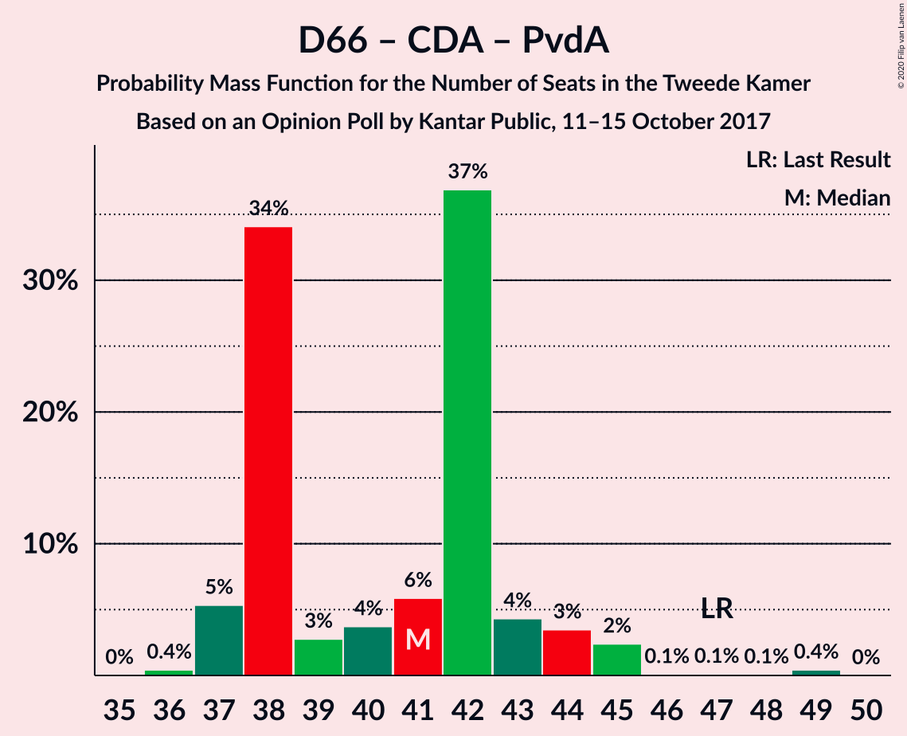

| Number of Seats | Probability | Accumulated | Special Marks |
|:---------------:|:-----------:|:-----------:|:-------------:|
| 36 | 0.4% | 100% |  |
| 37 | 5% | 99.5% |  |
| 38 | 34% | 94% |  |
| 39 | 3% | 60% |  |
| 40 | 4% | 57% |  |
| 41 | 6% | 54% | Median |
| 42 | 37% | 48% |  |
| 43 | 4% | 11% |  |
| 44 | 3% | 7% |  |
| 45 | 2% | 3% |  |
| 46 | 0.1% | 0.7% |  |
| 47 | 0.1% | 0.6% | Last Result |
| 48 | 0.1% | 0.5% |  |
| 49 | 0.4% | 0.4% |  |
| 50 | 0% | 0% |  |

### Volkspartij voor Vrijheid en Democratie – Partij van de Arbeid

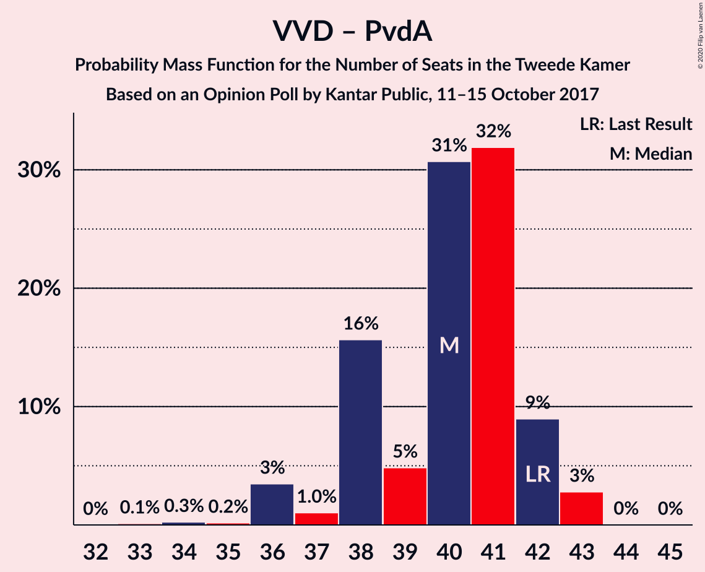

| Number of Seats | Probability | Accumulated | Special Marks |
|:---------------:|:-----------:|:-----------:|:-------------:|
| 33 | 0.1% | 100% |  |
| 34 | 0.3% | 99.9% |  |
| 35 | 0.2% | 99.6% |  |
| 36 | 3% | 99.4% |  |
| 37 | 1.0% | 96% |  |
| 38 | 16% | 95% |  |
| 39 | 5% | 79% |  |
| 40 | 31% | 74% | Median |
| 41 | 32% | 44% |  |
| 42 | 9% | 12% | Last Result |
| 43 | 3% | 3% |  |
| 44 | 0% | 0.1% |  |
| 45 | 0% | 0% |  |

### Christen-Democratisch Appèl – Partij van de Arbeid – ChristenUnie

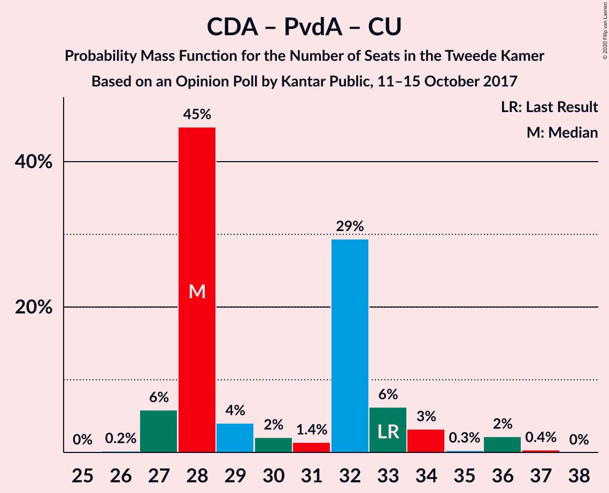

| Number of Seats | Probability | Accumulated | Special Marks |
|:---------------:|:-----------:|:-----------:|:-------------:|
| 26 | 0.2% | 100% |  |
| 27 | 6% | 99.8% |  |
| 28 | 45% | 94% |  |
| 29 | 4% | 49% |  |
| 30 | 2% | 45% | Median |
| 31 | 1.4% | 43% |  |
| 32 | 29% | 42% |  |
| 33 | 6% | 12% | Last Result |
| 34 | 3% | 6% |  |
| 35 | 0.3% | 3% |  |
| 36 | 2% | 3% |  |
| 37 | 0.4% | 0.4% |  |
| 38 | 0% | 0% |  |

### Democraten 66 – Christen-Democratisch Appèl

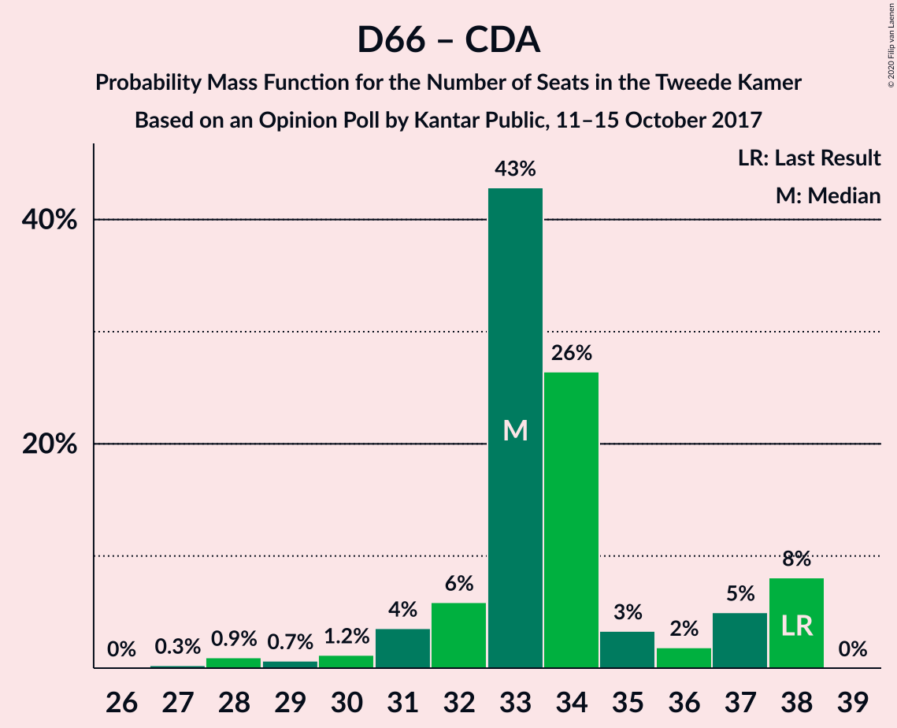

| Number of Seats | Probability | Accumulated | Special Marks |
|:---------------:|:-----------:|:-----------:|:-------------:|
| 27 | 3% | 100% |  |
| 28 | 34% | 97% |  |
| 29 | 10% | 63% |  |
| 30 | 0.2% | 53% |  |
| 31 | 0.1% | 53% | Median |
| 32 | 33% | 53% |  |
| 33 | 13% | 20% |  |
| 34 | 4% | 7% |  |
| 35 | 3% | 3% |  |
| 36 | 0.1% | 0.5% |  |
| 37 | 0.1% | 0.4% |  |
| 38 | 0.3% | 0.3% | Last Result |
| 39 | 0% | 0% |  |

### Christen-Democratisch Appèl – Partij van de Arbeid

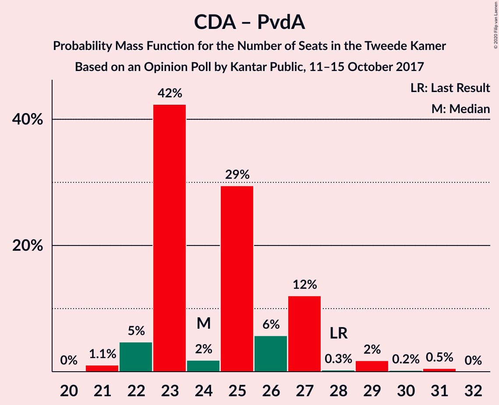

| Number of Seats | Probability | Accumulated | Special Marks |
|:---------------:|:-----------:|:-----------:|:-------------:|
| 20 | 0.2% | 100% |  |
| 21 | 36% | 99.8% |  |
| 22 | 0.7% | 64% |  |
| 23 | 5% | 64% |  |
| 24 | 15% | 58% | Median |
| 25 | 6% | 43% |  |
| 26 | 30% | 37% |  |
| 27 | 3% | 8% |  |
| 28 | 4% | 4% | Last Result |
| 29 | 0.2% | 0.6% |  |
| 30 | 0.1% | 0.4% |  |
| 31 | 0.3% | 0.4% |  |
| 32 | 0% | 0% |  |

## Technical Information

### Opinion Poll

+ **Polling firm:** Kantar Public
+ **Commissioner(s):** —
+ **Fieldwork period:** 11–15 October 2017

### Calculations

+ **Sample size:** 986
+ **Simulations done:** 131,072
+ **Error estimate:** 3.75%

