# Opinion Poll by GfK for EenVandaag, 27–30 October 2017

<a href="#voting-intentions">Voting Intentions</a> | <a href="#seats">Seats</a> | <a href="#coalitions">Coalitions</a> | <a href="#technical-information">Technical Information</a>

## Voting Intentions

### Confidence Intervals

| Party | Last Result | Poll Result | 80% Confidence Interval | 90% Confidence Interval | 95% Confidence Interval | 99% Confidence Interval |
|:-----:|:-----------:|:-----------:|:-----------------------:|:-----------------------:|:-----------------------:|:-----------------------:|
| Volkspartij voor Vrijheid en Democratie | 21.3% | 20.0% | 18.9–21.2% |18.6–21.5% |18.3–21.8% |17.8–22.4% |
| Partij voor de Vrijheid | 13.1% | 14.0% | 13.0–15.0% |12.8–15.3% |12.5–15.6% |12.1–16.1% |
| Democraten 66 | 12.2% | 11.3% | 10.5–12.3% |10.2–12.6% |10.0–12.8% |9.6–13.3% |
| Christen-Democratisch Appèl | 12.4% | 10.7% | 9.8–11.6% |9.6–11.9% |9.4–12.1% |9.0–12.6% |
| GroenLinks | 9.1% | 8.7% | 7.9–9.5% |7.7–9.8% |7.5–10.0% |7.1–10.4% |
| Socialistische Partij | 9.1% | 8.0% | 7.3–8.8% |7.1–9.1% |6.9–9.3% |6.6–9.7% |
| Partij van de Arbeid | 5.7% | 8.0% | 7.3–8.8% |7.1–9.1% |6.9–9.3% |6.6–9.7% |
| Forum voor Democratie | 1.8% | 5.3% | 4.7–6.1% |4.6–6.2% |4.4–6.4% |4.2–6.8% |
| ChristenUnie | 3.4% | 4.0% | 3.5–4.6% |3.4–4.8% |3.2–5.0% |3.0–5.3% |
| Partij voor de Dieren | 3.2% | 4.0% | 3.5–4.6% |3.4–4.8% |3.2–5.0% |3.0–5.3% |
| 50Plus | 3.1% | 2.7% | 2.3–3.2% |2.1–3.3% |2.0–3.5% |1.9–3.7% |
| Staatkundig Gereformeerde Partij | 2.1% | 2.0% | 1.6–2.4% |1.5–2.6% |1.4–2.7% |1.3–2.9% |
| DENK | 2.1% | 1.3% | 1.1–1.7% |1.0–1.8% |0.9–2.0% |0.8–2.1% |

*Note:* The poll result column reflects the actual value used in the calculations. Published results may vary slightly, and in addition be rounded to fewer digits.

## Seats

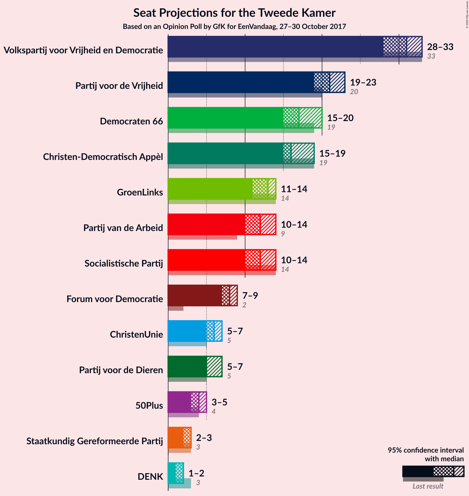

### Confidence Intervals

| Party | Last Result | Median | 80% Confidence Interval | 90% Confidence Interval | 95% Confidence Interval | 99% Confidence Interval |
|:-----:|:-----------:|:------:|:-----------------------:|:-----------------------:|:-----------------------:|:-----------------------:|
| <a href="#volkspartij-voor-vrijheid-en-democratie">Volkspartij voor Vrijheid en Democratie</a> | 33 | 30 | 30–31 |30–31 |29–31 |27–37 |
| <a href="#partij-voor-de-vrijheid">Partij voor de Vrijheid</a> | 20 | 23 | 20–23 |20–23 |20–23 |20–23 |
| <a href="#democraten-66">Democraten 66</a> | 19 | 16 | 16 |16–17 |16–18 |16–21 |
| <a href="#christen-democratisch-appèl">Christen-Democratisch Appèl</a> | 19 | 17 | 15–17 |15–17 |15–17 |13–19 |
| <a href="#groenlinks">GroenLinks</a> | 14 | 11 | 11–14 |11–14 |11–14 |11–15 |
| <a href="#socialistische-partij">Socialistische Partij</a> | 14 | 14 | 10–14 |10–14 |10–14 |10–15 |
| <a href="#partij-van-de-arbeid">Partij van de Arbeid</a> | 9 | 12 | 12 |12 |10–13 |10–15 |
| <a href="#forum-voor-democratie">Forum voor Democratie</a> | 2 | 7 | 7–9 |7–9 |7–9 |6–9 |
| <a href="#christenunie">ChristenUnie</a> | 5 | 5 | 5–6 |5–6 |5–6 |4–7 |
| <a href="#partij-voor-de-dieren">Partij voor de Dieren</a> | 5 | 7 | 7–8 |6–8 |6–8 |5–8 |
| <a href="#50plus">50Plus</a> | 4 | 3 | 3–4 |3–4 |3–4 |2–5 |
| <a href="#staatkundig-gereformeerde-partij">Staatkundig Gereformeerde Partij</a> | 3 | 3 | 3 |3 |3 |2–3 |
| <a href="#denk">DENK</a> | 3 | 2 | 2 |2 |1–2 |1–2 |

### Volkspartij voor Vrijheid en Democratie

*For a full overview of the results for this party, see the [Volkspartij voor Vrijheid en Democratie](party-volkspartijvoorvrijheidendemocratie.html) page.*

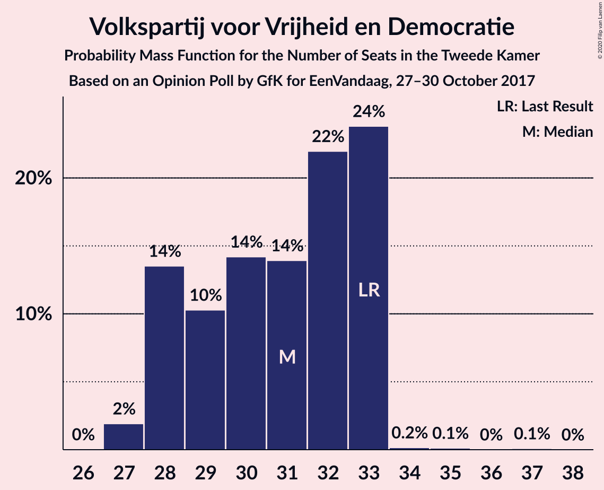

| Number of Seats | Probability | Accumulated | Special Marks |
|:---------------:|:-----------:|:-----------:|:-------------:|
| 27 | 0.5% | 100% |  |
| 28 | 1.3% | 99.5% |  |
| 29 | 2% | 98% |  |
| 30 | 60% | 97% | Median |
| 31 | 35% | 37% |  |
| 32 | 0.3% | 2% |  |
| 33 | 0.2% | 2% | Last Result |
| 34 | 0% | 2% |  |
| 35 | 0% | 2% |  |
| 36 | 0% | 2% |  |
| 37 | 2% | 2% |  |
| 38 | 0% | 0% |  |

### Partij voor de Vrijheid

*For a full overview of the results for this party, see the [Partij voor de Vrijheid](party-partijvoordevrijheid.html) page.*

| Number of Seats | Probability | Accumulated | Special Marks |
|:---------------:|:-----------:|:-----------:|:-------------:|
| 18 | 0.2% | 100% |  |
| 19 | 0.1% | 99.8% |  |
| 20 | 36% | 99.7% | Last Result |
| 21 | 3% | 64% |  |
| 22 | 1.5% | 61% |  |
| 23 | 59% | 59% | Median |
| 24 | 0% | 0.1% |  |
| 25 | 0% | 0% |  |

### Democraten 66

*For a full overview of the results for this party, see the [Democraten 66](party-democraten66.html) page.*

| Number of Seats | Probability | Accumulated | Special Marks |
|:---------------:|:-----------:|:-----------:|:-------------:|
| 14 | 0% | 100% |  |
| 15 | 0.2% | 99.9% |  |
| 16 | 93% | 99.7% | Median |
| 17 | 4% | 7% |  |
| 18 | 1.5% | 3% |  |
| 19 | 0.7% | 2% | Last Result |
| 20 | 0.1% | 0.9% |  |
| 21 | 0.8% | 0.8% |  |
| 22 | 0% | 0% |  |

### Christen-Democratisch Appèl

*For a full overview of the results for this party, see the [Christen-Democratisch Appèl](party-christen-democratischappèl.html) page.*

| Number of Seats | Probability | Accumulated | Special Marks |
|:---------------:|:-----------:|:-----------:|:-------------:|
| 13 | 1.0% | 100% |  |
| 14 | 0.6% | 99.0% |  |
| 15 | 36% | 98% |  |
| 16 | 3% | 63% |  |
| 17 | 58% | 60% | Median |
| 18 | 0.7% | 2% |  |
| 19 | 1.1% | 1.1% | Last Result |
| 20 | 0% | 0% |  |

### GroenLinks

*For a full overview of the results for this party, see the [GroenLinks](party-groenlinks.html) page.*

| Number of Seats | Probability | Accumulated | Special Marks |
|:---------------:|:-----------:|:-----------:|:-------------:|
| 11 | 59% | 100% | Median |
| 12 | 2% | 41% |  |
| 13 | 2% | 39% |  |
| 14 | 36% | 37% | Last Result |
| 15 | 0.7% | 0.8% |  |
| 16 | 0% | 0.1% |  |
| 17 | 0.1% | 0.1% |  |
| 18 | 0% | 0% |  |

### Socialistische Partij

*For a full overview of the results for this party, see the [Socialistische Partij](party-socialistischepartij.html) page.*

| Number of Seats | Probability | Accumulated | Special Marks |
|:---------------:|:-----------:|:-----------:|:-------------:|
| 9 | 0.1% | 100% |  |
| 10 | 35% | 99.9% |  |
| 11 | 4% | 65% |  |
| 12 | 1.4% | 61% |  |
| 13 | 0.9% | 60% |  |
| 14 | 58% | 59% | Last Result, Median |
| 15 | 0.9% | 1.0% |  |
| 16 | 0.1% | 0.1% |  |
| 17 | 0% | 0% |  |

### Partij van de Arbeid

*For a full overview of the results for this party, see the [Partij van de Arbeid](party-partijvandearbeid.html) page.*

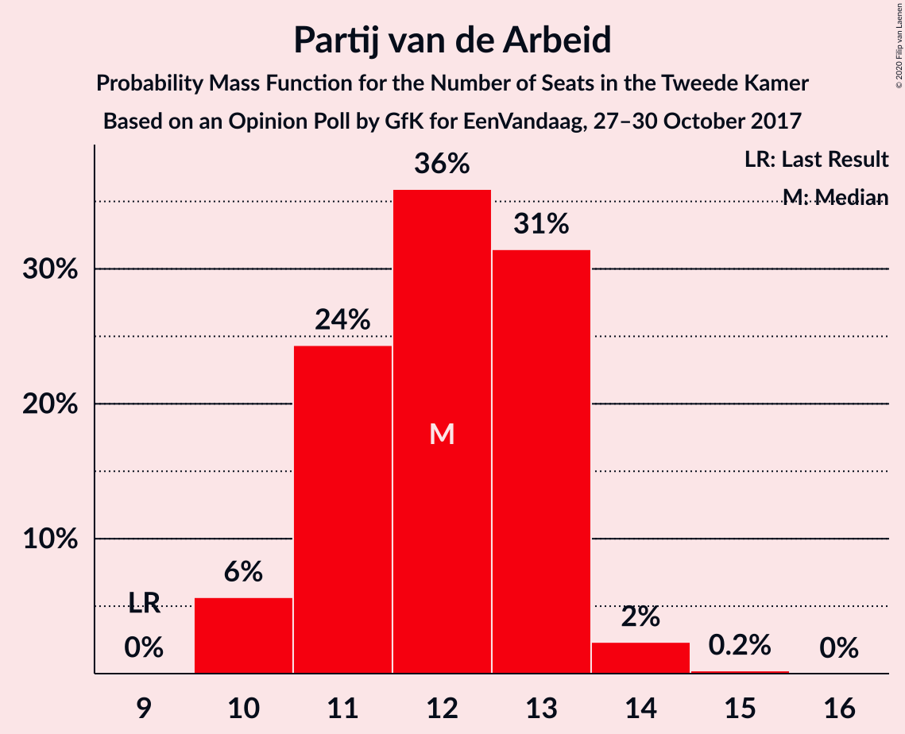

| Number of Seats | Probability | Accumulated | Special Marks |
|:---------------:|:-----------:|:-----------:|:-------------:|
| 9 | 0% | 100% | Last Result |
| 10 | 3% | 100% |  |
| 11 | 1.1% | 97% |  |
| 12 | 92% | 96% | Median |
| 13 | 2% | 4% |  |
| 14 | 0.5% | 2% |  |
| 15 | 1.2% | 1.2% |  |
| 16 | 0% | 0% |  |

### Forum voor Democratie

*For a full overview of the results for this party, see the [Forum voor Democratie](party-forumvoordemocratie.html) page.*

| Number of Seats | Probability | Accumulated | Special Marks |
|:---------------:|:-----------:|:-----------:|:-------------:|
| 2 | 0% | 100% | Last Result |
| 3 | 0% | 100% |  |
| 4 | 0% | 100% |  |
| 5 | 0% | 100% |  |
| 6 | 2% | 100% |  |
| 7 | 58% | 98% | Median |
| 8 | 2% | 40% |  |
| 9 | 38% | 38% |  |
| 10 | 0.1% | 0.2% |  |
| 11 | 0% | 0% |  |

### ChristenUnie

*For a full overview of the results for this party, see the [ChristenUnie](party-christenunie.html) page.*

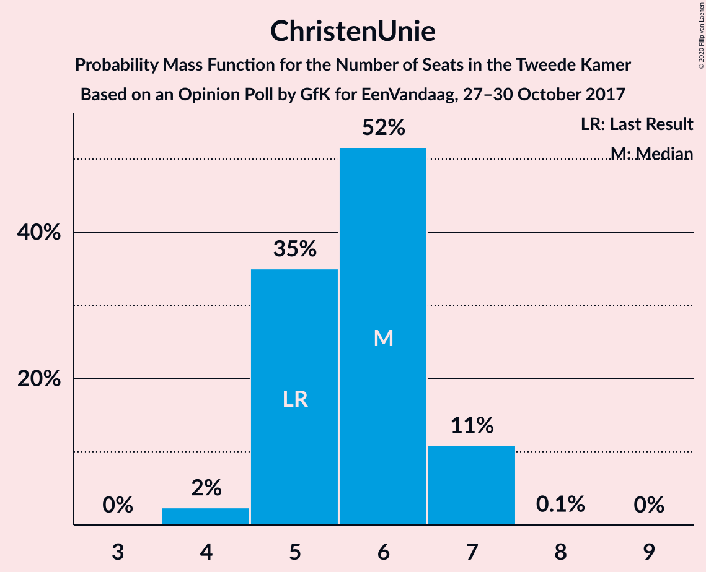

| Number of Seats | Probability | Accumulated | Special Marks |
|:---------------:|:-----------:|:-----------:|:-------------:|
| 4 | 1.1% | 100% |  |
| 5 | 60% | 98.9% | Last Result, Median |
| 6 | 39% | 39% |  |
| 7 | 0.4% | 0.7% |  |
| 8 | 0.2% | 0.2% |  |
| 9 | 0% | 0% |  |

### Partij voor de Dieren

*For a full overview of the results for this party, see the [Partij voor de Dieren](party-partijvoordedieren.html) page.*

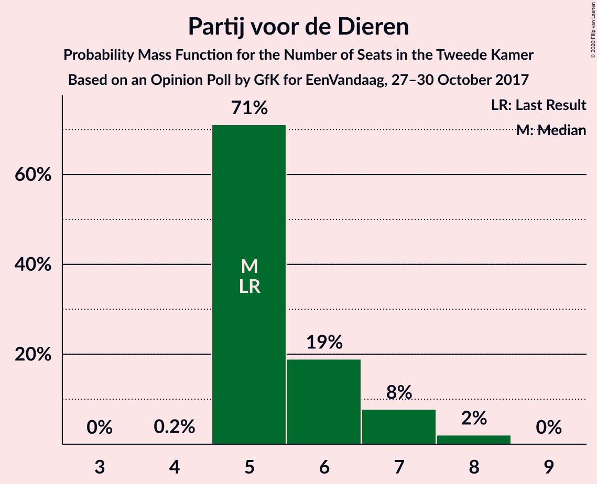

| Number of Seats | Probability | Accumulated | Special Marks |
|:---------------:|:-----------:|:-----------:|:-------------:|
| 4 | 0.1% | 100% |  |
| 5 | 2% | 99.9% | Last Result |
| 6 | 5% | 98% |  |
| 7 | 58% | 94% | Median |
| 8 | 36% | 36% |  |
| 9 | 0% | 0% |  |

### 50Plus

*For a full overview of the results for this party, see the [50Plus](party-50plus.html) page.*

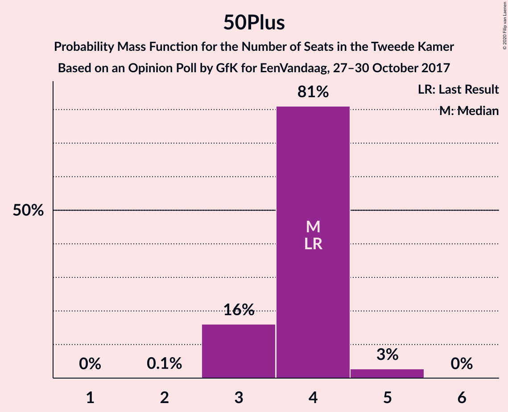

| Number of Seats | Probability | Accumulated | Special Marks |
|:---------------:|:-----------:|:-----------:|:-------------:|
| 2 | 0.8% | 100% |  |
| 3 | 60% | 99.2% | Median |
| 4 | 37% | 39% | Last Result |
| 5 | 1.5% | 2% |  |
| 6 | 0.1% | 0.1% |  |
| 7 | 0% | 0% |  |

### Staatkundig Gereformeerde Partij

*For a full overview of the results for this party, see the [Staatkundig Gereformeerde Partij](party-staatkundiggereformeerdepartij.html) page.*

| Number of Seats | Probability | Accumulated | Special Marks |
|:---------------:|:-----------:|:-----------:|:-------------:|
| 2 | 1.4% | 100% |  |
| 3 | 98% | 98.6% | Last Result, Median |
| 4 | 0.2% | 0.2% |  |
| 5 | 0% | 0% |  |

### DENK

*For a full overview of the results for this party, see the [DENK](party-denk.html) page.*

| Number of Seats | Probability | Accumulated | Special Marks |
|:---------------:|:-----------:|:-----------:|:-------------:|
| 0 | 0.1% | 100% |  |
| 1 | 4% | 99.9% |  |
| 2 | 95% | 96% | Median |
| 3 | 0.3% | 0.3% | Last Result |
| 4 | 0% | 0% |  |

## Coalitions

### Confidence Intervals

| Coalition | Last Result | Median | Majority? | 80% Confidence Interval | 90% Confidence Interval | 95% Confidence Interval | 99% Confidence Interval |
|:---------:|:-----------:|:------:|:---------:|:-----------------------:|:-----------------------:|:-----------------------:|:-----------------------:|
| Volkspartij voor Vrijheid en Democratie – Democraten 66 – Christen-Democratisch Appèl – Partij van de Arbeid – ChristenUnie | 85 | 80 | 100% | 80 | 80 | 79–85 | 78–86 |
| Volkspartij voor Vrijheid en Democratie – Democraten 66 – Christen-Democratisch Appèl – GroenLinks – ChristenUnie | 90 | 79 | 100% | 79–82 | 79–82 | 79–84 | 77–88 |
| Volkspartij voor Vrijheid en Democratie – Partij voor de Vrijheid – Christen-Democratisch Appèl – Forum voor Democratie – Staatkundig Gereformeerde Partij | 77 | 80 | 99.1% | 78–80 | 78–80 | 77–80 | 75–83 |
| Volkspartij voor Vrijheid en Democratie – Partij voor de Vrijheid – Christen-Democratisch Appèl – Forum voor Democratie | 74 | 77 | 62% | 75–77 | 75–77 | 74–77 | 72–80 |
| Democraten 66 – Christen-Democratisch Appèl – GroenLinks – Partij van de Arbeid – Socialistische Partij – ChristenUnie | 80 | 75 | 5% | 73–75 | 73–75 | 73–77 | 72–81 |
| Volkspartij voor Vrijheid en Democratie – Democraten 66 – Christen-Democratisch Appèl – ChristenUnie | 76 | 68 | 2% | 68 | 68 | 67–72 | 64–76 |
| Volkspartij voor Vrijheid en Democratie – Partij voor de Vrijheid – Christen-Democratisch Appèl | 72 | 70 | 0% | 66–70 | 66–70 | 66–70 | 65–74 |
| Volkspartij voor Vrijheid en Democratie – Democraten 66 – Christen-Democratisch Appèl | 71 | 63 | 0% | 62–63 | 62–63 | 62–66 | 59–70 |
| Democraten 66 – Christen-Democratisch Appèl – GroenLinks – Partij van de Arbeid – ChristenUnie | 66 | 61 | 0% | 61–63 | 61–63 | 61–66 | 61–67 |
| Volkspartij voor Vrijheid en Democratie – Democraten 66 – Partij van de Arbeid | 61 | 58 | 0% | 58–59 | 58–59 | 58–63 | 56–64 |
| Volkspartij voor Vrijheid en Democratie – Christen-Democratisch Appèl – Forum voor Democratie – 50Plus – Staatkundig Gereformeerde Partij | 61 | 60 | 0% | 60–62 | 60–62 | 59–62 | 57–66 |
| Volkspartij voor Vrijheid en Democratie – Christen-Democratisch Appèl – Partij van de Arbeid | 61 | 59 | 0% | 58–59 | 58–59 | 57–59 | 56–63 |
| Volkspartij voor Vrijheid en Democratie – Christen-Democratisch Appèl – Forum voor Democratie – 50Plus | 58 | 57 | 0% | 57–59 | 57–59 | 56–59 | 54–63 |
| Volkspartij voor Vrijheid en Democratie – Christen-Democratisch Appèl – Forum voor Democratie – Staatkundig Gereformeerde Partij | 57 | 57 | 0% | 57–58 | 57–58 | 56–59 | 54–62 |
| Volkspartij voor Vrijheid en Democratie – Christen-Democratisch Appèl – Forum voor Democratie | 54 | 54 | 0% | 54–55 | 54–55 | 54–56 | 51–59 |
| Volkspartij voor Vrijheid en Democratie – Christen-Democratisch Appèl | 52 | 47 | 0% | 46–47 | 46–47 | 45–47 | 42–53 |
| Democraten 66 – Christen-Democratisch Appèl – Partij van de Arbeid | 47 | 45 | 0% | 43–45 | 43–45 | 43–47 | 43–49 |
| Volkspartij voor Vrijheid en Democratie – Partij van de Arbeid | 42 | 42 | 0% | 42–43 | 42–43 | 41–44 | 38–47 |
| Christen-Democratisch Appèl – Partij van de Arbeid – ChristenUnie | 33 | 34 | 0% | 33–34 | 33–34 | 32–35 | 31–37 |
| Democraten 66 – Christen-Democratisch Appèl | 38 | 33 | 0% | 31–33 | 31–33 | 31–34 | 30–37 |
| Christen-Democratisch Appèl – Partij van de Arbeid | 28 | 29 | 0% | 27–29 | 27–29 | 27–29 | 26–31 |

### Volkspartij voor Vrijheid en Democratie – Democraten 66 – Christen-Democratisch Appèl – Partij van de Arbeid – ChristenUnie

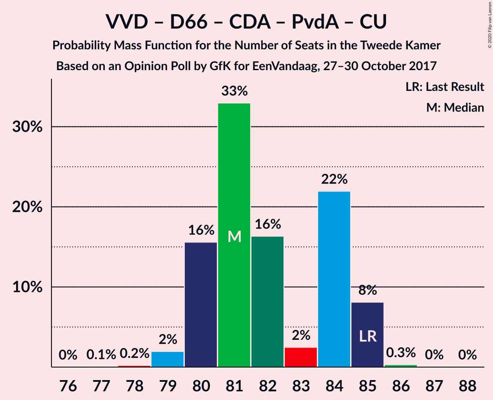

| Number of Seats | Probability | Accumulated | Special Marks |
|:---------------:|:-----------:|:-----------:|:-------------:|
| 77 | 0.1% | 100% |  |
| 78 | 1.2% | 99.9% |  |
| 79 | 1.2% | 98.6% |  |
| 80 | 93% | 97% | Median |
| 81 | 1.1% | 5% |  |
| 82 | 0.3% | 4% |  |
| 83 | 0.7% | 3% |  |
| 84 | 0.1% | 3% |  |
| 85 | 0.8% | 3% | Last Result |
| 86 | 2% | 2% |  |
| 87 | 0% | 0% |  |

### Volkspartij voor Vrijheid en Democratie – Democraten 66 – Christen-Democratisch Appèl – GroenLinks – ChristenUnie

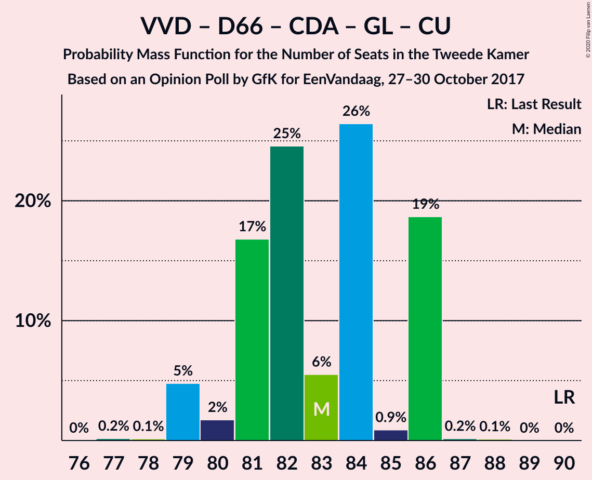

| Number of Seats | Probability | Accumulated | Special Marks |
|:---------------:|:-----------:|:-----------:|:-------------:|
| 77 | 1.1% | 100% |  |
| 78 | 0.1% | 98.9% |  |
| 79 | 58% | 98.8% | Median |
| 80 | 0% | 41% |  |
| 81 | 2% | 41% |  |
| 82 | 35% | 39% |  |
| 83 | 0.8% | 4% |  |
| 84 | 1.4% | 3% |  |
| 85 | 0.3% | 2% |  |
| 86 | 0% | 2% |  |
| 87 | 0.1% | 2% |  |
| 88 | 2% | 2% |  |
| 89 | 0% | 0% |  |
| 90 | 0% | 0% | Last Result |

### Volkspartij voor Vrijheid en Democratie – Partij voor de Vrijheid – Christen-Democratisch Appèl – Forum voor Democratie – Staatkundig Gereformeerde Partij

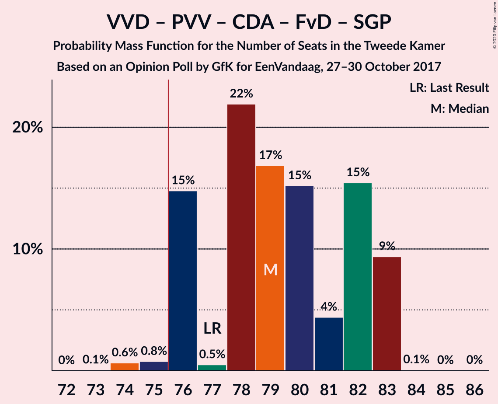

| Number of Seats | Probability | Accumulated | Special Marks |
|:---------------:|:-----------:|:-----------:|:-------------:|
| 74 | 0.2% | 100% |  |
| 75 | 0.7% | 99.8% |  |
| 76 | 0.5% | 99.1% | Majority |
| 77 | 2% | 98.6% | Last Result |
| 78 | 35% | 97% |  |
| 79 | 2% | 62% |  |
| 80 | 59% | 60% | Median |
| 81 | 0.1% | 2% |  |
| 82 | 0.1% | 2% |  |
| 83 | 2% | 2% |  |
| 84 | 0% | 0% |  |

### Volkspartij voor Vrijheid en Democratie – Partij voor de Vrijheid – Christen-Democratisch Appèl – Forum voor Democratie

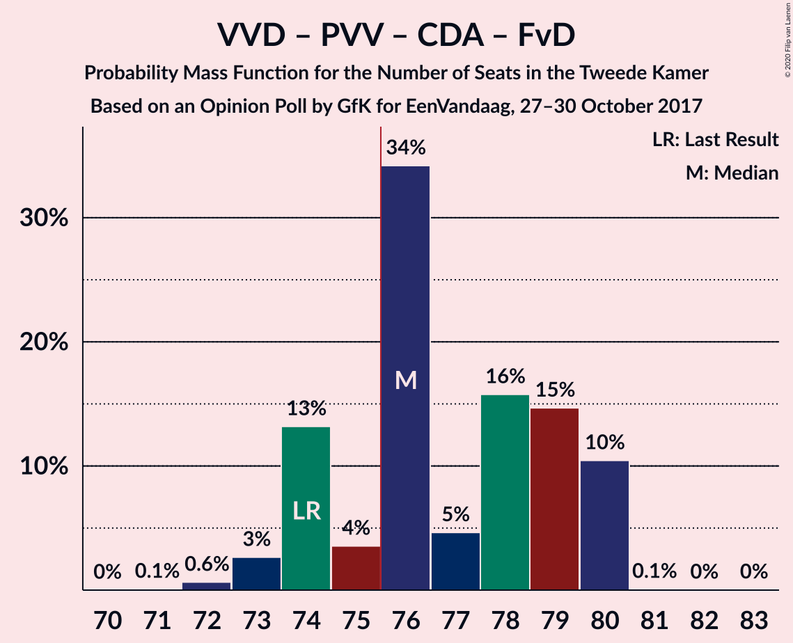

| Number of Seats | Probability | Accumulated | Special Marks |
|:---------------:|:-----------:|:-----------:|:-------------:|
| 71 | 0.1% | 100% |  |
| 72 | 0.4% | 99.9% |  |
| 73 | 0.8% | 99.5% |  |
| 74 | 2% | 98.7% | Last Result |
| 75 | 35% | 97% |  |
| 76 | 1.1% | 62% | Majority |
| 77 | 59% | 61% | Median |
| 78 | 0.1% | 2% |  |
| 79 | 0.1% | 2% |  |
| 80 | 2% | 2% |  |
| 81 | 0% | 0% |  |

### Democraten 66 – Christen-Democratisch Appèl – GroenLinks – Partij van de Arbeid – Socialistische Partij – ChristenUnie

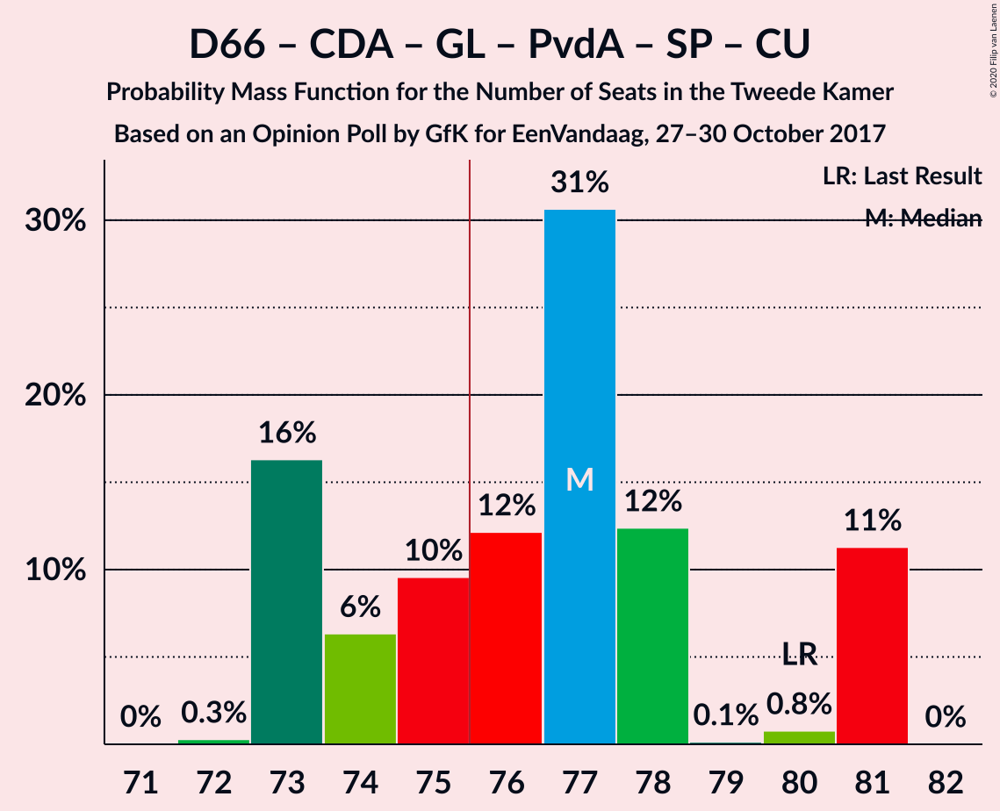

| Number of Seats | Probability | Accumulated | Special Marks |
|:---------------:|:-----------:|:-----------:|:-------------:|
| 72 | 2% | 100% |  |
| 73 | 35% | 98% |  |
| 74 | 0.1% | 64% |  |
| 75 | 59% | 64% | Median |
| 76 | 0.3% | 5% | Majority |
| 77 | 3% | 4% |  |
| 78 | 0.4% | 2% |  |
| 79 | 0.4% | 1.1% |  |
| 80 | 0.2% | 0.7% | Last Result |
| 81 | 0.5% | 0.5% |  |
| 82 | 0% | 0.1% |  |
| 83 | 0% | 0% |  |

### Volkspartij voor Vrijheid en Democratie – Democraten 66 – Christen-Democratisch Appèl – ChristenUnie

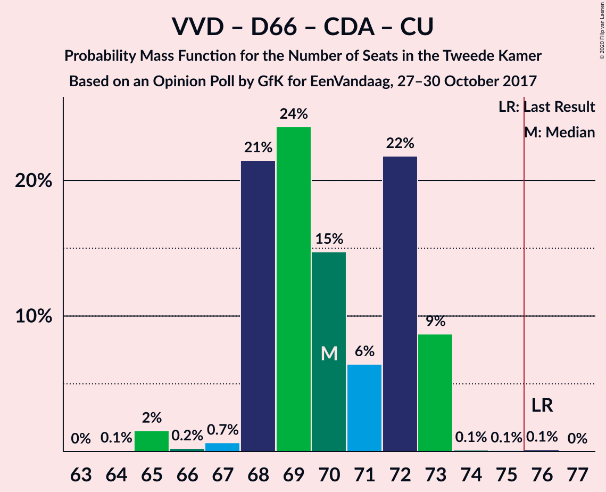

| Number of Seats | Probability | Accumulated | Special Marks |
|:---------------:|:-----------:|:-----------:|:-------------:|
| 64 | 1.0% | 100% |  |
| 65 | 0.1% | 99.0% |  |
| 66 | 0.4% | 98.9% |  |
| 67 | 1.4% | 98% |  |
| 68 | 92% | 97% | Median |
| 69 | 0% | 5% |  |
| 70 | 0.8% | 5% |  |
| 71 | 1.2% | 4% |  |
| 72 | 1.0% | 3% |  |
| 73 | 0% | 2% |  |
| 74 | 0.1% | 2% |  |
| 75 | 0% | 2% |  |
| 76 | 2% | 2% | Last Result, Majority |
| 77 | 0% | 0% |  |

### Volkspartij voor Vrijheid en Democratie – Partij voor de Vrijheid – Christen-Democratisch Appèl

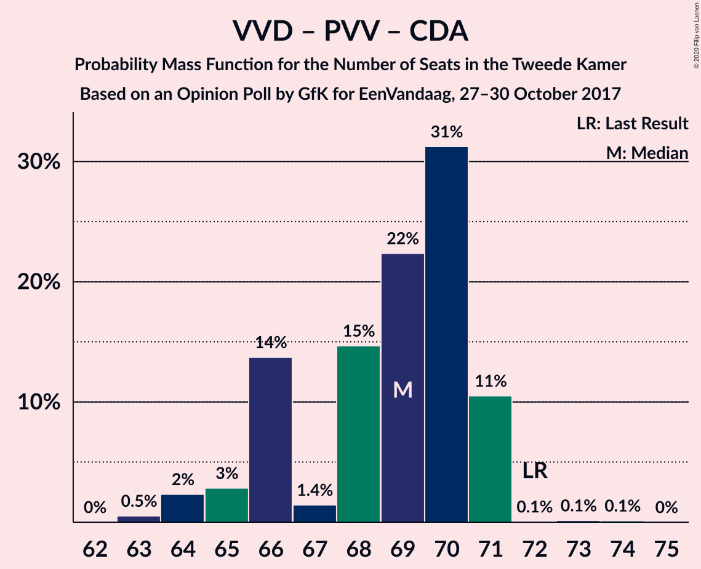

| Number of Seats | Probability | Accumulated | Special Marks |
|:---------------:|:-----------:|:-----------:|:-------------:|
| 63 | 0.1% | 100% |  |
| 64 | 0.1% | 99.9% |  |
| 65 | 1.2% | 99.7% |  |
| 66 | 36% | 98.5% |  |
| 67 | 1.4% | 62% |  |
| 68 | 1.2% | 61% |  |
| 69 | 0.4% | 60% |  |
| 70 | 58% | 59% | Median |
| 71 | 0% | 2% |  |
| 72 | 0% | 2% | Last Result |
| 73 | 0% | 2% |  |
| 74 | 2% | 2% |  |
| 75 | 0% | 0% |  |

### Volkspartij voor Vrijheid en Democratie – Democraten 66 – Christen-Democratisch Appèl

| Number of Seats | Probability | Accumulated | Special Marks |
|:---------------:|:-----------:|:-----------:|:-------------:|
| 59 | 1.0% | 100% |  |
| 60 | 0.1% | 99.0% |  |
| 61 | 0.4% | 98.9% |  |
| 62 | 35% | 98% |  |
| 63 | 59% | 63% | Median |
| 64 | 0.7% | 4% |  |
| 65 | 1.1% | 4% |  |
| 66 | 0.8% | 3% |  |
| 67 | 0.1% | 2% |  |
| 68 | 0.1% | 2% |  |
| 69 | 0% | 2% |  |
| 70 | 2% | 2% |  |
| 71 | 0% | 0% | Last Result |

### Democraten 66 – Christen-Democratisch Appèl – GroenLinks – Partij van de Arbeid – ChristenUnie

| Number of Seats | Probability | Accumulated | Special Marks |
|:---------------:|:-----------:|:-----------:|:-------------:|
| 59 | 0% | 100% |  |
| 60 | 0.2% | 99.9% |  |
| 61 | 59% | 99.8% | Median |
| 62 | 1.0% | 41% |  |
| 63 | 36% | 40% |  |
| 64 | 0.4% | 4% |  |
| 65 | 0.5% | 4% |  |
| 66 | 2% | 3% | Last Result |
| 67 | 0.6% | 0.9% |  |
| 68 | 0.2% | 0.3% |  |
| 69 | 0% | 0.1% |  |
| 70 | 0.1% | 0.1% |  |
| 71 | 0% | 0% |  |

### Volkspartij voor Vrijheid en Democratie – Democraten 66 – Partij van de Arbeid

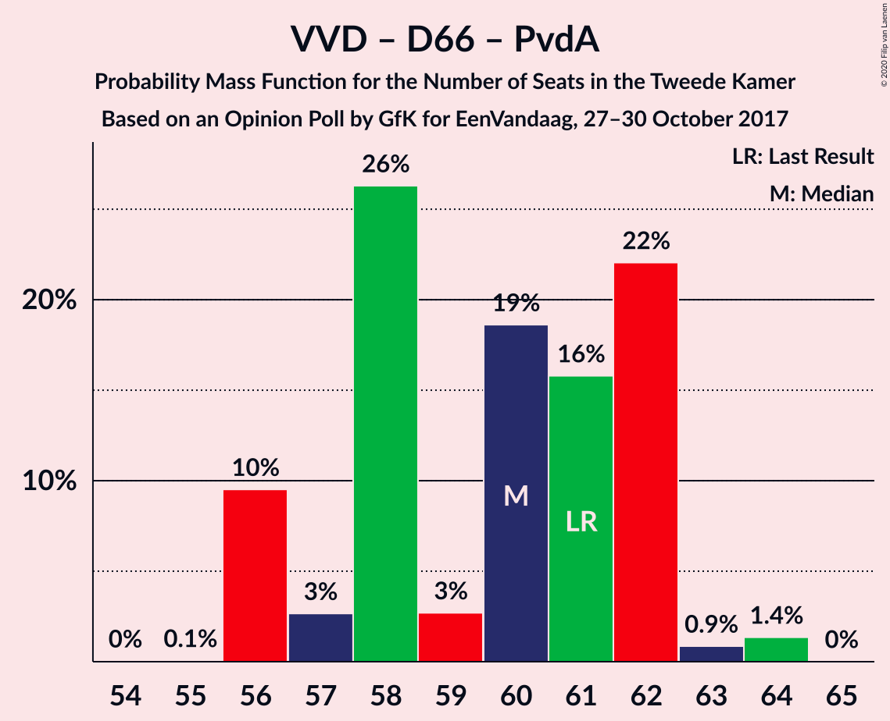

| Number of Seats | Probability | Accumulated | Special Marks |
|:---------------:|:-----------:|:-----------:|:-------------:|
| 55 | 0.1% | 100% |  |
| 56 | 1.1% | 99.9% |  |
| 57 | 0.2% | 98.8% |  |
| 58 | 59% | 98.6% | Median |
| 59 | 36% | 40% |  |
| 60 | 0.1% | 4% |  |
| 61 | 1.0% | 4% | Last Result |
| 62 | 0.1% | 3% |  |
| 63 | 0.4% | 3% |  |
| 64 | 2% | 2% |  |
| 65 | 0.1% | 0.1% |  |
| 66 | 0% | 0% |  |

### Volkspartij voor Vrijheid en Democratie – Christen-Democratisch Appèl – Forum voor Democratie – 50Plus – Staatkundig Gereformeerde Partij

| Number of Seats | Probability | Accumulated | Special Marks |
|:---------------:|:-----------:|:-----------:|:-------------:|
| 57 | 1.1% | 100% |  |
| 58 | 0.7% | 98.9% |  |
| 59 | 2% | 98% |  |
| 60 | 58% | 97% | Median |
| 61 | 0.2% | 39% | Last Result |
| 62 | 37% | 39% |  |
| 63 | 0.4% | 2% |  |
| 64 | 0.1% | 2% |  |
| 65 | 0% | 2% |  |
| 66 | 2% | 2% |  |
| 67 | 0% | 0% |  |

### Volkspartij voor Vrijheid en Democratie – Christen-Democratisch Appèl – Partij van de Arbeid

| Number of Seats | Probability | Accumulated | Special Marks |
|:---------------:|:-----------:|:-----------:|:-------------:|
| 53 | 0.2% | 100% |  |
| 54 | 0% | 99.8% |  |
| 55 | 0.1% | 99.8% |  |
| 56 | 0.4% | 99.7% |  |
| 57 | 3% | 99.3% |  |
| 58 | 36% | 96% |  |
| 59 | 58% | 61% | Median |
| 60 | 0.4% | 2% |  |
| 61 | 0% | 2% | Last Result |
| 62 | 0% | 2% |  |
| 63 | 2% | 2% |  |
| 64 | 0% | 0% |  |

### Volkspartij voor Vrijheid en Democratie – Christen-Democratisch Appèl – Forum voor Democratie – 50Plus

| Number of Seats | Probability | Accumulated | Special Marks |
|:---------------:|:-----------:|:-----------:|:-------------:|
| 54 | 1.0% | 100% |  |
| 55 | 0.8% | 99.0% |  |
| 56 | 0.9% | 98% |  |
| 57 | 58% | 97% | Median |
| 58 | 0.3% | 39% | Last Result |
| 59 | 37% | 39% |  |
| 60 | 0.1% | 2% |  |
| 61 | 0.3% | 2% |  |
| 62 | 0% | 2% |  |
| 63 | 2% | 2% |  |
| 64 | 0% | 0% |  |

### Volkspartij voor Vrijheid en Democratie – Christen-Democratisch Appèl – Forum voor Democratie – Staatkundig Gereformeerde Partij

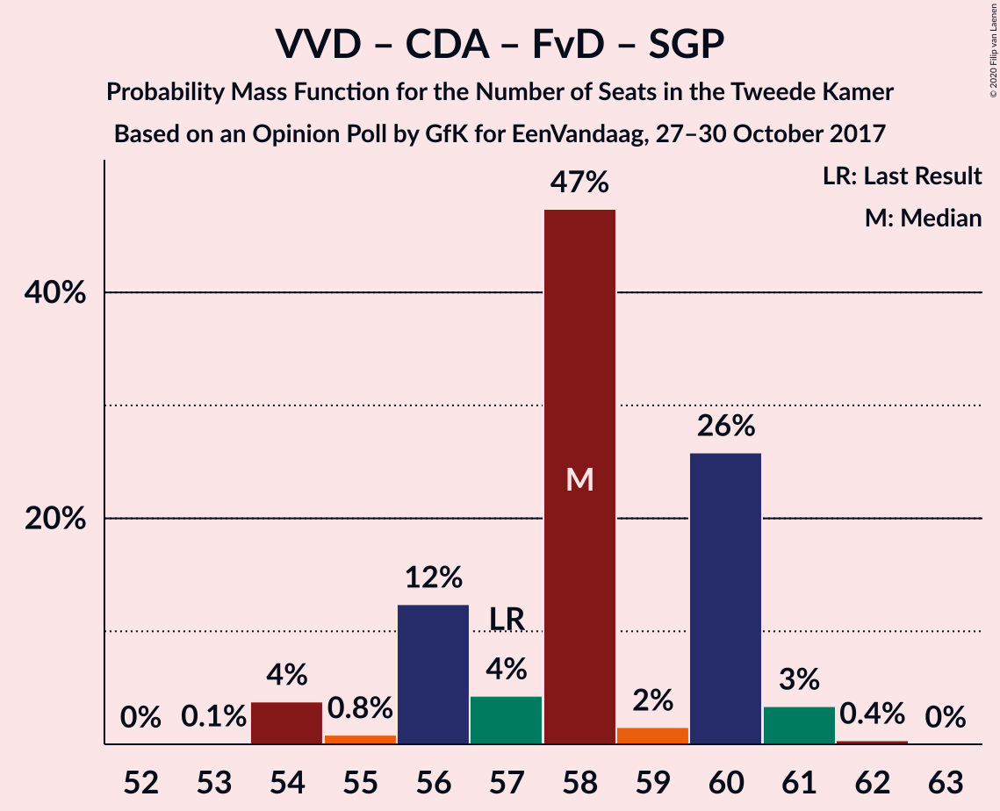

| Number of Seats | Probability | Accumulated | Special Marks |
|:---------------:|:-----------:|:-----------:|:-------------:|
| 53 | 0.3% | 100% |  |
| 54 | 2% | 99.7% |  |
| 55 | 0% | 98% |  |
| 56 | 0.8% | 98% |  |
| 57 | 59% | 97% | Last Result, Median |
| 58 | 35% | 38% |  |
| 59 | 1.3% | 3% |  |
| 60 | 0.1% | 2% |  |
| 61 | 0.1% | 2% |  |
| 62 | 2% | 2% |  |
| 63 | 0% | 0% |  |

### Volkspartij voor Vrijheid en Democratie – Christen-Democratisch Appèl – Forum voor Democratie

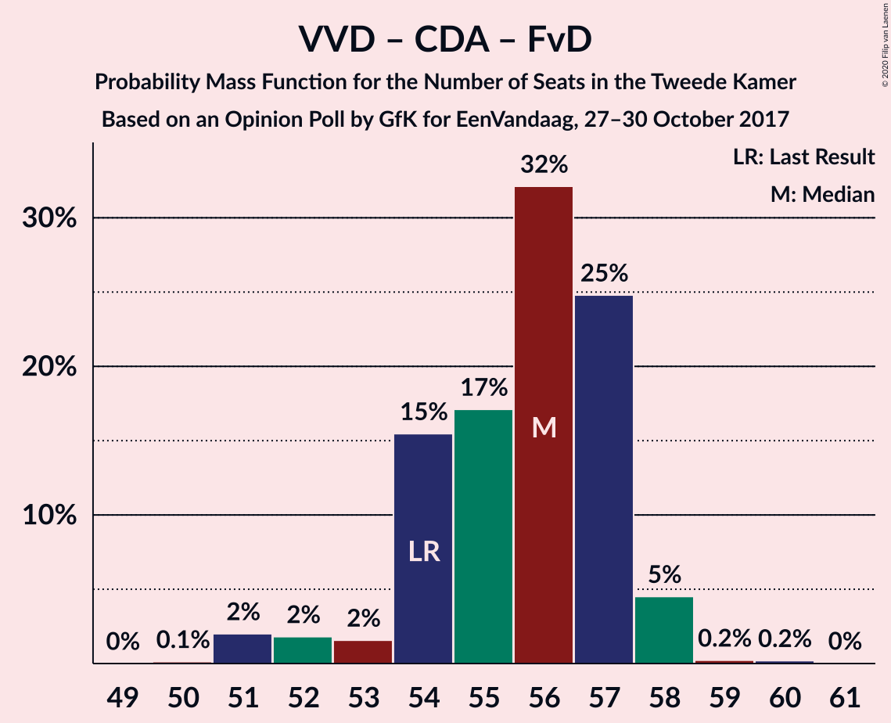

| Number of Seats | Probability | Accumulated | Special Marks |
|:---------------:|:-----------:|:-----------:|:-------------:|
| 50 | 0.2% | 100% |  |
| 51 | 2% | 99.8% |  |
| 52 | 0.4% | 98% |  |
| 53 | 0.3% | 98% |  |
| 54 | 60% | 98% | Last Result, Median |
| 55 | 35% | 38% |  |
| 56 | 1.1% | 3% |  |
| 57 | 0.3% | 2% |  |
| 58 | 0.1% | 2% |  |
| 59 | 2% | 2% |  |
| 60 | 0% | 0% |  |

### Volkspartij voor Vrijheid en Democratie – Christen-Democratisch Appèl

| Number of Seats | Probability | Accumulated | Special Marks |
|:---------------:|:-----------:|:-----------:|:-------------:|
| 42 | 1.0% | 100% |  |
| 43 | 0.2% | 99.0% |  |
| 44 | 0.3% | 98.8% |  |
| 45 | 2% | 98% |  |
| 46 | 36% | 97% |  |
| 47 | 59% | 61% | Median |
| 48 | 0.1% | 2% |  |
| 49 | 0.2% | 2% |  |
| 50 | 0.1% | 2% |  |
| 51 | 0% | 2% |  |
| 52 | 0% | 2% | Last Result |
| 53 | 2% | 2% |  |
| 54 | 0% | 0% |  |

### Democraten 66 – Christen-Democratisch Appèl – Partij van de Arbeid

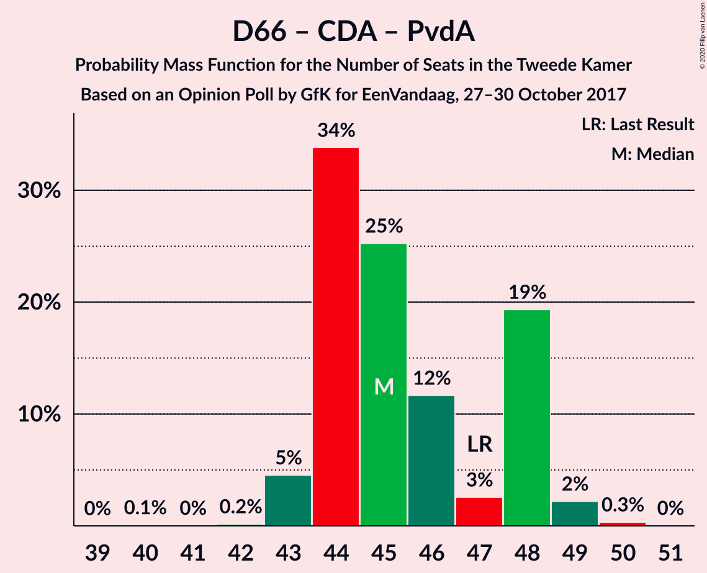

| Number of Seats | Probability | Accumulated | Special Marks |
|:---------------:|:-----------:|:-----------:|:-------------:|
| 40 | 0.1% | 100% |  |
| 41 | 0.2% | 99.9% |  |
| 42 | 0.1% | 99.7% |  |
| 43 | 36% | 99.7% |  |
| 44 | 1.0% | 63% |  |
| 45 | 58% | 62% | Median |
| 46 | 0.9% | 4% |  |
| 47 | 1.4% | 3% | Last Result |
| 48 | 0.4% | 2% |  |
| 49 | 0.8% | 1.1% |  |
| 50 | 0.4% | 0.4% |  |
| 51 | 0% | 0% |  |

### Volkspartij voor Vrijheid en Democratie – Partij van de Arbeid

| Number of Seats | Probability | Accumulated | Special Marks |
|:---------------:|:-----------:|:-----------:|:-------------:|
| 38 | 1.2% | 100% |  |
| 39 | 0.2% | 98.8% |  |
| 40 | 0.5% | 98.7% |  |
| 41 | 1.1% | 98% |  |
| 42 | 58% | 97% | Last Result, Median |
| 43 | 36% | 39% |  |
| 44 | 1.3% | 3% |  |
| 45 | 0.2% | 2% |  |
| 46 | 0% | 2% |  |
| 47 | 2% | 2% |  |
| 48 | 0% | 0% |  |

### Christen-Democratisch Appèl – Partij van de Arbeid – ChristenUnie

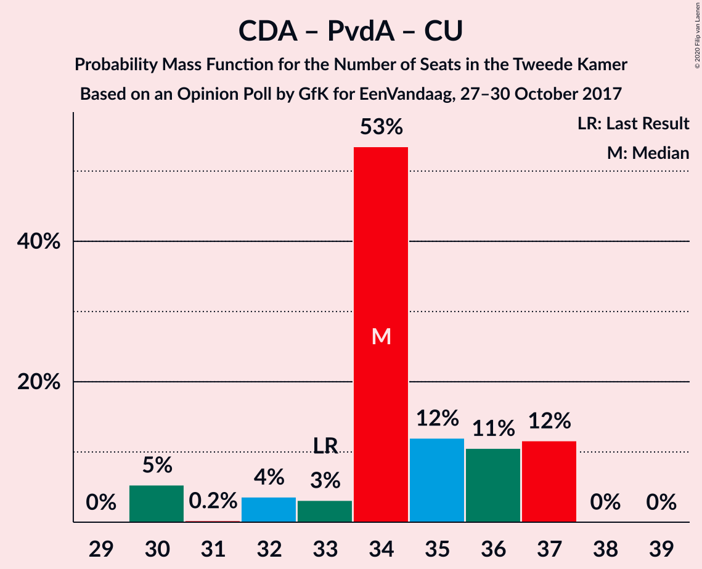

| Number of Seats | Probability | Accumulated | Special Marks |
|:---------------:|:-----------:|:-----------:|:-------------:|
| 29 | 0.2% | 100% |  |
| 30 | 0.1% | 99.8% |  |
| 31 | 1.1% | 99.7% |  |
| 32 | 2% | 98.6% |  |
| 33 | 36% | 97% | Last Result |
| 34 | 59% | 61% | Median |
| 35 | 2% | 3% |  |
| 36 | 0.1% | 0.9% |  |
| 37 | 0.8% | 0.8% |  |
| 38 | 0.1% | 0.1% |  |
| 39 | 0% | 0% |  |

### Democraten 66 – Christen-Democratisch Appèl

| Number of Seats | Probability | Accumulated | Special Marks |
|:---------------:|:-----------:|:-----------:|:-------------:|
| 28 | 0% | 100% |  |
| 29 | 0% | 99.9% |  |
| 30 | 1.0% | 99.9% |  |
| 31 | 35% | 98.9% |  |
| 32 | 0.7% | 64% |  |
| 33 | 60% | 64% | Median |
| 34 | 0.5% | 3% |  |
| 35 | 0.2% | 2% |  |
| 36 | 0.9% | 2% |  |
| 37 | 1.4% | 1.4% |  |
| 38 | 0% | 0% | Last Result |

### Christen-Democratisch Appèl – Partij van de Arbeid

| Number of Seats | Probability | Accumulated | Special Marks |
|:---------------:|:-----------:|:-----------:|:-------------:|
| 24 | 0.3% | 100% |  |
| 25 | 0.1% | 99.7% |  |
| 26 | 2% | 99.6% |  |
| 27 | 36% | 98% |  |
| 28 | 2% | 62% | Last Result |
| 29 | 59% | 60% | Median |
| 30 | 0.7% | 1.3% |  |
| 31 | 0.6% | 0.6% |  |
| 32 | 0% | 0% |  |

## Technical Information

### Opinion Poll

+ **Polling firm:** GfK
+ **Commissioner(s):** EenVandaag
+ **Fieldwork period:** 27–30 October 2017

### Calculations

+ **Sample size:** 2022
+ **Simulations done:** 131,072
+ **Error estimate:** 1.71%

