# Opinion Poll by I&O Research, 30 October 2017

<a href="#voting-intentions">Voting Intentions</a> | <a href="#seats">Seats</a> | <a href="#coalitions">Coalitions</a> | <a href="#technical-information">Technical Information</a>

## Voting Intentions

### Confidence Intervals

| Party | Last Result | Poll Result | 80% Confidence Interval | 90% Confidence Interval | 95% Confidence Interval | 99% Confidence Interval |
|:-----:|:-----------:|:-----------:|:-----------------------:|:-----------------------:|:-----------------------:|:-----------------------:|
| Volkspartij voor Vrijheid en Democratie | 21.3% | 19.2% | 17.9–20.6% |17.5–21.0% |17.2–21.4% |16.6–22.1% |
| Partij voor de Vrijheid | 13.1% | 11.9% | 10.9–13.2% |10.6–13.5% |10.3–13.8% |9.8–14.4% |
| Democraten 66 | 12.2% | 11.7% | 10.7–12.9% |10.4–13.3% |10.1–13.6% |9.6–14.2% |
| GroenLinks | 9.1% | 10.3% | 9.3–11.4% |9.0–11.8% |8.8–12.1% |8.3–12.6% |
| Christen-Democratisch Appèl | 12.4% | 9.5% | 8.5–10.6% |8.3–10.9% |8.0–11.2% |7.6–11.7% |
| Forum voor Democratie | 1.8% | 7.4% | 6.5–8.4% |6.3–8.7% |6.1–8.9% |5.7–9.4% |
| Socialistische Partij | 9.1% | 7.1% | 6.3–8.1% |6.0–8.4% |5.8–8.6% |5.5–9.1% |
| Partij van de Arbeid | 5.7% | 6.9% | 6.1–7.8% |5.8–8.1% |5.6–8.4% |5.3–8.9% |
| ChristenUnie | 3.4% | 4.4% | 3.8–5.2% |3.6–5.4% |3.4–5.7% |3.1–6.1% |
| Partij voor de Dieren | 3.2% | 3.5% | 2.9–4.3% |2.8–4.5% |2.7–4.6% |2.4–5.0% |
| 50Plus | 3.1% | 3.4% | 2.9–4.2% |2.7–4.4% |2.6–4.6% |2.3–4.9% |
| Staatkundig Gereformeerde Partij | 2.1% | 2.5% | 2.1–3.2% |1.9–3.4% |1.8–3.5% |1.6–3.9% |
| DENK | 2.1% | 1.6% | 1.2–2.1% |1.1–2.3% |1.0–2.4% |0.9–2.7% |

*Note:* The poll result column reflects the actual value used in the calculations. Published results may vary slightly, and in addition be rounded to fewer digits.

## Seats

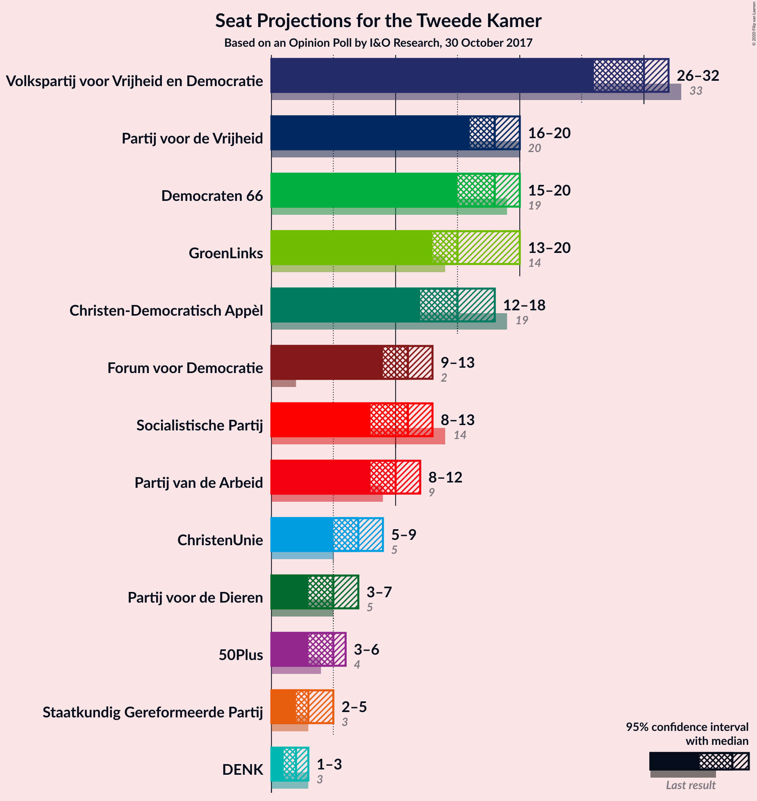

### Confidence Intervals

| Party | Last Result | Median | 80% Confidence Interval | 90% Confidence Interval | 95% Confidence Interval | 99% Confidence Interval |
|:-----:|:-----------:|:------:|:-----------------------:|:-----------------------:|:-----------------------:|:-----------------------:|
| <a href="#volkspartij-voor-vrijheid-en-democratie">Volkspartij voor Vrijheid en Democratie</a> | 33 | 30 | 29–30 |29–30 |29–31 |26–32 |
| <a href="#partij-voor-de-vrijheid">Partij voor de Vrijheid</a> | 20 | 16 | 16–18 |16–18 |16–18 |14–20 |
| <a href="#democraten-66">Democraten 66</a> | 19 | 20 | 20–21 |18–21 |16–21 |14–21 |
| <a href="#groenlinks">GroenLinks</a> | 14 | 15 | 15 |15–16 |14–17 |14–19 |
| <a href="#christen-democratisch-appèl">Christen-Democratisch Appèl</a> | 19 | 15 | 12–15 |12–15 |12–16 |12–17 |
| <a href="#forum-voor-democratie">Forum voor Democratie</a> | 2 | 11 | 11 |11–12 |10–15 |9–15 |
| <a href="#socialistische-partij">Socialistische Partij</a> | 14 | 10 | 10–13 |10–13 |10–13 |9–13 |
| <a href="#partij-van-de-arbeid">Partij van de Arbeid</a> | 9 | 8 | 8–10 |8–10 |8–11 |8–13 |
| <a href="#christenunie">ChristenUnie</a> | 5 | 8 | 7–8 |7–8 |6–8 |5–8 |
| <a href="#partij-voor-de-dieren">Partij voor de Dieren</a> | 5 | 7 | 4–7 |4–7 |4–7 |4–7 |
| <a href="#50plus">50Plus</a> | 4 | 5 | 4–5 |4–6 |4–6 |3–7 |
| <a href="#staatkundig-gereformeerde-partij">Staatkundig Gereformeerde Partij</a> | 3 | 3 | 3–4 |3–4 |3–4 |2–5 |
| <a href="#denk">DENK</a> | 3 | 2 | 2 |2 |2 |1–3 |

### Volkspartij voor Vrijheid en Democratie

*For a full overview of the results for this party, see the [Volkspartij voor Vrijheid en Democratie](party-volkspartijvoorvrijheidendemocratie.html) page.*

| Number of Seats | Probability | Accumulated | Special Marks |
|:---------------:|:-----------:|:-----------:|:-------------:|
| 25 | 0% | 100% |  |
| 26 | 1.1% | 99.9% |  |
| 27 | 0.8% | 98.8% |  |
| 28 | 0.1% | 98% |  |
| 29 | 19% | 98% |  |
| 30 | 76% | 79% | Median |
| 31 | 2% | 3% |  |
| 32 | 0.8% | 1.0% |  |
| 33 | 0.1% | 0.2% | Last Result |
| 34 | 0% | 0.1% |  |
| 35 | 0.1% | 0.1% |  |
| 36 | 0% | 0% |  |

### Partij voor de Vrijheid

*For a full overview of the results for this party, see the [Partij voor de Vrijheid](party-partijvoordevrijheid.html) page.*

| Number of Seats | Probability | Accumulated | Special Marks |
|:---------------:|:-----------:|:-----------:|:-------------:|
| 14 | 0.5% | 100% |  |
| 15 | 0.7% | 99.5% |  |
| 16 | 76% | 98.8% | Median |
| 17 | 4% | 23% |  |
| 18 | 17% | 19% |  |
| 19 | 0.9% | 2% |  |
| 20 | 0.6% | 0.7% | Last Result |
| 21 | 0.1% | 0.1% |  |
| 22 | 0% | 0% |  |

### Democraten 66

*For a full overview of the results for this party, see the [Democraten 66](party-democraten66.html) page.*

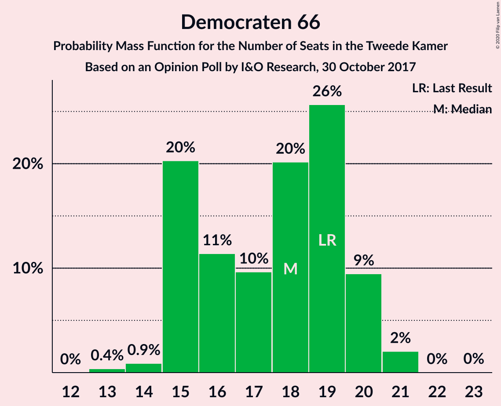

| Number of Seats | Probability | Accumulated | Special Marks |
|:---------------:|:-----------:|:-----------:|:-------------:|
| 14 | 0.6% | 100% |  |
| 15 | 0.9% | 99.4% |  |
| 16 | 2% | 98% |  |
| 17 | 0.3% | 96% |  |
| 18 | 3% | 96% |  |
| 19 | 1.0% | 93% | Last Result |
| 20 | 74% | 92% | Median |
| 21 | 17% | 18% |  |
| 22 | 0% | 0.5% |  |
| 23 | 0.4% | 0.4% |  |
| 24 | 0% | 0% |  |

### GroenLinks

*For a full overview of the results for this party, see the [GroenLinks](party-groenlinks.html) page.*

| Number of Seats | Probability | Accumulated | Special Marks |
|:---------------:|:-----------:|:-----------:|:-------------:|
| 12 | 0.1% | 100% |  |
| 13 | 0.3% | 99.9% |  |
| 14 | 3% | 99.7% | Last Result |
| 15 | 91% | 96% | Median |
| 16 | 1.2% | 5% |  |
| 17 | 2% | 4% |  |
| 18 | 1.4% | 2% |  |
| 19 | 0.3% | 0.7% |  |
| 20 | 0.4% | 0.4% |  |
| 21 | 0% | 0% |  |

### Christen-Democratisch Appèl

*For a full overview of the results for this party, see the [Christen-Democratisch Appèl](party-christen-democratischappèl.html) page.*

| Number of Seats | Probability | Accumulated | Special Marks |
|:---------------:|:-----------:|:-----------:|:-------------:|
| 11 | 0.1% | 100% |  |
| 12 | 19% | 99.9% |  |
| 13 | 0.5% | 81% |  |
| 14 | 2% | 81% |  |
| 15 | 76% | 79% | Median |
| 16 | 2% | 3% |  |
| 17 | 0.1% | 0.6% |  |
| 18 | 0.1% | 0.5% |  |
| 19 | 0% | 0.4% | Last Result |
| 20 | 0.3% | 0.3% |  |
| 21 | 0% | 0% |  |

### Forum voor Democratie

*For a full overview of the results for this party, see the [Forum voor Democratie](party-forumvoordemocratie.html) page.*

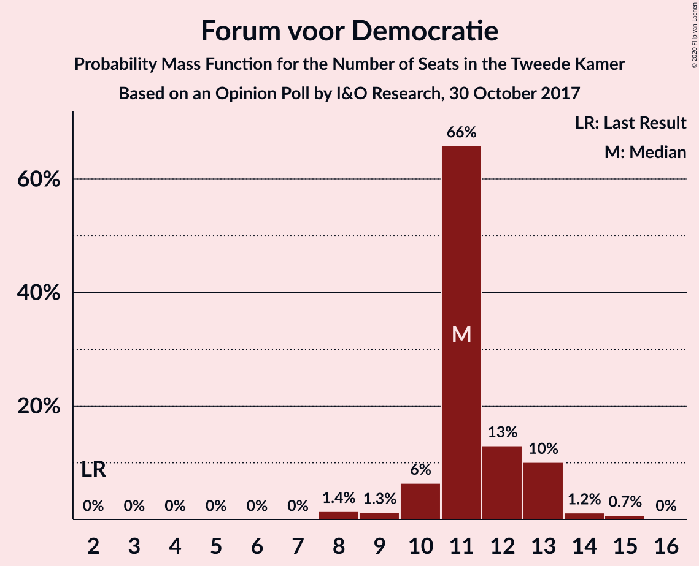

| Number of Seats | Probability | Accumulated | Special Marks |
|:---------------:|:-----------:|:-----------:|:-------------:|
| 2 | 0% | 100% | Last Result |
| 3 | 0% | 100% |  |
| 4 | 0% | 100% |  |
| 5 | 0% | 100% |  |
| 6 | 0% | 100% |  |
| 7 | 0% | 100% |  |
| 8 | 0.2% | 100% |  |
| 9 | 2% | 99.8% |  |
| 10 | 2% | 98% |  |
| 11 | 92% | 97% | Median |
| 12 | 1.2% | 5% |  |
| 13 | 1.0% | 4% |  |
| 14 | 0.1% | 3% |  |
| 15 | 3% | 3% |  |
| 16 | 0% | 0% |  |

### Socialistische Partij

*For a full overview of the results for this party, see the [Socialistische Partij](party-socialistischepartij.html) page.*

| Number of Seats | Probability | Accumulated | Special Marks |
|:---------------:|:-----------:|:-----------:|:-------------:|
| 8 | 0.2% | 100% |  |
| 9 | 2% | 99.8% |  |
| 10 | 76% | 98% | Median |
| 11 | 3% | 22% |  |
| 12 | 0.9% | 19% |  |
| 13 | 17% | 18% |  |
| 14 | 0.3% | 0.4% | Last Result |
| 15 | 0.1% | 0.1% |  |
| 16 | 0% | 0% |  |

### Partij van de Arbeid

*For a full overview of the results for this party, see the [Partij van de Arbeid](party-partijvandearbeid.html) page.*

| Number of Seats | Probability | Accumulated | Special Marks |
|:---------------:|:-----------:|:-----------:|:-------------:|
| 8 | 76% | 100% | Median |
| 9 | 2% | 24% | Last Result |
| 10 | 18% | 22% |  |
| 11 | 3% | 4% |  |
| 12 | 1.1% | 2% |  |
| 13 | 0.6% | 0.6% |  |
| 14 | 0% | 0% |  |

### ChristenUnie

*For a full overview of the results for this party, see the [ChristenUnie](party-christenunie.html) page.*

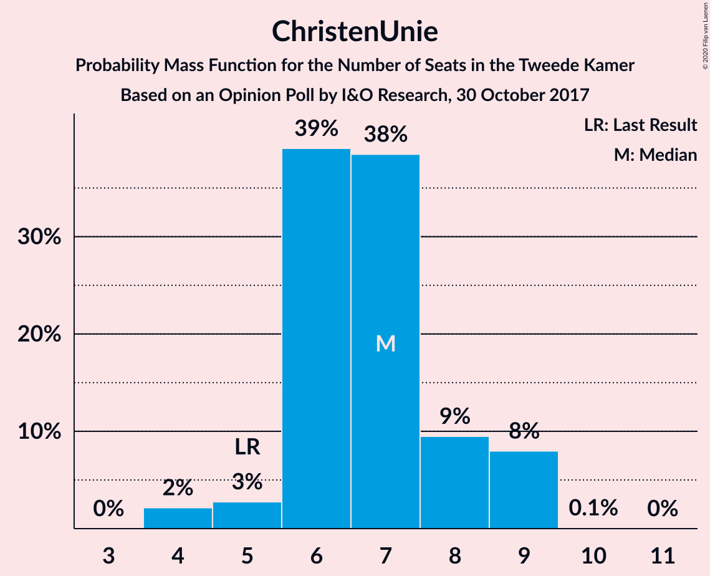

| Number of Seats | Probability | Accumulated | Special Marks |
|:---------------:|:-----------:|:-----------:|:-------------:|
| 4 | 0% | 100% |  |
| 5 | 0.9% | 99.9% | Last Result |
| 6 | 3% | 99.1% |  |
| 7 | 20% | 97% |  |
| 8 | 76% | 76% | Median |
| 9 | 0.3% | 0.3% |  |
| 10 | 0% | 0% |  |

### Partij voor de Dieren

*For a full overview of the results for this party, see the [Partij voor de Dieren](party-partijvoordedieren.html) page.*

| Number of Seats | Probability | Accumulated | Special Marks |
|:---------------:|:-----------:|:-----------:|:-------------:|
| 3 | 0.4% | 100% |  |
| 4 | 20% | 99.6% |  |
| 5 | 3% | 79% | Last Result |
| 6 | 2% | 76% |  |
| 7 | 74% | 74% | Median |
| 8 | 0% | 0% |  |

### 50Plus

*For a full overview of the results for this party, see the [50Plus](party-50plus.html) page.*

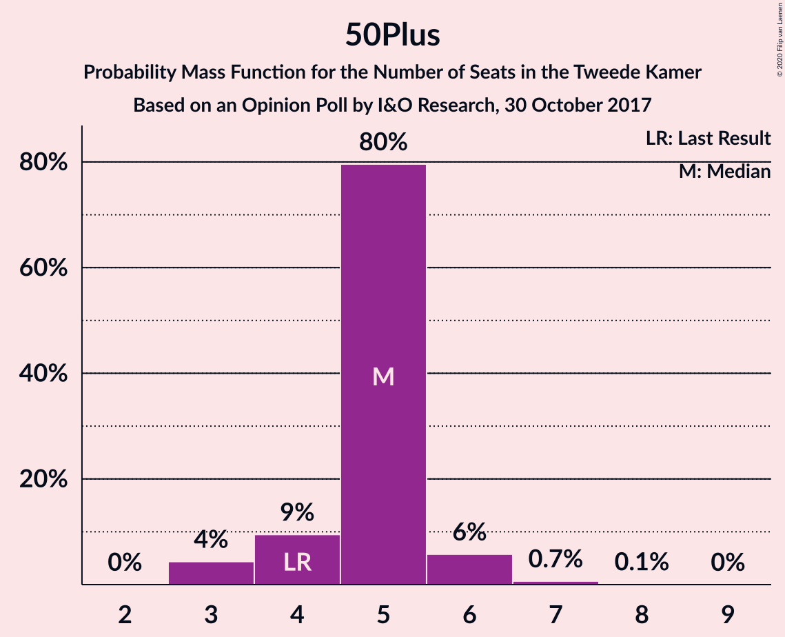

| Number of Seats | Probability | Accumulated | Special Marks |
|:---------------:|:-----------:|:-----------:|:-------------:|
| 3 | 0.6% | 100% |  |
| 4 | 19% | 99.4% | Last Result |
| 5 | 76% | 81% | Median |
| 6 | 4% | 5% |  |
| 7 | 0.9% | 1.0% |  |
| 8 | 0.1% | 0.1% |  |
| 9 | 0% | 0% |  |

### Staatkundig Gereformeerde Partij

*For a full overview of the results for this party, see the [Staatkundig Gereformeerde Partij](party-staatkundiggereformeerdepartij.html) page.*

| Number of Seats | Probability | Accumulated | Special Marks |
|:---------------:|:-----------:|:-----------:|:-------------:|
| 2 | 1.1% | 100% |  |
| 3 | 77% | 98.9% | Last Result, Median |
| 4 | 21% | 22% |  |
| 5 | 1.4% | 1.5% |  |
| 6 | 0.1% | 0.1% |  |
| 7 | 0% | 0% |  |

### DENK

*For a full overview of the results for this party, see the [DENK](party-denk.html) page.*

| Number of Seats | Probability | Accumulated | Special Marks |
|:---------------:|:-----------:|:-----------:|:-------------:|
| 1 | 2% | 100% |  |
| 2 | 97% | 98% | Median |
| 3 | 1.2% | 1.3% | Last Result |
| 4 | 0.2% | 0.2% |  |
| 5 | 0% | 0% |  |

## Coalitions

### Confidence Intervals

| Coalition | Last Result | Median | Majority? | 80% Confidence Interval | 90% Confidence Interval | 95% Confidence Interval | 99% Confidence Interval |
|:---------:|:-----------:|:------:|:---------:|:-----------------------:|:-----------------------:|:-----------------------:|:-----------------------:|
| Volkspartij voor Vrijheid en Democratie – Democraten 66 – GroenLinks – Christen-Democratisch Appèl – ChristenUnie | 90 | 88 | 100% | 84–88 | 84–88 | 83–88 | 80–89 |
| Volkspartij voor Vrijheid en Democratie – Democraten 66 – Christen-Democratisch Appèl – Partij van de Arbeid – ChristenUnie | 85 | 81 | 98% | 79–81 | 77–81 | 77–81 | 75–84 |
| Volkspartij voor Vrijheid en Democratie – Partij voor de Vrijheid – Christen-Democratisch Appèl – Forum voor Democratie – Staatkundig Gereformeerde Partij | 77 | 75 | 5% | 74–75 | 74–76 | 74–79 | 71–82 |
| Democraten 66 – GroenLinks – Christen-Democratisch Appèl – Socialistische Partij – Partij van de Arbeid – ChristenUnie | 80 | 76 | 95% | 76–78 | 75–78 | 72–78 | 71–81 |
| Volkspartij voor Vrijheid en Democratie – Partij voor de Vrijheid – Christen-Democratisch Appèl – Forum voor Democratie | 74 | 72 | 3% | 70–72 | 70–72 | 70–76 | 68–78 |
| Volkspartij voor Vrijheid en Democratie – Democraten 66 – Christen-Democratisch Appèl – ChristenUnie | 76 | 73 | 0.3% | 69–73 | 69–73 | 67–73 | 64–73 |
| Volkspartij voor Vrijheid en Democratie – Christen-Democratisch Appèl – Forum voor Democratie – 50Plus – Staatkundig Gereformeerde Partij | 61 | 64 | 0% | 60–64 | 60–65 | 60–69 | 58–71 |
| Democraten 66 – GroenLinks – Christen-Democratisch Appèl – Partij van de Arbeid – ChristenUnie | 66 | 66 | 0% | 65–66 | 65–66 | 61–67 | 61–70 |
| Volkspartij voor Vrijheid en Democratie – Democraten 66 – Christen-Democratisch Appèl | 71 | 65 | 0% | 62–65 | 62–65 | 59–65 | 57–66 |
| Volkspartij voor Vrijheid en Democratie – Christen-Democratisch Appèl – Forum voor Democratie – 50Plus | 58 | 61 | 0% | 56–61 | 56–61 | 56–64 | 55–67 |
| Volkspartij voor Vrijheid en Democratie – Partij voor de Vrijheid – Christen-Democratisch Appèl | 72 | 61 | 0% | 59–61 | 59–61 | 59–63 | 56–66 |
| Volkspartij voor Vrijheid en Democratie – Christen-Democratisch Appèl – Forum voor Democratie – Staatkundig Gereformeerde Partij | 57 | 59 | 0% | 56–59 | 56–59 | 56–63 | 53–65 |
| Volkspartij voor Vrijheid en Democratie – Democraten 66 – Partij van de Arbeid | 61 | 58 | 0% | 58–60 | 57–60 | 54–60 | 53–62 |
| Volkspartij voor Vrijheid en Democratie – Christen-Democratisch Appèl – Forum voor Democratie | 54 | 56 | 0% | 52–56 | 52–56 | 52–58 | 50–61 |
| Volkspartij voor Vrijheid en Democratie – Christen-Democratisch Appèl – Partij van de Arbeid | 61 | 53 | 0% | 51–53 | 51–54 | 51–54 | 50–58 |
| Volkspartij voor Vrijheid en Democratie – Christen-Democratisch Appèl | 52 | 45 | 0% | 41–45 | 41–45 | 41–46 | 40–48 |
| Democraten 66 – Christen-Democratisch Appèl – Partij van de Arbeid | 47 | 43 | 0% | 43 | 42–43 | 40–44 | 37–47 |
| Volkspartij voor Vrijheid en Democratie – Partij van de Arbeid | 42 | 38 | 0% | 38–39 | 38–39 | 38–41 | 35–43 |
| Democraten 66 – Christen-Democratisch Appèl | 38 | 35 | 0% | 33–35 | 32–35 | 32–35 | 27–35 |
| Christen-Democratisch Appèl – Partij van de Arbeid – ChristenUnie | 33 | 31 | 0% | 29–31 | 29–31 | 29–32 | 29–36 |
| Christen-Democratisch Appèl – Partij van de Arbeid | 28 | 23 | 0% | 22–23 | 22–24 | 22–25 | 22–28 |

### Volkspartij voor Vrijheid en Democratie – Democraten 66 – GroenLinks – Christen-Democratisch Appèl – ChristenUnie

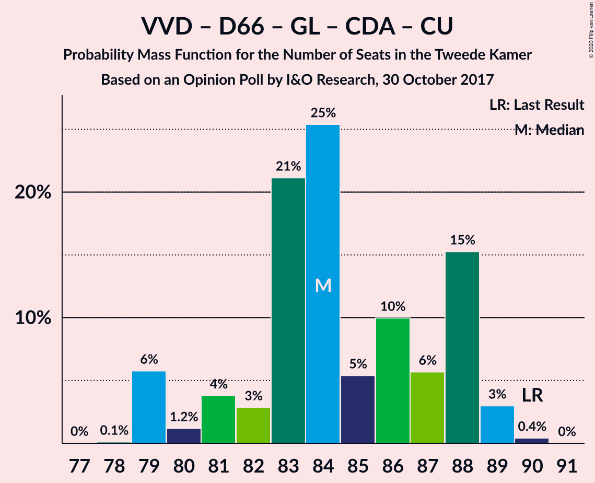

| Number of Seats | Probability | Accumulated | Special Marks |
|:---------------:|:-----------:|:-----------:|:-------------:|
| 78 | 0.3% | 100% |  |
| 79 | 0.2% | 99.7% |  |
| 80 | 0.2% | 99.5% |  |
| 81 | 0% | 99.4% |  |
| 82 | 2% | 99.4% |  |
| 83 | 2% | 98% |  |
| 84 | 18% | 95% |  |
| 85 | 0.6% | 77% |  |
| 86 | 0.8% | 77% |  |
| 87 | 0.8% | 76% |  |
| 88 | 75% | 75% | Median |
| 89 | 0.3% | 0.7% |  |
| 90 | 0.3% | 0.4% | Last Result |
| 91 | 0% | 0% |  |

### Volkspartij voor Vrijheid en Democratie – Democraten 66 – Christen-Democratisch Appèl – Partij van de Arbeid – ChristenUnie

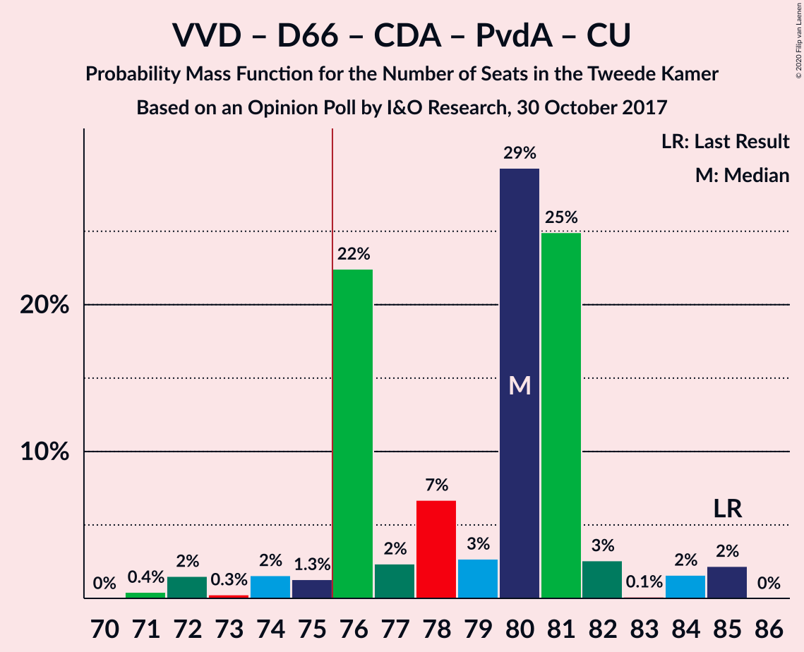

| Number of Seats | Probability | Accumulated | Special Marks |
|:---------------:|:-----------:|:-----------:|:-------------:|
| 73 | 0% | 100% |  |
| 74 | 0% | 99.9% |  |
| 75 | 2% | 99.9% |  |
| 76 | 0.9% | 98% | Majority |
| 77 | 3% | 98% |  |
| 78 | 0.4% | 95% |  |
| 79 | 18% | 95% |  |
| 80 | 1.0% | 77% |  |
| 81 | 74% | 76% | Median |
| 82 | 0.8% | 1.5% |  |
| 83 | 0.2% | 0.7% |  |
| 84 | 0.1% | 0.5% |  |
| 85 | 0% | 0.4% | Last Result |
| 86 | 0% | 0.4% |  |
| 87 | 0.3% | 0.3% |  |
| 88 | 0% | 0% |  |

### Volkspartij voor Vrijheid en Democratie – Partij voor de Vrijheid – Christen-Democratisch Appèl – Forum voor Democratie – Staatkundig Gereformeerde Partij

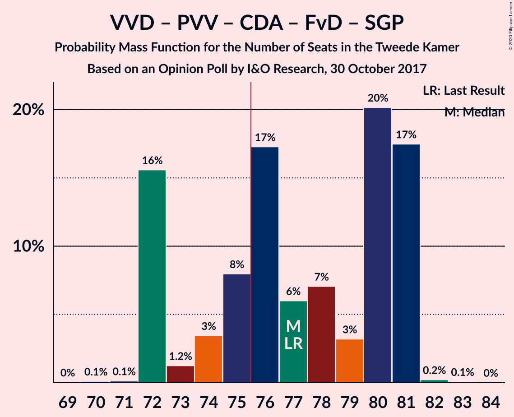

| Number of Seats | Probability | Accumulated | Special Marks |
|:---------------:|:-----------:|:-----------:|:-------------:|
| 69 | 0.3% | 100% |  |
| 70 | 0.1% | 99.7% |  |
| 71 | 0.7% | 99.6% |  |
| 72 | 0.8% | 98.9% |  |
| 73 | 0.4% | 98% |  |
| 74 | 18% | 98% |  |
| 75 | 74% | 80% | Median |
| 76 | 0.5% | 5% | Majority |
| 77 | 1.5% | 5% | Last Result |
| 78 | 0.9% | 3% |  |
| 79 | 0.2% | 3% |  |
| 80 | 0% | 2% |  |
| 81 | 0.4% | 2% |  |
| 82 | 2% | 2% |  |
| 83 | 0% | 0.1% |  |
| 84 | 0.1% | 0.1% |  |
| 85 | 0% | 0% |  |

### Democraten 66 – GroenLinks – Christen-Democratisch Appèl – Socialistische Partij – Partij van de Arbeid – ChristenUnie

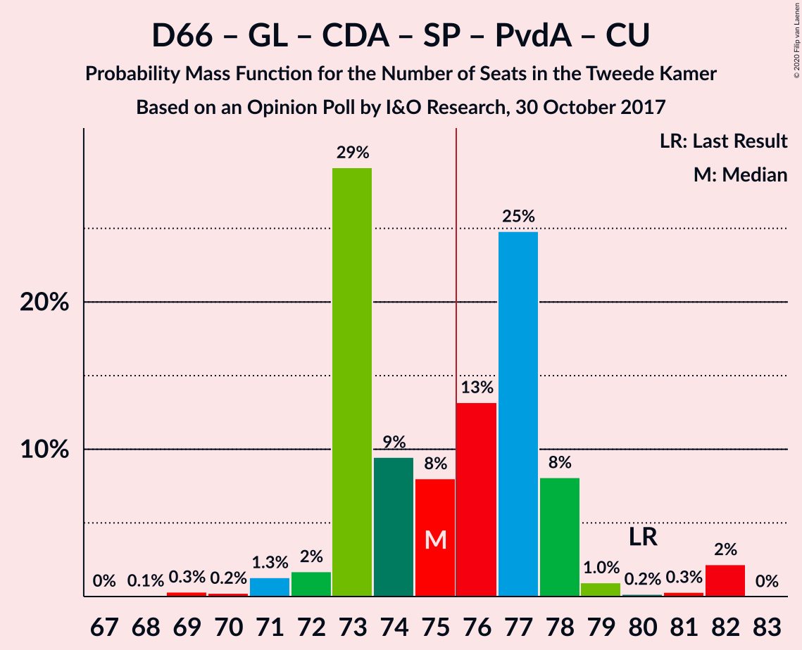

| Number of Seats | Probability | Accumulated | Special Marks |
|:---------------:|:-----------:|:-----------:|:-------------:|
| 69 | 0.1% | 100% |  |
| 70 | 0% | 99.9% |  |
| 71 | 0.7% | 99.9% |  |
| 72 | 2% | 99.2% |  |
| 73 | 0.9% | 97% |  |
| 74 | 0.3% | 96% |  |
| 75 | 1.2% | 96% |  |
| 76 | 74% | 95% | Median, Majority |
| 77 | 0.6% | 21% |  |
| 78 | 18% | 20% |  |
| 79 | 1.1% | 2% |  |
| 80 | 0.5% | 1.3% | Last Result |
| 81 | 0.6% | 0.7% |  |
| 82 | 0% | 0.1% |  |
| 83 | 0% | 0.1% |  |
| 84 | 0% | 0.1% |  |
| 85 | 0.1% | 0.1% |  |
| 86 | 0% | 0% |  |

### Volkspartij voor Vrijheid en Democratie – Partij voor de Vrijheid – Christen-Democratisch Appèl – Forum voor Democratie

| Number of Seats | Probability | Accumulated | Special Marks |
|:---------------:|:-----------:|:-----------:|:-------------:|
| 65 | 0.3% | 100% |  |
| 66 | 0% | 99.7% |  |
| 67 | 0% | 99.7% |  |
| 68 | 0.6% | 99.7% |  |
| 69 | 1.0% | 99.1% |  |
| 70 | 18% | 98% |  |
| 71 | 1.3% | 80% |  |
| 72 | 75% | 79% | Median |
| 73 | 0.6% | 4% |  |
| 74 | 0.8% | 4% | Last Result |
| 75 | 0.5% | 3% |  |
| 76 | 0.1% | 3% | Majority |
| 77 | 0.1% | 2% |  |
| 78 | 2% | 2% |  |
| 79 | 0% | 0.1% |  |
| 80 | 0.1% | 0.1% |  |
| 81 | 0% | 0% |  |

### Volkspartij voor Vrijheid en Democratie – Democraten 66 – Christen-Democratisch Appèl – ChristenUnie

| Number of Seats | Probability | Accumulated | Special Marks |
|:---------------:|:-----------:|:-----------:|:-------------:|
| 62 | 0.1% | 100% |  |
| 63 | 0% | 99.9% |  |
| 64 | 2% | 99.9% |  |
| 65 | 0.2% | 98% |  |
| 66 | 0.4% | 98% |  |
| 67 | 0.8% | 98% |  |
| 68 | 0.8% | 97% |  |
| 69 | 20% | 96% |  |
| 70 | 0.1% | 76% |  |
| 71 | 1.0% | 76% |  |
| 72 | 0.5% | 75% |  |
| 73 | 74% | 74% | Median |
| 74 | 0% | 0.4% |  |
| 75 | 0% | 0.4% |  |
| 76 | 0.3% | 0.3% | Last Result, Majority |
| 77 | 0% | 0% |  |

### Volkspartij voor Vrijheid en Democratie – Christen-Democratisch Appèl – Forum voor Democratie – 50Plus – Staatkundig Gereformeerde Partij

| Number of Seats | Probability | Accumulated | Special Marks |
|:---------------:|:-----------:|:-----------:|:-------------:|
| 58 | 0.8% | 100% |  |
| 59 | 0.8% | 99.1% |  |
| 60 | 18% | 98% |  |
| 61 | 0.3% | 81% | Last Result |
| 62 | 0.5% | 80% |  |
| 63 | 0.6% | 80% |  |
| 64 | 74% | 79% | Median |
| 65 | 0.5% | 5% |  |
| 66 | 1.1% | 5% |  |
| 67 | 0.1% | 3% |  |
| 68 | 0.8% | 3% |  |
| 69 | 0.5% | 3% |  |
| 70 | 0% | 2% |  |
| 71 | 2% | 2% |  |
| 72 | 0% | 0.1% |  |
| 73 | 0.1% | 0.1% |  |
| 74 | 0% | 0% |  |

### Democraten 66 – GroenLinks – Christen-Democratisch Appèl – Partij van de Arbeid – ChristenUnie

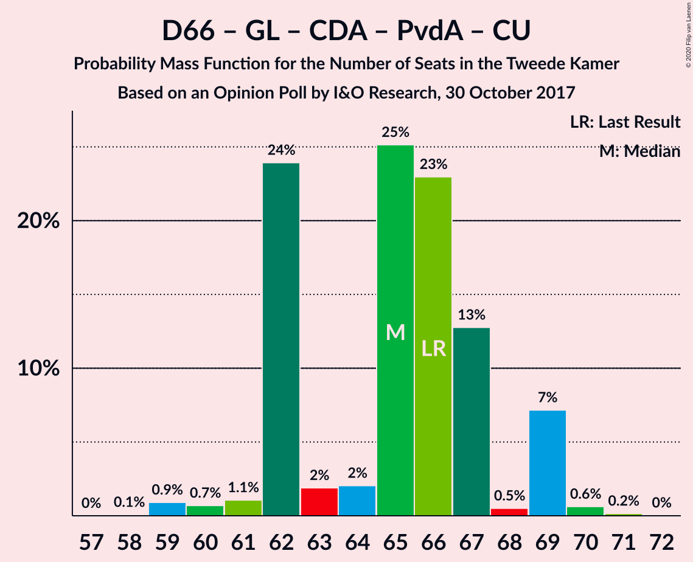

| Number of Seats | Probability | Accumulated | Special Marks |
|:---------------:|:-----------:|:-----------:|:-------------:|
| 59 | 0.1% | 100% |  |
| 60 | 0.3% | 99.9% |  |
| 61 | 2% | 99.6% |  |
| 62 | 0.6% | 97% |  |
| 63 | 0% | 97% |  |
| 64 | 0.9% | 97% |  |
| 65 | 19% | 96% |  |
| 66 | 74% | 77% | Last Result, Median |
| 67 | 1.4% | 3% |  |
| 68 | 0.1% | 2% |  |
| 69 | 0.4% | 2% |  |
| 70 | 1.2% | 1.4% |  |
| 71 | 0% | 0.1% |  |
| 72 | 0.1% | 0.1% |  |
| 73 | 0% | 0% |  |

### Volkspartij voor Vrijheid en Democratie – Democraten 66 – Christen-Democratisch Appèl

| Number of Seats | Probability | Accumulated | Special Marks |
|:---------------:|:-----------:|:-----------:|:-------------:|
| 57 | 0.6% | 100% |  |
| 58 | 1.2% | 99.4% |  |
| 59 | 1.0% | 98% |  |
| 60 | 0.5% | 97% |  |
| 61 | 0.1% | 97% |  |
| 62 | 20% | 97% |  |
| 63 | 1.3% | 77% |  |
| 64 | 0.9% | 75% |  |
| 65 | 74% | 74% | Median |
| 66 | 0.2% | 0.6% |  |
| 67 | 0% | 0.4% |  |
| 68 | 0% | 0.4% |  |
| 69 | 0% | 0.3% |  |
| 70 | 0.3% | 0.3% |  |
| 71 | 0% | 0% | Last Result |

### Volkspartij voor Vrijheid en Democratie – Christen-Democratisch Appèl – Forum voor Democratie – 50Plus

| Number of Seats | Probability | Accumulated | Special Marks |
|:---------------:|:-----------:|:-----------:|:-------------:|
| 54 | 0% | 100% |  |
| 55 | 1.0% | 99.9% |  |
| 56 | 18% | 99.0% |  |
| 57 | 0.8% | 81% |  |
| 58 | 0.1% | 80% | Last Result |
| 59 | 0.4% | 80% |  |
| 60 | 0.1% | 80% |  |
| 61 | 75% | 80% | Median |
| 62 | 1.4% | 5% |  |
| 63 | 0.5% | 3% |  |
| 64 | 0.5% | 3% |  |
| 65 | 0.4% | 2% |  |
| 66 | 0% | 2% |  |
| 67 | 2% | 2% |  |
| 68 | 0% | 0.1% |  |
| 69 | 0.1% | 0.1% |  |
| 70 | 0% | 0% |  |

### Volkspartij voor Vrijheid en Democratie – Partij voor de Vrijheid – Christen-Democratisch Appèl

| Number of Seats | Probability | Accumulated | Special Marks |
|:---------------:|:-----------:|:-----------:|:-------------:|
| 55 | 0.3% | 100% |  |
| 56 | 0.4% | 99.7% |  |
| 57 | 0.2% | 99.2% |  |
| 58 | 0.4% | 99.0% |  |
| 59 | 19% | 98.6% |  |
| 60 | 2% | 80% |  |
| 61 | 75% | 78% | Median |
| 62 | 0.5% | 4% |  |
| 63 | 2% | 3% |  |
| 64 | 0% | 1.1% |  |
| 65 | 0.5% | 1.0% |  |
| 66 | 0.1% | 0.5% |  |
| 67 | 0% | 0.4% |  |
| 68 | 0% | 0.3% |  |
| 69 | 0.3% | 0.3% |  |
| 70 | 0% | 0% |  |
| 71 | 0% | 0% |  |
| 72 | 0% | 0% | Last Result |

### Volkspartij voor Vrijheid en Democratie – Christen-Democratisch Appèl – Forum voor Democratie – Staatkundig Gereformeerde Partij

| Number of Seats | Probability | Accumulated | Special Marks |
|:---------------:|:-----------:|:-----------:|:-------------:|
| 52 | 0.2% | 100% |  |
| 53 | 0.6% | 99.7% |  |
| 54 | 0.8% | 99.1% |  |
| 55 | 0% | 98% |  |
| 56 | 18% | 98% |  |
| 57 | 2% | 81% | Last Result |
| 58 | 0.1% | 79% |  |
| 59 | 74% | 79% | Median |
| 60 | 0.3% | 5% |  |
| 61 | 0.6% | 4% |  |
| 62 | 0.8% | 4% |  |
| 63 | 0.5% | 3% |  |
| 64 | 0.4% | 2% |  |
| 65 | 2% | 2% |  |
| 66 | 0% | 0.1% |  |
| 67 | 0% | 0.1% |  |
| 68 | 0.1% | 0.1% |  |
| 69 | 0% | 0% |  |

### Volkspartij voor Vrijheid en Democratie – Democraten 66 – Partij van de Arbeid

| Number of Seats | Probability | Accumulated | Special Marks |
|:---------------:|:-----------:|:-----------:|:-------------:|
| 52 | 0.2% | 100% |  |
| 53 | 0.6% | 99.8% |  |
| 54 | 2% | 99.2% |  |
| 55 | 1.5% | 97% |  |
| 56 | 0.6% | 96% |  |
| 57 | 0.6% | 95% |  |
| 58 | 74% | 94% | Median |
| 59 | 0.3% | 20% |  |
| 60 | 18% | 20% |  |
| 61 | 1.0% | 2% | Last Result |
| 62 | 0.5% | 0.6% |  |
| 63 | 0.1% | 0.2% |  |
| 64 | 0% | 0% |  |

### Volkspartij voor Vrijheid en Democratie – Christen-Democratisch Appèl – Forum voor Democratie

| Number of Seats | Probability | Accumulated | Special Marks |
|:---------------:|:-----------:|:-----------:|:-------------:|
| 50 | 1.2% | 100% |  |
| 51 | 0.5% | 98.8% |  |
| 52 | 17% | 98% |  |
| 53 | 0.4% | 81% |  |
| 54 | 1.0% | 81% | Last Result |
| 55 | 0.9% | 80% |  |
| 56 | 75% | 79% | Median |
| 57 | 0.1% | 4% |  |
| 58 | 1.3% | 4% |  |
| 59 | 0.1% | 2% |  |
| 60 | 0% | 2% |  |
| 61 | 2% | 2% |  |
| 62 | 0% | 0.1% |  |
| 63 | 0% | 0.1% |  |
| 64 | 0.1% | 0.1% |  |
| 65 | 0% | 0% |  |

### Volkspartij voor Vrijheid en Democratie – Christen-Democratisch Appèl – Partij van de Arbeid

| Number of Seats | Probability | Accumulated | Special Marks |
|:---------------:|:-----------:|:-----------:|:-------------:|
| 49 | 0.3% | 100% |  |
| 50 | 0.6% | 99.7% |  |
| 51 | 18% | 99.1% |  |
| 52 | 0.7% | 81% |  |
| 53 | 74% | 80% | Median |
| 54 | 4% | 6% |  |
| 55 | 0.3% | 2% |  |
| 56 | 0.4% | 2% |  |
| 57 | 1.0% | 2% |  |
| 58 | 0.2% | 0.7% |  |
| 59 | 0.1% | 0.5% |  |
| 60 | 0% | 0.4% |  |
| 61 | 0% | 0.3% | Last Result |
| 62 | 0% | 0.3% |  |
| 63 | 0.3% | 0.3% |  |
| 64 | 0% | 0% |  |

### Volkspartij voor Vrijheid en Democratie – Christen-Democratisch Appèl

| Number of Seats | Probability | Accumulated | Special Marks |
|:---------------:|:-----------:|:-----------:|:-------------:|
| 39 | 0.5% | 100% |  |
| 40 | 0.4% | 99.5% |  |
| 41 | 18% | 99.1% |  |
| 42 | 0.3% | 81% |  |
| 43 | 2% | 81% |  |
| 44 | 0.9% | 79% |  |
| 45 | 75% | 78% | Median |
| 46 | 3% | 3% |  |
| 47 | 0.1% | 0.6% |  |
| 48 | 0.1% | 0.5% |  |
| 49 | 0% | 0.4% |  |
| 50 | 0.1% | 0.4% |  |
| 51 | 0% | 0.3% |  |
| 52 | 0.3% | 0.3% | Last Result |
| 53 | 0% | 0% |  |

### Democraten 66 – Christen-Democratisch Appèl – Partij van de Arbeid

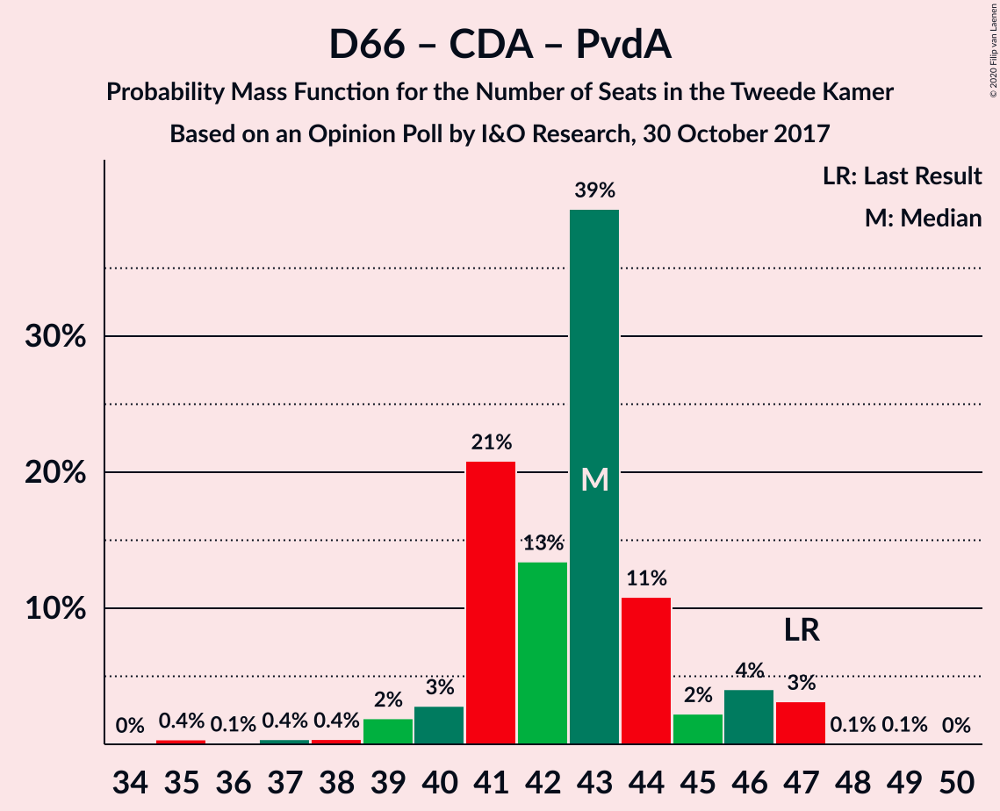

| Number of Seats | Probability | Accumulated | Special Marks |
|:---------------:|:-----------:|:-----------:|:-------------:|
| 37 | 0.6% | 100% |  |
| 38 | 0.1% | 99.4% |  |
| 39 | 0.1% | 99.4% |  |
| 40 | 3% | 99.3% |  |
| 41 | 0.9% | 96% |  |
| 42 | 1.3% | 95% |  |
| 43 | 91% | 94% | Median |
| 44 | 0.6% | 3% |  |
| 45 | 0.4% | 2% |  |
| 46 | 0.1% | 2% |  |
| 47 | 1.0% | 1.5% | Last Result |
| 48 | 0.1% | 0.5% |  |
| 49 | 0.3% | 0.4% |  |
| 50 | 0% | 0% |  |

### Volkspartij voor Vrijheid en Democratie – Partij van de Arbeid

| Number of Seats | Probability | Accumulated | Special Marks |
|:---------------:|:-----------:|:-----------:|:-------------:|
| 35 | 0.8% | 100% |  |
| 36 | 0.3% | 99.1% |  |
| 37 | 0.4% | 98.9% |  |
| 38 | 76% | 98.5% | Median |
| 39 | 18% | 23% |  |
| 40 | 1.3% | 4% |  |
| 41 | 0.9% | 3% |  |
| 42 | 2% | 2% | Last Result |
| 43 | 0.4% | 0.7% |  |
| 44 | 0.2% | 0.3% |  |
| 45 | 0.1% | 0.1% |  |
| 46 | 0% | 0% |  |

### Democraten 66 – Christen-Democratisch Appèl

| Number of Seats | Probability | Accumulated | Special Marks |
|:---------------:|:-----------:|:-----------:|:-------------:|
| 26 | 0.5% | 100% |  |
| 27 | 0.1% | 99.5% |  |
| 28 | 0.2% | 99.4% |  |
| 29 | 0.9% | 99.3% |  |
| 30 | 0.4% | 98% |  |
| 31 | 0.1% | 98% |  |
| 32 | 3% | 98% |  |
| 33 | 19% | 94% |  |
| 34 | 1.0% | 76% |  |
| 35 | 74% | 75% | Median |
| 36 | 0% | 0.5% |  |
| 37 | 0.1% | 0.5% |  |
| 38 | 0.4% | 0.4% | Last Result |
| 39 | 0% | 0% |  |

### Christen-Democratisch Appèl – Partij van de Arbeid – ChristenUnie

| Number of Seats | Probability | Accumulated | Special Marks |
|:---------------:|:-----------:|:-----------:|:-------------:|
| 27 | 0.2% | 100% |  |
| 28 | 0.3% | 99.8% |  |
| 29 | 17% | 99.5% |  |
| 30 | 2% | 82% |  |
| 31 | 77% | 80% | Median |
| 32 | 1.1% | 3% |  |
| 33 | 0.2% | 2% | Last Result |
| 34 | 0.7% | 2% |  |
| 35 | 0.1% | 0.8% |  |
| 36 | 0.3% | 0.8% |  |
| 37 | 0.4% | 0.5% |  |
| 38 | 0% | 0% |  |

### Christen-Democratisch Appèl – Partij van de Arbeid

| Number of Seats | Probability | Accumulated | Special Marks |
|:---------------:|:-----------:|:-----------:|:-------------:|
| 21 | 0.2% | 100% |  |
| 22 | 18% | 99.8% |  |
| 23 | 75% | 82% | Median |
| 24 | 3% | 7% |  |
| 25 | 1.1% | 3% |  |
| 26 | 0.7% | 2% |  |
| 27 | 0.4% | 1.5% |  |
| 28 | 0.6% | 1.1% | Last Result |
| 29 | 0.1% | 0.5% |  |
| 30 | 0% | 0.4% |  |
| 31 | 0.4% | 0.4% |  |
| 32 | 0% | 0% |  |

## Technical Information

### Opinion Poll

+ **Polling firm:** I&O Research
+ **Commissioner(s):** —
+ **Fieldwork period:** 30 October 2017

### Calculations

+ **Sample size:** 1339
+ **Simulations done:** 131,072
+ **Error estimate:** 2.10%

