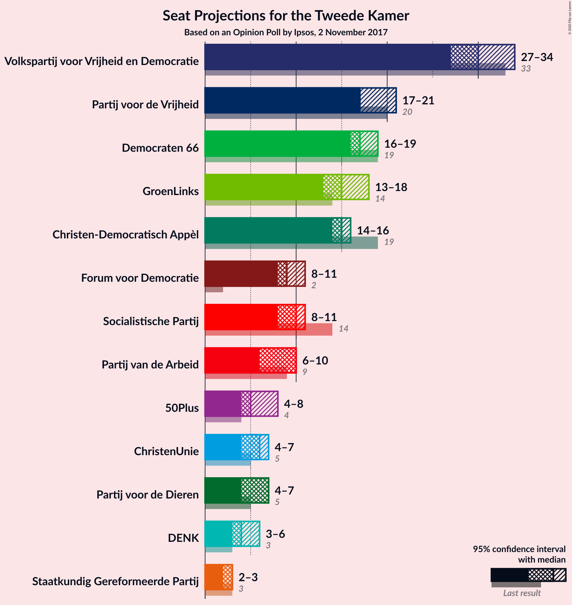
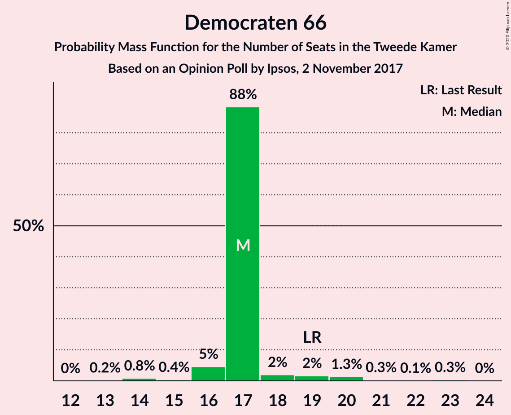
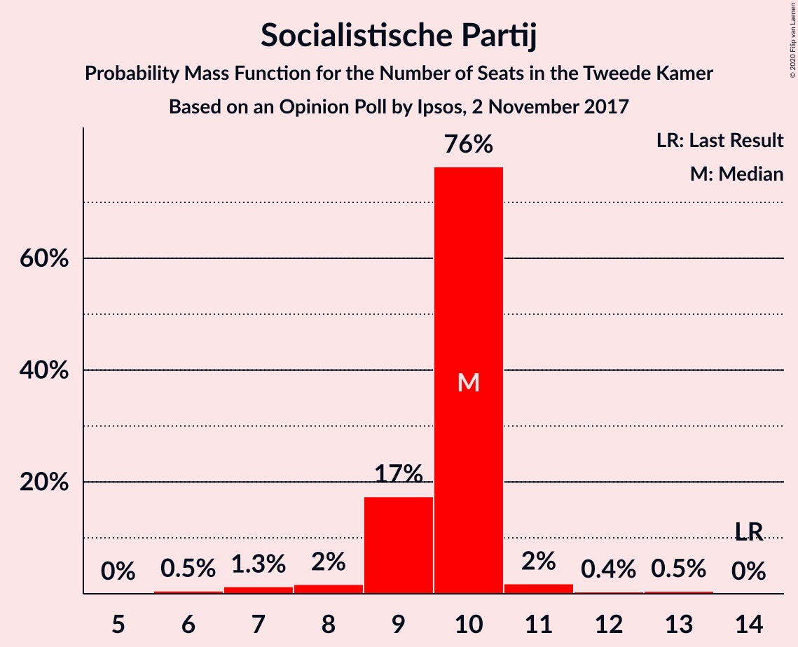
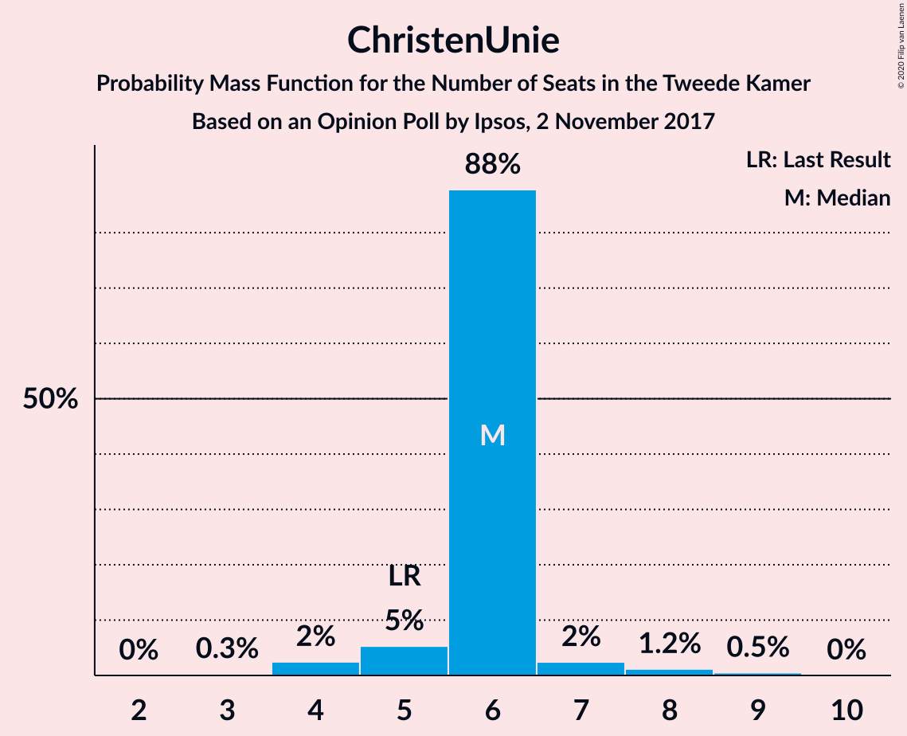
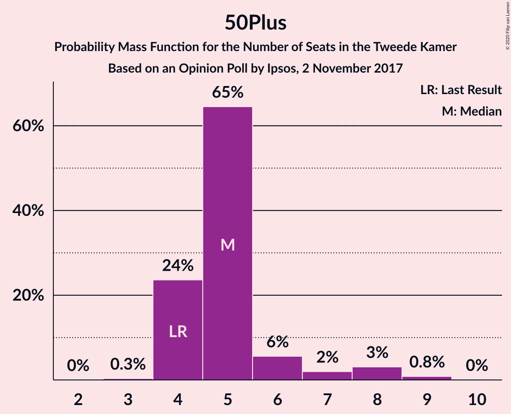
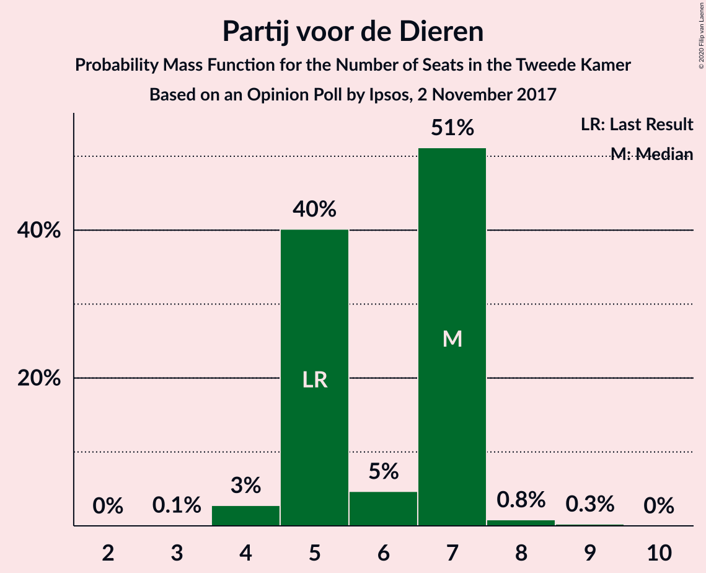
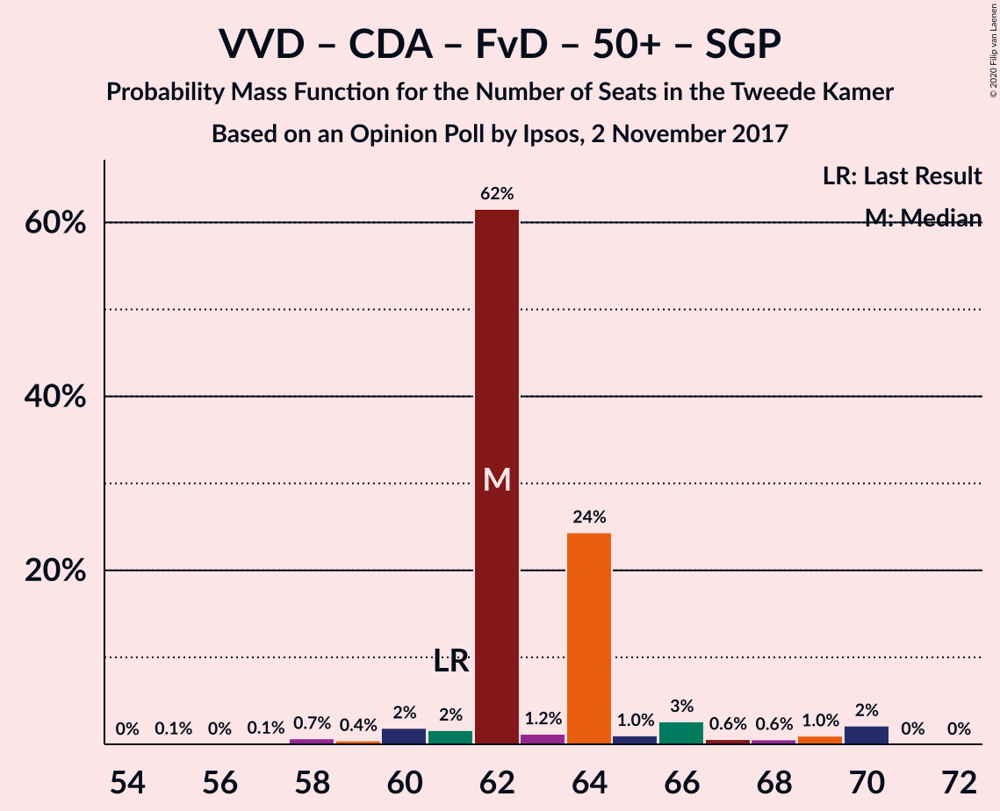
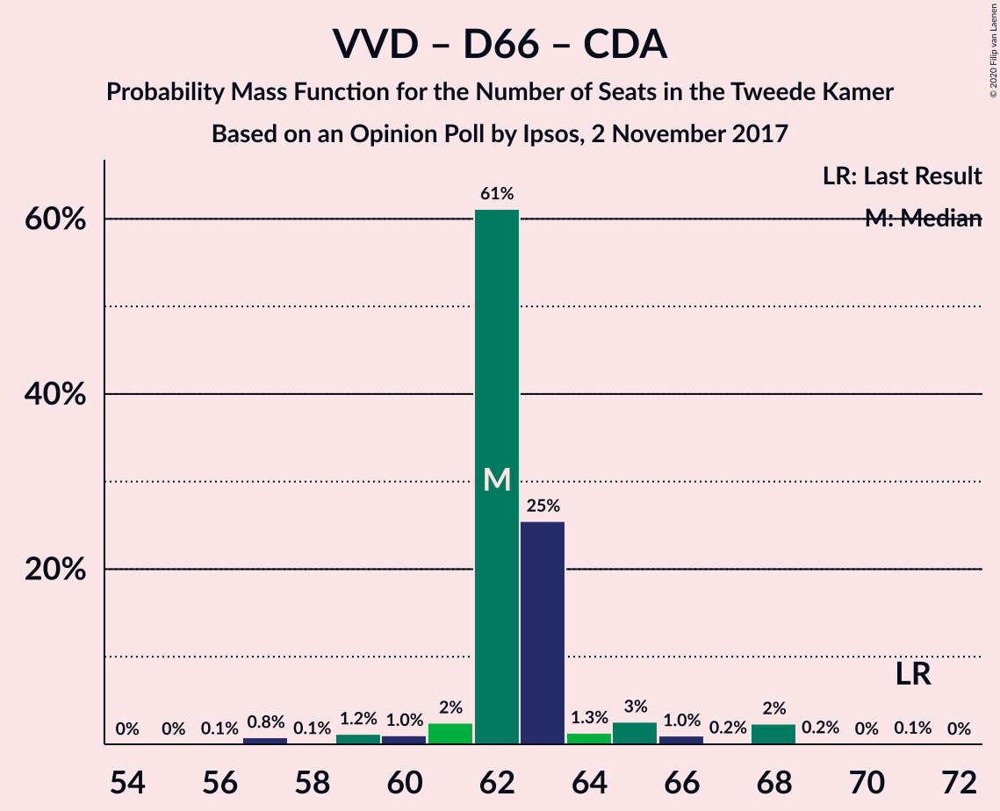
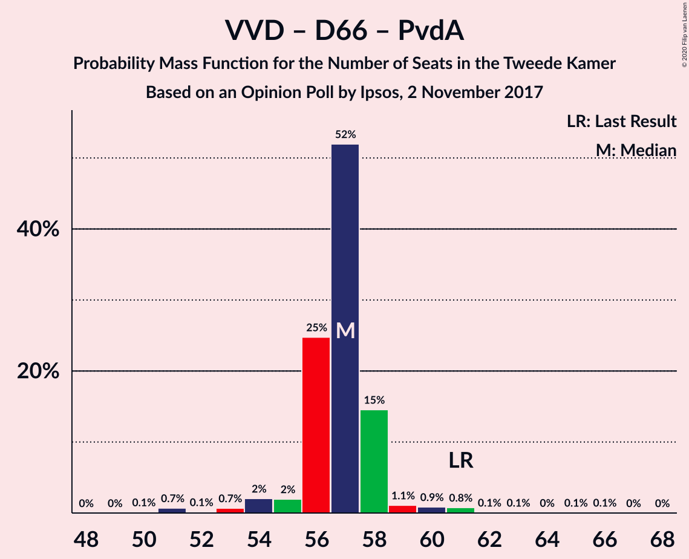
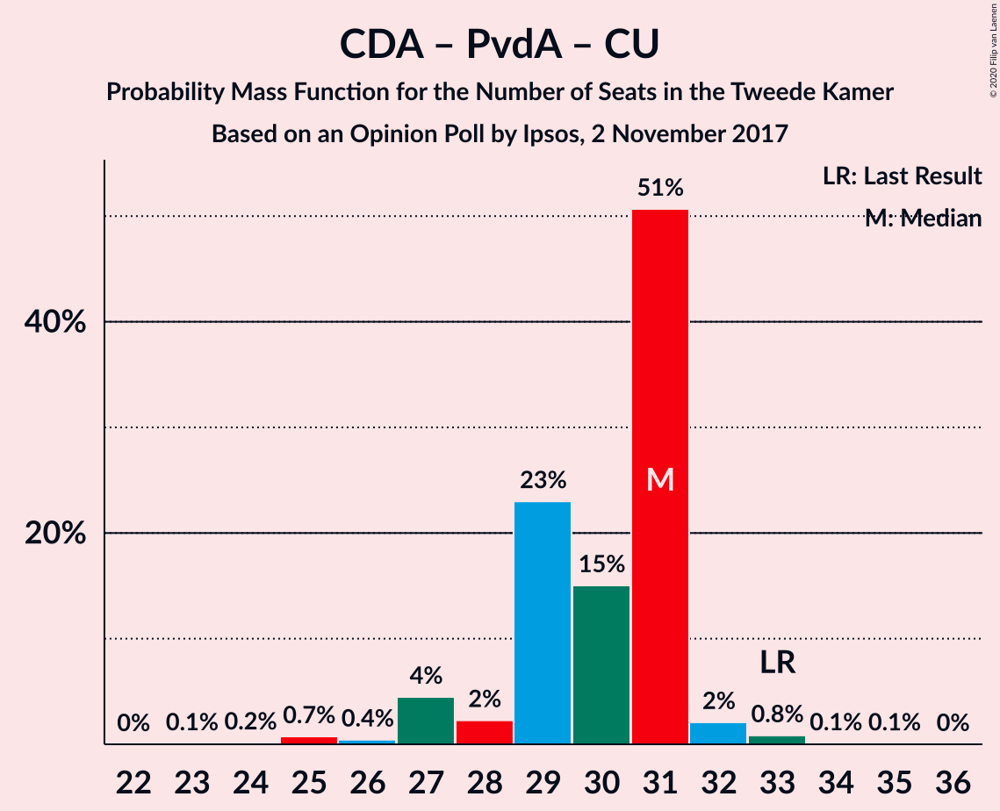

# Opinion Poll by Ipsos, 2 November 2017

<a href="#voting-intentions">Voting Intentions</a> | <a href="#seats">Seats</a> | <a href="#coalitions">Coalitions</a> | <a href="#technical-information">Technical Information</a>

## Voting Intentions

### Confidence Intervals

| Party | Last Result | Poll Result | 80% Confidence Interval | 90% Confidence Interval | 95% Confidence Interval | 99% Confidence Interval |
|:-----:|:-----------:|:-----------:|:-----------------------:|:-----------------------:|:-----------------------:|:-----------------------:|
| Volkspartij voor Vrijheid en Democratie | 21.3% | 20.3% | 18.7–22.0% |18.3–22.5% |17.9–22.9% |17.2–23.7% |
| Partij voor de Vrijheid | 13.1% | 12.2% | 11.0–13.6% |10.6–14.0% |10.3–14.4% |9.7–15.1% |
| Democraten 66 | 12.2% | 11.7% | 10.5–13.1% |10.1–13.5% |9.8–13.9% |9.3–14.5% |
| GroenLinks | 9.1% | 10.0% | 8.9–11.3% |8.6–11.7% |8.3–12.0% |7.8–12.7% |
| Christen-Democratisch Appèl | 12.4% | 9.8% | 8.7–11.1% |8.4–11.5% |8.1–11.8% |7.6–12.5% |
| Forum voor Democratie | 1.8% | 6.3% | 5.4–7.4% |5.2–7.7% |5.0–8.0% |4.6–8.6% |
| Socialistische Partij | 9.1% | 6.2% | 5.3–7.3% |5.1–7.6% |4.9–7.9% |4.5–8.4% |
| Partij van de Arbeid | 5.7% | 5.6% | 4.8–6.6% |4.5–7.0% |4.3–7.2% |4.0–7.7% |
| ChristenUnie | 3.4% | 4.1% | 3.4–5.0% |3.2–5.3% |3.0–5.5% |2.7–6.0% |
| 50Plus | 3.1% | 4.0% | 3.3–4.9% |3.1–5.2% |2.9–5.4% |2.7–5.9% |
| Partij voor de Dieren | 3.2% | 3.8% | 3.1–4.7% |2.9–5.0% |2.8–5.2% |2.5–5.6% |
| DENK | 2.1% | 3.1% | 2.5–3.9% |2.3–4.2% |2.2–4.4% |1.9–4.8% |
| Staatkundig Gereformeerde Partij | 2.1% | 1.9% | 1.4–2.6% |1.3–2.8% |1.2–3.0% |1.0–3.3% |

*Note:* The poll result column reflects the actual value used in the calculations. Published results may vary slightly, and in addition be rounded to fewer digits.

## Seats

### Confidence Intervals

| Party | Last Result | Median | 80% Confidence Interval | 90% Confidence Interval | 95% Confidence Interval | 99% Confidence Interval |
|:-----:|:-----------:|:------:|:-----------------------:|:-----------------------:|:-----------------------:|:-----------------------:|
| <a href="#volkspartij-voor-vrijheid-en-democratie">Volkspartij voor Vrijheid en Democratie</a> | 33 | 34 | 26–36 |26–36 |26–36 |26–36 |
| <a href="#partij-voor-de-vrijheid">Partij voor de Vrijheid</a> | 20 | 18 | 18–21 |17–21 |16–22 |15–22 |
| <a href="#democraten-66">Democraten 66</a> | 19 | 16 | 16–18 |16–20 |16–21 |13–23 |
| <a href="#groenlinks">GroenLinks</a> | 14 | 15 | 15–19 |14–20 |11–20 |11–20 |
| <a href="#christen-democratisch-appèl">Christen-Democratisch Appèl</a> | 19 | 16 | 13–16 |12–16 |11–16 |11–18 |
| <a href="#forum-voor-democratie">Forum voor Democratie</a> | 2 | 9 | 8–10 |8–11 |8–11 |7–12 |
| <a href="#socialistische-partij">Socialistische Partij</a> | 14 | 10 | 8–10 |7–11 |7–11 |7–13 |
| <a href="#partij-van-de-arbeid">Partij van de Arbeid</a> | 9 | 6 | 6–9 |6–9 |5–9 |5–10 |
| <a href="#christenunie">ChristenUnie</a> | 5 | 5 | 4–6 |4–8 |4–8 |4–10 |
| <a href="#50plus">50Plus</a> | 4 | 6 | 5–8 |5–8 |4–8 |4–8 |
| <a href="#partij-voor-de-dieren">Partij voor de Dieren</a> | 5 | 5 | 5–6 |5–6 |4–7 |3–8 |
| <a href="#denk">DENK</a> | 3 | 4 | 4–5 |3–5 |3–5 |3–6 |
| <a href="#staatkundig-gereformeerde-partij">Staatkundig Gereformeerde Partij</a> | 3 | 3 | 2–3 |2–4 |2–5 |1–5 |

### Volkspartij voor Vrijheid en Democratie

*For a full overview of the results for this party, see the [Volkspartij voor Vrijheid en Democratie](party-volkspartijvoorvrijheidendemocratie.html) page.*

| Number of Seats | Probability | Accumulated | Special Marks |
|:---------------:|:-----------:|:-----------:|:-------------:|
| 25 | 0.1% | 100% |  |
| 26 | 15% | 99.9% |  |
| 27 | 1.3% | 85% |  |
| 28 | 0.2% | 84% |  |
| 29 | 3% | 83% |  |
| 30 | 11% | 80% |  |
| 31 | 10% | 69% |  |
| 32 | 2% | 59% |  |
| 33 | 4% | 58% | Last Result |
| 34 | 4% | 54% | Median |
| 35 | 0.3% | 50% |  |
| 36 | 49% | 49% |  |
| 37 | 0% | 0.2% |  |
| 38 | 0% | 0.2% |  |
| 39 | 0.2% | 0.2% |  |
| 40 | 0% | 0% |  |

### Partij voor de Vrijheid

*For a full overview of the results for this party, see the [Partij voor de Vrijheid](party-partijvoordevrijheid.html) page.*

| Number of Seats | Probability | Accumulated | Special Marks |
|:---------------:|:-----------:|:-----------:|:-------------:|
| 14 | 0.3% | 100% |  |
| 15 | 1.1% | 99.7% |  |
| 16 | 1.3% | 98.6% |  |
| 17 | 7% | 97% |  |
| 18 | 64% | 91% | Median |
| 19 | 5% | 27% |  |
| 20 | 3% | 22% | Last Result |
| 21 | 16% | 19% |  |
| 22 | 3% | 3% |  |
| 23 | 0% | 0.1% |  |
| 24 | 0% | 0% |  |

### Democraten 66

*For a full overview of the results for this party, see the [Democraten 66](party-democraten66.html) page.*

| Number of Seats | Probability | Accumulated | Special Marks |
|:---------------:|:-----------:|:-----------:|:-------------:|
| 13 | 1.0% | 100% |  |
| 14 | 0.3% | 99.0% |  |
| 15 | 0.8% | 98.7% |  |
| 16 | 63% | 98% | Median |
| 17 | 6% | 34% |  |
| 18 | 20% | 28% |  |
| 19 | 2% | 8% | Last Result |
| 20 | 2% | 5% |  |
| 21 | 3% | 4% |  |
| 22 | 0.1% | 0.7% |  |
| 23 | 0.5% | 0.6% |  |
| 24 | 0.1% | 0.1% |  |
| 25 | 0% | 0% |  |

### GroenLinks

*For a full overview of the results for this party, see the [GroenLinks](party-groenlinks.html) page.*

| Number of Seats | Probability | Accumulated | Special Marks |
|:---------------:|:-----------:|:-----------:|:-------------:|
| 11 | 3% | 100% |  |
| 12 | 0.3% | 97% |  |
| 13 | 0.7% | 97% |  |
| 14 | 4% | 96% | Last Result |
| 15 | 53% | 92% | Median |
| 16 | 3% | 40% |  |
| 17 | 3% | 36% |  |
| 18 | 23% | 34% |  |
| 19 | 2% | 10% |  |
| 20 | 8% | 8% |  |
| 21 | 0% | 0% |  |

### Christen-Democratisch Appèl

*For a full overview of the results for this party, see the [Christen-Democratisch Appèl](party-christen-democratischappèl.html) page.*

| Number of Seats | Probability | Accumulated | Special Marks |
|:---------------:|:-----------:|:-----------:|:-------------:|
| 10 | 0.1% | 100% |  |
| 11 | 3% | 99.9% |  |
| 12 | 2% | 97% |  |
| 13 | 6% | 95% |  |
| 14 | 6% | 89% |  |
| 15 | 26% | 83% |  |
| 16 | 55% | 57% | Median |
| 17 | 0.5% | 2% |  |
| 18 | 2% | 2% |  |
| 19 | 0.1% | 0.1% | Last Result |
| 20 | 0% | 0% |  |

### Forum voor Democratie

*For a full overview of the results for this party, see the [Forum voor Democratie](party-forumvoordemocratie.html) page.*

| Number of Seats | Probability | Accumulated | Special Marks |
|:---------------:|:-----------:|:-----------:|:-------------:|
| 2 | 0% | 100% | Last Result |
| 3 | 0% | 100% |  |
| 4 | 0% | 100% |  |
| 5 | 0% | 100% |  |
| 6 | 0.1% | 100% |  |
| 7 | 2% | 99.9% |  |
| 8 | 13% | 98% |  |
| 9 | 72% | 85% | Median |
| 10 | 4% | 13% |  |
| 11 | 7% | 9% |  |
| 12 | 2% | 2% |  |
| 13 | 0% | 0% |  |

### Socialistische Partij

*For a full overview of the results for this party, see the [Socialistische Partij](party-socialistischepartij.html) page.*

| Number of Seats | Probability | Accumulated | Special Marks |
|:---------------:|:-----------:|:-----------:|:-------------:|
| 6 | 0.3% | 100% |  |
| 7 | 8% | 99.6% |  |
| 8 | 5% | 92% |  |
| 9 | 19% | 87% |  |
| 10 | 59% | 68% | Median |
| 11 | 7% | 9% |  |
| 12 | 1.3% | 2% |  |
| 13 | 0.4% | 0.6% |  |
| 14 | 0.1% | 0.1% | Last Result |
| 15 | 0% | 0% |  |

### Partij van de Arbeid

*For a full overview of the results for this party, see the [Partij van de Arbeid](party-partijvandearbeid.html) page.*

| Number of Seats | Probability | Accumulated | Special Marks |
|:---------------:|:-----------:|:-----------:|:-------------:|
| 5 | 3% | 100% |  |
| 6 | 49% | 97% | Median |
| 7 | 11% | 48% |  |
| 8 | 16% | 37% |  |
| 9 | 20% | 20% | Last Result |
| 10 | 0.3% | 0.5% |  |
| 11 | 0.2% | 0.2% |  |
| 12 | 0% | 0% |  |

### ChristenUnie

*For a full overview of the results for this party, see the [ChristenUnie](party-christenunie.html) page.*

| Number of Seats | Probability | Accumulated | Special Marks |
|:---------------:|:-----------:|:-----------:|:-------------:|
| 3 | 0.1% | 100% |  |
| 4 | 18% | 99.9% |  |
| 5 | 54% | 82% | Last Result, Median |
| 6 | 21% | 28% |  |
| 7 | 1.2% | 8% |  |
| 8 | 6% | 7% |  |
| 9 | 0.1% | 0.9% |  |
| 10 | 0.7% | 0.8% |  |
| 11 | 0.1% | 0.1% |  |
| 12 | 0% | 0% |  |

### 50Plus

*For a full overview of the results for this party, see the [50Plus](party-50plus.html) page.*

| Number of Seats | Probability | Accumulated | Special Marks |
|:---------------:|:-----------:|:-----------:|:-------------:|
| 3 | 0.2% | 100% |  |
| 4 | 2% | 99.8% | Last Result |
| 5 | 12% | 97% |  |
| 6 | 57% | 85% | Median |
| 7 | 7% | 28% |  |
| 8 | 21% | 21% |  |
| 9 | 0.1% | 0.3% |  |
| 10 | 0.1% | 0.1% |  |
| 11 | 0% | 0% |  |

### Partij voor de Dieren

*For a full overview of the results for this party, see the [Partij voor de Dieren](party-partijvoordedieren.html) page.*

| Number of Seats | Probability | Accumulated | Special Marks |
|:---------------:|:-----------:|:-----------:|:-------------:|
| 3 | 0.7% | 100% |  |
| 4 | 4% | 99.3% |  |
| 5 | 75% | 96% | Last Result, Median |
| 6 | 18% | 21% |  |
| 7 | 1.5% | 3% |  |
| 8 | 1.3% | 1.4% |  |
| 9 | 0.1% | 0.1% |  |
| 10 | 0% | 0% |  |

### DENK

*For a full overview of the results for this party, see the [DENK](party-denk.html) page.*

| Number of Seats | Probability | Accumulated | Special Marks |
|:---------------:|:-----------:|:-----------:|:-------------:|
| 2 | 0.1% | 100% |  |
| 3 | 9% | 99.9% | Last Result |
| 4 | 68% | 90% | Median |
| 5 | 22% | 23% |  |
| 6 | 0.8% | 0.9% |  |
| 7 | 0.1% | 0.2% |  |
| 8 | 0.1% | 0.1% |  |
| 9 | 0% | 0% |  |

### Staatkundig Gereformeerde Partij

*For a full overview of the results for this party, see the [Staatkundig Gereformeerde Partij](party-staatkundiggereformeerdepartij.html) page.*

| Number of Seats | Probability | Accumulated | Special Marks |
|:---------------:|:-----------:|:-----------:|:-------------:|
| 1 | 0.6% | 100% |  |
| 2 | 34% | 99.4% |  |
| 3 | 60% | 65% | Last Result, Median |
| 4 | 3% | 5% |  |
| 5 | 3% | 3% |  |
| 6 | 0% | 0% |  |

## Coalitions

### Confidence Intervals

| Coalition | Last Result | Median | Majority? | 80% Confidence Interval | 90% Confidence Interval | 95% Confidence Interval | 99% Confidence Interval |
|:---------:|:-----------:|:------:|:---------:|:-----------------------:|:-----------------------:|:-----------------------:|:-----------------------:|
| Volkspartij voor Vrijheid en Democratie – Democraten 66 – GroenLinks – Christen-Democratisch Appèl – ChristenUnie | 90 | 88 | 100% | 81–88 | 81–88 | 81–88 | 79–92 |
| Volkspartij voor Vrijheid en Democratie – Democraten 66 – Christen-Democratisch Appèl – Partij van de Arbeid – ChristenUnie | 85 | 79 | 70% | 72–79 | 72–79 | 72–83 | 70–85 |
| Volkspartij voor Vrijheid en Democratie – Partij voor de Vrijheid – Christen-Democratisch Appèl – Forum voor Democratie – Staatkundig Gereformeerde Partij | 77 | 78 | 71% | 73–82 | 73–82 | 72–82 | 71–82 |
| Volkspartij voor Vrijheid en Democratie – Partij voor de Vrijheid – Christen-Democratisch Appèl – Forum voor Democratie | 74 | 76 | 57% | 71–79 | 71–79 | 70–79 | 69–79 |
| Democraten 66 – GroenLinks – Christen-Democratisch Appèl – Socialistische Partij – Partij van de Arbeid – ChristenUnie | 80 | 68 | 2% | 68–75 | 68–75 | 63–75 | 63–76 |
| Volkspartij voor Vrijheid en Democratie – Democraten 66 – Christen-Democratisch Appèl – ChristenUnie | 76 | 73 | 2% | 63–73 | 63–73 | 63–74 | 62–76 |
| Volkspartij voor Vrijheid en Democratie – Partij voor de Vrijheid – Christen-Democratisch Appèl | 72 | 66 | 0% | 62–70 | 62–70 | 61–70 | 60–70 |
| Volkspartij voor Vrijheid en Democratie – Christen-Democratisch Appèl – Forum voor Democratie – 50Plus – Staatkundig Gereformeerde Partij | 61 | 66 | 0% | 60–70 | 60–70 | 60–70 | 57–70 |
| Volkspartij voor Vrijheid en Democratie – Democraten 66 – Christen-Democratisch Appèl | 71 | 68 | 0% | 57–68 | 57–68 | 57–68 | 56–71 |
| Volkspartij voor Vrijheid en Democratie – Christen-Democratisch Appèl – Forum voor Democratie – 50Plus | 58 | 64 | 0% | 58–67 | 58–67 | 58–67 | 54–67 |
| Democraten 66 – GroenLinks – Christen-Democratisch Appèl – Partij van de Arbeid – ChristenUnie | 66 | 58 | 0% | 58–65 | 58–65 | 55–65 | 55–67 |
| Volkspartij voor Vrijheid en Democratie – Christen-Democratisch Appèl – Forum voor Democratie – Staatkundig Gereformeerde Partij | 57 | 61 | 0% | 52–64 | 52–64 | 52–64 | 52–64 |
| Volkspartij voor Vrijheid en Democratie – Christen-Democratisch Appèl – Forum voor Democratie | 54 | 59 | 0% | 50–61 | 50–61 | 50–61 | 49–61 |
| Volkspartij voor Vrijheid en Democratie – Democraten 66 – Partij van de Arbeid | 61 | 58 | 0% | 51–58 | 51–60 | 51–60 | 50–66 |
| Volkspartij voor Vrijheid en Democratie – Christen-Democratisch Appèl – Partij van de Arbeid | 61 | 57 | 0% | 50–58 | 50–58 | 49–58 | 49–59 |
| Volkspartij voor Vrijheid en Democratie – Christen-Democratisch Appèl | 52 | 49 | 0% | 41–52 | 41–52 | 41–52 | 40–52 |
| Democraten 66 – Christen-Democratisch Appèl – Partij van de Arbeid | 47 | 38 | 0% | 38–41 | 36–41 | 35–44 | 35–48 |
| Volkspartij voor Vrijheid en Democratie – Partij van de Arbeid | 42 | 42 | 0% | 35–42 | 35–42 | 35–42 | 35–45 |
| Democraten 66 – Christen-Democratisch Appèl | 38 | 32 | 0% | 31–34 | 29–35 | 28–35 | 28–39 |
| Christen-Democratisch Appèl – Partij van de Arbeid – ChristenUnie | 33 | 27 | 0% | 26–30 | 25–30 | 24–32 | 24–33 |
| Christen-Democratisch Appèl – Partij van de Arbeid | 28 | 22 | 0% | 21–24 | 18–24 | 18–24 | 18–27 |

### Volkspartij voor Vrijheid en Democratie – Democraten 66 – GroenLinks – Christen-Democratisch Appèl – ChristenUnie

| Number of Seats | Probability | Accumulated | Special Marks |
|:---------------:|:-----------:|:-----------:|:-------------:|
| 77 | 0% | 100% |  |
| 78 | 0% | 99.9% |  |
| 79 | 2% | 99.9% |  |
| 80 | 0.1% | 98% |  |
| 81 | 18% | 98% |  |
| 82 | 0.2% | 80% |  |
| 83 | 0.6% | 80% |  |
| 84 | 5% | 79% |  |
| 85 | 3% | 74% |  |
| 86 | 0.4% | 71% | Median |
| 87 | 19% | 70% |  |
| 88 | 49% | 51% |  |
| 89 | 0.5% | 2% |  |
| 90 | 0.3% | 2% | Last Result |
| 91 | 0.8% | 2% |  |
| 92 | 0.3% | 0.7% |  |
| 93 | 0.4% | 0.4% |  |
| 94 | 0% | 0% |  |

### Volkspartij voor Vrijheid en Democratie – Democraten 66 – Christen-Democratisch Appèl – Partij van de Arbeid – ChristenUnie

| Number of Seats | Probability | Accumulated | Special Marks |
|:---------------:|:-----------:|:-----------:|:-------------:|
| 70 | 1.0% | 100% |  |
| 71 | 0.7% | 98.9% |  |
| 72 | 15% | 98% |  |
| 73 | 0.5% | 83% |  |
| 74 | 4% | 82% |  |
| 75 | 9% | 78% |  |
| 76 | 10% | 70% | Majority |
| 77 | 4% | 60% | Median |
| 78 | 2% | 56% |  |
| 79 | 49% | 54% |  |
| 80 | 0.3% | 5% |  |
| 81 | 0.9% | 5% |  |
| 82 | 0.2% | 4% |  |
| 83 | 2% | 4% |  |
| 84 | 0% | 2% |  |
| 85 | 2% | 2% | Last Result |
| 86 | 0% | 0% |  |

### Volkspartij voor Vrijheid en Democratie – Partij voor de Vrijheid – Christen-Democratisch Appèl – Forum voor Democratie – Staatkundig Gereformeerde Partij

| Number of Seats | Probability | Accumulated | Special Marks |
|:---------------:|:-----------:|:-----------:|:-------------:|
| 70 | 0.3% | 100% |  |
| 71 | 0.2% | 99.7% |  |
| 72 | 3% | 99.5% |  |
| 73 | 24% | 96% |  |
| 74 | 0.4% | 72% |  |
| 75 | 0.4% | 72% |  |
| 76 | 4% | 71% | Majority |
| 77 | 6% | 67% | Last Result |
| 78 | 12% | 61% |  |
| 79 | 1.4% | 50% |  |
| 80 | 0.2% | 48% | Median |
| 81 | 0% | 48% |  |
| 82 | 48% | 48% |  |
| 83 | 0.3% | 0.4% |  |
| 84 | 0% | 0% |  |

### Volkspartij voor Vrijheid en Democratie – Partij voor de Vrijheid – Christen-Democratisch Appèl – Forum voor Democratie

| Number of Seats | Probability | Accumulated | Special Marks |
|:---------------:|:-----------:|:-----------:|:-------------:|
| 67 | 0.3% | 100% |  |
| 68 | 0.1% | 99.7% |  |
| 69 | 1.1% | 99.6% |  |
| 70 | 3% | 98% |  |
| 71 | 25% | 95% |  |
| 72 | 3% | 70% |  |
| 73 | 0.8% | 67% |  |
| 74 | 5% | 67% | Last Result |
| 75 | 5% | 62% |  |
| 76 | 8% | 57% | Majority |
| 77 | 0.3% | 48% | Median |
| 78 | 0.2% | 48% |  |
| 79 | 48% | 48% |  |
| 80 | 0% | 0.2% |  |
| 81 | 0.2% | 0.2% |  |
| 82 | 0% | 0% |  |

### Democraten 66 – GroenLinks – Christen-Democratisch Appèl – Socialistische Partij – Partij van de Arbeid – ChristenUnie

| Number of Seats | Probability | Accumulated | Special Marks |
|:---------------:|:-----------:|:-----------:|:-------------:|
| 63 | 3% | 100% |  |
| 64 | 0% | 97% |  |
| 65 | 0% | 97% |  |
| 66 | 0.3% | 97% |  |
| 67 | 0.1% | 97% |  |
| 68 | 50% | 97% | Median |
| 69 | 6% | 47% |  |
| 70 | 7% | 41% |  |
| 71 | 1.2% | 35% |  |
| 72 | 2% | 33% |  |
| 73 | 18% | 31% |  |
| 74 | 0.6% | 13% |  |
| 75 | 11% | 12% |  |
| 76 | 1.0% | 2% | Majority |
| 77 | 0.1% | 0.5% |  |
| 78 | 0.2% | 0.3% |  |
| 79 | 0% | 0.2% |  |
| 80 | 0.1% | 0.1% | Last Result |
| 81 | 0% | 0% |  |

### Volkspartij voor Vrijheid en Democratie – Democraten 66 – Christen-Democratisch Appèl – ChristenUnie

| Number of Seats | Probability | Accumulated | Special Marks |
|:---------------:|:-----------:|:-----------:|:-------------:|
| 62 | 2% | 100% |  |
| 63 | 15% | 98% |  |
| 64 | 0.3% | 83% |  |
| 65 | 0.3% | 83% |  |
| 66 | 0.4% | 83% |  |
| 67 | 12% | 82% |  |
| 68 | 2% | 70% |  |
| 69 | 10% | 68% |  |
| 70 | 2% | 58% |  |
| 71 | 3% | 56% | Median |
| 72 | 0.7% | 54% |  |
| 73 | 49% | 53% |  |
| 74 | 2% | 4% |  |
| 75 | 0.1% | 2% |  |
| 76 | 2% | 2% | Last Result, Majority |
| 77 | 0.1% | 0.4% |  |
| 78 | 0.3% | 0.3% |  |
| 79 | 0% | 0% |  |

### Volkspartij voor Vrijheid en Democratie – Partij voor de Vrijheid – Christen-Democratisch Appèl

| Number of Seats | Probability | Accumulated | Special Marks |
|:---------------:|:-----------:|:-----------:|:-------------:|
| 57 | 0.1% | 100% |  |
| 58 | 0% | 99.9% |  |
| 59 | 0.3% | 99.9% |  |
| 60 | 1.2% | 99.5% |  |
| 61 | 2% | 98% |  |
| 62 | 19% | 96% |  |
| 63 | 10% | 77% |  |
| 64 | 2% | 67% |  |
| 65 | 8% | 64% |  |
| 66 | 6% | 56% |  |
| 67 | 1.4% | 50% |  |
| 68 | 0.5% | 48% | Median |
| 69 | 0% | 48% |  |
| 70 | 48% | 48% |  |
| 71 | 0% | 0.2% |  |
| 72 | 0% | 0.2% | Last Result |
| 73 | 0.2% | 0.2% |  |
| 74 | 0% | 0% |  |

### Volkspartij voor Vrijheid en Democratie – Christen-Democratisch Appèl – Forum voor Democratie – 50Plus – Staatkundig Gereformeerde Partij

| Number of Seats | Probability | Accumulated | Special Marks |
|:---------------:|:-----------:|:-----------:|:-------------:|
| 56 | 0.3% | 100% |  |
| 57 | 0.3% | 99.7% |  |
| 58 | 0.4% | 99.4% |  |
| 59 | 0.2% | 99.0% |  |
| 60 | 24% | 98.9% |  |
| 61 | 0.2% | 75% | Last Result |
| 62 | 2% | 75% |  |
| 63 | 3% | 73% |  |
| 64 | 7% | 70% |  |
| 65 | 4% | 63% |  |
| 66 | 9% | 59% |  |
| 67 | 0.1% | 50% |  |
| 68 | 1.3% | 50% | Median |
| 69 | 0.4% | 48% |  |
| 70 | 48% | 48% |  |
| 71 | 0.1% | 0.1% |  |
| 72 | 0% | 0% |  |

### Volkspartij voor Vrijheid en Democratie – Democraten 66 – Christen-Democratisch Appèl

| Number of Seats | Probability | Accumulated | Special Marks |
|:---------------:|:-----------:|:-----------:|:-------------:|
| 56 | 0.7% | 100% |  |
| 57 | 16% | 99.3% |  |
| 58 | 0.3% | 83% |  |
| 59 | 2% | 83% |  |
| 60 | 0.2% | 81% |  |
| 61 | 3% | 81% |  |
| 62 | 1.4% | 78% |  |
| 63 | 13% | 76% |  |
| 64 | 0.3% | 63% |  |
| 65 | 10% | 63% |  |
| 66 | 0.4% | 53% | Median |
| 67 | 0.7% | 53% |  |
| 68 | 50% | 52% |  |
| 69 | 0% | 2% |  |
| 70 | 0.1% | 2% |  |
| 71 | 2% | 2% | Last Result |
| 72 | 0% | 0% |  |

### Volkspartij voor Vrijheid en Democratie – Christen-Democratisch Appèl – Forum voor Democratie – 50Plus

| Number of Seats | Probability | Accumulated | Special Marks |
|:---------------:|:-----------:|:-----------:|:-------------:|
| 53 | 0.3% | 100% |  |
| 54 | 0.4% | 99.7% |  |
| 55 | 0.2% | 99.4% |  |
| 56 | 0.1% | 99.1% |  |
| 57 | 0.3% | 99.0% |  |
| 58 | 25% | 98.7% | Last Result |
| 59 | 3% | 73% |  |
| 60 | 0.2% | 70% |  |
| 61 | 7% | 70% |  |
| 62 | 4% | 63% |  |
| 63 | 2% | 59% |  |
| 64 | 8% | 57% |  |
| 65 | 1.4% | 49% | Median |
| 66 | 0.2% | 48% |  |
| 67 | 48% | 48% |  |
| 68 | 0.1% | 0.1% |  |
| 69 | 0% | 0% |  |

### Democraten 66 – GroenLinks – Christen-Democratisch Appèl – Partij van de Arbeid – ChristenUnie

| Number of Seats | Probability | Accumulated | Special Marks |
|:---------------:|:-----------:|:-----------:|:-------------:|
| 55 | 3% | 100% |  |
| 56 | 0.2% | 97% |  |
| 57 | 0.1% | 97% |  |
| 58 | 52% | 97% | Median |
| 59 | 0.2% | 45% |  |
| 60 | 3% | 44% |  |
| 61 | 4% | 42% |  |
| 62 | 2% | 38% |  |
| 63 | 7% | 36% |  |
| 64 | 17% | 29% |  |
| 65 | 10% | 12% |  |
| 66 | 0.3% | 2% | Last Result |
| 67 | 1.3% | 2% |  |
| 68 | 0.2% | 0.4% |  |
| 69 | 0.1% | 0.1% |  |
| 70 | 0% | 0% |  |

### Volkspartij voor Vrijheid en Democratie – Christen-Democratisch Appèl – Forum voor Democratie – Staatkundig Gereformeerde Partij

| Number of Seats | Probability | Accumulated | Special Marks |
|:---------------:|:-----------:|:-----------:|:-------------:|
| 50 | 0.3% | 100% |  |
| 51 | 0% | 99.7% |  |
| 52 | 15% | 99.6% |  |
| 53 | 0.3% | 84% |  |
| 54 | 0.3% | 84% |  |
| 55 | 10% | 84% |  |
| 56 | 7% | 73% |  |
| 57 | 0.3% | 67% | Last Result |
| 58 | 4% | 66% |  |
| 59 | 4% | 62% |  |
| 60 | 8% | 59% |  |
| 61 | 1.3% | 51% |  |
| 62 | 1.0% | 49% | Median |
| 63 | 0% | 48% |  |
| 64 | 48% | 48% |  |
| 65 | 0% | 0.1% |  |
| 66 | 0% | 0% |  |

### Volkspartij voor Vrijheid en Democratie – Christen-Democratisch Appèl – Forum voor Democratie

| Number of Seats | Probability | Accumulated | Special Marks |
|:---------------:|:-----------:|:-----------:|:-------------:|
| 47 | 0.3% | 100% |  |
| 48 | 0% | 99.7% |  |
| 49 | 0.3% | 99.7% |  |
| 50 | 15% | 99.4% |  |
| 51 | 1.1% | 84% |  |
| 52 | 2% | 83% |  |
| 53 | 14% | 81% |  |
| 54 | 2% | 67% | Last Result |
| 55 | 4% | 65% |  |
| 56 | 1.1% | 60% |  |
| 57 | 2% | 59% |  |
| 58 | 6% | 57% |  |
| 59 | 2% | 51% | Median |
| 60 | 0.5% | 48% |  |
| 61 | 48% | 48% |  |
| 62 | 0.2% | 0.2% |  |
| 63 | 0% | 0% |  |

### Volkspartij voor Vrijheid en Democratie – Democraten 66 – Partij van de Arbeid

| Number of Seats | Probability | Accumulated | Special Marks |
|:---------------:|:-----------:|:-----------:|:-------------:|
| 50 | 1.0% | 100% |  |
| 51 | 16% | 99.0% |  |
| 52 | 0% | 83% |  |
| 53 | 0.5% | 83% |  |
| 54 | 2% | 83% |  |
| 55 | 3% | 81% |  |
| 56 | 14% | 77% | Median |
| 57 | 6% | 63% |  |
| 58 | 49% | 57% |  |
| 59 | 2% | 8% |  |
| 60 | 4% | 6% |  |
| 61 | 0.1% | 2% | Last Result |
| 62 | 0.3% | 2% |  |
| 63 | 0.2% | 2% |  |
| 64 | 0% | 1.4% |  |
| 65 | 0.2% | 1.4% |  |
| 66 | 1.2% | 1.2% |  |
| 67 | 0% | 0% |  |

### Volkspartij voor Vrijheid en Democratie – Christen-Democratisch Appèl – Partij van de Arbeid

| Number of Seats | Probability | Accumulated | Special Marks |
|:---------------:|:-----------:|:-----------:|:-------------:|
| 44 | 0.2% | 100% |  |
| 45 | 0% | 99.8% |  |
| 46 | 0% | 99.7% |  |
| 47 | 0.1% | 99.7% |  |
| 48 | 0% | 99.7% |  |
| 49 | 4% | 99.6% |  |
| 50 | 16% | 96% |  |
| 51 | 3% | 80% |  |
| 52 | 1.2% | 76% |  |
| 53 | 12% | 75% |  |
| 54 | 6% | 63% |  |
| 55 | 4% | 56% |  |
| 56 | 2% | 52% | Median |
| 57 | 0.2% | 50% |  |
| 58 | 48% | 50% |  |
| 59 | 1.3% | 2% |  |
| 60 | 0% | 0.2% |  |
| 61 | 0% | 0.2% | Last Result |
| 62 | 0% | 0.2% |  |
| 63 | 0.2% | 0.2% |  |
| 64 | 0% | 0% |  |

### Volkspartij voor Vrijheid en Democratie – Christen-Democratisch Appèl

| Number of Seats | Probability | Accumulated | Special Marks |
|:---------------:|:-----------:|:-----------:|:-------------:|
| 38 | 0.3% | 100% |  |
| 39 | 0.1% | 99.7% |  |
| 40 | 0.3% | 99.6% |  |
| 41 | 16% | 99.3% |  |
| 42 | 2% | 84% |  |
| 43 | 0.7% | 82% |  |
| 44 | 7% | 81% |  |
| 45 | 11% | 75% |  |
| 46 | 1.5% | 64% |  |
| 47 | 11% | 63% |  |
| 48 | 1.2% | 51% |  |
| 49 | 0.3% | 50% |  |
| 50 | 1.4% | 50% | Median |
| 51 | 0.7% | 49% |  |
| 52 | 48% | 48% | Last Result |
| 53 | 0% | 0.2% |  |
| 54 | 0.2% | 0.2% |  |
| 55 | 0% | 0% |  |

### Democraten 66 – Christen-Democratisch Appèl – Partij van de Arbeid

| Number of Seats | Probability | Accumulated | Special Marks |
|:---------------:|:-----------:|:-----------:|:-------------:|
| 35 | 3% | 100% |  |
| 36 | 3% | 97% |  |
| 37 | 3% | 95% |  |
| 38 | 49% | 92% | Median |
| 39 | 5% | 43% |  |
| 40 | 19% | 38% |  |
| 41 | 15% | 19% |  |
| 42 | 0.1% | 4% |  |
| 43 | 0.4% | 4% |  |
| 44 | 1.5% | 4% |  |
| 45 | 0.1% | 2% |  |
| 46 | 0.5% | 2% |  |
| 47 | 0% | 2% | Last Result |
| 48 | 2% | 2% |  |
| 49 | 0% | 0% |  |

### Volkspartij voor Vrijheid en Democratie – Partij van de Arbeid

| Number of Seats | Probability | Accumulated | Special Marks |
|:---------------:|:-----------:|:-----------:|:-------------:|
| 33 | 0.3% | 100% |  |
| 34 | 0.2% | 99.7% |  |
| 35 | 16% | 99.5% |  |
| 36 | 3% | 84% |  |
| 37 | 3% | 81% |  |
| 38 | 17% | 78% |  |
| 39 | 4% | 61% |  |
| 40 | 4% | 58% | Median |
| 41 | 0.4% | 54% |  |
| 42 | 52% | 54% | Last Result |
| 43 | 0.6% | 2% |  |
| 44 | 0% | 1.4% |  |
| 45 | 1.2% | 1.4% |  |
| 46 | 0% | 0.2% |  |
| 47 | 0% | 0.2% |  |
| 48 | 0.2% | 0.2% |  |
| 49 | 0% | 0% |  |

### Democraten 66 – Christen-Democratisch Appèl

| Number of Seats | Probability | Accumulated | Special Marks |
|:---------------:|:-----------:|:-----------:|:-------------:|
| 27 | 0.1% | 100% |  |
| 28 | 4% | 99.9% |  |
| 29 | 2% | 96% |  |
| 30 | 0.3% | 94% |  |
| 31 | 20% | 93% |  |
| 32 | 53% | 73% | Median |
| 33 | 8% | 20% |  |
| 34 | 6% | 11% |  |
| 35 | 3% | 5% |  |
| 36 | 0.3% | 2% |  |
| 37 | 0.3% | 2% |  |
| 38 | 0.1% | 2% | Last Result |
| 39 | 2% | 2% |  |
| 40 | 0% | 0% |  |

### Christen-Democratisch Appèl – Partij van de Arbeid – ChristenUnie

| Number of Seats | Probability | Accumulated | Special Marks |
|:---------------:|:-----------:|:-----------:|:-------------:|
| 24 | 3% | 100% |  |
| 25 | 5% | 97% |  |
| 26 | 3% | 92% |  |
| 27 | 65% | 89% | Median |
| 28 | 3% | 24% |  |
| 29 | 1.1% | 22% |  |
| 30 | 16% | 21% |  |
| 31 | 2% | 5% |  |
| 32 | 1.1% | 3% |  |
| 33 | 2% | 2% | Last Result |
| 34 | 0.1% | 0.2% |  |
| 35 | 0% | 0.1% |  |
| 36 | 0.1% | 0.1% |  |
| 37 | 0% | 0% |  |

### Christen-Democratisch Appèl – Partij van de Arbeid

| Number of Seats | Probability | Accumulated | Special Marks |
|:---------------:|:-----------:|:-----------:|:-------------:|
| 17 | 0.3% | 100% |  |
| 18 | 5% | 99.7% |  |
| 19 | 1.5% | 95% |  |
| 20 | 2% | 93% |  |
| 21 | 5% | 92% |  |
| 22 | 51% | 87% | Median |
| 23 | 19% | 37% |  |
| 24 | 16% | 18% |  |
| 25 | 0.4% | 2% |  |
| 26 | 0.1% | 2% |  |
| 27 | 2% | 2% |  |
| 28 | 0.1% | 0.1% | Last Result |
| 29 | 0.1% | 0.1% |  |
| 30 | 0% | 0% |  |

## Technical Information

### Opinion Poll

+ **Polling firm:** Ipsos
+ **Commissioner(s):** —
+ **Fieldwork period:** 2 November 2017

### Calculations

+ **Sample size:** 1000
+ **Simulations done:** 131,072
+ **Error estimate:** 3.86%

