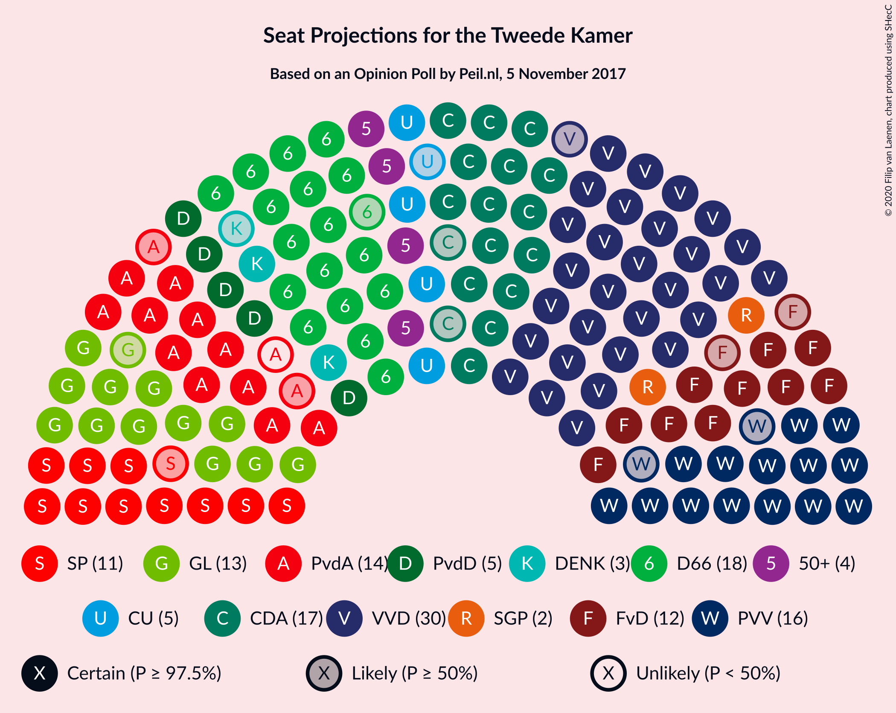
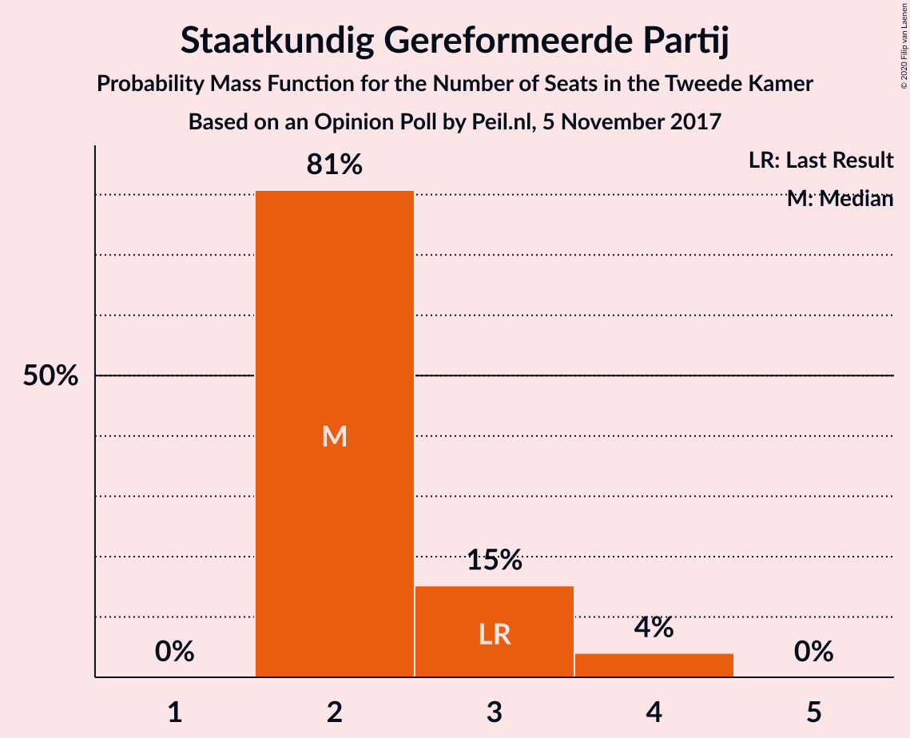
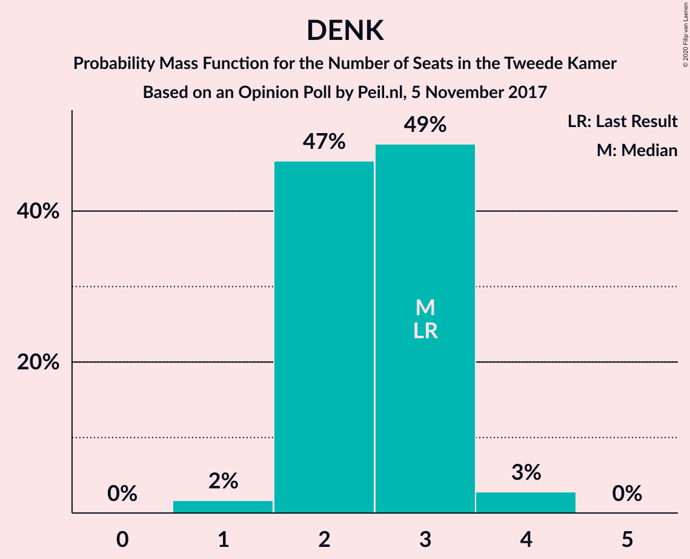
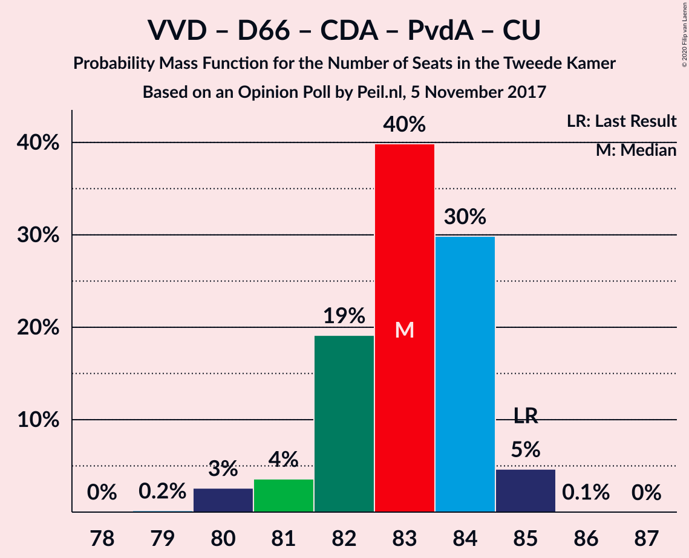
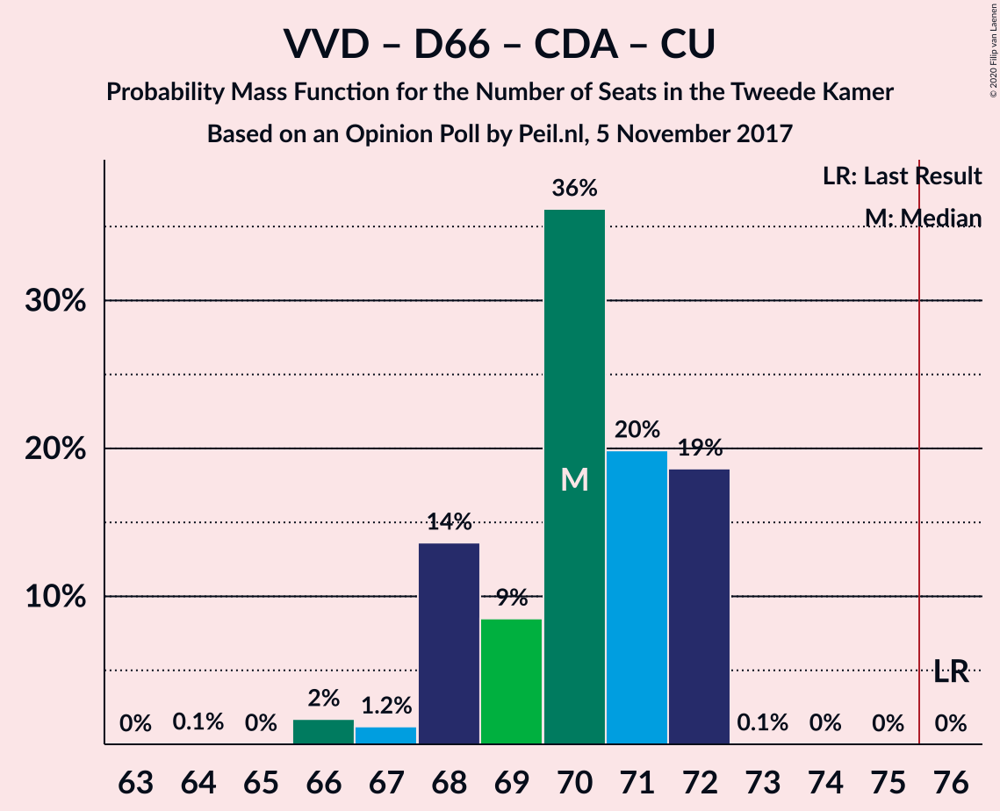
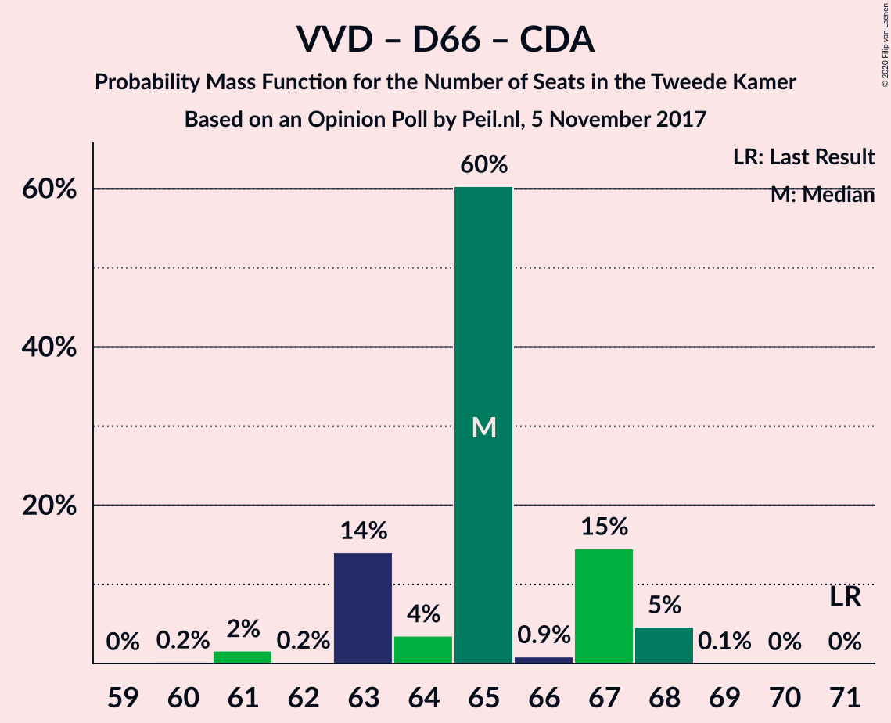
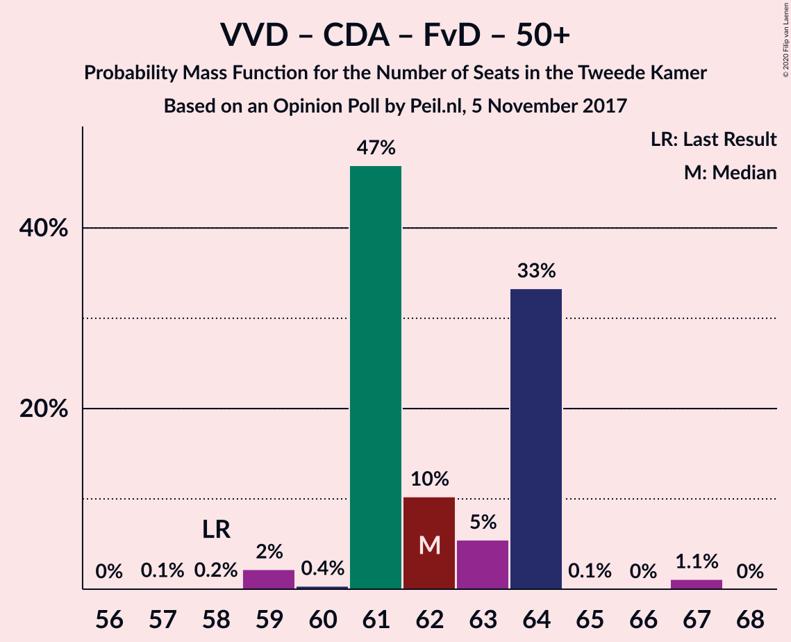
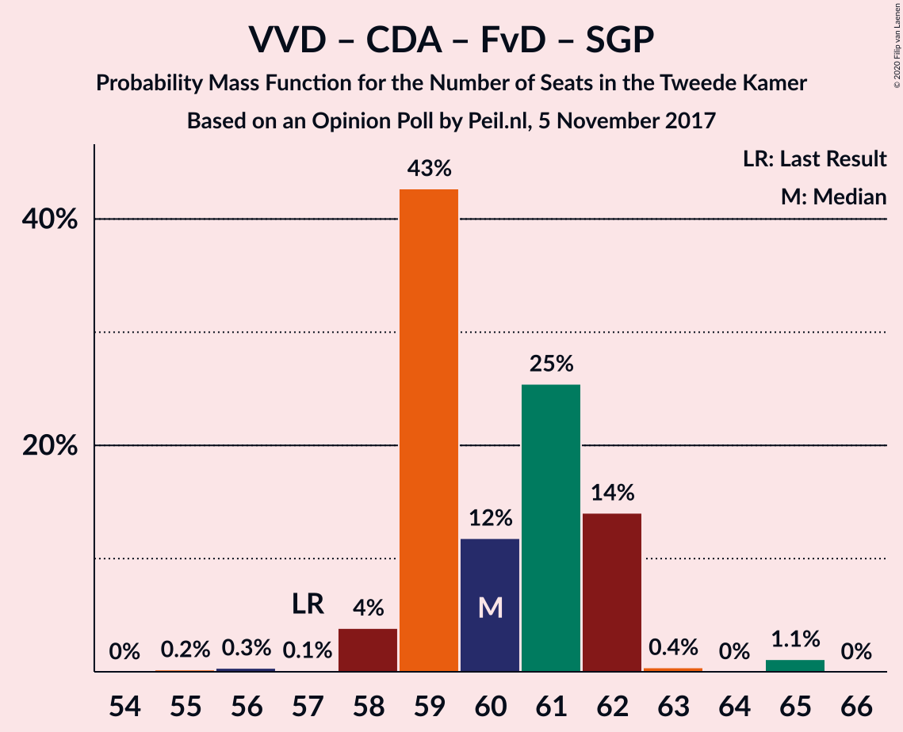
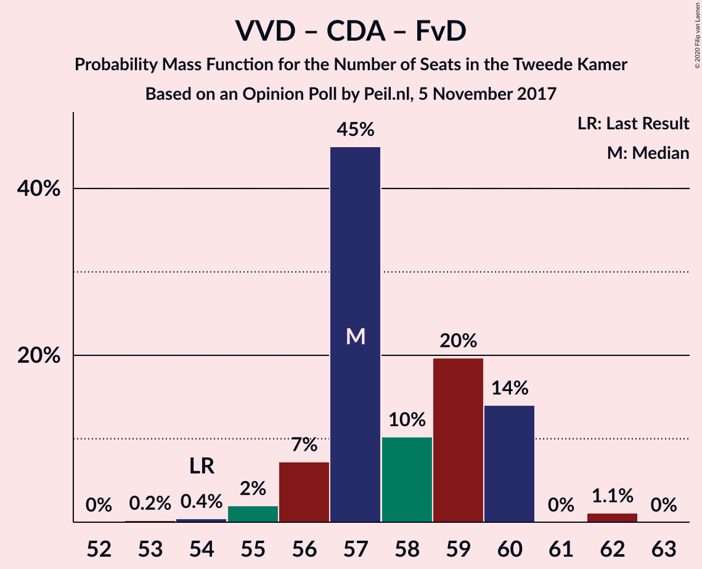
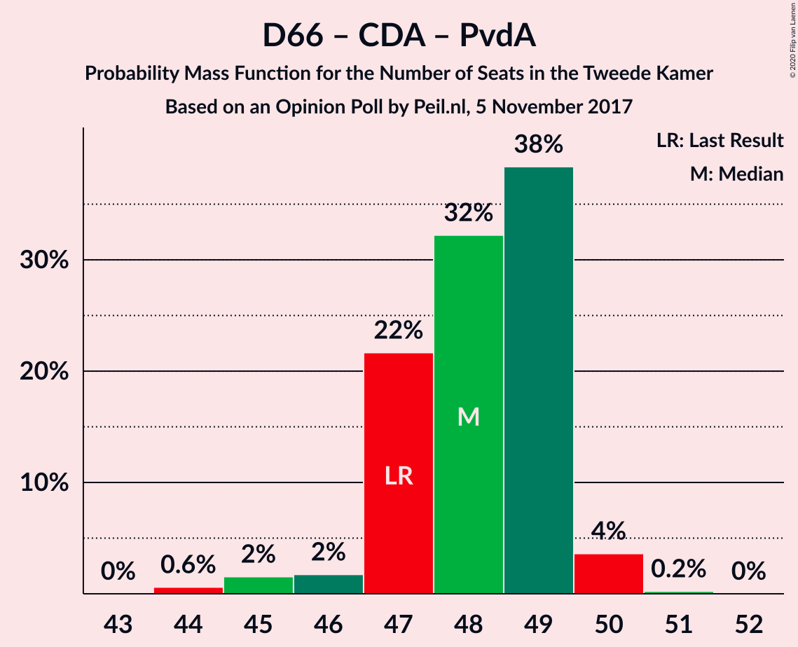

# Opinion Poll by Peil.nl, 5 November 2017

<a href="#voting-intentions">Voting Intentions</a> | <a href="#seats">Seats</a> | <a href="#coalitions">Coalitions</a> | <a href="#technical-information">Technical Information</a>

## Voting Intentions

### Confidence Intervals

| Party | Last Result | Poll Result | 80% Confidence Interval | 90% Confidence Interval | 95% Confidence Interval | 99% Confidence Interval |
|:-----:|:-----------:|:-----------:|:-----------------------:|:-----------------------:|:-----------------------:|:-----------------------:|
| Volkspartij voor Vrijheid en Democratie | 21.3% | 19.3% | 18.4–20.3% |18.2–20.6% |18.0–20.8% |17.5–21.3% |
| Democraten 66 | 12.2% | 12.0% | 11.3–12.8% |11.1–13.0% |10.9–13.2% |10.5–13.6% |
| Partij voor de Vrijheid | 13.1% | 10.7% | 10.0–11.4% |9.8–11.6% |9.6–11.8% |9.3–12.2% |
| Christen-Democratisch Appèl | 12.4% | 10.7% | 10.0–11.4% |9.8–11.6% |9.6–11.8% |9.3–12.2% |
| GroenLinks | 9.1% | 8.7% | 8.0–9.4% |7.8–9.6% |7.7–9.7% |7.4–10.1% |
| Partij van de Arbeid | 5.7% | 8.7% | 8.0–9.4% |7.8–9.6% |7.7–9.7% |7.4–10.1% |
| Socialistische Partij | 9.1% | 8.0% | 7.4–8.7% |7.2–8.9% |7.1–9.0% |6.8–9.4% |
| Forum voor Democratie | 1.8% | 7.3% | 6.8–8.0% |6.6–8.2% |6.4–8.3% |6.2–8.6% |
| Partij voor de Dieren | 3.2% | 4.0% | 3.6–4.5% |3.4–4.6% |3.4–4.8% |3.2–5.0% |
| ChristenUnie | 3.4% | 3.3% | 2.9–3.8% |2.8–3.9% |2.7–4.0% |2.6–4.3% |
| 50Plus | 3.1% | 3.3% | 2.9–3.8% |2.8–3.9% |2.7–4.0% |2.6–4.3% |
| Staatkundig Gereformeerde Partij | 2.1% | 2.0% | 1.7–2.4% |1.6–2.5% |1.6–2.6% |1.4–2.8% |
| DENK | 2.1% | 2.0% | 1.7–2.4% |1.6–2.5% |1.6–2.6% |1.4–2.8% |

*Note:* The poll result column reflects the actual value used in the calculations. Published results may vary slightly, and in addition be rounded to fewer digits.

## Seats

### Confidence Intervals

| Party | Last Result | Median | 80% Confidence Interval | 90% Confidence Interval | 95% Confidence Interval | 99% Confidence Interval |
|:-----:|:-----------:|:------:|:-----------------------:|:-----------------------:|:-----------------------:|:-----------------------:|
| <a href="#volkspartij-voor-vrijheid-en-democratie">Volkspartij voor Vrijheid en Democratie</a> | 33 | 30 | 29–31 |29–31 |29–31 |27–31 |
| <a href="#democraten-66">Democraten 66</a> | 19 | 18 | 17–20 |17–20 |17–20 |17–20 |
| <a href="#partij-voor-de-vrijheid">Partij voor de Vrijheid</a> | 20 | 16 | 16–17 |16–17 |16–17 |16–17 |
| <a href="#christen-democratisch-appèl">Christen-Democratisch Appèl</a> | 19 | 17 | 17–19 |17–19 |17–19 |17–19 |
| <a href="#groenlinks">GroenLinks</a> | 14 | 13 | 13–14 |13–14 |13–14 |13–14 |
| <a href="#partij-van-de-arbeid">Partij van de Arbeid</a> | 9 | 13 | 11–14 |11–14 |11–14 |11–14 |
| <a href="#socialistische-partij">Socialistische Partij</a> | 14 | 12 | 10–12 |10–12 |10–12 |10–12 |
| <a href="#forum-voor-democratie">Forum voor Democratie</a> | 2 | 11 | 10–11 |10–11 |10–11 |10–11 |
| <a href="#partij-voor-de-dieren">Partij voor de Dieren</a> | 5 | 6 | 5–7 |5–7 |5–7 |5–7 |
| <a href="#christenunie">ChristenUnie</a> | 5 | 5 | 4–5 |4–5 |4–5 |4–5 |
| <a href="#50plus">50Plus</a> | 4 | 4 | 4–5 |4–5 |4–5 |4–5 |
| <a href="#staatkundig-gereformeerde-partij">Staatkundig Gereformeerde Partij</a> | 3 | 2 | 2 |2 |2 |2–3 |
| <a href="#denk">DENK</a> | 3 | 3 | 2–3 |2–3 |2–3 |2–3 |

### Volkspartij voor Vrijheid en Democratie

*For a full overview of the results for this party, see the [Volkspartij voor Vrijheid en Democratie](party-volkspartijvoorvrijheidendemocratie.html) page.*

| Number of Seats | Probability | Accumulated | Special Marks |
|:---------------:|:-----------:|:-----------:|:-------------:|
| 27 | 0.5% | 100% |  |
| 28 | 0% | 99.5% |  |
| 29 | 42% | 99.4% |  |
| 30 | 46% | 57% | Median |
| 31 | 11% | 11% |  |
| 32 | 0.1% | 0.1% |  |
| 33 | 0% | 0% | Last Result |

### Democraten 66

*For a full overview of the results for this party, see the [Democraten 66](party-democraten66.html) page.*

| Number of Seats | Probability | Accumulated | Special Marks |
|:---------------:|:-----------:|:-----------:|:-------------:|
| 16 | 0.1% | 100% |  |
| 17 | 42% | 99.9% |  |
| 18 | 46% | 58% | Median |
| 19 | 0.6% | 12% | Last Result |
| 20 | 12% | 12% |  |
| 21 | 0% | 0% |  |

### Partij voor de Vrijheid

*For a full overview of the results for this party, see the [Partij voor de Vrijheid](party-partijvoordevrijheid.html) page.*

| Number of Seats | Probability | Accumulated | Special Marks |
|:---------------:|:-----------:|:-----------:|:-------------:|
| 14 | 0.1% | 100% |  |
| 15 | 0.1% | 99.9% |  |
| 16 | 54% | 99.8% | Median |
| 17 | 46% | 46% |  |
| 18 | 0% | 0% |  |
| 19 | 0% | 0% |  |
| 20 | 0% | 0% | Last Result |

### Christen-Democratisch Appèl

*For a full overview of the results for this party, see the [Christen-Democratisch Appèl](party-christen-democratischappèl.html) page.*

| Number of Seats | Probability | Accumulated | Special Marks |
|:---------------:|:-----------:|:-----------:|:-------------:|
| 15 | 0.2% | 100% |  |
| 16 | 0.2% | 99.8% |  |
| 17 | 53% | 99.6% | Median |
| 18 | 0.5% | 46% |  |
| 19 | 46% | 46% | Last Result |
| 20 | 0% | 0% |  |

### GroenLinks

*For a full overview of the results for this party, see the [GroenLinks](party-groenlinks.html) page.*

| Number of Seats | Probability | Accumulated | Special Marks |
|:---------------:|:-----------:|:-----------:|:-------------:|
| 11 | 0% | 100% |  |
| 12 | 0.3% | 99.9% |  |
| 13 | 57% | 99.7% | Median |
| 14 | 42% | 43% | Last Result |
| 15 | 0.4% | 0.5% |  |
| 16 | 0% | 0% |  |

### Partij van de Arbeid

*For a full overview of the results for this party, see the [Partij van de Arbeid](party-partijvandearbeid.html) page.*

| Number of Seats | Probability | Accumulated | Special Marks |
|:---------------:|:-----------:|:-----------:|:-------------:|
| 9 | 0% | 100% | Last Result |
| 10 | 0% | 100% |  |
| 11 | 46% | 100% |  |
| 12 | 0.6% | 54% |  |
| 13 | 11% | 54% | Median |
| 14 | 42% | 42% |  |
| 15 | 0% | 0% |  |

### Socialistische Partij

*For a full overview of the results for this party, see the [Socialistische Partij](party-socialistischepartij.html) page.*

| Number of Seats | Probability | Accumulated | Special Marks |
|:---------------:|:-----------:|:-----------:|:-------------:|
| 10 | 11% | 100% |  |
| 11 | 0.1% | 89% |  |
| 12 | 88% | 88% | Median |
| 13 | 0.1% | 0.1% |  |
| 14 | 0% | 0% | Last Result |

### Forum voor Democratie

*For a full overview of the results for this party, see the [Forum voor Democratie](party-forumvoordemocratie.html) page.*

| Number of Seats | Probability | Accumulated | Special Marks |
|:---------------:|:-----------:|:-----------:|:-------------:|
| 2 | 0% | 100% | Last Result |
| 3 | 0% | 100% |  |
| 4 | 0% | 100% |  |
| 5 | 0% | 100% |  |
| 6 | 0% | 100% |  |
| 7 | 0% | 100% |  |
| 8 | 0% | 100% |  |
| 9 | 0.1% | 100% |  |
| 10 | 12% | 99.9% |  |
| 11 | 88% | 88% | Median |
| 12 | 0.2% | 0.3% |  |
| 13 | 0.1% | 0.1% |  |
| 14 | 0% | 0% |  |

### Partij voor de Dieren

*For a full overview of the results for this party, see the [Partij voor de Dieren](party-partijvoordedieren.html) page.*

| Number of Seats | Probability | Accumulated | Special Marks |
|:---------------:|:-----------:|:-----------:|:-------------:|
| 5 | 46% | 100% | Last Result |
| 6 | 12% | 54% | Median |
| 7 | 42% | 42% |  |
| 8 | 0% | 0% |  |

### ChristenUnie

*For a full overview of the results for this party, see the [ChristenUnie](party-christenunie.html) page.*

| Number of Seats | Probability | Accumulated | Special Marks |
|:---------------:|:-----------:|:-----------:|:-------------:|
| 4 | 12% | 100% |  |
| 5 | 88% | 88% | Last Result, Median |
| 6 | 0.1% | 0.1% |  |
| 7 | 0% | 0% |  |

### 50Plus

*For a full overview of the results for this party, see the [50Plus](party-50plus.html) page.*

| Number of Seats | Probability | Accumulated | Special Marks |
|:---------------:|:-----------:|:-----------:|:-------------:|
| 4 | 88% | 100% | Last Result, Median |
| 5 | 12% | 12% |  |
| 6 | 0% | 0% |  |

### Staatkundig Gereformeerde Partij

*For a full overview of the results for this party, see the [Staatkundig Gereformeerde Partij](party-staatkundiggereformeerdepartij.html) page.*

| Number of Seats | Probability | Accumulated | Special Marks |
|:---------------:|:-----------:|:-----------:|:-------------:|
| 2 | 99.3% | 100% | Median |
| 3 | 0.5% | 0.7% | Last Result |
| 4 | 0.1% | 0.1% |  |
| 5 | 0% | 0% |  |

### DENK

*For a full overview of the results for this party, see the [DENK](party-denk.html) page.*

| Number of Seats | Probability | Accumulated | Special Marks |
|:---------------:|:-----------:|:-----------:|:-------------:|
| 2 | 42% | 100% |  |
| 3 | 58% | 58% | Last Result, Median |
| 4 | 0.1% | 0.1% |  |
| 5 | 0% | 0% |  |

## Coalitions

### Confidence Intervals

| Coalition | Last Result | Median | Majority? | 80% Confidence Interval | 90% Confidence Interval | 95% Confidence Interval | 99% Confidence Interval |
|:---------:|:-----------:|:------:|:---------:|:-----------------------:|:-----------------------:|:-----------------------:|:-----------------------:|
| Volkspartij voor Vrijheid en Democratie – Democraten 66 – Christen-Democratisch Appèl – GroenLinks – ChristenUnie | 90 | 85 | 100% | 82–85 | 82–85 | 82–85 | 82–85 |
| Volkspartij voor Vrijheid en Democratie – Democraten 66 – Christen-Democratisch Appèl – Partij van de Arbeid – ChristenUnie | 85 | 83 | 100% | 82–85 | 82–85 | 82–85 | 81–85 |
| Democraten 66 – Christen-Democratisch Appèl – GroenLinks – Partij van de Arbeid – Socialistische Partij – ChristenUnie | 80 | 78 | 99.8% | 77–79 | 77–79 | 77–79 | 77–79 |
| Volkspartij voor Vrijheid en Democratie – Christen-Democratisch Appèl – Partij voor de Vrijheid – Forum voor Democratie – Staatkundig Gereformeerde Partij | 77 | 76 | 57% | 75–79 | 75–79 | 75–79 | 74–79 |
| Volkspartij voor Vrijheid en Democratie – Christen-Democratisch Appèl – Partij voor de Vrijheid – Forum voor Democratie | 74 | 74 | 46% | 73–77 | 73–77 | 73–77 | 72–77 |
| Volkspartij voor Vrijheid en Democratie – Democraten 66 – Christen-Democratisch Appèl – ChristenUnie | 76 | 72 | 0% | 68–72 | 68–72 | 68–72 | 68–72 |
| Volkspartij voor Vrijheid en Democratie – Democraten 66 – Christen-Democratisch Appèl | 71 | 67 | 0% | 63–68 | 63–68 | 63–68 | 63–68 |
| Democraten 66 – Christen-Democratisch Appèl – GroenLinks – Partij van de Arbeid – ChristenUnie | 66 | 67 | 0% | 66–67 | 66–67 | 66–67 | 66–67 |
| Volkspartij voor Vrijheid en Democratie – Christen-Democratisch Appèl – Forum voor Democratie – 50Plus – Staatkundig Gereformeerde Partij | 61 | 65 | 0% | 63–66 | 63–66 | 63–66 | 63–66 |
| Volkspartij voor Vrijheid en Democratie – Christen-Democratisch Appèl – Partij voor de Vrijheid | 72 | 64 | 0% | 62–66 | 62–66 | 62–66 | 61–66 |
| Volkspartij voor Vrijheid en Democratie – Christen-Democratisch Appèl – Forum voor Democratie – 50Plus | 58 | 63 | 0% | 61–64 | 61–64 | 61–64 | 61–64 |
| Volkspartij voor Vrijheid en Democratie – Democraten 66 – Partij van de Arbeid | 61 | 60 | 0% | 59–64 | 59–64 | 59–64 | 59–64 |
| Volkspartij voor Vrijheid en Democratie – Christen-Democratisch Appèl – Forum voor Democratie – Staatkundig Gereformeerde Partij | 57 | 60 | 0% | 59–62 | 59–62 | 59–62 | 58–62 |
| Volkspartij voor Vrijheid en Democratie – Christen-Democratisch Appèl – Partij van de Arbeid | 61 | 60 | 0% | 60–61 | 60–61 | 60–61 | 57–61 |
| Volkspartij voor Vrijheid en Democratie – Christen-Democratisch Appèl – Forum voor Democratie | 54 | 58 | 0% | 57–60 | 57–60 | 57–60 | 56–60 |
| Democraten 66 – Christen-Democratisch Appèl – Partij van de Arbeid | 47 | 48 | 0% | 48–50 | 48–50 | 48–50 | 48–50 |
| Volkspartij voor Vrijheid en Democratie – Christen-Democratisch Appèl | 52 | 48 | 0% | 46–49 | 46–49 | 46–49 | 45–49 |
| Volkspartij voor Vrijheid en Democratie – Partij van de Arbeid | 42 | 43 | 0% | 41–44 | 41–44 | 41–44 | 40–44 |
| Democraten 66 – Christen-Democratisch Appèl | 38 | 37 | 0% | 34–37 | 34–37 | 34–37 | 34–37 |
| Christen-Democratisch Appèl – Partij van de Arbeid – ChristenUnie | 33 | 35 | 0% | 34–36 | 34–36 | 34–36 | 34–36 |
| Christen-Democratisch Appèl – Partij van de Arbeid | 28 | 30 | 0% | 30–31 | 30–31 | 30–31 | 30–31 |

### Volkspartij voor Vrijheid en Democratie – Democraten 66 – Christen-Democratisch Appèl – GroenLinks – ChristenUnie

| Number of Seats | Probability | Accumulated | Special Marks |
|:---------------:|:-----------:|:-----------:|:-------------:|
| 79 | 0.1% | 100% |  |
| 80 | 0.1% | 99.9% |  |
| 81 | 0% | 99.8% |  |
| 82 | 42% | 99.8% |  |
| 83 | 0.1% | 58% | Median |
| 84 | 0.5% | 58% |  |
| 85 | 57% | 57% |  |
| 86 | 0% | 0% |  |
| 87 | 0% | 0% |  |
| 88 | 0% | 0% |  |
| 89 | 0% | 0% |  |
| 90 | 0% | 0% | Last Result |

### Volkspartij voor Vrijheid en Democratie – Democraten 66 – Christen-Democratisch Appèl – Partij van de Arbeid – ChristenUnie

| Number of Seats | Probability | Accumulated | Special Marks |
|:---------------:|:-----------:|:-----------:|:-------------:|
| 80 | 0.2% | 100% |  |
| 81 | 0.5% | 99.8% |  |
| 82 | 42% | 99.3% |  |
| 83 | 46% | 57% | Median |
| 84 | 0.1% | 12% |  |
| 85 | 11% | 11% | Last Result |
| 86 | 0% | 0% |  |

### Democraten 66 – Christen-Democratisch Appèl – GroenLinks – Partij van de Arbeid – Socialistische Partij – ChristenUnie

| Number of Seats | Probability | Accumulated | Special Marks |
|:---------------:|:-----------:|:-----------:|:-------------:|
| 75 | 0.1% | 100% |  |
| 76 | 0% | 99.8% | Majority |
| 77 | 12% | 99.8% |  |
| 78 | 46% | 88% | Median |
| 79 | 42% | 42% |  |
| 80 | 0% | 0.5% | Last Result |
| 81 | 0.4% | 0.5% |  |
| 82 | 0% | 0% |  |

### Volkspartij voor Vrijheid en Democratie – Christen-Democratisch Appèl – Partij voor de Vrijheid – Forum voor Democratie – Staatkundig Gereformeerde Partij

| Number of Seats | Probability | Accumulated | Special Marks |
|:---------------:|:-----------:|:-----------:|:-------------:|
| 74 | 0.6% | 100% |  |
| 75 | 42% | 99.4% |  |
| 76 | 12% | 57% | Median, Majority |
| 77 | 0% | 46% | Last Result |
| 78 | 0.1% | 46% |  |
| 79 | 46% | 46% |  |
| 80 | 0% | 0% |  |

### Volkspartij voor Vrijheid en Democratie – Christen-Democratisch Appèl – Partij voor de Vrijheid – Forum voor Democratie

| Number of Seats | Probability | Accumulated | Special Marks |
|:---------------:|:-----------:|:-----------:|:-------------:|
| 71 | 0.5% | 100% |  |
| 72 | 0.2% | 99.5% |  |
| 73 | 42% | 99.3% |  |
| 74 | 11% | 57% | Last Result, Median |
| 75 | 0% | 46% |  |
| 76 | 0.1% | 46% | Majority |
| 77 | 46% | 46% |  |
| 78 | 0% | 0% |  |

### Volkspartij voor Vrijheid en Democratie – Democraten 66 – Christen-Democratisch Appèl – ChristenUnie

| Number of Seats | Probability | Accumulated | Special Marks |
|:---------------:|:-----------:|:-----------:|:-------------:|
| 66 | 0% | 100% |  |
| 67 | 0% | 99.9% |  |
| 68 | 42% | 99.9% |  |
| 69 | 0.4% | 58% |  |
| 70 | 0.1% | 57% | Median |
| 71 | 0.1% | 57% |  |
| 72 | 57% | 57% |  |
| 73 | 0% | 0% |  |
| 74 | 0% | 0% |  |
| 75 | 0% | 0% |  |
| 76 | 0% | 0% | Last Result, Majority |

### Volkspartij voor Vrijheid en Democratie – Democraten 66 – Christen-Democratisch Appèl

| Number of Seats | Probability | Accumulated | Special Marks |
|:---------------:|:-----------:|:-----------:|:-------------:|
| 63 | 42% | 100% |  |
| 64 | 0.7% | 58% |  |
| 65 | 0.1% | 57% | Median |
| 66 | 0.1% | 57% |  |
| 67 | 46% | 57% |  |
| 68 | 11% | 11% |  |
| 69 | 0% | 0% |  |
| 70 | 0% | 0% |  |
| 71 | 0% | 0% | Last Result |

### Democraten 66 – Christen-Democratisch Appèl – GroenLinks – Partij van de Arbeid – ChristenUnie

| Number of Seats | Probability | Accumulated | Special Marks |
|:---------------:|:-----------:|:-----------:|:-------------:|
| 63 | 0.1% | 100% |  |
| 64 | 0% | 99.8% |  |
| 65 | 0% | 99.8% |  |
| 66 | 46% | 99.7% | Last Result, Median |
| 67 | 53% | 54% |  |
| 68 | 0% | 0.5% |  |
| 69 | 0.4% | 0.5% |  |
| 70 | 0% | 0% |  |

### Volkspartij voor Vrijheid en Democratie – Christen-Democratisch Appèl – Forum voor Democratie – 50Plus – Staatkundig Gereformeerde Partij

| Number of Seats | Probability | Accumulated | Special Marks |
|:---------------:|:-----------:|:-----------:|:-------------:|
| 61 | 0% | 100% | Last Result |
| 62 | 0.4% | 100% |  |
| 63 | 42% | 99.5% |  |
| 64 | 0.1% | 57% | Median |
| 65 | 12% | 57% |  |
| 66 | 46% | 46% |  |
| 67 | 0% | 0% |  |

### Volkspartij voor Vrijheid en Democratie – Christen-Democratisch Appèl – Partij voor de Vrijheid

| Number of Seats | Probability | Accumulated | Special Marks |
|:---------------:|:-----------:|:-----------:|:-------------:|
| 59 | 0.1% | 100% |  |
| 60 | 0.1% | 99.9% |  |
| 61 | 0.5% | 99.8% |  |
| 62 | 42% | 99.2% |  |
| 63 | 0% | 57% | Median |
| 64 | 11% | 57% |  |
| 65 | 0% | 46% |  |
| 66 | 46% | 46% |  |
| 67 | 0% | 0% |  |
| 68 | 0% | 0% |  |
| 69 | 0% | 0% |  |
| 70 | 0% | 0% |  |
| 71 | 0% | 0% |  |
| 72 | 0% | 0% | Last Result |

### Volkspartij voor Vrijheid en Democratie – Christen-Democratisch Appèl – Forum voor Democratie – 50Plus

| Number of Seats | Probability | Accumulated | Special Marks |
|:---------------:|:-----------:|:-----------:|:-------------:|
| 58 | 0% | 100% | Last Result |
| 59 | 0.5% | 100% |  |
| 60 | 0% | 99.5% |  |
| 61 | 42% | 99.5% |  |
| 62 | 0% | 57% | Median |
| 63 | 12% | 57% |  |
| 64 | 46% | 46% |  |
| 65 | 0% | 0% |  |

### Volkspartij voor Vrijheid en Democratie – Democraten 66 – Partij van de Arbeid

| Number of Seats | Probability | Accumulated | Special Marks |
|:---------------:|:-----------:|:-----------:|:-------------:|
| 58 | 0.4% | 100% |  |
| 59 | 46% | 99.5% |  |
| 60 | 42% | 54% |  |
| 61 | 0.2% | 12% | Last Result, Median |
| 62 | 0.1% | 12% |  |
| 63 | 0.1% | 11% |  |
| 64 | 11% | 11% |  |
| 65 | 0% | 0% |  |

### Volkspartij voor Vrijheid en Democratie – Christen-Democratisch Appèl – Forum voor Democratie – Staatkundig Gereformeerde Partij

| Number of Seats | Probability | Accumulated | Special Marks |
|:---------------:|:-----------:|:-----------:|:-------------:|
| 57 | 0% | 100% | Last Result |
| 58 | 0.5% | 99.9% |  |
| 59 | 42% | 99.5% |  |
| 60 | 12% | 57% | Median |
| 61 | 0.1% | 46% |  |
| 62 | 46% | 46% |  |
| 63 | 0% | 0% |  |

### Volkspartij voor Vrijheid en Democratie – Christen-Democratisch Appèl – Partij van de Arbeid

| Number of Seats | Probability | Accumulated | Special Marks |
|:---------------:|:-----------:|:-----------:|:-------------:|
| 56 | 0.2% | 100% |  |
| 57 | 0.5% | 99.8% |  |
| 58 | 0% | 99.4% |  |
| 59 | 0.1% | 99.3% |  |
| 60 | 88% | 99.2% | Median |
| 61 | 11% | 11% | Last Result |
| 62 | 0% | 0% |  |

### Volkspartij voor Vrijheid en Democratie – Christen-Democratisch Appèl – Forum voor Democratie

| Number of Seats | Probability | Accumulated | Special Marks |
|:---------------:|:-----------:|:-----------:|:-------------:|
| 54 | 0% | 100% | Last Result |
| 55 | 0.4% | 100% |  |
| 56 | 0.2% | 99.5% |  |
| 57 | 42% | 99.4% |  |
| 58 | 12% | 57% | Median |
| 59 | 0% | 46% |  |
| 60 | 46% | 46% |  |
| 61 | 0% | 0% |  |

### Democraten 66 – Christen-Democratisch Appèl – Partij van de Arbeid

| Number of Seats | Probability | Accumulated | Special Marks |
|:---------------:|:-----------:|:-----------:|:-------------:|
| 45 | 0% | 100% |  |
| 46 | 0% | 99.9% |  |
| 47 | 0.2% | 99.9% | Last Result |
| 48 | 88% | 99.8% | Median |
| 49 | 0.5% | 12% |  |
| 50 | 11% | 11% |  |
| 51 | 0% | 0% |  |

### Volkspartij voor Vrijheid en Democratie – Christen-Democratisch Appèl

| Number of Seats | Probability | Accumulated | Special Marks |
|:---------------:|:-----------:|:-----------:|:-------------:|
| 44 | 0.1% | 100% |  |
| 45 | 0.5% | 99.8% |  |
| 46 | 42% | 99.3% |  |
| 47 | 0.1% | 57% | Median |
| 48 | 11% | 57% |  |
| 49 | 46% | 46% |  |
| 50 | 0% | 0% |  |
| 51 | 0% | 0% |  |
| 52 | 0% | 0% | Last Result |

### Volkspartij voor Vrijheid en Democratie – Partij van de Arbeid

| Number of Seats | Probability | Accumulated | Special Marks |
|:---------------:|:-----------:|:-----------:|:-------------:|
| 39 | 0.5% | 100% |  |
| 40 | 0% | 99.5% |  |
| 41 | 46% | 99.5% |  |
| 42 | 0% | 54% | Last Result |
| 43 | 42% | 54% | Median |
| 44 | 12% | 12% |  |
| 45 | 0% | 0.1% |  |
| 46 | 0% | 0% |  |

### Democraten 66 – Christen-Democratisch Appèl

| Number of Seats | Probability | Accumulated | Special Marks |
|:---------------:|:-----------:|:-----------:|:-------------:|
| 33 | 0% | 100% |  |
| 34 | 42% | 99.9% |  |
| 35 | 0.1% | 58% | Median |
| 36 | 0.1% | 58% |  |
| 37 | 58% | 58% |  |
| 38 | 0% | 0% | Last Result |

### Christen-Democratisch Appèl – Partij van de Arbeid – ChristenUnie

| Number of Seats | Probability | Accumulated | Special Marks |
|:---------------:|:-----------:|:-----------:|:-------------:|
| 31 | 0.1% | 100% |  |
| 32 | 0% | 99.9% |  |
| 33 | 0% | 99.8% | Last Result |
| 34 | 11% | 99.8% |  |
| 35 | 46% | 88% | Median |
| 36 | 42% | 42% |  |
| 37 | 0% | 0% |  |

### Christen-Democratisch Appèl – Partij van de Arbeid

| Number of Seats | Probability | Accumulated | Special Marks |
|:---------------:|:-----------:|:-----------:|:-------------:|
| 27 | 0.1% | 100% |  |
| 28 | 0% | 99.9% | Last Result |
| 29 | 0.2% | 99.9% |  |
| 30 | 58% | 99.6% | Median |
| 31 | 42% | 42% |  |
| 32 | 0% | 0% |  |

## Technical Information

### Opinion Poll

+ **Polling firm:** Peil.nl
+ **Commissioner(s):** —
+ **Fieldwork period:** 5 November 2017

### Calculations

+ **Sample size:** 3000
+ **Simulations done:** 131,072
+ **Error estimate:** 1.91%

