# Opinion Poll by Peil.nl, 19 November 2017

<a href="#voting-intentions">Voting Intentions</a> | <a href="#seats">Seats</a> | <a href="#coalitions">Coalitions</a> | <a href="#technical-information">Technical Information</a>

## Voting Intentions

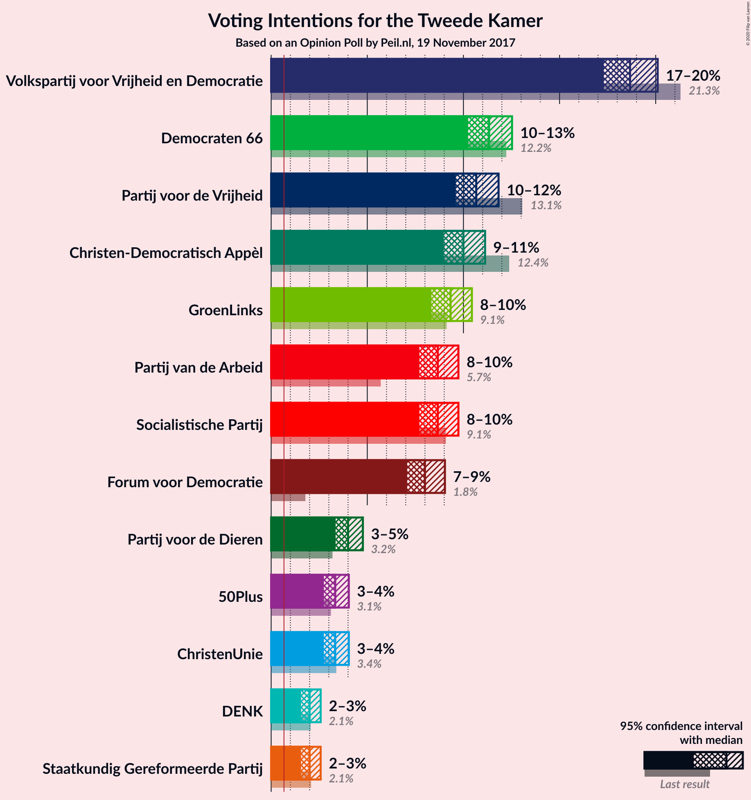

### Confidence Intervals

| Party | Last Result | Poll Result | 80% Confidence Interval | 90% Confidence Interval | 95% Confidence Interval | 99% Confidence Interval |
|:-----:|:-----------:|:-----------:|:-----------------------:|:-----------------------:|:-----------------------:|:-----------------------:|
| Volkspartij voor Vrijheid en Democratie | 21.3% | 18.7% | 17.8–19.6% |17.5–19.9% |17.3–20.1% |16.9–20.6% |
| Democraten 66 | 12.2% | 11.3% | 10.6–12.1% |10.4–12.3% |10.2–12.5% |9.9–12.9% |
| Partij voor de Vrijheid | 13.1% | 10.7% | 10.0–11.4% |9.8–11.6% |9.6–11.8% |9.3–12.2% |
| Christen-Democratisch Appèl | 12.4% | 10.0% | 9.3–10.7% |9.1–10.9% |9.0–11.1% |8.7–11.5% |
| GroenLinks | 9.1% | 9.3% | 8.7–10.1% |8.5–10.3% |8.3–10.4% |8.0–10.8% |
| Socialistische Partij | 9.1% | 8.7% | 8.0–9.4% |7.8–9.6% |7.7–9.7% |7.4–10.1% |
| Partij van de Arbeid | 5.7% | 8.7% | 8.0–9.4% |7.8–9.6% |7.7–9.7% |7.4–10.1% |
| Forum voor Democratie | 1.8% | 8.0% | 7.4–8.7% |7.2–8.9% |7.1–9.0% |6.8–9.4% |
| Partij voor de Dieren | 3.2% | 4.0% | 3.6–4.5% |3.4–4.6% |3.4–4.8% |3.2–5.0% |
| ChristenUnie | 3.4% | 3.3% | 2.9–3.8% |2.8–3.9% |2.7–4.0% |2.6–4.3% |
| 50Plus | 3.1% | 3.3% | 2.9–3.8% |2.8–3.9% |2.7–4.0% |2.6–4.3% |
| Staatkundig Gereformeerde Partij | 2.1% | 2.0% | 1.7–2.4% |1.6–2.5% |1.6–2.6% |1.4–2.8% |
| DENK | 2.1% | 2.0% | 1.7–2.4% |1.6–2.5% |1.6–2.6% |1.4–2.8% |

*Note:* The poll result column reflects the actual value used in the calculations. Published results may vary slightly, and in addition be rounded to fewer digits.

## Seats

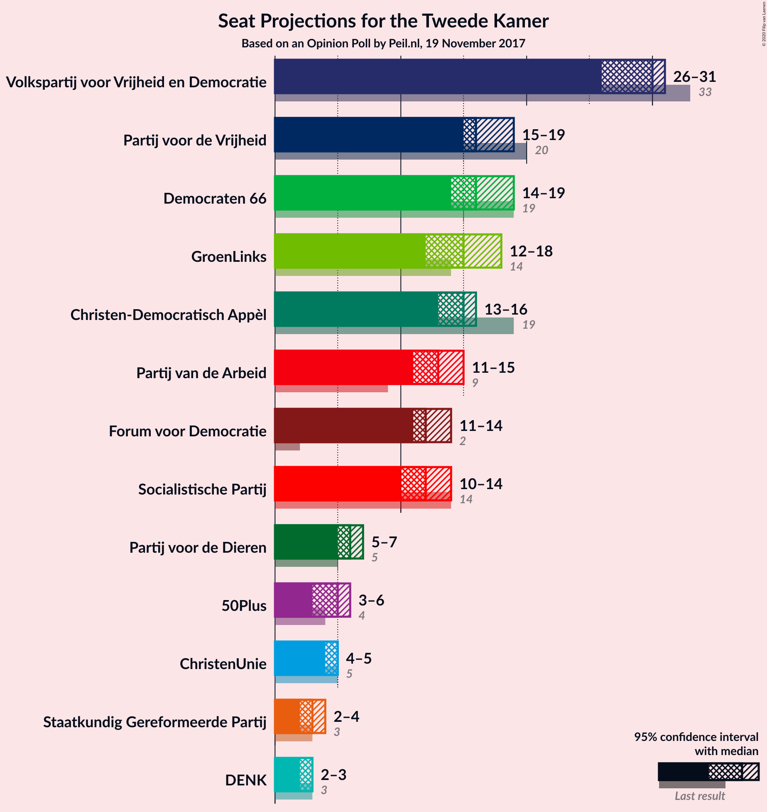

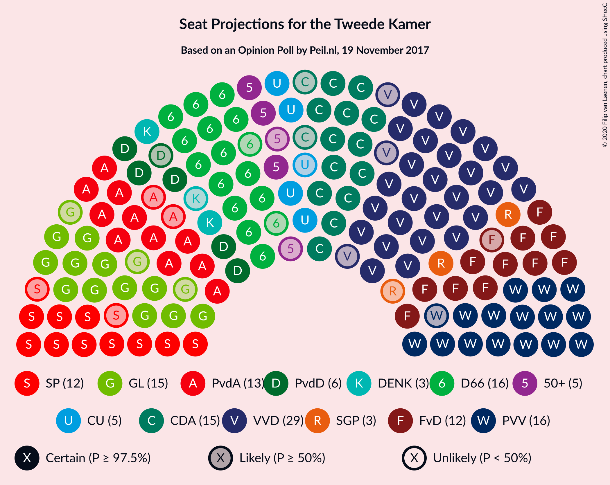

### Confidence Intervals

| Party | Last Result | Median | 80% Confidence Interval | 90% Confidence Interval | 95% Confidence Interval | 99% Confidence Interval |
|:-----:|:-----------:|:------:|:-----------------------:|:-----------------------:|:-----------------------:|:-----------------------:|
| <a href="#volkspartij-voor-vrijheid-en-democratie">Volkspartij voor Vrijheid en Democratie</a> | 33 | 30 | 26–31 |26–31 |26–31 |26–31 |
| <a href="#democraten-66">Democraten 66</a> | 19 | 16 | 14–19 |14–19 |14–19 |14–19 |
| <a href="#partij-voor-de-vrijheid">Partij voor de Vrijheid</a> | 20 | 16 | 16–18 |16–18 |15–19 |15–19 |
| <a href="#christen-democratisch-appèl">Christen-Democratisch Appèl</a> | 19 | 15 | 13–15 |13–16 |13–16 |13–17 |
| <a href="#groenlinks">GroenLinks</a> | 14 | 15 | 13–18 |13–18 |12–18 |12–18 |
| <a href="#socialistische-partij">Socialistische Partij</a> | 14 | 12 | 11–13 |11–13 |10–14 |10–15 |
| <a href="#partij-van-de-arbeid">Partij van de Arbeid</a> | 9 | 13 | 12–15 |11–15 |11–15 |11–15 |
| <a href="#forum-voor-democratie">Forum voor Democratie</a> | 2 | 12 | 12–14 |11–14 |11–14 |10–14 |
| <a href="#partij-voor-de-dieren">Partij voor de Dieren</a> | 5 | 6 | 5–7 |5–7 |5–7 |5–7 |
| <a href="#christenunie">ChristenUnie</a> | 5 | 5 | 4–5 |4–5 |4–5 |4–7 |
| <a href="#50plus">50Plus</a> | 4 | 5 | 4–6 |4–6 |3–6 |3–6 |
| <a href="#staatkundig-gereformeerde-partij">Staatkundig Gereformeerde Partij</a> | 3 | 3 | 2–3 |2–4 |2–4 |2–4 |
| <a href="#denk">DENK</a> | 3 | 3 | 2–3 |2–3 |2–3 |2–3 |

### Volkspartij voor Vrijheid en Democratie

*For a full overview of the results for this party, see the [Volkspartij voor Vrijheid en Democratie](party-volkspartijvoorvrijheidendemocratie.html) page.*

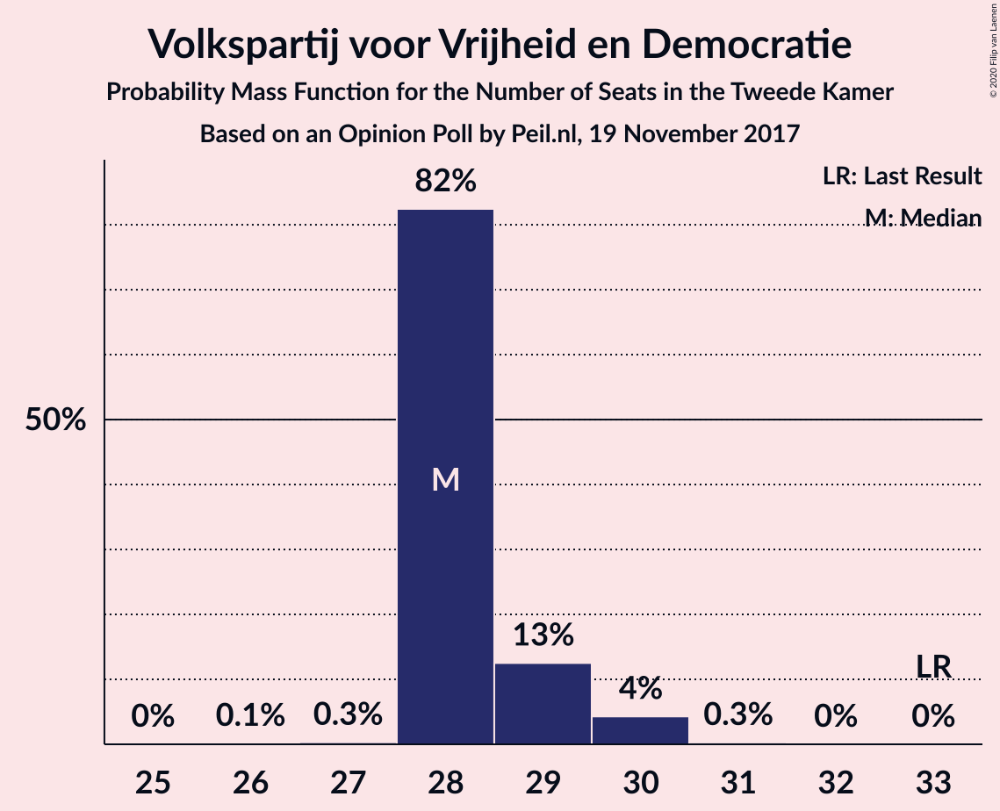

| Number of Seats | Probability | Accumulated | Special Marks |
|:---------------:|:-----------:|:-----------:|:-------------:|
| 26 | 10% | 100% |  |
| 27 | 5% | 89% |  |
| 28 | 0.7% | 85% |  |
| 29 | 34% | 84% |  |
| 30 | 5% | 50% | Median |
| 31 | 45% | 45% |  |
| 32 | 0.1% | 0.2% |  |
| 33 | 0.1% | 0.1% | Last Result |
| 34 | 0% | 0% |  |

### Democraten 66

*For a full overview of the results for this party, see the [Democraten 66](party-democraten66.html) page.*

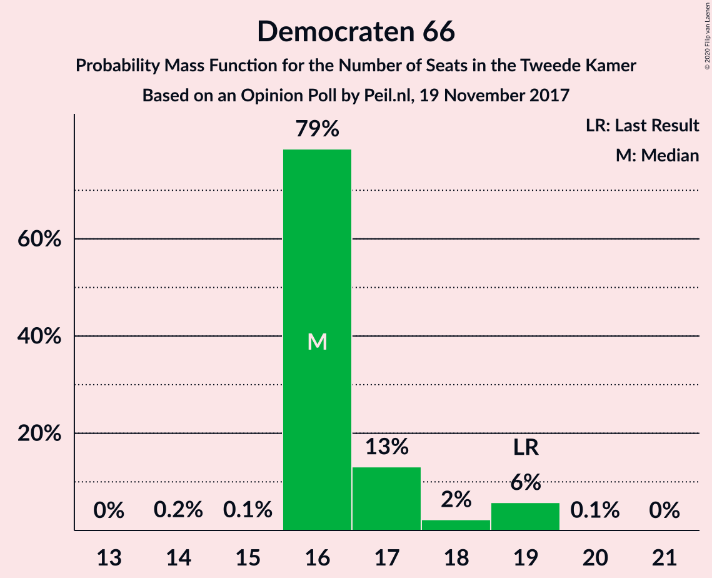

| Number of Seats | Probability | Accumulated | Special Marks |
|:---------------:|:-----------:|:-----------:|:-------------:|
| 14 | 25% | 100% |  |
| 15 | 0.3% | 75% |  |
| 16 | 47% | 75% | Median |
| 17 | 17% | 29% |  |
| 18 | 1.0% | 11% |  |
| 19 | 10% | 10% | Last Result |
| 20 | 0% | 0% |  |

### Partij voor de Vrijheid

*For a full overview of the results for this party, see the [Partij voor de Vrijheid](party-partijvoordevrijheid.html) page.*

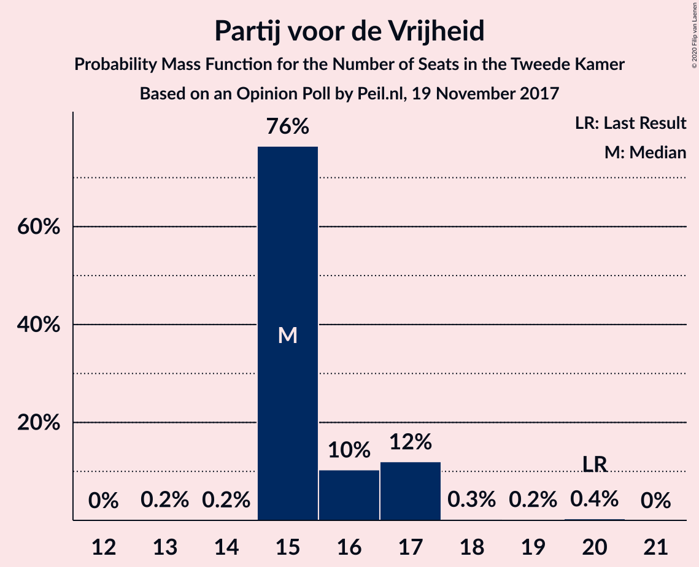

| Number of Seats | Probability | Accumulated | Special Marks |
|:---------------:|:-----------:|:-----------:|:-------------:|
| 14 | 0.1% | 100% |  |
| 15 | 4% | 99.9% |  |
| 16 | 67% | 96% | Median |
| 17 | 17% | 29% |  |
| 18 | 7% | 12% |  |
| 19 | 5% | 5% |  |
| 20 | 0% | 0% | Last Result |

### Christen-Democratisch Appèl

*For a full overview of the results for this party, see the [Christen-Democratisch Appèl](party-christen-democratischappèl.html) page.*

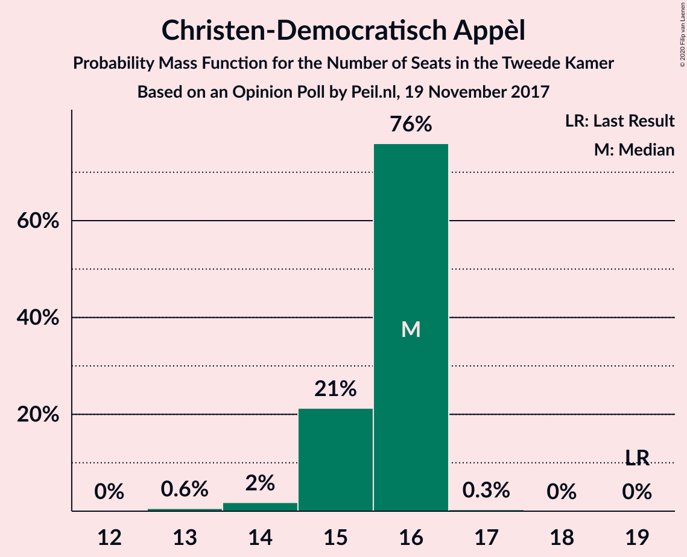

| Number of Seats | Probability | Accumulated | Special Marks |
|:---------------:|:-----------:|:-----------:|:-------------:|
| 12 | 0.3% | 100% |  |
| 13 | 11% | 99.7% |  |
| 14 | 6% | 88% |  |
| 15 | 74% | 83% | Median |
| 16 | 8% | 8% |  |
| 17 | 0.8% | 0.8% |  |
| 18 | 0% | 0% |  |
| 19 | 0% | 0% | Last Result |

### GroenLinks

*For a full overview of the results for this party, see the [GroenLinks](party-groenlinks.html) page.*

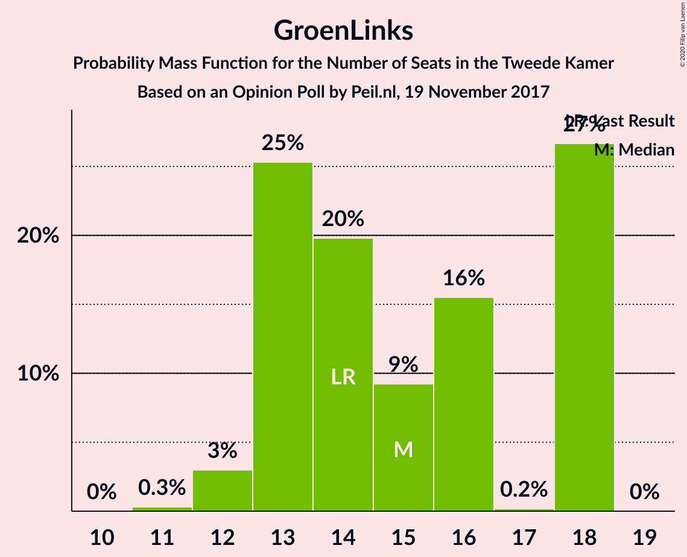

| Number of Seats | Probability | Accumulated | Special Marks |
|:---------------:|:-----------:|:-----------:|:-------------:|
| 11 | 0.3% | 100% |  |
| 12 | 3% | 99.7% |  |
| 13 | 25% | 97% |  |
| 14 | 20% | 71% | Last Result |
| 15 | 9% | 52% | Median |
| 16 | 16% | 42% |  |
| 17 | 0.2% | 27% |  |
| 18 | 27% | 27% |  |
| 19 | 0% | 0% |  |

### Socialistische Partij

*For a full overview of the results for this party, see the [Socialistische Partij](party-socialistischepartij.html) page.*

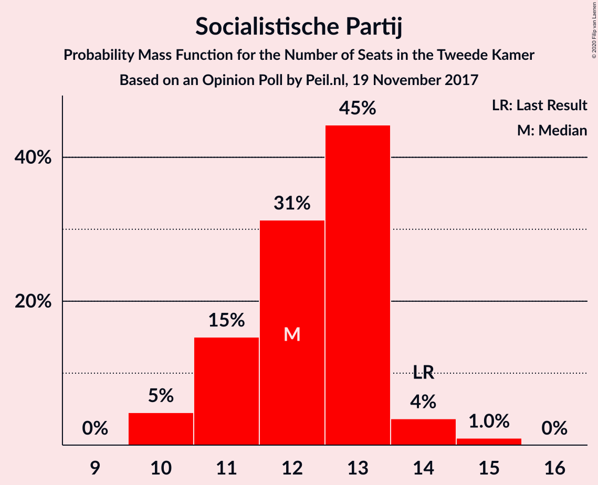

| Number of Seats | Probability | Accumulated | Special Marks |
|:---------------:|:-----------:|:-----------:|:-------------:|
| 10 | 5% | 100% |  |
| 11 | 15% | 95% |  |
| 12 | 31% | 80% | Median |
| 13 | 45% | 49% |  |
| 14 | 4% | 5% | Last Result |
| 15 | 1.0% | 1.0% |  |
| 16 | 0% | 0% |  |

### Partij van de Arbeid

*For a full overview of the results for this party, see the [Partij van de Arbeid](party-partijvandearbeid.html) page.*

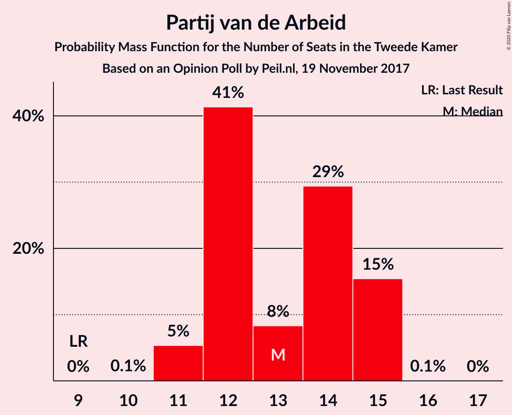

| Number of Seats | Probability | Accumulated | Special Marks |
|:---------------:|:-----------:|:-----------:|:-------------:|
| 9 | 0% | 100% | Last Result |
| 10 | 0.1% | 100% |  |
| 11 | 5% | 99.9% |  |
| 12 | 41% | 95% |  |
| 13 | 8% | 53% | Median |
| 14 | 29% | 45% |  |
| 15 | 15% | 15% |  |
| 16 | 0.1% | 0.1% |  |
| 17 | 0% | 0% |  |

### Forum voor Democratie

*For a full overview of the results for this party, see the [Forum voor Democratie](party-forumvoordemocratie.html) page.*

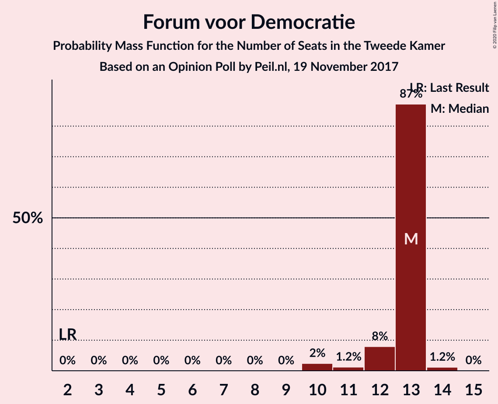

| Number of Seats | Probability | Accumulated | Special Marks |
|:---------------:|:-----------:|:-----------:|:-------------:|
| 2 | 0% | 100% | Last Result |
| 3 | 0% | 100% |  |
| 4 | 0% | 100% |  |
| 5 | 0% | 100% |  |
| 6 | 0% | 100% |  |
| 7 | 0% | 100% |  |
| 8 | 0% | 100% |  |
| 9 | 0% | 100% |  |
| 10 | 1.1% | 100% |  |
| 11 | 8% | 98.9% |  |
| 12 | 62% | 90% | Median |
| 13 | 4% | 29% |  |
| 14 | 25% | 25% |  |
| 15 | 0% | 0% |  |

### Partij voor de Dieren

*For a full overview of the results for this party, see the [Partij voor de Dieren](party-partijvoordedieren.html) page.*

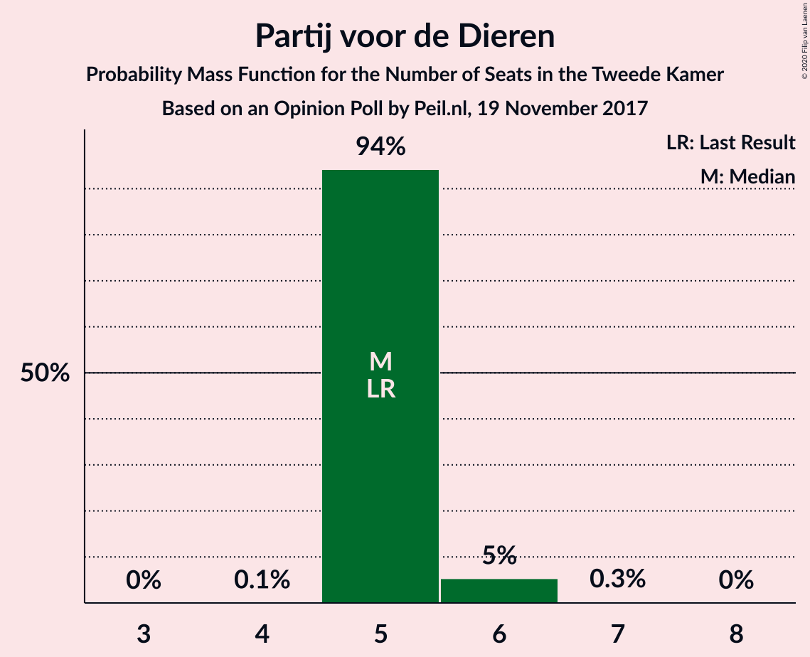

| Number of Seats | Probability | Accumulated | Special Marks |
|:---------------:|:-----------:|:-----------:|:-------------:|
| 4 | 0.3% | 100% |  |
| 5 | 36% | 99.7% | Last Result |
| 6 | 49% | 63% | Median |
| 7 | 14% | 14% |  |
| 8 | 0% | 0% |  |

### ChristenUnie

*For a full overview of the results for this party, see the [ChristenUnie](party-christenunie.html) page.*

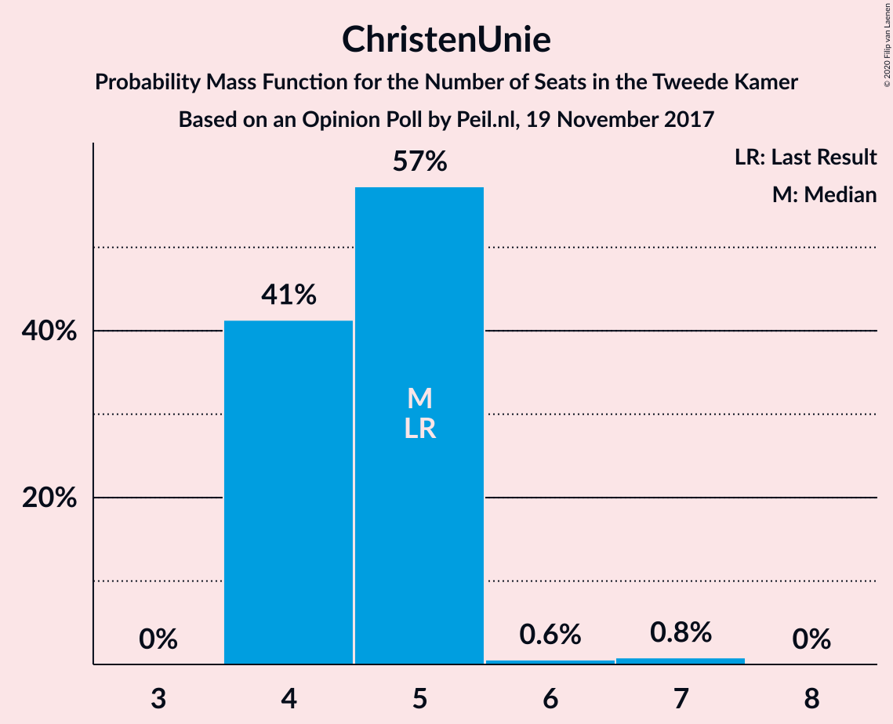

| Number of Seats | Probability | Accumulated | Special Marks |
|:---------------:|:-----------:|:-----------:|:-------------:|
| 4 | 41% | 100% |  |
| 5 | 57% | 59% | Last Result, Median |
| 6 | 0.6% | 1.4% |  |
| 7 | 0.8% | 0.8% |  |
| 8 | 0% | 0% |  |

### 50Plus

*For a full overview of the results for this party, see the [50Plus](party-50plus.html) page.*

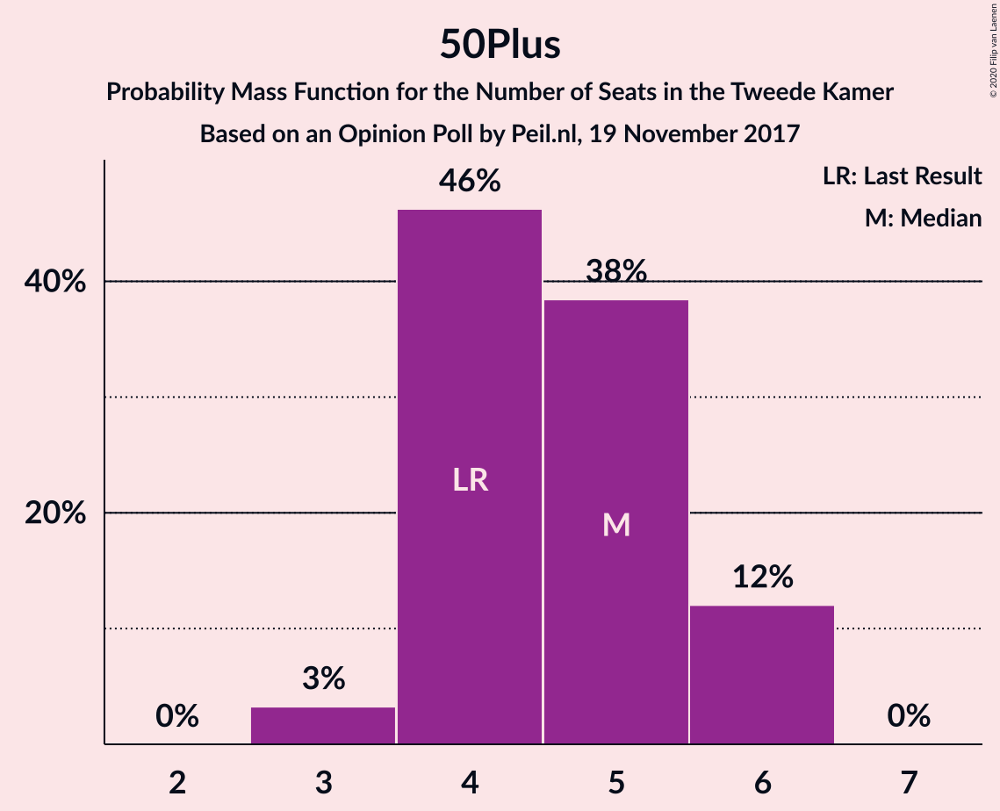

| Number of Seats | Probability | Accumulated | Special Marks |
|:---------------:|:-----------:|:-----------:|:-------------:|
| 3 | 3% | 100% |  |
| 4 | 46% | 97% | Last Result |
| 5 | 38% | 50% | Median |
| 6 | 12% | 12% |  |
| 7 | 0% | 0% |  |

### Staatkundig Gereformeerde Partij

*For a full overview of the results for this party, see the [Staatkundig Gereformeerde Partij](party-staatkundiggereformeerdepartij.html) page.*

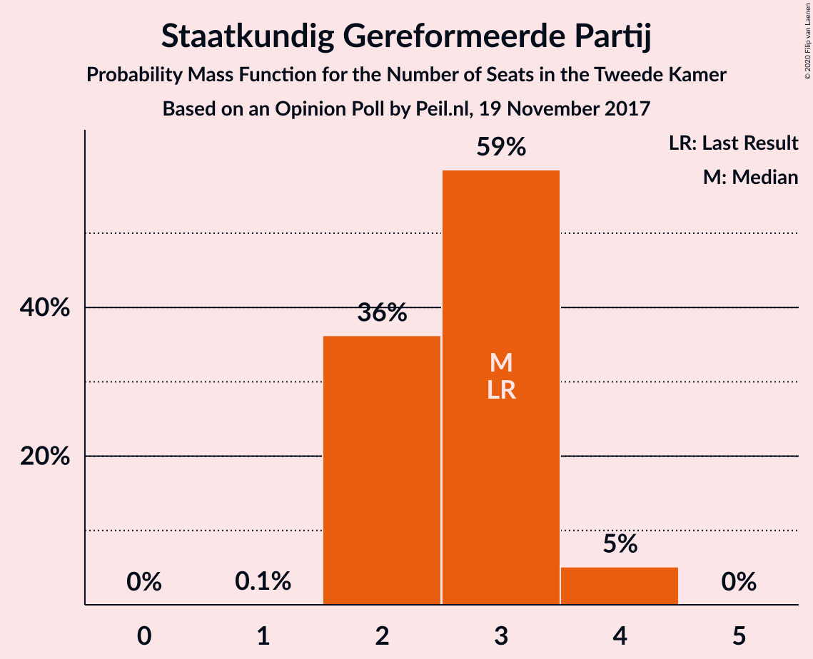

| Number of Seats | Probability | Accumulated | Special Marks |
|:---------------:|:-----------:|:-----------:|:-------------:|
| 1 | 0.1% | 100% |  |
| 2 | 36% | 99.9% |  |
| 3 | 59% | 64% | Last Result, Median |
| 4 | 5% | 5% |  |
| 5 | 0% | 0% |  |

### DENK

*For a full overview of the results for this party, see the [DENK](party-denk.html) page.*

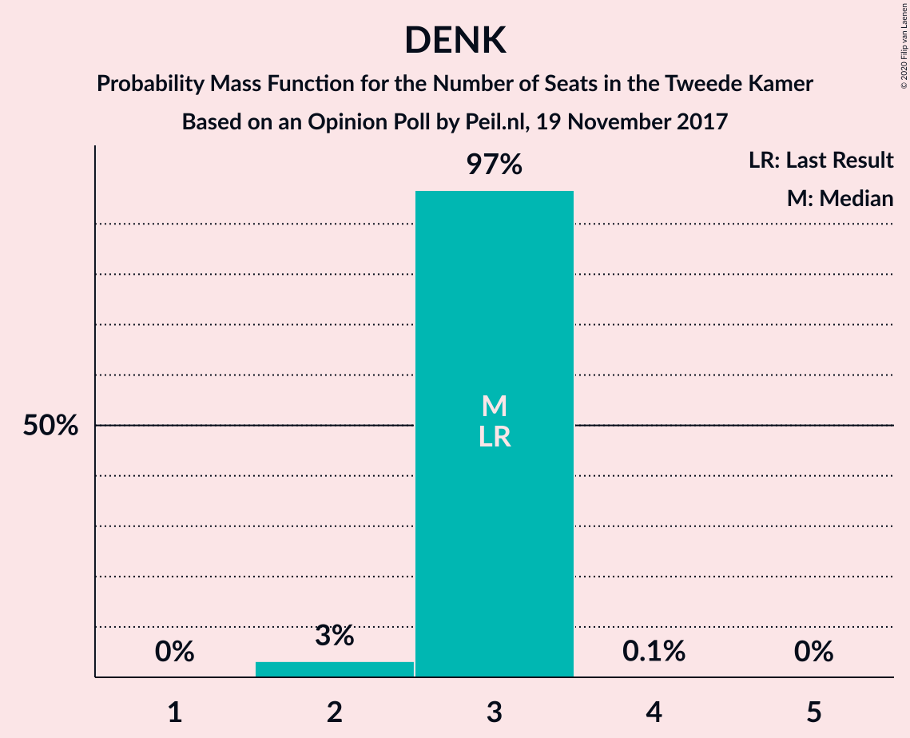

| Number of Seats | Probability | Accumulated | Special Marks |
|:---------------:|:-----------:|:-----------:|:-------------:|
| 1 | 0.2% | 100% |  |
| 2 | 41% | 99.8% |  |
| 3 | 58% | 59% | Last Result, Median |
| 4 | 0.2% | 0.4% |  |
| 5 | 0.2% | 0.2% |  |
| 6 | 0% | 0% |  |

## Coalitions

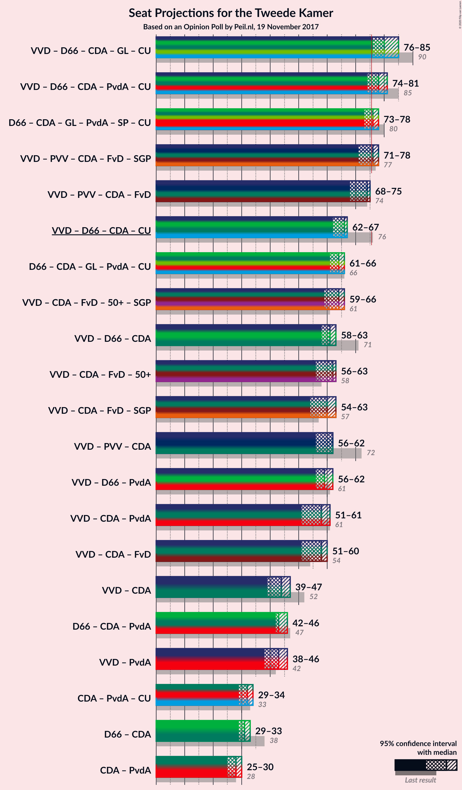

### Confidence Intervals

| Coalition | Last Result | Median | Majority? | 80% Confidence Interval | 90% Confidence Interval | 95% Confidence Interval | 99% Confidence Interval |
|:---------:|:-----------:|:------:|:---------:|:-----------------------:|:-----------------------:|:-----------------------:|:-----------------------:|
| Volkspartij voor Vrijheid en Democratie – Democraten 66 – Christen-Democratisch Appèl – GroenLinks – ChristenUnie | 90 | 80 | 100% | 76–85 | 76–85 | 76–85 | 76–85 |
| Volkspartij voor Vrijheid en Democratie – Democraten 66 – Christen-Democratisch Appèl – Partij van de Arbeid – ChristenUnie | 85 | 78 | 90% | 74–81 | 74–81 | 74–81 | 74–81 |
| Democraten 66 – Christen-Democratisch Appèl – GroenLinks – Partij van de Arbeid – Socialistische Partij – ChristenUnie | 80 | 76 | 51% | 74–78 | 74–78 | 73–78 | 73–81 |
| Volkspartij voor Vrijheid en Democratie – Partij voor de Vrijheid – Christen-Democratisch Appèl – Forum voor Democratie – Staatkundig Gereformeerde Partij | 77 | 76 | 80% | 71–77 | 71–78 | 71–78 | 71–78 |
| Volkspartij voor Vrijheid en Democratie – Partij voor de Vrijheid – Christen-Democratisch Appèl – Forum voor Democratie | 74 | 74 | 0.1% | 68–74 | 68–74 | 68–75 | 68–75 |
| Volkspartij voor Vrijheid en Democratie – Democraten 66 – Christen-Democratisch Appèl – ChristenUnie | 76 | 66 | 0% | 62–67 | 62–67 | 62–67 | 62–67 |
| Democraten 66 – Christen-Democratisch Appèl – GroenLinks – Partij van de Arbeid – ChristenUnie | 66 | 64 | 0% | 61–66 | 61–66 | 61–66 | 61–66 |
| Volkspartij voor Vrijheid en Democratie – Christen-Democratisch Appèl – Forum voor Democratie – 50Plus – Staatkundig Gereformeerde Partij | 61 | 64 | 0% | 59–66 | 59–66 | 59–66 | 59–67 |
| Volkspartij voor Vrijheid en Democratie – Democraten 66 – Christen-Democratisch Appèl | 71 | 61 | 0% | 58–62 | 58–62 | 58–63 | 58–63 |
| Volkspartij voor Vrijheid en Democratie – Christen-Democratisch Appèl – Forum voor Democratie – 50Plus | 58 | 62 | 0% | 56–63 | 56–63 | 56–63 | 56–65 |
| Volkspartij voor Vrijheid en Democratie – Christen-Democratisch Appèl – Forum voor Democratie – Staatkundig Gereformeerde Partij | 57 | 60 | 0% | 54–61 | 54–61 | 54–63 | 54–63 |
| Volkspartij voor Vrijheid en Democratie – Partij voor de Vrijheid – Christen-Democratisch Appèl | 72 | 62 | 0% | 56–62 | 56–62 | 56–62 | 56–64 |
| Volkspartij voor Vrijheid en Democratie – Democraten 66 – Partij van de Arbeid | 61 | 59 | 0% | 57–62 | 57–62 | 56–62 | 56–62 |
| Volkspartij voor Vrijheid en Democratie – Christen-Democratisch Appèl – Partij van de Arbeid | 61 | 58 | 0% | 51–61 | 51–61 | 51–61 | 51–61 |
| Volkspartij voor Vrijheid en Democratie – Christen-Democratisch Appèl – Forum voor Democratie | 54 | 58 | 0% | 51–58 | 51–58 | 51–60 | 51–60 |
| Volkspartij voor Vrijheid en Democratie – Christen-Democratisch Appèl | 52 | 44 | 0% | 39–46 | 39–46 | 39–47 | 39–47 |
| Democraten 66 – Christen-Democratisch Appèl – Partij van de Arbeid | 47 | 43 | 0% | 43–46 | 42–46 | 42–46 | 42–47 |
| Volkspartij voor Vrijheid en Democratie – Partij van de Arbeid | 42 | 43 | 0% | 38–46 | 38–46 | 38–46 | 38–46 |
| Christen-Democratisch Appèl – Partij van de Arbeid – ChristenUnie | 33 | 32 | 0% | 29–34 | 29–34 | 29–34 | 29–36 |
| Democraten 66 – Christen-Democratisch Appèl | 38 | 31 | 0% | 29–32 | 29–33 | 29–33 | 29–34 |
| Christen-Democratisch Appèl – Partij van de Arbeid | 28 | 28 | 0% | 25–30 | 25–30 | 25–30 | 25–30 |

### Volkspartij voor Vrijheid en Democratie – Democraten 66 – Christen-Democratisch Appèl – GroenLinks – ChristenUnie

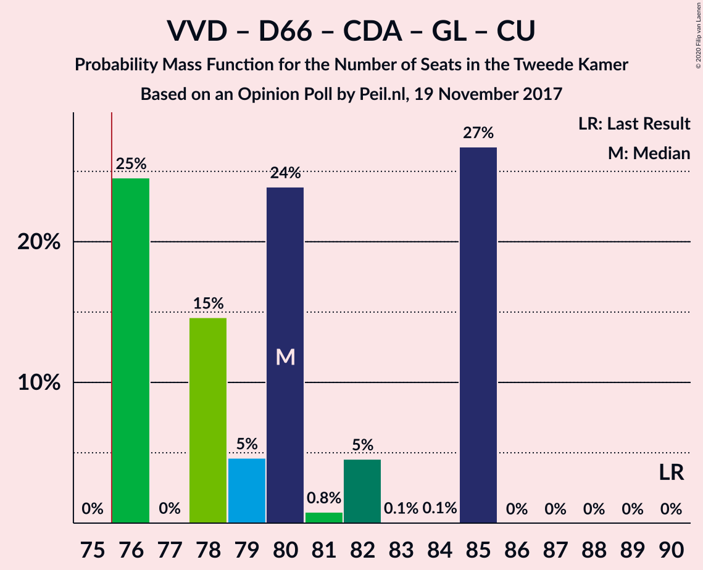

| Number of Seats | Probability | Accumulated | Special Marks |
|:---------------:|:-----------:|:-----------:|:-------------:|
| 76 | 25% | 100% | Majority |
| 77 | 0% | 75% |  |
| 78 | 15% | 75% |  |
| 79 | 5% | 61% |  |
| 80 | 24% | 56% |  |
| 81 | 0.8% | 32% | Median |
| 82 | 5% | 31% |  |
| 83 | 0.1% | 27% |  |
| 84 | 0.1% | 27% |  |
| 85 | 27% | 27% |  |
| 86 | 0% | 0% |  |
| 87 | 0% | 0% |  |
| 88 | 0% | 0% |  |
| 89 | 0% | 0% |  |
| 90 | 0% | 0% | Last Result |

### Volkspartij voor Vrijheid en Democratie – Democraten 66 – Christen-Democratisch Appèl – Partij van de Arbeid – ChristenUnie

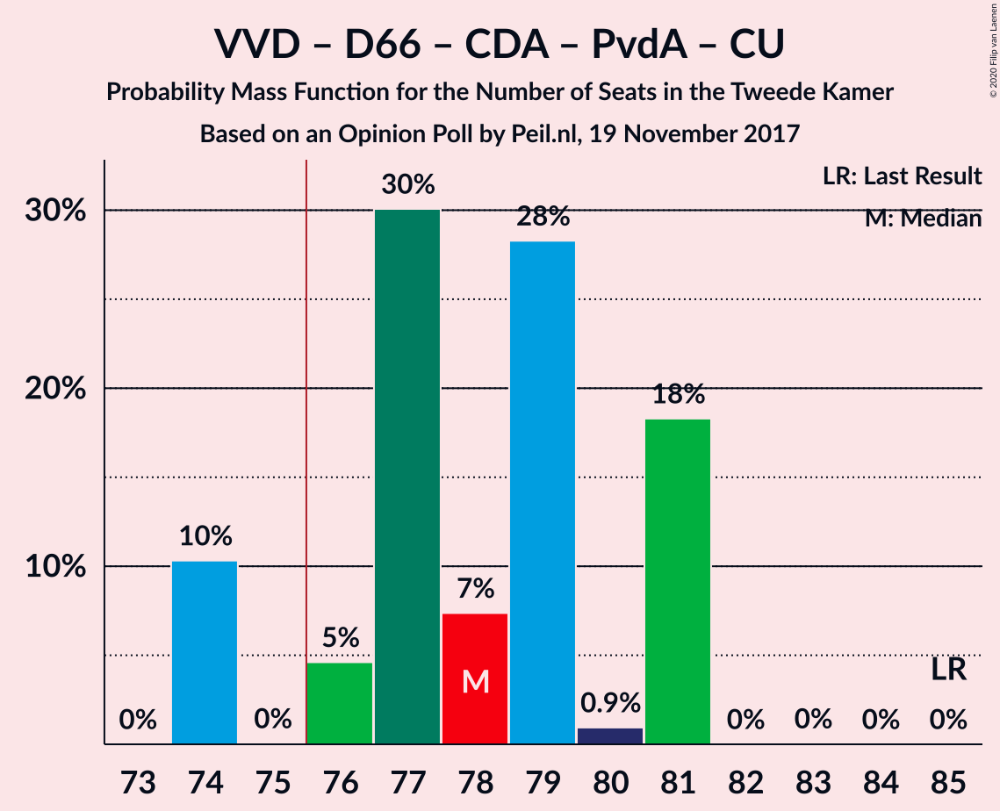

| Number of Seats | Probability | Accumulated | Special Marks |
|:---------------:|:-----------:|:-----------:|:-------------:|
| 74 | 10% | 100% |  |
| 75 | 0% | 90% |  |
| 76 | 5% | 90% | Majority |
| 77 | 30% | 85% |  |
| 78 | 7% | 55% |  |
| 79 | 28% | 48% | Median |
| 80 | 0.9% | 19% |  |
| 81 | 18% | 18% |  |
| 82 | 0% | 0% |  |
| 83 | 0% | 0% |  |
| 84 | 0% | 0% |  |
| 85 | 0% | 0% | Last Result |

### Democraten 66 – Christen-Democratisch Appèl – GroenLinks – Partij van de Arbeid – Socialistische Partij – ChristenUnie

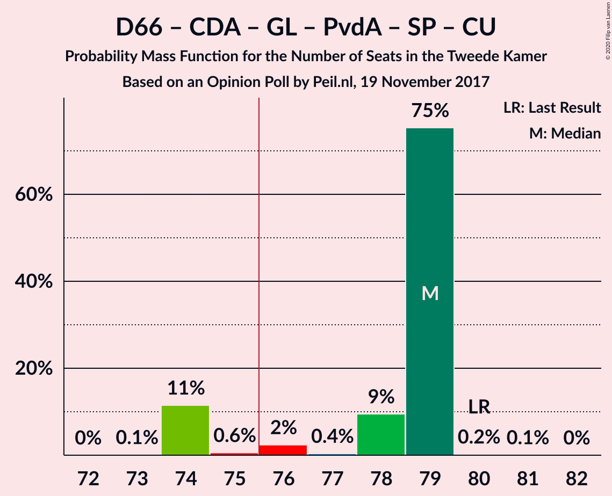

| Number of Seats | Probability | Accumulated | Special Marks |
|:---------------:|:-----------:|:-----------:|:-------------:|
| 71 | 0.1% | 100% |  |
| 72 | 0% | 99.9% |  |
| 73 | 4% | 99.9% |  |
| 74 | 25% | 95% |  |
| 75 | 19% | 71% |  |
| 76 | 4% | 51% | Median, Majority |
| 77 | 18% | 47% |  |
| 78 | 28% | 29% |  |
| 79 | 0% | 0.9% |  |
| 80 | 0.2% | 0.8% | Last Result |
| 81 | 0.5% | 0.6% |  |
| 82 | 0% | 0% |  |

### Volkspartij voor Vrijheid en Democratie – Partij voor de Vrijheid – Christen-Democratisch Appèl – Forum voor Democratie – Staatkundig Gereformeerde Partij

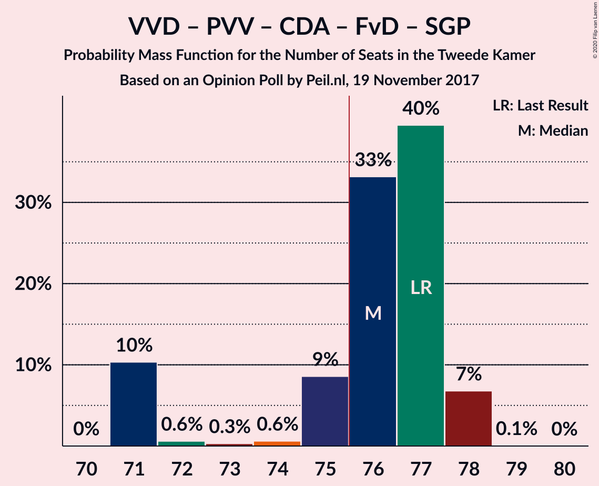

| Number of Seats | Probability | Accumulated | Special Marks |
|:---------------:|:-----------:|:-----------:|:-------------:|
| 71 | 10% | 100% |  |
| 72 | 0.6% | 90% |  |
| 73 | 0.3% | 89% |  |
| 74 | 0.6% | 89% |  |
| 75 | 9% | 88% |  |
| 76 | 33% | 80% | Median, Majority |
| 77 | 40% | 46% | Last Result |
| 78 | 7% | 7% |  |
| 79 | 0.1% | 0.1% |  |
| 80 | 0% | 0% |  |

### Volkspartij voor Vrijheid en Democratie – Partij voor de Vrijheid – Christen-Democratisch Appèl – Forum voor Democratie

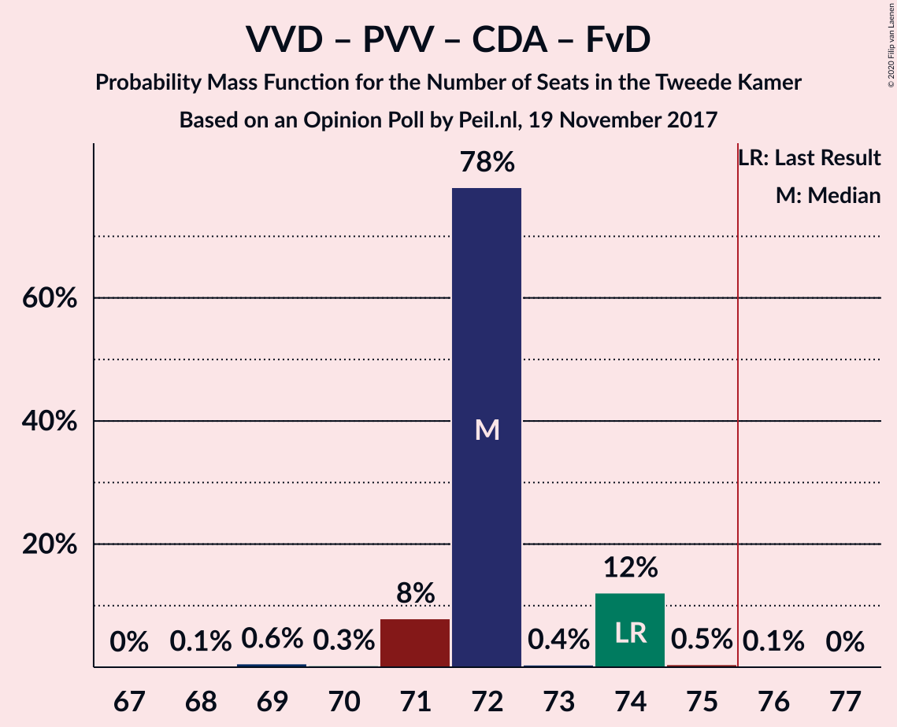

| Number of Seats | Probability | Accumulated | Special Marks |
|:---------------:|:-----------:|:-----------:|:-------------:|
| 68 | 10% | 100% |  |
| 69 | 0.1% | 90% |  |
| 70 | 0.9% | 90% |  |
| 71 | 2% | 89% |  |
| 72 | 0.3% | 87% |  |
| 73 | 12% | 87% | Median |
| 74 | 71% | 74% | Last Result |
| 75 | 3% | 3% |  |
| 76 | 0% | 0.1% | Majority |
| 77 | 0.1% | 0.1% |  |
| 78 | 0% | 0% |  |

### Volkspartij voor Vrijheid en Democratie – Democraten 66 – Christen-Democratisch Appèl – ChristenUnie

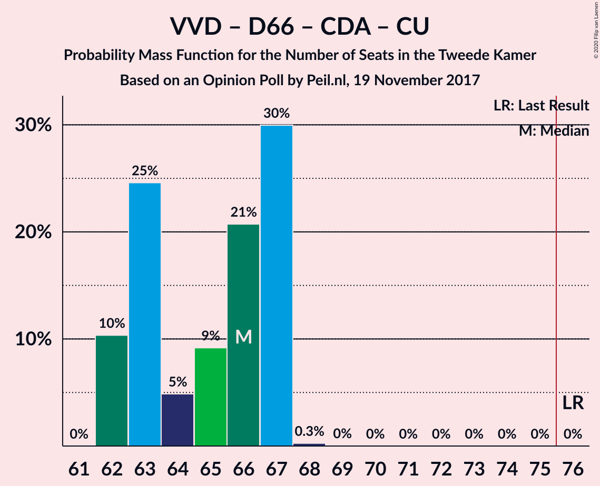

| Number of Seats | Probability | Accumulated | Special Marks |
|:---------------:|:-----------:|:-----------:|:-------------:|
| 62 | 10% | 100% |  |
| 63 | 25% | 90% |  |
| 64 | 5% | 65% |  |
| 65 | 9% | 60% |  |
| 66 | 21% | 51% | Median |
| 67 | 30% | 30% |  |
| 68 | 0.3% | 0.3% |  |
| 69 | 0% | 0% |  |
| 70 | 0% | 0% |  |
| 71 | 0% | 0% |  |
| 72 | 0% | 0% |  |
| 73 | 0% | 0% |  |
| 74 | 0% | 0% |  |
| 75 | 0% | 0% |  |
| 76 | 0% | 0% | Last Result, Majority |

### Democraten 66 – Christen-Democratisch Appèl – GroenLinks – Partij van de Arbeid – ChristenUnie

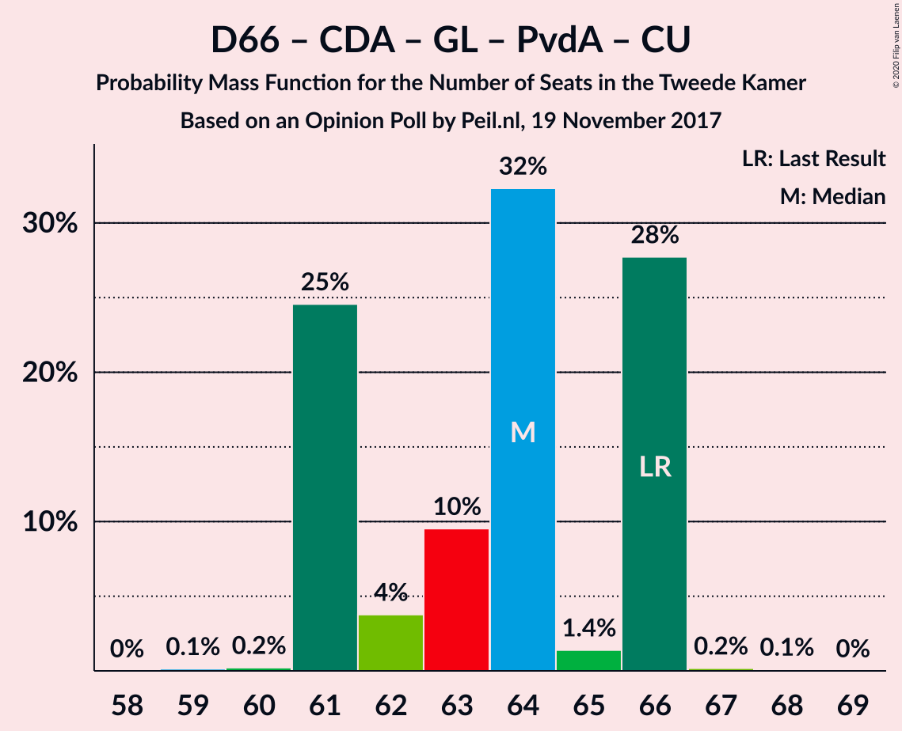

| Number of Seats | Probability | Accumulated | Special Marks |
|:---------------:|:-----------:|:-----------:|:-------------:|
| 59 | 0.1% | 100% |  |
| 60 | 0.2% | 99.9% |  |
| 61 | 25% | 99.6% |  |
| 62 | 4% | 75% |  |
| 63 | 10% | 71% |  |
| 64 | 32% | 62% | Median |
| 65 | 1.4% | 29% |  |
| 66 | 28% | 28% | Last Result |
| 67 | 0.2% | 0.3% |  |
| 68 | 0.1% | 0.1% |  |
| 69 | 0% | 0% |  |

### Volkspartij voor Vrijheid en Democratie – Christen-Democratisch Appèl – Forum voor Democratie – 50Plus – Staatkundig Gereformeerde Partij

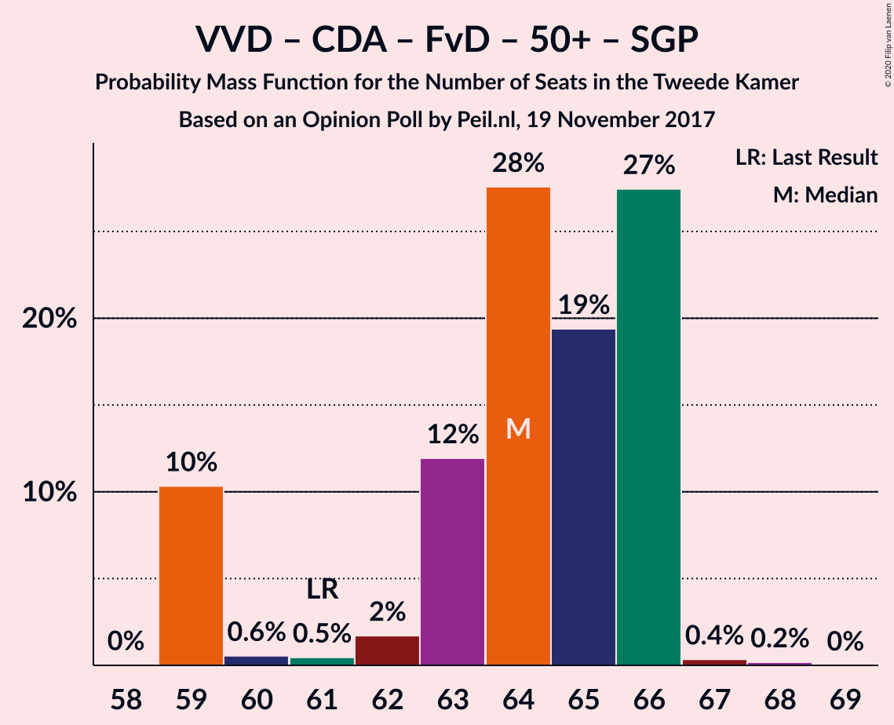

| Number of Seats | Probability | Accumulated | Special Marks |
|:---------------:|:-----------:|:-----------:|:-------------:|
| 59 | 10% | 100% |  |
| 60 | 0.6% | 90% |  |
| 61 | 0.5% | 89% | Last Result |
| 62 | 2% | 89% |  |
| 63 | 12% | 87% |  |
| 64 | 28% | 75% |  |
| 65 | 19% | 47% | Median |
| 66 | 27% | 28% |  |
| 67 | 0.4% | 0.5% |  |
| 68 | 0.2% | 0.2% |  |
| 69 | 0% | 0% |  |

### Volkspartij voor Vrijheid en Democratie – Democraten 66 – Christen-Democratisch Appèl

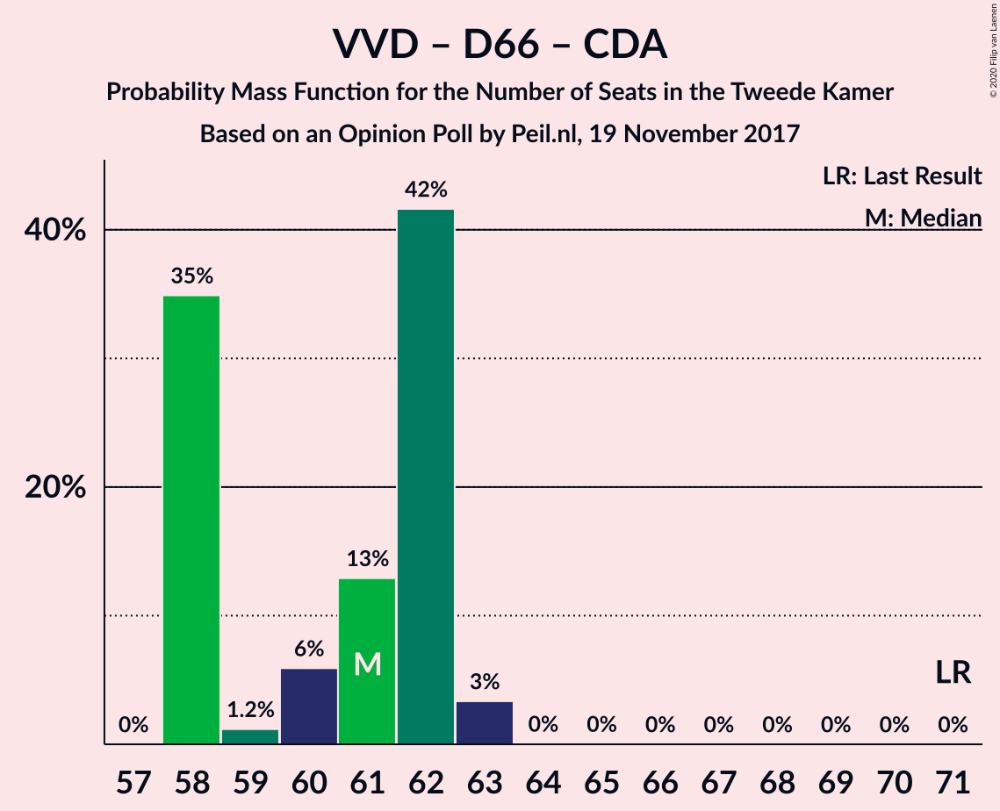

| Number of Seats | Probability | Accumulated | Special Marks |
|:---------------:|:-----------:|:-----------:|:-------------:|
| 58 | 35% | 100% |  |
| 59 | 1.2% | 65% |  |
| 60 | 6% | 64% |  |
| 61 | 13% | 58% | Median |
| 62 | 42% | 45% |  |
| 63 | 3% | 3% |  |
| 64 | 0% | 0.1% |  |
| 65 | 0% | 0% |  |
| 66 | 0% | 0% |  |
| 67 | 0% | 0% |  |
| 68 | 0% | 0% |  |
| 69 | 0% | 0% |  |
| 70 | 0% | 0% |  |
| 71 | 0% | 0% | Last Result |

### Volkspartij voor Vrijheid en Democratie – Christen-Democratisch Appèl – Forum voor Democratie – 50Plus

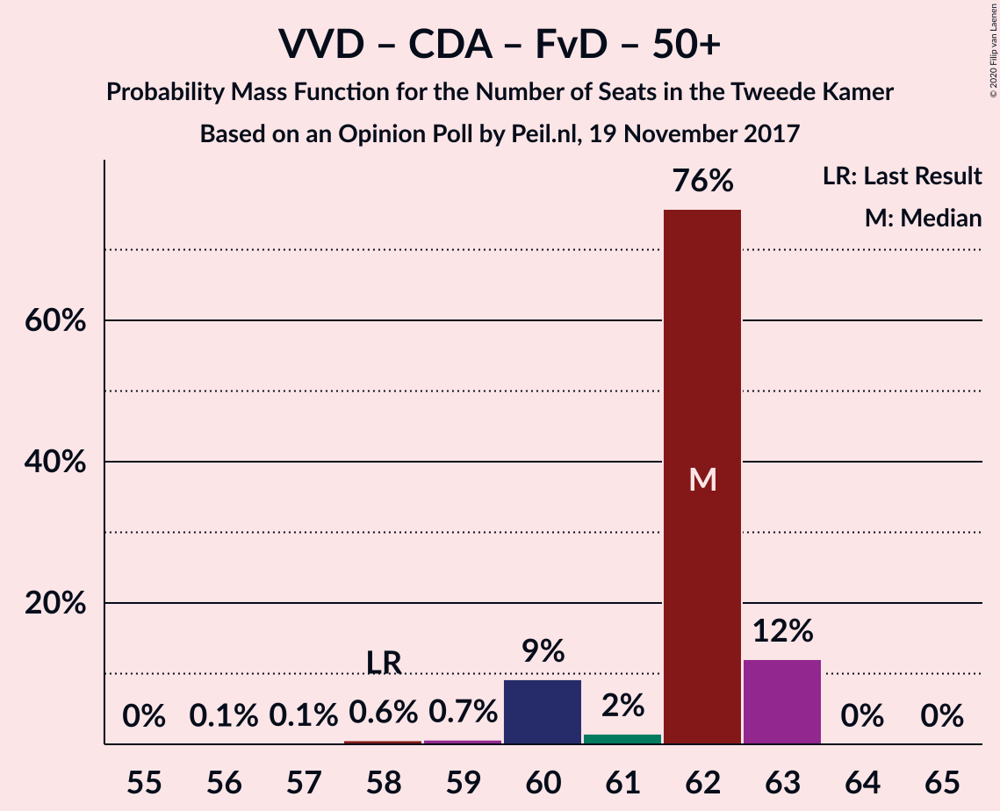

| Number of Seats | Probability | Accumulated | Special Marks |
|:---------------:|:-----------:|:-----------:|:-------------:|
| 56 | 10% | 100% |  |
| 57 | 0% | 90% |  |
| 58 | 0.8% | 90% | Last Result |
| 59 | 5% | 89% |  |
| 60 | 2% | 83% |  |
| 61 | 8% | 82% |  |
| 62 | 46% | 74% | Median |
| 63 | 27% | 28% |  |
| 64 | 0.2% | 0.7% |  |
| 65 | 0.5% | 0.5% |  |
| 66 | 0% | 0% |  |

### Volkspartij voor Vrijheid en Democratie – Christen-Democratisch Appèl – Forum voor Democratie – Staatkundig Gereformeerde Partij

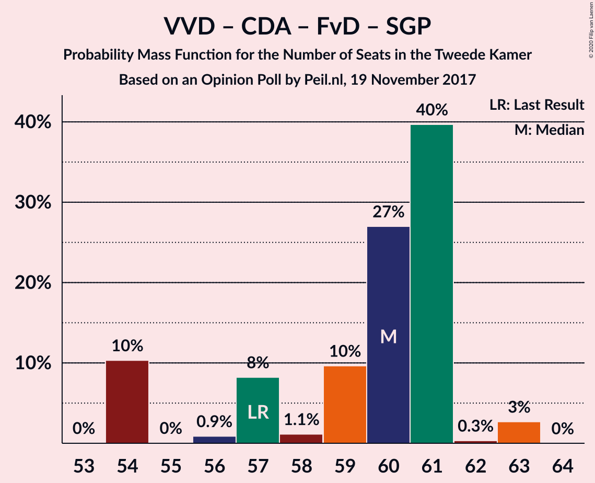

| Number of Seats | Probability | Accumulated | Special Marks |
|:---------------:|:-----------:|:-----------:|:-------------:|
| 54 | 10% | 100% |  |
| 55 | 0% | 90% |  |
| 56 | 0.9% | 90% |  |
| 57 | 8% | 89% | Last Result |
| 58 | 1.1% | 80% |  |
| 59 | 10% | 79% |  |
| 60 | 27% | 70% | Median |
| 61 | 40% | 43% |  |
| 62 | 0.3% | 3% |  |
| 63 | 3% | 3% |  |
| 64 | 0% | 0% |  |

### Volkspartij voor Vrijheid en Democratie – Partij voor de Vrijheid – Christen-Democratisch Appèl

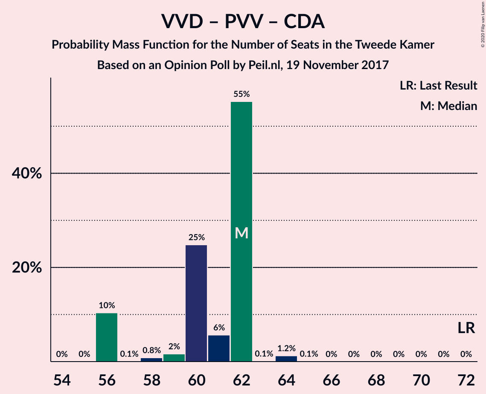

| Number of Seats | Probability | Accumulated | Special Marks |
|:---------------:|:-----------:|:-----------:|:-------------:|
| 56 | 10% | 100% |  |
| 57 | 0.1% | 90% |  |
| 58 | 0.8% | 90% |  |
| 59 | 2% | 89% |  |
| 60 | 25% | 87% |  |
| 61 | 6% | 62% | Median |
| 62 | 55% | 57% |  |
| 63 | 0.1% | 1.4% |  |
| 64 | 1.2% | 1.3% |  |
| 65 | 0.1% | 0.1% |  |
| 66 | 0% | 0% |  |
| 67 | 0% | 0% |  |
| 68 | 0% | 0% |  |
| 69 | 0% | 0% |  |
| 70 | 0% | 0% |  |
| 71 | 0% | 0% |  |
| 72 | 0% | 0% | Last Result |

### Volkspartij voor Vrijheid en Democratie – Democraten 66 – Partij van de Arbeid

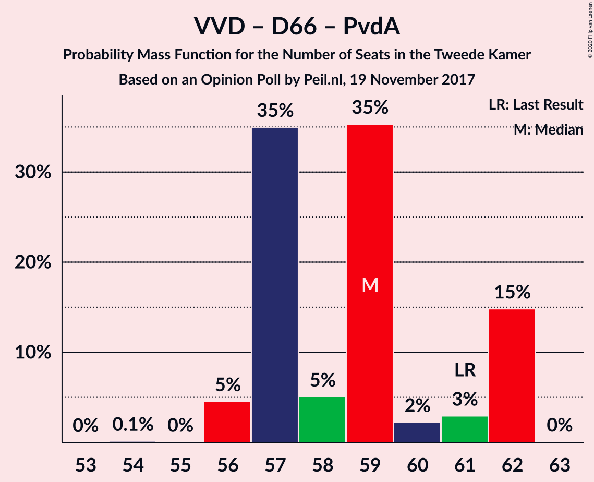

| Number of Seats | Probability | Accumulated | Special Marks |
|:---------------:|:-----------:|:-----------:|:-------------:|
| 54 | 0.1% | 100% |  |
| 55 | 0% | 99.9% |  |
| 56 | 5% | 99.8% |  |
| 57 | 35% | 95% |  |
| 58 | 5% | 60% |  |
| 59 | 35% | 55% | Median |
| 60 | 2% | 20% |  |
| 61 | 3% | 18% | Last Result |
| 62 | 15% | 15% |  |
| 63 | 0% | 0% |  |

### Volkspartij voor Vrijheid en Democratie – Christen-Democratisch Appèl – Partij van de Arbeid

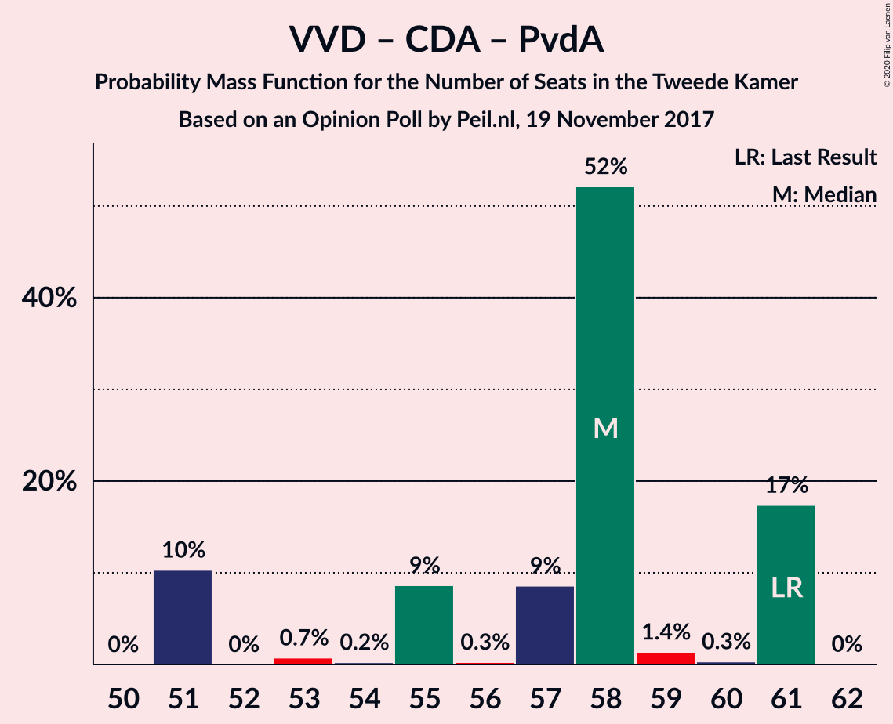

| Number of Seats | Probability | Accumulated | Special Marks |
|:---------------:|:-----------:|:-----------:|:-------------:|
| 51 | 10% | 100% |  |
| 52 | 0% | 90% |  |
| 53 | 0.7% | 90% |  |
| 54 | 0.2% | 89% |  |
| 55 | 9% | 89% |  |
| 56 | 0.3% | 80% |  |
| 57 | 9% | 80% |  |
| 58 | 52% | 71% | Median |
| 59 | 1.4% | 19% |  |
| 60 | 0.3% | 18% |  |
| 61 | 17% | 17% | Last Result |
| 62 | 0% | 0% |  |

### Volkspartij voor Vrijheid en Democratie – Christen-Democratisch Appèl – Forum voor Democratie

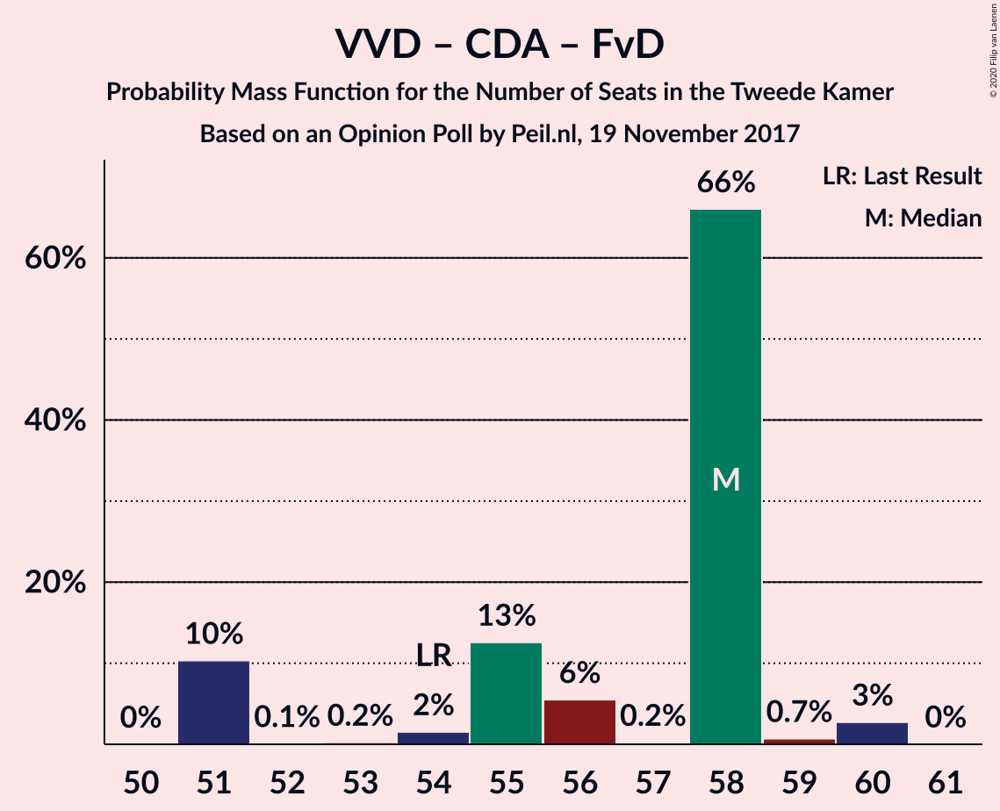

| Number of Seats | Probability | Accumulated | Special Marks |
|:---------------:|:-----------:|:-----------:|:-------------:|
| 51 | 10% | 100% |  |
| 52 | 0.1% | 90% |  |
| 53 | 0.2% | 90% |  |
| 54 | 2% | 89% | Last Result |
| 55 | 13% | 88% |  |
| 56 | 6% | 75% |  |
| 57 | 0.2% | 70% | Median |
| 58 | 66% | 70% |  |
| 59 | 0.7% | 3% |  |
| 60 | 3% | 3% |  |
| 61 | 0% | 0% |  |

### Volkspartij voor Vrijheid en Democratie – Christen-Democratisch Appèl

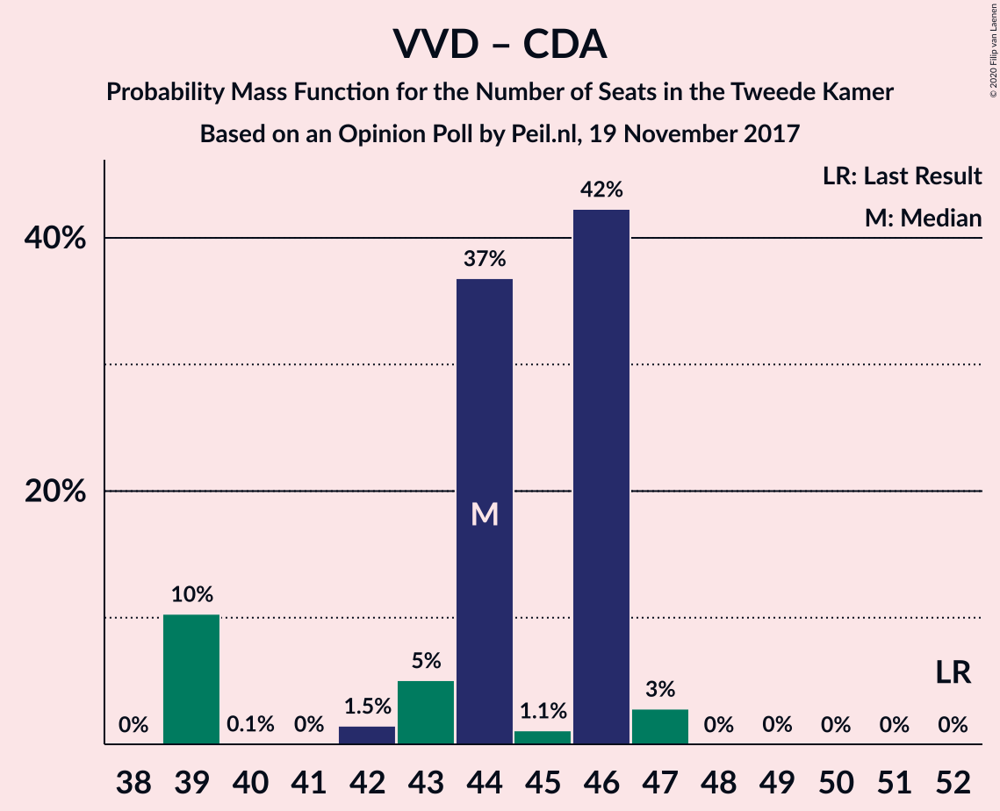

| Number of Seats | Probability | Accumulated | Special Marks |
|:---------------:|:-----------:|:-----------:|:-------------:|
| 39 | 10% | 100% |  |
| 40 | 0.1% | 90% |  |
| 41 | 0% | 90% |  |
| 42 | 1.5% | 90% |  |
| 43 | 5% | 88% |  |
| 44 | 37% | 83% |  |
| 45 | 1.1% | 46% | Median |
| 46 | 42% | 45% |  |
| 47 | 3% | 3% |  |
| 48 | 0% | 0% |  |
| 49 | 0% | 0% |  |
| 50 | 0% | 0% |  |
| 51 | 0% | 0% |  |
| 52 | 0% | 0% | Last Result |

### Democraten 66 – Christen-Democratisch Appèl – Partij van de Arbeid

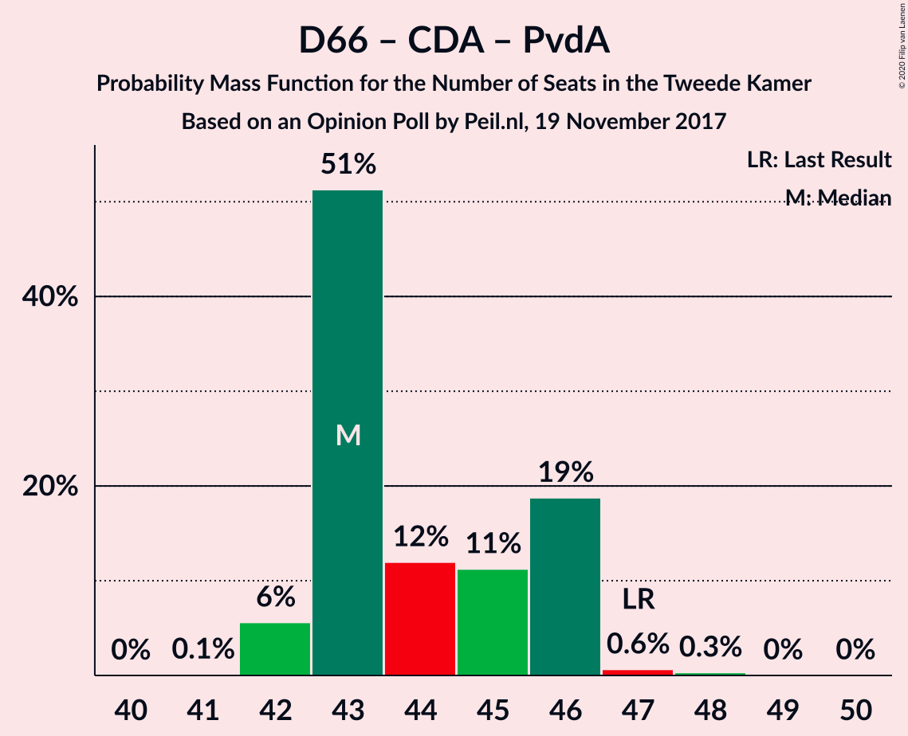

| Number of Seats | Probability | Accumulated | Special Marks |
|:---------------:|:-----------:|:-----------:|:-------------:|
| 41 | 0.1% | 100% |  |
| 42 | 6% | 99.9% |  |
| 43 | 51% | 94% |  |
| 44 | 12% | 43% | Median |
| 45 | 11% | 31% |  |
| 46 | 19% | 20% |  |
| 47 | 0.6% | 1.0% | Last Result |
| 48 | 0.3% | 0.4% |  |
| 49 | 0% | 0.1% |  |
| 50 | 0% | 0% |  |

### Volkspartij voor Vrijheid en Democratie – Partij van de Arbeid

| Number of Seats | Probability | Accumulated | Special Marks |
|:---------------:|:-----------:|:-----------:|:-------------:|
| 37 | 0.1% | 100% |  |
| 38 | 11% | 99.9% |  |
| 39 | 4% | 89% |  |
| 40 | 0.1% | 85% |  |
| 41 | 5% | 85% |  |
| 42 | 7% | 80% | Last Result |
| 43 | 55% | 73% | Median |
| 44 | 0.6% | 18% |  |
| 45 | 3% | 18% |  |
| 46 | 15% | 15% |  |
| 47 | 0% | 0% |  |

### Christen-Democratisch Appèl – Partij van de Arbeid – ChristenUnie

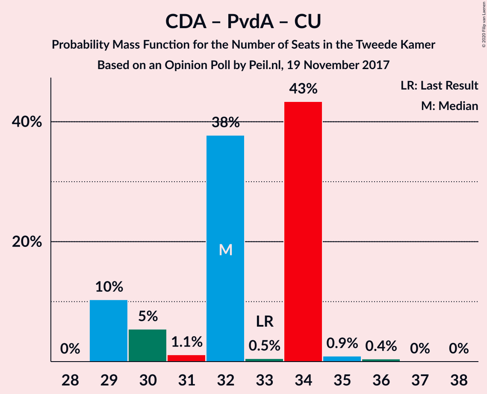

| Number of Seats | Probability | Accumulated | Special Marks |
|:---------------:|:-----------:|:-----------:|:-------------:|
| 29 | 10% | 100% |  |
| 30 | 5% | 90% |  |
| 31 | 1.1% | 84% |  |
| 32 | 38% | 83% |  |
| 33 | 0.5% | 45% | Last Result, Median |
| 34 | 43% | 45% |  |
| 35 | 0.9% | 1.5% |  |
| 36 | 0.4% | 0.5% |  |
| 37 | 0% | 0.1% |  |
| 38 | 0% | 0% |  |

### Democraten 66 – Christen-Democratisch Appèl

| Number of Seats | Probability | Accumulated | Special Marks |
|:---------------:|:-----------:|:-----------:|:-------------:|
| 29 | 26% | 100% |  |
| 30 | 1.1% | 74% |  |
| 31 | 46% | 73% | Median |
| 32 | 22% | 27% |  |
| 33 | 5% | 6% |  |
| 34 | 0.9% | 0.9% |  |
| 35 | 0% | 0% |  |
| 36 | 0% | 0% |  |
| 37 | 0% | 0% |  |
| 38 | 0% | 0% | Last Result |

### Christen-Democratisch Appèl – Partij van de Arbeid

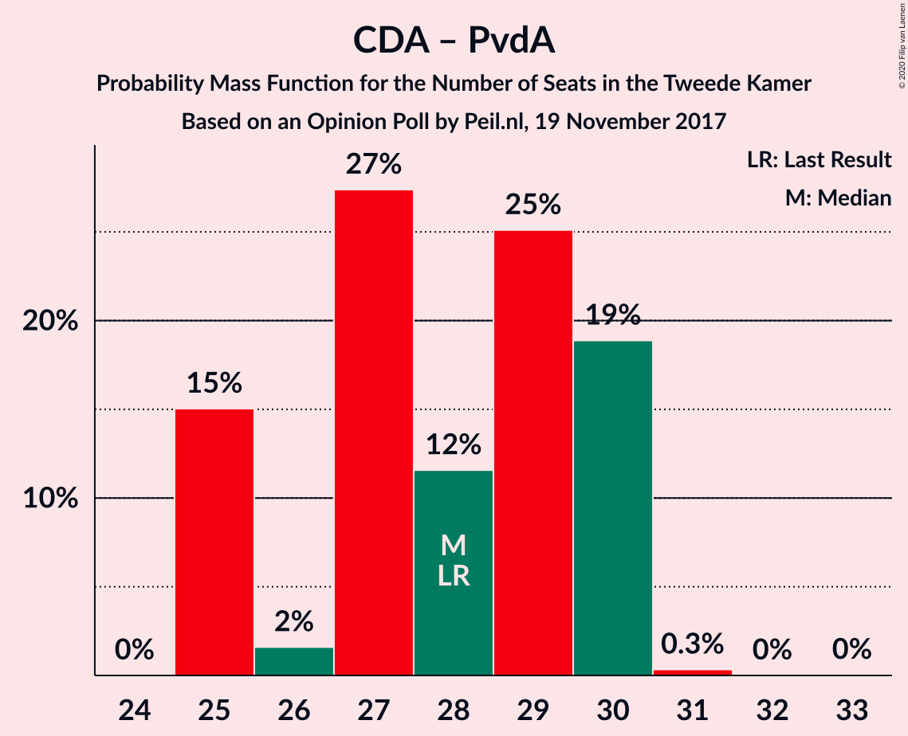

| Number of Seats | Probability | Accumulated | Special Marks |
|:---------------:|:-----------:|:-----------:|:-------------:|
| 25 | 15% | 100% |  |
| 26 | 2% | 85% |  |
| 27 | 27% | 83% |  |
| 28 | 12% | 56% | Last Result, Median |
| 29 | 25% | 44% |  |
| 30 | 19% | 19% |  |
| 31 | 0.3% | 0.4% |  |
| 32 | 0% | 0.1% |  |
| 33 | 0% | 0% |  |

## Technical Information

### Opinion Poll

+ **Polling firm:** Peil.nl
+ **Commissioner(s):** —
+ **Fieldwork period:** 19 November 2017

### Calculations

+ **Sample size:** 3000
+ **Simulations done:** 131,072
+ **Error estimate:** 2.55%

