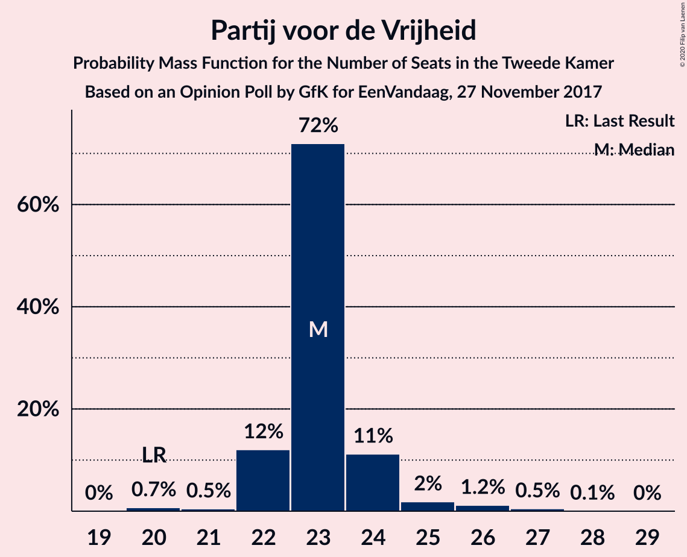
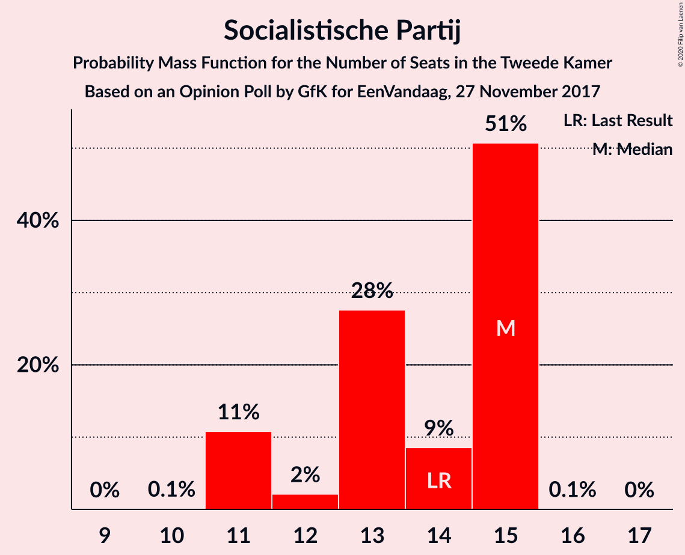
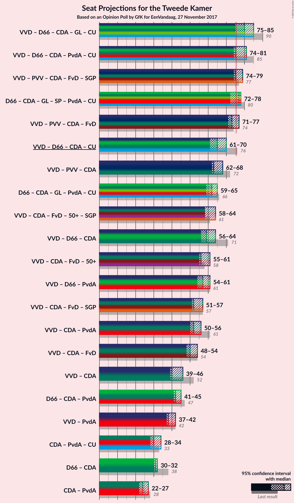
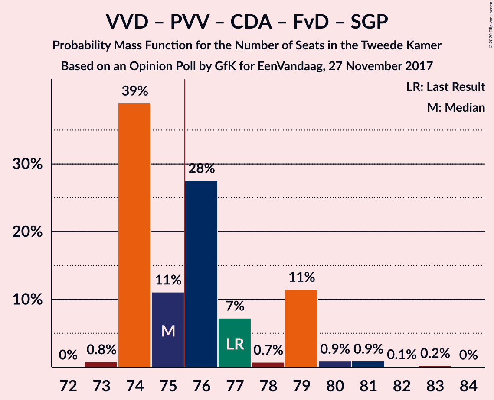
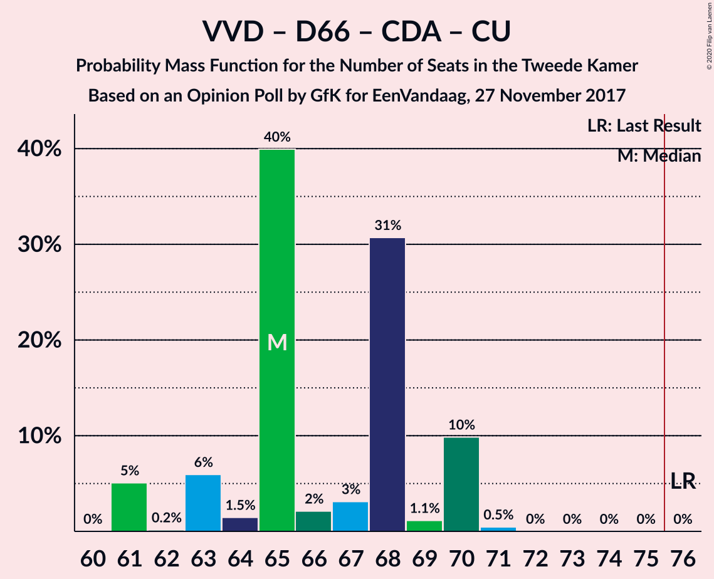
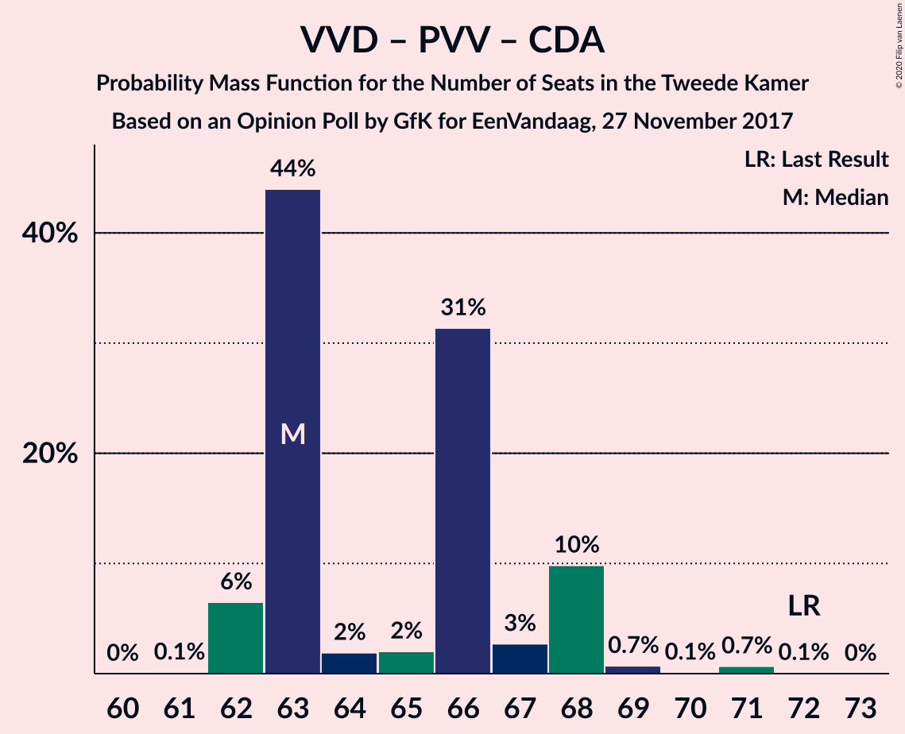
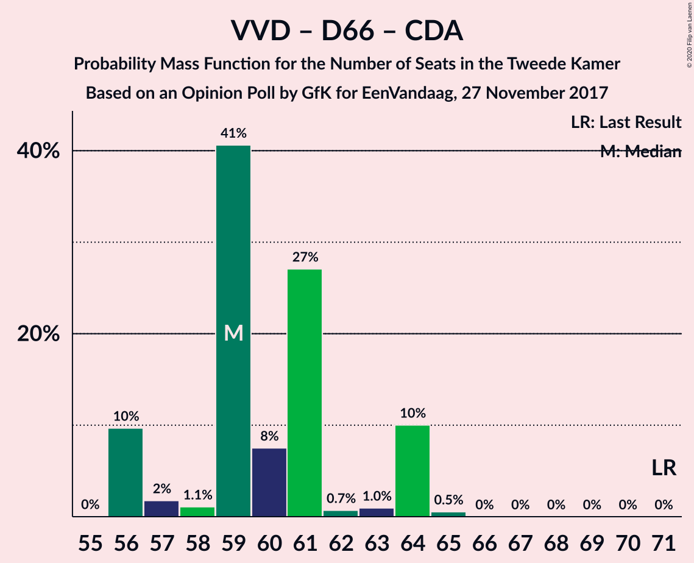
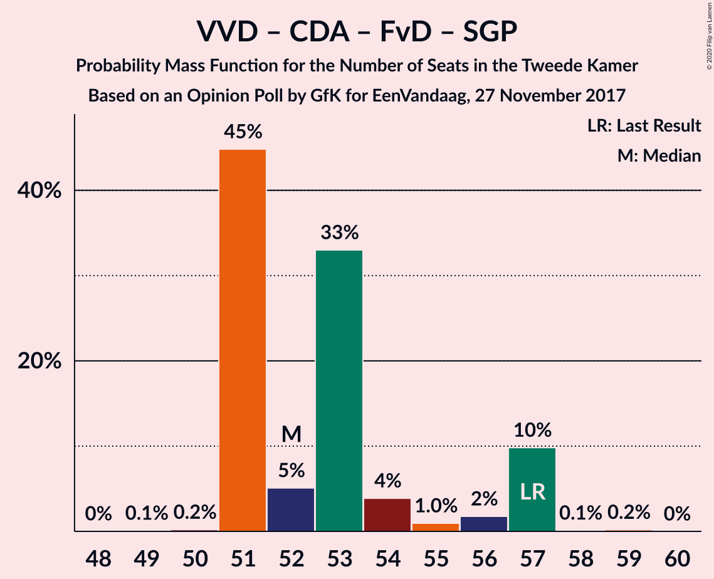
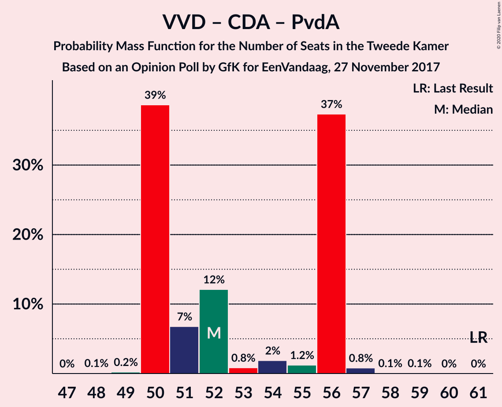

# Opinion Poll by GfK for EenVandaag, 27 November 2017

<a href="#voting-intentions">Voting Intentions</a> | <a href="#seats">Seats</a> | <a href="#coalitions">Coalitions</a> | <a href="#technical-information">Technical Information</a>

## Voting Intentions

### Confidence Intervals

| Party | Last Result | Poll Result | 80% Confidence Interval | 90% Confidence Interval | 95% Confidence Interval | 99% Confidence Interval |
|:-----:|:-----------:|:-----------:|:-----------------------:|:-----------------------:|:-----------------------:|:-----------------------:|
| Volkspartij voor Vrijheid en Democratie | 21.3% | 18.6% | 17.5–19.8% |17.2–20.1% |17.0–20.4% |16.4–21.0% |
| Partij voor de Vrijheid | 13.1% | 15.3% | 14.3–16.4% |14.0–16.7% |13.8–17.0% |13.3–17.5% |
| Democraten 66 | 12.2% | 12.0% | 11.1–13.0% |10.9–13.3% |10.6–13.5% |10.2–14.0% |
| Christen-Democratisch Appèl | 12.4% | 9.3% | 8.5–10.2% |8.3–10.5% |8.1–10.7% |7.8–11.2% |
| GroenLinks | 9.1% | 8.7% | 7.9–9.6% |7.7–9.8% |7.5–10.0% |7.1–10.5% |
| Socialistische Partij | 9.1% | 8.7% | 7.9–9.6% |7.7–9.8% |7.5–10.0% |7.1–10.5% |
| Partij van de Arbeid | 5.7% | 7.3% | 6.6–8.2% |6.4–8.4% |6.3–8.6% |5.9–9.0% |
| Forum voor Democratie | 1.8% | 6.0% | 5.4–6.8% |5.2–7.0% |5.0–7.2% |4.7–7.5% |
| 50Plus | 3.1% | 4.7% | 4.1–5.3% |3.9–5.5% |3.8–5.7% |3.6–6.1% |
| ChristenUnie | 3.4% | 4.0% | 3.5–4.6% |3.3–4.8% |3.2–5.0% |3.0–5.3% |
| Partij voor de Dieren | 3.2% | 2.7% | 2.3–3.2% |2.1–3.4% |2.0–3.5% |1.9–3.8% |
| Staatkundig Gereformeerde Partij | 2.1% | 2.0% | 1.6–2.5% |1.5–2.6% |1.5–2.7% |1.3–3.0% |
| DENK | 2.1% | 0.7% | 0.5–1.0% |0.4–1.1% |0.4–1.1% |0.3–1.3% |

*Note:* The poll result column reflects the actual value used in the calculations. Published results may vary slightly, and in addition be rounded to fewer digits.

## Seats

### Confidence Intervals

| Party | Last Result | Median | 80% Confidence Interval | 90% Confidence Interval | 95% Confidence Interval | 99% Confidence Interval |
|:-----:|:-----------:|:------:|:-----------------------:|:-----------------------:|:-----------------------:|:-----------------------:|
| <a href="#volkspartij-voor-vrijheid-en-democratie">Volkspartij voor Vrijheid en Democratie</a> | 33 | 28 | 25–29 |25–29 |25–29 |25–32 |
| <a href="#partij-voor-de-vrijheid">Partij voor de Vrijheid</a> | 20 | 23 | 23–24 |23–24 |23–24 |23–25 |
| <a href="#democraten-66">Democraten 66</a> | 19 | 19 | 17–19 |17–19 |17–19 |17–19 |
| <a href="#christen-democratisch-appèl">Christen-Democratisch Appèl</a> | 19 | 12 | 12–14 |12–14 |12–14 |12–15 |
| <a href="#groenlinks">GroenLinks</a> | 14 | 15 | 12–15 |11–15 |11–15 |11–15 |
| <a href="#socialistische-partij">Socialistische Partij</a> | 14 | 15 | 14–15 |14–15 |14–15 |11–15 |
| <a href="#partij-van-de-arbeid">Partij van de Arbeid</a> | 9 | 10 | 10–12 |10–13 |10–13 |10–13 |
| <a href="#forum-voor-democratie">Forum voor Democratie</a> | 2 | 8 | 8–10 |8–10 |8–10 |8–10 |
| <a href="#50plus">50Plus</a> | 4 | 7 | 6–7 |6–7 |6–7 |5–7 |
| <a href="#christenunie">ChristenUnie</a> | 5 | 6 | 5–7 |5–8 |5–8 |5–8 |
| <a href="#partij-voor-de-dieren">Partij voor de Dieren</a> | 5 | 4 | 4 |3–4 |3–4 |3–5 |
| <a href="#staatkundig-gereformeerde-partij">Staatkundig Gereformeerde Partij</a> | 3 | 3 | 3 |2–3 |2–3 |2–4 |
| <a href="#denk">DENK</a> | 3 | 0 | 0–1 |0–1 |0–1 |0–1 |

### Volkspartij voor Vrijheid en Democratie

*For a full overview of the results for this party, see the [Volkspartij voor Vrijheid en Democratie](party-volkspartijvoorvrijheidendemocratie.html) page.*

| Number of Seats | Probability | Accumulated | Special Marks |
|:---------------:|:-----------:|:-----------:|:-------------:|
| 25 | 17% | 100% |  |
| 26 | 0.1% | 83% |  |
| 27 | 2% | 83% |  |
| 28 | 70% | 81% | Median |
| 29 | 9% | 11% |  |
| 30 | 0.4% | 2% |  |
| 31 | 0.8% | 2% |  |
| 32 | 1.1% | 1.2% |  |
| 33 | 0% | 0% | Last Result |

### Partij voor de Vrijheid

*For a full overview of the results for this party, see the [Partij voor de Vrijheid](party-partijvoordevrijheid.html) page.*

| Number of Seats | Probability | Accumulated | Special Marks |
|:---------------:|:-----------:|:-----------:|:-------------:|
| 20 | 0.2% | 100% | Last Result |
| 21 | 0% | 99.8% |  |
| 22 | 0.1% | 99.8% |  |
| 23 | 82% | 99.7% | Median |
| 24 | 17% | 18% |  |
| 25 | 0.5% | 0.5% |  |
| 26 | 0% | 0% |  |

### Democraten 66

*For a full overview of the results for this party, see the [Democraten 66](party-democraten66.html) page.*

| Number of Seats | Probability | Accumulated | Special Marks |
|:---------------:|:-----------:|:-----------:|:-------------:|
| 15 | 0.1% | 100% |  |
| 16 | 0.2% | 99.9% |  |
| 17 | 19% | 99.7% |  |
| 18 | 9% | 80% |  |
| 19 | 71% | 71% | Last Result, Median |
| 20 | 0.1% | 0.1% |  |
| 21 | 0.1% | 0.1% |  |
| 22 | 0% | 0% |  |

### Christen-Democratisch Appèl

*For a full overview of the results for this party, see the [Christen-Democratisch Appèl](party-christen-democratischappèl.html) page.*

| Number of Seats | Probability | Accumulated | Special Marks |
|:---------------:|:-----------:|:-----------:|:-------------:|
| 12 | 70% | 100% | Median |
| 13 | 10% | 30% |  |
| 14 | 17% | 20% |  |
| 15 | 2% | 2% |  |
| 16 | 0.3% | 0.3% |  |
| 17 | 0% | 0% |  |
| 18 | 0% | 0% |  |
| 19 | 0% | 0% | Last Result |

### GroenLinks

*For a full overview of the results for this party, see the [GroenLinks](party-groenlinks.html) page.*

| Number of Seats | Probability | Accumulated | Special Marks |
|:---------------:|:-----------:|:-----------:|:-------------:|
| 10 | 0.4% | 100% |  |
| 11 | 8% | 99.6% |  |
| 12 | 3% | 91% |  |
| 13 | 0.8% | 88% |  |
| 14 | 17% | 87% | Last Result |
| 15 | 70% | 70% | Median |
| 16 | 0% | 0% |  |

### Socialistische Partij

*For a full overview of the results for this party, see the [Socialistische Partij](party-socialistischepartij.html) page.*

| Number of Seats | Probability | Accumulated | Special Marks |
|:---------------:|:-----------:|:-----------:|:-------------:|
| 11 | 1.3% | 100% |  |
| 12 | 0% | 98.6% |  |
| 13 | 1.0% | 98.6% |  |
| 14 | 10% | 98% | Last Result |
| 15 | 88% | 88% | Median |
| 16 | 0% | 0% |  |

### Partij van de Arbeid

*For a full overview of the results for this party, see the [Partij van de Arbeid](party-partijvandearbeid.html) page.*

| Number of Seats | Probability | Accumulated | Special Marks |
|:---------------:|:-----------:|:-----------:|:-------------:|
| 9 | 0.1% | 100% | Last Result |
| 10 | 78% | 99.9% | Median |
| 11 | 1.3% | 21% |  |
| 12 | 11% | 20% |  |
| 13 | 9% | 9% |  |
| 14 | 0% | 0% |  |

### Forum voor Democratie

*For a full overview of the results for this party, see the [Forum voor Democratie](party-forumvoordemocratie.html) page.*

| Number of Seats | Probability | Accumulated | Special Marks |
|:---------------:|:-----------:|:-----------:|:-------------:|
| 2 | 0% | 100% | Last Result |
| 3 | 0% | 100% |  |
| 4 | 0% | 100% |  |
| 5 | 0% | 100% |  |
| 6 | 0% | 100% |  |
| 7 | 0% | 100% |  |
| 8 | 81% | 100% | Median |
| 9 | 2% | 19% |  |
| 10 | 17% | 17% |  |
| 11 | 0% | 0% |  |

### 50Plus

*For a full overview of the results for this party, see the [50Plus](party-50plus.html) page.*

| Number of Seats | Probability | Accumulated | Special Marks |
|:---------------:|:-----------:|:-----------:|:-------------:|
| 4 | 0% | 100% | Last Result |
| 5 | 2% | 100% |  |
| 6 | 9% | 98% |  |
| 7 | 89% | 89% | Median |
| 8 | 0.2% | 0.4% |  |
| 9 | 0.2% | 0.2% |  |
| 10 | 0% | 0% |  |

### ChristenUnie

*For a full overview of the results for this party, see the [ChristenUnie](party-christenunie.html) page.*

| Number of Seats | Probability | Accumulated | Special Marks |
|:---------------:|:-----------:|:-----------:|:-------------:|
| 4 | 0.5% | 100% |  |
| 5 | 10% | 99.5% | Last Result |
| 6 | 71% | 90% | Median |
| 7 | 10% | 19% |  |
| 8 | 9% | 9% |  |
| 9 | 0% | 0% |  |

### Partij voor de Dieren

*For a full overview of the results for this party, see the [Partij voor de Dieren](party-partijvoordedieren.html) page.*

| Number of Seats | Probability | Accumulated | Special Marks |
|:---------------:|:-----------:|:-----------:|:-------------:|
| 3 | 9% | 100% |  |
| 4 | 89% | 91% | Median |
| 5 | 2% | 2% | Last Result |
| 6 | 0% | 0% |  |

### Staatkundig Gereformeerde Partij

*For a full overview of the results for this party, see the [Staatkundig Gereformeerde Partij](party-staatkundiggereformeerdepartij.html) page.*

| Number of Seats | Probability | Accumulated | Special Marks |
|:---------------:|:-----------:|:-----------:|:-------------:|
| 2 | 9% | 100% |  |
| 3 | 90% | 91% | Last Result, Median |
| 4 | 0.6% | 0.6% |  |
| 5 | 0% | 0% |  |

### DENK

*For a full overview of the results for this party, see the [DENK](party-denk.html) page.*

| Number of Seats | Probability | Accumulated | Special Marks |
|:---------------:|:-----------:|:-----------:|:-------------:|
| 0 | 80% | 100% | Median |
| 1 | 20% | 20% |  |
| 2 | 0.3% | 0.3% |  |
| 3 | 0% | 0% | Last Result |

## Coalitions

### Confidence Intervals

| Coalition | Last Result | Median | Majority? | 80% Confidence Interval | 90% Confidence Interval | 95% Confidence Interval | 99% Confidence Interval |
|:---------:|:-----------:|:------:|:---------:|:-----------------------:|:-----------------------:|:-----------------------:|:-----------------------:|
| Volkspartij voor Vrijheid en Democratie – Democraten 66 – Christen-Democratisch Appèl – GroenLinks – ChristenUnie | 90 | 80 | 91% | 77–80 | 75–80 | 75–80 | 75–82 |
| Democraten 66 – Christen-Democratisch Appèl – GroenLinks – Socialistische Partij – Partij van de Arbeid – ChristenUnie | 80 | 77 | 89% | 75–78 | 75–78 | 75–78 | 72–78 |
| Volkspartij voor Vrijheid en Democratie – Democraten 66 – Christen-Democratisch Appèl – Partij van de Arbeid – ChristenUnie | 85 | 75 | 13% | 75–78 | 74–78 | 74–78 | 74–81 |
| Volkspartij voor Vrijheid en Democratie – Partij voor de Vrijheid – Christen-Democratisch Appèl – Forum voor Democratie – Staatkundig Gereformeerde Partij | 77 | 74 | 13% | 74–77 | 74–77 | 74–77 | 74–80 |
| Volkspartij voor Vrijheid en Democratie – Partij voor de Vrijheid – Christen-Democratisch Appèl – Forum voor Democratie | 74 | 71 | 2% | 71–74 | 71–74 | 71–75 | 71–77 |
| Volkspartij voor Vrijheid en Democratie – Democraten 66 – Christen-Democratisch Appèl – ChristenUnie | 76 | 65 | 0% | 63–68 | 61–68 | 61–68 | 61–70 |
| Volkspartij voor Vrijheid en Democratie – Partij voor de Vrijheid – Christen-Democratisch Appèl | 72 | 63 | 0% | 63–66 | 62–66 | 62–66 | 62–69 |
| Democraten 66 – Christen-Democratisch Appèl – GroenLinks – Partij van de Arbeid – ChristenUnie | 66 | 62 | 0% | 61–63 | 60–64 | 60–64 | 59–64 |
| Volkspartij voor Vrijheid en Democratie – Christen-Democratisch Appèl – Forum voor Democratie – 50Plus – Staatkundig Gereformeerde Partij | 61 | 58 | 0% | 58–60 | 58–60 | 58–62 | 58–63 |
| Volkspartij voor Vrijheid en Democratie – Democraten 66 – Christen-Democratisch Appèl | 71 | 59 | 0% | 56–60 | 56–60 | 56–60 | 56–64 |
| Volkspartij voor Vrijheid en Democratie – Christen-Democratisch Appèl – Forum voor Democratie – 50Plus | 58 | 55 | 0% | 55–57 | 55–57 | 55–59 | 55–61 |
| Volkspartij voor Vrijheid en Democratie – Democraten 66 – Partij van de Arbeid | 61 | 57 | 0% | 55–57 | 54–57 | 54–57 | 54–63 |
| Volkspartij voor Vrijheid en Democratie – Christen-Democratisch Appèl – Forum voor Democratie – Staatkundig Gereformeerde Partij | 57 | 51 | 0% | 51–53 | 51–53 | 51–54 | 51–56 |
| Volkspartij voor Vrijheid en Democratie – Christen-Democratisch Appèl – Partij van de Arbeid | 61 | 50 | 0% | 50–52 | 50–52 | 50–54 | 50–57 |
| Volkspartij voor Vrijheid en Democratie – Christen-Democratisch Appèl – Forum voor Democratie | 54 | 48 | 0% | 48–50 | 48–50 | 48–51 | 48–54 |
| Democraten 66 – Christen-Democratisch Appèl – Partij van de Arbeid | 47 | 41 | 0% | 41–44 | 41–44 | 41–44 | 41–45 |
| Volkspartij voor Vrijheid en Democratie – Christen-Democratisch Appèl | 52 | 40 | 0% | 39–42 | 39–42 | 39–42 | 39–46 |
| Volkspartij voor Vrijheid en Democratie – Partij van de Arbeid | 42 | 38 | 0% | 38–39 | 37–39 | 37–40 | 37–44 |
| Christen-Democratisch Appèl – Partij van de Arbeid – ChristenUnie | 33 | 28 | 0% | 28–33 | 28–33 | 28–33 | 28–34 |
| Democraten 66 – Christen-Democratisch Appèl | 38 | 31 | 0% | 31 | 31 | 31–32 | 30–34 |
| Christen-Democratisch Appèl – Partij van de Arbeid | 28 | 22 | 0% | 22–27 | 22–27 | 22–27 | 22–27 |

### Volkspartij voor Vrijheid en Democratie – Democraten 66 – Christen-Democratisch Appèl – GroenLinks – ChristenUnie

| Number of Seats | Probability | Accumulated | Special Marks |
|:---------------:|:-----------:|:-----------:|:-------------:|
| 75 | 9% | 100% |  |
| 76 | 0% | 91% | Majority |
| 77 | 8% | 91% |  |
| 78 | 2% | 83% |  |
| 79 | 9% | 80% |  |
| 80 | 70% | 72% | Median |
| 81 | 1.3% | 2% |  |
| 82 | 0.6% | 0.6% |  |
| 83 | 0% | 0% |  |
| 84 | 0% | 0% |  |
| 85 | 0% | 0% |  |
| 86 | 0% | 0% |  |
| 87 | 0% | 0% |  |
| 88 | 0% | 0% |  |
| 89 | 0% | 0% |  |
| 90 | 0% | 0% | Last Result |

### Democraten 66 – Christen-Democratisch Appèl – GroenLinks – Socialistische Partij – Partij van de Arbeid – ChristenUnie

| Number of Seats | Probability | Accumulated | Special Marks |
|:---------------:|:-----------:|:-----------:|:-------------:|
| 72 | 2% | 100% |  |
| 73 | 0% | 98% |  |
| 74 | 0.4% | 98% |  |
| 75 | 8% | 98% |  |
| 76 | 0.2% | 89% | Majority |
| 77 | 72% | 89% | Median |
| 78 | 17% | 17% |  |
| 79 | 0% | 0% |  |
| 80 | 0% | 0% | Last Result |

### Volkspartij voor Vrijheid en Democratie – Democraten 66 – Christen-Democratisch Appèl – Partij van de Arbeid – ChristenUnie

| Number of Seats | Probability | Accumulated | Special Marks |
|:---------------:|:-----------:|:-----------:|:-------------:|
| 74 | 9% | 100% |  |
| 75 | 78% | 91% | Median |
| 76 | 0.1% | 13% | Majority |
| 77 | 0.6% | 13% |  |
| 78 | 10% | 12% |  |
| 79 | 0.2% | 2% |  |
| 80 | 0% | 2% |  |
| 81 | 1.1% | 2% |  |
| 82 | 0.4% | 0.4% |  |
| 83 | 0% | 0% |  |
| 84 | 0% | 0% |  |
| 85 | 0% | 0% | Last Result |

### Volkspartij voor Vrijheid en Democratie – Partij voor de Vrijheid – Christen-Democratisch Appèl – Forum voor Democratie – Staatkundig Gereformeerde Partij

| Number of Seats | Probability | Accumulated | Special Marks |
|:---------------:|:-----------:|:-----------:|:-------------:|
| 74 | 70% | 100% | Median |
| 75 | 17% | 30% |  |
| 76 | 0.1% | 13% | Majority |
| 77 | 11% | 13% | Last Result |
| 78 | 0.3% | 2% |  |
| 79 | 1.1% | 2% |  |
| 80 | 0.5% | 0.9% |  |
| 81 | 0.4% | 0.4% |  |
| 82 | 0% | 0% |  |

### Volkspartij voor Vrijheid en Democratie – Partij voor de Vrijheid – Christen-Democratisch Appèl – Forum voor Democratie

| Number of Seats | Probability | Accumulated | Special Marks |
|:---------------:|:-----------:|:-----------:|:-------------:|
| 71 | 70% | 100% | Median |
| 72 | 9% | 30% |  |
| 73 | 8% | 21% |  |
| 74 | 10% | 13% | Last Result |
| 75 | 0.8% | 3% |  |
| 76 | 0.8% | 2% | Majority |
| 77 | 0.5% | 0.9% |  |
| 78 | 0% | 0.4% |  |
| 79 | 0.4% | 0.4% |  |
| 80 | 0% | 0% |  |

### Volkspartij voor Vrijheid en Democratie – Democraten 66 – Christen-Democratisch Appèl – ChristenUnie

| Number of Seats | Probability | Accumulated | Special Marks |
|:---------------:|:-----------:|:-----------:|:-------------:|
| 61 | 9% | 100% |  |
| 62 | 0% | 91% |  |
| 63 | 8% | 91% |  |
| 64 | 0.1% | 83% |  |
| 65 | 71% | 83% | Median |
| 66 | 2% | 12% |  |
| 67 | 0% | 10% |  |
| 68 | 9% | 10% |  |
| 69 | 0.8% | 2% |  |
| 70 | 0.5% | 0.9% |  |
| 71 | 0.4% | 0.4% |  |
| 72 | 0% | 0% |  |
| 73 | 0% | 0% |  |
| 74 | 0% | 0% |  |
| 75 | 0% | 0% |  |
| 76 | 0% | 0% | Last Result, Majority |

### Volkspartij voor Vrijheid en Democratie – Partij voor de Vrijheid – Christen-Democratisch Appèl

| Number of Seats | Probability | Accumulated | Special Marks |
|:---------------:|:-----------:|:-----------:|:-------------:|
| 62 | 9% | 100% |  |
| 63 | 78% | 91% | Median |
| 64 | 0.1% | 13% |  |
| 65 | 2% | 13% |  |
| 66 | 9% | 11% |  |
| 67 | 0.5% | 2% |  |
| 68 | 0.8% | 2% |  |
| 69 | 0.5% | 0.9% |  |
| 70 | 0% | 0.4% |  |
| 71 | 0.4% | 0.4% |  |
| 72 | 0% | 0% | Last Result |

### Democraten 66 – Christen-Democratisch Appèl – GroenLinks – Partij van de Arbeid – ChristenUnie

| Number of Seats | Probability | Accumulated | Special Marks |
|:---------------:|:-----------:|:-----------:|:-------------:|
| 59 | 0.6% | 100% |  |
| 60 | 8% | 99.4% |  |
| 61 | 2% | 91% |  |
| 62 | 70% | 89% | Median |
| 63 | 11% | 19% |  |
| 64 | 8% | 8% |  |
| 65 | 0.1% | 0.1% |  |
| 66 | 0% | 0% | Last Result |

### Volkspartij voor Vrijheid en Democratie – Christen-Democratisch Appèl – Forum voor Democratie – 50Plus – Staatkundig Gereformeerde Partij

| Number of Seats | Probability | Accumulated | Special Marks |
|:---------------:|:-----------:|:-----------:|:-------------:|
| 58 | 87% | 100% | Median |
| 59 | 2% | 13% |  |
| 60 | 8% | 11% |  |
| 61 | 0.2% | 3% | Last Result |
| 62 | 0.1% | 3% |  |
| 63 | 2% | 2% |  |
| 64 | 0% | 0% |  |

### Volkspartij voor Vrijheid en Democratie – Democraten 66 – Christen-Democratisch Appèl

| Number of Seats | Probability | Accumulated | Special Marks |
|:---------------:|:-----------:|:-----------:|:-------------:|
| 56 | 17% | 100% |  |
| 57 | 0% | 83% |  |
| 58 | 0.1% | 83% |  |
| 59 | 72% | 83% | Median |
| 60 | 9% | 11% |  |
| 61 | 0.4% | 2% |  |
| 62 | 0.2% | 2% |  |
| 63 | 0.5% | 2% |  |
| 64 | 0.7% | 1.1% |  |
| 65 | 0.4% | 0.4% |  |
| 66 | 0% | 0% |  |
| 67 | 0% | 0% |  |
| 68 | 0% | 0% |  |
| 69 | 0% | 0% |  |
| 70 | 0% | 0% |  |
| 71 | 0% | 0% | Last Result |

### Volkspartij voor Vrijheid en Democratie – Christen-Democratisch Appèl – Forum voor Democratie – 50Plus

| Number of Seats | Probability | Accumulated | Special Marks |
|:---------------:|:-----------:|:-----------:|:-------------:|
| 55 | 79% | 100% | Median |
| 56 | 10% | 21% |  |
| 57 | 9% | 11% |  |
| 58 | 0.1% | 3% | Last Result |
| 59 | 0.6% | 3% |  |
| 60 | 1.3% | 2% |  |
| 61 | 0.6% | 0.6% |  |
| 62 | 0% | 0% |  |

### Volkspartij voor Vrijheid en Democratie – Democraten 66 – Partij van de Arbeid

| Number of Seats | Probability | Accumulated | Special Marks |
|:---------------:|:-----------:|:-----------:|:-------------:|
| 54 | 8% | 100% |  |
| 55 | 9% | 92% |  |
| 56 | 2% | 83% |  |
| 57 | 79% | 81% | Median |
| 58 | 0% | 2% |  |
| 59 | 0% | 2% |  |
| 60 | 0.6% | 2% |  |
| 61 | 0.9% | 2% | Last Result |
| 62 | 0% | 0.7% |  |
| 63 | 0.7% | 0.7% |  |
| 64 | 0% | 0% |  |

### Volkspartij voor Vrijheid en Democratie – Christen-Democratisch Appèl – Forum voor Democratie – Staatkundig Gereformeerde Partij

| Number of Seats | Probability | Accumulated | Special Marks |
|:---------------:|:-----------:|:-----------:|:-------------:|
| 51 | 78% | 100% | Median |
| 52 | 9% | 22% |  |
| 53 | 9% | 13% |  |
| 54 | 2% | 4% |  |
| 55 | 0.1% | 2% |  |
| 56 | 2% | 2% |  |
| 57 | 0.2% | 0.2% | Last Result |
| 58 | 0% | 0% |  |

### Volkspartij voor Vrijheid en Democratie – Christen-Democratisch Appèl – Partij van de Arbeid

| Number of Seats | Probability | Accumulated | Special Marks |
|:---------------:|:-----------:|:-----------:|:-------------:|
| 50 | 70% | 100% | Median |
| 51 | 8% | 30% |  |
| 52 | 17% | 22% |  |
| 53 | 0% | 4% |  |
| 54 | 2% | 4% |  |
| 55 | 0.1% | 2% |  |
| 56 | 0.9% | 2% |  |
| 57 | 1.2% | 1.3% |  |
| 58 | 0% | 0% |  |
| 59 | 0% | 0% |  |
| 60 | 0% | 0% |  |
| 61 | 0% | 0% | Last Result |

### Volkspartij voor Vrijheid en Democratie – Christen-Democratisch Appèl – Forum voor Democratie

| Number of Seats | Probability | Accumulated | Special Marks |
|:---------------:|:-----------:|:-----------:|:-------------:|
| 48 | 70% | 100% | Median |
| 49 | 17% | 30% |  |
| 50 | 8% | 13% |  |
| 51 | 2% | 4% |  |
| 52 | 0.6% | 2% |  |
| 53 | 1.1% | 2% |  |
| 54 | 0.4% | 0.6% | Last Result |
| 55 | 0.2% | 0.2% |  |
| 56 | 0% | 0% |  |

### Democraten 66 – Christen-Democratisch Appèl – Partij van de Arbeid

| Number of Seats | Probability | Accumulated | Special Marks |
|:---------------:|:-----------:|:-----------:|:-------------:|
| 41 | 78% | 100% | Median |
| 42 | 1.2% | 22% |  |
| 43 | 8% | 20% |  |
| 44 | 11% | 12% |  |
| 45 | 0.4% | 0.5% |  |
| 46 | 0.1% | 0.1% |  |
| 47 | 0% | 0% | Last Result |

### Volkspartij voor Vrijheid en Democratie – Christen-Democratisch Appèl

| Number of Seats | Probability | Accumulated | Special Marks |
|:---------------:|:-----------:|:-----------:|:-------------:|
| 39 | 17% | 100% |  |
| 40 | 70% | 83% | Median |
| 41 | 0% | 13% |  |
| 42 | 10% | 13% |  |
| 43 | 0.1% | 2% |  |
| 44 | 0.5% | 2% |  |
| 45 | 1.2% | 2% |  |
| 46 | 0.6% | 0.6% |  |
| 47 | 0% | 0% |  |
| 48 | 0% | 0% |  |
| 49 | 0% | 0% |  |
| 50 | 0% | 0% |  |
| 51 | 0% | 0% |  |
| 52 | 0% | 0% | Last Result |

### Volkspartij voor Vrijheid en Democratie – Partij van de Arbeid

| Number of Seats | Probability | Accumulated | Special Marks |
|:---------------:|:-----------:|:-----------:|:-------------:|
| 35 | 0.1% | 100% |  |
| 36 | 0% | 99.9% |  |
| 37 | 8% | 99.9% |  |
| 38 | 79% | 92% | Median |
| 39 | 10% | 13% |  |
| 40 | 0.1% | 3% |  |
| 41 | 0.2% | 2% |  |
| 42 | 0.5% | 2% | Last Result |
| 43 | 0.9% | 2% |  |
| 44 | 0.7% | 0.7% |  |
| 45 | 0% | 0% |  |

### Christen-Democratisch Appèl – Partij van de Arbeid – ChristenUnie

| Number of Seats | Probability | Accumulated | Special Marks |
|:---------------:|:-----------:|:-----------:|:-------------:|
| 28 | 70% | 100% | Median |
| 29 | 0.6% | 30% |  |
| 30 | 0.8% | 29% |  |
| 31 | 9% | 29% |  |
| 32 | 9% | 20% |  |
| 33 | 8% | 10% | Last Result |
| 34 | 2% | 2% |  |
| 35 | 0% | 0% |  |

### Democraten 66 – Christen-Democratisch Appèl

| Number of Seats | Probability | Accumulated | Special Marks |
|:---------------:|:-----------:|:-----------:|:-------------:|
| 30 | 0.6% | 100% |  |
| 31 | 96% | 99.4% | Median |
| 32 | 3% | 3% |  |
| 33 | 0% | 0.5% |  |
| 34 | 0.5% | 0.5% |  |
| 35 | 0% | 0.1% |  |
| 36 | 0% | 0.1% |  |
| 37 | 0.1% | 0.1% |  |
| 38 | 0% | 0% | Last Result |

### Christen-Democratisch Appèl – Partij van de Arbeid

| Number of Seats | Probability | Accumulated | Special Marks |
|:---------------:|:-----------:|:-----------:|:-------------:|
| 22 | 70% | 100% | Median |
| 23 | 8% | 30% |  |
| 24 | 0.6% | 22% |  |
| 25 | 1.4% | 21% |  |
| 26 | 9% | 20% |  |
| 27 | 11% | 11% |  |
| 28 | 0% | 0% | Last Result |

## Technical Information

### Opinion Poll

+ **Polling firm:** GfK
+ **Commissioner(s):** EenVandaag
+ **Fieldwork period:** 27 November 2017

### Calculations

+ **Sample size:** 1948
+ **Simulations done:** 131,072
+ **Error estimate:** 1.84%

